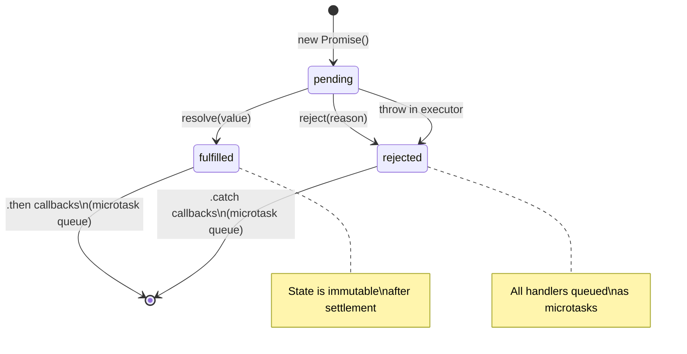
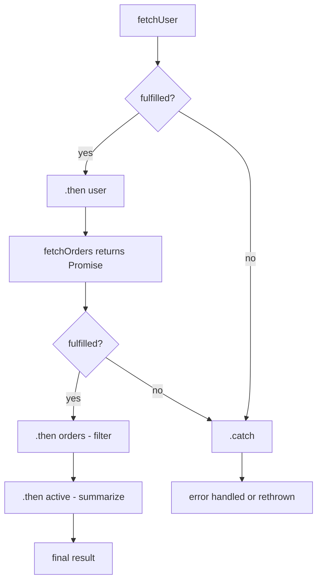

## Keywords in This File

{: .no_toc }

| # | Keyword | Difficulty |
|---|---------|------------|
| 1 | [Promises Basics](#promises-basics) | ★☆☆ |
| 2 | [Promise States and the Microtask Queue](#promise-states-and-the-microtask-queue) | ★☆☆ |
| 3 | [Promise Chaining](#promise-chaining) | ★☆☆ |

---

# Promises Basics

---

### 🎯 Model Answer

**30 seconds:**
> A Promise is an object representing the eventual result of an
> asynchronous operation. It can be in one of three states:
> pending (operation in progress), fulfilled (operation
> succeeded with a value), or rejected (operation failed with
> a reason). Promises provide a standardized way to attach
> callbacks to async results and propagate errors through
> chains.

**3 minutes:**
> Before Promises, async code used error-first callbacks.
> The problems: error handling was manual and inconsistent,
> composing multiple async operations required nesting, and
> there was no standard way to represent "a future value."
>
> A Promise solves this by wrapping an async operation in
> an object with a known state machine. You create a Promise
> with an executor function that receives `resolve` and `reject`
> callbacks. When the operation completes, you call `resolve(value)`.
> When it fails, you call `reject(error)`.
>
> You attach callbacks to the result with `.then(onFulfilled, onRejected)`
> or `.catch(onRejected)`. These callbacks are added to the
> microtask queue when the Promise settles. Multiple callbacks
> can be attached to the same Promise, and they all fire.
>
> Key guarantees: `.then()` callbacks are always called
> asynchronously (even if the Promise is already resolved).
> A Promise settles only once (calling `resolve` multiple times
> has no effect). Errors automatically propagate through chains
> to the first `.catch()`.

**Blank Mind Recovery:**

**(1) Restate:** "A Promise represents an async operation's
eventual result. Three states: pending, fulfilled, rejected."

**(2) First principles:** "An async operation finishes later.
You need a way to attach 'what to do when done.' A Promise
is that container. You attach behavior before the operation
finishes and it fires when the operation completes."

---

### 📘 Concept Explanation

**What it is:**
A Promise is a standard object representing the eventual
completion or failure of an asynchronous operation. It is
a specification (Promises/A+) implemented natively in ES6.

**The problem it solves:**
Callback hell: nested callbacks with manual error handling.
Promises flatten the nesting and standardize error propagation.

**How it works:**

```javascript
// Promise anatomy
const p = new Promise((resolve, reject) => {
  // Executor runs synchronously
  setTimeout(() => {
    if (Math.random() > 0.5) {
      resolve('success'); // fulfill with value
    } else {
      reject(new Error('failed')); // reject with reason
    }
  }, 100);
});

// Attach handlers
p.then(
  value => console.log('Fulfilled:', value),
  reason => console.log('Rejected:', reason)
);

// Equivalent with .catch
p.then(value => console.log('Fulfilled:', value))
  .catch(reason => console.log('Rejected:', reason));
```

**The key insight:**
A Promise is a value-over-time abstraction. Once created,
it will eventually settle (fulfill or reject) and all
attached `.then` callbacks will fire. The key behavioral
guarantee: handlers are always called asynchronously - they
run as microtasks, never synchronously within the constructor.

**When to use it:**
Any async operation that produces a single future value:
HTTP requests, file I/O, database queries, timers. Also
as a building block for async/await.

**When NOT to use it:**
Multiple values over time (use Observables/streams). Fire-
and-forget operations where you do not need the result
(though you should still `.catch` for error handling).

**Alternatives:**
- Callbacks: lower-level, more control, less composable
- Observables (RxJS): multi-value streams, cancellable,
  more powerful at the cost of complexity
- Async/await: syntactic sugar over Promises

**First-principles derivation:**
An async operation finishes at an unknown future time.
You need to attach behavior that runs when it finishes.
A container (Promise) that holds the operation's state and
a list of callbacks to invoke on state change is the minimal
solution.

---

### 💻 Code Example

```javascript
// BAD: Manual callback with no standardization
function fetchUser(id, onSuccess, onError) {
  setTimeout(() => {
    if (id > 0) {
      onSuccess({ id, name: 'Alice' });
    } else {
      onError(new Error('Invalid id'));
    }
  }, 50);
}
// Caller must know the callback convention:
fetchUser(1,
  user => processUser(user),
  err => handleError(err)
);
```

> **Code walkthrough:** Error-first callbacks require callers
> to know the convention. Each caller must provide both
> callbacks. There is no standard chaining mechanism.
> If `processUser` is also async, you get nested callbacks.

```javascript
// GOOD: Promise-based with standard API
function fetchUser(id) {
  return new Promise((resolve, reject) => {
    setTimeout(() => {
      if (id > 0) {
        resolve({ id, name: 'Alice' });
      } else {
        reject(new Error('Invalid id'));
      }
    }, 50);
  });
}

// Standard chaining and error handling:
fetchUser(1)
  .then(user => {
    console.log('User:', user.name);
    return processUser(user); // returns Promise
  })
  .then(result => console.log('Result:', result))
  .catch(err => console.error('Error:', err.message))
  .finally(() => console.log('Done'));

// Async/await style (same Promise underneath):
async function handler() {
  try {
    const user = await fetchUser(1);
    const result = await processUser(user);
    return result;
  } catch (err) {
    console.error('Error:', err.message);
  }
}
```

> **Code walkthrough:** The Promise-based version returns a
> standardized object. Callers chain with `.then()`, which
> returns a new Promise enabling further chaining. Errors
> automatically propagate to `.catch()` without manual
> `if (err)` checks. `.finally()` runs cleanup regardless
> of success or failure. The async/await equivalent in the
> same code block shows that both forms are interchangeable.

---

### 🎓 Answers by Seniority

**Junior / Mid (0-5 years):**
> "A Promise is an object that represents a future value.
> You create it with a function that gets `resolve` and
> `reject`. When the async work is done, you call `resolve(value)`
> or `reject(error)`. Then you use `.then()` to handle the
> result and `.catch()` to handle errors."

*Push deeper:* "What are the three states of a Promise?
Pending (not done), fulfilled (succeeded), rejected (failed).
Once a Promise is fulfilled or rejected, it cannot change
state."

---

**Senior / Staff (5+ years):**
> "Promises are the foundation of all modern JavaScript async
> code. The critical implementation details: executor runs
> synchronously; `.then` handlers run as microtasks; Promise
> state is immutable once settled; multiple `.then` handlers
> on the same Promise all fire independently.
>
> The common production issues: unhandled rejections, forgetting
> to `return` Promises in `.then` chains (breaking chaining),
> and creating Promises with no settlement path (a Promise
> that never resolves, causing memory leaks)."

---

### ⚠️ Common Misconceptions

**Misconception 1:** "Promises run in parallel."
Creating multiple Promises does not automatically run them
in parallel. Each Promise executor runs synchronously when
`new Promise()` is called. Parallelism in Promise execution
refers to the underlying async operations running concurrently
in the runtime - not JavaScript code.

**Misconception 2:** "Calling `resolve` synchronously means
`.then` callbacks run synchronously."
`.then` callbacks are always asynchronous. Even if a Promise
is already resolved when `.then` is called, the callback is
added to the microtask queue and runs on the next microtask
checkpoint.

**Misconception 3:** "A Promise always has to wrap async code."
You can resolve a Promise synchronously inside the executor.
`Promise.resolve(value)` is shorthand for an immediately-
resolved Promise. This is useful for consistent interfaces.

---

### 🚨 Failure Modes and Diagnosis

**Failure 1: Promise that never settles (memory leak)**
```javascript
// BAD: executor never calls resolve or reject
function buggyFetch(url) {
  return new Promise((resolve, reject) => {
    fetch(url).then(r => r.json()).then(data => {
      if (data.ok) resolve(data);
      // BUG: never rejects if !data.ok
      // Promise is pending forever, caller awaits forever
    });
  });
}
```
Diagnosis: identify awaits that never complete; heap profiling
shows accumulating Promise objects. Fix: always call reject
in the failure path.

**Failure 2: Swallowed errors - empty `.catch`**
```javascript
// BAD: catch swallows the error with no logging
doOperation().catch(() => {}); // silent failure

// GOOD: at minimum log, then decide to re-throw or handle
doOperation().catch(err => {
  logger.error('doOperation failed:', err);
  throw err; // re-throw if caller needs to know
});
```

---

### 🎯 Interview Deep-Dive

| Category | Count | Coverage |
|---|---|---|
| Conceptual | 2 | Promise states, async callbacks |
| Trade-off | 1 | Promise vs callback |
| Failure Mode | 1 | Never-settling Promise |
| Debugging | 1 | Unhandled rejection tracking |
| Design | 1 | Promise.resolve for sync values |
| Trap | 1 | Sync executor, async handler |

**Q1. What are the three states of a Promise and what are
the valid state transitions?**

States: pending (initial), fulfilled (resolved with value),
rejected (resolved with error). Transitions:
- pending -> fulfilled: via `resolve(value)`
- pending -> rejected: via `reject(reason)` or an unhandled
  throw inside the executor
- No transitions from fulfilled or rejected (terminal states)

Once settled, the Promise's state and value are immutable.
Calling `resolve` or `reject` again has no effect. This
immutability guarantee means you can safely share a Promise
reference - no one can re-settle it.

*What separates good from great:* Knowing that executor
errors (throws) automatically reject the Promise, even
if you never explicitly call `reject`. This means sync
errors in the executor are caught safely.

---

**Q2. Why are `.then` callbacks always async, even when
the Promise is already resolved?**

The Promises/A+ specification requires that `.then` callbacks
are never called synchronously within the current execution
frame. This ensures consistent behavior regardless of whether
the Promise resolved before or after `.then` was attached.

Without this guarantee, code like:
```javascript
let called = false;
Promise.resolve().then(() => { called = true; });
console.log(called); // would be true if handlers were sync
```
would have unpredictable behavior depending on when the Promise
resolved. With the guarantee, `called` is always `false` at
this point because `.then` handlers are microtask-queued.

The practical benefit: you can reason about the execution
order of `.then` handlers without knowing when the Promise
was created or resolved.

*What separates good from great:* Understanding that this
is a specification-level guarantee, not an implementation
choice. It exists specifically to eliminate a class of
timing-dependent bugs.

---

**Q3. What happens when you throw inside a Promise executor
vs inside a `.then` callback?**

Inside executor: the Promise is automatically rejected with
the thrown error. No `try/catch` required.

Inside `.then` callback: the returned Promise (that `.then`
creates) is rejected with the thrown error. This rejection
propagates to the next `.catch` in the chain.

Inside `.catch` callback: if you throw, the returned Promise
is rejected again - you can rethrow or throw a different error.

This automatic error propagation is one of Promises' key
advantages over callbacks: errors do not need to be manually
forwarded.

*What separates good from great:* Knowing that `.then`
always returns a new Promise, and errors inside `.then`
callbacks reject that new Promise. This is what makes
`.catch()` at the end of a chain catch all errors from
all `.then` steps.

---

**Q4. What is `Promise.resolve(value)` and when is it useful?**

`Promise.resolve(value)` creates an already-fulfilled Promise
with the given value. If `value` is already a Promise (or
thenable), it returns that Promise (or wraps it).

Use cases:
1. Normalizing sync and async return values:
   ```javascript
   function maybeAsync(x) {
     if (cache.has(x)) return Promise.resolve(cache.get(x));
     return fetch(x).then(r => r.json());
   }
   // Callers always get a Promise regardless of cache hit
   ```
2. Starting a Promise chain: `Promise.resolve().then(step1).then(step2)`
3. Testing: create immediately-resolved Promises for sync test execution.

`Promise.reject(reason)` creates an already-rejected Promise.

*What separates good from great:* Knowing that `Promise.resolve(thenable)`
wraps the thenable in a Promise rather than returning it directly - this
is the "assimilation" behavior that allows integration with third-party
Promise libraries.

---

**Q5. How do you create a Promise that can be resolved or
rejected from outside the executor?**

The "deferred" pattern: expose the `resolve` and `reject`
functions outside the Promise constructor.

```javascript
function createDeferred() {
  let resolve, reject;
  const promise = new Promise((res, rej) => {
    resolve = res;
    reject = rej;
  });
  return { promise, resolve, reject };
}

// Usage: link an imperative event to a Promise
const { promise, resolve } = createDeferred();

someEventEmitter.once('done', data => resolve(data));

const result = await promise; // waits for the event
```

When to use: bridging event-emitter APIs with Promise-based
code; implementing timeouts that can be cancelled from outside;
signaling between components.

*What separates good from great:* Knowing this pattern exists
and why it is sometimes necessary, while also knowing that it
is often a code smell - if you find yourself using deferreds
frequently, you may be wrapping an API that should be
redesigned to return Promises directly.

---

**Q6. What is the difference between `.then(null, onRejected)`
and `.catch(onRejected)`?**

They are equivalent for simple chains. `.catch(fn)` is
syntactic sugar for `.then(null, fn)`.

The subtle difference: in a `.then(onFulfilled, onRejected)`,
the `onRejected` does not catch errors thrown by `onFulfilled`
in the same `.then` call - the two handlers are mutually
exclusive. A `.catch` after a `.then` catches errors from
both the previous `.then`'s fulfillment handler AND the
preceding chain.

```javascript
// Different error handling scope
promise
  .then(
    value => riskyTransform(value), // if this throws...
    err => handle(err) // ...this does NOT catch it
  );

// vs
promise
  .then(value => riskyTransform(value))
  .catch(err => handle(err)); // catches riskyTransform errors
```

*What separates good from great:* Knowing this asymmetry and
preferring `.catch()` at the end of chains over dual-argument
`.then()` for error handling - because `.catch()` catches
errors from all previous steps.

---

**Q7. How does `Promise.finally` behave differently from
adding a `.then` after `.catch`?**

`.finally(fn)` runs `fn` regardless of fulfillment or rejection,
and passes through the original value or rejection unchanged.
`fn` receives no arguments (it does not know the value).

Key difference from `.then(fn, fn)`:
- `.finally` does not transform the chain's value
- If `fn` returns a non-Promise (or undefined), the original
  value/rejection is passed through
- If `fn` throws or returns a rejected Promise, that rejection
  replaces the original

Common use: cleanup code that must run regardless of outcome
(closing connections, removing loading spinners, resetting flags).

```javascript
db.connect()
  .then(conn => {
    return conn.query('SELECT ...');
    // BUG: what if query throws? conn never closes
  })
  .catch(err => logger.error(err))
  .finally(() => conn.close()); // always close
  // Wait - conn is not in scope here! Fix: use a variable
```

*What separates good from great:* Knowing that `.finally`
passes through values (unlike `.then(() => someValue)` which
would replace the chain value). And recognizing the scoping
issue in the example above - `conn` must be in scope for
`.finally` to close it.

### ⚖️ Comparison Table

*(Omit: ★☆☆ - covered in Async JavaScript - L2 Advanced Promises.md)*

### 🏛️ System Design

*(Omit: ★☆☆ - not applicable)*

### 📊 Diagram

*(Omit: diagram covered in keyword 2 - Promise States)*

---

---

# Promise States and the Microtask Queue

---

### 🎯 Model Answer

**30 seconds:**
> A Promise has three states: pending, fulfilled, rejected.
> When a Promise settles (fulfills or rejects), its `.then`
> or `.catch` callbacks are scheduled as microtasks. The
> microtask queue is drained completely before any macrotask
> (setTimeout, I/O callback) runs. This means Promise handlers
> always run before `setTimeout` callbacks, even `setTimeout(fn, 0)`.

**3 minutes:**
> The state machine is deterministic: a new Promise starts
> as pending. When `resolve(value)` is called, it transitions
> to fulfilled and stores the value. When `reject(reason)` is
> called, it transitions to rejected and stores the reason.
> These transitions are permanent: no further state changes.
>
> Once settled, all registered `.then`/`.catch` callbacks are
> queued as microtasks. If a `.then` is registered after the
> Promise is already settled, the callback is immediately
> queued as a microtask.
>
> The microtask queue is the highest-priority queue in the
> event loop. After any macrotask completes (including the
> current synchronous code), the microtask queue is fully
> drained before rendering or the next macrotask.
>
> Implication: a deep chain of `.then` handlers completes
> entirely before any `setTimeout` callback fires. This
> gives Promise chains a form of atomicity relative to the
> task scheduler: the entire chain runs as a contiguous unit
> from the perspective of the task queue.

**Blank Mind Recovery:**

**(1) Restate:** "Three states: pending, fulfilled, rejected.
Settled callbacks go into the microtask queue. Microtasks run
before macrotasks."

**(2) First principles:** "Promise handlers need to run
'as soon as possible' but not synchronously within the resolve
call. The microtask queue is the correct mechanism: after the
current code finishes, before yielding to the task scheduler."

---

### 📘 Concept Explanation

**What it is:**
Promise states define the lifecycle of an async operation.
The microtask queue is the scheduling mechanism for Promise
handler callbacks, providing higher-priority execution than
macrotasks.

**The problem it solves:**
Predictable execution ordering for async code: you can know
when a Promise handler will run relative to other code.

**How it works:**

```
PROMISE STATE MACHINE
======================

new Promise()
      |
      v
  [pending]
      |
      +--resolve(v)--> [fulfilled] value: v
      |                     |
      +--reject(e)---> [rejected]  reason: e
                            |
                       Both settled states:
                       - immutable
                       - trigger microtask queue
                         for registered handlers

MICROTASK QUEUE INTERACTION
============================

Promise.resolve('a')         // fulfilled immediately
  .then(v => {               // queued as microtask
    console.log(v);          // runs: 'a'
    return 'b';              // return value -> next then
  })
  .then(v => console.log(v)) // queued after prev resolves

// Execution:
// 1. Sync code runs
// 2. Microtask queue drains (all .then callbacks)
// 3. Only then: macrotasks (setTimeout etc)
```

**The key insight:**
Promise state is observable but not writable after settlement.
You cannot inspect a Promise's current state directly in
standard JavaScript (`.status` does not exist). You can only
react to state changes by attaching handlers. This is by
design: it forces you to write reactive code rather than
polling for state.

**When to use it:**
Understanding Promise states is fundamental for debugging
Promise chains, explaining execution order, and understanding
`async/await` desugaring.

**When NOT to use it:**
You rarely need to reason about Promise states explicitly
in application code - the `.then/.catch` API abstracts the
state machine. State matters in advanced scenarios: checking
if a Promise has settled, testing, or implementing Promise-
like utilities.

**Alternatives:**
Native Promise states vs third-party libraries (bluebird) that
add `.isPending()`, `.isFulfilled()` methods for inspecting
state. These methods are not in the spec but exist in libraries.

**First-principles derivation:**
An async operation has exactly one outcome: it either succeeds
with a value or fails with a reason. A three-state machine
(pending, fulfilled, rejected) is the minimal model for
this: pending before the outcome is known, fulfilled/rejected
after. Immutability of the settled state prevents double-
resolution bugs.

---

### 💻 Code Example

```javascript
// Demonstrating state transitions and microtask ordering
console.log('1: sync start');

const p = new Promise(resolve => {
  console.log('2: executor (sync)');
  resolve('resolved');
  console.log('3: after resolve (still sync)');
});

p.then(val => console.log('5: microtask:', val));

console.log('4: sync end');

// OUTPUT:
// 1: sync start
// 2: executor (sync)
// 3: after resolve (still sync)
// 4: sync end
// 5: microtask: resolved
```

> **Code walkthrough:** The executor runs synchronously (2, 3).
> `resolve('resolved')` changes state to fulfilled but does
> NOT immediately run the `.then` callback - it queues it as
> a microtask. The synchronous code continues (4). Only after
> all synchronous code completes does the microtask queue drain,
> running the `.then` callback (5). The ordering (2, 3, 4, 5)
> not (2, 5, 3, 4) is guaranteed by the spec.

```javascript
// FAILURE EXAMPLE: Depending on sync-like Promise behavior
// BAD: assumes Promise.resolve().then runs before next line
let shared = 0;

Promise.resolve().then(() => { shared = 1; });
// BAD: shared is still 0 here, not 1
// The .then callback hasn't run yet
console.log(shared); // 0

// GOOD: access shared state inside the chain
Promise.resolve()
  .then(() => { shared = 1; })
  .then(() => {
    console.log(shared); // 1 - guaranteed
  });
```

> **Code walkthrough:** The BAD pattern assumes Promise callbacks
> run synchronously within the current frame. They do not.
> `console.log(shared)` runs before the `.then` callback even
> though `Promise.resolve()` is already fulfilled. The GOOD
> pattern accesses `shared` inside the chain where the ordering
> is guaranteed.

---

### 🎓 Answers by Seniority

**Junior / Mid (0-5 years):**
> "A Promise starts as pending. When the async work succeeds,
> it becomes fulfilled. When it fails, it becomes rejected.
> The `.then` and `.catch` handlers run as microtasks after
> the current code finishes."

*Push deeper:* "Can you change a fulfilled Promise back to
pending? No - Promise state is immutable once settled."

---

**Senior / Staff (5+ years):**
> "The microtask queue position of Promise handlers is an
> implementation contract, not an implementation detail.
> Production code should never depend on relative timing of
> Promise handlers vs specific setTimeout callbacks - that
> is fragile. Instead, structure code so ordering dependencies
> are explicit through the chain."

*Push deeper:* "Node.js has `process.nextTick` which runs
before Promise microtasks. This is a historical artifact.
Prefer `queueMicrotask` for new code where you need microtask
scheduling without the `nextTick` priority quirk."

---

### ⚠️ Common Misconceptions

**Misconception 1:** "You can check if a Promise is resolved
with `promise.status`."
Standard Promises do not expose a `.status` property. You
can only react to state changes via `.then/.catch`. Libraries
like bluebird add inspection methods; the native Promise API
does not include them.

**Misconception 2:** "Calling `resolve` twice is harmless."
It is harmless (second call is silently ignored) but indicates
a logic error in the executor - multiple resolution paths
often signal a bug in the async control flow.

**Misconception 3:** "Microtasks and macrotasks are the
same as microtasks and tasks in the spec."
The terms are equivalent: microtask = microtask queue entry
(Promise handlers, queueMicrotask); macrotask = task queue
entry (setTimeout, setInterval, I/O). The naming variation
is historical.

---

### 🚨 Failure Modes and Diagnosis

**Failure 1: Infinite microtask recursion**
```javascript
// This starves the event loop - no tasks ever run
function recursive() {
  return Promise.resolve().then(recursive);
}
recursive(); // Never returns, blocks all tasks
```
Diagnosis: setTimeout callbacks stop firing; event emitters
are silent; CPU at 100%. Fix: add task boundaries (`setImmediate`)
between recursive async operations.

**Failure 2: State inspection using non-standard methods**
```javascript
// Only works in Node.js REPL - not reliable in production
const { inspect } = require('util');
const state = inspect(somePromise);
// Fragile: relies on internal formatting, not spec
```
Better approach: use `Promise.race` with a dummy resolved
Promise to check if a Promise is already settled.

---

### 🎯 Interview Deep-Dive

| Category | Count | Coverage |
|---|---|---|
| Conceptual | 2 | State machine, microtask queue |
| Trade-off | 1 | Microtask vs macrotask priority |
| Failure Mode | 1 | Microtask starvation |
| Debugging | 1 | Execution order prediction |
| Design | 1 | nextTick vs microtask |
| Trap | 1 | Double resolve |

**Q1. Explain the Promise state machine. What transitions
are valid and which are impossible?**

Three states: pending, fulfilled, rejected. Valid transitions:
- pending -> fulfilled (via `resolve(value)`)
- pending -> rejected (via `reject(reason)` or executor throw)

Impossible transitions:
- fulfilled -> rejected (settled states are terminal)
- rejected -> fulfilled
- Any state -> pending

Once a Promise settles, its state and value/reason are permanent.
This immutability is a correctness guarantee: if you share a
Promise reference, no code can un-resolve or re-reject it.

The practical consequence: `resolve` and `reject` are "first
wins" operations. If you call `resolve(a)` and then `resolve(b)`,
`a` is the fulfilled value and `b` is silently ignored.

*What separates good from great:* Understanding WHY immutability
is a guarantee, not just THAT it is. It prevents a class of
race condition where two async operations both try to resolve
the same Promise.

---

**Q2. What is the difference between Promise microtasks and
macrotasks in terms of event loop execution order?**

Microtasks (Promise `.then`, `queueMicrotask`): scheduled
on the microtask queue. Entire queue is drained before the
event loop moves to the next macrotask or rendering.

Macrotasks (setTimeout, setInterval, I/O): scheduled on
the task queue. Event loop processes one task per iteration.

Order per event loop iteration:
1. Execute one macrotask (or current call stack)
2. Drain entire microtask queue (all pending microtasks)
3. Render if needed (browser)
4. Take next macrotask

Effect on Promises: a chain of `.then` callbacks resolves
completely before any setTimeout fires. This is observable
and predictable.

*What separates good from great:* Explaining WHY this design
decision was made: Promise chains should execute atomically
relative to task scheduling. If a setTimeout could interrupt
a Promise chain, reasoning about state consistency would be
much harder.

---

**Q3. How does Promise rejection propagation work in a chain?**

When a Promise rejects, the rejection skips all `.then(onFulfilled)`
handlers in the chain until it finds a `.catch` or a
`.then(null, onRejected)`. Each skipped `.then` creates a
new rejected Promise, propagating the original rejection reason.

```javascript
Promise.reject(new Error('original'))
  .then(v => v * 2)         // skipped (rejected input)
  .then(v => v + 1)         // skipped (still rejected)
  .catch(err => {
    console.log(err.message); // 'original' - unchanged
    return 'recovered';
  })
  .then(v => console.log(v)); // 'recovered' (fulfilled)
```

A `.catch` that returns a value (or returns a fulfilled Promise)
converts the chain back to fulfilled. If `.catch` throws or
returns a rejected Promise, the chain remains rejected.

*What separates good from great:* Understanding that rejection
propagation is a first-class behavior, not special-case code.
The chain alternates between fulfilled and rejected states
based on what each handler returns or throws.

---

**Q4. What is `Promise.resolve` behavior when passed a thenable?**

`Promise.resolve(value)`: if `value` is a native Promise,
returns it directly (same object). If `value` is a thenable
(has a `.then` method), wraps it in a Promise that follows
the thenable. If `value` is a plain value, returns an
immediately-fulfilled Promise.

```javascript
// Thenable assimilation
const fakePromise = {
  then(onFulfilled) {
    onFulfilled(42);
  }
};

const p = Promise.resolve(fakePromise);
// p is a native Promise that resolves with 42
p.then(v => console.log(v)); // 42
```

This assimilation enables interoperability between Promise
libraries (bluebird, Q) and native Promises. You can pass
a bluebird Promise to `Promise.resolve` and get a native
Promise.

*What separates good from great:* Knowing this matters for
library authors who need to handle third-party thenables.
Application code rarely needs it, but understanding the
behavior prevents surprise when working with mixed Promise
implementations.

---

**Q5. What does it mean for a Promise to be "settled" vs
"resolved"?**

"Settled" means the Promise has reached a terminal state:
either fulfilled or rejected. A settled Promise will never
change state again.

"Resolved" is subtly different: a Promise is resolved when
it is no longer pending, but it may be resolved to another
Promise (a pending one). A Promise that follows another Promise
is resolved (not pending) but not yet settled.

```javascript
const outer = new Promise(resolve => {
  const inner = new Promise(r => setTimeout(r, 100));
  resolve(inner); // outer is resolved (follows inner)
  // but outer is still PENDING until inner settles
});
// outer is resolved but not yet settled
```

In practice: "settled" is the term that matters for most
use cases. "Resolved" in the sense above is a spec nuance
important for implementing Promise libraries.

*What separates good from great:* This distinction appears
in the Promises/A+ spec and in native Promise implementation
code. Most developers use "resolved" to mean "fulfilled"
colloquially, which is technically imprecise but universally
understood.

---

**Q6. How do you detect and handle unhandled Promise
rejections in a production application?**

Global handlers:

Node.js:
```javascript
process.on('unhandledRejection', (reason, promise) => {
  logger.error('Unhandled rejection:', {
    reason: reason?.message,
    stack: reason?.stack
  });
  // In production: crash with non-zero exit code
  // so the process manager restarts
  process.exit(1);
});
```

Browser:
```javascript
window.addEventListener('unhandledrejection', event => {
  logger.error('Unhandled rejection:', event.reason);
  event.preventDefault(); // suppress default browser error
});
```

Node.js flag: `--unhandled-rejections=throw` crashes on
unhandled rejections (default behavior in Node.js 15+).

Prevention at the source: every Promise chain must end with
`.catch()`. TypeScript strict mode helps: `@typescript-eslint/
no-floating-promises` rule flags Promises that are not
awaited or caught.

*What separates good from great:* Advocating for crashing
on unhandled rejections in production (with process manager
restart) rather than silently logging. Silent failures in
async code are among the hardest bugs to diagnose. A crash
is more visible and recoverable than a silent corruption.

---

**Q7. What happens to Promise handlers attached after the
Promise is already settled?**

They run asynchronously (as microtasks) immediately. Attaching
a handler to an already-settled Promise queues the callback
in the microtask queue.

This is a key guarantee: the behavior of `.then` is the same
regardless of whether the Promise is pending or already settled
when you attach the handler.

```javascript
const p = Promise.resolve(42);
// Promise is already fulfilled here

p.then(v => console.log('late handler:', v));
console.log('after attachment');

// Output:
// after attachment     (sync runs first)
// late handler: 42     (microtask queued and drains)
```

Practical use case: caching resolved Promises - if a module
caches a Promise for a one-time async initialization, any
component that calls `.then()` on it later still gets the
result correctly, whether the initialization is still pending
or already complete.

*What separates good from great:* Recognizing this as the
feature that makes Promise caching work. A resolved Promise
acts like an observable value with guaranteed async delivery
to all future subscribers.

### ⚖️ Comparison Table

*(Omit: ★☆☆ - covered in L2 Advanced Promises)*

### 🏛️ System Design

*(Omit: ★☆☆ - not applicable)*

### 📊 Diagram

```
PROMISE STATE MACHINE
==================================
         new Promise(executor)
                |
           [pending]
           /         \
      resolve(v)    reject(e)
         |               |
    [fulfilled]      [rejected]
      value: v       reason: e
         |               |
    .then callbacks   .catch callbacks
    -> microtask       -> microtask
       queue              queue

MICROTASK vs MACROTASK PRIORITY
==================================
  Sync code
    -> Microtask queue (ALL drained)
       [.then, .catch, queueMicrotask]
    -> Browser render (if due)
    -> ONE task from task queue
       [setTimeout, setInterval, I/O]
    -> repeat
```



> **Diagram walkthrough:** A Promise starts in the pending
> state when created. The executor runs synchronously and
> calls either `resolve` or `reject` (or throws). Once settled,
> state cannot change - fulfilled and rejected are terminal.
> All registered handlers (`.then` for fulfilled, `.catch` for
> rejected) are scheduled as microtasks when the state changes.
> The microtask queue has higher priority than the macrotask
> queue, so Promise handlers always run before setTimeout
> or I/O callbacks.

---

---

# Promise Chaining

---

### 🎯 Model Answer

**30 seconds:**
> Promise chaining works because `.then()` always returns a
> new Promise. If the `.then` callback returns a value, the
> new Promise is fulfilled with that value. If it returns
> another Promise, the new Promise follows that Promise.
> This allows you to sequence async operations in a flat,
> linear chain instead of nested callbacks.

**3 minutes:**
> The key mechanism: every `.then()` call returns a new Promise.
> This new Promise's state depends on what the callback returns:
> - Return a value: new Promise is fulfilled with that value
> - Return a Promise: new Promise follows the returned Promise
> - Throw an error: new Promise is rejected with the error
>
> This means you can chain as many `.then()` calls as needed
> and each step can be either synchronous (return a value) or
> asynchronous (return a Promise). The chain handles both
> the same way.
>
> The most common mistake: forgetting to `return` from a
> `.then` callback when the step is async. If you call an
> async function without returning its Promise, the chain
> continues immediately without waiting for it.
>
> Error handling: a single `.catch()` at the end of a chain
> catches any rejection from any step. You can add intermediate
> `.catch()` calls to recover from specific errors and continue
> the chain.

**Blank Mind Recovery:**

**(1) Restate:** "Promise chaining is possible because `.then()`
returns a new Promise. The chain continues based on what
each handler returns."

**(2) First principles:** "Composing async operations requires
a way to say: 'when this finishes, start that.' `.then()`
returning a Promise is the mechanism: each step produces
the input for the next."

---

### 📘 Concept Explanation

**What it is:**
Promise chaining is the technique of sequencing async operations
by returning Promises from `.then()` callbacks. Each `.then()`
creates a new Promise that follows the previous, forming a
pipeline.

**The problem it solves:**
Nested callbacks for sequential async operations. Chaining
keeps the code flat regardless of how many sequential
async steps are needed.

**How it works:**

```javascript
// Chain anatomy
fetchUser(id)                    // Promise<User>
  .then(user => {
    return fetchOrders(user.id); // return Promise<Order[]>
    // ^ MUST return to chain continues with Orders
    // without return: chain continues with undefined
  })
  .then(orders => {
    return orders.filter(o => o.active); // return value
    // ^ synchronous transform: new Promise<Order[]>
  })
  .then(activeOrders => {
    processOrders(activeOrders); // no return
    // ^ chain continues with undefined (fulfilled)
  })
  .catch(err => {
    // Catches any rejection from ANY step above
    logError(err);
    // Return value to recover: chain continues as fulfilled
    return [];
  });
```

**The key insight:**
The `return` in a `.then` callback is critical. Without
`return`, the chain receives `undefined` as the value and
does not wait for the Promise you started. This is the most
common chaining bug.

**When to use it:**
Sequential async operations where each step depends on the
previous result. Building async pipelines with transformation
steps.

**When NOT to use it:**
When operations are independent: use `Promise.all` for
parallel execution. When you need multi-value streams: use
Observables.

**Alternatives:**
- Async/await: more readable for sequential chains
- `Promise.all` / `Promise.allSettled`: parallel operations

**First-principles derivation:**
Composing functions `f ∘ g ∘ h` produces a pipeline. Promise
chaining is this composition for async functions. `.then(f)`
transforms the Promise's value using `f`, just as `f(value)`
transforms a sync value. The key is that `f` can itself return
a Promise, enabling async composition.

---

### 💻 Code Example

```javascript
// BAD: Missing return - chain broken
function brokenChain(userId) {
  return fetchUser(userId)
    .then(user => {
      fetchOrders(user.id); // no return!
      // Chain continues immediately with undefined
      // fetchOrders runs but chain doesn't wait for it
    })
    .then(orders => {
      // orders is undefined, not the order list
      console.log(orders.length); // TypeError!
    });
}
```

> **Code walkthrough:** Without `return`, `fetchOrders` is
> called but its Promise is not connected to the chain. The
> next `.then` receives `undefined` as its value, causing a
> TypeError when trying to access `.length`. The order fetch
> still runs in the background as a fire-and-forget, but any
> error it throws becomes an unhandled rejection.

```javascript
// GOOD: Properly chained with returns
function fetchUserWithOrders(userId) {
  return fetchUser(userId)
    .then(user => {
      return fetchOrders(user.id); // RETURN Promise
    })
    .then(orders => {
      return orders.filter(o => o.status === 'active');
      // sync transform - value returned
    })
    .then(activeOrders => {
      return {
        count: activeOrders.length,
        total: activeOrders.reduce((sum, o) => sum + o.amount, 0)
      };
    })
    .catch(err => {
      // Recovery: return empty result instead of propagating
      if (err.code === 'USER_NOT_FOUND') {
        return { count: 0, total: 0 };
      }
      throw err; // Re-throw unexpected errors
    });
}

// async/await equivalent (same behavior):
async function fetchUserWithOrdersAsync(userId) {
  const user = await fetchUser(userId);
  const orders = await fetchOrders(user.id);
  const active = orders.filter(o => o.status === 'active');
  return {
    count: active.length,
    total: active.reduce((sum, o) => sum + o.amount, 0)
  };
}
```

> **Code walkthrough:** Every async step returns its Promise,
> threading the chain correctly. Synchronous transforms (the
> filter and reduce) return plain values, which are automatically
> wrapped in fulfilled Promises. The `.catch` handles a specific
> error by recovering with an empty result, then re-throws
> unexpected errors to let the caller handle them. The async/await
> equivalent at the bottom is the same logic with different syntax.

---

### 🎓 Answers by Seniority

**Junior / Mid (0-5 years):**
> "`.then()` returns a new Promise. What you return from the
> callback becomes the value of that new Promise. If you return
> another Promise, the chain waits for it. Always remember to
> `return` from `.then` callbacks."

---

**Senior / Staff (5+ years):**
> "Promise chaining is compositional function application for
> async code. The pattern I enforce in code review: explicit
> returns in every `.then` callback; never mix `async/await`
> and `.then` chains on the same Promise without a clear reason;
> and `.catch` at the end of every chain that starts from user
> input or external I/O."

---

### ⚠️ Common Misconceptions

**Misconception 1:** "`.then` modifies the original Promise."
`.then` creates a new Promise. The original Promise is
unchanged. This means you can call `.then` multiple times
on the same Promise and each gets the same fulfilled value
independently.

**Misconception 2:** "A `.catch` must be the last step."
`.catch` can be anywhere in a chain. A `.catch` that returns
a value converts the chain back to fulfilled, allowing the
chain to continue. This is useful for partial error recovery.

**Misconception 3:** "Chaining and nesting are equivalent."
```javascript
// NESTING (BAD):
fetchA().then(a =>
  fetchB(a).then(b =>
    fetchC(b).then(c => combine(a, b, c))
  )
)
// All three steps nested - a, b, c in scope but ugly

// CHAINING (BETTER):
fetchA()
  .then(a => Promise.all([a, fetchB(a)]))
  .then(([a, b]) => Promise.all([a, b, fetchC(b)]))
  .then(([a, b, c]) => combine(a, b, c))
```

---

### 🚨 Failure Modes and Diagnosis

**Failure 1: The forgotten `return` bug**
Most common chaining bug. Diagnostic: if a `.then` callback
receives `undefined` when you expected a value, trace back
to find the `.then` that forgot to `return`.

```javascript
// Diagnosis: add explicit type annotation in TypeScript
// The compiler will warn about missing returns
fetchUser(id)
  .then((user): Promise<Order[]> => {
    fetchOrders(user.id); // TypeScript error: missing return
    return fetchOrders(user.id); // fix
  })
```

**Failure 2: Mixing `.then` and `await` confusingly**
```javascript
// BAD: confusing mix - unclear error handling
async function mixed(id) {
  const user = await fetchUser(id)
    .then(u => normalize(u)); // .then on an awaited Promise
  // If normalize throws, is it caught by try/catch?
  // Yes, but the code is confusing
}

// GOOD: choose one style per async operation
async function clear(id) {
  const rawUser = await fetchUser(id);
  const user = normalize(rawUser); // sync call
  return user;
}
```

---

### 🎯 Interview Deep-Dive

| Category | Count | Coverage |
|---|---|---|
| Conceptual | 2 | .then returns new Promise, chaining mechanics |
| Trade-off | 1 | Chaining vs async/await |
| Failure Mode | 1 | Missing return |
| Debugging | 1 | Diagnosing chain breaks |
| Design | 1 | Error recovery in chains |
| Trap | 1 | Nested vs chained |

**Q1. What does `.then()` return and how does it enable
chaining?**

`.then(onFulfilled)` returns a new Promise. The value of
this new Promise is determined by what `onFulfilled` returns:
- Returns a value: new Promise is fulfilled with that value
- Returns a Promise: new Promise follows (adopts the state of)
  the returned Promise
- Throws: new Promise is rejected with the thrown error
- Returns nothing (undefined): new Promise is fulfilled with
  undefined

This return value mechanism is what makes chaining possible.
Each `.then` creates a new Promise in the chain; the result
of each step becomes the input of the next.

*What separates good from great:* Being able to trace a chain
step by step and predict the exact value at each point.

---

**Q2. How does error propagation work in a long chain?**

When any Promise in a chain rejects, the rejection propagates
forward through the chain, skipping all `.then(onFulfilled)`
handlers, until it reaches a `.catch` or a `.then(null, onRejected)`.
At that point, if the handler:
- Returns a value: chain resumes as fulfilled with that value
- Throws or returns rejected Promise: chain continues as rejected

```javascript
Promise.reject(new Error('step 1 failed'))
  .then(() => console.log('skipped 2'))  // skipped
  .then(() => console.log('skipped 3'))  // skipped
  .catch(err => {
    console.log('caught:', err.message); // 'step 1 failed'
    return 'recovered';                  // resume fulfilled
  })
  .then(v => console.log('continued:', v)); // 'recovered'
```

*What separates good from great:* Knowing that the error
propagation is what makes a single `.catch` at the end of
a chain sufficient for most use cases.

---

**Q3. What is the difference between `catch(fn)` in the
middle vs at the end of a chain?**

`.catch(fn)` in the middle acts as error recovery: if `fn`
returns a value (or fulfilled Promise), the chain continues
as fulfilled. Subsequent `.then` handlers run as if no error
occurred.

`.catch(fn)` at the end is a terminal handler: its return
value is usually ignored by the caller (unless the caller
chains on it). It is typically used for logging and cleanup.

```javascript
// Middle catch: recovery
fetchPrimary(id)
  .catch(err => {
    logger.warn('Primary failed, trying backup');
    return fetchBackup(id); // recover with backup
  })
  .then(data => process(data)) // runs with primary or backup

// End catch: terminal error handling
startProcess()
  .then(result => saveResult(result))
  .catch(err => {
    logger.error('Process failed:', err);
    notifyOps(err);
    // No return needed - nothing chains on this
  });
```

*What separates good from great:* Understanding that recovery
via middle `.catch` is a powerful pattern for resilience:
try primary, fall back to secondary, continue as if nothing
happened.

---

**Q4. What are the risks of extremely long Promise chains?**

Performance: each `.then` creates a new Promise object and
a microtask. For very long chains (100+ steps), the allocation
overhead is measurable. In tight loops this matters; for
typical 3-10 step chains it does not.

Stack traces: in older V8 versions, long chains produced
deeply nested stack traces that were hard to read. V8's async
stack trace implementation (enabled by default) improves this
but adds overhead. In production, disable async stacks: `--no-
enable-async-stack-traces` for maximum performance.

Debugging: long chains are harder to debug than equivalent
async/await code because the control flow is less visible.
Async/await produces cleaner stack traces and is easier to
step through in a debugger.

Recommendation: prefer async/await for chains longer than
3-4 steps. Chains are appropriate for functional pipelines
where composability is important.

*What separates good from great:* Knowing the concrete
performance trade-off (allocation cost per `.then`) rather
than just "it's slower."

---

**Q5. How do you share intermediate values across multiple
chain steps?**

Problem: step 3 needs the value from step 1, but step 2's
return value replaces step 1's value in the chain.

Solutions:

1. Nesting (trades readability for scope access):
```javascript
fetchUser(id).then(user =>
  fetchOrders(user.id).then(orders => ({ user, orders }))
)
```

2. `Promise.all` accumulation:
```javascript
fetchUser(id)
  .then(user => Promise.all([user, fetchOrders(user.id)]))
  .then(([user, orders]) => process(user, orders))
```

3. Async/await (best readability):
```javascript
async function fn(id) {
  const user = await fetchUser(id);
  const orders = await fetchOrders(user.id);
  return process(user, orders);
}
```

*What separates good from great:* Recognizing this as a
structural limitation of `.then` chaining and knowing the
idiomatic solutions. In practice: use async/await when
intermediate values need to be shared.

---

**Q6. How does a `.then` handle a synchronous throw vs
returning a rejected Promise?**

Both result in the `.then`'s returned Promise being rejected:
- Synchronous throw: caught by the Promise machinery, new
  Promise is rejected with the thrown error
- Return `Promise.reject(err)`: new Promise follows the
  rejected Promise, which means it is also rejected with `err`

They are functionally equivalent in the chain. The difference:
- Synchronous throw: happens in the current microtask
- Return rejected Promise: the rejection is scheduled
  as a new microtask (one extra microtask tick)

For practical purposes: this distinction does not matter.
Both are equally correct for signaling errors in a chain.

*What separates good from great:* Knowing that `throw err`
in a `.then` is caught safely and converted to a rejection -
it does not become an uncaught exception.

---

**Q7. When would you prefer `.then` chaining over async/await?**

Prefer `.then` chaining when:
1. Building a functional pipeline where composability matters:
   ```javascript
   const pipeline = [validateInput, transform, save];
   return pipeline.reduce(
     (p, fn) => p.then(fn),
     Promise.resolve(input)
   );
   ```
2. The code is already in a non-async context and you need
   a single short chain (< 3 steps)
3. You need the specific return value of `.then` (a new Promise)
   for combination with other Promises

Prefer async/await when:
- More than 3 sequential steps
- Intermediate values need to be shared across steps
- Error handling needs if/else logic (easier in try/catch)
- The code will be debugged frequently (better stack traces)

In practice: async/await is the default; `.then` chaining
appears in functional pipeline patterns and in library code.

*What separates good from great:* Framing the choice as
"the tool for the job" rather than "one is better." Both
have their place, and an experienced engineer knows when
each is appropriate.

### ⚖️ Comparison Table

*(Omit: ★☆☆ - comparison in L2 Advanced Promises)*

### 🏛️ System Design

*(Omit: ★☆☆ - not applicable)*

### 📊 Diagram

```
PROMISE CHAIN FLOW
==========================
  fetchUser(id)
       |  [fulfilled: User]
       v
  .then(user => fetchOrders(user.id))
       |  [pending -> fulfilled: Order[]]
       v
  .then(orders => orders.filter(active))
       |  [fulfilled: Order[] (sync transform)]
       v
  .then(active => { count, total })
       |  [fulfilled: {count, total}]
       v
  .catch(err => handleError(err))
       |  [only if any step above rejects]
       v
  result

  KEY: return value in each .then
    -> plain value: fulfilled with value
    -> Promise: follows that Promise
    -> throw: rejected with error
    -> nothing: fulfilled with undefined (BUG)
```



> **Diagram walkthrough:** Each `.then` step receives the
> fulfilled value from the previous step and returns either
> a value or a Promise. Returning a Promise causes the chain
> to wait for that Promise to settle. A rejection at any step
> bypasses all remaining `.then` handlers and flows directly
> to the nearest `.catch`. After the `.catch` recovers (returns
> a value), the chain resumes as fulfilled. The diagram shows
> the two paths: success path (left) and error path (right).