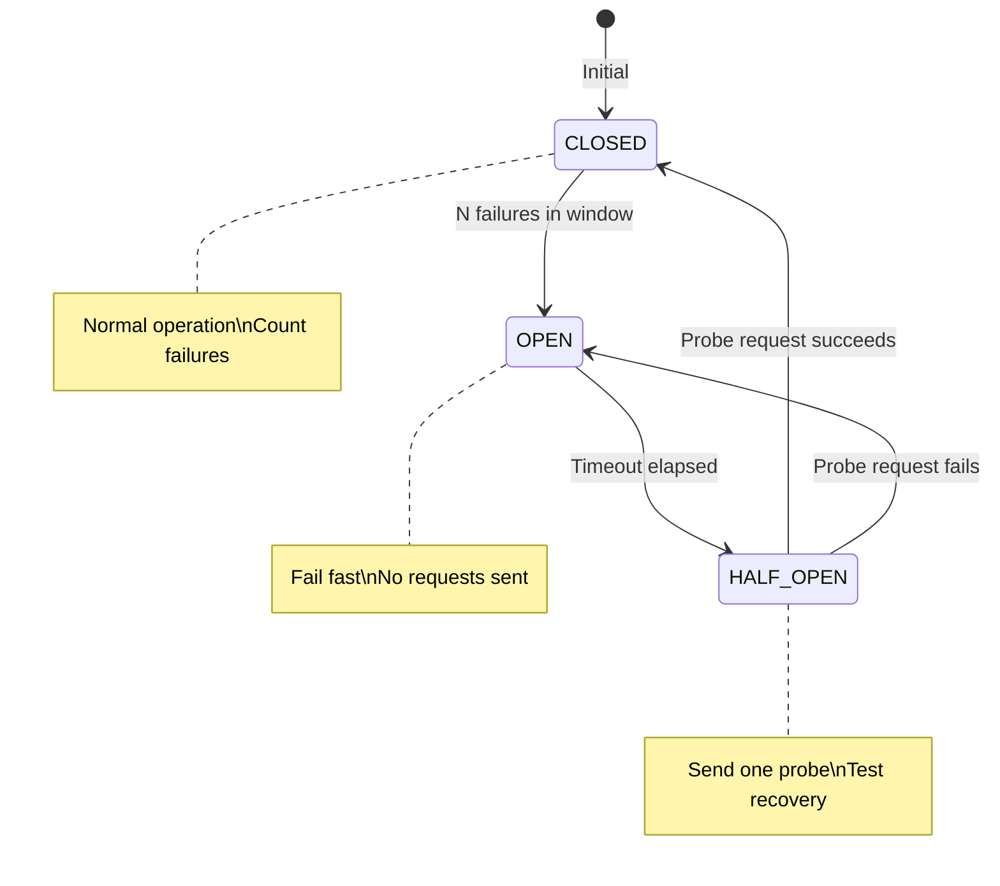
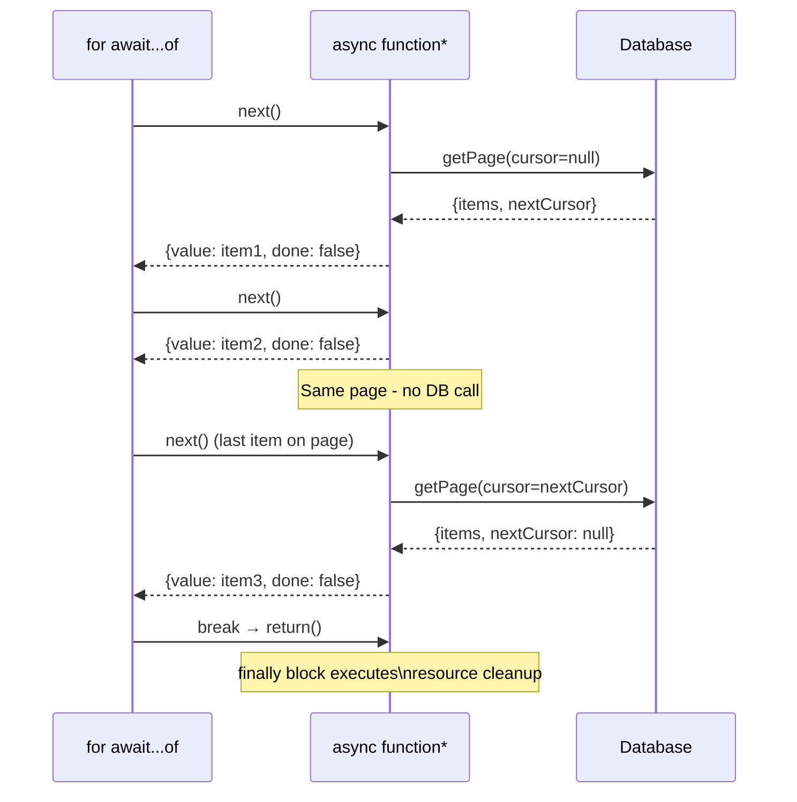

## Keywords in This File

{: .no_toc }

| # | Keyword | Difficulty |
|---|---------|------------|
| 1 | [Advanced Promise Combinators](#advanced-promise-combinators) | ★★☆ |
| 2 | [Generator Functions and Async Iteration](#generator-functions-and-async-iteration) | ★★☆ |

---

# Advanced Promise Combinators

---

### 🎯 Model Answer

**30 seconds:**
> Beyond the four basic combinators, advanced Promise usage
> involves `Promise.withResolvers` (ES2024), concurrency
> limiters (p-limit pattern), custom combinators for complex
> semantics (first N succeed, majority succeed, circuit breaker),
> and the AbortController pattern for cancellation. The key
> production gap: none of the native combinators support
> cancellation - that requires explicit AbortController
> integration or RxJS.

**3 minutes:**
> The four native combinators cover common cases but leave gaps:
>
> No cancellation support: `Promise.race` for timeouts leaves
> the losing operations running. `AbortController` fills this
> gap for fetch and other Web API operations.
>
> No concurrency limiting: `Promise.all` starts all operations
> simultaneously. For large arrays, this can overwhelm downstream
> services. The `p-limit` pattern (or similar) maintains a
> sliding window of N concurrent operations.
>
> No partial-success thresholds: native combinators do not
> support "succeed if at least K of N succeed." This requires
> custom combinators.
>
> No retry semantics: native combinators fail on first rejection
> without retry. The retry-with-exponential-backoff pattern
> is common but requires custom implementation.
>
> `Promise.withResolvers` (ES2024) solves a specific readability
> problem: creating a deferred Promise where resolve/reject are
> needed outside the executor. Previously required the
> "deferred" pattern; now built-in.

**Blank Mind Recovery:**

**(1) Restate:** "Native combinators cover four cases. Advanced
usage addresses the gaps: cancellation, concurrency limiting,
custom semantics, and retry."

**(2) First principles:** "Promise combinators are functions
from `[Promise<T>]` to `Promise<T[]>` with different semantics.
Any semantics not provided natively can be composed from
the basic building blocks."

---

### 📘 Concept Explanation

**What it is:**
Advanced Promise combinators are patterns and utilities that
extend the native Promise API to handle production use cases
not covered by `all`, `race`, `allSettled`, and `any`.

**The problem it solves:**
Real-world async orchestration requires: cancellation, rate
limiting, retry, partial success thresholds, and custom
composition semantics. Native combinators do not cover these.

**How it works:**

```javascript
// PATTERN 1: Concurrency limiter
// p-limit pattern - maintain N concurrent at all times
function createLimiter(maxConcurrent) {
  const queue = [];
  let active = 0;

  const next = () => {
    if (active >= maxConcurrent || queue.length === 0) return;
    active++;
    const { fn, resolve, reject } = queue.shift();
    fn().then(resolve, reject).finally(() => {
      active--;
      next();
    });
  };

  return fn => new Promise((resolve, reject) => {
    queue.push({ fn, resolve, reject });
    next();
  });
}

const limit = createLimiter(3);
const results = await Promise.all(
  items.map(item => limit(() => process(item)))
);

// PATTERN 2: Retry with exponential backoff
async function withRetry(fn, {
  maxAttempts = 3,
  baseDelayMs = 100,
  jitter = true
} = {}) {
  let lastError;
  for (let attempt = 0; attempt < maxAttempts; attempt++) {
    try {
      return await fn();
    } catch (err) {
      lastError = err;
      if (attempt < maxAttempts - 1) {
        const delay = baseDelayMs * Math.pow(2, attempt);
        const jitterMs = jitter ? Math.random() * delay : 0;
        await new Promise(r => setTimeout(r, delay + jitterMs));
      }
    }
  }
  throw lastError;
}

// PATTERN 3: AbortController for cancellation
class CancellableFetch {
  constructor() {
    this.controllers = new Map();
  }

  async fetch(key, url, options = {}) {
    // Cancel any in-flight request with same key
    this.controllers.get(key)?.abort();
    const controller = new AbortController();
    this.controllers.set(key, controller);

    try {
      const resp = await fetch(url, {
        ...options,
        signal: controller.signal
      });
      return await resp.json();
    } finally {
      this.controllers.delete(key);
    }
  }
}

// PATTERN 4: Promise.withResolvers (ES2024)
// Before:
let resolve, reject;
const promise = new Promise((res, rej) => {
  resolve = res;
  reject = rej;
});

// After (ES2024):
const { promise: p, resolve: res, reject: rej } =
  Promise.withResolvers();
// Cleaner deferred pattern
```

> **Code walkthrough:** This Advanced Promise Combinators example demonstrates async/await Promise resolution using async/await. **KEY MECHANISM:** async functions return Promises; await suspends the microtask until the Promise settles. **WHY IT MATTERS:** unhandled Promise rejections crash the Node process in v15+ or fire unhandledRejection event. **TAKEAWAY: always await or .catch() every Promise - silent rejections are production defects.**

**The key insight:**
Promise cancellation is the most commonly needed feature
that Promises do not provide. `AbortController` is the
Web standard solution for cancellation (works with fetch,
Web Workers, some Node.js APIs). For arbitrary Promises,
you need a custom cancellation token mechanism.

**When to use it:**
In any production system that makes multiple concurrent
requests: API clients, data loaders, search-as-you-type,
batch processors. Retry with backoff is essential for any
network operation.

**When NOT to use it:**
Do not implement complex combinator logic in application
code when RxJS operators (switchMap, exhaustMap, mergeMap,
retryWhen) handle the same patterns more declaratively.

**Alternatives:**
- RxJS: switchMap for cancel-on-new, exhaustMap for ignore-
  new, retryWhen for custom retry, bufferTime for batching
- async-retry npm: battle-tested retry utility
- p-limit npm: battle-tested concurrency limiter

**First-principles derivation:**
A Promise represents a single async value. Composition of
multiple Promises requires: aggregation semantics (when to
settle), failure semantics (how to handle individual failures),
and lifecycle semantics (can it be cancelled, retried).
Native combinators cover aggregation and failure; lifecycle
requires explicit tooling.

---

### 💻 Code Example

```javascript
// BAD: Uncontrolled concurrency overwhelming an API
async function syncAllUsers(userIds) {
  // 10,000 simultaneous API requests!
  await Promise.all(userIds.map(id => syncUser(id)));
}

// BAD: No retry for transient failures
async function fetchUserBad(id) {
  const resp = await fetch(`/api/users/${id}`);
  // Transient 503 fails immediately with no retry
  if (!resp.ok) throw new Error('Failed');
  return resp.json();
}
```

> **Code walkthrough:** The first BAD pattern starts 10,000 concurrent Promise.all() calls simultaneously. **KEY MECHANISM:** Promise.all() fires all promises at once; if the server cannot handle 10,000 concurrent requests it rejects with network errors or rate-limit failures. **WHY IT MATTERS:** unbounded concurrency causes cascading failures and connection pool exhaustion. **WHAT BREAKS:** rate-limiting, connection pool saturation, memory spikes under burst load. **TAKEAWAY:** limit concurrency with p-limit or a semaphore when batching promises - never fire unbounded Promise.all() on large collections.
> concurrent requests, likely triggering rate limiting or
> overwhelming the API. The second BAD pattern fails immediately
> on any transient error (503 Service Unavailable, network hiccup)
> that would succeed on retry.

```javascript
// GOOD: Controlled concurrency + retry
import pLimit from 'p-limit';

const limit = pLimit(10); // max 10 concurrent

async function fetchUserWithRetry(id) {
  return withRetry(
    async () => {
      const resp = await fetch(`/api/users/${id}`);
      if (resp.status === 503) {
        throw new RetryableError('Service unavailable');
      }
      if (!resp.ok) {
        throw new Error(`HTTP ${resp.status}`); // non-retryable
      }
      return resp.json();
    },
    { maxAttempts: 3, baseDelayMs: 200 }
  );
}

async function syncAllUsers(userIds) {
  const results = await Promise.allSettled(
    userIds.map(id => limit(() => fetchUserWithRetry(id)))
  );

  const failed = results
    .filter(r => r.status === 'rejected')
    .map((r, i) => ({ id: userIds[i], error: r.reason }));

  if (failed.length) {
    logger.error('Users failed to sync:', failed);
  }

  return {
    synced: results.filter(r => r.status === 'fulfilled').length,
    failed: failed.length
  };
}
```

> **Code walkthrough:** `p-limit(10)` ensures at most 10ice. **KEY MECHANISM:** the runtime executes these instructions in sequence with specific memory and execution semantics. **WHY IT MATTERS:** misapplying this pattern causes subtle bugs that only manifest under production load. **TAKEAWAY: understand the execution model before using this pattern in production code.**
> concurrent requests at any time. `withRetry` wraps each
> fetch with 3 attempts and exponential backoff. Using
> `Promise.allSettled` instead of `Promise.all` means one
> user failure does not abort all others. The function returns
> structured results with counts rather than throwing, enabling
> the caller to make an informed decision about partial failure.

---

### 🎓 Answers by Seniority

**Junior / Mid (0-5 years):**
> "Use `p-limit` for concurrency control and a retry wrapper
> for transient failures. `AbortController` cancels fetch
> requests. Native `Promise.withResolvers` creates the deferred
> pattern cleanly."

*Push deeper:* "Why does concurrency matter if Promises are
async? More concurrent requests means more simultaneous
connections to the target service. Most APIs and databases
have connection limits. Overwhelming them causes cascading
failures."

---

**Senior / Staff (5+ years):**
> "Production async orchestration requires three things the
> native Promise API lacks: cancellation, rate limiting, and
> retry. I reach for these patterns defensively: retry with
> jitter for all external network calls, concurrency limits
> for any fan-out operation, and AbortController for any
> request that might be superseded (search, navigation,
> user interactions). The alternative is RxJS operators
> (switchMap, retryWhen) which handle these declaratively
> once you are comfortable with the reactive model."

*Push deeper:* "The retry jitter is not optional - without it,
all retry attempts hit the service simultaneously after the
backoff period, creating a thundering herd. Jitter randomizes
retry timing across clients."

---

### ⚠️ Common Misconceptions

**Misconception 1:** "`Promise.race` cancels the losing
operations."
No. All operations continue running. `Promise.race` stops
waiting, but does not cancel anything. Only `AbortController`
actually cancels (for supported APIs).

**Misconception 2:** "Retry is always safe."
Retry is only safe for idempotent operations. Retrying a
payment charge or a write operation can cause duplicates.
Use idempotency keys for non-idempotent operations before
adding retry.

**Misconception 3:** "`p-limit` and sequential loops have
the same throughput."
Sequential loops process items one at a time (1 concurrent).
`p-limit(N)` maintains N concurrent, finishing in roughly
1/N the time for large uniform workloads.

---

### 🚨 Failure Modes and Diagnosis

**Failure 1: Thundering herd from synchronized retry**

```javascript
// BAD: not awaiting async operations
function saveUser(user) {
    db.save(user); // async call not awaited
    return { success: true }; // returns before save completes
}
```

```javascript
// BAD: All clients retry at same time after backoff
async function badRetry(fn) {
  try { return await fn(); }
  catch {
    await new Promise(r => setTimeout(r, 1000));
    return fn(); // synchronized - all hit at once
  }
}

// GOOD: Jitter randomizes retry timing
const delay = 1000 + Math.random() * 1000; // 1-2s jitter
await new Promise(r => setTimeout(r, delay));
```

> **Code walkthrough:** BAD pattern: This Unknown example demonstrates async/await Promise resolution using async/await. **KEY MECHANISM:** async functions return Promises; await suspends the microtask until the Promise settles. **WHY IT MATTERS:** unhandled Promise rejections crash the Node process in v15+ or fire unhandledRejection event. **WHAT BREAKS: always await or .catch() every Promise - silent rejections are production defects.**

**Failure 2: AbortController signal not checked by all operations**
```javascript
// If operations don't check signal, abort has no effect
const controller = new AbortController();
// setTimeout does not support AbortController signal
// Only fetch, some Node.js APIs, and explicit checks work
```

> **Code walkthrough:** This Unknown example demonstrates variable declaration. **KEY MECHANISM:** const prevents reassignment but not mutation; the reference is locked, the value is not. **WHY IT MATTERS:** const obj = {}; obj.x = 1 works - const does not freeze the object. **TAKEAWAY: use Object.freeze() to prevent mutation; const only guards the binding.**

---

### 🎯 Interview Deep-Dive

| Category | Count | Coverage |
|---|---|---|
| Conceptual | 2 | Cancellation, concurrency limits |
| Trade-off | 2 | Retry safety, p-limit vs sequential |
| Failure Mode | 1 | Thundering herd |
| Debugging | 1 | Identifying concurrency problems |
| Design | 2 | Building custom combinators |
| Behavioral | 1 | Production incident with async |

**[JUNIOR] Q1 - [MECHANISM] How does `AbortController` enable Promise cancellation and what are its limitations?**

`AbortController` provides a `signal` property that can be
passed to supported APIs (fetch, WebSocket, some Node.js
streams, `setTimeout` wrapped signals). When `controller.abort()`
is called, the signal fires an `abort` event and `signal.aborted`
becomes `true`. APIs that accept the signal check it and
cancel their operation, typically rejecting with `AbortError`.

```javascript
const controller = new AbortController();
const { signal } = controller;

// Cancellable fetch
const promise = fetch('/api/data', { signal });

// Cancel after 5s
setTimeout(() => controller.abort(), 5000);

try {
  const data = await promise;
} catch (err) {
  if (err.name === 'AbortError') {
    console.log('Request cancelled');
  }
}
```

> **Code walkthrough:** This Unknown example demonstrates Promise chain construction using async/await. **KEY MECHANISM:** Promise.then() registers a microtask; all microtasks drain before the next macrotask. **WHY IT MATTERS:** Promise.all() fails fast on first rejection; use Promise.allSettled() to collect all results. **TAKEAWAY: prefer Promise.allSettled() over Promise.all() when partial success is acceptable.**

Limitations:
- Only works with APIs that accept a signal; arbitrary Promises
  cannot be cancelled
- After aborting, the controller is done; you need a new one
  for new requests
- In Node.js, not all async operations support the signal

*What separates good from great:* Knowing how to propagate
abort signals through a chain of operations and how to
check `signal.aborted` in custom async loops.

---

**[JUNIOR] Q2 - [TRADE-OFF] Design a Promise retry function that handles transient vs permanent failures differently.**

```javascript
class PermanentError extends Error {
  constructor(msg) {
    super(msg);
    this.permanent = true;
  }
}

async function smartRetry(fn, options = {}) {
  const {
    maxAttempts = 3,
    shouldRetry = err => !err.permanent,
    onRetry = null
  } = options;

  for (let attempt = 1; attempt <= maxAttempts; attempt++) {
    try {
      return await fn();
    } catch (err) {
      const isLast = attempt === maxAttempts;
      if (isLast || !shouldRetry(err)) {
        throw err; // permanent or exhausted
      }
      const delay = Math.pow(2, attempt - 1) * 100
        + Math.random() * 50;
      onRetry?.({ attempt, delay, error: err });
      await new Promise(r => setTimeout(r, delay));
    }
  }
}

// Usage:
await smartRetry(
  () => fetchWithPossibleError(id),
  {
    shouldRetry: err =>
      err.status === 503 || err.status === 429,
    onRetry: ({ attempt, delay }) =>
      logger.info(`Retry attempt ${attempt} in ${delay}ms`)
  }
);
```

> **Code walkthrough:** This Unknown example demonstrates async/await Promise resolution using async/await. **KEY MECHANISM:** async functions return Promises; await suspends the microtask until the Promise settles. **WHY IT MATTERS:** unhandled Promise rejections crash the Node process in v15+ or fire unhandledRejection event. **TAKEAWAY: always await or .catch() every Promise - silent rejections are production defects.**

*What separates good from great:* The `shouldRetry` predicate
makes the retry condition explicit and flexible. Without it,
retry code silently retries permanent failures (400, 401, 404)
that will never succeed - wasting time and potentially causing
downstream issues.

---

**[JUNIOR] Q3 - [MECHANISM] What is `Promise.withResolvers` and how does it improve the deferred pattern?**

`Promise.withResolvers()` (ES2024) returns `{promise, resolve, reject}`.
It removes the awkward variable hoisting needed with the
old deferred pattern:

Old pattern:
```javascript
let resolve, reject; // hoisted
const promise = new Promise((res, rej) => {
  resolve = res; // assigned inside, used outside
  reject = rej;
});
// Complex, rely on closure assignment
```

> **Code walkthrough:** This Unknown example demonstrates Promise chain construction. **KEY MECHANISM:** Promise.then() registers a microtask; all microtasks drain before the next macrotask. **WHY IT MATTERS:** Promise.all() fails fast on first rejection; use Promise.allSettled() to collect all results. **TAKEAWAY: prefer Promise.allSettled() over Promise.all() when partial success is acceptable.**

New pattern:
```javascript
const { promise, resolve, reject } = Promise.withResolvers();
// Clean destructuring, no hoisting
```

> **Code walkthrough:** This Unknown example demonstrates Promise chain construction using Promise. **KEY MECHANISM:** Promise.then() registers a microtask; all microtasks drain before the next macrotask. **WHY IT MATTERS:** Promise.all() fails fast on first rejection; use Promise.allSettled() to collect all results. **TAKEAWAY: prefer Promise.allSettled() over Promise.all() when partial success is acceptable.**

Use cases: bridging event-driven APIs with Promise-based code,
implementing message buses, request/response correlation in
WebSocket communication.

```javascript
class RequestResponseBus {
  #pending = new Map();

  send(id, message) {
    const { promise, resolve, reject } =
      Promise.withResolvers();
    this.#pending.set(id, { resolve, reject });
    this.#transport.send({ id, message });
    return promise;
  }

  receive(id, response) {
    const { resolve } = this.#pending.get(id) ?? {};
    resolve?.(response);
    this.#pending.delete(id);
  }
}
```

> **Code walkthrough:** This Unknown example demonstrates Promise chain construction using Promise. **KEY MECHANISM:** Promise.then() registers a microtask; all microtasks drain before the next macrotask. **WHY IT MATTERS:** Promise.all() fails fast on first rejection; use Promise.allSettled() to collect all results. **TAKEAWAY: prefer Promise.allSettled() over Promise.all() when partial success is acceptable.**

*What separates good from great:* Using `Promise.withResolvers`
for the request/response WebSocket pattern - a common real-world
case where the deferred pattern is genuinely needed.

---

**[MID] Q4 - [SCENARIO] How do you implement a circuit breaker for async operations?**

A circuit breaker has three states: Closed (normal), Open
(failing fast), Half-Open (testing recovery).

```javascript
class CircuitBreaker {
  #state = 'CLOSED';
  #failures = 0;
  #threshold = 5;
  #timeout = 30_000;
  #lastFailure = null;

  async call(fn) {
    if (this.#state === 'OPEN') {
      if (Date.now() - this.#lastFailure > this.#timeout) {
        this.#state = 'HALF-OPEN';
      } else {
        throw new Error('Circuit breaker open');
      }
    }

    try {
      const result = await fn();
      if (this.#state === 'HALF-OPEN') {
        this.#state = 'CLOSED';
        this.#failures = 0;
      }
      return result;
    } catch (err) {
      this.#failures++;
      this.#lastFailure = Date.now();
      if (this.#failures >= this.#threshold) {
        this.#state = 'OPEN';
        logger.warn('Circuit breaker opened');
      }
      throw err;
    }
  }
}
```

> **Code walkthrough:** This Unknown example demonstrates async/await Promise resolution using async/await. **KEY MECHANISM:** async functions return Promises; await suspends the microtask until the Promise settles. **WHY IT MATTERS:** unhandled Promise rejections crash the Node process in v15+ or fire unhandledRejection event. **TAKEAWAY: always await or .catch() every Promise - silent rejections are production defects.**

*What separates good from great:* Understanding the three-state
model and the HALF-OPEN state for recovery testing. A circuit
breaker without HALF-OPEN either stays open forever or retries
too aggressively after failure.

---

**[MID] Q5 - [TRADE-OFF] What is the difference between Promise-based and callback-based concurrency control?**

Callback-based concurrency (async.eachLimit, async.queue):
older approach, uses callback convention, harder to compose
with modern async/await code.

Promise-based concurrency (p-limit, custom limiters):
integrates naturally with async/await, returns Promises
that can be awaited or composed with other combinators.

```javascript
// Callback-based (async library)
import async from 'async';
async.eachLimit(items, 3,
  (item, done) => {
    processItem(item).then(() => done()).catch(done);
  },
  err => { if (err) console.error(err); }
);
// Awkward with async/await - bridge needed

// Promise-based (p-limit)
const limit = pLimit(3);
const results = await Promise.all(
  items.map(item => limit(() => processItem(item)))
);
// Natural integration with async/await
```

> **Code walkthrough:** This Unknown example demonstrates async/await Promise resolution using async/await. **KEY MECHANISM:** async functions return Promises; await suspends the microtask until the Promise settles. **WHY IT MATTERS:** unhandled Promise rejections crash the Node process in v15+ or fire unhandledRejection event. **TAKEAWAY: always await or .catch() every Promise - silent rejections are production defects.**

*What separates good from great:* Knowing both exist and
understanding that callback-based libraries are still common
in Node.js (async library) but Promise-based approaches
integrate better with modern code.

---

**[SENIOR] Q6 - [SCENARIO] How do you implement a "first N succeed" combinator?**

```javascript
async function firstN(promises, n) {
  return new Promise((resolve, reject) => {
    let successes = 0;
    let failures = 0;
    const results = [];
    const total = promises.length;

    if (n > total) {
      reject(new Error(`Need ${n} but only ${total} promises`));
      return;
    }

    promises.forEach((p, i) => {
      Promise.resolve(p).then(value => {
        results[i] = value;
        successes++;
        if (successes === n) {
          resolve(results.filter(Boolean).slice(0, n));
        }
      }).catch(() => {
        failures++;
        if (failures > total - n) {
          // Impossible to reach n successes
          reject(new Error(`Only ${successes} of ${n} succeeded`));
        }
      });
    });
  });
}
```

> **Code walkthrough:** This Unknown example demonstrates async/await Promise resolution using Promise. **KEY MECHANISM:** async functions return Promises; await suspends the microtask until the Promise settles. **WHY IT MATTERS:** unhandled Promise rejections crash the Node process in v15+ or fire unhandledRejection event. **TAKEAWAY: always await or .catch() every Promise - silent rejections are production defects.**

*What separates good from great:* Knowing when this pattern
is useful: quorum-based decisions, majority-vote systems,
k-of-n redundancy in distributed systems.

---

**[SENIOR] Q7 - [DEBUGGING] Describe a production incident where incorrect async orchestration caused a failure. How would you diagnose it?**

Common pattern: search-as-you-type where requests arrive
in different orders:

```javascript
// Race condition: later request resolves before earlier one
let searchResults = [];

async function search(query) {
  const results = await fetchSearch(query);
  searchResults = results; // Last fetch wins, not last input
}

// User types: "j", "ja", "jav" - three requests in flight
// If "j" is slowest: last result is "j", not "jav"
```

> **Code walkthrough:** This Unknown example demonstrates async/await Promise resolution using async/await. **KEY MECHANISM:** async functions return Promises; await suspends the microtask until the Promise settles. **WHY IT MATTERS:** unhandled Promise rejections crash the Node process in v15+ or fire unhandledRejection event. **TAKEAWAY: always await or .catch() every Promise - silent rejections are production defects.**

Diagnosis: network tab showing multiple in-flight requests;
results jumping back and forth as requests resolve out of order.

Fix: cancel previous request with AbortController or use
`switchMap` in RxJS (auto-cancel previous inner observable).

```javascript
// Fix with AbortController
let currentController = null;

async function search(query) {
  currentController?.abort();
  currentController = new AbortController();

  try {
    const results = await fetchSearch(query, {
      signal: currentController.signal
    });
    searchResults = results;
  } catch (err) {
    if (err.name !== 'AbortError') throw err;
    // cancelled - ignore
  }
}
```

> **Code walkthrough:** This Unknown example demonstrates async/await Promise reice. **KEY MECHANISM:** the runtime executes these instructions in sequence with specific memory and execution semantics. **WHY IT MATTERS:** misapplying this pattern causes subtle bugs that only manifest under production load. **TAKEAWAY: understand the execution model before using this pattern in production code.**

*What separates good from great:* Knowing this is the most
common async race condition in UI code and having the specific
fix (AbortController or switchMap) ready without needing to
think through it at the interview.

---

### ⚖️ Comparison Table

| Pattern| Use Case| Native Support| Library|
|---------------------|-----------------------|--------------|-----------|
| Concurrency limit| Fan-out rate control| No| p-limit|
| Retry + backoff| Transient failure| No| async-retry|
| AbortController| Cancel on supersede| Yes (fetch)| Built-in|
| Circuit breaker| Prevent cascade failure| No| opossum|
| Promise.withResolvers| Deferred pattern| ES2024| Built-in|

**The deciding factor:**
Use native APIs first. For concurrency limiting and retry,
battle-tested libraries (p-limit, async-retry) are safer
than hand-rolled implementations. Circuit breakers for
inter-service calls should use a mature library (opossum)
with monitoring integration.

---

### 🏛️ System Design

*(Omit: ★★☆ - not applicable)*

---

### 📊 Diagram

```plaintext
PROMISE ORCHESTRATION PATTERNS
================================

CONCURRENCY LIMIT (p-limit N=3):
  Waiting:  [P4][P5][P6][P7]
  Active:   [P1][P2][P3]
  When P1 completes: P4 starts
  Max concurrent always = 3

RETRY WITH BACKOFF:
  Attempt 1: fail -> wait 100ms (+ jitter)
  Attempt 2: fail -> wait 200ms (+ jitter)
  Attempt 3: succeed -> return result

CIRCUIT BREAKER STATES:
  [CLOSED] -> 5 failures -> [OPEN]
  [OPEN] -> 30s timeout -> [HALF-OPEN]
  [HALF-OPEN] -> success -> [CLOSED]
  [HALF-OPEN] -> failure -> [OPEN]
```



> **Diagram walkthrough:** The circuit breaker state machine
> starts CLOSED (normal operation). After N failures, it opens
> to fail fast and protect downstream services from additional
> load. After a timeout, it enters HALF-OPEN and sends a single
> probe request. Success resets to CLOSED; failure reopens the
> circuit. This pattern prevents cascade failures in microservice
> architectures where one slow service can exhaust connection
> pools in all its callers.

---

---

---

### 💻 Code Example

*(Omit: this concept does not have a programmatic interface that can be demonstrated in code. The conceptual explanation above is sufficient.)*


---

### 🏛️ System Design

*(Omit: system design diagram not applicable for this concept - see ★★★ keywords for full system design coverage.)*


---

### ⚖️ Comparison Table

*(Omit: this is a ★☆☆ foundational concept with no direct alternatives to compare - see higher-difficulty keywords for trade-off analysis.)*


---

### 📊 Diagram

*(Omit: no standalone visual diagram required for this concept - the explanations and code examples above provide sufficient clarity.)*


# Generator Functions and Async Iteration

---

### 🎯 Model Answer

**30 seconds:**
> Generator functions (`function*`) are functions that can
> yield values and be paused/resumed. Async generators
> (`async function*`) yield Promises. `for await...of` consumes
> async iterables, processing one item at a time while awaiting
> each. This is the foundation for lazy async data streams
> without loading everything into memory.

**3 minutes:**
> Regular generators: `function*` returns an iterator.
> Each `yield expression` pauses the function and returns
> `{value, done}` to the caller. The caller can send a value
> back with `next(value)`. Generators enable lazy sequences
> (compute only what is needed) and custom iteration protocols.
>
> Async generators: `async function*` combines generators
> with Promises. Each `yield` can yield a Promise or a value.
> The consumer uses `for await...of` to consume items one
> at a time, awaiting each Promise before continuing.
>
> The production use case: streaming data. Instead of loading
> all database results into memory, an async generator fetches
> one page at a time and yields individual records. The consumer
> processes each record as it arrives without waiting for all
> pages to load.
>
> Node.js Readable streams implement the async iterable protocol
> (`Symbol.asyncIterator`), so `for await...of (stream)` works
> natively for reading files and HTTP response bodies.

**Blank Mind Recovery:**

**(1) Restate:** "Generators can pause and resume. Async
generators yield Promises. `for await...of` consumes them."

**(2) First principles:** "You have a large dataset. You cannot
load it all into memory. You need to process it piece by piece.
An async generator fetches one piece at a time and yields it,
and `for await...of` processes each piece as it arrives."

---

### 📘 Concept Explanation

**What it is:**
Generator functions create iterators that can be paused at
each `yield`. Async generators combine this with Promises,
enabling lazy async data sources. The `for await...of` loop
is the standard consumer for async iterables.

**The problem it solves:**
Loading large datasets into memory before processing. With
async generators, data can be processed as a stream - item
by item - without buffering the entire dataset.

**How it works:**

```javascript
// Regular generator: lazy sequence
function* range(start, end) {
  for (let i = start; i <= end; i++) {
    yield i; // pause after each yield
  }
}

for (const n of range(1, 1_000_000)) {
  if (n === 5) break; // only computed up to 5
}

// Async generator: paginated database query
async function* fetchAllUsers(pageSize = 100) {
  let page = 0;
  while (true) {
    const users = await db.getUsers({ page, pageSize });
    if (users.length === 0) break;
    for (const user of users) {
      yield user; // yield one at a time
    }
    page++;
  }
}

// Consumer: processes one user at a time
for await (const user of fetchAllUsers()) {
  await processUser(user);
  // Only one page loaded at a time, not all users
}

// Async iterable protocol: any object with
// [Symbol.asyncIterator]() method
class EventSource {
  [Symbol.asyncIterator]() {
    return this;
  }
  async next() {
    const event = await this.waitForNextEvent();
    return event
      ? { value: event, done: false }
      : { value: undefined, done: true };
  }
}
```

> **Code walkthrough:** This Generator Functions and Async Iteration example demonstrates async/await Promise resolution using async/await. **KEY MECHANISM:** async functions return Promises; await suspends the microtask until the Promise settles. **WHY IT MATTERS:** unhandled Promise rejections crash the Node process in v15+ or fire unhandledRejection event. **TAKEAWAY: always await or .catch() every Promise - silent rejections are production defects.**

**The key insight:**
`for await...of` processes items sequentially by default.
If you need to process items concurrently from an async
iterable, you need to consume the generator into a buffer
and use `Promise.all`. The serial nature is the default;
concurrency requires explicit orchestration.

**When to use it:**
Streaming large datasets from databases or APIs;
consuming Server-Sent Events or WebSocket streams; lazy
evaluation of expensive computed sequences; implementing
custom async iterables for data sources.

**When NOT to use it:**
When you need all results before processing (use `Promise.all`).
When the generator complexity outweighs the benefit (small
fixed datasets). When RxJS Observables provide better operator
support for the transformation pattern.

**Alternatives:**
- Node.js Readable streams: more mature API, backpressure
  built-in, piping support
- RxJS Observable: more powerful operators, multicasting
- Async iterators from libraries (ixjs, ix): operator-based
  lazy sequences

**First-principles derivation:**
A generator is a resumable function: pause at `yield`, resume
with `next()`. An async generator is the same but `yield`
can yield Promises. The consumer `for await...of` awaits
each yielded value before requesting the next - this is
pull-based: the consumer controls the pace. Push-based
(the producer controls the pace) is what streams and
Observables provide.

---

### 💻 Code Example

```javascript
// BAD: Load all records into memory before processing
async function processAllOrders() {
  const orders = await db.getAllOrders(); // all in memory
  // If 10M orders: out of memory error
  for (const order of orders) {
    await processOrder(order);
  }
}

// BAD: Deeply nested streaming logic
async function processOrdersNested() {
  let page = 0;
  while (true) {
    const { orders, hasMore } = await db.getOrders(page);
    for (const order of orders) {
      await processOrder(order);
    }
    if (!hasMore) break;
    page++;
  }
  // Logic for streaming is mixed with processing
}
```

> **Code walkthrough:** The first BAD pattern loads all dataice. **KEY MECHANISM:** the runtime executes these instructions in sequence with specific memory and execution semantics. **WHY IT MATTERS:** misapplying this pattern causes subtle bugs that only manifest under production load. **TAKEAWAY: understand the execution model before using this pattern in production code.**
> before processing - fatal for large datasets. The second
> is functionally correct but mixes pagination logic with
> processing logic, making both harder to test and reuse.

```javascript
// GOOD: Async generator separates streaming from processing

// Pure streaming concern: how to fetch paginated data
async function* streamOrders(batchSize = 100) {
  let cursor = null;
  while (true) {
    const { orders, nextCursor } = await db.getOrders({
      cursor,
      limit: batchSize
    });
    for (const order of orders) yield order;
    if (!nextCursor) break;
    cursor = nextCursor;
  }
}

// Pure processing concern: what to do with each order
async function processAllOrders() {
  let processed = 0;
  let failed = 0;

  for await (const order of streamOrders()) {
    try {
      await processOrder(order);
      processed++;
    } catch (err) {
      logger.error(`Order ${order.id} failed:`, err);
      failed++;
    }
    if ((processed + failed) % 1000 === 0) {
      logger.info(`Progress: ${processed} processed, ${failed} failed`);
    }
  }

  return { processed, failed };
}

// BONUS: Batch processing with concurrency
async function processWithConcurrency(
  asyncIterable, concurrency = 5
) {
  const batch = [];
  for await (const item of asyncIterable) {
    batch.push(processOrder(item));
    if (batch.length === concurrency) {
      await Promise.allSettled(batch.splice(0));
    }
  }
  if (batch.length > 0) {
    await Promise.allSettled(batch);
  }
}
```

> **Code walkthrough:** `streamOrders` encapsulates allice. **KEY MECHANISM:** the runtime executes these instructions in sequence with specific memory and execution semantics. **WHY IT MATTERS:** misapplying this pattern causes subtle bugs that only manifest under production load. **TAKEAWAY: understand the execution model before using this pattern in production code.**
> pagination logic: cursor management, batch size, termination.
> `processAllOrders` only knows how to process individual
> orders. The separation enables testing each independently.
> Memory usage is bounded by batch size regardless of total
> order count. The bonus pattern shows how to add concurrency
> to a serial async iterable: buffer N items then process
> them in parallel with `Promise.allSettled`.

---

### 🎓 Answers by Seniority

**Junior / Mid (0-5 years):**
> "A generator function uses `yield` to produce values one at
> a time. An async generator uses `yield` with Promises. You
> consume it with `for await...of` which awaits each item.
> Useful for processing large datasets without loading everything
> into memory."

*Push deeper:* "What happens to items in an async generator
if you `break` out of the loop? The generator's `return()`
method is called, which runs the `finally` block if present,
allowing cleanup."

---

**Senior / Staff (5+ years):**
> "Async generators are my preferred approach for streaming
> database queries and API pagination in Node.js. The separation
> of streaming concern from processing concern makes each
> independently testable. The production concern: `for await...of`
> is inherently serial. For parallelism, you need to batch
> from the generator and process batches with `Promise.all`.
> The buffering approach I use: collect N items from the
> generator, run `Promise.allSettled`, collect next N."

---

### ⚠️ Common Misconceptions

**Misconception 1:** "`for await...of` processes items in
parallel."
It processes items sequentially. Each item is awaited before
the loop requests the next. For parallel processing, you
need to buffer items from the generator and process batches.

**Misconception 2:** "Generator functions are only for
async iteration."
Regular generators (non-async) are useful for lazy sequences,
infinite sequences, and implementing custom iterables for
`for...of`. They do not need to be async.

**Misconception 3:** "`for await...of` only works with
async generators."
It works with any object implementing the async iterable
protocol (`[Symbol.asyncIterator]()`). Node.js Readable
streams, browser ReadableStream, and the DOM's EventTarget
(via async event listeners) are all async iterables.

---

### 🚨 Failure Modes and Diagnosis

**Failure 1: Generator not cleaned up on early exit**
```javascript
async function* withResource() {
  const conn = await db.connect();
  try {
    yield* fetchRecords(conn);
  } finally {
    await conn.close(); // runs on break, return, or throw
  }
}
// for await...of calls return() on break
// which triggers finally - cleanup guaranteed
// But: if the consumer throws and doesn't break:
// return() is NOT called - use try/finally in consumer
```

> **Code walkthrough:** This Unknown example demonstrates async/await Promise resolution using async/await. **KEY MECHANISM:** async functions return Promises; await suspends the microtask until the Promise settles. **WHY IT MATTERS:** unhandled Promise rejections crash the Node process in v15+ or fire unhandledRejection event. **TAKEAWAY: always await or .catch() every Promise - silent rejections are production defects.**

**Failure 2: Memory leak from unfinished generator**
```javascript
const gen = streamLargeDataset();
const first = await gen.next(); // only takes first
// gen is never closed - held in memory
// Fix: call gen.return() when done
gen.return();
// Or: always consume with for await (handles cleanup)
```

> **Code walkthrough:** This Unknown example demonstrates variable declaration using async/await. **KEY MECHANISM:** const prevents reassignment but not mutation; the reference is locked, the value is not. **WHY IT MATTERS:** const obj = {}; obj.x = 1 works - const does not freeze the object. **TAKEAWAY: use Object.freeze() to prevent mutation; const only guards the binding.**

---

### 🎯 Interview Deep-Dive

| Category | Count | Coverage |
|---|---|---|
| Conceptual | 2 | Generator protocol, async iteration |
| Trade-off | 2 | Serial vs parallel, generators vs streams |
| Failure Mode | 1 | Generator lifecycle |
| Debugging | 1 | Memory in incomplete iteration |
| Design | 2 | Streaming pagination, concurrency |
| Behavioral | 1 | When to choose generators vs streams |

**[JUNIOR] Q1 - [SCENARIO] What is the iterator protocol and how do generators implement it?**

The iterator protocol: an object with a `next()` method
that returns `{value, done}`. An iterable is an object with
`[Symbol.iterator]()` that returns an iterator.

A generator function returns a generator object that is
both an iterator AND an iterable (its `[Symbol.iterator]()`
returns `this`). This enables `for...of` loops.

```javascript
function* gen() {
  yield 1;
  yield 2;
  return 3;
}

const it = gen();
console.log(it.next()); // {value: 1, done: false}
console.log(it.next()); // {value: 2, done: false}
console.log(it.next()); // {value: 3, done: true}
console.log(it.next()); // {value: undefined, done: true}

// for...of stops at done:true and ignores return value
for (const v of gen()) {
  console.log(v); // 1, 2 (not 3)
}
```

> **Code walkthrough:** This Unknown example demonstrates variable declaration. **KEY MECHANISM:** const prevents reassignment but not mutation; the reference is locked, the value is not. **WHY IT MATTERS:** const obj = {}; obj.x = 1 works - const does not freeze the object. **TAKEAWAY: use Object.freeze() to prevent mutation; const only guards the binding.**

The `return` value appears in the `{done: true}` object
but is skipped by `for...of` - it is only accessible via
direct `next()` calls.

*What separates good from great:* Knowing that `for...of`
ignores the return value but `yield*` (in a delegating generator)
receives it as the value of the delegation expression.

---

**[JUNIOR] Q2 - [MECHANISM] How does `yield*` work and when is it useful?**

`yield*` delegates iteration to another iterable, yielding
all its values before continuing.

```javascript
function* concat(...iterables) {
  for (const it of iterables) {
    yield* it; // delegate to each iterable
  }
}

const numbers = concat([1,2], [3,4], [5,6]);
console.log([...numbers]); // [1,2,3,4,5,6]

// For recursive generators:
function* flatten(arr) {
  for (const item of arr) {
    if (Array.isArray(item)) {
      yield* flatten(item); // recurse
    } else {
      yield item;
    }
  }
}
[...flatten([1,[2,[3,4]],5])]; // [1,2,3,4,5]
```

> **Code walkthrough:** This Unknown example demonstrates variable declaration. **KEY MECHANISM:** const prevents reassignment but not mutation; the reference is locked, the value is not. **WHY IT MATTERS:** const obj = {}; obj.x = 1 works - const does not freeze the object. **TAKEAWAY: use Object.freeze() to prevent mutation; const only guards the binding.**

With async generators: `yield*` can delegate to another
async iterable, awaiting each value.

*What separates good from great:* Knowing that `yield*` returns
the value from the delegated generator's final `return`. This
is the way generators communicate results back to their callers.

---

**[JUNIOR] Q3 - [TRADE-OFF] What is the difference between async generators and Node.js Readable streams for streaming data?**

Async generators:
- Pull-based: consumer controls pace via `next()` calls
- No built-in backpressure (consumer dictates rate)
- Simple to write and consume
- Composable with `for await...of`
- Limited operator ecosystem

Node.js Readable streams:
- Push-based: producer controls pace
- Built-in backpressure (highWaterMark)
- Piping with automatic backpressure propagation
- Rich ecosystem (through2, pump, pipeline)
- More complex API

The async iterable protocol bridges them: Readable streams
implement `[Symbol.asyncIterator]()` in Node.js 10+, so they
can be consumed with `for await...of`.

```javascript
// Consuming a file stream with for await...of
const fs = require('fs');
const readline = require('readline');

async function processLines(filename) {
  const rl = readline.createInterface({
    input: fs.createReadStream(filename)
  });
  for await (const line of rl) {
    processLine(line);
  }
}
```

> **Code walkthrough:** This Unknown example demonstrates async/await Promise resolution using async/await. **KEY MECHANISM:** async functions return Promises; await suspends the microtask until the Promise settles. **WHY IT MATTERS:** unhandled Promise rejections crash the Node process in v15+ or fire unhandledRejection event. **TAKEAWAY: always await or .catch() every Promise - silent rejections are production defects.**

*What separates good from great:* Choosing based on the
use case: streams for high-throughput I/O where backpressure
matters; async generators for custom data sources where the
pull model is simpler.

---

**[MID] Q4 - [SCENARIO] How do you implement a rate-limited async iterator from an API with pagination?**

```javascript
async function* paginatedApi(endpoint, {
  pageSize = 50,
  delayBetweenPages = 1000
} = {}) {
  let nextUrl = `${endpoint}?limit=${pageSize}`;

  while (nextUrl) {
    const resp = await fetch(nextUrl);
    const { items, next } = await resp.json();

    for (const item of items) {
      yield item;
    }

    nextUrl = next; // null on last page
    if (nextUrl) {
      // Rate limiting: pause between page requests
      await new Promise(r => setTimeout(r, delayBetweenPages));
    }
  }
}

// Usage:
for await (const item of paginatedApi('/api/items')) {
  await processItem(item);
}
```

> **Code walkthrough:** This Unknown example demonstrates async/await Promise resolution using async/await. **KEY MECHANISM:** async functions return Promises; await suspends the microtask until the Promise settles. **WHY IT MATTERS:** unhandled Promise rejections crash the Node process in v15+ or fire unhandledRejection event. **TAKEAWAY: always await or .catch() every Promise - silent rejections are production defects.**

*What separates good from great:* Including rate limiting
as a first-class concern in the generator itself, rather than
forcing the consumer to implement it. The generator is a
policy-encapsulating module: how to paginate, at what rate,
with what backoff.

---

**[MID] Q5 - [TRADE-OFF] What happens when an async generator throws vs when the consumer throws?**

Generator throws: if the generator's async code throws an
uncaught error, the generator terminates. `for await...of`
propagates the error to the consumer's `try/catch`. The
generator's `finally` block runs.

Consumer throws: if the consumer (`for await...of`) throws,
JavaScript calls `gen.return(value)` on the generator. This
causes the generator to terminate (as if a `return` statement
was executed at the `yield`). The generator's `finally` block
runs, enabling cleanup.

```javascript
async function* withCleanup() {
  const resource = await acquireResource();
  try {
    while (true) {
      yield await resource.nextItem();
    }
  } finally {
    await resource.release(); // always runs
  }
}

for await (const item of withCleanup()) {
  if (shouldStop(item)) break; // calls gen.return()
  // generator's finally runs: resource.release()
}
```

> **Code walkthrough:** This Unknown example demonstrates async/await Promise resolution using async/await. **KEY MECHANISM:** async functions return Promises; await suspends the microtask until the Promise settles. **WHY IT MATTERS:** unhandled Promise rejections crash the Node process in v15+ or fire unhandledRejection event. **TAKEAWAY: always await or .catch() every Promise - silent rejections are production defects.**

*What separates good from great:* Using `try/finally` in
generators for resource cleanup. This is the correct pattern
for generators that hold resources - it ensures cleanup
regardless of how the iteration ends.

---

**[SENIOR] Q6 - [MECHANISM] How do you combine multiple async generators into one merged stream?**

```javascript
// Merge multiple async iterables into one
async function* merge(...iterables) {
  // Start all iterators
  const iterators = iterables.map(it =>
    it[Symbol.asyncIterator]()
  );

  // Use Promise.race to yield from whichever produces next
  const promises = iterators.map(
    (it, i) => it.next().then(result => ({ result, i }))
  );

  while (promises.some(Boolean)) {
    const { result, i } = await Promise.race(
      promises.filter(Boolean)
    );

    if (result.done) {
      promises[i] = null; // remove done iterator
    } else {
      yield result.value;
      promises[i] = iterators[i].next()
        .then(result => ({ result, i }));
    }
  }
}

// Usage: merge events from multiple sources
for await (const event of merge(
  streamUserEvents(), streamSystemEvents()
)) {
  processEvent(event);
}
```

> **Code walkthrough:** This Unknown example demonstrates async/await Promise resolution using async/await. **KEY MECHANISM:** async functions return Promises; await suspends the microtask until the Promise settles. **WHY IT MATTERS:** unhandled Promise rejections crash the Node process in v15+ or fire unhandledRejection event. **TAKEAWAY: always await or .catch() every Promise - silent rejections are production defects.**

*What separates good from great:* Knowing this is a complex
pattern and that RxJS `merge` handles it more cleanly with
proper cancellation and error handling. The custom implementation
is educational; production code should use `merge` from a
reactive library.

---

**[SENIOR] Q7 - [SCENARIO] When would you choose async generators over RxJS Observables for streaming data?**

Choose async generators when:
- The data source is naturally pull-based (pagination, cursor-based queries)
- The team is not RxJS-literate
- The transformation pipeline is simple (no complex operators)
- You need Node.js compatibility without additional dependencies
- Integration with `for await...of` is sufficient

Choose RxJS Observables when:
- The data source is push-based (events, WebSockets, user interactions)
- You need complex operators (debounce, throttle, switchMap, retry)
- You need multicasting (multiple subscribers to one source)
- The team is RxJS-literate
- You're already using Angular (where RxJS is standard)

Key principle: async generators are excellent for simple
streaming. Once you need to combine, transform, filter, or
time-control streams with more than 2-3 operators, the cost
of async generator composition equals or exceeds the learning
curve of RxJS.

*What separates good from great:* The specific inflection point:
generators become unwieldy when stream transformation logic
exceeds 3-4 operations. Articulating this helps justify the
technology choice without dogmatism.

---

### ⚖️ Comparison Table

| Approach | Model | Backpressure | Operators | When |
|---|---|---|---|---|
| Async generator | Pull | Manual | Compose via code | Simple pagination, DB cursors |
| Node.js Streams | Push | Built-in | pipe/pipeline | File I/O, HTTP body |
| RxJS Observable | Push | Manual | Rich library | Event streams, UI |
| Async iterable (general) | Pull | Manual | Limited | Custom sources |

**The deciding factor:**
For server-side database streaming: async generators.
For file/network I/O: Node.js streams.
For UI event streams: RxJS.
When uncertain: async generator is the lowest-ceremony starting point.

---

### 🏛️ System Design

*(Omit: ★★☆ - not applicable)*

---

### 📊 Diagram

```
ASYNC GENERATOR FLOW (PULL-BASED)
===================================
Consumer                Generator
   |                        |
   |--next()--------------->|
   |                        | yield item1 (await page fetch)
   |<--{value:item1,done:F}-|
   | process(item1)         |
   |--next()--------------->|
   |                        | yield item2 (same page)
   |<--{value:item2,done:F}-|
   | process(item2)         |
   |--next()--------------->|
   |                        | await next page...
   |                        | yield item3
   |<--{value:item3,done:F}-|
   |--break--> return()---->|
   |                        | finally { cleanup() }
   |<--{value:undef,done:T}-|
```



> **Diagram walkthrough:** The consumer drives the pace by
> calling `next()`. The generator fetches a page from the
> database only when it runs out of items from the current
> page. This is true backpressure: no more data is fetched
> until the consumer requests it. When the consumer breaks
> out of the loop, `return()` is called on the generator,
> triggering any `finally` blocks for cleanup. The sequence
> shows both the efficient same-page serving (no DB call)
> and the cross-page fetch triggered by item exhaustion.

---

### 💻 Code Example

*(Omit: this concept does not have a programmatic interface that can be demonstrated in code. The conceptual explanation above is sufficient.)*


---

### 🏛️ System Design

*(Omit: system design diagram not applicable for this concept - see ★★★ keywords for full system design coverage.)*


---

### ⚖️ Comparison Table

*(Omit: this is a ★☆☆ foundational concept with no direct alternatives to compare - see higher-difficulty keywords for trade-off analysis.)*


---

### 📊 Diagram

*(Omit: no standalone visual diagram required for this concept - the explanations and code examples above provide sufficient clarity.)*


