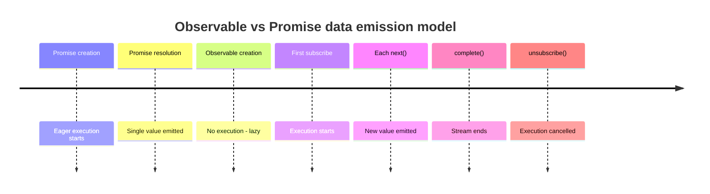
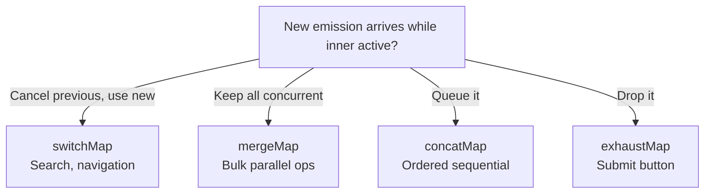

## Keywords in This File

{: .no_toc }

| # | Keyword | Difficulty |
|---|---------|------------|
| 1 | [RxJS Observables vs Promises](#rxjs-observables-vs-promises) | ★★☆ |
| 2 | [Core RxJS Operators](#core-rxjs-operators) | ★★☆ |

---

# RxJS Observables vs Promises

---

### 🎯 Model Answer

**30 seconds:**
> A Promise represents a single future value - it resolves
> once. An Observable represents a stream of zero or more
> values over time. Observables are lazy (nothing happens
> until you subscribe) and cancellable (unsubscribe stops
> execution). Promises are eager (execution starts immediately)
> and not cancellable. Observables are correct for event
> streams, user interactions, and WebSocket connections;
> Promises are correct for single async operations like
> HTTP requests.

**3 minutes:**
> The core distinction is cardinality and time:
>
> - Promise: 0 or 1 value, resolved once. After resolution,
>   it is a static value - `.then()` always returns the
>   same value.
>
> - Observable: 0 to N values, produced over time. Subscribing
>   starts the stream; unsubscribing stops it.
>
> Laziness: an Observable is a description of work, not the
> work itself. `new Observable(fn)` does not call `fn`.
> Calling `observable.subscribe()` calls `fn`. Two calls
> to `subscribe()` run `fn` twice - they are independent
> executions. This is cold observable behavior.
>
> Hot Observables share a single execution among all
> subscribers. Mouse clicks, WebSocket messages, and timer
> events are hot - they happen regardless of subscribers.
>
> Cancellation: `subscription.unsubscribe()` stops the
> observable. This is built into the model. Promise
> cancellation requires external mechanisms (AbortController).
>
> The practical rule: use Promises for single async values
> (fetch, database query, file read). Use Observables for
> streams (user input, real-time data, animations, any
> "things that happen repeatedly over time").

**Blank Mind Recovery:**

**(1) Restate:** "Promise = one value, eager, not cancellable.
Observable = stream of values, lazy, cancellable."

**(2) First principles:** "Two models of async: events
(things that happen over time, many of them) vs tasks
(one-shot operations with a result). Observables are for
events; Promises are for tasks."

---

### 📘 Concept Explanation

**What it is:**
An Observable is an object representing a lazy, push-based,
zero-to-many async values over time. RxJS is the JavaScript
implementation of the ReactiveX pattern, providing Observables
and a rich operator library.

**The problem it solves:**
Multiple values over time (event streams, real-time updates,
animations) cannot be modeled by Promises. Callback-based
event handling is hard to compose and cancel. Observables
provide a composable, cancellable stream model.

**How it works:**

```javascript
import {
  Observable, from, of, fromEvent, interval
} from 'rxjs';

// Creating Observables
const single = of(1, 2, 3); // synchronous values
const fromPromise = from(fetch('/api/data')); // from Promise
const clicks = fromEvent(button, 'click'); // from events
const ticker = interval(1000); // emit every 1s

// Observable contract: subscribe returns Subscription
const sub = clicks.subscribe({
  next: value => console.log('click:', value),
  error: err => console.error('error:', err),
  complete: () => console.log('complete')
});

// CANCELLATION: unsubscribe stops execution
setTimeout(() => sub.unsubscribe(), 5000);

// LAZINESS: nothing executes until subscribe
const obs = new Observable(subscriber => {
  console.log('this runs on subscribe, not here');
  subscriber.next(1);
  subscriber.next(2);
  subscriber.complete();
});
// obs created: nothing logged yet
obs.subscribe(v => console.log(v)); // now: 1, 2
obs.subscribe(v => console.log(v)); // again: 1, 2

// COLD vs HOT:
// Cold: each subscriber gets its own execution (above)
// Hot: all subscribers share one execution
import { Subject } from 'rxjs';
const hot = new Subject();
hot.subscribe(v => console.log('A:', v));
hot.subscribe(v => console.log('B:', v));
hot.next(1); // A: 1, B: 1 - both receive same value
```

**The key insight:**
Observables and Promises are not interchangeable. `from(promise)`
wraps a Promise as an Observable, but you lose the lazy
execution. `observable.toPromise()` (deprecated) or
`lastValueFrom(obs$)` converts to Promise but loses all
but the last value. Converting between models is a code smell
if done frequently.

**When to use it:**
User interaction streams (clicks, keystrokes, scroll);
WebSocket streams; search-as-you-type; drag and drop;
real-time data (stock prices, sensor data); animation;
anything requiring multiple values over time with composition.

**When NOT to use it:**
Simple HTTP requests (use async/await); one-shot operations;
when the team has no RxJS experience and the use case is not
stream-heavy.

**Alternatives:**
- Async generators: pull-based streams, simpler, no operator library
- EventEmitter (Node.js): push-based events without reactive operators
- Solid.js signals, Vue refs, MobX: reactive primitives for state
- Bacon.js, Most.js: alternative reactive stream libraries

**First-principles derivation:**
The four quadrants of data: sync/async x single/multiple.
Synchronous single: plain value. Synchronous multiple: array.
Asynchronous single: Promise. Asynchronous multiple: Observable.
RxJS fills the fourth quadrant.

---

### 💻 Code Example

```javascript
// BAD: Managing search-as-you-type with Promises
async function setupSearch(inputEl) {
  let lastQuery = '';

  inputEl.addEventListener('keyup', async (event) => {
    const query = event.target.value;
    if (query === lastQuery) return;
    lastQuery = query;

    // Race condition: earlier responses can arrive
    // after later ones if network is slow
    const results = await searchAPI(query);
    renderResults(results); // might render stale data
  });
  // No debouncing: API called for every keystroke
  // No cancellation: all in-flight requests complete
  // State management: manual, error-prone
}
```

> **Code walkthrough:** The BAD pattern manually tries to
> solve search-as-you-type but fails at three points: no
> debouncing means an API call per keystroke; no cancellation
> means stale responses can overwrite fresh results; and there
> is no way to cancel an in-flight request when the user keeps
> typing.

```javascript
// GOOD: RxJS operators handle all concerns declaratively
import { fromEvent } from 'rxjs';
import {
  debounceTime,
  distinctUntilChanged,
  switchMap,
  map,
  catchError,
  EMPTY
} from 'rxjs/operators';

function setupSearch(inputEl) {
  const subscription = fromEvent(inputEl, 'keyup').pipe(
    // Wait for 300ms pause in typing
    debounceTime(300),
    // Extract the search term
    map(event => event.target.value),
    // Ignore if same as previous value
    distinctUntilChanged(),
    // Cancel previous request, start new one
    switchMap(query =>
      from(searchAPI(query)).pipe(
        catchError(err => {
          console.error('Search failed:', err);
          return EMPTY; // empty observable = skip
        })
      )
    )
  ).subscribe(results => {
    renderResults(results);
  });

  // Return cleanup function
  return () => subscription.unsubscribe();
}
```

> **Code walkthrough:** `debounceTime(300)` waits for a 300ms
> pause in typing before emitting, reducing API calls by 80-90%.
> `distinctUntilChanged` prevents re-searching the same query.
> `switchMap` is the key operator: it cancels the previous
> inner observable (and its in-flight request if using an
> AbortController-aware Observable) before starting a new one.
> This eliminates the race condition. `catchError` returns
> `EMPTY` to skip failed requests without terminating the
> outer Observable. All state management is eliminated - the
> operators handle it.

---

### 🎓 Answers by Seniority

**Junior / Mid (0-5 years):**
> "Observables are like Promises but for multiple values
> over time. An Observable doesn't execute until you subscribe.
> You can cancel it with unsubscribe. Use Observables for
> event streams (clicks, search input, real-time data) and
> Promises for single async operations."

*Push deeper:* "When would you convert an Observable to a
Promise? When calling RxJS code from non-RxJS code - like
if an Angular service returns an Observable but the caller
expects a Promise. Use `lastValueFrom()` for this."

---

**Senior / Staff (5+ years):**
> "The Observable vs Promise choice is a data model choice,
> not just a syntax preference. Promises model tasks: HTTP
> requests, file reads, database queries. Observables model
> streams: user input, WebSockets, real-time feeds. The
> operational win of Observables in UI code is the elimination
> of manual state management for common patterns like
> search-as-you-type: `switchMap` is 3 lines of code solving
> a 30-line manual implementation."

---

### ⚠️ Common Misconceptions

**Misconception 1:** "Observables are just Promises with
multiple values."
The lazy execution model is the fundamental difference, not
just cardinality. A Promise starts executing when created.
An Observable starts executing on subscribe. Two subscriptions
to the same Observable run the observable function twice.

**Misconception 2:** "Observable streams are always async."
Observables can be synchronous. `of(1,2,3).subscribe(...)` runs
synchronously. The async/sync distinction is a property of
the Observable implementation, not the Observable model.

**Misconception 3:** "You can just convert Observables to
Promises when needed."
`lastValueFrom(obs$)` converts an Observable to a Promise but
takes only the LAST value. For Observables that emit multiple
values, you lose all but the last. It also removes laziness
and cancellation.

---

### 🚨 Failure Modes and Diagnosis

**Failure 1: Subscription memory leak**
```javascript
// BAD: Never unsubscribing
class Component {
  ngOnInit() {
    // Creates a subscription that is never cleaned up
    this.searchService.results$.subscribe(
      results => this.results = results
    );
    // When component is destroyed: subscription persists
    // Callbacks still fire: possible errors/state mutations
  }
}

// GOOD: Track and unsubscribe
class Component {
  private subs = new Subscription();

  ngOnInit() {
    this.subs.add(
      this.searchService.results$.subscribe(
        results => this.results = results
      )
    );
  }

  ngOnDestroy() {
    this.subs.unsubscribe(); // cleanup all subscriptions
  }
}
```

---

### 🎯 Interview Deep-Dive

| Category | Count | Coverage |
|---|---|---|
| Conceptual | 2 | Cold/hot, lazy/eager |
| Trade-off | 2 | When to choose Observable vs Promise |
| Failure Mode | 1 | Memory leak from missing unsubscribe |
| Debugging | 1 | Marble testing, debugging streams |
| Design | 2 | Search-as-you-type, real-time data |
| Behavioral | 1 | Introducing RxJS to a team |

**Q1. What is the difference between cold and hot
Observables?**

Cold Observable: the producer runs independently for each
subscriber. Each subscription starts its own execution.
Example: `from(fetch('/api'))` - each subscribe triggers a
new fetch.

Hot Observable: the producer runs once and all subscribers
share the same execution. Example: `fromEvent(button, 'click')`
- button click events happen once and are delivered to all
current subscribers.

```javascript
// Cold: independent execution per subscriber
const cold$ = new Observable(sub => {
  console.log('subscribing');  // runs per subscriber
  sub.next(Math.random());     // different for each
  sub.complete();
});
cold$.subscribe(v => console.log('A:', v)); // A: 0.42
cold$.subscribe(v => console.log('B:', v)); // B: 0.77

// Hot: shared execution
const subject = new Subject(); // hot by definition
subject.subscribe(v => console.log('A:', v));
subject.subscribe(v => console.log('B:', v));
subject.next(1); // both receive: A: 1, B: 1
```

*What separates good from great:* Knowing that cold Observables
can be "warmed" (converted to hot) using `share()` and
`shareReplay()` operators. And that `shareReplay(1)` is the
idiomatic way to cache the most recent value for late subscribers.

---

**Q2. When should you use Observables instead of async/await?**

Use Observables when:
- The data source emits multiple values over time (user events,
  WebSockets, SSE)
- You need cancellation of ongoing operations (search, navigation)
- You need complex stream operators (debounce, throttle, retry,
  buffer, window, combineLatest)
- You need multicasting (multiple subscribers, one execution)

Use async/await when:
- The operation produces a single result (HTTP request, DB query)
- The team is not familiar with reactive patterns
- There is no stream transformation needed
- You want minimal dependencies

The pattern in Angular applications: services return Observables
(because Angular's HTTP client, Router, and FormControl all
use Observables), components subscribe in templates with
`AsyncPipe` or in code with proper cleanup.

*What separates good from great:* Articulating the crossover
point: async/await with manual event handling scales to about
3-4 event types. Beyond that, the code complexity of managing
state, cancellation, and composition manually equals the
RxJS learning curve.

---

**Q3. How does `switchMap` eliminate the search-as-you-type
race condition?**

`switchMap` maps each source emission to an inner Observable,
and cancels the PREVIOUS inner Observable when a new source
emission arrives.

For search: each keystroke is a source emission. `switchMap`
cancels the in-flight search request Observable for the previous
query when a new keystroke arrives. The race condition is
eliminated because only the most recent search can produce
a result.

```javascript
input$.pipe(
  switchMap(query => searchAPI$(query))
).subscribe(displayResults);

// If user types "j", "ja", "jav":
// - "j" search starts
// - "ja" typed: "j" search cancelled, "ja" starts
// - "jav" typed: "ja" search cancelled, "jav" starts
// Only "jav" results ever display
```

The key: when `switchMap` receives a new source value, it
calls `unsubscribe()` on the current inner observable.
If the inner observable was created from a fetch with
AbortController integration, the actual HTTP request is
cancelled.

*What separates good from great:* Knowing when NOT to use
`switchMap`: if the operations must all complete (bulk saves,
parallel form field validation). Use `mergeMap` for concurrent,
`concatMap` for ordered sequential, `exhaustMap` for ignore-
new-while-processing.

---

**Q4. Describe the four mapping operators and when to use each.**

`switchMap(fn)`: cancel previous inner, start new. Use for:
search, autocomplete, navigation (any time new supersedes old).

`mergeMap(fn)`: start new without cancelling others - all run
concurrently. Use for: parallel requests where all results
are needed, bulk processing.

`concatMap(fn)`: queue incoming emissions, process sequentially.
Use for: ordered operations that must not interleave
(sequential saves, ordered messages).

`exhaustMap(fn)`: ignore new emissions while inner is active.
Use for: login button (ignore double-clicks), submit buttons
(process first submit, ignore until done).

```javascript
// switchMap: search
search$.pipe(switchMap(q => searchAPI(q)))

// mergeMap: parallel saves
files$.pipe(mergeMap(f => saveFile(f)))

// concatMap: sequential in-order
messages$.pipe(concatMap(m => sendMessage(m)))

// exhaustMap: form submit
submit$.pipe(exhaustMap(() => submitForm()))
```

Memory device: Switch = latest wins. Merge = all concurrent.
Concat = ordered queue. Exhaust = first wins while active.

*What separates good from great:* Knowing that `mergeMap` can
cause unbounded concurrency (use `mergeMap(fn, N)` with a
concurrency limit) and that `concatMap` can cause unbounded
buffering if the source emits faster than the inner processes.

---

**Q5. What is the async pipe in Angular and what does it
automate?**

Angular's `async` pipe subscribes to an Observable (or Promise)
in a template, updates the view on each emission, and
automatically unsubscribes when the component is destroyed.

```typescript
// Without async pipe: manual subscription management
class Component implements OnDestroy {
  data: Data | null = null;
  private sub = new Subscription();

  ngOnInit() {
    this.sub.add(
      this.service.data$.subscribe(d => this.data = d)
    );
  }

  ngOnDestroy() { this.sub.unsubscribe(); }
}
// Template: {{ data?.value }}

// With async pipe: automatic
class Component {
  data$ = this.service.data$; // just expose the Observable
}
// Template: {{ (data$ | async)?.value }}
// async pipe subscribes, updates, and unsubscribes automatically
```

The `async` pipe also triggers change detection when the
Observable emits - critical for `OnPush` change detection
strategy where manual subscriptions require `markForCheck()`.

*What separates good from great:* Understanding that `async`
pipe is the idiomatic Angular pattern for reactive data, and
why it is preferred over manual subscriptions: no memory leak
risk, no lifecycle management, and automatic change detection
integration.

---

**Q6. How do you debug an RxJS stream that is not emitting
expected values?**

Step 1: Add `tap` operators to log intermediate values:
```javascript
data$.pipe(
  tap(v => console.log('after filter:', v)), // checkpoint
  filter(v => v.active),
  tap(v => console.log('after active filter:', v)),
  map(v => transform(v)),
  tap(v => console.log('after transform:', v))
).subscribe(v => console.log('subscriber:', v));
```

Step 2: Check subscription - is the Observable cold and
never subscribed?

Step 3: Check operators - is a filter removing all values?

Step 4: Check hot/cold - for hot sources, did subscription
happen after emissions?

Step 5: Use marble testing for complex streams:
```javascript
// Marble testing with rxjs/testing
const scheduler = new TestScheduler((actual, expected) => {
  expect(actual).toEqual(expected);
});
scheduler.run(({ cold, expectObservable }) => {
  const input$ = cold('--a--b--c');
  const output$ = input$.pipe(filter(x => x !== 'b'));
  expectObservable(output$).toBe('--a-----c');
});
```

*What separates good from great:* Marble testing syntax
and the TestScheduler pattern. It allows testing time-based
operators like `debounceTime` and `delay` synchronously
in unit tests.

---

**Q7. How does `shareReplay` solve the "late subscriber"
problem?**

Without `shareReplay`, a cold Observable re-runs its source
for each subscriber. This means two components each subscribing
to an HTTP request trigger two HTTP calls.

`shareReplay(1)` multicasts the Observable (converts cold
to hot) and caches the N most recent emissions for late
subscribers:

```javascript
// Without shareReplay: two HTTP calls
const data$ = this.http.get('/api/data');
data$.subscribe(d => console.log('A:', d)); // call 1
data$.subscribe(d => console.log('B:', d)); // call 2

// With shareReplay(1): one HTTP call
const data$ = this.http.get('/api/data')
  .pipe(shareReplay(1));
data$.subscribe(d => console.log('A:', d)); // call 1
data$.subscribe(d => console.log('B:', d)); // same call
// Late subscriber receives cached value immediately
```

`shareReplay(1)` is the standard pattern for shared HTTP
requests in Angular services.

*What separates good from great:* Knowing the `{refCount: true}`
option: `shareReplay({bufferSize: 1, refCount: true})` auto-
unsubscribes the source when all subscribers unsubscribe.
The default (`refCount: false`) keeps the subscription alive,
which is correct for services but can be a memory issue in
some patterns.

---

**Q8. What happens to a Subject's emissions if there are
no subscribers?**

Emissions are lost. A Subject is hot - it does not buffer.
`subject.next(1)` when no one is subscribed: 1 is gone forever.

```javascript
const subject = new Subject();
subject.next(1); // lost - no subscribers
subject.subscribe(v => console.log(v)); // subscribes
subject.next(2); // received: 2
```

Solutions for late subscribers:
- `BehaviorSubject(initialValue)`: replays the last value
  to new subscribers
- `ReplaySubject(n)`: replays last n values
- `shareReplay(1)` on an Observable: same effect without
  using Subject directly

Use case choice:
- `BehaviorSubject`: current state (user profile, theme,
  selected item)
- `ReplaySubject(1)`: last event (for when initial value
  is not meaningful before first emission)

*What separates good from great:* Knowing all three Subject
types and their specific use cases. `BehaviorSubject` for
current state is the most common pattern in Angular services.

### ⚖️ Comparison Table

| Feature | Promise | Observable (Cold) | Observable (Hot) |
|---|---|---|---|
| Cardinality | 1 value | 0-N values | 0-N values |
| Execution | Eager (on create) | Lazy (on subscribe) | Independent |
| Cancellation | No (needs AbortController) | Yes (unsubscribe) | Yes (unsubscribe) |
| Multicasting | Built-in (same resolution) | No (each sub = new execution) | Yes |
| Error handling | .catch() / try/catch | catchError operator | catchError operator |
| Completion | Implicit after resolve | Explicit complete() | Explicit/never |
| Use case | Single async result | Streams, events | Shared event streams |

**The deciding factor:**
One async result: Promise. Stream of values: Observable.
Observable can wrap Promise (`from(promise)`); Promise can
wrap Observable (`lastValueFrom(obs$)`). When in doubt and
working in an RxJS-heavy codebase (Angular), prefer Observable
for consistency.

### 🏛️ System Design

*(Omit: ★★☆ - not applicable)*

### 📊 Diagram

```
PROMISE vs OBSERVABLE TIMELINE
================================

Promise (single value, eager):
  create:      P---------->
                    ^resolved
  subscribe1:  ----[then]->
  subscribe2:  --[then]->
  (both get same resolved value)

Cold Observable (lazy, per-subscriber):
  create:      [not running]
  subscribe1:  ---[1]-[2]-[3]-->
  subscribe2:  ---[1]-[2]-[3]-->
  (each subscriber = independent execution)

Hot Observable (shared emission):
  create/run:  ---[1]-[2]-[3]-[4]-->
  subscribe1:       [2]-[3]-[4]-->
  subscribe2:            [3]-[4]-->
  (subscribers receive only future emissions)
```



> **Diagram walkthrough:** The timeline shows the fundamental
> difference between Promises and Observables. A Promise
> begins executing immediately and resolves once - all
> subscribers receive the same single value regardless of
> when they subscribe. A cold Observable starts executing
> only when subscribed, and each subscriber gets its own
> independent execution. A hot Observable runs independently
> and subscribers only receive future emissions after they
> subscribe - like joining a live stream midway through.

---

---

# Core RxJS Operators

---

### 🎯 Model Answer

**30 seconds:**
> RxJS operators are pure functions that transform Observables.
> The most important: `map` (transform values), `filter`
> (select values), `switchMap` (cancel-and-replace inner
> Observable), `mergeMap` (concurrent inner Observables),
> `concatMap` (sequential), `debounceTime` (wait for pause
> in emissions), and `distinctUntilChanged` (skip duplicates).
> Operators are composed with `.pipe()`.

**3 minutes:**
> RxJS operators fall into categories based on what they do
> to the Observable stream:
>
> Transformation: `map`, `pluck`, `mapTo`, `scan` (accumulate)
>
> Filtering: `filter`, `take`, `skip`, `distinctUntilChanged`,
> `debounceTime`, `throttleTime`, `takeUntil`
>
> Combination: `merge`, `combineLatest`, `zip`, `forkJoin`,
> `withLatestFrom`
>
> Flattening (higher-order): `switchMap`, `mergeMap`,
> `concatMap`, `exhaustMap` - these handle Observables-
> of-Observables (when each source emission produces a new
> Observable)
>
> Error handling: `catchError`, `retry`, `retryWhen`
>
> Utility: `tap` (side effects without transformation),
> `delay`, `timeout`, `finalize`
>
> The pipe-based composition model chains these transformations.
> Each operator takes an Observable and returns a new Observable.
> The original Observable is not modified. This is the functor
> pattern applied to async streams.

**Blank Mind Recovery:**

**(1) Restate:** "RxJS operators transform Observable streams.
Map, filter, switchMap, debounceTime, distinctUntilChanged
are the most important for common UI patterns."

**(2) First principles:** "An operator is a function that
takes an Observable and returns a new Observable. The same
principle as Array.map/filter, applied to async streams."

---

### 📘 Concept Explanation

**What it is:**
RxJS operators are pure functions that transform an Observable
stream. They are composed using the `.pipe()` method, creating
a processing pipeline. Each operator returns a new Observable;
the original is not modified.

**The problem it solves:**
Complex async event orchestration requires multiple transformations
(filter, transform, debounce, cancel, combine). Without operators,
this logic is manual, error-prone, and hard to test.

**How it works:**

```javascript
import {
  from, interval, fromEvent, EMPTY
} from 'rxjs';
import {
  map, filter, switchMap, mergeMap, concatMap,
  debounceTime, throttleTime, distinctUntilChanged,
  takeUntil, take, scan, catchError, retry,
  tap, combineLatest, withLatestFrom, shareReplay
} from 'rxjs/operators';

// TRANSFORMATION OPERATORS
const doubled$ = from([1,2,3]).pipe(
  map(n => n * 2) // [2, 4, 6]
);

const sum$ = from([1,2,3,4,5]).pipe(
  scan((acc, n) => acc + n, 0)
  // 1, 3, 6, 10, 15 (running total)
);

// FILTERING OPERATORS
const evens$ = from([1,2,3,4]).pipe(
  filter(n => n % 2 === 0) // [2, 4]
);

const first3$ = interval(1000).pipe(
  take(3) // emits 0, 1, 2 then completes
);

// TIME-BASED FILTERING
const debouncedClick$ = fromEvent(button, 'click').pipe(
  debounceTime(300) // emit after 300ms quiet period
);
const throttledScroll$ = fromEvent(window, 'scroll').pipe(
  throttleTime(100) // emit at most once per 100ms
);

// FLATTENING OPERATORS (common source of confusion)
const results$ = search$.pipe(
  switchMap(q => from(searchAPI(q))) // cancel prev, switch
);

const allSaved$ = files$.pipe(
  mergeMap(f => from(saveFile(f))) // all concurrent
);

// COMBINATION OPERATORS
const combined$ = combineLatest([
  user$, permissions$
]).pipe(
  map(([user, perms]) => ({ ...user, perms }))
  // emits when EITHER updates, with latest of both
);

// LIFECYCLE OPERATORS
const component$ = stream$.pipe(
  takeUntil(destroy$) // complete when destroy$ emits
);
```

**The key insight:**
The `takeUntil(destroy$)` pattern is the correct way to
unsubscribe when a component is destroyed. Instead of tracking
subscriptions manually, create a `destroy$` Subject, emit
once in `ngOnDestroy`, and all streams using `takeUntil(destroy$)`
complete automatically.

**When to use it:**
All RxJS streams. Operators are the primary API - using
Subjects and subscriptions without operators typically means
you are missing the right operator.

**When NOT to use it:**
When array operators are sufficient: `map`, `filter`, `reduce`
on synchronous arrays do not need RxJS. Only convert to
Observable when you need time-based or async behavior.

**Alternatives:**
- Native array methods for synchronous data
- Lodash/Ramda for functional transformation of sync data
- Immer for immutable state updates

**First-principles derivation:**
An operator is a higher-order function: it takes a transform
function and returns a function from Observable to Observable.
`map(fn)` returns `obs => obs.pipe(Observable.map(fn))`.
The pipe model is function composition: `pipe(f, g, h)` is
`x => h(g(f(x)))` applied to Observables.

---

### 💻 Code Example

```javascript
// BAD: Manual event handling for autocomplete
let debounceTimer;
let lastAbortController;

inputEl.addEventListener('input', event => {
  clearTimeout(debounceTimer);
  lastAbortController?.abort();

  debounceTimer = setTimeout(async () => {
    const query = event.target.value;
    if (query === previousQuery) return;
    previousQuery = query;

    lastAbortController = new AbortController();
    try {
      const resp = await fetch(
        `/api/search?q=${query}`,
        { signal: lastAbortController.signal }
      );
      const results = await resp.json();
      renderResults(results);
    } catch (err) {
      if (err.name !== 'AbortError') {
        showError(err);
      }
    }
  }, 300);
});
// 30+ lines of manual state management
```

> **Code walkthrough:** The BAD pattern manually implements
> what three RxJS operators handle declaratively: `debounceTime`
> (the setTimeout), `distinctUntilChanged` (the `previousQuery`
> check), and `switchMap` (the AbortController cancellation).
> All three concerns are interleaved with the actual fetch logic.

```javascript
// GOOD: Same behavior with RxJS operators
import { fromEvent, from } from 'rxjs';
import {
  debounceTime, map, distinctUntilChanged,
  switchMap, catchError
} from 'rxjs/operators';

function setupAutocomplete(inputEl, containerEl) {
  const destroy$ = new Subject<void>();

  fromEvent(inputEl, 'input').pipe(
    map(e => e.target.value),
    debounceTime(300),
    distinctUntilChanged(),
    switchMap(query =>
      from(fetch(`/api/search?q=${query}`)
        .then(r => r.json())
      ).pipe(
        catchError(err => {
          showError(err);
          return EMPTY;
        })
      )
    ),
    takeUntil(destroy$) // cleanup on component destroy
  ).subscribe(results => renderResults(results));

  // Return cleanup function
  return () => {
    destroy$.next();
    destroy$.complete();
  };
}
```

> **Code walkthrough:** The pipeline reads as a specification:
> "on input events, map to value, wait for 300ms pause, skip
> duplicates, cancel previous and fetch new, handle errors,
> stop when destroyed." Each operator has a single responsibility.
> `takeUntil(destroy$)` automates cleanup - calling the returned
> function emits on `destroy$`, completing all downstream
> operators and unsubscribing. The business logic (render results,
> show error) is isolated from the orchestration logic.

---

### 🎓 Answers by Seniority

**Junior / Mid (0-5 years):**
> "I use `.pipe()` to chain operators. `map` transforms values,
> `filter` selects values, `debounceTime` waits for a pause,
> `switchMap` cancels previous and starts new. The four
> mapping operators are the hardest: switchMap for search,
> mergeMap for parallel, concatMap for sequential, exhaustMap
> for ignore-new."

---

**Senior / Staff (5+ years):**
> "The operator I watch for in code review: switchMap vs
> mergeMap. switchMap is often the right choice for UI (latest
> wins) but wrong for save operations (you want all saves
> to complete). The `takeUntil(destroy$)` pattern over manual
> subscription management is non-negotiable - manual subscription
> arrays are a memory leak waiting to happen. For observable
> composition, `combineLatest` for derived state (both sources
> needed) vs `withLatestFrom` for sampling (only care about
> current value when main source emits)."

---

### ⚠️ Common Misconceptions

**Misconception 1:** "`switchMap` cancels the HTTP request."
`switchMap` cancels the inner Observable. It only cancels the
HTTP request if the Observable was created with AbortController
support. `from(fetch(...))` does NOT support cancellation - the
fetch continues even after the inner Observable is unsubscribed.
Use the `fromFetch` operator from `rxjs/fetch` which integrates
AbortController.

**Misconception 2:** "`combineLatest` emits when all sources
complete."
`combineLatest` emits whenever ANY source emits AND all sources
have emitted at least one value. `forkJoin` waits for all
sources to complete.

**Misconception 3:** "`mergeMap` preserves order."
`mergeMap` runs all inner Observables concurrently and emits
values as they arrive - order is not preserved. For order
preservation, use `concatMap` (sequential) or `switchMap`
(only the latest matters).

---

### 🚨 Failure Modes and Diagnosis

**Failure 1: switchMap with fetch does not cancel HTTP**
```javascript
// BAD: from(fetch()) not cancellable
const results$ = search$.pipe(
  switchMap(q => from(fetch(`/api?q=${q}`)))
);
// Fetch continues even after switchMap unsubscribes

// GOOD: fromFetch integrates AbortController
import { fromFetch } from 'rxjs/fetch';
const results$ = search$.pipe(
  switchMap(q => fromFetch(`/api?q=${q}`))
);
// fetchAborted: actual network request cancelled
```

**Failure 2: combineLatest blocks until all sources emit**
```javascript
const a$ = interval(1000); // starts emitting
const b$ = new Subject();  // never emitted yet

const combined$ = combineLatest([a$, b$]).subscribe(
  ([a, b]) => console.log(a, b)
);
// Nothing emits until b$ emits at least once
// Diagnosis: add tap before combineLatest to check
// which source is not emitting
```

---

### 🎯 Interview Deep-Dive

| Category | Count | Coverage |
|---|---|---|
| Conceptual | 2 | Operator categories, pipe composition |
| Trade-off | 2 | Operator selection, combineLatest vs withLatestFrom |
| Failure Mode | 1 | switchMap + fetch cancellation |
| Debugging | 1 | tap operator for stream debugging |
| Design | 2 | Real-time dashboard, form validation |
| Behavioral | 1 | Code review of incorrect operator choice |

**Q1. What is the difference between `combineLatest` and
`withLatestFrom`?**

Both combine two Observables, but they differ in what triggers
an emission:

`combineLatest([a$, b$])`: emits whenever EITHER source emits
a new value (after both have emitted at least once). Both
values are always the latest.

`withLatestFrom(b$)`: emits only when the SOURCE (a$) emits,
sampling the latest value from b$. b$ emitting does not
trigger an emission.

```javascript
// combineLatest: derived state that updates with either
const dashboard$ = combineLatest([
  user$, settings$
]).pipe(
  map(([user, settings]) => buildView(user, settings))
);
// Updates when user OR settings changes

// withLatestFrom: sample context when main event occurs
const saveWithUser$ = saveButton$.pipe(
  withLatestFrom(currentUser$),
  map(([_, user]) => ({ userId: user.id, ...formData }))
);
// Only fires when save button clicked,
// uses current user at that moment
```

*What separates good from great:* Choosing based on "what
drives the emission": if both sources drive it, `combineLatest`;
if only the primary source drives it and you need context
from secondary, `withLatestFrom`.

---

**Q2. How do you implement real-time form validation with
RxJS?**

```javascript
const username$ = fromEvent(usernameInput, 'input').pipe(
  map(e => e.target.value),
  debounceTime(400),         // wait for typing pause
  distinctUntilChanged(),    // skip if same value
  switchMap(value =>
    validateUsername(value).pipe( // async validation
      map(result => ({ value, valid: result.available })),
      catchError(() => of({ value, valid: false, error: true }))
    )
  ),
  shareReplay(1) // share across multiple subscribers
);

// Display validation state
username$.subscribe(({ value, valid }) => {
  indicator.className = valid ? 'valid' : 'invalid';
});

// Only enable submit when form is valid
const submitEnabled$ = combineLatest([
  username$.pipe(map(u => u.valid)),
  email$.pipe(map(e => e.valid)),
  password$.pipe(map(p => p.valid))
]).pipe(
  map(allValid => allValid.every(Boolean))
);

submitEnabled$.subscribe(enabled => {
  submitButton.disabled = !enabled;
});
```

*What separates good from great:* Using `combineLatest` for
form-wide validity that combines individual field streams.
The full solution composes individual field validations
into a holistic form state without manual coordination.

---

**Q3. What is the `tap` operator and when should you use it?**

`tap(fn)` performs a side effect for each emission without
affecting the value. The stream passes through unchanged.

Use cases:
- Debugging: log intermediate values
- Side effects: cache results, update metrics, trigger notifications
- State updates that should not change the stream value

```javascript
const data$ = api$.pipe(
  tap(v => console.log('before transform:', v)),
  map(v => transform(v)),
  tap(v => console.log('after transform:', v)),
  tap(v => cache.set(key, v)), // side effect: caching
  map(v => v.items) // continue transforming
);
```

`tap` is the operator-safe way to include side effects.
Putting side effects inside `map` works but implies a relationship
between the side effect and the transformation that does not
exist.

*What separates good from great:* Removing `tap(console.log)`
calls before production deployment. `tap` for logging is
a development/debugging tool. Production `tap` use cases
(metrics, caching) should be intentional and documented.

---

**Q4. How do `retry` and `retryWhen` differ for error
recovery?**

`retry(N)`: resubscribes to the source Observable N times
on error. No delay, no backoff.

`retryWhen(errors$)`: receives an Observable of errors and
resubscribes when that Observable emits. Used for backoff.

```javascript
// retry: 3 attempts immediately
api$.pipe(
  retry(3)
)

// retryWhen: exponential backoff
import { timer } from 'rxjs';
import { mergeMap } from 'rxjs/operators';

api$.pipe(
  retryWhen(errors$ =>
    errors$.pipe(
      mergeMap((err, attempt) => {
        if (attempt >= 3) throw err; // give up
        return timer(Math.pow(2, attempt) * 100);
        // 100ms, 200ms, 400ms
      })
    )
  )
)
```

RxJS 7+: `retry({count: 3, delay: (err, i) => timer(...)})` -
cleaner API combining both behaviors.

*What separates good from great:* Knowing to check the error
type in `retryWhen` - retrying a 400 Bad Request or 401
Unauthorized is wrong. Only retry transient errors.

---

**Q5. How do you implement a "real-time dashboard" that
combines multiple data streams?**

```javascript
// Multiple data sources
const prices$ = webSocket('/prices').pipe(shareReplay(1));
const trades$ = webSocket('/trades').pipe(shareReplay(1));
const alerts$ = webSocket('/alerts').pipe(shareReplay(1));
const user$ = from(getUser()).pipe(shareReplay(1));

// Combined dashboard view
const dashboard$ = combineLatest([
  prices$,
  trades$,
  user$
]).pipe(
  map(([prices, trades, user]) => ({
    prices: filterByPermissions(prices, user),
    trades: trades.filter(t => t.userId === user.id),
    lastUpdate: Date.now()
  })),
  distinctUntilChanged(deepEqual),  // avoid re-renders
  throttleTime(50, asyncScheduler, {
    leading: true, trailing: true
  }) // max 20 updates/sec
);

// Alerts go through a separate pipeline
const urgentAlerts$ = alerts$.pipe(
  filter(a => a.severity === 'critical'),
  take(10) // show latest 10
);
```

*What separates good from great:* The `throttleTime` with
`{leading: true, trailing: true}` - this emits the first
value immediately (leading), then the last value after the
throttle period (trailing), preventing both stale UI and
overwhelming rendering.

---

**Q6. What are scheduler in RxJS and when do they matter?**

RxJS schedulers control when Observable subscriptions and
emissions happen. They determine the execution context.

Common schedulers:
- `asyncScheduler` (default for time operators): wraps in
  `setTimeout`/`setInterval`
- `animationFrameScheduler`: wraps in `requestAnimationFrame`
  - use for smooth animations
- `queueScheduler`: synchronous, recursive - current task
- `asapScheduler`: microtask queue (Promise.resolve)

```javascript
import { animationFrameScheduler } from 'rxjs';
import { observeOn } from 'rxjs/operators';

const smoothAnimation$ = values$.pipe(
  observeOn(animationFrameScheduler) // batch to rAF
);

// Use animationFrameScheduler for rendering
positions$.pipe(
  throttleTime(0, animationFrameScheduler)
).subscribe(pos => updateDOMPosition(pos));
```

*What separates good from great:* Knowing that `animationFrameScheduler`
is the correct scheduler for DOM updates - it synchronizes
with the browser's render cycle, preventing visual artifacts
from updating DOM between frames.

---

**Q7. How do you test RxJS code, and what is marble testing?**

Marble testing uses a string notation to describe Observable
timing and values, enabling synchronous testing of async
streams:

Marble syntax:
- `-` : 10ms time frame
- `a`, `b`, `c` : emissions with label
- `|` : completion
- `#` : error
- `(ab)` : synchronous emissions
- `^` : subscription point

```javascript
import { TestScheduler } from 'rxjs/testing';

const scheduler = new TestScheduler((actual, expected) => {
  expect(actual).toEqual(expected);
});

it('debounceTime works correctly', () => {
  scheduler.run(({ cold, hot, expectObservable }) => {
    const input = hot('--a--b--------c|');
    const expected =  '----------b--------c|';
    // a emitted then b 50ms later: a debounced
    // b emitted then quiet 300ms: b passes

    const result = input.pipe(
      debounceTime(300, scheduler)
    );
    expectObservable(result).toBe(expected);
  });
});
```

The TestScheduler virtualizes time - the entire test runs
synchronously while simulating the passage of time.

*What separates good from great:* Using marble testing for
time-based operators instead of `setTimeout` in tests.
Marble tests are synchronous, deterministic, and express
the timing clearly in the test string.

### ⚖️ Comparison Table

| Operator | Behavior | Concurrent | Order | Use Case |
|---|---|---|---|---|
| `switchMap` | Cancel prev, start new | 1 (latest) | N/A | Search, navigation |
| `mergeMap` | All concurrent | Unlimited | Not preserved | Bulk saves |
| `concatMap` | Queue sequentially | 1 (oldest) | Preserved | Ordered messages |
| `exhaustMap` | Ignore while active | 1 (first) | Preserved | Submit buttons |
| `debounceTime` | Emit after quiet period | N/A | Yes | Search, resize |
| `throttleTime` | Rate limit | N/A | Yes | Scroll, mousemove |
| `combineLatest` | Emit on any source | N/A | Yes | Derived state |
| `withLatestFrom` | Emit on primary only | N/A | Yes | Sampling context |

**The deciding factor:**
For inner Observables: draw the use case as a marble diagram,
then match the cancellation/concurrency semantics. For time-based:
debounce for "wait for pause," throttle for "rate limit."

### 🏛️ System Design

*(Omit: ★★☆ - not applicable)*

### 📊 Diagram

```
FLATTENING OPERATORS - MARBLE DIAGRAM
========================================
Source: --A---B------C--->
        Each letter triggers inner obs: ----x|

switchMap: (cancel prev on new)
  --A: ----a| starts
  ---B: ---a cancelled, ----b| starts
  ----------b
  ------C: ----c| starts
  Result: ----------b------c

mergeMap: (all concurrent)
  A: ----a| , B: ----b| , C: ----c|
  Result: -------a--b-----c

concatMap: (queue, sequential)
  A: ----a| completes, then B starts
  B: ----b| completes, then C starts
  C: ----c|
  Result: ----a----b----c

exhaustMap: (ignore while active)
  A: ----a| still running when B arrives
  B: ignored (A active)
  Result: ----a (B lost) ------c
```



> **Diagram walkthrough:** The marble diagrams show the four
> flattening operators side by side with the same source
> stream. `switchMap` keeps only the latest inner Observable
> active - when C arrives, the B inner Observable is cancelled.
> `mergeMap` lets all three run concurrently, emitting results
> as they arrive. `concatMap` forces strict sequential execution,
> which preserves order but increases total time. `exhaustMap`
> drops B entirely because A was still active - correct for
> operations where you want to ignore duplicate triggers.