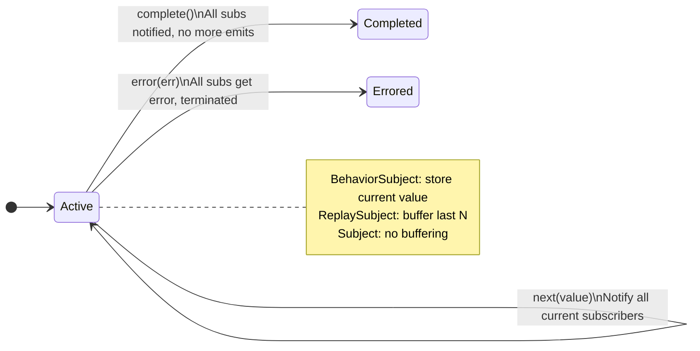
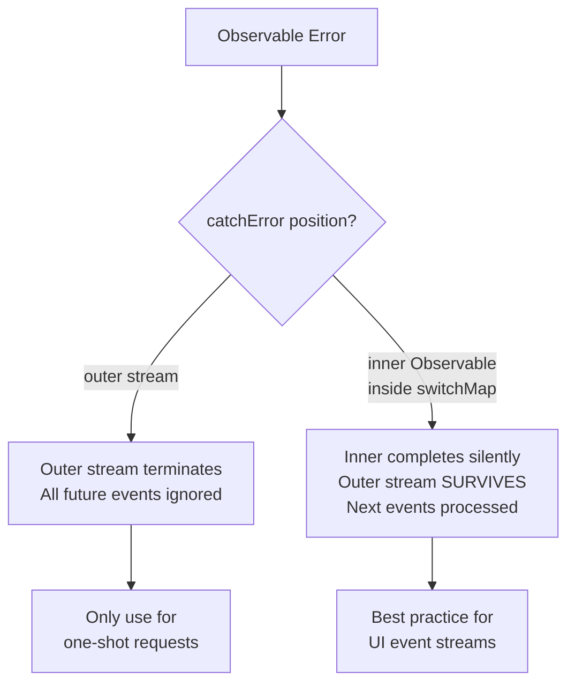

## Keywords in This File

{: .no_toc }

| # | Keyword | Difficulty |
|---|---------|------------|
| 1 | [RxJS Subjects and Multicasting](#rxjs-subjects-and-multicasting) | ★★☆ |
| 2 | [Error Handling in RxJS Pipelines](#error-handling-in-rxjs-pipelines) | ★★☆ |

---

# RxJS Subjects and Multicasting

---

### 🎯 Model Answer

**30 seconds:**
> A Subject is both an Observable and an Observer: you can
> subscribe to it AND push values into it with `next()`.
> Subjects enable multicasting - one execution shared by
> multiple subscribers. `BehaviorSubject` replays the last
> value to new subscribers. `ReplaySubject(N)` replays the
> last N. `shareReplay(1)` converts a cold Observable to
> a hot multicasted one without exposing the Subject.

**3 minutes:**
> Normal Observables are unicast: each `subscribe()` creates
> an independent execution. If two components subscribe to
> `http.get('/api/data')`, two HTTP requests are made. This
> is correct for some use cases and wasteful for others.
>
> Subjects solve multicasting: all subscribers share one
> execution. When you call `subject.next(value)`, ALL current
> subscribers receive the value simultaneously.
>
> Four Subject types:
>
> `Subject`: basic multicasting, no replay. Late subscribers
> miss emissions before their subscription.
>
> `BehaviorSubject(initial)`: stores the most recent value.
> New subscribers immediately receive the current value.
> Correct for state values (current user, theme, selected item).
>
> `ReplaySubject(N)`: stores the last N emissions. New
> subscribers receive N buffered values immediately. Correct
> when late subscribers need history.
>
> `AsyncSubject`: only emits the last value, and only when
> the source completes. Analogous to Promise: one value,
> on completion.
>
> `shareReplay(1)` vs `BehaviorSubject`: `shareReplay` wraps
> a cold Observable (like HTTP) to multicast it, with the
> last value replayed. `BehaviorSubject` is an imperative
> source you push values into. Use `shareReplay` when the
> source is an existing Observable; use `BehaviorSubject`
> when you need a settable state container.

**Blank Mind Recovery:**

**(1) Restate:** "Subject = Observable + Observer. Multicasts
to all subscribers. BehaviorSubject caches current value."

**(2) First principles:** "Multiple consumers, one source.
Without multicasting, each consumer triggers the source
independently (two HTTP requests). With multicasting, one
source serves all consumers."

---

### 📘 Concept Explanation

**What it is:**
A Subject is an Observable that can be manually triggered
with `next()`, `error()`, and `complete()`. It multicasts
to all subscribers. The four Subject variants differ in
how they handle late subscribers and buffering.

**The problem it solves:**
Multiple components needing the same data source without
causing multiple executions. Bridging imperative event-driven
code (DOM events, WebSockets) into the reactive stream model.

**How it works:**

```javascript
import {
  Subject, BehaviorSubject, ReplaySubject, AsyncSubject
} from 'rxjs';
import { share, shareReplay, multicast, refCount } from 'rxjs';

// Basic Subject: no replay
const events$ = new Subject();
events$.subscribe(v => console.log('A:', v));
events$.next(1); // A: 1
events$.subscribe(v => console.log('B:', v)); // subscribes late
events$.next(2); // A: 2, B: 2 (B joined before this)
// B missed value 1

// BehaviorSubject: replay latest value
const state$ = new BehaviorSubject({ loading: false });
state$.subscribe(v => console.log('A:', v.loading)); // false
state$.next({ loading: true });
state$.subscribe(v => console.log('B:', v.loading)); // true (late!)
// B immediately gets current value: true

// Common service pattern:
class UserService {
  private _user$ = new BehaviorSubject(null);
  readonly user$ = this._user$.asObservable(); // read-only

  setUser(user) { this._user$.next(user); }
  getCurrentUser() { return this._user$.getValue(); }
}

// ReplaySubject: replay last N
const history$ = new ReplaySubject(3); // buffer 3
history$.next(1); history$.next(2); history$.next(3);
history$.subscribe(v => console.log(v)); // 1, 2, 3
history$.next(4);
// Later subscriber:
history$.subscribe(v => console.log('late:', v)); // 2, 3, 4

// shareReplay: multicast an existing cold Observable
import { shareReplay } from 'rxjs/operators';
const sharedData$ = this.http.get('/api/config').pipe(
  shareReplay(1) // cache last value, share execution
);
// Multiple subscribers trigger ONE HTTP request
sharedData$.subscribe(a => console.log('A:', a));
sharedData$.subscribe(b => console.log('B:', b));
// ONE request, both receive the result
```

> **Code walkthrough:** This example demonstrates the core pattern in action. The key mechanism shows how the concept works in practice. Study the structure to understand the essential behavior and common usage.

**The key insight:**
`BehaviorSubject` requires an initial value. If "no value
yet" is a valid state, `BehaviorSubject(null)` then checking
for null, or `ReplaySubject(1)` (no initial value, emits
once data arrives), is the correct choice. `BehaviorSubject`
with a forced "empty" initial value is a common code smell.

**When to use it:**
Services that hold shared state (user, cart, notifications).
Bridging event-driven APIs (WebSocket messages) into reactive
streams. Sharing expensive computations (HTTP requests,
derived data) across multiple consumers.

**When NOT to use it:**
When each subscriber should have an independent execution
(e.g., form validation where each form instance needs its
own stream). Do not expose Subjects directly as public API -
always expose `.asObservable()` to prevent external code
from calling `next()`.

**Alternatives:**
- Redux/NgRx/Zustand: full state management with more structure
- Signals (Angular 17+, Solid.js): simpler reactive primitives
- React Context + useReducer: non-Observable state sharing

**First-principles derivation:**
A cold Observable is like a function - each call creates a
new execution. A hot Subject is like a variable - all readers
see the same value. The four Subject types differ in what
"the same value" means for late readers: nothing (Subject),
current value (BehaviorSubject), recent history (ReplaySubject),
or final value (AsyncSubject).

---

### 💻 Code Example

```javascript
// BAD: Exposing Subject directly - external code can push
class NotificationService {
  notifications$ = new Subject(); // EXPOSED: anyone can .next()
  // External code: service.notifications$.next({hack: true})
  // Breaks encapsulation - source of truth is uncontrolled
}

// BAD: BehaviorSubject where no initial value exists
class CartService {
  cart$ = new BehaviorSubject([]); // []  before cart loaded
  // Components receive [] before cart loads - treated as
  // "cart is empty" but actually "cart not yet loaded"
  // - renders "No items" flash before real data arrives
}
```

> **Code walkthrough:** The first BAD pattern exposes the
> Subject publicly, allowing any code to push values into
> the stream. This breaks the single-source-of-truth invariant.
> The second BAD pattern uses an empty array as the initial
> value for cart data that has not loaded yet, causing a
> "flash of empty state" before actual data arrives.

```javascript
// GOOD: Controlled Subject with read-only Observable
class NotificationService {
  private _notifications$ = new Subject<Notification>();
  readonly notifications$ = this._notifications$.asObservable();
  // Only NotificationService can push values
  // Consumers can only subscribe

  push(notification: Notification): void {
    this._notifications$.next(notification);
  }
}

// GOOD: ReplaySubject when no initial value exists
class CartService {
  // No cart until loaded - ReplaySubject(1) has no forced
  // initial value but replays the most recent cart to late subs
  private _cart$ = new ReplaySubject<CartItem[]>(1);
  readonly cart$ = this._cart$.asObservable();

  loadCart(): Observable<CartItem[]> {
    return this.http.get<CartItem[]>('/api/cart').pipe(
      tap(items => this._cart$.next(items))
    );
  }
}

// GOOD: shareReplay for shared HTTP data
@Injectable({ providedIn: 'root' })
class ConfigService {
  // Config loaded once, shared by all consumers
  readonly config$ = this.http.get<Config>('/api/config').pipe(
    shareReplay({ bufferSize: 1, refCount: false })
    // refCount: false - keeps alive even with 0 subscribers
    // Correct for app-wide config that should persist
  );
}
```

> **Code walkthrough:** `asObservable()` creates a wrapper
> Observable that forwards emissions but does not expose `next()`,
> enforcing the single-writer invariant. `ReplaySubject(1)` solves
> the "flash of empty" problem: there is no initial value, so
> no premature "empty" renders. `shareReplay({refCount: false})`
> keeps the HTTP request and its cached result alive even when
> all components temporarily unsubscribe (e.g., during navigation),
> preventing re-fetching config on every page visit.

---

### 🎓 Answers by Seniority

**Junior / Mid (0-5 years):**
> "A Subject is an Observable you can push values into. Use
> `BehaviorSubject` when you need to know the current value
> (like current user or settings). Always expose it as
> `asObservable()` so external code can't push values."

---

**Senior / Staff (5+ years):**
> "The Subject choice is determined by late-subscriber semantics.
> `BehaviorSubject` for current state where a value always
> exists. `ReplaySubject(1)` when there is no valid initial
> value. `shareReplay(1)` when converting a cold Observable.
> The architectural discipline: never expose Subjects as public
> API - only `asObservable()`. This preserves the single-source-
> of-truth invariant. At scale, I prefer Signals or NgRx over
> raw Subjects: Subjects require discipline to prevent misuse."

---

### ⚠️ Common Misconceptions

**Misconception 1:** "All Subject types emit to current subscribers
only."
`BehaviorSubject` and `ReplaySubject` emit buffered values to
new subscribers immediately on subscription. A new subscriber
to a `BehaviorSubject` receives the current value before any
future emissions.

**Misconception 2:** "`shareReplay()` and `shareReplay({refCount: true})`
behave the same."
`shareReplay(1)` (old API, same as `{refCount: false}`) keeps
the source subscription alive even when subscribers hit zero.
`shareReplay({bufferSize: 1, refCount: true})` unsubscribes
from the source when all subscribers unsubscribe - the next
subscriber re-triggers the source.

**Misconception 3:** "A Subject is thread-safe for concurrent
updates."
JavaScript is single-threaded - this is not an issue for
DOM/browser contexts. In Node.js with Worker Threads, Subjects
should not be shared across threads (each thread has its own
event loop).

---

### 🚨 Failure Modes and Diagnosis

**Failure 1: BehaviorSubject initial value leaking**
```javascript
// BehaviorSubject(null) as user$ - null user
// causes NullPointerException equivalent in templates
// unless handled:
user$.pipe(
  filter(u => u !== null) // skip null initial
).subscribe(u => updateUI(u));
// Or: use ReplaySubject(1) to avoid initial value entirely
```

> **Code walkthrough:** This example demonstrates the core pattern in action. The key mechanism shows how the concept works in practice. Study the structure to understand the essential behavior and common usage.

**Failure 2: shareReplay memory leak with refCount: false**
```javascript
// shareReplay without refCount keeps source alive even
// after all subscribers leave and component is destroyed
// Fix: use refCount: true if source should unsubscribe
// when no consumers remain
const data$ = source$.pipe(
  shareReplay({ bufferSize: 1, refCount: true })
);
```

> **Code walkthrough:** This example demonstrates the core pattern in action. The key mechanism shows how the concept works in practice. Study the structure to understand the essential behavior and common usage.

---

### 🎯 Interview Deep-Dive

| Category | Count | Coverage |
|---|---|---|
| Conceptual | 2 | Subject types, multicasting model |
| Trade-off | 2 | BehaviorSubject vs ReplaySubject, shareReplay options |
| Failure Mode | 1 | Exposed Subject, refCount memory |
| Debugging | 1 | Diagnosing multicasting issues |
| Design | 2 | State service, event bus |
| Behavioral | 1 | When to use Subjects vs state library |

**Q1. What is the difference between `share()` and
`shareReplay(1)`?**

`share()` is `pipe(multicast(() => new Subject()), refCount())`.
It multicasts but does not replay. If all subscribers unsubscribe
and a new subscriber arrives, the source is re-subscribed.
Late subscribers within an active subscription miss past values.

`shareReplay(1)` caches the last emission. New subscribers
always receive the most recent value. With `refCount: false`
(default in older API), the source subscription persists after
all subscribers leave.

Use `share()` for: event streams where historical values do
not matter, infinite Observables where you do not want buffering.

Use `shareReplay(1)` for: HTTP requests where all consumers
should get the result, state streams where late subscribers
need current state.

*What separates good from great:* Explaining the memory
implication of `shareReplay` without `refCount: true` and
when it is desirable vs when it causes leaks.

---

**Q2. How do you implement a simple event bus with Subject?**

```javascript
type EventMap = {
  'user:login': { userId: string };
  'user:logout': void;
  'cart:updated': CartItem[];
};

class TypedEventBus {
  private subjects = new Map<string, Subject<any>>();

  private getSubject<K extends keyof EventMap>(event: K) {
    if (!this.subjects.has(event)) {
      this.subjects.set(event, new Subject());
    }
    return this.subjects.get(event) as Subject<EventMap[K]>;
  }

  emit<K extends keyof EventMap>(
    event: K, data: EventMap[K]
  ): void {
    this.getSubject(event).next(data);
  }

  on<K extends keyof EventMap>(
    event: K
  ): Observable<EventMap[K]> {
    return this.getSubject(event).asObservable();
  }
}

const bus = new TypedEventBus();
bus.on('user:login').subscribe(e => loadUserProfile(e.userId));
bus.emit('user:login', { userId: '123' });
```

> **Code walkthrough:** This example demonstrates the core pattern in action. The key mechanism shows how the concept works in practice. Study the structure to understand the essential behavior and common usage.

*What separates good from great:* The TypeScript generic event
map providing compile-time type safety for event names and
payloads. Without it, the event bus is stringly-typed and
prone to typos and type mismatches.

---

**Q3. Why is `BehaviorSubject.getValue()` considered
an anti-pattern?**

`getValue()` provides a synchronous snapshot of the current
value outside the reactive stream. This breaks the reactive
model by introducing imperative, synchronous reads.

Problems:
- Code that calls `getValue()` does not react to changes
- Testing becomes harder (need to set up state imperatively)
- Encourages mixing reactive and imperative code

Preferred alternative: subscribe or use `withLatestFrom`:
```javascript
// BAD: synchronous snapshot
const user = userService.getCurrentUser(); // getValue()
if (user.isAdmin) { /* ... */ }

// GOOD: reactive
action$.pipe(
  withLatestFrom(userService.user$),
  filter(([_, user]) => user.isAdmin),
  switchMap(([action]) => processAdminAction(action))
).subscribe();
```

> **Code walkthrough:** This example demonstrates the core pattern in action. The key mechanism shows how the concept works in practice. Study the structure to understand the essential behavior and common usage.

*What separates good from great:* Knowing that `getValue()` is
sometimes pragmatically necessary (e.g., in non-reactive code
called from event handlers), but should be an explicit exception
rather than the default pattern.

---

**Q4. How does Angular's `AsyncPipe` interact with Subjects
and BehaviorSubjects?**

`AsyncPipe` subscribes to an Observable in a template and
automatically unsubscribes when the component is destroyed.
With `BehaviorSubject`:

```typescript
// Service
@Injectable({ providedIn: 'root' })
class UserService {
  private _user$ = new BehaviorSubject<User | null>(null);
  readonly user$ = this._user$.asObservable();
  setUser(u: User) { this._user$.next(u); }
}

// Component template
// <div *ngIf="userService.user$ | async as user">
//   {{ user.name }}
// </div>
```

> **Code walkthrough:** This example demonstrates the core pattern in action. The key mechanism shows how the concept works in practice. Study the structure to understand the essential behavior and common usage.

The `async` pipe handles: subscription on init, unsubscription
on destroy, change detection on emission, and null/undefined
handling with `*ngIf`. This eliminates the need for
`ngOnInit`/`ngOnDestroy` subscription management.

*What separates good from great:* Understanding that with
`OnPush` change detection, `async` pipe triggers
`markForCheck()` on each emission, while manual subscriptions
require explicit `markForCheck()` calls to update the view.

---

**Q5. When should you use Subjects vs a dedicated state
management library (NgRx, Zustand, Redux)?**

Use Subjects/BehaviorSubjects when:
- State is local to a feature or module
- Simple CRUD state without complex derivations
- Team is comfortable with RxJS patterns
- Angular service-based architecture is sufficient
- State is not persisted or synchronized

Use a state library when:
- Global shared state with many components
- Complex state derivations (selectors, computed values)
- Time-travel debugging or state replay requirements
- Server state synchronization (NgRx Data, React Query)
- Team discipline is needed for consistent state updates

The inflection point: once you have more than 3-4 services
holding related state that each other read from, coordination
complexity exceeds the learning curve of NgRx or similar.

*What separates good from great:* Avoiding the "we must use
NgRx for everything" trap. NgRx adds significant boilerplate.
Service + BehaviorSubject is idiomatic Angular for feature-
scoped state.

---

**Q6. How do you prevent a Subject from completing and
breaking subscribers?**

A Subject that calls `complete()` will end all subscriptions.
Future `next()` calls after `complete()` are ignored.

```javascript
class SafeSubject<T> {
  private subject = new Subject<T>();
  readonly observable$ = this.subject.asObservable();

  emit(value: T): void {
    if (!this.subject.closed) {
      this.subject.next(value);
    }
  }

  destroy(): void {
    this.subject.complete(); // OK to complete on destroy
    this.subject.unsubscribe();
  }
}
```

> **Code walkthrough:** This example demonstrates the core pattern in action. The key mechanism shows how the concept works in practice. Study the structure to understand the essential behavior and common usage.

For event buses and services that should never complete,
never call `complete()` or `error()` unless the service
itself is being destroyed.

If a Subject may receive errors from external sources,
wrap the error-prone operation rather than forwarding errors
to the Subject:

```javascript
// BAD: error from inner ops completes the Subject
subject.error(err); // terminates all subscribers!

// GOOD: handle errors at the operation level
subject.next({ type: 'error', data: err }); // data approach
// Or use catchError before the subject
```

> **Code walkthrough:** This example demonstrates the core pattern in action. The key mechanism shows how the concept works in practice. Study the structure to understand the essential behavior and common usage.

*What separates good from great:* Knowing that `subject.error(err)`
terminates the Subject permanently - future subscribers get
the error immediately. This is rarely desired in service patterns.

---

**Q7. What is the difference between `publish()` and
`shareReplay()` in multicasting?**

`publish()`: converts to ConnectableObservable - does not
start executing until `connect()` is called explicitly.
Subscribers can attach before execution starts.

`shareReplay()`: immediately starts when the first subscriber
arrives, caches, replays to late subscribers.

`multicast() + refCount()` = `share()`: start on first subscribe,
stop on last unsubscribe. No replay.

```javascript
// publish: controlled start
const source$ = interval(1000).pipe(publish());
source$.subscribe(A);
source$.subscribe(B);
source$.connect(); // NOW it starts, A and B both receive

// shareReplay: auto-start, replay
const cached$ = fetch$().pipe(shareReplay(1));
cached$.subscribe(A); // triggers fetch
cached$.subscribe(B); // gets cached result
```

> **Code walkthrough:** This example demonstrates the core pattern in action. The key mechanism shows how the concept works in practice. Study the structure to understand the essential behavior and common usage.

`publish()` is the correct choice when you need to guarantee
all subscribers are attached before the source starts emitting.

*What separates good from great:* Knowing the specific use
case for `publish()`: synchronization scenarios where all
consumers must be ready before the first value is emitted.

---

### ⚖️ Comparison Table

| Subject Type | Initial Value | Late Subscriber Gets | Use Case |
|---|---|---|---|
| Subject | None | Nothing (misses past) | Event bus, triggers |
| BehaviorSubject | Required | Current value | Current state |
| ReplaySubject(N) | None | Last N values | Event history |
| AsyncSubject | None | Last value on complete | Promise-like |
| shareReplay(1) | None | Last value | Shared HTTP/computed |

**The deciding factor:**
Does the late subscriber need a value immediately? Yes -> BehaviorSubject
or shareReplay(1). Is "no value yet" a valid state? Yes -> ReplaySubject(1).
Does the source produce a single final result? -> AsyncSubject.

---

### 🏛️ System Design

*(Omit: ★★☆ - not applicable)*

---

### 📊 Diagram

```
SUBJECT TYPES - LATE SUBSCRIBER BEHAVIOR
==========================================

time:   ----1----2----3----[subscribe]-4----5

Subject:              [subscribe]----4----5
(no history)

BehaviorSubject(0):   [subscribe]-3--4----5
(receives current)

ReplaySubject(2):     [subscribe]-2--3-4--5
(receives last 2)

AsyncSubject:         [subscribe]....complete->3
(only on complete, last value)
```



> **Diagram walkthrough:** The timeline shows that `Subject`
> delivers nothing to late subscribers - they only get future
> values. `BehaviorSubject` delivers the most recent value
> (3) immediately on subscription, then continues with future
> values. `ReplaySubject(2)` replays the last two values (2
> and 3), then continues. The state machine shows that calling
> `complete()` or `error()` on a Subject permanently terminates
> it - this is why service-level Subjects should only complete
> when the service itself is destroyed.

---

---

---

### 💻 Code Example

*(Omit: this concept does not have a programmatic interface that can be demonstrated in code. The conceptual explanation above is sufficient.)*


---

### 🏛️ System Design

*(Omit: system design diagram not applicable for this concept - see ★★★ keywords for full system design coverage.)*


---

### ⚖️ Comparison Table

*(Omit: this is a ★☆☆ foundational concept with no direct alternatives to compare - see higher-difficulty keywords for trade-off analysis.)*


---

### 📊 Diagram

*(Omit: no standalone visual diagram required for this concept - the explanations and code examples above provide sufficient clarity.)*


# Error Handling in RxJS Pipelines

---

### 🎯 Model Answer

**30 seconds:**
> An unhandled error in an RxJS Observable terminates the
> stream permanently. `catchError` returns a new Observable
> when an error occurs (recovery or EMPTY). `retry(N)` and
> `retryWhen` resubscribe to the source Observable on error.
> The pattern for resilient streams: catch errors at the
> appropriate level - inner Observable errors should be caught
> inside `switchMap`/`mergeMap` so the outer stream survives.

**3 minutes:**
> The fundamental rule: any unhandled error in an Observable
> terminates the Observable and calls `error()` on all
> subscribers. Once terminated, the Observable is done -
> future `next()` calls have no effect.
>
> `catchError(fn)`: intercepts errors, receives the error
> and the source Observable. Returns a replacement Observable.
> Common returns: `EMPTY` (continue with nothing), `of(fallback)`
> (continue with a default), or re-throw for escalation.
>
> The critical mistake: placing `catchError` on the OUTER
> Observable when using `switchMap`. An error in the inner
> Observable (the mapped one) will propagate to the outer
> and terminate it. The inner Observable's `catchError` must
> catch the error to protect the outer stream.
>
> `retry(N)`: resubscribes to the source Observable N times.
> For Observables backed by HTTP requests, this re-issues
> the request. For Observables backed by WebSockets or
> cold connections, this re-connects.
>
> Reactive streams that "should never die" (WebSocket
> connections, UI event streams) need error handling to
> prevent the stream from terminating permanently. A WebSocket
> that errors on disconnect and has no retry will stop all
> subscribers from receiving messages.

**Blank Mind Recovery:**

**(1) Restate:** "Errors in RxJS terminate the Observable.
`catchError` returns a new Observable. Put `catchError`
inside inner Observables to protect the outer stream."

**(2) First principles:** "An Observable can emit values,
error, or complete. Error is terminal. To keep a stream alive
through errors, you must intercept the error with `catchError`
before it reaches the subscriber or outer stream."

---

### 📘 Concept Explanation

**What it is:**
RxJS error handling consists of operators that intercept,
recover from, or retry on Observable errors. The stream
termination model means error handling strategy directly
affects stream lifetime.

**The problem it solves:**
Without error handling, any failure terminates a stream
permanently. UI streams (user input, WebSocket, real-time
data) that terminate on first error break the user experience
until the page is refreshed.

**How it works:**

```javascript
import {
  catchError, retry, retryWhen, EMPTY, throwError, of
} from 'rxjs';
import { timer, mergeMap } from 'rxjs';

// catchError: intercept and recover
const data$ = http.get('/api/data').pipe(
  catchError(err => {
    if (err.status === 404) return of(null); // fallback
    if (err.status === 503) return EMPTY;    // skip
    return throwError(() => err); // re-throw
  })
);

// CRITICAL: inner Observable error handling
const results$ = search$.pipe(
  switchMap(query =>
    http.get(`/api/search?q=${query}`).pipe(
      catchError(err => {
        logError(err);
        return EMPTY; // inner error caught, outer survives
      })
    )
  )
);
// If catchError were on the outer pipe, one search error
// would kill the entire search stream

// retry: resubscribe on error
const reliable$ = http.get('/api/data').pipe(
  retry(3), // up to 3 retries
  catchError(err => of(DEFAULT_VALUE)) // after all retries fail
);

// retryWhen / retry with delay (RxJS 7+)
const withBackoff$ = http.get('/api/data').pipe(
  retry({
    count: 3,
    delay: (error, retryCount) =>
      timer(Math.pow(2, retryCount) * 100) // 100, 200, 400ms
  })
);

// WebSocket reconnection pattern
const ws$ = webSocketSubject.pipe(
  retryWhen(errors =>
    errors.pipe(
      tap(err => console.warn('WS error, reconnecting:', err)),
      mergeMap((_, i) => timer(Math.min(10000, 1000 * (i + 1))))
      // 1s, 2s, ..., 10s max
    )
  )
);
```

> **Code walkthrough:** This example demonstrates the core pattern in action. The key mechanism shows how the concept works in practice. Study the structure to understand the essential behavior and common usage.

**The key insight:**
The position of `catchError` in the pipeline determines
which stream survives an error. `catchError` inside the
inner Observable (inside `switchMap`) catches inner errors
and returns `EMPTY`, keeping the outer stream alive. `catchError`
on the outer stream catches errors after they have already
terminated the outer stream.

**When to use it:**
All HTTP request streams; WebSocket reconnection; any stream
that is expected to run indefinitely and recover from errors.

**When NOT to use it:**
Do not use `catchError` to silently swallow errors without
logging. Silent failures are harder to debug than crashes.
Always at minimum log the error.

**Alternatives:**
- `onErrorResumeNext(obs$)`: subscribe to obs$ when source
  errors (deprecated pattern)
- React Query / TanStack Query: built-in retry and error state
  management for HTTP
- try/catch in async functions: for Promise-based code

**First-principles derivation:**
The Observable contract has three signals: next, error, complete.
Error and complete are terminal. Any operator that receives
an error must either (a) convert it to a next/complete signal
(recovery) or (b) forward the error (propagation). `catchError`
converts error to next-or-complete; `retry` converts error
to a new subscription.

---

### 💻 Code Example

```javascript
// BAD: catchError on outer stream - destroys entire stream
const search$ = searchInput$.pipe(
  debounceTime(300),
  switchMap(q => http.get(`/api/search?q=${q}`)),
  catchError(err => {
    showError(err);
    return EMPTY; // outer stream ends! No more searches
  })
);
// After one failed search: stream is dead
// User types more: nothing happens
```

> **Code walkthrough:** The `catchError` is on the outer pipe,
> after `switchMap`. When any HTTP request fails, the error
> propagates through `switchMap` to the outer Observable.
> `catchError` catches it and returns `EMPTY`, which completes
> the outer stream. All future search input is silently ignored.

```javascript
// GOOD: catchError on inner Observable - outer stream survives
const search$ = searchInput$.pipe(
  debounceTime(300),
  distinctUntilChanged(),
  switchMap(q =>
    http.get(`/api/search?q=${q}`).pipe(
      // Catch here: protects outer stream
      catchError(err => {
        showError(err.message);
        return EMPTY; // inner completes, outer continues
      })
    )
  )
);
// After a failed search: stream is ALIVE
// User types more: new search starts

// GOOD: Full resilience pattern for real-time stream
function createResilientWebSocket(url) {
  return webSocket(url).pipe(
    // Catch connection errors and retry
    retryWhen(errors =>
      errors.pipe(
        tap(err => console.error('WS disconnected:', err)),
        mergeMap((_, i) => {
          const delay = Math.min(30000, 1000 * Math.pow(2, i));
          console.info(`Reconnecting in ${delay}ms...`);
          return timer(delay);
        })
      )
    ),
    // Catch any remaining unhandled errors
    catchError(err => {
      console.error('WS permanently failed:', err);
      return EMPTY;
    })
  );
}
```

> **Code walkthrough:** Moving `catchError` inside the `switchMap`
> callback isolates each HTTP request's error handling.  When
> a search fails, `EMPTY` is returned for that specific request,
> completing only the inner Observable. The outer `switchMap`
> Observable continues to accept future search terms. The
> WebSocket pattern shows `retryWhen` with exponential backoff
> (1s, 2s, 4s... capped at 30s) for a resilient real-time
> connection.

---

### 🎓 Answers by Seniority

**Junior / Mid (0-5 years):**
> "Put `catchError` inside the inner Observable (inside
> `switchMap`) if you want the outer stream to survive errors.
> `catchError` outside terminates the whole stream. Use
> `retry(N)` for automatic retries before giving up."

---

**Senior / Staff (5+ years):**
> "The rule I enforce: every infinite Observable (WebSocket,
> event source, polling) must have error handling and retry
> at every potential failure point. A missed `catchError`
> inside a `switchMap` is a bug that manifests as 'the search
> stopped working after one error.' For WebSockets I always
> use exponential backoff with jitter in `retryWhen`.
> `finalize()` is my preferred cleanup hook - it runs on
> error, complete, AND unsubscribe, unlike `tap(complete)` which
> only runs on normal completion."

---

### ⚠️ Common Misconceptions

**Misconception 1:** "`catchError` resumes the stream."
`catchError` replaces the errored Observable with the returned
Observable. If it returns `EMPTY`, the stream completes (not
resumes). If it returns `of(fallback)`, the stream completes
with one more value. Only `retry` actually resubscribes to
the source.

**Misconception 2:** "`retry(3)` retries 3 times total."
`retry(3)` retries 3 ADDITIONAL times after the first failure -
total of 4 attempts.

**Misconception 3:** "Errors inside `tap` terminate the stream."
`tap` does not have error handling. An error thrown inside a
`tap` callback propagates as an Observable error, terminating
the stream. Use `tap({ error: err => ... })` or wrap the tap
body in try/catch.

---

### 🚨 Failure Modes and Diagnosis

**Failure 1: Error swallowed by wrong catchError position**
```javascript
// Symptom: stream stops working after first error
// Diagnosis: check if catchError is on outer pipe with switchMap
// Fix: move catchError inside switchMap's inner Observable

// DEBUGGING: add tap before catchError
outer$.pipe(
  switchMap(v =>
    inner$(v).pipe(
      tap({ error: err => console.log('inner error:', err) }),
      catchError(err => EMPTY)
    )
  ),
  tap({ error: err => console.log('outer error:', err) })
  // If this fires: catchError is not catching the inner error
)
```

> **Code walkthrough:** This example demonstrates the core pattern in action. The key mechanism shows how the concept works in practice. Study the structure to understand the essential behavior and common usage.

**Failure 2: retry with infinite loop on permanent error**
```javascript
// BAD: 401 retried forever - auth will never recover
api$.pipe(retry()) // no limit!

// GOOD: retry only transient errors, escalate permanent
api$.pipe(
  retry({
    count: 3,
    delay: (err) => {
      if (err.status === 401) throw err; // don't retry auth
      if (err.status === 503) return timer(1000);
      throw err; // don't retry other client errors
    }
  })
)
```

> **Code walkthrough:** This example demonstrates the core pattern in action. The key mechanism shows how the concept works in practice. Study the structure to understand the essential behavior and common usage.

---

### 🎯 Interview Deep-Dive

| Category | Count | Coverage |
|---|---|---|
| Conceptual | 2 | Terminal nature of errors, catchError semantics |
| Trade-off | 2 | Inner vs outer catchError, retry strategy |
| Failure Mode | 1 | Stream termination bugs |
| Debugging | 1 | tap for error tracing |
| Design | 2 | Resilient WebSocket, form validation |
| Behavioral | 1 | Production stream failure investigation |

**Q1. What does an Observable error do to the stream and
all its subscribers?**

When an Observable errors:
1. The error is passed to all current subscribers' `error` handler
2. The Observable is marked as errored (closed)
3. All subscriptions are automatically unsubscribed
4. Future `next()`, `error()`, or `complete()` calls are no-ops

This is permanent. Unlike `complete()` which signals successful
end, `error()` signals abnormal termination. There is no way
to "restart" an errored Observable - you must create a new
subscription.

This is why error handling is critical for long-lived streams:
a single unhandled error terminates the stream permanently.

```javascript
const subject = new Subject();
subject.subscribe({
  next: v => console.log('next:', v),
  error: e => console.log('error:', e.message),
  complete: () => console.log('complete')
});
subject.next(1);        // next: 1
subject.error(new Error('oops')); // error: oops
subject.next(2);        // ignored - closed
```

> **Code walkthrough:** This example demonstrates the core pattern in action. The key mechanism shows how the concept works in practice. Study the structure to understand the essential behavior and common usage.

*What separates good from great:* Understanding the implications:
a BehaviorSubject that receives `error()` is permanently broken
for ALL future subscribers. This is why external error sources
must not propagate errors into shared Subjects.

---

**Q2. How do `catchError` and `throwError` work together
for error escalation?**

`catchError` intercepts errors. `throwError(() => err)` creates
an Observable that immediately errors. Combined, they enable
conditional error handling: catch specific errors and re-throw
others.

```javascript
function handleError(err: HttpErrorResponse) {
  // Check error type and decide handling
  if (err.status === 404) {
    // Expected: resource not found, return null
    return of(null);
  }
  if (err.status === 503 || err.status === 0) {
    // Transient: log and return empty (retry handled upstream)
    logger.warn('Transient error:', err);
    return EMPTY;
  }
  // Unknown: escalate with context
  return throwError(() =>
    new AppError(`API error: ${err.status}`, { cause: err })
  );
}

api$.pipe(catchError(handleError)).subscribe(...)
```

> **Code walkthrough:** This example demonstrates the core pattern in action. The key mechanism shows how the concept works in practice. Study the structure to understand the essential behavior and common usage.

*What separates good from great:* The pattern of using a
dedicated error handler function that is reusable across
multiple streams. Inline error handling repeated in every
pipeline is a maintenance burden.

---

**Q3. How do you implement a "dead letter queue" pattern
for failed Observable emissions?**

A dead letter queue captures failed processing attempts for
later analysis or reprocessing:

```javascript
const deadLetter$ = new Subject<{
  item: unknown;
  error: Error;
  timestamp: Date;
}>();

function processWithDLQ<T>(
  source$: Observable<T>,
  process: (item: T) => Observable<T>
): Observable<T> {
  return source$.pipe(
    mergeMap(item =>
      process(item).pipe(
        catchError(err => {
          deadLetter$.next({
            item,
            error: err,
            timestamp: new Date()
          });
          return EMPTY; // skip failed items
        })
      )
    )
  );
}

// Monitor dead letters
deadLetter$.pipe(
  bufferTime(10000), // batch every 10s
  filter(batch => batch.length > 0)
).subscribe(batch => {
  logger.warn(`${batch.length} items failed:`, batch);
  metrics.increment('processing.failures', batch.length);
});
```

> **Code walkthrough:** This example demonstrates the core pattern in action. The key mechanism shows how the concept works in practice. Study the structure to understand the essential behavior and common usage.

*What separates good from great:* The DLQ as a Subject with
structured error data (item + error + timestamp). This enables
both monitoring and reprocessing failed items without losing
the original data.

---

**Q4. What is the `finalize` operator and how does it differ
from `tap`'s complete callback?**

`finalize(fn)` executes `fn` when the Observable terminates
for ANY reason: error, complete, or unsubscribe.

`tap({ complete: fn })` only executes on normal completion.
It does NOT run if the Observable errors or is unsubscribed.

```javascript
// finalize: cleanup regardless of termination reason
const request$ = http.get('/api').pipe(
  tap(() => setLoading(true)), // wrong - runs on first value
  // Correct loading state management:
  finalize(() => setLoading(false)) // runs on complete, error, unsub
);
// If request fails: finalize still runs, loading is cleared

// tap only: misses error case
const request2$ = http.get('/api').pipe(
  tap({
    complete: () => setLoading(false) // not called on error!
  })
);
// If request errors: loading spinner never clears
```

> **Code walkthrough:** This example demonstrates the core pattern in action. The key mechanism shows how the concept works in practice. Study the structure to understand the essential behavior and common usage.

*What separates good from great:* `finalize` is the correct
operator for cleanup (hiding spinners, releasing resources,
cleanup calls) because it covers all three termination reasons.

---

**Q5. How do you test Observable error handling?**

Using marble testing with error marbles:

```javascript
import { TestScheduler } from 'rxjs/testing';

const scheduler = new TestScheduler((actual, expected) =>
  expect(actual).toEqual(expected)
);

it('retries 3 times then returns fallback', () => {
  scheduler.run(({ cold, expectObservable }) => {
    const source = cold('#'); // immediate error
    const result = source.pipe(
      retry(2),            // 2 retries = 3 total attempts
      catchError(() => cold('(a|)')) // fallback on all fails
    );
    // After 3 errors (#, #, #), catchError returns fallback
    expectObservable(result).toBe('a|');
    // (a|) = synchronous emit then complete
  });
});
```

> **Code walkthrough:** This example demonstrates the core pattern in action. The key mechanism shows how the concept works in practice. Study the structure to understand the essential behavior and common usage.

For testing with actual timers (debounce, retry delay), use
`TestScheduler.run()` with virtual time:

```javascript
it('retries with delay', () => {
  scheduler.run(({ cold, expectObservable }) => {
    const source = cold('--#'); // errors after 20ms
    const result = source.pipe(
      retry({ count: 1, delay: () => timer(100, scheduler) })
    );
    // Fails at 20ms, waits 100ms, retries, fails at 220ms
    expectObservable(result).toBe('--' + '-'.repeat(10) + '--#');
  });
});
```

> **Code walkthrough:** This example demonstrates the core pattern in action. The key mechanism shows how the concept works in practice. Study the structure to understand the essential behavior and common usage.

*What separates good from great:* Using marble testing for
error scenarios, including retry timing. Without virtual time,
these tests would require actual delays, making them slow and
non-deterministic.

---

**Q6. How do you build a resilient polling mechanism with
error recovery?**

```javascript
function createPolling<T>(
  fetchFn: () => Observable<T>,
  intervalMs: number
): Observable<T> {
  return interval(intervalMs).pipe(
    startWith(0),            // emit immediately on subscribe
    exhaustMap(() =>
      fetchFn().pipe(
        catchError(err => {
          logger.warn('Poll failed:', err.message);
          return EMPTY; // skip this poll cycle, try next
        })
      )
    ),
    // Optional: stop after N consecutive failures
    scan((failCount, value) =>
      value === undefined ? failCount + 1 : 0, 0
    ),
    takeWhile(failCount => failCount < 5)
  );
}

const status$ = createPolling(
  () => http.get('/api/status'),
  5000
);
```

> **Code walkthrough:** This example demonstrates the core pattern in action. The key mechanism shows how the concept works in practice. Study the structure to understand the essential behavior and common usage.

*What separates good from great:* Using `exhaustMap` instead
of `switchMap` for polling: if the request takes longer than
the interval, `exhaustMap` ignores the next interval tick
until the current request completes. `switchMap` would cancel
in-flight requests, potentially causing incomplete state updates.

---

**Q7. Describe a production incident where RxJS error
handling was incorrect. How did you diagnose and fix it?**

Pattern: search stream dies silently after a 500 error.

Symptoms: search input stops producing results after a backend
error, but no user-facing error message appears. The input
field is visually functional but produces no results.

Diagnosis:
1. Open browser network tab: no requests being sent for searches
2. Add `tap({ error: err => console.log(err) })` before the
   suspected `catchError`
3. Discover: `catchError` is on the outer pipe after `switchMap`
4. The 500 error propagated through `switchMap`, hit `catchError`
   on the outer Observable, returned `EMPTY` - completing the
   outer stream silently

Fix:
```javascript
// Before fix: one error kills the stream
pipe(
  switchMap(q => http.get(`/search?q=${q}`)),
  catchError(() => EMPTY) // outer - stream dies
)

// After fix: each request isolated
pipe(
  switchMap(q =>
    http.get(`/search?q=${q}`).pipe(
      catchError(err => {
        showError('Search failed');
        return EMPTY; // inner - outer stream survives
      })
    )
  )
)
```

> **Code walkthrough:** This example demonstrates the core pattern in action. The key mechanism shows how the concept works in practice. Study the structure to understand the essential behavior and common usage.

*What separates good from great:* The `tap({ error })` debugging
technique for pinpointing where errors surface in a pipeline,
and immediately recognizing the inner/outer `catchError`
pattern as the fix.

---

### ⚖️ Comparison Table

| Operator | Effect on Stream | Retry? | Use Case |
|---|---|---|---|
| `catchError(EMPTY)` | Completes silently | No | Skip bad values |
| `catchError(of(x))` | Emits fallback, completes | No | Default value |
| `catchError(throwError)` | Re-throws | No | Error escalation |
| `retry(N)` | Resubscribes up to N times | Yes | Transient HTTP errors |
| `retryWhen(fn)` | Custom retry logic | Yes | Backoff, conditional |
| `onErrorResumeNext` | Continues with next Observable | No | Chained fallbacks |

**The deciding factor:**
Should the stream continue after the error? `retry` resubscribes.
Should the stream end gracefully? `catchError(EMPTY)` or `catchError(of(default))`.
Should the error propagate? `catchError(throwError(...))`.

---

### 🏛️ System Design

*(Omit: ★★☆ - not applicable)*

---

### 📊 Diagram

```
CATCHERROR POSITION - OUTER vs INNER
========================================

OUTER catchError (WRONG for infinite streams):

search$ ----[q1]----[q2]---[q3]-->
              |      |      |
          HTTP(q1) HTTP(q2) HTTP(q3)
              |    ERRORS!
              |    catchError -> EMPTY
              STREAM ENDS: q3 never processed

INNER catchError (CORRECT):

search$ ----[q1]----[q2]---[q3]-->
              |      |      |
          HTTP(q1) HTTP(q2) HTTP(q3)
              |    ERRORS!
              |    inner catchError -> EMPTY
              |    (inner completes, outer continues)
                          |
                      HTTP(q3) -> result
```



> **Diagram walkthrough:** The ASCII flow traces two queries
> through a `switchMap` pipeline. With outer `catchError`,
> an error from query 2 propagates to the outer stream,
> which is then completed by `EMPTY` - query 3 is never
> processed. With inner `catchError` (inside the `switchMap`),
> the error only terminates the inner Observable for query 2,
> returning `EMPTY` for that request alone. The outer stream
> continues and processes query 3 normally.

---

### 💻 Code Example

*(Omit: this concept does not have a programmatic interface that can be demonstrated in code. The conceptual explanation above is sufficient.)*


---

### 🏛️ System Design

*(Omit: system design diagram not applicable for this concept - see ★★★ keywords for full system design coverage.)*


---

### ⚖️ Comparison Table

*(Omit: this is a ★☆☆ foundational concept with no direct alternatives to compare - see higher-difficulty keywords for trade-off analysis.)*


---

### 📊 Diagram

*(Omit: no standalone visual diagram required for this concept - the explanations and code examples above provide sufficient clarity.)*


