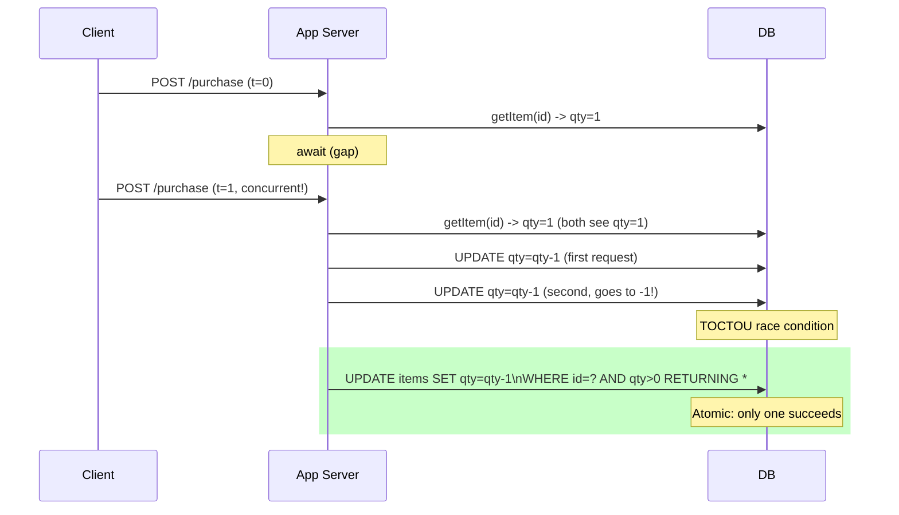
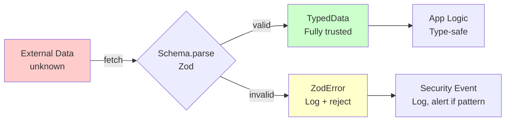

## Keywords in This File

{: .no_toc }

| # | Keyword | Difficulty |
|---|---------|------------|
| 1 | [Security Risks in Async JavaScript](#security-risks-in-async-javascript) | ★★☆ |
| 2 | [Safe Async Data Handling in TypeScript](#safe-async-data-handling-in-typescript) | ★★☆ |

---

# Security Risks in Async JavaScript

---

### 🎯 Model Answer

**30 seconds:**
> Async JavaScript introduces specific security risks: TOCTOU
> (Time of Check to Time of Use) race conditions in auth flows,
> async event handler injection enabling unexpected code execution,
> prototype pollution through async response processing, and
> unhandled Promise rejections leaking sensitive information.
> The core discipline: treat async gaps (between `await` points)
> as potential state invalidation windows.

**3 minutes:**
> Security risks unique to async JavaScript:
>
> **TOCTOU (Time-of-Check to Time-of-Use):** You check a
> condition (user is authorized), then `await` something, then
> act on the assumption. Between the check and the action, the
> state may have changed (user logged out, subscription expired).
> Solution: re-verify permissions immediately before the
> privileged action, not at the start of the async function.
>
> **Async race conditions in auth flows:** Multiple concurrent
> async operations that each check and modify shared state.
> Example: double-submit of a payment form. Two concurrent
> fetch calls both succeed because the server received two
> requests before either received a response. Solution: optimistic
> locking, idempotency keys, or request deduplication.
>
> **Prototype pollution in async paths:** Merging untrusted
> async response data into objects using spread or `Object.assign`
> without sanitization. If the server (or a compromised CDN)
> returns `{ "__proto__": { "isAdmin": true } }`, naive merge
> operations can pollute Object.prototype.
>
> **Error leakage in rejected Promises:** Unhandled rejection
> handlers that send error details (stack traces, database
> error messages) to clients or logs that are accessible.
> Solution: structured error responses that never include
> internal implementation details.

**Blank Mind Recovery:**

**(1) Restate:** "Async creates windows. Between `await` points,
state can change. Check permissions at the moment you need
them, not earlier."

**(2) First principles:** "Async code pauses. During the pause,
the world changes. Security checks must happen at the point
of action, not the point of intention."

---

### 📘 Concept Explanation

**What it is:**
Security vulnerabilities that arise specifically from async
JavaScript patterns: race conditions in authorization, response
data injection, error information leakage, and timing attacks
enabled by async execution.

**The problem it solves:**
Async code is deceptively sequential-looking (`await` makes
it look synchronous) but is not. Security assumptions that
hold in synchronous code break when there are multiple `await`
points.

**How it works:**

```javascript
// TOCTOU: Classic auth race condition
class OrderService {
  // BAD: check happens before await - state can change
  async cancelOrder(userId, orderId) {
    const user = await getUser(userId);
    // ↓ AWAIT POINT: user can lose permission here
    // (e.g. subscription expires during await)
    const order = await getOrder(orderId);

    // Check user.subscription.active - but this was
    // read BEFORE the second await. It may be stale.
    if (!user.subscription.active) throw Error('No subscription');
    // ↑ This check is on stale data!

    await deleteOrder(orderId); // privileged action
  }

  // GOOD: check immediately before privileged action
  async cancelOrderSafe(userId, orderId) {
    const [user, order] = await Promise.all([
      getUser(userId),
      getOrder(orderId)
    ]);

    // Both fetched at roughly same time
    // Re-verify owner at action point:
    if (order.ownerId !== userId) {
      throw new AuthError('Order does not belong to user');
    }
    if (!user.subscription.active) {
      throw new AuthError('Subscription not active');
    }

    // Verify again atomically in DB transaction:
    await deleteOrderWithOwnerCheck(orderId, userId);
    // Server-side: validates ownership in DB transaction
    // No TOCTOU between app and DB layer
  }
}
```

```javascript
// PROTOTYPE POLLUTION via async response processing
async function loadUserConfig(userId) {
  const response = await fetch(`/api/config/${userId}`);
  const data = await response.json();

  // BAD: spread without sanitization
  const config = { ...defaultConfig, ...data };
  // If data = { "__proto__": { isAdmin: true } }
  // Spread doesn't trigger prototype pollution (spread is own-props)
  // But Object.assign DOES:
  Object.assign(defaultConfig, data); // DANGEROUS
  // data.__proto__ pollutes Object.prototype

  return config;
}

// SAFE: prototype-safe merge
function safeMerge(target, source) {
  const sanitized = JSON.parse(JSON.stringify(source));
  // Or:
  for (const [key, value] of Object.entries(source)) {
    if (key === '__proto__' || key === 'constructor') continue;
    target[key] = value;
  }
  return target;
}
```

```javascript
// ASYNC EVENT HANDLER INJECTION
class EventEmitter {
  async emit(event, data) {
    const handlers = this._handlers[event] || [];
    // If handlers array modified during await:
    for (const handler of handlers) {
      await handler(data); // each handler is a suspension point
      // An earlier handler could unregister later handlers
      // or inject new ones via emit() in handler body
    }
  }
  // SAFE: snapshot handlers before loop
  async emitSafe(event, data) {
    const handlers = [...(this._handlers[event] || [])];
    for (const handler of handlers) {
      await handler(data);
    }
  }
}
```

**The key insight:**
Every `await` point is a potential security checkpoint. Anything
that was true before an `await` may not be true after it.
The guiding principle: **re-validate any security-relevant
state immediately before the action that requires it**.

**When to use it:**
Any async function that performs authorization checks followed
by privileged actions. Any async function that processes
untrusted data from external sources.

**When NOT to use it:**
Does not apply as a "feature to use" - this is a vulnerability
class to avoid.

**Alternatives:**
- Server-side authorization (always): never rely solely on
  client-side async checks
- Optimistic locking / ETags: prevent double-submit at HTTP level
- Immutable data structures: prevent mutation-based race conditions

---

### 💻 Code Example

```javascript
// BAD: Double-submit race condition
async function submitPayment(amount, cardToken) {
  setSubmitting(true);

  // User double-clicks: two requests launched simultaneously
  const result = await fetch('/api/payment', {
    method: 'POST',
    body: JSON.stringify({ amount, cardToken })
  });
  // Both requests may succeed! User charged twice.

  setSubmitting(false);
  return result.json();
}
```

> **Code walkthrough:** `setSubmitting(true)` is set, but between
> the first call's `await fetch` and its response, a second
> click handler fires. The `submitting` flag may not prevent
> this if the second handler reads the flag before the first
> has set it back. Both requests reach the server simultaneously,
> and without idempotency protection, both succeed.

```javascript
// GOOD: Idempotency key + request deduplication
class PaymentService {
  private inFlight = new Map();

  async submitPayment(amount, cardToken) {
    // Idempotency key: unique per payment intent
    const idempotencyKey = crypto.randomUUID();

    // Deduplicate: if same key already in flight, return same promise
    if (this.inFlight.has(idempotencyKey)) {
      return this.inFlight.get(idempotencyKey);
    }

    const promise = fetch('/api/payment', {
      method: 'POST',
      headers: {
        'Content-Type': 'application/json',
        'Idempotency-Key': idempotencyKey  // server deduplicates
      },
      body: JSON.stringify({ amount, cardToken })
    }).then(r => {
      if (!r.ok) throw new Error(`Payment failed: ${r.status}`);
      return r.json();
    }).finally(() => {
      this.inFlight.delete(idempotencyKey);
    });

    this.inFlight.set(idempotencyKey, promise);
    return promise;
  }
}

// Server-side: Stripe's idempotency key model
// POST /api/payment
// Header: Idempotency-Key: uuid
// Server returns same response for duplicate keys within 24h
```

> **Code walkthrough:** The idempotency key creates a unique
> identifier for each payment intent. The client-side map
> deduplicates concurrent calls with the same key by returning
> the same Promise. The server deduplicates across multiple
> requests with the same header value. Double-submit now results
> in one charge, not two. The `finally` handler cleans up the
> in-flight map regardless of success or failure.

---

### 🎓 Answers by Seniority

**Junior / Mid (0-5 years):**
> "TOCTOU: check auth state immediately before the action,
> not at the start of the function. Prototype pollution: don't
> use Object.assign with untrusted data. Idempotency keys
> prevent double-submit. Always catch and handle rejected
> Promises to avoid error leakage."

---

**Senior / Staff (5+ years):**
> "The mental model I apply: every `await` is a potential
> world-change event. Authorization checks before `await` points
> can become stale. My production rules: (1) server-side
> authorization at the action layer, not the input layer;
> (2) idempotency keys on all mutating API calls from client
> code; (3) structured error responses that never include
> stack traces or DB error messages; (4) `JSON.parse(JSON.stringify())`
> for deep copies of untrusted async responses - it sanitizes
> `__proto__` and non-serializable values. (5) Rate limiting
> and concurrency guards at the API gateway for exposed async
> endpoints."

---

### ⚠️ Common Misconceptions

**Misconception 1:** "Disabling the submit button prevents
double-submit."
If the button is disabled in an async handler after the first
click, two clicks arriving in the same event loop tick both
fire before the state update. Client-side UI guards are
defense-in-depth, not the primary protection.

**Misconception 2:** "Spread operator (`...`) is safe from
prototype pollution."
Object spread (`{ ...untrusted }`) is generally safe because
it copies own enumerable properties. But `Object.assign(target,
untrusted)` does trigger prototype pollution if the source
has `__proto__`. Know which tools you are using.

**Misconception 3:** "Unhandled Promise rejections don't
expose information."
Unhandled rejections propagate to `window.onunhandledrejection`
or Node's `unhandledRejection` event. If these are logged
to a client-accessible endpoint or displayed in the UI,
they can expose implementation details (file paths, DB queries,
internal service URLs).

---

### 🚨 Failure Modes and Diagnosis

**Failure 1: Timing-based TOCTOU in session expiry**
```
Scenario: User's session expires mid-transaction
Timeline:
  T=0: check session.isActive => true
  T=1: await fetch (long network call)
  T=2: session expires
  T=3: fetch completes, code continues as if session active
  T=4: privileged action executed with expired session

Fix:
  - Include session token in every request header
  - Server validates token on every privileged endpoint
  - Client checks session before each privileged action
```

**Failure 2: Concurrent async updates to shared state**
```javascript
// Race condition: two async functions update same object
let user = { balance: 100 };

async function debit(amount) {
  const { balance } = user; // read: 100
  await validateTransaction(amount); // yield
  user.balance = balance - amount; // write: 100 - 50 = 50
}

// If called twice simultaneously:
// Both read balance = 100
// First writes 100 - 50 = 50
// Second writes 100 - 30 = 70 (WRONG - should be 20)

// Fix: optimistic locking or serialized operations
async function debitSafe(amount) {
  const result = await atomicDebit(amount); // DB transaction
  user.balance = result.newBalance; // refresh from authoritative source
}
```

---

### 🎯 Interview Deep-Dive

| Category | Count | Coverage |
|---|---|---|
| Conceptual | 2 | TOCTOU model, prototype pollution mechanism |
| Trade-off | 2 | Client vs server auth, guard strategies |
| Failure Mode | 1 | Race condition in payment flow |
| Debugging | 1 | Diagnosing async security issues |
| Design | 2 | Idempotency pattern, auth at action point |
| Behavioral | 1 | Fixing a security bug in async flow |

**Q1. What is a TOCTOU vulnerability and how does
async JavaScript enable it?**

TOCTOU (Time of Check to Time of Use) is a class of race
condition where the state being checked and the state being
acted upon are separated by time, allowing the state to change.

In synchronous code, check and use happen atomically. In async
JavaScript, `await` introduces pauses during which:
- Session tokens expire
- User roles change (admin role revoked)
- Resource state changes (inventory depleted)
- Locks are released

```javascript
// Vulnerable: async gap between check and use
async function purchaseItem(userId, itemId) {
  const item = await getItem(itemId);
  if (item.quantity === 0) throw Error('Out of stock');
  // AWAIT GAP: another request may purchase the last item
  await createOrder(userId, itemId);
  await decrementInventory(itemId); // may go negative!
}
```

The fix: make the check-and-modify atomic at the data layer
(database-level atomic operations, compare-and-swap):
```javascript
async function purchaseItemSafe(userId, itemId) {
  // Atomic decrement with check - database enforces constraint
  const result = await db.query(`
    UPDATE items
    SET quantity = quantity - 1
    WHERE id = ? AND quantity > 0
    RETURNING id, quantity
  `, [itemId]);

  if (result.rows.length === 0) throw Error('Out of stock');
  await createOrder(userId, itemId, result.rows[0]);
}
```

*What separates good from great:* Moving the critical section
into a database transaction where atomicity is guaranteed.
Application-layer checks are advisory; database constraints
are authoritative.

---

**Q2. How do you prevent sensitive data from being exposed
in rejected Promise error messages?**

The risk: database errors, file system paths, internal service
URLs, and stack traces in unhandled or poorly-handled rejections
reaching clients.

```javascript
// BAD: raw errors propagate to client
app.post('/api/user', async (req, res) => {
  const user = await db.query('SELECT * FROM users WHERE id = ?',
    [req.body.id]);
  res.json(user);
  // If db.query throws: PostgreSQL error with schema details
  // might reach the client as 500 response body
});

// GOOD: error boundary with structured error responses
app.post('/api/user', async (req, res) => {
  try {
    const user = await db.query(
      'SELECT id, name, email FROM users WHERE id = ?',
      [req.body.id]
    );
    res.json({ success: true, data: user });
  } catch (err) {
    // Log full error internally
    logger.error('User fetch failed', {
      errorCode: err.code,
      userId: req.body.id,
      stack: err.stack
    });
    // Return sanitized error to client
    res.status(500).json({
      success: false,
      error: 'User data unavailable',
      requestId: req.id // for support lookup only
    });
  }
});
```

*What separates good from great:* The `requestId` pattern:
log internally with full details, return `requestId` to client.
Support can correlate the client's error to internal logs
without exposing implementation details.

---

**Q3. What is the difference between `Object.assign`
prototype pollution and spread-based merging?**

`Object.assign(target, source)`: copies all enumerable own
AND prototype-chain properties if accessed via getter. If
source is a plain object with `__proto__` key:
```javascript
const source = JSON.parse('{"__proto__":{"isAdmin":true}}');
const target = {};
Object.assign(target, source);
// Object.prototype.isAdmin === true!
// Affects ALL objects in the application
console.log({}.isAdmin); // true - polluted
```

Object spread (`{ ...source }`): only copies own enumerable
properties. Does NOT trigger prototype pollution:
```javascript
const source = JSON.parse('{"__proto__":{"isAdmin":true}}');
const target = { ...source }; // safe
console.log({}.isAdmin); // undefined - not polluted
```

But spread can still copy `__proto__` as a regular key:
```javascript
const source = { __proto__: { isAdmin: true } };
// This is different from JSON.parse above
const target = { ...source };
// __proto__ as a literal key: source.__proto__ is the object
// {isAdmin: true} - it IS copied as a regular property
```

Best practice: validate schema before merging (use Zod, Joi):
```javascript
const UserConfigSchema = z.object({
  theme: z.enum(['light', 'dark']),
  language: z.string().max(10)
}); // rejects unknown keys

const config = UserConfigSchema.parse(await resp.json());
Object.assign(userConfig, config); // now safe: validated shape
```

*What separates good from great:* The difference between
`JSON.parse('{"__proto__":...}')` (creates object with `__proto__`
as own property) vs object literal `{ __proto__: ... }` (sets
prototype). Schema validation is the comprehensive defense.

---

**Q4. How do timing attacks exploit async JavaScript?**

Timing attacks exploit measurable differences in how long
async operations take to infer information:

```javascript
// Vulnerable: different response times reveal valid usernames
async function login(username, password) {
  const user = await db.getUser(username);
  if (!user) {
    return { success: false, error: 'Invalid credentials' };
    // Fast: user lookup failed, return immediately
  }
  const valid = await bcrypt.compare(password, user.hash);
  // Slow: bcrypt compare takes ~100ms
  return { success: valid };
}
// Attacker can determine valid usernames by response time:
// Fast response (~5ms) = user doesn't exist
// Slow response (~100ms) = user exists, password was checked
```

Fix: constant-time response:
```javascript
async function loginSafe(username, password) {
  const DUMMY_HASH = '$2b$10$invalidhashfortimingequalization';

  const user = await db.getUser(username);
  const hash = user ? user.hash : DUMMY_HASH;

  // Always run bcrypt.compare, even for non-existent users
  const valid = await bcrypt.compare(password, hash);

  if (!user || !valid) {
    return { success: false, error: 'Invalid credentials' };
  }
  return { success: true };
}
```

*What separates good from great:* Always running the expensive
operation (bcrypt compare) even when the user doesn't exist,
making valid and invalid username response times statistically
indistinguishable.

---

**Q5. How do you safely handle untrusted data from async
API responses?**

```typescript
// Never trust external data shape
async function fetchUserProfile(userId: string) {
  const resp = await fetch(`/api/users/${userId}`);
  const raw: unknown = await resp.json(); // unknown, not any

  // Validate with Zod:
  const ProfileSchema = z.object({
    id: z.string().uuid(),
    name: z.string().min(1).max(100),
    email: z.string().email(),
    role: z.enum(['user', 'admin', 'moderator']),
    // Do NOT use z.any() for extra fields
  }).strict(); // reject extra fields

  try {
    return ProfileSchema.parse(raw);
  } catch (zodError) {
    logger.warn('Unexpected API response shape', {
      userId,
      error: zodError.issues
    });
    throw new Error('Invalid profile data received');
  }
}
```

Key principles:
1. Type `response.json()` as `unknown`, not `any`
2. Validate schema before using data (Zod, Joi, io-ts)
3. Use `.strict()` to reject extra fields (prototype pollution defense)
4. Log schema violations as security events (may indicate attack)

*What separates good from great:* Logging schema validation
failures as security events. An unexpected field in an API
response might indicate a prototype pollution attempt from
a compromised API.

---

**Q6. What is async event handler injection and how do
you prevent it?**

In async event-driven code, handlers registered during an
async operation can execute in unintended order or inject
malicious behavior:

```javascript
// Injection via handler registration during async handler
emitter.on('data', async (data) => {
  // This handler runs for the current 'data' event
  await processData(data);
  // After await: malicious code could have registered
  // another handler on 'data' that now fires for this event
  // OR: processData itself could emit 'data' causing re-entry
});

// Prevention: snapshot + process, check for re-entry
class SafeEmitter {
  private processing = new Set();

  async emit(event, data) {
    if (this.processing.has(event)) {
      // Prevent re-entrant emission of same event
      throw new Error(`Re-entrant emission of '${event}'`);
    }
    this.processing.add(event);
    try {
      const handlers = [...(this.handlers[event] || [])];
      for (const handler of handlers) {
        await handler(data);
      }
    } finally {
      this.processing.delete(event);
    }
  }
}
```

*What separates good from great:* The snapshot pattern (`[...handlers]`)
prevents handler injection during processing. The re-entrancy
guard prevents recursive event loops that could be exploited
for denial-of-service.

---

**Q7. How do unhandled Promise rejections create security risks?**

Node.js: an unhandled rejection does not crash the process
by default (before Node 15: warning; Node 15+: process exits).
In the browser: fires `window.unhandledrejection` event.

Security risks:
1. Sensitive data in error messages logged to public-accessible
   log aggregators
2. Application continues in inconsistent state after partial
   async operation failure (e.g., authorization check throws,
   but subsequent code still executes due to catch-all handlers)
3. Error details exposed in developer console (browser)

Mitigation:
```javascript
// Global unhandled rejection handler
process.on('unhandledRejection', (reason, promise) => {
  // Sanitize before logging:
  logger.error('Unhandled rejection', {
    message: reason instanceof Error ? reason.message : String(reason),
    // Never log: reason.stack (may contain paths), sensitive data
    // Do log: sanitized message, timestamp, request context
  });
  // In production: graceful shutdown
  process.exit(1); // fail fast, restart with clean state
});

// Browser:
window.addEventListener('unhandledrejection', event => {
  event.preventDefault(); // suppress default console error
  monitor.reportError(sanitizeError(event.reason));
});
```

*What separates good from great:* The fail-fast principle for
unhandled rejections in production: rather than continuing
in an unknown state, exit and let the process manager (PM2,
Kubernetes) restart with a clean state.

### ⚖️ Comparison Table

| Risk | Mechanism | Client Defense | Server Defense |
|---|---|---|---|
| TOCTOU | Stale state between awaits | Re-validate before action | DB-level atomic operations |
| Double-submit | Concurrent async requests | Idempotency key, disable button | Server-side idempotency |
| Prototype pollution | `Object.assign` with `__proto__` | Schema validation (Zod) | Input sanitization |
| Error leakage | Unhandled rejections | Global error handler | Structured error responses |
| Timing attack | Response time differences | N/A | Constant-time comparison |

### 🏛️ System Design

*(Omit: ★★☆ - not applicable)*

### 📊 Diagram

```
ASYNC SECURITY GAPS
====================

sync check ─── await ──── action
              ↑
         STATE CHANGES HERE:
         - Session expires
         - Role revoked
         - Inventory depleted
         - Double-submit arrives

Defense: validate AT action point
         not AT check point
```



> **Diagram walkthrough:** The top sequence shows the TOCTOU
> race: two concurrent requests both read `qty=1`, both pass
> the check, both decrement, resulting in `qty=-1`. The green
> box shows the fix: a single atomic SQL statement that both
> checks and decrements, with the WHERE clause ensuring atomicity.
> Only one request gets a returned row; the other gets no rows,
> and knows the stock was already depleted. This pattern
> eliminates the async gap entirely by moving the critical
> section into the database.

---

---

# Safe Async Data Handling in TypeScript

---

### 🎯 Model Answer

**30 seconds:**
> Safe async data handling means: treating all external data
> as `unknown` until validated, using schema validation (Zod)
> on every async response, sanitizing inputs before async
> operations, using secure headers in fetch, and never using
> `eval` or `new Function` with data from async sources.
> The principle: distrust the boundary.

**3 minutes:**
> External data from async sources (API responses, WebSocket
> messages, IndexedDB, postMessage) must be validated before
> use. In TypeScript, the first step is typing `response.json()`
> as `unknown` rather than casting to an assumed type.
>
> Schema validation: Zod (`z.object(...).parse(data)`) validates
> structure AND type, throws on mismatch, and provides TypeScript
> types from the schema definition. This is the boundary guard.
>
> Secure fetch headers:
> - `Content-Type: application/json` ensures the server parses
>   the body correctly
> - `X-Content-Type-Options: nosniff` (response header): prevents
>   MIME-type sniffing
> - Authorization headers: Bearer tokens, not cookies (CSRF-safe)
> - `credentials: 'same-origin'` (default) or `'include'` only
>   when cross-origin with CORS configured correctly
>
> Avoiding eval in async callbacks: dynamic code execution
> is the ultimate injection risk. Never pass async response
> data to `eval`, `new Function(data)`, `setTimeout(string)`,
> `setInterval(string)`, or `innerHTML` without sanitization.
>
> SSRF (Server-Side Request Forgery) in async URL construction:
> if an async function constructs a URL from user-supplied
> input and passes it to fetch, an attacker can direct the
> fetch to internal services.

**Blank Mind Recovery:**

**(1) Restate:** "Async response data is untrusted. Validate
with Zod. Type as `unknown` until validated. Never eval
async data."

**(2) First principles:** "Data from outside your system is
untrusted. Validation creates a trust boundary. Everything
inside the boundary is safe to use; everything outside must
be validated first."

---

### 📘 Concept Explanation

**What it is:**
A set of practices for handling data that arrives asynchronously
from external sources, ensuring it is valid, typed, and safe
before use in application logic.

**The problem it solves:**
Async data (API responses, user input, WebSocket messages)
can be malformed, malicious, or unexpected. Trusting it without
validation leads to type errors, injection attacks, and
application state corruption.

**How it works:**

```typescript
// COMPLETE SAFE ASYNC DATA HANDLING PATTERN

import { z } from 'zod';

// Step 1: Define schemas with strict validation
const UserSchema = z.object({
  id: z.string().uuid(),
  name: z.string().min(1).max(200).trim(),
  email: z.string().email().toLowerCase(),
  role: z.enum(['user', 'admin']),
  createdAt: z.coerce.date()
}).strict(); // reject extra fields (anti-pollution)

type User = z.infer<typeof UserSchema>; // derive type from schema

// Step 2: Typed fetch wrapper with validation
async function fetchUser(
  userId: string
): Promise<User> {
  // Validate input first
  if (!/^[a-f0-9-]{36}$/.test(userId)) {
    throw new Error('Invalid user ID format');
  }

  const resp = await fetch(`/api/users/${encodeURIComponent(userId)}`, {
    method: 'GET',
    headers: {
      'Accept': 'application/json',
      'Authorization': `Bearer ${getToken()}`,
      'X-Request-ID': crypto.randomUUID()
    },
    credentials: 'same-origin',
    signal: AbortSignal.timeout(10_000)
  });

  if (!resp.ok) {
    throw new Error(`HTTP ${resp.status}: ${resp.statusText}`);
  }

  // Type as unknown - do not assume shape
  const raw: unknown = await resp.json();

  // Validate and narrow type
  const user = UserSchema.parse(raw);
  // If parse fails: ZodError thrown with path info
  // user: User - fully typed, validated

  return user;
}

// Step 3: Safe error handling - sanitize before logging
async function safeLoadUser(userId: string) {
  try {
    return await fetchUser(userId);
  } catch (err) {
    if (err instanceof z.ZodError) {
      logger.warn('Unexpected user data shape', {
        issues: err.issues.map(i => ({
          path: i.path,
          code: i.code // no sensitive values in log
        }))
      });
      throw new Error('Invalid user data received from server');
    }
    if (err instanceof Error) {
      logger.error('User load failed', { message: err.message });
      throw new Error('Failed to load user data');
    }
    throw err;
  }
}
```

```typescript
// SANITIZING FOR DOM INSERTION (prevent XSS from async data)
import DOMPurify from 'dompurify';

async function loadAndDisplayContent(articleId: string) {
  const article = await fetch(`/api/articles/${articleId}`)
    .then(r => r.json()) as { title: string; html: string };

  // Never: element.innerHTML = article.html (XSS)
  // Safe: sanitize with DOMPurify
  const safeHtml = DOMPurify.sanitize(article.html, {
    ALLOWED_TAGS: ['p', 'b', 'i', 'a', 'ul', 'li'],
    ALLOWED_ATTR: ['href', 'title']
  });

  document.getElementById('content')!.innerHTML = safeHtml;
  document.getElementById('title')!.textContent = article.title;
  // textContent is always safe - no HTML parsing
}
```

**The key insight:**
The trust boundary is explicit: outside boundary = untrusted,
inside boundary = safe. Schema validation is the gate. Once
data crosses the gate (passes `parse`), it is trusted and
typed. Never widen the type after it has been validated.

**When to use it:**
Every async data source: REST API responses, GraphQL responses,
WebSocket messages, `postMessage` from iframes, IndexedDB reads
after potential cross-context writes.

**When NOT to use it:**
Internal data created and validated within your own module
does not need re-validation on every use. Avoid over-validating
internal data structures - validation belongs at system
boundaries.

**Alternatives:**
- io-ts: functional approach to runtime type validation
- Yup: Promise-based validation (common in Formik)
- TypeBox: JSON Schema-based, fast, lower overhead
- ajv: JSON Schema validation, very fast, no type inference

**First-principles derivation:**
Type assertions (`as Config`) are compile-time lies - they
tell TypeScript to trust you, not the data. Runtime validation
with Zod is a runtime promise - it actually checks the data
at the moment it arrives. The principle: compile-time types
describe your code; runtime validation describes external data.

---

### 💻 Code Example

```typescript
// BAD: Trusting async data without validation
async function loadDashboard() {
  const config = await fetch('/api/config')
    .then(r => r.json()) as DashboardConfig;
  // ↑ as DashboardConfig: compile-time assertion only!
  // If API returns unexpected shape, TypeScript won't help.
  // config.refreshInterval used below - if undefined: NaN

  const interval = config.refreshInterval * 1000; // NaN if undefined
  setInterval(refresh, interval); // setInterval(fn, NaN) = fires immediately!
}
```

> **Code walkthrough:** The type assertion `as DashboardConfig`
> is a lie to TypeScript. At runtime, if the API changes the
> field name from `refreshInterval` to `refresh_interval`,
> `config.refreshInterval` is `undefined`. Multiplying by 1000
> gives `NaN`. `setInterval(fn, NaN)` fires immediately and
> repeatedly - an accidental denial of service.

```typescript
// GOOD: Zod validation + typed result

import { z } from 'zod';

const DashboardConfigSchema = z.object({
  refreshInterval: z.number().int().min(5).max(3600), // 5s to 1hr
  apiEndpoint: z.string().url(),
  features: z.object({
    darkMode: z.boolean().default(false),
    betaFeatures: z.boolean().default(false)
  })
}).strict();

type DashboardConfig = z.infer<typeof DashboardConfigSchema>;

async function loadDashboard() {
  const resp = await fetch('/api/config', {
    headers: { 'Accept': 'application/json' },
    signal: AbortSignal.timeout(5000)
  });

  if (!resp.ok) {
    throw new Error(`Config load failed: ${resp.status}`);
  }

  const raw: unknown = await resp.json(); // unknown, not any
  const config = DashboardConfigSchema.parse(raw);
  // Parse validates: refreshInterval is a number between 5 and 3600
  // If validation fails: ZodError with helpful error message

  const interval = config.refreshInterval * 1000;
  // config.refreshInterval: number (guaranteed by schema)
  setInterval(refresh, interval); // safely always a valid number

  // SSRF prevention: validate URL from config before use
  const apiUrl = new URL(config.apiEndpoint);
  if (!['https:', 'wss:'].includes(apiUrl.protocol)) {
    throw new Error('Insecure API endpoint protocol');
  }
  return config;
}

// SAFE postMessage handling
window.addEventListener('message', (event) => {
  // Always verify origin
  if (event.origin !== 'https://trusted-iframe.example.com') return;

  const MessageSchema = z.discriminatedUnion('type', [
    z.object({ type: z.literal('UPDATE'), data: z.string().max(1000) }),
    z.object({ type: z.literal('RESET') })
  ]);

  const result = MessageSchema.safeParse(event.data);
  if (!result.success) {
    console.warn('Invalid postMessage data:', result.error.issues);
    return;
  }
  handleMessage(result.data); // fully typed discriminated union
});
```

> **Code walkthrough:** The schema enforces valid ranges for
> `refreshInterval` (prevents zero or negative values that would
> cause high-frequency polling). The `unknown` type on `resp.json()`
> forces explicit validation before use. The URL protocol check
> prevents SSRF by rejecting non-HTTPS URLs from config. The
> `postMessage` handler uses `origin` verification (mandatory)
> plus schema validation, and `safeParse` instead of `parse` to
> handle invalid messages gracefully without throwing.

---

### 🎓 Answers by Seniority

**Junior / Mid (0-5 years):**
> "I use Zod to validate async API responses. I type
> `response.json()` as `unknown` then call `Schema.parse()`.
> I check `event.origin` in postMessage handlers. I use
> `encodeURIComponent` when putting user input in fetch URLs."

---

**Senior / Staff (5+ years):**
> "The discipline I enforce across teams: every async system
> boundary has a Zod schema. `unknown` not `any` for external
> data. Schemas are the single source of truth for both runtime
> validation and TypeScript types. Schema failures are logged
> as security events - unexpected shapes can indicate attacks.
> SSRF: never construct fetch URLs from unsanitized user input
> without allow-list validation of hostname. For high-value APIs:
> server-side certificate pinning and request signing."

---

### ⚠️ Common Misconceptions

**Misconception 1:** "TypeScript types are enough for external data."
TypeScript types are compile-time only. `response.json()` returns
`any` (or `unknown` in strict mode). Types are erased at runtime.
Runtime validation (Zod, Joi) is the only protection against
malformed or malicious data.

**Misconception 2:** "CORS prevents SSRF."
CORS is a browser enforcement mechanism for cross-origin requests
from the browser. SSRF occurs when your server makes requests
to internal services based on user-supplied URLs. CORS does not
apply to server-to-server requests.

**Misconception 3:** "`encodeURIComponent` is XSS protection."
`encodeURIComponent` encodes URL components. It does not sanitize
data for HTML context. For DOM insertion, use `textContent` for
plain text, or DOMPurify for trusted HTML.

---

### 🚨 Failure Modes and Diagnosis

**Failure 1: SSRF via URL construction from async data**
```typescript
// BAD: user-controlled URL in fetch
async function fetchWebhookTarget(config: unknown) {
  const { webhookUrl } = config as { webhookUrl: string };
  // If webhookUrl = 'http://169.254.169.254/latest/meta-data/'
  // (AWS metadata endpoint): leaks cloud credentials
  const resp = await fetch(webhookUrl);
  return resp.json();
}

// SAFE: allow-list validation
async function fetchWebhookTargetSafe(url: string) {
  const parsed = new URL(url);
  const allowedHosts = ['api.example.com', 'webhooks.example.com'];
  if (!allowedHosts.includes(parsed.hostname)) {
    throw new Error(`Webhook URL not in allowed list: ${parsed.hostname}`);
  }
  if (parsed.protocol !== 'https:') {
    throw new Error('Webhook must use HTTPS');
  }
  const resp = await fetch(url, { signal: AbortSignal.timeout(5000) });
  return resp.json();
}
```

**Failure 2: Eval in async callback**
```javascript
// NEVER: eval from async data
socket.on('message', async (msg) => {
  const { action, code } = JSON.parse(msg);
  if (action === 'execute') {
    eval(code); // RCE: Remote Code Execution!
    // Even with auth, eval from external sources is prohibited
  }
});
// Fix: replace eval with explicit action handlers
socket.on('message', async (msg) => {
  const { action, params } = MessageSchema.parse(JSON.parse(msg));
  const handler = ALLOWED_ACTIONS[action]; // allow-list
  if (handler) await handler(params);
});
```

---

### 🎯 Interview Deep-Dive

| Category | Count | Coverage |
|---|---|---|
| Conceptual | 2 | Schema validation as boundary, trust model |
| Trade-off | 2 | Validation overhead, Zod vs alternatives |
| Failure Mode | 1 | SSRF, eval injection |
| Debugging | 1 | Diagnosing schema validation failures |
| Design | 2 | Safe API wrapper, postMessage security |
| Behavioral | 1 | Introducing validation to a legacy codebase |

**Q1. Why is `response.json() as SomeType` unsafe and
what is the correct alternative?**

`response.json()` in the Fetch API returns `Promise<any>`
(TypeScript's Fetch types use `any`). Adding `as SomeType`
is a type assertion - it only affects compile-time type checking.
It does NOT validate the runtime data.

```typescript
// Type assertion: compile-time only
const data = await resp.json() as UserProfile;
data.subscription.expires; // compiles fine
// If API returns { user: {...} }, subscription is undefined
// Runtime: Cannot read property 'expires' of undefined

// Safe alternative: unknown + runtime validation
const raw: unknown = await resp.json();
const data = UserProfileSchema.parse(raw);
// UserProfileSchema.parse validates structure at runtime
// Throws ZodError if subscription is missing
```

The correct mental model: `as T` is a claim ("I promise this
is T"). `Schema.parse()` is a check ("let me verify this is T").

*What separates good from great:* The line that "TypeScript types
are documentation, Zod schemas are enforcement." Both are valuable;
only Zod provides runtime safety.

---

**Q2. How do you handle the performance overhead of
validating every API response?**

Zod parsing performance: ~10-50 microseconds for a typical
response object. For most applications, this is negligible
compared to network latency.

When validation overhead matters:
- Parsing large lists (1000+ items): validate the array
  structure, use `.array()` with item schema. Zod validates
  all items.
- Real-time websocket messages at high frequency: validate
  the message envelope (type, metadata), only deeply validate
  data for trusted message types.

Optimization strategies:
```typescript
// Validate envelope, not full payload for high-frequency messages
const MessageEnvelopeSchema = z.object({
  type: z.enum(['trade', 'quote', 'status']),
  timestamp: z.number()
});
// Full payload validation only for critical messages
const TradeSchema = z.object({ ... }); // only when type === 'trade'
```

*What separates good from great:* Profiling before optimizing.
The overhead of Zod is almost never the bottleneck. Network
roundtrips at 50ms dominate 0.01ms of validation. Only optimize
when profiling shows validation in the hot path.

---

**Q3. How do you validate nested async data structures
safely?**

```typescript
// Complex nested schema with Zod
const OrderSchema = z.object({
  id: z.string().uuid(),
  items: z.array(z.object({
    productId: z.string(),
    quantity: z.number().positive().int(),
    price: z.number().positive()
  })).min(1).max(100), // limit array size
  billing: z.object({
    name: z.string().max(200),
    address: z.string().max(500)
    // Never include full card numbers in client data
  }),
  total: z.number().positive()
}).refine(
  (order) => {
    // Cross-field validation: total must match items sum
    const computed = order.items.reduce(
      (sum, item) => sum + item.price * item.quantity,
      0
    );
    return Math.abs(computed - order.total) < 0.01;
  },
  { message: 'Order total does not match items sum' }
);
```

The `.refine()` method adds cross-field business logic
validation on top of structural validation. This catches
manipulation of order totals (price manipulation attacks).

*What separates good from great:* Using `.refine()` for business
invariants: the total must match the sum of items. Without
this check, a client could manipulate the `total` field to
pay less.

---

**Q4. How do you secure WebSocket message handling?**

```typescript
class SecureWebSocket {
  private ws: WebSocket;

  constructor(url: string) {
    // Only connect to same origin or explicitly trusted origins
    const parsed = new URL(url);
    if (parsed.origin !== window.location.origin) {
      throw new Error('WebSocket must connect to same origin');
    }
    this.ws = new WebSocket(url);
    this.ws.addEventListener('message', this.handleMessage);
  }

  private handleMessage = async (event: MessageEvent) => {
    let parsed: unknown;
    try {
      parsed = JSON.parse(event.data as string);
    } catch {
      console.warn('Non-JSON WebSocket message received');
      return;
    }

    const result = ServerMessageSchema.safeParse(parsed);
    if (!result.success) {
      logger.warn('Invalid WebSocket message schema', {
        issues: result.error.issues.length
        // Do not log full message data (may contain sensitive info)
      });
      return;
    }

    await this.dispatch(result.data);
  };
}
```

*What separates good from great:* Using `safeParse` instead of
`parse` in message handlers - invalid messages should be
logged and dropped, not crash the handler with an unhandled
ZodError.

---

**Q5. How do you prevent injection via async URL
construction?**

```typescript
// URL injection surfaces:
// 1. Path segments from user input
// 2. Query parameters from user input
// 3. Full URL from config/user input (SSRF)

// SAFE: URL construction with URLSearchParams
function buildSearchUrl(
  query: string,
  filters: Record<string, string>
): string {
  const base = new URL('/api/search', window.location.origin);

  // URLSearchParams handles encoding automatically
  const params = new URLSearchParams({
    q: query, // encodes safely
    ...Object.fromEntries(
      Object.entries(filters).filter(([k]) =>
        // Allowlist filter keys
        ['category', 'sort', 'order'].includes(k)
      )
    )
  });

  base.search = params.toString();
  return base.toString();
}

// For path segments: use explicit encoding + validation
function buildUserUrl(userId: string): string {
  // Validate before encoding: prevent path traversal
  if (!/^[a-zA-Z0-9_-]{1,50}$/.test(userId)) {
    throw new Error('Invalid user ID');
  }
  return `/api/users/${encodeURIComponent(userId)}`;
}
```

*What separates good from great:* Using `URLSearchParams` for
query strings (it handles encoding) and validating path segments
against an allowlist pattern before `encodeURIComponent`. Double-encoding
attacks (`%2F` = `/`) are prevented by allowlist validation.

---

**Q6. How do you safely handle async data from third-party
scripts or iframes?**

```typescript
// postMessage security: always verify origin AND schema
class IframeBridge {
  private trustedOrigins = new Set([
    'https://payment.stripe.com',
    'https://cdn.trusted-widget.com'
  ]);

  constructor() {
    window.addEventListener('message', this.handleMessage);
  }

  private handleMessage = (event: MessageEvent) => {
    // Step 1: Origin check (mandatory - first check)
    if (!this.trustedOrigins.has(event.origin)) {
      return; // silently ignore untrusted origins
    }

    // Step 2: Schema validation
    const MessageSchema = z.discriminatedUnion('type', [
      z.object({
        type: z.literal('PAYMENT_COMPLETE'),
        token: z.string().max(500)
      }),
      z.object({ type: z.literal('RESIZE'), height: z.number().max(2000) })
    ]);

    const result = MessageSchema.safeParse(event.data);
    if (!result.success) return;

    // Step 3: Type-safe handling
    switch (result.data.type) {
      case 'PAYMENT_COMPLETE':
        this.onPaymentComplete(result.data.token);
        break;
      case 'RESIZE':
        this.iframe.style.height = `${result.data.height}px`;
        break;
    }
  };
}
```

*What separates good from great:* Using Zod `discriminatedUnion`
for postMessage schemas: TypeScript correctly narrows the type
in each case branch. The `height` constraint (`max(2000)`)
prevents UI manipulation through iframe resizing.

---

**Q7. What is the "trust boundary" principle and how does
it apply to async TypeScript?**

The trust boundary is the line between data you control and
data you do not. All data crossing the boundary from the
outside must be validated.

Trust boundary locations in async TypeScript:
- `fetch` response body: outside boundary
- WebSocket messages: outside boundary
- `postMessage` events: outside boundary (even same-origin)
- `IndexedDB` reads (after writes from Service Worker): outside
- URL parameters: outside boundary

Inside the boundary:
- Data that has passed `Schema.parse()`
- Data created by your own code (literals, calculated values)
- Data read from trusted stores within your execution context

The discipline:
```typescript
// Boundary type: unknown until validated
type ExternalData = unknown;

// Validated type: fully trusted
type ValidatedUser = z.infer<typeof UserSchema>;

// Function signature enforces boundary:
async function processApiData(raw: ExternalData): Promise<ProcessedResult> {
  const validated = UserSchema.parse(raw); // crossing the boundary
  return process(validated); // always typed after validation
}
```

*What separates good from great:* Making the trust boundary
explicit in code through types. Using `unknown` for external
data forces developers to explicitly validate before use. TypeScript
enforcement of the boundary through the type system.

### ⚖️ Comparison Table

| Validation Library | Size | Type Inference | Performance | Best For |
|---|---|---|---|---|
| Zod | 14KB | Excellent | Good | General TypeScript |
| io-ts | 20KB | Excellent (FP style) | Good | FP-style codebases |
| Yup | 36KB | Good | Slower | Forms (Formik) |
| TypeBox | 9KB | Excellent (JSON Schema) | Fast | High-performance |
| ajv | 27KB | Manual | Very fast | High-throughput APIs |

**The deciding factor:**
TypeScript-first with DX focus: Zod. JSON Schema integration:
TypeBox or ajv. FP codebase: io-ts. Form validation: Yup.

### 🏛️ System Design

*(Omit: ★★☆ - not applicable)*

### 📊 Diagram

```
TRUST BOUNDARY MODEL
======================

      OUTSIDE              BOUNDARY           INSIDE
   (untrusted)          (validation)         (trusted)

  API response ─────→  Schema.parse()  ─────→  Typed data
  WebSocket msg ────→  Schema.parse()  ─────→  Typed message
  postMessage ──────→  Origin check +  ─────→  Typed event
                       Schema.parse()
  URL params ───────→  Allowlist +     ─────→  Safe values
                       Schema.parse()
```



> **Diagram walkthrough:** The trust boundary diagram makes the
> validation gate explicit. All external data enters as `unknown`
> (red), passes through `Schema.parse()`, and emerges as fully-
> typed trusted data (green). Invalid data throws `ZodError`
> (yellow) which is logged and potentially alerted on as a
> security event. The flowchart shows both happy path (valid
> data flows to app logic) and failure path (invalid data is
> logged and rejected). The key insight: once data crosses into
> green, it is safe to use without additional checks.
