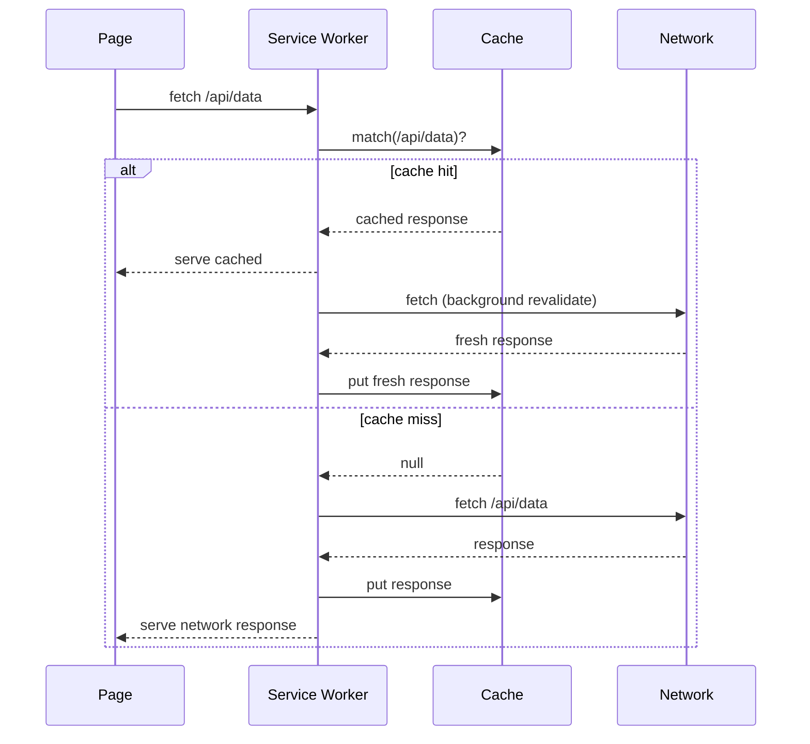
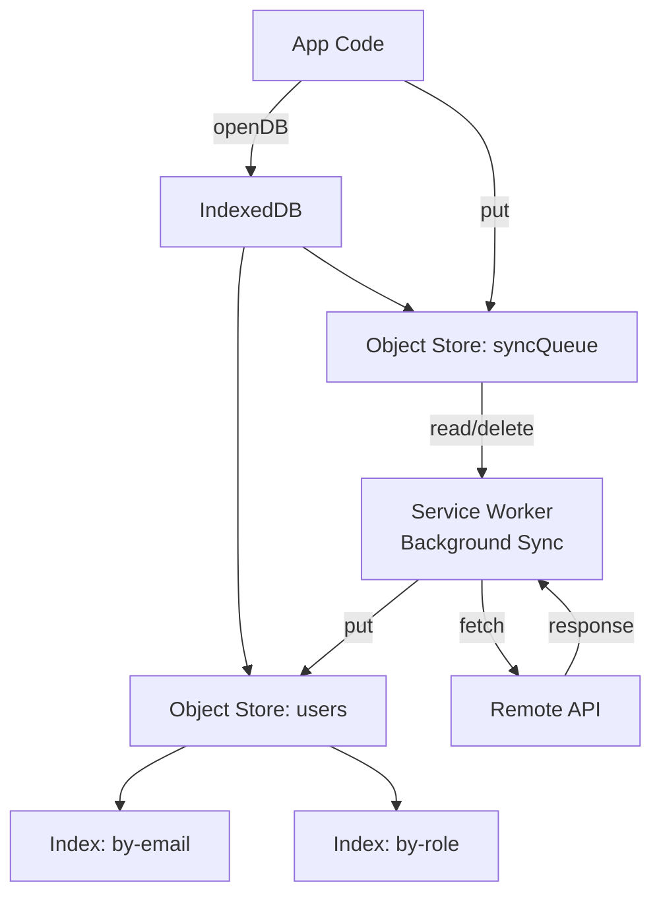

## Keywords in This File

{: .no_toc }

| # | Keyword | Difficulty |
|---|---------|------------|
| 1 | [Service Workers and Async Fetch Intercepts](#service-workers-and-async-fetch-intercepts) | ★★☆ |
| 2 | [IndexedDB Async Patterns](#indexeddb-async-patterns) | ★★☆ |

---

# Service Workers and Async Fetch Intercepts

---

### 🎯 Model Answer

**30 seconds:**
> A Service Worker is a background script that acts as a
> network proxy between the browser and the server. It
> intercepts fetch requests and can serve responses from
> cache, the network, or a combination. This enables offline
> functionality, background sync, and push notifications.
> It is installed, activated, and runs independently of the
> page - it can respond to network requests even when no
> page is open.

**3 minutes:**
> Service Workers are the foundation of Progressive Web Apps
> (PWAs). They have a distinct lifecycle: Install, Activate,
> and Idle/Active. After registration, the browser downloads
> and parses the Worker script, fires `install`. The Worker
> pre-caches assets during `install`. After install, it waits
> for the old Worker (if any) to release all clients. Then
> it activates and intercepts fetch events.
>
> The fetch handler is the core power: every network request
> from any page controlled by the Worker fires a `fetch`
> event. The Worker can respond with a cached response, a
> network response, a synthetic response, or a combination
> (stale-while-revalidate, network-falling-back-to-cache).
>
> Caching strategies:
> - Cache First: serve from cache, use network only if not
>   cached. Best for static assets (JS, CSS, images).
> - Network First: try network, fall back to cache on failure.
>   Best for dynamic data that should be fresh.
> - Stale-While-Revalidate: serve from cache immediately,
>   update cache in background. Best for non-critical data.
> - Network Only: always use network (skip cache). For real-
>   time data, authentication endpoints.
> - Cache Only: only serve from cache. Useful for fully
>   offline apps.
>
> Service Workers cannot directly access the DOM. They
> communicate with pages via `postMessage` and the `clients`
> API.

**Blank Mind Recovery:**

**(1) Restate:** "Service Worker = network proxy script.
Intercepts fetch, serves from cache. Enables offline. Lives
outside the page."

**(2) First principles:** "What if you could intercept every
network request and decide how to handle it? That is the
Service Worker fetch handler. With a cache, you can handle
requests even offline."

---

### 📘 Concept Explanation

**What it is:**
A Service Worker is a script that runs in a browser background
context, acts as a network proxy, manages a Cache API, and
enables background operations (sync, push). It persists
beyond individual page loads.

**The problem it solves:**
Fragile web apps that break without a network. Users who
need offline access. Performance improvements from local
caching. Background data sync while the app is not open.

**How it works:**

```javascript
// REGISTRATION (in your main page):
if ('serviceWorker' in navigator) {
  navigator.serviceWorker.register('/sw.js', {
    scope: '/' // intercepts all requests under /
  }).then(reg => {
    console.log('SW registered:', reg.scope);
  }).catch(err => {
    console.error('SW registration failed:', err);
  });
}

// ---- sw.js (Service Worker script) ----

const CACHE_VERSION = 'v2';
const STATIC_CACHE = `static-${CACHE_VERSION}`;
const DYNAMIC_CACHE = `dynamic-${CACHE_VERSION}`;
const STATIC_ASSETS = [
  '/',
  '/index.html',
  '/bundle.js',
  '/styles.css',
  '/offline.html'
];

// INSTALL: pre-cache static assets
self.addEventListener('install', event => {
  event.waitUntil(
    caches.open(STATIC_CACHE).then(cache =>
      cache.addAll(STATIC_ASSETS)
    ).then(() => self.skipWaiting()) // activate immediately
  );
});

// ACTIVATE: cleanup old caches
self.addEventListener('activate', event => {
  event.waitUntil(
    caches.keys().then(keys =>
      Promise.all(
        keys
          .filter(key => key !== STATIC_CACHE && key !== DYNAMIC_CACHE)
          .map(key => caches.delete(key))
      )
    ).then(() => self.clients.claim()) // take over existing pages
  );
});

// FETCH: caching strategies
self.addEventListener('fetch', event => {
  const { request } = event;
  const url = new URL(request.url);

  // API calls: network first
  if (url.pathname.startsWith('/api/')) {
    event.respondWith(networkFirst(request));
    return;
  }

  // Static assets: cache first
  if (
    request.destination === 'script' ||
    request.destination === 'style' ||
    request.destination === 'image'
  ) {
    event.respondWith(cacheFirst(request));
    return;
  }

  // HTML pages: stale-while-revalidate
  event.respondWith(staleWhileRevalidate(request));
});

// STRATEGY IMPLEMENTATIONS:
async function cacheFirst(request) {
  const cached = await caches.match(request);
  if (cached) return cached;
  const response = await fetch(request);
  const cache = await caches.open(STATIC_CACHE);
  cache.put(request, response.clone());
  return response;
}

async function networkFirst(request) {
  const cache = await caches.open(DYNAMIC_CACHE);
  try {
    const response = await fetch(request);
    cache.put(request, response.clone());
    return response;
  } catch {
    const cached = await cache.match(request);
    return cached || await caches.match('/offline.html');
  }
}

async function staleWhileRevalidate(request) {
  const cache = await caches.open(DYNAMIC_CACHE);
  const cached = await cache.match(request);
  const fetchPromise = fetch(request).then(response => {
    cache.put(request, response.clone());
    return response;
  });
  return cached || fetchPromise;
}
```

**The key insight:**
`event.waitUntil()` is critical in `install` and `activate`
handlers. It tells the browser to keep the Service Worker
alive until the Promise resolves. Without it, the Worker
may be terminated before async operations (cache population,
cache cleanup) complete.

**When to use it:**
Any web app that benefits from offline access; performance-
sensitive apps where cache reduces network round trips; apps
that use push notifications or background sync; PWAs.

**When NOT to use it:**
Admin tools or internal apps that don't need offline; apps
where stale data is dangerous and fresh-only is required;
apps requiring authentication on every request (Service Worker
caching can serve authenticated content to unauthenticated
requests - design cache keys carefully).

**Alternatives:**
- HTTP caching headers (Cache-Control, ETag): server-controlled,
  no offline
- Browser cache (memory + disk): automatic, no control
- Workbox library: higher-level abstraction over Service Worker
  caching

**First-principles derivation:**
HTTP is inherently request/response over a network. Browser
apps fail without a network. The Service Worker intercept layer
converts HTTP requests to local Promise chains, enabling
offline-capable responses. The Cache API is a key-value store
keyed by Request objects.

---

### 💻 Code Example

```javascript
// BAD: Service Worker with no cache versioning
const CACHE = 'my-cache';

self.addEventListener('install', event => {
  event.waitUntil(
    caches.open(CACHE).then(cache =>
      cache.addAll(['/bundle.js', '/styles.css'])
    )
  );
});
// Problems:
// 1. Old cache never deleted - stale content persists
// 2. Updated files not cleared when app updates
// 3. No versioning means no way to force refresh
```

> **Code walkthrough:** Without a versioned cache name, updating
> the app does not update the cache. The Service Worker may
> serve old `bundle.js` indefinitely. Old cache entries from
> previous versions accumulate, consuming storage. Users see
> stale content until the cache is manually cleared.

```javascript
// GOOD: Versioned caches with proper lifecycle

const APP_VERSION = 'v3.2.1'; // increment on deploy
const CACHE_NAMES = {
  static: `static-${APP_VERSION}`,
  api: `api-${APP_VERSION}`
};
const ALL_CACHE_NAMES = Object.values(CACHE_NAMES);

self.addEventListener('install', event => {
  event.waitUntil(
    Promise.all([
      caches.open(CACHE_NAMES.static).then(c =>
        c.addAll([
          '/',
          '/bundle.js?v=' + APP_VERSION,
          '/styles.css?v=' + APP_VERSION,
          '/offline.html'
        ])
      ),
      // Don't call skipWaiting() to avoid breaking in-use pages
      // Let activate happen naturally when page reload occurs
    ])
  );
});

self.addEventListener('activate', event => {
  event.waitUntil(
    caches.keys().then(keys =>
      Promise.all(
        keys
          .filter(key => !ALL_CACHE_NAMES.includes(key))
          .map(key => {
            console.log('Deleting old cache:', key);
            return caches.delete(key);
          })
      )
    ).then(() => self.clients.claim())
  );
});

// Proper offline fallback chain
self.addEventListener('fetch', event => {
  if (event.request.mode === 'navigate') {
    event.respondWith(
      fetch(event.request)
        .catch(() => caches.match('/offline.html'))
    );
  }
});
```

> **Code walkthrough:** The versioned cache name (`static-v3.2.1`)
> ensures that a new deployment creates a new cache. The
> `activate` handler finds and deletes all caches not in the
> current version's list. Avoiding `skipWaiting()` in install
> prevents the new Service Worker from activating while pages
> are open with the old version - which could cause inconsistent
> cache state during a session. The navigate fallback ensures
> users see the offline page with proper context rather than
> a browser error screen.

---

### 🎓 Answers by Seniority

**Junior / Mid (0-5 years):**
> "Service Workers intercept network requests. You register
> one, and its fetch handler runs for every network request.
> You can serve from cache with `caches.match`, or from the
> network with `fetch`. Enables offline. Requires HTTPS."

---

**Senior / Staff (5+ years):**
> "The Service Worker is the network layer abstraction for
> the browser. Design choices I enforce: versioned cache names
> so deploy invalidates stale assets; `event.waitUntil` on all
> async operations in lifecycle events; separate caches for
> static assets vs API responses with different strategies;
> and explicit offline fallbacks. Production concern:
> `skipWaiting()` can cause runtime errors if the new SW
> serves different response formats while old SW-controlled
> pages are still open. Only call it in controlled deploys."

---

### ⚠️ Common Misconceptions

**Misconception 1:** "Service Workers work on HTTP (non-HTTPS)."
Service Workers require HTTPS (or localhost for development).
The security requirement prevents man-in-the-middle attacks
that could hijack the fetch handler.

**Misconception 2:** "`skipWaiting()` is always a best practice."
`skipWaiting()` activates the new Service Worker immediately,
potentially while other tabs are using the old Worker's cache.
If the new version has different cache formats or APIs, this
can break open pages. Only use with careful coordination.

**Misconception 3:** "Service Workers can access the DOM."
Service Workers cannot access `document`, `window`, or the
DOM. They communicate with pages via `postMessage` and the
`clients.matchAll()` API.

---

### 🚨 Failure Modes and Diagnosis

**Failure 1: Stale content served after deploy**
```
Symptoms: users see old version of app after deploy
Diagnosis:
  - Check: SW registration shows old APP_VERSION
  - Check: DevTools -> Application -> Cache Storage -> old cache name
Fix:
  - Increment APP_VERSION constant in sw.js
  - Ensure activate handler deletes old caches
  - Optionally: call self.skipWaiting() in install for immediate update
```

**Failure 2: `event.respondWith` called asynchronously**
```javascript
// BAD: respondWith called outside event handler
self.addEventListener('fetch', event => {
  setTimeout(() => {
    event.respondWith(fetch(event.request)); // too late!
  }, 0);
});
// InvalidStateError: respondWith must be called synchronously
// Fix: call respondWith synchronously, Promise can be async
self.addEventListener('fetch', event => {
  event.respondWith(
    fetch(event.request) // Promise resolves asynchronously: OK
  );
});
```

---

### 🎯 Interview Deep-Dive

| Category | Count | Coverage |
|---|---|---|
| Conceptual | 2 | Lifecycle, fetch intercept model |
| Trade-off | 2 | Caching strategy selection, skipWaiting |
| Failure Mode | 1 | Stale cache, respondWith timing |
| Debugging | 1 | DevTools Service Worker debugging |
| Design | 2 | PWA caching strategy, background sync |
| Behavioral | 1 | Production Service Worker incident |

**Q1. Describe the Service Worker lifecycle in detail.**

1. **Registration**: page calls `navigator.serviceWorker.register('/sw.js')`.
   Browser downloads `sw.js` if not already installed.

2. **Install**: browser runs the `install` event. Worker should
   pre-cache static assets here. `event.waitUntil(Promise)` keeps
   the Worker alive until caching completes. If install fails
   (e.g., cache.addAll fails), the Worker is discarded.

3. **Waiting**: if an old Worker controls pages, the new Worker
   waits. Calling `self.skipWaiting()` forces immediate activation.

4. **Activate**: old Worker loses control. New Worker runs
   `activate` event - clean up old caches here. `self.clients.claim()`
   makes the new Worker control all open pages immediately.

5. **Active**: Worker intercepts fetch, message, push, sync events.

6. **Idle/Terminated**: browser may terminate idle Workers to
   save resources. Workers restart when needed.

```
Registration -> Download -> Install -> Waiting -> Activate -> Active
                              |                                   |
                        install fails                      Idle -> Terminated
                         (discarded)                              (restarts on event)
```

*What separates good from great:* The detail about Workers
being terminated when idle - you cannot keep state in module-level
variables across events. Use `IndexedDB` or `Cache API` for
persistence.

---

**Q2. What is the Workbox library and why would you use
it over raw Service Worker code?**

Workbox (Google) is a set of libraries that provide pre-built
caching strategies, routing, background sync, and expiration
policies as reusable modules.

Raw Service Worker: you write fetch handlers and strategies
from scratch. Error-prone, verbose, hard to maintain.

Workbox:
```javascript
import { registerRoute } from 'workbox-routing';
import {
  CacheFirst, NetworkFirst, StaleWhileRevalidate
} from 'workbox-strategies';
import { ExpirationPlugin } from 'workbox-expiration';

// Static assets: cache first, 30 day expiry
registerRoute(
  ({ request }) => request.destination === 'image',
  new CacheFirst({
    cacheName: 'images',
    plugins: [
      new ExpirationPlugin({ maxEntries: 50, maxAgeSeconds: 30 * 24 * 60 * 60 })
    ]
  })
);

// API: network first
registerRoute(
  ({ url }) => url.pathname.startsWith('/api/'),
  new NetworkFirst({ cacheName: 'api-cache' })
);
```

*What separates good from great:* Knowing Workbox's `ExpirationPlugin`
automatically handles LRU eviction and age-based expiration -
critical for production caches that would otherwise grow
unbounded.

---

**Q3. How does background sync work in Service Workers?**

Background Sync allows a Service Worker to defer work until
the user has connectivity. If the user goes offline after
queuing a sync, the browser fires the sync event when
connectivity is restored - even if no page is open.

```javascript
// Page: register a sync on action
async function saveNote(note) {
  try {
    await fetch('/api/notes', { method: 'POST', body: JSON.stringify(note) });
  } catch {
    // Offline: save to IndexedDB queue and register sync
    await db.queue('pending-notes', note);
    const reg = await navigator.serviceWorker.ready;
    await reg.sync.register('sync-notes'); // tag: 'sync-notes'
  }
}

// Service Worker: handle sync event
self.addEventListener('sync', event => {
  if (event.tag === 'sync-notes') {
    event.waitUntil(syncPendingNotes());
  }
});

async function syncPendingNotes() {
  const pending = await db.getAll('pending-notes');
  for (const note of pending) {
    try {
      await fetch('/api/notes', {
        method: 'POST',
        body: JSON.stringify(note)
      });
      await db.delete('pending-notes', note.id);
    } catch (err) {
      // Sync will retry automatically on next connectivity
      throw err; // signal sync to retry
    }
  }
}
```

*What separates good from great:* Understanding that throwing
from the sync event handler causes the browser to retry the
sync automatically. The sync API handles the retry logic -
the Worker just needs to signal failure by throwing.

---

**Q4. How do you handle cache invalidation for API responses
with different users?**

Cache keys include the request URL by default. Authentication
state must be included in the cache key to prevent serving
one user's data to another.

```javascript
self.addEventListener('fetch', event => {
  const { request } = event;
  const url = new URL(request.url);

  if (url.pathname.startsWith('/api/user/')) {
    // Include auth token in cache key to scope per-user
    const authHeader = request.headers.get('Authorization');
    const cacheKey = new Request(request.url, {
      headers: { 'X-Cache-Key': authHeader || 'anonymous' }
    });

    event.respondWith(
      caches.match(cacheKey).then(cached => {
        if (cached) return cached;
        return fetch(request).then(response => {
          const clone = response.clone();
          caches.open('user-data')
            .then(cache => cache.put(cacheKey, clone));
          return response;
        });
      })
    );
  }
});
```

On logout: explicitly clear the user's cache entries:
```javascript
// In page code on logout:
const reg = await navigator.serviceWorker.ready;
reg.active.postMessage({ type: 'CLEAR_USER_CACHE' });

// Service Worker:
self.addEventListener('message', event => {
  if (event.data.type === 'CLEAR_USER_CACHE') {
    caches.delete('user-data');
  }
});
```

*What separates good from great:* Knowing that failing to
scope cache by user is a security vulnerability - user A
could receive cached user B's data. Always include auth context
in cache keys for user-specific data.

---

**Q5. What is push notification flow with Service Workers?**

1. Page requests notification permission: `Notification.requestPermission()`
2. Page subscribes to push: `registration.pushManager.subscribe({
   applicationServerKey: publicKey, userVisibleOnly: true })`
3. Subscription object (endpoint + keys) sent to your server
4. Server uses Web Push Protocol to send push message to
   browser's push service (browser-specific URL in endpoint)
5. Push service delivers to browser; browser activates Service
   Worker's `push` event (even if no page open)
6. Service Worker displays notification: `self.registration.showNotification()`

```javascript
// Service Worker push handler:
self.addEventListener('push', event => {
  const data = event.data?.json() ?? { title: 'New message' };
  event.waitUntil(
    self.registration.showNotification(data.title, {
      body: data.body,
      icon: '/icon-192.png',
      data: { url: data.url }
    })
  );
});

self.addEventListener('notificationclick', event => {
  event.notification.close();
  event.waitUntil(
    clients.openWindow(event.notification.data.url)
  );
});
```

*What separates good from great:* Understanding that push
messages go through the browser vendor's push infrastructure
(FCM for Chrome, APNs-equivalent for Safari) - you do not
push directly to the device.

---

**Q6. How do you debug Service Worker issues in production?**

Browser DevTools:
- Application -> Service Workers: see registered workers,
  status, update, unregister
- Application -> Cache Storage: inspect cache contents
- Network tab: Service Worker column shows which SW handled request

`chrome://inspect/#service-workers`: see all active Service
Workers across origins.

Service Worker logging:
```javascript
// sw.js: structured logging
const log = (level, message, data) => {
  console[level](`[SW ${APP_VERSION}] ${message}`, data);
  // In production: send to logging service via fetch
};

self.addEventListener('fetch', event => {
  const { request } = event;
  log('debug', 'fetch', { url: request.url, mode: request.mode });
});
```

Testing offline mode:
- DevTools -> Network -> Offline checkbox
- Verify app loads from cache

Workbox window plugin for production SW update notification:
```javascript
import { Workbox } from 'workbox-window';
const wb = new Workbox('/sw.js');
wb.addEventListener('waiting', () => {
  showUpdateAvailableToast(); // prompt user to refresh
});
wb.register();
```

*What separates good from great:* Using the Workbox Window
`waiting` event to notify users when an update is available,
rather than silently activating and potentially disrupting
their session.

---

**Q7. What are the security implications of caching API
responses in a Service Worker?**

Key risks:
1. **Stale authentication data**: caching user data that
   remains served after logout
2. **Cross-user data exposure**: cache not scoped by user
   authentication state
3. **Sensitive data at rest**: cached responses stored in
   browser storage (clearable but exists between sessions)
4. **Cache poisoning**: malicious responses cached and
   served to subsequent requests

Mitigations:
- Cache API responses with short expiry: use `ExpirationPlugin`
- Never cache: authentication endpoints, payment flows,
  sensitive personal data
- Scope cache by user session: include auth token in cache key
- Clear user-specific caches on logout

```javascript
// Safe: check response is OK before caching
fetch(request).then(response => {
  if (response.ok && response.status !== 206) {
    cache.put(request, response.clone());
  }
  return response;
});
// Never cache 206 Partial Content or error responses
```

*What separates good from great:* Knowing that caching error
responses (500, 404) would cause Service Workers to serve
error pages from cache - common mistake in naive implementations.

### ⚖️ Comparison Table

| Strategy | Best For | Offline? | Freshness |
|---|---|---|---|
| Cache First | Static assets (fonts, images) | Yes | Stale until update |
| Network First | API data, HTML | Fallback | Always fresh when online |
| Stale-While-Revalidate | Non-critical dynamic data | Yes | Eventually consistent |
| Network Only | Auth, payments | No | Always fresh |
| Cache Only | Pre-cached assets | Yes | Static |

**The deciding factor:**
How stale can the data be? Hours -> Cache First. Seconds ->
Network First. Acceptable brief staleness -> Stale-While-Revalidate.
No staleness acceptable -> Network Only.

### 🏛️ System Design

*(Omit: ★★☆ - not applicable)*

### 📊 Diagram

```
SERVICE WORKER LIFECYCLE
==========================

                    Register
                       |
                    Download
                       |
                    Install
                    (cache static assets)
                       |
             [Old SW exists?]
            Yes /          \ No
           Wait              Activate
           |                (clean old caches)
      [skipWaiting?]          |
         Yes |              Active
             |            (intercept fetch)
          Activate <--------/
             |
          Terminate (idle)
             |
          Restart (on event)
```



> **Diagram walkthrough:** The lifecycle diagram shows the
> state transitions from registration through active operation.
> The key decision point is whether an old Worker exists -
> the new Worker waits until the old one releases all clients.
> The sequence diagram shows the stale-while-revalidate strategy:
> on a cache hit, the cached response is served immediately
> while a background fetch updates the cache. On a cache miss,
> the network response is fetched, cached, and served. This
> pattern combines the speed of cache serving with eventual
> freshness.

---

---

# IndexedDB Async Patterns

---

### 🎯 Model Answer

**30 seconds:**
> IndexedDB is a browser-embedded transactional database that
> stores structured data. Its API is callback-based and complex.
> Modern usage wraps it with the `idb` library (Jake Archibald)
> which provides a clean Promise-based API. Use IndexedDB for
> structured offline data: user data, app state, cached API
> responses that need querying, large amounts of client-side data.

**3 minutes:**
> IndexedDB is the only browser storage mechanism that supports:
> large amounts of data (gigabytes), structured queries (indexes),
> transactions (ACID), and works in Service Workers.
>
> localStorage: 5-10MB limit, synchronous (blocks main thread),
> strings only, no transactions. Not accessible in Workers.
>
> IndexedDB stores: arbitrary structured data (objects, blobs,
> files), supports indexes for efficient lookup by non-primary
> key fields, wraps all operations in transactions for consistency.
>
> The raw API uses IDBRequest objects with onsuccess/onerror
> callbacks - awkward to use correctly. The `idb` library wraps
> these in Promises with async/await support.
>
> Transactions are scoped to one or more object stores and
> a mode (readonly or readwrite). Auto-commit: transactions
> commit when the last request completes and there are no
> more pending requests in the microtask queue. Making async
> calls (fetch) inside a transaction extends the transaction
> until those complete - if the async call takes too long, the
> transaction may auto-commit.

**Blank Mind Recovery:**

**(1) Restate:** "IndexedDB = client-side database with
transactions and indexes. Use idb library for Promises.
Works in Service Workers."

**(2) First principles:** "Web apps need persistent structured
data. localStorage is too small and string-only. IndexedDB
is a real database: object stores, indexes, transactions,
cursors."

---

### 📘 Concept Explanation

**What it is:**
IndexedDB is a transactional, key-value/object-based database
in the browser. Supports indexes for efficient querying,
multi-store transactions, and large data storage. Available
in Service Workers and main thread.

**The problem it solves:**
Client-side data persistence beyond session: user preferences,
offline data, large caches, structured app state. `localStorage`
is inadequate for anything beyond simple key-value pairs.

**How it works:**

```javascript
// Using idb library (highly recommended over raw API)
import { openDB } from 'idb';

// Open/upgrade database
const db = await openDB('my-app-db', 2, {
  upgrade(db, oldVersion, newVersion) {
    // Run once per version, migrate incrementally:
    if (oldVersion < 1) {
      // Create initial stores
      const userStore = db.createObjectStore('users', {
        keyPath: 'id',
        autoIncrement: false
      });
      userStore.createIndex('by-email', 'email', { unique: true });
      userStore.createIndex('by-role', 'role');
    }
    if (oldVersion < 2) {
      // v2 migration: add new store
      db.createObjectStore('preferences', { keyPath: 'userId' });
    }
  }
});

// CRUD operations with idb:
// Create / Update
await db.put('users', {
  id: 'user-123',
  email: 'alice@example.com',
  role: 'admin',
  createdAt: Date.now()
});

// Read by primary key
const user = await db.get('users', 'user-123');

// Read by index
const adminUsers = await db.getAllFromIndex(
  'users', 'by-role', 'admin'
);

// Delete
await db.delete('users', 'user-123');

// Transaction across multiple stores
const tx = db.transaction(['users', 'preferences'], 'readwrite');
await Promise.all([
  tx.objectStore('users').put(userUpdate),
  tx.objectStore('preferences').put(prefUpdate)
]);
await tx.done; // wait for commit

// Cursor: process large datasets without loading all into memory
const idx = db.transaction('users', 'readonly')
  .objectStore('users')
  .index('by-role');

let cursor = await idx.openCursor('admin');
while (cursor) {
  processUser(cursor.value);
  cursor = await cursor.continue();
}
```

**The key insight:**
Transaction auto-commit is the most common IndexedDB pitfall.
A `readwrite` transaction commits automatically when the
last IDBRequest completes and the microtask queue is empty.
If you `await fetch()` inside a transaction, the transaction
may commit before the fetch resolves. Never mix network I/O
with database transactions.

**When to use it:**
Client-side caching of structured data for offline use;
storing user-generated content before syncing; large amounts
of reference data (product catalogs, maps); Service Worker
data stores for background sync queues.

**When NOT to use it:**
Simple key-value settings (use localStorage or cookies);
session data (use sessionStorage); secure credential storage
(use platform credentials APIs, not IndexedDB - it is not
encrypted by default).

**Alternatives:**
- Cache API (in Service Workers): for HTTP request/response
  pairs
- localStorage: for small, simple, string-key-value data
- Origin Private File System (OPFS): for file-based storage
  with better performance than IndexedDB for binary data
- SQLite via WASM (sql.js, SQLite WASM): full SQL, more powerful

**First-principles derivation:**
Relational databases provide ACID transactions with indexes.
Browsers need client-side data persistence. IndexedDB is a
key-value store with B-tree indexes and multi-store transactions
- the minimum required for consistent client-side data storage.

---

### 💻 Code Example

```javascript
// BAD: Raw IndexedDB API - callback hell
function saveUser(user) {
  return new Promise((resolve, reject) => {
    const request = indexedDB.open('mydb', 1);
    request.onupgradeneeded = e => {
      e.target.result.createObjectStore('users',
        { keyPath: 'id' });
    };
    request.onsuccess = e => {
      const db = e.target.result;
      const tx = db.transaction('users', 'readwrite');
      const store = tx.objectStore('users');
      const addReq = store.put(user);
      addReq.onsuccess = () => resolve(addReq.result);
      addReq.onerror = () => reject(addReq.error);
      tx.onerror = () => reject(tx.error);
    };
    request.onerror = () => reject(request.error);
  });
}
// 25 lines of boilerplate for one put operation
```

> **Code walkthrough:** The raw IndexedDB API requires nested
> callbacks for opening the database, creating the transaction,
> making the request, and handling success/error at each level.
> Every operation requires this scaffolding, making the raw API
> impractical for application code.

```javascript
// GOOD: idb library with proper patterns

import { openDB, DBSchema } from 'idb';

// TypeScript schema definition
interface AppDB extends DBSchema {
  users: {
    key: string;
    value: {
      id: string;
      email: string;
      role: string;
      lastSeen: number;
    };
    indexes: { 'by-email': string; 'by-role': string };
  };
  syncQueue: {
    key: number;
    value: {
      id?: number;
      type: 'create' | 'update' | 'delete';
      resource: string;
      data: unknown;
      createdAt: number;
    };
  };
}

class UserRepository {
  private dbPromise = openDB<AppDB>('app-db', 2, {
    upgrade(db, old) {
      if (old < 1) {
        const users = db.createObjectStore('users', { keyPath: 'id' });
        users.createIndex('by-email', 'email', { unique: true });
        users.createIndex('by-role', 'role');
      }
      if (old < 2) {
        db.createObjectStore('syncQueue', {
          keyPath: 'id',
          autoIncrement: true
        });
      }
    }
  });

  async save(user: AppDB['users']['value']): Promise<void> {
    const db = await this.dbPromise;
    await db.put('users', { ...user, lastSeen: Date.now() });
  }

  async findByEmail(email: string) {
    const db = await this.dbPromise;
    return db.getFromIndex('users', 'by-email', email);
  }

  // Offline sync queue: add to queue, sync later
  async queueSync(
    type: 'create' | 'update' | 'delete',
    resource: string,
    data: unknown
  ): Promise<void> {
    const db = await this.dbPromise;
    await db.add('syncQueue', {
      type, resource, data, createdAt: Date.now()
    });
  }

  async flushSyncQueue(
    syncFn: (item: AppDB['syncQueue']['value']) => Promise<void>
  ): Promise<void> {
    const db = await this.dbPromise;
    const pending = await db.getAll('syncQueue');

    for (const item of pending) {
      try {
        await syncFn(item); // network call OUTSIDE transaction
        await db.delete('syncQueue', item.id!);
      } catch (err) {
        logger.error('Sync failed for item:', item, err);
        // Leave in queue: will retry on next flush
      }
    }
  }
}
```

> **Code walkthrough:** The TypeScript `DBSchema` interface
> provides compile-time type safety for object store names,
> value types, and index names. `openDB` with a typed schema
> means `db.get('users', key)` returns `User | undefined` -
> not `any`. The `UserRepository` follows the repository
> pattern, encapsulating all IndexedDB access. `flushSyncQueue`
> is correct: network calls happen OUTSIDE transactions. Each
> item is processed separately - if one fails, others are not
> rolled back.

---

### 🎓 Answers by Seniority

**Junior / Mid (0-5 years):**
> "IndexedDB is a database in the browser. I always use the
> `idb` library instead of the raw API - it adds Promises.
> You open a database with a version, create object stores
> in the upgrade callback. Use it for offline data that needs
> structure or querying."

---

**Senior / Staff (5+ years):**
> "The critical discipline with IndexedDB: transactions
> auto-commit, so no async calls (fetch, setTimeout) inside
> a transaction. The pattern I use: `getAll()` to read needed
> data, process/call network, then write results in a new
> transaction. For the idb library: always use `tx.done`
> to await transaction commit, not just the individual request
> Promise. The TypeScript `DBSchema` interface is non-negotiable
> for any production IndexedDB usage - it eliminates an entire
> class of string-typo bugs at compile time."

---

### ⚠️ Common Misconceptions

**Misconception 1:** "IndexedDB transactions are automatic."
Transactions must be created explicitly. The `idb` library
creates transactions for single-operation helpers (`db.get`,
`db.put`), but multi-operation transactions require explicit
`db.transaction()`.

**Misconception 2:** "Awaiting idb operations waits for
the transaction to commit."
`await db.put(...)` waits for the individual operation.
`await tx.done` waits for the transaction to commit. If you
do not await `tx.done`, the transaction may not have committed
when you check for the result.

**Misconception 3:** "IndexedDB data is secure."
IndexedDB data is stored unencrypted in the browser's file
system. Any JavaScript on the origin can read it. It is not
suitable for secrets, credentials, or sensitive personal data
without application-level encryption.

---

### 🚨 Failure Modes and Diagnosis

**Failure 1: Transaction aborted due to async call**
```javascript
// BAD: fetch inside transaction causes abort
const tx = db.transaction('items', 'readwrite');
const item = await tx.objectStore('items').get(id);
const serverData = await fetch('/api/item/' + id); // tx auto-commits!
await tx.objectStore('items').put(merged); // TransactionInactiveError
// Fix: fetch outside the transaction
const serverData = await fetch('/api/item/' + id);
const tx2 = db.transaction('items', 'readwrite');
await tx2.objectStore('items').put(merged);
await tx2.done;
```

**Failure 2: Version mismatch after multiple deploys**
```javascript
// User has db v1 open in one tab, v2 needed in another
// IDB upgrade blocks until v1 tab is closed
// Symptom: app hangs, db never opens
// Fix: handle blocked event and notify user
const db = await openDB('app', 2, {
  blocked() {
    alert('Please close other tabs to update the app');
  }
});
```

---

### 🎯 Interview Deep-Dive

| Category | Count | Coverage |
|---|---|---|
| Conceptual | 2 | Transaction model, object store vs index |
| Trade-off | 2 | IndexedDB vs alternatives, raw vs idb |
| Failure Mode | 1 | Transaction auto-commit |
| Debugging | 1 | DevTools inspection |
| Design | 2 | Offline sync queue, schema migration |
| Behavioral | 1 | Building offline-first feature |

**Q1. How do IndexedDB transactions differ from SQL
transactions?**

Similarities: both are ACID; both scope operations to specific
data; both roll back on error.

Differences:
- IDB transactions are auto-committed when idle (no explicit
  COMMIT); SQL requires explicit COMMIT
- IDB transactions scope to specific object stores; SQL can
  span any tables
- IDB does not support complex queries (JOINs, aggregations);
  SQL supports full query language
- IDB auto-aborts on any error in a request; SQL only rolls
  back on explicit ROLLBACK or error

The auto-commit behavior is the biggest practical difference:
IDB transactions commit when the event loop has no pending
requests. Calling any async operation outside IndexedDB
(fetch, setTimeout, even a resolved Promise with `.then`)
can cause the transaction to auto-commit before you are done.

*What separates good from great:* The microtask nuance: even
`await Promise.resolve()` can cause a transaction to auto-commit
by letting the event loop idle between IDB requests.

---

**Q2. How do you implement schema migrations across IndexedDB
versions?**

IndexedDB upgrades are incremental. The `upgrade` callback
receives `oldVersion`. Apply all migrations from `oldVersion`
to the target version:

```javascript
openDB('app', 4, {
  upgrade(db, oldVersion) {
    if (oldVersion < 1) {
      // v1: initial schema
      const notes = db.createObjectStore('notes', { keyPath: 'id' });
      notes.createIndex('by-tag', 'tags', { multiEntry: true });
    }
    if (oldVersion < 2) {
      // v2: add user store
      db.createObjectStore('users', { keyPath: 'id' });
    }
    if (oldVersion < 3) {
      // v3: add index to existing store
      const tx = db.transaction('notes');
      const notes = tx.objectStore('notes');
      if (!notes.indexNames.contains('by-date')) {
        notes.createIndex('by-date', 'createdAt');
      }
    }
    if (oldVersion < 4) {
      // v4: data migration (transform existing records)
      // Cannot use async/await in upgrade - use synchronous
      // IDB requests
      const store = db.transaction('notes', 'readwrite')
        .objectStore('notes');
      // Use store.getAll() and iterate
    }
  }
});
```

Important: data migrations in `upgrade` cannot use async
operations - the upgrade transaction is auto-committed. Use
synchronous IDB requests within the upgrade callback.

*What separates good from great:* Knowing you cannot use
`await` inside the `upgrade` callback for data migrations
and the workaround: synchronous IDB requests within the
upgrade transaction.

---

**Q3. How do you query IndexedDB efficiently using indexes?**

Without indexes: full scan with a cursor - O(N). For 10,000
records, this is slow.

With an index: O(log N) lookup. Create an index on frequently
queried fields in the upgrade callback.

```javascript
// Query by index range:
const store = db.transaction('orders', 'readonly').objectStore('orders');
const idx = store.index('by-status');

// Get all 'pending' orders:
const pending = await idx.getAll('pending');

// Get orders by date range (IDBKeyRange):
const recent = await idx.getAll(
  IDBKeyRange.bound(
    Date.now() - 7 * 24 * 60 * 60 * 1000, // 7 days ago
    Date.now()
  )
);

// Cursor with limit:
let count = 0;
let cursor = await idx.openCursor('pending');
while (cursor && count < 10) {
  processOrder(cursor.value);
  cursor = await cursor.continue();
  count++;
}
```

*What separates good from great:* Using `IDBKeyRange` for
range queries on indexes. Without this knowledge, developers
load all records into memory and filter in JavaScript - which
defeats the purpose of having an index.

---

**Q4. How do you handle IndexedDB access from both the
main thread and a Service Worker?**

Both the main thread and Service Worker have access to
IndexedDB for the same origin. They do not share a database
instance but access the same underlying storage.

Concurrency is safe: multiple connections from different
contexts can have overlapping read transactions. Write
transactions are serialized.

The pattern for offline sync:
```javascript
// Service Worker: write sync results
self.addEventListener('sync', event => {
  event.waitUntil(
    openDB('app', 1).then(async db => {
      const pending = await db.getAll('syncQueue');
      for (const item of pending) {
        await syncToServer(item);
        await db.delete('syncQueue', item.id);
      }
    })
  );
});

// Main thread: add to sync queue
async function queueOfflineAction(action) {
  const db = await openDB('app', 1);
  await db.add('syncQueue', { ...action, createdAt: Date.now() });
  // Register sync if background sync is available
  if ('serviceWorker' in navigator && 'sync' in window.ServiceWorkerRegistration) {
    const reg = await navigator.serviceWorker.ready;
    await reg.sync.register('process-queue');
  }
}
```

*What separates good from great:* Using IndexedDB as the
handoff layer between the main thread (writing to the queue)
and the Service Worker (reading and processing the queue).
The queue persists across page loads and Service Worker restarts.

---

**Q5. What are the storage limits for IndexedDB and how
do browsers handle quota exceeded?**

Storage limits: browser-managed, typically 20-50% of available
disk space. Chrome uses a "bucket" system with per-origin
quotas. Firefox: up to 50% of free disk or 2GB per origin.
Safari: historically 1GB, Safari 16+ follows Storage API.

```javascript
// Check available storage:
const estimate = await navigator.storage.estimate();
console.log('quota:', estimate.quota);         // bytes total
console.log('usage:', estimate.usage);         // bytes used

// Persist storage (request durable storage):
const granted = await navigator.storage.persist();
// If granted: data won't be evicted by browser automatically
// Persisted storage: only cleared by user explicit action
```

When quota is exceeded: `DOMException` with name `QuotaExceededError`.
Handle gracefully:
```javascript
try {
  await db.put('cache', largeData);
} catch (err) {
  if (err.name === 'QuotaExceededError') {
    await evictOldCacheEntries();
    await db.put('cache', largeData); // retry
  }
}
```

*What separates good from great:* Knowing `navigator.storage.persist()`
requests durable storage that is not evicted under storage
pressure. Unpersisted storage can be evicted by the browser
when disk is full.

---

**Q6. How do you build an offline-first data sync strategy
using IndexedDB and Service Workers?**

Architecture:
1. All reads: IndexedDB first (fast, offline-capable)
2. All writes: IndexedDB immediately, add to sync queue
3. Background: Service Worker processes sync queue when online
4. Conflict resolution: timestamp or vector clock

```javascript
class OfflineFirstStore {
  constructor(private repo: UserRepository) {}

  async getUser(id: string) {
    // Always read from local first
    const local = await this.repo.findById(id);
    if (local && isRecent(local.syncedAt)) return local;

    // Stale or missing: fetch and update
    try {
      const remote = await fetch(`/api/users/${id}`)
        .then(r => r.json());
      await this.repo.save({ ...remote, syncedAt: Date.now() });
      return remote;
    } catch {
      return local ?? null; // offline: return stale or null
    }
  }

  async updateUser(id: string, changes: Partial<User>) {
    const user = await this.repo.findById(id);
    const updated = { ...user, ...changes, updatedAt: Date.now() };

    // Write locally first (offline-safe)
    await this.repo.save(updated);

    // Queue for sync
    await this.repo.queueSync('update', 'users', { id, changes });

    // Optimistic: return immediately
    return updated;
  }
}
```

*What separates good from great:* The "optimistic update"
pattern: write locally and return immediately, sync in
background. The UI sees the update instantly. If sync fails,
the queue retries on next online event.

---

**Q7. How do you use IndexedDB for offline-ready forms?**

```javascript
const DRAFTS_STORE = 'form-drafts';

class FormDraftManager {
  private db = openDB('forms', 1, {
    upgrade(db) {
      db.createObjectStore(DRAFTS_STORE, { keyPath: 'formId' });
    }
  });

  // Auto-save on every change
  async autosave(formId: string, data: Record<string, unknown>) {
    const db = await this.db;
    await db.put(DRAFTS_STORE, {
      formId,
      data,
      savedAt: Date.now()
    });
  }

  // Restore draft on page load
  async getDraft(formId: string) {
    const db = await this.db;
    return db.get(DRAFTS_STORE, formId);
  }

  // Clear draft on successful submit
  async clearDraft(formId: string) {
    const db = await this.db;
    await db.delete(DRAFTS_STORE, formId);
  }
}

// Usage: connect to form inputs
const manager = new FormDraftManager();
input.addEventListener('input', debounce(async () => {
  await manager.autosave('contact-form', getFormData());
}, 1000));

// On page load: restore
const draft = await manager.getDraft('contact-form');
if (draft) restoreForm(draft.data);
```

*What separates good from great:* The debounced auto-save
pattern (save every 1s of inactivity, not on every keystroke)
combined with the clear-on-submit lifecycle. This prevents
both excessive IndexedDB writes and orphaned drafts after
successful submission.

### ⚖️ Comparison Table

| Storage | Size | Structured | Workers | Transactions | Use Case |
|---|---|---|---|---|---|
| localStorage | 5-10MB | No (strings) | No | No | Simple key-value settings |
| sessionStorage | 5-10MB | No (strings) | No | No | Session state |
| IndexedDB | GBs | Yes (objects) | Yes | Yes | Offline data, large datasets |
| Cache API | GBs | HTTP responses | Yes | No | Network response cache |
| OPFS | GBs | Files (bytes) | Yes | Yes (file locks) | File-based storage |

**The deciding factor:**
Key-value, string-only, small: localStorage. HTTP request/response:
Cache API. Structured, queryable, large, offline: IndexedDB.
Binary file data, max performance: OPFS.

### 🏛️ System Design

*(Omit: ★★☆ - not applicable)*

### 📊 Diagram

```
INDEXEDDB STRUCTURE
====================
Database: "my-app" v2
  Object Store: "users"
    keyPath: "id"
    Indexes:
      "by-email" -> email field (unique)
      "by-role"  -> role field
    Records:
      {id:"u1", email:"a@x.com", role:"admin"}
      {id:"u2", email:"b@x.com", role:"user"}

  Object Store: "syncQueue"
    autoIncrement: true
    Records:
      {id:1, type:"update", resource:"users", data:{...}}
      {id:2, type:"create", resource:"posts", data:{...}}
```



> **Diagram walkthrough:** The schema diagram shows the
> database structure: two object stores with different key
> strategies (primary key vs autoIncrement), and the index
> definitions on the users store. The flowchart shows the
> offline-first data flow: the app writes to the syncQueue
> object store, the Service Worker reads from the queue,
> calls the remote API, and writes successful results back
> to the users store. Indexes on the users store enable
> efficient lookup by email and role without full scans.
