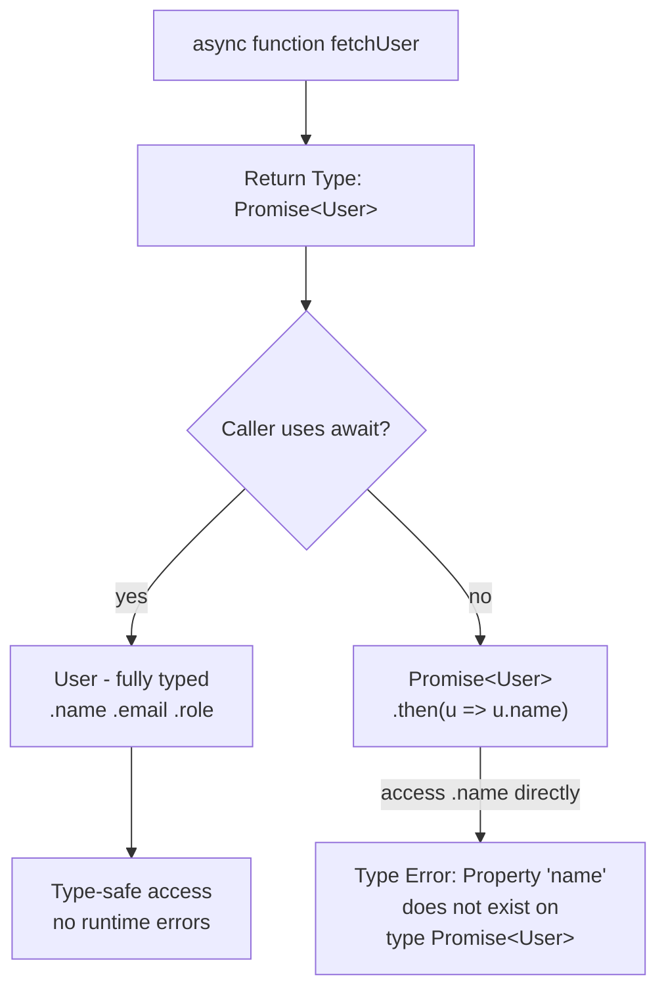
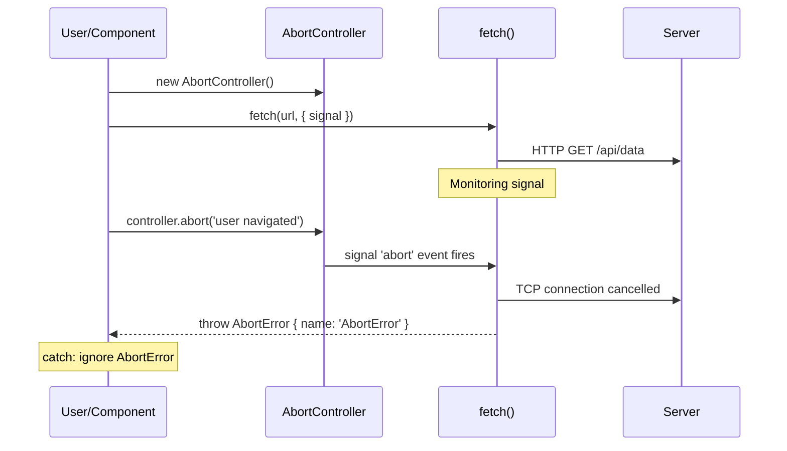

## Keywords in This File

{: .no_toc }

| # | Keyword | Difficulty |
|---|---------|------------|
| 1 | [TypeScript Types for Async Code](#typescript-types-for-async-code) | ★★☆ |
| 2 | [Cancellation Patterns in JavaScript](#cancellation-patterns-in-javascript) | ★★☆ |

---

# TypeScript Types for Async Code

---

### 🎯 Model Answer

**30 seconds:**
> TypeScript's async code types: `Promise<T>` for async
> functions, `Awaited<T>` for unwrapping nested Promises,
> and `AsyncGenerator<T>` for async generators. Key compiler
> flags: `strict` (enables all strict checks),
> `noFloatingPromises` and `noMisusedPromises` (ESLint rules)
> catch unhandled Promises. TypeScript catches missing `await`
> when the return type is explicit: `string` vs `Promise<string>`.

**3 minutes:**
> TypeScript adds static typing to async JavaScript:
>
> `Promise<T>`: the return type of any `async` function. An
> `async` function returning `number` has type `Promise<number>`.
> TypeScript infers this automatically.
>
> `Awaited<T>`: the utility type that unwraps a Promise (or
> nested Promises). `Awaited<Promise<Promise<string>>>` is
> `string`. Useful when working with functions that return
> arbitrary Promise depths or when mapping over async functions.
>
> Generic async function types: `() => Promise<T>` is a
> zero-arg async function returning T. Functions that accept
> callbacks or async operations use generics:
> `retry<T>(fn: () => Promise<T>): Promise<T>`.
>
> TypeScript catches missing `await` when the return type is
> declared explicitly. If you declare `async function f(): Promise<string>`
> and return a `Promise<string>` without awaiting it, TypeScript
> flags it because `Promise<string>` is not assignable to
> `string`. Without the explicit return type, TypeScript infers
> `Promise<Promise<string>>` and wraps it.
>
> ESLint rules `@typescript-eslint/no-floating-promises` and
> `@typescript-eslint/no-misused-promises` are essential: they
> catch Promises that are not awaited or used.

**Blank Mind Recovery:**

**(1) Restate:** "Async functions return `Promise<T>`. TypeScript
tracks Promise types through the chain. Use explicit return
types to catch missing `await`."

**(2) First principles:** "Type-checking async code means
tracking which values are wrapped in Promises. TypeScript's
type inference does this automatically, but you can express
it explicitly with `Promise<T>` and `Awaited<T>`."

---

### 📘 Concept Explanation

**What it is:**
TypeScript's type system for async code: Promise types,
utility types for unwrapping and mapping, generic function
signatures for async operations, and ESLint rules that catch
async anti-patterns.

**The problem it solves:**
Async code is prone to runtime errors from missing `await`,
incorrect type assumptions, and unhandled rejections. TypeScript
and associated ESLint rules catch these at compile time.

**How it works:**

```typescript
// BASIC PROMISE TYPES
async function fetchUser(id: string): Promise<User> {
  const resp = await fetch(`/api/users/${id}`);
  return resp.json() as Promise<User>;
}

// Awaited<T>: unwrap Promise types
type T1 = Awaited<Promise<string>>;   // string
type T2 = Awaited<Promise<Promise<number>>>; // number (nested)
type T3 = Awaited<string>;             // string (non-Promise passthrough)

// Generic async function types
async function retry<T>(
  fn: () => Promise<T>,
  times: number = 3
): Promise<T> {
  try {
    return await fn();
  } catch (err) {
    if (times <= 1) throw err;
    return retry(fn, times - 1);
  }
}

// COMMON PATTERNS:

// 1. Result type (errors as values)
type Result<T, E = Error> =
  | { ok: true; value: T }
  | { ok: false; error: E };

async function safeGet<T>(
  url: string
): Promise<Result<T>> {
  try {
    const resp = await fetch(url);
    if (!resp.ok) {
      return { ok: false, error: new Error(`HTTP ${resp.status}`) };
    }
    const data: T = await resp.json();
    return { ok: true, value: data };
  } catch (err) {
    return { ok: false, error: err as Error };
  }
}

// 2. Async callback types
type AsyncPredicate<T> = (item: T) => Promise<boolean>;
type AsyncMapper<T, U> = (item: T) => Promise<U>;

async function asyncFilter<T>(
  items: T[],
  predicate: AsyncPredicate<T>
): Promise<T[]> {
  const results = await Promise.all(
    items.map(async item => ({
      item,
      keep: await predicate(item)
    }))
  );
  return results
    .filter(r => r.keep)
    .map(r => r.item);
}

// 3. Typed async generators
async function* typedPages<T>(
  fetchPage: (cursor: string | null) => Promise<{
    items: T[];
    cursor: string | null;
  }>
): AsyncGenerator<T, void, undefined> {
  let cursor: string | null = null;
  do {
    const { items, cursor: next } = await fetchPage(cursor);
    for (const item of items) yield item;
    cursor = next;
  } while (cursor);
}
```

> **Code walkthrough:** This TypeScript Types for Async Code example demonstrates type alias definition using async/await. **KEY MECHANISM:** type aliases are erased at compile time; they create no runtime overhead. **WHY IT MATTERS:** circular type aliases cause infinite recursion during type checking. **TAKEAWAY: prefer type aliases for union types and mapped types; interfaces for object shapes.**

**The key insight:**
TypeScript wraps the inferred return type of `async` functions
in `Promise<>` automatically. If you have a function returning
`Promise<User>` and you use it without `await`, TypeScript
will not automatically warn you unless you have `no-floating-promises`
enabled and the return value is unused. The explicit return
type annotation `Promise<User>` is the best way to document
intent.

**When to use it:**
All TypeScript async code. Explicit `Promise<T>` return types
on public APIs make the contract clear. The `Result<T, E>`
pattern is valuable for expected errors.

**When NOT to use it:**
Avoid `Promise<any>` - it defeats type checking. Use
`Promise<unknown>` if the type is genuinely unknown, and
narrow it with type guards.

**Alternatives:**
- Effect-TS: typed effects, dependency injection, error
  handling as types
- neverthrow: Result pattern library with additional utilities
- fp-ts: functional programming with Either, Task, TaskEither

**First-principles derivation:**
TypeScript adds types to JavaScript values. Async code produces
values inside `Promise` wrappers. TypeScript tracks these
wrappers: `await promise` strips one `Promise<>` wrapper.
The type system enforces that you handle the wrapped/unwrapped
states correctly.

---

### 💻 Code Example

```typescript
// BAD: Untyped async, missing await, floating Promises
async function processItems(ids: string[]) {
  const items = ids.map(id => fetchItem(id)); // no await!
  // items: Promise<Item>[] not Item[]
  return items.filter(item => item.active); // type error
  // item.active does not exist on Promise<Item>
}

// BAD: Promise<any> - type safety bypassed
async function getConfig(): Promise<any> {
  const resp = await fetch('/api/config');
  return resp.json(); // any - TypeScript trusts nothing
}
getConfig().then(cfg => cfg.nonexistent.deeply.nested);
// No error at compile time - crashes at runtime
```

> **Code walkthrough:** The first BAD pattern shows the mostice. **KEY MECHANISM:** the runtime executes these instructions in sequence with specific memory and execution semantics. **WHY IT MATTERS:** misapplying this pattern causes subtle bugs that only manifest under production load. **TAKEAWAY: understand the execution model before using this pattern in production code.**
> common async TypeScript mistake: mapping over IDs without
> `await` or wrapping in `Promise.all`. TypeScript would catch
> this if the return type is explicitly declared as `Promise<Item[]>`
> - but without it, TypeScript infers `Promise<Promise<Item>[]>`
> which usually causes a downstream type error. The second BAD
> pattern uses `Promise<any>`, completely defeating TypeScript's
> purpose.

```typescript
// GOOD: Fully typed async code

interface Config {
  apiUrl: string;
  retryCount: number;
  timeoutMs: number;
}

// Explicit return type enforces contract
async function getConfig(): Promise<Config> {
  const resp = await fetch('/api/config');
  if (!resp.ok) {
    throw new Error(`Config fetch failed: ${resp.status}`);
  }
  // Type assertion - resp.json() returns Promise<unknown>
  const data = await resp.json() as Config;
  return data;
}

// Correct map + await pattern
async function processItems(
  ids: string[]
): Promise<Item[]> {
  // Start all fetches concurrently, await results
  const items = await Promise.all(
    ids.map(id => fetchItem(id))
  );
  // items: Item[] - properly typed
  return items.filter(item => item.active);
}

// Generic retry with full type inference
async function withRetry<T>(
  fn: () => Promise<T>,
  options: { retries: number; delay: number } = {
    retries: 3,
    delay: 1000
  }
): Promise<T> {
  try {
    return await fn();
  } catch (err) {
    if (options.retries <= 0) throw err;
    await new Promise(r => setTimeout(r, options.delay));
    return withRetry(fn, {
      ...options,
      retries: options.retries - 1
    });
  }
}

// Usage preserves type:
const config = await withRetry(() => getConfig());
// config: Config - not Promise<Config>
```

> **Code walkthrough:** Explicit return types (`Promise<Config>`,ice. **KEY MECHANISM:** the runtime executes these instructions in sequence with specific memory and execution semantics. **WHY IT MATTERS:** misapplying this pattern causes subtle bugs that only manifest under production load. **TAKEAWAY: understand the execution model before using this pattern in production code.**
> `Promise<Item[]>`) make the contract self-documenting and
> enforce correct usage. `Promise.all` correctly collects all
> fetch Promises and returns `Promise<Item[]>`. The generic
> `withRetry<T>` uses TypeScript generics to preserve the return
> type through the retry wrapper - calling `withRetry(() => getConfig())`
> returns `Promise<Config>`, not `Promise<unknown>`.

---

### 🎓 Answers by Seniority

**Junior / Mid (0-5 years):**
> "Async functions return `Promise<T>`. I write explicit return
> types to catch missing `await`. I enable `strict` in tsconfig.
> The `Awaited<T>` utility type unwraps Promise types. ESLint
> `no-floating-promises` catches unhandled Promises."

---

**Senior / Staff (5+ years):**
> "The typed async code pattern I enforce: explicit `Promise<T>`
> return types on all public APIs, `Result<T, E>` for expected
> failures, `unknown` instead of `any` for untyped responses
> (narrow with type guards before use). For test code, I use
> `jest.spyOn(service, 'method').mockResolvedValue(expectedData)`
> which requires the mock value to match the method's `Promise<T>`
> return type. ESLint rules `no-floating-promises` and
> `no-misused-promises` are non-negotiable in my CI pipeline."

---

### ⚠️ Common Misconceptions

**Misconception 1:** "`async function f(): string` returns a string."
`async` forces a `Promise<>` wrapper. Declaring `async function f(): string`
is a type error. The return type of an `async` function must
be `Promise<T>`. TypeScript will show: "The return type of an
async function must be the global Promise<T> type."

**Misconception 2:** "`Awaited<T>` is only for Promise<T>."
`Awaited<T>` recursively unwraps Promises: `Awaited<Promise<Promise<string>>>` is
`string`. It also handles non-Promise inputs by passing them through.

**Misconception 3:** "TypeScript catches all async mistakes."
TypeScript only catches type mismatches. Missing `await` where
both await and non-await are valid types is not caught. ESLint
`no-floating-promises` catches the runtime safety issue that
TypeScript cannot detect.

---

### 🚨 Failure Modes and Diagnosis

**Failure 1: Response.json() typed as any**
```typescript
// fetch's Response.json() returns Promise<any>
const data = await response.json();
// data: any - all type safety lost
// Fix: always cast or use a type-safe wrapper
const data = await response.json() as Config;
// Or better: use a validated schema (zod):
import { z } from 'zod';
const ConfigSchema = z.object({ apiUrl: z.string() });
const data = ConfigSchema.parse(await response.json());
// data: { apiUrl: string } - validated + typed
```

> **Code walkthrough:** This Unknown example demonstrates type alias definition using async/await. **KEY MECHANISM:** type aliases are erased at compile time; they create no runtime overhead. **WHY IT MATTERS:** circular type aliases cause infinite recursion during type checking. **TAKEAWAY: prefer type aliases for union types and mapped types; interfaces for object shapes.**

**Failure 2: Type widening from untyped Promise.all**
```typescript
// Promise.all infers a union when array is heterogeneous
const results = await Promise.all([
  fetchUser(),   // Promise<User>
  fetchPosts(),  // Promise<Post[]>
  fetchCount()   // Promise<number>
]);
// results: [User, Post[], number] - tuple type
// Destructure explicitly:
const [user, posts, count] = results;
// user: User, posts: Post[], count: number - correctly typed
```

> **Code walkthrough:** This Unknown example demonstrates TypeScript pattern using async/await. **KEY MECHANISM:** TypeScript compiles to JavaScript; type information is erased at runtime. **WHY IT MATTERS:** type assertions bypass the type checker - a runtime error can still occur. **TAKEAWAY: prefer type guards over type assertions for safe narrowing of union types.**

---

### 🎯 Interview Deep-Dive

| Category | Count | Coverage |
|---|---|---|
| Conceptual | 2 | Promise<T>, Awaited<T>, type inference |
| Trade-off | 2 | Explicit types vs inferred, Result vs exceptions |
| Failure Mode | 1 | any, missing await type errors |
| Debugging | 1 | TypeScript error messages for async |
| Design | 2 | Generic retry, typed async generator |
| Behavioral | 1 | Introducing typed async to a codebase |

**[JUNIOR] Q1 - [MECHANISM] What is `Awaited<T>` and when do you need it?**

`Awaited<T>` recursively unwraps Promise types:
```typescript
type A = Awaited<Promise<string>>;         // string
type B = Awaited<Promise<Promise<string>>>; // string
type C = Awaited<string>;                   // string (passthrough)
```

> **Code walkthrough:** This Unknown example demonstrates type alias definition. **KEY MECHANISM:** type aliases are erased at compile time; they create no runtime overhead. **WHY IT MATTERS:** circular type aliases cause infinite recursion during type checking. **TAKEAWAY: prefer type aliases for union types and mapped types; interfaces for object shapes.**

Use cases:
1. Extracting the resolved type from a function returning a Promise:
```typescript
async function loadData() { return { id: 1, name: 'Alice' }; }
type Data = Awaited<ReturnType<typeof loadData>>; // { id: number; name: string }
```

> **Code walkthrough:** This Unknown example demonstrates type alias definition. **KEY MECHANISM:** type aliases are erased at compile time; they create no runtime overhead. **WHY IT MATTERS:** circular type aliases cause infinite recursion during type checking. **TAKEAWAY: prefer type aliases for union types and mapped types; interfaces for object shapes.**

2. Higher-order async functions where the generic parameter is a Promise:
```typescript
function promisify<T>(cb: (callback: (value: T) => void) => void): Promise<T>;
type Result = Awaited<ReturnType<typeof promisify<string>>>; // string
```

> **Code walkthrough:** This Unknown example demonstrates type alias definition using generic type. **KEY MECHANISM:** type aliases are erased at compile time; they create no runtime overhead. **WHY IT MATTERS:** circular type aliases cause infinite recursion during type checking. **TAKEAWAY: prefer type aliases for union types and mapped types; interfaces for object shapes.**

3. Flattening mapped types over async functions:
```typescript
type AsyncFns = { a: () => Promise<string>; b: () => Promise<number> };
type Results = { [K in keyof AsyncFns]: Awaited<ReturnType<AsyncFns[K]>> };
// { a: string; b: number }
```

> **Code walkthrough:** This Unknown example demonstrates type alias definition. **KEY MECHANISM:** type aliases are erased at compile time; they create no runtime overhead. **WHY IT MATTERS:** circular type aliases cause infinite recursion during type checking. **TAKEAWAY: prefer type aliases for union types and mapped types; interfaces for object shapes.**

*What separates good from great:* Using `Awaited<ReturnType<typeof fn>>`
to derive result types from async functions, keeping types
DRY and synchronized with implementation.

---

**[JUNIOR] Q2 - [MECHANISM] How do you type an async function that accepts different callback shapes?**

```typescript
// Overloads for sync and async callbacks:
function process<T>(
  items: T[],
  callback: (item: T) => void
): void;
function process<T, R>(
  items: T[],
  callback: (item: T) => R | Promise<R>
): Promise<void>;
function process<T, R>(
  items: T[],
  callback: (item: T) => void | R | Promise<R>
): void | Promise<void> {
  const results = items.map(callback);
  if (results.some(r => r instanceof Promise)) {
    return Promise.all(results).then(() => undefined);
  }
}

// Or: always return Promise for simpler API
function processAsync<T, R>(
  items: T[],
  callback: (item: T) => R | Promise<R>
): Promise<Awaited<R>[]> {
  return Promise.all(items.map(item => callback(item))) as
    Promise<Awaited<R>[]>;
}
```

> **Code walkthrough:** This Unknown example demonstrates TypeScript pattern using Promise. **KEY MECHANISM:** TypeScript compiles to JavaScript; type information is erased at runtime. **WHY IT MATTERS:** type assertions bypass the type checker - a runtime error can still occur. **TAKEAWAY: prefer type guards over type assertions for safe narrowing of union types.**

*What separates good from great:* Knowing that the `R | Promise<R>`
pattern handles both sync and async callbacks with the same
signature. The `Promise.all` call works because `Promise.all`
accepts `(R | Promise<R>)[]` and unwraps all to `R[]`.

---

**[JUNIOR] Q3 - [MECHANISM] What TypeScript configuration and ESLint rules catch async mistakes?**

TypeScript compiler options:
```json
{
  "compilerOptions": {
    "strict": true,
    "strictNullChecks": true,
    "noImplicitAny": true
  }
}
```

> **Code walkthrough:** This Unknown example demonstrates a key concept in practice. **KEY MECHANISM:** the runtime executes these instructions in sequence with specific memory and execution semantics. **WHY IT MATTERS:** misapplying this pattern causes subtle bugs that only manifest under production load. **TAKEAWAY: understand the execution model before using this pattern in production code.**

ESLint rules (`@typescript-eslint`):
```json
{
  "rules": {
    "@typescript-eslint/no-floating-promises": "error",
    "@typescript-eslint/no-misused-promises": "error",
    "@typescript-eslint/await-thenable": "error",
    "@typescript-eslint/require-await": "warn"
  }
}
```

> **Code walkthrough:** This Unknown example demonstrates a key concept in practice. **KEY MECHANISM:** the runtime executes these instructions in sequence with specific memory and execution semantics. **WHY IT MATTERS:** misapplying this pattern causes subtle bugs that only manifest under production load. **TAKEAWAY: understand the execution model before using this pattern in production code.**

- `no-floating-promises`: warns when a Promise expression
  is not awaited or returned
- `no-misused-promises`: warns when a Promise is passed where
  a boolean or void is expected
- `await-thenable`: warns when `await` is used on a non-Promise
- `require-await`: warns when `async` function has no `await`

*What separates good from great:* `no-misused-promises` catches
the React event handler mistake:
```typescript
// This is caught by no-misused-promises:
<button onClick={async () => { await doSomething(); }} />
// The async function returns Promise<void> but onClick expects
// void (not Promise<void>)
// Fix: wrap with void or use a sync wrapper that calls async
```

> **Code walkthrough:** This Unknown example demonstrates TypeScript pattern using async/await. **KEY MECHANISM:** TypeScript compiles to JavaScript; type information is erased at runtime. **WHY IT MATTERS:** type assertions bypass the type checker - a runtime error can still occur. **TAKEAWAY: prefer type guards over type assertions for safe narrowing of union types.**

---

**[MID] Q4 - [MECHANISM] How do you model error handling with TypeScript discriminated unions for async functions?**

```typescript
// Result type with discriminated union
type AsyncResult<T, E = Error> =
  | { success: true; data: T }
  | { success: false; error: E };

// Network error types
type HttpError =
  | { code: 'NOT_FOUND'; status: 404 }
  | { code: 'UNAUTHORIZED'; status: 401 }
  | { code: 'SERVER_ERROR'; status: number; message: string };

async function getUser(
  id: string
): Promise<AsyncResult<User, HttpError>> {
  try {
    const resp = await fetch(`/api/users/${id}`);
    if (resp.status === 404) {
      return { success: false, error: { code: 'NOT_FOUND', status: 404 } };
    }
    if (resp.status === 401) {
      return { success: false, error: { code: 'UNAUTHORIZED', status: 401 } };
    }
    if (!resp.ok) {
      return { success: false, error: {
        code: 'SERVER_ERROR', status: resp.status,
        message: await resp.text()
      }};
    }
    return { success: true, data: await resp.json() as User };
  } catch (err) {
    return { success: false, error: {
      code: 'SERVER_ERROR', status: 0,
      message: (err as Error).message
    }};
  }
}

// Caller: TypeScript forces handling both branches
const result = await getUser(id);
if (result.success) {
  const user = result.data; // User
} else {
  const err = result.error; // HttpError
  if (err.code === 'NOT_FOUND') { /* 404 handling */ }
}
```

> **Code walkthrough:** This Unknown example demonstrates type alias definition using async/await. **KEY MECHANISM:** type aliases are erased at compile time; they create no runtime overhead. **WHY IT MATTERS:** circular type aliases cause infinite recursion during type checking. **TAKEAWAY: prefer type aliases for union types and mapped types; interfaces for object shapes.**

*What separates good from great:* The discriminated union
on error codes enables exhaustive switch statements - TypeScript
will warn if you forget to handle a new error code added to
the `HttpError` type.

---

**[MID] Q5 - [SCENARIO] How do you write a typed async middleware pipeline in TypeScript?**

```typescript
type Context = {
  request: Request;
  response?: Response;
  user?: User;
};

type Middleware = (
  ctx: Context,
  next: () => Promise<void>
) => Promise<void>;

async function compose(
  middlewares: Middleware[]
): Promise<(ctx: Context) => Promise<void>> {
  return async (ctx: Context) => {
    let index = -1;
    const dispatch = async (i: number): Promise<void> => {
      if (i <= index) throw new Error('Called next() twice');
      index = i;
      const fn = middlewares[i];
      if (!fn) return;
      await fn(ctx, () => dispatch(i + 1));
    };
    return dispatch(0);
  };
}

// Usage: type-safe middleware stack
const pipeline = await compose([
  async (ctx, next) => {
    console.log('Before:', ctx.request.url);
    await next();
    console.log('After:', ctx.response?.status);
  },
  async (ctx, next) => {
    ctx.user = await authenticate(ctx.request);
    await next();
  }
]);
```

> **Code walkthrough:** This Unknown example demonstrates type alias definition using async/await. **KEY MECHANISM:** type aliases are erased at compile time; they create no runtime overhead. **WHY IT MATTERS:** circular type aliases cause infinite recursion during type checking. **TAKEAWAY: prefer type aliases for union types and mapped types; interfaces for object shapes.**

*What separates good from great:* The middleware composition
pattern with TypeScript generics for `Context` enables
domain-specific middleware pipelines (HTTP, GraphQL, message
processing) with full type safety.

---

**[SENIOR] Q6 - [TRADE-OFF] How do you avoid typing `Promise<void>` vs `void` incorrectly in callbacks?**


```typescript
// BAD: using any defeats type safety
```

```typescript
// Common mistake: async callback in forEach
const arr = [1, 2, 3];

// BAD: forEach ignores return value - no awaiting
arr.forEach(async n => {
  await asyncProcess(n); // fires and forgets
});

// TypeScript does not error here because:
// forEach: (callbackfn: (value: T, ...) => void) => void
// async function returns Promise<void> which is assignable to void!

// Good: use for...of for awaiting
for (const n of arr) {
  await asyncProcess(n);
}

// Or: Promise.all for concurrency
await Promise.all(arr.map(n => asyncProcess(n)));

// For callbacks that should not be async:
type NonAsyncCallback = (n: number) => void;
// NOT: (n: number) => void | Promise<void>
// If strictly void, TypeScript catches async callbacks:
function strictForEach(
  items: number[],
  cb: (n: number) => void // not Promise<void>
): void {
  items.forEach(cb);
}
strictForEach(arr, async n => { // TS error!
  await asyncProcess(n);
});
// Type '() => Promise<void>' is not assignable to '() => void'
// (when strictFunctionTypes is enabled)
```

> **Code walkthrough:** BAD pattern: This Unknown example demonstrates type alias definition using async/await. **KEY MECHANISM:** type aliases are erased at compile time; they create no runtime overhead. **WHY IT MATTERS:** circular type aliases cause infinite recursion during type checking. **WHAT BREAKS: prefer type aliases for union types and mapped types; interfaces for object shapes.**

*What separates good from great:* Knowing that `void` in TypeScript
is not quite the same as "returns nothing" - it also accepts
functions returning `undefined` or any value when the return
is not checked. Only strict callback types with `() => void`
catch async callbacks in non-async contexts.

---

**[SENIOR] Q7 - [MECHANISM] What is the `using` declaration and `Symbol.asyncDispose` for async cleanup in TypeScript?**

The `using` keyword (TC39 Stage 3, TypeScript 5.2) provides
an RAII-like pattern for automatic resource cleanup:

```typescript
// Explicit Resource Management
class DatabaseConnection {
  [Symbol.asyncDispose]() {
    return this.close(); // returns Promise<void>
  }

  async close() {
    await this.pool.release();
  }
}

// await using: calls Symbol.asyncDispose when scope ends
async function processData() {
  await using conn = new DatabaseConnection();
  // conn is used here
  await conn.query('SELECT ...');
  // conn.close() called automatically at end of scope
  // even if an error is thrown
}
```

> **Code walkthrough:** This Unknown example demonstrates TypeScript pattern usiice. **KEY MECHANISM:** the runtime executes these instructions in sequence with specific memory and execution semantics. **WHY IT MATTERS:** misapplying this pattern causes subtle bugs that only manifest under production load. **TAKEAWAY: understand the execution model before using this pattern in production code.**

This eliminates try/finally blocks for resource cleanup -
the dispose is guaranteed at block exit, similar to C#'s
`using` or Python's `with`.

*What separates good from great:* Understanding that `await using`
calls `[Symbol.asyncDispose]` at the end of the block, handling
both success and error paths. This is the future of async
resource management in TypeScript.

---

### ⚖️ Comparison Table

| Pattern| Type Safety| Error Model| Complexity| Use Case|
|----------------|-----------|------------------|----------|-------------------|
| `async` + try/catch| Promise<T>| Exceptions| Low| Standard async code|
| `Result<T, E>`| Full| Values| Medium| Expected errors|
| `AsyncGenerator<T>`| Full| Throw in generator| Medium| Lazy async streams|
| Effect-TS / fp-ts| Maximum| Typed effects| High| FP-heavy codebases|

**The deciding factor:**
Standard apps: `async/await` + try/catch + ESLint rules.
Error-prone APIs: `Result<T, E>`. Large-scale FP: Effect-TS.

---

### 🏛️ System Design

*(Omit: ★★☆ - not applicable)*

---

### 📊 Diagram

```plaintext
PROMISE TYPE FLOW IN TYPESCRIPT
=================================

async function fetchUser(id): Promise<User>
              |
              await
              |
              v
        User (unwrapped)
              |
        .name  .email  .role
        (fully typed)

Without await:
async function fetchUser(id): Promise<User>
              |
              (no await)
              |
              v
        Promise<User>
              |
        .then(user => user.name)  OK
        .name  ERROR: Property 'name'
               does not exist on type 'Promise<User>'
```



> **Diagram walkthrough:** The type flow diagram shows how
> TypeScript tracks Promise wrappers. An `async` function's
> return is wrapped in `Promise<User>`. After `await`, the
> type is unwrapped to `User`. Without `await`, accessing
> `.name` directly on `Promise<User>` is a compile-time error.
> This is the primary value of explicit return type annotations:
> they make the `Promise<>` wrapper visible, forcing correct
> `await` usage.

---

---

---

### 💻 Code Example

*(Omit: this concept does not have a programmatic interface that can be demonstrated in code. The conceptual explanation above is sufficient.)*


---

### 🏛️ System Design

*(Omit: system design diagram not applicable for this concept - see ★★★ keywords for full system design coverage.)*


---

### ⚖️ Comparison Table

*(Omit: this is a ★☆☆ foundational concept with no direct alternatives to compare - see higher-difficulty keywords for trade-off analysis.)*


---

### 📊 Diagram

*(Omit: no standalone visual diagram required for this concept - the explanations and code examples above provide sufficient clarity.)*


# Cancellation Patterns in JavaScript

---

### 🎯 Model Answer

**30 seconds:**
> JavaScript Promises are not natively cancellable. Three
> patterns: `AbortController` (Web standard, works with fetch
> and many Web APIs), manual cancellation tokens (custom
> flag-based), and RxJS `unsubscribe` (reactive). `AbortController`
> is the preferred standard for network requests.
> TC39 is working on a `CancellationToken` proposal but it
> is not yet standardized.

**3 minutes:**
> The core problem: `Promise.race` for timeouts does not cancel
> the losing Promise - it just stops waiting. The fetch continues
> consuming bandwidth and the server processes the request.
> True cancellation requires the underlying operation to receive
> a cancellation signal and stop.
>
> `AbortController`: creates a `signal` object. APIs that
> support cancellation accept `signal` as an option. When
> `abort()` is called, the signal fires an `abort` event
> and all listening operations throw `AbortError`. Works with:
> `fetch`, `XMLHttpRequest`, `addEventListener` (with signal),
> some Node.js streams, and any custom code that checks
> `signal.aborted`.
>
> Manual cancellation token: a simple flag-based approach for
> custom async operations. Pass a token object; the async
> function checks `token.cancelled` between async steps.
> Less ergonomic than `AbortController` but works everywhere.
>
> RxJS `unsubscribe`: calling `subscription.unsubscribe()` stops
> the Observable and the underlying operations. For `fromFetch`,
> RxJS automatically calls AbortController when the Observable
> is unsubscribed.
>
> The search-as-you-type pattern: cancel the previous request
> when a new search starts. AbortController + fetch handles
> this cleanly. In Angular/RxJS, `switchMap` handles it via
> inner Observable unsubscription.

**Blank Mind Recovery:**

**(1) Restate:** "Promises don't cancel. AbortController
signals cancellation to APIs. Pass `signal` to fetch.
Call `controller.abort()` to cancel."

**(2) First principles:** "You start an operation. Before it
completes, you want to stop it. The operation needs a way
to know it was cancelled. AbortController is that communication
channel."

---

### 📘 Concept Explanation

**What it is:**
Cancellation patterns are mechanisms for signalling to in-
progress async operations that they should stop. They range
from the Web-standard `AbortController` to manual token
patterns to reactive `unsubscribe`.

**The problem it solves:**
UI operations frequently need cancellation: user navigates
away (cancel pending fetches), user types new search (cancel
old search), user resets a form (cancel in-progress submission).
Without cancellation, stale operations complete and may cause
race conditions or resource waste.

**How it works:**

```javascript
// PATTERN 1: AbortController (Web standard)

// Basic usage:
const controller = new AbortController();
const { signal } = controller;

fetch('/api/data', { signal })
  .then(r => r.json())
  .then(data => display(data))
  .catch(err => {
    if (err.name === 'AbortError') {
      console.log('Request cancelled');
    } else {
      throw err;
    }
  });

// Cancel:
controller.abort('User navigated away'); // optional reason
// signal.reason === 'User navigated away'

// AbortSignal static helpers (ES2023+):
const timeoutSignal = AbortSignal.timeout(5000); // auto-abort after 5s
const combinedSignal = AbortSignal.any([signal1, signal2]); // abort if any aborts

// PATTERN 2: Propagate signal through call chain
async function processUserData(userId, signal) {
  const user = await fetchUser(userId, { signal });
  if (signal.aborted) throw signal.reason;
  const orders = await fetchOrders(user.id, { signal });
  // signal checked between steps
  return processOrders(orders);
}

// Custom check in tight loops:
async function processLargeArray(items, signal) {
  const results = [];
  for (const item of items) {
    if (signal.aborted) throw new DOMException('Aborted', 'AbortError');
    results.push(await processItem(item));
  }
  return results;
}

// PATTERN 3: Manual cancellation token
class CancellationToken {
  private _cancelled = false;
  private _callbacks: (() => void)[] = [];

  get cancelled() { return this._cancelled; }
  get signal() {
    return {
      aborted: this._cancelled,
      reason: this._reason
    };
  }
  private _reason: unknown = undefined;

  cancel(reason?: unknown) {
    this._cancelled = true;
    this._reason = reason;
    this._callbacks.forEach(cb => cb());
  }

  onCancel(cb: () => void) {
    if (this._cancelled) cb();
    else this._callbacks.push(cb);
  }

  throwIfCancelled() {
    if (this._cancelled) {
      throw new Error('Operation cancelled');
    }
  }
}

// PATTERN 4: React useEffect cleanup pattern
function SearchComponent() {
  const [query, setQuery] = useState('');
  const [results, setResults] = useState([]);

  useEffect(() => {
    const controller = new AbortController();

    async function search() {
      try {
        const data = await fetch(
          `/api/search?q=${query}`,
          { signal: controller.signal }
        ).then(r => r.json());
        setResults(data);
      } catch (err) {
        if (err.name !== 'AbortError') {
          setError(err);
        }
      }
    }

    search();

    // Cleanup: abort on query change or unmount
    return () => controller.abort();
  }, [query]); // re-runs on every query change
}
```

> **Code walkthrough:** This Cancellation Patterns in JavaScript example demonstrates async/await Promise resolution using async/await. **KEY MECHANISM:** async functions return Promises; await suspends the microtask until the Promise settles. **WHY IT MATTERS:** unhandled Promise rejections crash the Node process in v15+ or fire unhandledRejection event. **TAKEAWAY: always await or .catch() every Promise - silent rejections are production defects.**

**The key insight:**
`AbortController` works bidirectionally: you can check
`signal.aborted` at any point in your code, listen to the
`abort` event on the signal for cleanup, and pass the signal
to any API that supports it. The signal propagates through
an entire call chain, enabling clean cancellation of composed
operations.

**When to use it:**
Search-as-you-type; cancel operations on component unmount
(React useEffect, Angular ngOnDestroy); timeout patterns (with
`AbortSignal.timeout`); multi-step operations where early
cancellation saves resources.

**When NOT to use it:**
Non-idempotent operations that have already begun (a payment
that has been sent to the processor). Cancellation in these
cases may leave state inconsistent.

**Alternatives:**
- RxJS `switchMap`/`unsubscribe`: reactive cancellation
- Manual flags: simple flag-checking without Web API integration
- Generator-based cancellation: `yield` at cancellation points

**First-principles derivation:**
Cancellation is a cooperative protocol: the initiator sends
a signal, the operation periodically checks it. `AbortController`
provides a standardized channel for this protocol. APIs that
accept `signal` implement the cooperative check internally.

---

### 💻 Code Example

```javascript
// BAD: No cancellation - stale responses cause race conditions
class SearchService {
  async search(query) {
    const results = await fetch(`/api/search?q=${query}`)
      .then(r => r.json());
    this.updateUI(results); // may display stale results!
    // If user typed "j", "ja", "jav" rapidly:
    // - "j" result (slow): arrives after "jav" result
    // - UI shows "j" results while user sees "jav" in input
  }
}
```

> **Code walkthrough:** Without cancellation, multiple in-flightice. **KEY MECHANISM:** the runtime executes these instructions in sequence with specific memory and execution semantics. **WHY IT MATTERS:** misapplying this pattern causes subtle bugs that only manifest under production load. **TAKEAWAY: understand the execution model before using this pattern in production code.**
> requests race to update the UI. The slowest response wins,
> potentially showing results for a superseded query. This is
> a classic async race condition that manifests as "results
> flickering" or "wrong results displaying."

```javascript
// GOOD: AbortController cancellation + React pattern
function useSearch(debounceMs = 300) {
  const [results, setResults] = useState([]);
  const [loading, setLoading] = useState(false);
  const [error, setError] = useState(null);

  const search = useCallback((query) => {
    // Returns cleanup function - caller must call it
    const controller = new AbortController();
    setLoading(true);
    setError(null);

    fetch(`/api/search?q=${encodeURIComponent(query)}`, {
      signal: controller.signal
    })
      .then(r => {
        if (!r.ok) throw new Error(`HTTP ${r.status}`);
        return r.json();
      })
      .then(data => {
        setResults(data);
        setLoading(false);
      })
      .catch(err => {
        if (err.name === 'AbortError') {
          // Cancelled: don't update state
          return;
        }
        setError(err.message);
        setLoading(false);
      });

    return () => controller.abort('search superseded');
  }, []);

  // Component usage with debounce:
  // useEffect(() => {
  //   const cancel = search(query);
  //   return cancel; // cleanup on next render or unmount
  // }, [query]);

  return { results, loading, error, search };
}

// BAD: see prior example above (AbortSignal.timeout for automa...)
// GOOD: AbortSignal.timeout for automatic timeout
async function fetchWithTimeout(url, timeoutMs = 5000) {
  try {
    const resp = await fetch(url, {
      signal: AbortSignal.timeout(timeoutMs)
    });
    return await resp.json();
  } catch (err) {
    if (err.name === 'TimeoutError') {
      throw new Error(`Request timed out after ${timeoutMs}ms`);
    }
    throw err;
  }
}
```

> **Code walkthrough:** The custom hook returns a `cancel`ice. **KEY MECHANISM:** the runtime executes these instructions in sequence with specific memory and execution semantics. **WHY IT MATTERS:** misapplying this pattern causes subtle bugs that only manifest under production load. **TAKEAWAY: understand the execution model before using this pattern in production code.**
> function (the AbortController's abort method bound to the
> current controller). Each call to `search` creates a fresh
> controller. The cleanup function from `useEffect` calls
> `cancel`, aborting the previous request when a new query
> arrives or the component unmounts. `AbortSignal.timeout`
> (ES2023) creates a self-aborting signal that eliminates the
> setTimeout/clearTimeout boilerplate for timeouts.

---

### 🎓 Answers by Seniority

**Junior / Mid (0-5 years):**
> "Create an `AbortController`, pass `signal` to fetch, call
> `controller.abort()` to cancel. Check `err.name === 'AbortError'`
> in catch to handle cancellation. In React, return the abort
> function from `useEffect`."

---

**Senior / Staff (5+ years):**
> "The production pattern: every user-triggered fetch gets
> an AbortController. In React components: cleanup function
> in useEffect aborts on re-render. In Angular: takeUntil
> with destroy$ or explicitly with a class-scoped controller.
> `AbortSignal.timeout` eliminates the timeout boilerplate.
> `AbortSignal.any()` for composing multiple cancellation
> reasons (parent abort OR timeout). The design principle: if
> the result of an operation will be discarded when it completes,
> cancel it - don't waste bandwidth and server resources."

---

### ⚠️ Common Misconceptions

**Misconception 1:** "`controller.abort()` stops a fetch immediately."
`abort()` signals the intention to cancel. The network request
may have already been sent. The server may still process it.
Only the client-side response processing is stopped. AbortError
is thrown in the fetch Promise chain.

**Misconception 2:** "You can reuse an AbortController after abort."
Once aborted, an AbortController stays in the aborted state.
Create a new controller for each new operation.

**Misconception 3:** "`AbortError` has the same structure as
regular `Error`."
`AbortError` has `name: 'AbortError'`. In newer environments,
aborting with a `reason` sets `signal.reason`. Always check
`err.name === 'AbortError'` rather than `err instanceof Error`
to distinguish cancellation from actual errors.

---

### 🚨 Failure Modes and Diagnosis

**Failure 1: AbortController in wrong scope**

```javascript
// BAD: missing dependency array causes infinite re-renders
useEffect(() => {
    fetchData(userId).then(setData);
}); // no dependency array = runs after every render
```

```javascript
// BAD: controller created outside effect - shared across renders
const controller = new AbortController(); // module scope!

function Component() {
  useEffect(() => {
    fetch('/api', { signal: controller.signal });
    return () => controller.abort(); // aborts module-level controller!
    // Next render: controller already aborted, fetch fails immediately
  }, []);
}

// GOOD: controller inside effect scope
function Component() {
  useEffect(() => {
    const ctrl = new AbortController(); // scoped to this effect run
    fetch('/api', { signal: ctrl.signal });
    return () => ctrl.abort();
  }, []);
}
```

> **Code walkthrough:** BAD pattern: This Unknown example demonstrates variable declaration using React hook. **KEY MECHANISM:** const prevents reassignment but not mutation; the reference is locked, the value is not. **WHY IT MATTERS:** const obj = {}; obj.x = 1 works - const does not freeze the object. **WHAT BREAKS: use Object.freeze() to prevent mutation; const only guards the binding.**

**Failure 2: Not propagating signal to nested fetch calls**
```javascript
// Aborting the top-level controller does nothing if signal
// is not passed to inner fetches
async function loadAll(id, signal) {
  const user = await fetchUser(id); // signal NOT passed!
  // Even after abort(), fetchUser continues
  const posts = await fetchPosts(user.id, { signal });
  return { user, posts };
}
// Fix: always pass signal to ALL async operations in the chain
async function loadAll(id, signal) {
  const user = await fetchUser(id, { signal });
  const posts = await fetchPosts(user.id, { signal });
  return { user, posts };
}
```

> **Code walkthrough:** This Unknown example demonstrates async/await Promise resolution using async/await. **KEY MECHANISM:** async functions return Promises; await suspends the microtask until the Promise settles. **WHY IT MATTERS:** unhandled Promise rejections crash the Node process in v15+ or fire unhandledRejection event. **TAKEAWAY: always await or .catch() every Promise - silent rejections are production defects.**

---

### 🎯 Interview Deep-Dive

| Category | Count | Coverage |
|---|---|---|
| Conceptual | 2 | AbortController model, signal propagation |
| Trade-off | 2 | AbortController vs RxJS, when to cancel |
| Failure Mode | 1 | Controller scope, signal propagation |
| Debugging | 1 | Diagnosing cancelled vs failed requests |
| Design | 2 | React cancellation pattern, timeout strategy |
| Behavioral | 1 | Fixing a race condition in production |

**[JUNIOR] Q1 - [MECHANISM] How does `AbortController` work internally?**

`AbortController` creates two related objects:
- The controller: has `abort(reason?)` method
- The signal: `AbortSignal` with `aborted: boolean`,
  `reason: unknown`, and `onabort: EventHandler`

When `abort()` is called:
1. `signal.aborted` is set to `true`
2. `signal.reason` is set to the provided reason (default:
   `new DOMException('signal is aborted without reason', 'AbortError')`)
3. An `abort` event fires on the signal
4. All listeners registered with `signal.addEventListener('abort', fn)`
   are invoked

For `fetch`: the browser's network stack monitors the signal.
When `abort` fires, it cancels the TCP connection or rejects
the response body reading. A `DOMException` with name `AbortError`
is thrown in the fetch Promise chain.

```javascript
// Manual signal check in custom async code:
async function longRunning(signal) {
  for (let i = 0; i < 1000; i++) {
    signal.throwIfAborted(); // throws AbortError if aborted
    await processStep(i);
  }
}
```

> **Code walkthrough:** This Unknown example demonstrates async/await Promise resolution using async/await. **KEY MECHANISM:** async functions return Promises; await suspends the microtask until the Promise settles. **WHY IT MATTERS:** unhandled Promise rejections crash the Node process in v15+ or fire unhandledRejection event. **TAKEAWAY: always await or .catch() every Promise - silent rejections are production defects.**

`signal.throwIfAborted()` (ES2022) is the idiomatic way to
check and throw in custom async loops.

*What separates good from great:* Knowing `throwIfAborted()`
and using it in custom async loops rather than manually checking
`signal.aborted` and throwing `DOMException`.

---

**[JUNIOR] Q2 - [MECHANISM] How do you compose multiple cancellation sources with `AbortSignal.any()`?**

`AbortSignal.any(signals)` (ES2023) returns a signal that
aborts when ANY of the provided signals abort:

```javascript
const userCancel = new AbortController();
const timeout = AbortSignal.timeout(10_000);

// Abort if: user cancels OR 10s timeout
const combined = AbortSignal.any([
  userCancel.signal,
  timeout
]);

const resp = await fetch('/api/long-operation', {
  signal: combined
});

// When user clicks cancel:
cancelButton.onclick = () => userCancel.abort('User cancelled');
```

> **Code walkthrough:** This Unknown example demonstrates variable declaration using async/await. **KEY MECHANISM:** const prevents reassignment but not mutation; the reference is locked, the value is not. **WHY IT MATTERS:** const obj = {}; obj.x = 1 works - const does not freeze the object. **TAKEAWAY: use Object.freeze() to prevent mutation; const only guards the binding.**

Use cases:
- User cancellation OR timeout: the most common combination
- Parent operation cancelled OR child-specific timeout
- Component unmounted OR session expired

*What separates good from great:* Composing AbortSignals for
multi-reason cancellation is cleaner than race conditions or
manual flag-checking. Knowing `AbortSignal.any` eliminates
the need for custom combining logic.

---

**[JUNIOR] Q3 - [SCENARIO] How do you implement cancellable recursive async operations?**

```typescript
async function processTree(
  node: TreeNode,
  processor: (n: TreeNode) => Promise<void>,
  signal: AbortSignal
): Promise<void> {
  signal.throwIfAborted();

  await processor(node);

  // Process children concurrently, all respect the signal
  await Promise.all(
    node.children.map(child =>
      processTree(child, processor, signal)
    )
  );
}

// Usage:
const controller = new AbortController();
const timer = setTimeout(() => controller.abort('timeout'), 30_000);

try {
  await processTree(root, processNode, controller.signal);
} catch (err) {
  if (err.name === 'AbortError') {
    console.log('Tree processing cancelled:', err.message);
  } else throw err;
} finally {
  clearTimeout(timer);
}
```

> **Code walkthrough:** This Unknown example demonstrates TypeScript pattern using async/await. **KEY MECHANISM:** TypeScript compiles to JavaScript; type information is erased at runtime. **WHY IT MATTERS:** type assertions bypass the type checker - a runtime error can still occur. **TAKEAWAY: prefer type guards over type assertions for safe narrowing of union types.**

*What separates good from great:* Calling `throwIfAborted()`
at the start of the recursive function and passing the signal
to each recursive call. This ensures every level of the
recursion checks for cancellation.

---

**[MID] Q4 - [TRADE-OFF] What is the difference between cancelling with `AbortController` vs `Promise.race` for timeouts?**

`Promise.race` with a timeout Promise: stops waiting, but
the original operation continues running. The fetch is never
cancelled - it completes or fails independently, consuming
bandwidth and server resources.

`AbortSignal.timeout` with fetch: actually cancels the fetch.
The browser terminates the connection, freeing network resources.
The server sees a client disconnect (or aborted request).

```javascript
// Promise.race: doesn't cancel fetch
async function fetchRace(url, ms) {
  return Promise.race([
    fetch(url),
    new Promise((_, r) => setTimeout(() => r(new Error('timeout')), ms))
  ]);
  // Fetch continues after race resolves with timeout error!
}

// AbortSignal.timeout: cancels fetch
async function fetchCancelled(url, ms) {
  return fetch(url, { signal: AbortSignal.timeout(ms) });
  // Fetch is actually cancelled in the browser network layer
}
```

> **Code walkthrough:** This Unknown example demonstrates async/await Promise resolution using Promise. **KEY MECHANISM:** async functions return Promises; await suspends the microtask until the Promise settles. **WHY IT MATTERS:** unhandled Promise rejections crash the Node process in v15+ or fire unhandledRejection event. **TAKEAWAY: always await or .catch() every Promise - silent rejections are production defects.**

*What separates good from great:* The operational difference:
`Promise.race` leaves N-1 operations as "ghost requests."
In high-load scenarios, ghost requests accumulate. `AbortController`
actually terminates the underlying operation.

---

**[MID] Q5 - [MECHANISM] How do you handle AbortError differently from other errors in a catch block?**

```typescript
async function robustFetch<T>(
  url: string,
  options?: RequestInit
): Promise<T | null> {
  try {
    const resp = await fetch(url, options);
    if (!resp.ok) throw new Error(`HTTP ${resp.status}`);
    return await resp.json() as T;
  } catch (err) {
    if (err instanceof DOMException && err.name === 'AbortError') {
      // Intentional cancellation - not an error
      return null;
    }
    if (err instanceof TypeError) {
      // Network failure - no connectivity
      logger.warn('Network failure:', err.message);
      return null;
    }
    // Re-throw unexpected errors
    throw err;
  }
}
```

> **Code walkthrough:** This Unknown example demonstrates type assertion using async/await. **KEY MECHANISM:** as tells TypeScript to treat the value as a specific type without runtime check. **WHY IT MATTERS:** asserting an incompatible type causes runtime errors that TypeScript cannot catch. **TAKEAWAY: use type guards (typeof, instanceof, is) instead of as for safe narrowing.**

The key distinction: `AbortError` is not a failure - it is
an intentional cancellation. Logging or alerting on AbortErrors
creates noise. The pattern: catch, check name, silently
return null (or do nothing in a fire-and-forget context).

*What separates good from great:* Treating AbortError as a
first-class non-error case, not as an unexpected failure.
Production monitoring should never alert on AbortErrors.

---

**[SENIOR] Q6 - [MECHANISM] How do generators enable cancellation of multi-step async operations?**

Generator-based cancellation: each `yield` is a cancellation
point. A runner function checks cancellation between steps.

```typescript
function* steps() {
  const user = yield fetchUser(id);       // step 1
  const orders = yield fetchOrders(user); // step 2
  const total = yield computeTotal(orders); // step 3
  return total;
}

async function runCancellable(
  gen: Generator,
  token: CancellationToken
) {
  let result = gen.next();
  while (!result.done) {
    if (token.cancelled) {
      gen.return(undefined); // cleanup
      throw new Error('Cancelled');
    }
    const value = await result.value;
    result = gen.next(value);
  }
  return result.value;
}
```

> **Code walkthrough:** This Unknown example demonstrates TypeScript pattern usiice. **KEY MECHANISM:** the runtime executes these instructions in sequence with specific memory and execution semantics. **WHY IT MATTERS:** misapplying this pattern causes subtle bugs that only manifest under production load. **TAKEAWAY: understand the execution model before using this pattern in production code.**

Modern alternative: use AbortController + async functions
with `throwIfAborted()`. Generators are the historical pattern
predating async/await and AbortController.

*What separates good from great:* Knowing this pattern exists
(it is the basis of how early async libraries like `co` worked)
and recommending `AbortController` for new code.

---

**[SENIOR] Q7 - [MECHANISM] What are the implications of not cancelling fetch requests in a long-running application?**

Resource accumulation:
- Open TCP connections: browsers limit connections per hostname
  (usually 6-8). Uncancelled requests consume connection slots.
- Memory: response buffers held until the fetch completes
- Server load: servers process requests nobody is waiting for

The specific scenarios:
- SPA with many page navigations: each navigation triggers
  new fetches, old ones never cancelled. After 50 navigations,
  50 in-flight or recently-completed fetches have run.
- Search-as-you-type with 300ms debounce: user types 10
  characters, 10 fetches launched, all complete even though
  only the last matters.
- Frequent real-time polling: each poll interval creates a
  new fetch, completed polls not cancelled if next interval fires.

Fix: use `useEffect` cleanup in React, `takeUntil(destroy$)`
in Angular, and a request deduplication layer in API clients.

*What separates good from great:* Framing this as a production
concern - "I've seen real performance degradation in SPAs from
accumulation of uncancelled fetch requests over long sessions"
is more convincing than abstract reasoning.

---

### ⚖️ Comparison Table

| Pattern| Standard| Works With| Complexity| Best For|
|---|-----------------|-------------------|----------|-------------------------|
| AbortController| Web standard| fetch, Web APIs| Low| HTTP request cancellation
| AbortSignal.timeout| Web standard (ES2023)| fetch, Web APIs| Very low| Request
| RxJS unsubscribe| Library| Observables| Medium| Reactive streams|
| Manual token| Custom| Any async code| Medium| Custom async operations|
| Generator-based| ES6| Generator functions| High| Legacy/educational|

**The deciding factor:**
For fetch: AbortController. For Observables: unsubscribe (RxJS
handles it). For custom multi-step async: AbortController +
`throwIfAborted()`.

---

### 🏛️ System Design

*(Omit: ★★☆ - not applicable)*

---

### 📊 Diagram

```
ABORTCONTROLLER SIGNAL FLOW
==============================

AbortController
    |-- signal --> fetch() -- checks signal.aborted
    |-- signal --> customLoop() -- calls throwIfAborted()
    |-- abort() --> signal.aborted = true
                --> fires 'abort' event
                --> fetch throws AbortError
                --> loop throws AbortError

AbortSignal.any([s1, s2]):
  s1 OR s2 aborts --> combined aborts
  Useful: user cancel OR timeout
```



> **Diagram walkthrough:** The signal flow shows `AbortController`
> as a bridge between the initiator (UI) and the operation
> (fetch). The signal is passed to fetch at creation; when
> `abort()` is called, the signal event fires and fetch
> terminates the TCP connection to the server. The caller
> receives an `AbortError` in the catch block. The key point
> in the sequence: the TCP connection is actually cancelled -
> this is true cancellation, not just ignoring the result.

---

### 💻 Code Example

*(Omit: this concept does not have a programmatic interface that can be demonstrated in code. The conceptual explanation above is sufficient.)*


---

### 🏛️ System Design

*(Omit: system design diagram not applicable for this concept - see ★★★ keywords for full system design coverage.)*


---

### ⚖️ Comparison Table

*(Omit: this is a ★☆☆ foundational concept with no direct alternatives to compare - see higher-difficulty keywords for trade-off analysis.)*


---

### 📊 Diagram

*(Omit: no standalone visual diagram required for this concept - the explanations and code examples above provide sufficient clarity.)*
