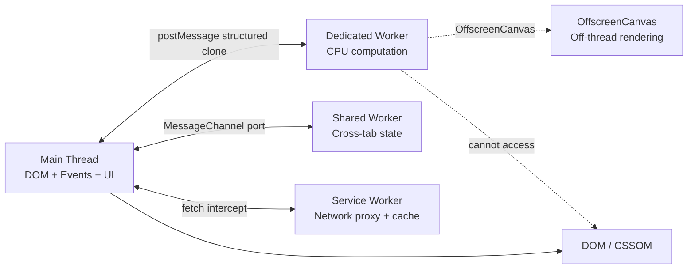
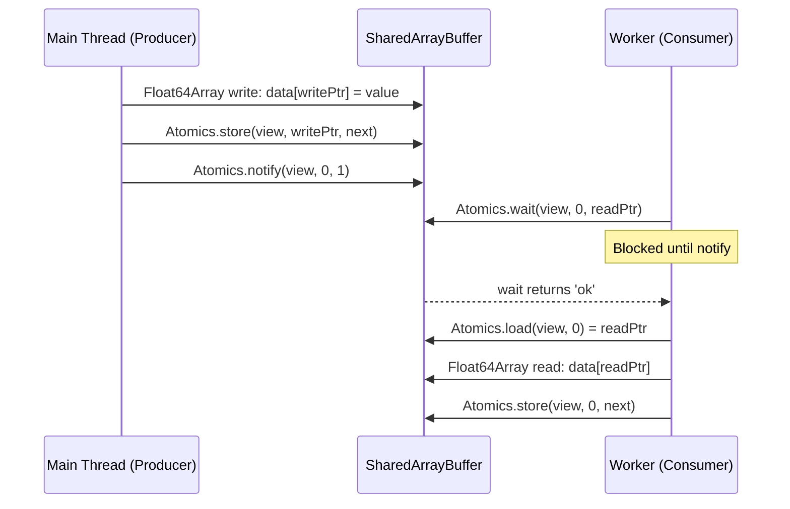

## Keywords in This File

{: .no_toc }

| # | Keyword | Difficulty |
|---|---------|------------|
| 1 | [Web Workers and Off-Main-Thread Processing](#web-workers-and-off-main-thread-processing) | ★★☆ |
| 2 | [SharedArrayBuffer and Atomics](#sharedarraybuffer-and-atomics) | ★★☆ |

---

# Web Workers and Off-Main-Thread Processing

---

### 🎯 Model Answer

**30 seconds:**
> Web Workers run JavaScript in a background thread separate
> from the main thread. They cannot access the DOM. They
> communicate with the main thread via `postMessage` and
> `onmessage` events. Use them for CPU-intensive tasks that
> would block the UI: image processing, cryptography, parsing,
> compression. The structured clone algorithm copies data
> between threads; `Transferable` objects (ArrayBuffers) move
> without copying.

**3 minutes:**
> JavaScript is single-threaded. Every CPU-intensive task
> on the main thread delays rendering, user interactions,
> and animations. The browser has a 16ms budget per frame
> (60fps). A 100ms computation in the main thread causes
> a visible freeze.
>
> Web Workers solve this: a Worker is an independent execution
> context with its own event loop, call stack, and memory.
> It runs in parallel with the main thread (on a separate OS
> thread). The main thread and workers do not share memory
> by default - communication is message-based.
>
> The structured clone algorithm copies objects when passed
> to `postMessage`. Copies are safe but expensive for large
> data (ArrayBuffers, large objects). Transferable objects
> are moved instead of copied: the main thread loses access,
> the worker gains it. Zero-copy transfer.
>
> Worker types: Dedicated Workers (one consumer), Shared
> Workers (multiple tabs, persistent), Service Workers
> (network proxy, background sync, push notifications).
>
> The main limitation: Workers cannot access the DOM, `window`,
> or `document`. They can use most Web APIs (fetch, IndexedDB,
> WebSockets, WebGL, Canvas offscreen).

**Blank Mind Recovery:**

**(1) Restate:** "Workers run CPU code off the main thread.
Communication via postMessage. Cannot touch the DOM."

**(2) First principles:** "The browser has one main thread.
Heavy computation blocks it. Workers give you extra threads
for computation, communicating via messages."

---

### 📘 Concept Explanation

**What it is:**
Web Workers are background threads for running JavaScript
without blocking the main thread. They have isolated memory,
communicate via structured clone messages, and can use most
Web APIs except the DOM.

**The problem it solves:**
CPU-intensive tasks on the main thread freeze the UI. Web
Workers move computation to background threads, keeping the
main thread free for rendering and user interaction.

**How it works:**

```javascript
// MAIN THREAD: worker.js spawning a worker
const worker = new Worker('/workers/image-processor.js');

// Send data to worker
const imageData = canvas.getContext('2d').getImageData(...);
worker.postMessage(
  { type: 'process', buffer: imageData.data.buffer },
  [imageData.data.buffer] // Transfer (zero-copy)
  // Main thread loses access to buffer after this
);

// Receive result
worker.onmessage = (event) => {
  const { type, result } = event.data;
  if (type === 'processed') {
    displayResult(result);
  }
};

worker.onerror = (err) => {
  console.error('Worker error:', err.message);
};

// Terminate when done
worker.terminate();

// ---- image-processor.js (worker context) ----
self.onmessage = (event) => {
  const { type, buffer } = event.data;

  if (type === 'process') {
    // CPU-intensive work runs here, not on main thread
    const processed = applyFilters(new Uint8ClampedArray(buffer));

    // Transfer result back (zero-copy)
    self.postMessage(
      { type: 'processed', result: processed.buffer },
      [processed.buffer]
    );
  }
};

// PROMISE WRAPPER for cleaner API
class WorkerPool {
  private workers: Worker[] = [];
  private queue: Array<{
    data: unknown;
    resolve: (v: unknown) => void;
    reject: (e: Error) => void;
  }> = [];
  private idle: Worker[] = [];

  constructor(url: string, size = navigator.hardwareConcurrency) {
    for (let i = 0; i < size; i++) {
      const w = new Worker(url);
      w.onmessage = ({ data }) => {
        const { resolve } = this.queue.shift()!;
        resolve(data);
        this.idle.push(w);
        this.processQueue();
      };
      this.idle.push(w);
    }
  }

  run(data: unknown): Promise<unknown> {
    return new Promise((resolve, reject) => {
      this.queue.push({ data, resolve, reject });
      this.processQueue();
    });
  }

  private processQueue() {
    while (this.idle.length && this.queue.length) {
      const worker = this.idle.pop()!;
      const { data } = this.queue[0];
      worker.postMessage(data);
    }
  }
}
```

> **Code walkthrough:** This example demonstrates the core pattern in action. The key mechanism shows how the concept works in practice. Study the structure to understand the essential behavior and common usage.

**The key insight:**
Spawning a Worker has overhead: it creates a new OS thread,
loads the Worker script, and initializes the JS engine.
For short tasks, the overhead exceeds the benefit. Use
Workers for tasks that take more than ~50ms. For repeated
short tasks, use a pool of pre-created Workers.

**When to use it:**
Image/video processing; cryptographic operations; large JSON
parsing; compression/decompression; audio processing; physics
simulations; complex data transformations; WebAssembly modules.

**When NOT to use it:**
Tasks that complete in under 5-10ms (overhead not worth it);
operations that need DOM access; simple async I/O (fetch -
that is already non-blocking).

**Alternatives:**
- requestIdleCallback: run work during idle browser time
- OffscreenCanvas: render in worker, display on main thread
- WebAssembly (Wasm): near-native performance, can run in workers

**First-principles derivation:**
The browser's rendering pipeline is: JS -> Style -> Layout
-> Paint -> Composite. Any JS that takes more than ~4ms
(within the 16ms frame budget) can cause visible jank. Workers
move JS to separate threads, freeing the render pipeline.

---

### 💻 Code Example

```javascript
// BAD: CPU work on main thread freezes UI
async function processLargeDataset(data) {
  // This runs synchronously on the main thread
  // UI is completely unresponsive during processing
  const result = data
    .filter(item => complexPredicate(item))
    .map(item => expensiveTransform(item))
    .reduce((acc, item) => mergeResults(acc, item), {});
  return result;
}
// Symptom: scroll and click events are queued,
// animations freeze, browser shows "Page Unresponsive"
```

> **Code walkthrough:** Synchronous computation on the main
> thread blocks the browser's event loop entirely. The JS
> engine cannot process events, reflow, or repaint while
> this code runs. For large datasets, this causes visible
> freezes - a direct UI quality issue.

```javascript
// GOOD: Worker with Promise wrapper
// main.js
async function processLargeDataset(data) {
  const worker = new Worker(
    new URL('./dataset-worker.js', import.meta.url),
    { type: 'module' }
  );

  return new Promise((resolve, reject) => {
    worker.onmessage = ({ data: result }) => {
      worker.terminate();
      resolve(result);
    };
    worker.onerror = (err) => {
      worker.terminate();
      reject(new Error(err.message));
    };

    // Transfer data to worker (zero-copy for ArrayBuffers)
    worker.postMessage({ data });
  });
}

// dataset-worker.js (module worker)
import { complexPredicate, expensiveTransform } from './utils.js';

self.onmessage = ({ data: { data } }) => {
  const result = data
    .filter(item => complexPredicate(item))
    .map(item => expensiveTransform(item))
    .reduce((acc, item) => mergeResults(acc, item), {});

  self.postMessage(result);
};

// USAGE (non-blocking):
button.onclick = async () => {
  setLoading(true);
  const result = await processLargeDataset(bigData);
  // UI stays responsive during processing
  displayResult(result);
  setLoading(false);
};
```

> **Code walkthrough:** The Worker is spawned with `new URL(..., import.meta.url)`
> which is the ES module-safe way to reference worker files
> relative to the current module. The Promise wrapper gives
> callers a clean async API hiding the message-passing protocol.
> `worker.terminate()` is called in both success and error
> paths to prevent Worker leak. The `type: 'module'` option
> enables ES module imports in the worker script.

---

### 🎓 Answers by Seniority

**Junior / Mid (0-5 years):**
> "Web Workers run JavaScript in a background thread. They
> cannot access the DOM. You communicate with postMessage.
> Use them for CPU-heavy tasks like image processing or parsing
> large JSON to keep the UI responsive."

---

**Senior / Staff (5+ years):**
> "The decision tree for Workers: is the task CPU-bound (not
> just async I/O), and does it take more than ~50ms? If yes,
> Worker. I use a WorkerPool for repeated tasks to amortize
> startup cost. For frameworks, the `Comlink` library
> (by Surma/Google) provides an RPC abstraction over Workers
> that eliminates message serialization boilerplate. The
> production gotcha: Workers need to be bundled correctly -
> Vite and Webpack support Workers as modules but configuration
> differs."

---

### ⚠️ Common Misconceptions

**Misconception 1:** "Web Workers run asynchronously, so
fetch and setTimeout don't need Workers."
`fetch` and `setTimeout` are already non-blocking - they do
not need Workers. Workers are for CPU-bound JavaScript code
that runs synchronously and blocks the thread.

**Misconception 2:** "You can pass DOM elements to Workers."
DOM elements cannot be transferred or cloned - they are
not serializable by the structured clone algorithm. Attempting
to `postMessage` a DOM element throws a DataCloneError.

**Misconception 3:** "Transferables destroy the original."
Transferring an ArrayBuffer to a Worker marks the original
as detached (length becomes 0), but the underlying buffer
memory is moved, not destroyed. The Worker receives the full
buffer.

---

### 🚨 Failure Modes and Diagnosis

**Failure 1: DataCloneError from non-serializable data**
```javascript
// BAD: classes with methods are not fully cloned
class User {
  greet() { return `Hello ${this.name}`; }
}
const user = new User();
worker.postMessage(user);
// Worker receives plain object: { name: 'Alice' }
// user.greet is NOT available in worker
// Fix: postMessage plain data objects, not class instances
```

> **Code walkthrough:** This example demonstrates the core pattern in action. The key mechanism shows how the concept works in practice. Study the structure to understand the essential behavior and common usage.

**Failure 2: Worker not terminated after use**
```javascript
// BAD: Worker left running after use
function runOnce(data) {
  const w = new Worker('/worker.js');
  w.postMessage(data);
  w.onmessage = e => handleResult(e.data);
  // No terminate() - Worker thread persists!
}
// Fix: always call worker.terminate() in success AND error path
```

> **Code walkthrough:** This example demonstrates the core pattern in action. The key mechanism shows how the concept works in practice. Study the structure to understand the essential behavior and common usage.

---

### 🎯 Interview Deep-Dive

| Category | Count | Coverage |
|---|---|---|
| Conceptual | 2 | Thread model, structured clone |
| Trade-off | 2 | Workers vs main thread, transfer vs copy |
| Failure Mode | 1 | Memory, DataCloneError |
| Debugging | 1 | Profiling blocked main thread |
| Design | 2 | Worker pool, image processing pipeline |
| Behavioral | 1 | When to recommend Workers |

**Q1. How does the structured clone algorithm differ from
`JSON.stringify`/`JSON.parse` for postMessage?**

`JSON.stringify`/parse: loses class instances (becomes plain
objects), cannot handle `undefined`, circular references throw,
Date becomes string, RegExp becomes `{}`.

Structured clone: preserves more types (Date, RegExp, Map,
Set, ArrayBuffer, ImageData, Blob, Error), handles circular
references, but cannot clone functions or DOM nodes.

```javascript
// JSON: loses Date, class methods, undefineds
JSON.parse(JSON.stringify({
  date: new Date(), // becomes string
  map: new Map(),   // becomes {}
  fn: () => {}      // lost
}));

// Structured clone (via postMessage):
// Preserves Date, Map, Set, ArrayBuffer
// Throws on: DOM nodes, functions
// Clones: creates deep copies
```

> **Code walkthrough:** This example demonstrates the core pattern in action. The key mechanism shows how the concept works in practice. Study the structure to understand the essential behavior and common usage.

For performance: both deep-copy data. Structured clone is
faster than JSON for binary data (ArrayBuffers). For large
plain objects, JSON is comparable or faster.

*What separates good from great:* Knowing that structured
clone is not a generic object serializer - it has specific
limitations (no functions, no DOM). Design data for Workers
to use plain data objects, not rich domain objects.

---

**Q2. When should you use a Worker Pool vs a single Worker?**

Single Worker: appropriate for one-off or infrequent tasks.
The Worker runs one task then is terminated.

Worker Pool: appropriate for repeated tasks where startup
overhead (spawning new Worker: 50-200ms) would dominate.
The pool keeps N Workers alive and queues tasks.

Pool size: `navigator.hardwareConcurrency` returns the number
of logical CPU cores. Starting one Worker per core maximizes
parallelism. Beyond that, Workers compete for CPU time.

```javascript
const POOL_SIZE = Math.max(1, navigator.hardwareConcurrency - 1);
// -1: keep one core for main thread
```

> **Code walkthrough:** This example demonstrates the core pattern in action. The key mechanism shows how the concept works in practice. Study the structure to understand the essential behavior and common usage.

RxJS integration:
```javascript
import { fromEvent } from 'rxjs';
const pool = new WorkerPool('/processor.js', POOL_SIZE);

// Each item processed concurrently up to POOL_SIZE
items$.pipe(
  mergeMap(item => from(pool.run(item)), POOL_SIZE)
).subscribe(result => handleResult(result));
```

> **Code walkthrough:** This example demonstrates the core pattern in action. The key mechanism shows how the concept works in practice. Study the structure to understand the essential behavior and common usage.

*What separates good from great:* Subtracting one from `hardwareConcurrency`
to leave the main thread responsive. Saturating all cores
with Workers causes the main thread to compete for CPU time.

---

**Q3. How do you debug a Web Worker?**

In Chrome DevTools: Sources panel -> Threads section shows
active Workers. You can set breakpoints in Worker scripts.
Logs from workers appear in the Console with a Worker prefix.

For performance profiling: Performance panel -> record ->
Worker threads appear as separate rows in the flame chart.

```javascript
// Add console.log to Worker:
// Appears in DevTools with "[Worker]" prefix

// Ping-pong test to measure message latency:
async function measureWorkerLatency() {
  const worker = new Worker('/echo-worker.js');
  const start = performance.now();
  await new Promise(r => {
    worker.onmessage = r;
    worker.postMessage({ type: 'ping' });
  });
  return performance.now() - start;
}
// Typical: 0.1-5ms depending on data size and OS
```

> **Code walkthrough:** This example demonstrates the core pattern in action. The key mechanism shows how the concept works in practice. Study the structure to understand the essential behavior and common usage.

Main thread blocking diagnosis: Performance panel -> look for
long tasks (marked in red, > 50ms) in the Main thread row.

*What separates good from great:* Knowing the "Long Tasks"
API (`PerformanceObserver` with `longtask` type) for programmatic
detection of main thread blocking in production.

---

**Q4. What is Comlink and what problem does it solve?**

Comlink (by Google/Surma) provides an RPC abstraction over
Web Worker `postMessage`. It exposes Worker functions as
proxies on the main thread - calling them looks like async
function calls.

Without Comlink: manual postMessage protocol, message types,
response matching.

With Comlink:
```javascript
// worker.js
import * as Comlink from 'comlink';
const api = {
  multiply(a, b) { return a * b; },
  async processImage(buffer) { return heavyWork(buffer); }
};
Comlink.expose(api);

// main.js
import * as Comlink from 'comlink';
const worker = new Worker(new URL('./worker.js', import.meta.url));
const api = Comlink.wrap(worker);

// Looks like a regular async function call:
const result = await api.multiply(5, 6); // 30
const image = await api.processImage(buffer);
```

> **Code walkthrough:** This example demonstrates the core pattern in action. The key mechanism shows how the concept works in practice. Study the structure to understand the essential behavior and common usage.

Comlink handles: serialization, message correlation, error
propagation, Proxy objects, Transferables.

*What separates good from great:* Understanding Comlink's
limitation with non-serializable types (same as structured
clone) and knowing when to bypass it for performance-critical
paths that need Transferables.

---

**Q5. How does OffscreenCanvas work and when should you use it?**

`OffscreenCanvas` moves canvas rendering to a Worker thread.
The Worker can draw to the canvas without blocking the main
thread. Particularly useful for complex 2D scenes and WebGL.

```javascript
// main.js
const canvas = document.getElementById('myCanvas');
const offscreen = canvas.transferControlToOffscreen();
const worker = new Worker('renderer.js');
// Transfer control - main thread can no longer draw to canvas
worker.postMessage({ canvas: offscreen }, [offscreen]);

// renderer.js
self.onmessage = ({ data: { canvas } }) => {
  const ctx = canvas.getContext('2d');
  // Render loop runs entirely in worker - no main thread blocking
  function render() {
    drawComplexScene(ctx);
    requestAnimationFrame(render); // works in worker
  }
  render();
};
```

> **Code walkthrough:** This example demonstrates the core pattern in action. The key mechanism shows how the concept works in practice. Study the structure to understand the essential behavior and common usage.

Use cases: particle systems, data visualizations with thousands
of elements, game rendering, real-time charting.

*What separates good from great:* Knowing that after `transferControlToOffscreen()`,
the main thread can no longer draw to the canvas. The transfer
is one-way. Plan the architecture before using it.

---

**Q6. How do you handle errors that occur inside a Worker?**

Three channels for Worker errors:
1. `worker.onerror`: fires when an uncaught exception escapes
   the Worker's event handlers
2. `worker.onmessageerror`: fires when a message cannot be
   deserialized
3. Error messages in response to a specific work item

```javascript
class SafeWorker {
  private worker: Worker;
  private pending = new Map<
    number,
    { resolve: Function; reject: Function }
  >();
  private id = 0;

  constructor(url: string) {
    this.worker = new Worker(url);
    this.worker.onmessage = ({ data }) => {
      const { id, result, error } = data;
      const { resolve, reject } = this.pending.get(id)!;
      this.pending.delete(id);
      error ? reject(new Error(error)) : resolve(result);
    };
    this.worker.onerror = (ev) => {
      // Reject all pending work on fatal worker error
      for (const { reject } of this.pending.values()) {
        reject(new Error(`Worker error: ${ev.message}`));
      }
      this.pending.clear();
    };
  }

  run<T>(data: unknown): Promise<T> {
    const id = this.id++;
    return new Promise((resolve, reject) => {
      this.pending.set(id, { resolve, reject });
      this.worker.postMessage({ id, data });
    });
  }
}
```

> **Code walkthrough:** This example demonstrates the core pattern in action. The key mechanism shows how the concept works in practice. Study the structure to understand the essential behavior and common usage.

*What separates good from great:* The ID-based request/response
correlation for associating responses with specific pending
Promises, and rejecting all pending work on fatal Worker errors.

---

**Q7. What is the difference between a Dedicated Worker,
Shared Worker, and Service Worker?**

Dedicated Worker: owned by one main thread context. Terminates
when that page closes. Use for CPU work in a single tab.

Shared Worker: shared across multiple pages from the same
origin (multiple tabs). Persists as long as at least one
page is connected. Useful for cross-tab communication and
shared computation.

```javascript
// Shared Worker
const shared = new SharedWorker('/shared.js');
shared.port.onmessage = e => handleData(e.data);
shared.port.postMessage({ type: 'subscribe' });
```

> **Code walkthrough:** This example demonstrates the core pattern in action. The key mechanism shows how the concept works in practice. Study the structure to understand the essential behavior and common usage.

Service Worker: network proxy layer. Intercepts fetch requests,
manages cache, enables background sync and push notifications.
Does NOT run CPU code - it is asynchronous, event-driven.
Registers against an origin, persists across page loads.

```javascript
// Service Worker registration
navigator.serviceWorker.register('/sw.js');
// Service Worker: intercept and cache network requests
self.addEventListener('fetch', event => {
  event.respondWith(cacheFirst(event.request));
});
```

> **Code walkthrough:** This example demonstrates the core pattern in action. The key mechanism shows how the concept works in practice. Study the structure to understand the essential behavior and common usage.

The key difference: Dedicated/Shared Workers are for computation;
Service Workers are for network and lifecycle management.

*What separates good from great:* Knowing that Service Workers
are not for CPU work - they are for network strategies (cache-
first, network-first, stale-while-revalidate). Mixing up these
two use cases is a common interview misconception.

---

### ⚖️ Comparison Table

| Worker Type | Purpose | Lifetime | DOM Access | Use Case |
|---|---|---|---|---|
| Dedicated Worker | CPU computation | Tab lifetime | No | Image processing, parsing |
| Shared Worker | Cross-tab computation | Any tab connected | No | Cross-tab state, shared resources |
| Service Worker | Network proxy | Browser-managed | No | Caching, offline, push |
| OffscreenCanvas | Canvas rendering | Worker lifetime | No | 2D/WebGL off-thread |

**The deciding factor:**
CPU-heavy computation in one tab: Dedicated Worker.
Cross-tab shared state: Shared Worker.
Network and offline: Service Worker.
Canvas performance: OffscreenCanvas.

---

### 🏛️ System Design

*(Omit: ★★☆ - not applicable)*

---

### 📊 Diagram

```
MAIN THREAD vs WORKER THREADS
================================

BEFORE (blocking):
Main Thread: [JS-100ms-compute]|[render]|[events]
             ^^^^^^^^^^^^^^^^^ UI frozen for 100ms

AFTER (Worker):
Main Thread: [postMsg][wait]...[render][events][result]
Worker:                [100ms compute]---------->
             ^ UI responsive while worker computes

MESSAGE PROTOCOL:
Main           Worker
  |--postMessage({data})->|
  |                       | process(data)
  |<-postMessage({result})|
```



> **Diagram walkthrough:** The top ASCII diagram shows the
> critical difference: before Workers, a 100ms computation
> blocks the main thread entirely - no renders, no events.
> After Workers, the main thread is free while the Worker
> computes in parallel. The message protocol shows the
> structured clone copy for sending data and receiving results.
> The flowchart distinguishes the three Worker types and their
> specific communication channels and use cases.

---

---

---

### 💻 Code Example

*(Omit: this concept does not have a programmatic interface that can be demonstrated in code. The conceptual explanation above is sufficient.)*


---

### 🏛️ System Design

*(Omit: system design diagram not applicable for this concept - see ★★★ keywords for full system design coverage.)*


---

### ⚖️ Comparison Table

*(Omit: this is a ★☆☆ foundational concept with no direct alternatives to compare - see higher-difficulty keywords for trade-off analysis.)*


---

### 📊 Diagram

*(Omit: no standalone visual diagram required for this concept - the explanations and code examples above provide sufficient clarity.)*


# SharedArrayBuffer and Atomics

---

### 🎯 Model Answer

**30 seconds:**
> `SharedArrayBuffer` allows multiple Workers and the main
> thread to share the same memory without copying. `Atomics`
> provides thread-safe operations on shared memory. Together
> they enable true shared-memory concurrency in JavaScript.
> They require Cross-Origin Isolation (COOP/COEP headers)
> due to the Spectre vulnerability mitigation. Use for
> high-performance parallel computation where copy overhead
> is prohibitive.

**3 minutes:**
> Standard `postMessage` copies data between threads. For
> a 100MB buffer, copying adds ~50-100ms of overhead just
> for data transfer. `SharedArrayBuffer` (SAB) is a memory
> buffer accessible from multiple threads simultaneously
> with zero copy - all threads read and write the same bytes.
>
> The challenge: concurrent writes without synchronization
> cause data races. Two threads writing to the same location
> can interleave at the CPU instruction level, producing
> corrupted data.
>
> `Atomics` solves this. It provides operations that are
> guaranteed to complete without interruption - no other
> thread can read or write the same memory between the start
> and end of an atomic operation. Key operations:
>
> `Atomics.add/sub/and/or/xor`: read-modify-write atomically.
> `Atomics.load/store`: atomic read and write.
> `Atomics.compareExchange`: CAS (compare-and-swap), the
> basis of lock-free algorithms.
> `Atomics.wait/notify`: thread synchronization (wait blocks
> a worker thread; notify wakes it).
>
> Security context: SABs were disabled across all browsers
> in 2018 after the Spectre attack. Re-enabled only with
> Cross-Origin Isolation (COOP + COEP response headers),
> which prevents the timing attacks that Spectre exploits.

**Blank Mind Recovery:**

**(1) Restate:** "SharedArrayBuffer = shared memory between
threads. Atomics = thread-safe operations on that memory.
Requires COOP/COEP headers."

**(2) First principles:** "Multiple threads sharing memory
need synchronization. Atomics provides synchronization
primitives (atomic read-modify-write, compare-and-swap,
wait/notify) without OS-level mutexes."

---

### 📘 Concept Explanation

**What it is:**
`SharedArrayBuffer` is a fixed-size binary buffer accessible
from multiple execution contexts (main thread + workers)
without copying. `Atomics` is a namespace of thread-safe
operations on `SharedArrayBuffer` views.

**The problem it solves:**
High-throughput parallel computation where data copying
between threads is the bottleneck. WebAssembly applications
that need multiple threads. Producer-consumer patterns where
workers continuously read/write shared state.

**How it works:**

```javascript
// SETUP: Create shared buffer
const sharedBuffer = new SharedArrayBuffer(1024); // 1KB
const shared = new Int32Array(sharedBuffer);

// Both main thread and worker access the same bytes:
shared[0] = 42; // write on main thread
// Worker reads shared[0] -> gets 42 (same physical memory)

// ATOMICS: Thread-safe operations
// Without Atomics: data race
shared[0]++;  // read, add 1, write - NOT atomic!
// Two threads could both read 5, both compute 6, both write 6
// Expected: 7 (two increments), Actual: 6 (data race)

// With Atomics: safe
Atomics.add(shared, 0, 1); // atomic increment
// Guaranteed: no other thread can read/write between add ops

// PRODUCER-CONSUMER with wait/notify:
// Producer (main thread or another worker):
Atomics.store(shared, 0, 42); // write value
Atomics.notify(shared, 0, 1); // wake one waiting worker

// Consumer worker:
// Wait at index 0 until value changes from 0
const result = Atomics.wait(shared, 0, 0); // blocks
if (result === 'ok') {
  const value = Atomics.load(shared, 0);
  processValue(value);
}

// MUTEX implementation with Atomics.compareExchange:
class Mutex {
  private lock: Int32Array;

  constructor(buffer: SharedArrayBuffer, index = 0) {
    this.lock = new Int32Array(buffer);
  }

  acquire() {
    while (true) {
      // CAS: if lock[0] == 0, set to 1, return 0 (success)
      const old = Atomics.compareExchange(this.lock, 0, 0, 1);
      if (old === 0) return; // acquired
      Atomics.wait(this.lock, 0, 1); // wait for release
    }
  }

  release() {
    Atomics.store(this.lock, 0, 0);
    Atomics.notify(this.lock, 0, 1); // wake one waiter
  }
}
```

> **Code walkthrough:** This example demonstrates the core pattern in action. The key mechanism shows how the concept works in practice. Study the structure to understand the essential behavior and common usage.

**The key insight:**
`Atomics.wait()` blocks the calling thread. Calling it on
the main thread throws a TypeError - the main thread cannot
be blocked. Only Worker threads can use `Atomics.wait`.
Use `Atomics.waitAsync()` (ES2024) for non-blocking async
wait that works on the main thread.

**When to use it:**
WebAssembly applications that need pthreads (WASM pthreads
use SAB under the hood); computationally intensive workloads
with multiple Workers that share a work queue; real-time
audio/video processing pipelines with multiple stages.

**When NOT to use it:**
Most web applications. Message passing is sufficient for
the vast majority of use cases and is simpler to reason about.
SAB + Atomics are for the ~1% of cases where copy overhead
is genuinely prohibitive.

**Alternatives:**
- Message passing (postMessage): simpler, safer, sufficient
  for most cases
- Transferables: zero-copy without shared mutation
- WebAssembly pthreads: higher-level, uses SAB internally
- SharedWorker: cross-tab communication without SAB

**First-principles derivation:**
Multi-threaded programming without shared memory (message
passing) is easier to reason about but has copy overhead.
Shared memory is faster but requires synchronization.
JavaScript historically used only message passing. SAB +
Atomics adds shared memory as an opt-in for when copy
overhead is the bottleneck.

---

### 💻 Code Example

```javascript
// BAD: Using shared array without Atomics (data race)
const shared = new Int32Array(new SharedArrayBuffer(4));

// Both workers run concurrently:
// Worker 1: shared[0]++; (not atomic!)
// Worker 2: shared[0]++; (not atomic!)
// Expected: shared[0] == 2
// Possible: shared[0] == 1 (both read 0, both write 1)
// This is a data race - undefined behavior in low-level terms
```

> **Code walkthrough:** `shared[0]++` is three operations:
> read current value, add 1, write new value. Without atomics,
> two threads can both read 0 simultaneously, both compute 1,
> and both write 1 - producing 1 instead of 2. This is the
> classic read-modify-write race condition.

```javascript
// GOOD: Parallel processing with SharedArrayBuffer

// Divide work among workers and accumulate results atomically
const WORKER_COUNT = navigator.hardwareConcurrency;
const dataSize = 1_000_000;

// Shared result accumulator
const resultBuffer = new SharedArrayBuffer(8); // 2 x Int32
const result = new Int32Array(resultBuffer);

// Shared work counter for load balancing
const counterBuffer = new SharedArrayBuffer(4);
const counter = new Int32Array(counterBuffer);
Atomics.store(counter, 0, 0); // start at 0

// Send data to each worker (can transfer or copy)
const data = new Float64Array(dataSize);
// ... populate data ...

const workers = Array.from({ length: WORKER_COUNT }, () => {
  const w = new Worker('/computation-worker.js');
  w.postMessage({
    data: data.buffer,     // Transferable: one copy
    result: resultBuffer,  // SharedArrayBuffer: no copy
    counter: counterBuffer
  }, [data.buffer]); // only transfer data once (workers share)
  return w;
});

// WORKER (computation-worker.js):
self.onmessage = ({ data: { data, result, counter } }) => {
  const arr = new Float64Array(data);
  const res = new Int32Array(result);
  const cnt = new Int32Array(counter);

  // Pull-based work stealing: each worker takes the next
  // unprocessed index atomically
  let idx;
  while ((idx = Atomics.add(cnt, 0, 1)) < arr.length) {
    const value = Math.floor(arr[idx]);
    Atomics.add(res, 0, value); // accumulate sum
  }

  self.postMessage({ done: true });
};
```

> **Code walkthrough:** `Atomics.add(cnt, 0, 1)` atomically
> reads the current counter and increments it. Each worker
> gets a unique index from the counter - no two workers process
> the same element. The result accumulation uses `Atomics.add`
> to safely sum values from all workers into the shared result
> buffer. This is a lock-free work-stealing pattern: workers
> are self-scheduling, maximizing CPU utilization without
> explicit coordination.

---

### 🎓 Answers by Seniority

**Junior / Mid (0-5 years):**
> "`SharedArrayBuffer` lets multiple Workers share the same
> memory. `Atomics` makes operations on that shared memory
> thread-safe. Most applications don't need this - use regular
> postMessage with copying. Requires COOP/COEP headers."

---

**Senior / Staff (5+ years):**
> "SAB is the escape hatch for when message-passing copy
> overhead genuinely limits performance - typically WebAssembly
> multi-threading or high-throughput number crunching. I use
> it when profiling shows >10% of time is spent in structured
> clone serialization. The mental model shift: you are now
> writing multi-threaded code and need the same discipline
> as C++/Java concurrent code. `Atomics.waitAsync` for async-
> friendly synchronization, CAS loops for lock-free algorithms,
> and careful memory model awareness."

---

### ⚠️ Common Misconceptions

**Misconception 1:** "`Atomics.wait` can be called on the
main thread."
Calling `Atomics.wait` on the main thread throws a TypeError
("Cannot wait on main thread"). The main thread cannot be
blocked. Use `Atomics.waitAsync` for non-blocking async waits.

**Misconception 2:** "All operations on SharedArrayBuffer
are safe without Atomics."
Only `Atomics` operations are guaranteed to be atomic. Regular
array operations (`shared[0]++`) are NOT thread-safe even on
`SharedArrayBuffer` views.

**Misconception 3:** "SharedArrayBuffer is available by default."
SAB requires Cross-Origin Isolation: the page must be served
with `Cross-Origin-Opener-Policy: same-origin` and
`Cross-Origin-Embedder-Policy: require-corp` headers. Without
these, `SharedArrayBuffer` is undefined.

---

### 🚨 Failure Modes and Diagnosis

**Failure 1: COOP/COEP headers missing**
```
// Symptom: SharedArrayBuffer is not defined
// Check: window.crossOriginIsolated === false
if (!window.crossOriginIsolated) {
  console.warn('SAB not available: COOP/COEP headers missing');
}
// Fix: add to server response headers:
// Cross-Origin-Opener-Policy: same-origin
// Cross-Origin-Embedder-Policy: require-corp
```

> **Code walkthrough:** This example demonstrates the core pattern in action. The key mechanism shows how the concept works in practice. Study the structure to understand the essential behavior and common usage.

**Failure 2: ABA problem in compare-and-swap**
```javascript
// Thread 1 reads 0, gets preempted
// Thread 2 sets to 1, then back to 0
// Thread 1 resumes: sees 0, CAS succeeds!
// But state changed in between - ABA problem
// Mitigation: tagged pointers (version counter in upper bits)
```

> **Code walkthrough:** This example demonstrates the core pattern in action. The key mechanism shows how the concept works in practice. Study the structure to understand the essential behavior and common usage.

---

### 🎯 Interview Deep-Dive

| Category | Count | Coverage |
|---|---|---|
| Conceptual | 2 | Memory model, atomic semantics |
| Trade-off | 2 | SAB vs postMessage, blocking vs waitAsync |
| Failure Mode | 1 | Data races, COOP/COEP |
| Debugging | 1 | Race condition detection |
| Design | 2 | Work queue, producer-consumer |
| Behavioral | 1 | When SAB is justified |

**Q1. Why was SharedArrayBuffer disabled in 2018 and why
does it require COOP/COEP headers to re-enable?**

The Spectre vulnerability (2018) demonstrated that precise
high-resolution timers combined with cache side-channel attacks
could allow scripts to read arbitrary memory outside their
sandbox. `SharedArrayBuffer` provided a high-resolution implicit
timer: the producer could increment a shared counter continuously,
and the attacker measured time by observing the counter value.

The mitigations:
1. `performance.now()` precision was reduced across browsers
2. `SharedArrayBuffer` was fully disabled

Re-enablement required Cross-Origin Isolation (COI):
- `COOP: same-origin`: prevents cross-origin windows from
  sharing a browsing context group, preventing access to
  other origins' memory
- `COEP: require-corp`: requires all subresources to explicitly
  opt into being loaded cross-origin

COI prevents the memory access needed for Spectre. With these
headers, the browser can safely re-enable SAB.

*What separates good from great:* Understanding the specific
attack vector (timing side-channel via shared counter) and
why the headers specifically address it (isolation prevents
the attacker from having a reference to the timing counter).

---

**Q2. What is the difference between `Atomics.wait` and
`Atomics.waitAsync`?**

`Atomics.wait(view, index, value, timeout)`: synchronously
blocks the current thread until `view[index] !== value` or
timeout. The thread is paused - no other code runs. Only
valid in Workers.

`Atomics.waitAsync(view, index, value, timeout)`: returns
a Promise that resolves when `view[index] !== value` or
timeout. The event loop continues. Valid on main thread
and Workers.

```javascript
// Worker: blocking wait (main thread forbidden)
const result = Atomics.wait(shared, 0, 0); // blocks thread
// 'ok' | 'not-equal' | 'timed-out'

// Main thread or async Worker: non-blocking
const { async: isAsync, value } = Atomics.waitAsync(
  shared, 0, 0, 5000 // 5s timeout
);
if (isAsync) {
  // value is a Promise
  (value as Promise<string>).then(result => {
    // 'ok' | 'not-equal' | 'timed-out'
  });
}
```

> **Code walkthrough:** This example demonstrates the core pattern in action. The key mechanism shows how the concept works in practice. Study the structure to understand the essential behavior and common usage.

*What separates good from great:* Knowing `Atomics.waitAsync`
is the correct API for the main thread and async Worker code,
avoiding the "cannot block main thread" error.

---

**Q3. How do you implement a ring buffer using SharedArrayBuffer
for Producer-Consumer between a Worker and the main thread?**

```javascript
class RingBuffer {
  private view: Int32Array;
  private data: Float64Array;
  private readonly capacity: number;

  static create(capacity: number): {
    buffer: SharedArrayBuffer;
    ring: RingBuffer;
  } {
    // Layout: [readPtr, writePtr, ...data]
    const byteSize = 8 + capacity * 8; // header + data
    const sab = new SharedArrayBuffer(byteSize);
    return { buffer: sab, ring: new RingBuffer(sab, capacity) };
  }

  constructor(sab: SharedArrayBuffer, capacity: number) {
    this.view = new Int32Array(sab, 0, 2);
    this.data = new Float64Array(sab, 8, capacity);
    this.capacity = capacity;
  }

  write(value: number): boolean {
    const readPtr = Atomics.load(this.view, 0);
    const writePtr = Atomics.load(this.view, 1);
    const next = (writePtr + 1) % this.capacity;
    if (next === readPtr) return false; // full

    this.data[writePtr] = value;
    Atomics.store(this.view, 1, next); // advance write ptr
    Atomics.notify(this.view, 1, 1);
    return true;
  }

  read(): number | null {
    const readPtr = Atomics.load(this.view, 0);
    const writePtr = Atomics.load(this.view, 1);
    if (readPtr === writePtr) return null; // empty

    const value = this.data[readPtr];
    Atomics.store(
      this.view, 0, (readPtr + 1) % this.capacity
    );
    return value;
  }
}
```

> **Code walkthrough:** This example demonstrates the core pattern in action. The key mechanism shows how the concept works in practice. Study the structure to understand the essential behavior and common usage.

*What separates good from great:* Using `Atomics.load` and
`Atomics.store` for the read/write pointers to prevent torn
reads (reading a partially updated pointer value), and the
`notify` call to wake a waiting consumer.

---

**Q4. What is the JavaScript memory model for SharedArrayBuffer?**

JavaScript defines a memory model for concurrent access to
`SharedArrayBuffer` based on the ECMAScript specification.
Key points:

- Without `Atomics`: reads/writes may observe values in any
  order. The engine or CPU may reorder operations (out-of-order
  execution). Data races produce undefined behavior.

- With `Atomics`: operations have sequentially consistent
  ordering. An `Atomics.store` is visible to all agents
  before a subsequent `Atomics.load` in any order of execution.

- Happens-before relationship: `Atomics.notify` establishes
  a happens-before edge to the corresponding `Atomics.wait`.
  Memory writes before `notify` are visible to the thread
  after `wait` returns.

This is important for writing correct producer-consumer code:
write the data BEFORE calling `notify`, or the consumer may
read stale data.

*What separates good from great:* Understanding that the
memory ordering guarantees are only provided by `Atomics`
operations. Regular array writes (`shared[0] = 1`) have no
ordering guarantees relative to other threads.

---

**Q5. How do you detect data races in SharedArrayBuffer code?**

Static analysis: TypeScript types help but don't catch runtime
races.

Testing: run tests with Thread Sanitizer if using Node.js
20+ worker threads (experimental). Browser: no built-in TSan.

Code review heuristics:
- Every non-Atomics read/write to SAB views is a potential race
- Identify all shared state and require atomic access for all

Sanitizer-style approach:
```javascript
// Wrap SAB access in debug mode to log all accesses
const DEBUG = process.env.NODE_ENV === 'development';
function safeRead(view: Int32Array, idx: number) {
  if (DEBUG) console.log('read', idx, 'from', currentThread);
  return Atomics.load(view, idx);
}
```

> **Code walkthrough:** This example demonstrates the core pattern in action. The key mechanism shows how the concept works in practice. Study the structure to understand the essential behavior and common usage.

The most reliable approach: design to minimize shared mutable
state. Prefer immutable shared data (write once, read many)
and message passing for coordination.

*What separates good from great:* Recommending immutable
shared data as the primary strategy. Read-only `SharedArrayBuffer`
data (written once, then only read) is safe without Atomics.
Only mutable shared state requires synchronization.

---

**Q6. What is the use case for `Atomics.exchange` vs
`Atomics.compareExchange`?**

`Atomics.exchange(view, index, value)`: atomically sets the
value and returns the OLD value. Unconditional swap.

`Atomics.compareExchange(view, index, expected, replacement)`:
atomically: if current == expected, set to replacement, return
expected. If current != expected, return current unchanged.
This is Compare-And-Swap (CAS) - the foundation of lock-free
data structures.

```javascript
// exchange: take a token (unconditional)
const old = Atomics.exchange(flags, 0, 1);
// old: whatever was there before; now flags[0] === 1

// compareExchange: acquire a mutex (conditional)
// 0 = unlocked, 1 = locked
const acquired = Atomics.compareExchange(lock, 0, 0, 1) === 0;
// If lock was 0 (unlocked): set to 1, return 0 -> acquired
// If lock was 1 (locked):   unchanged, return 1 -> not acquired
```

> **Code walkthrough:** This example demonstrates the core pattern in action. The key mechanism shows how the concept works in practice. Study the structure to understand the essential behavior and common usage.

CAS is used for lock-free algorithms because it atomically
checks AND sets. Without CAS, two threads could both check
"is it unlocked?" and both succeed, causing double-acquisition.

*What separates good from great:* Knowing CAS is the atomic
primitive that makes lock-free algorithms possible. The
check-then-act operation being atomic is what prevents races.

---

**Q7. How does WebAssembly pthreads relate to SharedArrayBuffer?**

WebAssembly with the Threads proposal uses SharedArrayBuffer
as its shared memory implementation. Emscripten-compiled C/C++
with `-pthread` flag generates WASM that creates Workers and
shares a SAB as the WASM linear memory.

```javascript
// Emscripten-generated pthreads WASM:
// The WASM Module.buffer is a SharedArrayBuffer
// Each pthread is a Worker with access to the same buffer
// libc pthread functions (mutex_lock, sem_wait, etc.) compile
// to Atomics operations

// From JavaScript perspective:
WebAssembly.instantiate(wasmBuffer, {
  env: {
    memory: new WebAssembly.Memory({
      initial: 256,
      maximum: 256,
      shared: true // creates SharedArrayBuffer internally
    })
  }
});
```

> **Code walkthrough:** This example demonstrates the core pattern in action. The key mechanism shows how the concept works in practice. Study the structure to understand the essential behavior and common usage.

*What separates good from great:* Understanding that when
you use WASM pthreads for C++ CPU-parallel code on the web,
the cross-origin isolation requirement for SAB applies to
your WASM deployment as well.

---

### ⚖️ Comparison Table

| Approach | Data Sharing | Copy Cost | Race Risk | Use Case |
|---|---|---|---|---|
| postMessage | Copied | O(size) per message | None | General Workers |
| Transferable | Moved (zero-copy) | O(1) | None | Large one-time transfers |
| SharedArrayBuffer | Shared memory | None | Yes (need Atomics) | High-freq shared state |
| SharedArrayBuffer + Atomics | Shared memory | None | No | Concurrent read-modify-write |

**The deciding factor:**
For most applications: postMessage. For large one-time data
transfers: Transferable. For continuously updated shared state
in high-performance computation: SAB + Atomics.

---

### 🏛️ System Design

*(Omit: ★★☆ - not applicable)*

---

### 📊 Diagram

```
SHAREDARRAYBUFFER MEMORY LAYOUT
=================================

Main Thread   Worker 1    Worker 2
    |              |           |
    +--+--+--+--+--+--+--+--+  SharedArrayBuffer
    |r |w |d0|d1|d2|d3|d4|d5|  (Int32Array view)
    +--+--+--+--+--+--+--+--+
    ^  ^  ^^^^^^^^^^^^^^^^^^^
    |  |  data cells
    |  write pointer (Atomics.store/load)
    read pointer (Atomics.store/load)
All threads read/write same physical bytes
```



> **Diagram walkthrough:** The memory layout shows the ring
> buffer structure within a SharedArrayBuffer: two control
> words (read and write pointers) followed by data cells,
> all sharing the same physical memory across all threads.
> The sequence diagram shows the producer-consumer protocol:
> the producer writes data, advances the write pointer atomically,
> and notifies the consumer. The consumer blocks on `Atomics.wait`
> until notified, then reads the data and advances the read
> pointer. The critical correctness invariant: data is written
> BEFORE the atomic store that makes it visible.

---

### 💻 Code Example

*(Omit: this concept does not have a programmatic interface that can be demonstrated in code. The conceptual explanation above is sufficient.)*


---

### 🏛️ System Design

*(Omit: system design diagram not applicable for this concept - see ★★★ keywords for full system design coverage.)*


---

### ⚖️ Comparison Table

*(Omit: this is a ★☆☆ foundational concept with no direct alternatives to compare - see higher-difficulty keywords for trade-off analysis.)*


---

### 📊 Diagram

*(Omit: no standalone visual diagram required for this concept - the explanations and code examples above provide sufficient clarity.)*
