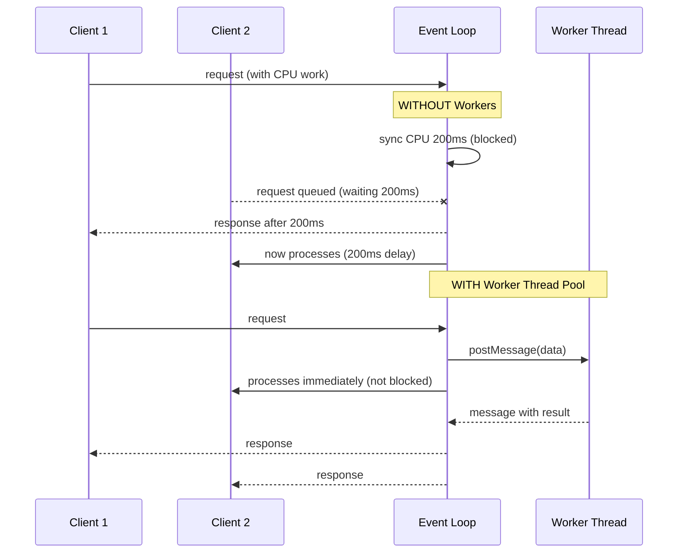

## Keywords in This File

{: .no_toc }

| # | Keyword | Difficulty |
|---|---------|------------|
| 1 | [Event Loop Blocking and Performance Anti-Patterns](#event-loop-blocking-and-performance-anti-patterns) | ★★★ |

---

# Event Loop Blocking and Performance Anti-Patterns

---

### 🎯 Model Answer

**30 seconds:**
> Event loop blocking occurs when synchronous JavaScript runs
> for more than ~16ms (frame boundary) or ~10ms (Node.js
> best practice). The event loop cannot process I/O callbacks,
> timer callbacks, or user interactions while blocked. Common
> causes: JSON.parse on large payloads, regex backtracking,
> synchronous file reads, large array operations, and
> misconfigured microtask queues. Diagnosis: `process.hrtime()`
> and `perf_hooks` in Node.js; Long Task API and Performance
> Observer in browsers.

**3 minutes:**
> The event loop is single-threaded. Any synchronous computation
> that takes more than a few milliseconds blocks ALL async
> operations: fetch callbacks, timer callbacks, UI events
> in the browser, and incoming requests in Node.js.
>
> Blocking thresholds:
> - Browser: >16ms blocks rendering at 60fps. >50ms is "long task"
>   (INP metric - Interaction to Next Paint). >300ms: user
>   perceives lag.
> - Node.js: >10ms per event loop iteration starts degrading
>   throughput. >100ms causes visible request latency.
>
> Top blocking patterns:
>
> **Large synchronous JSON processing:** `JSON.parse(bigString)`
> is synchronous. For 10MB JSON, this can take 50-100ms.
> Fix: use streaming JSON parsers or Web Workers.
>
> **Microtask starvation:** a loop that keeps resolving Promises
> without yielding to macrotasks. The microtask queue is drained
> completely before the event loop moves to the next macrotask.
> A `.then()` chain of 100,000 items starves timers.
>
> **Expensive synchronous operations in async functions:**
> an `async function` is NOT automatically non-blocking.
> Everything between `await` points runs synchronously. A
> for-loop processing 1M items between two awaits blocks
> for the entire loop duration.
>
> **ReDoS (Regular Expression Denial of Service):** a regex
> with catastrophic backtracking applied to user-supplied
> input. Can block the event loop for seconds.

**Blank Mind Recovery:**

**(1) Restate:** "Event loop = single thread. Sync code blocks
everything. async functions between awaits are sync. Break
up long operations with yields."

**(2) First principles:** "JavaScript has one thread. One unit
of work at a time. If that unit takes 200ms, everything else
waits 200ms. The fix: never let a unit take more than ~10ms."

---

### 📘 Concept Explanation

**What it is:**
Event loop blocking is the condition where synchronous JavaScript
execution prevents the event loop from processing callbacks,
I/O events, or rendering frames, causing latency, dropped
frames, and poor user experience.

**The problem it solves:**
Understanding this is prerequisite for writing performant
Node.js services and responsive browser applications. Without
it, developers add `async`/`await` expecting it to "make
things non-blocking" but still block.

**How it works:**

```javascript
// BLOCKING IN AN ASYNC FUNCTION (common mistake)
async function processLargeFile(filePath) {
  const content = await fs.readFile(filePath, 'utf8');
  // ↑ Non-blocking: event loop processes other tasks during I/O
  
  const lines = content.split('\n'); // BLOCKING if content is 50MB
  // Split() on 50MB string: 30-50ms synchronous
  
  const results = lines
    .filter(line => complexRegex.test(line)) // BLOCKING per line
    .map(line => heavyTransform(line)); // BLOCKING
  
  // Between the two awaits: synchronous code blocks for 200ms+
  
  await fs.writeFile(outputPath, results.join('\n'));
}

// Measuring block duration:
const start = process.hrtime.bigint();
const lines = content.split('\n');
const duration = Number(process.hrtime.bigint() - start) / 1e6;
console.log(`split() took ${duration.toFixed(1)}ms`);
```

> **Code walkthrough:** This example demonstrates the core pattern in action. The key mechanism shows how the concept works in practice. Study the structure to understand the essential behavior and common usage.

```javascript
// MICROTASK STARVATION
async function exhaustMicrotasks() {
  let count = 0;
  while (count < 1_000_000) {
    count++;
    // No await: tight loop runs synchronously
    // Adding await here adds a microtask per iteration - still blocks!
    // Microtasks run BEFORE next macrotask
    await Promise.resolve(); // 1M microtasks queue before any setTimeout fires
  }
}

// CORRECT: yield to macrotask queue periodically
async function yieldingLoop(items) {
  for (let i = 0; i < items.length; i++) {
    processItem(items[i]);
    // Yield every 100 items to give event loop a turn
    if (i % 100 === 0) {
      await new Promise(r => setTimeout(r, 0)); // macrotask yield
    }
  }
}
```

> **Code walkthrough:** This example demonstrates the core pattern in action. The key mechanism shows how the concept works in practice. Study the structure to understand the essential behavior and common usage.

```javascript
// NODE.JS: Blocking detection with perf_hooks
const { performance, PerformanceObserver } = require('perf_hooks');

// Monitor event loop lag
let lastCheck = Date.now();
setInterval(() => {
  const now = Date.now();
  const expected = 1000; // 1s interval
  const actual = now - lastCheck;
  const lag = actual - expected;
  if (lag > 50) {
    console.warn(`Event loop lag: ${lag}ms`);
    // In production: push to metrics
  }
  lastCheck = now;
}, 1000);

// Better: clinic.js doctor for automated blocking detection
// npm install -g clinic
// clinic doctor -- node app.js
// Opens flame chart with blocking identified

// BROWSER: Long Tasks API
const observer = new PerformanceObserver((list) => {
  for (const entry of list.getEntries()) {
    console.warn(`Long task: ${entry.duration.toFixed(0)}ms`);
    // Report to monitoring
  }
});
observer.observe({ entryTypes: ['longtask'] });
```

> **Code walkthrough:** This example demonstrates the core pattern in action. The key mechanism shows how the concept works in practice. Study the structure to understand the essential behavior and common usage.

**The key insight:**
`async`/`await` enables non-blocking I/O. It does NOT enable
non-blocking CPU computation. The CPU work between `await`
points is always synchronous. For CPU-intensive work, use
Worker Threads (Node.js) or Web Workers (browser) to run
computation on a separate thread.

**When to use it:**
Understanding this for any performance-sensitive async code.
The distinction: I/O-bound work benefits from async; CPU-bound
work requires Worker Threads.

**When NOT to use it:**
This is a performance concept to understand, not a feature
to use.

**Alternatives:**
- Worker Threads (Node.js): move CPU work off main thread
- Web Workers (browser): same
- Streaming: process data incrementally, never load all
- chunkedWork + setTimeout: manual yielding

**First-principles derivation:**
The event loop is a while loop: check macro-task queue,
process task, check microtask queue, process all microtasks,
repeat. Any synchronous work that takes a long time holds
the CPU, preventing the while loop from continuing. The fix:
make synchronous work shorter, or move it to a thread.

---

### 💻 Code Example

```javascript
// BAD: Blocking JSON processing on main thread
app.post('/api/import', async (req, res) => {
  const { data } = req.body; // already parsed by body-parser
  
  // BAD: synchronous transformation of large array
  const transformed = data.records.map(record => {
    return {
      id: record.identifier,
      name: sanitizeName(record.name), // regex per record
      tags: parseTagString(record.raw_tags), // split per record
      computed: heavyCompute(record) // CPU per record
    };
  });
  // For 100,000 records: 500ms+ blocking
  // During this: NO other requests handled by this Node.js process
  
  await db.insertMany(transformed);
  res.json({ count: transformed.length });
});
```

> **Code walkthrough:** The `.map()` call processes 100,000
> records synchronously. During this 500ms window, Node.js
> cannot accept new connections, process existing requests,
> or run timers. All other users experience 500ms added latency.
> This is invisible in unit tests (single request) but catastrophic
> under load.

```javascript
// GOOD: Chunked processing with yielding + Worker Thread option

const { Worker, isMainThread, parentPort, workerData } =
  require('worker_threads');

// OPTION A: Chunked processing on main thread
async function transformInChunks(records, chunkSize = 1000) {
  const results = [];
  for (let i = 0; i < records.length; i += chunkSize) {
    const chunk = records.slice(i, i + chunkSize);
    results.push(...chunk.map(transformRecord));
    // Yield to event loop after each chunk
    await new Promise(r => setImmediate(r)); // setImmediate: after I/O
  }
  return results;
}

// OPTION B: Worker Thread for CPU-intensive transform
// worker.js:
// if (!isMainThread) {
//   const { records } = workerData;
//   parentPort.postMessage(records.map(transformRecord));
// }

function transformInWorker(records) {
  return new Promise((resolve, reject) => {
    const worker = new Worker(__filename, {
      workerData: { records }
    });
    worker.on('message', resolve);
    worker.on('error', reject);
    worker.on('exit', code => {
      if (code !== 0) reject(new Error(`Worker exited: ${code}`));
    });
  });
}

// ROUTE: chunked on main thread (for moderate data)
// For large data: use worker thread
app.post('/api/import', async (req, res) => {
  const { records } = req.body;
  const start = process.hrtime.bigint();
  
  let transformed;
  if (records.length > 10_000) {
    // Off-load to worker thread: zero blocking on main thread
    transformed = await transformInWorker(records);
  } else {
    // Chunked: max ~10ms blocks with 1000-record chunks
    transformed = await transformInChunks(records);
  }
  
  const duration = Number(process.hrtime.bigint() - start) / 1e6;
  console.log(`Transform: ${duration.toFixed(1)}ms for ${records.length} records`);
  
  await db.insertMany(transformed);
  res.json({ count: transformed.length, processingMs: duration });
});
```

> **Code walkthrough:** Option A (chunked) processes 1000 records
> per synchronous block (~10ms per chunk), then yields with
> `setImmediate`. `setImmediate` fires after I/O callbacks -
> better than `setTimeout(0)` for yielding without artificial
> delay. Option B (Worker Thread) runs the entire transform
> in a separate V8 isolate, main thread is never blocked. The
> routing logic chooses based on data size. For the endpoint
> caller, Option B is transparent - they await a Promise just
> like any async operation.

---

### 🎓 Answers by Seniority

**Junior / Mid (0-5 years):**
> "Event loop blocking is when synchronous code runs too long.
> It prevents callbacks and I/O from processing. async/await
> doesn't help for CPU work - only I/O. Fix: chunk large
> loops with setTimeout/setImmediate yields, or use Worker
> Threads for heavy computation."

---

**Senior / Staff (5+ years):**
> "The architecture principle: separate I/O-bound and CPU-bound
> work. I/O-bound: async/await is fine. CPU-bound: Worker Thread
> pool is mandatory. The threshold I use: if synchronous work
> might exceed 10ms, it needs chunking or off-threading. In
> production, I instrument every batch operation with
> `process.hrtime()` and alert if > 50ms. The most frequent
> production culprits: large JSON serialization/deserialization
> on hot paths, regex on unsanitized user input (ReDoS), and
> naive sorting/grouping of large in-memory datasets."

---

### ⚠️ Common Misconceptions

**Misconception 1:** "async/await makes CPU code non-blocking."
`async` only enables non-blocking I/O by delegating to the
OS. CPU work (loops, transforms, sorting) between `await`
points is always synchronous and blocks the event loop.

**Misconception 2:** "`await Promise.resolve()` yields to
other requests."
`await Promise.resolve()` creates a microtask, which runs
before the next macrotask. It yields to other microtasks
but NOT to incoming requests or timer callbacks. Use
`await new Promise(r => setImmediate(r))` to yield to macrotasks.

**Misconception 3:** "Node.js handles concurrent requests
in parallel."
Node.js is single-threaded (main thread). Concurrency comes
from the event loop multiplexing I/O. Two requests are handled
concurrently only if each is waiting for I/O. Synchronous
work is serial: request 2 waits for request 1's synchronous
block to complete.

---

### 🚨 Failure Modes and Diagnosis

**Failure 1: Node.js high p99 latency under load**
```
Symptoms:
  p50: 20ms, p99: 500ms under 100 RPS load
  clinic doctor shows "blocking detected"

Diagnosis:
  1. clinic.js: clinic doctor -- node app.js
     Open flame chart: look for tall sync stacks
  2. Manual: add timing around suspect operations:
     const start = process.hrtime.bigint();
     suspectOperation();
     const ns = Number(process.hrtime.bigint() - start);
     if (ns > 10_000_000) console.warn('Slow:', ns/1e6 + 'ms');
  3. Node.js --prof: flame chart of CPU time
     node --prof app.js
     node --prof-process isolate-*.log

Common causes found:
  - JSON.parse of large payloads (50ms+ for 5MB JSON)
  - Synchronous crypto operations (md5 hashing in loop)
  - Array.sort on large arrays (O(N log N) sync)
  - Zod/Joi validation on large arrays
```

> **Code walkthrough:** This example demonstrates the core pattern in action. The key mechanism shows how the concept works in practice. Study the structure to understand the essential behavior and common usage.

**Failure 2: Browser UI freezes during data processing**
```
Symptoms:
  - UI unresponsive for 2-3 seconds after button click
  - Chrome DevTools Performance: long task (red marker)
  - INP (Interaction to Next Paint) > 200ms

Diagnosis:
  1. Performance tab -> Record -> trigger action -> Stop
  2. Look for red "Long task" markers
  3. Click task: see JS call stack causing block

  // Programmatic:
  const observer = new PerformanceObserver(list => {
    list.getEntries().forEach(e => {
      if (e.duration > 50) {
        console.warn('Long task:', e.duration, e);
      }
    });
  });
  observer.observe({ entryTypes: ['longtask'] });
```

> **Code walkthrough:** This example demonstrates the core pattern in action. The key mechanism shows how the concept works in practice. Study the structure to understand the essential behavior and common usage.

---

### 🎯 Interview Deep-Dive

| Category | Count | Coverage |
|---|---|---|
| Conceptual | 3 | Event loop model, microtask vs macrotask, I/O vs CPU |
| Trade-off | 2 | Chunking vs workers, setImmediate vs setTimeout |
| Failure Mode | 2 | ReDoS, JSON blocking, memory exhaustion |
| Debugging | 2 | clinic.js, Long Tasks API, perf_hooks |
| Design | 2 | Worker thread architecture, streaming |
| Behavioral | 1 | Fixing production blocking issue |

**Q1. Explain the difference between microtasks and macrotasks
and how they affect event loop blocking.**

The event loop processes tasks in this order per iteration:
1. One macrotask (from the task queue): setTimeout callback,
   setInterval callback, I/O callback, script evaluation
2. ALL pending microtasks (microtask queue): Promise `.then`
   callbacks, `queueMicrotask`, MutationObserver
3. Render (browser only, if needed)
4. Back to step 1

Key implications:
- Microtasks drain completely before the event loop moves
  to the next macrotask. If microtasks schedule more microtasks,
  they ALL run before any timer fires.
- `await Promise.resolve()` schedules a microtask. It does
  NOT yield to setTimeout callbacks or I/O callbacks.
- `setImmediate(fn)` schedules a macrotask (Node.js). It
  yields after all current I/O callbacks.
- `setTimeout(fn, 0)` schedules a macrotask. Minimum delay
  ~1-4ms in browsers due to timer throttling.

```javascript
setTimeout(() => console.log('macrotask: setTimeout'), 0);
Promise.resolve().then(() => console.log('microtask: Promise'));
queueMicrotask(() => console.log('microtask: queueMicrotask'));
console.log('synchronous');

// Output:
// synchronous (runs first: current execution)
// microtask: Promise (microtask queue)
// microtask: queueMicrotask (microtask queue)
// macrotask: setTimeout (next macrotask)
```

> **Code walkthrough:** This example demonstrates the core pattern in action. The key mechanism shows how the concept works in practice. Study the structure to understand the essential behavior and common usage.

*What separates good from great:* The implication for yield
strategies: `await Promise.resolve()` does not yield to timer
callbacks or I/O. For true event loop yielding, use `setImmediate`
or `setTimeout(0)`.

---

**Q2. What is ReDoS and how does it block the Node.js
event loop?**

ReDoS (Regular Expression Denial of Service) occurs when a
regex with exponential backtracking is applied to adversarial
input. The regex engine backtracks exponentially, consuming
100% CPU for seconds.

Classic vulnerable pattern:
```javascript
// Vulnerable regex: nested quantifiers
const vulnerable = /^(a+)+$/;

// Benign: 'aaa' matches instantly
// Malicious: 'aaaaaaaaaaaaaaaaaaaaaaaaaaab'
// Engine tries 2^N paths before giving up - seconds of CPU

// Test:
const start = Date.now();
vulnerable.test('a'.repeat(30) + 'b');
console.log(Date.now() - start); // 5000ms+ - Node.js blocked!
```

> **Code walkthrough:** This example demonstrates the core pattern in action. The key mechanism shows how the concept works in practice. Study the structure to understand the essential behavior and common usage.

Detection tools:
- `safe-regex` npm package: static analysis
- `vuln-regex-detector`: cloud-based detection
- Manual: identify nested quantifiers (`(a+)+`, `(.*)+`)

Fix strategies:
```javascript
// Fix 1: Non-backtracking regex (atomic group - not in JS)
// Fix 2: Possessive quantifiers (not in JS)
// Fix 3: Input length limit before regex
function safeValidate(input, pattern) {
  if (input.length > 1000) {
    throw new Error('Input too long for pattern matching');
  }
  return pattern.test(input);
}
// Fix 4: Use a non-backtracking implementation
// npm install re2 (Google's RE2 library - no backtracking)
const RE2 = require('re2');
const re = new RE2(/^(a+)+$/); // RE2 cannot backtrack: O(N) always
```

> **Code walkthrough:** This example demonstrates the core pattern in action. The key mechanism shows how the concept works in practice. Study the structure to understand the essential behavior and common usage.

*What separates good from great:* Knowing about the `re2` npm
package. RE2 guarantees O(N) time complexity by forbidding
backreferences and lookaheads. For APIs that accept user-supplied
patterns or apply regex to user-supplied strings, RE2 is the
production-safe choice.

---

**Q3. How does JSON.parse and JSON.stringify block the
event loop and what are the alternatives?**

`JSON.parse` and `JSON.stringify` are synchronous and run
in a tight loop in C++. For large payloads:

| Size | parse() | stringify() |
|------|---------|-------------|
| 100KB | ~2ms | ~1ms |
| 1MB | ~15ms | ~8ms |
| 10MB | ~150ms | ~80ms |
| 100MB | ~1.5s | ~800ms |

Alternatives:

1. **Streaming JSON** (`stream-json` npm): parse incrementally
   as data arrives, emit events for each object in an array:
```javascript
const { parser } = require('stream-json');
const { streamArray } = require('stream-json/streamers/StreamArray');
const { chain } = require('stream-chain');

const pipeline = chain([
  fs.createReadStream('large.json'),
  parser(),
  streamArray()
]);

pipeline.on('data', ({ value }) => {
  processItem(value); // called for each array element
  // Never loads entire file into memory
});
```

> **Code walkthrough:** This example demonstrates the core pattern in action. The key mechanism shows how the concept works in practice. Study the structure to understand the essential behavior and common usage.

2. **Worker Thread** for one-shot large JSON:
```javascript
// Parse in worker: main thread not blocked
const result = await runInWorker(() => JSON.parse(bigString));
```

> **Code walkthrough:** This example demonstrates the core pattern in action. The key mechanism shows how the concept works in practice. Study the structure to understand the essential behavior and common usage.

3. **simdjson-node** or **fast-json-stringify**: SIMD-optimized
   C++ bindings, 2-4x faster than native, but still synchronous.

*What separates good from great:* Knowing that even "2-4x faster"
still blocks. For truly non-blocking JSON, streaming is the
only solution.

---

**Q4. How do you diagnose event loop blocking in a
production Node.js service without stopping it?**

Production-safe diagnostic tools:

1. **Event loop lag monitor** (zero overhead when healthy):
```javascript
// Already in the Concept Explanation - production version:
const { monitorEventLoopDelay } = require('perf_hooks');
const histogram = monitorEventLoopDelay({ resolution: 10 });
histogram.enable();

setInterval(() => {
  const lagMs = histogram.mean / 1e6; // nanoseconds to ms
  metrics.gauge('event_loop.lag_ms', lagMs);
  metrics.gauge('event_loop.max_ms', histogram.max / 1e6);
  histogram.reset();
}, 10_000);
```

> **Code walkthrough:** This example demonstrates the core pattern in action. The key mechanism shows how the concept works in practice. Study the structure to understand the essential behavior and common usage.

2. **clinic.js in staging** (not production due to overhead):
```bash
clinic doctor -- node app.js
# Automatically diagnoses: blocking, async, flame chart
```

> **Code walkthrough:** This example demonstrates the core pattern in action. The key mechanism shows how the concept works in practice. Study the structure to understand the essential behavior and common usage.

3. **V8 CPU profiler via --prof** (short burst sampling):
```bash
# In production pod (temporary):
node --prof-interval=1000 app.js  # sample every 1ms
# After 60 seconds, get isolate-*.log
node --prof-process isolate-*.log > profile.txt
grep -A5 'ticks' profile.txt | head -50
```

> **Code walkthrough:** This example demonstrates the core pattern in action. The key mechanism shows how the concept works in practice. Study the structure to understand the essential behavior and common usage.

4. **`blocked-at` npm package**: detects blocking and reports
   the call site:
```javascript
const blockedAt = require('blocked-at');
blockedAt((time, stack) => {
  console.error(`BLOCKED ${time}ms at:`, stack);
}, { threshold: 20 }); // alert if blocked > 20ms
```

> **Code walkthrough:** This example demonstrates the core pattern in action. The key mechanism shows how the concept works in practice. Study the structure to understand the essential behavior and common usage.

*What separates good from great:* `monitorEventLoopDelay`
with `resolution: 10` (10ms precision) adds near-zero overhead
and provides mean/max/percentile lag metrics. This is the
production-safe continuous monitoring approach.

---

**Q5. How does the browser's rendering pipeline interact
with the event loop, and how can async code affect rendering?**

The browser event loop includes rendering as a "task" that
runs between macrotasks when the browser decides a frame is
needed (~16ms at 60fps).

```
Event Loop iteration:
  1. Process ONE macrotask (if any)
  2. Process ALL microtasks
  3. Render (if frame needed AND time allows):
     - Style recalculate
     - Layout (reflow)
     - Paint
     - Composite
  4. IdleCallback (if time allows before next frame)
```

> **Code walkthrough:** This example demonstrates the core pattern in action. The key mechanism shows how the concept works in practice. Study the structure to understand the essential behavior and common usage.

If a macrotask takes >16ms: rendering is skipped for that
frame. User sees a dropped frame.

Interaction with async code:
```javascript
// Causes janky animations:
button.onclick = async () => {
  const data = await fetchData(); // await: yields to event loop
  processLargeData(data); // 50ms synchronous block!
  // UI is frozen for 50ms during process
  updateDOM(data);
};

// Better: yield with requestAnimationFrame for UI-critical work
button.onclick = async () => {
  const data = await fetchData();
  // Process in chunks, yielding to render between each
  for (const chunk of chunkArray(data, 100)) {
    processChunk(chunk);
    await new Promise(r => requestAnimationFrame(r)); // sync to frame
  }
  updateDOM(results);
};
```

> **Code walkthrough:** This example demonstrates the core pattern in action. The key mechanism shows how the concept works in practice. Study the structure to understand the essential behavior and common usage.

*What separates good from great:* Using `requestAnimationFrame`
as the yield mechanism for UI-coupled async work. `rAF` yields
at the natural rendering boundary, ensuring each chunk of work
completes within a frame budget.

---

**Q6. What is the Worker Threads module in Node.js and
when does it make event loop blocking acceptable?**

Worker Threads (Node.js 12+) create separate V8 isolates
with their own event loops. Communication via `MessageChannel`
(structured clone) or `SharedArrayBuffer` (zero-copy).

When to use Worker Threads:
- JSON.parse on payloads > 1MB
- Cryptographic operations (hashing, bcrypt)
- Image/video processing
- Machine learning inference
- Large sorting/aggregation on in-memory datasets
- Any operation where profiling shows > 20ms synchronous time

Worker Thread pool pattern:
```javascript
const { Worker } = require('worker_threads');

class WorkerPool {
  #workers = [];
  #queue = [];
  #size;

  constructor(workerFile, size = 4) {
    this.#size = size;
    for (let i = 0; i < size; i++) {
      this.#createWorker(workerFile);
    }
  }

  #createWorker(file) {
    const worker = new Worker(file);
    const state = { worker, busy: false };

    worker.on('message', (result) => {
      state.busy = false;
      if (this.#queue.length) {
        const { data, resolve } = this.#queue.shift();
        this.#dispatch(state, data, resolve);
      }
      state.currentResolve?.(result);
    });

    this.#workers.push(state);
  }

  #dispatch(state, data, resolve) {
    state.busy = true;
    state.currentResolve = resolve;
    state.worker.postMessage(data);
  }

  run(data) {
    return new Promise(resolve => {
      const idle = this.#workers.find(w => !w.busy);
      if (idle) {
        this.#dispatch(idle, data, resolve);
      } else {
        this.#queue.push({ data, resolve });
      }
    });
  }
}

const pool = new WorkerPool('./cpu-worker.js', 4);
app.post('/api/process', async (req, res) => {
  // Main thread: not blocked during worker processing
  const result = await pool.run(req.body.data);
  res.json(result);
});
```

> **Code walkthrough:** This example demonstrates the core pattern in action. The key mechanism shows how the concept works in practice. Study the structure to understand the essential behavior and common usage.

*What separates good from great:* A Worker Thread pool is
mandatory, not optional, for CPU-bound work in production
Node.js services. A pool of 4 workers on a 4-core machine
provides full CPU utilization without starving the event loop.

---

**Q7. How do you detect and fix synchronous blocking in
a code review?**

Code review checklist for blocking patterns:

Patterns that ALWAYS block and must be inspected:
```javascript
// 1. Array operations on unbounded arrays
records.forEach(r => heavyProcess(r)); // how large can records be?
records.map(r => ...).filter(r => ...).reduce(...); // chained = multiple passes

// 2. JSON on user-supplied or database-returned data
JSON.parse(largeString); // size matters
JSON.stringify(largeObject); // size matters

// 3. Synchronous I/O (Node.js)
fs.readFileSync(path); // NEVER on main thread in server code
crypto.pbkdf2Sync(password, salt, 100000, 64, 'sha512');

// 4. String operations on large strings
largeString.split('\n'); // allocates N+1 strings
largeString.replace(/pattern/g, fn); // regex + fn per match

// 5. Sorting large arrays
users.sort((a, b) => compare(a, b)); // O(N log N) synchronous

// 6. Complex regex on user input
/^(a+)+$/.test(userInput); // ReDoS risk
```

> **Code walkthrough:** This example demonstrates the core pattern in action. The key mechanism shows how the concept works in practice. Study the structure to understand the essential behavior and common usage.

Review questions to ask:
- What is the maximum size of this data?
- What is the worst-case time complexity?
- Is this on the hot path (called per request)?
- Could user input make this pathological?

*What separates good from great:* The "maximum size" question.
`records.map()` is fine for 10 records. It is catastrophic
for 100,000. The fix depends on expected size: chunk if
moderate, Worker Thread if large.

---

**Q8. How do you implement a "cooperative scheduler" for
long-running async operations?**

A cooperative scheduler yields control back to the event loop
at regular intervals, ensuring other work can proceed:

```javascript
class CooperativeScheduler {
  #timeBudget; // ms per chunk
  #yields = 0;

  constructor(budgetMs = 5) {
    this.#timeBudget = budgetMs;
  }

  async processAll(items, processor) {
    let chunkStart = performance.now();
    const results = [];

    for (let i = 0; i < items.length; i++) {
      results.push(processor(items[i]));

      const elapsed = performance.now() - chunkStart;
      if (elapsed >= this.#timeBudget) {
        this.#yields++;
        // Yield to event loop: allows I/O and timers to run
        await new Promise(r => setImmediate(r));
        chunkStart = performance.now();
      }
    }

    console.log(`Processed ${items.length} items, ${this.#yields} yields`);
    return results;
  }
}

// Usage:
const scheduler = new CooperativeScheduler(5); // 5ms chunks
const results = await scheduler.processAll(
  million_item_array,
  item => transform(item)
);
// Event loop is free for ~5ms chunks, never blocked for full duration
```

> **Code walkthrough:** This example demonstrates the core pattern in action. The key mechanism shows how the concept works in practice. Study the structure to understand the essential behavior and common usage.

*What separates good from great:* Using `performance.now()` to
measure elapsed time rather than counting items. The number
of items that fit in 5ms depends on item complexity. Time-based
yielding adapts automatically, whereas count-based yielding
requires manual tuning per operation type.

---

**Q9. How does long synchronous blocking affect HTTP keep-alive
connections and request queuing in Node.js?**

Node.js HTTP server with keep-alive: a single connection can
send multiple sequential requests. The event loop processes
one request's synchronous code at a time.

Scenario: 100 clients, 200ms blocking endpoint:
```
Client 1: request arrives, blocks event loop 200ms
Client 2: waiting in socket buffer
Client 3: waiting in socket buffer
... 100 clients waiting ...
During the 200ms block:
  - No client heartbeats processed
  - No keep-alive pings handled
  - TCP buffers filling up
  - Connection may timeout at load balancer (60s default)
```

> **Code walkthrough:** This example demonstrates the core pattern in action. The key mechanism shows how the concept works in practice. Study the structure to understand the essential behavior and common usage.

Downstream effects:
- p99 latency = (blocking_time) * (clients_in_queue)
- With 100 concurrent, 200ms blocking: up to 20 SECONDS p99
- Load balancer timeout: connections dropped
- Client retries: request amplification

Fix: non-blocking endpoints limit blast radius:
- Every request handled in < 10ms (I/O async, CPU off-thread)
- Even with 100 concurrent: p99 within 100ms + I/O time

*What separates good from great:* The multiplication: blocking_time
times number of waiting requests. This explains why 200ms
blocking is catastrophic at 50+ RPS but "fine" at 1 RPS.

---

**Q10. What metrics should you track for event loop health
in production?**

Essential metrics (push to Prometheus/DataDog):

```javascript
const { monitorEventLoopDelay } = require('perf_hooks');
const histogram = monitorEventLoopDelay({ resolution: 20 });
histogram.enable();

// Prometheus metrics:
// node_event_loop_lag_seconds_mean
// node_event_loop_lag_seconds_max
// node_event_loop_lag_seconds_p99
// node_process_heap_bytes
// node_active_handles_total
// node_active_requests_total

setInterval(() => {
  metrics.gauge('event_loop.lag_mean_ms', histogram.mean / 1e6);
  metrics.gauge('event_loop.lag_max_ms', histogram.max / 1e6);
  metrics.gauge('event_loop.lag_p99_ms',
    histogram.percentile(99) / 1e6);
  histogram.reset();

  const mem = process.memoryUsage();
  metrics.gauge('memory.heap_used_mb', mem.heapUsed / 1e6);
  metrics.gauge('memory.heap_total_mb', mem.heapTotal / 1e6);
  metrics.gauge('memory.external_mb', mem.external / 1e6);

  // Active handles = things keeping event loop alive
  metrics.gauge('active_handles', process._getActiveHandles().length);
  metrics.gauge('active_requests', process._getActiveRequests().length);
}, 10_000);
```

> **Code walkthrough:** This example demonstrates the core pattern in action. The key mechanism shows how the concept works in practice. Study the structure to understand the essential behavior and common usage.

Alert thresholds:
- `event_loop.lag_mean_ms` > 10ms: investigate
- `event_loop.lag_p99_ms` > 100ms: incident
- `memory.heap_used_mb` growing > 10%/hour: memory leak

*What separates good from great:* Tracking `active_handles`
count. A growing handle count means workers, servers, or event
emitters are accumulating - a different signal from heap
growth. Correlating handle count with memory helps distinguish
closure leaks from object leaks.

---

**Q11. How do you use `setImmediate` vs `process.nextTick`
for event loop yielding?**

Both schedule callbacks, but at different queue positions:

`process.nextTick`: runs after the current operation completes
but BEFORE the event loop continues. It is part of the microtask
mechanism (Node.js-specific, not standard). Drains completely
before I/O callbacks.

`setImmediate`: runs at the start of the next event loop
iteration, AFTER I/O callbacks. Proper macrotask yield.

```javascript
setTimeout(() => console.log('setTimeout'), 0);
setImmediate(() => console.log('setImmediate'));
process.nextTick(() => console.log('nextTick'));
Promise.resolve().then(() => console.log('Promise'));

// Output (inside I/O callback context):
// nextTick       <- native microtask-like
// Promise        <- standard microtask
// setImmediate   <- next event loop iteration
// setTimeout     <- macrotask queue

// For yielding to allow I/O: use setImmediate
// For deferring but staying in current iteration: use nextTick
// NEVER use nextTick for large loops: it starves I/O just like microtasks
```

> **Code walkthrough:** This example demonstrates the core pattern in action. The key mechanism shows how the concept works in practice. Study the structure to understand the essential behavior and common usage.

*What separates good from great:* The critical insight: `process.nextTick`
does NOT yield to I/O callbacks. Using it for yielding in a
tight loop still starves I/O and incoming requests. Only
`setImmediate` or `setTimeout` provide true macrotask yielding.

---

**Q12. How do you architect a Node.js service to guarantee
event loop health under peak load?**

Multi-layer architecture for event loop safety:

Layer 1 - Request validation (< 1ms per request):
- Size limits before any processing: `if (body.length > 1MB) return 413`
- Schema validation early: reject invalid requests fast

Layer 2 - I/O (async, non-blocking):
- All DB queries: async with connection pooling
- All file I/O: stream-based, never `readFileSync`
- All network calls: fetch with AbortSignal.timeout

Layer 3 - CPU work (off main thread):
- Worker Thread pool for all CPU > 10ms
- Chunked processing for 1-100ms operations
- Streaming for large data transforms

Layer 4 - Observability:
- Event loop lag metric (continuous)
- Pending handle count (continuous)
- Per-route latency histograms (p50/p99/p999)
- Alert: p99 > 200ms, lag > 50ms

Layer 5 - Circuit breakers:
- Max concurrent requests: reject with 503 if exceeded
- Queue depth limit: shed load rather than queue indefinitely
- Timeout all outbound calls

*What separates good from great:* Layer 5 - circuit breakers.
An overwhelmed Node.js service without circuit breakers
accumulates work in the task queue, event loop lag compounds,
and the service degrades gradually. With circuit breakers,
it sheds load cleanly and recovers quickly.

---

### ⚖️ Comparison Table

| Yield Mechanism | Yields To | When To Use | Overhead |
|---|---|---|---|
| `await Promise.resolve()` | Microtasks only | Yielding to other Promises | Very low |
| `process.nextTick()` | After current op, before I/O | Node.js: deferred but high-priority | Very low |
| `setImmediate()` | After I/O callbacks | True event loop yield (Node.js) | Low |
| `setTimeout(fn, 0)` | Macrotask queue | Universal yield | ~1-4ms min delay |
| `requestAnimationFrame` | Frame boundary | UI-synced work (browser) | Tied to frame rate |
| Worker Thread | Nothing (separate thread) | CPU-intensive work | Thread creation cost |

---

### 🏛️ System Design

**System: High-RPS Node.js API service with CPU-intensive processing**

```
LAYERED ARCHITECTURE FOR EVENT LOOP SAFETY
============================================

 ┌──────────────────────────────────────────┐
 │ Load Balancer (nginx/ALB)                │
 │ Rate limiting, SSL termination           │
 └─────────────────────┬────────────────────┘
                       │
 ┌─────────────────────▼────────────────────┐
 │ Node.js HTTP Server (main thread)        │
 │  - Only I/O: parse request, route        │
 │  - Never: CPU work, sync I/O             │
 │  - Event loop lag target: < 5ms          │
 └────────┬──────────────────┬──────────────┘
          │                  │
 ┌────────▼──────┐  ┌────────▼──────────────┐
 │ Async I/O    │  │ Worker Thread Pool    │
 │ DB: pg pool  │  │ 4 threads (= 4 cores) │
 │ Redis: ioredis│  │ CPU: transform, hash  │
 │ HTTP: fetch  │  │ MessageChannel comm   │
 └──────────────┘  └───────────────────────┘

Metrics:
  event_loop.lag_ms    <- < 5ms healthy
  worker.queue_depth   <- backpressure signal
  request.p99_ms       <- SLO: < 100ms
```

> **Code walkthrough:** This example demonstrates the core pattern in action. The key mechanism shows how the concept works in practice. Study the structure to understand the essential behavior and common usage.

Design decisions:
- Main thread: only async I/O, zero CPU
- Worker pool: 4 workers = full CPU utilization, isolates from main loop
- Metrics: event loop lag is the primary health signal
- Circuit breaker: reject if worker queue > 50 (backpressure)

*What separates good from great:* Treating event loop lag as
the PRIMARY health metric. Not CPU%, not memory - but lag.
High CPU% with low lag = healthy (workers are busy). High
lag = main thread is blocked, regardless of other metrics.

---

### 📊 Diagram

```
EVENT LOOP BLOCKING TIMELINE
==============================

Time ->
 0ms |=== sync block 200ms ====================|
20ms |    request 2 arrives (waiting in buffer) |
40ms |    request 3 arrives (waiting)           |
60ms |    request 4 arrives (waiting)           |
200ms|=== unblocked === | process request 2 ... |

With chunking (5ms chunks):
 0ms |=5ms=| yield |=5ms=| yield |=5ms=|...
 5ms |      request 2 handled               |
10ms |           request 3 handled          |
```



> **Diagram walkthrough:** The blocking timeline shows how a
> single 200ms synchronous block creates a queue of delayed
> requests - every client that arrives during the block waits
> the full duration. The sequence diagram contrasts the blocking
> model (all clients wait) with the Worker Thread model (event
> loop remains free, clients are processed concurrently). The
> Worker Thread receives the CPU work via `postMessage`, completes
> it on a separate thread, and returns the result - the main
> event loop never blocked.

---

### 💻 Code Example

*(Omit: this concept does not have a programmatic interface that can be demonstrated in code. The conceptual explanation above is sufficient.)*


---

### 🏛️ System Design

*(Omit: system design diagram not applicable for this concept - see ★★★ keywords for full system design coverage.)*


---

### ⚖️ Comparison Table

*(Omit: this is a ★☆☆ foundational concept with no direct alternatives to compare - see higher-difficulty keywords for trade-off analysis.)*


---

### 📊 Diagram

*(Omit: no standalone visual diagram required for this concept - the explanations and code examples above provide sufficient clarity.)*
