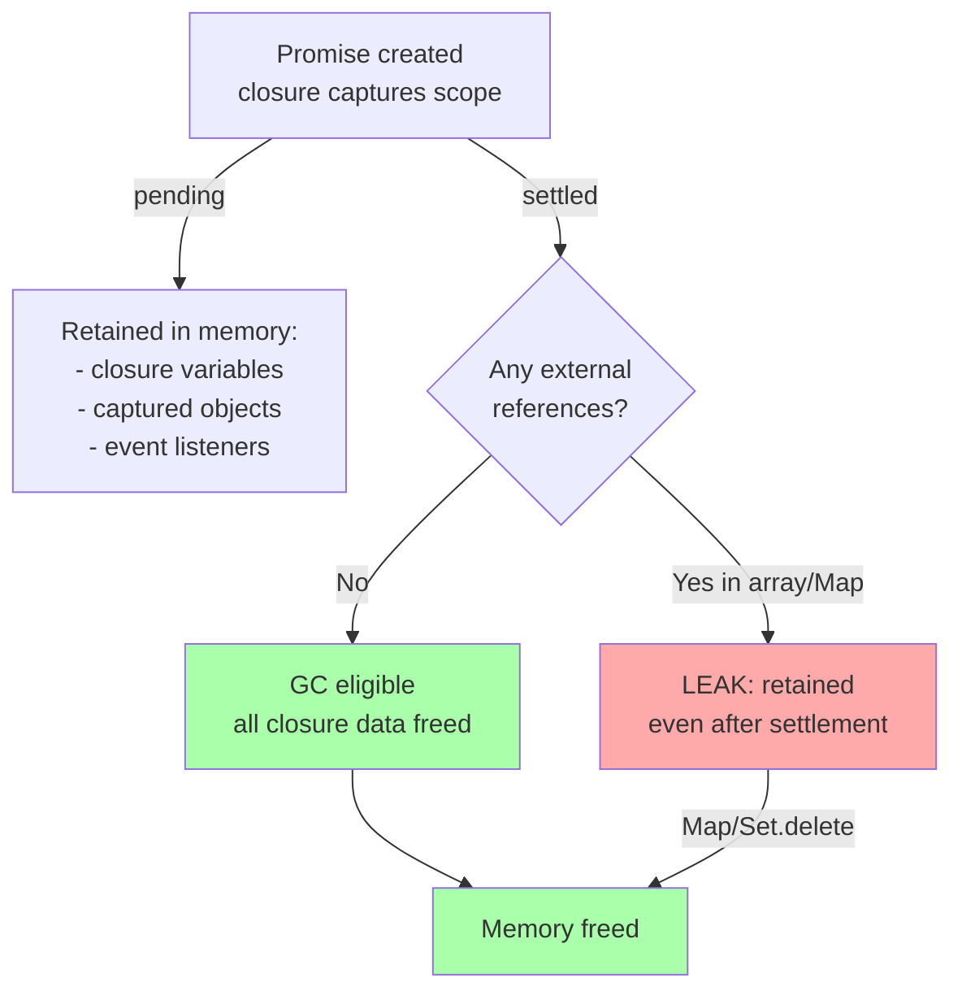

## Keywords in This File

{: .no_toc }

| # | Keyword | Difficulty |
|---|---------|------------|
| 1 | [Promise Memory Leaks and Debugging](#promise-memory-leaks-and-debugging) | ★★★ |

---

# Promise Memory Leaks and Debugging

---

### 🎯 Model Answer

**30 seconds:**
> Promise memory leaks occur when Promises are created but
> never settle (pending forever), or when callback closures
> prevent garbage collection. In Node.js, `--trace-warnings`
> and the `diagnostics_channel` module expose unresolved
> Promises. In browsers, Chrome DevTools Memory heap snapshots
> catch closure retention. The most common cause: Promises
> that listen for events or timers that are never cleaned up.

**3 minutes:**
> A Promise that never settles lives in memory as long as any
> reference exists. The typical scenarios:
>
> **Waiting for events that never fire:** `new Promise(resolve =>
> socket.once('connect', resolve))` - if the socket never
> connects, the Promise is pending forever. The closure retains
> a reference to `socket`, preventing GC.
>
> **Long-lived timers:** `new Promise(resolve => setTimeout(resolve, duration))`
> with very long duration - the timer keeps the Promise alive
> and the closure retains everything in scope.
>
> **Uncancelled fetch requests:** `fetch()` Promises that are
> never resolved or aborted continue consuming memory. In Node.js,
> this is less obvious because there is no browser GC pressure.
>
> **RxJS subscriptions that are never unsubscribed** create
> chains of Observable/subscriber closures that retain large
> portions of the application state graph.
>
> Debugging tools:
> - Chrome DevTools: Memory -> Heap Snapshot -> compare
>   snapshots -> filter for Promise/closure objects
> - Node.js: `--expose-gc` flag + `global.gc()` + `process.memoryUsage()`
> - Node.js `diagnostics_channel`: hook into Promise lifecycle
> - `WHY_DID_I_GET_RENDERED` (React-specific): Promise in state
>   that never resolves preventing re-renders
>
> The production discipline: every Promise that could be
> pending indefinitely must have either a timeout or a cancel
> mechanism.

**Blank Mind Recovery:**

**(1) Restate:** "Pending Promises leak memory. Anything in
the closure is retained. Always timeout or cancel Promises
that wait on external events."

**(2) First principles:** "Memory is freed when there are no
references. A pending Promise is a reference. Everything it
closes over is a reference. If the Promise can pend forever,
none of that memory is freed."

---

### 📘 Concept Explanation

**What it is:**
Promise memory leaks are heap growth caused by Promises that
never settle, closures that prevent garbage collection, and
accumulated async operations that retain references to large
data structures.

**The problem it solves:**
Node.js microservices and long-running SPAs accumulate memory
over time. Without understanding async memory retention,
leaks are attributed to wrong causes, and fixes are ineffective.

**How it works:**

```javascript
// LEAK PATTERN 1: Event listener not cleaned up
function watchConnection(socket) {
  // BAD: Promise created and forgotten if caller drops reference
  new Promise((resolve, reject) => {
    socket.once('connect', resolve);
    socket.once('error', reject);
    // If socket is destroyed and replaced, this Promise
    // and its closure live forever (socket keeps reference too)
  });
  // No way for caller to cancel or detect the leak
}

// BETTER: return the Promise + provide cancellation
function watchConnectionCancellable(socket, signal) {
  return new Promise((resolve, reject) => {
    const onConnect = () => {
      cleanup();
      resolve();
    };
    const onError = (err) => {
      cleanup();
      reject(err);
    };
    const onAbort = () => {
      cleanup();
      reject(new DOMException('Aborted', 'AbortError'));
    };

    function cleanup() {
      socket.off('connect', onConnect);
      socket.off('error', onError);
      signal?.removeEventListener('abort', onAbort);
    }

    socket.once('connect', onConnect);
    socket.once('error', onError);
    signal?.addEventListener('abort', onAbort, { once: true });
  });
}
```

```javascript
// LEAK PATTERN 2: Promises accumulate in a Map/Set
class RequestTracker {
  pending = new Map(); // key -> Promise - LEAK!

  track(id, promise) {
    this.pending.set(id, promise);
    return promise;
    // Never removes from Map on settle!
  }
}

// FIXED: clean up on settlement
class RequestTrackerFixed {
  pending = new Map();

  track(id, promise) {
    const tracked = promise.finally(() => {
      this.pending.delete(id); // cleanup on settle
    });
    this.pending.set(id, tracked);
    return tracked;
  }

  // Expose for monitoring
  get pendingCount() { return this.pending.size; }
}
```

```javascript
// LEAK PATTERN 3: Large closure retained by long-lived Promise
async function processLargeDataset(data) { // data: 50MB array
  // BAD: entire data array in scope for the full async operation
  const report = await generateReport(data);
  // 'data' is retained in closure through the await
  await sendEmail(report);
  // 'data' still in memory even though generateReport is done
  return report;
}

// BETTER: release large data early
async function processLargeDatasetFixed(dataRef) {
  const data = dataRef.get(); // reference only
  const report = await generateReport(data);
  dataRef.clear(); // release: data can now be GCed
  await sendEmail(report);
  return report;
}
```

**The key insight:**
JavaScript closures capture variables by reference, not value.
An async function is a closure - it captures everything in
scope at the point of creation. For long-running async
operations, large data structures captured in that scope
cannot be garbage collected until the async function completes.

**When to use it:**
Understanding this for any long-running async operation that
works with large data structures; any service that runs
indefinitely; SPAs that handle large datasets.

**When NOT to use it:**
This is not a "feature to use" - it is a leak pattern to
understand and avoid.

**Alternatives:**
- Worker Threads: isolate large data processing, release when done
- Streams: process data incrementally, avoid loading all at once
- WeakRef: hold reference to data without preventing GC

**First-principles derivation:**
The Promise callback captures the execution environment
(lexical scope). V8's garbage collector cannot collect anything
reachable from a live reference. A pending Promise is a live
object; its closure is reachable from it; everything in the
closure's scope chain is reachable. Leak = reachable but
unwanted.

---

### 💻 Code Example

```javascript
// BAD: Classic Node.js service - memory leak from accumulated Promises
class NotificationService {
  listeners = []; // grows unboundedly

  onMessage(handler) {
    const promise = new Promise(resolve => {
      this.listeners.push(resolve);
    });
    return promise.then(handler);
  }

  send(message) {
    this.listeners.forEach(resolve => resolve(message));
    // BUG: listeners array not cleared after notification
    // Every onMessage() call adds a closure
    // After 1M messages: 1M closures in listeners array
  }
}
// Diagnosis: process.memoryUsage().heapUsed grows without bound
// Solution: clear listeners after notification
```

> **Code walkthrough:** The `listeners` array accumulates resolve
> functions indefinitely. Each `onMessage` call adds a closure
> that captures `handler` and the resolve function. The `send`
> method notifies all listeners but never removes them. After
> many messages, the array holds thousands of resolved-but-unreleased
> closures. The bug is subtle: the listeners resolve successfully,
> so there are no unhandled rejections - the leak is silent.

```javascript
// GOOD: Proper Promise lifecycle management

class NotificationService {
  #listeners = new Set();
  #stats = { messagesProcessed: 0, currentListeners: 0 };

  onMessage(handler, signal) {
    return new Promise((resolve, reject) => {
      const entry = { resolve };
      this.#listeners.add(entry);
      this.#stats.currentListeners++;

      // Cleanup function: removes listener regardless of how settled
      const cleanup = () => {
        this.#listeners.delete(entry);
        this.#stats.currentListeners--;
      };

      // Cancellation support
      if (signal) {
        signal.addEventListener('abort', () => {
          cleanup();
          reject(new DOMException('Cancelled', 'AbortError'));
        }, { once: true });
      }

      // Wrap resolve to include cleanup
      entry.resolve = (message) => {
        cleanup();
        resolve(message);
      };
    }).then(handler);
  }

  send(message) {
    this.#stats.messagesProcessed++;
    // Snapshot listeners before notifying (listeners may
    // self-remove during notification)
    const current = [...this.#listeners];
    current.forEach(entry => entry.resolve(message));
  }

  // Monitoring endpoint
  getStats() { return { ...this.#stats }; }
}

// Memory leak detection in Node.js:
function startMemoryMonitor(thresholdMB = 100) {
  const baseline = process.memoryUsage().heapUsed;
  return setInterval(() => {
    const current = process.memoryUsage().heapUsed;
    const growthMB = (current - baseline) / 1024 / 1024;
    if (growthMB > thresholdMB) {
      console.error(`Memory leak suspected: +${growthMB.toFixed(1)}MB`);
      // In production: alert monitoring
    }
  }, 30_000);
}

// DevTools heap snapshot analysis:
// 1. Chrome DevTools -> Memory -> Take snapshot
// 2. Perform operations that may leak
// 3. Take second snapshot
// 4. Filter: "Objects allocated between Snapshot 1 and 2"
// 5. Sort by retained size
// 6. Look for Promise, closure, or event listener objects

// Node.js: --expose-gc for controlled GC before measuring
// node --expose-gc app.js
// Then: global.gc(); const h = process.memoryUsage().heapUsed;
```

> **Code walkthrough:** The fixed implementation uses a `Set`
> instead of an array, enabling O(1) removal. The `cleanup`
> function is called in all settlement paths: normal resolution,
> cancellation via AbortSignal. The `entry.resolve` is replaced
> with a wrapped version that calls cleanup before resolving -
> a closure-over-closure pattern that ensures cleanup is always
> called exactly once. The stats object provides observability
> into current listener count, enabling early detection of
> accumulation.

---

### 🎓 Answers by Seniority

**Junior / Mid (0-5 years):**
> "Memory leaks in async code come from Promises that never
> settle and closures that prevent GC. I use Chrome DevTools
> heap snapshots to find what is accumulating. Common fixes:
> clean up event listeners when Promises settle, use WeakMap
> for associating data with objects you do not own."

---

**Senior / Staff (5+ years):**
> "The pattern I enforce for long-running services: every
> Promise that waits on an external event must have (1) a
> timeout - use AbortSignal.timeout, (2) a cleanup function
> in the Promise constructor that removes all listeners on
> settlement, and (3) observability - a counter of pending
> Promises exposed as a metric. For debugging production leaks
> I use: `process.memoryUsage()` trending over time (is it
> monotonically increasing?), heap snapshots comparing before
> and after a load test, and searching retained objects for
> unexpected Promise or EventEmitter closures."

---

### ⚠️ Common Misconceptions

**Misconception 1:** "Resolved Promises do not leak."
A resolved Promise is eligible for GC only when there are
no references to it. If the resolved Promise is in an array,
Map, or closure that is still alive, it (and its closure)
remain in memory. Resolution does not equal GC.

**Misconception 2:** "async/await prevents memory leaks."
async/await is syntactic sugar for Promises. The same memory
patterns apply. An `async` function awaiting an event that
never fires is just as leaked as the equivalent Promise-based
code.

**Misconception 3:** "Browser GC will eventually clean up
leaked Promises."
Browser GC collects unreachable objects. Leaked Promises
are reachable (from the code that holds a reference to them
or the closure they hold). GC will not help with logical
leaks (objects that are referenced but no longer needed).

---

### 🚨 Failure Modes and Diagnosis

**Failure 1: Node.js service heap growing monotonically**
```
Diagnostic steps:
1. Baseline memory: process.memoryUsage().heapUsed on startup
2. Load test: sustained traffic for 10 minutes
3. Measure: heapUsed after test vs baseline
4. Force GC: node --expose-gc, call global.gc()
5. Measure again: if still elevated, likely a true leak

Tools:
  node --inspect app.js
  Chrome DevTools -> open chrome://inspect -> Memory tab
  heap snapshot -> filter Objects allocated in time range

Leak patterns to look for:
  - 'Promise' objects with no parent call site
  - 'EventEmitter' listener closures
  - Large arrays/Maps growing unbounded
  - '@closure' objects retaining large data
```

**Failure 2: Browser tab memory growing during SPA navigation**
```
Steps:
1. Chrome DevTools -> Performance Monitor (live heap size)
2. Navigate through app repeatedly
3. If heap grows monotonically: leak on navigation
4. Memory tab -> Allocation instrumentation:
   - Record allocations during navigation
   - Look for allocations not freed after navigation

Common cause in React SPAs:
  - useEffect cleanup not implemented
  - setInterval/setTimeout not cleared on unmount
  - Event listeners added to window/document not removed
  - RxJS subscriptions not unsubscribed on component destroy
```

---

### 🎯 Interview Deep-Dive

| Category | Count | Coverage |
|---|---|---|
| Conceptual | 3 | Closure retention, GC model, Promise lifecycle |
| Trade-off | 2 | Cleanup overhead, monitoring cost |
| Failure Mode | 2 | Event listener accumulation, large data in closures |
| Debugging | 2 | Heap snapshot, memory trending |
| Design | 2 | Cancellable Promise pattern, monitoring |
| Behavioral | 1 | Diagnosing production memory leak |

**Q1. How does JavaScript's garbage collector interact with
Promises and closures?**

V8 (and SpiderMonkey) use mark-and-sweep with generational
collection. An object is GC-eligible when it is unreachable
from any root (global object, call stack, event queue).

A Promise creates a microtask queue entry when resolved/rejected.
The `.then()` callback is held by the Promise until the
microtask executes. After the callback runs, the reference
is released.

Closure retention: when an `async` function is suspended at
an `await`, V8 preserves its "activation record" - all local
variables, captured outer variables, and the pending Promise.
This is retained until the async function completes.

Practical implication:
```javascript
async function heavyOperation() {
  const bigData = loadGigabyteData(); // 1GB in memory
  const result = await computeIntensive(bigData); // suspended here
  // bigData retained in memory during await
  // even if computeIntensive doesn't need bigData anymore
  await saveToDisk(result); // bigData still retained here
  // Only released when heavyOperation completes
}
```

V8 optimization: V8 performs "escape analysis" and may not
retain variables that are proven not to be referenced after
the await point. But this optimization is not guaranteed.

*What separates good from great:* Knowing that V8 CAN optimize
away the retention in simple cases, but relying on this
optimization is fragile. Explicit null assignment (`bigData = null`)
after last use is the reliable pattern.

---

**Q2. What is the difference between a memory leak and
high memory usage?**

High memory usage: the process uses more memory than expected,
but it is appropriate. An in-memory cache that grows to its
configured size is expected high usage.

Memory leak: memory grows without bound and is never freed,
even after the data it represents is no longer needed.
Detection: heap size at time T1 vs T2 after the same workload
plus forced GC. If heap is consistently larger at T2, there
is a leak.

Diagnostic tools:
```
Node.js:
  node --expose-gc app.js
  setInterval(() => {
    global.gc();
    const { heapUsed } = process.memoryUsage();
    console.log(`Heap: ${(heapUsed/1024/1024).toFixed(1)}MB`);
  }, 10_000);

If heapUsed grows 10% every interval: likely leak
If heapUsed stabilizes: normal high usage

Browser:
  performance.measureUserAgentSpecificMemory()
  // or window.performance.memory (Chrome only):
  window.performance.memory.usedJSHeapSize
```

*What separates good from great:* The forced-GC pattern: always
call `global.gc()` before measuring to ensure you are measuring
actual retained memory, not just unflushed allocated memory.

---

**Q3. How do you find which Promise is leaking in a
production Node.js service?**

Step-by-step diagnosis:

1. Enable `--expose-gc` and add memory logging
2. Run load test to reproduce: `artillery run load-test.yml`
3. Take heap snapshot at 0%, 50%, 100% of load test
4. Open snapshots in Chrome DevTools
5. In snapshot comparison: filter "Objects allocated between
   snapshot 1 and 2"
6. Sort by "Retained size" (not shallow size)
7. Look for Promise objects and their retaining paths

The "retaining path" shows what is holding the Promise:
```
Promise
  -> .then callback closure
    -> .env (lexical environment)
      -> listenerArray [index: 247]
        -> EventEmitter._events.data
          -> MyService._connection
```

This reveals that `MyService._connection` is an EventEmitter
with accumulated `data` event listeners.

*What separates good from great:* Reading retaining paths in
heap snapshots - this is the skill that distinguishes real
debuggers from people who "hope GC will fix it."

---

**Q4. How do WeakMap and WeakRef help with async memory
management?**

`WeakMap`: maps objects to values without preventing GC of
the keys. Useful for associating async state with objects
you do not own.

```javascript
const pendingOps = new WeakMap();

function startAsyncOp(target, operation) {
  // If target is GCed, the entry in pendingOps is too
  pendingOps.set(target, operation);
  return operation.finally(() => pendingOps.delete(target));
}
```

`WeakRef`: holds a reference to an object without preventing GC.

```javascript
class AsyncDataHolder {
  #ref; // WeakRef to large data

  constructor(data) {
    this.#ref = new WeakRef(data);
  }

  async process() {
    const data = this.#ref.deref();
    if (!data) throw new Error('Data was GCed before processing');
    return await compute(data);
  }
}
```

`FinalizationRegistry`: callback when an object is GCed.
Useful for debugging leaks or cleaning up external resources:

```javascript
const registry = new FinalizationRegistry((heldValue) => {
  console.log('GCed:', heldValue); // 'GCed: bigDataset-123'
});

function trackData(data) {
  registry.register(data, `bigDataset-${data.id}`);
  return data;
}
```

*What separates good from great:* `WeakMap`/`WeakRef` are
appropriate for caches and secondary associations. Using them
everywhere is wrong - weak references are non-deterministic.
Use them specifically where GC-eligibility of the key/target
should drive lifetime.

---

**Q5. How do you instrument a Node.js application to detect
async leak patterns at runtime?**

```javascript
// Custom diagnostics using diagnostics_channel
const dc = require('diagnostics_channel');

// Track unresolved Promises with timeout
let promiseCount = 0;
const pendingPromises = new Map();

function trackPromise(name, promise, timeoutMs = 30_000) {
  const id = ++promiseCount;
  const start = Date.now();
  pendingPromises.set(id, { name, start });

  const timeout = setTimeout(() => {
    const info = pendingPromises.get(id);
    if (info) {
      console.warn(`[LEAK SUSPECT] Promise '${name}' pending >
        ${timeoutMs}ms`);
      // In production: increment Prometheus counter
    }
  }, timeoutMs);

  return promise.finally(() => {
    pendingPromises.delete(id);
    clearTimeout(timeout);
  });
}

// Monitor pending promise count
setInterval(() => {
  if (pendingPromises.size > 100) {
    console.warn(`High pending promise count: ${pendingPromises.size}`);
    // Log names of oldest pending promises:
    const sorted = [...pendingPromises.entries()]
      .sort((a, b) => a[1].start - b[1].start)
      .slice(0, 5);
    sorted.forEach(([, info]) =>
      console.warn(`  Pending: ${info.name} (${Date.now() - info.start}ms)`)
    );
  }
}, 5000);
```

*What separates good from great:* The "oldest pending Promise"
pattern - sorting pending Promises by age surfaces the ones
that have been waiting longest. In production, these are the
most likely to be genuine leaks.

---

**Q6. What are the most common sources of memory leaks
in React applications using async code?**

1. `useEffect` with async operations but no cleanup:
```javascript
// LEAKS: component unmounts while fetch pending
useEffect(() => {
  fetch('/api/data').then(r => r.json()).then(setData);
  // No cleanup! If component unmounts: React warns + state update
  // on unmounted component
}, []);

// FIXED: AbortController cleanup
useEffect(() => {
  const ctrl = new AbortController();
  fetch('/api/data', { signal: ctrl.signal })
    .then(r => r.json())
    .then(setData)
    .catch(err => { if (err.name !== 'AbortError') setError(err); });
  return () => ctrl.abort();
}, []);
```

2. `setInterval` not cleared on unmount:
```javascript
// LEAKS: interval fires after unmount, holds component reference
useEffect(() => {
  const id = setInterval(() => setTime(Date.now()), 1000);
  return () => clearInterval(id); // REQUIRED
}, []);
```

3. Global event listeners on `window` or `document`:
```javascript
useEffect(() => {
  const handler = () => setOnline(navigator.onLine);
  window.addEventListener('online', handler);
  window.addEventListener('offline', handler);
  return () => {
    window.removeEventListener('online', handler);
    window.removeEventListener('offline', handler);
  };
}, []);
```

*What separates good from great:* Framing the cleanup function
as mandatory, not optional. Every `useEffect` that registers
something (listener, timer, subscription) MUST return a cleanup.
ESLint rule `react-hooks/exhaustive-deps` helps but does not
catch all cases.

---

**Q7. How do you implement a Promise pool that bounds
memory usage from concurrent async operations?**

Without bounded concurrency, processing 10,000 items in
parallel creates 10,000 simultaneous Promises, each holding
a closure. Memory grows to O(N * size_of_closure).

```javascript
async function processWithPool(items, processor, concurrency = 10) {
  const results = [];
  let index = 0;
  let resolved = 0;
  const total = items.length;

  async function worker() {
    while (index < total) {
      const i = index++;
      const item = items[i];
      try {
        results[i] = await processor(item);
      } catch (err) {
        results[i] = { error: err };
      } finally {
        resolved++;
      }
    }
  }

  // Start exactly 'concurrency' workers
  await Promise.all(
    Array.from({ length: Math.min(concurrency, total) }, worker)
  );

  return results;
}

// Usage: process 10,000 items with 10 concurrent operations
// At any time: only 10 Promises active, 10 closures in memory
const results = await processWithPool(
  largeDataset,
  item => processItem(item),
  10 // concurrency limit
);
```

*What separates good from great:* The worker pool pattern uses
exactly `concurrency` worker promises, not `items.length`.
Memory is O(concurrency * closure_size) not O(N * closure_size).
This is the difference between constant memory usage and linear
growth.

---

**Q8. How do you debug async code that hangs (Promise
never settles)?**

"Hanging" means a Promise is pending indefinitely - no resolve,
no reject. Common causes: deadlock between two coroutines
waiting on each other, event that never fires, lock that is
never released.

Diagnostic approach:
```javascript
// Step 1: Add timeout to suspect Promise
function withDebugTimeout(promise, name, ms = 5000) {
  const timeout = new Promise((_, reject) =>
    setTimeout(() => reject(new Error(
      `[DEBUG] Promise '${name}' timed out after ${ms}ms`
    )), ms)
  );
  return Promise.race([promise, timeout]);
}

// Step 2: Add logging at each await point
async function suspectFunction() {
  console.log('[DEBUG] before step 1');
  await step1(); // does it log "after step 1"?
  console.log('[DEBUG] after step 1');
  // If this never prints: step1 hangs
  await step2();
  console.log('[DEBUG] after step 2');
}

// Step 3: In Node.js - check active handles
// process._getActiveHandles() - lists what keeps the event loop open
// process._getActiveRequests() - pending IO requests
```

In browsers: Chrome DevTools -> Application -> Service Workers
shows pending async operations. For page hangs: use the
"async" stack traces in DevTools Sources panel (requires
checking "Async" in call stack panel).

*What separates good from great:* Using `process._getActiveHandles()`
in Node.js to see exactly what is keeping the event loop from
exiting. This list directly identifies the "pending thing"
causing the hang.

---

**Q9. What is the connection between tail call optimization
and async recursion memory usage?**

JavaScript (ES6+) specifies tail call optimization (TCO)
for proper tail calls. TCO reuses the current stack frame
for a tail call, preventing stack growth.

However: most JS engines (V8, SpiderMonkey) do NOT implement
TCO in practice (too complex to implement safely with existing
semantics). Safari is the main exception.

For async recursion:
```javascript
// Async recursion: each call adds a frame, Promise chain grows
async function processTree(node, depth = 0) {
  await processNode(node);
  for (const child of node.children) {
    await processTree(child, depth + 1); // new stack frame + Promise
  }
}
// For a tree of depth 1000: 1000 pending Promises in chain
// Memory: O(depth) Promises
```

Fix: trampoline or iterative approach with explicit stack:
```javascript
async function processTreeIterative(root) {
  const stack = [root];
  while (stack.length) {
    const node = stack.pop();
    await processNode(node);
    // Push children in reverse order (process in order)
    stack.push(...[...node.children].reverse());
  }
  // Only ever 1 pending processNode() at a time
  // Stack array size = O(max branching factor), not depth
}
```

*What separates good from great:* Knowing that TCO is specified
but not universally implemented, and providing the iterative
workaround for deep async recursion. The iterative version
is also easier to add cancellation to via AbortController.

---

**Q10. How do you profile async performance (slow Promises)
separate from memory leaks?**

Performance profiling for async:

```javascript
// Timing individual Promises:
async function timed(name, fn) {
  const start = performance.now();
  try {
    return await fn();
  } finally {
    const duration = performance.now() - start;
    metrics.histogram('promise.duration', duration, { name });
    if (duration > 1000) {
      logger.warn(`Slow Promise: ${name} took ${duration.toFixed(1)}ms`);
    }
  }
}

// Usage:
const user = await timed('fetchUser', () => fetchUser(id));
```

Browser DevTools: Performance tab -> record -> look for:
- "Task" entries that are long: synchronous code blocking event loop
- "Microtask checkpoint" gaps: Promise resolution delays
- "Async" in stack traces: click to see original await point

Node.js: `--prof` flag generates V8 profiler output; `node
--prof-process` or 0x tool to visualize.

Chrome `performance.mark()` and `performance.measure()` for
custom async timing:
```javascript
performance.mark('fetchStart');
await fetchData();
performance.mark('fetchEnd');
performance.measure('fetchDuration', 'fetchStart', 'fetchEnd');
const [measure] = performance.getEntriesByName('fetchDuration');
console.log(`Fetch: ${measure.duration.toFixed(1)}ms`);
```

*What separates good from great:* Using `performance.mark/measure`
in async code for production-observable timing. These entries
appear in the browser's Performance timeline and can be
exported to observability platforms.

---

**Q11. How do Promise.all and unhandled rejection interact
to cause silent failures?**

`Promise.all` short-circuits on the first rejection: it rejects
with that error and discards remaining Promises. The remaining
Promises continue executing (they cannot be cancelled), but
their results are ignored. If they later reject, those rejections
are unhandled.

```javascript
// PROBLEM: silent unhandled rejections
const [a, b, c] = await Promise.all([
  op1(), // succeeds
  op2(), // rejects with Error('op2 failed')
  op3()  // also rejects later - but Promise.all already rejected
]); // Promise.all rejects with 'op2 failed'
// op3's rejection: unhandled! Fires window.unhandledrejection
// In Node.js: unhandledRejection warning, Node 15+ exits

// FIX: use Promise.allSettled
const results = await Promise.allSettled([op1(), op2(), op3()]);
// All Promises complete; no unhandled rejections
// Check each result individually:
results.forEach((r, i) => {
  if (r.status === 'rejected') {
    logger.error(`op${i+1} failed:`, r.reason);
  }
});
```

*What separates good from great:* The operational implication:
in production, `Promise.all` + fast-failing Promises can
generate bursts of `unhandledRejection` events that look
like separate errors. `Promise.allSettled` is the correct
tool when you need to collect all outcomes.

---

**Q12. How do you implement Promise-based resource pooling
to prevent resource exhaustion?**

```javascript
class ResourcePool {
  #available = [];
  #waiting = [];
  #size;
  #created = 0;
  #factory;

  constructor(factory, size) {
    this.#factory = factory;
    this.#size = size;
  }

  async acquire(signal) {
    // Return available resource immediately
    if (this.#available.length) {
      return this.#available.pop();
    }
    // Create new resource if under limit
    if (this.#created < this.#size) {
      this.#created++;
      return this.#factory();
    }
    // Pool exhausted: wait for release
    return new Promise((resolve, reject) => {
      const entry = { resolve };
      this.#waiting.push(entry);

      if (signal) {
        signal.addEventListener('abort', () => {
          const idx = this.#waiting.indexOf(entry);
          if (idx >= 0) this.#waiting.splice(idx, 1);
          reject(new DOMException('Pool acquire cancelled', 'AbortError'));
        }, { once: true });
      }
    });
  }

  release(resource) {
    if (this.#waiting.length) {
      // Give directly to next waiter
      const { resolve } = this.#waiting.shift();
      resolve(resource);
    } else {
      this.#available.push(resource);
    }
  }

  // Usage:
  // const resource = await pool.acquire(AbortSignal.timeout(5000));
  // try { await use(resource); } finally { pool.release(resource); }
}
```

*What separates good from great:* The "give directly to next waiter"
pattern: releasing back to the pool passes the resource
immediately to the oldest waiter, reducing latency versus
pushing to the available array and having the waiter pop it
asynchronously. Combined with AbortSignal timeout support,
this prevents indefinite waiting under pool exhaustion.

### ⚖️ Comparison Table

| Tool | Platform | Best For | Limitation |
|---|---|---|---|
| Chrome DevTools Heap Snapshot | Browser | Closure retention, GC roots | Production: requires DevTools |
| `--expose-gc` + `heapUsed` | Node.js | Trend monitoring | Requires restart with flag |
| `diagnostics_channel` | Node.js | Promise lifecycle hooks | Complex setup |
| `performance.memory` | Chrome only | Live heap in browser | Non-standard API |
| `--prof` + 0x | Node.js | CPU + allocation profiling | Post-processing needed |

### 🏛️ System Design

**System: High-throughput async job processor with memory bounds**

```
JOB QUEUE SYSTEM - MEMORY-SAFE DESIGN
===========================================

Client ──→ Job Queue (Redis)
              |
           Job Consumer (Node.js)
              |
          ┌───────────────────────────────┐
          │ ResourcePool (DB connections) │
          │ size: 20                      │
          └───────────────────────────────┘
              |
          ┌───────────────────────────────┐
          │ Promise Pool Executor         │
          │ concurrency: 50              │
          │ pending: monitored metric     │
          └───────────────────────────────┘
              |
          ┌───────────────────────────────┐
          │ Timeout Wrapper               │
          │ per-job: 30s timeout          │
          │ total: 5min watchdog          │
          └───────────────────────────────┘
              |
           Job Handler (async)
           cleanup on settle: guaranteed
```

Design decisions:
- Promise Pool limits concurrent Promises (memory bound)
- Resource Pool limits DB connections (connection bound)
- Timeout wrapper prevents hung jobs accumulating
- Cleanup on settle prevents listener leaks
- Metrics: pending count, oldest pending age, memory trend

Memory characteristics at scale:
- 10M jobs/day: peak concurrent 50 * 50KB/job = 2.5MB
- Without pool: could be 10,000 concurrent = 500MB

*What separates good from great:* Designing the system so that
memory usage is a deterministic function of concurrency settings,
not a function of job volume. With a pool, more jobs at higher
throughput = same peak memory.

### 📊 Diagram

```
PROMISE MEMORY RETENTION
==========================

Pending Promise ─────────────────────────────┐
                                              |
closure captures:                            reference
  bigData (50MB)     <── retained ────────────┘
  socket (object)    <── retained
  handler (function) <── retained

After settle():
  Promise GC-eligible
  closure GC-eligible
  bigData GC-eligible (if no other refs)

LEAK: array holds resolved Promise refs
  promiseArray = [p1, p2, ..., p10000]
              ↑
       all closures retained
       even after resolution
```



> **Diagram walkthrough:** The retention diagram shows that a
> pending Promise is an anchor for everything in its closure.
> When the Promise settles and no external references exist,
> the entire chain becomes GC-eligible. The key leak pattern
> is the bottom path: a resolved Promise stored in an array
> or Map keeps its closure alive indefinitely. The `Map.delete()`
> call on settlement is the cleanup that allows GC. The flowchart
> shows both the happy path (immediate GC eligibility) and
> the leak path (external reference prevents GC until explicit
> deletion).
