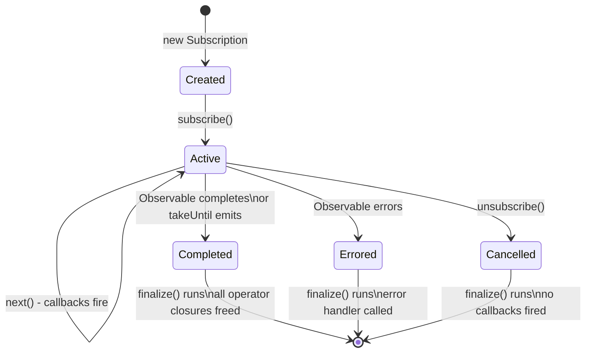

## Keywords in This File

{: .no_toc }

| # | Keyword | Difficulty |
|---|---------|------------|
| 1 | [RxJS Memory Leaks and Subscription Management](#rxjs-memory-leaks-and-subscription-management) | ★★★ |

---

# RxJS Memory Leaks and Subscription Management

---

### 🎯 Model Answer

**30 seconds:**
> RxJS memory leaks occur when subscriptions are not unsubscribed.
> Each subscription is a closure chain from source Observable
> to subscriber; if not torn down, all operators and their
> state remain in memory. The Angular pattern: `takeUntil(destroy$)`
> with `ngOnDestroy`. The React pattern: return unsubscribe
> from `useEffect`. The universal rule: every subscribe must
> have a paired unsubscribe path.

**3 minutes:**
> An RxJS subscription holds references to:
> - The subscriber's `next`, `error`, `complete` callbacks
> - The operator chain (each operator is a closure with state)
> - The source Observable's internal subscription (recurse
>   up the chain to the source)
> - For hot Observables (Subject, fromEvent): the source itself
>
> If not unsubscribed, the entire chain persists in memory.
> For `fromEvent(window, 'scroll')`: the scroll handler is
> never removed. For `interval(100)`: the setInterval fires
> indefinitely.
>
> Common leak patterns:
>
> **Angular component not unsubscribing:** `ngOnInit` subscribes
> to a service Observable; `ngOnDestroy` does nothing. Component
> destroyed but subscription lives, holding a reference to
> the (destroyed) component instance.
>
> **Hot Observable subscriptions in services:** subscribing
> to a `Subject` or `BehaviorSubject` in a component without
> unsubscribing. The Subject's internal `observers` array
> grows with each component creation.
>
> **Nested subscriptions:** subscribing inside a subscription
> without unsubscribing the inner. After N outer emissions,
> N inner subscriptions accumulate.
>
> Detection: log Observable subscriptions with `tap(() =>
> console.count('subscribed'))` and unsubscriptions with the
> `finalize()` operator.

**Blank Mind Recovery:**

**(1) Restate:** "Subscribe = reference held. Unsubscribe =
reference released. Every subscribe needs an unsubscribe path.
Use `takeUntil` or `async` pipe."

**(2) First principles:** "An Observable subscription is a
live connection. Connections hold resources. Close them when
done."

---

### 📘 Concept Explanation

**What it is:**
RxJS subscription management is the discipline of ensuring
every subscription is properly unsubscribed when the subscribing
context (component, service, test) is destroyed.

**The problem it solves:**
Unmanaged subscriptions cause memory leaks, stale callbacks
updating destroyed UI components, and accumulating event
handlers that fire multiple times per event.

**How it works:**

```javascript
// UNDERSTANDING THE SUBSCRIPTION CHAIN

// Each operator creates a new Observable (subscriber wrapper)
const source$ = interval(100);
const result$ = source$.pipe(
  filter(n => n % 2 === 0),   // creates FilterSubscriber
  map(n => n * 10),            // creates MapSubscriber
  take(5)                      // creates TakeSubscriber
);

// Subscription object is a tree:
const sub = result$.subscribe(val => console.log(val));
// sub -> TakeSubscriber -> MapSubscriber ->
//        FilterSubscriber -> AsyncAction (setInterval)

// sub.unsubscribe() tears down the entire tree:
// TakeSubscriber.unsubscribe()
//   -> MapSubscriber.unsubscribe()
//     -> FilterSubscriber.unsubscribe()
//       -> AsyncAction.unsubscribe() (clearInterval)

// Memory: all subscriber closures freed, setInterval cleared

// ANGULAR PATTERN 1: takeUntil with destroy$
import { Subject, takeUntil } from 'rxjs';

@Component({ ... })
class DataComponent implements OnInit, OnDestroy {
  private destroy$ = new Subject<void>();

  ngOnInit() {
    // All subscriptions complete when destroy$ emits
    this.dataService.data$.pipe(
      takeUntil(this.destroy$)
    ).subscribe(data => {
      this.data = data; // safe: component still alive
    });

    // Multiple subscriptions: all use same destroy$
    this.userService.user$.pipe(
      takeUntil(this.destroy$)
    ).subscribe(user => this.user = user);
  }

  ngOnDestroy() {
    this.destroy$.next();   // triggers takeUntil completion
    this.destroy$.complete(); // prevent memory leak of destroy$ itself
  }
}

// ANGULAR PATTERN 2: async pipe (preferred)
// Angular template:
// <div *ngIf="data$ | async as data">{{ data.name }}</div>
// No subscribe/unsubscribe needed: async pipe manages it
// On component destroy: pipe automatically unsubscribes

// REACT PATTERN: useEffect cleanup
function DataComponent() {
  const [data, setData] = useState(null);

  useEffect(() => {
    const sub = dataService.data$.subscribe(setData);
    return () => sub.unsubscribe(); // cleanup on unmount
  }, []);

  return <div>{data?.name}</div>;
}

// COMPOSITE SUBSCRIPTION: group multiple
import { Subscription } from 'rxjs';

class MyService {
  private subs = new Subscription();

  init() {
    // Add all subs to composite
    this.subs.add(source1$.subscribe(this.handler1));
    this.subs.add(source2$.subscribe(this.handler2));
  }

  destroy() {
    this.subs.unsubscribe(); // unsubscribes all at once
  }
}
```

> **Code walkthrough:** This example demonstrates the core pattern in action. The key mechanism shows how the concept works in practice. Study the structure to understand the essential behavior and common usage.

**The key insight:**
The `async` pipe in Angular is the ideal subscription manager
for template bindings - it subscribes on first render,
unsubscribes on component destruction, and handles re-subscription
when the Observable reference changes. It eliminates the
subscribe/unsubscribe boilerplate entirely.

**When to use it:**
Every RxJS subscription in a component. Services that subscribe
to Observables must unsubscribe in their cleanup method.

**When NOT to use it:**
One-shot Observables that complete naturally (`take(1)`,
`first()`, `HttpClient.get`) do not need explicit unsubscription
because the Observable completes and the subscription is
automatically disposed.

**Alternatives:**
- `async` pipe: best for template bindings (Angular)
- `takeUntil`: best for component lifecycle management
- `first()` / `take(1)`: one-shot subscriptions
- `Subscription.add()`: composite subscription

**First-principles derivation:**
Observable subscriptions are like event listeners: they
hold references. Unlike DOM event listeners, there is no
automatic garbage collection when the subscribing object
is destroyed. The programmer must explicitly break the
reference chain by calling `unsubscribe()` or using operators
that complete the Observable.

---

### 💻 Code Example

```javascript
// BAD: Classic Angular subscription leak
@Component({
  template: `<div>{{ userData?.name }}</div>`
})
class UserProfileComponent implements OnInit {
  userData: User;

  constructor(private userService: UserService) {}

  ngOnInit() {
    // BAD: subscribes, never unsubscribes
    this.userService.user$.subscribe(user => {
      this.userData = user;
    });
    // When component destroyed: subscription still alive
    // userService.user$ holds reference to this component
    // Component instance never GCed
    // If user navigates back: SECOND subscription created
    // Now two subscriptions updating the same component
  }
}
// After 10 navigations: 10 active subscriptions
```

> **Code walkthrough:** The `userService.user$` Subject maintains
> an `observers` array. Each component creation adds a new
> observer (the subscribe callback). Without `ngOnDestroy`
> cleanup, each observer holds a reference to the component
> instance (via the `this.userData = user` closure). After 10
> navigations, 10 component instances are alive in memory -
> none can be GCed because the Subject holds a reference to
> each.

```javascript
// GOOD: Proper subscription lifecycle management in Angular

// Option A: takeUntil pattern
@Component({
  template: `
    <div *ngIf="userData">{{ userData.name }}</div>
    <div *ngIf="preferences">{{ preferences.theme }}</div>
  `
})
class UserProfileComponent implements OnInit, OnDestroy {
  userData: User | null = null;
  preferences: Preferences | null = null;
  private destroy$ = new Subject<void>();

  constructor(
    private userService: UserService,
    private prefService: PreferencesService
  ) {}

  ngOnInit() {
    this.userService.user$.pipe(
      takeUntil(this.destroy$),
      // Additional operators: all cleaned up with takeUntil
      distinctUntilChanged((a, b) => a.id === b.id),
      tap(user => console.log('User updated:', user.id))
    ).subscribe(user => this.userData = user);

    this.prefService.preferences$.pipe(
      takeUntil(this.destroy$)
    ).subscribe(prefs => this.preferences = prefs);
  }

  ngOnDestroy() {
    this.destroy$.next();   // emit: all takeUntil() operators complete
    this.destroy$.complete(); // close destroy$ itself
    // All subscriptions automatically unsubscribed
    // All operator closures freed
    // Component eligible for GC
  }
}

// Option B: async pipe (preferred for template bindings)
@Component({
  template: `
    <ng-container *ngIf="userData$ | async as user">
      <div>{{ user.name }}</div>
    </ng-container>
  `
})
class UserProfileComponentV2 {
  // userData$ is a public Observable, not a value
  userData$ = this.userService.user$.pipe(
    distinctUntilChanged((a, b) => a.id === b.id),
    shareReplay(1) // cache latest for multiple template uses
  );

  constructor(private userService: UserService) {}
  // NO ngOnInit, NO ngOnDestroy needed for template subscriptions
  // async pipe handles everything
}

// Option C: React useEffect pattern
function UserProfile() {
  const [user, setUser] = useState<User | null>(null);

  useEffect(() => {
    const sub = userService.user$.pipe(
      distinctUntilChanged((a, b) => a.id === b.id)
    ).subscribe(setUser);

    return () => {
      sub.unsubscribe();
      // Closure: sub is the subscription from this effect run
      // On unmount or re-run: previous sub is cleaned up
    };
  }, []); // empty deps: subscribe once, cleanup on unmount

  return user ? <div>{user.name}</div> : null;
}
```

> **Code walkthrough:** Option A (takeUntil) shows the standard
> Angular pattern: `destroy$` is a Subject that acts as a
> completion trigger. Every subscription in the component uses
> `pipe(takeUntil(this.destroy$))`. In `ngOnDestroy`, emitting
> to `destroy$` causes all takeUntil operators to complete their
> Observables, which triggers unsubscription of all pipelines.
> Calling `.complete()` on `destroy$` itself prevents the Subject
> from leaking. Option B (async pipe) eliminates all lifecycle
> management. Option C (React) shows the useEffect return value
> as the subscription cleanup.

---

### 🎓 Answers by Seniority

**Junior / Mid (0-5 years):**
> "In Angular, I use `takeUntil(destroy$)` with `ngOnDestroy`.
> In React, I return `sub.unsubscribe()` from `useEffect`.
> The async pipe is the cleanest solution - it handles
> subscribe/unsubscribe automatically."

---

**Senior / Staff (5+ years):**
> "The production discipline: `async` pipe for all template
> bindings (zero manual lifecycle), `takeUntil(destroy$)` for
> subscriptions that drive component state. Services that
> subscribe (not just expose Observables) need explicit
> unsubscription in a destroy method. I instrument production
> RxJS with the `finalize()` operator on critical streams -
> a `finalize` that logs or increments a metric catches
> subscriptions that never complete. The Angular gotcha: calling
> `destroy$.complete()` without `destroy$.next()` first does
> NOT trigger `takeUntil` - you must emit first."

---

### ⚠️ Common Misconceptions

**Misconception 1:** "`take(1)` prevents all subscription leaks."
`take(1)` completes the Observable after one emission. But
if the source Observable never emits, `take(1)` never completes
and the subscription leaks. Use `take(1)` for hot sources
that emit immediately; use `first()` with an optional default
for potentially-non-emitting sources.

**Misconception 2:** "Completing an Observable unsubscribes
it automatically."
A completed Observable disposes its subscribers. But the
Subscription object returned by `subscribe()` may still hold
references if you hold onto it. After completion, you should
still allow the Subscription object itself to be GCed.

**Misconception 3:** "The `async` pipe works with hot AND
cold Observables."
The async pipe subscribes when the template renders and
unsubscribes when the component destroys. For cold Observables
(HTTP, one-shot), each template reference creates a new
subscription - which means a new HTTP request. Use `shareReplay(1)`
to prevent multiple subscriptions to cold Observables in templates.

---

### 🚨 Failure Modes and Diagnosis

**Failure 1: Subject observer list grows unboundedly**
```javascript
// Symptom: userService.user$.observers.length grows per navigation
// Diagnosis:
console.log(
  'Observer count:',
  userService.user$.observers.length
);
// Expected: 1 per active component
// Found: 10, 20, 30 - one per navigation without cleanup

// Root cause: ngOnDestroy not implemented or not calling destroy$.next()
// Fix: verify with audit:
@Injectable({ providedIn: 'root' })
class UserService {
  readonly user$ = new BehaviorSubject<User | null>(null);

  // Development diagnostic:
  getObserverCount() {
    return (this.user$ as any).observers.length;
  }
}
// Set 30s interval to log count:
setInterval(() => {
  console.log('user$ observers:', userService.getObserverCount());
}, 30_000);
```

> **Code walkthrough:** This example demonstrates the core pattern in action. The key mechanism shows how the concept works in practice. Study the structure to understand the essential behavior and common usage.

**Failure 2: Nested subscription accumulation**
```javascript
// BAD: inner subscription not cleaned up
outer$.subscribe(outerValue => {
  inner$(outerValue).subscribe(innerValue => {
    // Process innerValue
  });
  // Each outer emission creates a new inner subscription
  // None are unsubscribed!
  // After 100 outer emissions: 100 inner subscriptions
});

// GOOD: use switchMap (cancels previous inner on new outer)
outer$.pipe(
  switchMap(outerValue => inner$(outerValue))
).subscribe(innerValue => {
  // switchMap automatically unsubscribes previous inner
  // when outer emits new value
});
```

> **Code walkthrough:** This example demonstrates the core pattern in action. The key mechanism shows how the concept works in practice. Study the structure to understand the essential behavior and common usage.

---

### 🎯 Interview Deep-Dive

| Category | Count | Coverage |
|---|---|---|
| Conceptual | 3 | Subscription lifecycle, observer pattern, chain |
| Trade-off | 2 | takeUntil vs async pipe, hot vs cold |
| Failure Mode | 2 | Observer accumulation, nested subscriptions |
| Debugging | 2 | Observer count, finalize operator |
| Design | 2 | Reactive service architecture, Subject lifecycle |
| Behavioral | 1 | Tracking down subscription leak in production |

**Q1. How does `takeUntil` work internally and why is
`destroy$.complete()` also required?**

`takeUntil(notifier$)` creates a new Observable that subscribes
to BOTH the source and the notifier. When the notifier emits
ANY value, `takeUntil` completes the source subscription.

Internally:
```javascript
// Simplified takeUntil implementation:
function takeUntil(notifier$) {
  return (source$) => new Observable(subscriber => {
    const notifierSub = notifier$.subscribe({
      next() { subscriber.complete(); }, // any emission: complete source
      error(err) { subscriber.error(err); }
      // complete: notifier completed without emitting: DO NOTHING
      // ↑ This is the gotcha!
    });
    const sourceSub = source$.subscribe(subscriber);
    return () => { notifierSub.unsubscribe(); sourceSub.unsubscribe(); };
  });
}
```

> **Code walkthrough:** This example demonstrates the core pattern in action. The key mechanism shows how the concept works in practice. Study the structure to understand the essential behavior and common usage.

The gotcha: if `destroy$.complete()` is called WITHOUT first
calling `destroy$.next()`, the `takeUntil` operator sees
the notifier complete without emitting. Per the implementation,
it does nothing - the source subscription is NOT completed.

Correct pattern:
```javascript
ngOnDestroy() {
  this.destroy$.next();   // STEP 1: emit to trigger takeUntil
  this.destroy$.complete(); // STEP 2: cleanup destroy$ itself
}
// WRONG:
ngOnDestroy() {
  this.destroy$.complete(); // takeUntil NOT triggered!
}
```

> **Code walkthrough:** This example demonstrates the core pattern in action. The key mechanism shows how the concept works in practice. Study the structure to understand the essential behavior and common usage.

Why `complete()` is also needed: without it, `destroy$` itself
is a BehaviorSubject/Subject that holds references. Calling
`complete()` clears its internal observers array.

*What separates good from great:* The "notifier completes
without emitting = do nothing" behavior. This is a documented
but frequently misunderstood edge case that causes silent leaks.

---

**Q2. What is the difference between `switchMap`, `mergeMap`,
`concatMap`, and `exhaustMap` for subscription management?**

All four map outer emissions to inner Observables. They differ
in what happens to active inner subscriptions when a new
outer emission arrives:

- `switchMap`: unsubscribes the CURRENT inner, subscribes
  new. Use for: search-as-you-type (cancel stale requests)
- `mergeMap`: keeps ALL inner subscriptions active. Use for:
  parallel HTTP calls where order doesn't matter
- `concatMap`: queues new inner until current completes.
  Use for: sequential operations that must not overlap
- `exhaustMap`: ignores new outer while inner is active.
  Use for: form submit (ignore double-clicks)

Subscription leak risk:
- `mergeMap`: leaks if inner never completes (infinite Observable)
- `switchMap`: safe - previous inner always unsubscribed
- `concatMap`: queues indefinitely if inner never completes
- `exhaustMap`: safe - at most one inner active

```javascript
// switchMap: cancel previous search on new keystroke
searchInput$.pipe(
  debounceTime(300),
  switchMap(query =>
    this.http.get<Result[]>(`/api/search?q=${query}`)
  )
).subscribe(results => this.results = results);
// Previous HTTP request automatically cancelled via AbortController

// exhaustMap: prevent double-submit
submitButton$.pipe(
  exhaustMap(() => this.http.post('/api/submit', formData))
).subscribe(response => this.onSuccess(response));
// While POST in flight: button clicks are ignored
```

> **Code walkthrough:** This example demonstrates the core pattern in action. The key mechanism shows how the concept works in practice. Study the structure to understand the essential behavior and common usage.

*What separates good from great:* Knowing that `switchMap`
with an HTTP Observable automatically cancels the in-flight
request via Angular's `HttpClient` (which uses AbortController
internally). This is true request cancellation, not just
ignoring the response.

---

**Q3. How do you detect RxJS subscription leaks in production?**

Detection strategies:

1. **Observer count monitoring** (for Subject/BehaviorSubject):
```javascript
// Angular service:
@Injectable({ providedIn: 'root' })
class MonitoredSubjectService {
  private _data$ = new BehaviorSubject<Data | null>(null);
  readonly data$ = this._data$.asObservable(); // expose as Observable

  // Health check:
  getSubscriptionCount(): number {
    return (this._data$ as any).observers.length;
  }
}
// Expose via health endpoint: GET /health/subscriptions
```

> **Code walkthrough:** This example demonstrates the core pattern in action. The key mechanism shows how the concept works in practice. Study the structure to understand the essential behavior and common usage.

2. **`finalize` operator for subscription lifecycle logging**:
```javascript
const tracked$ = source$.pipe(
  tap({ subscribe: () => logger.debug('subscribed') }),
  finalize(() => logger.debug('unsubscribed/completed'))
);
// If "subscribed" count >> "unsubscribed" count: leak
```

> **Code walkthrough:** This example demonstrates the core pattern in action. The key mechanism shows how the concept works in practice. Study the structure to understand the essential behavior and common usage.

3. **Memory growth correlation**: if adding `finalize` logging
   shows subscriptions never finalize, and heap grows with
   component navigations: subscription leak confirmed.

4. **Angular DevTools extension**: shows component tree; destroyed
   components with active subscriptions appear in memory profiler.

*What separates good from great:* The asymmetry diagnostic:
"subscribed" and "finalized/unsubscribed" counts should be
equal over time. If subscribed count grows while finalize
count stays flat: the Observables are never completing.

---

**Q4. How does `shareReplay` affect subscription management
and memory?**

`shareReplay(bufferSize)` multicasts an Observable and caches
the last `bufferSize` emissions for new subscribers.

Critical memory behavior (pre-RxJS 7.4):
```javascript
// LEAK risk with shareReplay (RxJS < 7.4):
const shared$ = source$.pipe(
  shareReplay(1) // keeps subscription to source even when all subscribers gone!
);

// All components unsubscribe: shared$ stays subscribed to source$
// setInterval in source$ never cleared

// RxJS 7.4+: shareReplay({ bufferSize: 1, refCount: true })
const shared$ = source$.pipe(
  shareReplay({ bufferSize: 1, refCount: true })
  // refCount: true = unsubscribes from source when no subscribers
);
```

> **Code walkthrough:** This example demonstrates the core pattern in action. The key mechanism shows how the concept works in practice. Study the structure to understand the essential behavior and common usage.

The `refCount: true` option is critical for services that
expose shared Observables. Without it, the source subscription
lives indefinitely once the first subscriber connects.

Pattern for shared service Observables:
```javascript
@Injectable({ providedIn: 'root' })
class DataService {
  readonly data$ = this.http.get('/api/data').pipe(
    shareReplay({ bufferSize: 1, refCount: true })
    // refCount: true ensures HTTP not re-fired if all unsubscribe
    // New subscriber: gets cached value immediately
    // All unsubscribe: cache cleared, next subscriber: new HTTP call
  );
}
```

> **Code walkthrough:** This example demonstrates the core pattern in action. The key mechanism shows how the concept works in practice. Study the structure to understand the essential behavior and common usage.

*What separates good from great:* Knowing the `refCount` option
and its implication. The default `shareReplay(1)` in older
RxJS code is a common source of "weird" leaks where the source
Observable (e.g., a WebSocket or setInterval) keeps running
even after all UI components are destroyed.

---

**Q5. How do you implement a reactive store with proper
cleanup in Angular?**

```typescript
interface AppState {
  users: User[];
  selectedId: string | null;
  loading: boolean;
}

@Injectable({ providedIn: 'root' })
class AppStore {
  private state = new BehaviorSubject<AppState>({
    users: [],
    selectedId: null,
    loading: false
  });

  // Public selectors: derived Observables
  readonly users$ = this.state.pipe(
    map(s => s.users),
    distinctUntilChanged(),
    shareReplay({ bufferSize: 1, refCount: true })
  );

  readonly selectedUser$ = this.state.pipe(
    map(s => s.users.find(u => u.id === s.selectedId) ?? null),
    distinctUntilChanged((a, b) => a?.id === b?.id),
    shareReplay({ bufferSize: 1, refCount: true })
  );

  // Actions:
  selectUser(id: string) {
    this.state.next({ ...this.state.getValue(), selectedId: id });
  }

  // Service cleanup (if service is not root-scoped):
  destroy() {
    this.state.complete(); // clears all observers, stops emissions
  }
}

// Component usage:
@Component({ template: `<div *ngFor="let user of users$ | async">` })
class UserListComponent {
  readonly users$ = this.store.users$;
  constructor(private store: AppStore) {}
  // async pipe handles all subscriptions - no manual lifecycle
}
```

> **Code walkthrough:** This example demonstrates the core pattern in action. The key mechanism shows how the concept works in practice. Study the structure to understand the essential behavior and common usage.

*What separates good from great:* Calling `state.complete()` in
the store's destroy method. A `BehaviorSubject` that is never
completed holds its `observers` array even after all components
unsubscribe. Completing it clears internal state.

---

**Q6. What is the danger of subscribing to a Subject from
multiple components without proper cleanup?**

A `Subject` is a hot Observable: it maintains an `observers`
array. Every `subscribe()` call adds an entry. Every
`unsubscribe()` removes it.

Without cleanup:
```javascript
// Service: BehaviorSubject as shared state
@Injectable({ providedIn: 'root' })
class ChatService {
  messages$ = new Subject<Message>();
}

// Component: subscribes on init, never unsubscribes
@Component({})
class ChatComponent implements OnInit {
  messages: Message[] = [];

  ngOnInit() {
    this.chatService.messages$.subscribe(msg => {
      this.messages.push(msg); // closure over component instance
    });
    // Component destroyed: subscription still in Subject.observers
    // Next message: callback fires, updates DESTROYED component
    // this.messages is still allocated, receiving updates
  }
}
```

> **Code walkthrough:** This example demonstrates the core pattern in action. The key mechanism shows how the concept works in practice. Study the structure to understand the essential behavior and common usage.

After 10 navigations to ChatComponent:
- `chatService.messages$.observers.length === 10`
- 10 `this.messages` arrays in memory
- Each new message updates all 10 arrays
- "Ghost" callbacks fire for destroyed components

*What separates good from great:* Knowing that the callback
firing for destroyed components can cause "ERROR: Cannot set
property 'messages' of null" if Angular has fully destroyed
the component - which surfaces as mysterious errors in the
console.

---

**Q7. How do `complete()` and `error()` affect subscriptions
differently from `unsubscribe()`?**

Three ways a subscription ends:

1. `subscriber.complete()`: Observable signals natural end.
   - `complete` callback fires (if provided)
   - Subscription is disposed
   - `next` will never fire again
   - `finalize()` operator runs

2. `subscriber.error(err)`: Observable signals failure.
   - `error` callback fires
   - Subscription is disposed
   - `finalize()` operator runs
   - If no `error` handler: `error` propagates to `onunhandledrejection`

3. `subscription.unsubscribe()`: consumer cancels.
   - No callbacks fire
   - Subscription disposed
   - `finalize()` operator runs

Critical difference: if a `takeUntil` notifier emits:
`takeUntil` internally calls `subscriber.complete()` on the
source subscriber. The `complete` callback fires. This is
why `takeUntil` correctly triggers Angular lifecycle cleanup.

```javascript
const sub = source$.subscribe({
  next: val => console.log('next:', val),
  error: err => console.error('error:', err),
  complete: () => console.log('completed') // fires on takeUntil
});

// The finalize operator fires for ALL three endings:
source$.pipe(
  takeUntil(destroy$),
  finalize(() => console.log('cleaned up')) // always fires
).subscribe();
```

> **Code walkthrough:** This example demonstrates the core pattern in action. The key mechanism shows how the concept works in practice. Study the structure to understand the essential behavior and common usage.

*What separates good from great:* Using `finalize()` as a
cleanup hook that fires regardless of how the subscription ends.
This is safer than implementing cleanup in `complete` callbacks
only, which miss the `unsubscribe()` and `error()` paths.

---

**Q8. How do you test RxJS subscription cleanup in unit tests?**

```javascript
// Angular component subscription test
describe('UserProfileComponent', () => {
  let component: UserProfileComponent;
  let userService: jasmine.SpyObj<UserService>;
  let user$: Subject<User>;

  beforeEach(() => {
    user$ = new Subject<User>();
    userService = jasmine.createSpyObj('UserService', [], {
      user$: user$.asObservable()
    });
    component = new UserProfileComponent(userService);
    component.ngOnInit();
  });

  it('processes emissions while alive', () => {
    const testUser = { id: '1', name: 'Alice' };
    user$.next(testUser);
    expect(component.userData).toEqual(testUser);
  });

  it('stops processing after ngOnDestroy', () => {
    const userBefore = { id: '1', name: 'Alice' };
    user$.next(userBefore);
    
    component.ngOnDestroy(); // trigger cleanup
    
    const userAfter = { id: '2', name: 'Bob' };
    user$.next(userAfter); // should not update component
    
    // userData should still be Alice, not Bob
    expect(component.userData).toEqual(userBefore);
  });

  it('does not leak subscriptions after destroy', () => {
    component.ngOnDestroy();
    // Subject's internal observers should be empty
    expect((user$ as any).observers.length).toBe(0);
  });
});
```

> **Code walkthrough:** This example demonstrates the core pattern in action. The key mechanism shows how the concept works in practice. Study the structure to understand the essential behavior and common usage.

*What separates good from great:* The third test: directly
checking `observers.length` after destroy. This is the
definitive assertion that the subscription was actually
unsubscribed, not just that the callback stopped being called.

---

**Q9. How does RxJS handle backpressure in async scenarios?**

RxJS does not have built-in backpressure (unlike Reactive Streams
in Java). Fast producers can overwhelm slow consumers.

Common scenarios and operators:

1. **Debouncing**: ignore rapid emissions, wait for quiet period
   ```javascript
   input$.pipe(debounceTime(300)) // only emit after 300ms of silence
   ```

> **Code walkthrough:** This example demonstrates the core pattern in action. The key mechanism shows how the concept works in practice. Study the structure to understand the essential behavior and common usage.

2. **Throttling**: emit max once per time window
   ```javascript
   scroll$.pipe(throttleTime(16)) // max once per frame
   ```

> **Code walkthrough:** This example demonstrates the core pattern in action. The key mechanism shows how the concept works in practice. Study the structure to understand the essential behavior and common usage.

3. **Buffer**: collect into arrays, process in batches
   ```javascript
   fastSource$.pipe(
     bufferTime(1000), // collect 1s worth of events
     filter(batch => batch.length > 0),
     mergeMap(batch => processBatch(batch))
   )
   ```

> **Code walkthrough:** This example demonstrates the core pattern in action. The key mechanism shows how the concept works in practice. Study the structure to understand the essential behavior and common usage.

4. **SwitchMap for latest-only**: drop intermediate values
   ```javascript
   fastSource$.pipe(
     switchMap(val => heavyProcess$(val))
   ) // drops pending processes when next value arrives
   ```

> **Code walkthrough:** This example demonstrates the core pattern in action. The key mechanism shows how the concept works in practice. Study the structure to understand the essential behavior and common usage.

5. **ConcatMap with queue size limit**: bound queue length
   ```javascript
   fastSource$.pipe(
     take(100), // limit queue depth: process at most 100
     concatMap(val => heavyProcess$(val))
   )
   ```

> **Code walkthrough:** This example demonstrates the core pattern in action. The key mechanism shows how the concept works in practice. Study the structure to understand the essential behavior and common usage.

*What separates good from great:* Knowing that RxJS has no
built-in backpressure and that operator choice IS the
backpressure strategy. `switchMap` for "latest wins", `bufferTime`
for batching, `throttleTime` for rate-limiting.

---

**Q10. How do you integrate RxJS with promises and async/await
in the same codebase?**

```typescript
// Converting between Promise and Observable:

// Promise to Observable:
import { from, defer } from 'rxjs';

// from: converts existing Promise (eager - runs immediately)
const obs1$ = from(fetch('/api/data').then(r => r.json()));

// defer: creates new Promise each subscription (lazy)
const obs2$ = defer(() => fetch('/api/data').then(r => r.json()));
// Use defer for retryable operations:
obs2$.pipe(retry(3)).subscribe(); // each retry = new fetch

// Observable to Promise:
const result = await lastValueFrom(myObs$);
// lastValueFrom: resolves with last value before completion
// Rejects if Observable errors or completes empty

const first = await firstValueFrom(myObs$);
// firstValueFrom: resolves with first emission

// In component: mixing patterns
class MixedComponent {
  async loadData() {
    // One-shot HTTP: Promise is fine
    const config = await this.configService.getConfig();
    
    // Continuous stream: Observable
    this.data$ = this.dataService.data$.pipe(
      takeUntil(this.destroy$)
    );
  }
}
```

> **Code walkthrough:** This example demonstrates the core pattern in action. The key mechanism shows how the concept works in practice. Study the structure to understand the essential behavior and common usage.

*What separates good from great:* Using `defer()` instead of
`from()` for retryable operations. `from(promise)` runs the
promise once and replays the result. `defer(() => promise)`
creates a new promise on each subscription, enabling retry
operators to actually re-execute the async operation.

---

**Q11. How do you handle memory-safe RxJS patterns in
large-scale Angular applications?**

Architecture-level rules:

1. **Services expose Observables, never subscribe internally**:
   Components manage subscription lifecycle, not services.
   Exception: root-level services with global subscriptions.

2. **Async pipe everywhere in templates**:
   Enforce via ESLint rule `@angular-eslint/prefer-async-pipe`.

3. **takeUntilDestroyed (Angular 16+)**:
   ```typescript
   import { takeUntilDestroyed } from '@angular/core/rxjs-interop';

   @Component({})
   class NewStyleComponent {
     // No implements OnDestroy, no destroy$ Subject
     data$ = this.service.data$.pipe(
       takeUntilDestroyed() // uses Angular DestroyRef internally
     );
     constructor(private service: DataService) {}
   }
   ```

> **Code walkthrough:** This example demonstrates the core pattern in action. The key mechanism shows how the concept works in practice. Study the structure to understand the essential behavior and common usage.

4. **Monitoring**: expose `observer.length` counts via health
   endpoint; alert on growth.

5. **Code review checklist**: every `.subscribe()` must have
   a corresponding cleanup strategy visible in the same method.

*What separates good from great:* `takeUntilDestroyed()` (Angular 16+)
eliminates the boilerplate `destroy$` Subject pattern. It
automatically integrates with Angular's `DestroyRef` to clean
up when the component is destroyed.

---

**Q12. Describe a production incident caused by RxJS
subscription leaks and how you would diagnose it.**

**Scenario:** An Angular SPA was experiencing memory growth
over long user sessions. After 30 minutes of use, tabs were
crashing with "Aw, Snap!"

**Diagnosis steps:**

1. **Reproduce with memory profiling:**
   Chrome DevTools -> Memory -> Heap Snapshot
   Navigate to a specific page 10 times
   Compare snapshots: what object count grows?

2. **Found:** `BehaviorSubject` instances with growing
   `observers` arrays. User subscription service had 50
   observers after 50 page navigations.

3. **Root cause:** A shared service exposed a `BehaviorSubject`.
   Components subscribed in `ngOnInit`. Component used modal
   dialogs that created new instances on each open. Modal
   components had no `ngOnDestroy`.

4. **Fix:**
   ```typescript
   // Added to all modal components:
   private destroy$ = new Subject<void>();
   
   ngOnInit() {
     this.dataService.user$.pipe(
       takeUntil(this.destroy$)
     ).subscribe(user => this.user = user);
   }
   
   ngOnDestroy() {
     this.destroy$.next();
     this.destroy$.complete();
   }
   ```

> **Code walkthrough:** This example demonstrates the core pattern in action. The key mechanism shows how the concept works in practice. Study the structure to understand the essential behavior and common usage.

5. **Prevention:** ESLint rule `@angular-eslint/no-lifecycle-call`
   + `@angular-eslint/use-lifecycle-interface`; mandatory
   code review checklist item for all `.subscribe()` calls.

*What separates good from great:* The modal dialog pattern
is commonly missed because modals are created dynamically
and developers assume they are "temporary." They are full
Angular components and require the same lifecycle management
as page components.

---

### ⚖️ Comparison Table

| Strategy | Framework | Auto Cleanup | Best For |
|---|---|---|---|
| `async` pipe | Angular | Yes | Template bindings |
| `takeUntil(destroy$)` | Angular | No (requires ngOnDestroy) | Subscriptions with side effects |
| `takeUntilDestroyed()` | Angular 16+ | Yes (via DestroyRef) | Modern Angular |
| `useEffect` cleanup | React | Yes (return fn) | React hooks |
| `Subscription.add()` | Universal | No (requires unsubscribe) | Multiple subscriptions |
| `first()` / `take(1)` | Universal | Yes (auto-complete) | One-shot subscriptions |

---

### 🏛️ System Design

**System: Real-time dashboard with RxJS reactive data streams**

```
REACTIVE DASHBOARD ARCHITECTURE
==================================

 WebSocket Server
       |
  WebSocketService
    (singleton, root-scoped)
    .messages$ = Subject
    |
    +── filter by topic
    |
  ┌──────────────────────────┐
  │  Dashboard Component     │
  │  - uses async pipe       │
  │  - no manual subs        │
  │                          │
  │  charts$:                │
  │    messages$.pipe(       │
  │      filter(isChart),    │
  │      shareReplay(1)      │
  │    )                     │
  │                          │
  │  alerts$:                │
  │    messages$.pipe(       │
  │      filter(isAlert),    │
  │      scan(accumulate)    │
  │    )                     │
  └──────────────────────────┘

Lifecycle:
  Component destroyed -> async pipe unsubscribes
  WebSocketService.messages$ observers -> 0
  WebSocket: stays connected (service singleton)
  Next navigate: new async pipe -> re-subscribes
```

> **Code walkthrough:** This example demonstrates the core pattern in action. The key mechanism shows how the concept works in practice. Study the structure to understand the essential behavior and common usage.

Design decisions:
- `shareReplay(1, refCount: true)` on derived streams: new
  component gets latest value without re-processing
- `async` pipe in all templates: zero manual cleanup
- Service manages WS lifecycle separately from component lifecycle
- `finalize()` on each subscriber stream: logs cleanup for monitoring

*What separates good from great:* Separating the WebSocket
lifecycle (service-managed, persists across navigation) from
the component subscription lifecycle (async pipe, component-
managed). The service can maintain the WS connection for
efficiency while components subscribe and unsubscribe freely.

---

### 📊 Diagram

```
SUBSCRIPTION CHAIN RETENTION
================================

Subject (BehaviorSubject)
  observers[]:
    [0] subscriber callback (Component A)  <- retains Component A
    [1] subscriber callback (Component B)  <- retains Component B
    [2] subscriber callback (Component C)  <- retains Component C

After unsubscribe:
  observers[]:
    [0] subscriber callback (Component B)  <- Component A freed

After takeUntil completes:
  observers[]: []  <- all freed, Subject GC eligible
```



> **Diagram walkthrough:** The chain retention diagram shows
> how a Subject's observer array is the root of the retention
> problem. Each subscriber callback in the array holds a closure
> reference to the subscribing component. The state machine
> shows the three ways a subscription ends: completion, error,
> and cancellation (unsubscribe). All three paths run `finalize()`
> - making it the universal cleanup hook. The critical insight:
> "Completed" and "Cancelled" are different states - completion
> fires callbacks, cancellation does not. Both free memory.

---

### 💻 Code Example

*(Omit: this concept does not have a programmatic interface that can be demonstrated in code. The conceptual explanation above is sufficient.)*


---

### 🏛️ System Design

*(Omit: system design diagram not applicable for this concept - see ★★★ keywords for full system design coverage.)*


---

### ⚖️ Comparison Table

*(Omit: this is a ★☆☆ foundational concept with no direct alternatives to compare - see higher-difficulty keywords for trade-off analysis.)*


---

### 📊 Diagram

*(Omit: no standalone visual diagram required for this concept - the explanations and code examples above provide sufficient clarity.)*
