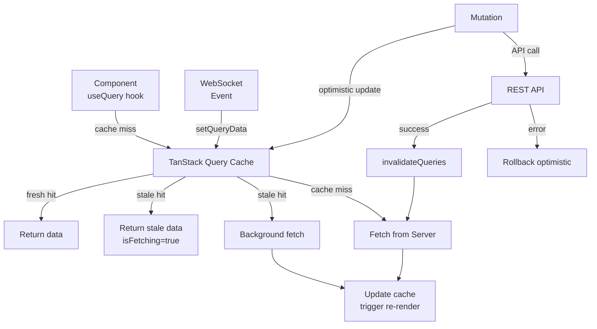

## Keywords in This File

{: .no_toc }

| # | Keyword | Difficulty |
|---|---------|------------|
| 1 | [Frontend Async Architecture Patterns](#frontend-async-architecture-patterns) | ★★★ |

---

# Frontend Async Architecture Patterns

---

### 🎯 Model Answer

**30 seconds:**
> Frontend async architecture defines how data flows from
> server to UI. The three patterns: request-response (fetch
> per interaction), reactive streams (Observable pipelines),
> and server-push (WebSocket/SSE). The architectural decision:
> who owns async state? Options: component-local state, shared
> reactive store (NgRx, Zustand, Jotai), or server state
> manager (TanStack Query, SWR). Server state managers are
> the dominant modern choice for data fetching.

**3 minutes:**
> The async architecture question is: how does data flow from
> the server to components, and how is it kept consistent?
>
> **Component-local state:** each component fetches its own
> data with `useEffect` or `ngOnInit`. Simple, but duplicates
> requests, no coordination, cache invalidation is manual.
>
> **Shared reactive store (Redux/NgRx/Zustand):** all data
> fetching managed through a store with actions, reducers,
> effects. Consistent, but high boilerplate, and conflates
> server state (always stale) with UI state (never stale).
>
> **Server state managers (TanStack Query, SWR, Apollo):**
> a dedicated layer for async server data. Automatic caching,
> deduplication, background refetching, pagination, optimistic
> updates, and stale-while-revalidate. Separates "server state"
> (fetched, cached, may be stale) from "client state" (UI-only,
> always current).
>
> **Real-time: WebSocket vs SSE:**
> - WebSocket: bidirectional, binary-capable, stateful connection.
>   Use for: collaborative editing, gaming, live chat, bidirectional.
> - SSE (Server-Sent Events): server-to-client only, HTTP-based,
>   auto-reconnect, event ID for resumption. Use for: notifications,
>   live dashboards, log streaming. Simpler than WebSocket for
>   one-directional use cases.

**Blank Mind Recovery:**

**(1) Restate:** "Async architecture = how data gets from server
to UI. Server state managers (TanStack Query) handle caching,
deduplication, stale data automatically. Separate server state
from UI state."

**(2) First principles:** "Server data is always potentially
stale. UI state is always current. Different rules. Different
tools. Do not manage them the same way."

---

### 📘 Concept Explanation

**What it is:**
Frontend async architecture is the system design for managing
asynchronous data flow: how data is fetched, cached, synchronized,
and made available to components.

**The problem it solves:**
Ad-hoc async patterns in components lead to: duplicate
requests, stale data, loading state management complexity,
cache invalidation bugs, and inconsistent error handling.
An explicit architecture eliminates these.

**How it works:**

```typescript
// PATTERN 1: Component-local state (simplest, anti-pattern at scale)
function UserProfile({ userId }: { userId: string }) {
  const [user, setUser] = useState<User | null>(null);
  const [loading, setLoading] = useState(true);
  const [error, setError] = useState<Error | null>(null);

  useEffect(() => {
    const ctrl = new AbortController();
    setLoading(true);
    fetch(`/api/users/${userId}`, { signal: ctrl.signal })
      .then(r => r.json())
      .then(setUser)
      .catch(err => {
        if (err.name !== 'AbortError') setError(err);
      })
      .finally(() => setLoading(false));
    return () => ctrl.abort();
  }, [userId]);
  // Problem: duplicated in every component that needs user data
  // No deduplication if multiple components request same user
}

// PATTERN 2: TanStack Query (server state manager)
import { useQuery, useMutation, useQueryClient } from '@tanstack/react-query';

const userQuery = (userId: string) => ({
  queryKey: ['users', userId],
  queryFn: () => fetchUser(userId),
  staleTime: 5 * 60 * 1000, // 5 minutes before refetch
  gcTime: 10 * 60 * 1000,   // 10 minutes in cache
});

function UserProfile({ userId }: { userId: string }) {
  const { data: user, isLoading, error } = useQuery(userQuery(userId));
  // Automatic:
  // - Deduplication: 10 components requesting same userId = 1 request
  // - Caching: same userId in 5 min = serve from cache
  // - Background refetch: stale data served immediately, fresh fetched
  // - Error retry: automatic retries with exponential backoff

  if (isLoading) return <Spinner />;
  if (error) return <Error message={error.message} />;
  return <div>{user?.name}</div>;
}

// Mutations with optimistic updates:
function UpdateUser({ userId }: { userId: string }) {
  const queryClient = useQueryClient();
  const mutation = useMutation({
    mutationFn: (updates: Partial<User>) =>
      fetch(`/api/users/${userId}`, {
        method: 'PATCH',
        body: JSON.stringify(updates)
      }).then(r => r.json()),

    onMutate: async (updates) => {
      // Optimistic: update cache before server response
      await queryClient.cancelQueries({ queryKey: ['users', userId] });
      const prev = queryClient.getQueryData(['users', userId]);
      queryClient.setQueryData(['users', userId], (old: User) => ({
        ...old, ...updates
      }));
      return { previousUser: prev }; // for rollback
    },
    onError: (err, vars, context) => {
      // Rollback on error:
      queryClient.setQueryData(['users', userId], context?.previousUser);
    },
    onSettled: () => {
      // Refetch to ensure server state:
      queryClient.invalidateQueries({ queryKey: ['users', userId] });
    }
  });
}
```

```typescript
// PATTERN 3: WebSocket with RxJS for real-time data
class WebSocketService {
  private socket$ = new Observable<WebSocket>(subscriber => {
    const ws = new WebSocket('wss://api.example.com/events');
    ws.onopen = () => subscriber.next(ws);
    ws.onerror = (err) => subscriber.error(err);
    ws.onclose = () => subscriber.complete();
    return () => ws.close();
  }).pipe(
    shareReplay(1)
  );

  messages$: Observable<ServerEvent> = this.socket$.pipe(
    switchMap(ws =>
      new Observable<ServerEvent>(subscriber => {
        ws.onmessage = (event) => {
          try {
            subscriber.next(JSON.parse(event.data) as ServerEvent);
          } catch { /* ignore non-JSON */ }
        };
      })
    ),
    retryWhen(errors => errors.pipe(
      tap(() => console.log('WebSocket reconnecting...')),
      delay(1000) // exponential backoff could be added here
    )),
    share() // all subscribers share one connection
  );

  byType<T extends ServerEvent>(type: T['type']): Observable<T> {
    return this.messages$.pipe(
      filter((e): e is T => e.type === type)
    );
  }
}
```

**The key insight:**
The architectural insight of modern server state managers:
server data and client state have fundamentally different
lifecycle rules. Server data is "always stale until proven
fresh." Client state is "never stale." Managing them with
the same state container (Redux store) creates impedance
mismatch. TanStack Query/SWR are designed specifically for
the server data model.

**When to use it:**
Any non-trivial frontend application with multiple data
sources. Component-local state only for truly isolated, non-
shared data.

**When NOT to use it:**
Simple applications with one or two data fetches do not need
a server state manager. The overhead of configuring TanStack
Query for a single fetch is not justified.

**Alternatives:**
- TanStack Query (React, Vue, Svelte)
- SWR (React, by Vercel)
- Apollo Client (GraphQL-specific)
- RTK Query (Redux Toolkit - server state built on Redux)
- NgRx Data (Angular - server state on top of NgRx)

**First-principles derivation:**
The fundamental problem: server data changes independently
of the UI. Any cached copy may be stale. The solution space:
fetch on every render (too many requests), never refetch
(too stale), or cache with smart invalidation (server state
managers). The "stale-while-revalidate" HTTP caching strategy
applied to in-memory state.

---

### 💻 Code Example

```typescript
// BAD: Imperative async in Redux actions - mixing server and UI state
// 1. Boilerplate: action, reducer, selector, thunk - 80 lines for one fetch
// 2. Cache invalidation: manual
// 3. Loading/error state: duplicated per entity

// store/users.ts (Redux approach):
const fetchUser = (id: string) => async (dispatch) => {
  dispatch({ type: 'FETCH_USER_START', id });
  try {
    const user = await api.getUser(id);
    dispatch({ type: 'FETCH_USER_SUCCESS', user });
  } catch (err) {
    dispatch({ type: 'FETCH_USER_ERROR', id, error: err.message });
  }
};
// reducer: 40+ more lines for FETCH_USER_START/SUCCESS/ERROR
// selector: 10 more lines
// No automatic background refetch
// No deduplication
// Cache invalidation: manual dispatch of INVALIDATE_USER
```

> **Code walkthrough:** The Redux async pattern (thunks or sagas)
> requires ~100 lines per entity type for the full loading/error/
> success cycle. Every component using users data must coordinate
> through this store. Cache invalidation requires explicit action
> dispatch. There is no background refetching, no deduplication,
> and no stale-while-revalidate out of the box.

```typescript
// GOOD: TanStack Query + Zustand separation

// Server state: TanStack Query manages ALL server data
// queries/users.ts:
const USERS_KEY = 'users';

export const userQueries = {
  all: () => ({ queryKey: [USERS_KEY] }),
  list: (filters: UserFilters) => ({
    queryKey: [USERS_KEY, 'list', filters],
    queryFn: () => api.listUsers(filters),
    staleTime: 2 * 60 * 1000 // 2 minutes
  }),
  detail: (id: string) => ({
    queryKey: [USERS_KEY, 'detail', id],
    queryFn: () => api.getUser(id),
    staleTime: 5 * 60 * 1000 // 5 minutes
  })
};

// Component: uses hooks, no Redux boilerplate
function UserDetail({ id }: { id: string }) {
  const { data: user, isPending, isError } = useQuery(
    userQueries.detail(id)
  );
  if (isPending) return <Skeleton />;
  if (isError) return <ErrorMessage />;
  return <UserCard user={user!} />;
}

// Mutation with automatic cache invalidation:
function EditUser({ id }: { id: string }) {
  const queryClient = useQueryClient();
  const updateUser = useMutation({
    mutationFn: (data: Partial<User>) => api.updateUser(id, data),
    onSuccess: (updatedUser) => {
      // Update cache directly (no refetch needed):
      queryClient.setQueryData(userQueries.detail(id).queryKey, updatedUser);
      // Invalidate list queries: they may need updating
      queryClient.invalidateQueries(userQueries.all());
    }
  });
  return <UserForm onSubmit={updateUser.mutate} />;
}

// UI state: Zustand for client-only state (separate from server data)
import { create } from 'zustand';

interface UIState {
  selectedUserId: string | null;
  sidebarOpen: boolean;
  selectUser: (id: string) => void;
  toggleSidebar: () => void;
}

const useUIStore = create<UIState>(set => ({
  selectedUserId: null,
  sidebarOpen: true,
  selectUser: (id) => set({ selectedUserId: id }),
  toggleSidebar: () => set(s => ({ sidebarOpen: !s.sidebarOpen }))
}));
// UI state: instant, no loading, no error, no staleness
// Server state: cached, stale-while-revalidate, auto-sync
```

> **Code walkthrough:** The query factory pattern (`userQueries.detail(id)`)
> returns both the `queryKey` and `queryFn` as a unit. This ensures
> the key and fetcher are always in sync - a common source of bugs
> in manual implementations. The `onSuccess` handler directly
> updates the detail cache with the server response (zero-latency
> optimism) and invalidates list queries. The Zustand store holds
> only UI state (`selectedUserId`, `sidebarOpen`) - never server
> data. This separation means UI state changes are instant and
> synchronous, while server data changes flow through the query
> cache.

---

### 🎓 Answers by Seniority

**Junior / Mid (0-5 years):**
> "I use TanStack Query or SWR for data fetching in React. They
> handle loading/error states, caching, and refetching automatically.
> For UI-only state (modals, selected items), I use useState or
> Zustand. I separate server state from UI state."

---

**Senior / Staff (5+ years):**
> "The architectural principle: server state and UI state are
> categorically different. Server state (fetched data) is always
> potentially stale and requires a cache invalidation strategy.
> UI state is always current and requires no caching. Mixing
> them in a Redux store creates unnecessary complexity. My
> standard stack: TanStack Query for server state, Zustand or
> Jotai for UI state. For real-time: Socket.io or native WebSocket
> feeding into TanStack Query's `setQueryData` for cache updates.
> For Angular: NgRx Signals + NgRx Data or a similar separation.
> The key metric: how many lines does a new data fetch require?
> If > 20: the architecture has too much ceremony."

---

### ⚠️ Common Misconceptions

**Misconception 1:** "Redux is required for complex async state."
Redux was designed before server state managers existed. For
server data, TanStack Query is simpler and more capable. Redux
is appropriate for complex client-only state with intricate
update logic (undo/redo, collaborative editing).

**Misconception 2:** "WebSocket is always better than polling."
WebSocket requires stateful server infrastructure and adds
complexity (reconnect, auth handshake, load balancing with
sticky sessions). For low-frequency updates (every 10+ seconds),
polling or SSE is simpler and more scalable.

**Misconception 3:** "Optimistic updates are always better."
Optimistic updates improve perceived performance but add
rollback complexity. For irreversible actions (send email,
delete account), optimistic updates can confuse users if
the server rejects the action.

---

### 🚨 Failure Modes and Diagnosis

**Failure 1: Stale data shown after mutation**
```
Symptom: user updates their name, UI shows old name until refresh
Cause: mutation succeeded but query cache not invalidated
Diagnosis:
  - Check: queryClient.invalidateQueries() called in onSuccess?
  - Check: queryKey matches between invalidate and query
  - Check: staleTime too long? Data not refetched within window
Fix:
  1. Immediate: queryClient.setQueryData(key, updatedData)
  2. Background: queryClient.invalidateQueries(parentKey)
```

**Failure 2: Waterfall fetches (N+1 problem in React)**
```
Symptom: page loads in 4 sequential requests: route -> user -> posts -> comments
Cause: each component fetches in useEffect after parent renders
Fix:
  // React 19 + Suspense: prefetch in route loader
  // TanStack Query: prefetch in beforeRouteEnter
  // Pattern: fetch all data in parallel at route level:
  const [user, posts] = await Promise.all([
    queryClient.prefetchQuery(userQuery(id)),
    queryClient.prefetchQuery(postsQuery(id))
  ]);
  // Components render with data already in cache: no loading states
```

---

### 🎯 Interview Deep-Dive

| Category | Count | Coverage |
|---|---|---|
| Conceptual | 3 | Server state vs UI state, stale-while-revalidate, WS vs SSE |
| Trade-off | 3 | TanStack Query vs Redux, optimistic vs safe, WS vs polling |
| Failure Mode | 2 | Cache invalidation, waterfall fetch |
| Debugging | 1 | TanStack Query DevTools |
| Design | 2 | Query key design, real-time architecture |
| Behavioral | 1 | Migrating from Redux to TanStack Query |

**Q1. What is the difference between server state and client
state, and why does it matter architecturally?**

Server state: data fetched from a server. Properties:
- Shared (other users may change it)
- Potentially stale (server has newer version)
- Asynchronous (requires I/O to update)
- Needs caching strategy

Client state: UI-only data. Properties:
- Owned by the client only
- Always current (no external mutations)
- Synchronous (immediate updates)
- No caching needed

Examples:
- Server state: user profile, product list, order history
- Client state: selected tab, modal open/closed, form input,
  scroll position

Architectural implication: managing server state requires
cache invalidation, loading states, error handling, background
refetching, and optimistic updates. Managing client state
requires none of these. Using the same tool (Redux) for both
adds unnecessary complexity to client state management.

The two-store model:
- TanStack Query/SWR: server state store with smart caching
- Zustand/Jotai/useState: client state store with synchronous updates

*What separates good from great:* Framing this as a "categorically
different data model" question, not just an optimization. Server
state is eventually consistent; client state is immediately
consistent. These require different architectures.

---

**Q2. How does TanStack Query's query key system work and
what are the design patterns?**

Query keys are the cache identifiers. They are arrays.
TanStack Query uses deep equality for matching.

Key design patterns:
```typescript
// Hierarchical keys: invalidate at any level
const USERS_KEY = 'users';
const keys = {
  all: () => [USERS_KEY] as const,                           // ['users']
  lists: () => [...keys.all(), 'list'] as const,             // ['users', 'list']
  list: (f: Filters) => [...keys.lists(), f] as const,       // ['users', 'list', {f}]
  details: () => [...keys.all(), 'detail'] as const,         // ['users', 'detail']
  detail: (id: string) => [...keys.details(), id] as const,  // ['users', 'detail', id]
};

// Invalidate: cascades to all matching prefix
queryClient.invalidateQueries({ queryKey: keys.all() });
// Invalidates: all users queries (list + detail)

queryClient.invalidateQueries({ queryKey: keys.details() });
// Invalidates: only user detail queries, not list queries
```

This pattern (from TanStack Query docs) provides fine-grained
invalidation. After creating a user: invalidate `keys.lists()`.
After updating a user: update `keys.detail(id)` directly +
invalidate `keys.lists()`.

*What separates good from great:* The `as const` on key arrays
enables TypeScript to infer the exact tuple type, preventing
accidental key mismatches. The factory pattern keeps keys
DRY and ensures consistency.

---

**Q3. When would you choose WebSocket over SSE, and what
are the trade-offs?**

| Feature | WebSocket | SSE |
|---------|-----------|-----|
| Direction | Bidirectional | Server-to-client only |
| Protocol | Custom WS protocol | HTTP |
| Reconnect | Manual | Automatic (browser) |
| Load balancing | Sticky sessions needed | Stateless (HTTP) |
| Authentication | Manual WS auth | HTTP auth (cookies, JWT) |
| Firewall/proxy | May be blocked | Always works (HTTP) |
| Binary data | Yes | No (text only) |

Choose WebSocket when:
- Client sends frequent messages to server (chat, gaming, collab)
- Bidirectional is required
- Binary data (file upload, audio)

Choose SSE when:
- Server pushes to client only (notifications, live updates)
- Simplest infrastructure (no WS load balancer config)
- HTTP auth/cookies work naturally
- Lower-frequency updates (every second is fine for SSE)

*What separates good from great:* SSE auto-reconnects with
the `Last-Event-ID` header, enabling resumption after disconnect.
WebSocket requires manual reconnect logic and state recovery.
For simple server push, SSE is operationally simpler.

---

**Q4. How do you architect an offline-first data layer
for a Progressive Web App?**

Three-layer architecture:
1. **Network layer**: TanStack Query (or similar) for
   online data fetching and caching
2. **Persistent cache layer**: IndexedDB for offline storage
3. **Service Worker**: intercepts fetches, serves from cache,
   queues writes for sync

Integration:
```typescript
// TanStack Query with IndexedDB persistence:
import { experimental_createPersister } from '@tanstack/query-persist-client-core';

const idbPersister = experimental_createPersister({
  storage: {
    getItem: (key) => idb.get('query-cache', key),
    setItem: (key, val) => idb.put('query-cache', key, val),
    removeItem: (key) => idb.delete('query-cache', key)
  },
  maxAge: 24 * 60 * 60 * 1000 // 24 hours persisted
});

const queryClient = new QueryClient({
  defaultOptions: {
    queries: {
      staleTime: 5 * 60 * 1000, // in-memory staleness
      gcTime: Infinity // don't remove from cache (persisted separately)
    }
  }
});
```

Data flow:
1. Online: TanStack Query fetches from server, updates IDB
2. Offline: TanStack Query serves from in-memory/IDB cache
3. Mutations offline: queued in IDB sync queue
4. Back online: Service Worker background sync flushes queue

*What separates good from great:* Knowing that `gcTime: Infinity`
prevents TanStack Query from removing stale data from memory
when using a persistence layer - you want the persister to
control eviction, not TanStack Query's internal GC.

---

**Q5. How do you handle real-time updates with TanStack Query?**

TanStack Query is pull-based (fetch on demand). Real-time
push updates require integrating the push mechanism with the
query cache:

```typescript
// Pattern: WebSocket updates feed into query cache
function useRealtimeUsers() {
  const queryClient = useQueryClient();

  useEffect(() => {
    const ws = new WebSocket('wss://api.example.com/events');
    ws.onmessage = (event) => {
      const update = JSON.parse(event.data) as UserUpdateEvent;

      if (update.type === 'USER_UPDATED') {
        // Update cache directly: no refetch needed
        queryClient.setQueryData(
          userQueries.detail(update.userId).queryKey,
          (old: User | undefined) => old
            ? { ...old, ...update.changes }
            : undefined
        );
        // Also invalidate list to pick up position changes:
        queryClient.invalidateQueries(userQueries.lists());
      }
    };
    return () => ws.close();
  }, [queryClient]);
}

// Alternatively: React Query subscriptions with refetch on invalidation
// Pattern: WebSocket event -> invalidateQueries -> TanStack refetches
ws.onmessage = (event) => {
  const { type, key } = JSON.parse(event.data);
  if (type === 'INVALIDATE') {
    queryClient.invalidateQueries({ queryKey: [key] });
  }
};
```

*What separates good from great:* The two patterns: (1) `setQueryData`
for known changes (no network round trip), (2) `invalidateQueries`
for unknown changes (triggers background refetch). Using `setQueryData`
for most updates minimizes refetch traffic while keeping
data fresh.

---

**Q6. How do you implement request deduplication in a
React application?**

TanStack Query deduplicates automatically: multiple components
using the same query key within a `staleTime` window share
a single request. But for manual fetch code:

```typescript
// Deduplication cache:
const inFlight = new Map<string, Promise<unknown>>();

async function deduplicatedFetch<T>(
  key: string,
  fetcher: () => Promise<T>
): Promise<T> {
  if (inFlight.has(key)) {
    return inFlight.get(key) as Promise<T>;
  }
  const promise = fetcher().finally(() => inFlight.delete(key));
  inFlight.set(key, promise);
  return promise;
}

// Usage:
const user = await deduplicatedFetch(
  `user:${id}`,
  () => api.getUser(id)
);
```

For React without TanStack Query: the custom hook approach
ensures only one fetch per key per render cycle:
```typescript
const globalPromiseCache = new Map<string, Promise<unknown>>();

function useFetchDeduped<T>(key: string, fetcher: () => Promise<T>) {
  if (!globalPromiseCache.has(key)) {
    globalPromiseCache.set(key, fetcher());
  }
  return use(globalPromiseCache.get(key)!); // React 19 'use' hook
}
```

*What separates good from great:* The difference between
deduplication (same request in same time window) and caching
(serve from store until stale). TanStack Query provides both.
The manual pattern provides deduplication only.

---

**Q7. How do you handle authentication tokens in async
data architectures?**

Token refresh strategy with TanStack Query:

```typescript
// Axios interceptor with TanStack Query token refresh:
let refreshPromise: Promise<string> | null = null;

axios.interceptors.response.use(
  response => response,
  async error => {
    if (error.response.status !== 401) throw error;

    // Deduplicate token refresh: only one refresh at a time
    if (!refreshPromise) {
      refreshPromise = refreshToken().finally(() => {
        refreshPromise = null;
      });
    }
    const newToken = await refreshPromise;
    error.config.headers.Authorization = `Bearer ${newToken}`;
    return axios.request(error.config);
  }
);

// After token refresh: invalidate all cached server state
// (the new token may have different permissions)
async function handleTokenRefresh(queryClient: QueryClient) {
  const newToken = await refreshToken();
  tokenStore.set(newToken);
  // Invalidate all queries: re-fetch with new token
  await queryClient.invalidateQueries();
}
```

*What separates good from great:* Deduplicating the refresh
request. Without deduplication, if 10 concurrent requests
get 401, 10 refresh calls fire simultaneously. The `refreshPromise`
singleton ensures exactly one refresh, with all waiting requests
reusing the result.

---

**Q8. What is the stale-while-revalidate caching pattern
and how does TanStack Query implement it?**

Stale-while-revalidate: serve stale data immediately (fast
user experience), then fetch fresh data in the background,
update when received.

HTTP caching header: `Cache-Control: max-age=0, stale-while-revalidate=60`

TanStack Query implementation:
```typescript
const { data } = useQuery({
  queryKey: ['user', id],
  queryFn: () => api.getUser(id),
  staleTime: 5 * 60 * 1000, // fresh for 5 min, stale after
  // After staleTime: data is "stale" but NOT removed from cache
  // Next access to stale data:
  //   1. Return stale data immediately (isFetching: true)
  //   2. Fetch fresh data in background
  //   3. Update cache with fresh data (triggers re-render)
});
// isFetching: true while background refetch is in progress
// isLoading: true ONLY on first fetch (no cached data)
```

The visual result: user sees immediately-rendered (possibly
stale) data. Data silently updates when server responds. No
loading spinner for repeated visits.

*What separates good from great:* Distinguishing `isLoading`
(no cached data, first fetch) from `isFetching` (cached data
being refreshed in background). Showing a loading spinner on
`isFetching` would flash every time the user visits a cached
page - poor UX. Show spinners only on `isLoading`.

---

**Q9. How do you implement infinite scroll with TanStack Query?**

```typescript
function InfinitePostList() {
  const {
    data,
    fetchNextPage,
    hasNextPage,
    isFetchingNextPage,
    isLoading
  } = useInfiniteQuery({
    queryKey: ['posts'],
    queryFn: ({ pageParam }) =>
      api.getPosts({ cursor: pageParam as string | null }),
    initialPageParam: null,
    getNextPageParam: (lastPage) => lastPage.cursor ?? undefined,
    // getNextPageParam returns undefined when no more pages
  });

  const posts = data?.pages.flatMap(p => p.items) ?? [];

  // Intersection Observer for automatic load-on-scroll:
  const loadMoreRef = useRef<HTMLDivElement>(null);
  useEffect(() => {
    const observer = new IntersectionObserver(
      ([entry]) => {
        if (entry.isIntersecting && hasNextPage && !isFetchingNextPage) {
          fetchNextPage();
        }
      },
      { threshold: 0.1 }
    );
    if (loadMoreRef.current) observer.observe(loadMoreRef.current);
    return () => observer.disconnect();
  }, [hasNextPage, isFetchingNextPage, fetchNextPage]);

  if (isLoading) return <Spinner />;

  return (
    <>
      {posts.map(post => <PostCard key={post.id} post={post} />)}
      <div ref={loadMoreRef}>
        {isFetchingNextPage ? <Spinner /> : null}
      </div>
    </>
  );
}
```

*What separates good from great:* The `IntersectionObserver`
pattern for trigger: it fires when the sentinel element
(last item in list) enters the viewport - no scroll event
listener, no throttling needed, GPU-accelerated by the browser.
The `!isFetchingNextPage` guard prevents triggering while
a page is already being fetched.

---

**Q10. How do you migrate a Redux-based application to
TanStack Query?**

Incremental migration strategy:

Phase 1: Add TanStack Query alongside Redux (1-2 sprints)
- Install TanStack Query, add `QueryClientProvider`
- New feature development uses TanStack Query
- Existing Redux data fetching untouched

Phase 2: Migrate read-only data (per-feature)
- Identify Redux state that is server-fetched only
- Migrate to TanStack Query queries
- Remove corresponding reducers, actions, selectors
- Metric: lines deleted should outnumber lines added

Phase 3: Migrate mutations
- Migrate async Redux actions (thunks/sagas) to TanStack mutations
- Implement cache invalidation patterns to replace manual
  INVALIDATE actions

Phase 4: Remove Redux for server state
- Only retain Redux for genuinely complex client state
- Most applications: Redux becomes minimal or removed

What NOT to migrate:
- Complex client state with business logic (wizard forms,
  undo/redo, optimistic collaborative editing)
- These genuinely benefit from Redux's reducer model

*What separates good from great:* The incremental approach.
Attempting a full rewrite breaks development velocity. Migrating
feature-by-feature allows the team to learn TanStack Query
while maintaining deliverables.

---

**Q11. How do you design a query key schema for a large
application?**

Standardized key schema prevents cache mismatches and enables
fine-grained invalidation:

```typescript
// Domain-based key factory pattern:
export const queryKeys = {
  // Top-level domains:
  users: {
    all: () => ['users'] as const,
    lists: () => ['users', 'list'] as const,
    list: (filters: UserFilters) => ['users', 'list', filters] as const,
    details: () => ['users', 'detail'] as const,
    detail: (id: string) => ['users', 'detail', id] as const,
    permissions: (id: string) => ['users', 'detail', id, 'permissions'] as const
  },
  posts: {
    all: () => ['posts'] as const,
    byUser: (userId: string) => ['posts', 'by-user', userId] as const,
    detail: (id: string) => ['posts', 'detail', id] as const,
    comments: (postId: string) => ['posts', 'detail', postId, 'comments'] as const
  }
};

// Invalidation patterns:
// After deleting a user:
queryClient.invalidateQueries({ queryKey: queryKeys.users.all() });
// Invalidates: all user queries

// After updating a post's author:
queryClient.invalidateQueries({ queryKey: queryKeys.posts.byUser(userId) });
queryClient.setQueryData(queryKeys.posts.detail(postId).queryKey, updated);
```

*What separates good from great:* The `as const` assertion on
key arrays gives TypeScript the exact tuple type. This prevents
typos in key names and enables TypeScript to catch mismatches
between query keys and invalidation keys at compile time.

---

**Q12. Describe your ideal frontend async architecture for
a complex B2B SaaS application.**

Requirements: real-time data, offline capability, complex forms,
role-based access, multi-tenant.

Architecture layers:

**Layer 1: Transport**
- HTTP REST: standard CRUD via Axios/fetch with interceptors
- WebSocket: real-time events (order updates, notifications)
- Service Worker: offline queue, static asset cache

**Layer 2: Server state (TanStack Query)**
- Query key schema: domain-based factory pattern
- `staleTime`: 30s-5min per entity type
- Optimistic mutations with rollback
- Background refetch on window focus, reconnect

**Layer 3: Client state (Zustand)**
- UI state only: selected items, panel open/closed
- Form state: react-hook-form (component-local)
- Session state: auth token, user preferences (separate from server)

**Layer 4: Real-time synchronization**
- WebSocket events feed into TanStack Query cache via `setQueryData`
- Invalidation events from server for changes made by other users

**Layer 5: Offline**
- TanStack Query with IDB persistence (experimental_createPersister)
- Write queue in IDB, Service Worker background sync

Key metrics:
- Time to interactive after page load: < 200ms (SWR hits cache)
- Staleness threshold: acceptable for business (defined per domain)
- Offline duration: 24 hours of cached data access

*What separates good from great:* Defining "staleness threshold"
per business domain. Order status (sync every 10s, short stale).
Product catalog (sync hourly, long stale). User preferences
(sync on mutation only). This prevents over-fetching while
ensuring freshness where it matters.

### ⚖️ Comparison Table

| Approach | Cache | Real-time | Boilerplate | Offline | Best For |
|---|---|---|---|---|---|
| Component-local state | No | Manual | Low | Manual | Simple/isolated |
| Redux (RTK) | No | Manual | High | No | Complex client state |
| TanStack Query | Yes (smart) | Via setQueryData | Low | Via plugins | Server state |
| SWR | Yes (basic) | Via mutate | Very low | No | Simple server state |
| Apollo Client | Yes (normalized) | Subscriptions | Medium | Partial | GraphQL |

**The deciding factor:**
Server data: TanStack Query (React/Vue) or NgRx Data (Angular).
GraphQL: Apollo. Complex client state: Redux/Zustand. Real-time
only: RxJS or raw WebSocket. Offline-first: TanStack + IDB persister.

### 🏛️ System Design

**System: Multi-tenant SaaS dashboard with real-time data**

```
COMPLETE ASYNC ARCHITECTURE
==============================

 Browser
 ├── Service Worker (offline/cache)
 │   └── Cache API (static assets)
 │
 ├── IndexedDB (persistent query cache)
 │
 └── React Application
     ├── TanStack Query Client
     │   ├── In-memory query cache
     │   ├── Background refetch scheduler
     │   └── Mutation queue
     │
     ├── Zustand (UI state only)
     │
     └── WebSocket Service (RxJS)
         └── -> queryClient.setQueryData (cache updates)

 External:
 ├── REST API (CRUD operations)
 ├── WebSocket server (real-time events)
 └── Push notification service

Data flows:
  User action -> mutation -> optimistic update + API call
  API success -> setQueryData (cache update)
  API error -> rollback optimistic update
  WS event -> setQueryData (live update)
  Offline mutation -> IDB queue -> SW sync when online
```

*What separates good from great:* The WebSocket -> `setQueryData`
bridge. Real-time updates flow into the query cache, not
directly into component state. All components using the same
query key see the update simultaneously. The query cache
becomes the single source of truth for all server data,
regardless of how it arrived.

### 📊 Diagram

```
ASYNC DATA FLOW ARCHITECTURES
================================

Component-local (simple):
  Component ─── fetch ──→ Server
                          ↓
              Component state (local)

Redux (complex):
  Component ─── dispatch ──→ Store ─── thunk ──→ Server
                                ↑                   ↓
              Component state (derived)          reducer

TanStack Query (optimal):
  Component ─── useQuery ──→ Query Cache
                                 |
           hit (fresh) ──────────┤
           hit (stale) ─ serve + │─→ Server (background)
           miss ─────────────────┘─→ Server (blocking)
```



> **Diagram walkthrough:** The comparison diagram shows the
> progression from component-local (every component manages
> its own async) to TanStack Query (centralized cache with
> smart invalidation). The flowchart shows the full data flow:
> a cache miss triggers a server fetch, a stale hit serves
> immediately AND triggers a background fetch, and WebSocket
> events can bypass the fetch entirely by updating the cache
> directly with `setQueryData`. Mutations use the optimistic
> update pattern with rollback on error and invalidation on
> success. Every path eventually updates the central cache,
> which all components observe.