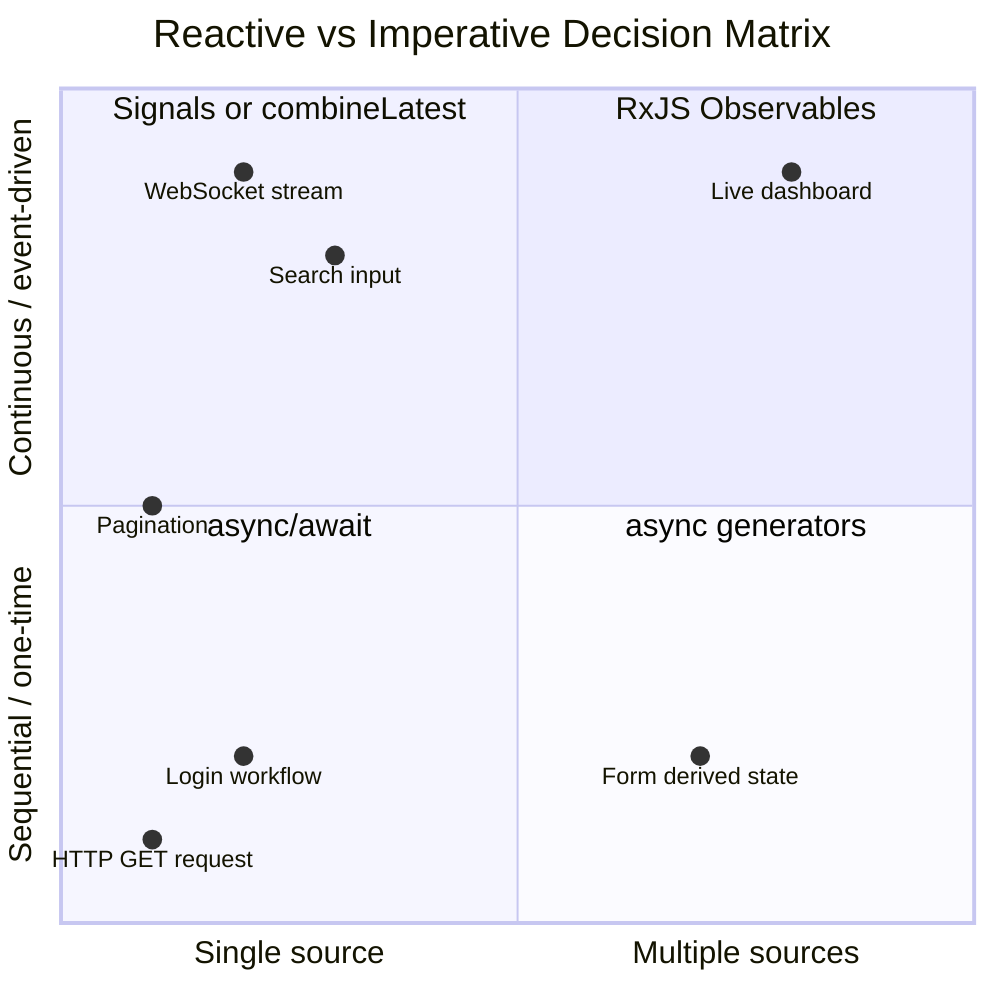

## Keywords in This File

{: .no_toc }

| # | Keyword | Difficulty |
|---|---------|------------|
| 1 | [Reactive vs Imperative Frontend Architecture Decision](#reactive-vs-imperative-frontend-architecture-decision) | ★★★ |

---

# Reactive vs Imperative Frontend Architecture Decision

---

### 🎯 Model Answer

**30 seconds:**
> Imperative async: you describe WHAT to do and WHEN - `await
> fetch()`, `setState()`, explicit step-by-step. Reactive async:
> you describe data relationships - "when X changes, Y updates
> automatically." The decision framework: multiple asynchronous
> data sources that must be combined, transformed, or coordinated?
> Reactive wins. Single-threaded data flows with clear sequencing?
> Imperative is simpler. The most common mistake: using reactive
> patterns for simple request/response flows.

**3 minutes:**
> Imperative async is the natural model: fetch data, process
> it, update state, trigger side effects. Direct, sequential,
> testable. But it breaks down with:
> - Multiple concurrent sources that must be combined
> - Events that can arrive in any order
> - Derived values that must update when any of several sources
>   change
> - Cancellation of in-progress operations on new input
>
> Reactive (Observable/Signal-based) models data as streams.
> Instead of "fetch X then fetch Y then combine," you declare:
> "the combined value IS the latest X merged with latest Y."
> The runtime handles timing, cancellation, and updates.
>
> **When Reactive wins:**
> - Real-time: WebSocket events, keyboard input with debounce
> - Complex derived state: 5 inputs, 1 output
> - Automatic cancellation: switchMap for search
> - Long-lived streams: infinite scroll, live dashboards
>
> **When Imperative wins:**
> - Sequential workflows: login -> load user -> load dashboard
> - One-time data fetches
> - Simple CRUD operations
> - Team unfamiliar with Observables (learning curve is real)
>
> **The Signals era (Angular 16+, Preact Signals, Vue 3 Reactive):**
> Signals are a third model between imperative and Observable-based
> reactive. Fine-grained reactivity without the Observable
> complexity. `const user = signal<User | null>(null)` +
> `computed(() => user().name)`. Simpler than RxJS for most
> use cases, but less powerful for complex async coordination.

**Blank Mind Recovery:**

**(1) Restate:** "Imperative = tell the computer what to do.
Reactive = describe what data depends on what. Reactive wins
with multiple async sources. Imperative wins for simple flows."

**(2) First principles:** "Some problems are naturally described
as transformations: input changes -> output updates. Reactive
models these directly. Other problems are naturally sequential:
step 1, step 2, step 3. Imperative models these directly.
Match the model to the problem."

---

### 📘 Concept Explanation

**What it is:**
The architectural choice between imperative async (explicit
control flow: if/then, await, callbacks) and reactive async
(declarative data pipelines: Observables, Signals, streams).

**The problem it solves:**
Choosing the wrong model leads to: reactive code for simple
sequencing (unnecessary complexity), or imperative code for
complex event coordination (spaghetti async, missed cancellations).

**How it works:**

```javascript
// THE SAME FEATURE: search-as-you-type

// IMPERATIVE APPROACH:
let currentRequest = null;
let debounceTimer = null;

searchInput.addEventListener('input', (e) => {
  clearTimeout(debounceTimer);
  if (currentRequest) {
    currentRequest.abort();
    currentRequest = null;
  }

  debounceTimer = setTimeout(async () => {
    const ctrl = new AbortController();
    currentRequest = ctrl;

    try {
      setLoading(true);
      const results = await fetch(
        `/api/search?q=${encodeURIComponent(e.target.value)}`,
        { signal: ctrl.signal }
      ).then(r => r.json());

      if (!ctrl.signal.aborted) {
        setResults(results);
      }
    } catch (err) {
      if (err.name !== 'AbortError') setError(err);
    } finally {
      if (currentRequest === ctrl) {
        setLoading(false);
        currentRequest = null;
      }
    }
  }, 300);
});
// 35 lines: manual debounce, manual cancellation,
// manual loading state, manual race condition guard
```

```javascript
// REACTIVE APPROACH (RxJS):
const search$ = fromEvent(searchInput, 'input').pipe(
  map(e => e.target.value),
  debounceTime(300),
  distinctUntilChanged(),
  switchMap(query =>
    from(fetch(`/api/search?q=${encodeURIComponent(query)}`)
      .then(r => r.json())
    ).pipe(
      tap(() => setLoading(false)),
      catchError(err => {
        setError(err);
        return EMPTY;
      }),
      startWith(null) // loading state
    )
  )
);

search$.pipe(
  tap(results => setLoading(results === null))
).subscribe(results => {
  if (results !== null) setResults(results);
});
// 15 lines: debounce, cancellation (switchMap), loading, error
// - all declarative
```

```typescript
// SIGNALS APPROACH (Angular 17+):
@Component({
  template: `
    <input (input)="query.set($event.target.value)">
    @if (results.isLoading()) { <Spinner /> }
    @for (item of results.data(); track item.id) {
      <ResultItem [item]="item" />
    }
  `
})
class SearchComponent {
  query = signal('');

  // Derived: resource automatically updates when query changes
  results = resource({
    request: () => ({ q: this.query() }),
    loader: ({ request, abortSignal }) =>
      fetch(`/api/search?q=${request.q}`, { signal: abortSignal })
        .then(r => r.json())
  });
  // resource(): computed + async fetch + loading/error state
  // Automatic cancellation via abortSignal
  // No subscribe/unsubscribe, no takeUntil, no destroy$
}
// Signals: 12 lines, simpler than RxJS, handles cancellation
```

**The key insight:**
Signals bridge the gap between imperative and reactive. They
are reactive (computed values update automatically) but simpler
than Observables (no subscribe/unsubscribe, no pipe operators).
For most component-level state, Signals are the modern default.
Observables remain the right choice for complex multi-source
coordination and event streams.

**When to use it:**
This is an architectural decision made at the feature/system
design level, not the line-of-code level.

**When NOT to use it:**
Not a binary choice. Most real applications use both: Signals
or simple state for UI, Observables for complex event streams.

**Alternatives:**
- Solid.js createSignal: fine-grained reactivity in React-like API
- Vue 3 reactive + computed: the reactive model from the start
- MobX: observable state for React, imperative mutations
- XState: state machines for complex async workflows

**First-principles derivation:**
All async programming is about managing time. Imperative:
"do A, wait, then do B." Reactive: "whenever the value of X
changes, Y = f(X)." The reactive model eliminates manual
timing coordination by making the dependency explicit.

---

### 💻 Code Example

```javascript
// BAD: Reactive complexity for a simple sequential workflow
// Using RxJS for: login -> fetch user -> redirect

// WRONG: using Observable patterns for inherently sequential flow
const login$ = fromEvent(form, 'submit').pipe(
  exhaustMap(() =>
    from(authenticate(formData)).pipe(
      switchMap(token =>
        from(fetchUser(token)).pipe(
          switchMap(user =>
            from(fetchPermissions(user.id)).pipe(
              map(perms => ({ user, perms, token }))
            )
          )
        )
      ),
      catchError(err => {
        setError(err.message);
        return EMPTY;
      })
    )
  )
).subscribe(({ user, perms, token }) => {
  storeAuth(token, user, perms);
  router.navigate('/dashboard');
});
// 20 lines of nested switchMaps for a linear flow
// Same thing in async/await: 10 lines, clearer
```

> **Code walkthrough:** The reactive approach to a sequential
> login flow is significantly harder to read than async/await.
> Each step depends on the previous step's result (token ->
> user -> permissions) - this is a sequential chain, not a
> concurrent multi-source problem. Reactive patterns add
> complexity without benefit here.

```typescript
// GOOD: Matching model to problem

// SEQUENTIAL WORKFLOW: use async/await (imperative)
async function handleLogin(credentials: Credentials) {
  try {
    const token = await authenticate(credentials);
    const [user, perms] = await Promise.all([
      fetchUser(token),
      fetchPermissions(token)
    ]);
    storeAuth(token, user, perms);
    router.navigate('/dashboard');
  } catch (err) {
    setError(err.message);
  }
}

// MULTI-SOURCE COORDINATION: use Observables (reactive)
// "Display live data from 3 independent sources, update on any change"
@Component({ ... })
class LiveDashboard implements OnDestroy {
  private destroy$ = new Subject<void>();

  // Three independent data streams:
  readonly dashboard$ = combineLatest({
    orders: this.orderService.orders$,
    inventory: this.inventoryService.updates$,
    alerts: this.alertService.alerts$
  }).pipe(
    debounceTime(100), // batch rapid updates
    map(({ orders, inventory, alerts }) => ({
      pendingOrders: orders.filter(o => o.status === 'pending'),
      lowStock: inventory.filter(i => i.quantity < i.reorderLevel),
      activeAlerts: alerts.filter(a => !a.acknowledged)
    })),
    takeUntil(this.destroy$)
  );

  ngOnDestroy() {
    this.destroy$.next();
    this.destroy$.complete();
  }
}

// SIGNAL-BASED: for derived component state (Angular 17+)
@Component({ ... })
class UserCard {
  userId = input.required<string>();

  // Automatically re-fetches when userId changes:
  userResource = resource({
    request: () => this.userId(),
    loader: ({ request, abortSignal }) =>
      this.userService.getUser(request, abortSignal)
  });

  // Derived signal: computed from resource
  displayName = computed(() =>
    this.userResource.value()?.displayName ?? 'Loading...'
  );

  // No subscribe, no takeUntil, no ngOnDestroy needed
}
```

> **Code walkthrough:** The code shows three different patterns
> for three different problem types. Sequential login uses
> `async/await` - linear, readable, easy to add try/catch.
> Multi-source live dashboard uses `combineLatest` - declarative
> combination of three independent streams with automatic updates
> when any changes. Signal-based user card uses `resource()` -
> the simplest model for "fetch data when input changes," with
> zero subscription management. Each pattern matches the
> problem's shape.

---

### 🎓 Answers by Seniority

**Junior / Mid (0-5 years):**
> "I use async/await for sequential operations and Observables
> for event streams and derived data. Simple: async/await.
> Real-time, debounce, combine multiple sources: RxJS. For
> Angular component state: Signals."

---

**Senior / Staff (5+ years):**
> "The decision framework I use: count the independent async
> sources. One source, sequential: async/await. Multiple sources,
> must combine: reactive (Observables or combineLatest). UI
> component state: Signals. Real-time event streams: Observables.
> The most expensive architectural mistake I've seen: full RxJS
> pipelines for simple CRUD operations. The team loses weeks
> learning operator semantics for code that async/await would
> handle in 10 lines. Reactive patterns have genuine advantages,
> but only when the problem fits the model."

---

### ⚠️ Common Misconceptions

**Misconception 1:** "Reactive programming is always better
than imperative."
Reactive is a different programming model, not a better one.
For sequential, linear workflows, async/await is cleaner and
easier to test. Reactive patterns solve specific problems
(coordination of multiple sources, cancellation, backpressure)
more elegantly. Using reactive for simple problems adds
unnecessary complexity.

**Misconception 2:** "Signals replace Observables."
Signals are for fine-grained reactivity in component state.
Observables are for event streams, complex async coordination,
and multi-value sequences. They are complementary. Angular 17+
uses both: Signals for component state, Observables for HTTP
and real-time events.

**Misconception 3:** "Reactive code is harder to test."
Observable-based code is often easier to test with marble
testing (TestScheduler) because you can control time.
`async/await` tests require actual timers or mocking time.
Marble testing enables testing complex timing scenarios
(debounce, retry, backpressure) without real delays.

---

### 🚨 Failure Modes and Diagnosis

**Failure 1: Reactive anti-pattern - Subject as event bus**
```javascript
// BAD: Using Subject as a global event bus
const eventBus = new Subject();

// Any component can emit:
eventBus.next({ type: 'USER_UPDATED', user });

// Any component can subscribe:
eventBus.pipe(
  filter(e => e.type === 'USER_UPDATED')
).subscribe(e => this.user = e.user);

// Problems:
// - No type safety on events
// - No clear ownership: who should handle this event?
// - Subscription leaks if components forget takeUntil
// - Debugging: where did this event come from?

// Better: typed service-level Observables with clear ownership
@Injectable({ providedIn: 'root' })
class UserService {
  private userUpdated$ = new Subject<User>();
  readonly onUserUpdated$ = this.userUpdated$.asObservable();
  // asObservable: prevents external code from calling .next()
}
```

**Failure 2: Mixing models without a seam**
```javascript
// BAD: async function inside Observable pipe
service.events$.pipe(
  switchMap(async event => { // async inside pipe
    const data = await processEvent(event); // this returns a Promise
    return data; // switchMap wraps in Observable
  })
  // Works, but: error handling is inconsistent
  // Async errors become rejected Promises inside switchMap
  // catchError outside does not catch Promise rejections here
)
// BETTER: explicit Promise-to-Observable conversion
service.events$.pipe(
  switchMap(event =>
    from(processEvent(event)).pipe( // from() wraps Promise
      catchError(err => of({ error: err })) // consistent error handling
    )
  )
)
```

---

### 🎯 Interview Deep-Dive

| Category | Count | Coverage |
|---|---|---|
| Conceptual | 3 | Reactive vs imperative model, Signals, decision criteria |
| Trade-off | 3 | RxJS vs async/await, Signals vs Observables, complexity |
| Failure Mode | 2 | Over-engineering with reactive, anti-patterns |
| Debugging | 1 | Marble testing, debugging reactive chains |
| Design | 2 | Architecture decision process, hybrid model |
| Behavioral | 1 | Team experience with reactive patterns |

**Q1. How do you decide between async/await and Observables
for a new feature?**

Decision tree:

1. Is the data a single request with a single response?
   -> async/await (one Promise, one value)

2. Are there multiple independent async sources that must
   be combined?
   -> Observables with combineLatest/forkJoin

3. Does new input need to cancel in-progress work?
   -> Observables with switchMap (or AbortController for fetch)

4. Is this a continuous stream of events (WebSocket, user input)?
   -> Observables (Observables are for multiple values over time)

5. Does derived state need to automatically update when any
   of several sources changes?
   -> Signals (simple) or Observables (complex)

The key question: how many values will this produce over time?
- One value: Promise/async-await
- Finite values: async generator or Promise chain
- Infinite values: Observable

*What separates good from great:* Framing the decision as
"how many values over time?" This is the core distinction
between Promises (one value) and Observables (zero to infinity
values over time).

---

**Q2. What is fine-grained reactivity and how do Angular
Signals differ from RxJS?**

Fine-grained reactivity: only the specific parts of the UI
that depend on a changed value re-render, rather than the
entire component tree.

Angular Signals vs RxJS:

Signals:
- Synchronous: `user.set(newUser)` immediately updates dependents
- Push-pull hybrid: subscribers pull current value on read
- Simple API: `signal()`, `computed()`, `effect()`
- Automatic tracking: computed() automatically tracks dependencies
- No subscription management: no subscribe/unsubscribe

RxJS:
- Push: values are emitted to all subscribers
- Complex API: 100+ operators
- Explicit subscription management (takeUntil)
- Handles time: debounce, delay, scheduler
- Multi-value sequences

When to use each:
```typescript
// Signals: component-level state
class Counter {
  count = signal(0);
  doubled = computed(() => this.count() * 2);
  increment() { this.count.update(n => n + 1); }
  // No async, no time, no multiple sources
}

// RxJS: async coordination across time
const search$ = searchInput$.pipe(
  debounceTime(300),     // Signals can't debounce
  switchMap(q => http.get('/search?q=' + q)), // HTTP + cancellation
  shareReplay(1)         // Signals can't multicast
);
```

*What separates good from great:* Knowing that "fine-grained
reactivity" (updating only what changed) is the key performance
advantage of Signals over Angular's previous change detection
(zone.js-based full component tree check).

---

**Q3. How do you test reactive async code effectively?**

Marble testing with RxJS TestScheduler:

```typescript
import { TestScheduler } from 'rxjs/testing';

describe('SearchService', () => {
  let scheduler: TestScheduler;

  beforeEach(() => {
    scheduler = new TestScheduler((actual, expected) => {
      expect(actual).toEqual(expected);
    });
  });

  it('debounces input and cancels previous requests', () => {
    scheduler.run(({ cold, hot, expectObservable }) => {
      // Simulate user typing: 'a', then 'ab' 100ms later
      const input$ = hot('  a 100ms b       ', { a: 'a', b: 'ab' });
      // Debounce: 300ms. 'a' never reaches network (cancelled by 'ab')
      const response$ = cold('--- r|', { r: ['result1'] }); // 300ms response

      const result$ = input$.pipe(
        debounceTime(300, scheduler),
        switchMap(() => response$)
      );

      // 'a' at 0ms: debounced until 300ms
      // 'ab' at 100ms: resets debounce to 400ms
      // Response: 400ms + 300ms = 700ms
      expectObservable(result$).toBe('700ms (r|)', { r: ['result1'] });
    });
  });
});
```

For async/await tests:
```typescript
// Fake timer approach:
jest.useFakeTimers();

test('debounce handler', async () => {
  const handler = jest.fn();
  const debounced = debounce(handler, 300);
  debounced('a');
  debounced('ab');
  jest.advanceTimersByTime(300);
  expect(handler).toHaveBeenCalledOnce();
  expect(handler).toHaveBeenCalledWith('ab');
});
```

*What separates good from great:* Marble testing syntax:
`'a 100ms b'` reads as "emit 'a', wait 100ms, emit 'b'".
This makes complex timing scenarios self-documenting in tests.

---

**Q4. How do you introduce reactive patterns to a team
that only knows async/await?**

Incremental introduction strategy:

Phase 1: Introduce Observables only at the boundary (2-4 weeks)
- Use Observables only for event streams: `fromEvent`, WebSocket
- Everything else: async/await
- Team learns: Observable is a container, subscribe gets values

Phase 2: One operator at a time
- Introduce `switchMap` for search-as-you-type (clear motivation)
- Introduce `combineLatest` when genuinely needed
- Avoid teaching all 100+ operators

Phase 3: Patterns, not operators
- Teach patterns: "search input pattern", "real-time stream pattern"
- Team learns use cases before operators

Anti-patterns to prevent:
- Do not replace async/await everywhere with Observables
- Do not use complex operators when async/await is clearer
- Do not require RxJS knowledge for simple GET requests

Success metric: the team uses Observables where they add value
(cancellation, combination), not everywhere.

*What separates good from great:* The pattern-before-operators
approach. Teaching `switchMap` as "cancel previous on new
input" is more learnable than teaching switchMap's full
semantics. Motivation drives adoption.

---

**Q5. What is the Signals pattern in Vue 3 and how does it
compare to Angular Signals?**

Vue 3 reactive system is the original "Signals" model (predating
the term):

```javascript
// Vue 3: ref, reactive, computed
import { ref, reactive, computed, watchEffect } from 'vue';

// ref: single value signal
const count = ref(0);
count.value++; // .value access

// reactive: object signal
const user = reactive({ name: 'Alice', age: 30 });
user.name = 'Bob'; // direct mutation

// computed: derived signal (lazy, cached, automatic dependencies)
const doubled = computed(() => count.value * 2);
// doubled.value is 0, 2, 4 as count.value changes

// watchEffect: run effect when dependencies change
watchEffect(() => {
  console.log(`Count is ${count.value}`); // auto-tracks count
});
```

Angular Signals (Angular 16+):
```typescript
// Similar API, different naming conventions:
const count = signal(0);
count.update(n => n + 1); // .update() instead of .value++
count.set(5); // direct set

const doubled = computed(() => count() * 2);
// count() to read (function call, not .value)

effect(() => {
  console.log(`Count is ${count()}`);
});
```

Key differences:
- Vue uses Proxy (reactive), Angular uses getter functions (signal())
- Vue computed: `computed.value`, Angular: `computed()`
- Vue's `watchEffect` vs Angular's `effect()`

*What separates good from great:* Both are influenced by
Solid.js's fine-grained reactivity model, which predates
both. The fundamental model is identical: dependencies
tracked automatically, computed values update lazily.

---

**Q6. When would you choose XState (state machines) over
Observables or Signals for async logic?**

XState models async workflows as explicit state machines:
each state is named, each transition is explicit, impossible
states are prevented by the machine definition.

When XState wins:
- Complex multi-step async workflows (checkout, onboarding)
- User flows with many possible states (loading, idle, error,
  partial, confirmed, cancelled)
- Preventing invalid state combinations
- Teams that benefit from visual state machine diagrams

```javascript
import { createMachine, assign } from 'xstate';

const authMachine = createMachine({
  id: 'auth',
  initial: 'idle',
  context: { user: null, error: null },
  states: {
    idle: {
      on: { LOGIN: 'loading' }
    },
    loading: {
      invoke: {
        src: 'authenticate',
        onDone: { target: 'authenticated', actions: assign({ user: (_, e) => e.data }) },
        onError: { target: 'error', actions: assign({ error: (_, e) => e.data }) }
      },
      on: { CANCEL: 'idle' }
    },
    authenticated: {
      on: { LOGOUT: 'idle' }
    },
    error: {
      on: { RETRY: 'loading', DISMISS: 'idle' }
    }
  }
});
// Invalid transitions: impossible by machine definition
// Loading state cannot receive LOGIN event (already loading)
// Authenticated state cannot receive LOGIN (already auth'd)
```

When XState adds complexity:
- Simple fetch + display: overkill
- Two-state toggle: overkill (just a boolean)
- Teams unfamiliar with state machine theory

*What separates good from great:* Knowing that XState's real
value is "impossible state prevention." The machine defines
which states exist and which transitions are valid. A bug that
would cause `isLoading && isAuthenticated && isError` to all
be true simultaneously is impossible by construction.

---

**Q7. How do you benchmark reactive vs imperative code to
make an evidence-based architecture decision?**

The metrics that matter:

1. **Developer velocity**: how long to implement a new feature?
   Reactive: high initial cost (learning operators), lower
   ongoing cost for event-heavy features.
   Imperative: low initial cost, higher ongoing cost when
   adding cancellation, retries, combination.

2. **Bug rate**: which approach has more async race conditions?
   Reactive: fewer races (declarative, automatic cancellation).
   Imperative: more races if developers forget to cancel.

3. **Codebase complexity**: count lines per feature, number
   of `useEffect` hooks, number of manual cleanup functions.

4. **Performance**: rarely the differentiating factor.
   Observable subscription overhead is ~microseconds.

Evidence-gathering approach:
- Implement the same feature both ways
- Count lines of code
- Count cleanup functions
- Count manual state management (loading, error booleans)
- Code review for potential races

*What separates good from great:* Making the decision based
on team context, not technology preference. A team of 5
engineers deeply skilled in RxJS will outperform using
async/await everywhere. The same team might be unproductive
if they chose XState and nobody had experience with it.

---

**Q8. How do Reactive Extensions (RxJS) compare to async
generators for complex async sequences?**

Both can model async sequences. The key differences:

Async generators:
- Native language feature (no library)
- Pull-based: consumer drives iteration with `for await...of`
- No built-in operators: must compose manually
- Good for: linear pipelines, cursor-based pagination

RxJS Observables:
- Push-based: producer emits when ready
- 100+ operators for transformation, combination, timing
- Subscription lifecycle management required
- Good for: event-driven, multi-source, backpressure, time-based

```javascript
// Same: paginated API fetch

// Async generator (pull-based):
async function* paginatedFetch(baseUrl) {
  let cursor = null;
  do {
    const res = await fetch(`${baseUrl}?cursor=${cursor || ''}`);
    const { items, nextCursor } = await res.json();
    yield* items;
    cursor = nextCursor;
  } while (cursor);
}

for await (const item of paginatedFetch('/api/users')) {
  console.log(item); // pulled one at a time
}

// RxJS (push-based):
const users$ = defer(() => {
  let cursor = null;
  return new Observable(subscriber => {
    const fetchPage = () =>
      fetch(`/api/users?cursor=${cursor || ''}`)
        .then(r => r.json())
        .then(({ items, nextCursor }) => {
          items.forEach(item => subscriber.next(item));
          cursor = nextCursor;
          if (!cursor) subscriber.complete();
          else fetchPage();
        })
        .catch(err => subscriber.error(err));
    fetchPage();
  });
});

users$.pipe(
  filter(u => u.active),
  take(100) // stop after 100
).subscribe(console.log);
```

*What separates good from great:* Knowing that async generators
are pull-based (consumer controls pace) while Observables are
push-based (producer controls pace). For pagination, both
work, but `take(100)` in RxJS requires careful cancellation
implementation (unsubscribe must stop the fetch loop).

---

**Q9. How do Signals affect the performance model of
Angular applications vs zone.js change detection?**

Zone.js (traditional Angular) change detection:
- Monkey-patches async APIs: setTimeout, fetch, Promise
- After EVERY async event: checks ALL components for changes
- O(N) per event: N = number of components in tree
- Problem: large component trees cause slow change detection

Signals (Angular 16+ with zoneless mode):
- No monkey-patching: no overhead on every async event
- Only components with CHANGED signals re-render
- O(changed signals) per event: independent of tree size
- 50% performance improvement typical for large apps

```typescript
// Traditional (zone.js):
@Component({
  template: `{{ count }}` // entire component re-checks on any async event
})
class Counter {
  count = 0;
  increment() { this.count++; }
}

// Signals (zoneless):
@Component({
  template: `{{ count() }}`, // only re-renders when count signal changes
  changeDetection: ChangeDetectionStrategy.OnPush
})
class Counter {
  count = signal(0);
  increment() { this.count.update(n => n + 1); }
  // Angular knows EXACTLY which templates to update
}
```

*What separates good from great:* The performance model difference:
zone.js is O(N) regardless of what changed; Signals are O(changed
signals), proportional only to what actually changed. This
explains why large Angular apps benefit most from Signal migration.

---

**Q10. How do you handle error state in reactive vs
imperative architectures?**

Imperative: try/catch is natural. Error state is in a variable.
```javascript
async function loadUser(id) {
  setLoading(true);
  try {
    const user = await fetchUser(id);
    setUser(user);
    setError(null);
  } catch (err) {
    setError(err.message);
    setUser(null);
  } finally {
    setLoading(false);
  }
}
```

Reactive: errors terminate the stream. Requires `catchError`
to prevent stream death:
```javascript
// BAD: error terminates stream, no more events processed
const user$ = userId$.pipe(
  switchMap(id => fetchUser$(id)) // if fetchUser rejects: stream dead
).subscribe({ error: err => setError(err) });
// After first error: stream terminates, no future userId changes handled

// GOOD: error recovery keeps stream alive
const user$ = userId$.pipe(
  switchMap(id =>
    fetchUser$(id).pipe(
      catchError(err => {
        setError(err.message);
        return EMPTY; // or: of(null) for null state
      })
    )
  )
);
// Error in inner: caught, returns EMPTY (no emission), outer continues
// Next userId: fetchUser fires again
```

For Signals + resource():
```typescript
// resource() handles error automatically:
userResource = resource({
  request: () => this.userId(),
  loader: ({ request }) => fetchUser(request)
});
// userResource.error() - reactive error signal
// userResource.isLoading() - reactive loading signal
// No try/catch needed
```

*What separates good from great:* The "error terminates stream"
behavior is the most common RxJS bug for developers coming from
async/await. The inner `catchError` pattern is the fundamental
building block for error resilience in reactive code.

---

**Q11. How do you architect a feature that requires both
imperative and reactive patterns?**

The seam: use Observables/Signals at the boundary, async/await
inside operations.

```typescript
// Reactive at the boundary, imperative inside operations
@Injectable({ providedIn: 'root' })
class OrderService {
  private orderAction$ = new Subject<OrderAction>();

  // Reactive: coordinates concurrent actions, cancellation
  readonly orderProcessing$ = this.orderAction$.pipe(
    // switchMap: new action cancels previous (last action wins)
    switchMap(action => {
      // Imperative: inside the operation, async/await is clearer
      return from(this.processAction(action)).pipe(
        catchError(err => {
          this.logError(err);
          return of({ error: err.message });
        })
      );
    }),
    shareReplay(1)
  );

  // Imperative: sequential, clear logic
  private async processAction(action: OrderAction) {
    const user = await this.userService.getCurrentUser();
    const order = await this.orderRepo.get(action.orderId);

    if (!this.authorize(user, order)) {
      throw new AuthError('Unauthorized');
    }

    switch (action.type) {
      case 'APPROVE': return this.approveOrder(order, user);
      case 'CANCEL': return this.cancelOrder(order, user);
      default: throw new Error(`Unknown action: ${action.type}`);
    }
  }

  dispatch(action: OrderAction) {
    this.orderAction$.next(action);
  }
}
```

*What separates good from great:* The `from(asyncOperation())` bridge.
The async function runs imperatively (try/catch, switch, sequential
awaits) and its result is wrapped in an Observable for reactive
coordination. The best of both models.

---

**Q12. How do you evaluate when a reactive codebase has
become over-engineered?**

Signs of reactive over-engineering:

1. **Simple operations require many operators:**
   If `getUserName(userId)` requires 5 operators (switchMap,
   filter, map, catchError, take), async/await would be 3 lines.

2. **Team velocity decreasing:**
   New engineers struggle to understand existing streams.
   PR reviews mostly discuss operator choices, not business logic.

3. **Testing complexity exceeds code complexity:**
   Tests require marble syntax understanding for logic that
   is inherently sequential.

4. **Subject abuse:**
   `Subject` used as a command bus everywhere, bypassing
   component hierarchy.

5. **Nested pipe():**
   Observables of Observables of Observables. Usually indicates
   async/await would be cleaner.

Refactoring strategy:
- Identify which streams are genuinely multi-source or event-driven
- Refactor sequential chains to async/await
- Keep only the Observables that exploit reactive's strengths

Metrics for evaluation:
- Lines of operator chains vs lines of imperative logic
- Time to understand each piece of code (ask junior devs)
- Bug frequency in reactive vs imperative sections

*What separates good from great:* The humility to recognize
over-engineering. Senior engineers have shipped both patterns
and have calibrated judgment about when reactive adds value.
"We chose RxJS because it's powerful" is not an architecture
decision - "we chose RxJS for search debounce, autocomplete,
and real-time sync because those problems fit the reactive
model" is.

### ⚖️ Comparison Table

| Dimension | Imperative async/await | Reactive (RxJS/Observables) | Signals |
|---|---|---|---|
| Mental model | Sequential steps | Data flow transformations | Reactive variables |
| Learning curve | Low | High | Low |
| Cancellation | Manual (AbortController) | Built-in (switchMap) | Built-in (resource) |
| Error handling | try/catch | catchError per inner | resource.error() |
| Multi-source combo | Promise.all / manual | combineLatest | computedFrom (pending) |
| Testing | jest.fn + fake timers | Marble testing | Simple unit tests |
| Best for | Sequential workflows | Event streams, multi-source | Component state |

### 🏛️ System Design

**System: Real-time financial dashboard with reactive/imperative hybrid**

```
HYBRID ARCHITECTURE DECISION MAP
====================================

User Interactions:
  Button click ──→ async/await handler
    (sequential: validate -> call API -> show result)

  Search input ──→ RxJS (debounceTime + switchMap)
    (event stream: cancel previous on new input)

Data Sources:
  REST API ──→ TanStack Query (server state manager)
    (cache, stale-while-revalidate, one value per request)

  WebSocket ──→ RxJS Observable
    (continuous stream, multi-subscriber, real-time)

  Derived state ──→ Signals / computed
    (synchronous derived values from multiple reactive sources)

Component state:
  Loading/error ──→ Signals (framework-managed)
  Selected items ──→ Signals (synchronous)

Architecture boundary:
  RxJS -> Signal: toSignal(observable$) [Angular interop]
  Signal -> RxJS: toObservable(signal) [Angular interop]
  Promise -> Observable: from(promise$) / defer(()=>promise)
  Observable -> Promise: firstValueFrom, lastValueFrom
```

*What separates good from great:* Explicit decision mapping.
Not "use reactive for everything" or "use async/await for
everything" - but mapping each problem type to the model
that fits it. The interop helpers (`toSignal`, `toObservable`,
`from()`) make the boundaries clean.

### 📊 Diagram

```
PROBLEM TYPE TO PATTERN MAPPING
=================================

Single request, single response
  └──→ async/await + fetch
       (Promise = one value)

User event stream (input, scroll)
  └──→ Observable (fromEvent)
       (Observable = multiple values over time)

Multiple independent async sources
  └──→ combineLatest / forkJoin
       (coordination = reactive wins)

Derived component state
  └──→ Signals (computed)
       (reactive variable = instant, no subscribe)

Complex multi-step workflow
  └──→ async/await + explicit state
       (sequential logic = imperative wins)
```



> **Diagram walkthrough:** The pattern mapping shows the decision
> as a function of two axes: single vs multiple sources, and
> sequential/one-time vs continuous/event-driven. The quadrant
> chart places real features in this space. HTTP GET (single
> source, one-time) maps cleanly to async/await. Live dashboard
> (multiple sources, continuous) maps to RxJS Observables.
> The chart makes the decision framework visual: features in
> the top-right quadrant benefit most from reactive patterns,
> features in the bottom-left quadrant are better served by
> imperative async code.