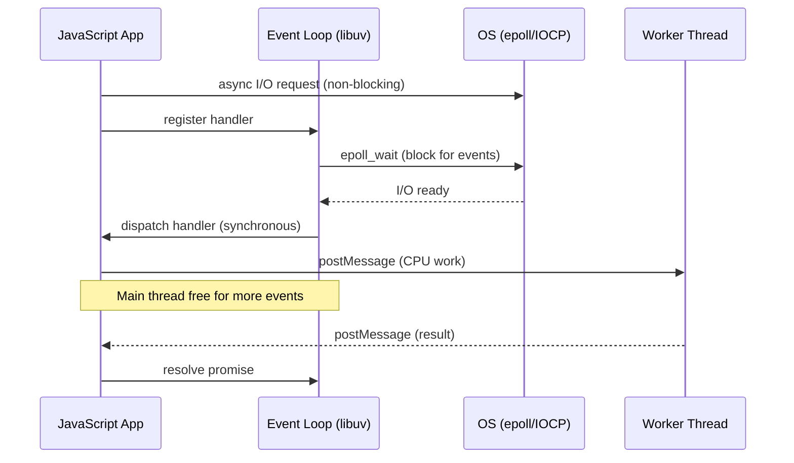

## Keywords in This File

{: .no_toc }

| # | Keyword | Difficulty |
|---|---------|------------|
| 1 | [Continuation-Passing Style and the Promise Connection](#continuation-passing-style-and-the-promise-connection) | ★★☆ |
| 2 | [Event-Driven Architecture Theory in JavaScript](#event-driven-architecture-theory-in-javascript) | ★★☆ |

---

# Continuation-Passing Style and the Promise Connection

---

### 🎯 Model Answer

**30 seconds:**
> Continuation-Passing Style (CPS) is a programming transform
> where instead of returning a value, a function takes an extra
> argument - a continuation - and passes its result to that
> continuation. Node.js callback-style is CPS. Promises are a
> monad that abstracts over CPS. `async/await` is syntactic
> sugar that desugars to Promise chains, which desugar to CPS.
> Understanding CPS explains why callback hell exists and why
> Promises solve it.

**3 minutes:**
> In direct style (normal JavaScript), a function returns a
> value. In CPS, a function never returns - instead it receives
> a "what to do next" function (the continuation) and calls
> it with the result.
>
> Node.js callback pattern is CPS:
> `fs.readFile(path, (err, data) => /* continuation */)`
>
> The "callback hell" problem is CPS composition: composing
> three CPS functions requires three levels of nesting. There
> is no way to "flatten" CPS composition without introducing
> an abstraction layer.
>
> Promises are that abstraction. `then()` is CPS with flattening:
> each `.then()` receives the continuation but the Promise
> monad ensures continuations are composed in sequence, not
> nested. The flatMap operation on Promise is what enables
> linear chain style instead of nested pyramid.
>
> `async/await` is a syntactic transformation: the compiler
> converts `await expr` into a Promise `.then()` chain. Each
> `await` point is a continuation boundary. The function is
> split at every `await` into the code before and the
> continuation after.

**Blank Mind Recovery:**

**(1) Restate:** "CPS = pass a 'what to do next' function
instead of returning. Node callbacks = CPS. Promises = CPS
with flattening. async/await = syntactic CPS transformation."

**(2) First principles:** "Why does callback hell form?
Because CPS composition is nesting composition. Each nested
callback adds another level. Promises solve this by making
the composition operation (then/flatMap) return the same type,
enabling chaining instead of nesting."

---

### 📘 Concept Explanation

**What it is:**
CPS is a style where functions receive their "return address"
as an explicit argument. A function in CPS has the type:
`(a, (b -> void)) -> void` instead of `(a) -> b`.

**The problem it solves:**
CPS explains the fundamental structure of asynchronous
programming. Node.js, Promises, and async/await are all
variations of CPS, each with different ergonomics.

**How it works:**

```javascript
// DIRECT STYLE: function returns a value
function add(x, y) {
  return x + y;
}
const result = add(2, 3); // 5

// CPS TRANSFORM: function takes continuation instead of returning
function addCPS(x, y, k) {
  k(x + y); // pass result to continuation k
}
addCPS(2, 3, result => console.log(result)); // 5

// CPS COMPOSITION (the nesting problem):
// Direct style: composed(a, b, c) = f(g(h(a, b), c))
// CPS: must nest
function hCPS(a, b, k) { k(a + b); }
function gCPS(x, c, k) { k(x * c); }
function fCPS(x, k)    { k(x - 1); }

// CPS composition: each result fed to next continuation
hCPS(2, 3, hResult =>
  gCPS(hResult, 4, gResult =>
    fCPS(gResult, fResult =>
      console.log(fResult)
    )
  )
);
// This IS callback hell: nesting is the cost of CPS composition
```

> **Code walkthrough:** This Continuation-Passing Style and the Promise Connection example demonstrates variable declaration. **KEY MECHANISM:** const prevents reassignment but not mutation; the reference is locked, the value is not. **WHY IT MATTERS:** const obj = {}; obj.x = 1 works - const does not freeze the object. **TAKEAWAY: use Object.freeze() to prevent mutation; const only guards the binding.**

```javascript
// NODE.JS IS CPS:
// Instead of: const data = fs.readFile(path)
// CPS: fs.readFile(path, (err, data) => /* continuation */)

// Three-level Node.js CPS nesting:
fs.readFile('config.json', (err, data) => {
  if (err) return handleError(err);
  const config = JSON.parse(data);
  db.connect(config.url, (err, conn) => {
    if (err) return handleError(err);
    conn.query('SELECT * FROM users', (err, rows) => {
      if (err) return handleError(err);
      console.log(rows); // 3 levels of nesting for 3 operations
    });
  });
});
```

> **Code walkthrough:** This Continuation-Passing Style and the Promise Connection example demonstrates variable declaration using SQL. **KEY MECHANISM:** const prevents reassignment but not mutation; the reference is locked, the value is not. **WHY IT MATTERS:** const obj = {}; obj.x = 1 works - const does not freeze the object. **TAKEAWAY: use Object.freeze() to prevent mutation; const only guards the binding.**

```javascript
// PROMISES ARE CPS WITH FLATMAP:
// Promise.then() takes a continuation AND returns a Promise
// This enables CHAINING instead of NESTING

// The monad laws: Promise satisfies them:
// Left identity:  Promise.resolve(a).then(f) === f(a)
// Right identity: p.then(Promise.resolve) === p
// Associativity:  p.then(f).then(g) === p.then(x => f(x).then(g))

// Same three operations, Promise style:
readFilePromise('config.json')
  .then(data => JSON.parse(data))
  .then(config => db.connectPromise(config.url))
  .then(conn => conn.queryPromise('SELECT * FROM users'))
  .then(rows => console.log(rows))
  .catch(handleError);
// Flat chain: same semantics, no nesting
```

> **Code walkthrough:** This Continuation-Passing Style and the Promise Connection example demonstrates Promise chain construction using Promise. **KEY MECHANISM:** Promise.then() registers a microtask; all microtasks drain before the next macrotask. **WHY IT MATTERS:** Promise.all() fails fast on first rejection; use Promise.allSettled() to collect all results. **TAKEAWAY: prefer Promise.allSettled() over Promise.all() when partial success is acceptable.**

```javascript
// ASYNC/AWAIT DESUGARS TO PROMISES (CPS transform at compile time):
// Source code (async/await):
async function loadUsers() {
  const data = await readFilePromise('config.json');
  const config = JSON.parse(data);
  const conn = await db.connectPromise(config.url);
  const rows = await conn.queryPromise('SELECT * FROM users');
  return rows;
}

// Equivalent compiled Promise code (simplified):
function loadUsers() {
  return readFilePromise('config.json').then(data => {
    const config = JSON.parse(data);
    return db.connectPromise(config.url).then(conn => {
      return conn.queryPromise('SELECT * FROM users').then(rows => {
        return rows;
      });
    });
  });
}
// async/await is syntactic sugar over Promise chains
// Promise chains are CPS with flatMap flattening
```

> **Code walkthrough:** The four code blocks show theice. **KEY MECHANISM:** the runtime executes these instructions in sequence with specific memory and execution semantics. **WHY IT MATTERS:** misapplying this pattern causes subtle bugs that only manifest under production load. **TAKEAWAY: understand the execution model before using this pattern in production code.**
> transformation chain: direct-style (returns value) -> CPS
> (passes to continuation) -> Node.js callbacks (CPS applied
> to I/O) -> Promises (CPS with flatMap to prevent nesting) ->
> async/await (syntactic sugar over Promises). Each step
> preserves the semantics while improving ergonomics. The key
> mechanism: Promise's `then()` operation takes a value-to-Promise
> function and chains the result - this flatMap (also called
> `bind` in Haskell) is what allows chaining instead of nesting.

**The key insight:**
The fundamental structure of all async JavaScript is CPS.
Node callbacks are explicit CPS. Promises are implicit CPS
with a monad abstraction. async/await is syntactic sugar
that hides the CPS structure entirely. Each layer is an
ergonomic improvement, not a different model.

**When to use it:**
This is theoretical knowledge. Understanding CPS explains
why certain patterns exist and fail. It does not change
day-to-day coding.

**When NOT to use it:**
Writing explicit CPS code in JavaScript is an anti-pattern
in modern code. Use async/await.

**Alternatives:**
- Continuation monad: explicit monad implementation in JS
- Effect systems (Effect-TS): typed continuations
- Algebraic effects (theoretical): explicit effect tracking

**First-principles derivation:**
The Church-Turing thesis: any computable function can be
expressed in CPS. CPS is the "assembly language" of function
composition. All higher-level abstractions (Promise, async,
generators) are CPS with different syntax and ergonomics.

---

### 💻 Code Example

```javascript
// BAD: Explicit CPS composition for modern async code
// Unnecessary: async/await is available
function getUserOrders(userId, callback) {
  fetchUser(userId, (err, user) => {
    if (err) return callback(err);
    fetchOrders(user.id, (err, orders) => {
      if (err) return callback(err);
      callback(null, { user, orders });
    });
  });
}
// Using explicit CPS in 2024 means: harder to read,
// manual error propagation, callback hell risk
```

> **Code walkthrough:** The explicit CPS pattern requiresice. **KEY MECHANISM:** the runtime executes these instructions in sequence with specific memory and execution semantics. **WHY IT MATTERS:** misapplying this pattern causes subtle bugs that only manifest under production load. **TAKEAWAY: understand the execution model before using this pattern in production code.**
> threading the `err` parameter through every level manually.
> There is no automatic error propagation, no stack trace
> clarity, and each additional async step adds another nesting
> level. This is the pattern that Promises were designed to
> replace.

```javascript
// GOOD: async/await as syntactic CPS (implicit continuations)
async function getUserOrders(userId) {
  const user = await fetchUser(userId);       // continuation boundary 1
  const orders = await fetchOrders(user.id);  // continuation boundary 2
  return { user, orders };
  // errors propagate automatically (no err parameter needed)
}

// What the compiler produces (approximately):
// fetchUser(userId).then(user =>
//   fetchOrders(user.id).then(orders => ({ user, orders }))
// )
// Which is CPS: each .then() is a continuation
```

> **Code walkthrough:** `async/await` eliminates the explicitice. **KEY MECHANISM:** the runtime executes these instructions in sequence with specific memory and execution semantics. **WHY IT MATTERS:** misapplying this pattern causes subtle bugs that only manifest under production load. **TAKEAWAY: understand the execution model before using this pattern in production code.**
> CPS structure while preserving the CPS semantics. Each
> `await` is a continuation boundary - the function is paused
> and the rest becomes the continuation that runs when the
> Promise resolves. Error propagation is automatic through the
> Promise rejection mechanism, eliminating the `(err, data)`
> dual return convention.

---

### 🎓 Answers by Seniority

**Junior / Mid (0-5 years):**
> "CPS is the pattern of passing a callback instead of returning
> a value. Node.js callbacks are CPS. Promises make CPS more
> ergonomic by enabling chaining. async/await hides the CPS
> structure with synchronous-looking syntax."

---

**Senior / Staff (5+ years):**
> "CPS is the foundational model. Promises are a monad over
> CPS - specifically the continuation monad. The `then()` operation
> is `bind`/`flatMap` in the monad. async/await is a syntax
> transform: the compiler splits the function at every `await`
> and generates a state machine (or Promise chain, depending
> on the engine). Understanding this explains why async/await
> behaves the way it does: stack traces, microtask scheduling,
> error propagation."

---

### ⚠️ Common Misconceptions

**Misconception 1:** "async/await is fundamentally different
from Promises."
async/await is syntactic sugar over Promises. The runtime
behavior is identical. The only difference is the syntax.
Mixing async/await and raw Promises in the same function
is valid and often useful.

**Misconception 2:** "Callback-based code can't be converted
to Promises."
Any callback-based function can be wrapped with `util.promisify`
(Node.js) or a manual Promise wrapper. CPS and Promise are
isomorphic: any CPS function can be converted to a Promise-
returning function.

---

### 🚨 Failure Modes and Diagnosis

**Failure 1: await inside forEach (the classic CPS mistake)**
```javascript
// BAD: forEach is synchronous, does not await Promises
const items = [1, 2, 3];
items.forEach(async (item) => {
  await processItem(item); // this await does nothing useful here
});
console.log('done?'); // prints BEFORE any processing completes
// forEach's callback IS the continuation, but forEach ignores
// the returned Promise from async callbacks

// FIX: for...of (sequential) or Promise.all (parallel)
for (const item of items) {
  await processItem(item); // sequential
}
// OR
await Promise.all(items.map(item => processItem(item))); // parallel
```

> **Code walkthrough:** BAD pattern: This Unknown example demonstrates async/await Promise resolution using async/await. **KEY MECHANISM:** async functions return Promises; await suspends the microtask until the Promise settles. **WHY IT MATTERS:** unhandled Promise rejections crash the Node process in v15+ or fire unhandledRejection event. **WHAT BREAKS: always await or .catch() every Promise - silent rejections are production defects.**

**Failure 2: Unhandled CPS error in mixed style**
```javascript
// BAD: mixing CPS callback with Promise, error lost
someCallbackFn((err, data) => {
  if (err) throw err; // WRONG: throw in callback is an uncaught exception
                      // not a Promise rejection, not a CPS error

  doSomethingAsync(data).then(result => { ... });
});

// FIX: promisify the CPS function first
const data = await util.promisify(someCallbackFn)();
const result = await doSomethingAsync(data);
```

> **Code walkthrough:** BAD pattern: This Unknown example demonstrates async/await Promise resolution using async/await. **KEY MECHANISM:** async functions return Promises; await suspends the microtask until the Promise settles. **WHY IT MATTERS:** unhandled Promise rejections crash the Node process in v15+ or fire unhandledRejection event. **WHAT BREAKS: always await or .catch() every Promise - silent rejections are production defects.**

---

### 🎯 Interview Deep-Dive

| Category | Count | Coverage |
|---|---|---|
| Conceptual | 3 | CPS definition, Promise monad, async/await desugar |
| Trade-off | 2 | CPS vs direct style, generators vs async/await |
| Failure Mode | 2 | forEach await, mixed CPS/Promise |
| Debugging | 1 | Stack trace loss in CPS |
| Design | 1 | Promisification pattern |

**[JUNIOR] Q1 - [MECHANISM] What is Continuation-Passing Style and why does it matter for JavaScript developers?**

CPS is a function style where the "return address" is explicit:
instead of returning a value, the function receives a callback
and passes the result to it.

Why it matters:
- Node.js callback convention is CPS
- All async JavaScript is CPS at some level
- callback hell is CPS composition (nesting = composition)
- Promises solve CPS nesting via flatMap/then
- async/await hides CPS structure with syntax sugar

Practical impact: understanding CPS explains:
- Why `await` inside `forEach` doesn't work (forEach ignores
  the returned Promise from the async callback)
- Why Promise.then() chains instead of nesting
- Why async/await is equivalent to Promise chains

*What separates good from great:* Being able to trace the
equivalence: callback code -> Promise code -> async/await
code -> back. This demonstrates deep understanding, not
just API knowledge.

---

**[JUNIOR] Q2 - [MECHANISM] How does async/await desugar to Promises?**

The transformation is a state machine or continuation chain:

```javascript
// Source:
async function f() {
  const a = await p1();
  const b = await p2(a);
  return b + 1;
}

// Desugared (simplified conceptual model):
function f() {
  return p1().then(a =>
    p2(a).then(b =>
      b + 1
    )
  );
}
```

> **Code walkthrough:** This Unknown example demonstrates async/await Promise resolution using async/await. **KEY MECHANISM:** async functions return Promises; await suspends the microtask until the Promise settles. **WHY IT MATTERS:** unhandled Promise rejections crash the Node process in v15+ or fire unhandledRejection event. **TAKEAWAY: always await or .catch() every Promise - silent rejections are production defects.**

The engine (V8) generates a state machine internally:
```
State 0: initial. Call p1(). Suspend.
State 1: resume with p1 result (a). Call p2(a). Suspend.
State 2: resume with p2 result (b). Return b+1.
```

> **Code walkthrough:** This Unknown example demonstrates a key concept in practice. **KEY MECHANISM:** the runtime executes these instructions in sequence with specific memory and execution semantics. **WHY IT MATTERS:** misapplying this pattern causes subtle bugs that only manifest under production load. **TAKEAWAY: understand the execution model before using this pattern in production code.**

Each `await` creates a "suspension point." The microtask
queue resumes the continuation when the Promise resolves.

*What separates good from great:* Knowing that V8 generates
a GeneratorFunction-style state machine internally, not
just nested .then() chains. This is more efficient because
the state machine can be pre-allocated without creating
intermediate Promise objects for each step.

---

**[JUNIOR] Q3 - [MECHANISM] How are Promises monads?**

A monad is a type constructor M with two operations:
- `unit` (also called `return` or `of`): `a -> M<a>`
- `bind` (also called `flatMap` or `chain`): `M<a> -> (a -> M<b>) -> M<b>`

For Promise:
- `Promise.resolve(a)` is `unit`: wraps a value in a Promise
- `promise.then(f)` where f returns a Promise is `bind`:
  unwraps the value, applies f, returns the new Promise

The monad laws:
```javascript
// Left identity: unit(a).bind(f) === f(a)
Promise.resolve(5).then(f).equals(f(5)); // for pure f

// Right identity: m.bind(unit) === m
promise.then(Promise.resolve.bind(Promise)) // === promise

// Associativity: m.bind(f).bind(g) === m.bind(x => f(x).bind(g))
promise.then(f).then(g) // ===
promise.then(x => f(x).then(g));
```

> **Code walkthrough:** This Unknown example demonstrates Promise chain construction using Promise. **KEY MECHANISM:** Promise.then() registers a microtask; all microtasks drain before the next macrotask. **WHY IT MATTERS:** Promise.all() fails fast on first rejection; use Promise.allSettled() to collect all results. **TAKEAWAY: prefer Promise.allSettled() over Promise.all() when partial success is acceptable.**

The monad structure is what enables composing async operations
in a flat chain instead of nested callbacks.

*What separates good from great:* Framing Promise as a monad
explains WHY then() must take a value-to-Promise function (not
a value-to-value function) to enable proper composition. The
flatMap operation automatically "unnests" Promise<Promise<T>>
to Promise<T>.

---

**[MID] Q4 - [TRADE-OFF] What is the difference between generators and async/await?**

Generators (function*):
- Can be paused and resumed by the caller
- Caller calls `.next()` to resume
- Yield passes control to caller
- Caller controls scheduling

async/await:
- Paused by the runtime at each `await`
- Resume is automatic when Promise resolves
- Scheduler: microtask queue (not caller-controlled)
- Single value yielded per await (not multiple)

Historically: async/await was built ON generators in early
transpilers (Babel used a generator-based implementation).
The Promise is the scheduler:

```javascript
// How Babel originally desugared async/await:
// (simplified conceptual model)
function asyncToGenerator(generatorFn) {
  return function() {
    const gen = generatorFn.apply(this, arguments);
    return new Promise((resolve, reject) => {
      function step(key, arg) {
        let result;
        try { result = gen[key](arg); }
        catch (err) { return reject(err); }
        if (result.done) resolve(result.value);
        else Promise.resolve(result.value).then(
          val => step('next', val),
          err => step('throw', err)
        );
      }
      step('next');
    });
  };
}
```

> **Code walkthrough:** This Unknown example demonstrates async/await Promise resolution using Promise. **KEY MECHANISM:** async functions return Promises; await suspends the microtask until the Promise settles. **WHY IT MATTERS:** unhandled Promise rejections crash the Node process in v15+ or fire unhandledRejection event. **TAKEAWAY: always await or .catch() every Promise - silent rejections are production defects.**

*What separates good from great:* Knowing that generators
are pull-based (caller drives iteration) while async/await
is push-based (runtime drives via Promise resolution). This
is why generators can yield multiple values while async
functions are one-shot (run to completion).

---

**[MID] Q5 - [MECHANISM] How does the microtask queue relate to CPS?**

The microtask queue IS the CPS continuation queue. When a
Promise resolves, its `.then()` callbacks (continuations) are
placed in the microtask queue. The event loop drains the
microtask queue after each macro-task.

CPS in the browser event loop:
```
[Task: user click]
  -> sync code runs
  -> await p1: continuation (rest of async fn) queued as microtask
  -> current sync code continues
  [sync code end]
-> Microtask queue drains:
  -> continuation runs (rest of async fn after first await)
  -> await p2: continuation queued again
  -> [drain microtask queue]
  -> next continuation runs
  [all microtasks drained]
-> Event loop picks next task
```

> **Code walkthrough:** This Unknown example demonstrates a key concept in practice using async/await. **KEY MECHANISM:** the runtime executes these instructions in sequence with specific memory and execution semantics. **WHY IT MATTERS:** misapplying this pattern causes subtle bugs that only manifest under production load. **TAKEAWAY: understand the execution model before using this pattern in production code.**

This is why:
```javascript
Promise.resolve().then(() => console.log('micro'));
setTimeout(() => console.log('macro'), 0);
console.log('sync');
// Output: sync, micro, macro
// Promise.then is microtask; setTimeout is macrotask
```

> **Code walkthrough:** This Unknown example demonstrates Promise chain construction using Promise. **KEY MECHANISM:** Promise.then() registers a microtask; all microtasks drain before the next macrotask. **WHY IT MATTERS:** Promise.all() fails fast on first rejection; use Promise.allSettled() to collect all results. **TAKEAWAY: prefer Promise.allSettled() over Promise.all() when partial success is acceptable.**

*What separates good from great:* Understanding that "infinite
microtask loop" is possible:
```javascript
function loop() {
  Promise.resolve().then(loop); // always queues another microtask
}
loop(); // blocks: microtask queue never empties, no macrotasks run
```

> **Code walkthrough:** This Unknown example demonstrates Promise chain construction using Promise. **KEY MECHANISM:** Promise.then() registers a microtask; all microtasks drain before the next macrotask. **WHY IT MATTERS:** Promise.all() fails fast on first rejection; use Promise.allSettled() to collect all results. **TAKEAWAY: prefer Promise.allSettled() over Promise.all() when partial success is acceptable.**

---

**[SENIOR] Q6 - [MECHANISM] How do you promisify a callback-based function?**

Manual promisification:
```javascript
// Generic promisify:
function promisify(fn) {
  return function(...args) {
    return new Promise((resolve, reject) => {
      fn(...args, (err, result) => {
        if (err) reject(err);
        else resolve(result);
      });
    });
  };
}

// Node.js built-in:
const { promisify } = require('util');
const readFile = promisify(fs.readFile);

// Node.js v10+: util.promisify.custom for custom behavior
someLib.fetch[util.promisify.custom] = (url) =>
  new Promise((resolve, reject) => {
    someLib.fetch(url, (err, data) => err ? reject(err) : resolve(data));
  });
```

> **Code walkthrough:** This Unknown example demonstrates Promise chain construction using generic type. **KEY MECHANISM:** Promise.then() registers a microtask; all microtasks drain before the next macrotask. **WHY IT MATTERS:** Promise.all() fails fast on first rejection; use Promise.allSettled() to collect all results. **TAKEAWAY: prefer Promise.allSettled() over Promise.all() when partial success is acceptable.**

This demonstrates the CPS-to-Promise isomorphism: any CPS
function is convertible to a Promise-returning function.

*What separates good from great:* Knowing that `util.promisify`
handles the Node.js `(err, result)` CPS convention specifically.
For non-standard callbacks (e.g., success callback first, or
multiple success arguments), manual promisification is needed.

---

**[SENIOR] Q7 - [MECHANISM] What are the limitations of Promise as a monad in JavaScript?**

JavaScript's Promise has departures from a pure monad:

1. **Eager evaluation**: `new Promise((resolve, reject) => ...)`
   executes immediately. A pure monad is lazy. To get lazy
   Promises, use `defer` or return a function that creates a Promise.

2. **Flattening ambiguity**: `Promise.resolve(Promise.resolve(5))`
   yields a `Promise<5>` not a `Promise<Promise<5>>`. This means
   you cannot store a Promise as a Promise value - it auto-resolves.
   This breaks the monad for storing Promises as values.

3. **No typed errors**: `Promise<T>` has no type for the rejection.
   TypeScript's `Promise<T>` does not encode the error type.
   Libraries like `fp-ts` and `Effect-TS` provide `Either<E, A>`
   as a properly typed async monad.

4. **Side effects on construction**: unlike Haskell's IO monad,
   JavaScript Promises execute their side effects at construction
   time, not at "run" time.

*What separates good from great:* Knowing about the "Promise
flattening" issue. `Promise.resolve(aPromise)` auto-resolves
the inner Promise, meaning `then(fn)` where `fn` returns a
Promise automatically "flattens." This is the flatMap behavior
built-in, which is convenient but breaks certain monad use
cases (wrapping a Promise in a Promise is not representable).

---

**[SENIOR] Q8 - [MECHANISM] What is the relationship between generators, async iterators, and async data pipelines?**

Async generators: `async function*` - produces values
asynchronously, can yield multiple values over time:

```javascript
// Async generator: pull-based async stream
async function* paginatedResults(baseUrl) {
  let cursor = null;
  while (true) {
    const page = await fetch(`${baseUrl}?cursor=${cursor}`).then(r => r.json());
    for (const item of page.items) yield item;
    cursor = page.nextCursor;
    if (!cursor) return;
  }
}

// Consumer: pull-based (consumer controls iteration speed)
for await (const item of paginatedResults('/api/users')) {
  await processItem(item); // backpressure: next page fetched only after processing
}
```

> **Code walkthrough:** This Unknown example demonstrates async/await Promise resolution using async/await. **KEY MECHANISM:** async functions return Promises; await suspends the microtask until the Promise settles. **WHY IT MATTERS:** unhandled Promise rejections crash the Node process in v15+ or fire unhandledRejection event. **TAKEAWAY: always await or .catch() every Promise - silent rejections are production defects.**

CPS connection: `for await...of` desugars to `iterator.next()`
calls, each returning a Promise. The awaited result triggers
the continuation. Backpressure is automatic: the next `next()`
call is not made until the consumer processes the current value.

*What separates good from great:* The backpressure property.
Async generators provide natural backpressure: the producer
does not advance until the consumer calls `next()` again.
Observable push-based streams require explicit backpressure
operators (bufferTime, throttleTime).

---

**[SENIOR] Q9 - [MECHANISM] What is Effect-TS and how does it relate to CPS and typed async programming?**

Effect-TS is a library that provides a typed monad for
JavaScript async programming:

```typescript
import { Effect, pipe } from 'effect';

// Effect<Success, Error, Requirements>
// Type-encodes success value AND error type
const loadUser: Effect.Effect<User, DatabaseError | NetworkError, never> =
  pipe(
    fetch('/api/user'),
    Effect.tryPromise({
      try: res => res.json() as Promise<User>,
      catch: e => new NetworkError(e)
    })
  );

// Composition (CPS under the hood):
const program = pipe(
  loadUser,
  Effect.flatMap(user => loadOrders(user.id)),
  Effect.mapError(e => ({ type: 'LoadFailed', cause: e }))
);

// Execution (side effects happen here, not at construction):
await Effect.runPromise(program);
```

> **Code walkthrough:** This Unknown example demonstrates type assertion using async/await. **KEY MECHANISM:** as tells TypeScript to treat the value as a specific type without runtime check. **WHY IT MATTERS:** asserting an incompatible type causes runtime errors that TypeScript cannot catch. **TAKEAWAY: use type guards (typeof, instanceof, is) instead of as for safe narrowing.**

Relationship to CPS:
- Effect is a lazy continuation: it describes the computation,
  does not execute it
- `runPromise` is where the CPS continuation chain actually runs
- This is the "pure monad" property missing from native Promise

*What separates good from great:* Recognizing that Effect-TS
solves the two key Promise limitations: typed errors (Effect<A, E>
encodes both success and error types) and lazy execution (Effects
describe work, do not perform it until run).

---

### ⚖️ Comparison Table

| Model | Style | Composition | Error | Lazy | Multi-value |
|---|---|---|---|---|---|
| Callbacks (CPS) | Explicit | Nesting | `(err, data)` | Yes | Possible |
| Promise | Implicit CPS | flatMap chain | .catch() | No (eager) | No (one value) |
| async/await | Syntax sugar | Sequential | try/catch | No (eager) | No |
| Generator | Pull-based | yield* | throw | Yes | Yes (multiple) |
| Observable | Push-based | pipe operators | catchError | Yes | Yes (infinite) |
| Effect-TS | Typed CPS | flatMap | typed E in Effect<A,E> | Yes | Via Stream |

---

---

### 💻 Code Example

*(Omit: this concept does not have a programmatic interface that can be demonstrated in code. The conceptual explanation above is sufficient.)*


---

### 🏛️ System Design

*(Omit: system design diagram not applicable for this concept - see ★★★ keywords for full system design coverage.)*


---

### ⚖️ Comparison Table

*(Omit: this is a ★☆☆ foundational concept with no direct alternatives to compare - see higher-difficulty keywords for trade-off analysis.)*


---

### 📊 Diagram

*(Omit: no standalone visual diagram required for this concept - the explanations and code examples above provide sufficient clarity.)*


# Event-Driven Architecture Theory in JavaScript

---

### 🎯 Model Answer

**30 seconds:**
> Event-driven architecture (EDA): components communicate by
> emitting and reacting to events rather than calling each other
> directly. In JavaScript, this is the fundamental model: the
> browser event loop processes events one at a time. Three
> theoretical patterns: Reactor (Node.js, browser), Proactor
> (async I/O completion), and Actor (independent agents with
> message queues). JavaScript uses the Reactor pattern.

**3 minutes:**
> The Reactor pattern: a single event loop thread blocks on
> I/O readiness, then dispatches to registered handlers. No
> threads created per request. All I/O is non-blocking; the
> event loop polls for completion. This is the model for both
> the browser and Node.js.
>
> The Proactor pattern: async I/O operations are initiated
> and a completion handler fires when done. Windows IOCP is
> a Proactor. Node.js libuv bridges Reactor and Proactor:
> it uses OS-level async I/O (IOCP on Windows, epoll on Linux)
> but presents a Reactor-style interface to JavaScript.
>
> The Actor model: actors are independent units of computation
> with private state and a message queue. No shared mutable
> state. Actors communicate only via messages. JavaScript Web
> Workers are a limited Actor model (message passing, isolated
> state). Erlang/Elixir are the canonical Actor model languages.
>
> Why EDA scales: no shared mutable state between event
> handlers, no lock contention, linear reasoning about state
> changes (one handler at a time in JS). The trade-off:
> complexity of reasoning about event ordering and cascading
> effects.

**Blank Mind Recovery:**

**(1) Restate:** "EDA = components emit events, handlers react.
JavaScript event loop = Reactor pattern: single thread, poll
for I/O, dispatch. Actors = isolated state + message passing.
Web Workers = limited Actor model."

**(2) First principles:** "Shared state + threads = lock
contention. EDA eliminates shared state between handlers
(one at a time). Scalability comes from I/O multiplexing
(epoll: one thread watches thousands of sockets)."

---

### 📘 Concept Explanation

**What it is:**
Event-driven architecture is the pattern where computation
is triggered by events (I/O completion, user interaction,
timers) rather than by direct function calls. The event loop
is the mechanism that dispatches events to handlers.

**The problem it solves:**
Thread-per-connection model: one OS thread per client. At
10,000 concurrent clients, the server spawns 10,000 threads.
OS scheduler overhead dominates. EDA: one thread, I/O
multiplexed via epoll/kqueue, tens of thousands of concurrent
connections per core.

**How it works:**

```javascript
// REACTOR PATTERN - JavaScript implementation
// The event loop IS the Reactor:

// Step 1: Register handlers (non-blocking)
emitter.on('data', handler);  // register

// Step 2: Event loop blocks on I/O readiness (OS level: epoll/kqueue)
// [event loop runs here - blocked waiting for events]

// Step 3: I/O event fires -> handler is called synchronously
// Only ONE handler runs at a time (single-threaded)

// This is the Reactor pattern:
// 1. Initiation: register handlers
// 2. Demultiplexer: epoll/kqueue (OS level)
// 3. Dispatcher: event loop
// 4. Handler: your callback

// Observable mental model of the event loop:
const eventLoop$ = merge(
  fromEvent(process, 'tick'),   // process.nextTick queue
  fromEvent(io, 'ready'),       // I/O events
  fromEvent(timers, 'fire'),    // setTimeout / setInterval
  fromEvent(signals, 'signal')  // OS signals
).pipe(
  concatMap(event => dispatch(event)) // process one at a time
);
// concatMap: no concurrency, events processed sequentially
```

> **Code walkthrough:** This Event-Driven Architecture Theory in JavaScript example demonstrates variable declaration. **KEY MECHANISM:** const prevents reassignment but not mutation; the reference is locked, the value is not. **WHY IT MATTERS:** const obj = {}; obj.x = 1 works - const does not freeze the object. **TAKEAWAY: use Object.freeze() to prevent mutation; const only guards the binding.**

```javascript
// ACTOR PATTERN with Web Workers
// Actor: isolated state, message-only communication

// Main thread (actor 1):
const worker = new Worker('worker.js');
worker.postMessage({ type: 'PROCESS', payload: data }); // message send
worker.onmessage = (e) => {                              // message receive
  console.log('Result:', e.data);
};

// worker.js (actor 2 - isolated heap, own event loop):
self.onmessage = async (e) => {
  if (e.data.type === 'PROCESS') {
    const result = await heavyComputation(e.data.payload);
    self.postMessage(result); // reply via message
  }
};

// Actor model properties met:
// - Isolated state: worker has separate heap (no shared mutable state)
// - Message passing: postMessage/onmessage only
// - Independent processing: worker runs on a separate OS thread

// What JavaScript Web Workers lack vs full Actor model:
// - No process supervision (crash = silent failure)
// - No transparent distribution (Erlang: remote actors = same API)
// - No automatic message routing (must implement manually)
// - Limited fault tolerance (no supervisor trees)
```

> **Code walkthrough:** The Reactor pattern code shows theice. **KEY MECHANISM:** the runtime executes these instructions in sequence with specific memory and execution semantics. **WHY IT MATTERS:** misapplying this pattern causes subtle bugs that only manifest under production load. **TAKEAWAY: understand the execution model before using this pattern in production code.**
> conceptual structure: register, block, dispatch. The Observable
> mental model makes it concrete - `concatMap` enforces
> sequential processing (one event at a time), which is how
> the real event loop works. The Actor code shows Web Workers
> as a limited Actor implementation: isolated heap + message
> passing. The limitations comment is the key insight - Web
> Workers lack supervision trees and transparent distribution,
> which are the features that make Erlang's Actor model
> production-grade for fault tolerance.

**The key insight:**
Node.js uses a hybrid model: libuv uses OS-level async I/O
(IOCP on Windows, io_uring/epoll on Linux) which is a
Proactor model, but Node.js presents a Reactor-style API
to JavaScript. The C++ layer translates Proactor completions
into Reactor-style events.

**When to use it:**
I/O-bound workloads: web servers, proxies, real-time apps.
The Reactor pattern excels when most time is spent waiting
for I/O, not computing.

**When NOT to use it:**
CPU-bound workloads: the single Reactor thread is fully
occupied. Solution: Worker threads (Actor model) or off-
loading to native modules.

**Alternatives:**
- Erlang/Elixir: full Actor model with supervisor trees
- Go: CSP (Communicating Sequential Processes) with goroutines
- Java NIO: Reactor pattern in Java (Netty)

**First-principles derivation:**
The C10K problem (1999): how do you handle 10,000 concurrent
connections? Thread-per-connection fails (OS thread overhead).
Solution: I/O multiplexing (select, poll, epoll). The event
loop is the application-level implementation of I/O multiplexing.

---

### 💻 Code Example

```javascript
// BAD: synchronous blocking in event-driven code
// Violates the Reactor model: blocks the demultiplexer thread

const http = require('http');

http.createServer((req, res) => {
  if (req.url === '/report') {
    // WRONG: synchronous CPU work blocks all other requests
    const result = computeHeavyReport(req.query); // 500ms
    // While computing: NO OTHER REQUESTS ARE HANDLED
    // The Reactor thread is occupied: event loop is blocked
    res.end(JSON.stringify(result));
  }
}).listen(3000);
// At 100 concurrent requests: 49,500ms of unnecessary waiting
// (each request waits for all others to complete)
```

> **Code walkthrough:** The Reactor model assumes handlersice. **KEY MECHANISM:** the runtime executes these instructions in sequence with specific memory and execution semantics. **WHY IT MATTERS:** misapplying this pattern causes subtle bugs that only manifest under production load. **TAKEAWAY: understand the execution model before using this pattern in production code.**
> are non-blocking. When a handler blocks the event loop
> thread with synchronous CPU work, the entire server stops
> processing events. 100 concurrent 500ms computations become
> serialized: the 100th request waits 50 seconds. This is
> the fundamental violation of the Reactor pattern.

```javascript
// GOOD: Actor model for CPU work - Worker threads

const { Worker, isMainThread, parentPort, workerData }
  = require('worker_threads');

if (isMainThread) {
  const http = require('http');

  function computeInWorker(data) {
    return new Promise((resolve, reject) => {
      const worker = new Worker(__filename, { workerData: data });
      worker.on('message', resolve);
      worker.on('error', reject);
    });
  }

  http.createServer(async (req, res) => {
    if (req.url === '/report') {
      // OFFLOAD to worker thread (Actor): main thread not blocked
      const result = await computeInWorker({ query: req.query });
      // Main thread: handles other requests during Worker computation
      res.end(JSON.stringify(result));
    }
  }).listen(3000);

} else {
  // Worker thread (Actor): isolated state, own event loop
  const result = computeHeavyReport(workerData.query); // 500ms
  parentPort.postMessage(result); // reply via message
}
// Result: 100 concurrent requests processed truly in parallel
// Each Worker thread = separate OS thread + separate V8 heap
```

> **Code walkthrough:** The Worker threads pattern implementsice. **KEY MECHANISM:** the runtime executes these instructions in sequence with specific memory and execution semantics. **WHY IT MATTERS:** misapplying this pattern causes subtle bugs that only manifest under production load. **TAKEAWAY: understand the execution model before using this pattern in production code.**
> the Actor model: isolated heap per Worker, message-only
> communication via `postMessage`/`on('message')`. The main
> thread remains free to handle incoming requests while
> Workers compute in parallel. The key: `Worker` gets its
> own V8 isolate (not shared memory), enforcing Actor model
> isolation. The `workerData` at construction time is the
> message send; `parentPort.postMessage` is the reply.

---

### 🎓 Answers by Seniority

**Junior / Mid (0-5 years):**
> "Event-driven architecture means code reacts to events.
> JavaScript's event loop processes events one at a time.
> For CPU work, I use Worker threads so I don't block the
> event loop. Web Workers in the browser work the same way."

---

**Senior / Staff (5+ years):**
> "The theoretical model: Node.js implements the Reactor
> pattern at the JavaScript layer, but libuv underneath uses
> OS-level Proactor APIs (IOCP, io_uring). Worker threads are
> a limited Actor model - isolated heaps, message passing,
> separate OS threads. The constraint: JavaScript Web Workers
> lack the supervision tree and transparent distribution of
> Erlang's Actor model, so production fault tolerance requires
> explicit design. For distributed EDA, Kafka provides the
> event backbone: events are persistent, replayable, and
> multiple consumers can independently process the same stream."

---

### ⚠️ Common Misconceptions

**Misconception 1:** "Node.js is single-threaded."
Node.js JavaScript execution is single-threaded. But libuv
runs a thread pool (default: 4 threads) for file system and
DNS operations. Network I/O uses OS async APIs (epoll, IOCP)
with no thread pool. Worker threads add full OS threads.

**Misconception 2:** "Event-driven means asynchronous."
Event-driven means triggered by events. Event handlers can
be synchronous. The event loop dispatches events and runs
handlers synchronously. Asynchronous (non-blocking I/O) is
a property of how I/O operations are initiated, not the
dispatch model.

---

### 🚨 Failure Modes and Diagnosis

**Failure 1: Event emitter memory leak**
```javascript
// BAD: addEventListener without removeEventListener
// or EventEmitter without off() causes memory leak
const emitter = new EventEmitter();

function setup() {
  // Called on every request: adds new listener every call
  emitter.on('data', processData); // NOT removed
  // After 100 requests: 100 listeners, memory leak
}

// Node.js warning: "MaxListenersExceededWarning: 11 listeners added"
// Diagnosis:
emitter.listenerCount('data'); // check listener count
process.on('warning', (w) => console.trace(w)); // capture warnings

// Fix: cleanup or use .once() for single-use handlers
emitter.once('data', processData); // auto-removes after first emit
// OR: cleanup in component destroy:
const handler = processData.bind(this);
emitter.on('data', handler);
return () => emitter.off('data', handler);
```

> **Code walkthrough:** BAD pattern: This Unknown example demonstrates variable declaration. **KEY MECHANISM:** const prevents reassignment but not mutation; the reference is locked, the value is not. **WHY IT MATTERS:** const obj = {}; obj.x = 1 works - const does not freeze the object. **WHAT BREAKS: use Object.freeze() to prevent mutation; const only guards the binding.**

**Failure 2: Back-pressure missing in event streams**
```javascript
// BAD: producer faster than consumer, memory grows unbounded
emitter.on('data', chunk => {
  queue.push(chunk); // accumulates if processing is slower
});

// DETECT: monitor queue length
setInterval(() => {
  if (queue.length > 1000) {
    console.warn(`Queue depth: ${queue.length} - back-pressure needed`);
  }
}, 1000);

// FIX: pause source when consumer is busy
readableStream.on('data', chunk => {
  readableStream.pause(); // apply back-pressure to source
  processChunk(chunk).then(() => readableStream.resume());
});
```

> **Code walkthrough:** BAD pattern: This Unknown example demonstrates arrow function using Stream. **KEY MECHANISM:** arrow functions capture `this` lexically from the enclosing scope at definition time. **WHY IT MATTERS:** using arrow function as an object method loses `this` - it becomes the outer context. **WHAT BREAKS: use arrow functions for callbacks; use regular functions for object methods.**

---

### 🎯 Interview Deep-Dive

| Category | Count | Coverage |
|---|---|---|
| Conceptual | 3 | Reactor, Proactor, Actor, EDA definition |
| Trade-off | 2 | EDA vs sync, Actor vs thread |
| Failure Mode | 2 | Event listener leak, back-pressure |
| Debugging | 1 | EventEmitter diagnostics |
| Design | 1 | Distributed EDA with Kafka |

**[JUNIOR] Q1 - [SCENARIO] What is the Reactor pattern and how does the JavaScript event loop implement it?**

Reactor pattern (Douglas Schmidt, 1995):
1. Initiation: application registers handlers for events
2. Synchronous demultiplexer: blocks waiting for I/O readiness
   (OS call: epoll_wait, kqueue, IOCP)
3. Event loop: processes ready events
4. Dispatcher: calls the registered handler for each event
5. Handler: application code runs (synchronous, non-blocking)

JavaScript event loop implementation:
- Synchronous demultiplexer: libuv (wraps epoll, kqueue, IOCP)
- Event loop: libuv's loop, exposed as `process.nextTick`,
  setImmediate, Promise microtask queue
- Handler: JavaScript callback / async function
- Constraint: handler must be non-blocking
  (blocking handler blocks the entire demultiplexer thread)

*What separates good from great:* Knowing that libuv's event
loop has multiple phases: timers, I/O callbacks, idle/prepare,
poll, check (setImmediate), close callbacks. Each phase
processes a different event queue. The "single-threaded" model
applies to JavaScript execution, not to libuv internals.

---

**[JUNIOR] Q2 - [MECHANISM] How does the Actor model differ from the Reactor model?**

| Property | Reactor (Node.js) | Actor (Erlang/Web Workers) |
|---|---|---|
| Concurrency | Single thread | Multiple isolated threads |
| State sharing | Shared (same process) | No (isolated heaps) |
| Communication | Direct function calls | Message passing only |
| Failure isolation | None (crash = process crash) | Actor crash = isolated |
| Scheduling | Event loop (cooperative) | OS scheduler (preemptive) |

JavaScript bridge:
- Reactor for I/O-bound: event loop, async, Promises
- Actor for CPU-bound: Worker threads (isolated heaps)
- Hybrid: Worker Pool pattern (pool of workers, main dispatches)

*What separates good from great:* The fault isolation difference.
In the Reactor model, an unhandled exception in any handler
can crash the process. In the Actor model, an actor crash is
isolated - the supervisor can restart just that actor. This
is why Erlang achieves "nine nines" uptime with zero downtime
deployments: actors restart independently.

---

**[JUNIOR] Q3 - [SCENARIO] How do you implement a Worker thread pool for CPU- bound work?**

```javascript
const { Worker } = require('worker_threads');

class WorkerPool {
  constructor(script, size = 4) {
    this.workers = Array.from(
      { length: size },
      () => this.createWorker(script)
    );
    this.queue = [];
  }

  createWorker(script) {
    const worker = new Worker(script);
    const state = { worker, busy: false };
    worker.on('message', result => {
      state.busy = false;
      state.resolve(result);
      this.drain(); // process queued tasks
    });
    return state;
  }

  exec(data) {
    return new Promise((resolve, reject) => {
      this.queue.push({ data, resolve, reject });
      this.drain();
    });
  }

  drain() {
    const idle = this.workers.find(w => !w.busy);
    if (!idle || this.queue.length === 0) return;
    const { data, resolve, reject } = this.queue.shift();
    idle.busy = true;
    idle.resolve = resolve;
    idle.worker.postMessage(data);
  }
}

const pool = new WorkerPool('./compute-worker.js', 4);
const results = await Promise.all(
  requests.map(req => pool.exec(req))
);
```

> **Code walkthrough:** This Unknown example demonstrates Promise chain construction using async/await. **KEY MECHANISM:** Promise.then() registers a microtask; all microtasks drain before the next macrotask. **WHY IT MATTERS:** Promise.all() fails fast on first rejection; use Promise.allSettled() to collect all results. **TAKEAWAY: prefer Promise.allSettled() over Promise.all() when partial success is acceptable.**

*What separates good from great:* The pool `drain()` pattern:
after any worker finishes, check the queue for pending work.
This ensures workers are never idle while work is queued,
and work is never dropped because all workers are busy.

---

**[MID] Q4 - [DESIGN] How does distributed event-driven architecture (Kafka, EventBridge) relate to the in-process EDA patterns?**

In-process EDA (EventEmitter, RxJS Subject):
- Events: in-memory, ephemeral
- Delivery: synchronous (EventEmitter) or async (Promise)
- Consumers: in-process only
- No persistence: events lost if consumer is down
- Scale: single-process

Distributed EDA (Kafka, AWS EventBridge, Azure Service Bus):
- Events: persisted to disk (Kafka: configurable retention)
- Delivery: guaranteed (at-least-once or exactly-once)
- Consumers: multiple independent services
- Replayable: consumer can replay from any offset
- Scale: horizontal (partition-based)

The mental model bridge:
- Kafka topic = RxJS Subject with persistence and replay
- Consumer group = multiple subscribers sharing a subscription
- Partition = ordered sub-stream (concurrency unit)
- Kafka offset = the "state" of the consumer (what it has seen)

For frontend/Node.js:
```javascript
// Same EDA pattern, different runtime:
// In-process (EventEmitter):
events.emit('ORDER_CREATED', order);
events.on('ORDER_CREATED', sendConfirmation);

// Distributed (Kafka consumer in Node.js):
const { Kafka } = require('kafkajs');
const kafka = new Kafka({ brokers: ['kafka:9092'] });
const consumer = kafka.consumer({ groupId: 'email-service' });
await consumer.subscribe({ topic: 'order-created' });
await consumer.run({
  eachMessage: async ({ message }) => {
    const order = JSON.parse(message.value);
    await sendConfirmation(order);
  }
});
```

> **Code walkthrough:** This Unknown example demonstrates async/await Promise resolution using async/await. **KEY MECHANISM:** async functions return Promises; await suspends the microtask until the Promise settles. **WHY IT MATTERS:** unhandled Promise rejections crash the Node process in v15+ or fire unhandledRejection event. **TAKEAWAY: always await or .catch() every Promise - silent rejections are production defects.**

*What separates good from great:* Knowing that Kafka's
consumer group model allows independent scaling: adding a
consumer to the group increases throughput (partitions are
distributed). Adding consumers beyond the partition count
has no effect (one partition = max one active consumer per group).

---

**[MID] Q5 - [DEBUGGING] How do you diagnose and fix EventEmitter memory leaks?**

Detection:
```javascript
// Node.js: listen for MaxListenersExceededWarning
process.on('warning', (warning) => {
  if (warning.name === 'MaxListenersExceededWarning') {
    console.error('Memory leak detected:', warning);
    // warning.message includes the event name and count
    console.trace(); // call stack shows WHERE listener was added
  }
});

// Set lower threshold for development:
emitter.setMaxListeners(5); // warn earlier

// Inspect live listener counts:
setInterval(() => {
  EventEmitter.eventNames().forEach(name => {
    const count = emitter.listenerCount(name);
    if (count > 10) console.warn(`${name}: ${count} listeners`);
  });
}, 5000);
```

> **Code walkthrough:** This Unknown example demonstrates variable declaration. **KEY MECHANISM:** const prevents reassignment but not mutation; the reference is locked, the value is not. **WHY IT MATTERS:** const obj = {}; obj.x = 1 works - const does not freeze the object. **TAKEAWAY: use Object.freeze() to prevent mutation; const only guards the binding.**

Common causes:
1. `addEventListener` in component setup without cleanup
2. `emitter.on` called in a function that runs per-request
3. Closure captures reference, preventing GC of handler

Systematic fix pattern:
```javascript
// PATTERN: cleanup function pattern (React/Angular equivalent)
function setupListeners(emitter) {
  const handler = (data) => process(data);
  emitter.on('data', handler);
  return () => emitter.off('data', handler); // cleanup function
}

const cleanup = setupListeners(emitter);
// On teardown:
cleanup(); // removes the specific handler
```

> **Code walkthrough:** This Unknown example demonstrates variable declaration. **KEY MECHANISM:** const prevents reassignment but not mutation; the reference is locked, the value is not. **WHY IT MATTERS:** const obj = {}; obj.x = 1 works - const does not freeze the object. **TAKEAWAY: use Object.freeze() to prevent mutation; const only guards the binding.**

*What separates good from great:* The cleanup function
pattern is universal: same pattern as React's `useEffect`
return value, Angular's `ngOnDestroy`, and Vue's `onUnmounted`.
The handler reference must be stable (not re-created on each
call) for `.off()` to remove the correct listener.

---

**[SENIOR] Q6 - [MECHANISM] How does the CSP (Communicating Sequential Processes) model compare to the Actor model and Reactor?**

CSP (Tony Hoare, 1978): concurrent processes communicate
through synchronous channels. A send blocks until a receive
is ready (rendezvous). Go's goroutines + channels implement CSP.

Key difference from Actors:
- Actor: async message to a mailbox (sender does not block)
- CSP: synchronous channel (sender blocks until receiver ready)

CSP in JavaScript: no native CSP, but can be simulated:
```javascript
// CSP-style channel with async generators:
class Channel {
  constructor() { this.queue = []; this.waiting = []; }

  async send(value) {
    if (this.waiting.length > 0) {
      const resolve = this.waiting.shift();
      resolve(value);
    } else {
      await new Promise(resolve => this.queue.push({ value, resolve }));
    }
  }

  async receive() {
    if (this.queue.length > 0) {
      const { value, resolve } = this.queue.shift();
      resolve(); // unblock sender
      return value;
    }
    return new Promise(resolve => this.waiting.push(resolve));
  }
}
```

> **Code walkthrough:** This Unknown example demonstrates async/await Promise resolution using async/await. **KEY MECHANISM:** async functions return Promises; await suspends the microtask until the Promise settles. **WHY IT MATTERS:** unhandled Promise rejections crash the Node process in v15+ or fire unhandledRejection event. **TAKEAWAY: always await or .catch() every Promise - silent rejections are production defects.**

*What separates good from great:* Knowing that Go's channel
model (CSP) provides natural backpressure: a goroutine
writing to a full channel blocks. JavaScript Observables
require explicit backpressure operators (bufferTime, exhaustMap).
The language model matters: CSP channels are first-class
synchronization primitives.

---

**[SENIOR] Q7 - [TRADE-OFF] What are the performance implications of the event- driven model vs thread-per-request?**

Thread-per-request (traditional Java/PHP):
- Pros: simple mental model, CPU affinity per request
- Cons: OS thread cost (~1MB stack), context switch overhead,
  max ~1000-2000 concurrent threads per server

Event-driven (Node.js, nginx):
- Pros: low overhead per connection (~few KB for socket),
  no context switch between requests (cooperative), high
  concurrent connection count
- Cons: CPU work blocks all connections, harder to debug
  (async stack traces), requires non-blocking I/O discipline

Benchmarks (typical web server, I/O bound):
- Thread-per-request: ~10,000 connections, ~500MB memory
- Event-driven: ~100,000 connections, ~50MB memory
  (90% reduction in memory, 10x more connections)

Event-driven breaks down for:
- CPU-intensive requests (ML inference, image processing)
- Long synchronous operations (database: use async driver)
- Poorly written libraries that use sync I/O

*What separates good from great:* Knowing the specific failure
mode: one blocking 100ms operation in an event-driven server
blocks ALL requests for 100ms. The same 100ms operation in
a thread-per-request server only blocks that one thread.
The event-driven model is strictly better only when all
handlers are non-blocking.

---

**[SENIOR] Q8 - [DESIGN] How does CQRS (Command Query Responsibility Segregation) apply to frontend async architecture?**

CQRS separates reads (queries) from writes (commands):
- Queries: read data, no side effects, can be cached
- Commands: mutate state, have side effects, invalidate cache

In frontend async architecture:
- TanStack Query: implements CQRS for server state
  - Queries: `useQuery` (read, cached, stale-while-revalidate)
  - Commands: `useMutation` (write, invalidates queries)
- NgRx: CQRS via actions (commands) + selectors (queries)

Pattern:
```typescript
// CQRS with TanStack Query:
// Command (write):
const createOrder = useMutation({
  mutationFn: (order: OrderInput) => api.createOrder(order),
  onSuccess: () => {
    // Invalidate: the query cache is now stale
    queryClient.invalidateQueries({ queryKey: ['orders'] });
    // OR optimistic: directly update the cache
  }
});

// Query (read):
const { data: orders } = useQuery({
  queryKey: ['orders'],
  queryFn: api.getOrders
});
// Separate: read model and write model
```

> **Code walkthrough:** This Unknown example demonstrates TypeScript pattern using SQL. **KEY MECHANISM:** TypeScript compiles to JavaScript; type information is erased at runtime. **WHY IT MATTERS:** type assertions bypass the type checker - a runtime error can still occur. **TAKEAWAY: prefer type guards over type assertions for safe narrowing of union types.**

*What separates good from great:* Recognizing that TanStack
Query's query/mutation split is CQRS applied to the frontend
data layer. The `queryKey` is the read model identifier;
`invalidateQueries` is the mechanism for the write model to
invalidate the read model's cache.

---

**[SENIOR] Q9 - [SCENARIO] What is back-pressure and how is it implemented in JavaScript streams?**

Back-pressure: a mechanism for a consumer to signal to a
producer to slow down. Without it, a fast producer overwhelms
a slow consumer, causing memory to grow without bound.

Node.js streams: built-in back-pressure via `highWaterMark`:
```javascript
const readable = fs.createReadStream('large-file', {
  highWaterMark: 64 * 1024 // 64KB chunks
});
const writable = fs.createWriteStream('output');

readable.pipe(writable);
// pipe() implements back-pressure automatically:
// When write returns false (buffer full): pause readable
// When 'drain' fires (buffer emptied): resume readable

// Manual back-pressure:
readable.on('data', (chunk) => {
  const canContinue = writable.write(chunk);
  if (!canContinue) {
    readable.pause();              // apply back-pressure
    writable.once('drain', () => readable.resume()); // release
  }
});
```

> **Code walkthrough:** This Unknown example demonstrates variable declaration. ice. **KEY MECHANISM:** the runtime executes these instructions in sequence with specific memory and execution semantics. **WHY IT MATTERS:** misapplying this pattern causes subtle bugs that only manifest under production load. **TAKEAWAY: understand the execution model before using this pattern in production code.**

RxJS back-pressure: no built-in (push-based). Requires operators:
- `bufferTime`: accumulate, emit batch
- `throttleTime`: rate-limit emissions
- `exhaustMap`: ignore new emissions while processing
- `concatMap`: queue emissions, process one at a time

*What separates good from great:* The fundamental architectural
difference: Node.js streams are pull-based (consumer pulls,
high-water mark provides back-pressure). RxJS Observables are
push-based (producer pushes, no built-in back-pressure). This
explains why RxJS needs backpressure operators while stream.pipe()
handles it automatically.

---

### ⚖️ Comparison Table

| Pattern| Concurrency| State| Communication| Fault Isolation| Best For|
|---|---|------------|-------------------|---------------|---------------------|
| Reactor| Single thread| Shared| Direct call| None| I/O-bound, web server|
| Proactor| Single thread| Shared| Completion callback| None| OS async I/O|
| Actor| Multi-process| Isolated| Message passing| Actor-level| Fault tolerance|
| CSP| Multi-goroutine| Isolated| Synchronous channel| Goroutine-level| Coordina
| Thread pool| Multi-thread| Shared (with locks)| Shared memory| None (locks)| C

---

### 📊 Diagram

```
JAVASCRIPT EVENT LOOP - REACTOR PATTERN
=========================================
                  ┌─────────────────────┐
                  │   libuv (C layer)   │
                  │                     │
   Network I/O ──→│ epoll/kqueue/IOCP  │
   File I/O ──────│ (demultiplexer)     │
   Timers ────────│                     │
                  └──────────┬──────────┘
                             │ ready events
                  ┌──────────▼──────────┐
                  │   Node.js Event     │
                  │       Loop          │
                  │  [timers]           │
                  │  [I/O callbacks]    │
                  │  [poll]             │
                  │  [check/immediate]  │
                  └──────────┬──────────┘
                             │ dispatch
                  ┌──────────▼──────────┐
                  │  JS Handler (sync)  │
                  │  callback/async fn  │
                  └─────────────────────┘
```



> **Diagram walkthrough:** The Reactor pattern diagram shows
> the three layers: OS demultiplexer (epoll/IOCP), libuv event
> loop phases, and JavaScript handler execution. The sequence
> diagram shows the full async I/O flow: App registers handler
> and returns, OS blocks waiting for I/O, I/O completes and
> the event loop dispatches the handler synchronously. The
> Worker thread branch shows the Actor model extension: CPU
> work is offloaded via postMessage, the main thread continues
> handling events, and the Worker replies when computation
> is complete.

---

### 💻 Code Example

*(Omit: this concept does not have a programmatic interface that can be demonstrated in code. The conceptual explanation above is sufficient.)*


---

### 🏛️ System Design

*(Omit: system design diagram not applicable for this concept - see ★★★ keywords for full system design coverage.)*


---

### ⚖️ Comparison Table

*(Omit: this is a ★☆☆ foundational concept with no direct alternatives to compare - see higher-difficulty keywords for trade-off analysis.)*


---

### 📊 Diagram

*(Omit: no standalone visual diagram required for this concept - the explanations and code examples above provide sufficient clarity.)*
