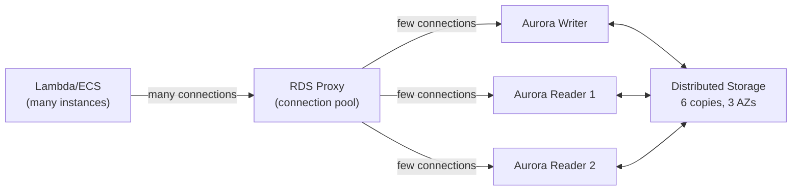
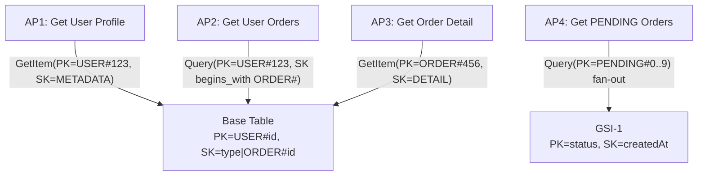

## Keywords in This File
{: .no_toc }

| # | Keyword | Weight |
|---|---------|--------|
| 10 | [RDS and Aurora](#rds-and-aurora) | ★★☆ |
| 11 | [DynamoDB Data Modeling](#dynamodb-data-modeling) | ★★☆ |

---

# RDS and Aurora

**Interview Weight:** ★★☆ - Relational databases on AWS.
RDS manages PostgreSQL, MySQL, Oracle, and SQL Server.
Aurora is AWS's cloud-native engine (PostgreSQL/MySQL
compatible): 6-copy distributed storage, auto-scale to
128TB, faster failover. Understanding RDS vs Aurora,
Multi-AZ vs Read Replicas, and connection pooling at
Lambda/ECS scale is expected for any AWS backend engineer.

---

### 🎯 Model Answer

**30 seconds:**

> RDS manages relational databases without managing EC2.
> Aurora is AWS's cloud-native engine: distributed storage
> (6 copies across 3 AZs), auto-scales to 128TB, 3-5x
> faster, 30-second failover. Multi-AZ = synchronous
> standby for HA (not readable, auto-failover ~30s).
> Read Replicas = asynchronous copies for read scaling
> (up to 15 for Aurora). At Lambda scale: use RDS Proxy
> to prevent connection exhaustion.

**3 minutes:**

> RDS vs Aurora:
>
> RDS: managed service. Your existing PostgreSQL/MySQL
> workload with AWS managing backups, patching, Multi-AZ.
> Storage: EBS (you provision, max 64TB). Failover: 60-120s.
>
> Aurora: custom AWS storage. 6 copies across 3 AZs,
> auto-grows in 10GB increments to 128TB. Write acknowledged
> after 4/6 copies confirm. All replicas share same
> storage volume (< 10ms lag vs RDS replicas' binary log
> lag). Failover: ~30s.
>
> Aurora costs ~20% more per instance but better reliability
> and performance. For new production workloads: Aurora.
> For existing: assess migration cost vs benefit.
>
> Multi-AZ vs Read Replicas:
>
> Multi-AZ: synchronous standby in another AZ. NOT readable.
> Purpose: HA only. On primary failure: DNS update to
> standby (~30s). Same cost as primary (billed continuously).
>
> Read Replicas: asynchronous, readable copies.
> Purpose: read scaling. Lag: < 1s typically.
> Can be promoted to standalone DB for DR.
>
> Connection management: RDS max_connections is determined
> by instance RAM. db.t3.medium: ~200. Lambda at 1,000
> concurrent: 1,000 connections. Solution: RDS Proxy
> (pools Lambda/ECS connections, maintains fewer to RDS).

**Blank Mind Recovery:**

**(1) Aurora vs RDS:** "Aurora = 6-copy storage, auto-scale,
faster failover. RDS = managed standard engines."

**(2) Multi-AZ vs Replica:** "Multi-AZ = HA standby
(not readable). Read Replica = read scaling (async)."

**(3) Connection pooling:** "RDS Proxy for Lambda/ECS.
Prevents connection exhaustion at scale."

---

### 📘 Concept Explanation

**Aurora Storage Architecture:**

```
Aurora Writer (Primary):
  Writes to distributed storage layer

Distributed Storage (6 copies, 3 AZs):
  AZ-1: [Copy 1][Copy 2]
  AZ-2: [Copy 3][Copy 4]
  AZ-3: [Copy 5][Copy 6]
  Write acknowledged: 4 of 6 copies confirm
  Read quorum: 3 of 6
  Survives: 1 full AZ loss + 1 extra copy failure

Aurora Readers (up to 15):
  All share the SAME storage layer
  Replica lag: typically < 10ms
  (No binary log streaming - shared storage pages)

vs RDS Multi-AZ:
  Primary: EBS volume in AZ-1
  Standby: EBS volume in AZ-2
  Replication: binary log streaming (synchronous)
  Failover: 60-120s (standby must catch up + DNS update)

Cluster Endpoints:
  Writer endpoint -> always routes to current primary
  (DNS updated after failover automatically)
  Reader endpoint -> any healthy replica (round-robin)
```

---

### 💻 Code Example

```java
// BAD: Lambda opening new connection per invocation
public class OrderHandler
    implements RequestHandler<SQSEvent, Void> {
    @Override
    public Void handleRequest(SQSEvent event, Context c) {
        // 1000 concurrent Lambdas = 1000 connections
        // RDS db.t3.medium max_connections ~200
        // Result: connection errors under load
        try (Connection conn = DriverManager.getConnection(
                System.getenv("RDS_HOST"),
                "app_user", "password")) {
            // process
        }
        return null;
    }
}
```

```java
// GOOD: Static pool + RDS Proxy endpoint
// RDS Proxy multiplexes ~1000 Lambda connections
// to ~50 Aurora connections
public class OrderHandler
    implements RequestHandler<SQSEvent, Void> {

    // One DataSource per Lambda execution environment
    // Initialized on cold start, reused when warm
    private static final DataSource DS = buildPool();

    private static DataSource buildPool() {
        HikariConfig cfg = new HikariConfig();
        // Use RDS Proxy endpoint (not RDS cluster endpoint):
        cfg.setJdbcUrl("jdbc:postgresql://"
            + System.getenv("RDS_PROXY_HOST")
            + ":5432/mydb");
        cfg.setUsername("app_user");
        // IAM token (no static password):
        cfg.setPassword(generateIamAuthToken(
            System.getenv("RDS_PROXY_HOST"),
            System.getenv("AWS_REGION")
        ));
        cfg.setMaximumPoolSize(1); // 1 per Lambda env
        cfg.setConnectionTimeout(3000);
        return new HikariDataSource(cfg);
    }

    @Override
    public Void handleRequest(SQSEvent event, Context c) {
        try (Connection conn = DS.getConnection()) {
            // Reuses existing connection from pool
            // RDS Proxy handles actual Aurora connectivity
        }
        return null;
    }
}
```

```bash
# Create Aurora PostgreSQL Serverless v2 (scales 0.5-64 ACUs):
aws rds create-db-cluster \
  --db-cluster-identifier prod-aurora \
  --engine aurora-postgresql \
  --engine-version 15.4 \
  --master-username postgres \
  --manage-master-user-password \
  --serverlessv2-scaling-configuration \
    MinCapacity=0.5,MaxCapacity=64 \
  --vpc-security-group-ids sg-db \
  --db-subnet-group-name prod-subnet-group \
  --storage-encrypted \
  --enable-iam-database-authentication

# Add serverless writer instance:
aws rds create-db-instance \
  --db-instance-identifier prod-aurora-writer \
  --db-cluster-identifier prod-aurora \
  --db-instance-class db.serverless \
  --engine aurora-postgresql

# Create RDS Proxy (multiplexes connections):
aws rds create-db-proxy \
  --db-proxy-name prod-proxy \
  --engine-family POSTGRESQL \
  --auth '[{"AuthScheme":"SECRETS",
    "SecretArn":"arn:aws:secretsmanager:...",
    "IAMAuth":"ENABLED"}]' \
  --role-arn arn:aws:iam::...:role/RDSProxyRole \
  --vpc-subnet-ids subnet-a subnet-b subnet-c
```

> **Code walkthrough:** The BAD pattern creates a new
> database TCP connection per Lambda invocation: 1,000
> concurrent Lambdas = 1,000 simultaneous connections,
> exceeding RDS max_connections (200 for db.t3.medium).
> The GOOD pattern initializes HikariCP in a static field
> (once per cold start, reused for warm invocations) with
> MaximumPoolSize=1 (correct: each Lambda environment
> is single-threaded). The connection goes to RDS Proxy,
> which pools Lambda connections and multiplexes them
> into far fewer actual Aurora connections. IAM token
> authentication replaces static passwords: the role
> generates a short-lived token, eliminating password
> rotation. Aurora Serverless v2 scales ACUs every 15
> seconds, making it the right choice for variable
> Lambda workloads.

---

### 🎓 Answers by Seniority

**Junior / Mid:**

> "RDS manages relational databases without managing EC2.
> Aurora is the better AWS-native option with automatic
> storage scaling and faster failover. Multi-AZ keeps a
> synchronous standby for automatic failover. Read Replicas
> are asynchronous copies for read scaling. For Lambda
> or ECS with many concurrent instances, I use RDS Proxy
> to pool connections and prevent hitting RDS connection
> limits."

**Senior / Staff:**

> "Aurora's storage architecture is fundamentally different
> from RDS. The distributed storage layer has 6 copies
> across 3 AZs with write acknowledged after 4/6 confirm.
> All replicas share the same storage - replica lag is
> < 10ms because there's no log streaming, just shared
> storage pages. This allows 15 readers (vs 5 for RDS)
> and 30-second failover (vs 60-120s for RDS).
>
> Connection management is the operationally critical
> difference for Lambda workloads. RDS max_connections is
> `(RAM_GB * 1000 / 10)` approximately. At Lambda scale
> (1,000 concurrency), you need RDS Proxy: it maintains
> a smaller pool to Aurora while handling a large number
> of Lambda connections. IAM auth + no stored password
> removes credential rotation risk.
>
> Aurora Serverless v2 is the right default for variable
> traffic: scales every 15 seconds, always warm (unlike
> v1 which paused), and Global Database replicates to
> another region in < 1 second for active-active or DR."

---

### ⚠️ Common Misconceptions

**Misconception: "Multi-AZ and Read Replicas both improve
read performance AND availability."**

Multi-AZ is for availability only. The standby is NOT
readable during normal operation. It exists solely to
take over if the primary fails. Adding Multi-AZ does
nothing for read performance - you are paying for an
instance that handles zero queries in normal operation.

Read Replicas are for read scaling only. Because
replication is asynchronous, a replica may be slightly
behind the primary. Writing to the primary and immediately
reading from a replica can return stale data (replication
lag). For read-after-write consistency: read from the
primary writer endpoint.

For both HA and read scaling: Aurora Multi-AZ cluster
with multiple readers - each reader is both a failover
target and a read scaling endpoint.

---

### 🚨 Failure Modes and Diagnosis

**Failure: Aurora failover takes 5+ minutes instead
of expected 30 seconds**

*Symptom:* Primary DB instance failed. Application down
for several minutes. Aurora advertises ~30s failover.

*Root cause candidates:*

1. Application connects to instance endpoint (IP-based)
   instead of cluster endpoint. After failover, the
   cluster endpoint DNS updates to point to the new
   primary. Instance endpoint does not change.

2. Connection pool holds stale connections without
   detecting they are dead. Pool does not retry
   against new primary.

3. Client DNS TTL too long (caching old primary IP
   past the failover window).

*Detection and fix:*
```bash
# Check which endpoint app is using:
# CORRECT: uses cluster endpoint (DNS updates after failover)
# jdbc:postgresql://prod-aurora.cluster-xxx.us-east-1.rds.amazonaws.com

# WRONG: uses instance endpoint (fixed to old primary)
# jdbc:postgresql://prod-aurora-instance-1.xxx.us-east-1.rds.amazonaws.com

# After failover: verify new writer:
aws rds describe-db-clusters \
  --db-cluster-identifier prod-aurora \
  --query 'DBClusters[0].DBClusterMembers[?IsClusterWriter]
    .DBInstanceIdentifier | [0]'

# HikariCP settings to detect dead connections faster:
# keepaliveTime = 30000 (ping every 30s)
# connectionTimeout = 3000 (fail fast on new connections)
# initializationFailTimeout = -1 (allow startup before DB ready)
```

*Fix:* Use cluster endpoint for the writer. Enable
HikariCP `keepaliveTime`. Handle transient connection
errors with retry logic at the application level.

---

### 🎯 Interview Deep-Dive

| Category | Count | Coverage |
|---|---|---|
| Conceptual | 2 | Aurora storage, read replicas, RDS Proxy |
| Trade-off | 2 | RDS vs Aurora, connection pooling strategies |
| Failure Mode | 2 | Failover connection errors, slow writes under load |
| Debugging | 1 | Aurora Performance Insights workflow |
| Behavioral | 2 | Reducing failover impact, Aurora Global Database |

**Q1. What is the architectural difference between RDS Multi-AZ
and Aurora storage, and why does it matter for failover?**

RDS Multi-AZ:
- Single primary EBS volume, synchronous replication to standby EBS
  in another AZ via storage block-level replication
- Standby is a cold replica: reads not served, no queries
- Failover: DNS endpoint updated to standby IP. Applications must
  reconnect. Failover time: 60-120 seconds.

Aurora storage architecture:
- Distributed storage across 6 copies in 3 AZs (2 copies/AZ)
- No standby copy: the storage IS multi-AZ by design
- Read replicas share the same storage (near-zero replica lag)
- Writer and readers use the same underlying data (no replication lag)
- Failover: reader promoted to writer. DNS update takes ~30 seconds.

Key difference:
```
RDS Multi-AZ failover:
  Old primary (dead) -> wait 60-120s -> New primary (from standby)
  Application: connections drop, reconnect required

Aurora failover:
  Writer fails -> existing reader promoted (has same storage)
  No data sync needed (storage already shared)
  Application: connection errors for ~30s during DNS propagation
```

*What separates good from great:* Aurora's shared storage means
there is no data synchronization step during failover. The reader
already has access to all writes. RDS Multi-AZ must wait for
binlog replay on the standby before it can serve writes. This is
why Aurora's failover is 2-4x faster.

---

**Q2. What is the difference between Aurora read replicas and
RDS read replicas, and when does the difference matter?**

RDS Read Replicas:
- Physical replication: binlog/WAL shipped from primary to replica
- Replication lag: typically seconds, can be minutes under write load
- Each replica has its OWN storage copy
- Max 5 replicas for MySQL, 5 for PostgreSQL

Aurora Read Replicas:
- Shared storage: replica reads from the SAME storage as writer
- Replication lag: < 10ms (just the page cache refresh, not data)
- No storage duplication: all replicas share the same 6-copy volume
- Max 15 replicas
- Replica promotion to writer: ~30 seconds (already has the data)

When the difference matters:
1. **Real-time read-after-write**: Aurora's < 10ms lag allows
   reading immediately after writes with near-consistency.
   RDS replica at 30-second lag = stale reads for 30 seconds.

2. **Analytics queries**: running slow analytical queries on RDS
   replicas still consumes network bandwidth (binlog replication).
   Aurora replicas add zero replication overhead (shared storage).

3. **Failover speed**: Aurora replica becomes writer in 30 seconds.
   RDS replica promotion can take minutes.

*What separates good from great:* Knowing that Aurora replica lag
< 10ms is a physical constraint of the shared storage design, not
a tunable parameter. With RDS, you can reduce lag by increasing
replica server capacity. With Aurora, there is nothing to tune -
the architecture guarantees near-zero lag by design.

---

**Q3. How does RDS Proxy reduce connection pressure from Lambda
functions and what are its limitations?**

The Lambda-RDS connection problem:
```
Lambda: scales to 1000 concurrent executions in seconds
Each execution: opens a DB connection
RDS PostgreSQL: max_connections = ~4000 (for db.r5.large)

1000 Lambdas * 3 connection attempts = 3000 connections
Connection pool exhausted -> Lambda functions timeout
RDS CPU spikes on connection handling (not queries)
```

RDS Proxy solution:
```
Lambda -> RDS Proxy (connection pool) -> RDS

Proxy maintains: 20 persistent DB connections
Lambda connections: pooled and multiplexed
1000 Lambda executions: share 20 proxy connections
RDS: sees 20 connections, not 1000
```

Configuration:
```hcl
resource "aws_db_proxy" "main" {
  name                   = "my-proxy"
  debug_logging          = false
  engine_family          = "POSTGRESQL"
  idle_client_timeout    = 1800
  require_tls            = true
  role_arn               = aws_iam_role.rds_proxy.arn
  vpc_security_group_ids = [aws_security_group.proxy.id]
  vpc_subnet_ids         = var.private_subnet_ids
  auth {
    auth_scheme = "SECRETS"  # Uses Secrets Manager
    iam_auth    = "REQUIRED" # Lambda uses IAM, not password
    secret_arn  = aws_secretsmanager_secret.db.arn
  }
}
```

Limitations:
- RDS Proxy adds ~3-5ms latency per query
- Does not work with all PostgreSQL features (prepared statements
  pinning: certain features pin the connection, preventing sharing)
- Costs: $0.015/vCPU-hour for the proxy fleet

*What separates good from great:* The pinning behavior. PostgreSQL
prepared statements and set_config() calls cause the proxy to pin
a specific connection to the Lambda execution (cannot share). High
pinning rates eliminate the pooling benefit. Check the proxy
`DatabaseConnectionsCurrentlySessionPinned` metric.

---

**Q4. DEBUGGING: Aurora writes become slow under load but CPU
is not high. How do you diagnose?**

```bash
# Step 1: Check Aurora Performance Insights:
# Console: RDS -> Performance Insights -> your cluster
# OR CLI:
aws pi get-resource-metrics \
  --service-type RDS \
  --identifier db-XXXX \
  --metric-queries '[{"Metric":"db.load.avg",
    "GroupBy":{"Group":"db.wait_event","Limit":5}}]' \
  --start-time 2024-01-01T10:00:00 \
  --end-time 2024-01-01T11:00:00

# Top wait events reveal the bottleneck:
# io/file/innodb/innodb_log_file -> InnoDB redo log writes
# WALWriteLock -> PostgreSQL WAL (commit slow = redo log I/O)
# LockManager -> Lock contention between transactions
# io/aurora_redo_log_flush -> Aurora-specific log flush wait

# Step 2: Aurora-specific: check WriteLatency:
aws cloudwatch get-metric-statistics \
  --namespace AWS/RDS \
  --metric-name WriteLatency \
  --dimensions Name=DBClusterIdentifier,Value=prod-cluster
# WriteLatency > 20ms during heavy writes = storage bottleneck

# Step 3: Check commit latency:
# High commits/second with low WriteLatency = normal
# High commits/second with high WriteLatency = redo log contention
# Fix: batch commits (group_commit), reduce autocommit frequency

# Step 4: Check InnoDB buffer pool hit rate (MySQL/Aurora MySQL):
SELECT (1 - Innodb_buffer_pool_reads/Innodb_buffer_pool_read_requests)
       * 100 AS hit_rate
FROM information_schema.global_status WHERE variable_name IN
  ('Innodb_buffer_pool_reads', 'Innodb_buffer_pool_read_requests');
# < 99%: buffer pool too small, disk I/O is the bottleneck
```

*What separates good from great:* Performance Insights wait event
analysis. CPU not high + slow writes = I/O or lock bottleneck.
Performance Insights shows the exact wait event (WALWriteLock,
LockManager, or I/O wait) without needing to enable slow query
logging or SSH into the instance.

---

**Q5. What is a parameter group in RDS and how do you modify
one safely for production?**

Parameter groups: RDS/Aurora configuration settings. Equivalent
to `postgresql.conf` or `my.cnf`, but managed via AWS.

```bash
# View current parameter group:
aws rds describe-db-instances \
  --db-instance-identifier prod-db \
  --query 'DBInstances[0].DBParameterGroups'

# Create a custom parameter group (never modify default):
aws rds create-db-parameter-group \
  --db-parameter-group-name prod-pg15-custom \
  --db-parameter-group-family postgres15 \
  --description "Production PostgreSQL 15 custom settings"

# Modify parameters:
aws rds modify-db-parameter-group \
  --db-parameter-group-name prod-pg15-custom \
  --parameters ParameterName=shared_buffers,ParameterValue=2GB,\
ApplyMethod=pending-reboot  # static: requires reboot
# OR:
ParameterName=log_min_duration_statement,ParameterValue=1000,
ApplyMethod=immediate  # dynamic: applies without reboot
```

Key parameters for production:
- `shared_buffers`: 25% of instance RAM (PostgreSQL buffer pool)
- `max_connections`: set based on instance size (too high = OOM)
- `log_min_duration_statement`: enable slow query logging (1000ms)
- `work_mem`: memory per sort/hash operation per connection
- `rds.force_ssl`: enforce TLS connections (set to 1)

Safe modification workflow:
1. Create custom parameter group from existing
2. Apply to staging, validate 24 hours
3. Apply to production non-peak window
4. Static parameters require maintenance window + reboot

*What separates good from great:* The `pending-reboot` vs `immediate`
distinction. Static parameters take effect only after a DB reboot
(scheduled maintenance window). Applying a static parameter in
a "modification" without a reboot leaves the old value in effect
with no error message - the change appears applied but is not active.

---

**Q6. TRADE-OFF: RDS PostgreSQL vs Aurora PostgreSQL. When
does RDS make more sense than Aurora?**

Choose RDS PostgreSQL when:
1. **PostgreSQL version compatibility**: RDS typically supports
   new major versions faster than Aurora. If you need PostgreSQL 16
   features on day one: check version availability.
2. **Extensions**: some PostgreSQL extensions are not supported on
   Aurora (e.g., `pg_partman`, certain foreign data wrappers).
   Check Aurora extension compatibility list.
3. **Cost at small scale**: Aurora has a minimum storage billing
   ($10/month baseline). RDS single-AZ can be cheaper for dev/test.
4. **Multi-cloud portability**: RDS uses standard PostgreSQL;
   Aurora has proprietary storage. If you plan to migrate off AWS,
   RDS is closer to self-hosted PostgreSQL behavior.
5. **Performance characteristics**: for write-heavy workloads at
   moderate scale (< 100GB), RDS and Aurora perform similarly.
   Aurora's advantage is most visible at high read scale (15 replicas)
   and large storage (> 1TB).

Choose Aurora when:
- High read scale: 15 read replicas vs RDS's 5
- Fast failover required (30s vs 60-120s)
- Storage > 100GB (Aurora auto-scales storage, RDS requires
  `storage_autoscaling`)
- Multi-master or Global Database needed

*What separates good from great:* The extension compatibility check.
Teams that assume "Aurora is compatible with PostgreSQL" migrate
to Aurora and discover that a critical extension (`pgaudit`,
`timescaledb`, `pg_repack`) behaves differently or is unsupported.
Audit extensions before migrating.

---

**Q7. How do you implement connection pooling for Aurora at
scale and what are the architectural options?**

Connection pooling options (smallest to largest scale):

**Application-level pooling (HikariCP, pgBouncer in-process):**
```yaml
spring.datasource.hikari:
  maximum-pool-size: 20
  minimum-idle: 5
  connection-timeout: 30000
  keepalive-time: 30000  # prevents Aurora TCP timeout
  max-lifetime: 1800000  # 30 min: shorter than Aurora 8-hour limit
```
Works for: single application instance. Multiplexes app threads
(hundreds) to DB connections (20).

**PgBouncer sidecar (per pod):**
- Transaction-level pooling: connection returned to pool after
  each transaction (allows 10x oversubscription)
- Application connects to localhost:5432 (PgBouncer)
- PgBouncer maintains 20 connections to Aurora
- 1 pod: 20 connections. 50 pods: 1000 connections. Problem.

**RDS Proxy (fleet-level pooling):**
- One proxy handles all pods in the cluster
- 50 pods * 20 HikariCP connections = 1000 connections to proxy
- Proxy maintains 20-50 connections to Aurora writer
- Best for Lambda (serverless) and ECS/EKS at high scale

*What separates good from great:* Knowing the right pooling layer
for the deployment model. Lambda: always use RDS Proxy (no persistent
process = no in-process pool). Long-running ECS: HikariCP sufficient
for moderate scale (< 10 pods). Kubernetes at 100+ pods: RDS Proxy
or dedicated PgBouncer deployment.

---

**Q8. What is Aurora Global Database and how does it differ
from cross-region read replicas?**

Aurora cross-region read replica (older pattern):
- Binlog replication across regions (similar to RDS replication)
- Replication lag: seconds to minutes
- Replica is in another region, different cluster
- Promotion to writer: manual, minutes of downtime

Aurora Global Database (current):
- Storage-level replication between regions
- Replication lag: typically < 1 second (measured at storage layer)
- Primary region: read-write cluster
- Secondary regions: up to 5, read-only clusters with near-zero lag
- Failover: promote secondary to writer in < 1 minute

```hcl
resource "aws_rds_global_cluster" "main" {
  global_cluster_identifier = "my-global-cluster"
  engine                    = "aurora-postgresql"
  engine_version            = "15.4"
  storage_encrypted         = true
}

# Primary region cluster:
resource "aws_rds_cluster" "primary" {
  global_cluster_identifier = aws_rds_global_cluster.main.id
  engine                    = "aurora-postgresql"
  # ... writer endpoint is the primary
}

# Secondary region cluster (different region provider):
resource "aws_rds_cluster" "secondary" {
  global_cluster_identifier = aws_rds_global_cluster.main.id
  engine                    = "aurora-postgresql"
  # ... read-only until promoted
}
```

Cross-region latency impact: writes must replicate to secondary
before acknowledging in some configurations. Check
`AuroraGlobalDBReplicationLag` metric.

*What separates good from great:* The write forwarding feature
(Aurora Global Database 2022+). Secondary regions can forward
writes to the primary automatically, allowing read-your-own-writes
consistency from any region without application-level routing.

---

**Q9. BEHAVIORAL: Your Aurora cluster fails over and your
application sees 60 seconds of errors. How do you reduce this?**

Root cause analysis:
```bash
# Check what the 60 seconds consists of:
# 1. How long was Aurora actually down? (~30s for writer promotion)
aws rds describe-events \
  --source-identifier prod-cluster \
  --source-type db-cluster
# Events: "Started" timestamp -> "Completed" timestamp of failover

# 2. How long did the application take to recover after Aurora was up?
# If Aurora recovery was 30s but errors lasted 60s:
# -> Application connection pool held stale connections for 30s
```

Fix 1: Reduce DNS propagation delay (RDS Proxy):
```
Without RDS Proxy:
  Failover -> DNS update (30s) -> Application detects (TTL)
  Applications cache DNS for up to TTL seconds
With RDS Proxy:
  Proxy handles DNS internally; connections never drop;
  application-visible downtime < 5 seconds
```

Fix 2: Faster connection validation in HikariCP:
```yaml
spring.datasource.hikari:
  connection-test-query: SELECT 1
  validation-timeout: 1000     # 1s: fail fast on dead connections
  connection-timeout: 3000     # 3s: don't wait forever for new connection
  keepalive-time: 30000        # 30s: detects dead connections early
```

Fix 3: Java DNS cache clearing:
```
# JVM caches DNS resolutions by default (networkaddress.cache.ttl=30s)
# Aurora failover changes DNS; JVM still connects to old IP
# Add to JVM startup:
-Dnetworkaddress.cache.ttl=1
-Dnetworkaddress.cache.negative.ttl=0
```

Expected outcome: RDS Proxy + connection validation + DNS cache fix
reduces application-visible downtime from 60s to < 5s.

*What separates good from great:* The JVM DNS cache as a contributing
factor. Engineers often add RDS Proxy (which fixes the pool-level
issue) but still see 30 seconds of errors from application threads
that cached the old Aurora IP in the JVM DNS cache.

---

### ⚖️ Comparison Table

| Feature | RDS PostgreSQL | Aurora PostgreSQL | Aurora Serverless v2 |
|---------|---------------|-------------------|----------------------|
| Storage scaling | Manual (max 64TB) | Auto 10GB-128TB | Auto 10GB-128TB |
| Storage copies | 1 (EBS, + Multi-AZ) | 6 copies, 3 AZs | 6 copies, 3 AZs |
| Multi-AZ failover | 60-120s | ~30s | ~30s |
| Read replicas max | 5 | 15 | 15 |
| Replica lag | seconds (log stream) | < 10ms (shared storage) | < 10ms |
| Compute scaling | Manual resize | Manual resize | Auto (ACUs) |
| Min cost (writer) | Instance price | ~20% > RDS | 0.5 ACU minimum |
| Global DB replication | > 1s (RDS Replica) | < 1s (Aurora Global) | Not available |
| Use case | Migrate existing workloads | Production default | Variable/spiky traffic |

---

### 🏛️ System Design

*(Omit: non-★★★ keyword.)*

---

### 📊 Diagram

```
Aurora Architecture vs RDS:

RDS Multi-AZ:                Aurora Multi-AZ:
  Primary (EBS)                Writer (Primary)
  |  sync replication           |
  Standby (EBS)                 +-- Shared Storage Layer
  Not readable                      6 copies, 3 AZs
  Failover: 60-120s                 Write: 4/6 confirm
                               |
                               Reader 1 (shared storage)
                               Reader 2 (shared storage)
                               ... up to 15 readers
                               Lag: < 10ms
                               Failover: ~30s

Application:
  Lambda -> RDS Proxy -> Writer Endpoint -> Aurora
  Lambda -> RDS Proxy -> Reader Endpoint -> Reader 1/2/...
```



> **Diagram walkthrough:** The key architectural insight
> is that RDS Proxy absorbs the connection fan-out from
> Lambda/ECS and presents a small, stable number of
> connections to Aurora. Without Proxy, 1,000 Lambda
> invocations create 1,000 Aurora connections; with Proxy,
> the same 1,000 Lambda connections map to perhaps 20-50
> Aurora connections. Aurora's shared storage means all
> readers access the same physical data pages, explaining
> the < 10ms replica lag compared to RDS's binary log
> streaming which must be applied on the replica.

---

---

# DynamoDB Data Modeling

**Interview Weight:** ★★☆ - NoSQL data modeling.
DynamoDB is AWS's fully managed NoSQL database: single-
digit millisecond latency, unlimited auto-scaling.
Understanding access pattern-first design, partition
key selection, GSIs, single-table design, and hot
partition avoidance is expected for any engineer
building high-scale AWS services.

---

### 🎯 Model Answer

**30 seconds:**

> DynamoDB stores items identified by a partition key
> (required) and optional sort key. Data is distributed
> across partitions by partition key hash - design starts
> with access patterns, not entity relationships (no joins).
> GSIs enable queries on non-key attributes. Single-table
> design stores multiple entity types in one table with
> key prefixes. Hot partitions (concentrated write traffic
> to one partition key) are the primary failure mode.

**3 minutes:**

> DynamoDB data model:
>
> Item: a record. Max 400KB. Schemaless except PK/SK.
>
> Simple primary key (partition key only): fast single-item
> lookup. No range queries.
>
> Composite primary key (partition key + sort key): items
> with same partition key are on same partition, sorted
> by sort key. Enables range queries via Query API.
>
> Access patterns first: list all queries before designing
> keys. Each access pattern needs a GetItem or Query
> (never Scan - reads whole table, cost grows with size).
>
> Single-table design: one DynamoDB table for all entity
> types. Encode entity type in key prefix: USER#123,
> ORDER#456. Co-locate related entities under same
> partition key (USER#123 contains both user data and
> their orders).
>
> GSI: separate index with different partition key.
> Enables queries the base table cannot serve.
> Writes propagate asynchronously to GSI.
>
> Hot partition: if one partition key gets all the traffic,
> that partition is throttled even if total table capacity
> is sufficient. Fix: add random shard suffix (PENDING#0
> through PENDING#9). Trade-off: fan-out reads.

**Blank Mind Recovery:**

**(1) Design approach:** "Access patterns first. Not
entity relationships. No joins in DynamoDB."

**(2) Single-table:** "One table. Key prefixes encode
entity type. Related entities share partition key."

**(3) Hot partition:** "All traffic to one partition key
= throttled. Shard with random suffix to distribute."

---

### 📘 Concept Explanation

**Access Pattern-to-Key Mapping:**

```
STEP 1: Define access patterns first

  AP1: Get user profile by userId
  AP2: Get all orders for user
  AP3: Get order by orderId
  AP4: Get all orders in PENDING status

STEP 2: Design single-table keys

  Entity     | PK            | SK
  -----------|---------------|------------------
  UserProfile| USER#<userId> | METADATA
  UserOrder  | USER#<userId> | ORDER#<orderId>
  OrderDetail| ORDER#<orderId>| DETAIL

  AP1: GetItem(PK=USER#123, SK=METADATA) -> direct
  AP2: Query(PK=USER#123, SK begins_with ORDER#) -> range
  AP3: GetItem(PK=ORDER#456, SK=DETAIL) -> direct
  AP4: GSI query (separate index, PK=status)

STEP 3: Verify all APs are GetItem or Query
  -> If you need Scan: redesign keys or add GSI

RULE: If you cannot serve an access pattern with
  a GetItem or Query -> redesign before shipping.
  Scan = full table read = gets more expensive as table grows.
```

---

### 💻 Code Example

```java
// BAD: Scan to find user's orders (no sort key)
// Reads entire table, filters client-side:
ScanRequest scan = ScanRequest.builder()
    .tableName("orders")
    .filterExpression("userId = :uid")
    .expressionAttributeValues(Map.of(
        ":uid", AttributeValue.fromS("123")
    ))
    .build();
// PROBLEM: scans ALL items in orders table.
// 1 billion items -> reads 1 billion items to find 50.
// Cost grows linearly with table size.
// Latency: seconds or minutes at scale.
```

```java
// GOOD: Single-table, Query on composite key
// PK=USER#<id>, SK=ORDER#<orderId>
// Co-locates user's orders under same partition

DynamoDbClient ddb = DynamoDbClient.create();

// Get all orders for user (efficient range query):
QueryRequest query = QueryRequest.builder()
    .tableName("main-table")
    .keyConditionExpression(
        "PK = :pk AND begins_with(SK, :prefix)")
    .expressionAttributeValues(Map.of(
        ":pk", AttributeValue.fromS("USER#123"),
        ":prefix", AttributeValue.fromS("ORDER#")
    ))
    .build();
QueryResponse result = ddb.query(query);
// Returns only USER#123's orders
// O(orders per user), not O(total table size)
```

```java
// HOT PARTITION: status as partition key
// BAD: All PENDING orders write to same partition
PutItemRequest bad = PutItemRequest.builder()
    .tableName("orders")
    .item(Map.of(
        "PK", AttributeValue.fromS("PENDING"), // HOT!
        "SK", AttributeValue.fromS(orderId)
    ))
    .build();
// Problem: 10,000 orders/min all hit PENDING partition
// DynamoDB throttles when partition exceeds 1,000 WCU
```

```java
// GOOD: Shard the hot partition key
// Distribute writes across PENDING#0 through PENDING#9
int shard = ThreadLocalRandom.current().nextInt(10);
PutItemRequest good = PutItemRequest.builder()
    .tableName("orders")
    .item(Map.of(
        "PK", AttributeValue.fromS("PENDING#" + shard),
        "SK", AttributeValue.fromS(orderId)
    ))
    .build();
// 10,000 orders/min distributed across 10 partition keys
// Each partition receives 1,000 orders/min

// To read all PENDING: fan-out query across all shards
List<CompletableFuture<QueryResponse>> futures =
    IntStream.range(0, 10)
        .mapToObj(i -> CompletableFuture.supplyAsync(() ->
            ddb.query(QueryRequest.builder()
                .tableName("orders")
                .keyConditionExpression("PK = :pk")
                .expressionAttributeValues(Map.of(
                    ":pk", AttributeValue.fromS("PENDING#" + i)
                ))
                .build())
        ))
        .collect(Collectors.toList());
// Merge all 10 responses for full PENDING list
```

> **Code walkthrough:** The Scan anti-pattern reads every
> item in the table and discards non-matching ones. At
> 1 billion items, this takes minutes and costs proportional
> to table size - it gets worse as the table grows. The
> single-table Query uses the composite key structure
> to retrieve only matching items in O(result set size)
> time. The hot partition fix distributes writes across 10
> partition keys (PENDING#0 through PENDING#9). DynamoDB
> allocates 1 partition per 1,000 WCU and distributes
> partitions. With sharding, write traffic is spread across
> 10 partitions instead of 1, eliminating the bottleneck.
> The fan-out read queries all 10 shards in parallel and
> merges results - the trade-off for distributed writes.

---

### 🎓 Answers by Seniority

**Junior / Mid:**

> "DynamoDB is a key-value and document NoSQL database.
> Items are identified by a partition key and optional
> sort key. The design approach is access patterns first:
> define all queries before defining the table structure
> because there are no joins. Single-table design stores
> multiple entity types in one table with key prefixes.
> GSIs allow querying on non-primary key attributes.
> Hot partitions (all traffic to one key) cause throttling
> and should be avoided with sharding."

**Senior / Staff:**

> "DynamoDB data modeling is the inversion of relational
> design. In SQL: design entities, then query with joins.
> In DynamoDB: design access patterns, then engineer key
> structures that serve those patterns with GetItem or
> Query. The mental model is pre-computation: instead of
> joining at query time, you pre-join data at write time
> by co-locating related items under the same partition key.
>
> Single-table design is the mature DynamoDB pattern:
> one table per application, entity types encoded in key
> prefixes, all entities in one billing and scaling
> boundary. Multi-table design (one table per entity)
> seems intuitive but creates operational complexity:
> multiple billing targets, multiple capacity plans,
> no atomic cross-entity transactions.
>
> GSI design requires the same access pattern analysis
> as the base table. A common mistake: create GSIs for
> every attribute 'just in case.' Each GSI adds write
> overhead and cost proportional to write volume.
>
> Hot partition diagnosis with DynamoDB Contributor
> Insights shows which partition keys are receiving
> disproportionate traffic - the production tool for
> diagnosing throttling when overall capacity appears
> sufficient."

---

### ⚠️ Common Misconceptions

**Misconception: "GSIs are like SQL indexes and make
any query fast."**

DynamoDB GSIs are separate tables maintained automatically.
Each GSI has its own partition key, its own storage,
and its own read/write capacity (on-demand or provisioned
separately). Writes to the base table propagate to GSIs
asynchronously. If a GSI's write capacity is exhausted:
writes to the base table that need to propagate to that
GSI are throttled - the base table write succeeds but
the GSI backfill is delayed. GSI storage costs money
proportional to projected attributes. Creating many
GSIs "just in case" is an expensive anti-pattern.

---

### 🚨 Failure Modes and Diagnosis

**Failure: ProvisionedThroughputExceededException
on specific items despite sufficient overall capacity**

*Symptom:* Throttle errors on DynamoDB operations.
CloudWatch: ConsumedWriteCapacityUnits is well below
ProvisionedWriteCapacityUnits. Yet errors occur.

*Root cause:* Hot partition. DynamoDB distributes capacity
uniformly across partitions. If all write traffic hits
one partition key, that partition's local capacity is
exhausted even though total table capacity is available.

*Detection:*
```bash
# Enable Contributor Insights to find hot partition keys:
aws dynamodb update-contributor-insights \
  --table-name orders \
  --contributor-insights-action ENABLE

# Then in CloudWatch Contributor Insights dashboard:
# - Most accessed partition keys
# - Throttled partition keys
# Shows which specific PK values are hot

# Check throttle metrics:
aws cloudwatch get-metric-statistics \
  --namespace AWS/DynamoDB \
  --metric-name ThrottledRequests \
  --dimensions Name=TableName,Value=orders \
                Name=Operation,Value=PutItem \
  --period 60 --statistics Sum \
  --start-time $(date -u -d '1 hour ago' +%FT%TZ) \
  --end-time $(date -u +%FT%TZ)
```

*Fix:* Identify the hot partition key with Contributor
Insights. Add random shard suffix (key#N) to distribute
writes. For time-series data: use date prefix in key
(KEY#2024-01-15) so traffic distributes across dates.

---

### 🎯 Interview Deep-Dive

| Category | Count | Coverage |
|---|---|---|
| Conceptual | 2 | Single-table design, GSI limitations, Streams |
| Trade-off | 2 | Single-table vs multi-table, Transactions cost |
| Failure Mode | 2 | Hot partition, throttling diagnosis |
| Debugging | 1 | Investigating throttled reads/writes |
| Behavioral | 2 | Social media data model, GSI design |

**Q1. What is single-table design in DynamoDB and why does
DynamoDB encourage it?**

Single-table design: store all entity types in one DynamoDB table,
differentiated by the SK (sort key) prefix and item type attribute.

Why DynamoDB encourages it:
- DynamoDB has no native joins. To query related entities in
  separate tables requires multiple API calls (one per table).
  In a relational DB, a JOIN fetches related data in one query.
- With single-table: a `Query` on `PK=USER#123` with
  `SK begins_with "ORDER#"` returns all orders for a user in ONE
  API call. No secondary lookup needed.
- DynamoDB's pricing is per-request. Multiple API calls = higher
  cost and higher latency.

Single-table access pattern:
```python
# Single table: Users, Orders, OrderItems all in one table
# Access pattern: get user + their orders in one query

response = table.query(
    KeyConditionExpression=Key('PK').eq('USER#123') &
                           Key('SK').begins_with(''),
    # Returns: USER#123 item (user profile)
    #          ORDER#2024-001 item, ORDER#2024-002 item, ...
    # One API call, zero joins
)
```

Vs. relational approach:
```sql
-- Requires JOIN (two lookups in DynamoDB world):
SELECT u.*, o.*
FROM users u JOIN orders o ON u.id = o.user_id
WHERE u.id = 123;
```

*What separates good from great:* Knowing that single-table design
is access-pattern-driven, not entity-driven. You design the table
around how data is accessed, not how it is structured. Define all
access patterns FIRST, then design the table. Getting access patterns
wrong requires a table rebuild.

---

**Q2. How do you model a one-to-many relationship in DynamoDB?**

Pattern: PK = parent entity, SK = child type prefix + child ID:

```python
# User has many Orders:
# Item 1: User record
{"PK": "USER#123", "SK": "PROFILE",
 "name": "Alice", "email": "alice@example.com"}

# Item 2-N: Order records for same user
{"PK": "USER#123", "SK": "ORDER#2024-001",
 "total": 99.99, "status": "shipped"}
{"PK": "USER#123", "SK": "ORDER#2024-002",
 "total": 149.99, "status": "pending"}

# Query: get all orders for user 123:
response = table.query(
    KeyConditionExpression=
        Key('PK').eq('USER#123') &
        Key('SK').begins_with('ORDER#')
)
# Returns all ORDER# items for USER#123
# Sorted by SK (chronological by order ID)

# Query: get user profile only (exact SK):
response = table.get_item(
    Key={'PK': 'USER#123', 'SK': 'PROFILE'}
)
```

For access pattern "get order by order ID" (without knowing user):
- Need a Global Secondary Index (GSI):
```python
# GSI: GSI_PK = ORDER#2024-001, GSI_SK = USER#123
# Query GSI by order ID -> returns the order item
```

*What separates good from great:* The reversed index pattern for
bidirectional access. Add GSI with inverted PK/SK to support both
"get orders for user" (main table) and "get user for order" (GSI)
without duplicating data.

---

**Q3. What is a Global Secondary Index (GSI) and what are
its limitations vs the base table?**

GSI: an additional index on a DynamoDB table with a different PK
(and optionally SK). Allows querying by a different attribute.

```python
# Base table: PK=USER#xxx, SK=ORDER#xxx
# Access pattern: "Get all orders for a product" - no partition key

# Define GSI: GSI_PK = PRODUCT#xxx, GSI_SK = ORDER_DATE
# Each item with PRODUCT# attribute is indexed in the GSI

response = table.query(
    IndexName='ProductOrdersGSI',
    KeyConditionExpression=
        Key('PRODUCT_ID').eq('PRODUCT#ABC') &
        Key('ORDER_DATE').between('2024-01-01', '2024-12-31')
)
```

GSI limitations (CRITICAL):
1. **Eventually consistent**: GSI replication is async. A write
   to the base table appears in the GSI within milliseconds to
   seconds. If you query the GSI immediately after a write,
   you may not see the new item.
2. **Not all items indexed**: if an item does NOT have the GSI PK
   attribute, it is NOT in the GSI. Silent omission.
3. **Sparse index**: a GSI with only some items indexed can be
   a feature (efficient filtering) or a bug (expected items missing).
4. **Eventual consistency only**: GSIs do not support strongly
   consistent reads. Base table does (for Get/Query operations).
5. **WCU consumption**: writes that change GSI key attributes
   consume additional WCUs (one WCU per GSI attribute change).

*What separates good from great:* The eventual consistency
implication for critical data. If your GSI is used for auth
("is this API key valid?") and the key was just created, a
GSI query may return empty for 50ms-2s. For auth, use the base
table with strongly consistent reads, not a GSI.

---

**Q4. DEBUGGING: DynamoDB requests are returning
`ProvisionedThroughputExceededException`. Walk through diagnosis.**

```bash
# Step 1: Identify which table and which operation:
aws cloudwatch get-metric-statistics \
  --namespace AWS/DynamoDB \
  --metric-name ConsumedReadCapacityUnits \
  --dimensions Name=TableName,Value=my-table
# Also check:
# ConsumedWriteCapacityUnits
# ReadThrottleEvents
# WriteThrottleEvents

# Step 2: Check if it's a hot partition:
aws dynamodb describe-table --table-name my-table \
  --query 'Table.ProvisionedThroughput'
# If provisioned capacity is fine but throttling occurs:
# -> hot partition (one partition getting disproportionate traffic)

# Step 3: Enable CloudWatch Contributor Insights:
aws dynamodb update-contributor-insights \
  --table-name my-table \
  --contributor-insights-action ENABLE
# Shows: top accessed partition keys
# If one key is in top 1% with 80% of traffic: hot partition

# Step 4: Check if on-demand would help:
# On-demand automatically scales per-partition (no provisioned cap)
# Good for unpredictable or spiky workloads
aws dynamodb update-table \
  --table-name my-table \
  --billing-mode PAY_PER_REQUEST
```

Fix for hot partition:
```python
# Add write sharding: suffix partition key with random shard
import random
def get_shard_key(user_id: str) -> str:
    shard = random.randint(0, 9)
    return f"{user_id}#{shard}"
# Writes distribute across 10 shards
# Reads: scatter-gather across all 10 shards
# Trade-off: reads become more complex (multiple queries)
```

*What separates good from great:* Using Contributor Insights for
hotspot detection rather than guessing. Without it, you can only
know a partition is hot if you know the access pattern. Contributor
Insights shows you empirically which PK values are receiving the
most traffic.

---

**Q5. What is a hot partition in DynamoDB and how do you
prevent it?**

Hot partition: one DynamoDB partition receiving
disproportionately high read or write traffic vs others.

Causes:
- Non-distributed PK: `PK = CONSTANT` (same key for everything)
- Sequential PK: `PK = ORDER#20240115001`, `ORDER#20240115002`...
  All new orders land on the same partition
- Popular entity: `PK = PRODUCT#bestseller` gets 90% of reads

DynamoDB limits per partition: 1000 WCU and 3000 RCU (regardless
of total table capacity). Hot partition = throttling even if
overall table has unused capacity.

Prevention strategies:
```python
# Strategy 1: Random write sharding (high-write keys):
PK = f"EVENT#{event_type}#{random.randint(0, 99)}"
# 100 shards = 100x write throughput per effective key

# Strategy 2: Time-based distribution (time-series):
PK = f"LOG#{date}#{hour}"  # PK = LOG#2024-01-15#14
# New data lands on current-hour partition
# Historical data is spread across all date-hour partitions

# Strategy 3: Hash the PK attribute:
import hashlib
PK = hashlib.md5(user_id.encode()).hexdigest()[:8] + f"#{user_id}"
# Deterministic hash prefix distributes writes
# Range queries still possible on the user_id suffix via GSI
```

*What separates good from great:* The diagnosis gap. Hot partition
throttling is non-obvious because it can occur even when you have
ample provisioned capacity. The limit is per-partition, not per-table.
A table with 100,000 WCU can be throttled at 1000 WCU if all writes
go to one partition.

---

**Q6. TRADE-OFF: Single-table vs multi-table design. When is
multi-table the better choice?**

Single-table advantages:
- Fewer API calls for related data (co-location of hot data)
- Lower latency for multi-entity access patterns
- Better partition distribution if multiple entity types

Multi-table advantages (when to choose):

1. **Independent scaling**: Order table needs 100K WCU during
   Black Friday; User table always at 10 WCU. Single-table:
   both scale together, overpay on Users. Multi-table: scale
   independently.

2. **Independent TTL settings**: audit logs expire in 90 days,
   user profiles never expire. Single-table TTL applies to all
   items (use type attribute as workaround). Multi-table: TTL
   per table.

3. **Different encryption keys**: PCI DSS requires payment data
   with a specific KMS key. User profiles use a different key.
   Single-table: one KMS key per table. Multi-table: separate keys.

4. **Team ownership**: multiple teams own different entity types.
   Single-table = shared IAM policy for all teams = security
   complexity. Multi-table = per-team table = clean IAM boundary.

5. **Readability and maintenance**: single-table design is hard to
   reason about without documentation. Sparse GSIs with missing
   items cause confusing bugs. For simple 1:1 entity-to-table
   mapping, multi-table is easier to maintain.

*What separates good from great:* Starting with access patterns,
not design dogma. If your access patterns require joining across
entity types in one operation: single-table. If entity types are
independently accessed: multi-table is simpler.

---

**Q7. How do DynamoDB Streams work and what use cases do
they enable?**

DynamoDB Streams: ordered, time-stamped log of item-level changes
in a DynamoDB table. Each stream record contains the old and/or
new image of the changed item.

```python
# Enable streams:
aws dynamodb update-table \
  --table-name orders \
  --stream-specification StreamEnabled=true,\
StreamViewType=NEW_AND_OLD_IMAGES
# StreamViewType options:
# KEYS_ONLY: only PK/SK
# NEW_IMAGE: only new item state
# OLD_IMAGE: only old item state
# NEW_AND_OLD_IMAGES: both (most useful for CDC)

# Lambda trigger on stream:
resource "aws_lambda_event_source_mapping" "orders_stream" {
  event_source_arn  = aws_dynamodb_table.orders.stream_arn
  function_name     = aws_lambda_function.order_processor.arn
  starting_position = "TRIM_HORIZON"
  batch_size        = 100
  bisect_batch_on_function_error = true
}
```

Use cases enabled by streams:
1. **Change Data Capture (CDC)**: replicate changes to
   Elasticsearch, OpenSearch, or S3 for full-text search
2. **Event sourcing**: every change is an event; downstream
   systems react to changes
3. **Cross-region replication**: DynamoDB Global Tables uses streams
4. **Audit logging**: every write captured with before/after state
5. **Cache invalidation**: when item changes, Lambda invalidates
   corresponding cache entry

*What separates good from great:* The 24-hour retention limit.
Streams retain records for 24 hours. If your Lambda fails to
process a record and the retry window exceeds 24 hours, the
record is lost. Use SQS DLQ + bisect-on-error to handle failures
before the 24-hour window expires.

---

**Q8. What are DynamoDB Transactions and when should you
use (and avoid) them?**

DynamoDB Transactions: all-or-nothing operations across up to
100 items in one or more tables.

```python
import boto3
ddb = boto3.client('dynamodb')

# Transactional write: deduct inventory AND create order atomically
response = ddb.transact_write_items(
    TransactItems=[
        {
            'Update': {
                'TableName': 'products',
                'Key': {'PK': {'S': 'PRODUCT#123'}},
                'UpdateExpression': 'SET inventory = inventory - :qty',
                'ConditionExpression': 'inventory >= :qty',
                'ExpressionAttributeValues': {':qty': {'N': '1'}}
            }
        },
        {
            'Put': {
                'TableName': 'orders',
                'Item': {
                    'PK': {'S': 'ORDER#456'},
                    'SK': {'S': 'DETAILS'},
                    'status': {'S': 'confirmed'}
                }
            }
        }
    ]
)
# If inventory < qty: entire transaction fails
# Neither item is modified
```

Cost: transactions consume 2x WCU/RCU of equivalent non-transactional
operations.

When to use:
- Multi-entity atomicity required (order + inventory)
- Conditional writes with strong consistency
- Financial operations (debit + credit must be atomic)

When to avoid:
- High-throughput hot items (2x cost + conflict rate)
- Simple writes (use conditional expressions instead)
- Eventually consistent use cases (overkill)

*What separates good from great:* Transaction conflicts. If two
transactions try to modify the same item simultaneously, one fails
with `TransactionCanceledException: ConditionalCheckFailed`. Design
for retry with exponential backoff. High conflict rates on a single
item = hot item anti-pattern + transactions is doubly problematic.

---

**Q9. BEHAVIORAL: Design a DynamoDB data model for a social
media app with users, posts, likes, and comments.**

Step 1: Define access patterns:
```
AP1: Get user profile by user_id
AP2: Get all posts by user (paginated, newest first)
AP3: Get single post + all comments
AP4: Get like count for a post
AP5: Check if user liked a post
AP6: Get feed (posts from followed users - hard!)
```

Step 2: Single-table design:
```python
# Table: PK (string), SK (string)

# User profile:
{"PK": "USER#alice", "SK": "PROFILE",
 "name": "Alice", "bio": "...", "follower_count": 1234}

# User's posts (supports AP2: query PK=USER#alice, SK begins_with POST#):
{"PK": "USER#alice", "SK": "POST#2024-01-15T10:00:00Z#p001",
 "content": "Hello world", "like_count": 42}

# Post standalone lookup (supports AP3: GET PK=POST#p001, SK=DETAILS):
# GSI: GSI_PK = POST#p001, GSI_SK = DETAILS
{"PK": "USER#alice", "SK": "POST#p001#DETAILS",
 "GSI_PK": "POST#p001", "GSI_SK": "DETAILS"}

# Comments (supports AP3: query GSI_PK=POST#p001, SK begins_with COMMENT#):
{"PK": "USER#bob", "SK": "COMMENT#p001#2024-01-15T11:00:00",
 "GSI_PK": "POST#p001", "GSI_SK": "COMMENT#2024-01-15T11:00:00",
 "content": "Great post!"}

# Likes (supports AP4+AP5: GET PK=POST#p001, SK=LIKE#alice):
{"PK": "POST#p001", "SK": "LIKE#alice",
 # AP4: count items with PK=POST#p001, SK begins_with LIKE# (Count=True)
 # AP5: GetItem PK=POST#p001, SK=LIKE#alice -> exists = liked
}
```

Step 3: Feed (AP6) - hard problem:
- Fan-out on write: when Alice posts, write a copy to every
  follower's feed (PK=USER#follower, SK=FEED#timestamp)
- Cost: if Alice has 1M followers, 1 post = 1M writes
- Fan-out on read: each feed load queries all followed users
  and merges (N queries = N followed users)
- Hybrid: fan-out for users with < 10K followers, fan-out on
  read for celebrities

*What separates good from great:* The feed access pattern is the
hardest in social media data modeling. Knowing the trade-offs between
fan-out on write (write amplification, high cost), fan-out on read
(high read latency), and the celebrity hybrid is the answer that
shows production-level thinking.

---

### ⚖️ Comparison Table

| Feature | DynamoDB | Aurora PostgreSQL | MongoDB Atlas |
|---------|----------|--------------------|---------------|
| Data model | Key-value/document | Relational (joins) | Document (BSON) |
| Schema | Schemaless (except PK/SK) | Schema-enforced | Flexible |
| Scale | Unlimited auto-scale | Vertical + replicas | Horizontal sharding |
| Latency | Single-digit ms | ms-s (query-dependent) | ms |
| Query power | PK/SK + GSIs only | Full SQL | Rich document queries |
| Transactions | ACID (cross-table, limited) | Full ACID | Multi-doc transactions |
| Joins | No | Yes (SQL) | Limited ($lookup) |
| Access pattern | Pre-defined at design time | Ad-hoc SQL | Flexible |
| Best for | High-scale predictable access | Complex queries + reports | Flexible documents |
| Cost model | Pay per request/capacity | Pay per instance | Pay per cluster |

---

### 🏛️ System Design

*(Omit: non-★★★ keyword.)*

---

### 📊 Diagram

```
Single-Table Design Structure:

Table: main-table
PK              | SK              | Attributes
USER#123        | METADATA        | name, email, created
USER#123        | ORDER#456       | amount, status, date
USER#123        | ORDER#789       | amount, status, date
ORDER#456       | DETAIL          | items[], shipping, total
PENDING#3       | ORDER#456       | status, created (GSI alt)

Query AP2 (user's orders):
  Query PK=USER#123, SK begins_with ORDER#
  Returns: ORDER#456 item, ORDER#789 item
  Single partition read - O(user's orders)

GSI-1 (status index):
  PK=status, SK=createdAt
  Query PK=PENDING -> all pending orders
  (Use sharding for hot status keys)
```



> **Diagram walkthrough:** The single-table design stores
> three entity types (user profiles, user-order links,
> order details) in one table. Access patterns AP1-AP3 are
> served by the base table using GetItem or Query on the
> primary key. AP4 requires a GSI because the base table
> is not organized by status. The GSI's partition key is
> status (sharded with suffix to avoid hot partition).
> The fan-out for AP4 queries all 10 shards (PENDING#0
> through PENDING#9) in parallel and merges results.

---
