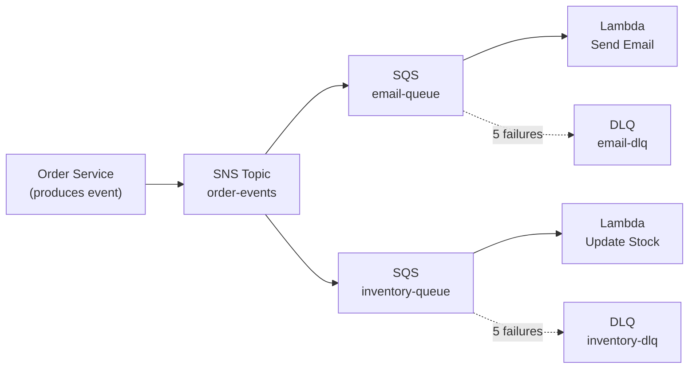
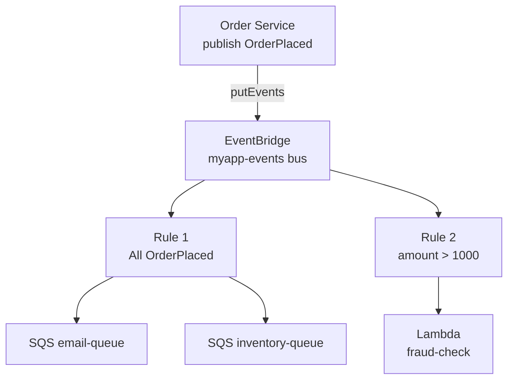

## Keywords in This File
{: .no_toc }

| # | Keyword | Weight |
|---|---------|--------|
| 12 | [SQS and SNS Patterns](#sqs-and-sns-patterns) | ★★☆ |
| 13 | [EventBridge and Event-Driven AWS](#eventbridge-and-event-driven-aws) | ★★☆ |

---

# SQS and SNS Patterns

**Interview Weight:** ★★☆ - Async messaging foundation.
SQS decouples producers from consumers with persistent
queues. SNS provides pub/sub fan-out. Understanding
Standard vs FIFO, visibility timeout, DLQs, and the
SNS fan-out pattern is foundational for any AWS async
system design.

---

### 🎯 Model Answer

**30 seconds:**

> SQS is a message queue. Producers push; consumers poll
> and process. Standard queue: at-least-once delivery,
> best-effort ordering, unlimited throughput. FIFO queue:
> exactly-once, strict ordering, 300-3,000 TPS.
> Visibility timeout: message hidden while being processed;
> reappears if not deleted (enables retry). DLQ: receives
> messages that fail N times. SNS pub/sub: publish to
> topic fans out to all subscribers simultaneously.

**3 minutes:**

> SQS visibility timeout lifecycle:
>
> Consumer receives message -> message hidden for
> visibility timeout duration. Consumer processes and
> deletes: message removed permanently. Consumer fails
> or times out: message reappears, retried. After
> maxReceiveCount failures: moved to DLQ.
>
> Visibility timeout sizing: MUST be greater than max
> processing time. If Lambda timeout = 30s and visibility
> timeout = 10s: message reappears at 10s, a second
> Lambda picks it up while the first is still running.
> Two concurrent processors = duplicate processing.
> Rule: visibility timeout = max processing time * 1.5.
>
> Standard vs FIFO:
>
> Standard: at-least-once, unlimited throughput.
>   Requires idempotent consumers (duplicate check).
>
> FIFO: exactly-once within message group, 3,000 TPS max.
>   MessageGroupId controls ordering scope.
>   Use for: payment events, inventory operations.
>
> SNS fan-out:
>
> Publish once to SNS topic -> multiple SQS queues receive
> simultaneously. Each queue processes independently with
> own DLQ and retry policy. Adding a new subscriber:
> add a new SQS subscription to the topic, no producer
> change needed.

**Blank Mind Recovery:**

**(1) Visibility timeout:** "Message hidden during processing.
Must be > processing time. Reappears on failure = retry."

**(2) SQS types:** "Standard = at-least-once, unlimited.
FIFO = exactly-once, ordered, 3K TPS max."

**(3) Fan-out:** "SNS topic -> multiple SQS queues.
Each independent. Add subscriber = no producer change."

---

### 📘 Concept Explanation

**SQS Message Lifecycle:**

```
Producer                  Queue                  Consumer
  | send(msg)               |                       |
  |------------------------>|                       |
  |                    [msg visible]                 |
  |                         |<-- receive(msg) -------|
  |                    [hidden: visibility           |
  |                     timeout starts]               |
  |                         |                       |
  |                         |    process...         |
  |                         |                       |
  |                         |<-- delete(msg) --------|
  |                    [removed permanently]          |

On processing failure (exception or timeout):
  [visibility timeout expires]
  [msg becomes visible again -> retry]

After maxReceiveCount failures:
  [moved to DLQ -> inspect for debugging]

Visibility Timeout Rule:
  timeout MUST be > max(processing time, consumer timeout)
  Short timeout + slow processing = concurrent duplicates
```

---

### 💻 Code Example

```java
// BAD: No idempotency on Standard SQS consumer
// Standard SQS delivers at-least-once
// Rare duplicate delivery -> duplicate charge
@SqsListener("payments-queue")
public void processPayment(String message) {
    Payment payment = deserialize(message);
    // If delivered twice (rare): customer charged twice
    chargeCard(payment.getCardToken(), payment.getAmount());
    paymentRepo.save(payment);
}
```

```java
// GOOD: Idempotent consumer with MessageId dedup check
@SqsListener("payments-queue")
public void processPayment(String message,
        @Header("MessageId") String messageId) {
    // Check idempotency first (fast DynamoDB lookup):
    if (idempotencyTable.wasProcessed(messageId)) {
        return; // Already processed, skip
    }
    Payment payment = deserialize(message);
    // Atomic: process + mark as processed
    // If charge fails: mark is not written -> retry OK
    transactionTemplate.execute(tx -> {
        chargeCard(payment.getCardToken(), payment.getAmount());
        paymentRepo.save(payment);
        idempotencyTable.markProcessed(messageId);
        return null;
    });
}
```

```bash
# Create queue with DLQ (maxReceiveCount=5):
DLQ_URL=$(aws sqs create-queue \
  --queue-name payments-dlq \
  --query 'QueueUrl' --output text)
DLQ_ARN=$(aws sqs get-queue-attributes \
  --queue-url $DLQ_URL --attribute-names QueueArn \
  --query 'Attributes.QueueArn' --output text)

aws sqs create-queue \
  --queue-name payments-queue \
  --attributes '{
    "VisibilityTimeout": "60",
    "ReceiveMessageWaitTimeSeconds": "20",
    "RedrivePolicy": "{
      \"deadLetterTargetArn\": \"'$DLQ_ARN'\",
      \"maxReceiveCount\": \"5\"
    }"
  }'
# VisibilityTimeout=60: 60s to process before retry
# Long polling=20: reduces empty response costs
# maxReceiveCount=5: 5 retries then -> DLQ

# SNS fan-out: publish once, deliver to multiple queues
TOPIC_ARN=$(aws sns create-topic \
  --name payment-events --query 'TopicArn' --output text)
aws sns subscribe --topic-arn $TOPIC_ARN \
  --protocol sqs --notification-endpoint $DLQ_ARN
# Allow SNS to write to SQS:
aws sqs set-queue-attributes --queue-url $DLQ_URL \
  --attributes '{"Policy":"{\"Statement\":[{
    \"Effect\":\"Allow\",
    \"Principal\":{\"Service\":\"sns.amazonaws.com\"},
    \"Action\":\"sqs:SendMessage\",
    \"Resource\":\"'$DLQ_ARN'\",
    \"Condition\":{\"ArnEquals\":{
      \"aws:SourceArn\":\"'$TOPIC_ARN'\"}}}]}"}'
```

> **Code walkthrough:** The BAD pattern is vulnerable to
> SQS's at-least-once guarantee: in rare cases a message
> is delivered twice, causing a double charge. The GOOD
> pattern checks a deduplication table first using the
> SQS MessageId. The atomic transaction ensures that if
> the charge fails, the idempotency mark is not committed
> - so the message is retried correctly. The DLQ setup
> uses maxReceiveCount=5: after 5 failed processing
> attempts, the message is moved to the DLQ for inspection
> without blocking the main queue. Long polling
> (ReceiveMessageWaitTimeSeconds=20) reduces SQS API
> calls when the queue is empty, lowering costs.

---

### 🎓 Answers by Seniority

**Junior / Mid:**

> "SQS is a message queue. Standard queues are at-least-once
> delivery with unlimited throughput. FIFO queues guarantee
> exactly-once and ordering within a message group but
> have lower throughput limits. Visibility timeout hides
> a message while being processed; if the consumer fails,
> the message reappears for retry. DLQs catch messages
> that fail repeatedly. SNS provides fan-out: one publish
> delivers to all subscribers."

**Senior / Staff:**

> "Visibility timeout sizing is the most common production
> SQS misconfiguration. It must exceed the processing time
> (including Lambda timeout for Lambda consumers). A
> visibility timeout shorter than processing time causes
> concurrent duplicate processing - not at the rare
> at-least-once level, but systematically.
>
> For exactly-once requirements (financial transactions,
> inventory): SQS FIFO with MessageGroupId = business
> entity (e.g., customerId or orderId). Orders for the
> same customer are FIFO-ordered, different customers
> processed in parallel.
>
> The SNS + SQS fan-out architecture solves the extensibility
> problem: the producer publishes once to SNS. Adding a
> new consumer is a configuration change (subscribe a new
> SQS queue to the topic), not a code change. Each SQS
> queue has independent retry and DLQ policies."

---

### ⚠️ Common Misconceptions

**Misconception: "FIFO queues are always better because
exactly-once is safer."**

FIFO has strict throughput limits: 300 TPS standard
(3,000 with high throughput mode and batching). For
high-volume workloads, Standard with idempotency is
more scalable. Standard queue throughput: effectively
unlimited. The MessageGroupId in FIFO means ordering
is only within a group - it does not globally order all
messages. Multiple message groups are processed in parallel.
Use FIFO when you need exactly-once semantics for
a specific business requirement without the engineering
overhead of idempotency. Use Standard when throughput
requirements exceed FIFO limits or when idempotency is
already built into your business logic.

---

### 🚨 Failure Modes and Diagnosis

**Failure: Messages being processed concurrently
causing duplicates despite no SQS delivery duplication**

*Symptom:* 0.5% of orders result in duplicate inventory
deduction. MessageIds are unique (not SQS duplicates).
Two Lambda invocations processed the same orderId.

*Root cause:* Visibility timeout (30s) is shorter than
Lambda timeout (60s). Message reappears at 30s, gets
assigned to a second Lambda invocation while the first
is still processing.

*Detection:*
```bash
# Check visibility timeout vs Lambda timeout:
aws sqs get-queue-attributes \
  --queue-url $QUEUE_URL \
  --attribute-names VisibilityTimeout
# Compare to Lambda timeout:
aws lambda get-function-configuration \
  --function-name order-processor \
  --query 'Timeout'
# If VisibilityTimeout < Lambda Timeout: guaranteed duplicates

# Check Lambda P99 duration (actual processing time):
aws cloudwatch get-metric-statistics \
  --namespace AWS/Lambda \
  --metric-name Duration \
  --dimensions Name=FunctionName,Value=order-processor \
  --extended-statistics p99 \
  --period 3600 ...
# VisibilityTimeout must be > p99 Duration
```

*Fix:* Set visibility timeout = max(Lambda timeout,
P99 Duration) * 1.5. Implement idempotency as defense
in depth for remaining at-least-once cases.

---

### ⚖️ Comparison Table

| Feature | SQS Standard | SQS FIFO | SNS |
|---------|-------------|----------|-----|
| Delivery | At-least-once | Exactly-once | At-least-once |
| Ordering | Best-effort | Strict per group | None (pub/sub) |
| Throughput | Unlimited | 300-3,000 TPS | Unlimited |
| Retention | 1 min - 14 days | 1 min - 14 days | No retention |
| Fan-out | No | No | Yes |
| Consumer model | Pull (polling) | Pull | Push |
| Idempotency needed | Yes | No | Yes |
| Best for | Async work queues | Ordered transactions | Notifications |

---

### 🏛️ System Design

*(Omit: non-★★★ keyword.)*

---

### 📊 Diagram

```
SNS Fan-out Architecture:

Order Service
  |
  | publish(OrderPlaced)
  v
SNS Topic: order-events
  |
  +-- SQS: email-queue -----> Lambda: send email
  |
  +-- SQS: inventory-queue -> Lambda: update stock
  |
  +-- SQS: analytics-queue -> Lambda: record event

Each queue:
  - Independent DLQ
  - Independent retry policy
  - Can be paused/scaled independently
  - Consumer failure = does NOT affect other consumers
```



> **Diagram walkthrough:** SNS delivers the event
> simultaneously to all subscribed SQS queues. Each
> queue is independent: the email queue failing to
> process does not block inventory updates (they use
> separate queues). Each queue has its own DLQ for
> debugging failures without cross-contamination.
> The key operational benefit: if you need to add
> a fraud detection service, subscribe a new SQS
> queue to the SNS topic - the Order Service code
> is unchanged. This is the extensible event-driven
> architecture pattern.

---

---

# EventBridge and Event-Driven AWS

**Interview Weight:** ★★☆ - Event-driven architecture.
EventBridge is AWS's serverless event bus: routes events
from AWS services, custom apps, and SaaS partners to
targets via content-based filtering rules. Understanding
EventBridge vs SNS vs SQS, event pattern matching, and
scheduled rules is essential for modern AWS architecture.

---

### 🎯 Model Answer

**30 seconds:**

> EventBridge is a serverless event bus. Events (JSON)
> flow from sources to targets via rules. Rules filter
> events by pattern (e.g., all EC2 instance-stopped
> events) and route to targets (Lambda, SQS, Step
> Functions). Default bus receives all AWS service events.
> Custom buses decouple microservices. Key advantage over
> SNS: content-based routing (filter by event data fields,
> not just topic), 90+ AWS service sources, SaaS integrations.

**3 minutes:**

> EventBridge components:
>
> Event: JSON with source (who sent it), detail-type
> (what happened), detail (event data), time.
>
> Event bus: receives and routes events. Default bus:
> all AWS service events automatically. Custom bus:
> your application events. Partner bus: SaaS events
> (GitHub, Datadog, Stripe).
>
> Rule: filter (event pattern) + routing (target list).
> Multiple targets per rule. A single event can match
> multiple rules simultaneously.
>
> Event pattern: JSON filter with conditions.
> Can filter by source, detail-type, AND detail fields.
> Numeric conditions: `{"amount": [{"numeric": [">", 1000]}]}`
> String matching: `{"status": ["FAILED", "ERROR"]}`
>
> Targets: Lambda, SQS, SNS, Step Functions, ECS tasks,
> API Gateway, Kinesis, other event buses, HTTP endpoints.
>
> Scheduled rules: cron or rate expressions.
> `rate(5 minutes)` or `cron(0 8 * * ? *)` (8 AM daily).
> Replaces CloudWatch Events for scheduling.
>
> EventBridge Pipes: connects source (SQS, DynamoDB Stream,
> Kinesis) directly to target with optional enrichment.
> Eliminates Lambda glue functions for simple routing.

**Blank Mind Recovery:**

**(1) Components:** "Event -> Event Bus -> Rule (JSON
pattern match) -> Target."

**(2) vs SNS:** "EventBridge = content-based routing,
AWS service events, SaaS. SNS = topic-based fan-out,
notifications."

**(3) Key feature:** "Filter by any event JSON field.
Add new consumer by adding a rule. No producer change."

---

### 📘 Concept Explanation

**Content-based routing vs topic routing:**

```
SNS (topic-based):
  Publisher -> "order-placed" topic
  All subscribers to "order-placed" receive ALL events
  Filtering: limited attribute matching

EventBridge (content-based):
  Publisher -> event bus
  Rule 1: source=orders AND detail.status=PLACED
    -> SQS email-queue + Lambda inventory
  Rule 2: source=orders AND detail.amount > 1000
    -> Lambda fraud-check
  Rule 3: source=aws.ec2 AND detail.state=terminated
    -> Lambda cleanup

Power: different targets see different subsets of events
from the same bus, filtered by event content.
```

---

### 💻 Code Example

```java
// BAD: Order service directly calls downstream services
public OrderResult processOrder(Order order) {
    // Synchronous coupling to 3 services
    // If email service is down: order fails?
    // Adding new service: modify this code
    emailService.sendConfirmation(order);
    inventoryService.reserve(order);
    analyticsService.record(order);
    return orderRepo.save(order);
}
```

```java
// GOOD: Publish event, let EventBridge route
public OrderResult processOrder(Order order) {
    // Save order first, then emit event
    Order saved = orderRepo.save(order);

    // Publish once - EventBridge routes to all consumers
    PutEventsRequestEntry event =
        PutEventsRequestEntry.builder()
            .source("com.myapp.orders")
            .detailType("OrderPlaced")
            .detail(toJson(Map.of(
                "orderId", saved.getId(),
                "customerId", saved.getCustomerId(),
                "amount", saved.getAmount(),
                "items", saved.getItems()
            )))
            .eventBusName("myapp-events")
            .build();
    eb.putEvents(PutEventsRequest.builder()
        .entries(List.of(event))
        .build());
    // EventBridge routes to:
    // email-queue, inventory-queue, analytics-queue
    // adding fraud-check: new rule, no code change here
    return saved;
}
```

```bash
# Create custom event bus:
aws events create-event-bus --name myapp-events

# Rule: OrderPlaced -> SQS + Lambda:
aws events put-rule \
  --name route-order-placed \
  --event-bus-name myapp-events \
  --event-pattern '{"source":["com.myapp.orders"],
    "detail-type":["OrderPlaced"]}' \
  --state ENABLED

aws events put-targets \
  --rule route-order-placed \
  --event-bus-name myapp-events \
  --targets '[
    {"Id":"inventory","Arn":"arn:aws:sqs:...:inventory-queue"},
    {"Id":"email","Arn":"arn:aws:lambda:...:send-email"}
  ]'

# Content-based filtering (high-value orders):
aws events put-rule \
  --name route-high-value \
  --event-bus-name myapp-events \
  --event-pattern '{
    "source":["com.myapp.orders"],
    "detail-type":["OrderPlaced"],
    "detail":{"amount":[{"numeric":[">",1000]}]}
  }' \
  --state ENABLED
aws events put-targets \
  --rule route-high-value \
  --event-bus-name myapp-events \
  --targets '[{"Id":"fraud","Arn":"arn:aws:lambda:...:fraud-check"}]'

# Scheduled rule (daily at 2am UTC):
aws events put-rule \
  --name daily-report \
  --schedule-expression "cron(0 2 * * ? *)" \
  --state ENABLED
aws events put-targets --rule daily-report \
  --targets '[{"Id":"1","Arn":"arn:aws:lambda:...:daily-report"}]'

# Test event pattern before deploying:
aws events test-event-pattern \
  --event-pattern '{"detail":{"amount":[{"numeric":[">",1000]}]}}' \
  --event '{"detail":{"amount":1500}}'
# Returns: {"Result": true}
```

> **Code walkthrough:** The BAD pattern tightly couples
> the order service to email, inventory, and analytics.
> If email service is unavailable, should the order fail?
> Adding fraud detection requires modifying order processing
> code. The GOOD pattern publishes one event to EventBridge.
> EventBridge's rule system routes it to all interested
> consumers. Adding fraud detection is adding a new rule
> and Lambda function - the order service code is unchanged.
> `test-event-pattern` verifies the JSON pattern before
> deployment - essential for debugging routing issues.
> The high-value order rule demonstrates content filtering:
> orders over $1,000 route to an additional fraud check
> target without any application-level if/else logic.

---

### 🎓 Answers by Seniority

**Junior / Mid:**

> "EventBridge is a serverless event bus. Events are JSON
> documents with a source, type, and data. Rules match
> events by pattern and route them to targets like Lambda
> or SQS queues. The default event bus receives all AWS
> service events automatically. I use custom event buses
> to decouple microservices: services publish events,
> and rules route them to interested consumers without
> direct dependencies."

**Senior / Staff:**

> "EventBridge solves a different problem than SNS.
> SNS routes to everyone subscribed to a topic. EventBridge
> routes based on event content: a rule can match 'all
> OrderPlaced events where amount > 1000 and customerId
> is in premium tier' - impossible with SNS topic routing.
>
> The microservice architecture benefit: services publish
> typed events to a custom bus. Other services declare
> EventBridge rules expressing interest. This is the
> observer pattern at the infrastructure level: consumers
> are decoupled from producers by the event contract,
> not by direct API calls.
>
> EventBridge Schema Registry is the operational complement:
> it auto-discovers event schemas from production events
> and generates typed SDK code for producers and consumers.
> This enforces the event contract without a separate
> schema registry system.
>
> EventBridge Pipes reduces Lambda glue code: instead of
> a Lambda that reads from SQS, filters, enriches, and
> writes to DynamoDB - the Pipe connects source to target
> natively with optional Lambda enrichment step."

---

### ⚠️ Common Misconceptions

**Misconception: "EventBridge replaces SNS and SQS."**

EventBridge, SNS, and SQS serve distinct purposes:
SQS is a durable work queue (messages persist, competing
consumers, retry via visibility timeout). SNS is push
notification fan-out (email, SMS, mobile push, no
persistence). EventBridge is content-based event routing
with AWS service integration and SaaS connectors.

The most powerful pattern combines all three: EventBridge
routes events to SQS queues (not directly to Lambda),
and Lambda consumes from SQS. This adds SQS's durability,
retry logic, and DLQ to EventBridge's routing. Direct
EventBridge -> Lambda has no retry on Lambda failure.
EventBridge -> SQS -> Lambda retries via visibility
timeout and DLQ.

---

### 🚨 Failure Modes and Diagnosis

**Failure: EventBridge rule is not routing events
to the expected target**

*Symptom:* Events published to custom bus. Lambda target
not receiving them. No error visible.

*Root cause candidates:*
1. Event pattern does not match the actual event structure
2. Lambda resource policy missing EventBridge invoke
3. Rule is targeting wrong event bus
4. Event published to wrong event bus

*Diagnosis:*
```bash
# Test pattern matching (MOST IMPORTANT FIRST):
aws events test-event-pattern \
  --event-pattern '{"source":["com.myapp.orders"]}' \
  --event '{"source":"com.myapp.orders","detail":{"id":"123"}}'
# If Result: false -> pattern mismatch, fix pattern

# Create archive to capture all events (temporary debug):
aws events create-archive \
  --archive-name debug-capture \
  --event-source-arn arn:aws:events:us-east-1:...:event-bus/myapp-events \
  --retention-days 1
# All events stored for 24 hours -> inspect what was received

# Check FailedInvocations metric:
aws cloudwatch get-metric-statistics \
  --namespace AWS/Events \
  --metric-name FailedInvocations \
  --dimensions Name=RuleName,Value=route-order-placed \
  --period 300 --statistics Sum ...
# FailedInvocations > 0 means rule matched but target failed

# Check Lambda resource policy:
aws lambda get-policy --function-name my-lambda
# Must contain: "Principal":{"Service":"events.amazonaws.com"}
```

*Fix:* Use `test-event-pattern` to verify pattern.
Add Lambda resource policy allowing EventBridge invocation.
Use EventBridge Archive to capture events for debugging.

---

### ⚖️ Comparison Table

| Feature | SQS | SNS | EventBridge |
|---------|-----|-----|-------------|
| Model | Queue (pull) | Pub/sub (push) | Event bus (rule) |
| Message retention | Up to 14 days | No retention | No retention |
| Filtering | Attribute (limited) | Attribute (limited) | Full JSON pattern |
| AWS service events | No | No | Yes (100+ services) |
| SaaS integrations | No | No | 90+ partners |
| Scheduling | No | No | Yes (cron/rate) |
| Fan-out | Limited | Yes | Yes (per rule) |
| Throughput | Unlimited | Unlimited | 10M events/s |
| Best for | Work queues | Notifications | Event routing |

---

### 🏛️ System Design

*(Omit: non-★★★ keyword.)*

---

### 📊 Diagram

```
EventBridge Content-Based Routing:

Publisher (Order Service)
  | putEvents(OrderPlaced {amount: 1500, status: PLACED})
  v
Custom Bus: myapp-events

Rule 1: source=orders, detail-type=OrderPlaced
  -> Target: SQS email-queue
  -> Target: SQS inventory-queue
  (MATCHES: this event matches Rule 1)

Rule 2: source=orders, detail.amount > 1000
  -> Target: Lambda fraud-check
  (MATCHES: amount 1500 > 1000, also matches)

Rule 3: source=aws.ec2, detail.state=terminated
  -> Target: Lambda cleanup
  (NO MATCH: source is orders, not aws.ec2)

Result: event routed to 3 targets (email, inventory, fraud)
        Rule 3 does not match, no routing there
```



> **Diagram walkthrough:** A single OrderPlaced event
> flows into the custom bus. EventBridge evaluates ALL
> rules against the event simultaneously. Rule 1 matches
> all OrderPlaced events and routes to both SQS queues.
> Rule 2 matches only high-value events (amount > 1000)
> and routes to the fraud-check Lambda. The same event
> matches both rules, resulting in three simultaneous
> deliveries. This is fundamentally different from SQS
> or SNS: the routing decision is made based on event
> content, not queue membership or topic subscription.

---

### 🎯 Interview Deep-Dive

> **Timing:** 5-7 minutes per question for ★★☆ keywords.

| Type | Questions |
|------|-----------|
| CONCEPT | 2 |
| DEBUGGING | 1 |
| TRADE-OFF | 1 |
| BEHAVIORAL | 1 |
| SCENARIO | 2 |
| ARCHITECTURE | 1 |

> Note: Both keywords share this Deep-Dive section.

---

#### CONCEPT 1 (SQS): Explain SQS visibility timeout and why it causes duplicate processing.

**Visibility timeout mechanism:** when a consumer calls
`ReceiveMessage`, the message becomes invisible for the
visibility timeout duration. The intent: prevent two
consumers from processing the same message simultaneously.
If the consumer calls `DeleteMessage` before the timeout:
message removed. If timeout expires first: message becomes
visible again for another consumer.

**The duplicate processing bug:**

If processing time > visibility timeout:
- Consumer receives message, starts processing
- Visibility timeout expires (message reappears)
- Second consumer receives the same message, starts processing
- BOTH complete: duplicate side effect

This is not the rare at-least-once delivery (which happens
in < 0.001% of messages). This is systematic duplicate
processing due to misconfigured timeout.

**Example:**

Lambda timeout: 60 seconds. SQS visibility timeout: 30s.
A message takes 45 seconds to process:
- T=0: Lambda A receives message. Hidden for 30s.
- T=30: Visibility timeout expires. Message visible.
- T=30: Lambda B receives same message. Starts processing.
- T=45: Lambda A completes, calls DeleteMessage.
- T=30+45=T=75: Lambda B completes, calls DeleteMessage.
  (Message may be gone, or second delete is no-op.)
- Side effects were triggered twice.

**Correct sizing:**

```java
// Rule: visibility timeout = max(Lambda timeout, p99 duration) * 1.5
// Lambda timeout = 60s, p99 duration = 40s:
// visibility timeout = 60 * 1.5 = 90s

// For variable duration: extend dynamically:
sqs.changeMessageVisibility(
    ChangeMessageVisibilityRequest.builder()
        .queueUrl(url)
        .receiptHandle(handle)
        .visibilityTimeout(60)
        .build()
);
// Call this every ~45s during long-running processing
```

*What separates good from great:* The systematic nature
of this bug (not rare, but every message taking > timeout)
makes it a production incident, not edge case. The dynamic
visibility extension pattern is the production fix for
variable-duration workloads.

---

#### CONCEPT 2 (EventBridge): How does EventBridge differ from SNS? When do you use each?

**SNS (topic-based):**

Publisher sends to a topic. All subscribers to that topic
receive every message. Subscriber filter policies allow
some attribute filtering but are limited. No concept of
event structure - messages are opaque blobs.

Use SNS for: multi-subscriber push notifications (email,
SMS, mobile push, SQS). Simple fan-out where all
subscribers want all messages from a topic.

**EventBridge (content-based):**

Publisher sends to an event bus. Rules evaluate the event
JSON structure (source, detail-type, and any detail fields)
and route matching events to specific targets. Content
filtering: numeric comparisons, string patterns, prefix
matching, `exists` and `doesNotExist` conditions.

Use EventBridge for:
- React to AWS service events (EC2, S3, CodePipeline, etc.)
- Content-based routing (different consumers for different
  event types or field values)
- SaaS integrations (GitHub webhook events, etc.)
- Scheduled invocations (cron/rate rules)
- Microservice decoupling with typed event contracts

**Combined pattern:**

EventBridge routes -> SQS -> Lambda. This combines:
- EventBridge: smart routing, AWS service events
- SQS: durable delivery, retry (visibility timeout), DLQ
- Lambda: processing

Direct EventBridge -> Lambda has no DLQ for Lambda failures.
EventBridge -> SQS -> Lambda adds durability.

*What separates good from great:* The "EventBridge ->
SQS -> Lambda" pattern (not "EventBridge -> Lambda")
shows understanding that EventBridge does not provide
message durability on delivery failure. SQS adds the
retry and DLQ layer between EventBridge and Lambda.

---

#### DEBUGGING 1 (SQS): Messages are in the DLQ. How do you debug and recover them?

**Step 1: Understand what DLQ means:**
Messages reach DLQ after `maxReceiveCount` failed
processing attempts. Each "failure" means the message
was received but not deleted within the visibility timeout.

**Step 2: Inspect DLQ messages:**
```bash
# Receive without deleting (peek at messages):
aws sqs receive-message \
  --queue-url $DLQ_URL \
  --max-number-of-messages 10 \
  --attribute-names All \
  --message-attribute-names All
# Look at message body patterns:
# - All same message type? -> consumer bug for this type
# - All same customer? -> customer data issue
# - All have specific field value? -> validation bug
```

**Step 3: Get Lambda logs for the failures:**
```bash
aws logs tail /aws/lambda/processor \
  --filter-pattern "ERROR" --follow
# Find the specific exception for the failing message IDs
```

**Step 4: Common causes:**

JSON deserialization error: producer added a field
the consumer does not know how to handle. Fix: use
lenient deserialization (ignore unknown fields).
`@JsonIgnoreProperties(ignoreUnknown = true)` in Jackson.

Database deadlock or timeout: consumer tried to write
to DB, which was contended. Transient issue.
Fix: retry with exponential backoff.

Business logic exception: specific data triggers a bug.
Fix: fix the bug.

**Step 5: Redrive messages after fix:**
```bash
# Redrive from DLQ back to main queue (after bug fix):
aws sqs start-message-move-task \
  --source-arn $DLQ_ARN \
  --destination-arn $MAIN_QUEUE_ARN \
  --max-number-of-messages-per-second 10
# Reprocesses DLQ messages with the fix applied
# Rate-limited to prevent overwhelming the system
```

*What separates good from great:* The `start-message-move-task`
(DLQ redrive, added in 2023) is the production tool for
recovering DLQ messages after fixing the bug. Without it,
you manually receive from DLQ and send to main queue -
brittle. The rate limiting parameter prevents a DLQ
burst from overwhelming the processor.

---

#### TRADE-OFF 1: SQS Standard vs FIFO vs EventBridge for an order processing system.

**System requirements:**
- 10,000 orders/day (7 orders/minute average)
- Orders for same customer must be in sequence
- No duplicate order processing
- New downstream consumers may be added later

**SQS Standard:**

Throughput: 7 TPS (far below limits). Fine.
Ordering: best-effort. Orders for same customer may
be processed out of order in rare cases.
Exactly-once: requires idempotency implementation.
Extensibility: one consumer per queue (or SQS + SNS
fan-out for multiple consumers).

**SQS FIFO:**

Throughput: 7 TPS. Fine (well within 300 TPS limit).
Ordering: strict FIFO per MessageGroupId.
MessageGroupId = customerId -> customer's orders ordered.
Different customers processed in parallel.
Exactly-once: built-in (MessageDeduplicationId).
Extensibility: same limitation as Standard.

**EventBridge:**

Not a work queue. No message retention on failed delivery.
Correct use: emit OrderPlaced event to EventBridge AFTER
successful order save. EventBridge routes to:
- SQS FIFO queue for order processing (ordered, exactly-once)
- SQS Standard queue for analytics (best-effort, high volume)
- Lambda for email notification (fire and forget)

Adding new consumer: new EventBridge rule. No producer code change.

**Decision:** SQS FIFO with MessageGroupId = customerId
for the processing pipeline. EventBridge on top for
extensibility (multiple downstream consumers, adding
new consumers as rules).

*What separates good from great:* SQS FIFO + EventBridge
is the combined answer: FIFO for processing guarantees,
EventBridge for routing and extensibility. Using them
together is the production-correct architecture.

---

#### BEHAVIORAL 1: Describe a time you designed or debugged an async messaging system.

**STAR:**

**Situation:** Payment service consumed from SQS Standard.
Production incident: 0.2% of customers double-charged.

**Task:** Root cause and fix.

**Analysis (30 minutes):**

Checked DynamoDB: duplicate payment records with same
orderId but different MessageIds. Two different messages
triggering the same payment.

Hypothesis 1: SQS at-least-once delivery. Rejected:
MessageIds were different (same orderId, different MessageIds).

Hypothesis 2: Order service sent to queue twice. Investigated:
Order service had a retry on timeout. If the SQS `SendMessage`
call timed out at 5 seconds (slow network), the order service
retried. SQS received the message twice (the first send
did succeed but the response was lost). Both messages had
different MessageIds.

Root cause: network timeout caused silent duplicate send
at the producer level. SQS FIFO with content-based
deduplication would have prevented this. Standard queue
+ no idempotency at the consumer = double charge.

**Fix (two layers):**

Layer 1 (producer): SQS FIFO with `MessageDeduplicationId`
= SHA256(orderId). If both messages arrive, SQS deduplicates.

Layer 2 (consumer): added idempotency check using orderId
as key in DynamoDB before charging.

```java
// Producer fix: FIFO with deduplication
sqs.sendMessage(SendMessageRequest.builder()
    .queueUrl(FIFO_QUEUE_URL)
    .messageBody(toJson(order))
    .messageGroupId(order.getCustomerId())
    .messageDeduplicationId(sha256(order.getId()))
    .build());
// If retry: same deduplicationId -> SQS deduplicates
```

**Result:** Zero duplicate charges in following months.
Added to incident runbook: async message systems need
idempotency at BOTH producer and consumer levels.

*What separates good from great:* Identifying the producer-level
duplicate (not SQS delivery duplicate) requires understanding
the full message flow. Network timeouts on the producer side
are a frequent source of "duplicate messages" that teams
mistakenly attribute to SQS at-least-once behavior.

---

#### SCENARIO 1: Design reliable order event processing with multiple downstream consumers.

**Requirements:**
- Order service publishes OrderPlaced event
- Email confirmation sent to customer
- Inventory updated
- Analytics recorded
- Future: fraud check to be added
- All consumers must be reliable (retry on failure)

**Architecture:**

```
Order Service
  |
  | putEvents(OrderPlaced)
  v
EventBridge Custom Bus: ecommerce-bus

Rule: source=com.myapp, detail-type=OrderPlaced
  -> SQS: email-queue (maxReceiveCount=5, DLQ=email-dlq)
  -> SQS: inventory-queue (maxReceiveCount=5, DLQ=inv-dlq)
  -> SQS: analytics-queue (maxReceiveCount=5, DLQ=ana-dlq)

Each SQS queue triggers Lambda:
  email-queue -> Lambda: send-email
  inventory-queue -> Lambda: update-inventory
  analytics-queue -> Lambda: record-analytics

Adding fraud check:
  1. Create sqs: fraud-queue with DLQ
  2. Add target to EventBridge rule (or new rule)
  3. Create Lambda: fraud-check
  NO changes to Order Service
```

**Reliability:**

- EventBridge retries on target failure (up to 24hr).
- SQS retries via visibility timeout.
- DLQ for messages that fail 5 times.
- CloudWatch alarm on DLQ depth > 0 -> PagerDuty alert.
- All Lambda consumers are idempotent (orderId dedup).

*What separates good from great:* EventBridge -> SQS ->
Lambda is the correct reliability chain. Direct EventBridge
-> Lambda does not have SQS's durability (no DLQ, limited
retry). The SQS DLQ alarm is the operational completeness:
failing messages do not silently disappear.

---

#### SCENARIO 2: You have a Lambda function consuming SQS. Queue depth is growing. How do you scale?

**Step 1: Diagnose the bottleneck:**

```bash
# Queue depth (how many messages waiting?):
aws sqs get-queue-attributes \
  --queue-url $QUEUE_URL \
  --attribute-names ApproximateNumberOfMessages,
    ApproximateNumberOfMessagesNotVisible
# NotVisible = currently being processed

# Lambda concurrency (how many concurrent invocations?):
aws cloudwatch get-metric-statistics \
  --namespace AWS/Lambda --metric-name ConcurrentExecutions \
  --dimensions Name=FunctionName,Value=processor \
  --period 60 --statistics Maximum ...

# Lambda throttles (at limit?):
aws cloudwatch get-metric-statistics \
  --namespace AWS/Lambda --metric-name Throttles \
  --dimensions Name=FunctionName,Value=processor \
  --period 60 --statistics Sum ...
```

**Step 2: Scaling levers (in order of impact):**

1. Batch size (highest leverage):
   ```bash
   aws lambda update-event-source-mapping \
     --uuid <mapping-id> \
     --batch-size 10 \
     --maximum-batching-window-in-seconds 5
   # 10 messages per invocation = 10x throughput
   # at same Lambda concurrency
   ```

2. Increase Lambda concurrency:
   ```bash
   aws lambda put-function-concurrency \
     --function-name processor \
     --reserved-concurrent-executions 500
   # Default 1000 limit: request increase if needed
   ```

3. Process batch items in parallel within Lambda:
   ```java
   List<Future<?>> futures = event.getRecords().stream()
       .map(record -> executor.submit(() -> process(record)))
       .collect(Collectors.toList());
   futures.forEach(f -> f.get()); // wait for all
   ```

4. Reduce processing time per message:
   - Profile the bottleneck (DB query? External API?)
   - Add caching, indexes, or async operations

**Common mistake:** increasing Lambda concurrency without
increasing batch size. Increasing concurrency multiplies
the number of Lambda invocations. Increasing batch size
multiplies the messages processed per invocation.
Both levers together compound the throughput improvement.

*What separates good from great:* Batch size is the
first and highest-leverage lever, but teams often jump
to concurrency first. At batch size=10 and concurrency=100:
1,000 messages processed per second. At batch size=1 and
concurrency=1000: also 1,000 messages per second - but
at 10x the Lambda invocation cost.

---

#### ARCHITECTURE 1: Compare SQS + Lambda vs Kafka for high-throughput event processing.

**SQS + Lambda:**

Operations: fully managed, zero infrastructure.
Scaling: auto-scales with queue depth.
Cost: pay per message + per Lambda invocation.
Replay: limited (DLQ only, no offset replay).
Retention: max 14 days.
Consumer groups: one logical consumer per queue.
  (SNS fan-out for multiple consumer groups.)
Stream processing: no native aggregations or windows.
Latency: ms to seconds (Lambda cold start).

Best for: async work queues, event-driven microservices,
variable traffic, small to medium event volumes.

**Kafka (or Amazon MSK):**

Operations: cluster management (MSK: ~$0.10+/hr/broker).
Scaling: manual partition management.
Cost: cluster always running (not per-message).
Replay: full replay from any offset (infinite history
  if configured). Rebuild application state.
Retention: configurable (days to forever).
Consumer groups: multiple groups at different offsets.
  Each group reads the topic independently.
Stream processing: Kafka Streams, ksqlDB, Flink.
Latency: ms (persistent consumers, no cold start).

Best for: event sourcing, audit logs, stream analytics,
very high sustained throughput (millions/second), multiple
independent consumer groups at different read positions.

**Decision matrix:**

```
Requirement            | SQS + Lambda  | Kafka
-----------------------|---------------|------
Replay events          | No            | Yes
Multiple consumer groups| Via SNS      | Native
Event sourcing         | No            | Yes
Stream analytics       | No            | Yes
Sustained M/s throughput| Limited      | Yes
Zero infra             | Yes           | No
Variable traffic       | Yes (auto)    | Overprovisioned
Cost at low volume     | Cheap         | Fixed cluster cost
Fully managed          | Yes           | MSK (mostly)
```

*What separates good from great:* Event sourcing and
replay capability is the decisive factor for Kafka: if
you need to rebuild application state from events (e.g.,
recompute a derived read model), you need Kafka. SQS
deletes messages after processing - there is no history
to replay. For typical microservice async patterns
(order processing, email notifications, data sync):
SQS + Lambda is the right choice at lower cost and
operational overhead.

---
