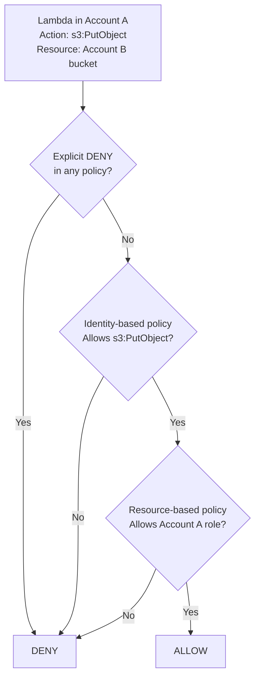
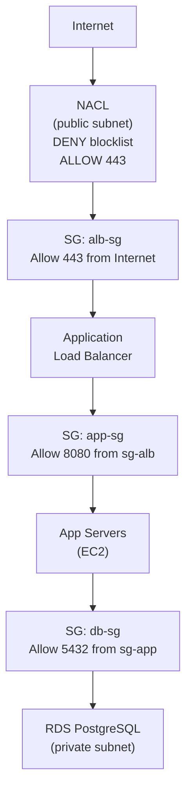

## Keywords in This File
{: .no_toc }

| # | Keyword | Weight |
|---|---------|--------|
| 14 | [AWS IAM Roles and Policies](#aws-iam-roles-and-policies) | ★★☆ |
| 15 | [Security Groups and NACLs](#security-groups-and-nacls) | ★★☆ |

---

# AWS IAM Roles and Policies

**Interview Weight:** ★★☆ - Security foundation.
IAM (Identity and Access Management) controls who
can do what in AWS. Understanding users, roles, and
policies - and especially the difference between
identity-based and resource-based policies - is
essential for every AWS role. Least-privilege is
the foundational security principle.

---

### 🎯 Model Answer

**30 seconds:**

> IAM controls who can perform actions on AWS resources.
> Users: long-lived human identities (avoid for services).
> Roles: temporary credentials assumed by services, EC2,
> Lambda, or cross-account access. Policies: JSON documents
> defining Allow/Deny for actions and resources. Identity-based
> policy: attached to user/role. Resource-based policy:
> attached to resource (S3 bucket, SQS queue). Principle
> of least privilege: grant only what is needed for the
> specific task.

**3 minutes:**

> IAM hierarchy:
>
> Principal: who makes the request. IAM user, IAM role,
> AWS service (Lambda, EC2), or AWS account.
>
> Policy: JSON document with Effect (Allow/Deny), Action
> (specific API calls like `s3:GetObject`), Resource
> (ARN of the target), and optional Condition.
>
> Policy types:
> - Identity-based: attached to user/role. Controls what
>   that principal can do.
> - Resource-based: attached to resource (S3, SQS, Lambda).
>   Controls who can access this resource.
>
> Policy evaluation:
> - Default: implicit DENY (nothing allowed unless explicitly allowed)
> - Explicit DENY always wins (overrides any Allow)
> - Allow requires an identity-based OR resource-based policy
>   to explicitly allow the action
>
> Roles vs Users:
>
> Users: long-lived credentials (access keys). Risk: keys
> can be leaked. Best practice: use only for humans with
> MFA, avoid for services.
>
> Roles: temporary credentials (15 min to 12 hours).
> Services assume roles: EC2 instance profile, Lambda
> execution role, ECS task role. Never embed access keys
> in code.
>
> Cross-account: Account A role trusts Account B.
> Account B user/role assumes Account A role.
> Used for: multi-account setups, vendor access.

**Blank Mind Recovery:**

**(1) Users vs Roles:** "Users = long-lived credentials,
humans only. Roles = temporary, services and cross-account."

**(2) Policy types:** "Identity-based = on user/role.
Resource-based = on resource. Both evaluated together."

**(3) Evaluation:** "Default deny. Explicit deny wins.
Allow needs explicit Allow in a policy."

---

### 📘 Concept Explanation

**IAM Policy Evaluation Logic:**

```
Request arrives:
  Principal: Lambda function (has execution role)
  Action: s3:PutObject
  Resource: arn:aws:s3:::my-bucket/uploads/*

Evaluation steps:
  1. Is there an explicit DENY? -> Yes = DENY (stop)
  2. Is there an ALLOW?
     - Check identity-based policies (Lambda role)
     - Check resource-based policies (S3 bucket policy)
     -> Either allows -> ALLOW
     -> Neither allows -> implicit DENY

For cross-account access (Lambda in Account A, S3 in B):
  BOTH must explicitly ALLOW:
    - Lambda role (Account A) must allow s3:PutObject
    - S3 bucket policy (Account B) must allow Account A

IAM Role assumption flow:
  1. EC2/Lambda/ECS service has an execution role
  2. AWS STS issues temporary credentials (AssumeRole)
  3. Credentials expire (15min - 12hr)
  4. SDK automatically refreshes using role metadata
  5. Code never handles credentials explicitly
```

> **Code walkthrough:** This AWS IAM Roles and Policies example demonstrates the concept in a production context. **KEY MECHANISM:** the runtime processes these instructions with the specific semantics of this API. **WHY IT MATTERS:** applying this pattern incorrectly causes subtle production failures under load. **TAKEAWAY: understand the execution model and failure modes before using this in production.**

---

### 💻 Code Example

```java
// BAD: Hardcoded AWS credentials in code
public class S3Uploader {
    private static final S3Client s3 = S3Client.builder()
        .credentialsProvider(
            StaticCredentialsProvider.create(
                AwsBasicCredentials.create(
                    "AKIA_YOUR_KEY_EXAMPLE", // NEVER do this
                    "wJalrXUtnFEMI/K7MDENG/bPxRfiCYEXAMPLEKEY"
                )
            )
        )
        .build();
    // Keys in code = rotation is manual, leak risk is real
    // If this lands in Git: rotate immediately
}
```

> **Code walkthrough:** This AWS IAM Roles and Policies example demonstrates Java runtime behavior. **KEY MECHANISM:** the JVM executes this via bytecode interpretation and JIT compilation of hot paths. **WHY IT MATTERS:** incorrect usage causes subtle concurrency bugs or memory leaks under load. **TAKEAWAY: understand the object lifecycle and threading model before using this API.**

```java
// GOOD: Use role credentials (auto-provisioned by AWS)
public class S3Uploader {
    // DefaultCredentialsProvider resolves in order:
    // 1. Environment variables (CI/CD)
    // 2. Java system properties
    // 3. Instance metadata (EC2 instance profile)
    // 4. ECS task role / Lambda execution role
    // 5. ~/.aws/credentials (local dev only)
    private static final S3Client s3 = S3Client.builder()
        .credentialsProvider(DefaultCredentialsProvider.create())
        .region(Region.US_EAST_1)
        .build();
    // Credentials are auto-rotated, never in code
}
```

> **Code walkthrough:** This AWS IAM Roles and Policies example demonstrates Java runtime behavior. **KEY MECHANISM:** the JVM executes this via bytecode interpretation and JIT compilation of hot paths. **WHY IT MATTERS:** incorrect usage causes subtle concurrency bugs or memory leaks under load. **TAKEAWAY: understand the object lifecycle and threading model before using this API.**

```json
// Minimal IAM policy for a Lambda that reads from
// one SQS queue and writes to one S3 prefix:
// BAD: overly permissive
{
  "Version": "2012-10-17",
  "Statement": [{
    "Effect": "Allow",
    "Action": ["s3:*", "sqs:*"],
    "Resource": "*"
  }]
}
```

> **Code walkthrough:** This AWS IAM Roles and Policies example demonstrates JSON serialization structure. **KEY MECHANISM:** the JSON parser builds an object tree requiring strict syntax with no trailing commas. **WHY IT MATTERS:** a single syntax error in a JSON config file causes the entire application to fail to start. **TAKEAWAY: always validate JSON config with a linter before deploying.**

```json
// GOOD: Least-privilege - specific actions and resources
{
  "Version": "2012-10-17",
  "Statement": [
    {
      "Effect": "Allow",
      "Action": [
        "sqs:ReceiveMessage",
        "sqs:DeleteMessage",
        "sqs:GetQueueAttributes"
      ],
      "Resource":
        "arn:aws:sqs:us-east-1:123456789012:orders-queue"
    },
    {
      "Effect": "Allow",
      "Action": ["s3:PutObject"],
      "Resource":
        "arn:aws:s3:::my-bucket/processed-orders/*"
    },
    {
      "Effect": "Allow",
      "Action": [
        "logs:CreateLogGroup",
        "logs:CreateLogStream",
        "logs:PutLogEvents"
      ],
      "Resource": "arn:aws:logs:*:*:*"
    }
  ]
}
```

> **Code walkthrough:** This AWS IAM Roles and Policies example demonstrates JSON serialization structure. **KEY MECHANISM:** the JSON parser builds an object tree requiring strict syntax with no trailing commas. **WHY IT MATTERS:** a single syntax error in a JSON config file causes the entire application to fail to start. **TAKEAWAY: always validate JSON config with a linter before deploying.**

```bash
# Verify what permissions a role actually has:
# (IAM Access Analyzer policy validation)
aws iam simulate-principal-policy \
  --policy-source-arn arn:aws:iam::123:role/LambdaRole \
  --action-names s3:PutObject \
  --resource-arns arn:aws:s3:::my-bucket/test.txt
# Returns: allowed/denied with which policy granted/denied it

# Check if role has excessive permissions (policy advisor):
aws iam generate-service-last-accessed-details \
  --arn arn:aws:iam::123:role/LambdaRole
# After job completes, retrieve report:
aws iam get-service-last-accessed-details --job-id <id>
# Services never accessed = candidates for removal from policy
```

> **Code walkthrough:** The BAD Java example hardcodesice. **KEY MECHANISM:** the runtime executes these instructions in sequence with specific memory and execution semantics. **WHY IT MATTERS:** misapplying this pattern causes subtle bugs that only manifest under production load. **TAKEAWAY: understand the execution model before using this pattern in production code.**
> AWS access keys - this is the most common source of AWS
> credential leaks (99% of public Git leaks). The GOOD
> pattern uses `DefaultCredentialsProvider`, which tries
> the credential chain in priority order. In Lambda, the
> execution role credentials are available via instance
> metadata and auto-rotated by AWS. The BAD JSON policy
> uses wildcard actions on all resources - if Lambda is
> compromised, the attacker has full S3 and SQS access.
> The GOOD policy restricts to specific SQS and S3 ARNs,
> limiting blast radius. `simulate-principal-policy` is
> the operational tool for verifying IAM before deployment
> without actually making the call.

---

### 🎓 Answers by Seniority

**Junior / Mid:**

> "IAM controls access to AWS resources. Policies are JSON
> documents that allow or deny specific API actions on
> specific resources. Roles are the right way to grant
> AWS services access - never use hardcoded credentials.
> A Lambda function gets an execution role; EC2 gets an
> instance profile. Least privilege means only granting
> the exact permissions needed, scoped to specific resources."

**Senior / Staff:**

> "IAM design at scale requires understanding policy
> evaluation order, cross-account trust, and the difference
> between identity and resource-based policies.
>
> For cross-account S3 access: both the IAM role (identity
> policy) AND the S3 bucket policy (resource policy) must
> explicitly allow the action. Either alone is insufficient.
>
> Condition keys are the advanced lever: restrict access
> by source VPC (`aws:SourceVpc`), require MFA
> (`aws:MultiFactorAuthPresent`), or require specific
> tags (`s3:prefix`). Example: Lambda can only write to
> S3 paths matching its own function name.
>
> Permissions boundaries prevent privilege escalation:
> even if a role has AdministratorAccess, a boundary
> policy limits the effective permissions. Essential for
> allowing teams to create their own IAM roles without
> creating overpermissioned roles.
>
> IAM Access Analyzer: automatically finds resources
> shared publicly or cross-account. The `generate-service-last-accessed-details`
> API identifies permissions never used in 90 days -
> these are candidates for removal."

---

### ⚠️ Common Misconceptions

**Misconception: "Using a broad policy like
AdministratorAccess for a Lambda is fine because
it runs in a trusted environment."**

The Lambda execution role is the blast radius boundary.
If Lambda is compromised via code injection (deserialization
exploit, ReDoS leading to RCE, or a compromised dependency),
the attacker inherits the Lambda's IAM permissions. With
AdministratorAccess, the attacker can exfiltrate all S3
data, modify DynamoDB, launch EC2 instances, create IAM
users with console access, and more. With least-privilege
(only the specific SQS queue and S3 prefix the Lambda
needs), the blast radius is limited to those specific
resources. This is defense in depth at the IAM layer.

---

### 🚨 Failure Modes and Diagnosis

**Failure: Lambda receiving AccessDeniedException
when calling an AWS service**

*Symptom:* Lambda logs show
`software.amazon.awssdk.services.s3.model.S3Exception:
Access Denied (Service: S3, Status Code: 403)`.

*Diagnosis:*
```bash
# Step 1: Find the Lambda execution role:
aws lambda get-function-configuration \
  --function-name my-function \
  --query 'Role'

# Step 2: Simulate the exact action:
aws iam simulate-principal-policy \
  --policy-source-arn <role-arn> \
  --action-names s3:PutObject \
  --resource-arns arn:aws:s3:::my-bucket/path/file.txt
# Returns: allowed or implicitDeny or explicitDeny
# For implicitDeny: no policy allows this action+resource

# Step 3: If cross-account S3:
# Check BOTH role policy AND S3 bucket policy
aws s3api get-bucket-policy --bucket my-bucket
# Look for: Principal matches the Lambda role ARN

# Step 4: If inside VPC:
# Check if S3 VPC endpoint policy allows the action
aws ec2 describe-vpc-endpoints \
  --query 'VpcEndpoints[*].PolicyDocument'
```

> **Code walkthrough:** This Check if S3 VPC endpoint policy allows the action example demonstrates shell execution behavior. **KEY MECHANISM:** the shell executes each command in a subprocess, passing exit codes between pipeline stages. **WHY IT MATTERS:** unquoted variables with spaces cause word splitting, breaking argument boundaries silently. **TAKEAWAY: always quote variables and use set -euo pipefail to catch all failures.**

*Fix:* Add specific `s3:PutObject` action for the
exact S3 resource ARN to the Lambda execution role.
For cross-account: also add principal to bucket policy.

---

### ⚖️ Comparison Table

| Concept | Identity-based Policy | Resource-based Policy |
|---------|----------------------|----------------------|
| Attached to | IAM user / role | AWS resource (S3, SQS, Lambda) |
| Controls | What the principal can do | Who can access this resource |
| Cross-account | Only grants within account | Can grant across accounts |
| Required for cross-account | Yes (both must allow) | Yes (both must allow) |
| Supports Deny | Yes | Yes |
| Example | Lambda role -> s3:PutObject | S3 bucket policy allowing role |

---

### 🏛️ System Design

*(Omit: non-★★★ keyword.)*

---

### 📊 Diagram

```
IAM Policy Evaluation for Cross-Account Access:

Account A (Lambda)           Account B (S3 Bucket)

Lambda Execution Role        S3 Bucket Policy
  Allow: s3:PutObject          Allow Principal:
  Resource: bucket-arn           arn:aws:iam::AccountA:
                                   role/LambdaRole
                                 Action: s3:PutObject

BOTH must allow for access to succeed.
If only Role allows: DENY (cross-account needs both)
If only Bucket Policy allows: DENY (identity side missing)
If explicit DENY in either: DENY (always wins)
```



> **Diagram walkthrough:** Cross-account access requires
> both identity-based and resource-based policies to
> explicitly allow the action. The evaluation is sequential:
> explicit DENY always wins first (regardless of any Allow),
> then both policy types are checked. In same-account access,
> only one Allow is needed (either identity or resource).
> In cross-account, both must allow. This asymmetry is
> a frequent source of "Access Denied" bugs in multi-account
> AWS setups.

---

---

---

### 💻 Code Example

*(Omit: this concept does not have a programmatic interface that can be demonstrated in code. The conceptual explanation above is sufficient.)*


---

### 🏛️ System Design

*(Omit: system design diagram not applicable for this concept - see ★★★ keywords for full system design coverage.)*


---

### ⚖️ Comparison Table

*(Omit: this is a ★☆☆ foundational concept with no direct alternatives to compare - see higher-difficulty keywords for trade-off analysis.)*


---

### 📊 Diagram

*(Omit: no standalone visual diagram required for this concept - the explanations and code examples above provide sufficient clarity.)*


---

### 🎯 Interview Deep-Dive

---

**[MID] Q1 - [DEBUGGING] A service using AWS IAM Roles and Policies is behaving unexpectedly in production with no obvious errors in application logs. What AWS-native diagnostic tools do you use and in what order?**

*Why they ask:* Tests systematic AWS debugging for AWS IAM Roles and Policies beyond 'check CloudWatch logs'.

Diagnostic sequence for AWS IAM Roles and Policies issues: (1) CloudWatch Metrics - check service-specific metrics (throttling, error counts, latency percentiles). (2) CloudWatch Logs Insights - query for error patterns across the time window of the issue. (3) X-Ray traces - identify which service component has elevated latency or error rate. (4) CloudTrail - verify no unintended API calls or permission changes.

For AWS IAM Roles and Policies specifically: check the service console for visible warnings (throttling indicators, capacity limits). Enable AWS Config to audit configuration drift. Use CloudWatch Contributor Insights to identify traffic patterns causing the issue.

*What separates good from great:* Setting up CloudWatch Alarms BEFORE issues occur, so you get notified rather than discovering issues from customer complaints.

---

**[MID] Q2 - [TRADE-OFF] Compare AWS IAM Roles and Policies to its main alternatives in AWS (or outside AWS). When is each the right choice?**

*Why they ask:* Tests whether you understand the AWS AWS IAM Roles and Policies service landscape and can make informed architectural decisions.

AWS IAM Roles and Policies has specific strengths optimized for certain use cases: managed operational burden (AWS handles patching, scaling, HA), native AWS integration (IAM, VPC, CloudWatch), and pay-per-use cost model for variable workloads.

Weaknesses vs alternatives: vendor lock-in (migrating away requires significant refactoring), pricing at scale (managed services often cost more than self-managed at high volume), and less configuration flexibility than self-managed alternatives.

Decision factors: team operational capacity (high ops burden teams benefit more from managed services), workload variability (bursty workloads benefit from pay-per-use), and compliance requirements (some industries require specific certifications that only certain services have).

*What separates good from great:* Doing the cost math: managed service TCO includes reduced engineering time but higher per-unit cost. Calculate the crossover point.

---

**[SENIOR] Q3 - [ARCHITECTURE] How do you architect a production system using AWS IAM Roles and Policies for high availability across multiple AWS regions? What are the consistency trade-offs?**

*Why they ask:* Tests multi-region architecture knowledge and understanding of CAP theorem applied to AWS IAM Roles and Policies.

Multi-region architecture for AWS IAM Roles and Policies: active-active (both regions serve traffic - requires conflict resolution for write conflicts) vs active-passive (one region serves traffic, the other is warm standby - simpler but higher RTO/RPO). Most services start with active-passive due to lower complexity.

Consistency trade-offs: cross-region replication introduces replication lag (typically 1-5 seconds for most AWS services). During that window, a read from the secondary region may return stale data. This is acceptable for read-heavy workloads but problematic for financial or inventory systems.

AWS Route 53 for traffic routing: latency-based routing (sends users to closest healthy region), health-check-based failover (automatically redirects if primary region fails), and geolocation routing (data residency compliance).

*What separates good from great:* Testing the failover scenario with actual traffic before it's needed in production (gameday exercises).

---

**[SENIOR] Q4 - [PRODUCTION] What AWS IAM Roles and Policies cost optimizations should every production deployment implement? What are the common cost waste patterns you've seen?**

*Why they ask:* AWS IAM Roles and Policies cost awareness is a production engineering skill, not just a finance concern.

Common cost waste patterns in AWS IAM Roles and Policies: over-provisioned capacity (right-size based on measured p95 utilization, not peak), unused resources (orphaned volumes, forgotten dev environments, idle NAT gateways at $0.045/hr), and suboptimal pricing model (On-Demand for steady-state workloads that qualify for Reserved Instances or Savings Plans).

Cost optimization checklist: (1) Enable AWS Cost Anomaly Detection to catch unexpected spend. (2) Tag all resources for cost attribution by team and service. (3) Use AWS Compute Optimizer or Trusted Advisor recommendations for right-sizing. (4) Evaluate data transfer costs - moving data between regions or AZs has non-trivial costs.

*What separates good from great:* Reviewing AWS Cost Explorer weekly as part of the team's operational practice, not quarterly during budget reviews.

---

**[SENIOR] Q5 - [SECURITY] What are the top security risks when using AWS IAM Roles and Policies in production? Which AWS security services mitigate them?**

*Why they ask:* Tests whether you approach AWS IAM Roles and Policies with security as a first-class concern, not an afterthought.

Top security risks for AWS IAM Roles and Policies: overly permissive IAM roles (principle of least privilege violated - use IAM Access Analyzer to detect), unencrypted data at rest or in transit (enable KMS encryption for AWS IAM Roles and Policies resources), and public access misconfiguration (S3 buckets, RDS instances, Elasticsearch clusters accidentally made public).

AWS security services to use with AWS IAM Roles and Policies: GuardDuty (threat detection - unusual API calls, credential compromise), Security Hub (consolidated security findings), Config Rules (automated compliance checks for AWS IAM Roles and Policies configurations), Macie (sensitive data detection in storage).

IAM policy pattern: start with deny-all, add specific allows for what the service needs. Never use AdministratorAccess or wildcard resource ARNs in production service roles. Use IAM Roles for service accounts (IRSA) for Kubernetes workloads.

*What separates good from great:* Running AWS Security Hub findings review as part of the weekly engineering ritual, not just during audits.

---

**[SENIOR] Q6 - [BEHAVIORAL] Describe a production incident involving AWS IAM Roles and Policies that you managed or contributed to resolving. What was the root cause, how was it fixed, and what did you change afterward?**

*Why they ask:* Tests real-world AWS IAM Roles and Policies experience and learning mindset under production pressure.

Use the STAR format: Situation (what service, what impact, what time), Task (your role in the incident), Action (specific diagnostic steps and fixes), Result (resolution time, business impact, post-incident changes).

Strong answers include: specific AWS IAM Roles and Policies service metrics that indicated the problem, which AWS console or CLI commands were used for diagnosis, what the root cause was (not just symptoms), and what monitoring or process change prevented recurrence. Common strong examples: throttling from hitting API limits without exponential backoff, IAM permission boundary blocking a needed action at 2am, or a network ACL change breaking cross-service communication.

*What separates good from great:* Writing a post-incident review (5-whys or fishbone) and sharing it with the team vs. just fixing the symptom and moving on.

---

**[STAFF] Q7 - [SYSTEM DESIGN] Design a resilient AWS IAM Roles and Policies architecture that handles 10x normal traffic during peak events (Black Friday, product launch). What preparation steps do you take in advance?**

*Why they ask:* Tests load planning and capacity management for AWS IAM Roles and Policies peak events.

Pre-peak preparation: (1) Load test at 2x expected peak (test 20,000 RPS if expecting 10,000 peak) to find bottlenecks before traffic arrives. (2) Pre-warm: AWS ELB, Lambda cold starts, CloudFront edge locations. Request pre-warming from AWS if using services that don't auto-scale instantly. (3) Review Service Quotas and request increases 2-4 weeks in advance (EC2 limits, API Gateway rate limits, Lambda concurrency).

Architecture for 10x spikes: queuing to absorb bursts (SQS queue + workers decouples request rate from processing rate), aggressive caching at CDN layer (CloudFront with long TTL for static assets, API Gateway caching for stable responses), and autoscaling with predictive scaling enabled.

*What separates good from great:* Running a gameday exercise (inject synthetic traffic, fail components) 2 weeks before peak events rather than hoping the architecture holds.

---

**[JUNIOR] Q8 - [CONCEPTUAL] Explain AWS IAM Roles and Policies to someone who has never used AWS before. What problem does it solve, and when would a startup first need it?**

*Why they ask:* Tests understanding of AWS IAM Roles and Policies core value proposition beyond configuration options.

AWS IAM Roles and Policies exists because building the equivalent infrastructure yourself requires significant engineering time, ongoing maintenance, and operational expertise. AWS manages the undifferentiated heavy lifting so engineering teams can focus on product differentiation.

For a startup: AWS IAM Roles and Policies makes sense when the cost of building or managing the equivalent is higher than the AWS IAM Roles and Policies bill. Early stage: use managed services liberally (S3, RDS, SQS) to move fast. Growth stage: optimize selectively where costs are significant and the team has the expertise to self-manage. Mature stage: strategic decisions about build vs. buy for each component.

The mental model: AWS IAM Roles and Policies is infrastructure you rent rather than infrastructure you build and maintain. Renting is more expensive per unit but cheaper in total when you factor in engineering time.

*What separates good from great:* Understanding both when to use AWS IAM Roles and Policies and when to NOT use it (when it's cheaper or simpler to self-manage).

---

**[STAFF] Q9 - [TRADE-OFF] Your organization is considering moving from AWS IAM Roles and Policies to a self-managed equivalent (or vice versa). What is your decision framework and what would trigger the migration?**

*Why they ask:* Tests strategic architectural thinking about AWS IAM Roles and Policies managed vs self-managed trade-offs.

Decision framework: (1) Cost crossover - calculate monthly AWS IAM Roles and Policies bill vs cost of self-managed (engineering FTE + infrastructure + ops tooling). Self-managed typically wins at very high scale. (2) Differentiation - does managing this infrastructure provide competitive advantage? If no, managed service is better. (3) Team expertise - does the team have deep expertise to operate self-managed reliably? Managed services reduce operational risk.

Triggers for migrating away from AWS IAM Roles and Policies: feature limitation blocking a critical requirement, cost exceeding budget with no optimization path, compliance requirement incompatible with managed service model.

Migration risk: any migration of AWS IAM Roles and Policies in production requires a rollback plan, traffic cutover strategy (canary or blue-green), and parallel-run period to validate behavior before full cutover.

*What separates good from great:* Doing the TCO analysis in a spreadsheet before the architecture review, not during it.
# Security Groups and NACLs

**Interview Weight:** ★★☆ - Network security.
Security Groups (SGs) and Network ACLs (NACLs) are
the two layers of network access control in AWS VPC.
Understanding stateful vs stateless filtering,
their application scope (instance vs subnet), and
how they combine is essential for VPC architecture
and security.

---

### 🎯 Model Answer

**30 seconds:**

> Two network security layers in VPC. Security Groups:
> stateful (return traffic automatically allowed),
> applied to EC2/Lambda/RDS instances. Allow rules only
> (no explicit deny). NACLs: stateless (return traffic
> needs explicit rule), applied to entire subnet.
> Support both Allow and Deny. Security Groups are the
> primary control; NACLs provide subnet-level defense in
> depth or IP blocklisting.

**3 minutes:**

> Security Groups:
>
> Stateful: if you allow inbound traffic on port 443,
> the response (outbound) is automatically allowed -
> no outbound rule needed. Works at the connection
> level, not packet level.
>
> Applied to: ENI (Elastic Network Interface) of
> EC2, RDS, Lambda in VPC, ECS tasks, ELB, etc.
>
> Rules: Allow only. No explicit Deny. Default: deny
> all inbound, allow all outbound. To allow inbound 443:
> add an Allow rule for port 443.
>
> Reference other SGs in rules: instead of IP ranges,
> reference a SG. "Allow inbound 8080 from app-server-sg."
> When an EC2 instance has app-server-sg, it can reach
> this resource on 8080. Dynamic: auto-updates as instances
> join/leave the SG.
>
> NACLs:
>
> Stateless: each packet evaluated independently.
> Inbound allow AND outbound allow both required.
>
> Applied to: subnet (all instances in the subnet).
>
> Rules: numbered (evaluated lowest first). Allow AND
> Deny. Implicit deny at the end (rule 32767).
>
> Default NACL: allows all (rule 100 = Allow all).
> Custom NACL: denies all (must add rules).
>
> Ephemeral ports: response traffic uses random ports
> (1024-65535). NACLs must allow outbound 1024-65535
> if inbound requests are allowed.

**Blank Mind Recovery:**

**(1) SG:** "Stateful, on instances, Allow only. Return
traffic automatic."

**(2) NACL:** "Stateless, on subnets, Allow AND Deny.
Both directions explicit. Numbered rules."

**(3) Ephemeral ports:** "NACL needs outbound 1024-65535
for return traffic. SG handles this automatically."

---

### 📘 Concept Explanation

**Stateful vs Stateless - The Key Difference:**

```
Security Group (stateful):

Client -> [SG rule: Allow inbound 443] -> EC2
          [Return path: AUTOMATIC - no rule needed]
EC2 -> [Response on ephemeral port] -> Client

Tracking: SG tracks connection state. Knows this
outbound packet is a RESPONSE to an allowed inbound.
Automatically permits it.

NACL (stateless):

Client -> [NACL inbound: rule 100 Allow 443] -> Subnet
          [Return path: MUST be explicitly allowed]
EC2 -> [Response on ephemeral port 49152-65535] -> Client
                               ^
           NACL outbound: rule 100 Allow 1024-65535
           (must exist or response is BLOCKED)

No connection tracking. Each packet evaluated fresh.
Inbound + outbound rules both required for two-way comms.
```

> **Code walkthrough:** This Security Groups and NACLs example demonstrates the concept in a production context. **KEY MECHANISM:** the runtime processes these instructions with the specific semantics of this API. **WHY IT MATTERS:** applying this pattern incorrectly causes subtle production failures under load. **TAKEAWAY: understand the execution model and failure modes before using this in production.**

---

### 💻 Code Example

```bash
# BAD: SG allowing all inbound traffic (opens all ports)
aws ec2 authorize-security-group-ingress \
  --group-id sg-12345 \
  --protocol -1 \
  --port -1 \
  --cidr 0.0.0.0/0
# -1 protocol = all. Port -1 = all. 0.0.0.0/0 = internet
# NEVER use in production: exposes ALL ports to internet
# Common finding in security audits / pentest reports
```

> **Code walkthrough:** This Common finding in security audits / pentest reports example demonstrates shell execution behavior. **KEY MECHANISM:** the shell executes each command in a subprocess, passing exit codes between pipeline stages. **WHY IT MATTERS:** unquoted variables with spaces cause word splitting, breaking argument boundaries silently. **TAKEAWAY: always quote variables and use set -euo pipefail to catch all failures.**

```bash
# GOOD: Minimal SG for a web application tier

# Application load balancer SG (public facing):
aws ec2 create-security-group \
  --group-name alb-sg --description "ALB public SG" \
  --vpc-id vpc-123
aws ec2 authorize-security-group-ingress \
  --group-id sg-alb \
  --protocol tcp --port 443 --cidr 0.0.0.0/0
aws ec2 authorize-security-group-ingress \
  --group-id sg-alb \
  --protocol tcp --port 80 --cidr 0.0.0.0/0

# App server SG: only accept traffic from ALB SG
aws ec2 create-security-group \
  --group-name app-sg --description "App servers SG"
aws ec2 authorize-security-group-ingress \
  --group-id sg-app \
  --protocol tcp --port 8080 \
  --source-group sg-alb
# Source is SG reference (not CIDR): auto-updates
# as ALB scales, no IP management needed

# DB SG: only accept from app server SG
aws ec2 authorize-security-group-ingress \
  --group-id sg-db \
  --protocol tcp --port 5432 \
  --source-group sg-app
# PostgreSQL 5432 only from app servers, no public access

# NACL for private subnet (defense in depth):
# Block known bad IP ranges (blocklist):
aws ec2 create-network-acl-entry \
  --network-acl-id acl-123 \
  --rule-number 50 \
  --protocol -1 \
  --rule-action deny \
  --ingress \
  --cidr-block 192.0.2.0/24
# Rule 50 (before Allow rules): deny specific IP range

aws ec2 create-network-acl-entry \
  --network-acl-id acl-123 \
  --rule-number 100 \
  --protocol tcp --port-range From=443,To=443 \
  --rule-action allow \
  --ingress \
  --cidr-block 0.0.0.0/0
# Inbound 443 allowed (for ALB subnet)

aws ec2 create-network-acl-entry \
  --network-acl-id acl-123 \
  --rule-number 100 \
  --protocol tcp --port-range From=1024,To=65535 \
  --rule-action allow \
  --egress \
  --cidr-block 0.0.0.0/0
# OUTBOUND: ephemeral ports for return traffic
# (stateless: must explicitly allow response path)
```

> **Code walkthrough:** The BAD SG rule opens all portsice. **KEY MECHANISM:** the runtime executes these instructions in sequence with specific memory and execution semantics. **WHY IT MATTERS:** misapplying this pattern causes subtle bugs that only manifest under production load. **TAKEAWAY: understand the execution model before using this pattern in production code.**
> (protocol -1, port -1) to all internet (0.0.0.0/0) -
> this exposes SSH, RDP, database ports, and every other
> service to the internet. The GOOD pattern uses SG
> chaining: ALB SG accepts public HTTPS, app SG accepts
> only from the ALB's SG reference (not an IP range),
> and DB SG accepts only from the app SG. This is the
> tiered security model. The NACL example demonstrates
> two NACL-specific features: the explicit deny rule (SGs
> cannot deny specific IPs), and the ephemeral port outbound
> rule (required for stateless NACLs to allow response
> traffic, which SGs handle automatically).

---

### 🎓 Answers by Seniority

**Junior / Mid:**

> "Security Groups are stateful firewalls applied to
> individual instances. Allow rules only. Return traffic
> is automatically allowed. NACLs are stateless firewalls
> at the subnet level. They support both Allow and Deny.
> Since they're stateless, both inbound and outbound rules
> are needed. The main use case: SGs for everyday access
> control, NACLs for subnet-level IP blocklisting or
> defense in depth."

**Senior / Staff:**

> "SGs and NACLs serve different purposes in the defense-
> in-depth model. SGs are the primary control: stateful,
> instance-level, referencing other SGs (not IPs) enables
> dynamic, scalable rules. The SG chain pattern (ALB SG ->
> App SG -> DB SG) means no IP management as infrastructure
> scales.
>
> NACLs are the blunt instrument: subnet-level, stateless,
> numbered rules. Use them for IP blocklisting (deny
> specific CIDRs) - SGs cannot deny, only allow. Use for
> emergency incident response: block a compromised IP
> range at the subnet level instantly without touching
> every instance's SG.
>
> The stateless ephemeral port requirement is the most
> common NACL misconfiguration: forgetting to allow
> outbound 1024-65535 for return traffic. Results in
> HTTPS requests that get no response - confusing because
> the inbound rule looks correct.
>
> For Lambda in VPC: SGs apply to the Lambda's ENI,
> but NACLs apply to the subnet. Lambda in a private
> subnet accessing S3: use an S3 VPC endpoint (free)
> rather than routing through NAT Gateway ($0.045/GB)."

---

### ⚠️ Common Misconceptions

**Misconception: "Security Groups are enough. NACLs
are redundant and add complexity."**

Security Groups cannot deny specific IPs. They only
allow. If you need to block a specific IP or CIDR range
(DDoS mitigation, blocking a known malicious actor,
temporary incident response), you must use NACLs.
Security Groups also operate at the instance level.
If you want to apply a rule to an entire subnet uniformly
(every instance in the subnet), NACLs are the right tool.
The correct architecture uses both: SGs for fine-grained
instance-level access control and NACLs for subnet-level
IP-based deny rules and defense in depth.

---

### 🚨 Failure Modes and Diagnosis

**Failure: EC2 instance cannot be reached on
expected port despite correct SG inbound rule**

*Symptom:* Connection timeout (not refused) to EC2
on port 443. SG inbound rule allows 0.0.0.0/0 on 443.

*Diagnosis (systematic):*
```bash
# Step 1: Check if NACL is blocking:
aws ec2 describe-network-acls \
  --filters Name=association.subnet-id,Values=$SUBNET_ID
# Look for DENY rules before the ALLOW rules (rule ordering)
# Missing outbound ephemeral port rule?

# Step 2: VPC Flow Logs (if enabled):
# Look for REJECT entries in flow logs:
aws logs filter-log-events \
  --log-group-name /vpc-flow-logs \
  --filter-pattern "REJECT" \
  --log-stream-name-prefix $ENI_ID
# REJECT = SG or NACL blocked the packet
# Shows srcAddr, dstAddr, srcPort, dstPort, action

# Step 3: Check OS-level firewall (inside instance):
# iptables or nftables may block traffic
# SG allows reach the ENI, but OS firewall can still block
# Via SSM Session Manager (no SSH needed):
aws ssm start-session --target $INSTANCE_ID
# Inside: sudo iptables -L -n -v

# Step 4: Check if port is actually listening:
# Via SSM:
sudo ss -tlnp | grep :443
# Port not in LISTEN state = application is not running
```

> **Code walkthrough:** This Port not in LISTEN state = application is not running example demonstrates shell execution behavior. **KEY MECHANISM:** the shell executes each command in a subprocess, passing exit codes between pipeline stages. **WHY IT MATTERS:** unquoted variables with spaces cause word splitting, breaking argument boundaries silently. **TAKEAWAY: always quote variables and use set -euo pipefail to catch all failures.**

*Fix order:* Check NACL rules first (common culprit),
then SG rules, then OS firewall, then application status.
Enable VPC Flow Logs permanently for network debugging.

---

### ⚖️ Comparison Table

| Feature | Security Groups | NACLs |
|---------|----------------|-------|
| State | Stateful (tracks connections) | Stateless (every packet) |
| Scope | Instance (ENI) | Subnet |
| Rules | Allow only | Allow and Deny |
| Direction | Inbound + outbound (independent) | Inbound + outbound (both needed) |
| Ephemeral ports | Auto-handled | Must add outbound 1024-65535 |
| Rule ordering | All evaluated, most permissive | Lowest number wins |
| SG references | Yes (reference other SGs) | No (CIDR only) |
| Use for | Primary access control | IP blocklisting, defense in depth |
| Default behavior | Deny all inbound | Default NACL: allow all |

---

### 🏛️ System Design

*(Omit: non-★★★ keyword.)*

---

### 📊 Diagram

```
VPC Security Layers - Defense in Depth:

Internet
  |
  | HTTPS 443
  v
NACL (public subnet)       <- Subnet level
  Rule 50: DENY 192.0.2.0/24 (blocklist)
  Rule 100: ALLOW inbound 443
  Rule 100: ALLOW outbound 1024-65535 (ephemeral)
  |
  v
Security Group: alb-sg     <- Instance level (stateful)
  Inbound: Allow 443 from 0.0.0.0/0
  (Outbound: auto-allowed - stateful)
  |
  v
ALB
  |
  v
Security Group: app-sg
  Inbound: Allow 8080 from sg-alb (SG reference)
  |
  v
App Server (EC2)
  |
  v
Security Group: db-sg
  Inbound: Allow 5432 from sg-app (SG reference)
  |
  v
RDS PostgreSQL
  (No public access, no internet route)
```



> **Diagram walkthrough:** The three-tier security model
> shows defense in depth. The NACL blocks known malicious
> IPs at the subnet boundary before any instance is involved.
> The ALB SG accepts HTTPS from the internet. The app SG
> uses a SG reference (not a CIDR), so it dynamically
> allows traffic from any instance with the ALB SG - as
> ALB scales horizontally, no IP management is needed.
> The DB SG only allows the app SG, so the database is
> unreachable from the internet or from the ALB directly.
> This is the standard tiered VPC security architecture.

---

### 🎯 Interview Deep-Dive

---

---

**[MID] Q8 - [DEBUGGING] A service using Security Groups and NACLs is behaving unexpectedly in production with no obvious errors in application logs. What AWS-native diagnostic tools do you use and in what order?**

*Why they ask:* Tests systematic AWS debugging for Security Groups and NACLs beyond 'check CloudWatch logs'.

Diagnostic sequence for Security Groups and NACLs issues: (1) CloudWatch Metrics - check service-specific metrics (throttling, error counts, latency percentiles). (2) CloudWatch Logs Insights - query for error patterns across the time window of the issue. (3) X-Ray traces - identify which service component has elevated latency or error rate. (4) CloudTrail - verify no unintended API calls or permission changes.

For Security Groups and NACLs specifically: check the service console for visible warnings (throttling indicators, capacity limits). Enable AWS Config to audit configuration drift. Use CloudWatch Contributor Insights to identify traffic patterns causing the issue.

*What separates good from great:* Setting up CloudWatch Alarms BEFORE issues occur, so you get notified rather than discovering issues from customer complaints.

---

**[MID] Q9 - [TRADE-OFF] Compare Security Groups and NACLs to its main alternatives in AWS (or outside AWS). When is each the right choice?**

*Why they ask:* Tests whether you understand the AWS Security Groups and NACLs service landscape and can make informed architectural decisions.

Security Groups and NACLs has specific strengths optimized for certain use cases: managed operational burden (AWS handles patching, scaling, HA), native AWS integration (IAM, VPC, CloudWatch), and pay-per-use cost model for variable workloads.

Weaknesses vs alternatives: vendor lock-in (migrating away requires significant refactoring), pricing at scale (managed services often cost more than self-managed at high volume), and less configuration flexibility than self-managed alternatives. (Port not in LISTEN state = app, Q9)

Decision factors: team operational capacity (high ops burden teams benefit more from managed services), workload variability (bursty workloads benefit from pay-per-use), and compliance requirements (some industries require specific certifications that only certain services have). (Port not in LISTEN state = app, Q9)

*What separates good from great:* Doing the cost math: managed service TCO includes reduced engineering time but higher per-unit cost. Calculate the crossover point.

**[MID] Q1 - [DEBUGGING] A service using Security Groups and NACLs is behaving unexpectedly in production with no obvious errors in application logs. What AWS-native diagnostic tools do you use and in what order?**

*Why they ask:* Tests systematic AWS debugging for Security Groups and NACLs beyond 'check CloudWatch logs'. (Port not in LISTEN state = app, Q1)

Diagnostic sequence for Security Groups and NACLs issues: (1) CloudWatch Metrics - check service-specific metrics (throttling, error counts, latency percentiles). (2) CloudWatch Logs Insights - query for error patterns across the time window of the issue. (3) X-Ray traces - identify which service component has elevated latency or error rate. (4) CloudTrail - verify no unintended API calls or permission changes. (Port not in LISTEN state = app, Q1)

For Security Groups and NACLs specifically: check the service console for visible warnings (throttling indicators, capacity limits). Enable AWS Config to audit configuration drift. Use CloudWatch Contributor Insights to identify traffic patterns causing the issue. (Port not in LISTEN state = app, Q1)

*What separates good from great:* Setting up CloudWatch Alarms BEFORE issues occur, so you get notified rather than discovering issues from customer complaints.

---

**[MID] Q2 - [TRADE-OFF] Compare Security Groups and NACLs to its main alternatives in AWS (or outside AWS). When is each the right choice?**

*Why they ask:* Tests whether you understand the AWS Security Groups and NACLs service landscape and can make informed architectural decisions. (Port not in LISTEN state = app, Q2)

Security Groups and NACLs has specific strengths optimized for certain use cases: managed operational burden (AWS handles patching, scaling, HA), native AWS integration (IAM, VPC, CloudWatch), and pay-per-use cost model for variable workloads. (Port not in LISTEN state = app, Q2)

Weaknesses vs alternatives: vendor lock-in (migrating away requires significant refactoring), pricing at scale (managed services often cost more than self-managed at high volume), and less configuration flexibility than self-managed alternatives. (Port not in LISTEN state = app, Q2)

Decision factors: team operational capacity (high ops burden teams benefit more from managed services), workload variability (bursty workloads benefit from pay-per-use), and compliance requirements (some industries require specific certifications that only certain services have). (Port not in LISTEN state = app, Q2)

*What separates good from great:* Doing the cost math: managed service TCO includes reduced engineering time but higher per-unit cost. Calculate the crossover point.

---

**[SENIOR] Q3 - [ARCHITECTURE] How do you architect a production system using Security Groups and NACLs for high availability across multiple AWS regions? What are the consistency trade-offs?**

*Why they ask:* Tests multi-region architecture knowledge and understanding of CAP theorem applied to Security Groups and NACLs.

Multi-region architecture for Security Groups and NACLs: active-active (both regions serve traffic - requires conflict resolution for write conflicts) vs active-passive (one region serves traffic, the other is warm standby - simpler but higher RTO/RPO). Most services start with active-passive due to lower complexity.

Consistency trade-offs: cross-region replication introduces replication lag (typically 1-5 seconds for most AWS services). During that window, a read from the secondary region may return stale data. This is acceptable for read-heavy workloads but problematic for financial or inventory systems. (Port not in LISTEN state = app, Q3)

AWS Route 53 for traffic routing: latency-based routing (sends users to closest healthy region), health-check-based failover (automatically redirects if primary region fails), and geolocation routing (data residency compliance). (Port not in LISTEN state = app, Q3)

*What separates good from great:* Testing the failover scenario with actual traffic before it's needed in production (gameday exercises).

---

**[SENIOR] Q4 - [PRODUCTION] What Security Groups and NACLs cost optimizations should every production deployment implement? What are the common cost waste patterns you've seen?**

*Why they ask:* Security Groups and NACLs cost awareness is a production engineering skill, not just a finance concern.

Common cost waste patterns in Security Groups and NACLs: over-provisioned capacity (right-size based on measured p95 utilization, not peak), unused resources (orphaned volumes, forgotten dev environments, idle NAT gateways at $0.045/hr), and suboptimal pricing model (On-Demand for steady-state workloads that qualify for Reserved Instances or Savings Plans).

Cost optimization checklist: (1) Enable AWS Cost Anomaly Detection to catch unexpected spend. (2) Tag all resources for cost attribution by team and service. (3) Use AWS Compute Optimizer or Trusted Advisor recommendations for right-sizing. (4) Evaluate data transfer costs - moving data between regions or AZs has non-trivial costs. (Port not in LISTEN state = app, Q4)

*What separates good from great:* Reviewing AWS Cost Explorer weekly as part of the team's operational practice, not quarterly during budget reviews.

---

**[SENIOR] Q5 - [SECURITY] What are the top security risks when using Security Groups and NACLs in production? Which AWS security services mitigate them?**

*Why they ask:* Tests whether you approach Security Groups and NACLs with security as a first-class concern, not an afterthought.

Top security risks for Security Groups and NACLs: overly permissive IAM roles (principle of least privilege violated - use IAM Access Analyzer to detect), unencrypted data at rest or in transit (enable KMS encryption for Security Groups and NACLs resources), and public access misconfiguration (S3 buckets, RDS instances, Elasticsearch clusters accidentally made public).

AWS security services to use with Security Groups and NACLs: GuardDuty (threat detection - unusual API calls, credential compromise), Security Hub (consolidated security findings), Config Rules (automated compliance checks for Security Groups and NACLs configurations), Macie (sensitive data detection in storage).

IAM policy pattern: start with deny-all, add specific allows for what the service needs. Never use AdministratorAccess or wildcard resource ARNs in production service roles. Use IAM Roles for service accounts (IRSA) for Kubernetes workloads. (Port not in LISTEN state = app, Q5)

*What separates good from great:* Running AWS Security Hub findings review as part of the weekly engineering ritual, not just during audits.

---

**[SENIOR] Q6 - [BEHAVIORAL] Describe a production incident involving Security Groups and NACLs that you managed or contributed to resolving. What was the root cause, how was it fixed, and what did you change afterward?**

*Why they ask:* Tests real-world Security Groups and NACLs experience and learning mindset under production pressure.

Use the STAR format: Situation (what service, what impact, what time), Task (your role in the incident), Action (specific diagnostic steps and fixes), Result (resolution time, business impact, post-incident changes). (Port not in LISTEN state = app, Q6)

Strong answers include: specific Security Groups and NACLs service metrics that indicated the problem, which AWS console or CLI commands were used for diagnosis, what the root cause was (not just symptoms), and what monitoring or process change prevented recurrence. Common strong examples: throttling from hitting API limits without exponential backoff, IAM permission boundary blocking a needed action at 2am, or a network ACL change breaking cross-service communication.

*What separates good from great:* Writing a post-incident review (5-whys or fishbone) and sharing it with the team vs. just fixing the symptom and moving on.

---

**[STAFF] Q7 - [SYSTEM DESIGN] Design a resilient Security Groups and NACLs architecture that handles 10x normal traffic during peak events (Black Friday, product launch). What preparation steps do you take in advance?**

*Why they ask:* Tests load planning and capacity management for Security Groups and NACLs peak events.

Pre-peak preparation: (1) Load test at 2x expected peak (test 20,000 RPS if expecting 10,000 peak) to find bottlenecks before traffic arrives. (2) Pre-warm: AWS ELB, Lambda cold starts, CloudFront edge locations. Request pre-warming from AWS if using services that don't auto-scale instantly. (3) Review Service Quotas and request increases 2-4 weeks in advance (EC2 limits, API Gateway rate limits, Lambda concurrency). (Port not in LISTEN state = app, Q7)

Architecture for 10x spikes: queuing to absorb bursts (SQS queue + workers decouples request rate from processing rate), aggressive caching at CDN layer (CloudFront with long TTL for static assets, API Gateway caching for stable responses), and autoscaling with predictive scaling enabled. (Port not in LISTEN state = app, Q7)

*What separates good from great:* Running a gameday exercise (inject synthetic traffic, fail components) 2 weeks before peak events rather than hoping the architecture holds.

> **Timing:** 5-7 minutes per question for ★★☆ keywords.

| Type | Questions |
|------|-----------|
| CONCEPT | 2 |
| DEBUGGING | 1 |
| TRADE-OFF | 1 |
| BEHAVIORAL | 1 |
| SCENARIO | 2 |
| ARCHITECTURE | 1 |

> Note: Both keywords share this Deep-Dive section.

---

#### CONCEPT 1 (IAM): Explain the difference between roles and users. Why should services never use users?

**IAM Users:**

Long-lived credentials: access key ID + secret access key.
Created once, valid until explicitly deleted or rotated.
Associated with a specific person or system.
Rotation: manual (human action required).
Risk: if leaked to Git, logs, or code: valid indefinitely
until manually rotated.

**IAM Roles:**

No permanent credentials. Instead: trust policy (who can
assume the role) + permissions policy (what the role
can do). Temporary credentials issued by AWS STS:
access key + secret + session token. Valid for 15
minutes to 12 hours. Auto-rotated.

**For services:**

EC2 uses an instance profile (role) - credentials
available via instance metadata service (IMDS).
Lambda uses an execution role - credentials injected
into environment automatically.
ECS uses a task role - per-task credentials (not
per-container host).

Auto-rotation: the SDK calls IMDS to refresh credentials
before they expire. Application code never handles
credential rotation. Compare to user access keys:
developer rotates quarterly (at best).

**Cross-account access:**

Roles are the ONLY correct mechanism. Account B creates
a role trusting Account A. Account A's principal assumes
the role and gets temporary credentials for Account B.
No long-lived credentials cross account boundaries.

*What separates good from great:* The IMDS token
theft attack (SSRF -> IMDS -> role credentials) is a
well-known threat. AWS IMDSv2 requires a PUT request
before GET, preventing most SSRF attacks from reading
IMDS. Specifying `HttpTokens=required` in EC2 instance
settings enforces IMDSv2. This is the production
hardening for role-based credentials.

---

#### CONCEPT 2 (SG/NACL): What is the difference between stateful and stateless firewalls? Why does it matter for NACLs?

**Stateful firewall (Security Groups):**

Tracks connection state. When an inbound connection
is allowed, the response traffic is automatically
permitted - regardless of outbound rules. Implemented
at the connection tracking layer (similar to Linux
conntrack). You only need to allow the initiating
direction; responses are implicit.

Example: EC2 accepts HTTPS on port 443 (inbound Allow).
Client browser sends HTTPS request. EC2 responds on
the client's ephemeral port (e.g., 52341). SG allows
this response automatically because it tracks the
connection.

**Stateless firewall (NACLs):**

Evaluates each packet independently. No connection
tracking. If you allow inbound HTTPS on port 443, the
EC2 response (on ephemeral port 52341 outbound) is
a separate packet that must be explicitly allowed.

**Ephemeral port problem:**

When a client initiates a TCP connection, it uses
a random source port (1024-65535, the ephemeral range).
The server's response goes back to this random port.
For NACLs: outbound rule must allow 1024-65535 for
TCP responses. Without this: HTTPS requests go in
(inbound 443 allowed), responses go out... blocked
by NACL outbound rules. Client sees connection timeout.

**The test:**

If NACL inbound 443 is allowed but outbound ephemeral
ports are not: SG-only test shows connectivity (SG is
stateful, allows response). NACL test shows failure
(NACL is stateless, blocks response).

*What separates good from great:* The debugging insight:
connection timeouts (not connection refused) with correct
SG rules almost always point to NACL outbound ephemeral
port missing. "Connection refused" means the packet
reached the instance but was rejected at the OS level.
"Connection timeout" means the packet was dropped before
reaching the instance (NACL or routing issue).

---

#### DEBUGGING 1 (IAM): Lambda is getting AccessDenied when calling DynamoDB. How do you diagnose?

**Step 1: Get the Lambda execution role:**
```bash
aws lambda get-function-configuration \
  --function-name my-lambda \
  --query 'Role' --output text
# Returns: arn:aws:iam::123:role/my-lambda-role
```

> **Code walkthrough:** This Returns: arn:aws:iam::123:role/my-lambda-role example demonstrates shell execution behavior. **KEY MECHANISM:** the shell executes each command in a subprocess, passing exit codes between pipeline stages. **WHY IT MATTERS:** unquoted variables with spaces cause word splitting, breaking argument boundaries silently. **TAKEAWAY: always quote variables and use set -euo pipefail to catch all failures.**

**Step 2: Simulate the exact action:**
```bash
aws iam simulate-principal-policy \
  --policy-source-arn arn:aws:iam::123:role/my-lambda-role \
  --action-names dynamodb:PutItem \
  --resource-arns \
    arn:aws:dynamodb:us-east-1:123:table/orders
# Returns:
#   EvalDecision: allowed | implicitDeny | explicitDeny
#   MatchedStatements: which policy statement grants/denies
```

> **Code walkthrough:** This MatchedStatements: which policy statement grants/denies example demonstrates shell execution behavior. **KEY MECHANISM:** the shell executes each command in a subprocess, passing exit codes between pipeline stages. **WHY IT MATTERS:** unquoted variables with spaces cause word splitting, breaking argument boundaries silently. **TAKEAWAY: always quote variables and use set -euo pipefail to catch all failures.**

**Step 3: If implicitDeny (most common):**
No policy allows `dynamodb:PutItem` on this table ARN.
Fix: add policy statement to the role.

**Step 4: If inside a VPC - check VPC endpoint policy:**
```bash
# If Lambda is in a VPC with DynamoDB VPC endpoint:
aws ec2 describe-vpc-endpoints \
  --filters Name=vpc-id,Values=$VPC_ID \
  --query 'VpcEndpoints[?ServiceName==`com.amazonaws.us-east-1.dynamodb`]'
# VPC endpoint may have a restrictive policy
# Default endpoint policy: allow all principals, all actions
# Custom endpoint policy: may be restricting access
```

> **Code walkthrough:** This Custom endpoint policy: may be restricting access example demonstrates shell execution behavior. **KEY MECHANISM:** the shell executes each command in a subprocess, passing exit codes between pipeline stages. **WHY IT MATTERS:** unquoted variables with spaces cause word splitting, breaking argument boundaries silently. **TAKEAWAY: always quote variables and use set -euo pipefail to catch all failures.**

**Step 5: Check CloudTrail for the exact error:**
```bash
aws cloudtrail lookup-events \
  --lookup-attributes AttributeKey=EventName,AttributeValue=PutItem \
  --start-time $(date -d "1 hour ago" +%s) \
  --query 'Events[*].CloudTrailEvent'
# Shows: ErrorCode, ErrorMessage, UserIdentity (which role)
# Confirms which principal is making the call
```

> **Code walkthrough:** This Confirms which principal is making the call example demonstrates shell execution behavior. **KEY MECHANISM:** the shell executes each command in a subprocess, passing exit codes between pipeline stages. **WHY IT MATTERS:** unquoted variables with spaces cause word splitting, breaking argument boundaries silently. **TAKEAWAY: always quote variables and use set -euo pipefail to catch all failures.**

*What separates good from great:* CloudTrail is the
ground truth: it logs every API call with the exact
error message, the requesting principal, and the policy
that denied it. CloudTrail + `simulate-principal-policy`
together resolve 95% of IAM debugging cases.

---

#### TRADE-OFF 1: When do you use Security Groups vs NACLs for access control?

**Security Groups as primary control:**

Use for everything except IP-based deny rules.
Advantages: stateful (no ephemeral port complexity),
SG references (dynamic, scales with infrastructure),
instance-level granularity. Most secure, most flexible.

**NACLs for two specific use cases:**

1. IP blocklisting / emergency deny:
   SGs cannot deny. If you need to block a specific
   IP range (DDoS source, known attacker): NACL deny rule.
   Add rule 50: DENY 203.0.113.0/24 before any Allow rules.
   NACLs apply to the entire subnet instantly.

2. Defense in depth for compliance:
   Some compliance frameworks (PCI DSS, HIPAA) require
   a second layer of network controls. NACLs at subnet
   boundary + SGs at instance level = two independent
   control planes. If SG misconfigured, NACL may still
   block.

**NACL limitations:**

Stateless: must manage ephemeral ports.
Numbered rules: order matters, mistakes are hard to debug.
CIDR only: cannot reference other SGs.
Subnet scope: applies to all instances in the subnet,
regardless of whether they need the rule.

**Decision:** Default to SGs for all access control.
Add NACLs only when you need deny rules or compliance
requires a second control layer. Keep NACLs minimal
(2-3 deny rules max) to avoid complexity.

*What separates good from great:* In practice, NACLs
are used reactively (incident response blocklist) rather
than proactively. Maintaining complex NACL rule sets
causes more security incidents than they prevent. SGs
with SG chaining and least-privilege is the correct
steady-state.

---

#### BEHAVIORAL 1: Describe a time you identified or fixed an over-permissioned IAM role.

**STAR:**

**Situation:** Security audit on a production AWS account.
One Lambda function had AdministratorAccess policy
attached (added by a developer during rapid prototyping,
never scoped down).

**Task:** Identify the actual permissions needed and
scope the role to least privilege without breaking
the function.

**Analysis:**

Used CloudTrail to enumerate all API calls made by
the Lambda's role in the last 90 days:
```bash
aws cloudtrail lookup-events \
  --lookup-attributes \
    AttributeKey=Username,AttributeValue=LambdaRole \
  --start-time "2024-01-01" --end-time "2024-04-01" \
  | jq '.Events[].EventName' | sort -u
```

> **Code walkthrough:** This Confirms which principal is making the call example demonstrates shell execution behavior. **KEY MECHANISM:** the shell executes each command in a subprocess, passing exit codes between pipeline stages. **WHY IT MATTERS:** unquoted variables with spaces cause word splitting, breaking argument boundaries silently. **TAKEAWAY: always quote variables and use set -euo pipefail to catch all failures.**

Result: only `dynamodb:GetItem`, `dynamodb:PutItem`,
`sqs:ReceiveMessage`, `sqs:DeleteMessage`,
`logs:CreateLogStream`, `logs:PutLogEvents`.

**Fix:**

Created a new policy with only those 6 actions on
the specific DynamoDB table and SQS queue ARNs.
Deployed in staging, tested all Lambda paths.
Zero functional issues (all actions covered).
Replaced AdministratorAccess with the scoped policy.
Added an IAM Access Analyzer finding to CI/CD to
alert on wildcard actions.

**Result:** Blast radius for that Lambda went from
"full account access" to "one DynamoDB table and
one SQS queue". Added CloudTrail-based role auditing
to the quarterly security review process.

*What separates good from great:* CloudTrail action
enumeration is the correct approach for scoping roles -
better than guessing. The 90-day lookback ensures you
capture rare code paths (end-of-month reports, weekly
jobs). Less-than-90-day lookbacks miss periodic actions.

---

#### SCENARIO 1: Design IAM for a multi-account AWS organization.

**Requirements:**
- Account A: production workloads
- Account B: developers (dev environment)
- Account C: security / logging
- Developers need read-only access to prod for debugging
- Security team needs read access to all accounts
- CI/CD pipeline needs to deploy to production

**Architecture:**

```
AWS Organizations root (management account)

Account A (production):
  Role: prod-readonly-role
    Trust: Account B developer users can assume
    Policy: ReadOnlyAccess
  Role: cicd-deploy-role
    Trust: Account D (CI/CD account) only
    Policy: minimal deploy permissions
  Role: security-audit-role
    Trust: Account C security team
    Policy: SecurityAudit (AWS managed)

Account B (dev):
  Developers: IAM users with MFA
  Policy: sts:AssumeRole on prod-readonly-role (Account A)
  Policy: full access to Account B resources

Account C (security):
  Security team: IAM users
  Policy: sts:AssumeRole on security-audit-role in all accounts
  CloudTrail logs from all accounts sent here
  Config aggregator: compliance across all accounts
```

> **Code walkthrough:** This Confirms which principal is making the call example demonstrates the concept in a production context. **KEY MECHANISM:** the runtime processes these instructions with the specific semantics of this API. **WHY IT MATTERS:** applying this pattern incorrectly causes subtle production failures under load. **TAKEAWAY: understand the execution model and failure modes before using this in production.**

**Cross-account flow for developer debug:**

1. Dev logs in to Account B with MFA.
2. Assumes prod-readonly-role in Account A.
3. Gets temporary credentials (1 hour max).
4. Read-only view into prod. Cannot modify.

**Service Control Policies (SCPs):**

At the Organization level:
- Block all IAM user creation in production account.
  (Only roles, no users in prod.)
- Require MFA for console access.
- Block resource creation outside approved regions.

*What separates good from great:* SCPs are the
organizational guardrails that prevent account-level
admin from overriding organization security policies.
Even if a developer has AdministratorAccess in prod
(misconfiguration), the SCP can block specific actions
at the organization level. SCPs + account-level IAM
is defense in depth for multi-account organizations.

---

#### SCENARIO 2: Lambda in a VPC cannot reach an S3 bucket. How do you debug and fix?

**Problem:** Lambda inside private subnet. Tries to
call `s3.putObject()`. Gets timeout (no error, just hangs).

**Diagnosis:**
```bash
# Step 1: Check if VPC S3 endpoint exists:
aws ec2 describe-vpc-endpoints \
  --filters Name=vpc-id,Values=$VPC_ID \
    Name=service-name,Values=com.amazonaws.us-east-1.s3
# No endpoint? -> Lambda goes through NAT Gateway
# NAT Gateway exists? -> Is it configured in route table?

# Step 2: Check route tables for private subnet:
aws ec2 describe-route-tables \
  --filters Name=association.subnet-id,Values=$SUBNET_ID
# Look for:
#   0.0.0.0/0 -> NAT Gateway (for internet egress)
# OR
#   pl-xxx (S3 prefix list) -> VPC endpoint

# Step 3: Enable VPC Flow Logs if not enabled:
aws ec2 create-flow-logs \
  --resource-type VPC --resource-ids $VPC_ID \
  --traffic-type REJECT \
  --log-destination-type cloud-watch-logs \
  --log-group-name /vpc-flow-logs
# Then trigger Lambda and look for REJECT entries
# for the Lambda ENI IP -> S3 IP range
```

> **Code walkthrough:** This for the Lambda ENI IP -> S3 IP range example demonstrates shell execution behavior. **KEY MECHANISM:** the shell executes each command in a subprocess, passing exit codes between pipeline stages. **WHY IT MATTERS:** unquoted variables with spaces cause word splitting, breaking argument boundaries silently. **TAKEAWAY: always quote variables and use set -euo pipefail to catch all failures.**

**Fixes:**

Option A - S3 VPC Gateway Endpoint (free, recommended):
```bash
aws ec2 create-vpc-endpoint \
  --vpc-id $VPC_ID \
  --service-name com.amazonaws.us-east-1.s3 \
  --vpc-endpoint-type Gateway \
  --route-table-ids $PRIVATE_ROUTE_TABLE_ID
# Traffic to S3 stays within AWS network, free
# Endpoint policy defaults to allow all S3 access
```

> **Code walkthrough:** This Endpoint policy defaults to allow all S3 access example demonstrates shell execution behavior. **KEY MECHANISM:** the shell executes each command in a subprocess, passing exit codes between pipeline stages. **WHY IT MATTERS:** unquoted variables with spaces cause word splitting, breaking argument boundaries silently. **TAKEAWAY: always quote variables and use set -euo pipefail to catch all failures.**

Option B - NAT Gateway (if needed for other internet):
```bash
# Check NAT Gateway exists and route table points to it:
aws ec2 describe-nat-gateways \
  --filter Name=vpc-id,Values=$VPC_ID \
    Name=state,Values=available
# Add route if missing:
aws ec2 create-route \
  --route-table-id $PRIVATE_RTB \
  --destination-cidr-block 0.0.0.0/0 \
  --nat-gateway-id $NAT_GW_ID
```

> **Code walkthrough:** This Add route if missing: example demonstrates shell execution behavior. **KEY MECHANISM:** the shell executes each command in a subprocess, passing exit codes between pipeline stages. **WHY IT MATTERS:** unquoted variables with spaces cause word splitting, breaking argument boundaries silently. **TAKEAWAY: always quote variables and use set -euo pipefail to catch all failures.**

*What separates good from great:* S3 Gateway Endpoint
is free and keeps traffic within AWS. NAT Gateway
charges $0.045/GB data processed. A Lambda writing
1TB/month to S3 via NAT Gateway: $45/month in data
transfer charges. The same via S3 endpoint: $0. This
is a common cost optimization finding in AWS Cost
Explorer reviews.

---

#### ARCHITECTURE 1: How do you design VPC security for a three-tier web application?

**Three tiers:**

- Public tier: ALB, NAT Gateway
- Application tier: EC2/ECS in private subnets
- Data tier: RDS, ElastiCache in isolated subnets

**VPC architecture:**

```
VPC: 10.0.0.0/16

Public subnets (2 AZs):  10.0.1.0/24, 10.0.2.0/24
  - ALB (internet-facing)
  - NAT Gateways (one per AZ for HA)
  - Internet Gateway attached

Private subnets (2 AZs): 10.0.11.0/24, 10.0.12.0/24
  - EC2/ECS app servers
  - Route table: 0.0.0.0/0 -> NAT Gateway
  - S3 VPC Endpoint gateway for S3 access (free)

Isolated subnets (2 AZs): 10.0.21.0/24, 10.0.22.0/24
  - RDS Multi-AZ
  - ElastiCache
  - Route table: NO 0.0.0.0/0 route (no internet)
```

> **Code walkthrough:** This Add route if missing: example demonstrates the concept in a production context. **KEY MECHANISM:** the runtime processes these instructions with the specific semantics of this API. **WHY IT MATTERS:** applying this pattern incorrectly causes subtle production failures under load. **TAKEAWAY: understand the execution model and failure modes before using this in production.**

**Security Groups:**

```
sg-alb:   Allow inbound 443+80 from 0.0.0.0/0
sg-app:   Allow inbound 8080 from sg-alb
sg-db:    Allow inbound 5432 from sg-app
sg-cache: Allow inbound 6379 from sg-app
```

> **Code walkthrough:** This Add route if missing: example demonstrates the concept in a production context. **KEY MECHANISM:** the runtime processes these instructions with the specific semantics of this API. **WHY IT MATTERS:** applying this pattern incorrectly causes subtle production failures under load. **TAKEAWAY: understand the execution model and failure modes before using this in production.**

**NACLs:**

Public subnet NACL: Allow inbound 443, 80. Deny known
bad CIDRs (if any). Allow outbound ephemeral 1024-65535.
Private subnet NACL: Allow inbound from public subnet
CIDR only. Allow outbound to isolated subnet CIDR.
Isolated subnet NACL: Allow inbound from private subnet
CIDR only. No outbound to internet.

**Additional controls:**

- VPC Flow Logs on all subnets (security monitoring)
- GuardDuty for threat detection (network + IAM)
- AWS WAF on the ALB (layer 7 protection)
- Secrets Manager for DB credentials (auto-rotation)

*What separates good from great:* Isolated subnets
(no internet route table entry) for the database tier
is the key design decision. Even if every other security
control is bypassed, a database in an isolated subnet
with no internet route cannot be exfiltrated directly.
The isolated subnet is the zero-trust boundary for
the most sensitive data.

---

---

### 💻 Code Example

*(Omit: this concept does not have a programmatic interface that can be demonstrated in code. The conceptual explanation above is sufficient.)*


---

### 🏛️ System Design

*(Omit: system design diagram not applicable for this concept - see ★★★ keywords for full system design coverage.)*


---

### ⚖️ Comparison Table

*(Omit: this is a ★☆☆ foundational concept with no direct alternatives to compare - see higher-difficulty keywords for trade-off analysis.)*


---

### 📊 Diagram

*(Omit: no standalone visual diagram required for this concept - the explanations and code examples above provide sufficient clarity.)*


