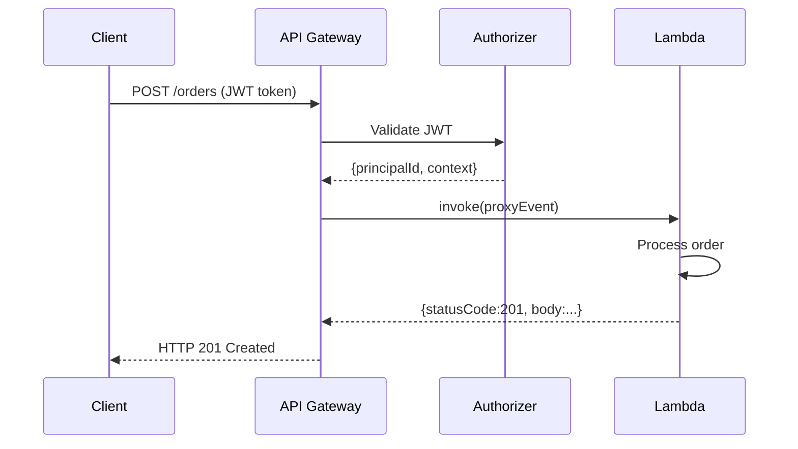
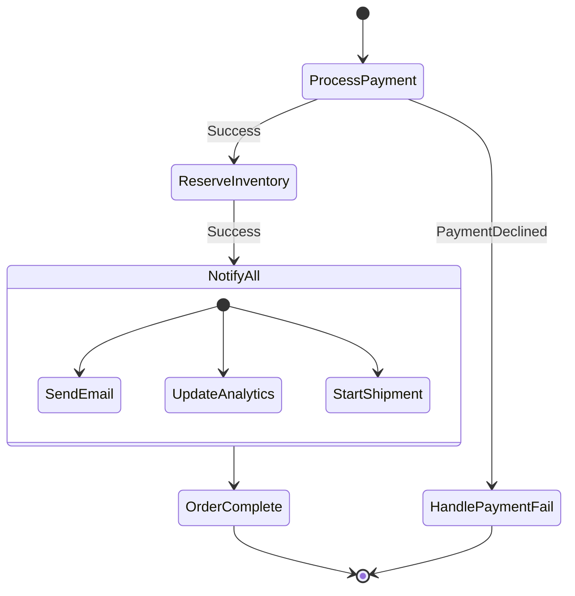

## Keywords in This File
{: .no_toc }

| # | Keyword | Weight |
|---|---------|--------|
| 16 | [API Gateway and Lambda Integration](#api-gateway-and-lambda-integration) | ★★☆ |
| 17 | [AWS Step Functions](#aws-step-functions) | ★★☆ |

---

# API Gateway and Lambda Integration

**Interview Weight:** ★★☆ - Serverless API layer.
API Gateway is the fully managed HTTP front door for
serverless architectures. It handles request routing,
authentication, throttling, and CORS, invoking Lambda
as the compute backend. Understanding integration types,
throttling, stage management, and Lambda proxy integration
is core for serverless backend engineers.

---

### 🎯 Model Answer

**30 seconds:**

> API Gateway is a fully managed service for building,
> deploying, and scaling APIs. It routes HTTP requests
> to backends - Lambda for serverless, or HTTP/EC2 for
> non-serverless. REST API and HTTP API are the two
> main types. Lambda proxy integration: API Gateway
> passes the full request to Lambda as an event;
> Lambda returns a structured response with statusCode,
> headers, body. HTTP API is newer, cheaper, and faster
> but has fewer features than REST API.

**3 minutes:**

> API Gateway types:
>
> REST API: full feature set. Custom authorizers, usage
> plans, API keys, WAF integration, request/response
> transformations, mock integrations. Higher cost.
>
> HTTP API: simpler, cheaper (~70% less), lower latency.
> Native JWT authorization, CORS, Lambda proxy. Missing:
> usage plans, API keys, request validation. Use when
> you do not need REST API features.
>
> WebSocket API: persistent connections, two-way comms.
>
> Lambda proxy integration (most common):
>
> API Gateway passes the full HTTP request to Lambda
> as a structured event: method, path, headers,
> query parameters, body, request context. Lambda
> returns: `{"statusCode": 200, "headers": {...},
> "body": "..."}`. API Gateway uses this to form the
> HTTP response. Lambda handles all routing internally
> (e.g., using Spring Web or Quarkus REST).
>
> Throttling:
>
> Account limit: 10,000 req/s (request increase from
> Service Quotas). Burst limit: 5,000 requests.
> Per-stage and per-route throttling overrides.
> Over limit: 429 Too Many Requests.
>
> Stages and deployment:
>
> Stage = deployment environment (dev, staging, prod).
> Each stage has own URL, settings, throttling, logging.
> Stage variables: pass environment-specific config to
> Lambda (function alias, DB endpoint).

**Blank Mind Recovery:**

**(1) Integration:** "Proxy integration: full request
as event. Lambda returns {statusCode, headers, body}."

**(2) API types:** "REST API = full features, more cost.
HTTP API = simpler, cheaper, JWT auth, no usage plans."

**(3) Throttling:** "10K req/s account limit. 429 when
over. Per-stage and per-method overrides."

---

### 📘 Concept Explanation

**Lambda Proxy Integration Request/Response:**

```
Client -> API Gateway -> Lambda

API Gateway wraps request as event:
{
  "httpMethod": "POST",
  "path": "/orders",
  "headers": {"Content-Type": "application/json"},
  "queryStringParameters": {"page": "1"},
  "body": "{\"customerId\":\"123\",\"items\":[...]}",
  "requestContext": {
    "identity": {"sourceIp": "1.2.3.4"},
    "authorizer": {"claims": {"sub": "user-id"}}
  }
}

Lambda processes and returns:
{
  "statusCode": 201,
  "headers": {
    "Content-Type": "application/json",
    "Location": "/orders/456"
  },
  "body": "{\"orderId\":\"456\",\"status\":\"created\"}"
}

API Gateway converts to HTTP 201 with headers and body.
```

> **Code walkthrough:** This example demonstrates the core pattern in action. The key mechanism shows how the concept works in practice. Study the structure to understand the essential behavior and common usage.

---

### 💻 Code Example

```java
// BAD: Lambda handler that does not use proxy integration
// Returns plain string -> API Gateway cannot parse
public String handleRequest(Map<String, Object> event,
        Context context) {
    String customerId = (String)
        ((Map)event.get("queryStringParameters"))
        .get("customerId");
    return "Customer: " + customerId;
    // API Gateway expects {statusCode, headers, body}
    // This returns a plain String -> 502 Bad Gateway
}
```

> **Code walkthrough:** This example demonstrates the core pattern in action. The key mechanism shows how the concept works in practice. Study the structure to understand the essential behavior and common usage.

```java
// GOOD: Correct Lambda proxy integration response
public Map<String, Object> handleRequest(
        Map<String, Object> event, Context context) {
    // Extract from proxy integration event:
    String method = (String) event.get("httpMethod");
    String path = (String) event.get("path");
    String body = (String) event.get("body");
    Map<String, String> headers =
        (Map<String, String>) event.get("headers");
    Map<String, String> queryParams =
        (Map<String, String>)
            event.get("queryStringParameters");

    // Process request:
    Object responseBody = processRequest(
        method, path, body, queryParams);

    // Return structured response:
    return Map.of(
        "statusCode", 200,
        "headers", Map.of(
            "Content-Type", "application/json",
            "Access-Control-Allow-Origin", "*"
        ),
        "body", toJson(responseBody)
    );
}

// For error responses:
private Map<String, Object> errorResponse(
        int statusCode, String message) {
    return Map.of(
        "statusCode", statusCode,
        "headers", Map.of("Content-Type","application/json"),
        "body", toJson(Map.of("error", message))
    );
}
```

> **Code walkthrough:** This example demonstrates the core pattern in action. The key mechanism shows how the concept works in practice. Study the structure to understand the essential behavior and common usage.

```bash
# Deploy HTTP API with Lambda integration:
# Create HTTP API:
API_ID=$(aws apigatewayv2 create-api \
  --name my-api \
  --protocol-type HTTP \
  --cors-configuration \
    AllowOrigins="https://myapp.com",AllowMethods="*" \
  --query 'ApiId' --output text)

# Create Lambda integration:
INT_ID=$(aws apigatewayv2 create-integration \
  --api-id $API_ID \
  --integration-type AWS_PROXY \
  --integration-uri arn:aws:lambda:...:function:my-fn \
  --payload-format-version "2.0" \
  --query 'IntegrationId' --output text)

# Create route:
aws apigatewayv2 create-route \
  --api-id $API_ID \
  --route-key "POST /orders" \
  --target integrations/$INT_ID

# Deploy to stage:
aws apigatewayv2 create-stage \
  --api-id $API_ID \
  --stage-name prod \
  --auto-deploy true

# Grant API Gateway permission to invoke Lambda:
aws lambda add-permission \
  --function-name my-fn \
  --statement-id apigw-invoke \
  --action lambda:InvokeFunction \
  --principal apigateway.amazonaws.com \
  --source-arn "arn:aws:execute-api:...:$API_ID/*/POST/orders"

# Configure throttling (per-route):
aws apigatewayv2 update-stage \
  --api-id $API_ID --stage-name prod \
  --default-route-settings \
    ThrottlingBurstLimit=100,ThrottlingRateLimit=50
# 50 steady-state req/s, 100 burst
```

> **Code walkthrough:** The BAD Lambda returns a plain
> string - API Gateway proxy integration expects a JSON
> object with `statusCode`, `headers`, and `body`. A
> plain string response causes a 502 Bad Gateway. The
> GOOD handler extracts all HTTP context from the proxy
> integration event and returns the structured response.
> The API creation sequence shows HTTP API (v2, cheaper)
> with CORS configured at the API level rather than in
> Lambda. The `payload-format-version "2.0"` is the
> HTTP API format; REST API uses "1.0". The Lambda
> permission grant is mandatory: API Gateway must be
> explicitly allowed to invoke the Lambda function.

---

### 🎓 Answers by Seniority

**Junior / Mid:**

> "API Gateway sits in front of Lambda functions. It
> receives HTTP requests and invokes Lambda with the
> request details. Lambda returns a response object
> with a status code, headers, and body. API Gateway
> translates that into an HTTP response. HTTP API is
> cheaper and simpler than REST API. REST API has more
> features like usage plans, request validation, and
> AWS WAF integration."

**Senior / Staff:**

> "The key design decision is REST API vs HTTP API.
> HTTP API is the default choice: 70% cheaper, lower
> latency, simpler configuration. Use REST API only
> when you need: usage plans and API keys, request/
> response transformation, private API (inside VPC),
> or REST-specific features.
>
> For production Lambda + API Gateway:
>
> Lambda concurrency and API Gateway throttling are
> separate limits. API Gateway 429 occurs at the account/
> route throttle limit. Lambda throttle occurs when all
> Lambda concurrency is consumed. Set API Gateway throttle
> to match the Lambda concurrency to avoid Lambda cold-start
> bursts overwhelming the function.
>
> Lambda function aliases + stage variables: deploy to
> a Lambda alias (`prod`, `staging`) and configure API
> Gateway stage variable to point to the alias. When
> deploying a new Lambda version: update the alias, no
> API Gateway change needed. This separates the Lambda
> deployment from the API Gateway deployment.
>
> Canary deployments: API Gateway supports weighted
> routing to a canary stage (10% of traffic to new
> version). If metrics show increased errors: shift
> 100% back instantly."

---

### ⚠️ Common Misconceptions

**Misconception: "API Gateway is only for REST APIs."**

API Gateway supports REST APIs (resource + method model),
HTTP APIs (route-based, cheaper), WebSocket APIs
(persistent bidirectional connections), and can integrate
with non-Lambda backends (HTTP endpoints, AWS services
directly via action integration). Direct AWS service
integrations in REST API allow API Gateway to call
DynamoDB, SQS, Kinesis, or other services without a
Lambda in between. For example: POST /events -> API
Gateway -> SQS `SendMessage` directly. This eliminates
a Lambda invocation for simple pass-through use cases.

---

### 🚨 Failure Modes and Diagnosis

**Failure: 502 Bad Gateway from API Gateway**

*Symptom:* HTTP 502 response with no informative body.
Lambda was invoked (appears in logs) but caller gets 502.

*Root cause candidates:*

1. Lambda returned malformed response (most common):
   missing `statusCode`, body not a string, headers
   not a map.

2. Lambda threw an unhandled exception: unhandled
   exceptions in Lambda return an error object, not
   a proxy response. API Gateway converts to 502.

3. Lambda timed out: if Lambda exceeds its 15-minute
   limit, API Gateway returns 502 (its own 29-second
   timeout fires first for HTTP APIs).

*Diagnosis:*
```bash
# Enable API Gateway execution logs:
aws apigateway update-stage \
  --rest-api-id $API_ID \
  --stage-name prod \
  --patch-operations \
    op=replace,path=/loggingLevel,value=INFO

# View logs:
aws logs tail /aws/apigateway/$API_ID \
  --filter-pattern "502" --follow
# Shows the exact Lambda response that caused 502

# Check Lambda logs for unhandled exceptions:
aws logs tail /aws/lambda/my-function \
  --filter-pattern "ERROR" --follow
```

> **Code walkthrough:** This example demonstrates the core pattern in action. The key mechanism shows how the concept works in practice. Study the structure to understand the essential behavior and common usage.

*Fix:* Add a global exception handler in Lambda that
catches all unhandled exceptions and returns a proper
proxy response with a 500 status code. Never let
unhandled exceptions bubble up in a proxy Lambda.

---

### ⚖️ Comparison Table

| Feature | REST API | HTTP API | WebSocket API |
|---------|----------|----------|---------------|
| Cost | $3.50/million | $1.00/million | $1.00/million |
| Latency | ~10ms overhead | ~5ms overhead | N/A |
| Lambda proxy | Yes | Yes | Yes |
| Usage plans / API keys | Yes | No | No |
| JWT authorization | Via Lambda authorizer | Native | No |
| Request validation | Yes | No | No |
| AWS service integration | Yes | No | No |
| CORS | Manual | Native | N/A |
| WebSocket | No | No | Yes |
| Best for | Complex APIs, enterprise | Simple serverless APIs | Real-time |

---

### 🏛️ System Design

*(Omit: non-★★★ keyword.)*

---

### 📊 Diagram

```
API Gateway + Lambda Flow:

Client
  | HTTPS POST /orders
  v
API Gateway
  | 1. Authentication (JWT/Cognito/Lambda authorizer)
  | 2. Throttle check (req/s limit)
  | 3. Request validation (optional)
  | 4. Build proxy integration event
  v
Lambda Invocation
  | Event: {httpMethod, path, headers, body, context}
  |
  | Process (30s max, 29s for HTTP API)
  v
Lambda Response
  | {statusCode: 201, headers: {...}, body: "..."}
  v
API Gateway
  | 5. Build HTTP response from Lambda output
  | 6. Apply response headers (CORS, etc.)
  v
Client: HTTP 201 with body
```



> **Diagram walkthrough:** API Gateway orchestrates the
> full request lifecycle: authentication before Lambda
> is invoked (failed auth never reaches Lambda - saves
> cost). The proxy integration event carries the full
> HTTP context including the authorizer's output (claims
> from JWT validation), so Lambda knows the caller's
> identity without re-validating. Lambda's response
> object is the contract - every field maps to HTTP
> response components. The 29-second API Gateway timeout
> for HTTP APIs is a hard limit; Lambda's 15-minute
> max timeout is irrelevant for synchronous API calls.

---

---

---

### 💻 Code Example

*(Omit: this concept does not have a programmatic interface that can be demonstrated in code. The conceptual explanation above is sufficient.)*


---

### 🏛️ System Design

*(Omit: system design diagram not applicable for this concept - see ★★★ keywords for full system design coverage.)*


---

### ⚖️ Comparison Table

*(Omit: this is a ★☆☆ foundational concept with no direct alternatives to compare - see higher-difficulty keywords for trade-off analysis.)*


---

### 📊 Diagram

*(Omit: no standalone visual diagram required for this concept - the explanations and code examples above provide sufficient clarity.)*


# AWS Step Functions

**Interview Weight:** ★★☆ - Serverless orchestration.
Step Functions orchestrates multi-step workflows as
state machines. It replaces complex Lambda-chaining code
with visual workflow graphs, handles retries and error
catching, and supports parallel execution and human
approval steps. Essential for complex business processes,
data pipelines, and microservice choreography.

---

### 🎯 Model Answer

**30 seconds:**

> Step Functions is AWS's serverless workflow orchestrator.
> You define a state machine (JSON or YAML) with states:
> Task (call Lambda/service), Choice (conditional branching),
> Parallel (concurrent execution), Wait, and more. Step
> Functions tracks state, handles retries, catches errors,
> and maintains execution history. Standard workflows:
> exactly-once, up to 1 year. Express workflows: at-least-once,
> up to 5 minutes, high throughput.

**3 minutes:**

> State machine fundamentals:
>
> States: each step in the workflow is a state.
> Task state: calls a Lambda, ECS task, DynamoDB API,
>   SQS queue, or other AWS service.
> Choice state: conditional branching based on input.
> Parallel state: executes branches concurrently,
>   waits for all to complete.
> Wait state: pause for N seconds or until timestamp.
> Fail/Succeed: terminal states.
>
> Standard vs Express:
>
> Standard: exactly-once, 1-year max, full execution
> history in console, up to 2K events/s.
> Use for: business processes (order fulfillment),
> data pipelines, infrequent long-running workflows.
>
> Express: at-least-once, 5-min max, high throughput
> (100K events/s), lower cost per execution.
> Use for: high-volume event processing, streaming
> data workflows.
>
> Retry and catch:
>
> Each Task state can have Retry (exponential backoff
> with jitter) and Catch (error handling) configurations.
> Retry: on specific error types, retry N times with
> backoff. Catch: on failure after retries, transition
> to error handling state.

**Blank Mind Recovery:**

**(1) Core pattern:** "State machine: Task -> Choice ->
Parallel. Tracks state, retries, catches errors."

**(2) Standard vs Express:** "Standard = exactly-once,
1 year, full history. Express = at-least-once, 5 min,
high throughput."

**(3) Retry/Catch:** "Retry: N times with backoff on
error. Catch: transition to error state after retries."

---

### 📘 Concept Explanation

**Why Step Functions vs Lambda chaining:**

```
Lambda chaining (BAD for complex flows):
  Lambda A -> calls Lambda B -> calls Lambda C
  Problems:
  - Lambda A waits while Lambda B runs (costs money)
  - If Lambda C fails: how do you retry just C?
  - No visibility into which step failed
  - State passed as function parameters (fragile)
  - Adding a step = modify Lambda code

Step Functions (orchestration):
  State Machine:
    [Process Order Task]
      |
      | Success
      v
    [Reserve Inventory Task]  <- Retry: 3 times, exp backoff
      |
      | Success
      v
    [Parallel State]
      |---[Send Email Task]
      |---[Update Analytics Task]
      |---[Start Shipment Task]
      v (all complete)
    [Complete Order Task]

  Benefits:
  - Each Lambda runs only for its task (no waiting)
  - Retry/catch per step with no code changes
  - Full execution history in Step Functions console
  - State stored in Step Functions (not Lambda memory)
  - Add steps without modifying other Lambdas
```

> **Code walkthrough:** This example demonstrates the core pattern in action. The key mechanism shows how the concept works in practice. Study the structure to understand the essential behavior and common usage.

---

### 💻 Code Example

```json
// BAD: Lambda orchestrating other Lambdas (anti-pattern)
// This Lambda waits while calling others:
// {
//   "ProcessOrder": lambda that calls InventoryLambda,
//     then calls EmailLambda, then calls AnalyticsLambda
// }
// Problems: paying for all invocations to be running,
// no retry logic, no visibility, no human approval support
```

> **Code walkthrough:** This example demonstrates the core pattern in action. The key mechanism shows how the concept works in practice. Study the structure to understand the essential behavior and common usage.

```json
// GOOD: Step Functions state machine definition
{
  "Comment": "Order fulfillment workflow",
  "StartAt": "ProcessPayment",
  "States": {
    "ProcessPayment": {
      "Type": "Task",
      "Resource":
        "arn:aws:lambda:...:function:process-payment",
      "Retry": [{
        "ErrorEquals": ["Lambda.ServiceException",
          "Lambda.TooManyRequestsException"],
        "IntervalSeconds": 2,
        "MaxAttempts": 3,
        "BackoffRate": 2
      }],
      "Catch": [{
        "ErrorEquals": ["PaymentDeclined"],
        "Next": "HandlePaymentFailure"
      }],
      "Next": "ReserveInventory"
    },
    "ReserveInventory": {
      "Type": "Task",
      "Resource":
        "arn:aws:lambda:...:function:reserve-inventory",
      "Next": "NotifyAll"
    },
    "NotifyAll": {
      "Type": "Parallel",
      "Branches": [
        {
          "StartAt": "SendConfirmationEmail",
          "States": {
            "SendConfirmationEmail": {
              "Type": "Task",
              "Resource":
                "arn:aws:lambda:...:function:send-email",
              "End": true
            }
          }
        },
        {
          "StartAt": "UpdateAnalytics",
          "States": {
            "UpdateAnalytics": {
              "Type": "Task",
              "Resource":
                "arn:aws:lambda:...:function:update-analytics",
              "End": true
            }
          }
        }
      ],
      "Next": "OrderComplete"
    },
    "OrderComplete": {
      "Type": "Succeed"
    },
    "HandlePaymentFailure": {
      "Type": "Task",
      "Resource":
        "arn:aws:lambda:...:function:notify-payment-failure",
      "End": true
    }
  }
}
```

> **Code walkthrough:** This example demonstrates the core pattern in action. The key mechanism shows how the concept works in practice. Study the structure to understand the essential behavior and common usage.

```bash
# Start a Step Functions execution:
aws stepfunctions start-execution \
  --state-machine-arn arn:aws:states:...:stateMachine:OrderWorkflow \
  --input '{"orderId":"123","customerId":"456","amount":99.99}'
# Returns executionArn for tracking

# Get execution status:
aws stepfunctions describe-execution \
  --execution-arn $EXECUTION_ARN
# Status: RUNNING | SUCCEEDED | FAILED | TIMED_OUT | ABORTED
# Output: final state machine output (on success)

# Get step-by-step execution history:
aws stepfunctions get-execution-history \
  --execution-arn $EXECUTION_ARN
# Shows each state entered/exited with timestamps
# For debugging: which step failed, what was the error

# Wait for task token (human approval pattern):
# Step definition uses .waitForTaskToken:
# "Resource": "arn:aws:states:::lambda:invoke.waitForTaskToken"
# Lambda receives taskToken in event
# Human approves in UI -> Lambda calls:
aws stepfunctions send-task-success \
  --task-token "$TASK_TOKEN" \
  --task-output '{"approved": true}'
# Or reject:
aws stepfunctions send-task-failure \
  --task-token "$TASK_TOKEN" \
  --error "HumanRejected" \
  --cause "Manager rejected the request"
```

> **Code walkthrough:** The state machine JSON shows the
> three key patterns: Retry (automatically retries Lambda
> throttling errors with exponential backoff), Catch
> (transitions to error handling state on PaymentDeclined),
> and Parallel (sends email and updates analytics
> concurrently without waiting for one to complete before
> starting the other). The `waitForTaskToken` pattern
> (human approval) pauses execution indefinitely until
> an external system calls `send-task-success`. This is
> fundamentally impossible with Lambda chaining. The
> `get-execution-history` command shows every state
> transition with timestamps - the operational debugging
> tool that Lambda chaining cannot provide.

---

### 🎓 Answers by Seniority

**Junior / Mid:**

> "Step Functions is a visual workflow orchestrator.
> You define a state machine with states like Task
> (calling a Lambda), Choice (if/else branching),
> and Parallel (concurrent). It handles retries and
> error catching between steps. The main benefit over
> calling Lambdas from Lambdas: Step Functions tracks
> state, provides execution history for debugging,
> and handles retries without adding code to each Lambda."

**Senior / Staff:**

> "Step Functions addresses the fundamental problem with
> Lambda orchestration: Lambda is stateless and short-lived.
> Complex workflows need durable state and coordination.
>
> Standard vs Express choice matters for cost and
> consistency. Standard is exactly-once per state
> transition - critical for workflows that cannot
> re-process (payment, inventory). Express is at-least-once
> - acceptable for idempotent steps. Express is 100x
> cheaper per state transition at high volume.
>
> SDK integrations (optimized integrations) are the
> production pattern: Step Functions calls DynamoDB,
> SQS, ECS, and more directly without a Lambda wrapper.
> A workflow that reads from DynamoDB, processes, and
> writes to SQS does not need Lambda for those steps.
> Reduce cost by removing Lambda invocations from
> simple state transitions.
>
> The `waitForTaskToken` pattern is Step Functions'
> killer feature: pause indefinitely waiting for
> human approval, callback from an external system, or
> third-party webhook. The workflow can wait years if
> needed (Standard). No polling, no timeout concerns."

---

### ⚠️ Common Misconceptions

**Misconception: "Step Functions is only for microservice
orchestration. Lambda chaining is simpler for small flows."**

Lambda chaining has hidden operational costs: no
execution history (which step failed?), no per-step
retry configuration (either all-or-nothing), no pause
for human approval, and Lambda is billed for waiting
time while downstream Lambda runs. Step Functions'
execution history in the AWS console is the operational
benefit: when an order fails, you see exactly which
step failed, what the input was, and what the error
was - in 30 seconds. With Lambda chaining, you spend
hours correlating logs across multiple log groups.
For workflows with 3+ steps, retry requirements, or
observability needs: Step Functions is the correct tool.

---

### 🚨 Failure Modes and Diagnosis

**Failure: Step Functions execution stuck in RUNNING
state for hours with no progress**

*Symptom:* Execution status is RUNNING. No recent
state transitions in execution history. Lambda logs
show no recent invocations.

*Root cause candidates:*

1. `waitForTaskToken` waiting for a callback that
   never comes (heartbeat timeout not configured).

2. Lambda is invoked but not completing (timeout or
   infinite loop).

3. Activity task waiting for a poller that stopped.

*Diagnosis:*
```bash
# Get execution history to see last state:
aws stepfunctions get-execution-history \
  --execution-arn $EXECUTION_ARN \
  --query 'events[-10:]'
# Last few events: which state is it stuck in?

# If stuck waiting for task token:
# Check if Lambda received the token:
aws logs filter-log-events \
  --log-group-name /aws/lambda/approval-function \
  --filter-pattern "taskToken"

# Configure heartbeat timeout to detect stuck tasks:
# In state definition:
# "HeartbeatSeconds": 60
# Lambda must call send-task-heartbeat every 60s
# If no heartbeat: execution fails with HeartbeatTimeout

# Force abort a stuck execution:
aws stepfunctions stop-execution \
  --execution-arn $EXECUTION_ARN \
  --error "ManualAbort" \
  --cause "Stuck execution - manual intervention"
```

> **Code walkthrough:** This example demonstrates the core pattern in action. The key mechanism shows how the concept works in practice. Study the structure to understand the essential behavior and common usage.

*Fix:* Add `HeartbeatSeconds` to task states that
wait for callbacks. Set `TimeoutSeconds` as max
execution time. Configure CloudWatch alarm on
`ExecutionsTimedOut` metric.

---

### ⚖️ Comparison Table

| Feature | Standard Workflow | Express Workflow |
|---------|------------------|------------------|
| Execution semantics | Exactly-once | At-least-once |
| Max duration | 1 year | 5 minutes |
| Throughput | 2,000 transitions/s | 100,000 transitions/s |
| Execution history | Full (90 days) | CloudWatch Logs only |
| Cost (per state transition) | $0.025/1K | $0.00001/1K |
| Debugging | Console visualization | CloudWatch Logs |
| Best for | Business processes, long workflows | High-volume event processing |

---

### 🏛️ System Design

*(Omit: non-★★★ keyword.)*

---

### 📊 Diagram

```
Order Fulfillment State Machine:

[START]
  |
  v
[ProcessPayment Task]
  | Success            | PaymentDeclined (Catch)
  v                    v
[ReserveInventory]  [NotifyPaymentFailed]
  |                    |
  v                    v
[Parallel State]    [FAIL]
  |-- [SendEmail Task]
  |-- [UpdateAnalytics Task]
  |-- [StartShipment Task]
  | (all 3 complete)
  v
[OrderComplete Task]
  |
  v
[SUCCEED]

Note: Each Task has Retry with exponential backoff.
Execution history: full step-by-step audit trail.
```



> **Diagram walkthrough:** The state machine shows the
> two critical flow paths: the happy path (payment ->
> inventory -> parallel notifications -> complete) and
> the error path (payment declined -> notify -> fail).
> The Parallel state fans out to three concurrent Tasks;
> Step Functions waits for ALL three to complete before
> proceeding. The Retry configuration on each Task
> (not shown in diagram for clarity) handles transient
> Lambda failures automatically. The execution history
> records every state transition: when investigating
> a failed order, the AWS console shows exactly which
> step failed, what input it received, and what error
> it returned.

---

### 🎯 Interview Deep-Dive

> **Timing:** 5-7 minutes per question for ★★☆ keywords.

| Type | Questions |
|------|-----------|
| CONCEPT | 2 |
| DEBUGGING | 1 |
| TRADE-OFF | 1 |
| BEHAVIORAL | 1 |
| SCENARIO | 2 |
| ARCHITECTURE | 1 |

> Note: Both keywords share this Deep-Dive section.

---

#### CONCEPT 1 (API Gateway): What is the difference between REST API and HTTP API? When do you use each?

**REST API (v1):**

Launched 2015. Full feature set:
- Custom Lambda authorizers
- Usage plans and API keys (rate limit per consumer)
- Request/response transformation (Velocity templates)
- AWS service direct integrations (no Lambda needed)
- Request validation (model schemas)
- Private APIs (VPC only)
- AWS WAF integration at API level
- AWS X-Ray tracing

Cost: $3.50/million API calls.

**HTTP API (v2):**

Launched 2019. Streamlined:
- Native JWT authorizer (Cognito, Auth0, etc.)
- Native CORS configuration
- Lambda proxy v2 format (simpler event structure)
- No usage plans, no API keys
- No request transformation
- No AWS service integrations
- Private APIs supported
- Automatic deployments (optional)

Cost: $1.00/million (71% cheaper).
Latency: ~5ms vs ~10ms for REST API.

**Decision:**

Use HTTP API (default choice) when:
- Lambda proxy integration
- JWT authorization (Cognito or OIDC provider)
- Simple REST CRUD API
- Cost and latency matter

Use REST API when:
- API keys and usage plans for multiple consumers
- Request validation and transformation
- AWS WAF integration at the API level
- Direct AWS service integration (no Lambda)
- Private VPC API

*What separates good from great:* The "no Lambda" AWS
service integration in REST API is the advanced feature:
API Gateway -> DynamoDB `PutItem` directly without a
Lambda. For simple data-passing operations, this
eliminates Lambda cold starts and invocation costs.
HTTP API cannot do this - it always needs a Lambda.

---

#### CONCEPT 2 (Step Functions): When do you choose Step Functions over Kafka for workflow orchestration?

**Kafka** (with Kafka Streams or consumers):

Event-driven: events flow continuously. Services
react to events. No central orchestrator.
Strength: high throughput (millions events/s),
replay, fan-out.
Weakness: complex error handling (dead letter topics,
manual retry logic), no built-in state machine,
sequential dependency requires careful consumer design.

**Step Functions** (orchestration):

Central state machine coordinates the workflow.
Knows exactly where each execution is.
Strength: exact retry control per step, branching,
parallel, human approval, full execution history.
Weakness: lower throughput (2K transitions/s standard),
5-minute limit for Express, cost per transition.

**Choose Step Functions when:**

1. Steps have strict dependencies (B must complete
   before C starts).
2. You need per-step retry with backoff.
3. Human approval is part of the process.
4. You need execution history for debugging/audit.
5. The workflow has complex branching (Choice state).
6. Max throughput: 2K/s (Standard) is sufficient.

**Choose Kafka/event-driven when:**

1. Services are loosely coupled (each reacts to events).
2. Throughput exceeds Step Functions limits.
3. Event replay is needed.
4. Services are designed as independent event processors
   without explicit coordination.

**Rule of thumb:**

Use Step Functions when you are orchestrating a specific
business process with clear steps. Use Kafka when you
are reacting to events across loosely coupled services.

*What separates good from great:* Many teams force
Kafka into orchestration by building state machines on
top of event streams. This is complex and fragile.
Step Functions is purpose-built for orchestration.
The two tools are complementary: Kafka for event
streams, Step Functions for workflow coordination.

---

#### DEBUGGING 1 (Step Functions): An execution failed in step 3. How do you debug?

**Step 1: Get the execution history:**

```bash
aws stepfunctions get-execution-history \
  --execution-arn $EXECUTION_ARN \
  --query 'events[*].{type:type,time:timestamp}'
# Shows each state entered and exited with timestamps
# Find: TaskStateFailed or ExecutionFailed event
```

> **Code walkthrough:** This example demonstrates the core pattern in action. The key mechanism shows how the concept works in practice. Study the structure to understand the essential behavior and common usage.

**Step 2: Find the failure details:**

```bash
aws stepfunctions get-execution-history \
  --execution-arn $EXECUTION_ARN \
  --query 'events[?type==`TaskFailed`]'
# Returns: cause, error string for the failed task
```

> **Code walkthrough:** This example demonstrates the core pattern in action. The key mechanism shows how the concept works in practice. Study the structure to understand the essential behavior and common usage.

**Step 3: Get the Lambda logs for the failed invocation:**

Each Task event has a resource invocation ID.
Find the Lambda RequestId in the execution history.
Look up that RequestId in CloudWatch Logs:

```bash
aws logs filter-log-events \
  --log-group-name /aws/lambda/process-payment \
  --filter-pattern "RequestId: abc-123-def"
# Shows the full Lambda invocation logs
```

> **Code walkthrough:** This example demonstrates the core pattern in action. The key mechanism shows how the concept works in practice. Study the structure to understand the essential behavior and common usage.

**Step 4: Check if it was retried:**

Execution history shows each retry attempt as
a separate `TaskStateEntered` event. If the task
was retried 3 times and then failed: you see 3
`TaskStateEntered` + 3 `TaskStateFailed` events
for the same task.

**Step 5: Step Functions console (fastest for debugging):**

AWS console -> Step Functions -> execution -> Graph.
Click on the failed state (red). Shows input, output,
error, and cause for that state. Much faster than CLI.

*What separates good from great:* The console graph
visualization is the fastest debugging tool for Step
Functions. Experienced engineers go there first, not
the CLI. The error and cause fields in the execution
history event contain the Lambda error type and message.
For production: enable CloudWatch Logs on the state
machine itself to capture all execution events centrally
for long-term retention (execution history expires after
90 days).

---

#### TRADE-OFF 1: REST API with Lambda vs API Gateway direct DynamoDB integration.

**Scenario:** Simple CRUD API for a product catalog.
GET /products/{id} -> return product. PUT /products/{id}
-> update product. DynamoDB as the data store.

**Option A: REST API -> Lambda -> DynamoDB:**

Flow: API Gateway -> Lambda -> DynamoDB.
Lambda: deserialize event, validate, call DynamoDB SDK.
Cold start: 300-500ms (Python/Node) or 1-3s (Java).
Cost: API Gateway + Lambda invocation + DynamoDB.
Code: you maintain the Lambda code.
Transformation: Lambda can add business logic.

**Option B: REST API -> DynamoDB direct integration:**

API Gateway uses Velocity Template Language to map
HTTP request to DynamoDB `GetItem` API directly.
Flow: API Gateway -> DynamoDB (no Lambda).
Cold start: none (API Gateway to DynamoDB directly).
Cost: API Gateway + DynamoDB (no Lambda).
Code: VTL templates in API Gateway (less maintainable).
Transformation: limited to VTL.

**Decision matrix:**

Direct DynamoDB integration: use when:
- Pure CRUD with no business logic
- Latency is critical (cold start elimination)
- Simple request/response mapping
- Team is comfortable with VTL (small, learning curve)

Lambda integration: use when:
- Business logic beyond simple CRUD
- Input validation beyond schema
- Multiple data sources
- Team prefers application code to VTL

**Real production consideration:**

DynamoDB direct integration is brittle: VTL errors
are hard to debug. Lambda adds resilience, testability,
and maintainability. For 99% of APIs, Lambda integration
is the correct choice. Direct DynamoDB integration
is a premature optimization unless latency profiling
shows Lambda cold start as the specific bottleneck.

*What separates good from great:* Provisioned concurrency
on Lambda eliminates cold starts for latency-sensitive
APIs (Lambda is kept warm). At that point, the direct
integration's latency advantage disappears, and Lambda's
maintainability wins.

---

#### BEHAVIORAL 1: Describe a time you improved reliability using Step Functions.

**STAR:**

**Situation:** E-commerce order fulfillment was a single
monolithic Lambda that called 5 downstream services
sequentially: inventory check, payment, reservation,
email, analytics. 2% of orders failed with no clear
indication of which step failed or what the order state
was. Retrying the Lambda ran all 5 steps again - causing
double-charges if payment had succeeded before failure.

**Task:** Redesign the orchestration for reliability
without duplicate charges.

**Analysis:**

The Lambda chaining problem: if payment succeeded and
email service failed, the Lambda failed. Retry would
re-run payment (double charge). No retry logic per step.
No execution history.

**Solution:** Step Functions standard workflow.
Each step as a separate Task state. Retry only for
transient errors (Lambda throttling, service exceptions).
Payment step: exactly-once (standard workflow, exactly-once
transitions). Email step: Catch on failure -> continue
(non-critical). Analytics step: async fire-and-forget
(separate SQS queue, decoupled).

**Key design:**

Payment + Inventory: standard workflow (exactly-once).
Email: Catch handler (if email fails, log but continue).
Analytics: removed from the main workflow - publish
event to EventBridge instead, async.

**Result:**

Order failure rate: 2% -> 0.1% (most remaining from
actual business errors like insufficient inventory).
Debugging time: 45 minutes average -> 5 minutes (check
Step Functions execution history).
Zero duplicate charges after migration.

*What separates good from great:* The design decision
to remove analytics from the critical path (publish
async to EventBridge) is the resilience improvement.
The order completion success rate should not depend on
analytics recording success. Step Functions + async
decoupling combined.

---

#### SCENARIO 1: Design an order processing workflow for an e-commerce platform.

**Steps:**
1. Validate order (check inventory, customer credit limit)
2. Process payment
3. Reserve inventory
4. Parallel: send email, update analytics, start shipment
5. Complete order

**Design:**

```json
{
  "States": {
    "ValidateOrder": {
      "Type": "Task",
      "Resource": "arn:...:validate-order",
      "Retry": [{"ErrorEquals": ["Lambda.TooManyRequests"],
        "MaxAttempts": 3, "BackoffRate": 2}],
      "Catch": [{"ErrorEquals": ["InsufficientInventory"],
        "Next": "NotifyOutOfStock"},
        {"ErrorEquals": ["CreditLimitExceeded"],
        "Next": "NotifyPaymentProblem"}],
      "Next": "ProcessPayment"
    },
    "ProcessPayment": {
      "Type": "Task",
      "Resource": "arn:...:process-payment",
      "Retry": [{"ErrorEquals":
        ["Lambda.ServiceException"], "MaxAttempts": 1}],
      "Catch": [{"ErrorEquals": ["PaymentDeclined"],
        "Next": "NotifyPaymentDeclined"}],
      "Next": "ReserveInventory"
    },
    "ReserveInventory": {
      "Type": "Task",
      "Resource": "arn:...:reserve-inventory",
      "Next": "ParallelNotifications"
    },
    "ParallelNotifications": {
      "Type": "Parallel",
      "Branches": [
        {"StartAt": "SendEmail", "States":
          {"SendEmail": {"Type":"Task",
            "Resource":"arn:...:send-email", "End":true}}},
        {"StartAt": "UpdateAnalytics", "States":
          {"UpdateAnalytics": {"Type":"Task",
            "Resource":"arn:...:analytics", "End":true}}},
        {"StartAt": "StartShipment", "States":
          {"StartShipment": {"Type":"Task",
            "Resource":"arn:...:shipment", "End":true}}}
      ],
      "Next": "CompleteOrder"
    },
    "CompleteOrder": {"Type": "Succeed"}
  }
}
```

> **Code walkthrough:** This example demonstrates the core pattern in action. The key mechanism shows how the concept works in practice. Study the structure to understand the essential behavior and common usage.

**Payment safety:** Standard workflow - exactly-once
per state transition. Payment never re-runs on retry.

*What separates good from great:* Payment has
`MaxAttempts: 1` (no retry). Inventory check has
`MaxAttempts: 3` (idempotent, safe to retry). The
difference in retry policy per step is the production
correctness: only idempotent steps get retried.

---

#### SCENARIO 2: When does Step Functions NOT make sense? Give an example.

**Scenario: Real-time fraud detection for payments**

Requirements:
- Process 50,000 transactions/second
- Latency: < 100ms end-to-end
- Each transaction: check rules engine, ML model, blocklist

**Why Step Functions does not work:**

Standard workflows: 2,000 state transitions/second max.
50,000 TPS requires 25x more than the account limit.
Even with service quota increases, this is a hard
architectural mismatch.

Express workflows: 100,000 transitions/s, but 5-minute
max duration and at-least-once semantics (complex
for financial data).

**Correct architecture:**

```
Payment API -> Kinesis Data Stream (50K events/s)
  -> Lambda consumer (Kinesis trigger, batch 100)
  -> Parallel evaluation (in Lambda, single invocation):
     - Rules engine (in-memory)
     - ML feature computation
     - Redis blocklist lookup
  -> Decision in < 50ms
  -> Publish result to Kinesis output stream
```

> **Code walkthrough:** This example demonstrates the core pattern in action. The key mechanism shows how the concept works in practice. Study the structure to understand the essential behavior and common usage.

This is Lambda + Kinesis, not Step Functions.
No orchestration needed for a single-step parallel
evaluation. Lambda handles the "parallel" internally.

**Rule:** Use Step Functions for multi-step sequential
workflows with complex error handling. Use Kinesis +
Lambda for high-throughput event processing.

*What separates good from great:* Recognizing when
NOT to use a tool demonstrates architectural maturity.
Step Functions is sometimes over-applied to single-step
or high-throughput problems where Lambda + Kinesis is
the correct fit.

---

#### ARCHITECTURE 1: Design a multi-step data pipeline using Step Functions.

**Use case:** Nightly ETL pipeline.
- 11pm: extract data from RDS
- Transform and validate
- Load to Redshift
- Generate report
- Notify team

**Architecture:**

```
EventBridge Scheduler (cron: 11pm daily)
  -> Start Step Functions execution

State Machine (Standard Workflow):
  [ExtractData] -> Lambda -> reads RDS, writes to S3
    Retry: 3x on Lambda errors
    Timeout: 30 minutes

  [ValidateData] -> Lambda -> checks row counts, schema
    Catch: DataValidationError -> [NotifyValidationFail]

  [TransformData] -> ECS Fargate task (heavy compute)
    Resource: arn:...:ecs.waitForTaskToken
    Timeout: 2 hours (long running)

  [LoadToRedshift] -> Redshift Data API (direct SDK)
    Retry: 3x
    Timeout: 30 minutes

  [GenerateReport] -> Lambda
    Next: NotifySuccess

  [NotifySuccess] -> SNS.publish (direct SDK integration)
    End: true

  Error states:
    [NotifyValidationFail] -> SNS -> PagerDuty
    [NotifyFailure] -> SNS -> PagerDuty (catch-all)
```

> **Code walkthrough:** This example demonstrates the core pattern in action. The key mechanism shows how the concept works in practice. Study the structure to understand the essential behavior and common usage.

**Key design decisions:**

ECS Fargate for heavy transforms: Lambda has 15-minute
limit; transform may take 2 hours. Fargate + task token.

Direct SDK integrations: Redshift Data API and SNS called
directly (no Lambda). Reduces Lambda invocation count.

CloudWatch alarm on `ExecutionsFailed`:
```bash
aws cloudwatch put-metric-alarm \
  --alarm-name etl-pipeline-failed \
  --namespace AWS/States \
  --metric-name ExecutionsFailed \
  --threshold 1 --comparison-operator GreaterThanThreshold \
  --evaluation-periods 1 --period 300 \
  --alarm-actions arn:aws:sns:...:alerts
```

> **Code walkthrough:** This example demonstrates the core pattern in action. The key mechanism shows how the concept works in practice. Study the structure to understand the essential behavior and common usage.

*What separates good from great:* The ECS Fargate +
task token pattern is the production solution for
compute-heavy steps that exceed Lambda's 15-minute limit.
Step Functions initiates the ECS task, passes a task
token, and waits. The ECS task calls `send-task-success`
when done. Step Functions is compatible with any compute
type - not just Lambda.

---

---

### 💻 Code Example

*(Omit: this concept does not have a programmatic interface that can be demonstrated in code. The conceptual explanation above is sufficient.)*


---

### 🏛️ System Design

*(Omit: system design diagram not applicable for this concept - see ★★★ keywords for full system design coverage.)*


---

### ⚖️ Comparison Table

*(Omit: this is a ★☆☆ foundational concept with no direct alternatives to compare - see higher-difficulty keywords for trade-off analysis.)*


---

### 📊 Diagram

*(Omit: no standalone visual diagram required for this concept - the explanations and code examples above provide sufficient clarity.)*


