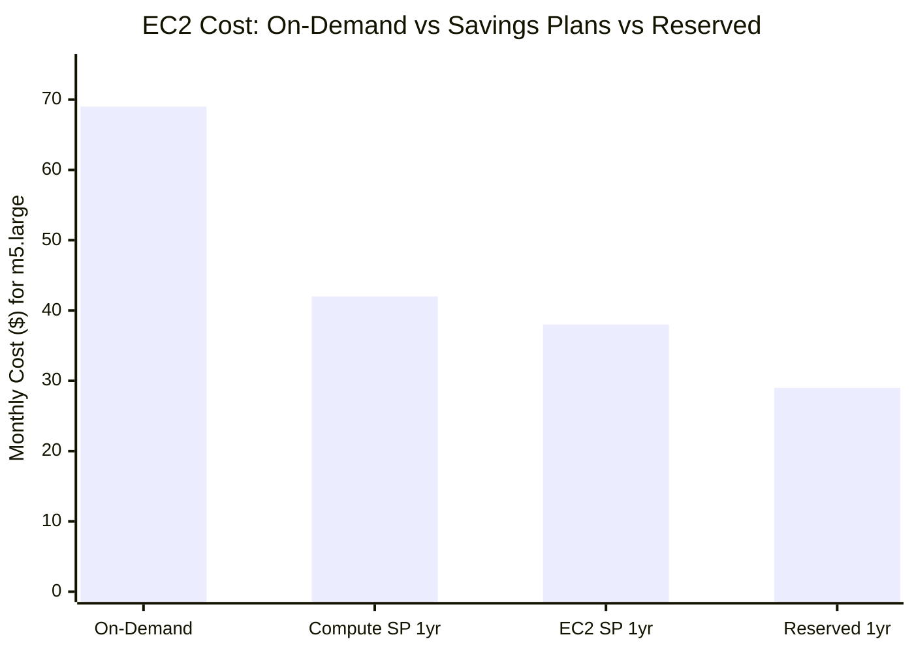
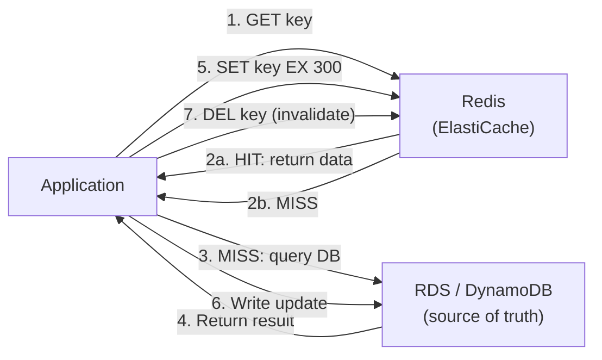

## Keywords in This File
{: .no_toc }

| # | Keyword | Weight |
|---|---------|--------|
| 22 | [AWS Cost Explorer and Savings Plans](#aws-cost-explorer-and-savings-plans) | ★★☆ |
| 23 | [ElastiCache and Caching Strategies](#elasticache-and-caching-strategies) | ★★☆ |

---

# AWS Cost Explorer and Savings Plans

**Interview Weight:** ★★☆ - Cost optimization.
AWS billing can be complex at scale. Cost Explorer
provides analysis and forecasting. Savings Plans and
Reserved Instances reduce compute costs by 30-72%.
Understanding the cost levers - compute purchase models,
data transfer costs, and rightsizing - is essential for
any AWS engineer responsible for production workloads.

---

### 🎯 Model Answer

**30 seconds:**

> AWS charges for compute, storage, data transfer, and
> API calls. Cost Explorer visualizes spend by service,
> account, tag, and time. Savings Plans: commit to a
> spending rate ($/hour) for 1 or 3 years in exchange
> for 30-66% discount on EC2, Lambda, and Fargate.
> Reserved Instances: commit to specific EC2 instance
> types for discounts up to 72%. The easiest wins:
> right-size instances, eliminate idle resources, and
> buy Savings Plans for steady-state compute.

**3 minutes:**

> Cost Explorer features:
>
> Cost breakdown: by service, region, account, linked
> account, usage type. Filter by tag (use tags in all
> resources for cost attribution: `team`, `env`, `service`).
>
> Forecast: projects spend for next 12 months based
> on current trends.
>
> Rightsizing recommendations: identifies over-provisioned
> EC2 instances (low CPU/memory utilization). Recommends
> smaller instance types with projected savings.
>
> Cost Anomaly Detection: ML-based detection of unusual
> spend increases. Alerts via SNS when anomaly detected.
>
> Savings Plans types:
>
> Compute Savings Plans: most flexible. Applies to
> EC2 (any instance type/region), Lambda, Fargate.
> 1-year or 3-year term. Up to 66% discount vs on-demand.
>
> EC2 Instance Savings Plans: specific instance family
> and region. Up to 72% discount. Less flexibility.
>
> Reserved Instances (RIs): commit to specific EC2
> instance type + region. Convertible RIs allow type
> changes. Standard RIs: 72% off, no type change.
>
> On-Demand: no commitment. Highest cost. Use for
> unpredictable or variable workloads.
>
> Spot Instances: spare EC2 capacity, 70-90% off on-demand.
> Can be interrupted with 2-minute warning. Use for:
> fault-tolerant workloads (batch, ML training).

**Blank Mind Recovery:**

**(1) Savings Plans:** "Commit $/hour for 1-3 years.
30-66% off EC2, Lambda, Fargate. Compute SP most flexible."

**(2) Cost levers:** "Rightsizing, idle resource cleanup,
Savings Plans, spot for batch workloads."

**(3) Tags:** "Tag all resources with team/env/service.
Cost Explorer filters by tag. Without tags: cannot
attribute costs to teams."

---

### 📘 Concept Explanation

**AWS Pricing Components:**

```
EC2 Cost Breakdown (example: m5.large, 1 month):
  Compute: $0.096/hr * 720hr = $69.12 (on-demand)
  vs Compute SP: $0.059/hr = $42.48 (1-yr no upfront)
  vs Reserved: $0.040/hr = $28.80 (1-yr all upfront)

Data Transfer Costs (often overlooked):
  Intra-AZ: FREE
  Inter-AZ (same region): $0.01/GB each way = $0.02/GB
  Same region (AZ1 to AZ2): $0.02/GB
  Internet outbound: $0.09/GB (first 10TB/month)
  CloudFront -> internet: $0.0085/GB

Example - bad architecture: ECS in AZ1 -> RDS in AZ2
  1TB/month data = 1000 * $0.02 = $20/month extra
  Fix: co-locate RDS in same AZ as primary ECS tasks
  (with Multi-AZ RDS for HA)

NAT Gateway:
  $0.045/GB data processed
  All VPC-to-internet traffic through NAT incurs this
  Fix: use VPC endpoints (S3, DynamoDB) to bypass NAT
  100GB/month to S3 via NAT: 100 * $0.045 = $4.50
  Same via S3 VPC endpoint: $0.00
```

---

### 💻 Code Example

```bash
# BAD: No cost tags on resources
# Cannot attribute costs to teams or services
aws lambda create-function \
  --function-name process-order \
  --runtime java17 \
  --code S3Bucket=...,S3Key=... \
  --handler com.myapp.Handler::handleRequest \
  --role arn:aws:iam::...:role/LambdaRole
# No tags -> all Lambda costs appear as one line in Cost Explorer
# Cannot tell if it is dev or prod
```

```bash
# GOOD: Resource tagging for cost attribution
aws lambda create-function \
  --function-name process-order \
  --runtime java17 \
  --code S3Bucket=...,S3Key=... \
  --handler com.myapp.Handler::handleRequest \
  --role arn:aws:iam::...:role/LambdaRole \
  --tags '{"team":"payments","env":"prod",
    "service":"order-processor","cost-center":"payments-123"}'
# Now: Cost Explorer -> Group By: Tag -> team
# Shows: payments team spent $X this month
```

```bash
# Identify and clean idle resources:

# Idle EC2 instances (< 5% CPU utilization for 14 days):
aws ce get-rightsizing-recommendation \
  --service "AmazonEC2" \
  --configuration RightsizingType=TERMINATE
# Shows: instances with very low utilization
# Projected savings: $X/month if terminated

# Unattached EBS volumes (not attached to any instance):
aws ec2 describe-volumes \
  --filters Name=status,Values=available \
  --query 'Volumes[*].{Id:VolumeId,Size:Size,Type:VolumeType}'
# Each available volume = $0.10/GB/month charge
# 100GB available SSD = $10/month wasted

# Unused Elastic IPs (not attached to running instance):
aws ec2 describe-addresses \
  --query 'Addresses[?AssociationId==null].[PublicIp]'
# Each unattached EIP = $0.005/hr = $3.60/month

# S3 storage optimization - check unused buckets:
aws s3 ls --recursive s3://my-bucket \
  | awk '{print $1}' | sort | tail -1
# Check last modified date - if no recent objects: consider archive or delete
```

```bash
# Set up Cost Anomaly Detection:
aws ce create-anomaly-monitor \
  --anomaly-monitor '{
    "MonitorName": "ServiceMonitor",
    "MonitorType": "DIMENSIONAL",
    "MonitorDimension": "SERVICE"
  }'
aws ce create-anomaly-subscription \
  --anomaly-subscription '{
    "SubscriptionName": "DailyAlerts",
    "MonitorArnList": ["<monitor-arn>"],
    "Subscribers": [{
      "Address": "arn:aws:sns:...:cost-alerts",
      "Type": "SNS"
    }],
    "Threshold": 100,
    "Frequency": "DAILY"
  }'
# Alert if daily spend anomaly exceeds $100 above baseline
```

> **Code walkthrough:** The BAD pattern creates Lambda
> without tags - all costs pool into the Lambda service
> line in Cost Explorer with no ability to attribute to
> a team, environment, or service. The GOOD pattern adds
> four standard tags. Cost Explorer's "Group By Tag" then
> shows: the payments team spent $450/month in prod on
> the order-processor service. The cleanup commands find
> common cost waste: unattached EBS volumes charge full
> price whether used or not. Cost Anomaly Detection
> automatically alerts when a specific service's spend
> deviates from its baseline - catching runaway Lambda
> invocations or accidental data transfer early.

---

### 🎓 Answers by Seniority

**Junior / Mid:**

> "AWS Cost Explorer shows where money is being spent.
> Savings Plans let you commit to a spending level and
> get 30-66% off compute costs. I make sure all resources
> have team and environment tags so we can see which
> team is spending what. The main waste I look for:
> unused EBS volumes, unattached Elastic IPs, and EC2
> instances sitting idle."

**Senior / Staff:**

> "Cost optimization at AWS has three tiers:
>
> Tier 1 - Idle resources: lowest effort, immediate
> savings. Unattached EBS volumes, idle EC2, unused
> Elastic IPs. Use AWS Cost Explorer + Trusted Advisor.
> Find and terminate. One-time effort.
>
> Tier 2 - Rightsizing: find over-provisioned instances.
> CloudWatch CPU/memory below 10% for 2+ weeks ->
> downsize. EC2 Rightsizing Recommendations in Cost
> Explorer automates this analysis.
>
> Tier 3 - Savings Plans: most impact for steady-state
> workloads. Analyze last 30 days of compute spend.
> Buy Compute Savings Plans for the baseline usage
> (50-60% of peak). On-Demand covers spikes.
>
> Data transfer is the hidden cost killer: inter-AZ
> transfer ($0.02/GB each way) adds up fast. Architecture
> review: co-locate services that communicate frequently.
> VPC endpoints for S3 and DynamoDB (free) eliminate
> NAT Gateway data processing charges.
>
> AWS Compute Optimizer for Lambda: analyzes memory
> and duration, recommends optimal memory setting.
> Lower memory = lower cost per invocation (but slower).
> For CPU-bound Lambdas: more memory = faster execution =
> lower billed duration. Compute Optimizer finds the
> sweet spot."

---

### ⚠️ Common Misconceptions

**Misconception: "Savings Plans lock you into specific
instance types. They are inflexible."**

Compute Savings Plans (the most common type) are the
most flexible purchase option AWS offers. They apply
automatically to any EC2 usage (any instance family,
size, region, OS), Lambda invocations, and Fargate.
You commit only to a dollar-per-hour spend rate.
If you switch from c5.large to m5.xlarge, or from
us-east-1 to eu-west-1, or from EC2 to Lambda: the
Savings Plan still applies. The more specific EC2
Instance Savings Plans offer a higher discount (72% vs
66%) but are limited to a specific instance family and
region. For most teams: start with Compute Savings Plans
for flexibility, then consider EC2 Instance Savings Plans
if the instance family is stable for 1+ years.

---

### 🚨 Failure Modes and Diagnosis

**Failure: AWS bill 3x higher than expected for a month**

*Symptom:* Monthly bill is $15,000 instead of expected
$5,000. No known change to production infrastructure.

*Diagnosis:*
```bash
# Step 1: Cost Explorer - identify the spike service
aws ce get-cost-and-usage \
  --time-period Start=2024-01-01,End=2024-02-01 \
  --granularity DAILY \
  --metrics UnblendedCost \
  --group-by Type=DIMENSION,Key=SERVICE
# Find the service with the highest spend increase

# Step 2: Cost Explorer - drill into the service
# Example: data transfer is the spike
aws ce get-cost-and-usage \
  --time-period Start=2024-01-01,End=2024-02-01 \
  --granularity DAILY \
  --metrics UsageQuantity \
  --filter '{"Dimensions":{"Key":"SERVICE",
    "Values":["AWS Data Transfer"]}}' \
  --group-by Type=DIMENSION,Key=USAGE_TYPE
# Identifies: DataTransfer-Out-Bytes spiked on day 15

# Step 3: Find what caused the spike
# Check S3 access logs or ALB access logs for day 15:
aws s3 ls s3://access-logs/2024-01-15/
# Large GET requests to S3? Batch download? Bot traffic?
```

*Common culprits for unexpected bills:*

- Batch job downloaded large S3 dataset: check S3
  access logs for GET patterns.
- Lambda invoked in a loop: high invocation count.
- NAT Gateway data transfer: new service routing all
  traffic through NAT.
- Test environment left running: EC2 instances in
  dev account not shut down.

*Prevention:* Budget alerts. Set AWS Budgets:
`aws budgets create-budget` to alert at 80% and 100%
of monthly budget. Cost Anomaly Detection for daily
spend spikes.

---

### ⚖️ Comparison Table

| Option | Discount vs On-Demand | Flexibility | Commitment |
|--------|----------------------|-------------|------------|
| On-Demand | 0% | Highest | None |
| Spot | 70-90% | Medium | None (interruptible) |
| Compute Savings Plan | 30-66% | High (any EC2/Lambda/Fargate) | 1-3 years |
| EC2 Instance SP | Up to 72% | Medium (instance family + region) | 1-3 years |
| Reserved (Standard) | Up to 72% | Low (specific type+region) | 1-3 years |
| Reserved (Convertible) | Up to 66% | Medium (can change type) | 1-3 years |

---

### 🏛️ System Design

*(Omit: non-★★★ keyword.)*

---

### 📊 Diagram

```
AWS Cost Optimization Tiers:

Tier 1: Idle Resources (immediate, one-time)
  - Unattached EBS: $0.10/GB/month
  - Idle EC2 (CPU < 5%): full instance cost wasted
  - Unattached Elastic IPs: $3.60/month each
  Tools: Trusted Advisor, Cost Explorer

Tier 2: Rightsizing (monthly review)
  - Over-provisioned EC2: downsize to smaller type
  - Lambda memory: Compute Optimizer recommendation
  - RDS: downsize instance if not using allocated
  Tools: Compute Optimizer, CE Rightsizing Recs

Tier 3: Savings Plans (quarterly commitment)
  - Compute SP: 66% off EC2/Lambda/Fargate
  - EC2 Instance SP: 72% off specific family/region
  - Buy for baseline usage (60-70% of peak)
  Tools: Cost Explorer Savings Plans recommender
```



> **Diagram walkthrough:** The three-tier optimization
> model shows a sequenced approach. Tier 1 eliminates
> pure waste with no downside. Tier 2 reduces cost while
> maintaining headroom for peaks. Tier 3 commits to a
> spend level based on analyzed steady-state usage.
> The bar chart shows the cost reduction achievable:
> an m5.large instance goes from $69/month (on-demand)
> to $29/month (1-year reserved) - a 58% reduction.
> The key insight: these are additive. Tier 1 + 2 + 3
> together can reduce AWS bills by 50-70% without
> changing any application code.

---

---

# ElastiCache and Caching Strategies

**Interview Weight:** ★★☆ - Performance optimization.
ElastiCache provides managed Redis and Memcached.
Redis is the default choice: data structures, persistence,
cluster mode, pub/sub. Understanding cache-aside, write-
through, TTL expiry, cache invalidation, and cluster
topology is essential for any distributed system with
latency requirements.

---

### 🎯 Model Answer

**30 seconds:**

> ElastiCache is AWS's managed cache service. Redis:
> rich data structures (strings, hashes, lists, sorted
> sets), persistence, cluster mode, pub/sub. Memcached:
> simpler, multi-threaded, no persistence. Redis is
> the default choice. Cache-aside: application checks
> cache first, falls back to DB on miss, writes to cache.
> TTL: cached items expire after a set time. Cache
> invalidation: hardest problem in distributed systems
> - must keep cache consistent with DB.

**3 minutes:**

> Redis data structures and use cases:
>
> String: simple key-value. Session storage, counters.
> Hash: field-value map. User profile object.
> List: ordered collection. Message queues, activity feeds.
> Set: unordered unique members. Tags, user connections.
> Sorted Set: set with scores. Leaderboards, rate limiting.
> Streams: append-only log. Event streaming.
>
> Caching patterns:
>
> Cache-aside (lazy loading): application queries cache.
> Hit: return cached data. Miss: query DB, write to cache,
> return data. Data loaded only when needed. Risk: cache
> miss under load (thundering herd).
>
> Write-through: write to cache AND DB on every update.
> Cache is always warm. Extra write latency.
>
> Write-behind (write-back): write to cache, async write
> to DB. Lower write latency. Risk: data loss if cache
> fails before async DB write.
>
> TTL: all cache entries should have TTL. Prevents stale
> data accumulation. Short TTL: fresher data, more DB load.
> Long TTL: higher cache hit rate, more stale data risk.
>
> ElastiCache Redis topology:
>
> Single node: simple, no HA.
> Cluster mode disabled (Multi-AZ): one primary, 0-5
> read replicas. Failover to replica in ~60s.
> Cluster mode enabled: 1-500 shards. Each shard has
> primary + replicas. Horizontal scale for large datasets.

**Blank Mind Recovery:**

**(1) Patterns:** "Cache-aside: check cache, miss->DB->cache.
Write-through: write cache+DB together."

**(2) Redis vs Memcached:** "Redis = data structures,
persistence, HA. Memcached = simple, multi-threaded.
Choose Redis by default."

**(3) Invalidation:** "Hardest problem. Options: TTL
(expiry), event-driven invalidation (write -> delete
cache), or write-through (always update)."

---

### 📘 Concept Explanation

**Cache-aside Pattern Flow:**

```
Cache-Aside (Lazy Loading):

Read Path:
  App -> Cache GET "user:123"
    -> HIT: return cached user object
    -> MISS: query DB "SELECT * WHERE id=123"
           write to cache SET "user:123" value EX 300
           return DB result

Write Path:
  App writes user update to DB
  -> Option A: DELETE "user:123" from cache
              (next read will re-fetch from DB)
  -> Option B: UPDATE "user:123" in cache
              (cache-aside + write-through hybrid)

Thundering Herd on Cache Miss:
  100 concurrent requests for "user:123" at cache start
  All get MISS -> all 100 query DB simultaneously
  Fix: mutex lock on cache miss (only 1 fetches, others wait)
  Fix: pre-warm cache on startup with popular keys
  Fix: use probabilistic early expiry (re-cache before TTL)
```

---

### 💻 Code Example

```java
// BAD: Cache without TTL or error handling
// Cache grows unbounded, stale data forever
@Service
public class UserService {
    @Autowired private RedisTemplate<String, User> redis;
    @Autowired private UserRepository db;

    public User getUser(String userId) {
        // Check cache:
        User cached = (User) redis.opsForValue()
            .get("user:" + userId);
        if (cached != null) return cached;
        // DB fallback:
        User user = db.findById(userId).orElseThrow();
        // Set without TTL: cached forever (stale forever)
        redis.opsForValue().set("user:" + userId, user);
        return user;
    }
}
```

```java
// GOOD: Cache-aside with TTL and proper invalidation
@Service
public class UserService {
    private static final String KEY_PREFIX = "user:";
    private static final Duration TTL = Duration.ofMinutes(30);
    @Autowired private RedisTemplate<String, User> redis;
    @Autowired private UserRepository db;

    public User getUser(String userId) {
        String key = KEY_PREFIX + userId;
        // Check cache first:
        User cached = (User) redis.opsForValue().get(key);
        if (cached != null) {
            return cached;  // Cache hit
        }
        // Cache miss: query DB:
        User user = db.findById(userId)
            .orElseThrow(() -> new UserNotFoundException(userId));
        // Cache with TTL (30 minutes):
        redis.opsForValue().set(key, user, TTL);
        return user;
    }

    public User updateUser(String userId, UserUpdate update) {
        User updated = db.findById(userId)
            .map(u -> u.apply(update))
            .orElseThrow();
        db.save(updated);

        // Invalidate cache (delete on write):
        String key = KEY_PREFIX + userId;
        redis.delete(key);
        // Next read will fetch fresh from DB and re-cache
        // Alternative: update cache directly (write-through)
        // redis.opsForValue().set(key, updated, TTL);
        return updated;
    }
}
```

```bash
# ElastiCache Redis cluster with Multi-AZ:
aws elasticache create-replication-group \
  --replication-group-id order-cache \
  --description "Order processing cache" \
  --num-cache-clusters 2 \
  --cache-node-type cache.r6g.large \
  --engine redis \
  --engine-version 7.0 \
  --automatic-failover-enabled \
  --multi-az-enabled \
  --at-rest-encryption-enabled \
  --transit-encryption-enabled \
  --cache-subnet-group-name private-subnet-group
# 2 clusters: 1 primary + 1 replica in different AZ
# Automatic failover: if primary fails, replica promoted (~60s)
# Encryption: at-rest (KMS) and in-transit (TLS) enabled

# Diagnose cache hit rate:
aws elasticache describe-cache-clusters \
  --show-cache-node-info \
  --query 'CacheClusters[*].CacheNodes[*].CacheNodeStatus'

# Check CloudWatch for cache hit rate:
aws cloudwatch get-metric-statistics \
  --namespace AWS/ElastiCache \
  --metric-name CacheHits \
  --dimensions Name=ReplicationGroupId,Value=order-cache \
  --period 300 --statistics Sum ...
aws cloudwatch get-metric-statistics \
  --namespace AWS/ElastiCache \
  --metric-name CacheMisses \
  --dimensions Name=ReplicationGroupId,Value=order-cache \
  --period 300 --statistics Sum ...
# Hit rate = CacheHits / (CacheHits + CacheMisses)
# Target: > 90% hit rate for effective caching
```

> **Code walkthrough:** The BAD pattern sets cache
> values without TTL - cached objects live forever,
> accumulating stale data. If a user's email is cached
> without TTL and the user updates their email, the
> cache retains the old email indefinitely. The GOOD
> pattern uses a 30-minute TTL as a safety net for
> all cached values. The `updateUser` method uses
> cache invalidation (delete on write): after updating
> the DB, delete the cache key. The next read will
> re-fetch from DB and re-cache with fresh data. This
> is the standard cache-aside + delete-on-write pattern.
> Encryption at-rest and in-transit are both enabled
> in the cluster setup - required for any data
> containing PII or business-sensitive information.

---

### 🎓 Answers by Seniority

**Junior / Mid:**

> "ElastiCache provides managed Redis for caching.
> Cache-aside is the most common pattern: check Redis
> first, if miss then query DB and put result in Redis
> with a TTL. Redis is preferred over Memcached because
> it supports data structures, persistence, and has
> automatic failover. TTL is important to prevent
> stale data from accumulating in the cache."

**Senior / Staff:**

> "Cache invalidation is the operational challenge.
> Three strategies have different trade-offs:
>
> TTL-based: simplest. Accept stale data for up to TTL
> seconds. Works for reference data (product catalog,
> country list) where slight staleness is acceptable.
>
> Delete-on-write: delete cache key when DB record
> updates. Next read re-fetches from DB. Near-real-time
> consistency. Risk: cache stampede if many concurrent
> reads hit the miss simultaneously.
>
> Event-driven: database write -> publish event ->
> subscriber deletes or updates cache. Decoupled.
> Works for eventual consistency requirements.
>
> For distributed systems:
>
> Cache-aside with distributed lock (Redlock or
> single Redis SETNX): if cache miss, only one thread
> fetches from DB (others wait). Prevents thundering herd.
>
> Redis cluster mode: horizontal sharding for large
> datasets. Each key hashes to a slot (0-16383), each
> shard owns a range of slots. Cross-slot multi-key
> operations do not work in cluster mode - design keys
> to land on the same shard using hash tags: `{userId}:profile`
> and `{userId}:orders` land on the same shard."

---

### ⚠️ Common Misconceptions

**Misconception: "Caching solves all performance
problems. Just cache everything with a long TTL."**

Caching introduces consistency complexity. Long TTL
means users see stale data. A user updates their profile;
another user (or the same user from a different session)
reads the old profile for up to TTL minutes. For some
data (user sessions, rate limiting counters, shopping
carts), stale data is a business error. Cache scope
matters: application-level cache (in JVM) is fast but
not shared across instances. Redis cache is shared but
has network overhead. Caching increases memory usage
and introduces a new failure mode (cache unavailable).
The correct approach: cache data where staleness is
acceptable (product catalog, config data), use short
TTLs for user-mutable data, and never cache security-
sensitive data (permissions, roles) without understanding
the invalidation strategy.

---

### 🚨 Failure Modes and Diagnosis

**Failure: ElastiCache Redis node fails. Application
latency spikes.**

*Symptom:* After a Redis node failure, application
p99 latency goes from 50ms to 2000ms for 5-10 minutes.

*Root cause:* Multi-AZ failover: primary fails, replica
is promoted to primary. During failover (~60 seconds):
all cache reads are misses -> all traffic hits the
database -> DB overwhelmed -> high latency.

*Diagnosis:*
```bash
# Check ElastiCache failover events:
aws elasticache describe-events \
  --source-type replication-group \
  --source-identifier order-cache \
  --duration 60
# Shows: "Failover from master to replica"

# Check DB connection count spike:
aws cloudwatch get-metric-statistics \
  --namespace AWS/RDS \
  --metric-name DatabaseConnections \
  --dimensions Name=DBInstanceIdentifier,Value=orders-db \
  --period 60 --statistics Max ...
# Spike during failover window

# Check cache hit rate during failover:
# CacheHits drop to 0 during ~60s failover
# CacheMisses spike
```

*Mitigation strategies:*

1. Read from replica: configure the Redis client to
   read from replicas for non-critical reads.
   Replicas stay available during primary failover.

2. Application-level retry with jitter: retry cache
   operations with exponential backoff during failover.

3. Fallback circuit breaker: if cache is unavailable
   for > N ms, skip cache entirely and go to DB.
   This avoids piling up Redis timeouts.

4. Pre-warm after failover: after failover, run a
   warm-up Lambda that populates the most common keys.

*What separates good from great:* The failover impact
is proportional to cache hit rate. If 90% of requests
hit the cache: during 60s failover, 90% more DB load.
For high-traffic systems, use Redis cluster mode
(each shard independently fails, not the entire cluster)
and maintain connection pooling with proper timeouts.

---

### ⚖️ Comparison Table

| Pattern | Consistency | Read Perf | Write Perf | Complexity | Best For |
|---------|-------------|-----------|------------|------------|----------|
| Cache-aside | Eventual (TTL) | High (hit) | DB latency | Low | General read caching |
| Write-through | Strong | High | Higher (cache+DB) | Medium | Read-heavy, write-consistent |
| Write-behind | Eventual | High | Low (async DB) | High | Write-heavy, loss-tolerant |
| Read-through | Eventual | High (hit) | DB latency | Medium | Cache abstraction layer |
| TTL expiry | Eventual | High | DB latency | Low | Static/slow-changing data |

---

### 🏛️ System Design

*(Omit: non-★★★ keyword.)*

---

### 📊 Diagram

```
Cache-Aside Pattern - Read and Write:

READ PATH:
App -> Redis GET "product:123"
  |-> HIT: return data (< 1ms latency)
  |-> MISS: App -> DB query (20-50ms)
            App -> Redis SET "product:123" EX 300
            Return DB data

WRITE PATH (with invalidation):
App -> DB UPDATE product 123
App -> Redis DEL "product:123"
Next read: cache miss -> fresh DB data cached

WRITE PATH (with write-through):
App -> DB UPDATE product 123
App -> Redis SET "product:123" <updated> EX 300
(Both DB and cache updated in same transaction)

Thundering Herd Protection:
App -> Redis GET "product:123" -> MISS
  -> Redis SET "product:123:lock" NX EX 5 (atomic lock)
  -> IF ACQUIRED: fetch DB, write cache, release lock
  -> IF NOT ACQUIRED: wait 50ms, retry GET
```



> **Diagram walkthrough:** The cache-aside read path
> shows the two outcomes: a cache hit returns data
> in < 1ms; a cache miss falls through to the DB at
> 20-50ms, then populates the cache for subsequent reads.
> The write path uses deletion (not update) for cache
> invalidation. Deletion is simpler and safer than
> update: if the DB write and cache update are not
> atomic, a partial update can leave the cache with
> stale data. Deletion ensures the cache either has
> the correct value or no value (triggering a fresh
> DB read). This is the standard recommendation for
> cache-aside with a relational or document database.

---

### 🎯 Interview Deep-Dive

> **Timing:** 5-7 minutes per question for ★★☆ keywords.

| Type | Questions |
|------|-----------|
| CONCEPT | 2 |
| DEBUGGING | 1 |
| TRADE-OFF | 1 |
| BEHAVIORAL | 1 |
| SCENARIO | 2 |
| ARCHITECTURE | 1 |

> Note: Both keywords share this Deep-Dive section.

---

#### CONCEPT 1 (Cost): What are Savings Plans and how do you determine how much to purchase?

**What are Savings Plans:**

Savings Plans are a billing discount mechanism. You commit
to spending a minimum dollar-per-hour rate on compute
for 1 or 3 years. In return, AWS applies a discount
(30-66%) to your eligible compute usage, up to your
committed rate. Usage beyond your commitment is charged
at on-demand rates.

Example: commit to $1.00/hour Compute Savings Plan.
If your hourly EC2 + Lambda cost is $1.50 at on-demand:
- First $1.00/hour: 66% discount applied by plan
- Remaining $0.50/hour: on-demand rate
- Net savings: ~$0.33/hour = ~$2,900/year

**How to determine purchase amount:**

Step 1: Analyze last 30 days of on-demand compute spend.
Step 2: Find the baseline (minimum hourly spend).
  (Look at nights/weekends - baseline = always-running workloads.)
Step 3: Buy Savings Plans for 70-80% of baseline.
  (Leave 20-30% buffer for measurement variance.)
Step 4: Check Cost Explorer Savings Plans recommendations.
  AWS calculates optimal purchase based on your history.

```bash
# Get Savings Plans recommendations from AWS:
aws ce get-savings-plans-purchase-recommendation \
  --savings-plans-type COMPUTE_SP \
  --term-in-years ONE_YEAR \
  --payment-option NO_UPFRONT \
  --lookback-period-in-days THIRTY_DAYS
# Returns: estimated monthly savings, recommended hourly commitment
```

**Payment options:**

No upfront: lowest hourly commitment, no cash outlay.
Partial upfront: some upfront + lower hourly rate.
All upfront: highest upfront, lowest hourly rate (max discount).

For most teams: No Upfront Compute Savings Plan.
Maximizes cash flow while capturing 30-66% discount.
Not paying upfront means no cash risk if workloads change.

*What separates good from great:* Never buy 100% of
your usage as Savings Plans. Variable and peak usage
should be on-demand or Spot. Savings Plans for baseline
+ Spot for batch/non-critical + on-demand for spikes
is the three-tier compute purchasing strategy.

---

#### CONCEPT 2 (Cache): Explain cache invalidation strategies. When do you use TTL vs event-driven?

**Strategy 1: TTL expiry (time-based)**

Every cached item has a TTL (e.g., 5 minutes).
After TTL: item expires. Next read re-fetches from DB.

Use when:
- Data changes infrequently (product catalog, exchange rates)
- Slight staleness is acceptable (user profile display)
- Simple implementation is preferred

Risk: stale data for up to TTL duration. If you cache
a product price for 5 minutes and the price changes at
T=0, users see the old price until T=5 minutes.

**Strategy 2: Delete on write (immediate invalidation)**

When a record is written to DB, the corresponding cache
key is deleted. The next read re-fetches from DB.

Use when:
- Near-real-time consistency required
- Same application writes and reads (can coordinate)

Risk: cache stampede if many concurrent reads hit the
miss after deletion. Mitigate with mutex lock.

**Strategy 3: Event-driven invalidation**

DB write -> publish event -> cache subscriber deletes
or updates cache. Decoupled from the write path.

Use when:
- Multiple services read the same data
- The writer and cache are in different services
- Eventual consistency is acceptable (seconds, not minutes)

Example: Order service updates order status -> publishes
`OrderStatusChanged` to EventBridge -> Cache service
subscribes -> deletes `order:123` from Redis.

**Comparison:**

TTL is the safety net: even without explicit invalidation,
data expires eventually. Always set TTL. Delete-on-write
is the primary invalidation strategy for most cases.
Event-driven is for cross-service cache coordination.
Use TTL + delete-on-write together: TTL handles edge
cases where the delete-on-write fails.

*What separates good from great:* The combination
of TTL + delete-on-write is defense in depth for cache
consistency: delete on write ensures fast invalidation,
TTL ensures stale data cannot survive indefinitely
even if the delete fails (network error, exception
before the delete).

---

#### DEBUGGING 1 (Cache): Cache hit rate dropped from 90% to 40%. How do you diagnose?

**Step 1: Check when it happened:**

```bash
aws cloudwatch get-metric-statistics \
  --namespace AWS/ElastiCache \
  --metric-name CacheHits \
  --dimensions Name=ReplicationGroupId,Value=order-cache \
  --period 300 --statistics Sum \
  --start-time $(date -d "24 hours ago" +%s) \
  --end-time $(date +%s)
# Find the exact time the hit rate dropped
```

**Step 2: Correlate with other events:**

- New deployment at the same time? (New cache key format)
- TTL reduction? (Keys expire sooner)
- Traffic pattern change? (New types of queries)
- Cache eviction? (Memory full, LRU evicting keys)

**Step 3: Check eviction:**

```bash
aws cloudwatch get-metric-statistics \
  --namespace AWS/ElastiCache \
  --metric-name Evictions \
  --dimensions Name=ReplicationGroupId,Value=order-cache \
  --period 300 --statistics Sum ...
# High evictions: cache is full, evicting frequently accessed keys
# Fix: increase node memory or reduce TTL on large objects
```

**Step 4: Check cache key patterns:**

If a deployment changed the cache key format:
Old key: `user:123`
New key: `v2:user:123`
All old keys are misses (different key format).
Cache was not pre-warmed for new key format.

**Step 5: Check Redis memory:**

```bash
redis-cli INFO memory
# used_memory: current memory
# maxmemory: configured limit
# mem_fragmentation_ratio: > 1.5 means fragmentation
# maxmemory_policy: what happens when memory full?
# allkeys-lru: evict least recently used (even non-expired)
# volatile-lru: evict only TTL-set keys (safer)
```

*What separates good from great:* Cache key format changes
on deployment are the most common cause of sudden cache
hit rate drops. The solution: add a version prefix to
cache keys (`v2:user:123`) AND pre-warm the cache
after deployment (Lambda that pre-populates common keys
before traffic shifts). Never change cache key format
without a pre-warming strategy.

---

#### TRADE-OFF 1: Redis cache vs DynamoDB DAX vs no cache for a high-traffic API.

**Scenario:** Product catalog API. 10,000 products.
Read: 95%. Write: 5%. 50,000 req/s.
Read latency SLA: p99 < 10ms.

**Option A: No cache (DynamoDB direct)**

DynamoDB p50 latency: 3-5ms. p99: 10-15ms.
At 50K req/s: 50,000 DynamoDB reads/s (strong consistency).
DynamoDB auto-scales, but at 50K reads * $0.25/million:
$0.78/hour = $562/month in read costs (no caching).
SLA: borderline. p99 may exceed 10ms at peak.

**Option B: DynamoDB DAX**

DAX is an in-memory cache transparent to the application.
Latency: < 1ms (in-cluster microseconds).
Only works with DynamoDB (not SQL, not S3).
DAX handles cache-aside automatically.
Cost: $0.269/hr for dax.r4.large = $194/month.
For catalog: DAX is good if DynamoDB is the data store
and you want zero application code changes.

**Option C: Redis (ElastiCache)**

Redis cache-aside with 5-minute TTL.
Cache hit: < 1ms.
Cache miss: DynamoDB read (5-15ms, infrequent).
At 90% hit rate: 45K Redis reads + 5K DynamoDB reads.
Cost: cache.r6g.large $0.166/hr = $119/month + reduced DynamoDB reads.
Flexibility: cache any data source (not just DynamoDB).
Application code: implement cache-aside logic.

**Decision for this scenario:**

Redis if: data stored in RDS/Aurora (not DynamoDB),
or need to cache computed results, or need cross-service cache.

DAX if: pure DynamoDB, want zero cache code, simple setup.

Redis > DAX for: flexibility, multi-source caching,
pub/sub, complex data structures (rate limiting, sessions).

DAX > Redis for: DynamoDB-only, zero code change preferred.

*What separates good from great:* DAX only works for
DynamoDB reads. If the API also needs to cache results
from an external API or RDS join, DAX cannot help.
Redis handles any data source. For polyglot data stores:
Redis is the universal cache layer.

---

#### BEHAVIORAL 1: Describe how you optimized AWS costs for a production workload.

**STAR:**

**Situation:** Production SaaS on AWS. Monthly bill:
$45,000. Growing 20% month-over-month (partly from
new features, partly from waste). No cost attribution
by team or service.

**Task:** Reduce costs 30% without impacting availability
or performance.

**Step 1: Attribution (week 1)**

Implemented mandatory resource tagging policy via
AWS Config: all new resources must have `team`,
`env`, `service`, `cost-center` tags or they are
flagged in the Config dashboard.

Used Cost Explorer with tag groups to attribute
existing costs. Result: 30% of costs had no tags
(unattributable).

**Step 2: Idle resources (week 1-2)**

Identified: 12 EC2 instances with < 3% CPU for 30 days
(test instances never shut down). Terminated: $2,800/month.
23 unattached EBS volumes: $580/month. 7 unused Elastic IPs.
Total tier 1 savings: $3,400/month.

**Step 3: Rightsizing (week 2-3)**

Used AWS Compute Optimizer. Found 8 EC2 instances
over-provisioned by 2x. Downsized (deployed new instance
type via CloudFormation change set). $1,900/month savings.
Lambda functions: Compute Optimizer found 5 functions
with optimal memory 60% lower than configured.
$400/month savings.

**Step 4: Data transfer (week 3-4)**

Found $4,200/month in NAT Gateway data charges.
Root cause: ECS services accessing S3 and DynamoDB
via NAT Gateway. Fix: added S3 and DynamoDB VPC
Gateway Endpoints. $3,800/month reduction.

**Step 5: Savings Plans (week 4)**

After eliminating waste: baseline compute was $18,000/month.
Bought $13,500/month in Compute Savings Plans (1-year,
no upfront): ~60% of baseline.
Savings: ~40% on committed compute = $5,400/month.

**Total reduction:**

Month 1: $45,000 -> $32,000 (29% reduction).
Ongoing: $3,400 (idle) + $1,900 (rightsize) + $3,800 (data transfer) + $5,400 (SP) = $14,500/month.

*What separates good from great:* The VPC endpoint data
transfer discovery is the high-value, low-effort win
that teams miss because it requires understanding the
data flow, not just reading a Cost Explorer report.
NAT Gateway charges appear as "AWS Data Transfer" -
not obviously actionable without knowing the root cause.

---

#### SCENARIO 1: Design a caching architecture for a high-traffic e-commerce product catalog.

**Requirements:**
- 1 million products, 10,000 reads/second
- Product data changes: 50-100 updates per minute
- Read latency SLA: p99 < 10ms
- Cache must handle product price changes within 5 minutes

**Architecture:**

```
Client -> ALB -> ECS Service
  |
  | 1. Check Redis (ElastiCache)
  |    GET "product:{id}" -> HIT (< 1ms): return
  |    -> MISS: proceed to step 2
  |
  | 2. DynamoDB read (3-5ms)
  |    Redis SET "product:{id}" EX 300 (5 min TTL)
  |    return data

Write Path (price update):
  Admin API -> DynamoDB UPDATE product.price
  -> Publish EventBridge event: ProductPriceUpdated
  -> Lambda subscriber: Redis DEL "product:{id}"
  -> Next read: fresh price from DynamoDB

Redis configuration:
  cluster.r6g.large (2 shards) + replicas
  maxmemory-policy: allkeys-lru
  maxmemory: 80% of instance memory
  1 million products * 1KB average = 1GB data
  2 shards * 6GB each = plenty of headroom
```

**Cache key design:**

`product:123` - simple product data
`product:123:inventory` - separate TTL for inventory
  (changes more frequently, needs shorter TTL: 60s)
`category:electronics:listing` - category page cache
  (expensive aggregation, TTL: 120s)

*What separates good from great:* Different TTLs for
different data types based on change frequency. Product
details (name, description): 5 minutes. Inventory count:
60 seconds (frequent changes). Category listing: 2 minutes
(aggregated, expensive to recompute). One-size-fits-all
TTL means either too-fresh (low hit rate) or too-stale
(consistency issues). Per-data-type TTL is the production
design.

---

#### SCENARIO 2: Implement rate limiting using Redis.

**Requirement:** API rate limit: 100 requests per minute
per user. Return HTTP 429 if exceeded.

**Redis-based sliding window counter:**

```java
// Fixed window counter (simpler, less precise):
public boolean isAllowed(String userId) {
    String key = "rate:" + userId + ":"
        + System.currentTimeMillis() / 60000; // per minute
    long count = redis.opsForValue().increment(key);
    if (count == 1) {
        // First request in this window: set 70s TTL
        redis.expire(key, Duration.ofSeconds(70));
    }
    return count <= 100;
}
// Weakness: burst at window boundary
// (100 at 0:59 + 100 at 1:00 = 200 in 1 second)
```

```java
// Sliding window (Redis sorted set):
public boolean isAllowed(String userId, int limit) {
    long now = System.currentTimeMillis();
    long windowStart = now - 60000; // 60 seconds ago
    String key = "ratelimit:" + userId;

    // Lua script for atomicity:
    String luaScript = """
        local key = KEYS[1]
        local now = tonumber(ARGV[1])
        local window = tonumber(ARGV[2])
        local limit = tonumber(ARGV[3])
        redis.call('ZREMRANGEBYSCORE', key, 0, window)
        local count = redis.call('ZCARD', key)
        if count < limit then
            redis.call('ZADD', key, now, now)
            redis.call('EXPIRE', key, 70)
            return 1
        end
        return 0
        """;
    // Execute atomically:
    Long allowed = redis.execute(
        new DefaultRedisScript<>(luaScript, Long.class),
        List.of(key),
        String.valueOf(now), String.valueOf(windowStart),
        String.valueOf(limit)
    );
    return allowed != null && allowed == 1;
}
// True sliding window: counts requests in last 60 seconds
// Atomic via Lua: no race conditions
// Redis sorted set: score=timestamp, member=request ID
```

*What separates good from great:* The Lua script
atomicity is the production-correctness requirement.
Without atomicity: `ZREMRANGEBYSCORE` + `ZCARD` + `ZADD`
are three separate Redis operations. Under concurrent
requests, two threads may both see `ZCARD < 100` and
both increment - allowing 101 requests. The Lua script
executes as a single atomic operation on the Redis
server. No race condition.

---

#### ARCHITECTURE 1: Design a cost-optimal AWS architecture for a mid-size SaaS.

**SaaS profile:**
- 50 microservices (Java)
- 500K active users/month
- Read:Write ratio 90:10
- Monthly AWS budget: $20,000

**Cost-optimal architecture:**

```
Compute (45% of budget = $9,000/month):
  API workloads: ECS Fargate (20 services)
    -> Variable traffic, no server management
    -> 1-year Compute Savings Plans: 33% discount
  Background jobs: ECS Fargate Spot (5 services)
    -> 70% discount, fault-tolerant batch processing
  Lambda: 25 event-driven functions
    -> Pay per request (no idle cost)
    -> 1-year Compute Savings Plans applies

Data (30% = $6,000/month):
  Primary: RDS Aurora Multi-AZ (PostgreSQL)
    -> 1-year Reserved Instance: 40% discount
  Cache: ElastiCache Redis r6g.medium
    -> 90% cache hit rate -> reduce Aurora reads
  S3: Standard + lifecycle to Glacier after 90 days

Network (15% = $3,000/month):
  VPC endpoints: S3, DynamoDB, SQS (free - no NAT for these)
  CloudFront: cache static content at CDN edge
    -> Reduces EC2/Lambda origin hits
    -> $0.0085/GB vs $0.09/GB direct

Operations (10% = $2,000/month):
  CloudWatch: metrics, logs, X-Ray traces
  Reserved Instances for production RDS
  Budget alerts + Cost Anomaly Detection
```

**Key decisions:**

Spot for batch: nightly reports, data export jobs run
on Spot. 70% discount. If interrupted: retry next time.

VPC endpoints: all DynamoDB, S3, SQS traffic through
free Gateway endpoints. Eliminates ~$2,000/month in
NAT Gateway data charges.

Savings Plans at 70% of baseline: leaves 30% on-demand
for traffic spikes.

*What separates good from great:* CloudFront for API
responses (not just static content) is underutilized.
Short TTL CloudFront distribution (5-60 seconds) in
front of frequently accessed read APIs (product catalog,
user settings) reduces origin hits by 70-80%. At 50K
requests/day: $0.0085 vs $0.09/GB = 90% network cost
reduction for cacheable reads.

---
