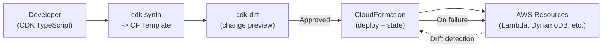
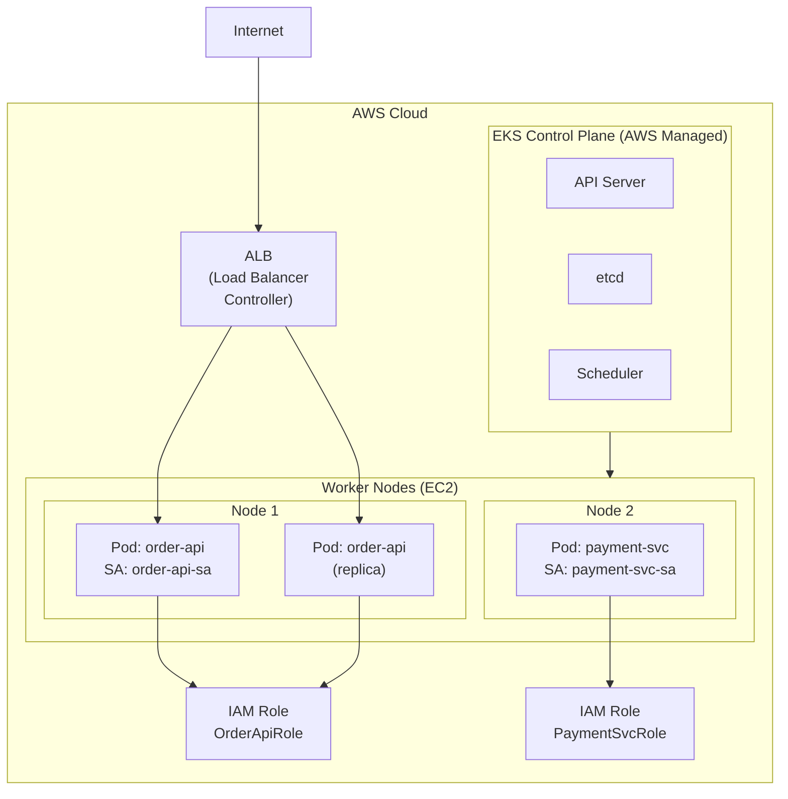

## Keywords in This File
{: .no_toc }

| # | Keyword | Weight |
|---|---------|--------|
| 20 | [CloudFormation and CDK](#cloudformation-and-cdk) | ★★☆ |
| 21 | [EKS Kubernetes on AWS](#eks-kubernetes-on-aws) | ★★☆ |

---

# CloudFormation and CDK

**Interview Weight:** ★★☆ - Infrastructure as Code.
CloudFormation is AWS's native IaC service using JSON/
YAML templates. CDK (Cloud Development Kit) generates
CloudFormation from general-purpose programming languages
(TypeScript, Python, Java). Understanding stacks,
change sets, drift detection, and the CDK construct model
is essential for modern AWS infrastructure engineering.

---

### 🎯 Model Answer

**30 seconds:**

> CloudFormation is AWS's IaC service. You declare
> resources in JSON/YAML; CloudFormation creates, updates,
> and deletes them in dependency order. CDK lets you write
> infrastructure in TypeScript/Python/Java and synthesizes
> CloudFormation templates. CDK abstracts boilerplate:
> creating an ALB with an ECS service in CDK takes 10
> lines vs 200 lines of raw CloudFormation. Change sets:
> preview what will change before applying. Drift detection:
> find resources changed outside CloudFormation.

**3 minutes:**

> CloudFormation concepts:
>
> Stack: unit of deployment. One template = one stack.
> Stack resources are managed together (create/update/delete).
>
> Template sections: Parameters (inputs), Resources
> (required, defines AWS resources), Outputs (export
> values for cross-stack references), Conditions, Mappings.
>
> Change set: preview changes before applying.
> Shows: resources to add/modify/delete. Review before
> executing. Critical for production changes.
>
> Drift detection: compare actual resource state with
> CloudFormation state. If someone changed a SG rule
> manually: drift detected. Use to enforce IaC discipline.
>
> Stack policies: prevent accidental deletion or
> replacement of critical resources (RDS, etc.).
>
> CDK concepts:
>
> Construct: reusable component encapsulating AWS
> resources. Three levels: L1 (raw CloudFormation),
> L2 (opinionated AWS resource with sensible defaults),
> L3 (patterns like ApplicationLoadBalancedFargateService).
>
> Stack: same concept as CloudFormation stack.
> App: top-level CDK application containing stacks.
>
> `cdk synth`: synthesize CloudFormation template.
> `cdk diff`: equivalent to CloudFormation change set.
> `cdk deploy`: deploy the stack.

**Blank Mind Recovery:**

**(1) CloudFormation:** "Template -> Stack. Change set =
preview. Drift = manual changes detected."

**(2) CDK:** "Code -> CloudFormation (synth). Constructs:
L1 raw, L2 resource, L3 patterns."

**(3) Key advantage:** "IaC = reproducible, versioned,
reviewable infrastructure. Rollback on failure."

---

### 📘 Concept Explanation

**CDK Construct Levels:**

```
L1 Construct (CfnXxx - raw CloudFormation):
  new CfnBucket(this, 'Bucket', {
    bucketName: 'my-bucket',
    versioningConfiguration: {status: 'Enabled'}
  });
  -> Direct mapping to CloudFormation properties
  -> All boilerplate required (policies, etc.)

L2 Construct (resource-level, opinionated):
  new s3.Bucket(this, 'Bucket', {
    versioned: true,
    encryption: s3.BucketEncryption.S3_MANAGED,
    removalPolicy: RemovalPolicy.RETAIN
  });
  -> Sensible defaults (encryption, access logging)
  -> Methods: bucket.grantRead(lambda.role)
  -> Auto-generates resource policies

L3 Construct (pattern-level):
  new ecs_patterns.ApplicationLoadBalancedFargateService(
    this, 'Service', {
    taskImageOptions: {image: ContainerImage.fromEcr(...)},
    desiredCount: 2
  });
  -> Creates: ALB, ECS Cluster, Fargate Service,
     Task Definition, Target Group, Security Groups,
     IAM Roles - all in ~10 lines
  -> Opinionated: HTTPS redirect, health checks, etc.
```

> **Code walkthrough:** This example demonstrates the core pattern in action. The key mechanism shows how the concept works in practice. Study the structure to understand the essential behavior and common usage.

---

### 💻 Code Example

```yaml
# BAD: Raw CloudFormation - verbose, error-prone
# 80+ lines for a simple Lambda + API Gateway
Resources:
  MyFunction:
    Type: AWS::Lambda::Function
    Properties:
      FunctionName: process-order
      Runtime: java17
      Handler: com.myapp.Handler::handleRequest
      Role: !GetAtt ExecutionRole.Arn
      Code:
        S3Bucket: !Ref CodeBucket
        S3Key: function.jar
      Environment:
        Variables:
          TABLE_NAME: !Ref OrdersTable
  ExecutionRole:
    Type: AWS::IAM::Role
    Properties:
      AssumeRolePolicyDocument:
        Version: "2012-10-17"
        Statement:
          - Effect: Allow
            Principal:
              Service: lambda.amazonaws.com
            Action: sts:AssumeRole
      ManagedPolicyArns:
        - arn:aws:iam::aws:policy/service-role/AWSLambdaBasicExecutionRole
  # ... 50+ more lines for API Gateway, DynamoDB, etc.
```

> **Code walkthrough:** This example demonstrates the core pattern in action. The key mechanism shows how the concept works in practice. Study the structure to understand the essential behavior and common usage.

```typescript
// GOOD: CDK TypeScript - same infrastructure in ~20 lines
import * as cdk from 'aws-cdk-lib';
import * as lambda from 'aws-cdk-lib/aws-lambda';
import * as apigateway from 'aws-cdk-lib/aws-apigatewayv2';
import * as dynamodb from 'aws-cdk-lib/aws-dynamodb';

export class OrderStack extends cdk.Stack {
  constructor(scope: cdk.App, id: string) {
    super(scope, id);

    // DynamoDB table (encryption + PITR by default):
    const table = new dynamodb.Table(this, 'OrdersTable', {
      partitionKey: {name: 'pk', type: dynamodb.AttributeType.STRING},
      sortKey: {name: 'sk', type: dynamodb.AttributeType.STRING},
      billingMode: dynamodb.BillingMode.PAY_PER_REQUEST,
      pointInTimeRecovery: true,
    });

    // Lambda function:
    const handler = new lambda.Function(this, 'OrderHandler', {
      runtime: lambda.Runtime.JAVA_17,
      code: lambda.Code.fromAsset('build/distributions/app.zip'),
      handler: 'com.myapp.Handler::handleRequest',
      environment: {TABLE_NAME: table.tableName},
      tracing: lambda.Tracing.ACTIVE, // X-Ray enabled
    });

    // Grant Lambda permission to DynamoDB:
    // Auto-generates IAM policy with correct ARN
    table.grantReadWriteData(handler);

    // HTTP API pointing to Lambda:
    const api = new apigateway.HttpApi(this, 'OrderApi');
    api.addRoutes({
      path: '/orders',
      methods: [apigateway.HttpMethod.POST],
      integration: new integrations.HttpLambdaIntegration(
        'OrderIntegration', handler),
    });

    new cdk.CfnOutput(this, 'ApiUrl', {value: api.url!});
  }
}
```

> **Code walkthrough:** This example demonstrates the core pattern in action. The key mechanism shows how the concept works in practice. Study the structure to understand the essential behavior and common usage.

```bash
# CDK workflow:
cd my-cdk-app

# Synthesize CloudFormation template (review before deploy):
cdk synth
# Output: cdk.out/OrderStack.template.json

# Preview changes (like CloudFormation change set):
cdk diff OrderStack
# Shows: + Resources to add, ~ Resources to update, - to delete

# Deploy:
cdk deploy OrderStack
# CloudFormation does the actual provisioning

# Production workflow with change set review:
cdk deploy OrderStack --require-approval any
# Requires explicit approval for any resource changes

# Check for drift (manual changes outside IaC):
aws cloudformation detect-stack-drift \
  --stack-name OrderStack
DRIFT_ID=$(aws cloudformation describe-stack-drift-detection-status \
  --stack-drift-detection-id $DETECTION_ID \
  --query 'StackDriftDetectionId' --output text)
aws cloudformation describe-stack-resource-drifts \
  --stack-name OrderStack \
  --stack-resource-drift-status MODIFIED DELETED
# Shows: which resources were changed and how
```

> **Code walkthrough:** The raw CloudFormation YAML for
> even a simple Lambda + API Gateway setup exceeds 80
> lines with explicit IAM role, trust policies, managed
> policies, and deployment configuration. The CDK version
> achieves equivalent infrastructure in ~20 lines. CDK's
> `table.grantReadWriteData(handler)` generates the
> precise IAM policy with the correct DynamoDB table ARN
> automatically - eliminating a common error source.
> The `tracing: lambda.Tracing.ACTIVE` sets X-Ray
> in one property that would require CloudFormation
> `TracingConfig.Mode: Active` plus IAM policy attachment.
> CDK synthesizes to valid CloudFormation, so the actual
> deployment is CloudFormation - with all its reliability
> guarantees (change sets, rollback, drift detection).

---

### 🎓 Answers by Seniority

**Junior / Mid:**

> "CloudFormation lets you define AWS resources in JSON/YAML
> and deploy them as a stack. CDK generates CloudFormation
> from TypeScript, Python, or Java code. CDK is much
> more concise and can use programming language features
> (loops, conditions, functions) that are awkward in YAML.
> Change sets let you preview what will change before
> applying. This prevents accidental deletions in
> production."

**Senior / Staff:**

> "CDK's L3 constructs (patterns) are the productivity
> multiplier. `ApplicationLoadBalancedFargateService` creates
> a full ECS Fargate service with ALB, security groups,
> IAM roles, and target groups in 10 lines - work that
> takes 200 lines in raw CloudFormation. The pattern
> encodes best practices: HTTPS redirect, health check,
> IAM least-privilege, etc.
>
> Production discipline:
> - Change sets (or `cdk diff`) before every production
>   deployment. Never deploy without reviewing changes.
> - Stack policies: prevent replacement of stateful
>   resources (RDS, DynamoDB) - a CloudFormation update
>   that replaces a DB instance will drop and recreate it.
> - Separate CDK stacks per environment (dev, staging,
>   prod) but shared constructs via CDK Constructs library.
> - Drift detection in CI/CD: fail the pipeline if drift
>   is detected. Infrastructure must be managed only via IaC.
>
> CDK Aspects: apply rules across all constructs in a stack.
> Example: enforce all S3 buckets have versioning, or
> all Lambda functions have X-Ray tracing. Run at synth
> time, before deployment."

---

### ⚠️ Common Misconceptions

**Misconception: "CloudFormation will delete and
recreate a resource only for major changes like renaming."**

CloudFormation has three update behaviors for resources:
no interruption (e.g., Lambda environment variable),
some interruption (e.g., EC2 instance type change - stop/start),
and replacement (the resource is DELETED and a new one
created). Replacement happens more often than expected:
changing an RDS `DBInstanceClass` causes replacement.
Changing an S3 bucket name causes replacement (bucket
deleted, new one created - DATA LOST). Always review
change sets with replacement warnings before applying
to production. Use `UpdateReplacePolicy: Retain` on
stateful resources (RDS, S3) to prevent accidental
data loss on replacement.

---

### 🚨 Failure Modes and Diagnosis

**Failure: CloudFormation stack stuck in
UPDATE_ROLLBACK_FAILED state**

*Symptom:* CloudFormation update failed. Stack is in
UPDATE_ROLLBACK_FAILED and cannot be updated or deleted.

*Root cause:* Rollback failed because a resource
that CloudFormation tried to restore was manually
deleted or changed outside CloudFormation.

*Diagnosis:*
```bash
# Get stack events to see what failed:
aws cloudformation describe-stack-events \
  --stack-name MyStack \
  --query 'StackEvents[?ResourceStatus==`UPDATE_FAILED`
    || ResourceStatus==`UPDATE_ROLLBACK_FAILED`]'
# Shows which resource caused the failure

# Try to continue the rollback (skip failed resources):
aws cloudformation continue-update-rollback \
  --stack-name MyStack \
  --resources-to-skip MyFailedResource
# Skips the problematic resource, continues rollback
# WARNING: skipped resource state is unknown
```

> **Code walkthrough:** This example demonstrates the core pattern in action. The key mechanism shows how the concept works in practice. Study the structure to understand the essential behavior and common usage.

*Fix:* Use `continue-update-rollback` with
`--resources-to-skip` to unstick the stack. Then
investigate the skipped resource manually. Re-import
it into the stack if it was manually created.

---

### ⚖️ Comparison Table

| Aspect | Raw CloudFormation | CDK (TypeScript) | Terraform |
|--------|------------------|------------------|-----------|
| Language | JSON/YAML | TypeScript/Python/Java | HCL |
| AWS coverage | 100% | 100% (synths to CF) | ~90% |
| Abstraction | Low (L1 only) | L1/L2/L3 constructs | Provider resources |
| Type safety | No | Yes (TypeScript) | Partial |
| Multi-cloud | No | No | Yes |
| State management | AWS managed | AWS managed (via CF) | terraform.tfstate |
| Rollback | Native CF rollback | Native CF rollback | `terraform plan` |
| Learning curve | Medium (YAML) | High (programming) | Medium (HCL) |
| Best for | Simple stacks, legacy | Complex IaC, teams | Multi-cloud |

---

### 🏛️ System Design

*(Omit: non-★★★ keyword.)*

---

### 📊 Diagram

```
CDK -> CloudFormation -> AWS Resources:

Developer writes CDK code (TypeScript):
  new s3.Bucket(this, 'Bucket', {...})

cdk synth:
  CDK App
    -> CloudFormation Template JSON
       (Resources, IAM policies, dependencies)

cdk deploy -> CloudFormation:
  CloudFormation processes template:
    1. Builds dependency graph
    2. Creates resources in order
    3. On failure: rollback in reverse order

  Stack state tracked in CloudFormation:
    - CREATE_COMPLETE / UPDATE_COMPLETE
    - ROLLBACK_COMPLETE (on failure)
    - DRIFT_DETECTED (manual changes found)
```



> **Diagram walkthrough:** The CDK workflow has a
> critical review gate: `cdk diff` (equivalent to
> CloudFormation change set) must be reviewed before
> `cdk deploy`. CloudFormation then manages the actual
> provisioning with dependency tracking - if Lambda
> depends on DynamoDB, DynamoDB is created first.
> On failure, CloudFormation rolls back in reverse
> dependency order. The drift detection feedback loop
> identifies when AWS resources are changed outside
> the CDK/CloudFormation workflow, allowing teams to
> enforce IaC discipline.

---

---

---

### 💻 Code Example

*(Omit: this concept does not have a programmatic interface that can be demonstrated in code. The conceptual explanation above is sufficient.)*


---

### 🏛️ System Design

*(Omit: system design diagram not applicable for this concept - see ★★★ keywords for full system design coverage.)*


---

### ⚖️ Comparison Table

*(Omit: this is a ★☆☆ foundational concept with no direct alternatives to compare - see higher-difficulty keywords for trade-off analysis.)*


---

### 📊 Diagram

*(Omit: no standalone visual diagram required for this concept - the explanations and code examples above provide sufficient clarity.)*


# EKS Kubernetes on AWS

**Interview Weight:** ★★☆ - Container orchestration.
EKS (Elastic Kubernetes Service) is AWS's managed
Kubernetes service. It handles the control plane (API
server, etcd) while you manage worker nodes. Understanding
node groups, the pod scheduling model, IAM integration
(IRSA), and when EKS vs ECS vs Fargate is appropriate
is essential for container platform decisions.

---

### 🎯 Model Answer

**30 seconds:**

> EKS is managed Kubernetes on AWS. AWS manages the
> control plane (API server, etcd, scheduler). You
> manage worker nodes (EC2) or use Fargate for serverless
> pods. EKS uses standard Kubernetes: Pods, Deployments,
> Services, Ingress. IAM integration via IRSA (IAM Roles
> for Service Accounts): pods get fine-grained AWS
> permissions without node-level credentials.
> EKS is the right choice when you need Kubernetes
> portability, advanced scheduling, or community ecosystem.

**3 minutes:**

> EKS architecture:
>
> Control plane: managed by AWS. Multi-AZ, auto-patched.
> API server, scheduler, etcd. Cost: $0.10/hour per cluster.
>
> Worker nodes: EC2 instances running the kubelet and
> container runtime. You pay for EC2. Options:
>
> Managed Node Groups: AWS manages EC2 launch template,
> patching, drain and replace. Simplest.
>
> Self-managed nodes: full control (custom AMIs, etc.).
> More operational overhead.
>
> Fargate profile: pods run on Fargate (serverless).
> No EC2 management. Higher cost per pod.
>
> IRSA (IAM Roles for Service Accounts):
>
> Each Kubernetes Service Account mapped to an IAM role.
> Pod gets an OIDC token bound to the service account.
> AWS STS exchanges the token for temporary credentials.
> Granular: different pods get different AWS permissions.
> No instance profile (not all pods on a node share creds).
>
> Ingress:
>
> Standard: AWS Load Balancer Controller creates ALB
> for Kubernetes Ingress resources. One ALB per Ingress
> or shared ALB with host/path routing.
>
> EKS vs ECS:
>
> ECS: simpler, AWS-native, tight AWS integration.
> EKS: Kubernetes API, portability, larger ecosystem,
> more complex to operate.

**Blank Mind Recovery:**

**(1) EKS components:** "AWS manages control plane.
You manage worker nodes (EC2) or use Fargate."

**(2) IRSA:** "Service Account -> IAM Role. Pod gets
AWS credentials scoped to its role. No node-level sharing."

**(3) EKS vs ECS:** "EKS = Kubernetes portability,
ecosystem. ECS = simpler, AWS-native, less overhead."

---

### 📘 Concept Explanation

**IRSA - IAM Roles for Service Accounts:**

```
Without IRSA (insecure node-level approach):
  EC2 node has instance profile -> ALL pods share creds
  Pod A (public-facing app) has same S3 access as
  Pod B (data pipeline) - violates least-privilege

With IRSA:
  1. EKS cluster has OIDC provider (unique per cluster)
  2. Kubernetes ServiceAccount annotated with IAM role ARN:
     annotations:
       eks.amazonaws.com/role-arn: arn:aws:iam::...:role/MyRole
  3. IAM Role trust policy allows OIDC provider + SA name
  4. Pod uses the ServiceAccount
  5. Kubernetes injects OIDC token into pod as
     projected volume (/var/run/secrets/...)
  6. AWS SDK calls STS with OIDC token
  7. STS returns temporary credentials for the role
  8. Pod has credentials only for its specific IAM role
  -> Different pods on the same node have different credentials
```

> **Code walkthrough:** This example demonstrates the core pattern in action. The key mechanism shows how the concept works in practice. Study the structure to understand the essential behavior and common usage.

---

### 💻 Code Example

```yaml
# BAD: Using node instance profile for pod credentials
# All pods on the node share EC2 instance profile creds
# Pod for public API has same S3 access as internal batch
# If public API is compromised: all pod credentials leak
apiVersion: apps/v1
kind: Deployment
metadata:
  name: order-api
spec:
  template:
    spec:
      # No serviceAccountName: uses default SA
      # Default SA has no IRSA binding
      # But pod still inherits node EC2 instance profile
      containers:
      - name: order-api
        image: myapp:latest
        # Relies on EC2 instance profile (node-level)
```

> **Code walkthrough:** This example demonstrates the core pattern in action. The key mechanism shows how the concept works in practice. Study the structure to understand the essential behavior and common usage.

```yaml
# GOOD: IRSA for per-pod IAM credentials
# Step 1: Create IAM role with OIDC trust:
# (via CDK or CloudFormation)
# Trust Policy:
# {
#   "Principal": {"Federated": "oidc-provider-arn"},
#   "Condition": {
#     "StringEquals": {
#       "oidc:sub": "system:serviceaccount:default:order-api-sa"
#     }
#   }
# }

# Step 2: Create Kubernetes ServiceAccount with annotation:
apiVersion: v1
kind: ServiceAccount
metadata:
  name: order-api-sa
  namespace: default
  annotations:
    eks.amazonaws.com/role-arn: >-
      arn:aws:iam::123456789012:role/OrderApiRole
```

> **Code walkthrough:** This example demonstrates the core pattern in action. The key mechanism shows how the concept works in practice. Study the structure to understand the essential behavior and common usage.

```yaml
# Step 3: Use ServiceAccount in Deployment:
apiVersion: apps/v1
kind: Deployment
metadata:
  name: order-api
spec:
  template:
    spec:
      serviceAccountName: order-api-sa
      containers:
      - name: order-api
        image: myapp:latest
        resources:
          requests:
            memory: "512Mi"
            cpu: "250m"
          limits:
            memory: "1Gi"
            cpu: "500m"
        readinessProbe:
          httpGet:
            path: /health
            port: 8080
          initialDelaySeconds: 30
          periodSeconds: 10
```

> **Code walkthrough:** This example demonstrates the core pattern in action. The key mechanism shows how the concept works in practice. Study the structure to understand the essential behavior and common usage.

```bash
# Create EKS cluster (managed node group):
eksctl create cluster \
  --name my-cluster \
  --version 1.30 \
  --region us-east-1 \
  --nodegroup-name standard-workers \
  --node-type t3.medium \
  --nodes 3 \
  --nodes-min 1 \
  --nodes-max 5 \
  --managed

# Set up IRSA for a pod:
# 1. Enable OIDC provider for cluster:
eksctl utils associate-iam-oidc-provider \
  --cluster my-cluster --approve

# 2. Create IAM role with service account trust:
eksctl create iamserviceaccount \
  --name order-api-sa \
  --namespace default \
  --cluster my-cluster \
  --attach-policy-arn arn:aws:iam::...:policy/OrderApiPolicy \
  --approve
# Creates: IAM role + trust policy + Kubernetes SA + annotation

# Deploy application:
kubectl apply -f deployment.yaml

# Verify IRSA is working:
kubectl exec -it <pod-name> -- \
  aws sts get-caller-identity
# Should show: role/order-api-sa-... (not the node's role)

# Check node group status:
aws eks describe-nodegroup \
  --cluster-name my-cluster \
  --nodegroup-name standard-workers
```

> **Code walkthrough:** The BAD Deployment uses no
> ServiceAccount, inheriting the EC2 node's instance
> profile - all pods on that node share credentials.
> A compromised public API pod could use those credentials
> to access S3 buckets or DynamoDB tables intended for
> backend services only. The GOOD pattern uses IRSA:
> the ServiceAccount annotation binds to a specific IAM
> role. AWS SDK in the pod calls STS with the OIDC token
> (injected as a projected volume by Kubernetes) and gets
> credentials only for the OrderApiRole. The `eksctl`
> command wraps all the IRSA setup steps in one command,
> generating the IAM role with trust policy + Kubernetes
> SA in one operation.

---

### 🎓 Answers by Seniority

**Junior / Mid:**

> "EKS is managed Kubernetes. AWS handles the control
> plane (API server, etcd) so you don't need to manage
> those. You create node groups (EC2 instances) as worker
> nodes. Pods are deployed with Deployments. IRSA lets
> pods get AWS credentials (like S3 access) without
> sharing EC2 instance credentials across all pods."

**Senior / Staff:**

> "EKS vs ECS is a team and operational choice:
>
> ECS: simpler, AWS-native API, tighter integration with
> ALB, SQS, ECR, and other AWS services. No Kubernetes
> expertise needed. Less operational overhead. Correct
> for: teams that are AWS-first and want managed containers
> without Kubernetes complexity.
>
> EKS: standard Kubernetes API. Skills are portable.
> Ecosystem: Helm charts, Istio, Karpenter, etc. Multi-cloud
> option if you run on-prem or GCP/Azure. Correct for:
> existing Kubernetes expertise, need for Kubernetes-native
> tools, or portability requirement.
>
> The IRSA model is the correct way to grant AWS access
> to pods - never use node-level instance profiles for
> this. Each pod with its own SA = each pod has minimal
> AWS permissions. Combined with Kubernetes Network
> Policies and RBAC, IRSA gives defense in depth.
>
> Karpenter (node autoscaler) is the modern alternative
> to Cluster Autoscaler on EKS: responds to unscheduled
> pods in seconds (vs minutes for CA), bin-packs pods
> optimally to minimize nodes, automatically consolidates
> underutilized nodes."

---

### ⚠️ Common Misconceptions

**Misconception: "EKS is always better than ECS because
Kubernetes is the industry standard."**

Kubernetes is more complex to operate than ECS. The
operational overhead - node upgrades, kube-proxy, CNI
plugin, cluster autoscaler, admission webhooks, RBAC -
is significant. ECS is simpler, fully managed (no node
upgrades beyond AMI updates), and has tight native AWS
integration. If your team does not already have Kubernetes
expertise and your workloads are AWS-native (using SQS,
DynamoDB, S3 directly), ECS with Fargate has lower
total operational cost. EKS is the right choice when:
you already run Kubernetes, you need portability across
clouds, or specific Kubernetes ecosystem tools (Istio,
KEDA, Argo) are required.

---

### 🚨 Failure Modes and Diagnosis

**Failure: Pods stuck in Pending state in EKS**

*Symptom:* `kubectl get pods` shows pods in Pending
state. Not scheduled to any node.

*Root cause candidates:*

1. Insufficient node capacity (CPU/memory requests
   exceed available capacity)
2. Node group at maximum capacity, cluster autoscaler
   not configured
3. Node taint that pod does not tolerate
4. Pod affinity/anti-affinity cannot be satisfied
5. PersistentVolumeClaim not bound

*Diagnosis:*
```bash
# Get pod events (shows scheduling reason):
kubectl describe pod <pod-name>
# Look for Events section at bottom:
# "0/3 nodes are available: 3 Insufficient cpu"
# "0/3 nodes are available: 3 node(s) had untolerated taint"

# Check node capacity:
kubectl describe nodes | grep -A 5 "Allocated resources"
# Shows: CPU requests vs allocatable, Memory same

# Check if cluster autoscaler is scaling:
kubectl logs -n kube-system \
  -l app=cluster-autoscaler --tail=50
# "Scale-up: setting group ... to 4 nodes" = scaling
# "No scale-up candidates" = no eligible node group

# Check node group status:
aws eks describe-nodegroup \
  --cluster-name my-cluster \
  --nodegroup-name standard-workers \
  --query 'nodegroup.scalingConfig'
# If desiredSize = maxSize: at limit, cannot scale up
```

> **Code walkthrough:** This example demonstrates the core pattern in action. The key mechanism shows how the concept works in practice. Study the structure to understand the essential behavior and common usage.

*Fix:* Increase node group `maxSize` and let autoscaler
provision new nodes. Or add more node groups. Or reduce
pod resource requests if over-provisioned.

---

### ⚖️ Comparison Table

| Feature | EKS (EC2 nodes) | EKS (Fargate) | ECS (EC2) | ECS Fargate |
|---------|-----------------|---------------|-----------|-------------|
| Kubernetes API | Yes | Yes | No | No |
| Node management | You manage EC2 | No nodes | You manage EC2 | No nodes |
| Cost | EC2 + $0.10/hr cluster | Per pod resources | EC2 | Per pod |
| Cold start | None (nodes running) | 30-60s | None | 30-60s |
| Portability | Full K8s portability | K8s (no node config) | AWS-only | AWS-only |
| AWS integration | Good (IRSA, ALB) | Good | Excellent (native) | Excellent |
| Complexity | High | Medium | Low | Low |
| Best for | K8s expertise, multi-cloud | Simple K8s workloads | AWS-native teams | Serverless containers |

---

### 🏛️ System Design

*(Omit: non-★★★ keyword.)*

---

### 📊 Diagram

```
EKS Architecture:

AWS Cloud
  EKS Control Plane (AWS Managed)
    API Server | Scheduler | etcd | Controller Manager
    (Multi-AZ, auto-patched, no EC2 cost you see)
    |
    | kubelet communication
    v
  Worker Nodes (Your EC2 - Managed Node Group)
    Node 1                Node 2
    +--Pod: order-api   +-Pod: payment-svc
    |  SA: order-api-sa  |  SA: payment-svc-sa
    |  -> IAM: OrderRole |  -> IAM: PaymentRole
    +--Pod: order-api   +-Pod: analytics
    (scheduled by K8s)   (different IAM role)

  IRSA: each pod -> own IAM role -> own AWS permissions
  ALB (via Load Balancer Controller)
    -> routes to K8s Services
    -> Services select Pods by labels
```



> **Diagram walkthrough:** The control plane is fully
> managed by AWS - no EC2 instances to patch or maintain
> for the Kubernetes master components. Worker nodes are
> EC2 in managed node groups. IRSA creates a boundary
> between pods: order-api pods get OrderApiRole credentials
> (access to order DynamoDB table), payment-svc pods get
> PaymentSvcRole (access to payment processing resources).
> A compromised order-api pod cannot access payment
> resources because it holds different AWS credentials.
> The ALB is created by the AWS Load Balancer Controller
> (runs as a Kubernetes controller) when a Kubernetes
> Ingress resource is created.

---

### 🎯 Interview Deep-Dive

> **Timing:** 5-7 minutes per question for ★★☆ keywords.

| Type | Questions |
|------|-----------|
| CONCEPT | 2 |
| DEBUGGING | 1 |
| TRADE-OFF | 1 |
| BEHAVIORAL | 1 |
| SCENARIO | 2 |
| ARCHITECTURE | 1 |

> Note: Both keywords share this Deep-Dive section.

---

#### CONCEPT 1 (CloudFormation): What is a CloudFormation change set and why is it critical for production?

**Change set definition:**

A change set is a preview of the changes CloudFormation
would apply to a stack if you executed an update.
Before executing, you can review: which resources will
be added, modified, or deleted, and what the modification
type is (no interruption, some interruption, replacement).

**Why it matters:**

Replacement is the critical action: if CloudFormation
replaces a resource, it deletes the existing one and
creates a new one. For an RDS instance: the database
is deleted (data lost) and recreated. For an S3 bucket:
the bucket is deleted (objects may be lost) and a new
one created.

CloudFormation flags replacements in the change set:
`Replacement: True`. This is the production safety gate.

**Example - dangerous update:**

Developer changes RDS `AllocatedStorage` from 100 to 200.
Change set shows: `Replacement: True`.
Action: RDS delete + recreate.
Result: if applied, database deleted. Data lost.
Correct action: use `ModifyDBInstance` instead (no replacement).

**Production discipline:**

Never run `cloudformation update-stack` directly.
Always create a change set first:
```bash
aws cloudformation create-change-set \
  --stack-name prod-stack \
  --change-set-name preview-$(date +%Y%m%d) \
  --template-body file://template.yaml \
  --parameters ...
# Review it:
aws cloudformation describe-change-set \
  --stack-name prod-stack \
  --change-set-name preview-$(date +%Y%m%d)
# Only execute after review:
aws cloudformation execute-change-set ...
```

> **Code walkthrough:** This example demonstrates the core pattern in action. The key mechanism shows how the concept works in practice. Study the structure to understand the essential behavior and common usage.

*What separates good from great:* Combine change sets
with stack policies. A stack policy can prevent
CloudFormation from replacing specific resources:
`"Effect": "Deny", "Action": "Update:Replace",
"Resource": "arn:...:rds:*"`. This means even if
someone accidentally executes a change set with
replacements: it fails. Defense in depth.

---

#### CONCEPT 2 (EKS): Explain IRSA and why it is the correct way to grant AWS access to pods.

**The problem IRSA solves:**

Before IRSA, Kubernetes pods on AWS relied on the EC2
node's instance profile for AWS credentials. The instance
profile is a role attached to the EC2 node. Every pod
on that node gets the same credentials.

Problem 1 - Blast radius: if one pod is compromised,
all pods on the node share the same credentials. The
attacker can use any of the permissions granted to
the node role.

Problem 2 - Least privilege: you cannot grant different
AWS permissions to different pods on the same node.
A public-facing API pod and a database migration pod
have the same credentials.

**How IRSA works:**

EKS creates an OpenID Connect (OIDC) identity provider
for the cluster. When a pod uses a Kubernetes Service
Account (SA) annotated with an IAM role ARN:

1. Kubernetes projects a signed JWT (OIDC token) into
   the pod at `/var/run/secrets/eks.amazonaws.com/`.
2. The AWS SDK calls `sts:AssumeRoleWithWebIdentity`
   with this token.
3. STS validates the token against the OIDC provider.
4. If valid AND the SA name matches the role's trust
   policy condition: STS returns temporary credentials.
5. Credentials are valid only for this specific role.

**Security properties:**

- Pod-granular: each pod SA maps to its own IAM role.
- Automatic rotation: STS credentials expire in 1 hour
  (SDK auto-renews).
- Tamper-resistant: OIDC token is signed by Kubernetes
  and validated by AWS.

*What separates good from great:* The OIDC token condition
in the trust policy is the security mechanism:
`"StringEquals": {"oidc:sub":
"system:serviceaccount:NAMESPACE:SA-NAME"}`. This
prevents pods from a different namespace or different
service account name from assuming the role. Namespace
isolation in Kubernetes + IRSA trust policy condition
= complete pod-level IAM isolation.

---

#### DEBUGGING 1 (EKS): Pod is OOMKilled repeatedly. How do you diagnose and fix?

**OOMKilled:** Out of Memory Kill. Linux kernel's OOM
killer terminated the process because the container
exceeded its memory limit.

**Step 1: Confirm OOMKilled:**
```bash
kubectl describe pod <pod-name>
# Look for:
# Last State: OOMKilled (exit code 137)
# Containers:
#   Last State: Terminated
#   Reason: OOMKilled
#   Exit Code: 137

kubectl get events \
  --field-selector involvedObject.name=<pod-name>
# Shows OOMKilling events
```

> **Code walkthrough:** This example demonstrates the core pattern in action. The key mechanism shows how the concept works in practice. Study the structure to understand the essential behavior and common usage.

**Step 2: Check memory usage vs limit:**
```bash
# Container Insights (if enabled) or metrics-server:
kubectl top pod <pod-name> --containers
# Shows current CPU and memory usage per container

# Check set limit:
kubectl get pod <pod-name> -o yaml \
  | grep -A 5 "resources:"
# If limit: 512Mi and usage is consistently 500Mi+: too tight
```

> **Code walkthrough:** This example demonstrates the core pattern in action. The key mechanism shows how the concept works in practice. Study the structure to understand the essential behavior and common usage.

**Step 3: Analyze memory growth:**
```bash
# CloudWatch Container Insights:
# Metric: container_memory_utilization
# If it grows linearly over time: likely memory leak
# If it spikes on specific requests: request processing issue
# If it stays stable but above limit: limit too low
aws cloudwatch get-metric-statistics \
  --namespace ContainerInsights \
  --metric-name container_memory_utilization \
  --dimensions Name=ClusterName,Value=my-cluster \
    Name=PodName,Value=order-api-xxx \
  --period 60 --statistics Maximum ...
```

> **Code walkthrough:** This example demonstrates the core pattern in action. The key mechanism shows how the concept works in practice. Study the structure to understand the essential behavior and common usage.

**Fixes (in order):**

1. Limit too low (most common): increase memory limit.
   Correct sizing: set limit to 2x the p99 usage.
   ```yaml
   resources:
     requests:
       memory: "512Mi"
     limits:
       memory: "1Gi"  # Was 512Mi, increase to 1Gi
   ```

> **Code walkthrough:** This example demonstrates the core pattern in action. The key mechanism shows how the concept works in practice. Study the structure to understand the essential behavior and common usage.

2. Memory leak: profile the application.
   For Java: `-XX:+HeapDumpOnOutOfMemoryError`
   generates a heap dump. Analyze with Eclipse MAT.

3. JVM heap not set correctly: JVM by default reads
   the node's total memory, not the container limit.
   Set `-XX:MaxRAMPercentage=75.0` (use 75% of container
   memory as JVM heap). Without this: JVM allocates
   heap larger than container limit -> OOMKilled.

*What separates good from great:* The JVM in containers
issue is a frequent OOMKilled root cause for Java apps:
JVM sees the full host memory (e.g., 16GB node) and
sets heap to 4GB. Container limit is 1GB. JVM exceeds
limit -> OOMKilled. The fix: `-XX:MaxRAMPercentage=75.0`
or `-Xmx750m` to cap heap to 75% of the container limit.

---

#### TRADE-OFF 1: ECS Fargate vs EKS for a new containerized Java microservices platform.

**Team context:**
- 5 developers, AWS-experienced, no Kubernetes expertise
- 8 Java microservices, all AWS-native (SQS, DynamoDB, S3)
- Traffic: moderate (< 100 RPS per service)
- Deployment: daily releases per service

**ECS Fargate for this team:**

Pros:
- No Kubernetes expertise needed
- No cluster to manage (control plane or nodes)
- Tight AWS integration: native ALB, SQS, SDS secret mounting
- Task-level IAM roles (similar to IRSA, simpler to configure)
- Deploying updates: update task definition, done
- Cost: pay for pod CPU/memory only, no cluster fee

Cons:
- AWS-only (no portability)
- No Kubernetes ecosystem (Helm, Istio, etc.)

**EKS for this team:**

Pros:
- Kubernetes skills are portable (marketable)
- Kubernetes ecosystem: Helm, Argo CD, KEDA
- Multi-cloud option in future

Cons:
- $0.10/hr cluster fee (~$73/month per cluster)
- Kubernetes learning curve: 3-6 months to operate confidently
- Operational overhead: node upgrades, CNI, RBAC
- For 5 developers: disproportionate complexity

**Decision for this team: ECS Fargate.**

8 services, AWS-native, no K8s expertise: ECS Fargate
provides equivalent functionality with 60% less
operational overhead. The $73/month cluster fee plus
engineering time to learn/operate Kubernetes is not
justified for this scale.

Revisit EKS if: team grows to 20+ people, multi-cloud
is required, or specific Kubernetes tools become necessary.

*What separates good from great:* Team expertise and
operational overhead are the deciding factors, not
technical capability. Both ECS and EKS can run Java
microservices reliably. The question is: what does
the team spend time on? For a 5-person team, Kubernetes
operational complexity reduces time for features.

---

#### BEHAVIORAL 1: Describe how you implemented or migrated to Infrastructure as Code.

**STAR:**

**Situation:** 50+ AWS resources (EC2, RDS, SQS, S3,
Lambda, IAM roles) created manually via AWS console
over 18 months. No documentation. Developer leaves ->
no one knows what resources exist or why. Deployment
is "SSH into server, run script." Any change is risky.

**Task:** Migrate to full Infrastructure as Code using CDK.

**Approach:**

1. Audit existing resources: CloudFormation drift
   detection (import) + manual AWS CLI enumeration.
   Created inventory spreadsheet: resource type, name,
   purpose, dependencies.

2. Prioritize: start with new resources (CDK from day 1),
   then migrate legacy resources service by service.

3. Import existing resources into CloudFormation:
   ```bash
   aws cloudformation create-change-set \
     --change-set-type IMPORT \
     --resources-to-import file://import.json
   # Imports existing resources under CloudFormation control
   # No recreation - resource is "adopted"
   ```

> **Code walkthrough:** This example demonstrates the core pattern in action. The key mechanism shows how the concept works in practice. Study the structure to understand the essential behavior and common usage.

4. CDK for all new infrastructure. Shared constructs
   library for company standards (logging, encryption,
   monitoring defaults).

**Key outcome:**

After 6 months: all resources in CDK/CloudFormation.
Deployment process: PR -> CDK diff review -> CDK deploy.
Disaster recovery: `cdk deploy` from a new account
recreates the entire environment in 20 minutes.
Security audit: drift detection run weekly; any
manual change is flagged automatically.

*What separates good from great:* The `cloudformation
import` path (not recreate) for existing resources is
the production-safe migration. Recreating a running
RDS instance would cause downtime. Import adopts the
existing resource into CloudFormation state without
modifying it.

---

#### SCENARIO 1: Design a deployment pipeline for an EKS application.

**Requirements:**
- Java microservice in EKS
- Zero-downtime deployments
- Rollback capability
- Multiple environments (dev, staging, prod)

**Pipeline:**

```
Git push to main branch
  -> GitHub Actions CI:
      1. Build Docker image
      2. Push to ECR
      3. Run unit tests
      4. Image tag: SHA of commit

  -> Argo CD (GitOps):
      Git repo: separate "config" repo with K8s manifests
      Manifest: Deployment.yaml with image tag

      Dev: auto-sync on push (immediate deploy)
      Staging: auto-sync (immediate deploy)
      Prod: manual sync (approved deploy)

Deployment strategy (K8s Deployment):
  strategy:
    type: RollingUpdate
    rollingUpdate:
      maxUnavailable: 0      # No downtime
      maxSurge: 1            # One extra pod during rollout
  minReadySeconds: 30        # Pod ready for 30s before next

Rollback:
  kubectl rollout undo deployment/order-api
  -> K8s reverts to previous ReplicaSet
  -> Previous image version running in < 60s
```

> **Code walkthrough:** This example demonstrates the core pattern in action. The key mechanism shows how the concept works in practice. Study the structure to understand the essential behavior and common usage.

**Health checks (prevent bad rollouts):**

```yaml
readinessProbe:
  httpGet:
    path: /actuator/health/readiness
    port: 8080
  initialDelaySeconds: 30
  periodSeconds: 10
  failureThreshold: 3
# If readiness fails: K8s stops routing traffic to this pod
# Rolling update pauses if new pod never becomes ready
# -> Prevents complete deployment failure
```

> **Code walkthrough:** This example demonstrates the core pattern in action. The key mechanism shows how the concept works in practice. Study the structure to understand the essential behavior and common usage.

*What separates good from great:* `maxUnavailable: 0`
is the zero-downtime configuration. It means:
during rollout, all existing pods remain available
until new pods are ready. `maxSurge: 1` allows one
extra pod beyond desired count during rollout. Without
`maxUnavailable: 0`, Kubernetes may terminate old pods
before new ones are ready, causing brief downtime.

---

#### SCENARIO 2: Multi-tenant SaaS on EKS. How do you isolate tenants?

**Requirements:**
- Multiple customers (tenants) share the same EKS cluster
- Tenants must not access each other's data
- CPU/memory isolation (one tenant cannot starve others)
- Separate AWS resource access per tenant

**Isolation layers:**

1. Namespace isolation:
   One Kubernetes namespace per tenant.
   `kubectl create namespace tenant-a`
   ResourceQuota per namespace: limits CPU, memory, pods.
   ```yaml
   apiVersion: v1
   kind: ResourceQuota
   metadata:
     namespace: tenant-a
   spec:
     hard:
       requests.cpu: "4"
       requests.memory: 8Gi
       pods: "50"
   ```

> **Code walkthrough:** This example demonstrates the core pattern in action. The key mechanism shows how the concept works in practice. Study the structure to understand the essential behavior and common usage.

2. Network isolation (Network Policies):
   Tenant A pods cannot connect to Tenant B pods.
   ```yaml
   kind: NetworkPolicy
   metadata:
     namespace: tenant-a
   spec:
     ingress:
       - from:
         - namespaceSelector:
             matchLabels:
               name: tenant-a  # Only from same namespace
   ```

> **Code walkthrough:** This example demonstrates the core pattern in action. The key mechanism shows how the concept works in practice. Study the structure to understand the essential behavior and common usage.

3. IRSA per tenant:
   Each tenant has a separate Service Account -> IAM Role.
   IAM role restricted to the tenant's DynamoDB table prefix.
   `Resource: "arn:aws:dynamodb:...:table/tenant-a-*"`

4. RBAC:
   Tenant A's team can only manage resources in namespace
   `tenant-a`. They cannot see other namespaces.

*What separates good from great:* Namespace isolation
alone is not sufficient. NetworkPolicy is required to
prevent pod-to-pod communication across namespaces.
Without NetworkPolicy: Tenant A pod can directly call
Tenant B's service IP. Kubernetes does not isolate
network by default - NetworkPolicy is explicit.

---

#### ARCHITECTURE 1: When do you choose EKS over other AWS container options?

**Container options on AWS:**

ECS on EC2: AWS-native orchestration, manage EC2 nodes.
ECS on Fargate: serverless containers, no node management.
EKS on EC2: managed Kubernetes, manage EC2 nodes.
EKS on Fargate: serverless pods + Kubernetes API.
Lambda: serverless functions (not containers, unless container image).
App Runner: simplified container hosting (no orchestration config).

**Choose EKS when:**

1. Kubernetes portability:
   Running Kubernetes on-prem or in multiple clouds.
   Team already has Kubernetes expertise. Skills transfer.

2. Kubernetes ecosystem tools:
   Istio (service mesh), KEDA (event-driven autoscaling),
   Argo CD/Workflows (GitOps, ML pipelines), Helm (packaging),
   Operator pattern (complex stateful workloads).

3. Fine-grained scheduling:
   GPU workloads, specialized hardware, node affinity/taints.
   ML inference pods requiring specific GPU node types.

4. Multi-tenant isolation with Kubernetes primitives:
   Namespaces, RBAC, NetworkPolicy - standard K8s tooling.

5. Regulatory/compliance:
   Some regulated industries mandate specific cluster
   configurations or third-party security tools that
   integrate via Kubernetes admission webhooks.

**Choose ECS Fargate when:**

Team is AWS-native, no K8s expertise, simpler operational
model, and Kubernetes ecosystem tools are not needed.

**Decision for most new teams:**

Start with ECS Fargate. The operational simplicity
advantage is significant for small teams. Migrate to
EKS if and when the specific EKS advantages become
relevant. The migration is feasible - applications
using containers with standard health check endpoints
and environment variables can migrate from ECS to EKS
without code changes.

*What separates good from great:* The migration
feasibility argument cuts both ways: ECS to EKS is
feasible (containers are portable), and EKS to ECS
is also feasible. Choosing ECS initially does not lock
you out of EKS later. This reduces the pressure to
pre-optimize for a future requirement that may not
materialize.

---

---

### 💻 Code Example

*(Omit: this concept does not have a programmatic interface that can be demonstrated in code. The conceptual explanation above is sufficient.)*


---

### 🏛️ System Design

*(Omit: system design diagram not applicable for this concept - see ★★★ keywords for full system design coverage.)*


---

### ⚖️ Comparison Table

*(Omit: this is a ★☆☆ foundational concept with no direct alternatives to compare - see higher-difficulty keywords for trade-off analysis.)*


---

### 📊 Diagram

*(Omit: no standalone visual diagram required for this concept - the explanations and code examples above provide sufficient clarity.)*


