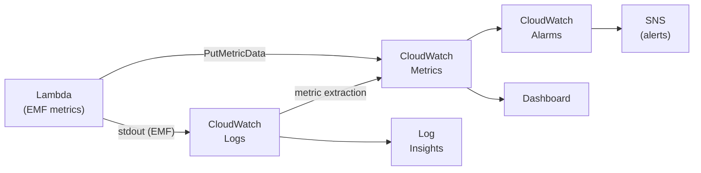
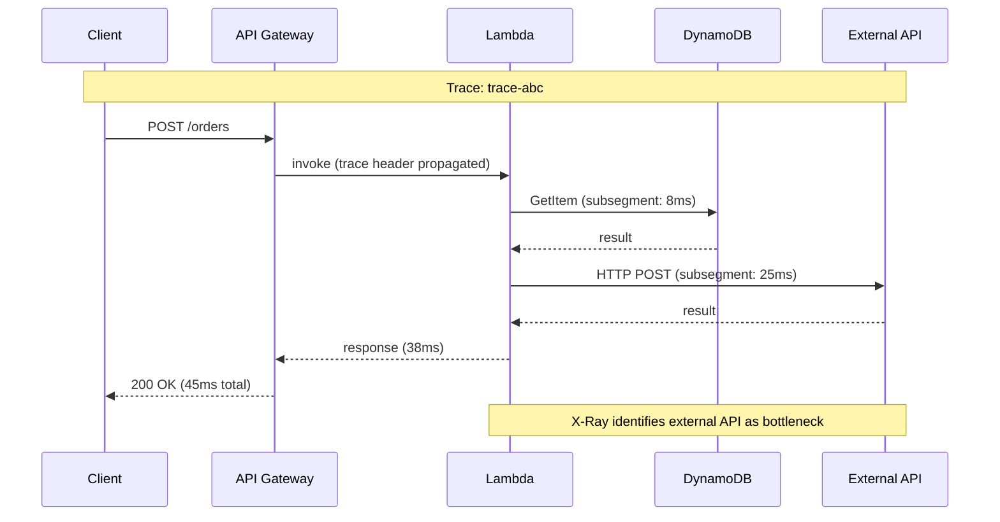

## Keywords in This File
{: .no_toc }

| # | Keyword | Weight |
|---|---------|--------|
| 18 | [CloudWatch Metrics Logs and Alarms](#cloudwatch-metrics-logs-and-alarms) | ★★☆ |
| 19 | [AWS X-Ray and Distributed Tracing](#aws-x-ray-and-distributed-tracing) | ★★☆ |

---

# CloudWatch Metrics Logs and Alarms

**Interview Weight:** ★★☆ - Observability foundation.
CloudWatch is AWS's native observability service covering
metrics, logs, alarms, and dashboards. Understanding
the difference between metrics and logs, how to create
actionable alarms, and log Insights for operational
analysis is essential for running AWS workloads in
production.

---

### 🎯 Model Answer

**30 seconds:**

> CloudWatch is AWS's observability service. Metrics:
> time-series numeric data (CPU, request count, latency).
> Logs: text-based records from applications and AWS
> services. Alarms: trigger actions (SNS, Auto Scaling,
> EC2 actions) when metric crosses a threshold.
> Log Insights: SQL-like queries over logs for real-time
> analysis. Custom metrics: emit your own business metrics
> from Lambda or EC2 for domain-specific monitoring.

**3 minutes:**

> Metrics fundamentals:
>
> Namespace: logical grouping (AWS/EC2, AWS/Lambda,
> custom: `MyApp/Orders`).
> Dimensions: key-value pairs that scope a metric
> (FunctionName, Environment, Region).
> Statistics: sum, average, p50, p90, p99, max.
>
> Standard metrics (automatic):
> AWS services emit metrics automatically. Lambda:
> Invocations, Duration, Errors, Throttles, ConcurrentExecutions.
> EC2: CPUUtilization, NetworkIn/Out. RDS: DBConnections,
> ReadLatency, FreeStorageSpace.
>
> Custom metrics:
> Applications publish their own metrics via CloudWatch
> API: `PutMetricData`. Examples: order processing rate,
> payment success rate, queue depth by business entity.
>
> Logs:
>
> Log group: container for log streams (e.g., `/aws/lambda/my-function`).
> Log stream: sequence of events from one source.
> Log Insights: query language for log analysis.
>
> Alarms:
>
> Threshold: trigger when metric > X for N consecutive
> periods. States: OK, ALARM, INSUFFICIENT_DATA.
> Actions: SNS (notification), Auto Scaling, EC2 actions.
>
> Composite alarms: AND/OR of multiple alarms.
> Reduce alert noise.

**Blank Mind Recovery:**

**(1) Three pillars:** "Metrics = numbers over time.
Logs = text events. Alarms = trigger on metric threshold."

**(2) Alarm states:** "OK, ALARM, INSUFFICIENT_DATA.
Actions fire on state change."

**(3) Custom metrics:** "PutMetricData API. Use for
business-level KPIs (order rate, error rate by customer)."

---

### 📘 Concept Explanation

**CloudWatch Data Model:**

```
Metric:
  Namespace: AWS/Lambda
  Metric Name: Errors
  Dimensions: {FunctionName: "process-order"}
  Time Series:
    2024-01-15 10:00 -> 0 errors
    2024-01-15 10:01 -> 2 errors
    2024-01-15 10:02 -> 15 errors  <- spike
    2024-01-15 10:03 -> 0 errors

Alarm on this metric:
  Threshold: Errors >= 5 for 2 consecutive minutes
  At 10:02: 15 >= 5 -> 1 breach period
  At 10:02 + 1 min: if still >= 5: ALARM state
  Action: SNS -> PagerDuty alert

Log Insights query (find errors):
  fields @timestamp, @message
  | filter @message like /ERROR/
  | parse @message "orderId: * status: *"
    as orderId, status
  | stats count(*) as errorCount by orderId
  | sort errorCount desc
  | limit 20
  -> Shows top 20 orders by error count in time range
```

> **Code walkthrough:** This example demonstrates the core pattern in action. The key mechanism shows how the concept works in practice. Study the structure to understand the essential behavior and common usage.

---

### 💻 Code Example

```java
// BAD: No custom metrics - only relying on Lambda defaults
// Lambda error count counts ALL exceptions including
// expected business errors (invalid input = 400)
// Cannot differentiate technical failures from business
// errors in CloudWatch default metrics
public Map<String, Object> handleRequest(
        Map<String, Object> event, Context context) {
    try {
        return processOrder(event);
    } catch (Exception e) {
        throw e; // Counted in Lambda Errors metric
        // But is this a payment failure, invalid input,
        // or a database connection error?
        // Default metrics cannot distinguish.
    }
}
```

> **Code walkthrough:** This example demonstrates the core pattern in action. The key mechanism shows how the concept works in practice. Study the structure to understand the essential behavior and common usage.

```java
// GOOD: Custom metrics for business and technical signals
// Using CloudWatch EMF (Embedded Metric Format) in Lambda:
import software.amazon.cloudwatch.emf.logger.MetricsLogger;

public Map<String, Object> handleRequest(
        Map<String, Object> event, Context context) {
    MetricsLogger metrics = MetricsLoggerFactory.createLogger();
    metrics.setNamespace("MyApp/Orders");
    metrics.putDimensions(
        DimensionSet.of("Environment", "prod"));

    long start = System.currentTimeMillis();
    try {
        Map<String, Object> result = processOrder(event);
        long duration = System.currentTimeMillis() - start;
        metrics.putMetric("OrderProcessed", 1, Unit.COUNT);
        metrics.putMetric("OrderProcessingTime",
            duration, Unit.MILLISECONDS);
        metrics.flush(); // writes metrics to stdout as EMF
        return result;
    } catch (PaymentDeclinedException e) {
        metrics.putMetric("PaymentDeclined", 1, Unit.COUNT);
        metrics.flush();
        return errorResponse(402, "Payment declined");
    } catch (InsufficientInventoryException e) {
        metrics.putMetric("OutOfStock", 1, Unit.COUNT);
        metrics.flush();
        return errorResponse(409, "Insufficient inventory");
    } catch (Exception e) {
        metrics.putMetric("TechnicalError", 1, Unit.COUNT);
        metrics.flush();
        throw e;
    }
}
// EMF metrics appear as CloudWatch metrics automatically
// (Lambda logs are CloudWatch Logs; EMF format is detected)
```

> **Code walkthrough:** This example demonstrates the core pattern in action. The key mechanism shows how the concept works in practice. Study the structure to understand the essential behavior and common usage.

```bash
# CloudWatch Log Insights: find slow Lambda invocations
aws logs start-query \
  --log-group-name "/aws/lambda/process-order" \
  --start-time $(date -d "1 hour ago" +%s) \
  --end-time $(date +%s) \
  --query-string '
    filter @type = "REPORT"
    | fields @requestId, @duration, @billedDuration, @memorySize
    | filter @duration > 5000
    | sort @duration desc
    | limit 20'
# Returns queryId

# Get results:
aws logs get-query-results --query-id $QUERY_ID

# Create alarm for Lambda error rate > 1%:
aws cloudwatch put-metric-alarm \
  --alarm-name "lambda-error-rate-high" \
  --alarm-description "Error rate > 1% for 5 minutes" \
  --namespace AWS/Lambda \
  --metric-name Errors \
  --dimensions Name=FunctionName,Value=process-order \
  --period 60 --evaluation-periods 5 \
  --statistic Sum --threshold 1 \
  --comparison-operator GreaterThanThreshold \
  --treat-missing-data notBreaching \
  --alarm-actions arn:aws:sns:...:alerts
# period=60: evaluate each minute
# evaluation-periods=5: 5 consecutive minutes
# treat-missing-data=notBreaching: no data = OK (not alert)

# Better: percentage-based alarm using metric math:
# Error rate = (Errors / Invocations) * 100
aws cloudwatch put-metric-alarm \
  --alarm-name "lambda-error-rate-percent" \
  --metrics '[
    {"Id":"e1","MetricStat":{"Metric":{"Namespace":"AWS/Lambda",
      "MetricName":"Errors","Dimensions":[{"Name":"FunctionName",
      "Value":"process-order"}]},
      "Period":60,"Stat":"Sum"},"ReturnData":false},
    {"Id":"i1","MetricStat":{"Metric":{"Namespace":"AWS/Lambda",
      "MetricName":"Invocations","Dimensions":[{"Name":"FunctionName",
      "Value":"process-order"}]},
      "Period":60,"Stat":"Sum"},"ReturnData":false},
    {"Id":"errorRate","Expression":"(e1/i1)*100",
      "Label":"ErrorRate","ReturnData":true}
  ]' \
  --comparison-operator GreaterThanThreshold \
  --threshold 5 \
  --evaluation-periods 3 \
  --alarm-actions arn:aws:sns:...:alerts
```

> **Code walkthrough:** The BAD handler throws all
> exceptions, which increments Lambda's built-in Errors
> metric. This metric cannot distinguish a business error
> (payment declined) from a technical error (database
> down). Both look the same to CloudWatch. The GOOD
> handler uses Embedded Metric Format (EMF) - a structured
> JSON format written to stdout that Lambda's logging agent
> detects and converts to CloudWatch metrics automatically.
> The separate `PaymentDeclined`, `OutOfStock`, and
> `TechnicalError` metrics allow targeted alarms: alert
> immediately on TechnicalError spikes, trend-track
> PaymentDeclined for business analytics. The metric math
> alarm shows the production pattern: alert on error rate
> (percentage) rather than absolute error count, which
> scales with traffic.

---

### 🎓 Answers by Seniority

**Junior / Mid:**

> "CloudWatch collects metrics and logs from AWS services
> automatically. You can create alarms that trigger
> notifications when metrics cross thresholds. Log Insights
> lets you query logs with SQL-like syntax. For Lambda:
> CloudWatch automatically tracks invocations, duration,
> and errors. I use alarms on error count and p99 latency
> to get paged when something breaks."

**Senior / Staff:**

> "Alerting on absolute metric values is a common mistake:
> alert on 10 Lambda errors sounds right, but at 10,000
> TPS, 10 errors is 0.1% (normal). At 100 TPS, 10 errors
> is 10% (critical). Alert on error rate (metric math:
> Errors/Invocations) to scale with traffic.
>
> Custom metrics via EMF (Embedded Metric Format) are
> the production pattern for Lambda: emit structured
> JSON with `_aws.CloudWatchMetrics` to stdout. Lambda's
> log agent detects EMF format and publishes metrics to
> CloudWatch automatically. No SDK calls, no latency,
> no cost overhead beyond standard log ingestion.
>
> Composite alarms reduce alert noise: alert only when
> Lambda errors AND DynamoDB throttling both spike
> simultaneously. This is a specific failure scenario
> (Lambda retrying against throttled DynamoDB). Composite
> AND condition: fewer false positives.
>
> Log Insights cost: $0.005/GB scanned. For very large
> log groups, export to S3 and query with Athena for
> cost-effective historical analysis."

---

### ⚠️ Common Misconceptions

**Misconception: "CloudWatch Logs are real-time.
I can alert based on log patterns within seconds."**

CloudWatch Logs typically have a 1-5 minute ingestion
lag for most AWS services. Lambda log delivery to
CloudWatch: 30-60 seconds after invocation (batched).
A metric filter on a log group evaluates patterns after
ingestion. The metric update to trigger an alarm adds
another 60-second evaluation cycle. Total: 2-7 minutes
from error occurring to alarm firing. For real-time
alerting on errors: use custom metrics via EMF (same log
ingestion path but metric aggregation is faster) or
monitor the Lambda Errors metric directly (near real-time,
updated every 1 minute). Log-based alerts are for
pattern detection, not immediate error alerting.

---

### 🚨 Failure Modes and Diagnosis

**Failure: Alarm in INSUFFICIENT_DATA state
permanently**

*Symptom:* CloudWatch alarm never transitions to OK
or ALARM, stays INSUFFICIENT_DATA forever.

*Root cause candidates:*

1. Wrong namespace or metric name in alarm definition
2. Wrong dimensions (e.g., FunctionName case mismatch)
3. Service not emitting this metric (Lambda never invoked)
4. Retention period for metric too short

*Diagnosis:*
```bash
# Verify the metric exists:
aws cloudwatch list-metrics \
  --namespace AWS/Lambda \
  --metric-name Errors \
  --dimensions Name=FunctionName,Value=process-order
# If no output: metric does not exist with this exact name/dimensions

# Check exact dimensions (case sensitive):
aws cloudwatch list-metrics \
  --namespace AWS/Lambda \
  --metric-name Errors
# See what FunctionName dimensions actually exist

# Check if alarm has correct period vs data resolution:
aws cloudwatch describe-alarms \
  --alarm-names "my-alarm"
# If period=60 but Lambda not invoked in that period:
# INSUFFICIENT_DATA (no data points in evaluation window)
```

> **Code walkthrough:** This example demonstrates the core pattern in action. The key mechanism shows how the concept works in practice. Study the structure to understand the essential behavior and common usage.

*Fix:* Use `treat-missing-data notBreaching` for
intermittently invoked functions. Verify exact metric
name/namespace/dimensions with `list-metrics`.

---

### ⚖️ Comparison Table

| Concept | CloudWatch Metrics | CloudWatch Logs | Log Insights |
|---------|-------------------|----------------|--------------|
| Data type | Numeric time-series | Text events | Queries over logs |
| Retention | 15 months | Configurable (forever with S3) | Based on log group |
| Alerting | Yes (Alarms) | Via metric filters | No (query only) |
| Cost | Free standard, $0.30/custom metric | $0.50/GB ingested | $0.005/GB scanned |
| Use for | KPIs, performance, thresholds | Debug, audit, search | Ad hoc analysis |
| Latency | 1-minute granularity | 30-60s ingestion lag | Minutes after ingestion |

---

### 🏛️ System Design

*(Omit: non-★★★ keyword.)*

---

### 📊 Diagram

```
CloudWatch Observability Stack:

Application (Lambda)
  | stdout (EMF JSON) -> CloudWatch Logs -> Metrics
  | CloudWatch Agent -> Metrics (EC2/ECS)
  v
CloudWatch
  +--> Metrics (time-series)
  |      |-> Alarms (threshold-based)
  |      |-> Dashboard (visualization)
  |      |-> Metric Math (composite metrics)
  |
  +--> Logs
  |      |-> Log Insights (query)
  |      |-> Metric Filters -> Metrics
  |      |-> Subscription Filters -> Lambda/Kinesis
  |
  +--> Alarms
         |-> SNS -> Email/SMS/PagerDuty
         |-> Auto Scaling (scale in/out)
         |-> EC2 (stop/terminate/reboot)
```



> **Diagram walkthrough:** The EMF path (Lambda stdout
> -> CloudWatch Logs -> metrics) is the zero-overhead
> metrics path for Lambda: no SDK call, no added latency,
> metrics are extracted from the structured log line.
> Alarms sit on top of metrics, not logs, which is why
> alarms are faster than log metric filters. The Log
> Insights branch enables ad hoc queries for debugging
> but is not the alerting path. The PutMetricData path
> is for non-Lambda services (EC2, on-prem agents) that
> publish metrics directly.

---

---

---

### 💻 Code Example

*(Omit: this concept does not have a programmatic interface that can be demonstrated in code. The conceptual explanation above is sufficient.)*


---

### 🏛️ System Design

*(Omit: system design diagram not applicable for this concept - see ★★★ keywords for full system design coverage.)*


---

### ⚖️ Comparison Table

*(Omit: this is a ★☆☆ foundational concept with no direct alternatives to compare - see higher-difficulty keywords for trade-off analysis.)*


---

### 📊 Diagram

*(Omit: no standalone visual diagram required for this concept - the explanations and code examples above provide sufficient clarity.)*


# AWS X-Ray and Distributed Tracing

**Interview Weight:** ★★☆ - Distributed tracing.
X-Ray provides end-to-end distributed tracing across
Lambda, API Gateway, EC2, ECS, and other AWS services.
It correlates requests across service boundaries,
shows latency breakdowns per segment, and identifies
bottlenecks and errors in complex microservice chains.

---

### 🎯 Model Answer

**30 seconds:**

> X-Ray traces requests across distributed services.
> A trace = one end-to-end request (e.g., API call
> through API Gateway -> Lambda -> DynamoDB -> SQS).
> Each step is a segment; sub-steps are subsegments.
> Segments report latency, errors, and metadata.
> The X-Ray service map visualizes the call graph.
> Sampling: by default, traces 5% of requests (configurable)
> to reduce overhead and cost.

**3 minutes:**

> X-Ray components:
>
> Trace: collection of segments for one request.
> Trace ID: propagated via HTTP headers
> (`X-Amzn-Trace-Id`).
>
> Segment: one service's view of the request
> (Lambda function, EC2 application, ECS task).
>
> Subsegment: activity within a segment (DynamoDB query,
> HTTP call to external service, SQL query).
>
> Service map: auto-generated graph of services,
> showing connections, latency distributions, and
> error rates.
>
> Sampling rules: control what percentage of requests
> are traced. Default: 5% (1 req/s + 5% of additional).
> Custom rules by URL, HTTP method, host.
>
> Integration with AWS services:
>
> API Gateway: enables X-Ray on stage settings.
> Lambda: enable in function configuration.
>   Active tracing: Lambda creates a segment for each
>   invocation.
> SDK instrumentation: use AWS X-Ray SDK to create
> subsegments for DynamoDB calls, HTTP calls, etc.
>
> X-Ray Analytics: filter traces by annotation (indexed
> key-value metadata), error status, latency.

**Blank Mind Recovery:**

**(1) Hierarchy:** "Trace (request) -> Segment (service)
-> Subsegment (operation like DB query)."

**(2) Propagation:** "Trace ID in HTTP header
X-Amzn-Trace-Id. Passed between services."

**(3) Sampling:** "Not all requests traced. Default 5%.
Custom rules by path/method. Reduces cost."

---

### 📘 Concept Explanation

**Trace Propagation Across Services:**

```
Client -> API Gateway -> Lambda -> DynamoDB

Trace ID generated by API Gateway: 1-abc123

X-Amzn-Trace-Id: Root=1-abc123;Parent=def456;Sampled=1

API Gateway Segment: abc123
  Duration: 45ms total
  Status: 200
  |
  v
Lambda Segment: abc123 (same trace)
  Duration: 40ms
  |
  +-> Subsegment: DynamoDB PutItem
  |     Duration: 8ms
  |     Table: orders
  |     StatusCode: 200
  |
  +-> Subsegment: SQS SendMessage
        Duration: 5ms

Service Map visualization:
  Client -> API Gateway (45ms p99) -> Lambda (40ms p99)
                                        |
                                        +-> DynamoDB (8ms p99)
                                        +-> SQS (5ms p99)

Anomaly: if Lambda p99 suddenly 400ms:
  -> Check subsegments
  -> DynamoDB p99: 360ms (DynamoDB is the bottleneck)
```

> **Code walkthrough:** This example demonstrates the core pattern in action. The key mechanism shows how the concept works in practice. Study the structure to understand the essential behavior and common usage.

---

### 💻 Code Example

```java
// BAD: No instrumentation - no visibility into DB calls
// All you see in CloudWatch: "Lambda took 400ms"
// No breakdown: where did those 400ms go?
public Map<String, Object> handleRequest(
        Map<String, Object> event, Context context) {
    String orderId = (String) event.get("orderId");
    // Where is the time spent? DynamoDB? External API?
    Order order = dynamoDbClient.getItem(...);
    PaymentResult result = paymentGateway.charge(order);
    snsClient.publish(...);
    return success();
}
```

> **Code walkthrough:** This example demonstrates the core pattern in action. The key mechanism shows how the concept works in practice. Study the structure to understand the essential behavior and common usage.

```java
// GOOD: X-Ray instrumentation for full breakdown
// Enable active tracing in Lambda configuration first
// Add X-Ray SDK dependency
import com.amazonaws.xray.AWSXRay;
import com.amazonaws.xray.entities.Subsegment;

public Map<String, Object> handleRequest(
        Map<String, Object> event, Context context) {
    String orderId = (String) event.get("orderId");

    // Use instrumented clients (auto-creates subsegments):
    // AmazonDynamoDB instrumented = new AmazonDynamoDBClient()
    // ->  AwsClientBuilder with tracing interceptor
    Order order = subsegment("DynamoDB-GetOrder", () ->
        dynamoDbClient.getItem(orderId));
    // Creates subsegment in X-Ray trace automatically

    // Add annotation (indexed, searchable in X-Ray console):
    AWSXRay.getCurrentSegment().putAnnotation(
        "orderId", orderId);
    AWSXRay.getCurrentSegment().putAnnotation(
        "customerId", order.getCustomerId());

    // Add metadata (not indexed, for debugging context):
    AWSXRay.getCurrentSegment().putMetadata(
        "order", "items", order.getItems());

    PaymentResult result;
    try (Subsegment payment =
            AWSXRay.beginSubsegment("PaymentGateway")) {
        payment.putAnnotation("amount", order.getAmount());
        result = paymentGateway.charge(order);
        payment.putAnnotation("paymentId", result.getId());
    }

    return success(result);
}

// Helper method for subsegment wrapping:
private <T> T subsegment(String name,
        Supplier<T> operation) {
    try (Subsegment sub = AWSXRay.beginSubsegment(name)) {
        return operation.get();
    }
}
```

> **Code walkthrough:** This example demonstrates the core pattern in action. The key mechanism shows how the concept works in practice. Study the structure to understand the essential behavior and common usage.

```bash
# Enable X-Ray active tracing on Lambda:
aws lambda update-function-configuration \
  --function-name process-order \
  --tracing-config Mode=Active
# Mode=Active: all invocations traced (respects sampling rules)
# Mode=PassThrough: only when trace header already present

# Enable X-Ray on API Gateway stage:
aws apigateway update-stage \
  --rest-api-id $API_ID --stage-name prod \
  --patch-operations op=replace,path=/tracingEnabled,value=true

# Query X-Ray for slow traces:
aws xray get-trace-summaries \
  --start-time $(date -d "1 hour ago" +%s) \
  --end-time $(date +%s) \
  --filter-expression 'responsetime > 1'
# Returns traces where total duration > 1 second

# Filter by annotation:
aws xray get-trace-summaries \
  --filter-expression 'annotation.orderId = "order-123"'
# Find all traces for a specific order

# Get full trace details:
aws xray batch-get-traces --trace-ids $TRACE_ID
# Returns complete trace with all segments and subsegments
```

> **Code walkthrough:** The BAD handler has zero
> visibility into where time is spent. Lambda Duration
> in CloudWatch shows the total 400ms but cannot show
> if DynamoDB took 350ms or the payment gateway took
> 380ms. The GOOD handler adds X-Ray subsegments around
> each operation. X-Ray SDK wraps AWS SDK calls
> automatically when using the instrumented client wrapper.
> The annotation (indexed) vs metadata (not indexed)
> distinction matters for querying: annotations can be
> filtered in X-Ray Analytics (find all traces for
> customerId="123"). Metadata is visible only when
> viewing a specific trace. The filter expression
> `responsetime > 1` in `get-trace-summaries` is the
> production debugging command: find all slow requests
> in the last hour.

---

### 🎓 Answers by Seniority

**Junior / Mid:**

> "X-Ray adds distributed tracing to AWS applications.
> It creates a trace ID when a request starts (at API
> Gateway or the entry point) and propagates it through
> all services via HTTP headers. Each service reports
> its segment to X-Ray. The service map shows how
> services connect and where latency or errors occur.
> Useful for finding which service in a chain is slow
> or causing errors."

**Senior / Staff:**

> "X-Ray's value is in correlating latency spikes to
> specific downstream calls. Without tracing, you see
> 'p99 Lambda duration = 2s' and need to grep logs
> across 5 services. With X-Ray: the trace shows
> Lambda spent 1.8s in the DynamoDB subsegment -
> root cause in 30 seconds.
>
> Sampling configuration is the production concern:
> tracing 100% of requests at 10K TPS costs significant
> money and adds latency overhead. Default 5% sampling
> is appropriate for baseline visibility. For debugging:
> temporarily increase sampling rate to 100% for the
> affected service.
>
> Annotations are the operational differentiator:
> add `customerId`, `orderId`, `tenantId` as annotations
> (not metadata). This allows X-Ray Analytics queries:
> 'show all slow traces for customerId=enterprise-corp'.
> Without annotations, you can only filter by time range
> and error status - annotations enable business-context
> filtering.
>
> X-Ray + CloudWatch Container Insights + CloudWatch
> Log Insights together provide the full observability
> stack: X-Ray for request correlation, metrics for
> aggregate health, and logs for detail."

---

### ⚠️ Common Misconceptions

**Misconception: "X-Ray shows all requests. Use it
as the primary monitoring tool."**

X-Ray traces only sampled requests (default: 5%).
It is a debugging and profiling tool, not a metrics
or alerting tool. CloudWatch metrics (Lambda Errors,
Duration) cover 100% of invocations and are the correct
basis for alerting. X-Ray complements CloudWatch:
when CloudWatch alarms fire (error rate elevated),
use X-Ray to drill into individual failing traces
and find the root cause. Using X-Ray sampling as a
health signal: if 95% of traces are not captured, you
cannot derive accurate error rates or p99 latency from
X-Ray alone.

---

### 🚨 Failure Modes and Diagnosis

**Failure: X-Ray traces are not appearing in console
for a Lambda function**

*Symptom:* Lambda is invoked. No traces visible in
X-Ray console.

*Root cause candidates:*

1. Active tracing not enabled on Lambda configuration
2. Lambda execution role missing X-Ray permissions
3. Sampling rate: traces are captured but below
   the minimum to appear
4. Wrong AWS region in X-Ray console

*Diagnosis:*
```bash
# Check if active tracing is enabled:
aws lambda get-function-configuration \
  --function-name my-lambda \
  --query 'TracingConfig'
# Expected: {"Mode": "Active"}
# If {"Mode": "PassThrough"}: no tracing generated

# Check execution role has X-Ray permissions:
aws iam simulate-principal-policy \
  --policy-source-arn <lambda-role-arn> \
  --action-names \
    xray:PutTraceSegments xray:PutTelemetryRecords \
  --resource-arns "*"
# Must return "allowed" for both

# Add X-Ray permissions to role if missing:
aws iam attach-role-policy \
  --role-name LambdaRole \
  --policy-arn arn:aws:iam::aws:policy/AWSXRayDaemonWriteAccess

# Check sampling rules:
aws xray get-sampling-rules
# Default rule: 5% of requests (1 req/s fixed + 5%)
# May explain missing traces at low traffic
```

> **Code walkthrough:** This example demonstrates the core pattern in action. The key mechanism shows how the concept works in practice. Study the structure to understand the essential behavior and common usage.

*Fix:* Set `TracingConfig.Mode = Active`. Add
`AWSXRayDaemonWriteAccess` to Lambda execution role.
Increase sampling rate for debugging.

---

### ⚖️ Comparison Table

| Feature | X-Ray | CloudWatch Metrics | CloudWatch Logs |
|---------|-------|-------------------|----------------|
| Data | Traces (per-request) | Aggregated numbers | Raw events |
| Visibility | Per-request call graph | Aggregate health | Detailed events |
| Sampling | Yes (5% default) | 100% of invocations | 100% of log events |
| Alerting | No | Yes | Via metric filters |
| Root cause | Yes (segment breakdown) | No (aggregate only) | Yes (manual search) |
| Cost | Per trace segment | Free/standard | Per GB ingested |
| Best for | Latency debugging, tracing | KPIs, alarms | Error investigation |

---

### 🏛️ System Design

*(Omit: non-★★★ keyword.)*

---

### 📊 Diagram

```
X-Ray Trace Flow Across Services:

Client
  | Request
  v
API Gateway (Segment 1)
  X-Amzn-Trace-Id: Root=trace-abc;Sampled=1
  Duration: 45ms
  |
  v
Lambda (Segment 2, same trace)
  Duration: 38ms
  |
  +-> Subsegment: DynamoDB GetItem (8ms)
  |
  +-> Subsegment: HTTP external API (25ms)  <- bottleneck
  |
  +-> Subsegment: SQS SendMessage (5ms)

Service Map:
  [Client] -> [API Gateway] -> [Lambda] -> [DynamoDB]
                                        -> [External API]
                                        -> [SQS]

X-Ray Analytics: filter by annotation.customerId = "123"
  -> See all traces for customer 123 across time
  -> Identify if that customer consistently hits slow path
```



> **Diagram walkthrough:** The trace ID propagates
> from API Gateway to Lambda via the X-Amzn-Trace-Id
> header. Lambda's X-Ray SDK captures it and associates
> all subsegments with the same trace. The critical
> insight: the external API subsegment takes 25ms out
> of 38ms total Lambda duration. Without X-Ray, you
> see "Lambda is slow" - with X-Ray, you see "external
> API call is slow." This changes the remediation from
> "optimize Lambda" to "cache external API results" or
> "add circuit breaker" - a completely different action.

---

### 🎯 Interview Deep-Dive

> **Timing:** 5-7 minutes per question for ★★☆ keywords.

| Type | Questions |
|------|-----------|
| CONCEPT | 2 |
| DEBUGGING | 1 |
| TRADE-OFF | 1 |
| BEHAVIORAL | 1 |
| SCENARIO | 2 |
| ARCHITECTURE | 1 |

> Note: Both keywords share this Deep-Dive section.

---

#### CONCEPT 1 (CloudWatch): What is the difference between CloudWatch metrics and logs? When do you use each?

**CloudWatch Metrics:**

Numeric time-series data. Aggregated (sum, average, p99).
Granularity: 1-minute (standard), 1-second (high resolution).
Retention: 15 months (decreasing resolution over time).
Purpose: trend analysis, alerting, capacity planning.
Example: Lambda Errors=5 per minute, DurationP99=450ms.

When to use:
- KPIs and health signals (error rate, latency, throughput)
- Alerting and auto-scaling triggers
- Dashboard visualization
- Capacity planning and trend analysis

**CloudWatch Logs:**

Text-based events. Every record stored individually.
Purpose: debugging, audit trails, compliance.
Example: `2024-01-15 10:23:45 ERROR: orderId=123 NullPointerException at OrderService:45`.

When to use:
- Debugging specific incidents (what happened to this request?)
- Audit trails (compliance, security events)
- Log-based alerting on specific strings (metric filters)
- Ad hoc analysis with Log Insights

**The complementary relationship:**

Metrics tell you WHAT is wrong (error rate spiked from
0.1% to 5%). Logs tell you WHY it is wrong (which specific
requests failed, what the exception was, what the input
was). Operational workflow: alarm fires (metric) -> find
the time range -> query Log Insights (logs) -> identify
root cause.

*What separates good from great:* Structured logging
bridges metrics and logs. Instead of text logs, emit JSON:
`{"orderId":"123","status":"error","duration":445,"error":"NPE"}`.
Log Insights parses JSON fields natively. You can query
`stats avg(duration) by status` directly - no regex parsing.
Structured logs are queryable like a database.

---

#### CONCEPT 2 (X-Ray): How does trace propagation work across AWS services?

**Trace ID generation:**

First service in the chain (usually API Gateway or
Application Load Balancer) generates a Trace ID:
format: `1-[timestamp in hex]-[random 96-bit hex]`.
Example: `1-5fb4f2c5-0f54d5e2aa48bc1f2dad97fd`.

**HTTP header propagation:**

The Trace ID is passed as `X-Amzn-Trace-Id` header:
`X-Amzn-Trace-Id: Root=1-abc123;Parent=def456;Sampled=1`
- Root: the trace ID
- Parent: the current segment ID (so the child knows its parent)
- Sampled: 1 (trace this request) or 0 (do not trace)

**AWS-managed propagation:**

Services like Lambda and API Gateway automatically
extract and propagate the trace header. If Lambda calls
another Lambda via SDK, the X-Ray SDK adds the header
automatically. If Lambda calls DynamoDB: the DynamoDB
call is captured as a subsegment automatically.

**Custom service propagation:**

If your Lambda makes HTTP calls to microservices,
inject the trace header manually:
```java
// Get current trace header:
String traceHeader = AWSXRay.getCurrentSegment()
    .getTraceId().toString();
// Add to outbound HTTP request:
httpRequest.setHeader("X-Amzn-Trace-Id", traceHeader);
```

> **Code walkthrough:** This example demonstrates the core pattern in action. The key mechanism shows how the concept works in practice. Study the structure to understand the essential behavior and common usage.

**Sampling decision propagation:**

The `Sampled=1` flag means: this request was chosen
for tracing. All downstream services must respect this
and trace the request (do not re-sample). This ensures
complete traces: if API Gateway decides to sample, every
service in that call chain traces the request.

*What separates good from great:* The `Sampled=0` case:
even when not sampled, AWS still records a minimal
"shadow" trace at each service boundary. This ensures
the service map is accurate even at 5% sampling - the
map reflects all traffic patterns, not just sampled ones.

---

#### DEBUGGING 1 (CloudWatch): Lambda p99 latency spiked from 100ms to 2 seconds. How do you diagnose?

**Step 1: Correlate with other metrics:**

```bash
# Check Lambda timeout metric (any timeouts?):
aws cloudwatch get-metric-statistics \
  --namespace AWS/Lambda \
  --metric-name Duration \
  --dimensions Name=FunctionName,Value=process-order \
  --start-time $SPIKE_START --end-time $SPIKE_END \
  --period 60 --extended-statistics p50,p95,p99

# Check concurrent executions during spike:
aws cloudwatch get-metric-statistics \
  --namespace AWS/Lambda \
  --metric-name ConcurrentExecutions \
  --dimensions Name=FunctionName,Value=process-order \
  --start-time $SPIKE_START --end-time $SPIKE_END \
  --period 60 --statistics Max
# High concurrency -> cold starts possible

# Check DynamoDB latency:
aws cloudwatch get-metric-statistics \
  --namespace AWS/DynamoDB \
  --metric-name SuccessfulRequestLatency \
  --dimensions Name=TableName,Value=orders \
    Name=Operation,Value=PutItem \
  --period 60 --extended-statistics p99 ...
```

> **Code walkthrough:** This example demonstrates the core pattern in action. The key mechanism shows how the concept works in practice. Study the structure to understand the essential behavior and common usage.

**Step 2: X-Ray for specific slow traces:**

```bash
# Find traces from spike period with duration > 1s:
aws xray get-trace-summaries \
  --start-time $SPIKE_START --end-time $SPIKE_END \
  --filter-expression 'responsetime > 1'
# Examine a few slow traces:
aws xray batch-get-traces --trace-ids $TRACE_ID
# Breakdown: which subsegment is slow?
```

> **Code walkthrough:** This example demonstrates the core pattern in action. The key mechanism shows how the concept works in practice. Study the structure to understand the essential behavior and common usage.

**Step 3: Log Insights for patterns:**

```
filter @type = "REPORT"
| filter @duration > 1000
| stats count(*) as count, avg(@initDuration) as coldStarts
    by bin(1m)
| sort count desc
```

> **Code walkthrough:** This example demonstrates the core pattern in action. The key mechanism shows how the concept works in practice. Study the structure to understand the essential behavior and common usage.

`@initDuration > 0` in the results = cold start.

**Common causes of sudden p99 spike:**

- Cold starts from deployment (new Lambda version)
- DynamoDB hot partition (ProvisionedThroughputExceeded)
- Network latency to external service
- Lambda memory contention (increase memory)
- Downstream service degradation

*What separates good from great:* Correlating Lambda
Duration spike with `@initDuration` in Log Insights
distinguishes cold start issues (deployment-related,
temporary) from runtime issues (ongoing). Cold start
spike = wait or enable provisioned concurrency.
Runtime spike = investigate DynamoDB or external calls.

---

#### TRADE-OFF 1: Full request tracing (100%) vs sampled tracing (5%). When to use each?

**Full tracing (100%):**

Pros: complete data, all slow requests visible, no
sampling gaps.
Cons: 20x cost increase, added latency from tracing
overhead (~1-2ms per segment), storage cost.

Use for:
- Low-traffic services (< 100 TPS): cost is negligible.
- Critical debugging: identify a specific edge case.
- Production incident investigation (temporary).
- Compliance requirements (audit all transactions).

**Sampled tracing (5% default):**

Pros: low cost, low overhead, representative sample.
Cons: misses rare errors, may not capture specific
failing requests.

Use for:
- High-traffic services (> 1,000 TPS): 100% is expensive.
- Baseline observability when no active incident.
- The default for most production workloads.

**Adaptive sampling (production pattern):**

Default 5% + custom rules:
- 100% for health check endpoints: always sample.
- 100% for any request returning 5xx error.
  (Trace all errors to aid debugging.)
- 5% for successful requests.

```bash
# Custom sampling rule: always trace errors:
aws xray create-sampling-rule \
  --sampling-rule '{
    "RuleName": "trace-all-errors",
    "Priority": 1,
    "Version": 1,
    "ResourceARN": "*",
    "FixedRate": 1.0,
    "ReservoirSize": 1000,
    "Host": "*",
    "HTTPMethod": "*",
    "URLPath": "*",
    "ServiceName": "*",
    "ServiceType": "*"
  }'
# Priority 1 = evaluated before default rule
# FixedRate=1.0 for error responses
```

> **Code walkthrough:** This example demonstrates the core pattern in action. The key mechanism shows how the concept works in practice. Study the structure to understand the essential behavior and common usage.

*What separates good from great:* The adaptive strategy
(100% error traces + 5% success) provides complete
error visibility at minimal cost. Every failed request
is traced. Successful requests are sampled. This is
the production-correct configuration.

---

#### BEHAVIORAL 1: Describe how you used observability to find and fix a production issue.

**STAR:**

**Situation:** Payment service experiencing 3% error rate
spike for 20 minutes. Revenue impact. No deployment
in the last 4 hours.

**Task:** Root cause in < 30 minutes.

**Step 1 (5 minutes): CloudWatch metrics:**

Checked Lambda Errors metric. Spike started at 14:23.
Checked DynamoDB ProvisionedThroughputExceeded metric:
zero. Checked external payment gateway CloudWatch alarm:
not firing (custom metric from healthcheck Lambda).

**Step 2 (5 minutes): X-Ray traces:**

Filtered X-Ray for traces with `error=true` in the
spike window. Found 50 failing traces. Opened 3: each
showed Lambda calling external payment gateway. External
API subsegment: 29 seconds, then timeout error.

Conclusion: payment gateway API latency spiked to 29s.
Lambda 30-second timeout triggered. 3% error rate matches
Lambda timeout pattern.

**Step 3 (5 minutes): Log Insights:**

```
filter @message like /PaymentGateway/
| filter @message like /timeout/
| stats count(*) by bin(1m)
```

> **Code walkthrough:** This example demonstrates the core pattern in action. The key mechanism shows how the concept works in practice. Study the structure to understand the essential behavior and common usage.

Confirmed: 100% of errors were PaymentGateway timeout
starting at 14:23.

**Resolution (10 minutes):**

Checked payment gateway status page: they had a partial
outage affecting 3% of transactions. Not yet on their
status page.

Immediate mitigation: enabled circuit breaker
(was already implemented, disabled in config).
Set timeout threshold: 5+ failures in 1 minute -> open.
Error rate dropped to 0.1% (retried on the next gateway
region).

Notified payment gateway. Updated incident runbook.

*What separates good from great:* The combination -
CloudWatch alarm identified the problem, X-Ray identified
the external API as the source, Log Insights confirmed
the timeline - resolved the root cause in 15 minutes
instead of hours. The circuit breaker was already built
but not enabled; the incident runbook update included
enabling it by default.

---

#### SCENARIO 1: Design observability for a multi-service order processing system.

**Services:** API Gateway, Lambda (order processor),
DynamoDB (orders), SQS (messaging), external payment API.

**Metrics to track per service:**

API Gateway:
- `4XXError` and `5XXError` rates (availability)
- `Latency` p99 (performance)
- `Count` (throughput)

Lambda:
- `Errors/Invocations` ratio (error rate %)
- `Duration` p99 (performance)
- `Throttles` (concurrency limit issues)
- Custom: `OrderProcessed`, `PaymentDeclined`, `TechnicalError`

DynamoDB:
- `SuccessfulRequestLatency` p99 per operation
- `ConsumedReadCapacityUnits` (capacity planning)
- `ThrottledRequests` (hot partition indicator)

SQS:
- `ApproximateNumberOfMessages` queue depth
- `ApproximateAgeOfOldestMessage` (processing lag)

External API (custom metric):
- Healthcheck Lambda every 60s, publishes
  `ExternalAPILatency` metric

**Alarms:**

```bash
# Composite alarm: order pipeline unhealthy
# Only fire if BOTH error rate AND queue depth spike
# Reduces alert noise from transient blips
aws cloudwatch put-composite-alarm \
  --alarm-name "order-pipeline-unhealthy" \
  --alarm-rule 'ALARM("lambda-error-rate-high") AND
    ALARM("sqs-queue-depth-high")'
```

> **Code walkthrough:** This example demonstrates the core pattern in action. The key mechanism shows how the concept works in practice. Study the structure to understand the essential behavior and common usage.

**Dashboards:**

One dashboard with: API Gateway latency, Lambda error
rate, DynamoDB latency, SQS depth, custom business
metrics (orders/min, payment success rate). All on same
time axis so correlations are visible.

*What separates good from great:* The composite alarm
reduces pages for transient errors. If Lambda errors
spike for 30 seconds but queue depth does not grow:
likely a brief issue, not worth waking someone at 3am.
Both conditions together = sustained degradation.

---

#### SCENARIO 2: Latency of an order API increased from 100ms to 800ms after a deployment. How do you find the cause?

**Step 1: Determine if it is the new deployment:**

```bash
# Get Lambda function versions:
aws lambda list-versions-by-function \
  --function-name process-order
# Check which version was deployed and when

# Check if rollback fixes it (canary test):
aws lambda update-alias \
  --function-name process-order \
  --name prod \
  --function-version $PREVIOUS_VERSION
# If latency returns to 100ms: new version is the cause
```

> **Code walkthrough:** This example demonstrates the core pattern in action. The key mechanism shows how the concept works in practice. Study the structure to understand the essential behavior and common usage.

**Step 2: X-Ray comparison (before vs after):**

```bash
# Get trace summaries for before deployment:
aws xray get-trace-summaries \
  --start-time $BEFORE_DEPLOY_START \
  --end-time $BEFORE_DEPLOY_END \
  --filter-expression 'responsetime > 0.5'

# Get trace summaries for after deployment:
aws xray get-trace-summaries \
  --start-time $AFTER_DEPLOY_START \
  --end-time $AFTER_DEPLOY_END \
  --filter-expression 'responsetime > 0.5'
```

> **Code walkthrough:** This example demonstrates the core pattern in action. The key mechanism shows how the concept works in practice. Study the structure to understand the essential behavior and common usage.

Compare subsegment breakdown: which subsegment is
now taking longer? DynamoDB? A new external call?

**Step 3: Log Insights for new patterns:**

```
filter @type = "REPORT"
| stats avg(@duration), avg(@initDuration),
    avg(@maxMemoryUsed) by bin(5m)
```

> **Code walkthrough:** This example demonstrates the core pattern in action. The key mechanism shows how the concept works in practice. Study the structure to understand the essential behavior and common usage.

If `@initDuration` increased significantly: cold starts
from the new deployment. Lambda creates new execution
environments for new versions.

If `@maxMemoryUsed` is near memory limit: memory
contention added latency.

**Common deployment-related causes:**

1. New database query without index: full table scan.
2. New HTTP call to external service added to critical path.
3. Memory increase from new feature -> GC pressure.
4. Cold starts from deployment (all new execution environments).
5. New logging at every request (accidentally enabled DEBUG).

*What separates good from great:* Testing the rollback
as a diagnostic step (not just a fix) isolates whether
the deployment is the cause before spending 30 minutes
analyzing traces. If rollback fixes latency in 2 minutes:
confirmed. Then analyze the new version's behavior in
a staging environment before re-deploying.

---

#### ARCHITECTURE 1: Design a full observability stack for a production microservices system.

**Three pillars of observability:**

1. Metrics (CloudWatch): aggregate health signals.
2. Logs (CloudWatch Logs): detailed events for debugging.
3. Traces (X-Ray): request correlation across services.

**Architecture:**

```
Services: API GW -> Lambda -> DynamoDB, SQS, RDS
          ECS services -> SNS, S3

Metrics Layer:
  AWS auto-metrics: Lambda, DynamoDB, RDS, ECS built-in
  Custom metrics via EMF: business KPIs per service
  Metric Math: error rate ratios, derived signals
  CloudWatch Dashboard: all services, shared time axis

Logging Layer:
  CloudWatch Logs: all Lambda, ECS, RDS logs
  Log Group naming: /app/{service}/{environment}
  Structured JSON logs: parseable by Log Insights
  Log Retention: 30 days (then S3 glacier for compliance)
  Log Insights: ad hoc queries, incident investigation

Tracing Layer:
  X-Ray: API Gateway, Lambda, ECS all enabled
  Custom subsegments: DB queries, external API calls
  Annotations: customerId, orderId, tenantId
  Sampling: 100% error traces, 5% success traces
  Service Map: auto-generated, weekly review

Alerting Strategy:
  Alarms: error rate, latency, queue depth, DLQ depth
  Composite alarms: AND conditions to reduce noise
  SNS -> PagerDuty for critical (business hours)
  SNS -> email for warning (review next day)

Incident Response:
  1. CloudWatch alarm fires -> identifies what
  2. X-Ray traces -> identifies where
  3. Log Insights query -> identifies why
  Target: root cause in < 15 minutes
```

> **Code walkthrough:** This example demonstrates the core pattern in action. The key mechanism shows how the concept works in practice. Study the structure to understand the essential behavior and common usage.

*What separates good from great:* Observability as code:
CloudWatch alarms, dashboards, and X-Ray sampling rules
defined in CloudFormation or CDK alongside the services
they monitor. When a new service is deployed, observability
is deployed with it. This prevents the common situation
where a service goes to production without alarms and
the first notification of a problem is a customer complaint.

---

---

### 💻 Code Example

*(Omit: this concept does not have a programmatic interface that can be demonstrated in code. The conceptual explanation above is sufficient.)*


---

### 🏛️ System Design

*(Omit: system design diagram not applicable for this concept - see ★★★ keywords for full system design coverage.)*


---

### ⚖️ Comparison Table

*(Omit: this is a ★☆☆ foundational concept with no direct alternatives to compare - see higher-difficulty keywords for trade-off analysis.)*


---

### 📊 Diagram

*(Omit: no standalone visual diagram required for this concept - the explanations and code examples above provide sufficient clarity.)*


