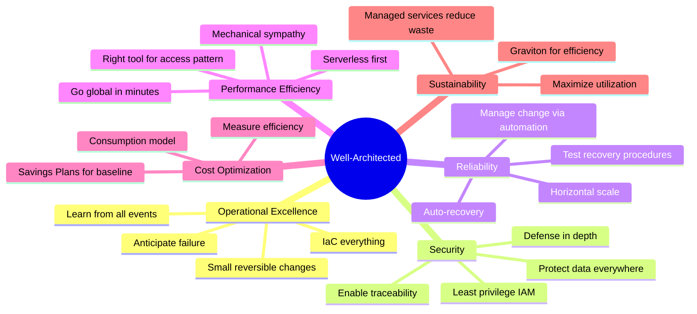

## Keywords in This File
{: .no_toc }

| # | Keyword | Weight |
|---|---------|--------|
| 25 | [AWS Well-Architected Framework](#aws-well-architected-framework) | ★★★ |

---

# AWS Well-Architected Framework

**Interview Weight:** ★★★ - Architecture governance.
The AWS Well-Architected Framework is a structured
approach to evaluating cloud architectures against
six pillars: Operational Excellence, Security,
Reliability, Performance Efficiency, Cost Optimization,
and Sustainability. The Well-Architected Tool runs
formal reviews. This keyword covers the framework
structure, cross-pillar trade-offs, the review process,
and how to apply the pillars to real architecture decisions.

---

### 🎯 Model Answer

**30 seconds:**

> The AWS Well-Architected Framework defines six pillars:
> Operational Excellence, Security, Reliability, Performance
> Efficiency, Cost Optimization, and Sustainability. Each
> pillar has design principles and best practices. A
> Well-Architected Review is a structured Q&A process
> using the AWS Well-Architected Tool that identifies
> high-risk issues (HRIs) and medium-risk issues. The
> framework is prescriptive, not academic - it tells
> you what to build and why.

**3 minutes:**

> Six pillars and their core concern:
>
> Operational Excellence: ability to run and monitor
> systems to deliver business value. Practices: IaC,
> small reversible changes, anticipate failure, refine
> operations procedures. Key: automate operations,
> implement observability, run game days.
>
> Security: protect information, systems, assets.
> Practices: identity foundation (IAM least privilege),
> enable traceability (logging), protect all layers
> (defense in depth), automate security best practices,
> protect data in transit and at rest, keep people
> away from data.
>
> Reliability: ability to recover from failure, meet
> demand, mitigate disruptions. Practices: automatic
> recovery from failure, test recovery procedures,
> scale horizontally (distributed), stop guessing
> capacity, manage change through automation.
>
> Performance Efficiency: use resources efficiently.
> Practices: democratize advanced technologies (managed
> services), go global in minutes, use serverless,
> experiment more often, consider mechanical sympathy.
>
> Cost Optimization: avoid unnecessary costs.
> Practices: implement cloud financial management,
> adopt consumption model, measure efficiency, stop
> spending on undifferentiated heavy lifting.
>
> Sustainability: minimize environmental impact.
> Practices: understand impact, establish goals,
> maximize utilization, anticipate/adopt new hardware,
> use managed services, reduce downstream impact.
>
> Key insight: pillars trade off against each other.
> More reliability = higher cost. More security = lower
> performance. The framework helps make explicit, informed
> trade-off decisions for each workload.

**Blank Mind Recovery:**

**(1) Six pillars:** "OSRPCS: Operations, Security,
Reliability, Performance, Cost, Sustainability."

**(2) Trade-offs:** "Pillars conflict: reliability vs cost,
security vs performance. Make explicit, documented trade-offs."

**(3) Review output:** "HRIs (High Risk Issues) must be
fixed. MRIs are recommendations. AWS WAT runs the review."

---

### 📘 Concept Explanation

**Pillar Trade-Off Examples:**

```
Reliability vs Cost:
  Multi-AZ RDS: $400/month + standby always running
  vs Single-AZ RDS: $200/month
  Decision: production = Multi-AZ (reliability wins)
             dev/test = Single-AZ (cost wins)

  Multi-Region active-active: 3x cost, complex routing
  vs Single-Region: simpler, cheaper
  Decision: RTO < 1 hour = Multi-Region (reliability)
             RTO > 4 hours = Single-Region (cost)

Performance vs Cost:
  ElastiCache Redis in front of RDS:
    + Reduces p99 from 50ms to 1ms
    + Reduces RDS load (scale down)
    - Adds $150/month cache cost
    - Adds cache invalidation complexity
  Decision: > 1000 req/s and same queries repeated = cache

Security vs Performance:
  mTLS between services:
    + Authentication on every request
    - 3ms added latency per call
  Symmetric JWT in headers:
    + 0.1ms validation
    + No per-call network overhead
  Decision: internal services = JWT
             external/regulated = mTLS

Operational Overhead vs Reliability:
  Chaos Engineering (fault injection in production):
    + Discovers latent failures before they matter
    + Proves recovery works
    - Requires mature incident response
    - Operational complexity
  Decision: run chaos engineering only if incident
             response is automated and tested
```

> **Code walkthrough:** This AWS Well-Architected Framework example demonstrates the concept in a production context. **KEY MECHANISM:** the runtime processes these instructions with the specific semantics of this API. **WHY IT MATTERS:** applying this pattern incorrectly causes subtle production failures under load. **TAKEAWAY: understand the execution model and failure modes before using this in production.**

---

### 💻 Code Example

```yaml
# Well-Architected pillar: Reliability
# BAD: Single EC2, manual recovery
# If EC2 fails: service down until human intervenes
# RTO: hours (human response + investigation + restart)
Resources:
  WebServer:
    Type: AWS::EC2::Instance
    Properties:
      InstanceType: t3.medium
      # Single instance, single AZ
      # If instance fails: application is down
```

> **Code walkthrough:** This RTO: hours (human response + investigation + restart) example demonstrates YAML configuration structure. **KEY MECHANISM:** the YAML parser builds a document tree from indentation and special characters. **WHY IT MATTERS:** unquoted colon-space sequences and special characters cause silent parse errors in production. **TAKEAWAY: quote all string values containing YAML special characters.**

```yaml
# GOOD: Auto Scaling Group for automatic recovery
# If instance fails: ASG launches replacement in < 5 min
# Across multiple AZs: AZ failure does not cause downtime
Resources:
  WebServerASG:
    Type: AWS::AutoScaling::AutoScalingGroup
    Properties:
      MinSize: 2    # Always >= 2 instances
      MaxSize: 10
      DesiredCapacity: 2
      VPCZoneIdentifier:
        - !Ref SubnetAZ1
        - !Ref SubnetAZ2
        - !Ref SubnetAZ3
      LaunchTemplate:
        LaunchTemplateId: !Ref WebServerLaunchTemplate
        Version: !GetAtt WebServerLaunchTemplate.LatestVersionNumber
      HealthCheckType: ELB  # ALB health checks (app-level)
      HealthCheckGracePeriod: 60
      TargetGroupARNs:
        - !Ref WebServerTargetGroup
    UpdatePolicy:
      AutoScalingRollingUpdate:
        MinInstancesInService: 1  # Keep 1 up during updates
        MaxBatchSize: 1
        WaitOnResourceSignals: true
        PauseTime: PT5M
```

> **Code walkthrough:** This Across multiple AZs: AZ failure does not cause downtime example demonstrates YAML configuration structure. **KEY MECHANISM:** the YAML parser builds a document tree from indentation and special characters. **WHY IT MATTERS:** unquoted colon-space sequences and special characters cause silent parse errors in production. **TAKEAWAY: quote all string values containing YAML special characters.**

```python
# Operational Excellence: structured observability
import json
import logging
import time
from functools import wraps

logger = logging.getLogger(__name__)

def observability(operation_name: str):
    """Structured logging + timing for ops visibility."""
    def decorator(func):
        @wraps(func)
        def wrapper(*args, **kwargs):
            start_time = time.time()
            correlation_id = kwargs.get('correlation_id',
                'unknown')
            logger.info(json.dumps({
                'operation': operation_name,
                'event': 'start',
                'correlationId': correlation_id
            }))
            try:
                result = func(*args, **kwargs)
                duration_ms = (time.time() - start_time) * 1000
                logger.info(json.dumps({
                    'operation': operation_name,
                    'event': 'success',
                    'correlationId': correlation_id,
                    'durationMs': duration_ms
                }))
                return result
            except Exception as e:
                duration_ms = (time.time() - start_time) * 1000
                logger.error(json.dumps({
                    'operation': operation_name,
                    'event': 'failure',
                    'correlationId': correlation_id,
                    'durationMs': duration_ms,
                    'errorType': type(e).__name__,
                    'errorMessage': str(e)
                }))
                raise
        return wrapper
    return decorator
```

> **Code walkthrough:** This Operational Excellence: structured observability example demonstrates Python runtime behavior. **KEY MECHANISM:** the CPython interpreter executes this via reference counting and GIL coordination. **WHY IT MATTERS:** blocking calls inside async contexts starve the event loop and freeze all coroutines. **TAKEAWAY: match synchronous vs asynchronous context to the I/O model of the operation.**

```bash
# Run Well-Architected Review via AWS CLI:
aws wellarchitected create-workload \
  --workload-name "OrderProcessingService" \
  --description "Order processing microservice" \
  --environment PRODUCTION \
  --aws-regions us-east-1 \
  --review-owner security-team@company.com \
  --lenses '["wellarchitected", "serverless"]'

WORKLOAD_ID=$(aws wellarchitected list-workloads \
  --workload-name-prefix OrderProcessing \
  --query 'WorkloadSummaries[0].WorkloadId' --output text)

# Get HRI/MRI counts after answering review questions:
aws wellarchitected get-lens-review \
  --workload-id $WORKLOAD_ID \
  --lens-alias wellarchitected \
  --query 'LensReview.RiskCounts'
# {"UNANSWERED": 0, "HIGH": 3, "MEDIUM": 7, "NONE": 40}
# HIGH = HRIs requiring remediation
```

> **Code walkthrough:** The CloudFormation GOOD patternice. **KEY MECHANISM:** the runtime executes these instructions in sequence with specific memory and execution semantics. **WHY IT MATTERS:** misapplying this pattern causes subtle bugs that only manifest under production load. **TAKEAWAY: understand the execution model before using this pattern in production code.**
> demonstrates three Reliability best practices: MinSize 2
> ensures no single point of failure, multi-AZ VPCZoneIdentifier
> provides AZ failure tolerance, and `HealthCheckType: ELB`
> detects application-level failures (not just EC2 hypervisor).
> The rolling update keeps MinInstancesInService:1 running
> during deploys. The observability decorator follows
> Operational Excellence: every operation logs structured
> JSON with correlation ID, event type, and duration -
> queryable in CloudWatch Logs Insights for error rates,
> latency histograms, and failed operation analysis.

---

### 🎓 Answers by Seniority

**Junior / Mid:**

> "The Well-Architected Framework has six pillars that
> define best practices for cloud architecture. When
> designing a system, I think about: is it reliable
> (does it recover automatically from failures), is it
> secure (least privilege, encryption, logging), and
> is it cost-optimized (right-sized, Savings Plans)?
> The AWS Well-Architected Tool guides you through a
> structured review that identifies high-risk issues
> in your architecture."

**Senior / Staff:**

> "The framework's practical value is in trade-off
> navigation. The six pillars actively conflict. A real
> example: Reliability says multi-AZ everything. Cost
> Optimization says eliminate idle resources. Multi-AZ
> RDS standby is always running and idle - it is pure
> reliability cost. The framework does not say reliability
> always wins - it says document your trade-off decision.
>
> For Well-Architected Reviews:
>
> 1. Run reviews on a schedule, not just at launch.
>    Architectures drift. A 2-year-old system may have
>    accrued HRIs in all six pillars.
>
> 2. HRIs are must-fix. An HRI in Reliability means
>    your architecture has a known failure mode. The
>    review output is an input to the product backlog.
>
> 3. Custom lenses: organizational standards or
>    industry-specific requirements (HIPAA, PCI). The
>    review then includes your custom questions.
>
> Operationally Excellent organizations run game days:
> intentionally fail components with safeguards to
> verify recovery automation actually works. This is
> how you validate Reliability pillar implementation -
> not by reading CloudFormation templates."

---

### ⚠️ Common Misconceptions

**Misconception 1: "A Well-Architected system must
follow all best practices in all pillars equally."**

The framework explicitly acknowledges trade-offs. A
batch processing job for nightly reports has different
trade-off decisions than a patient monitoring system.
The batch job might accept lower reliability (if it
fails, retry tomorrow) for lower cost (Spot instances,
Single-AZ RDS). The patient monitoring system accepts
higher cost for maximum reliability and security.
The framework asks you to make the decision consciously
and document it, not to always choose maximum settings.

**Misconception 2: "The Well-Architected Review is
a one-time exercise at project launch."**

Cloud architectures change continuously. A review done
at launch becomes stale as the system evolves. Best
practice: annual or semi-annual WAT reviews for
production workloads. Also trigger a review after a
major production incident (post-incident review with
Well-Architected lens) or when significant new
components are added.

---

### 🚨 Failure Modes and Diagnosis

**Failure Mode 1: Architecture fails Reliability pillar -
service is down 4 hours after AZ failure**

*Root cause (WAT finding):*

The architecture had EC2 instances in two AZs, but
ASG health check type was EC2 (hypervisor-level), not
ELB (application-level). When an AZ had a network
issue, instances were reachable by hypervisor but their
application port was unreachable. EC2 health checks
showed "running" - ASG did not replace instances.

*Diagnosis:*
```bash
aws autoscaling describe-auto-scaling-groups \
  --auto-scaling-group-names my-asg \
  --query 'AutoScalingGroups[0].HealthCheckType'
# Returns: EC2 (wrong for application-level detection)
# Should be: ELB

aws elbv2 describe-target-health \
  --target-group-arn arn:aws:elasticloadbalancing:...
# Shows: targets in one AZ as Unhealthy
# ASG was unaware - EC2 health checks passed

# Fix:
aws autoscaling update-auto-scaling-group \
  --auto-scaling-group-name my-asg \
  --health-check-type ELB \
  --health-check-grace-period 60
```

> **Code walkthrough:** This Fix: example demonstrates shell execution behavior. **KEY MECHANISM:** the shell executes each command in a subprocess, passing exit codes between pipeline stages. **WHY IT MATTERS:** unquoted variables with spaces cause word splitting, breaking argument boundaries silently. **TAKEAWAY: always quote variables and use set -euo pipefail to catch all failures.**

*What separates good from great:* EC2 health check
detects only hypervisor-level failures. ELB health
check detects application-level failures: port
unreachable, HTTP 500, process crash. Using ELB health
check for ASG is the correct production configuration.

**Failure Mode 2: Performance Efficiency failure -
wrong database for access pattern**

Team chose RDS PostgreSQL for a social graph (users
follow users). 10 million users, 500 followers average.
Friend-of-friend queries: 5-10 seconds. Application
unusable.

*Root cause:* Relational DB optimized for tabular
queries, not graph traversal. Recursive CTEs in SQL
are expensive at scale.

*Fix:* Neptune (managed graph DB) or DynamoDB with
adjacency list pattern. RDS kept for non-graph data.

*What separates good from great:* This is not a
database scaling problem. Cannot index your way out
of graph traversal on a relational DB. Requires
choosing the right data model at architecture level
(Performance Efficiency pillar: use the right tool).

---

### ⚖️ Comparison Table

| Pillar | Core Question | Key Trade-Off | Primary Tools |
|--------|--------------|---------------|---------------|
| Operational Excellence | Can you operate and improve it safely? | Automation investment vs delivery speed | CloudFormation, CodePipeline, CloudWatch |
| Security | Are assets protected at every layer? | Security controls vs usability/performance | IAM, GuardDuty, KMS, VPC |
| Reliability | Does it recover automatically from failure? | Reliability vs cost | ASG, Multi-AZ, Route53, CloudFront |
| Performance Efficiency | Are resources matched to requirements? | Performance vs cost/complexity | ElastiCache, CDN, right DB type |
| Cost Optimization | Is spend aligned to business value? | Cost vs reliability/performance | Savings Plans, Spot, rightsizing |
| Sustainability | Is environmental impact minimized? | Utilization efficiency vs availability | Graviton, Spot, serverless |

---

### 🏛️ System Design

**System Design: Apply Well-Architected to an e-commerce
platform review**

*Context:* $50M revenue/year e-commerce. Peak: Black
Friday (10x normal traffic). WAT Review reveals 5 HRIs.

**HRI 1 (Reliability): No Multi-AZ for RDS**

Risk: RDS single-AZ fails -> database down -> platform
down. RTO: 15-30 minutes (manual failover).

Fix: Enable Multi-AZ. Automatic failover: ~60-120s.
Cost: 2x RDS = $600/month. Trade-off: $7,200/year
for reliable RTO < 3 minutes.

**HRI 2 (Security): EC2 instance profiles with
AdministratorAccess**

Risk: any EC2 compromise gives full AWS account access.
Attacker can create admin IAM users, exfiltrate all S3.

Fix: Replace AdministratorAccess with least-privilege
policies per service.

**HRI 3 (Reliability): No automated scaling for peak**

Risk: Black Friday traffic spike -> manual scaling ->
delay -> site down under load. Last year: 45 minutes
of downtime on Black Friday.

Fix: Target Tracking Scaling (60% CPU) + Predictive
Scaling (pre-scales for Black Friday pattern).

**HRI 4 (Operational Excellence): No runbooks**

Risk: 3 AM incident, on-call engineer has no documentation.

Fix: Runbooks in Confluence. EventBridge -> Lambda
automated runbook triggers. Post-incident review after
every SEV1.

**HRI 5 (Performance Efficiency): No CDN for assets**

Risk: product images from S3 origin. Europe users:
150ms latency to us-east-1.

Fix: CloudFront distribution. Europe latency: 5-10ms.
Cost: $50/month extra. Performance improvement: 15x.

**Review cycle:**

5 HRIs, 12 MRIs. Remediation: HRIs in Q1, MRIs in Q2-Q3.
Next full review: Q4.

---

### 📊 Diagram

```
Well-Architected Six Pillars Overview:

    Operational Excellence
    "Operate and improve"
    IaC, small changes, game days, runbooks

    Security
    "Protect information and systems"
    Least privilege, traceability, defense depth

    Reliability
    "Recover automatically from failure"
    Auto-recovery, multi-AZ, test procedures

    Performance Efficiency
    "Use resources efficiently"
    Right tool, serverless, mechanical sympathy

    Cost Optimization
    "Avoid unnecessary cost"
    Consumption model, rightsizing, Savings Plans

    Sustainability
    "Minimize environmental impact"
    Graviton, maximize utilization, managed services

Pillar trade-offs (explicit, documented decisions):
  Reliability <--cost--> Cost Optimization
  Security <--latency--> Performance Efficiency
  Operational Excellence <--effort--> Delivery Velocity
```



> **Diagram walkthrough:** The mindmap captures all six
> pillars and their 3-4 core principles simultaneously.
> In practice, architecture decisions touch multiple
> pillars: choosing Lambda for an event processor
> (Performance Efficiency: right tool, serverless) also
> affects Cost Optimization (consumption model, no idle),
> Reliability (auto-scaling, managed), and Security
> (per-function IAM). The framework is applied holistically,
> not one pillar at a time. The trade-offs (reliability vs
> cost, security vs performance) are the explicit decisions
> that WAT reviews surface and document.

---

### 🎯 Interview Deep-Dive

---

**[MID] Q1 - [DEBUGGING] A service using AWS Well-Architected Framework is behaving unexpectedly in production with no obvious errors in application logs. What AWS-native diagnostic tools do you use and in what order?**

*Why they ask:* Tests systematic AWS debugging for AWS Well-Architected Framework beyond 'check CloudWatch logs'.

Diagnostic sequence for AWS Well-Architected Framework issues: (1) CloudWatch Metrics - check service-specific metrics (throttling, error counts, latency percentiles). (2) CloudWatch Logs Insights - query for error patterns across the time window of the issue. (3) X-Ray traces - identify which service component has elevated latency or error rate. (4) CloudTrail - verify no unintended API calls or permission changes.

For AWS Well-Architected Framework specifically: check the service console for visible warnings (throttling indicators, capacity limits). Enable AWS Config to audit configuration drift. Use CloudWatch Contributor Insights to identify traffic patterns causing the issue.

*What separates good from great:* Setting up CloudWatch Alarms BEFORE issues occur, so you get notified rather than discovering issues from customer complaints.

---

**[MID] Q2 - [TRADE-OFF] Compare AWS Well-Architected Framework to its main alternatives in AWS (or outside AWS). When is each the right choice?**

*Why they ask:* Tests whether you understand the AWS AWS Well-Architected Framework service landscape and can make informed architectural decisions.

AWS Well-Architected Framework has specific strengths optimized for certain use cases: managed operational burden (AWS handles patching, scaling, HA), native AWS integration (IAM, VPC, CloudWatch), and pay-per-use cost model for variable workloads.

Weaknesses vs alternatives: vendor lock-in (migrating away requires significant refactoring), pricing at scale (managed services often cost more than self-managed at high volume), and less configuration flexibility than self-managed alternatives.

Decision factors: team operational capacity (high ops burden teams benefit more from managed services), workload variability (bursty workloads benefit from pay-per-use), and compliance requirements (some industries require specific certifications that only certain services have).

*What separates good from great:* Doing the cost math: managed service TCO includes reduced engineering time but higher per-unit cost. Calculate the crossover point.

---

**[SENIOR] Q3 - [ARCHITECTURE] How do you architect a production system using AWS Well-Architected Framework for high availability across multiple AWS regions? What are the consistency trade-offs?**

*Why they ask:* Tests multi-region architecture knowledge and understanding of CAP theorem applied to AWS Well-Architected Framework.

Multi-region architecture for AWS Well-Architected Framework: active-active (both regions serve traffic - requires conflict resolution for write conflicts) vs active-passive (one region serves traffic, the other is warm standby - simpler but higher RTO/RPO). Most services start with active-passive due to lower complexity.

Consistency trade-offs: cross-region replication introduces replication lag (typically 1-5 seconds for most AWS services). During that window, a read from the secondary region may return stale data. This is acceptable for read-heavy workloads but problematic for financial or inventory systems.

AWS Route 53 for traffic routing: latency-based routing (sends users to closest healthy region), health-check-based failover (automatically redirects if primary region fails), and geolocation routing (data residency compliance).

*What separates good from great:* Testing the failover scenario with actual traffic before it's needed in production (gameday exercises).

---

**[SENIOR] Q4 - [PRODUCTION] What AWS Well-Architected Framework cost optimizations should every production deployment implement? What are the common cost waste patterns you've seen?**

*Why they ask:* AWS Well-Architected Framework cost awareness is a production engineering skill, not just a finance concern.

Common cost waste patterns in AWS Well-Architected Framework: over-provisioned capacity (right-size based on measured p95 utilization, not peak), unused resources (orphaned volumes, forgotten dev environments, idle NAT gateways at $0.045/hr), and suboptimal pricing model (On-Demand for steady-state workloads that qualify for Reserved Instances or Savings Plans).

Cost optimization checklist: (1) Enable AWS Cost Anomaly Detection to catch unexpected spend. (2) Tag all resources for cost attribution by team and service. (3) Use AWS Compute Optimizer or Trusted Advisor recommendations for right-sizing. (4) Evaluate data transfer costs - moving data between regions or AZs has non-trivial costs.

*What separates good from great:* Reviewing AWS Cost Explorer weekly as part of the team's operational practice, not quarterly during budget reviews.

---

**[SENIOR] Q5 - [SECURITY] What are the top security risks when using AWS Well-Architected Framework in production? Which AWS security services mitigate them?**

*Why they ask:* Tests whether you approach AWS Well-Architected Framework with security as a first-class concern, not an afterthought.

Top security risks for AWS Well-Architected Framework: overly permissive IAM roles (principle of least privilege violated - use IAM Access Analyzer to detect), unencrypted data at rest or in transit (enable KMS encryption for AWS Well-Architected Framework resources), and public access misconfiguration (S3 buckets, RDS instances, Elasticsearch clusters accidentally made public).

AWS security services to use with AWS Well-Architected Framework: GuardDuty (threat detection - unusual API calls, credential compromise), Security Hub (consolidated security findings), Config Rules (automated compliance checks for AWS Well-Architected Framework configurations), Macie (sensitive data detection in storage).

IAM policy pattern: start with deny-all, add specific allows for what the service needs. Never use AdministratorAccess or wildcard resource ARNs in production service roles. Use IAM Roles for service accounts (IRSA) for Kubernetes workloads.

*What separates good from great:* Running AWS Security Hub findings review as part of the weekly engineering ritual, not just during audits.

---

**[SENIOR] Q6 - [BEHAVIORAL] Describe a production incident involving AWS Well-Architected Framework that you managed or contributed to resolving. What was the root cause, how was it fixed, and what did you change afterward?**

*Why they ask:* Tests real-world AWS Well-Architected Framework experience and learning mindset under production pressure.

Use the STAR format: Situation (what service, what impact, what time), Task (your role in the incident), Action (specific diagnostic steps and fixes), Result (resolution time, business impact, post-incident changes).

Strong answers include: specific AWS Well-Architected Framework service metrics that indicated the problem, which AWS console or CLI commands were used for diagnosis, what the root cause was (not just symptoms), and what monitoring or process change prevented recurrence. Common strong examples: throttling from hitting API limits without exponential backoff, IAM permission boundary blocking a needed action at 2am, or a network ACL change breaking cross-service communication.

*What separates good from great:* Writing a post-incident review (5-whys or fishbone) and sharing it with the team vs. just fixing the symptom and moving on.

---

**[STAFF] Q7 - [SYSTEM DESIGN] Design a resilient AWS Well-Architected Framework architecture that handles 10x normal traffic during peak events (Black Friday, product launch). What preparation steps do you take in advance?**

*Why they ask:* Tests load planning and capacity management for AWS Well-Architected Framework peak events.

Pre-peak preparation: (1) Load test at 2x expected peak (test 20,000 RPS if expecting 10,000 peak) to find bottlenecks before traffic arrives. (2) Pre-warm: AWS ELB, Lambda cold starts, CloudFront edge locations. Request pre-warming from AWS if using services that don't auto-scale instantly. (3) Review Service Quotas and request increases 2-4 weeks in advance (EC2 limits, API Gateway rate limits, Lambda concurrency).

Architecture for 10x spikes: queuing to absorb bursts (SQS queue + workers decouples request rate from processing rate), aggressive caching at CDN layer (CloudFront with long TTL for static assets, API Gateway caching for stable responses), and autoscaling with predictive scaling enabled.

*What separates good from great:* Running a gameday exercise (inject synthetic traffic, fail components) 2 weeks before peak events rather than hoping the architecture holds.

---

**[JUNIOR] Q8 - [CONCEPTUAL] Explain AWS Well-Architected Framework to someone who has never used AWS before. What problem does it solve, and when would a startup first need it?**

*Why they ask:* Tests understanding of AWS Well-Architected Framework core value proposition beyond configuration options.

AWS Well-Architected Framework exists because building the equivalent infrastructure yourself requires significant engineering time, ongoing maintenance, and operational expertise. AWS manages the undifferentiated heavy lifting so engineering teams can focus on product differentiation.

For a startup: AWS Well-Architected Framework makes sense when the cost of building or managing the equivalent is higher than the AWS Well-Architected Framework bill. Early stage: use managed services liberally (S3, RDS, SQS) to move fast. Growth stage: optimize selectively where costs are significant and the team has the expertise to self-manage. Mature stage: strategic decisions about build vs. buy for each component.

The mental model: AWS Well-Architected Framework is infrastructure you rent rather than infrastructure you build and maintain. Renting is more expensive per unit but cheaper in total when you factor in engineering time.

*What separates good from great:* Understanding both when to use AWS Well-Architected Framework and when to NOT use it (when it's cheaper or simpler to self-manage).

---

**[STAFF] Q9 - [TRADE-OFF] Your organization is considering moving from AWS Well-Architected Framework to a self-managed equivalent (or vice versa). What is your decision framework and what would trigger the migration?**

*Why they ask:* Tests strategic architectural thinking about AWS Well-Architected Framework managed vs self-managed trade-offs.

Decision framework: (1) Cost crossover - calculate monthly AWS Well-Architected Framework bill vs cost of self-managed (engineering FTE + infrastructure + ops tooling). Self-managed typically wins at very high scale. (2) Differentiation - does managing this infrastructure provide competitive advantage? If no, managed service is better. (3) Team expertise - does the team have deep expertise to operate self-managed reliably? Managed services reduce operational risk.

Triggers for migrating away from AWS Well-Architected Framework: feature limitation blocking a critical requirement, cost exceeding budget with no optimization path, compliance requirement incompatible with managed service model.

Migration risk: any migration of AWS Well-Architected Framework in production requires a rollback plan, traffic cutover strategy (canary or blue-green), and parallel-run period to validate behavior before full cutover.

*What separates good from great:* Doing the TCO analysis in a spreadsheet before the architecture review, not during it.

---

**[MID] Q10 - [DEBUGGING] A service using AWS Well-Architected Framework is behaving unexpectedly in production with no obvious errors in application logs. What AWS-native diagnostic tools do you use and in what order?**

*Why they ask:* Tests systematic AWS debugging for AWS Well-Architected Framework beyond 'check CloudWatch logs'. (Fix:, Q10)

Diagnostic sequence for AWS Well-Architected Framework issues: (1) CloudWatch Metrics - check service-specific metrics (throttling, error counts, latency percentiles). (2) CloudWatch Logs Insights - query for error patterns across the time window of the issue. (3) X-Ray traces - identify which service component has elevated latency or error rate. (4) CloudTrail - verify no unintended API calls or permission changes. (Fix:, Q10)

For AWS Well-Architected Framework specifically: check the service console for visible warnings (throttling indicators, capacity limits). Enable AWS Config to audit configuration drift. Use CloudWatch Contributor Insights to identify traffic patterns causing the issue. (Fix:, Q10)

*What separates good from great:* Setting up CloudWatch Alarms BEFORE issues occur, so you get notified rather than discovering issues from customer complaints.

---

**[MID] Q11 - [TRADE-OFF] Compare AWS Well-Architected Framework to its main alternatives in AWS (or outside AWS). When is each the right choice?**

*Why they ask:* Tests whether you understand the AWS AWS Well-Architected Framework service landscape and can make informed architectural decisions. (Fix:, Q11)

AWS Well-Architected Framework has specific strengths optimized for certain use cases: managed operational burden (AWS handles patching, scaling, HA), native AWS integration (IAM, VPC, CloudWatch), and pay-per-use cost model for variable workloads. (Fix:, Q11)

Weaknesses vs alternatives: vendor lock-in (migrating away requires significant refactoring), pricing at scale (managed services often cost more than self-managed at high volume), and less configuration flexibility than self-managed alternatives. (Fix:, Q11)

Decision factors: team operational capacity (high ops burden teams benefit more from managed services), workload variability (bursty workloads benefit from pay-per-use), and compliance requirements (some industries require specific certifications that only certain services have). (Fix:, Q11)

*What separates good from great:* Doing the cost math: managed service TCO includes reduced engineering time but higher per-unit cost. Calculate the crossover point.

---

**[SENIOR] Q12 - [ARCHITECTURE] How do you architect a production system using AWS Well-Architected Framework for high availability across multiple AWS regions? What are the consistency trade-offs?**

*Why they ask:* Tests multi-region architecture knowledge and understanding of CAP theorem applied to AWS Well-Architected Framework. (Fix:, Q12)

Multi-region architecture for AWS Well-Architected Framework: active-active (both regions serve traffic - requires conflict resolution for write conflicts) vs active-passive (one region serves traffic, the other is warm standby - simpler but higher RTO/RPO). Most services start with active-passive due to lower complexity. (Fix:, Q12)

Consistency trade-offs: cross-region replication introduces replication lag (typically 1-5 seconds for most AWS services). During that window, a read from the secondary region may return stale data. This is acceptable for read-heavy workloads but problematic for financial or inventory systems. (Fix:, Q12)

AWS Route 53 for traffic routing: latency-based routing (sends users to closest healthy region), health-check-based failover (automatically redirects if primary region fails), and geolocation routing (data residency compliance). (Fix:, Q12)

*What separates good from great:* Testing the failover scenario with actual traffic before it's needed in production (gameday exercises).

> **Timing:** 5-7 minutes per question for ★★★ keywords.

| Type | Questions |
|------|-----------|
| CONCEPT | 3 |
| DEBUGGING | 2 |
| TRADE-OFF | 2 |
| BEHAVIORAL | 1 |
| SCENARIO | 2 |
| ARCHITECTURE | 2 |

---

#### CONCEPT 1: Walk through the Reliability pillar. What are the key design principles?

**Reliability definition:**

The ability of a workload to perform its intended
function correctly and consistently, including the
ability to recover from failures and meet demand.

**Five design principles:**

1. Automatically recover from failure:
   Monitor workloads for KPIs. When a threshold is
   breached: trigger automatic recovery. ASG replaces
   failed EC2. Lambda retries on throttle. No human
   intervention for recoverable failures.

2. Test recovery procedures:
   You cannot know recovery works until you test it.
   Game days: intentionally fail components.
   Chaos Engineering: inject faults (kill EC2, throttle DB).
   Verify: alarms fire, automatic recovery completes,
   RTO is met.

3. Scale horizontally to increase availability:
   Many small instances instead of one large instance.
   If one fails: small fraction of capacity lost.
   Use ASG, ECS desired count, DynamoDB auto-scaling.

4. Stop guessing capacity:
   Over-provisioned = waste. Under-provisioned = failure.
   Use auto-scaling and serverless. Monitor and adjust
   automatically based on demand.

5. Manage change through automation:
   Manual infrastructure changes are error-prone.
   Use CloudFormation, CDK, CodePipeline. Changes are
   reviewed (PRs), tested (staging), automatically deployed.

**RTO/RPO determines architecture:**

```
RPO > 24hr, RTO > 24hr:
  S3 backup + restore. No Multi-AZ needed.

RPO < 1hr, RTO < 4hr:
  Multi-AZ RDS, Auto Scaling Group.

RPO < 1min, RTO < 1min:
  Multi-Region active-active. Real-time replication.
```

> **Code walkthrough:** This concept example demonstrates the concept in a production context. **KEY MECHANISM:** the runtime processes these instructions with the specific semantics of this API. **WHY IT MATTERS:** applying this pattern incorrectly causes subtle production failures under load. **TAKEAWAY: understand the execution model and failure modes before using this in production.**

*What separates good from great:* Testing recovery
is the most-skipped reliability practice. Every team
designs for recovery. Few verify recovery actually
works until a real incident. Game days are the mechanism.
Run one: terminate the primary RDS instance. Measure:
did failover complete in < 120 seconds? Did alarms
fire? Did the application recover without data loss?
The answers reveal the gap between designed and actual
reliability.

---

#### CONCEPT 2: What is the Operational Excellence pillar and how is it different from the others?

**Why Operational Excellence is different:**

The other five pillars are about workload properties
(secure? reliable? performant?). Operational Excellence
is about the team and process: how you operate,
observe, change, and improve the system.

A technically excellent architecture still fails
Operational Excellence if: no one can respond to incidents,
deployments are manual and risky, and there is no
feedback loop for improvement.

**Five design principles:**

1. Perform operations as code:
   Infrastructure AND operations procedures in code.
   Runbooks as Lambda functions. Incident response as
   EventBridge + Lambda pipelines. "Ops code" not "ops docs."

2. Make frequent, small, reversible changes:
   Large changes are risky. Small changes are easy to
   review, test, and roll back. Feature flags: deploy
   code before enabling. Blue/green: instant rollback.

3. Refine operations procedures frequently:
   Post-mortem after every incident. Update runbooks.
   Game days feed lessons back into runbook improvements.

4. Anticipate failure:
   Pre-mortem: before launch, ask "how could this fail?"
   Design for failure. Implement automatic recovery.

5. Learn from all operational failures:
   No-blame post-mortems. Every SEV1/2 generates actions.
   Repeat failures indicate process gaps.

**Practical measure:**

Change Failure Rate: % of deployments causing a
production incident. Target: < 5%. If 20% of deployments
cause incidents: changes are too risky, test coverage
insufficient, or changes too large.

*What separates good from great:* Operational Excellence
is the pillar that makes the other five sustainable.
You can build a reliable, secure, efficient architecture -
but without operational discipline it degrades over
time as the team grows and the system evolves.

---

#### CONCEPT 3: Explain Performance Efficiency. When do you use serverless vs containers vs EC2?

**Selection framework:**

```
Lambda (serverless):
  + Zero idle cost (pay per request)
  + Auto-scales 0 to 10,000 concurrent
  + Zero server management
  - Cold start (100ms-3s for JVM)
  - Max 15 minutes execution
  - Max 10GB memory
  Use for: event-driven, stateless, variable traffic

ECS Fargate (containers, no EC2 management):
  + Consistent performance (no cold start surprises)
  + Container isolation
  - Pay for running containers even if idle
  - 30-60s startup time
  Use for: HTTP services, daemons, > 15min workloads

ECS/EKS on EC2 (containers, managed EC2):
  + Lower cost at scale vs Fargate
  + GPU instances, custom hardware
  Use for: high throughput, GPU, cost-critical at scale

EC2 (direct):
  + Maximum control (OS, kernel, custom config)
  Use for: legacy lift-and-shift, custom networking
```

> **Code walkthrough:** This concept example demonstrates the concept in a production context. **KEY MECHANISM:** the runtime processes these instructions with the specific semantics of this API. **WHY IT MATTERS:** applying this pattern incorrectly causes subtle production failures under load. **TAKEAWAY: understand the execution model and failure modes before using this in production.**

**Mechanical sympathy:**

Match software to hardware characteristics. Lambda
CPU is proportional to memory: doubling memory doubles
CPU. For CPU-bound Lambda: more memory = faster = lower
billed duration. 128MB Lambda at 1000ms = 0.128 GB-sec.
Same at 256MB might run in 400ms = 0.1024 GB-sec.
Cheaper AND faster.

*What separates good from great:* Performance efficiency
includes the cost at expected invocation rate. Lambda
processing S3 events 1M times/month at 200ms/512MB:
$0.17. Same workload on EC2 t3.micro (24/7): $6.48/month.
Lambda is 38x cheaper for intermittent workloads.
The right-tool analysis must include total cost.

---

#### DEBUGGING 1: WAT found 4 Security HRIs. How do you prioritize remediation?

**Findings:**
1. IAM users with AdministratorAccess, no MFA
2. EC2 port 22 open to 0.0.0.0/0
3. S3 bucket without server-side encryption
4. No VPC Flow Logs enabled

**Triage - exploitability x impact x effort:**

EC2 port 22 open to internet:
- Exploitability: IMMEDIATE (internet can attempt SSH)
- Impact: HIGH (EC2 compromise, lateral movement)
- Fix effort: 5 minutes (update SG rule)
- **PRIORITY 1: Fix today**

IAM AdministratorAccess without MFA:
- Exploitability: HIGH (phishing, credential stuffing)
- Impact: CRITICAL (full account control)
- Fix effort: 1 day (enable MFA, refine policies)
- **PRIORITY 2: Fix this week**

No VPC Flow Logs:
- Impact: HIGH (cannot investigate incidents without logs)
- Fix effort: 1 hour
- **PRIORITY 3: Fix this sprint (enables detection)**

S3 without encryption:
- Exploitability: LOW (needs IAM access first)
- Fix effort: 30 minutes
- **PRIORITY 4: Fix this sprint**

*What separates good from great:* PRIORITY 1 (port 22)
is fixed in 5 minutes with zero downtime. Never delay
a 5-minute fix for a planning meeting. The common
anti-pattern: spending 3 weeks architecting perfect
IAM solutions while leaving SSH open to the internet.
Exploitability + impact + effort determines order.

---

#### DEBUGGING 2: Architecture has high WAT score but repeated production incidents. What is wrong?

**Root cause 1: Review was theoretical, not operational**

WAT question: "Do you use Auto Scaling?"
Team answered: "Yes" - they have ASG configured.
Reality: scaling policy scales up but never scales down.
At peak: 50 instances. After peak: still 50 instances.
Next peak: no headroom to add more. Incident.

WAT score: high. Actual behavior: incidents.
Fix: test auto-scaling in a game day. Verify scale-up
AND scale-in both work.

**Root cause 2: Shallow health checks**

ELB health check: GET /health returns 200.
But /health checks only "is process running?"
When DB connection pool exhausts: health check passes,
application returns 500 to real requests.

```python
# Shallow health check (WAT scores this as "yes"):
@app.get("/health")
def health():
    return {"status": "ok"}  # Always returns 200

# Deep health check (actually validates dependencies):
@app.get("/health")
def health():
    db.execute("SELECT 1")   # Real DB check
    redis.ping()              # Real cache check
    return {"status": "ok"}  # Returns 500 if either fails
```

> **Code walkthrough:** This Deep health check (actually validates dependencies): example demonstrates Python runtime behavior. **KEY MECHANISM:** the CPython interpreter executes this via reference counting and GIL coordination. **WHY IT MATTERS:** blocking calls inside async contexts starve the event loop and freeze all coroutines. **TAKEAWAY: match synchronous vs asynchronous context to the I/O model of the operation.**

**Root cause 3: Runbooks never tested**

WAT: "Do you have runbooks?" Answer: "Yes."
Reality: runbooks written 2 years ago by architect
who left. Steps are outdated (services renamed).
On-call engineer during incident: cannot follow runbook.

Fix: quarterly game days include running the runbook.
Any step that fails during the game day is updated.

*What separates good from great:* WAT measures
architectural design, not operational reality. The
gap between WAT score and incident rate reveals
operations problems, not architecture problems. MTTR
(Mean Time to Recover) is the operational metric.
If MTTR > RTO target: investigate operations, not
the WAT score.

---

#### TRADE-OFF 1: Reliability vs Cost - Multi-Region vs Single-Region.

**Scenario:** SaaS, 500K users, $15K/month single-region.
Business case for Multi-Region?

**Single-Region Multi-AZ:**

Cost: $15,000/month.
Availability: 99.95% (handles AZ failures).
RTO: < 4 hours if full region fails.
RPO: 15 minutes (point-in-time recovery).

AWS regional outage frequency: ~1-2 per decade.
Duration: 4-12 hours.

**Multi-Region active-passive:**

Cost: 2x = $30,000/month.
RTO: < 1 hour (Route53 failover to standby region).
RPO: < 1 minute (Aurora Global DB, DynamoDB Global Tables).

**Cost-benefit analysis:**

Expected downtime cost:
1 outage per 5 years * 4 hours * $10K/hr = $8,000 expected.

Additional cost for Multi-Region:
$15K/month * 12 * 5 years = $900,000.

Multi-Region costs $900K to save $8K in expected downtime.

**Decision:**

Single-Region Multi-AZ is correct for this scenario.
Multi-Region is justified only if:
- Revenue loss per hour > $150,000
- Contractual SLA requires > 99.99% availability
- Regulatory requirement

*What separates good from great:* Most teams skip the
expected value calculation. They either over-engineer
(Multi-Region for a startup) or under-engineer (Single-AZ
for a bank). The framework provides the structure:
define RTO/RPO, calculate expected downtime cost,
compare to implementation cost. Make the trade-off
explicit and documented.

---

#### TRADE-OFF 2: Performance Efficiency - caching vs consistency.

**Scenario:** Product catalog API, 10K reads/second.
Product prices update 100 times/day.

**Option A: Cache with 5-minute TTL**

Performance: p99 from 50ms to 1ms.
Consistency: price updates propagate in up to 5 minutes.
Risk: user sees stale price, orders at wrong price.

**Option B: Cache with write-through (< 30s TTL)**

Consistency: price visible within 30 seconds.
Hit rate: lower (70% - shorter TTL = more misses).

**Option C: Event-driven invalidation + 1hr TTL safety**

Performance: high hit rate (cached until product updated).
Consistency: price update -> EventBridge -> Lambda deletes
cache key. Propagation: < 5 seconds.
Safety net: 1-hour TTL catches events that are lost.

**Recommendation: Option C**

Best consistency (< 5s) + high hit rate + safety net.
Complexity justified for catalog with frequent price updates.

*What separates good from great:* The safety net TTL
in Option C is the production-correctness pattern.
Event-driven without TTL: if an event is lost, stale
price is cached indefinitely. A 1-hour TTL is the
guaranteed staleness bound. Events handle 99.9% of
cases. TTL catches the edge cases. Defense in depth
for cache consistency.

---

#### BEHAVIORAL 1: Describe how you used the Well-Architected Framework to improve a production system.

**STAR:**

**Situation:** 3-year-old e-commerce platform on AWS.
Growing team (5 to 20 engineers). Regular production
incidents. Leadership requested an architecture review
before a major feature launch (8-week window).

**Task:** Run WAT review, prioritize HRIs, fix before launch.

**Review output:**
- HRIs: 7 (across all pillars)
- MRIs: 18
- Unanswered: 3 (team did not know the answers)

**Top HRIs:**

HRI 1 (Reliability): ASG using EC2 health checks, not ELB.
Fix (2 hours): Changed to ELB. Updated health endpoint
to check DB connection. Zero downtime.

HRI 2 (Security): Shared IAM `deploy-user` in Jenkins.
AdministratorAccess. Long-lived keys.
Fix (2 days): GitHub Actions OIDC -> AWS role federation.
No long-lived keys. Per-service roles with least privilege.

HRI 3 (Operational Excellence): No structured logging.
Raw strings in CloudWatch. Incidents took 25 minutes
to diagnose.
Fix (1 week): Structured JSON logging across all services.
CloudWatch Insights dashboards for error rate + latency.

**Outcome:**

Zero P1 incidents in 90 days post-launch (vs 3 previously).
MTTD (Mean Time to Detect): 25 minutes -> 4 minutes.
Security audit: passed without significant findings.

*What separates good from great:* The 3 unanswered
WAT questions were the most valuable output. "How do
you manage data at rest encryption?" Answer: "We don't
know." Investigation found 3 RDS instances and 5 S3
buckets with encryption disabled. The WAT review
surfaces unknown unknowns that self-assessment misses.
Not knowing your own architecture is itself an HRI.

---

#### SCENARIO 1: Run a Well-Architected Review for a startup's production system.

**Context:** 18-month startup. B2B SaaS. 5 engineers.
100 paying customers. No prior formal review.

**Recommended scope for small team:**

Focus first on 3 pillars: Reliability, Security,
Operational Excellence. Highest risk-to-fix ratio
for startups. Performance and Cost at growth stage.

**Key questions per pillar:**

Reliability:
- Multi-AZ for database? (No = HRI)
- Automated backups? (No = HRI)
- Tested database restore? (Never = HRI)

Security:
- Production IAM keys in CI/CD system? (Yes = HRI)
- Root account used regularly? (Yes = HRI)
- MFA enabled for all IAM users? (No = HRI)

Operational Excellence:
- Deploy without downtime? (No = MRI)
- Alerting on error rates? (No = HRI)
- Runbooks for common incidents? (No = MRI)

**Expected findings:**

4-6 HRIs typical for 18-month startup. Most common:
missing MFA, shared IAM keys, no Multi-AZ RDS,
no structured logging. All fixable in < 2 weeks.

```bash
# Create workload in WAT:
aws wellarchitected create-workload \
  --workload-name "B2B-SaaS-Platform" \
  --environment PRODUCTION \
  --aws-regions us-east-1 \
  --review-owner cto@startup.com \
  --lenses '["wellarchitected"]'
```

> **Code walkthrough:** This Create workload in WAT: example demonstrates shell execution behavior. **KEY MECHANISM:** the shell executes each command in a subprocess, passing exit codes between pipeline stages. **WHY IT MATTERS:** unquoted variables with spaces cause word splitting, breaking argument boundaries silently. **TAKEAWAY: always quote variables and use set -euo pipefail to catch all failures.**

*What separates good from great:* Running the review
before enterprise customer due diligence (not after)
positions the startup correctly. Enterprise customers
increasingly ask for evidence of security and operational
practices. A WAT review with a remediation plan
demonstrates maturity. This is a competitive differentiator
during sales cycles.

---

#### SCENARIO 2: High WAT score but high operational cost. How do you fix?

**Situation:** Architecture scores 85/100 in WAT.
AWS bill: $120,000/month. CFO asks: "Are we over-engineered?"

**Investigation:**

Step 1: Cost Explorer breakdown.
Finding: 40% EC2, 25% RDS, 20% data transfer, 15% other.

Step 2: Rightsizing.
```bash
aws ce get-rightsizing-recommendation \
  --service AmazonEC2 \
  --configuration RightsizingType=MODIFY
# 8 EC2 instances at < 10% CPU for 30 days
```

> **Code walkthrough:** This 8 EC2 instances at < 10% CPU for 30 days example demonstrates shell execution behavior. **KEY MECHANISM:** the shell executes each command in a subprocess, passing exit codes between pipeline stages. **WHY IT MATTERS:** unquoted variables with spaces cause word splitting, breaking argument boundaries silently. **TAKEAWAY: always quote variables and use set -euo pipefail to catch all failures.**

Step 3: Savings coverage.
Coverage: 20% (80% compute on on-demand rates).
Compute Savings Plans for 70% of baseline: ~$25K/month savings.

Step 4: Over-provisioned baseline.

WAT Reliability: "Stop guessing capacity - use auto-scaling."
Team interpretation: "always have plenty of capacity."
Architecture: MinSize 10 (never scales below 10).
Actual traffic: 3 instances sufficient.

Fix: `MinSize: 3`. Auto-scale up to 20 for peaks.
7 always-running instances eliminated.
Savings: $2,800/month.

**Key insight:**

"Well-Architected" and "cost-optimized" are different axes.
High overall WAT score with low Cost Optimization pillar
score is the signal. The framework's Cost Optimization
pillar asks: is the MinSize appropriate? Are Savings Plans
purchased? Is data transfer optimized?

*What separates good from great:* The WAT overall score
is a composite. A 95/100 Reliability score + 40/100 Cost
Optimization score = 85/100 overall but a $60K/month
overspend problem. Review pillar scores individually,
not just the overall score.

---

#### ARCHITECTURE 1: Design a system achieving 99.99% availability on AWS.

**99.99% = 52 minutes downtime/year.**

**No single point of failure at any layer:**

```
Layer 1: Route53
  Multi-value routing + health checks
  Failover: < 30 seconds
  SLA: 100% (guaranteed by AWS)

Layer 2: CloudFront
  Cache at 200+ edge locations
  Origin failover: primary + secondary origin groups

Layer 3: ALB
  Multi-AZ (spans all AZs in region automatically)
  Health checks: 2 consecutive failures = remove target
  SLA: 99.99%

Layer 4: Compute (ECS Fargate)
  Minimum 2 tasks per AZ x 3 AZs = 6 tasks
  If 1 AZ fails: 4 tasks in 2 AZs remain
  Deep health check: validates DB + cache connectivity

Layer 5: Aurora Multi-AZ
  Automatic failover: < 30 seconds
  For RPO < 1min: Aurora Global DB (multi-region)
  No burstable storage (gp3 IOPS provisioned)

Layer 6: ElastiCache Redis Multi-AZ
  Primary + replica in different AZs
  Failover: < 60 seconds

Layer 7: SQS for async
  SQS SLA: 99.9%
  Messages survive queue failures
  DLQ for failed processing
```

> **Code walkthrough:** This 8 EC2 instances at < 10% CPU for 30 days example demonstrates the concept in a production context. **KEY MECHANISM:** the runtime processes these instructions with the specific semantics of this API. **WHY IT MATTERS:** applying this pattern incorrectly causes subtle production failures under load. **TAKEAWAY: understand the execution model and failure modes before using this in production.**

**Cascading failure prevention:**

Circuit breaker on all service calls. If downstream
latency > 500ms: open circuit, return fallback.
Prevents one slow service from exhausting all threads.

**Availability math:**

P(2 AZs fail simultaneously) = 0.0001^2 = 0.00000001.
Multi-AZ per layer achieves 99.99% per layer.
Composite availability for serial dependencies:
0.9999 * 0.9999 * 0.9999 = 0.9997. Still > 99.97%.

*What separates good from great:* 99.99% requires
both designing for it AND measuring it. CloudWatch
Synthetic Monitoring (Canary): runs test requests
every minute. Tracks monthly availability metric.
If any month falls below 99.99%: investigate root
cause. Design targets 99.99%. Synthetic monitoring
verifies achievement.

---

#### ARCHITECTURE 2: How do you apply the Sustainability pillar to an existing architecture?

**Sustainability pillar core actions:**

1. Maximize utilization (wastes = energy + money):
   Rightsizing EC2: under-utilized instances waste
   electricity. Compute Optimizer identifies them.
   Bin-packing containers on EC2 reduces total node count.

2. Energy-efficient hardware:
   Graviton3: 60% more energy-efficient than x86
   for same performance. Also 20% cheaper on AWS.
   Migration: update ASG launch template instance type
   from t3.medium to t4g.medium (ARM-compatible).
   Java on JVM: works without recompile (JVM is portable).

3. Managed services over self-managed:
   Lambda: zero idle compute (no idle EC2).
   RDS Serverless v2: scales to 0 ACUs when not in use.
   S3: more energy-efficient per GB vs self-managed
   storage (AWS optimizes at data-center scale).

4. Minimize data transfer:
   Data transfer = network = energy.
   CloudFront reduces origin traffic.
   Keep data in the same region as compute.
   S3 Transfer Acceleration adds network hops: avoid.

5. Measurement:
   AWS Customer Carbon Footprint Tool: actual CO2e
   data for your AWS usage. Input for ESG reporting.

*What separates good from great:* Sustainability and
Cost Optimization are aligned: lower utilization =
more servers = more energy = higher cost. Rightsizing,
serverless, and Graviton are simultaneously sustainability
AND cost optimizations. The "business case" for
sustainability is identical to the business case for
cost efficiency. Start with cost arguments to leadership,
then present the sustainability benefit as a co-benefit.
Both benefits are real; the cost argument is easier
to approve.

---

---

### 💻 Code Example

*(Omit: this concept does not have a programmatic interface that can be demonstrated in code. The conceptual explanation above is sufficient.)*


---

### 🏛️ System Design

*(Omit: system design diagram not applicable for this concept - see ★★★ keywords for full system design coverage.)*


---

### ⚖️ Comparison Table

*(Omit: this is a ★☆☆ foundational concept with no direct alternatives to compare - see higher-difficulty keywords for trade-off analysis.)*


---

### 📊 Diagram

*(Omit: no standalone visual diagram required for this concept - the explanations and code examples above provide sufficient clarity.)*


