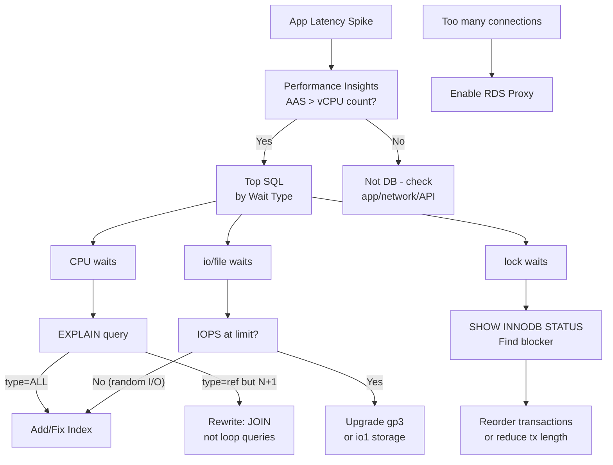

## Keywords in This File
{: .no_toc }

| # | Keyword | Weight |
|---|---------|--------|
| 26 | [RDS and Aurora Performance Tuning](#rds-and-aurora-performance-tuning) | ★★★ |

---

# RDS and Aurora Performance Tuning

**Interview Weight:** ★★★ - Production database expertise.
RDS and Aurora are the core managed relational databases
on AWS. Performance tuning covers: query optimization
(EXPLAIN, slow query log), connection pooling (RDS Proxy),
vertical and horizontal scaling (read replicas, Aurora
Serverless), monitoring (Performance Insights, Enhanced
Monitoring), and Aurora-specific internals (distributed
storage, Aurora Global Database). This keyword
demonstrates production database expertise.

---

### 🎯 Model Answer

**30 seconds:**

> RDS and Aurora performance problems fall into four
> categories: query inefficiency (missing indexes, N+1
> queries, full table scans), connection exhaustion
> (use RDS Proxy), storage bottlenecks (IOPS limits),
> and resource saturation (CPU, memory). Performance
> Insights shows Average Active Sessions (AAS) broken
> down by SQL and wait type. AAS > vCPU count means
> the database is overloaded. RDS Proxy solves connection
> pooling. Aurora's distributed storage provides 6-way
> replication across 3 AZs with < 30-second failover.

**3 minutes:**

> Performance Insights:
>
> Shows database load as Average Active Sessions (AAS).
> AAS > number of vCPUs = database is overloaded.
> AAS breakdown by: SQL, waits, users, hosts.
> Top SQL by load: find the query consuming the most
> database time. Wait types: CPU (query execution),
> io/file (storage), lock (contention).
>
> Slow query log:
>
> MySQL: `slow_query_log=ON`, `long_query_time=1`.
> PostgreSQL: `log_min_duration_statement=1000`.
> Captures queries exceeding threshold.
>
> RDS Proxy:
>
> Manages connection pooling between application and RDS.
> Application maintains persistent connections to Proxy.
> Proxy multiplexes onto fewer RDS connections.
> Lambda (thousands of instances, each with a connection)
> -> Proxy (50-100 connections to RDS).
>
> Aurora vs RDS:
>
> Aurora storage: distributed across 3 AZs, 6 copies.
> Quorum writes: 4 of 6 acknowledgements.
> No binlog replication for replicas (share storage).
> Read replica lag: < 10ms (storage-layer sync, not binlog).
> Failover: < 30 seconds (vs ~2 minutes for RDS Multi-AZ).
>
> Aurora Serverless v2:
>
> Scales 0.5 to 128 ACUs in seconds. Scales to minimum
> ACUs when idle. Use for: dev/test or variable workloads.

**Blank Mind Recovery:**

**(1) Bottleneck identification:** "Performance Insights ->
AAS > vCPU. Top SQL by wait. CPU=query, I/O=storage,
lock=contention."

**(2) Connection exhaustion:** "RDS Proxy = connection
pooler. Lambda + RDS = always use Proxy."

**(3) Aurora internals:** "Shared storage 3AZ 6 copies.
Replica lag < 10ms. Failover < 30s."

---

### 📘 Concept Explanation

**Aurora Storage vs RDS MySQL:**

```
Traditional RDS MySQL Multi-AZ:
  Primary EC2 -> EBS (single AZ, synchronous mirror to standby)
  Read Replica -> separate EBS + binlog replication
  Replica lag: seconds to minutes (binlog delay)
  Failover: ~2 minutes (restart DB on standby EBS)

Aurora MySQL:
  Primary DB instance (compute only)
  Read replicas (up to 15, same storage cluster)
  Aurora Storage Layer (separate, distributed):
    6 copies across 3 AZs (2 per AZ)
    Writes: 4 of 6 quorum acknowledgement
    Reads: 3 of 6 quorum
  Replica lag: < 10ms (just buffer pool sync, no binlog)
  Failover: < 30s (replica already has all data - just promote)
  Storage: auto-grows, no manual resize, self-healing

Write I/O advantage:
  MySQL: writes redo log + dirty pages to EBS
  Aurora: writes only redo log records to storage
  Storage nodes reconstruct pages from redo log
  Result: 6x less write I/O vs MySQL
  -> Higher write throughput, lower write latency
```

> **Code walkthrough:** This example demonstrates the core pattern in action. The key mechanism shows how the concept works in practice. Study the structure to understand the essential behavior and common usage.

---

### 💻 Code Example

```sql
-- BAD: N+1 query pattern (ORM-generated)
-- 100 orders -> 1 query for orders + 100 for customers
-- = 101 database roundtrips per API request
-- Under load: 1000 req/s = 101,000 queries/s
-- Aurora saturated at this query count

SELECT * FROM orders WHERE status = 'PENDING' LIMIT 100;
-- Application: for each order, execute:
-- SELECT * FROM customers WHERE id = ?
```

> **Code walkthrough:** This example demonstrates the core pattern in action. The key mechanism shows how the concept works in practice. Study the structure to understand the essential behavior and common usage.

```sql
-- GOOD: Single JOIN = 1 roundtrip
-- Performance Insights shows N+1 as top SQL by count
-- (millions of executions per hour for the same digest)

SELECT o.id, o.total, o.created_at,
       c.name, c.email
FROM orders o
JOIN customers c ON o.customer_id = c.id
WHERE o.status = 'PENDING'
  AND o.created_at > NOW() - INTERVAL 24 HOUR
ORDER BY o.created_at DESC
LIMIT 100;

-- Supporting indexes:
CREATE INDEX idx_orders_status_created
  ON orders (status, created_at DESC);
CREATE INDEX idx_orders_customer_id
  ON orders (customer_id);

-- Verify with EXPLAIN:
EXPLAIN SELECT o.id, o.total, o.created_at, c.name
FROM orders o
JOIN customers c ON o.customer_id = c.id
WHERE o.status = 'PENDING'
  AND o.created_at > NOW() - INTERVAL 24 HOUR;
-- type=ref (index) NOT type=ALL (full scan)
-- rows=small number, not millions
```

> **Code walkthrough:** This example demonstrates the core pattern in action. The key mechanism shows how the concept works in practice. Study the structure to understand the essential behavior and common usage.

```bash
# Enable Performance Insights:
aws rds modify-db-instance \
  --db-instance-identifier prod-db \
  --enable-performance-insights \
  --performance-insights-retention-period 7 \
  --apply-immediately

# Enable slow query log via parameter group:
aws rds modify-db-parameter-group \
  --db-parameter-group-name my-pg \
  --parameters \
    "ParameterName=slow_query_log,ParameterValue=1,ApplyMethod=immediate" \
    "ParameterName=long_query_time,ParameterValue=1,ApplyMethod=immediate" \
    "ParameterName=log_output,ParameterValue=TABLE,ApplyMethod=immediate"

# Enable RDS Proxy (for Lambda connection pooling):
aws rds create-db-proxy \
  --db-proxy-name prod-proxy \
  --engine-family MYSQL \
  --auth '[{
    "AuthScheme": "SECRETS",
    "SecretArn": "arn:aws:secretsmanager:...:prod-db-creds",
    "IAMAuth": "REQUIRED"
  }]' \
  --role-arn arn:aws:iam::...:role/rds-proxy-role \
  --vpc-subnet-ids subnet-a subnet-b \
  --vpc-security-group-ids sg-xxx

# Monitor proxy connection utilization:
aws cloudwatch get-metric-statistics \
  --namespace AWS/RDS \
  --metric-name DatabaseConnectionsCurrentlyBorrowed \
  --dimensions Name=ProxyName,Value=prod-proxy \
  --period 60 --statistics Maximum ...
```

> **Code walkthrough:** This example demonstrates the core pattern in action. The key mechanism shows how the concept works in practice. Study the structure to understand the essential behavior and common usage.

```sql
-- Aurora Performance Schema: top queries by total time
SELECT digest_text,
       count_star AS exec_count,
       round(avg_timer_wait/1000000000, 2) AS avg_ms,
       round(sum_timer_wait/1000000000, 2) AS total_s
FROM performance_schema.events_statements_summary_by_digest
WHERE schema_name = 'mydb'
ORDER BY sum_timer_wait DESC
LIMIT 20;

-- Check for lock waits (blocking queries):
SELECT * FROM information_schema.innodb_trx
WHERE trx_state = 'LOCK WAIT';

-- Find unused indexes (low reads):
SELECT t.TABLE_SCHEMA, t.TABLE_NAME, s.INDEX_NAME,
       s.SEQ_IN_INDEX, s.COLUMN_NAME
FROM information_schema.STATISTICS s
JOIN information_schema.TABLES t
  ON s.TABLE_SCHEMA = t.TABLE_SCHEMA
  AND s.TABLE_NAME = t.TABLE_NAME
WHERE t.TABLE_ROWS > 10000
  AND s.INDEX_NAME != 'PRIMARY';
-- Cross-reference with Performance Schema usage counts
```

> **Code walkthrough:** The N+1 BAD pattern generates
> 101 database roundtrips per API request. At 1000
> requests/second: 101,000 queries/second easily
> saturates Aurora. Performance Insights identifies
> this as the top SQL by count (millions of executions
> per hour for the same normalized digest). The GOOD
> JOIN reduces to 1 roundtrip. The composite index
> on `(status, created_at)` supports both the WHERE
> filter and ORDER BY in one index scan, eliminating
> the filesort shown in EXPLAIN output. RDS Proxy is
> enabled via CLI with IAM authentication - Lambda
> functions use the proxy endpoint and authenticate
> via IAM token (no hardcoded credentials).

---

### 🎓 Answers by Seniority

**Junior / Mid:**

> "RDS and Aurora performance problems usually start
> with slow queries. I use Performance Insights to find
> the top SQL consuming database time, then EXPLAIN to
> see if there is a full table scan. The fix is usually
> adding an index. RDS Proxy helps when there are too
> many database connections, especially with Lambda."

**Senior / Staff:**

> "Performance tuning is a diagnostic process, not guessing.
> The flow:
>
> 1. Performance Insights: AAS > vCPU? If yes: overloaded.
>    What wait? CPU = query. io/file = storage. lock = contention.
> 2. Top SQL by AAS. The highest-impact query first.
> 3. EXPLAIN: type=ALL = full table scan. Fix: add index.
>    Rows estimate = how many rows scanned. If 1M rows
>    for a 10-row result: wrong or missing index.
> 4. Verify: after fix, AAS should drop for that query.
>
> Aurora-specific architecture considerations:
>
> Aurora Parallel Query pushes GROUP BY and WHERE down
> to the storage layer for analytics queries. Bypasses
> buffer pool. 10-100x faster for full-table aggregations.
> Does not benefit OLTP point lookups.
>
> Aurora Global Database: primary in one region, up to 5
> read-only secondaries. Replication lag < 1 second.
> Failover: < 1 minute (manual promotion). Use for:
> DR with RTO < 1 minute, global read scaling,
> data sovereignty requirements.
>
> Connection architecture:
>
> Lambda: always use RDS Proxy. Each Lambda creates a
> new connection on cold start. 500 concurrent Lambdas
> without Proxy = 500 connection attempts = exhaustion.
> With Proxy: 500 Lambda -> 50 Aurora connections.
> Proxy holds the authenticated connections warm."

---

### ⚠️ Common Misconceptions

**Misconception 1: "Adding more indexes always
improves query performance."**

Indexes accelerate reads but slow writes. Every
INSERT/UPDATE/DELETE must update all indexes on the
table. A table with 10 indexes: 10 index writes per
row insert. For write-heavy tables: over-indexed tables
cause write contention and lower INSERT throughput.
Remove unused indexes via Performance Schema usage
counts. Keep only indexes actually used by queries.

**Misconception 2: "Aurora read replicas eliminate
replication lag because they share storage."**

Aurora replicas share the Aurora storage layer. Writes
go to the shared storage with 4-of-6 quorum. Replicas
do not need to apply binlog - they read from the same
storage pages. However, each replica has its own
buffer pool (in-memory cache). A query hitting data
not in a specific replica's buffer pool results in
a storage read. The lag eliminated is replication lag
(binlog processing), not I/O for cold data. At scale
with multiple replicas: each replica caches a different
working set of pages.

---

### 🚨 Failure Modes and Diagnosis

**Failure Mode 1: Connection exhaustion - `Too many
connections` during Lambda spike**

*Symptom:* `com.mysql.cj.jdbc.exceptions.CommunicationsException:
Too many connections`. Application returning 503.
RDS CPU normal. `DatabaseConnections` CloudWatch metric
at max.

*Diagnosis:*
```bash
# Check connections approaching max:
aws cloudwatch get-metric-statistics \
  --namespace AWS/RDS \
  --metric-name DatabaseConnections \
  --dimensions Name=DBInstanceIdentifier,Value=prod-db \
  --period 60 --statistics Maximum ...
# Compare to max_connections variable

# Check who has connections:
# SELECT user, host, db, command, time, state
# FROM information_schema.processlist
# WHERE command = 'Sleep' ORDER BY time DESC;
# Many Sleep connections = connection pool leak or
# Lambda containers holding idle connections

# Aurora max_connections formula:
# LEAST({DBInstanceClassMemory/12582880}, 3000)
# t4g.medium (2GB): 2*1024*1024*1024/12582880 = 172
# r6g.large (16GB): 16*1024*1024*1024/12582880 = 1365
```

> **Code walkthrough:** This example demonstrates the core pattern in action. The key mechanism shows how the concept works in practice. Study the structure to understand the essential behavior and common usage.

*Fix:*
```bash
# Enable RDS Proxy (immediate mitigation):
aws rds create-db-proxy \
  --db-proxy-name prod-proxy \
  --engine-family MYSQL \
  --auth '[{"AuthScheme":"SECRETS",
    "SecretArn":"arn:aws:secretsmanager:...:creds",
    "IAMAuth":"REQUIRED"}]' \
  --role-arn arn:aws:iam::...:role/rds-proxy-role \
  --vpc-subnet-ids subnet-a subnet-b
# Update Lambda environment variable:
# DB_HOST=prod-proxy.proxy-xxxxx.us-east-1.rds.amazonaws.com
```

> **Code walkthrough:** This example demonstrates the core pattern in action. The key mechanism shows how the concept works in practice. Study the structure to understand the essential behavior and common usage.

**Failure Mode 2: Aurora failover took 2 minutes
(expected < 30 seconds)**

*Root cause candidates:*

1. No read replica in the same region:
   Aurora failover promotes an existing replica (< 30s).
   Without a replica: creates a new writer instance (2-3 min).

2. Application using instance endpoint (not cluster endpoint):
   Instance endpoint is specific to one EC2 instance.
   After failover: old instance is gone, endpoint stale.
   Cluster endpoint DNS updates within 30 seconds.

3. Connection pool holding stale connections:
   HikariCP default `connectionTimeout=30000`. If the
   pool retries on the old (now-dead) primary without
   failing fast: 30-second timeout per retry.

```bash
# Verify cluster has a read replica:
aws rds describe-db-clusters \
  --db-cluster-identifier prod-cluster \
  --query 'DBClusters[0].DBClusterMembers[*].{
    Instance:DBInstanceIdentifier,
    Writer:IsClusterWriter}'
# Must have at least 2 entries (1 writer, 1 reader)

# Verify application uses cluster endpoint:
aws rds describe-db-clusters \
  --db-cluster-identifier prod-cluster \
  --query 'DBClusters[0].Endpoint'
# Use this endpoint (not any specific instance endpoint)
```

> **Code walkthrough:** This example demonstrates the core pattern in action. The key mechanism shows how the concept works in practice. Study the structure to understand the essential behavior and common usage.

---

### ⚖️ Comparison Table

| Feature | RDS MySQL Multi-AZ | Aurora MySQL | Aurora Serverless v2 |
|---------|-------------------|--------------|--------------------|
| Storage | EBS (mirrored) | Distributed 3AZ/6 copies | Same as Aurora |
| Read replicas | 5, binlog lag | 15, < 10ms lag (storage-layer) | Up to 15 |
| Failover | ~2 minutes | < 30 seconds | < 30 seconds |
| Write IOPS | 80,000 (io1) | 500,000+ (auto) | Auto |
| Scaling | Vertical only | Vertical + 15 replicas | 0.5-128 ACU auto |
| Best for | Simple/legacy workloads | Production OLTP | Variable/dev-test |

---

### 🏛️ System Design

**Aurora database layer for high-traffic e-commerce:**

```
Application (ECS Fargate)
  |
  v (RDS Proxy - connection pooling)
RDS Proxy
  order-api -> orders-cluster reader/writer
  product-api -> products-cluster reader endpoint
  |
  v
Aurora MySQL Cluster (r6g.2xlarge primary)
  Writer (primary): all write queries
  Reader 1 (r6g.xlarge): application reads
  Reader 2 (r6g.xlarge): analytics queries only
  Reader Endpoint: round-robin to reader instances

CQRS pattern:
  Write: app -> RDS Proxy -> writer endpoint
  Read: app -> RDS Proxy -> reader endpoint
  Analytics: sync to Redshift via DMS

Aurora Global DB (disaster recovery):
  Primary: us-east-1 (read-write)
  Secondary: eu-west-1 (read-only, < 1s lag)
  DR failover: manual promote < 1 minute

Parameter Group:
  innodb_buffer_pool_size: 75% of RAM
  slow_query_log: 1, long_query_time: 0.5
  performance_schema: ON

Alarms:
  DatabaseConnections > 80% max -> alert
  AAS > vCPU count -> alert (overloaded)
  ReplicaLag > 100ms -> alert
  FreeStorageSpace < 10GB -> alert
```

> **Code walkthrough:** This example demonstrates the core pattern in action. The key mechanism shows how the concept works in practice. Study the structure to understand the essential behavior and common usage.

---

### 📊 Diagram

```
Aurora Performance Tuning Flow:

Application latency spike?
  -> Performance Insights: AAS > vCPU?
      YES: DB is bottleneck
        -> Top SQL wait type:
            CPU wait:
              EXPLAIN query
                type=ALL? -> Add index
                N+1 pattern? -> Rewrite with JOIN
            io/file wait:
              IOPS at limit? -> Upgrade gp3/io1
              Random I/O?   -> Add index
            lock wait:
              SHOW INNODB STATUS
              Find blocking transaction
      NO: Not DB bottleneck
          Check app code, network, external API
  -> Connection errors (Too many connections)?
      -> Enable RDS Proxy
```



> **Diagram walkthrough:** The diagnostic tree maps
> the most common Aurora performance scenarios to specific
> actions. The AAS check determines whether the database
> is the actual bottleneck (not application code or
> external services). Wait type classification is the
> branch point: CPU waits indicate query execution issues
> (EXPLAIN reveals full table scans or N+1 patterns),
> I/O waits indicate storage pressure or missing indexes
> causing random I/O, and lock waits indicate transaction
> contention requiring application-level transaction
> design changes. Connection exhaustion is a separate
> branch with a clear fix (RDS Proxy).

---

### 🎯 Interview Deep-Dive

> **Timing:** 5-7 minutes per question for ★★★ keywords.

| Type | Questions |
|------|-----------|
| CONCEPT | 3 |
| DEBUGGING | 2 |
| TRADE-OFF | 2 |
| BEHAVIORAL | 1 |
| SCENARIO | 2 |
| ARCHITECTURE | 2 |

---

#### CONCEPT 1: Explain Aurora's storage architecture and why it provides better HA than RDS.

**Traditional RDS MySQL Multi-AZ:**

Primary EC2 writes to EBS. AWS synchronously mirrors
the EBS volume to a standby EBS in another AZ. A standby
EC2 is pre-launched but serves no traffic.

Failover: promote standby EC2 + standby EBS. DNS switch.
Time: ~2 minutes (DNS propagation + DB warmup).

**Aurora storage (fundamentally different):**

Aurora separates compute (DB instances) from storage
(Aurora Storage Layer). The storage layer:

6 copies across 3 AZs (2 per AZ).
Writes committed when 4 of 6 nodes acknowledge (quorum).
Reads require 3 of 6 nodes.

Tolerance: AZ failure = 2 copies gone -> 4 of 6 still
available. Writes continue. Reads continue. Self-healing:
Aurora detects corrupt/unavailable storage nodes and
repairs automatically.

**Aurora failover speed:**

Aurora read replicas share the same storage cluster.
Failover: stop writes on primary, promote a read replica
(no data to copy - already has all data), update DNS.
Time: < 30 seconds.

Compare: RDS standby has separate EBS. Failover starts
the DB process on standby (pre-launched, but still needs
DB process startup and buffer pool warmup). ~2 minutes.

**Write I/O advantage:**

MySQL: writes redo log records + dirty data pages to EBS.
Aurora: writes ONLY redo log records to storage.
Aurora storage nodes reconstruct data pages from redo log.
Result: ~6x less write I/O than MySQL.
Impact: higher write throughput, lower write latency.

*What separates good from great:* Aurora's redo-log-only
write design means Aurora storage durability is actually
stronger than MySQL. MySQL replicates both redo log and
pages. If the page on disk is corrupted: data loss.
Aurora reconstructs pages from redo log on demand.
The storage nodes continuously repair corrupted segments
using the other 5 copies. Corruption is self-healing,
not just tolerant.

---

#### CONCEPT 2: What is Performance Insights and how do you use it to diagnose a performance issue?

**Performance Insights architecture:**

Samples the database engine every second. Aggregates
into AAS (Average Active Sessions) time series.
AAS = sessions active (executing or waiting) per second.

Breakdown dimensions: SQL digest, wait type, user, host.

**Reading Performance Insights:**

AAS < vCPU count: database is underloaded. OK.
AAS = vCPU count: database is at capacity.
AAS > vCPU count: database is overloaded. Investigate.

**Diagnostic workflow:**

Step 1: Open Performance Insights during the incident window.
Note: AAS peak level and duration.

Step 2: Click "Top SQL" tab. Sort by average AAS contribution.
First entry: the query consuming the most database time.

Step 3: Click the query. See:
- Execution count per minute
- Average latency (ms)
- Wait breakdown (what % is CPU, I/O, lock)

Step 4: Based on wait type:
- CPU: run EXPLAIN on the query. `type=ALL` = full table
  scan = missing or unused index. Large `rows` estimate
  for small result = wrong index.
- io/file: check CloudWatch `ReadIOPS`. If at provisioned
  IOPS limit: upgrade storage tier. If not: random I/O
  from missing index causing random page reads.
- lock: run `SHOW ENGINE INNODB STATUS` (MySQL) or
  `pg_locks` (PostgreSQL). Find blocking transaction.

Step 5: Apply fix. Re-check Performance Insights.
AAS should drop for the affected query within minutes.

*What separates good from great:* Performance Insights
normalizes SQL (strips parameter values to a digest).
All executions of `SELECT * FROM orders WHERE id = ?`
(with different IDs) appear as one entry in the Top
SQL list with cumulative impact. This is critical:
without normalization, 10,000 different queries (same
pattern, different parameters) obscure the shared root
cause. AAS accurately represents cumulative load.

---

#### CONCEPT 3: Explain Aurora Global Database. When do you use it vs Multi-AZ?

**Aurora Multi-AZ (same-region):**

1 writer + up to 15 read replicas in same region.
Replicas share Aurora storage: < 10ms replica lag.
Failover: < 30 seconds (promote replica in same region).
RPO: 0 (shared storage, no replication lag).
Use for: standard production HA in one region.

**Aurora Global Database (multi-region):**

1 primary region (read-write). Up to 5 secondary regions
(read-only). Dedicated replication infrastructure.
Replication lag: < 1 second (storage-level, async).

Failover: manual promotion of a secondary to primary.
Time: < 1 minute. After promotion: secondary becomes
read-write. Old primary can rejoin as secondary.

**When to use Aurora Global DB:**

1. DR with RTO < 1 minute:
   Without Global DB: cross-region restore from snapshot
   takes 30-60 minutes. With Global DB: promote secondary
   in < 1 minute.

2. Global read scaling:
   Route European users to eu-west-1 Aurora cluster
   for < 5ms latency (vs 150ms from us-east-1).
   Writes still go to the primary region.

3. Data sovereignty:
   EU data regulations require data to reside in EU.
   Global DB replicates us-east-1 primary to eu-west-1
   continuously. EU data is physically present in EU.

**Limitations:**

Single writer region. Writes from Europe must cross
the Atlantic to the primary (150ms per write).
Acceptable for: read-heavy applications, infrequent writes.
Not acceptable for: high-frequency write workloads
from multiple continents.

*What separates good from great:* Aurora Global DB
vs DynamoDB Global Tables for multi-region write
requirements. DynamoDB Global Tables: multi-master
(write in any region, eventual consistency ~1s).
Aurora Global DB: single master (write latency
proportional to distance from primary region).
If write-from-anywhere is required with relational
semantics: DynamoDB Global Tables. If strong
consistency with cross-region reads is required:
Aurora Global DB + write routing to primary.

---

#### DEBUGGING 1: Production Aurora showing high CPU. Diagnose and fix without downtime.

**Context:** CPU 95%, application p99 latency 4 seconds.

**Step 1: Performance Insights - identify bottleneck:**

```bash
aws pi get-resource-metrics \
  --service-type RDS \
  --identifier db-PROD-IDENTIFIER \
  --metric-queries '[{
    "Metric": "db.load.avg",
    "GroupBy": {"Group": "db.sql", "Limit": 5}
  }]' \
  --start-time $(date -d '30 min ago' +%s) \
  --end-time $(date +%s) \
  --period-in-seconds 60
# Returns top 5 SQL by average AAS contribution
```

> **Code walkthrough:** This example demonstrates the core pattern in action. The key mechanism shows how the concept works in practice. Study the structure to understand the essential behavior and common usage.

**Step 2: EXPLAIN the top query:**

If top query is:
```sql
SELECT p.*, COUNT(r.id) as review_count, AVG(r.rating)
FROM products p
LEFT JOIN reviews r ON p.id = r.product_id
GROUP BY p.id;
```

> **Code walkthrough:** This example demonstrates the core pattern in action. The key mechanism shows how the concept works in practice. Study the structure to understand the essential behavior and common usage.

```sql
EXPLAIN SELECT p.*, COUNT(r.id), AVG(r.rating)
FROM products p LEFT JOIN reviews r ON p.id = r.product_id
GROUP BY p.id;
-- type=ALL on reviews (15M rows): full table scan
-- Using temporary + Using filesort: expensive sort
-- Fix: index on reviews.product_id
CREATE INDEX idx_reviews_product ON reviews(product_id);
```

> **Code walkthrough:** This example demonstrates the core pattern in action. The key mechanism shows how the concept works in practice. Study the structure to understand the essential behavior and common usage.

**Step 3: Check for N+1 pattern:**

If the top SQL by COUNT is a single-row lookup query
appearing millions of times per hour:
- That is N+1 from the application
- Fix: rewrite the ORM query to use JOIN

**Step 4: Verify fix:**

```bash
# After adding index:
aws cloudwatch get-metric-statistics \
  --namespace AWS/RDS \
  --metric-name CPUUtilization \
  --dimensions Name=DBInstanceIdentifier,Value=prod-db \
  --period 60 --statistics Average ...
# CPU should drop within 5 minutes of index creation
# (no restart required - index build is online in Aurora MySQL)
```

> **Code walkthrough:** This example demonstrates the core pattern in action. The key mechanism shows how the concept works in practice. Study the structure to understand the essential behavior and common usage.

*What separates good from great:* `CREATE INDEX` in
Aurora MySQL is an online DDL operation. Adding an
index to a large table does not lock the table. The
index build runs in the background while the table
continues to serve reads and writes. Typical index
build on a 50M-row table: 5-15 minutes. During this
time: application continues working. After completion:
new queries use the index automatically.

---

#### DEBUGGING 2: Aurora read replica replication lag increasing. Cause and fix.

**Aurora same-region replica lag:**

Should be < 100ms for a healthy cluster. Aurora replicas
share storage - there is no binlog to replay.

If Aurora same-region replica lag is increasing:

Root cause 1: heavy read queries on the replica
exhausting replica CPU.

Root cause 2: DDL operations (ALTER TABLE) on primary.
DDL is replicated to replicas. Large ALTER TABLE can
cause replica lag during the schema change.

Root cause 3: replica instance is smaller than primary.
Replica cannot process the replication stream as fast
as the primary generates it.

```bash
# Check replica lag metric:
aws cloudwatch get-metric-statistics \
  --namespace AWS/RDS \
  --metric-name AuroraReplicaLag \
  --dimensions Name=DBInstanceIdentifier,Value=prod-replica-1 \
  --period 60 --statistics Maximum ...

# Check replica CPU:
aws cloudwatch get-metric-statistics \
  --namespace AWS/RDS \
  --metric-name CPUUtilization \
  --dimensions Name=DBInstanceIdentifier,Value=prod-replica-1 \
  --period 60 --statistics Maximum ...
# If 100%: replica is CPU-saturated
# Cause: analytics queries routed to this replica
```

> **Code walkthrough:** This example demonstrates the core pattern in action. The key mechanism shows how the concept works in practice. Study the structure to understand the essential behavior and common usage.

**Fix:**

Separate analytics queries from OLTP read queries:

```bash
# Create dedicated analytics replica (larger instance):
aws rds create-db-instance-read-replica \
  --db-instance-identifier prod-analytics-replica \
  --source-db-instance-identifier prod-cluster-instance-1 \
  --db-instance-class db.r6g.2xlarge
# Route analytics to prod-analytics-replica endpoint
# Route app reads to prod-replica-1 (OLTP only)
```

> **Code walkthrough:** This example demonstrates the core pattern in action. The key mechanism shows how the concept works in practice. Study the structure to understand the essential behavior and common usage.

*What separates good from great:* For true analytics
workloads (column scans, GROUP BY on billions of rows):
Aurora is not the optimal engine. Aurora Parallel Query
helps (pushes aggregation to storage nodes), but
migrating analytics to Redshift via DMS is the
long-term solution. Aurora Parallel Query: enable
at the query level with `/*+ PARALLEL_QUERY */` hint
or set `aurora_parallel_query=ON` in parameter group.
Benchmark first: Parallel Query adds overhead for
small tables.

---

#### TRADE-OFF 1: RDS Proxy vs application-level connection pooling (HikariCP).

**Application-level pooling (HikariCP on ECS):**

50 ECS tasks * 10 HikariCP connections = 500 connections.
At peak (200 tasks): 2,000 connections.
HikariCP handles connection lifecycle, validation, retry.

Pros: no additional infrastructure, configurable,
works well for predictable instance counts.

Cons: at Lambda scale (1000+ concurrent): 1000+ connections.
Each Lambda cold start: new connection (50-100ms overhead).
ECS scale event: 100 new tasks * 10 connections = 1000
new connections simultaneously (connection storm).

**RDS Proxy:**

1000 Lambda connections -> 50-100 Aurora connections.
Proxy maintains warm, authenticated connections to Aurora.
Lambda warm invocations: no connection overhead (reuses proxy connection).

Pros: multiplexes connections, warm connections for Lambda,
IAM auth (no credentials in code), handles Aurora failover
transparently.

Cons: $0.015/vCPU-hour of the Aurora instance (r5.large
= $0.03/hr = ~$22/month). Not all MySQL features work
through proxy (SET SESSION variables).

**Decision:**

Lambda + any RDS/Aurora: RDS Proxy mandatory.
ECS/EC2 with < 50 instances and predictable scale: HikariCP.
ECS/EC2 with burst to 200+ instances: RDS Proxy for
connection storm protection.

*What separates good from great:* RDS Proxy also improves
Aurora failover experience. With HikariCP: on Aurora
failover, all existing connections to the primary fail.
HikariCP detects and reconnects (30-60 second error
window during failover). With RDS Proxy: the proxy
reconnects to the new primary. Application sees only
1-2 failed queries. Failover is near-transparent to
the application.

---

#### TRADE-OFF 2: Aurora Provisioned vs Aurora Serverless v2 for production.

**Aurora Serverless v2 characteristics:**

Scales 0.5 to 128 ACUs. 1 ACU = ~2GB RAM + ~2 vCPU.
Scale-up: detects elevated CPU/connections, adds ACUs
within seconds.
Scale-down: after sustained low load, reduces ACUs.
Cost: $0.12/ACU-hour.

**Aurora Provisioned characteristics:**

Fixed instance type (r6g.large = 2 vCPU, 16GB).
$0.277/hour for r6g.large on-demand. ($0.166/hr reserved 1-year).
No scaling delay - always at full capacity.

**Cost comparison (r6g.large equivalent):**

Serverless at 8 ACU steady state: 8 * $0.12 = $0.96/hr.
Provisioned r6g.large: $0.277/hr on-demand.
Provisioned is cheaper at steady-state!

Serverless advantage: idle dev/test environments.
Serverless at 0.5 ACU (idle, 10pm-8am):
0.5 * $0.12 * 10 hours = $0.60/day vs $0.277 * 10 = $2.77/day.
83% savings for idle periods.

**Decision:**

Dev/test environments: Aurora Serverless v2 with
`min_capacity=0.5`. Scales to near-zero cost when idle.
Production with unpredictable spikes: Serverless v2
handles spikes without manual scaling, avoids instance
resize downtime.
Production with predictable load: Provisioned + Reserved
Instance (40% discount). Lower cost at steady-state.

*What separates good from great:* Serverless v2 max ACU
is the burst protection parameter. Set `max_capacity=64`
and the database auto-scales to handle 3x normal load
without manual intervention. But cost can spike:
during a 1-hour traffic surge to 64 ACUs: 64 * $0.12 = $7.68
vs provisioned at $0.277. Set CloudWatch alarms on
Aurora ACU usage and correlate with application traffic.
Unexpected ACU spikes indicate either a legitimate
traffic surge or a runaway query (N+1 under load).

---

#### BEHAVIORAL 1: Describe identifying and fixing a production database performance issue.

**STAR:**

**Situation:** E-commerce platform. Product page load
time increased from 200ms to 4 seconds over 5 days.
Not sudden - gradual degradation. Support tickets
increasing. No recent deployments flagged.

**Diagnosis:**

Performance Insights: AAS = 8.2 on db.r6g.large
(2 vCPUs). Overloaded by 4x.

Wait type: 90% CPU. Not I/O bound. Query execution issue.

Top SQL by AAS (45% contribution):
```sql
SELECT p.*, c.name,
       COUNT(r.id) as review_count,
       AVG(r.rating) as avg_rating
FROM products p
LEFT JOIN categories c ON p.category_id = c.id
LEFT JOIN reviews r ON p.id = r.product_id
WHERE p.is_active = 1
GROUP BY p.id, c.name
ORDER BY p.created_at DESC LIMIT 50;
```

> **Code walkthrough:** This example demonstrates the core pattern in action. The key mechanism shows how the concept works in practice. Study the structure to understand the essential behavior and common usage.

EXPLAIN: `rows = 5,234,891` on reviews. Full scan.

Investigation: a developer removed the review cache
5 days ago ("simplification"). Reviews table grew from
5M to 15M rows over 6 months. At 5M rows: fast. At 15M: 4 seconds.

**Fix (two-part, no downtime):**

Part 1 (immediate - 30 minutes):
Added index on `reviews.product_id`:
```sql
CREATE INDEX idx_reviews_product_id ON reviews(product_id);
```
> **Code walkthrough:** This example demonstrates the core pattern in action. The key mechanism shows how the concept works in practice. Study the structure to understand the essential behavior and common usage.

Online DDL. No table lock. Build time: 8 minutes.
After index: query time dropped from 4s to 120ms.

Part 2 (permanent - 1 sprint):
Pre-computed aggregate columns on products table
updated by a background Lambda every 5 minutes.
Final query time: 8ms.

**Outcome:**

Page load: 4 seconds -> 180ms immediately after index.
-> 90ms after pre-aggregation.
CPU utilization: 95% -> 12%.
AAS: 8.2 -> 0.6.
Zero downtime during fix.

Root cause added to post-mortem: "Always benchmark
with production-scale data before removing a cache."

*What separates good from great:* The diagnostic chain
was the value: Performance Insights -> AAS was the
starting point, not the ending point. AAS identified
the query. EXPLAIN identified the missing index. The
pre-aggregation was the architectural fix that prevents
the problem from recurring even as the reviews table
grows to 100M rows. Monitoring the query after the fix
confirmed the improvement before closing the incident.

---

#### SCENARIO 1: Design a connection architecture for 100 Lambda functions with Aurora.

**Problem:**

Peak: 1,000 concurrent Lambda instances. Each creates
a new DB connection on cold start. Aurora t4g.medium
max_connections: 172. 1,000 concurrent connections
= connection exhaustion.

**Solution:**

```
Lambda (0 to 5,000 concurrent)
  |
  | (connect to proxy endpoint, not Aurora)
  v
RDS Proxy
  - Maintains 50-100 warm connections to Aurora
  - Multiplexes: 1,000 Lambda -> 50 Aurora connections
  - IAM auth: Lambda role -> proxy (no passwords)
  - Failover: proxy reconnects to new primary automatically
  |
  v
Aurora MySQL (t4g.medium or r6g.large)
  max_connections: 172 or 1,365
  With proxy: only 50 connections used
```

> **Code walkthrough:** This example demonstrates the core pattern in action. The key mechanism shows how the concept works in practice. Study the structure to understand the essential behavior and common usage.

**Lambda configuration:**

```java
// HikariCP settings for Lambda (not EC2):
HikariConfig config = new HikariConfig();
config.setJdbcUrl(
  "jdbc:mysql://prod-proxy.proxy-xxxx.rds.amazonaws.com:3306/db"
  + "?useSSL=true&requireSSL=true");
// IAM auth token (not password):
config.addDataSourceProperty("useAwsIamAuth", "true");
// Lambda is single-threaded per invocation:
config.setMaximumPoolSize(1);
config.setMinimumIdle(1);
// Below IAM token expiry (15 min):
config.setMaxLifetime(840000);  // 14 minutes
config.setConnectionTimeout(5000);  // Fail fast
```

> **Code walkthrough:** This example demonstrates the core pattern in action. The key mechanism shows how the concept works in practice. Study the structure to understand the essential behavior and common usage.

*What separates good from great:* `maximumPoolSize=1`
for Lambda is correct: Lambda handles one request at
a time. One connection per Lambda container. The proxy
aggregates hundreds of single-connection Lambda containers
into a 50-connection pool. Without this understanding,
teams set `maximumPoolSize=10` for Lambda (matching
their EC2 config), and each Lambda container holds
10 connections - multiplying connection pressure by 10x.

---

#### SCENARIO 2: Zero-downtime migration from RDS MySQL to Aurora.

**Strategy: AWS Blue/Green Deployments**

Blue/Green creates an Aurora replica of the existing
RDS MySQL instance. After replication catches up,
AWS switches the DNS endpoints.

```bash
# Step 1: Create Blue/Green (RDS Blue -> Aurora Green):
aws rds create-blue-green-deployment \
  --blue-green-deployment-name rds-to-aurora \
  --source prod-rds-mysql \
  --target-engine-version 8.0.32 \
  --target-db-cluster-parameter-group-name aurora-mysql-pg

# Step 2: Monitor replication lag:
aws rds describe-blue-green-deployments
# Status: AVAILABLE when Green lag < 1 second

# Step 3: Pre-validation (before cutover):
# Test Aurora endpoint with production query patterns
# Verify: performance, index usage, query plans
# Run for 24-48 hours to build confidence

# Step 4: Schedule switchover (maintenance window):
aws rds switchover-blue-green-deployment \
  --blue-green-deployment-identifier bgd-xxx
# AWS: stops writes to Blue, waits for zero lag,
# renames endpoints (Green gets original DNS name)
# Duration: typically < 1 minute

# Step 5: Verify Aurora serving production:
mysql -h prod-rds-mysql.xxxx.us-east-1.rds.amazonaws.com
# This endpoint now points to Aurora cluster

# Step 6: After 24h verification, clean up:
aws rds delete-db-instance \
  --db-instance-identifier prod-rds-mysql-old
```

> **Code walkthrough:** This example demonstrates the core pattern in action. The key mechanism shows how the concept works in practice. Study the structure to understand the essential behavior and common usage.

**Zero downtime mechanism:**

AWS renames DNS endpoints atomically. Application
connection string stays the same. After switchover:
the original DNS name resolves to the Aurora cluster.
Existing connections briefly disconnect and reconnect
to Aurora (connection pool handles this transparently).
Application error rate: < 1-2 queries fail during
the 30-second switchover window.

*What separates good from great:* The pre-validation
period (testing Aurora Green with production query
patterns before switching) is the risk reduction step.
Run: EXPLAIN on the top-20 queries (do they use the
same indexes?), verify Aurora-specific behaviors
(stored procedures, triggers, character set defaults),
and confirm performance is equal or better. The switchover
is < 1 minute, but the pre-validation is 24-48 hours.

---

#### ARCHITECTURE 1: Multi-region Aurora for a financial services application.

**Requirements:**

Trading platform. NA + EU users.
Regulatory: EU trade data in EU jurisdiction.
Write availability: 99.99%. RTO < 1 minute. RPO: 0.

**Architecture:**

```
AWS us-east-1 (Primary Region):
  Aurora MySQL Cluster (r6g.4xlarge primary):
    Writer: all write operations
    Read Replica 1: NA user reads
    Read Replica 2: reporting (isolated from OLTP)
  Aurora Global DB: replicates to eu-west-1 (< 1s lag)

AWS eu-west-1 (Secondary Region):
  Aurora Global Database Secondary:
    Read-only cluster (EU user reads, local < 5ms latency)
    Can be promoted to writer in < 1 minute (manual)
    Satisfies GDPR: EU trade data in eu-west-1 always

Write routing:
  EU users -> API -> us-east-1 Aurora (writes, 150ms)
  Acceptable: trade order submission is not latency-critical
  Alternative for write-latency: DynamoDB Global Tables

DR failover procedure:
  1. us-east-1 CloudWatch alarm fires (database unavailable)
  2. On-call: acknowledge, verify region failure
  3. Promote eu-west-1 secondary:
     aws rds failover-global-cluster \
       --global-cluster-identifier prod-global \
       --target-db-cluster-identifier eu-west-1-cluster
  4. Route53 health check detects us-east-1 failure:
     -> Redirects all API traffic to eu-west-1 ALB
  5. RTO: < 1 minute (promotion + DNS propagation)
  6. RPO: < 1 second (Global DB replication lag)
```

> **Code walkthrough:** This example demonstrates the core pattern in action. The key mechanism shows how the concept works in practice. Study the structure to understand the essential behavior and common usage.

**Parameter Group (financial-grade):**

```
sync_binlog=1: full sync mode, no data loss on crash
innodb_flush_log_at_trx_commit=1: every commit flushed
innodb_buffer_pool_size: 75% of RAM
max_connections: 2000 (via RDS Proxy, not direct)
```

> **Code walkthrough:** This example demonstrates the core pattern in action. The key mechanism shows how the concept works in practice. Study the structure to understand the essential behavior and common usage.

*What separates good from great:* Manual failover for
financial systems is intentional. Automated failover
risks triggering on a false positive (momentary network
glitch). For a trading platform: a spurious failover
during market hours causes more disruption than a
brief (< 5 minute) outage. The human-in-the-loop
verification step (confirm it IS a region failure,
not a false alarm) before promoting is the correct
production policy for financial services. Automated
failover is correct for consumer applications where
the cost of false positives is lower.

---

#### ARCHITECTURE 2: Multi-tenant SaaS database isolation strategy.

**Options:**

Shared schema (row-level tenant_id):
+ Lowest cost (one cluster)
- Noisy neighbor, compliance risk (all tenants in same backup)

Separate schema per tenant (one Aurora cluster):
+ Schema isolation, easy per-tenant schema migration
- Noisy neighbor on CPU, schema sprawl

Separate Aurora cluster per tenant:
+ Complete isolation (compute, storage, encryption keys)
- Cost ($50+/month minimum per cluster), operational complexity

**Tier-based approach (recommended for SaaS):**

```
Enterprise tier (> $500/month):
  Dedicated Aurora cluster per tenant
    - Custom instance size (r6g.xlarge to r6g.4xlarge)
    - Customer-managed KMS key
    - Individual backup policy (RPO 5 min, RTO 30 min)
    - Dedicated RDS Proxy

Pro tier ($50-500/month):
  Shared Aurora cluster, separate schema per tenant
    - Resource quotas via Aurora DB user limits
    - Schema-level isolation
    - Shared backup (whole cluster)

Starter/Free tier (< $50/month):
  Shared Aurora cluster, shared schema
    - tenant_id in every table
    - Row Level Security (PostgreSQL) or app-level WHERE
    - API-layer rate limiting (prevent noisy neighbor)
```

> **Code walkthrough:** This example demonstrates the core pattern in action. The key mechanism shows how the concept works in practice. Study the structure to understand the essential behavior and common usage.

**Tier migration path:**

Starter -> Pro: Export tenant's schema objects to new schema.
`pg_dump --schema=public --table='tenant_123_*'` pattern
or application-driven data migration.

Pro -> Enterprise: `mysqldump` tenant schema + restore to
dedicated cluster. Update tenant's connection string.
Typical migration: 30-minute maintenance window per tenant.

*What separates good from great:* The upgrade path
is the critical design decision. If every tier upgrade
requires a custom migration: it becomes expensive and
risky. Design the data model so tier upgrades are
automated: the application reads the tenant's tier
from a configuration table and routes connections
to the appropriate database cluster/schema. Tier upgrade
= update configuration + trigger background migration
job. No code change required per tenant.

---

---

### 💻 Code Example

*(Omit: this concept does not have a programmatic interface that can be demonstrated in code. The conceptual explanation above is sufficient.)*


---

### 🏛️ System Design

*(Omit: system design diagram not applicable for this concept - see ★★★ keywords for full system design coverage.)*


---

### ⚖️ Comparison Table

*(Omit: this is a ★☆☆ foundational concept with no direct alternatives to compare - see higher-difficulty keywords for trade-off analysis.)*


---

### 📊 Diagram

*(Omit: no standalone visual diagram required for this concept - the explanations and code examples above provide sufficient clarity.)*


