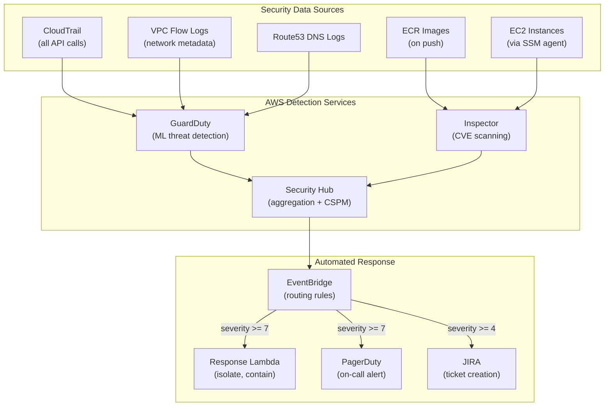

## Keywords in This File
{: .no_toc }

| # | Keyword | Weight |
|---|---------|--------|
| 24 | [AWS Security GuardDuty and Inspector](#aws-security-guardduty-and-inspector) | ★★★ |

---

# AWS Security GuardDuty and Inspector

**Interview Weight:** ★★★ - Security operations.
GuardDuty is AWS's threat detection service: continuous
monitoring of CloudTrail, VPC Flow Logs, DNS logs,
and EKS audit logs for malicious activity. Inspector
is a vulnerability assessment service for EC2 and
container images. Together they form the core of
AWS security operations. This keyword covers threat
detection, vulnerability management, incident response,
and the AWS shared responsibility model.

---

### 🎯 Model Answer

**30 seconds:**

> GuardDuty continuously monitors CloudTrail, VPC Flow
> Logs, and DNS logs using ML models and threat intelligence
> to detect malicious activity: unauthorized API calls,
> crypto mining, compromised credentials, unusual network
> behavior. Inspector scans EC2 instances and container
> images for CVEs. GuardDuty = runtime threat detection.
> Inspector = vulnerability assessment before and during
> runtime. Both integrate with Security Hub for centralized
> findings management.

**3 minutes:**

> GuardDuty threat categories:
>
> Reconnaissance: port scans, failed API calls at scale.
> InstanceCredentialExfiltration: EC2 instance credentials
> used from an external IP (from outside AWS).
> UnauthorizedAccess: unusual IAM API calls, login from
> Tor exit node or known malicious IP.
> CryptoCurrency: EC2 calling known crypto mining pools.
> Trojan: EC2 communicating with known malware C2 domains.
> Exfiltration: unusually large S3 data downloads.
>
> GuardDuty data sources:
>
> Always: CloudTrail (management events), VPC Flow Logs
> (metadata only - not payload), Route 53 DNS logs.
> Additional (must enable): S3 data events (object-level),
> EKS audit logs, RDS login activity, Lambda network activity.
>
> Inspector:
>
> EC2: scans for OS vulnerabilities (CVEs). Uses SSM agent
> for software inventory. Risk score = CVE severity *
> exploitability * whether the instance is reachable.
> ECR containers: scans container images on push.
> Lambda: scans Lambda function code dependencies.
>
> Security Hub:
>
> Aggregates GuardDuty findings, Inspector findings,
> Config findings, Access Analyzer findings.
> Provides CSPM (Cloud Security Posture Management).
> Checks against security standards (CIS AWS Foundations,
> AWS Foundational Security Best Practices, PCI DSS).
>
> Incident response flow:
>
> GuardDuty finding -> EventBridge rule -> Lambda ->
> automated response (isolate EC2, rotate credentials,
> create JIRA ticket).

**Blank Mind Recovery:**

**(1) GuardDuty:** "ML-based threat detection on CloudTrail
+ VPC Flow Logs + DNS. Finds: exfiltrated credentials,
crypto mining, unusual API calls."

**(2) Inspector:** "CVE scanning for EC2 (via SSM),
ECR images (on push), Lambda functions."

**(3) Response:** "GuardDuty finding -> EventBridge ->
Lambda automated response. Isolate, contain, investigate."

---

### 📘 Concept Explanation

**GuardDuty Finding Types - Key Examples:**

```
Finding: InstanceCredentialExfiltration.EC2/UnusualUserAgent
  Severity: HIGH
  Data source: CloudTrail
  What happened: IAM role credentials from EC2 instance
    metadata service were used from an IP outside AWS.
  Root cause: EC2 metadata API called by attacker
    (SSRF, command injection in app), credentials
    extracted, used from attacker's machine.
  Response: Immediately revoke role session tokens.
    `aws iam put-role-policy --role-name ... deny-all-policy`
    Isolate EC2: remove SG inbound/outbound rules.
    Investigate: CloudTrail for all API calls by that
    role since EC2 creation.

Finding: UnauthorizedAccess:IAMUser/ConsoleLoginSuccess.B
  What: IAM console login from unusual location/TOR
  Response: Disable IAM user access keys + console access.

Finding: CryptoCurrency:EC2/BitcoinTool.B
  What: EC2 calling known cryptocurrency mining domain.
  Response: Isolate EC2. Container: stop task/pod.
    Investigate: how was EC2 compromised?
    Check: recent deployments, open ports, known CVEs.

Finding: Exfiltration:S3/ObjectRead.Unusual
  What: S3 bucket accessed from an unusual geoIP.
  Response: Check S3 access logs for exact objects.
    Remove public access if applicable.
    Audit S3 bucket policies and IAM roles with access.
```

> **Code walkthrough:** This AWS Security GuardDuty and Inspector example demonstrates the concept in a production context. **KEY MECHANISM:** the runtime processes these instructions with the specific semantics of this API. **WHY IT MATTERS:** applying this pattern incorrectly causes subtle production failures under load. **TAKEAWAY: understand the execution model and failure modes before using this in production.**

---

### 💻 Code Example

```python
# BAD: No automated response to GuardDuty findings
# Security team receives email alerts
# Manual response time: hours or days
# Crypto mining EC2 runs for hours before remediated

# GOOD: Automated incident response
# Lambda triggered by EventBridge on GuardDuty finding
# Response within seconds

import json
import boto3

ec2 = boto3.client('ec2')
iam = boto3.client('iam')

def lambda_handler(event, context):
    """
    Auto-respond to high-severity GuardDuty findings.
    Triggered by EventBridge: source=aws.guardduty,
    detail.type=InstanceCredentialExfiltration*
    """
    detail = event['detail']
    finding_type = detail['type']
    severity = detail['severity']

    # Only auto-respond to HIGH/CRITICAL severity:
    if severity < 7.0:
        print(f"Low severity {severity}: skipping auto-response")
        return

    # Handle credential exfiltration:
    if 'InstanceCredentialExfiltration' in finding_type:
        handle_credential_exfiltration(detail)

    # Handle crypto mining:
    elif 'CryptoCurrency' in finding_type:
        handle_crypto_mining(detail)

def handle_credential_exfiltration(detail):
    """Isolate EC2 and deny all actions via role policy."""
    # Extract instance ID from GuardDuty finding:
    resource = detail['resource']
    instance_id = resource['instanceDetails']['instanceId']
    role_name = resource['instanceDetails'].get(
        'iamInstanceProfile', {}).get('arn', '').split('/')[-1]

    # Step 1: Isolate EC2 by replacing SG with deny-all:
    isolation_sg = ensure_isolation_sg_exists()
    ec2.modify_instance_attribute(
        InstanceId=instance_id,
        Groups=[isolation_sg]
    )
    print(f"Isolated EC2 {instance_id} with deny-all SG")

    # Step 2: Add explicit deny to IAM role:
    if role_name:
        deny_policy = {
            "Version": "2012-10-17",
            "Statement": [{
                "Effect": "Deny",
                "Action": "*",
                "Resource": "*"
            }]
        }
        iam.put_role_policy(
            RoleName=role_name,
            PolicyName="EmergencyDenyAll",
            PolicyDocument=json.dumps(deny_policy)
        )
        print(f"Added Deny-All policy to role {role_name}")

    # Step 3: Create EC2 snapshot for forensics:
    ec2.create_snapshot(
        Description=f"Forensics-{instance_id}",
        # (Get volume IDs from instance details)
    )

def ensure_isolation_sg_exists():
    """Create or return a SG with no rules (deny all)."""
    response = ec2.describe_security_groups(
        Filters=[
            {'Name': 'group-name', 'Values': ['isolation-sg']}
        ]
    )
    if response['SecurityGroups']:
        return response['SecurityGroups'][0]['GroupId']
    # Create deny-all SG (no rules = no traffic):
    sg = ec2.create_security_group(
        GroupName='isolation-sg',
        Description='Emergency isolation - no inbound/outbound'
    )
    return sg['GroupId']
```

> **Code walkthrough:** This Response within seconds example demonstrates Python runtime behavior. **KEY MECHANISM:** the CPython interpreter executes this via reference counting and GIL coordination. **WHY IT MATTERS:** blocking calls inside async contexts starve the event loop and freeze all coroutines. **TAKEAWAY: match synchronous vs asynchronous context to the I/O model of the operation.**

```yaml
# EventBridge rule: trigger Lambda on HIGH GuardDuty findings
# (CloudFormation/CDK)
EventPattern:
  source:
    - aws.guardduty
  detail-type:
    - GuardDuty Finding
  detail:
    severity:
      - numeric:
          - ">="
          - 7.0  # HIGH and CRITICAL
    type:
      - prefix: InstanceCredentialExfiltration
      - prefix: CryptoCurrency
      - prefix: Backdoor
      - prefix: Trojan
```

> **Code walkthrough:** This (CloudFormation/CDK) example demonstrates YAML configuration structure. **KEY MECHANISM:** the YAML parser builds a document tree from indentation and special characters. **WHY IT MATTERS:** unquoted colon-space sequences and special characters cause silent parse errors in production. **TAKEAWAY: quote all string values containing YAML special characters.**

```bash
# Enable GuardDuty (takes < 1 minute):
aws guardduty create-detector \
  --enable \
  --finding-publishing-frequency FIFTEEN_MINUTES \
  --data-sources '{
    "S3Logs": {"Enable": true},
    "EksAuditLogs": {"Enable": true},
    "MalwareProtection": {
      "ScanEc2InstanceWithFindings": {"EbsVolumes": true}
    }
  }'

# Enable Inspector (after GuardDuty):
aws inspector2 enable \
  --resource-types EC2 ECR LAMBDA

# Check current GuardDuty findings summary:
DETECTOR=$(aws guardduty list-detectors \
  --query 'DetectorIds[0]' --output text)
aws guardduty get-findings-statistics \
  --detector-id $DETECTOR \
  --finding-statistic-types COUNT_BY_SEVERITY
# Shows: count of findings by severity (1-10 scale)
```

> **Code walkthrough:** The automated response Lambdaice. **KEY MECHANISM:** the runtime executes these instructions in sequence with specific memory and execution semantics. **WHY IT MATTERS:** misapplying this pattern causes subtle bugs that only manifest under production load. **TAKEAWAY: understand the execution model before using this pattern in production code.**
> demonstrates defense-in-depth: when credential
> exfiltration is detected, two containment actions
> execute simultaneously. The EC2 isolation replaces
> all security groups with a deny-all SG (no inbound,
> no outbound rules - EC2 cannot communicate). The IAM
> role gets an inline Deny-All policy that overrides
> all permission grants - even if the stolen credentials
> are still cached by the attacker, all API calls are
> denied. The snapshot preserves forensic evidence
> before the instance is terminated. The EventBridge
> pattern uses severity >= 7.0 (HIGH) to avoid over-
> alerting on informational findings while ensuring
> critical threats receive immediate automated response.

---

### 🎓 Answers by Seniority

**Junior / Mid:**

> "GuardDuty is AWS's threat detection service. It
> monitors CloudTrail API calls, VPC Flow Logs, and DNS
> queries using machine learning to find unusual behavior
> like credentials being used from outside AWS or EC2
> instances mining cryptocurrency. Inspector scans EC2
> and container images for known vulnerabilities (CVEs).
> Both findings go to Security Hub for centralized review.
> You configure EventBridge rules to trigger automated
> responses to high-severity findings."

**Senior / Staff:**

> "The production security architecture has four layers:
>
> Layer 1 - Prevent: IAM least privilege (no star
> permissions), SCPs in AWS Organizations, S3 Block
> Public Access, Config rules preventing bad configs.
>
> Layer 2 - Detect: GuardDuty (runtime threats),
> Inspector (vulnerabilities), Config (config drift),
> CloudTrail (all API activity, 90-day retention),
> Security Hub (aggregation + posture management).
>
> Layer 3 - Respond: EventBridge + Lambda automated
> response. For HIGH/CRITICAL: automatic isolation
> (SG replacement + IAM deny-all). For MEDIUM: JIRA
> ticket + Slack alert. Response time target: < 60
> seconds for credential exfiltration.
>
> Layer 4 - Recover: forensic snapshots before instance
> termination, incident runbooks, post-incident review.
>
> GuardDuty multi-account: enable in Organizations.
> One GuardDuty administrator account. All member
> accounts send findings to administrator. Single pane
> of glass across hundreds of accounts. Cannot be
> disabled from member accounts. Critical for enterprise:
> prevents someone from disabling GuardDuty in a
> compromised account and then exfiltrating data."

---

### ⚠️ Common Misconceptions

**Misconception 1: "Enabling GuardDuty impacts
application performance because it reads VPC Flow Logs."**

GuardDuty reads VPC Flow Logs, CloudTrail, and DNS
logs asynchronously from the AWS data plane. It does
not intercept or inspect live network traffic. There
is no performance impact on running applications.
VPC Flow Logs are captured by the VPC infrastructure
independently of GuardDuty. GuardDuty consumes the
stored log data in its own isolated compute. The only
side effect: VPC Flow Logs and CloudTrail incur storage
costs (typically $20-50/month for moderate workloads).

**Misconception 2: "Inspector gives a pass/fail
verdict that blocks deployment."**

Inspector is an assessment tool, not a deployment gate
by default. It reports findings with risk scores. Whether
to block deployment on specific CVE severity is a policy
decision implemented separately. To make Inspector a
deployment gate: configure ECR image scanning, then
in the CI/CD pipeline, call `aws inspector2 list-findings`
for the image and fail the pipeline if CRITICAL findings
exist. Inspector itself does not block ECR image pulls
or EC2 launches.

---

### 🚨 Failure Modes and Diagnosis

**Failure Mode 1: GuardDuty finding - suspected
credential exfiltration during business hours
from within AWS region**

*Situation:* `InstanceCredentialExfiltration.EC2/...`
finding but the API calls come from an EC2 IP, not
external. False positive?

*Diagnosis:*

Not necessarily false positive. The finding may be
triggered by lateral movement within AWS. An attacker
compromised EC2-A, retrieved instance role credentials,
and is making API calls from EC2-B (different instance,
same region, but not associated with the original role).

```bash
# Check which EC2 IP made the calls:
aws cloudtrail lookup-events \
  --lookup-attributes AttributeKey=Username,\
AttributeValue=i-0abc123def456ghi \
  --start-time $(date -d '1 hour ago' --iso-8601=seconds) \
  --output json | jq '.Events[] | {
    EventName:.EventName,
    SourceIP:.CloudTrailEvent | fromjson | .sourceIPAddress,
    Time:.EventTime
  }'
# Does the source IP match any of your known EC2 instances?
# If it does NOT match the instance ID in the finding:
# lateral movement confirmed

# Check if source IP is one of your EC2 instances:
aws ec2 describe-instances \
  --filters Name=private-ip-address,Values=<source-ip> \
  --query 'Reservations[*].Instances[*].InstanceId'
```

> **Code walkthrough:** This Check if source IP is one of your EC2 instances: example demonstrates shell execution behavior. **KEY MECHANISM:** the shell executes each command in a subprocess, passing exit codes between pipeline stages. **WHY IT MATTERS:** unquoted variables with spaces cause word splitting, breaking argument boundaries silently. **TAKEAWAY: always quote variables and use set -euo pipefail to catch all failures.**

*Response:*

1. Isolate the originally flagged instance AND
   the instance that made the suspicious calls.
2. Check both instances for compromise indicators.
3. Review all CloudTrail API calls made by the role
   from both instances for the past 24 hours.

**Failure Mode 2: Inspector reports CRITICAL CVE
in all running EC2 instances. What is the process?**

*Diagnosis:*
```bash
# Get Inspector findings for specific CVE:
aws inspector2 list-findings \
  --filter-criteria '{
    "findingStatus":[{"comparison":"EQUALS","value":"ACTIVE"}],
    "severity":[{"comparison":"EQUALS","value":"CRITICAL"}]
  }' \
  --query 'findings[*].{
    AccountId:awsAccountId,
    Instance:resources[0].id,
    CVE:packageVulnerabilityDetails.vulnerabilityId,
    Score:inspectorScore,
    Fix:packageVulnerabilityDetails.vulnerablePackages[0].fixedInVersion
  }'

# Check if CVE is exploitable via network:
# Inspector risk score = base CVE score * exploitability
# Score > 9.0 = CRITICAL. Check if instance is reachable.
aws inspector2 list-findings \
  --filter-criteria '{
    "findingStatus":[{"comparison":"EQUALS","value":"ACTIVE"}],
    "exploitAvailable":[{"comparison":"EQUALS","value":"YES"}]
  }'
```

> **Code walkthrough:** This Score > 9.0 = CRITICAL. Check if instance is reachable. example demonstrates shell execution behavior. **KEY MECHANISM:** the shell executes each command in a subprocess, passing exit codes between pipeline stages. **WHY IT MATTERS:** unquoted variables with spaces cause word splitting, breaking argument boundaries silently. **TAKEAWAY: always quote variables and use set -euo pipefail to catch all failures.**

*Response:*

Triage by exploitability:
- CRITICAL + exploit available + public IP: patch immediately
- CRITICAL + no public exposure: schedule patch next cycle
- HIGH + no known exploit: monitor, patch in next release

Patching process: update EC2 AMI (patch OS, rebuild),
update ECS task definition (new image), rolling deploy
via CodeDeploy or ECS deployment. Verify Inspector
re-scans and marks finding as CLOSED after fix.

---

### ⚖️ Comparison Table

| Service | What It Does | When Active | Data Source |
|---------|-------------|-------------|-------------|
| GuardDuty | Threat detection (malicious activity) | Continuously (runtime) | CloudTrail, VPC Flow Logs, DNS, EKS |
| Inspector | Vulnerability assessment (CVEs) | Continuously (EC2) or on-push (ECR) | SSM agent, OS packages, ECR image |
| Security Hub | Aggregation + posture management | Receives findings from others | GuardDuty, Inspector, Config, etc. |
| AWS Config | Config drift detection | On config change | Resource configuration |
| Access Analyzer | IAM / S3 resource exposure | Continuously | IAM policies, S3 bucket policies |
| Macie | S3 data classification (PII) | Configured schedule | S3 object content |

---

### 🏛️ System Design

**System Design: Enterprise AWS Security Architecture**

*Context:* 200-account AWS Organization, regulated
industry (financial services), SOC 2 Type II compliance.

```
AWS Organizations Structure:
  Root (Management Account)
    |-- Security OU
    |     |-- Security Tooling Account
    |     |     - GuardDuty Administrator
    |     |     - Security Hub Administrator
    |     |     - CloudTrail Organization Trail (S3 bucket)
    |     |     - Config Aggregator
    |     |     - Security response Lambda functions
    |     |-- Log Archive Account
    |           - S3 buckets: CloudTrail, VPC Flow Logs
    |           - Immutable storage (Object Lock)
    |           - 7-year retention (compliance)
    |-- Workload OUs (Production, Non-Prod, Sandbox)
          - Member accounts (cannot disable GuardDuty)
          - SCPs: prevent disabling security services
          - All findings -> Security Tooling Account
```

> **Code walkthrough:** This Score > 9.0 = CRITICAL. Check if instance is reachable. example demonstrates the concept in a production context. **KEY MECHANISM:** the runtime processes these instructions with the specific semantics of this API. **WHY IT MATTERS:** applying this pattern incorrectly causes subtle production failures under load. **TAKEAWAY: understand the execution model and failure modes before using this in production.**

**Automated Security Response Architecture:**

```
Finding Source    Detection  Response    Notification
GuardDuty -------> Security Hub
Inspector ------->   |
Config ----------->  |---> EventBridge
                         |
              Severity < 4: (low) -> SecurityHub only
              Severity 4-6: (medium) ->
                  Lambda: create JIRA ticket
                  + Slack #security-alerts
              Severity >= 7: (high) ->
                  Lambda: isolate EC2 (SG replace)
                  Lambda: deny IAM role (inline policy)
                  Lambda: snapshot for forensics
                  PagerDuty: on-call alert
                  Slack: #security-incidents
                  JIRA P1 ticket
```

> **Code walkthrough:** This Score > 9.0 = CRITICAL. Check if instance is reachable. example demonstrates the concept in a production context. **KEY MECHANISM:** the runtime processes these instructions with the specific semantics of this API. **WHY IT MATTERS:** applying this pattern incorrectly causes subtle production failures under load. **TAKEAWAY: understand the execution model and failure modes before using this in production.**

**Key design decisions:**

1. Security tooling in a separate account: workload
   account compromise cannot disable GuardDuty, tamper
   with CloudTrail, or access security findings.

2. Object Lock on log archives: compliance logs
   are write-once, cannot be deleted by any IAM user
   including root. Satisfies tamper-evidence requirements.

3. SCPs (Service Control Policies):
   ```json
   {
     "Sid": "DenyGuardDutyDisable",
     "Effect": "Deny",
     "Action": [
       "guardduty:DisassociateFromMasterAccount",
       "guardduty:DeleteDetector",
       "guardduty:StopMonitoringMembers"
     ],
     "Resource": "*"
   }
   ```
> **Code walkthrough:** This Score > 9.0 = CRITICAL. Check if instance is reachable. example demonstrates JSON serialization structure. **KEY MECHANISM:** the JSON parser builds an object tree requiring strict syntax with no trailing commas. **WHY IT MATTERS:** a single syntax error in a JSON config file causes the entire application to fail to start. **TAKEAWAY: always validate JSON config with a linter before deploying.**

   Applied to all non-Security OUs. Even an account
   administrator cannot disable GuardDuty.

4. Automated response SLAs:
   CRITICAL (severity >= 9): automated isolation, < 30s
   HIGH (>= 7): automated isolation, < 60s
   MEDIUM: JIRA ticket, < 4 hours human response
   LOW: weekly review

---

### 📊 Diagram

```
AWS Security Layered Defense:

PREVENTION:
  IAM (least privilege) -> SCPs (deny dangerous actions)
  S3 Block Public Access -> VPC private subnets
  Config Rules (enforce: encryption, no public S3, etc.)
  |
  v
DETECTION:
  GuardDuty (ML threat detection)
  Inspector (CVE scanning)
  Access Analyzer (unintended exposure)
  Macie (PII in S3)
  All findings -> Security Hub (aggregate)
  |
  v
RESPONSE (EventBridge -> Lambda):
  CRITICAL: isolate EC2, deny IAM, snapshot, page
  HIGH: same + JIRA P1 ticket
  MEDIUM: JIRA, Slack alert
  LOW: weekly Security Hub dashboard review
  |
  v
RECOVERY:
  Forensic EBS snapshots
  CloudTrail investigation (who did what)
  IAM access key rotation
  Post-incident runbook update
```



> **Diagram walkthrough:** The security architecture
> follows a data flow from sources through detection
> to response. CloudTrail, VPC Flow Logs, and DNS logs
> feed GuardDuty's ML models continuously. Inspector
> gets its data from the ECR registry (on image push)
> and running EC2 instances via the SSM agent (installed
> at launch). Both services send findings to Security
> Hub, which aggregates and routes them via EventBridge.
> The severity threshold gates determine response:
> severity >= 7 (HIGH) triggers automated isolation
> within 30-60 seconds; severity >= 4 creates a JIRA
> ticket for human review. The design ensures no single
> compromised resource can disable its own monitoring.

---

### 🎯 Interview Deep-Dive

---

**[MID] Q1 - [DEBUGGING] A service using AWS Security GuardDuty and Inspector is behaving unexpectedly in production with no obvious errors in application logs. What AWS-native diagnostic tools do you use and in what order?**

*Why they ask:* Tests systematic AWS debugging for AWS Security GuardDuty and Inspector beyond 'check CloudWatch logs'.

Diagnostic sequence for AWS Security GuardDuty and Inspector issues: (1) CloudWatch Metrics - check service-specific metrics (throttling, error counts, latency percentiles). (2) CloudWatch Logs Insights - query for error patterns across the time window of the issue. (3) X-Ray traces - identify which service component has elevated latency or error rate. (4) CloudTrail - verify no unintended API calls or permission changes.

For AWS Security GuardDuty and Inspector specifically: check the service console for visible warnings (throttling indicators, capacity limits). Enable AWS Config to audit configuration drift. Use CloudWatch Contributor Insights to identify traffic patterns causing the issue.

*What separates good from great:* Setting up CloudWatch Alarms BEFORE issues occur, so you get notified rather than discovering issues from customer complaints.

---

**[MID] Q2 - [TRADE-OFF] Compare AWS Security GuardDuty and Inspector to its main alternatives in AWS (or outside AWS). When is each the right choice?**

*Why they ask:* Tests whether you understand the AWS AWS Security GuardDuty and Inspector service landscape and can make informed architectural decisions.

AWS Security GuardDuty and Inspector has specific strengths optimized for certain use cases: managed operational burden (AWS handles patching, scaling, HA), native AWS integration (IAM, VPC, CloudWatch), and pay-per-use cost model for variable workloads.

Weaknesses vs alternatives: vendor lock-in (migrating away requires significant refactoring), pricing at scale (managed services often cost more than self-managed at high volume), and less configuration flexibility than self-managed alternatives.

Decision factors: team operational capacity (high ops burden teams benefit more from managed services), workload variability (bursty workloads benefit from pay-per-use), and compliance requirements (some industries require specific certifications that only certain services have).

*What separates good from great:* Doing the cost math: managed service TCO includes reduced engineering time but higher per-unit cost. Calculate the crossover point.

---

**[SENIOR] Q3 - [ARCHITECTURE] How do you architect a production system using AWS Security GuardDuty and Inspector for high availability across multiple AWS regions? What are the consistency trade-offs?**

*Why they ask:* Tests multi-region architecture knowledge and understanding of CAP theorem applied to AWS Security GuardDuty and Inspector.

Multi-region architecture for AWS Security GuardDuty and Inspector: active-active (both regions serve traffic - requires conflict resolution for write conflicts) vs active-passive (one region serves traffic, the other is warm standby - simpler but higher RTO/RPO). Most services start with active-passive due to lower complexity.

Consistency trade-offs: cross-region replication introduces replication lag (typically 1-5 seconds for most AWS services). During that window, a read from the secondary region may return stale data. This is acceptable for read-heavy workloads but problematic for financial or inventory systems.

AWS Route 53 for traffic routing: latency-based routing (sends users to closest healthy region), health-check-based failover (automatically redirects if primary region fails), and geolocation routing (data residency compliance).

*What separates good from great:* Testing the failover scenario with actual traffic before it's needed in production (gameday exercises).

---

**[SENIOR] Q4 - [PRODUCTION] What AWS Security GuardDuty and Inspector cost optimizations should every production deployment implement? What are the common cost waste patterns you've seen?**

*Why they ask:* AWS Security GuardDuty and Inspector cost awareness is a production engineering skill, not just a finance concern.

Common cost waste patterns in AWS Security GuardDuty and Inspector: over-provisioned capacity (right-size based on measured p95 utilization, not peak), unused resources (orphaned volumes, forgotten dev environments, idle NAT gateways at $0.045/hr), and suboptimal pricing model (On-Demand for steady-state workloads that qualify for Reserved Instances or Savings Plans).

Cost optimization checklist: (1) Enable AWS Cost Anomaly Detection to catch unexpected spend. (2) Tag all resources for cost attribution by team and service. (3) Use AWS Compute Optimizer or Trusted Advisor recommendations for right-sizing. (4) Evaluate data transfer costs - moving data between regions or AZs has non-trivial costs.

*What separates good from great:* Reviewing AWS Cost Explorer weekly as part of the team's operational practice, not quarterly during budget reviews.

---

**[SENIOR] Q5 - [SECURITY] What are the top security risks when using AWS Security GuardDuty and Inspector in production? Which AWS security services mitigate them?**

*Why they ask:* Tests whether you approach AWS Security GuardDuty and Inspector with security as a first-class concern, not an afterthought.

Top security risks for AWS Security GuardDuty and Inspector: overly permissive IAM roles (principle of least privilege violated - use IAM Access Analyzer to detect), unencrypted data at rest or in transit (enable KMS encryption for AWS Security GuardDuty and Inspector resources), and public access misconfiguration (S3 buckets, RDS instances, Elasticsearch clusters accidentally made public).

AWS security services to use with AWS Security GuardDuty and Inspector: GuardDuty (threat detection - unusual API calls, credential compromise), Security Hub (consolidated security findings), Config Rules (automated compliance checks for AWS Security GuardDuty and Inspector configurations), Macie (sensitive data detection in storage).

IAM policy pattern: start with deny-all, add specific allows for what the service needs. Never use AdministratorAccess or wildcard resource ARNs in production service roles. Use IAM Roles for service accounts (IRSA) for Kubernetes workloads.

*What separates good from great:* Running AWS Security Hub findings review as part of the weekly engineering ritual, not just during audits.

---

**[SENIOR] Q6 - [BEHAVIORAL] Describe a production incident involving AWS Security GuardDuty and Inspector that you managed or contributed to resolving. What was the root cause, how was it fixed, and what did you change afterward?**

*Why they ask:* Tests real-world AWS Security GuardDuty and Inspector experience and learning mindset under production pressure.

Use the STAR format: Situation (what service, what impact, what time), Task (your role in the incident), Action (specific diagnostic steps and fixes), Result (resolution time, business impact, post-incident changes).

Strong answers include: specific AWS Security GuardDuty and Inspector service metrics that indicated the problem, which AWS console or CLI commands were used for diagnosis, what the root cause was (not just symptoms), and what monitoring or process change prevented recurrence. Common strong examples: throttling from hitting API limits without exponential backoff, IAM permission boundary blocking a needed action at 2am, or a network ACL change breaking cross-service communication.

*What separates good from great:* Writing a post-incident review (5-whys or fishbone) and sharing it with the team vs. just fixing the symptom and moving on.

---

**[STAFF] Q7 - [SYSTEM DESIGN] Design a resilient AWS Security GuardDuty and Inspector architecture that handles 10x normal traffic during peak events (Black Friday, product launch). What preparation steps do you take in advance?**

*Why they ask:* Tests load planning and capacity management for AWS Security GuardDuty and Inspector peak events.

Pre-peak preparation: (1) Load test at 2x expected peak (test 20,000 RPS if expecting 10,000 peak) to find bottlenecks before traffic arrives. (2) Pre-warm: AWS ELB, Lambda cold starts, CloudFront edge locations. Request pre-warming from AWS if using services that don't auto-scale instantly. (3) Review Service Quotas and request increases 2-4 weeks in advance (EC2 limits, API Gateway rate limits, Lambda concurrency).

Architecture for 10x spikes: queuing to absorb bursts (SQS queue + workers decouples request rate from processing rate), aggressive caching at CDN layer (CloudFront with long TTL for static assets, API Gateway caching for stable responses), and autoscaling with predictive scaling enabled.

*What separates good from great:* Running a gameday exercise (inject synthetic traffic, fail components) 2 weeks before peak events rather than hoping the architecture holds.

---

**[JUNIOR] Q8 - [CONCEPTUAL] Explain AWS Security GuardDuty and Inspector to someone who has never used AWS before. What problem does it solve, and when would a startup first need it?**

*Why they ask:* Tests understanding of AWS Security GuardDuty and Inspector core value proposition beyond configuration options.

AWS Security GuardDuty and Inspector exists because building the equivalent infrastructure yourself requires significant engineering time, ongoing maintenance, and operational expertise. AWS manages the undifferentiated heavy lifting so engineering teams can focus on product differentiation.

For a startup: AWS Security GuardDuty and Inspector makes sense when the cost of building or managing the equivalent is higher than the AWS Security GuardDuty and Inspector bill. Early stage: use managed services liberally (S3, RDS, SQS) to move fast. Growth stage: optimize selectively where costs are significant and the team has the expertise to self-manage. Mature stage: strategic decisions about build vs. buy for each component.

The mental model: AWS Security GuardDuty and Inspector is infrastructure you rent rather than infrastructure you build and maintain. Renting is more expensive per unit but cheaper in total when you factor in engineering time.

*What separates good from great:* Understanding both when to use AWS Security GuardDuty and Inspector and when to NOT use it (when it's cheaper or simpler to self-manage).

---

**[STAFF] Q9 - [TRADE-OFF] Your organization is considering moving from AWS Security GuardDuty and Inspector to a self-managed equivalent (or vice versa). What is your decision framework and what would trigger the migration?**

*Why they ask:* Tests strategic architectural thinking about AWS Security GuardDuty and Inspector managed vs self-managed trade-offs.

Decision framework: (1) Cost crossover - calculate monthly AWS Security GuardDuty and Inspector bill vs cost of self-managed (engineering FTE + infrastructure + ops tooling). Self-managed typically wins at very high scale. (2) Differentiation - does managing this infrastructure provide competitive advantage? If no, managed service is better. (3) Team expertise - does the team have deep expertise to operate self-managed reliably? Managed services reduce operational risk.

Triggers for migrating away from AWS Security GuardDuty and Inspector: feature limitation blocking a critical requirement, cost exceeding budget with no optimization path, compliance requirement incompatible with managed service model.

Migration risk: any migration of AWS Security GuardDuty and Inspector in production requires a rollback plan, traffic cutover strategy (canary or blue-green), and parallel-run period to validate behavior before full cutover.

*What separates good from great:* Doing the TCO analysis in a spreadsheet before the architecture review, not during it.

---

**[MID] Q10 - [DEBUGGING] A service using AWS Security GuardDuty and Inspector is behaving unexpectedly in production with no obvious errors in application logs. What AWS-native diagnostic tools do you use and in what order?**

*Why they ask:* Tests systematic AWS debugging for AWS Security GuardDuty and Inspector beyond 'check CloudWatch logs'. (Score > 9.0 = CRITICAL. Check , Q10)

Diagnostic sequence for AWS Security GuardDuty and Inspector issues: (1) CloudWatch Metrics - check service-specific metrics (throttling, error counts, latency percentiles). (2) CloudWatch Logs Insights - query for error patterns across the time window of the issue. (3) X-Ray traces - identify which service component has elevated latency or error rate. (4) CloudTrail - verify no unintended API calls or permission changes. (Score > 9.0 = CRITICAL. Check , Q10)

For AWS Security GuardDuty and Inspector specifically: check the service console for visible warnings (throttling indicators, capacity limits). Enable AWS Config to audit configuration drift. Use CloudWatch Contributor Insights to identify traffic patterns causing the issue. (Score > 9.0 = CRITICAL. Check , Q10)

*What separates good from great:* Setting up CloudWatch Alarms BEFORE issues occur, so you get notified rather than discovering issues from customer complaints.

---

**[MID] Q11 - [TRADE-OFF] Compare AWS Security GuardDuty and Inspector to its main alternatives in AWS (or outside AWS). When is each the right choice?**

*Why they ask:* Tests whether you understand the AWS AWS Security GuardDuty and Inspector service landscape and can make informed architectural decisions. (Score > 9.0 = CRITICAL. Check , Q11)

AWS Security GuardDuty and Inspector has specific strengths optimized for certain use cases: managed operational burden (AWS handles patching, scaling, HA), native AWS integration (IAM, VPC, CloudWatch), and pay-per-use cost model for variable workloads. (Score > 9.0 = CRITICAL. Check , Q11)

Weaknesses vs alternatives: vendor lock-in (migrating away requires significant refactoring), pricing at scale (managed services often cost more than self-managed at high volume), and less configuration flexibility than self-managed alternatives. (Score > 9.0 = CRITICAL. Check , Q11)

Decision factors: team operational capacity (high ops burden teams benefit more from managed services), workload variability (bursty workloads benefit from pay-per-use), and compliance requirements (some industries require specific certifications that only certain services have). (Score > 9.0 = CRITICAL. Check , Q11)

*What separates good from great:* Doing the cost math: managed service TCO includes reduced engineering time but higher per-unit cost. Calculate the crossover point.

---

**[SENIOR] Q12 - [ARCHITECTURE] How do you architect a production system using AWS Security GuardDuty and Inspector for high availability across multiple AWS regions? What are the consistency trade-offs?**

*Why they ask:* Tests multi-region architecture knowledge and understanding of CAP theorem applied to AWS Security GuardDuty and Inspector. (Score > 9.0 = CRITICAL. Check , Q12)

Multi-region architecture for AWS Security GuardDuty and Inspector: active-active (both regions serve traffic - requires conflict resolution for write conflicts) vs active-passive (one region serves traffic, the other is warm standby - simpler but higher RTO/RPO). Most services start with active-passive due to lower complexity. (Score > 9.0 = CRITICAL. Check , Q12)

Consistency trade-offs: cross-region replication introduces replication lag (typically 1-5 seconds for most AWS services). During that window, a read from the secondary region may return stale data. This is acceptable for read-heavy workloads but problematic for financial or inventory systems. (Score > 9.0 = CRITICAL. Check , Q12)

AWS Route 53 for traffic routing: latency-based routing (sends users to closest healthy region), health-check-based failover (automatically redirects if primary region fails), and geolocation routing (data residency compliance). (Score > 9.0 = CRITICAL. Check , Q12)

*What separates good from great:* Testing the failover scenario with actual traffic before it's needed in production (gameday exercises).

> **Timing:** 5-7 minutes per question for ★★★ keywords.

| Type | Questions |
|------|-----------|
| CONCEPT | 3 |
| DEBUGGING | 2 |
| TRADE-OFF | 2 |
| BEHAVIORAL | 1 |
| SCENARIO | 2 |
| ARCHITECTURE | 2 |

---

#### CONCEPT 1: How does GuardDuty detect credential exfiltration and what is the immediate response?

**Detection mechanism:**

GuardDuty monitors CloudTrail for API calls associated
with EC2 instance role credentials. When an EC2 instance
is launched, GuardDuty learns which IAM role credentials
are associated with that instance (via the instance
metadata OIDC token pattern and CloudTrail
`AssumeRoleWithWebIdentity` events).

If the same credentials appear in a CloudTrail event
but the source IP does not match the known EC2 instance:
GuardDuty generates `InstanceCredentialExfiltration.EC2`.

Two sub-types:
- `.EC2/UnusualUserAgent`: credentials used with
  an unusual user agent string (e.g., Python scripts
  instead of AWS SDK from EC2)
- `.EC2/...`: credentials used from an external IP

**Root cause pattern:**

1. Application running on EC2 has a vulnerability
   (SSRF, command injection, XXE, RCE)
2. Attacker sends crafted request to reach the EC2
   metadata endpoint: `http://169.254.169.254/latest/meta-data/iam/security-credentials/role-name`
3. Attacker retrieves `AccessKeyId`, `SecretAccessKey`,
   `Token` from metadata response
4. Uses credentials from their own machine to call AWS APIs

**IMDSv2 as prevention:**

IMDSv1: any HTTP GET can reach metadata endpoint.
IMDSv2: requires a PUT request to get a session token
first, then use that token in GET. PUT requests cannot
be forwarded by SSRF (servers forward GET, not PUT
with response to header).

```bash
# Enforce IMDSv2 only (prevent SSRF metadata access):
aws ec2 modify-instance-metadata-options \
  --instance-id i-0abc123 \
  --http-tokens required \
  --http-endpoint enabled
# Now SSRF cannot get metadata: PUT not forwarded
# New EC2 at launch:
aws ec2 run-instances \
  --metadata-options HttpTokens=required,...
```

> **Code walkthrough:** This New EC2 at launch: example demonstrates shell execution behavior. **KEY MECHANISM:** the shell executes each command in a subprocess, passing exit codes between pipeline stages. **WHY IT MATTERS:** unquoted variables with spaces cause word splitting, breaking argument boundaries silently. **TAKEAWAY: always quote variables and use set -euo pipefail to catch all failures.**

**Immediate response:**

1. Identify the role: GuardDuty finding contains the
   instance's IAM role ARN.
2. Add inline Deny-All policy to the role (within
   seconds, via Lambda).
3. Rotate: the credentials in the finding are temporary
   STS tokens (expire in 1-6 hours). Deny-All policy
   makes them useless immediately.
4. Isolate: replace EC2 security groups with deny-all SG.
5. Snapshot: preserve forensic evidence.
6. Investigate: what vulnerability allowed metadata access?

*What separates good from great:* IMDSv2 does not
eliminate the finding type but it prevents the attack
vector. Organizations should enforce IMDSv2 via SCP:
`"Condition": {"StringNotEquals": {"ec2:MetadataHttpTokens": "required"}}`.
This ensures no EC2 can be launched without IMDSv2
protection. Combined with GuardDuty for detection:
prevention + detection in depth.

---

#### CONCEPT 2: Explain the AWS Shared Responsibility Model. Where does GuardDuty fit?

**The shared responsibility model:**

AWS is responsible for security OF the cloud:
- Physical infrastructure: data centers, power, cooling
- Hardware: servers, networking, storage
- Hypervisor and virtualization
- Managed service infrastructure: RDS MySQL engine
  security patches, Lambda runtime security

Customer is responsible for security IN the cloud:
- IAM: who has access to what
- Data encryption: at rest and in transit (customer choice)
- Network configuration: security groups, NACLs, VPC design
- Operating systems: patching EC2 OS (not managed by AWS)
- Application code: vulnerabilities in the application
- Data classification: what data is sensitive

**The boundary with managed services:**

EC2: customer manages OS + application. AWS manages
hypervisor.

RDS: AWS manages DB engine patches (major version = customer).
Customer manages: OS patches (via AWS), application,
DB credentials, network access.

Lambda: AWS manages everything except function code
and dependencies. Customer manages: function code,
IAM permissions, VPC config.

**Where GuardDuty and Inspector fit:**

GuardDuty: customer-side responsibility. AWS provides
the service but customers must: enable it, configure
responses, act on findings. GuardDuty findings are
customer's findings (in customer's threat landscape).

Inspector: customer-side. Scans customer-managed
workloads (EC2 OS, ECR images, Lambda dependencies)
for CVEs. AWS does not patch EC2 OS automatically -
that is the customer's responsibility (with Inspector
providing the visibility).

*What separates good from great:* The boundary shifts
with managed services. AWS patching RDS PostgreSQL
does not mean the customer is protected from
`CVE-2024-XXXX` in their application code connecting
to RDS. The responsibility shifts but does not transfer.
Inspector covers what the customer is responsible for:
OS packages, container images, Lambda dependencies.

---

#### CONCEPT 3: What is AWS Security Hub and how does it differ from GuardDuty?

**GuardDuty:**

Specialized threat detection service. Produces findings
for specific anomalous or malicious activity detected
in AWS infrastructure. Input: CloudTrail, VPC Flow Logs,
DNS. Output: structured findings with finding type,
resource affected, severity, evidence.

GuardDuty does NOT:
- Check if resources are configured securely
- Find CVEs
- Aggregate findings from other services

**Security Hub:**

Aggregation and Cloud Security Posture Management (CSPM).
Security Hub does two things:

1. Aggregates findings from:
   GuardDuty, Inspector, Config, Access Analyzer,
   Macie, third-party tools (CrowdStrike, Splunk, etc.).
   Single pane of glass across all security findings.

2. CSPM checks: evaluates resources against security
   standards:
   - AWS Foundational Security Best Practices
   - CIS AWS Foundations Benchmark v1.4
   - PCI DSS v3.2.1
   - NIST 800-53
   
   Example check: "Is S3 bucket logging enabled?"
   "Are root account credentials not used in 90 days?"
   "Are all EBS volumes encrypted?"

**Practical workflow:**

Security Hub dashboard: overall security score (0-100).
If score drops: investigate new Config failures.
GuardDuty finding -> Security Hub: gets correlated with
other findings (same EC2 instance might have Inspector
CVE finding + GuardDuty finding = higher-priority).

**Multi-account:**

Security Hub administrator account aggregates findings
from all member accounts. One dashboard for 200 accounts.

*What separates good from great:* Security Hub's CSPM
posture score is the operational metric. Track it over
time. When a new service is deployed and adds 10 Config
Rule failures: Security Hub score drops. This is the
feedback loop that prevents configuration drift. Target:
maintain > 90% compliance score in Security Hub.

---

#### DEBUGGING 1: GuardDuty is generating hundreds of findings per day. How do you identify real threats vs noise?

**Triage methodology:**

Not all GuardDuty findings are incidents. Many are
informational or expected behavior incorrectly flagged.

**Step 1: Severity-based triage:**

```bash
DETECTOR=$(aws guardduty list-detectors \
  --query 'DetectorIds[0]' --output text)

# Get finding count by severity and type:
aws guardduty list-findings \
  --detector-id $DETECTOR \
  --finding-criteria '{
    "Criterion": {
      "severity": {
        "Gte": 7.0
      },
      "service.archived": {
        "Eq": ["false"]
      }
    }
  }'
# Focus: severity >= 7.0 (HIGH) first
```

> **Code walkthrough:** This Focus: severity >= 7.0 (HIGH) first example demonstrates shell execution behavior. **KEY MECHANISM:** the shell executes each command in a subprocess, passing exit codes between pipeline stages. **WHY IT MATTERS:** unquoted variables with spaces cause word splitting, breaking argument boundaries silently. **TAKEAWAY: always quote variables and use set -euo pipefail to catch all failures.**

**Step 2: Identify known patterns to suppress:**

Common false positives that should be suppressed:
- Penetration testing: legitimate authorized pen test
  triggers GuardDuty findings. Add pen test IPs as
  trusted IPs.
- Internal security scanner: Nessus/Qualys scanning
  your own EC2 generates port scan findings.
- VPN from non-standard countries: developer working
  abroad triggers `UnauthorizedAccess:IAMUser/...`.

```bash
# Create suppression rule for known pen test:
aws guardduty create-filter \
  --detector-id $DETECTOR \
  --name "suppress-pentest-ips" \
  --action ARCHIVE \
  --finding-criteria '{
    "Criterion": {
      "service.action.networkConnectionAction.remoteIpDetails.ipAddressV4": {
        "Eq": ["203.0.113.100"]
      }
    }
  }'
```

> **Code walkthrough:** This Create suppression rule for known pen test: example demonstrates shell execution behavior. **KEY MECHANISM:** the shell executes each command in a subprocess, passing exit codes between pipeline stages. **WHY IT MATTERS:** unquoted variables with spaces cause word splitting, breaking argument boundaries silently. **TAKEAWAY: always quote variables and use set -euo pipefail to catch all failures.**

**Step 3: Group by instance/user:**

High volume of findings from ONE resource usually
means a real incident (more likely than independent
findings across unrelated resources). Use Security Hub
to correlate findings by resource.

**Step 4: Check timing patterns:**

Findings concentrated at 3 AM UTC (unusual hour for
business) + from a foreign country + for a privileged
role = high confidence real incident.

Findings from known NAT Gateway IP used by your dev
team = likely legitimate developer activity.

*What separates good from great:* Trusted IP lists
and threat IP lists in GuardDuty allow tuning. Adding
your organization's outbound NAT IP(s) to the Trusted
IP list means API calls from your office/VPN are not
flagged as `UnauthorizedAccess:IAMUser`. This reduces
false positive volume significantly for human-operated
IAM users.

---

#### DEBUGGING 2: Inspector reports a CRITICAL CVE that is already patched. The finding stays active.

*Root cause:* Inspector gets software inventory from
the SSM agent (`aws:softwareInventory`). If the SSM
inventory cache has not refreshed after patching, or
if the patch removed the vulnerable package but SSM
has not rescanned, the finding stays ACTIVE.

*Diagnosis:*
```bash
# Check SSM inventory last update for instance:
aws ssm list-inventory-entries \
  --instance-id i-0abc123 \
  --type-name AWS:Application \
  --max-results 10

# Force SSM inventory refresh:
aws ssm start-associations-once \
  --association-ids $(aws ssm list-associations \
    --association-filter-list key=InstanceId,value=i-0abc123 \
    --query 'Associations[*].AssociationId' \
    --output text)

# Verify package is removed:
aws ssm send-command \
  --instance-ids i-0abc123 \
  --document-name AWS-RunShellScript \
  --parameters 'commands=["rpm -qa | grep openssl"]'
```

> **Code walkthrough:** This Verify package is removed: example demonstrates shell execution behavior. **KEY MECHANISM:** the shell executes each command in a subprocess, passing exit codes between pipeline stages. **WHY IT MATTERS:** unquoted variables with spaces cause word splitting, breaking argument boundaries silently. **TAKEAWAY: always quote variables and use set -euo pipefail to catch all failures.**

*Inspector scan trigger:*
```bash
# Trigger Inspector re-scan:
aws inspector2 create-finding-aggregator \
  --aggregation-type ACCOUNT
# (Re-scans happen within 24 hours automatically)
# Or: close the Inspector finding manually if patched
# confirmed and SSM still stale:
aws inspector2 cancel-findings-report ...
```

> **Code walkthrough:** This confirmed and SSM still stale: example demonstrates shell execution behavior. **KEY MECHANISM:** the shell executes each command in a subprocess, passing exit codes between pipeline stages. **WHY IT MATTERS:** unquoted variables with spaces cause word splitting, breaking argument boundaries silently. **TAKEAWAY: always quote variables and use set -euo pipefail to catch all failures.**

*Resolution:* After SSM inventory refresh, Inspector
re-evaluates the finding. If the vulnerable package
is no longer in the inventory, finding status changes
to CLOSED automatically. If it stays ACTIVE after
inventory refresh: the package version may still match
the CVE affected range - check the exact version
installed vs the CVE's affected versions.

*What separates good from great:* Inspector uses the
SSM software inventory as its source. SSM inventory
update interval is configurable (default: 30 minutes
to 12 hours). In high-compliance environments, set
SSM inventory to run every 30 minutes. After any patch:
run SSM inventory association manually, then verify
Inspector finding closes within the next collection
cycle.

---

#### TRADE-OFF 1: Building vs buying security tooling on AWS.

**Build with GuardDuty + Inspector + Security Hub:**

Pros:
- Native AWS integration (no agents except SSM)
- Cost predictable: GuardDuty = per GB of CloudTrail/
  Flow Log data processed. Inspector = per instance-month.
  Security Hub = per finding per month after 10K free.
- No maintenance: managed services, no ops overhead
- Scales automatically with your AWS footprint

Cons:
- AWS-only: does not cover on-prem or other clouds
- Customization limited: you cannot add custom GuardDuty
  detection rules (it is ML-based, not rule-based)
- GuardDuty does not parse application logs

**Buy a SIEM/security platform (Splunk, Datadog):**

Pros:
- Cross-platform: AWS + Azure + GCP + on-prem in one view
- Custom detection rules: write Splunk SPL or Datadog
  detection rules for application-layer threats
- Long-term log retention and search
- Compliance reporting

Cons:
- High cost: Splunk Enterprise $X/GB/day
- Agent installation on all EC2 instances
- Operational overhead: Splunk cluster maintenance

**Recommendation by context:**

AWS-only, < 50 accounts: GuardDuty + Security Hub
fully sufficient. Costs < $2,000/month at moderate
CloudTrail volume. No operational overhead.

Multi-cloud or large enterprise (100+ accounts):
SIEM for centralized visibility across clouds,
with GuardDuty as the AWS threat detection feed.
Integrate via GuardDuty -> EventBridge -> Splunk HEC.

*What separates good from great:* GuardDuty cannot
detect application-layer attacks (SQL injection,
business logic abuse). A WAF (CloudFront + AWS WAF)
with CloudWatch Logs fed to Security Lake covers the
application layer. The complete detection stack:
GuardDuty (infrastructure threats) + WAF logs
(application threats) + Security Hub (aggregation).

---

#### TRADE-OFF 2: Inspector CRITICAL findings vs deployment velocity.

**Scenario:** Engineering team ships 50 deployments/day.
Inspector finds 3 CRITICAL CVEs in the base container
image. Fixed image not available. How do you decide?

**Factors:**

1. Exploitability: is there a known exploit?
   `aws inspector2 list-findings --filter-criteria exploitAvailable=YES`
   Known exploit = immediate risk. No exploit = theoretical risk.

2. Network exposure: is the container public-facing?
   Internet-facing with known exploit = critical.
   Internal service with no external exposure = lower urgency.

3. Fix availability: when will the base image be patched?
   If patch available: 24-48 hour SLA.
   If no patch: mitigate via network controls.

4. CVSS score vs Inspector score: Inspector adjusts
   base CVSS by reachability. A CVSS 9.8 CVE on a
   container with no external exposure may have
   Inspector score 5.0 (still HIGH, not CRITICAL).

**Decision framework:**

```
CRITICAL + exploit available + public-facing:
  -> Block deployment. Fix required. No exceptions.

CRITICAL + exploit available + internal only:
  -> 48-hour fix SLA. Allow deployment with compensating
     controls (WAF, network policy blocking CVE vector).

CRITICAL + no known exploit + any exposure:
  -> 7-day fix SLA. Track in JIRA. Allow deployment.

HIGH + any:
  -> Next sprint fix. Track in JIRA.
```

> **Code walkthrough:** This confirmed and SSM still stale: example demonstrates the concept in a production context. **KEY MECHANISM:** the runtime processes these instructions with the specific semantics of this API. **WHY IT MATTERS:** applying this pattern incorrectly causes subtle production failures under load. **TAKEAWAY: understand the execution model and failure modes before using this in production.**

*What separates good from great:* The decision is
risk-based, not binary on severity. Blocking ALL
CRITICAL findings regardless of exploitability and
exposure brings deployments to a halt (every base
image has some CRITICAL CVEs). The compensating
controls framework (network policy, WAF rules to
block the specific CVE attack vector) allows
deployment to continue while the fix is in progress.
Document the decision: when was the risk accepted,
who approved, what controls are in place.

---

#### BEHAVIORAL 1: Describe how you responded to a GuardDuty finding in production.

**STAR:**

**Situation:** GuardDuty HIGH finding at 2:47 AM:
`InstanceCredentialExfiltration.EC2/UnusualUserAgent`
for an EC2 running the payment processing service.
PagerDuty woke me.

**Task:** Determine if this is a real incident,
contain if real, and restore service within 2 hours.

**Response:**

2:47 AM - Acknowledged PagerDuty. Opened GuardDuty console.
Finding: EC2 instance credentials (payment-processor role)
used from a Tor exit node IP. CloudTrail shows: 3 API calls
to `s3:GetObject` on the payment-data S3 bucket in the
3 minutes before the finding.

3:00 AM - Escalated to security team. NOT a false positive.
Tor exit node is unambiguous external access.

3:05 AM - Containment:
1. Lambda automated response already isolated the EC2
   (SG replaced with deny-all SG - triggered at 2:47).
2. Verified: IAM role had EmergencyDenyAll policy applied.
3. EBS snapshot created automatically (forensics).

3:20 AM - CloudTrail investigation:
```bash
aws cloudtrail lookup-events \
  --lookup-attributes AttributeKey=Username,\
AttributeValue=payment-processor \
  --start-time 2024-01-15T02:00:00Z
```
> **Code walkthrough:** This confirmed and SSM still stale: example demonstrates shell execution behavior. **KEY MECHANISM:** the shell executes each command in a subprocess, passing exit codes between pipeline stages. **WHY IT MATTERS:** unquoted variables with spaces cause word splitting, breaking argument boundaries silently. **TAKEAWAY: always quote variables and use set -euo pipefail to catch all failures.**

Found: attacker downloaded 3 files from S3
(customer payment reference numbers, no raw card data).
First credential use: 2:43 AM. GuardDuty finding: 2:47 AM.
Attacker had 4-minute window.

3:45 AM - Recovery:
- Deployed new EC2 from latest AMI (isolated instance
  not restarted).
- Rotated: S3 bucket keys (new KMS key for bucket).
- Notified DPO (data breach notification required).
- Completed CloudTrail audit: 3 S3 objects accessed,
  identified customers (412 records).

7:00 AM - Post-incident:
Root cause: CVE in Java library used by payment service
(Log4Shell). Inspector had flagged this 3 weeks prior.
Finding was not acted on (JIRA ticket, no owner).

**Fix:** Patched CVE. Established Inspector finding SLA:
all CRITICAL findings with exploits: 48-hour mandatory fix.
GuardDuty findings at HIGH/CRITICAL trigger automated
isolation (already working). Added requirement: any
CRITICAL Inspector finding without a fix must have
a JIRA ticket with owner within 24 hours.

*What separates good from great:* The 4-minute window
between credential use and GuardDuty finding is the
detection latency. GuardDuty uses near-real-time
CloudTrail processing (< 5 minutes). The automated
isolation triggered at 2:47 - only 4 minutes after
the attack started. Without automated response: attack
continues until human wakes up, investigates, and
manually isolates (30+ minutes). The 4-minute containment
window vs potential 30-minute window for manual response
is the value of automated response automation.

---

#### SCENARIO 1: Design a secure container deployment pipeline with Inspector integration.

**Requirements:**
- ECR repositories for all container images
- No container image with CRITICAL CVE from external
  sources deployed to production
- Compliance audit trail

**Architecture:**

```
Developer push -> GitHub -> CI (CodeBuild):
  1. Build Docker image
  2. docker push to ECR
  3. ECR triggers Inspector scan (automatic on push)
  4. Wait for Inspector scan (typically 30-120 seconds):
     aws inspector2 list-findings \
       --filter-criteria imageDigest=<sha256>
  5. IF CRITICAL findings exist:
       Fail pipeline. Developer must fix.
  6. ELSE:
       Continue: deploy to staging, then prod

ECR Image Tag Immutability:
  Enable: tags cannot be overwritten
  SHA digest is the true immutable reference
  Pipeline uses SHA not tag name

ECR Lifecycle Policy:
  Keep: last 10 production images
  Delete: untagged images older than 1 day
  (reduces Inspector scan backlog + storage cost)
```

> **Code walkthrough:** This confirmed and SSM still stale: example demonstrates the concept in a production context. **KEY MECHANISM:** the runtime processes these instructions with the specific semantics of this API. **WHY IT MATTERS:** applying this pattern incorrectly causes subtle production failures under load. **TAKEAWAY: understand the execution model and failure modes before using this in production.**

**Code: CI step waiting for Inspector:**


```bash
# After docker push to ECR:
IMAGE_DIGEST=$(docker inspect \
  --format='{{index .RepoDigests 0}}' \
  $ECR_URL/my-app:latest | cut -d@ -f2)

echo "Waiting for Inspector scan of $IMAGE_DIGEST"
SCAN_STATUS="IN_PROGRESS"
ATTEMPTS=0
while [ "$SCAN_STATUS" = "IN_PROGRESS" ] && \
      [ $ATTEMPTS -lt 30 ]; do
  sleep 10
  FINDINGS=$(aws inspector2 list-findings \
    --filter-criteria '{
      "imageDigest":[{
        "comparison":"EQUALS",
        "value":"'$IMAGE_DIGEST'"
      }],
      "severity":[{
        "comparison":"EQUALS",
        "value":"CRITICAL"
      }],
      "findingStatus":[{
        "comparison":"EQUALS",
        "value":"ACTIVE"
      }]
    }' --query 'findings | length(@)')

  if [ "$FINDINGS" -gt "0" ]; then
    echo "CRITICAL findings found: $FINDINGS. Blocking."
    exit 1
  fi
  ATTEMPTS=$((ATTEMPTS + 1))
done
echo "No CRITICAL findings. Proceeding."
```


> **Code walkthrough:** This After docker push to ECR: example demonstrates shell execution behavior. **KEY MECHANISM:** the shell executes each command in a subprocess, passing exit codes between pipeline stages. **WHY IT MATTERS:** unquoted variables with spaces cause word splitting, breaking argument boundaries silently. **TAKEAWAY: always quote variables and use set -euo pipefail to catch all failures.**

*What separates good from great:* The pipeline fails
fast on CRITICAL with known exploits, but the decision
for CRITICAL without known exploit can be policy-driven.
Add a flag: if `exploitAvailable=YES` for any CRITICAL:
hard fail. If `exploitAvailable=NO`: post a Slack
warning, create JIRA, but allow deployment to proceed.
This avoids blocking deployments for CVEs that have
no practical exploit while enforcing strict controls
for actively exploited CVEs.

---

#### SCENARIO 2: A developer accidentally committed AWS credentials to GitHub. Response plan.

**This is a P1 incident regardless of whether GuardDuty
fires. Credential exposure = assume compromised.**

**Step 1: Immediate revocation (< 5 minutes):**

```bash
# Identify the exposed access key from the commit:
# (Find AccessKeyId in the commit)

# Immediately deactivate (faster than delete):
aws iam update-access-key \
  --access-key-id AKIA_YOUR_KEY_EXAMPLE \
  --status Inactive \
  --user-name developer-john

# Then delete:
aws iam delete-access-key \
  --access-key-id AKIA_YOUR_KEY_EXAMPLE \
  --user-name developer-john
```

> **Code walkthrough:** This Then delete: example demonstrates shell execution behavior. **KEY MECHANISM:** the shell executes each command in a subprocess, passing exit codes between pipeline stages. **WHY IT MATTERS:** unquoted variables with spaces cause word splitting, breaking argument boundaries silently. **TAKEAWAY: always quote variables and use set -euo pipefail to catch all failures.**

**Step 2: Audit what the credentials could access:**

```bash
# CloudTrail: what API calls used this access key?
aws cloudtrail lookup-events \
  --lookup-attributes \
    AttributeKey=AccessKeyId,Value=AKIA_YOUR_KEY_EXAMPLE \
  --start-time $(date -d '90 days ago' --iso-8601=seconds)
# Shows all API calls made with this key
# If no suspicious activity: scope confirmed clear
```

> **Code walkthrough:** This If no suspicious activity: scope confirmed clear example demonstrates shell execution behavior. **KEY MECHANISM:** the shell executes each command in a subprocess, passing exit codes between pipeline stages. **WHY IT MATTERS:** unquoted variables with spaces cause word splitting, breaking argument boundaries silently. **TAKEAWAY: always quote variables and use set -euo pipefail to catch all failures.**

**Step 3: Assess exposure window:**

When was the credential committed?
GitHub search: did any external tool access the repo?
GitHub Secret Scanning: check if GitHub's own scan
already found and alerted on the credential
(GitHub Pro/Enterprise scans for AWS credentials).

**Step 4: Check for unauthorized activity:**

- S3: any unexpected bucket access?
- EC2: any new instances launched?
- IAM: any new users, roles, or policies created?
- CloudFormation: any stacks created or deleted?

```bash
# Check S3 recent access (server access logs or CloudTrail):
aws cloudtrail lookup-events \
  --lookup-attributes AttributeKey=AccessKeyId,\
Value=AKIA_YOUR_KEY_EXAMPLE \
  --query 'Events[*].EventName' --output text | sort | uniq -c
# List of API calls made with this key
```

> **Code walkthrough:** This List of API calls made with this key example demonstrates shell execution behavior. **KEY MECHANISM:** the shell executes each command in a subprocess, passing exit codes between pipeline stages. **WHY IT MATTERS:** unquoted variables with spaces cause word splitting, breaking argument boundaries silently. **TAKEAWAY: always quote variables and use set -euo pipefail to catch all failures.**

**Step 5: Remediation:**

Create new access key for developer.
Remove the credential from git history (git filter-repo).
Set up git-secrets pre-commit hook to prevent future commits.

*What separates good from great:* GitHub Secret Scanning
(for enterprise) and `git-secrets` pre-commit hooks
are the prevention layer. GuardDuty will detect if
the credentials are used from GitHub CI or an external
IP - but detection is after the fact. Pre-commit
prevention is the correct control. In GitHub Advanced
Security: credential scanning runs automatically on
push and immediately revokes detected AWS credentials
(GitHub has partnership with AWS for instant revocation).

---

#### ARCHITECTURE 1: How do you structure AWS security for a 50-account Organization?

**Account structure:**

```
Root (Management Account - no workloads)
  |-- Security OU
  |     |-- SecurityTooling (GuardDuty Admin,
  |     |   Security Hub Admin, Config Aggregator)
  |     |-- LogArchive (immutable S3, 7yr retention)
  |-- Infrastructure OU
  |     |-- Shared Services (DNS, transit gateway)
  |     |-- DevOps (CI/CD pipelines, ECR registry)
  |-- Workload OUs
        |-- Production OU
        |     |-- ProdAccountA, ProdAccountB, ...
        |-- NonProd OU
              |-- DevAccount, StagingAccount, ...
```

> **Code walkthrough:** This List of API calls made with this key example demonstrates the concept in a production context. **KEY MECHANISM:** the runtime processes these instructions with the specific semantics of this API. **WHY IT MATTERS:** applying this pattern incorrectly causes subtle production failures under load. **TAKEAWAY: understand the execution model and failure modes before using this in production.**

**SCP hierarchy (non-negotiable constraints):**

Applied at OU level. Cannot be overridden in member
accounts even by account administrators.

```json
[
  "Deny: DisableGuardDuty, DeleteDetector",
  "Deny: DisableSecurityHub",
  "Deny: StopConfigRecorder",
  "Deny: DeleteCloudTrail",
  "Deny: CreateVPC without VpcFlowLogs",
  "Deny: CreateBucket with PublicAcl=true",
  "Deny: RunInstances without IMDSv2",
  "Allow: CreateVpc, RunInstances (after conditions)"
]
```

> **Code walkthrough:** This List of API calls made with this key example demonstrates JSON serialization structure. **KEY MECHANISM:** the JSON parser builds an object tree requiring strict syntax with no trailing commas. **WHY IT MATTERS:** a single syntax error in a JSON config file causes the entire application to fail to start. **TAKEAWAY: always validate JSON config with a linter before deploying.**

**Centralized logging architecture:**

All accounts -> CloudTrail Organization Trail
-> Log Archive Account S3 (cross-account, Object Lock).
Retention: Standard CloudTrail = 90 days in Log Archive = 7 years.
Object Lock: compliance mode. Even root cannot delete.

**GuardDuty multi-account:**

SecurityTooling is the GuardDuty Administrator.
All 50 accounts are members (enabled via Organizations
automation - new accounts auto-enroll).
Member accounts CANNOT disable their own GuardDuty.
Findings from all accounts flow to SecurityTooling.
One EventBridge bus in SecurityTooling routes all
findings to response Lambda + SIEM.

*What separates good from great:* The Log Archive
account isolation is the forensic integrity guarantee.
When an account is compromised, the attacker may try
to disable CloudTrail and delete logs. With Organization
Trail and Object Lock in a separate account they have
no IAM permissions on: the forensic evidence is intact
regardless of what happens in the compromised account.
This is the defense-in-depth design that makes incident
investigation possible.

---

#### ARCHITECTURE 2: Zero-trust network architecture on AWS.

**Zero-trust principles:**

Never trust, always verify. No implicit trust based
on network location. Every request must be authenticated
and authorized, even internal requests.

**AWS zero-trust building blocks:**

1. Identity-based access (not network-based):
   - IRSA for pods (identity, not node network)
   - Service-to-service: OAuth2/OIDC tokens, not IP allowlists
   - Cognito/IAM Identity Center for human access

2. Micro-segmentation:
   - Security Groups: per-resource, not per-subnet
   - ECS task-level SGs (not instance-level)
   - EKS NetworkPolicy: pod-to-pod granularity

3. mTLS between services:
   - AWS Private CA (Certificate Manager Private CA)
   - ACM Private CA issues certs for each service
   - Services validate client cert + server cert
   - Even within the same VPC: service B cannot call
     service A without a valid cert

4. Service mesh (optional for EKS):
   - AWS App Mesh or Istio
   - Automatic mTLS between all pods
   - Metrics on all service-to-service calls
   - Circuit breaking + retry policies

5. VPC endpoints everywhere:
   - All AWS service access via VPC endpoints
   - No internet-facing routes for service-to-service
   - S3, DynamoDB, SQS, STS, ECR via endpoints

**What changes from traditional:**

Traditional (perimeter security): VPC firewall blocks
external threats. Inside the VPC: implicit trust.
If EC2-A is compromised inside the VPC: it can call
EC2-B freely.

Zero-trust: EC2-A must authenticate to EC2-B
(service account + mutual TLS). EC2-B validates the
identity and checks authorization before responding.
Compromise of EC2-A does not automatically allow
access to EC2-B.

*What separates good from great:* Full zero-trust
implementation is complex and has operational overhead
(cert management, token validation, mTLS handshake
latency). Pragmatic zero-trust: start with identity-
based access (IRSA, no implicit trust via instance
profiles) + micro-segmentation (SG per service, not
open intra-VPC). Add mTLS for critical service-to-service
paths (payment -> database, auth -> user data).
Full mTLS everywhere is the target for regulated
environments (PCI DSS, HIPAA).

---

---

### 💻 Code Example

*(Omit: this concept does not have a programmatic interface that can be demonstrated in code. The conceptual explanation above is sufficient.)*


---

### 🏛️ System Design

*(Omit: system design diagram not applicable for this concept - see ★★★ keywords for full system design coverage.)*


---

### ⚖️ Comparison Table

*(Omit: this is a ★☆☆ foundational concept with no direct alternatives to compare - see higher-difficulty keywords for trade-off analysis.)*


---

### 📊 Diagram

*(Omit: no standalone visual diagram required for this concept - the explanations and code examples above provide sufficient clarity.)*


