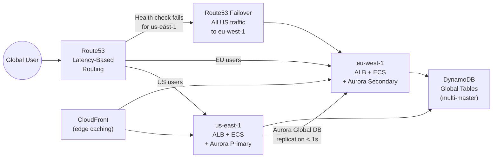

## Keywords in This File
{: .no_toc }

| # | Keyword | Weight |
|---|---------|--------|
| 27 | [AWS Multi-Region Architecture](#aws-multi-region-architecture) | ★★★ |

---

# AWS Multi-Region Architecture

**Interview Weight:** ★★★ - Senior/Staff architecture topic.
Multi-region architecture on AWS defines how systems
achieve global availability, disaster recovery, latency
reduction, and data sovereignty compliance. It requires
understanding RTO/RPO trade-offs, the AWS services that
support multi-region patterns (Route53, Aurora Global DB,
DynamoDB Global Tables, S3 CRR, CloudFront), and the
consistency challenges that arise when data is replicated
across geographies. This is a Staff-level architecture
question where trade-off reasoning matters.

---

### 🎯 Model Answer

**30 seconds:**

> Multi-region architecture on AWS serves three purposes:
> disaster recovery (survive an entire region failure),
> latency reduction (serve users from a nearby region),
> and data sovereignty (store EU data in EU). The
> architectural pattern choice is driven by RTO and RPO.
> Backup-and-restore: hours RTO. Pilot light: tens of
> minutes. Warm standby: minutes. Active-active: seconds.
> Cost and complexity increase accordingly. Route53
> health checks, DynamoDB Global Tables (multi-master),
> and Aurora Global Database (single-master) are the
> key data layer building blocks.

**3 minutes:**

> Four disaster recovery patterns (cheapest to most expensive):
>
> 1. Backup and Restore (RTO: hours, RPO: hours):
>    S3 cross-region backup. Restore to new region.
>    Cost: minimal. Use: non-critical systems.
>
> 2. Pilot Light (RTO: tens of minutes, RPO: minutes):
>    Core infrastructure running at minimal size in DR
>    region. Scale up on failover. Data: real-time replication.
>
> 3. Warm Standby (RTO: minutes, RPO: seconds):
>    Scaled-down version of production running in DR region.
>    Serving minimal traffic. On failover: scale up to full.
>
> 4. Active-Active (RTO: seconds, RPO: 0 for writes):
>    Full production in multiple regions simultaneously.
>    Traffic split across regions via Route53 latency routing.
>    Most complex: data consistency challenges across regions.
>
> Key services for multi-region:
>
> Route53: health checks + failover routing. Detects
> regional failure, switches DNS within 30-60 seconds.
>
> DynamoDB Global Tables: multi-master replication.
> Write to any region, propagate to all others (~1s lag).
> Use for: high-write, eventually consistent workloads.
>
> Aurora Global Database: single-master, read-only secondaries.
> Failover: < 1 minute manual. Use for: relational data
> with strong consistency requirements.
>
> S3 Cross-Region Replication (CRR): async, < 15 minutes.
> Use for: static assets, backups, compliance copies.
>
> CloudFront: edge caching reduces origin reads cross-region.

**Blank Mind Recovery:**

**(1) DR patterns in order:** "Backup-Restore (hours),
Pilot Light (tens of minutes), Warm Standby (minutes),
Active-Active (seconds). Cost increases same order."

**(2) Data services:** "DynamoDB Global Tables = multi-master.
Aurora Global DB = single master. S3 CRR = async copy."

**(3) Route53 role:** "Health checks detect region failure.
Failover routing switches DNS. TTL drives cutover speed."

---

### 📘 Concept Explanation

**RTO and RPO drive architecture choice:**

```
RPO (Recovery Point Objective):
  How much data can you afford to lose?
  RPO=0: no data loss (synchronous replication)
  RPO=1h: up to 1 hour of data loss OK (hourly backup)

RTO (Recovery Time Objective):
  How long can the system be down during recovery?
  RTO=0: no downtime (active-active)
  RTO=1h: 1 hour to restore is acceptable

DR Pattern Selection:
  RTO < 1 min, RPO < 1s   -> Active-Active
  RTO < 5 min, RPO < 1min -> Warm Standby
  RTO < 30min, RPO < 1min -> Pilot Light
  RTO < 4h, RPO < 1h      -> Backup and Restore
  
Cost increases significantly:
  Backup and Restore: $100-500/month extra
  Pilot Light:        $1,000-5,000/month extra
  Warm Standby:       50-100% of primary cost
  Active-Active:      100-200% of primary cost
```

> **Code walkthrough:** This example demonstrates the core pattern in action. The key mechanism shows how the concept works in practice. Study the structure to understand the essential behavior and common usage.

**Route53 failover routing:**

```
Route53 Hosted Zone: example.com
  Primary record: us-east-1 ALB
    Health check: HTTP /health every 30s
    Threshold: 3 consecutive failures -> unhealthy
    TTL: 60s (minimum recommendation)
  Secondary record (FAILOVER): eu-west-1 ALB
    Routing policy: FAILOVER
    Only serves traffic when primary is unhealthy

Failover timeline:
  T=0: us-east-1 ALB fails /health check
  T=30s: 1st failure detected
  T=60s: 2nd failure
  T=90s: 3rd failure -> primary marked unhealthy
  T=90s + 60s TTL: DNS resolves to eu-west-1 ALB
  Total: ~2 minutes from failure to full failover
  (60-second TTL in client DNS cache is the limiting factor)

Reduce failover time:
  TTL: lower = faster failover but more DNS queries
  Minimum effective TTL for Route53 health check: 30-60s
  Below 30s: health check interval limits effectiveness
```

> **Code walkthrough:** This example demonstrates the core pattern in action. The key mechanism shows how the concept works in practice. Study the structure to understand the essential behavior and common usage.

---

### 💻 Code Example

```python
# BAD: Hard-coded region endpoint in application config
# If us-east-1 goes down: application fails entirely
# No DR path, no automatic failover

DB_ENDPOINT = "prod.xxx.us-east-1.rds.amazonaws.com"
S3_BUCKET = "my-bucket"  # us-east-1 only
QUEUE_URL = "https://sqs.us-east-1.amazonaws.com/..."
```

> **Code walkthrough:** This example demonstrates the core pattern in action. The key mechanism shows how the concept works in practice. Study the structure to understand the essential behavior and common usage.

```python
# GOOD: Region-aware configuration via environment variables
# Application deploys to multiple regions
# Infrastructure (Route53, Global Accelerator) routes traffic

import boto3
import os

# Region determined by deployment environment:
REGION = os.environ.get('AWS_REGION', 'us-east-1')

# RDS endpoint via Route53 CNAME or Global Accelerator:
# DNS entry manages failover: app always uses same CNAME
DB_ENDPOINT = os.environ.get(
    'DB_ENDPOINT',
    'prod-db.internal.example.com'  # Route53 CNAME
)

# DynamoDB Global Table: write to local region
# Automatically replicates to other regions
dynamodb = boto3.resource('dynamodb', region_name=REGION)
table = dynamodb.Table('orders')  # Global Table

# Write: goes to local region, replicates to others ~1s
def place_order(order_data):
    # Conditional write to prevent conflicts if same
    # item updated from multiple regions simultaneously:
    return table.put_item(
        Item=order_data,
        ConditionExpression='attribute_not_exists(orderId)'
    )

# S3 with CRR: write to primary, replication is automatic
# Application only needs to know the bucket name
s3 = boto3.client('s3', region_name=REGION)
```

> **Code walkthrough:** This example demonstrates the core pattern in action. The key mechanism shows how the concept works in practice. Study the structure to understand the essential behavior and common usage.

```bash
# Route53 health check + failover routing:
# Create health check for primary region:
aws route53 create-health-check \
  --caller-reference "prod-us-east-1-$(date +%s)" \
  --health-check-config '{
    "Type": "HTTPS",
    "ResourcePath": "/health",
    "FullyQualifiedDomainName": "api.us-east-1.example.com",
    "RequestInterval": 30,
    "FailureThreshold": 3
  }'

# Create PRIMARY failover record:
aws route53 change-resource-record-sets \
  --hosted-zone-id ZXXXXX \
  --change-batch '{
    "Changes": [{
      "Action": "CREATE",
      "ResourceRecordSet": {
        "Name": "api.example.com",
        "Type": "A",
        "SetIdentifier": "us-east-1-primary",
        "Failover": "PRIMARY",
        "TTL": 60,
        "ResourceRecords": [{"Value": "ALB-IP-US-EAST-1"}],
        "HealthCheckId": "HEALTH-CHECK-ID"
      }
    }]
  }'

# Create SECONDARY failover record (eu-west-1):
# Same name, Failover=SECONDARY, no health check needed
# (it activates when PRIMARY is unhealthy)

# DynamoDB Global Table setup:
aws dynamodb create-table \
  --table-name orders \
  --attribute-definitions AttributeName=orderId,AttributeType=S \
  --key-schema AttributeName=orderId,KeyType=HASH \
  --billing-mode PAY_PER_REQUEST \
  --region us-east-1

# Add replica in eu-west-1:
aws dynamodb create-global-table \
  --global-table-name orders \
  --replication-group RegionName=us-east-1 RegionName=eu-west-1
```

> **Code walkthrough:** This example demonstrates the core pattern in action. The key mechanism shows how the concept works in practice. Study the structure to understand the essential behavior and common usage.

```bash
# S3 Cross-Region Replication (CRR) setup:
# Source bucket (us-east-1):
aws s3api put-bucket-versioning \
  --bucket my-primary-bucket \
  --versioning-configuration Status=Enabled

# Destination bucket (eu-west-1) - also needs versioning enabled

# Enable CRR:
aws s3api put-bucket-replication \
  --bucket my-primary-bucket \
  --replication-configuration '{
    "Role": "arn:aws:iam::...:role/s3-replication-role",
    "Rules": [{
      "Status": "Enabled",
      "Filter": {"Prefix": ""},
      "Destination": {
        "Bucket": "arn:aws:s3:::my-eu-replica-bucket",
        "StorageClass": "STANDARD_IA"
      }
    }]
  }'
# After CRR enabled: new objects replicate within minutes
# Existing objects: use S3 Batch Replication for one-time sync
```

> **Code walkthrough:** The BAD pattern hard-codes a
> single region endpoint. When us-east-1 fails, there
> is no path to continue serving traffic. The GOOD pattern
> uses environment variables and DNS abstraction: the
> application always connects to `prod-db.internal.example.com`,
> which is a Route53 CNAME that infrastructure manages.
> On failover: Route53 updates the CNAME to point to
> the DR region's endpoint - the application code changes
> nothing. DynamoDB Global Tables write to the local
> region and replicate automatically: the application
> writes to the local region, gaining low latency without
> needing to know about replication topology.

---

### 🎓 Answers by Seniority

**Junior / Mid:**

> "Multi-region AWS means running the application in
> two or more AWS regions for disaster recovery. If
> us-east-1 has an outage, Route53 health checks detect
> the failure and redirect DNS traffic to eu-west-1.
> DynamoDB Global Tables and Aurora Global Database
> keep the data in sync between regions. The main
> trade-off is cost: running in two regions costs
> roughly double."

**Senior / Staff:**

> "Multi-region is a spectrum, not a binary choice.
> The correct pattern is determined by business RTO/RPO
> requirements and budget.
>
> The key insight: most applications claim they need
> multi-region active-active, but their actual data
> consistency model does not support it. Active-active
> multi-region requires eventual consistency for writes:
> if us-east-1 and eu-west-1 both accept writes to the
> same item simultaneously, there is a conflict resolution
> problem. DynamoDB Global Tables resolves this with
> last-writer-wins. Aurora Global DB avoids it with
> single-writer-one-region. MySQL with two writable
> primaries: split-brain - do not do this.
>
> My architecture decision framework:
>
> 1. What is the business RTO/RPO? Get the actual SLA.
>    99.99% availability = 52 minutes/year downtime.
>    Does that require active-active or warm standby?
>
> 2. Can the data model support eventually consistent
>    multi-region writes? If yes: DynamoDB Global Tables.
>    If no (financial transactions, inventory): single
>    writer region with Aurora Global DB for DR.
>
> 3. What is the actual failure scenario we're protecting
>    against? Region failure is rare (2-3x/year).
>    AZ failure is more common. Multi-AZ within one region
>    protects against the more likely failure at lower cost.
>
> 4. Compliance: do regulations require specific geographic
>    data residency? GDPR: EU data in EU. Some financial
>    regulations: in-country storage. This requirement
>    exists regardless of HA needs."

---

### ⚠️ Common Misconceptions

**Misconception 1: "Multi-region means zero downtime."**

Multi-region reduces RTO and RPO but does not eliminate
downtime. Failover still takes time:
- Route53 health check: 3 failures * 30s = 90 seconds
- DNS TTL propagation: 60 seconds minimum
- Application reconnection: 10-30 seconds
- Total: 2-4 minutes even with warm standby

"Zero downtime" requires active-active with no failover
event - traffic was already routing to the second region.
Even active-active has a brief reconnect period for
sessions established to the failed region.

**Misconception 2: "DynamoDB Global Tables give you
a globally consistent database."**

DynamoDB Global Tables is eventually consistent across
regions. A write in us-east-1 propagates to eu-west-1
in approximately 1 second. During that 1-second window:
a read in eu-west-1 returns the old value. For most
consumer applications: acceptable. For financial
transactions (bank balance, inventory count):
an eventually consistent read can cause double-spending
or overselling. Solution: either accept eventual
consistency (with idempotent operations) or route all
writes to a single region (losing the active-active
write benefit) and use Global Tables only for read scaling.

---

### 🚨 Failure Modes and Diagnosis

**Failure Mode 1: Regional failover triggered but
traffic did not switch. Root cause?**

*Symptom:* us-east-1 health check shows UNHEALTHY in
Route53. But DNS still resolves to us-east-1. Users
still seeing errors.

*Diagnosis:*
```bash
# Check Route53 health check status:
aws route53 get-health-check-status \
  --health-check-id HC-ID
# Look for: HealthCheckObservations - HealthReportStatus
# Should be "Failure" if unhealthy

# Check DNS resolution from multiple locations:
# Use dnschecker.org or multiple dig commands with
# different DNS resolvers:
dig @8.8.8.8 api.example.com
dig @1.1.1.1 api.example.com
# If resolving to us-east-1 still:
# - TTL not expired (DNS cache holding old answer)
# - SECONDARY record missing or misconfigured

# Check failover record configuration:
aws route53 list-resource-record-sets \
  --hosted-zone-id ZXXXXX \
  --query 'ResourceRecordSets[?Name==`api.example.com.`]'
# Verify: SECONDARY record exists for eu-west-1
# Verify: SECONDARY record has no health check (common miss)
```

> **Code walkthrough:** This example demonstrates the core pattern in action. The key mechanism shows how the concept works in practice. Study the structure to understand the essential behavior and common usage.

*Common mistakes:*

1. SECONDARY record has a health check that also fails:
   Route53 removes both PRIMARY and SECONDARY records.
   DNS returns SERVFAIL. Traffic goes nowhere.
   Fix: SECONDARY record should never have a health check
   (it is the fallback of last resort).

2. TTL too high: a 5-minute TTL means 5 minutes of
   continued failure after health check detects the issue.
   Recommendation: 60-second TTL on failover records.

3. Health check path returning 200 for wrong reasons:
   `/health` endpoint returning 200 even when database is down.
   Fix: health check should validate DB connectivity:
   ```python
   @app.route('/health')
   def health():
       try:
           db.execute('SELECT 1')
           return {'status': 'ok'}, 200
       except:
           return {'status': 'unhealthy'}, 503
   ```

> **Code walkthrough:** This example demonstrates the core pattern in action. The key mechanism shows how the concept works in practice. Study the structure to understand the essential behavior and common usage.

**Failure Mode 2: DynamoDB Global Table write conflict
causes data inconsistency**

*Symptom:* Same item updated in us-east-1 and eu-west-1
simultaneously. One update is silently lost.

*Root cause:* DynamoDB Global Tables uses last-writer-wins
(LWW) based on timestamp. If us-east-1 writes at T=1.000
and eu-west-1 writes at T=1.001 to the same item:
eu-west-1 write wins. us-east-1 write is silently discarded
after replication conflict resolution.

*Detection:*
```bash
# Enable DynamoDB Streams on the Global Table:
aws dynamodb update-table \
  --table-name orders \
  --stream-specification StreamEnabled=true,StreamViewType=NEW_AND_OLD_IMAGES

# Lambda triggered on stream: compare OLD and NEW images
# If an update overwrites data with earlier timestamp:
# signal conflict detection alarm
```

> **Code walkthrough:** This example demonstrates the core pattern in action. The key mechanism shows how the concept works in practice. Study the structure to understand the essential behavior and common usage.

*Prevention:* Use conditional writes with version tracking:
```python
# Include version field, increment on update:
table.update_item(
    Key={'orderId': order_id},
    UpdateExpression='SET #s = :new_status, version = :new_v',
    ConditionExpression='version = :expected_v',
    ExpressionAttributeNames={'#s': 'status'},
    ExpressionAttributeValues={
        ':new_status': 'PROCESSING',
        ':new_v': current_version + 1,
        ':expected_v': current_version
    }
)
# If condition fails: another region already updated.
# Application must retry with fresh read.
```

> **Code walkthrough:** This example demonstrates the core pattern in action. The key mechanism shows how the concept works in practice. Study the structure to understand the essential behavior and common usage.

---

### ⚖️ Comparison Table

| Pattern | RTO | RPO | Cost vs Primary | Best For |
|---------|-----|-----|----------------|----------|
| Backup & Restore | Hours | Hours | +5-10% | Non-critical, compliance backup |
| Pilot Light | 10-30 min | Minutes | +20-30% | Internal apps, moderate SLA |
| Warm Standby | 1-5 min | Seconds | +50-75% | Customer-facing, 99.9% SLA |
| Active-Active | Seconds | Near-zero | +75-150% | 99.99%+ SLA, global users |

| Data Service | Replication | Consistency | Multi-write? |
|-------------|-------------|-------------|--------------|
| DynamoDB Global Tables | ~1 second | Eventually consistent | Yes (LWW conflict) |
| Aurora Global Database | < 1 second | Strong in primary | No (single writer) |
| S3 CRR | < 15 min (SLA) | Eventual | No (source bucket writes) |
| RDS Read Replica (cross-region) | Seconds-minutes | Eventual (binlog) | No |

---

### 🏛️ System Design

**Active-active multi-region e-commerce platform:**

```
Global Traffic:
  Users worldwide -> Route53 (latency-based routing)
    US users -> us-east-1 (< 20ms)
    EU users -> eu-west-1 (< 20ms)
    Asia users -> ap-southeast-1 (< 30ms)

Each Region (us-east-1 shown):
  CloudFront (edge caching for static assets)
  ALB -> ECS Fargate (API services)
  RDS Proxy -> Aurora MySQL
    Global DB replication to eu-west-1 and ap-southeast-1

Data layer:
  Product catalog: DynamoDB Global Tables (multi-master)
    - High reads, infrequent writes
    - Write from any region (no conflict: product updates rare)
  Orders: Aurora Global Database (single writer: us-east-1)
    - Strong consistency required
    - EU/Asia writes cross-region to us-east-1 (150ms write latency)
    - Acceptable: order placement is not latency-sensitive
  Sessions: ElastiCache Global Datastore (Redis)
    - Read from local region
    - Write to primary, async replicated
  Static assets: S3 + CloudFront (CRR to each region)

Failover (us-east-1 region failure):
  1. Route53 latency routing: US users automatically
     route to eu-west-1 or ap-southeast-1 (failover built-in)
  2. Aurora Global DB: promote eu-west-1 to primary
  3. All writes now go to eu-west-1 Aurora
  4. RPO: < 1 second. RTO: < 2 minutes.
```

> **Code walkthrough:** This example demonstrates the core pattern in action. The key mechanism shows how the concept works in practice. Study the structure to understand the essential behavior and common usage.

---

### 📊 Diagram

```
Multi-Region AWS Architecture Patterns:

Backup & Restore:
  Primary (Active) -> S3 backup (hourly)
  DR Region: empty, spun up only on disaster
  RTO: hours (restore + boot)

Pilot Light:
  Primary: Full stack running
  DR: Minimal (DB replicated, compute off)
    On failover: boot compute, Route53 switch
  RTO: 15-30 minutes

Warm Standby:
  Primary: 100% capacity
  DR: 20-50% capacity (serving small % of traffic)
    On failover: scale DR to 100%, Route53 switch
  RTO: 1-5 minutes

Active-Active:
  Region 1: 50% of traffic (latency routing)
  Region 2: 50% of traffic (latency routing)
  Automatic failover: Route53 reroutes on health check
  RTO: seconds (not a "failover" - always active)
```



> **Diagram walkthrough:** Route53 latency-based routing
> directs users to the nearest healthy region, providing
> both low latency and implicit failover. If us-east-1
> becomes unhealthy, Route53 redirects all remaining
> US traffic to eu-west-1 without manual intervention.
> Aurora Global Database replication (< 1 second lag)
> ensures the EU secondary is nearly current. DynamoDB
> Global Tables serve as the multi-master data store
> for catalog and session data. CloudFront reduces
> origin load by caching static and semi-static content
> at 300+ edge locations, removing cross-region origin
> requests entirely for cached content.

---

### 🎯 Interview Deep-Dive

> **Timing:** 5-7 minutes per question for ★★★ keywords.

| Type | Questions |
|------|-----------|
| CONCEPT | 3 |
| DEBUGGING | 2 |
| TRADE-OFF | 2 |
| BEHAVIORAL | 1 |
| SCENARIO | 2 |
| ARCHITECTURE | 2 |

---

#### CONCEPT 1: Explain the four DR patterns. How do you choose?

The four AWS disaster recovery patterns exist on a
spectrum defined by Recovery Time Objective (RTO) and
Recovery Point Objective (RPO). The choice is a
cost-benefit trade-off: lower RTO/RPO = higher cost.

**Backup and Restore:**

Infrastructure exists only in the primary region.
Data backups are sent to S3 in the DR region.
On disaster: provision infrastructure in the DR region
from scratch, restore data from S3 backup.

RTO: hours (infrastructure provisioning + data restore).
RPO: hours (time since last backup).
Cost: minimal (+5-10% of primary cost for S3 storage).
Use case: non-critical internal tools, data archives.

**Pilot Light:**

Core data infrastructure (databases) runs in the DR
region at minimal size. Compute (EC2, ECS) is OFF.
Data is replicated in real-time (Aurora Global DB,
RDS cross-region replica).

On disaster: start compute in DR region, scale database
to production size, switch Route53 DNS.
RTO: 15-30 minutes (boot time + scale-up + DNS).
RPO: seconds (real-time replication).
Cost: +20-30% (running DB in DR, no compute).
Use case: internal platforms with 4-hour recovery SLA.

**Warm Standby:**

Scaled-down version of production runs in the DR region.
Serving a small percentage of traffic (to verify it works).
On disaster: scale DR region to 100% capacity, shift
all traffic via Route53.
RTO: 1-5 minutes (scale-up + DNS TTL).
RPO: seconds.
Cost: +50-75% of primary (running 25-50% of production).
Use case: customer-facing applications, 99.9% SLA.

**Active-Active:**

Full production in both regions simultaneously.
Traffic split via Route53 latency-based or weighted routing.
No "failover" event: Route53 simply stops routing to
the failed region.
RTO: 30-60 seconds (Route53 health check + TTL).
RPO: near-zero (writes to local region, replication).
Cost: +100-200% (two full production environments).
Use case: 99.99%+ SLA, global user base.

**Choosing:**

Map the RTO/RPO business requirements, calculate the
cost of each pattern, present the options. Most applications
overshoot: they claim active-active need but Warm Standby
satisfies their SLA at 50% the cost.

*What separates good from great:* "Business RTO" is
often stated as "zero tolerance" but is rarely enforced
with actual SLAs. Ask: "What is the financial impact
of a 1-hour outage? A 5-minute outage?" If 1-hour
outage costs $10K in lost revenue and active-active
costs $50K/month more than warm standby: warm standby
is the correct choice. Active-active is justified when
monthly DR cost < monthly expected outage cost.

---

#### CONCEPT 2: DynamoDB Global Tables vs Aurora Global Database. When do you use each?

**DynamoDB Global Tables:**

Multi-master: write to any region, replicate to all others.
Replication lag: ~1 second.
Conflict resolution: last-writer-wins (by timestamp).
Consistency: eventual (reads may return stale data
within the 1-second replication window).

Use cases:
- Shopping carts, sessions (eventual consistency OK)
- Product catalog (writes infrequent, reads global)
- User preferences (last update wins is acceptable)
- Rate limiting counters (eventual counts)

Do NOT use for:
- Financial transactions (balance, inventory)
  -> Concurrent writes in two regions can double-spend
- Order processing (sequential state machine)
  -> State transitions must be serializable

**Aurora Global Database:**

Single-master: writes only in primary region.
Read-only secondary regions (can be promoted).
Replication: < 1 second to secondaries (async).
Consistency: strong in primary region; reads in secondary
may be up to 1 second stale.

Use cases:
- Relational data requiring ACID transactions
- Financial systems, order processing, inventory
- Any system where two-region concurrent writes would
  cause inconsistency

Limitation:
- Writes from secondary regions must cross the WAN
  to the primary (~150ms for EU -> US-East)
- Not suitable for write-latency-sensitive global apps

**Summary:**

DynamoDB Global Tables: use when write-from-anywhere
is required and eventual consistency is acceptable.
Aurora Global Database: use when relational semantics
and strong consistency are required, and you can accept
that writes have a single home region.

*What separates good from great:* Most "active-active"
architectures with Aurora are actually "active-active reads,
active-passive writes." Reads from any region, writes
always to the primary region. This is valid: it provides
local read latency globally while maintaining strong
consistency for writes. The term "active-active" in
architecture discussions often conflates read and write
distribution. Clarify which operations are distributed.

---

#### CONCEPT 3: How does Route53 health-check-based failover work? What are the timing constraints?

**Route53 health check mechanism:**

Route53 health checkers are distributed globally
(15+ AWS edge locations). Each checker sends HTTP/S
requests to the configured endpoint on the interval.
Default: 30-second interval, 3 failure threshold.

Health check states: HEALTHY, UNHEALTHY, LAST_KNOWN_STATUS.
State change: 3 consecutive failures -> marked UNHEALTHY.
State recovery: 3 consecutive successes -> marked HEALTHY.

**Failover timing calculation:**

```
T=0:  Primary ALB stops responding
T=30s: 1st health check failure
T=60s: 2nd failure
T=90s: 3rd failure -> Route53 marks primary UNHEALTHY
T=90s: Route53 removes primary from DNS answers immediately
T=90s + TTL: DNS caches expire, clients see new IP
        (60s TTL = 2.5 minutes total from failure)
        (30s TTL = 2 minutes total)
        (Minimum practical TTL = 30s)
T=2min: New requests route to secondary
T=2-5min: Old connections using primary time out/reconnect

Total end-user perceived outage: 2-5 minutes typical
```

> **Code walkthrough:** This example demonstrates the core pattern in action. The key mechanism shows how the concept works in practice. Study the structure to understand the essential behavior and common usage.

**Reducing failover time:**

Lower interval to 10 seconds (optional, additional cost):
10s interval + 3 failures = 30 seconds to detect failure.
With 60s TTL: 90 seconds total. (vs 150 seconds at default).

10-second health checks are available at additional cost.

**Health check endpoint requirements:**

The health check endpoint must return 2xx for a healthy
state and non-2xx (or timeout) for an unhealthy state.
Critical: the endpoint must validate the actual health
of dependencies:

```python
@app.route('/health')
def health_check():
    checks = {
        'database': check_database(),
        'cache': check_cache(),
        'external_api': check_external_api()
    }
    all_healthy = all(checks.values())
    status_code = 200 if all_healthy else 503
    return jsonify(checks), status_code

def check_database():
    try:
        db.execute('SELECT 1')
        return True
    except Exception:
        return False
```

> **Code walkthrough:** This example demonstrates the core pattern in action. The key mechanism shows how the concept works in practice. Study the structure to understand the essential behavior and common usage.

A health check that only validates the application
process (but not the database) will pass even when
the database is down. Failover will not trigger.

*What separates good from great:* Route53 health checks
have a limitation: they check the endpoint from multiple
edge locations. If only some checkers can reach the
endpoint (partial network failure, not a region failure):
Route53 uses a threshold (50% of checkers failing) to
determine UNHEALTHY. This prevents false positives from
transient network issues in individual locations, but
means a partial failure may not trigger failover.
For complete regional failure: all checkers fail, instant UNHEALTHY.

---

#### DEBUGGING 1: Route53 failover configured but traffic stayed on failed region. Diagnose.

**Systematic diagnosis:**

Step 1: Verify health check is detecting failure:
```bash
aws route53 get-health-check-status \
  --health-check-id HC-XXX
# Look at: HealthCheckObservations
# StatusReport.Status should be "Failure 3 consecutive..."
```

> **Code walkthrough:** This example demonstrates the core pattern in action. The key mechanism shows how the concept works in practice. Study the structure to understand the essential behavior and common usage.

Step 2: Verify Route53 record configuration:
```bash
aws route53 list-resource-record-sets \
  --hosted-zone-id ZXXXXXX \
  --query 'ResourceRecordSets[?Name==`api.example.com.`]'
```

> **Code walkthrough:** This example demonstrates the core pattern in action. The key mechanism shows how the concept works in practice. Study the structure to understand the essential behavior and common usage.

Expected output:
```json
[
  {
    "Failover": "PRIMARY",
    "HealthCheckId": "HC-XXX",
    "TTL": 60
  },
  {
    "Failover": "SECONDARY",
    "TTL": 60
    // No HealthCheckId on SECONDARY - this is critical
  }
]
```

> **Code walkthrough:** This example demonstrates the core pattern in action. The key mechanism shows how the concept works in practice. Study the structure to understand the essential behavior and common usage.

Common mistake: SECONDARY has a health check that
also fails (DR region also down or same /health check
pointing to wrong endpoint). With both failing:
Route53 serves neither record -> DNS SERVFAIL.

Step 3: Verify DNS propagation:
```bash
# Test from multiple DNS resolvers:
dig @8.8.8.8 api.example.com +short
dig @1.1.1.1 api.example.com +short
# If both still return us-east-1 IP:
# TTL not expired yet (check TTL remaining with dig)
dig api.example.com +ttl
# TTL remaining: wait this many seconds for re-query
```

> **Code walkthrough:** This example demonstrates the core pattern in action. The key mechanism shows how the concept works in practice. Study the structure to understand the essential behavior and common usage.

Step 4: Verify SECONDARY record health is OK:
```bash
curl -v https://api-eu.example.com/health
# Must return 200 from eu-west-1 endpoint
```

> **Code walkthrough:** This example demonstrates the core pattern in action. The key mechanism shows how the concept works in practice. Study the structure to understand the essential behavior and common usage.

*What separates good from great:* DNS caching is the
most common "failover didn't work" cause. A CDN, load
balancer, or API gateway in front of your application
may have its own DNS cache with a longer TTL than
Route53 serves. Verify: all upstream caches flush
their DNS or use short TTLs. Use AWS Global Accelerator
(Anycast, not DNS-based) for sub-second failover instead
of Route53 DNS failover: IP Anycast propagates failures
in seconds, not minutes.

---

#### DEBUGGING 2: DynamoDB Global Table showing item version conflicts after multi-region writes.

*Symptom:* Order status in us-east-1 shows "PROCESSING"
but eu-west-1 shows "SHIPPED" for the same orderId.
After a few seconds: one state overwrites the other.
Data integrity violations in the order workflow.

*Root cause:* Two services in two regions wrote to the
same DynamoDB item within the 1-second replication window.
Last-writer-wins resolution discarded one update.

*Diagnosis:*
```bash
# Enable DynamoDB Streams + Lambda to catch conflicts:
aws dynamodb update-table \
  --table-name orders \
  --stream-specification \
    StreamEnabled=true,StreamViewType=NEW_AND_OLD_IMAGES

# Lambda trigger: compare OldImage and NewImage.
# If OldImage.status != expected transition:
# log the conflict for investigation.
```

> **Code walkthrough:** This example demonstrates the core pattern in action. The key mechanism shows how the concept works in practice. Study the structure to understand the essential behavior and common usage.

*Fix approach 1: Route writes to single region:*

All order status updates write to us-east-1 Aurora
(single writer). eu-west-1 reads from Aurora secondary.
DynamoDB Global Table used only for read-heavy, low-conflict
data (product catalog, user preferences).

*Fix approach 2: Use conditional writes with version:*

```python
def update_order_status(order_id, old_status, new_status):
    try:
        table.update_item(
            Key={'orderId': order_id},
            UpdateExpression='SET #s = :new',
            ConditionExpression='#s = :old',
            ExpressionAttributeNames={'#s': 'status'},
            ExpressionAttributeValues={
                ':new': new_status,
                ':old': old_status
            }
        )
    except dynamodb.exceptions.ConditionalCheckFailedException:
        # Another region already updated this item.
        # Read fresh state and re-evaluate:
        current = table.get_item(Key={'orderId': order_id})
        # Apply business logic: retry or abandon
```

> **Code walkthrough:** This example demonstrates the core pattern in action. The key mechanism shows how the concept works in practice. Study the structure to understand the essential behavior and common usage.

*What separates good from great:* DynamoDB Global Tables
is not appropriate for financial state machines where
every state transition must be serialized. Conditional
writes reduce the conflict window but do not eliminate
it: two writers in different regions can both pass the
condition check simultaneously (within the 1-second
replication lag). For strict serialization: single-writer
pattern (route all writes to one region), use DynamoDB
Streams for async notification to other regions, read
locally (eventual consistency for reads is acceptable).

---

#### TRADE-OFF 1: Active-active vs active-passive multi-region.

**Active-Active:**

Both regions serve production traffic simultaneously.
Route53 latency routing: users go to nearest healthy region.
Writes: either globally distributed (DynamoDB Global Tables)
or routed to a single region (Aurora single-writer).

Pros: best RTO (seconds - no failover event), best user
latency (local region serving), best resource utilization
(both regions earn revenue), natural load distribution.

Cons: highest cost (two full production environments),
data consistency complexity (concurrent writes), operational
complexity (debug issues across two active regions),
requires eventual consistency in at least some data stores.

**Active-Passive (Warm Standby):**

Primary region serves all traffic. DR region: scaled-down,
serving minimal or test traffic.
On failure: Route53 failover, scale up DR to full.

Pros: simpler data model (single writer, no conflict),
lower cost (DR at 25-50% of primary), easier debugging
(one active region at a time).

Cons: failover event required (2-5 minutes RTO), DR
resources mostly idle (cost without revenue), cold
buffer pool in DR region (first minutes of DR traffic
slower due to cache warmup).

**Decision framework:**

Active-active justified when:
- Global users where latency is a revenue driver
  (e-commerce: 100ms delay = 7% fewer conversions)
- Write-from-any-region required by business
- Data model supports eventual consistency
- Monthly DR cost < monthly potential revenue loss

Active-passive preferred when:
- Strong consistency required (financial, inventory)
- Global writes not required (EU users can wait 150ms)
- Cost optimization is higher priority than RTO
- Operations team not ready for multi-region complexity

*What separates good from great:* Most applications
that claim "active-active" actually implement
"active-active reads, single-writer active-passive writes."
All reads serve from local region (latency benefit).
All writes route to primary region (consistency preserved).
This is the pragmatic middle ground: better user latency
without the data consistency complexity of true
multi-master. Document this explicitly so future
architects understand the design intent.

---

#### TRADE-OFF 2: Route53 DNS failover vs AWS Global Accelerator.

**Route53 DNS failover:**

DNS-based: health check detects failure, updates DNS record.
TTL drives propagation time (minimum effective: 30-60 seconds).
Total failover: 2-4 minutes typical.
Cost: Route53 hosted zone + health check ($0.50-$1/month).
Works for: most applications where 2-5 minute RTO is acceptable.

Limitations: DNS caching at CDN, ISP, application layers
can extend actual failover time beyond TTL. No control over
client-side caching. Not suitable for sub-minute RTO.

**AWS Global Accelerator:**

Anycast: users connect to a fixed AWS Anycast IP address.
Traffic routed via AWS backbone from entry point to
healthy endpoint. No DNS involvement.
Failover: propagates health check failures across
the Anycast network in < 30 seconds.
Cost: $0.025/hour ($18/month) + $0.01/GB.
Works for: applications needing sub-minute RTO, TCP/UDP
applications (not just HTTP), applications affected by
DNS caching.

Advantage: Anycast provides consistent low latency
even between failover events. Global Accelerator routes
via AWS backbone (not public internet), reducing latency
and jitter for long-distance connections.

**Decision:**

Route53 DNS failover: default choice for most web
applications (HTTP/HTTPS). Cost-effective, sufficient
for 99.9-99.95% SLA targets (5-22 minutes downtime/month).

Global Accelerator: choose when:
- Sub-60-second failover required
- Application serves non-HTTP (TCP/UDP, gaming, IoT)
- Users on mobile networks with aggressive DNS caching
- Consistent low-latency routing matters (financial trading)
- Multi-region sticky sessions required

*What separates good from great:* Global Accelerator
and Route53 are complementary, not exclusive. A typical
production setup: Route53 for global DNS (domain -> Accelerator IPs),
Global Accelerator for anycast routing + failover (IPs -> regional ALBs).
Route53 manages the DNS layer, Global Accelerator manages
the failover layer. Sub-60-second failover without DNS
propagation delays.

---

#### BEHAVIORAL 1: Describe a multi-region architecture you designed or reviewed.

**STAR:**

**Situation:** B2B SaaS platform serving financial
services customers in US and UK. SOC 2 Type II audit
requirement: maximum 4-hour RTO and 1-hour RPO for
a region failure. Security review: UK customer data
must remain in UK (data sovereignty).

**Task:** Design and implement the DR architecture.
Budget: $8,000/month additional for DR infrastructure.

**Analysis:**

Target: RTO < 4 hours, RPO < 1 hour.
Warm Standby achieves this. Active-active would exceed budget.

Data sovereignty: UK customer data -> eu-west-2 (London).
US customers: us-east-1. Two separate deployments needed.

**Architecture Decision:**

US Region (us-east-1, primary):
- Full production: ECS Fargate, Aurora MySQL, ElastiCache
- Route53 health checks on ALB /health
- Aurora Global DB: replicates to eu-west-1 for DR

UK Region (eu-west-2, production for UK customers):
- Separate full production stack
- UK customer data never leaves eu-west-2
- Aurora: primary in eu-west-2, no replication to US

DR Region (eu-west-1, warm standby for US):
- Aurora Global DB secondary for us-east-1 data
- ECS Fargate: 20% of US production capacity (idle)
- On failover: auto-scaling policy increases to 100%
- Route53 SECONDARY record: eu-west-1 ALB

**Implementation:**

Automated monthly DR drill: Route53 health check
manually forced unhealthy. Timed RTO from alert to
full traffic on eu-west-1.

Initial drill: 47-minute RTO (failed to meet 4-hour easily
but found 3 gaps: ECS scale-up slow due to image pull from ECR,
Aurora promotion not automated, smoke test not automated).

Fixed:
1. ECR image pre-pulled to eu-west-1 (reduced scale-up
   from 15 minutes to 2 minutes)
2. Aurora Global DB promotion script pre-tested and
   in runbook (not requiring engineers to figure it out)
3. Smoke test Lambda triggered automatically post-scale

Final drill: 12-minute RTO. Well within 4-hour SLA.

**Outcome:**

SOC 2 audit: DR controls passed.
UK data sovereignty: verified via AWS Config rule
checking that uk-customer-tagged resources only in
eu-west-2.
Monthly cost: $6,200/month additional (under $8K budget).

*What separates good from great:* The DR drill
is what validated the architecture. Without monthly
drills: the runbook becomes stale, team forgets steps,
tools drift. The automated smoke test post-failover
confirms the DR environment actually works end-to-end
before declaring the incident resolved. Most DR failures
in production are discovered only during an actual
incident because testing was never done.

---

#### SCENARIO 1: Design multi-region architecture for a healthcare application with HIPAA requirements.

**Requirements:**

Healthcare app: patient records. HIPAA: data stored only
in US regions (data sovereignty). 99.99% availability
SLA. Patient safety-critical reads (zero RPO for patient
medication data). RTO < 5 minutes.

**Architecture:**

```
HIPAA constraint:
  Only us-east-1 and us-west-2 (both in USA)
  No data replication outside US

Primary: us-east-1 (all writes)
DR: us-west-2 (warm standby)

Data layer:
  Patient Records: Aurora MySQL Global Database
    Primary: us-east-1 (writes)
    Secondary: us-west-2 (reads, DR promotion < 1 min)
    Encryption: AWS KMS customer-managed key
    Audit log: CloudTrail + Aurora Audit Plugin
  
  Medical Images: S3 with Cross-Region Replication
    us-east-1: primary storage
    us-west-2: replica (same-day replication SLA)
    Both: S3 Object Lock (WORM - HIPAA record retention)
  
  Active Sessions: ElastiCache Redis
    Primary: us-east-1
    DR: us-west-2 (new cache on failover, cold start)

Route53 Health Check + Failover:
  TTL: 30 seconds (HIPAA SLA requires fast failover)
  Health check: 10-second interval, 3 failures
  Total failover: 30s detect + 30s TTL = ~60 seconds

Encryption:
  At-rest: Aurora KMS, S3 SSE-KMS
  In-transit: TLS 1.2+ enforced (HIPAA minimum)
  KMS key rotation: automatic, annual
```

> **Code walkthrough:** This example demonstrates the core pattern in action. The key mechanism shows how the concept works in practice. Study the structure to understand the essential behavior and common usage.

*What separates good from great:* HIPAA requires not
just encryption at rest and in transit, but audit logging
of who accessed what data. Aurora Audit Plugin logs
all DML/DDL operations with user + timestamp. CloudTrail
logs all API calls (S3 GetObject, etc.). Combined with
AWS Config for configuration compliance: build a full
audit trail required for HIPAA audit. The DR architecture
must also be HIPAA-compliant: the warm standby in
us-west-2 must have identical encryption, IAM policies,
and audit logging as the primary.

---

#### SCENARIO 2: Design a multi-region migration strategy for a monolith moving from single-region.

**Starting state:**

Monolith on EC2 us-east-1. MySQL on RDS (not Aurora).
Single region. 10K users/day. Expanding to Europe.
EU users experiencing 400ms latency (cross-Atlantic).

**Migration strategy (phased, low risk):**

**Phase 1: Add read scaling for EU users (Week 1-2)**

Migrate RDS MySQL to Aurora MySQL (Blue/Green, zero downtime).
Add Aurora Global Database secondary in eu-west-1.
Route static assets through CloudFront (global edge caching).

Result: EU users read from eu-west-1 Aurora.
Latency for reads: 400ms -> 20ms.
Writes: still go to us-east-1 (150ms for EU, acceptable).

**Phase 2: Add warm standby (Month 1)**

Deploy application code to eu-west-1 ECS Fargate
(25% of us-east-1 capacity).
Route53 failover routing: PRIMARY=us-east-1, SECONDARY=eu-west-1.

Result: DR capability: RTO < 5 minutes.
EU users: application compute now in eu-west-1 (low writes latency).

**Phase 3: Active-active for EU (Month 2-3)**

Change Route53 from failover to latency-based routing.
EU users: route to eu-west-1 for all requests.
US users: route to us-east-1.

Writes from eu-west-1: route to us-east-1 Aurora primary.
This is the "active-active reads, active-passive writes" pattern.

**Phase 4: Data residency (if required)**

If GDPR requires EU data in EU: split EU user data
to a separate Aurora cluster in eu-west-1.
Application: tenant-aware routing by user jurisdiction.

*What separates good from great:* The phased approach
allows validating each step before committing to the next.
Phase 1 delivers immediate user value (read latency
improvement) with minimal risk (Aurora migration via
Blue/Green is well-tested). Phase 2 adds DR as a separate
concern. Phase 3 makes it active-active incrementally.
Each phase has a clear rollback: revert to previous
routing if issues are discovered. A big-bang
single-region-to-multi-region migration is high risk
and unnecessary.

---

---

### 💻 Code Example

*(Omit: this concept does not have a programmatic interface that can be demonstrated in code. The conceptual explanation above is sufficient.)*


---

### 🏛️ System Design

*(Omit: system design diagram not applicable for this concept - see ★★★ keywords for full system design coverage.)*


---

### ⚖️ Comparison Table

*(Omit: this is a ★☆☆ foundational concept with no direct alternatives to compare - see higher-difficulty keywords for trade-off analysis.)*


---

### 📊 Diagram

*(Omit: no standalone visual diagram required for this concept - the explanations and code examples above provide sufficient clarity.)*


