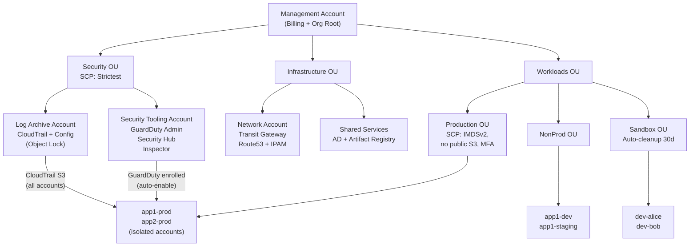

## Keywords in This File
{: .no_toc }

| # | Keyword | Weight |
|---|---------|--------|
| 28 | [AWS Landing Zone and Organization Strategy](#aws-landing-zone-and-organization-strategy) | ★★★ |

---

# AWS Landing Zone and Organization Strategy

**Interview Weight:** ★★★ - Cloud governance and strategy.
AWS Organizations and Control Tower define how enterprises
manage dozens to hundreds of AWS accounts. This topic
covers: account structure (OUs, SCPs), security baselines
(GuardDuty, CloudTrail, Config centralization), identity
management (IAM Identity Center SSO), cost governance
(consolidated billing, tagging strategy), and the
account vending machine pattern for automated account
provisioning. Staff-level cloud architects are expected
to design and justify these patterns.

---

### 🎯 Model Answer

**30 seconds:**

> AWS Landing Zone is the secure, multi-account AWS
> environment that follows AWS best practices. It is
> implemented via AWS Control Tower (automated setup)
> or manually (custom). Core structure: AWS Organizations
> with OUs (Organizational Units) separating security,
> shared services, and workload accounts. Service Control
> Policies (SCPs) enforce guardrails across all accounts.
> The account vending machine automates new account
> provisioning. Key accounts: Management (billing), Log
> Archive, Security Tooling (GuardDuty administrator).

**3 minutes:**

> Account structure:
>
> Management Account: AWS Organizations root. Billing.
> No workloads run here - it has elevated permissions.
>
> Security OU:
> - Log Archive: centralized CloudTrail, VPC Flow Logs,
>   Config snapshots from all accounts. Read-only access.
>   S3 Object Lock for tamper-proof audit trail.
> - Security Tooling: GuardDuty administrator account,
>   Security Hub aggregator, Inspector centralization.
>
> Shared Services OU:
> - Shared services (DNS, Active Directory, Transit Gateway)
> - Shared tooling (CI/CD pipelines, artifact repositories)
>
> Workloads OU:
> - Production: production accounts (one per workload or team)
> - Non-Production: dev/test/staging accounts
> - Sandbox: individual developer accounts (minimal restrictions)
>
> Service Control Policies (SCPs):
>
> Org-level SCPs: deny actions that should never happen.
> Examples:
> - Deny leaving the Organization
> - Deny disabling GuardDuty
> - Deny disabling CloudTrail
> - Deny public S3 buckets (enforce block public access)
> - Enforce IMDSv2 (prevent SSRF metadata attacks)
>
> SCPs are guardrails: they restrict what IAM policies
> can grant. Even Account Root User cannot bypass SCPs.

**Blank Mind Recovery:**

**(1) Account structure:** "Management (billing only),
Security OU (Log Archive + Security Tooling), Shared
Services, Workloads (Prod + NonProd + Sandbox)."

**(2) SCPs purpose:** "Deny actions that should never
happen: no GuardDuty disable, no public S3, enforce IMDSv2."

**(3) Control Tower:** "Automates landing zone setup.
Guardrails = SCPs + Config rules. Account Factory = vending machine."

---

### 📘 Concept Explanation

**AWS Organizations hierarchy:**

```
Management Account (Root)
  |
  |- Security OU
  |    |- Log Archive Account
  |    |- Security Tooling Account
  |
  |- Infrastructure OU
  |    |- Network Account (Transit Gateway, Route53)
  |    |- Shared Services Account (AD, CI/CD)
  |
  |- Workloads OU
       |- Production OU
       |    |- App1-Prod Account
       |    |- App2-Prod Account
       |- NonProd OU
       |    |- App1-Dev Account
       |    |- App1-Staging Account
       |- Sandbox OU
            |- Developer1 Account
            |- Developer2 Account

OUs can have SCPs attached at the OU level:
  Workloads OU SCP: deny root user access, deny
    leaving org, deny disabling GuardDuty
  Production OU SCP: deny deleting CloudTrail,
    deny modifying Config, enforce MFA for console
  Sandbox OU SCP: allow all except billing + IAM
    changes (sandbox exploration permitted)
```

> **Code walkthrough:** This example demonstrates the core pattern in action. The key mechanism shows how the concept works in practice. Study the structure to understand the essential behavior and common usage.

**SCP evaluation logic:**

```
Effective permissions =
  INTERSECTION of (SCP allows) AND (IAM policy allows)

SCP is a FILTER, not a grant:
  If SCP denies: action is blocked regardless of IAM
  If SCP is silent: IAM policy decides
  If SCP allows and IAM denies: action is blocked

Example:
  SCP on Production OU:
    Allow: all actions (no restrictions at SCP level)
  IAM role policy:
    Allow: s3:* on arn:aws:s3:::*
  Result: S3 access allowed

  SCP on Production OU:
    Deny: s3:PutBucketPublicAccessBlock with condition
    {s3:BlockPublicAcls: false}
  IAM role policy:
    Allow: s3:*
  Result: Cannot set public access block to false.
    EVEN IF the account admin tries via console.
    EVEN IF using the root user of the account.
    SCPs override all IAM within the account.
```

> **Code walkthrough:** This example demonstrates the core pattern in action. The key mechanism shows how the concept works in practice. Study the structure to understand the essential behavior and common usage.

---

### 💻 Code Example

```json
// BAD: No SCP on Organization root
// Each account manages its own guardrails independently
// Risk: a developer in one account disables GuardDuty,
// deletes CloudTrail, or creates public S3 buckets.
// No central enforcement. Audit findings per account.
// 50 accounts = 50 separate compliance reviews.
{
  "no_scp": "each account is completely autonomous"
}
```

> **Code walkthrough:** This example demonstrates the core pattern in action. The key mechanism shows how the concept works in practice. Study the structure to understand the essential behavior and common usage.

```json
// GOOD: SCPs enforcing organizational guardrails
// Applied at Organization root or specific OUs

// SCP 1: Prevent disabling security services
{
  "Version": "2012-10-17",
  "Statement": [
    {
      "Sid": "DenyDisableGuardDuty",
      "Effect": "Deny",
      "Action": [
        "guardduty:DeleteDetector",
        "guardduty:DisassociateFromMasterAccount",
        "guardduty:StopMonitoringMembers",
        "guardduty:UpdateDetector"
      ],
      "Resource": "*",
      "Condition": {
        "ArnNotLike": {
          "aws:PrincipalArn": [
            "arn:aws:iam::*:role/SecurityAdminRole"
          ]
        }
      }
    },
    {
      "Sid": "DenyDisableCloudTrail",
      "Effect": "Deny",
      "Action": [
        "cloudtrail:DeleteTrail",
        "cloudtrail:StopLogging",
        "cloudtrail:UpdateTrail"
      ],
      "Resource": "*",
      "Condition": {
        "ArnNotLike": {
          "aws:PrincipalArn": [
            "arn:aws:iam::*:role/SecurityAdminRole"
          ]
        }
      }
    }
  ]
}
```

> **Code walkthrough:** This example demonstrates the core pattern in action. The key mechanism shows how the concept works in practice. Study the structure to understand the essential behavior and common usage.

```json
// SCP 2: Enforce IMDSv2 (prevent SSRF attacks on EC2)
{
  "Version": "2012-10-17",
  "Statement": [
    {
      "Sid": "RequireIMDSv2",
      "Effect": "Deny",
      "Action": "ec2:RunInstances",
      "Resource": "arn:aws:ec2:*:*:instance/*",
      "Condition": {
        "StringNotEquals": {
          "ec2:MetadataHttpTokens": "required"
        }
      }
    },
    {
      "Sid": "DenyIMDSv1Modification",
      "Effect": "Deny",
      "Action": "ec2:ModifyInstanceMetadataOptions",
      "Resource": "*",
      "Condition": {
        "StringEquals": {
          "ec2:MetadataHttpTokens": "optional"
        }
      }
    }
  ]
}
```

> **Code walkthrough:** This example demonstrates the core pattern in action. The key mechanism shows how the concept works in practice. Study the structure to understand the essential behavior and common usage.

```json
// SCP 3: Prevent leaving the Organization
// (Prevents rogue admin from removing account and
// bypassing all SCPs)
{
  "Version": "2012-10-17",
  "Statement": [
    {
      "Sid": "DenyLeavingOrg",
      "Effect": "Deny",
      "Action": [
        "organizations:LeaveOrganization"
      ],
      "Resource": "*"
    },
    {
      "Sid": "DenyPublicS3",
      "Effect": "Deny",
      "Action": [
        "s3:PutBucketPublicAccessBlock"
      ],
      "Resource": "*",
      "Condition": {
        "StringEquals": {
          "s3:BlockPublicAcls": "false",
          "s3:BlockPublicPolicy": "false"
        }
      }
    }
  ]
}
```

> **Code walkthrough:** SCPs work as organizational
> guardrails that cannot be bypassed by account-level
> IAM policies, not even by the root user of a member
> account. The GuardDuty disable protection includes a
> condition exception for the `SecurityAdminRole`: this
> allows the central security team to manage GuardDuty
> configuration from the Security Tooling account while
> preventing all other roles from disabling it. IMDSv2
> enforcement prevents EC2 instances from being launched
> with the vulnerable v1 metadata service (SSRF attacks
> steal IAM credentials via the metadata endpoint).
> The DenyPublicS3 SCP blocks setting public access
> flags to false - preventing accidental data exposure
> even if a developer has full S3 permissions in IAM.

```bash
# Apply SCP to an OU:
aws organizations attach-policy \
  --policy-id p-xxxxxxxxxxxx \
  --target-id ou-root-xxxxxxxxxxxx

# Create a new account via Account Factory (Control Tower):
# (Via Control Tower console or using AFT - Account Factory for Terraform)

# List all accounts in the Organization:
aws organizations list-accounts \
  --query 'Accounts[*].{Name:Name,Id:Id,Status:Status}'

# Check effective SCPs for an account:
aws organizations list-policies-for-target \
  --target-id 123456789012 \
  --filter SERVICE_CONTROL_POLICY

# Verify SCP is blocking an action (test):
aws accessanalyzer create-policy-validation-request \
  # Use IAM Policy Simulator to test SCP effects:
aws iam simulate-principal-policy \
  --policy-source-arn arn:aws:iam::123456789:role/DevRole \
  --action-names guardduty:DeleteDetector \
  --resource-arns "*"
# Output: Decision: DENY (if SCP is applied correctly)
```

> **Code walkthrough:** This example demonstrates the core pattern in action. The key mechanism shows how the concept works in practice. Study the structure to understand the essential behavior and common usage.

---

### 🎓 Answers by Seniority

**Junior / Mid:**

> "AWS Organizations lets you manage multiple AWS accounts
> from a central Management Account. You can group accounts
> into OUs (like Production and Development) and apply
> Service Control Policies that restrict what anyone
> in those accounts can do. AWS Control Tower automates
> the setup with security baselines already configured.
> The main benefit: one place to see billing, enforce
> security rules, and manage access across all accounts."

**Senior / Staff:**

> "The landing zone architecture follows a pattern of
> account-per-workload for blast radius reduction, not
> resource segregation per environment within one account.
> Running Production and Development in the same account
> (different resource tags) is the anti-pattern: a
> developer's IAM mistake can affect production.
>
> My OU structure decision framework:
>
> Security OU is immutable: no workloads, Log Archive
> and Security Tooling only. Strict SCPs. Only
> SecurityAdminRole can modify anything here.
>
> Workloads OU is the high-churn area: dozens to
> hundreds of accounts. Production OU SCPs: most
> restrictive. Sandbox OU SCPs: most permissive.
>
> SCP strategy: deny-by-default for dangerous actions
> (GuardDuty disable, CloudTrail delete, public S3,
> leaving the org). Everything else: allow at the SCP
> level, enforce at IAM level within accounts.
>
> Account vending machine:
>
> New team requests an AWS account via a self-service
> portal. Account Factory (Control Tower) or AFT
> (Account Factory for Terraform) provisions a new
> account in the correct OU with:
> - GuardDuty enrolled to Security Tooling account
> - CloudTrail sending to Log Archive S3
> - Default IAM Identity Center permission sets assigned
> - Baseline Config rules deployed
> - VPC with corporate DNS routing (via Transit Gateway)
>
> This takes 5-15 minutes instead of days of manual
> provisioning and security review."

---

### ⚠️ Common Misconceptions

**Misconception 1: "SCPs grant permissions to accounts."**

SCPs are filters that restrict what IAM policies can do.
They do NOT grant permissions. An SCP that `Allow: *`
(the default full-access SCP on new accounts) does not
grant access to anything - it means "do not restrict
anything via SCP." The IAM policies within the account
determine actual access. An SCP can only remove
permissions, not add them. The intersection of SCPs
and IAM policies determines effective permissions.

**Misconception 2: "One AWS account per application
is over-engineering."**

In large organizations (50+ developers), account-per-team
or account-per-workload reduces blast radius and
simplifies compliance. If one account is compromised:
the blast radius is limited to that account's resources.
With one account for everything: a credential compromise
can access all resources. The cost of additional accounts
is zero (no charge per account). The cost of compliance
review is per account, but automated account vending
with pre-baked compliance baselines amortizes this.

---

### 🚨 Failure Modes and Diagnosis

**Failure Mode 1: SCP blocking legitimate production
operation. How to diagnose?**

*Symptom:* IAM role with sufficient IAM permissions
receives `AccessDeniedException`. The IAM policy
clearly grants the action. No explicit deny in IAM.

*Diagnosis:*
```bash
# Identify which SCP is blocking:
# 1. Check CloudTrail for the denied action:
aws cloudtrail lookup-events \
  --lookup-attributes AttributeKey=EventName,AttributeValue=RunInstances \
  --start-time $(date -d '1 hour ago' +%s) \
  --end-time $(date +%s)
# Look for: errorCode=AccessDenied, errorMessage contains SCP

# 2. List SCPs attached to the account's OUs:
aws organizations list-parents \
  --child-id 123456789012
# Get OU ID, then list policies:
aws organizations list-policies-for-target \
  --target-id ou-xxxx-yyyyyy \
  --filter SERVICE_CONTROL_POLICY

# 3. Inspect each SCP for the blocking rule:
aws organizations describe-policy \
  --policy-id p-xxxxxxxxxxxx \
  --query 'Policy.Content'
# Parse the JSON for Deny statements matching the action
```

> **Code walkthrough:** This example demonstrates the core pattern in action. The key mechanism shows how the concept works in practice. Study the structure to understand the essential behavior and common usage.

*Resolution:*

Option A (correct): Identify the SCP intent.
If the SCP is correct and the operation should not
be allowed: the application design needs to change.

Option B: If the operation is legitimate but blocked
by an overly broad SCP: add a condition exception
for the specific IAM role (as shown in the GuardDuty
SCP example above with ArnNotLike condition).

Option C (wrong): Do not delete or disable the SCP
to fix the issue. This removes the guardrail for all
accounts in the OU. Fix the SCP condition to exempt
the specific principal.

**Failure Mode 2: New account provisioned but not
receiving GuardDuty alerts**

*Root cause:* GuardDuty is not centrally enrolled.
New account was provisioned manually (not via Account
Factory) and GuardDuty enrollment was skipped.

*Diagnosis:*
```bash
# From Security Tooling account (GuardDuty administrator):
aws guardduty list-members \
  --detector-id DETECTOR-ID \
  --query 'Members[*].{AccountId:AccountId,Status:RelationshipStatus}'
# If new account not in list: it was never enrolled

# Or: check the new account directly:
aws guardduty list-detectors --region us-east-1
# Empty list = GuardDuty not enabled in this account
```

> **Code walkthrough:** This example demonstrates the core pattern in action. The key mechanism shows how the concept works in practice. Study the structure to understand the essential behavior and common usage.

*Fix:*
```bash
# Invite the new account from Security Tooling:
aws guardduty create-members \
  --detector-id DETECTOR-ID \
  --account-details '[{
    "AccountId": "NEW-ACCOUNT-ID",
    "Email": "newaccount@company.com"
  }]'

# Accept invitation from new account:
aws guardduty accept-invitation \
  --detector-id NEW-DETECTOR-ID \
  --master-id SECURITY-TOOLING-ACCOUNT-ID \
  --invitation-id INVITATION-ID

# Prevention: Use GuardDuty auto-enablement:
aws guardduty update-organization-configuration \
  --detector-id DETECTOR-ID \
  --auto-enable
# All new accounts automatically enrolled when created
```

> **Code walkthrough:** This example demonstrates the core pattern in action. The key mechanism shows how the concept works in practice. Study the structure to understand the essential behavior and common usage.

---

### ⚖️ Comparison Table

| Approach | GuardDuty Centralized | CloudTrail | Config | Cost Control |
|----------|----------------------|-----------|--------|--------------|
| Single Account | Not applicable | Local only | Local only | Single bill |
| Multi-account, no Landing Zone | Per-account manual | Per-account | Per-account | Consolidated billing |
| Landing Zone (Manual) | Security Tooling admin | Log Archive S3 | Aggregator | CUR to S3 |
| Control Tower | Auto-enrolled | Auto-configured | Conformance packs | CUR + Cost Categories |

| Control Tower Feature | Description | Equivalent Manual Work |
|----------------------|-------------|----------------------|
| Landing Zone | Pre-configured multi-account structure | Weeks of manual setup |
| Guardrails | SCPs + Config rules | Write and test per SCP |
| Account Factory | Account vending machine | Custom Lambda + API |
| Dashboard | Compliance status across accounts | Custom aggregation |

---

### 🏛️ System Design

**Enterprise AWS Landing Zone for 500-developer org:**

```
AWS Organizations Root (Management Account)
  Consolidated Billing
  Organization-level SCPs:
    - DenyLeavingOrg
    - DenyDisableCloudTrail
    - DenyDisableGuardDuty
  |
  |- Security OU (strictest SCPs)
  |    |- Log Archive Account
  |    |    S3 buckets: cloudtrail-logs, vpc-flow-logs,
  |    |    config-snapshots, access-logs
  |    |    S3 Object Lock: GOVERNANCE mode, 7-year retention
  |    |    Only SecurityAuditRole can read
  |    |- Security Tooling Account
  |         GuardDuty: administrator account (all 50 accounts)
  |         Security Hub: aggregator + standards
  |         Inspector: central vulnerability management
  |         AWS Config: aggregator account
  |
  |- Infrastructure OU
  |    |- Network Account
  |    |    Transit Gateway (connectivity hub)
  |    |    AWS Route53 (central DNS)
  |    |    VPC IP address management (IPAM)
  |    |- Shared Services Account
  |         Active Directory (AWS Managed AD)
  |         Internal artifact registry (ECR, CodeArtifact)
  |
  |- Workloads OU
       |- Production OU
       |    Additional SCPs:
       |      - RequireIMDSv2
       |      - DenyPublicS3
       |      - DenyDirectInternetEC2
       |      - RequireMFAForConsoleActions
       |    Accounts: 1 per team/workload (20 accounts)
       |- NonProd OU
       |    Accounts: dev + staging per workload (40 accounts)
       |- Sandbox OU
            Minimal SCPs (allow experimentation)
            Automatic resource cleanup after 30 days
            (Lambda sweeper removes old resources)
            Accounts: 1 per developer (50 accounts)

Identity:
  IAM Identity Center (SSO):
    Identity source: corporate Azure AD (SAML/OIDC)
    Permission sets assigned to OU levels:
      - ReadOnlyAccess: all developers, all accounts
      - PowerUserAccess: team's own prod + all nonprod
      - AdministratorAccess: restricted to SecurityAdminRole

Cost Management:
  Cost Explorer + Budgets per account
  Cost Allocation Tags enforced via Config rule
  CUR (Cost and Usage Report) -> S3 -> Athena + QuickSight
  Savings Plans: org-wide coverage
```

> **Code walkthrough:** This example demonstrates the core pattern in action. The key mechanism shows how the concept works in practice. Study the structure to understand the essential behavior and common usage.

---

### 📊 Diagram

```
AWS Landing Zone Structure:

Management Account (billing, org management)
  |
  |---SCP: Org-level denies (GuardDuty, CloudTrail, leave org)
  |
  +-- Security OU (tamper-proof security infrastructure)
  |     Log Archive: all logs centralized + Object Lock
  |     Security Tooling: GuardDuty admin, Security Hub, Inspector
  |
  +-- Infrastructure OU (shared connectivity)
  |     Network: TGW, DNS, IPAM
  |     Shared Services: AD, artifact registry
  |
  +-- Workloads OU
        +-- Production OU (strictest)
        |     SCP: IMDSv2, no public S3, MFA
        |     Accounts: app-prod-1, app-prod-2
        +-- NonProd OU
        |     Accounts: app-dev-1, app-staging-1
        +-- Sandbox OU (most permissive)
              Accounts: dev-jane, dev-bob
              Auto-cleanup after 30 days
```



> **Diagram walkthrough:** The Management Account sits
> at the root and controls only billing and organization
> structure - no workloads run here. The Security OU
> is the most protected layer: Log Archive receives
> all CloudTrail logs with Object Lock preventing
> deletion, and Security Tooling centralizes all
> detective controls (GuardDuty, Security Hub). The
> Infrastructure OU provides shared connectivity via
> Transit Gateway so workload accounts do not need
> their own internet gateways. The Workloads OU uses
> OU-level SCPs that become progressively more permissive:
> Production has the most restrictions, Sandbox has
> the least (with automatic cleanup preventing cost
> runaway from experimental resources).

---

### 🎯 Interview Deep-Dive

> **Timing:** 5-7 minutes per question for ★★★ keywords.

| Type | Questions |
|------|-----------|
| CONCEPT | 3 |
| DEBUGGING | 2 |
| TRADE-OFF | 2 |
| BEHAVIORAL | 1 |
| SCENARIO | 2 |
| ARCHITECTURE | 2 |

---

#### CONCEPT 1: Explain SCPs. How do they interact with IAM policies?

**Service Control Policies (SCPs)** are JSON policies
attached to AWS Organizations root, OUs, or individual
accounts. They define the maximum permissions boundary
for all principals (IAM users, roles, even root user)
within the targeted account(s).

**Critical: SCPs do not grant permissions.**

SCPs only restrict what IAM policies can grant.
Even if an SCP says `Allow: *`, that does not give any
IAM user or role any permissions - those come from IAM
policies. The SCP `Allow: *` simply means "the SCP is
not restricting anything."

**Evaluation logic (simplified):**

```
For any API call from a principal in a member account:

1. Evaluate SCPs. Is there an explicit DENY?
   YES: deny the call immediately. Stop.
   NO: continue.

2. Evaluate IAM policies (identity-based + resource-based).
   Is there an explicit ALLOW?
   YES: allow the call.
   NO: implicit deny (default).

Summary:
  Effective permissions =
    SCP allows AND IAM allows
  (Both must allow for the action to succeed)
```

> **Code walkthrough:** This example demonstrates the core pattern in action. The key mechanism shows how the concept works in practice. Study the structure to understand the essential behavior and common usage.

**Practical example:**

Account A is in the Production OU.
SCP on Production OU: `Deny guardduty:DeleteDetector`
IAM role in Account A: `Allow guardduty:*` (full GuardDuty)

Result: `guardduty:DeleteDetector` is DENIED.
The SCP deny overrides the IAM allow.

Account B is in the Development OU.
SCP on Development OU: `Allow *` (no restrictions)
IAM role in Account B: `Deny guardduty:DeleteDetector` (IAM deny)

Result: `guardduty:DeleteDetector` is DENIED.
The IAM deny blocks it even though SCP allows.

**Root user exception:**

SCPs DO apply to root user of member accounts.
Root user cannot bypass SCPs on the account's OU.
The Management Account itself is exempt from SCPs
(SCPs are designed for member accounts, not the
management account).

*What separates good from great:* SCPs have a size limit
(5,120 characters per SCP). Large organizations quickly
hit this limit when trying to put all guardrails in
one SCP. Best practice: use multiple focused SCPs
(one for security services, one for data controls,
one for network controls). AWS Organizations allows
5 SCPs per target. Plan the SCP structure before
hitting the limit in production.

---

#### CONCEPT 2: What is AWS Control Tower? What does it automate vs what still requires manual work?

**AWS Control Tower** is a managed service that sets
up and governs a secure, multi-account AWS environment
(Landing Zone) following AWS best practices.

**What Control Tower automates:**

1. AWS Organizations setup:
   Creates the OU structure (Security, Sandbox, Custom).
   Creates Management Account linkage.

2. Foundation accounts:
   Log Archive account (S3 bucket for centralized logs).
   Audit account (Security Tooling equivalent: read-only
   access to all accounts for auditing).

3. Baseline guardrails:
   Mandatory guardrails: cannot be disabled.
   Example: DisableRoot, EnableCloudTrailForAllAccounts.
   Strongly recommended: AWS Config, GuardDuty enrollment.
   Elective: MFA requirements, public S3 denial.

4. Account Factory:
   Self-service portal for requesting new AWS accounts.
   New accounts automatically:
   - Enrolled in GuardDuty (delegated to Audit account)
   - CloudTrail to Log Archive S3
   - AWS Config enabled with baseline rules
   - IAM Identity Center permission sets applied

5. Control Tower Dashboard:
   Compliance status: how many accounts are non-compliant
   with which guardrails.
   Account list: all accounts with OU, status, last update.

**What still requires manual work or customization:**

1. Account Factory for Terraform (AFT):
   Control Tower's native Account Factory has limited
   customization. For IaC-driven account provisioning
   with custom VPC configs, tags, baseline roles: use AFT.

2. Custom SCPs beyond Control Tower guardrails:
   Control Tower guardrails are predefined. Custom SCPs
   (e.g., restrict to specific regions, enforce tagging)
   must be created manually and attached to OUs.

3. Transit Gateway and network architecture:
   Control Tower does not set up network connectivity.
   Network Account, Transit Gateway, VPC peering:
   all manual or via a separate network module.

4. SSO integration with corporate IdP:
   IAM Identity Center needs to be configured to federate
   with corporate identity provider (Azure AD, Okta).
   Control Tower does not automate this integration.

5. Cost allocation and tagging:
   Control Tower does not enforce tagging strategy.
   Tag policies and Config rules for tag compliance:
   manual setup.

*What separates good from great:* Control Tower vs
DIY Landing Zone is a pragmatic choice. Control Tower
is excellent for organizations starting from scratch
(greenfield). For organizations with an existing
custom landing zone: migrating to Control Tower can
cause disruption (Control Tower wants to manage the
Organization structure, conflicting with existing setup).
DIY is better for mature organizations with complex
requirements (custom SCP structures, specific OU trees,
non-standard account vending workflows) where Control
Tower's opinionated structure is a constraint.

---

#### CONCEPT 3: Explain the account vending machine pattern. Why is it important at scale?

**Account vending machine (AVM)** is a pattern for
automated, self-service provisioning of new AWS accounts
following organizational standards.

**The problem it solves:**

Without AVM: new AWS account request goes to a cloud
operations team. Manual steps:
- Create account in AWS Organizations (5 minutes)
- Set up IAM roles and permission sets (30 minutes)
- Enable GuardDuty and enroll in management account (15 minutes)
- Create CloudTrail trail to centralized bucket (15 minutes)
- Set up VPC with correct CIDR range (30 minutes)
- Configure DNS to corporate resolver (20 minutes)
- Apply required SCPs (15 minutes)
- Create Jira ticket, wait for approval, implement, review
Total: 2-5 business days

With AVM: developer submits account request form.
Automated pipeline provisions account in 10-15 minutes
with all standards already applied.

**AVM implementation options:**

Option 1: AWS Control Tower + Account Factory (GUI):
Standard approach. Limited customization.

Option 2: Account Factory for Terraform (AFT):
Terraform-based pipeline. New account = new git PR.
Full IaC customization. GitOps workflow.
Baseline customizations run as Lambda functions
in a pipeline when new account is created.

Option 3: Custom Python + AWS Organizations API:
```python
import boto3

def create_account(name, email, ou_id):
    org = boto3.client('organizations')
    
    # Create account:
    response = org.create_account(
        AccountName=name,
        Email=email,
        IamUserAccessToBilling='ALLOW'
    )
    account_id = poll_account_creation(
        response['CreateAccountStatus']['Id']
    )
    
    # Move to correct OU:
    org.move_account(
        AccountId=account_id,
        SourceParentId='r-xxxx',  # Root
        DestinationParentId=ou_id
    )
    
    # Baseline via Step Functions:
    sfn = boto3.client('stepfunctions')
    sfn.start_execution(
        stateMachineArn='arn:...:account-baseline',
        input=json.dumps({'accountId': account_id})
    )
```

> **Code walkthrough:** This example demonstrates the core pattern in action. The key mechanism shows how the concept works in practice. Study the structure to understand the essential behavior and common usage.

**At scale (100+ accounts):**

Without AVM: cloud operations becomes a bottleneck.
Teams wait days for accounts. They work around it by
stuffing multiple workloads into one account (blast
radius increases). Standards drift (some accounts have
GuardDuty, some don't).

With AVM: teams provision accounts themselves, on demand.
Every account is identical (same baseline, same security,
same networking). Compliance is guaranteed by the pipeline,
not by manual checklist.

*What separates good from great:* The AVM pipeline should
include account decommissioning. An account that is no
longer needed should be formally decommissioned: remove
resources, remove access, mark for deletion.
Organizations with 500 accounts often have 100 ghost
accounts with no owner, stale access keys, and resources
running. AVM with lifecycle management (account owner
field, periodic revalidation, auto-decommission on
no-owner timeout) prevents account sprawl.

---

#### DEBUGGING 1: An account created via Control Tower Account Factory is not receiving GuardDuty findings.

*Symptom:* New account created. No GuardDuty findings
appear in Security Tooling account. Direct access to
new account shows GuardDuty detector exists but no
findings forwarded to central Security Hub.

*Diagnosis steps:*

Step 1: Check if GuardDuty is enabled in the new account:
```bash
# Assume role in new account, check:
aws guardduty list-detectors --region us-east-1
# If empty: GuardDuty was not automatically enabled
# This means auto-enable was not configured

# If detector exists:
aws guardduty get-detector --detector-id DETECTOR-ID
# Check Status: ENABLED or DISABLED
```

> **Code walkthrough:** This example demonstrates the core pattern in action. The key mechanism shows how the concept works in practice. Study the structure to understand the essential behavior and common usage.

Step 2: Check if account is a GuardDuty member of the administrator:
```bash
# From Security Tooling account:
aws guardduty list-members \
  --detector-id SECURITY-TOOLING-DETECTOR-ID \
  --query 'Members[?AccountId==`NEW-ACCOUNT-ID`]'
# If empty: account never enrolled as a member
```

> **Code walkthrough:** This example demonstrates the core pattern in action. The key mechanism shows how the concept works in practice. Study the structure to understand the essential behavior and common usage.

Step 3: Check GuardDuty auto-enable setting:
```bash
aws guardduty get-organization-configuration \
  --detector-id SECURITY-TOOLING-DETECTOR-ID
# AutoEnable: true/false
# If false: new accounts are not automatically enrolled
```

> **Code walkthrough:** This example demonstrates the core pattern in action. The key mechanism shows how the concept works in practice. Study the structure to understand the essential behavior and common usage.

*Fix:*
```bash
# Enable auto-enable for new accounts:
aws guardduty update-organization-configuration \
  --detector-id SECURITY-TOOLING-DETECTOR-ID \
  --auto-enable

# Manually enroll the missed account:
aws guardduty create-members \
  --detector-id SECURITY-TOOLING-DETECTOR-ID \
  --account-details '[{
    "AccountId": "NEW-ACCOUNT-ID",
    "Email": "newaccount@company.com"
  }]'
```

> **Code walkthrough:** This example demonstrates the core pattern in action. The key mechanism shows how the concept works in practice. Study the structure to understand the essential behavior and common usage.

*Root cause:* Control Tower's auto-enrollment requires
GuardDuty to be set as the delegated administrator
AND auto-enable must be configured. If Control Tower
was set up before GuardDuty delegated admin was configured,
new accounts may not auto-enroll.

*What separates good from great:* Validate new account
baselines as part of the account vending pipeline.
After account creation, run a compliance check Lambda:
verify GuardDuty enrolled, CloudTrail sending to
Log Archive, Config enabled, no public S3 buckets.
Fail the pipeline and alert if any check fails.
This validation-on-creation prevents silent security gaps.

---

#### DEBUGGING 2: Developer reports SCP is blocking a legitimate action in their development account.

*Context:* Developer in a NonProd account cannot delete
an EC2 snapshot they created. IAM role has `ec2:DeleteSnapshot`.
Gets AccessDenied.

*Diagnosis:*

Step 1: Identify the denying policy via CloudTrail:
```bash
aws cloudtrail lookup-events \
  --lookup-attributes AttributeKey=EventName,AttributeValue=DeleteSnapshot \
  --query 'Events[0].CloudTrailEvent' | python3 -m json.tool
# Look for:
# "errorCode": "AccessDenied",
# "errorMessage": "... by an SCP ..."
# The error message includes "scp" when blocked by SCP
```

> **Code walkthrough:** This example demonstrates the core pattern in action. The key mechanism shows how the concept works in practice. Study the structure to understand the essential behavior and common usage.

Step 2: Find the SCP:
```bash
# Get account's parent OUs:
ACCT_ID=123456789012
aws organizations list-parents --child-id $ACCT_ID
# Returns OU ID

# List SCPs on this OU:
aws organizations list-policies-for-target \
  --target-id ou-XXXX \
  --filter SERVICE_CONTROL_POLICY

# Check each SCP content:
aws organizations describe-policy --policy-id p-XXXX \
  --query 'Policy.Content' | python3 -m json.tool
# Look for Deny statements matching ec2:DeleteSnapshot
```

> **Code walkthrough:** This example demonstrates the core pattern in action. The key mechanism shows how the concept works in practice. Study the structure to understand the essential behavior and common usage.

Step 3: Evaluate the SCP intent:
If the SCP denies `ec2:DeleteSnapshot` without condition:
was this intentional? Likely yes if the rule was written
to prevent deleting production snapshots.

*Resolution:*

Option A (preferred): Add a condition to the SCP:
Allow deletion of own snapshots (tagged with team tag):
```json
{
  "Effect": "Deny",
  "Action": "ec2:DeleteSnapshot",
  "Resource": "*",
  "Condition": {
    "StringNotEquals": {
      "aws:ResourceTag/Environment": "sandbox"
    }
  }
}
```
> **Code walkthrough:** This example demonstrates the core pattern in action. The key mechanism shows how the concept works in practice. Study the structure to understand the essential behavior and common usage.

This allows developers to delete sandbox-tagged snapshots.

Option B: Move developer to Sandbox OU (more permissive).
If they need full experimental access: Sandbox OU is
designed for this. NonProd is for staging/dev of real apps.

*What separates good from great:* SCP debugging requires
understanding the original intent. Never modify an SCP
without understanding why it was written. A "fix"
that adds a broad exception to solve one developer's
problem can silently unblock other guardrails.
Always add the minimum-scope exception (tag condition,
specific account condition, specific role exception).

---

#### TRADE-OFF 1: One account per team vs one account per workload vs one account per environment.

**One account per team:**

All team's workloads and environments in one account.
Prod and Dev separated by resource naming/tagging.

Pros: simple. Few accounts. Low operational overhead.
Cons: blast radius = all team's workloads. Developer
IAM mistake in dev can affect prod (same account).
Compliance: auditing one account surfaces prod and dev
noise together. RBAC limited to IAM (no account-level isolation).

**One account per environment (prod/dev/staging):**

Prod account: all teams' production.
Dev account: all teams' dev environments.

Pros: simple (3 accounts), prod isolated from dev.
Cons: teams share account, cross-team blast radius.
One team's prod issue (IAM, storage) can affect another
team's production in the same account.
Limit scaling: 50 teams in 3 accounts = chaos.

**One account per workload:**

Each microservice/application/team has its own
production account. Separate dev/staging per workload.

Pros: complete blast radius isolation.
IAM errors in app1-prod: do not affect app2-prod.
Compliance: audit per account is scoped.
Cost visibility: per-account cost = per-workload cost.
Cons: many accounts (100 teams * 3 environments = 300 accounts).
Account vending required. Operations complexity.

**Recommendation:**

One account per workload, per environment.
At 20 teams: 60-100 accounts is manageable with AVM.
The blast radius isolation justifies the operational
overhead. Control Tower + AFT automates the management.

*What separates good from great:* The "blast radius"
argument is not just about IAM. AWS service quotas
are per account. If one workload exhausts an EC2
quota (10,000 instances), it affects every other
workload in the same account. With per-workload accounts:
quota exhaustion in one account does not affect others.
Request quota increases per-workload instead of globally.
This is the hidden scalability benefit of account-per-workload.

---

#### TRADE-OFF 2: Control Tower vs DIY Landing Zone.

**Control Tower:**

Pros:
- Opinionated best practices baked in (time to value)
- Account Factory for account provisioning
- Dashboard for compliance status
- Managed by AWS (Control Tower itself is maintained)
- Integrates with IAM Identity Center natively

Cons:
- Opinionated OU structure (Security + Sandbox + Custom)
  may not match organization's needs
- Limited customization of account baselining without AFT
- Control Tower manages some resources (you cannot
  modify them outside Control Tower or it drifts)
- Migration of existing Organizations to Control Tower
  is complex and risky

**DIY Landing Zone (custom):**

Pros:
- Full control over OU structure, SCP design, naming
- No dependency on Control Tower service limits or bugs
- Can model any OU hierarchy
- Integrates with any IaC (Terraform, CDK, CloudFormation)

Cons:
- Significant upfront engineering effort
  (weeks to months to build, test, document)
- All maintenance is your responsibility
  (SCP updates, new account procedures, compliance drift)
- No built-in compliance dashboard
- Risk of inconsistency without automation

**Decision:**

Greenfield organization (no existing AWS multi-account):
Control Tower. Immediate best practices, Account Factory
from day one, compliance dashboard. Use AFT for
customization. Accept the opinionated structure.

Existing organization with custom OU structure:
DIY or Control Tower Landing Zone migration only with
a dedicated project. The migration is high-risk and
often not worth the disruption.

Startup scaling to enterprise:
Control Tower until the organization outgrows its
limitations, then invest in custom landing zone tooling.

*What separates good from great:* Control Tower drift
is the hidden operational risk. If any Control Tower-managed
resource is modified outside Control Tower (e.g., SCPs,
Log Archive S3 bucket), the Control Tower status
shows as "drifted" and updates stop working. Governance
process: all Control Tower resources are modified
only via Control Tower API or console, never directly
via Organizations or CloudFormation. Teams must know
which resources are Control Tower-managed.

---

#### BEHAVIORAL 1: Describe designing or implementing an AWS Organizations structure.

**STAR:**

**Situation:** FinTech company grew from 5 to 50 engineers
over 2 years. Started with 1 AWS account. Now 8 teams,
each running multiple services. Single account with
everything mixed (prod/dev resources, all teams).
SOC 2 audit revealed: "no account-level isolation,
risk of cross-team blast radius, CloudTrail not
centralized, GuardDuty not enabled on dev resources."

**Task:** Design and implement AWS multi-account
structure within 3 months without disrupting production.

**Assessment phase (week 1-2):**

Mapped existing resources: 340 EC2 instances,
45 RDS databases, 200 S3 buckets across 8 teams.
Interviewed team leads: pain points, compliance requirements.
Mapped regulatory requirements: SOC 2 + PCI-DSS (payment processing).

**Architecture decision:**

OU structure:
- Security OU: Log Archive + Security Tooling
- Infrastructure OU: Network (VPC, TGW, DNS) + Shared
- Workloads OU: Production + NonProd (per team/workload)

PCI scope: only Payment Processing team's prod account.
PCI-scoped accounts: stricter SCPs, quarterly penetration test.

**Migration strategy (0 downtime required):**

Month 1: Set up Organizations structure, Security OU,
centralize GuardDuty and CloudTrail (no workload migration yet).

Month 2: Create new workload accounts. Set up network
(Transit Gateway). Migrate dev/staging resources first
(lower risk). Teams validated their CI/CD pipelines
deploy to new dev accounts.

Month 3: Production migration.
Blue/Green: new account runs parallel production.
Route53: shift 10% -> 50% -> 100% traffic to new accounts.
Decommission resources in old account after 2 weeks.

**Outcome:**

3.5 months (slight delay due to PCI scoping review).
85 accounts created (8 teams * ~10 workloads * 2 environments + shared).
Account Factory (AFT) deployed: new accounts provision in 12 minutes.
SOC 2 audit passed: all findings resolved.
PCI-DSS: payment scope reduced from all 340 instances to 12.
Monthly compliance review automation: Security Hub + Config dashboard.

*What separates good from great:* The PCI scope reduction
was the most impactful business outcome. With a single
account: all 340 instances were in PCI scope because
auditors could not exclude them (they shared network
and IAM with payment systems). With account isolation:
PCI scope = 12 instances in the payment-prod account only.
This reduced quarterly PCI audit cost by 70%
(fewer systems to assess) and reduced the annual pen test
scope from $50K to $15K.

---

#### SCENARIO 1: Design the SCP structure for a 50-account organization.

**Requirements:**

50 accounts. Production workloads. SOC 2 compliance.
Security team requirements: GuardDuty always on,
CloudTrail always on, no public S3, IMDSv2 required.

**SCP structure (5 SCPs - within the attachment limit):**

SCP 1: Org-level baseline (attached to Root):
```
Name: OrgBaseline
Attach: Organization Root (all accounts)
Content:
  - DenyLeavingOrganization
  - DenyRootUserAccess (except credential rotation)
  - DenyRegionsOutsideApproved (only us-east-1, eu-west-1)
```

> **Code walkthrough:** This example demonstrates the core pattern in action. The key mechanism shows how the concept works in practice. Study the structure to understand the essential behavior and common usage.

SCP 2: Security guardrails (attached to Root):
```
Name: SecurityGuardrails
Attach: Organization Root
Content:
  - DenyDisableGuardDuty
  - DenyDisableCloudTrail
  - DenyDisableConfig
  - DenyDisableSecurityHub
Exception: SecurityAdminRole in SecurityTooling account
```

> **Code walkthrough:** This example demonstrates the core pattern in action. The key mechanism shows how the concept works in practice. Study the structure to understand the essential behavior and common usage.

SCP 3: Data controls (attached to Workloads OU):
```
Name: DataControls
Attach: Workloads OU
Content:
  - DenyPublicS3 (block public access settings)
  - RequireS3Encryption (deny unencrypted PutObject)
  - RequireEBSEncryption (deny unencrypted volume creation)
```

> **Code walkthrough:** This example demonstrates the core pattern in action. The key mechanism shows how the concept works in practice. Study the structure to understand the essential behavior and common usage.

SCP 4: Production hardening (attached to Production OU):
```
Name: ProductionHardening
Attach: Production OU
Content:
  - RequireIMDSv2 (deny EC2 launch with v1 metadata)
  - DenyDirectInternetEC2 (require security groups, no 0.0.0.0/0)
  - RequireMFAForConsoleActions
```

> **Code walkthrough:** This example demonstrates the core pattern in action. The key mechanism shows how the concept works in practice. Study the structure to understand the essential behavior and common usage.

SCP 5: Sandbox permissiveness override:
```
Name: SandboxAllowList
Attach: Sandbox OU
Content:
  - Allow * (no restrictions beyond org baseline)
Note: data controls NOT attached to Sandbox OU
```

> **Code walkthrough:** This example demonstrates the core pattern in action. The key mechanism shows how the concept works in practice. Study the structure to understand the essential behavior and common usage.

**Maintenance process:**

All SCP changes via pull request -> peer review ->
approved by Security Lead -> merged and applied
by pipeline (Terraform). No manual SCP modifications.
Quarterly review: are any SCPs blocking legitimate
operations that should be allowed?

*What separates good from great:* SCP monitoring.
CloudTrail records every AccessDenied error. A Lambda
function aggregates weekly SCP-blocked actions and
sends a report to the security team. Actions blocked
100+ times per week are candidates for SCP review:
either the operation should be allowed (SCP too broad)
or the operation should be blocked and the team notified
they need an alternative approach.

---

#### SCENARIO 2: An enterprise is migrating from on-premise to AWS. Design the landing zone.

**Context:**

500-person company. 3 geographic locations (US, EU, APAC).
Currently: on-premise VMware. Migration to AWS over 2 years.
Requirements: GDPR (EU data in EU), SOC 2, 30-account initial target.

**Phase 1: Foundation (Months 1-2)**

```
1. Enable AWS Organizations + Management Account
2. Deploy Control Tower (to save months of DIY setup)
3. Customize via AFT (Account Factory for Terraform):
   - Account baseline: GuardDuty, CloudTrail, Config
   - Network baseline: VPC, TGW attachment
   - IAM baseline: standard roles + permission sets

4. Account structure:
   Management Account (billing only)
   Security OU:
     log-archive (US)
     log-archive-eu (EU - separate for GDPR)
     security-tooling
   Infrastructure OU:
     network-us (TGW, Route53, VPN)
     network-eu (TGW, Route53, Direct Connect)
     shared-services
   Workloads OU:
     Production OU
     NonProd OU
     Migration OU (temporary: lift-and-shift landing)
```

> **Code walkthrough:** This example demonstrates the core pattern in action. The key mechanism shows how the concept works in practice. Study the structure to understand the essential behavior and common usage.

**Phase 2: Network setup (Month 2-3)**

```
Transit Gateway (US region):
  Connects all US accounts
  VPN / Direct Connect to on-premise US
  
Transit Gateway (EU region):
  Connects all EU accounts
  Direct Connect to on-premise EU

AWS Direct Connect (if latency/throughput required):
  Dedicated 1Gbps connection for database migration
  
Inter-region: AWS backbone TGW peering
  US TGW <-> EU TGW (private backbone)
```

> **Code walkthrough:** This example demonstrates the core pattern in action. The key mechanism shows how the concept works in practice. Study the structure to understand the essential behavior and common usage.

**Phase 3: Application migration (Months 3-24)**

Account provisioned per application via AFT.
Migration OU: lift-and-shift first (VM -> EC2).
Production OU: refactored cloud-native applications.

**GDPR compliance:**

EU data accounts ONLY in eu-west-1 (Ireland) and
eu-central-1 (Frankfurt).
SCP on EU workload accounts:
```json
{
  "Effect": "Deny",
  "Action": "*",
  "Resource": "*",
  "Condition": {
    "StringNotEqualsIfExists": {
      "aws:RequestedRegion": ["eu-west-1", "eu-central-1"]
    }
  }
}
```
> **Code walkthrough:** This example demonstrates the core pattern in action. The key mechanism shows how the concept works in practice. Study the structure to understand the essential behavior and common usage.

This SCP prevents EU accounts from creating resources
in non-EU regions. Data sovereignty enforced at the
SCP level, not just by policy.

*What separates good from great:* The Migration OU
is a temporary OU for lift-and-shift resources that
do not yet meet cloud-native standards. It has relaxed
SCPs (to allow legacy configurations) and a sunset date.
Resources in the Migration OU are tracked in a migration
backlog. Over 24 months: all resources move from
Migration OU to Production OU (fully cloud-native)
or are decommissioned. This prevents "temporary"
lift-and-shift resources from becoming permanent
technical debt in the organization.

---

---

### 💻 Code Example

*(Omit: this concept does not have a programmatic interface that can be demonstrated in code. The conceptual explanation above is sufficient.)*


---

### 🏛️ System Design

*(Omit: system design diagram not applicable for this concept - see ★★★ keywords for full system design coverage.)*


---

### ⚖️ Comparison Table

*(Omit: this is a ★☆☆ foundational concept with no direct alternatives to compare - see higher-difficulty keywords for trade-off analysis.)*


---

### 📊 Diagram

*(Omit: no standalone visual diagram required for this concept - the explanations and code examples above provide sufficient clarity.)*


