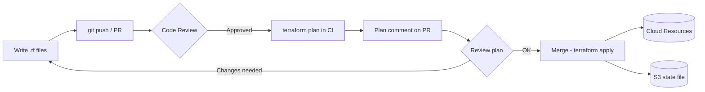

## Keywords in This File
{: .no_toc }

| # | Keyword | Weight |
|---|---------|--------|
| 10 | [Infrastructure as Code Fundamentals](#infrastructure-as-code-fundamentals) | ★★☆ |
| 11 | [Terraform vs CloudFormation vs CDK](#terraform-vs-cloudformation-vs-cdk) | ★★☆ |

---

# Infrastructure as Code Fundamentals

**Interview Weight:** ★★☆ - Core modern DevOps practice.
IaC is the standard way cloud infrastructure is managed.
Ability to describe, review, and troubleshoot IaC is
expected at mid-senior levels.

---

### 🎯 Model Answer

**30 seconds:**

> Infrastructure as Code (IaC) defines cloud resources
> in version-controlled files rather than through manual
> console clicks. Benefits: reproducibility (same config =
> same infrastructure), code review for infrastructure
> changes, drift detection (actual vs declared state),
> and disaster recovery (recreate from code). Terraform
> is the most common tool. The key concept is declarative:
> you describe the desired end state, not the steps to get there.

**3 minutes:**

> Core properties of IaC:
>
> Declarative vs Imperative:
> - Declarative: describe desired end state
>   "I want 3 EC2 instances of type m5.large"
>   Tool figures out create/modify/delete to reach that state
> - Imperative: scripted steps
>   "Create instance 1, create instance 2, create instance 3"
>   Brittle: fails if state differs from expected
>
> Idempotency:
> - Run same IaC twice = same result
> - Terraform plan shows: what will change, what is unchanged
>
> Drift detection:
> - Drift: manual change to resource after IaC deployment
> - Terraform refresh: updates state file from actual cloud state
> - terraform plan shows drift as changes to be undone
>   (if the IaC is the source of truth)
>
> State management (Terraform):
> - terraform.tfstate: records what Terraform knows about resources
> - Remote state: S3 + DynamoDB locking for team collaboration
> - Never edit state manually
>
> IaC workflow:
> 1. Write .tf files (describe resources)
> 2. terraform init (download providers)
> 3. terraform plan (show what changes will happen)
> 4. Code review the plan
> 5. terraform apply (make changes)
> 6. terraform destroy (teardown, e.g., staging environments)

**Blank Mind Recovery:**

**(1) Definition:** "Describe infrastructure in code.
Version controlled. Declarative (what) not imperative (how)."

**(2) Workflow:** "Write -> plan -> review -> apply.
Plan is the key safety step."

**(3) State:** "Terraform tracks state in tfstate.
Remote state (S3 + DynamoDB) for teams."

---

### 📘 Concept Explanation

**IaC vs Manual Provisioning:**

```
MANUAL (console):
  Jan: Eng A creates VPC, 3 subnets, 2 EC2, RDS
  Feb: Eng B modifies SG for hotfix, forgets docs
  Mar: Disaster recovery needed
    -> No record of exact configuration
    -> Eng A and B on vacation
    -> 3 days to reconstruct

IaC:
  git log shows every change with author and reason
  PR review: "this SG change opens port 22 to 0.0.0.0/0"
    -> Caught before deployment
  terraform apply recreates exact environment in 15min
  Dev/staging/prod: same Terraform, different tfvars
    -> "Works in dev" always reproducible in prod
```

> **Code walkthrough:** This Infrastructure as Code Fundamentals example demonstrates a key concept in practice using authentication. **KEY MECHANISM:** the runtime executes these instructions in sequence with specific memory and execution semantics. **WHY IT MATTERS:** misapplying this pattern causes subtle bugs that only manifest under production load. **TAKEAWAY: understand the execution model before using this pattern in production code.**

**Terraform State Machine:**

```
PLAN DIFF SYMBOLS:
  + resource: will be CREATED
  ~ resource: will be MODIFIED (in-place)
  - resource: will be DESTROYED
  -/+ resource: must be REPLACED (destroy + create)
               (dangerous for stateful resources like DBs)

REPLACEMENT WARNING:
  aws_db_instance.main must be replaced
    -> RDS: destroy current DB, create new one
    -> Data loss unless snapshot taken first!
    -> Solution: use target flag or prevent_destroy lifecycle
```

> **Code walkthrough:** This Infrastructure as Code Fundamentals example demonstrates a key concept in practice. **KEY MECHANISM:** the runtime executes these instructions in sequence with specific memory and execution semantics. **WHY IT MATTERS:** misapplying this pattern causes subtle bugs that only manifest under production load. **TAKEAWAY: understand the execution model before using this pattern in production code.**

---

### 💻 Code Example


```hcl
# BAD: anti-pattern shown for contrast
# This approach has the issues the GOOD example fixes
```

```hcl
# BAD: Hard-coded, no reuse, no environments
resource "aws_instance" "web" {
  ami           = "ami-0c55b159cbfafe1f0"
  instance_type = "t3.large"
  # Hard-coded AMI, hard-coded size
  # Cannot be reused for staging vs production
  # No tagging, no management
}


# GOOD: Variables, modules, lifecycle controls

variable "environment" {
  description = "Deployment environment"
  type        = string
  validation {
    condition     = contains(
      ["dev", "staging", "prod"], var.environment)
    error_message = "Valid: dev, staging, prod"
  }
}

variable "instance_type" {
  description = "EC2 instance type"
  type        = string
  default     = "t3.medium"
}

locals {
  tags = {
    Environment = var.environment
    ManagedBy   = "terraform"
    Team        = "platform"
  }
}

# Dynamic AMI lookup: always get latest patched AMI
data "aws_ami" "amazon_linux_2023" {
  most_recent = true
  owners      = ["amazon"]
  filter {
    name   = "name"
    values = ["al2023-ami-*-x86_64"]
  }
}

resource "aws_instance" "app" {
  ami           = data.aws_ami.amazon_linux_2023.id
  instance_type = var.instance_type
  subnet_id     = var.private_subnet_id

  tags = merge(local.tags,
    { Name = "app-${var.environment}" })

  lifecycle {
    # Prevent accidental termination of production:
    prevent_destroy = var.environment == "prod"
    # Replace safely: new before old is destroyed
    create_before_destroy = true
  }
}

# REMOTE STATE (S3 + DynamoDB locking):
terraform {
  backend "s3" {
    bucket         = "my-terraform-state-bucket"
    key            = "prod/main.tfstate"
    region         = "us-east-1"
    encrypt        = true  # Encrypt state at rest
    dynamodb_table = "terraform-state-lock"
    # DynamoDB prevents concurrent applies
    # (would corrupt state file)
  }
}
```

> **Code walkthrough:** The BAD example has a hardcoded AMI IDice. **KEY MECHANISM:** the runtime executes these instructions in sequence with specific memory and execution semantics. **WHY IT MATTERS:** misapplying this pattern causes subtle bugs that only manifest under production load. **TAKEAWAY: understand the execution model before using this pattern in production code.**
> that is region-specific and becomes stale as security patches
> are released. The GOOD example uses a data source to always
> fetch the latest Amazon Linux 2023 AMI. The validation block
> on the environment variable prevents typos from creating
> resources with unexpected names. The lifecycle block's
> prevent_destroy on prod blocks terraform destroy from running
> in production unless the attribute is changed first.
> Remote state in S3 with DynamoDB locking is standard
> multi-developer setup: the DynamoDB table ensures only one
> terraform apply runs at a time, preventing race conditions
> that would corrupt the state file.

---

### 🎓 Answers by Seniority

**Junior / Mid:**

> "Infrastructure as Code defines cloud resources in code
> files instead of clicking in the console. Benefits:
> version control, reproducibility, and code review.
> Terraform is the most common tool. The workflow:
> write resources in .tf files, run terraform plan to see
> what will change, review the plan, then terraform apply."

---

**Senior / Staff:**

> "IaC provides the same engineering disciplines for
> infrastructure that software has: code review, testing,
> version history, and rollback. The critical discipline
> is treating the IaC as the source of truth: any manual
> console change is drift that must be codified or reverted.
> The biggest team failure: multiple engineers running
> terraform apply concurrently without remote state locking.
> The second biggest: not reviewing terraform plans carefully
> - a -/+ on a database is a data loss event without a snapshot.
> On large teams: Atlantis or Terraform Cloud automates
> plan-and-apply via pull requests, ensuring all changes
> are reviewed before apply."

---

### ⚠️ Common Misconceptions

**Misconception 1: "IaC handles all configuration management."**

IaC tools (Terraform, CloudFormation) handle infrastructure
provisioning: VPCs, EC2 instances, databases. Configuration
management (installing software, configuring processes) is
a separate layer: Ansible, Chef, or cloud-init for simple
cases. Modern approach: immutable infrastructure - bake
configuration into AMIs or Docker images at build time,
removing the need for configuration management at runtime.

**Misconception 2: "Terraform state can be manually edited
to fix issues."**

Manually editing terraform.tfstate is extremely risky:
it can orphan resources (Terraform no longer knows about them,
they continue running and billing) or cause Terraform to
destroy resources it thinks are stale. Use: `terraform state rm`
(remove from tracking without destroying), `terraform import`
(import existing resource into state), or `terraform state mv`
(rename resource in state for refactoring).

---

### 🚨 Failure Modes and Diagnosis

**Failure 1: Plan shows unwanted resource replacement**

*Symptom:* terraform plan shows -/+ on RDS instance.
Applying would destroy the production database.

*Diagnosis:*
```bash
terraform plan -out=plan.tfplan
terraform show -json plan.tfplan | python3 -c "
import json, sys
plan = json.load(sys.stdin)
for rc in plan['resource_changes']:
    if 'delete' in rc['change']['actions']:
        print(rc['address'])
"
# Check which attribute triggered replacement
```

> **Code walkthrough:** This Check which attribute triggered replacement example demonstrates shell script pattern using SQL. **KEY MECHANISM:** the shell executes commands sequentially; pipes pass stdout of one command to stdin of the next. **WHY IT MATTERS:** unquoted variables with spaces cause word splitting - IFS splits the value into multiple arguments. **TAKEAWAY: always double-quote variables: "$VAR"; use [[ ]] instead of [ ] for safer conditionals.**

*Fix:* Use -target for non-destructive changes first.
Take a manual snapshot. Apply the destructive change separately.
Or use `lifecycle.ignore_changes` for the specific attribute.

---

**Failure 2: State lock not released after failed apply**

*Symptom:* `terraform apply` fails: "Error acquiring the
state lock: ConditionalCheckFailedException."

*Fix:*
```bash
# Verify no apply is actually running first!
# Then force-unlock:
terraform force-unlock LOCK_ID
# Get LOCK_ID from the error message

# Check for stale lock:
aws dynamodb scan --table-name terraform-state-lock
```

> **Code walkthrough:** This Check for stale lock: example demonstrates shell script pattern. **KEY MECHANISM:** the shell executes commands sequentially; pipes pass stdout of one command to stdin of the next. **WHY IT MATTERS:** unquoted variables with spaces cause word splitting - IFS splits the value into multiple arguments. **TAKEAWAY: always double-quote variables: "$VAR"; use [[ ]] instead of [ ] for safer conditionals.**

---

### 🎯 Interview Deep-Dive

| Category | Count | Coverage |
|---|---|---|
| Conceptual | 2 | Declarative vs imperative, idempotency, drift |
| Trade-off | 2 | IaC adoption cost, secrets handling |
| Failure Mode | 2 | State lock, drift remediation |
| Debugging | 1 | Diagnosing plan vs apply divergence |
| Behavioral | 2 | Production drift, greenfield IaC adoption |

**[JUNIOR] Q1 - [TRADE-OFF] What is the difference between declarative and imperative IaC, and why does declarative win for cloud infrastructure?**

Imperative IaC (scripts, Ansible): you describe the steps to reach
the desired state. "Create bucket, set ACL, attach policy." The tool
executes those steps in order. Problems: if step 2 fails, you have
partial state. Re-running creates duplicates. Idempotency must be
coded explicitly.

Declarative IaC (Terraform, CloudFormation): you describe the
desired end state. "A bucket named X with ACL Y and policy Z must
exist." The tool calculates the diff between current and desired,
then executes only the changes needed. Running twice is safe -
if state matches desired, nothing happens.

Why declarative wins:
- Idempotent by design: safe to re-apply
- Self-documenting: the code IS the infrastructure description
- Drift detection: compare code against live state
- Preview: `terraform plan` shows changes before execution

Exception: imperative code is still needed for bootstrapping steps
(initial IAM role setup, one-time secret seeding) where the state
cannot be declared in the IaC tool.

*What separates good from great:* Understanding that Terraform is
declarative at the resource level but sequential when resource
dependencies require ordering. `depends_on` is the escape hatch,
but overusing it indicates design problems in the module structure.

---

**[JUNIOR] Q2 - [DESIGN] What is infrastructure drift and why is it dangerous?**

Drift: divergence between the infrastructure described in IaC code
and the actual state of the live infrastructure. Common causes:

- Manual console changes ("quick fix" that never got committed)
- Partial apply failures that left resources in intermediate state
- External automation modifying resources (auto-scaling, patching)
- Resource deleted outside Terraform (manually or by expiry)

Why dangerous:
- Next `terraform plan` shows unexpected changes
- `terraform apply` overwrites the manual fix, re-introducing
  the original bug
- Audit trail broken: what is running does not match git history
- Security drift: IAM policies modified manually expand attack surface

Detection:
```bash
# Terraform drift detection:
terraform plan -detailed-exitcode
# exit code 2 = drift detected (changes exist)

# Schedule drift detection:
# In CI: run terraform plan daily, alert on exit code 2
terraform plan -out=plan.tfplan
terraform show -json plan.tfplan | \
  jq '.resource_changes[] | select(.change.actions != ["no-op"])'
```

> **Code walkthrough:** This In CI: run terraform plan daily, alert on exit code 2 example demonstrates shell script pattern using SQL. **KEY MECHANISM:** the shell executes commands sequentially; pipes pass stdout of one command to stdin of the next. **WHY IT MATTERS:** unquoted variables with spaces cause word splitting - IFS splits the value into multiple arguments. **TAKEAWAY: always double-quote variables: "$VAR"; use [[ ]] instead of [ ] for safer conditionals.**

*What separates good from great:* Implementing scheduled drift
detection in CI (daily plan + alert on drift) rather than discovering
drift at the next deploy. Drift found at deploy time is an incident;
drift found by scheduled detection is a planned remediation.

---

**[JUNIOR] Q3 - [FAILURE] What is idempotency in IaC and what breaks it?**

Idempotency: applying the same IaC code multiple times produces the
same result as applying it once. The second and subsequent runs
are no-ops if nothing changed.

What breaks idempotency in Terraform:

1. Timestamps in resource names: `name = "bucket-${timestamp()}"`
   creates a new bucket every apply
2. `random_id` without `keepers`: regenerates on every plan
3. Inline `local-exec` provisioners: runs shell commands every apply
4. External data sources: reads live state but does not track it,
   can produce different values per run
5. Terraform provider bugs: some resources re-create unnecessarily
   when API response format changes

Fix for names with randomness:
```hcl
resource "random_id" "suffix" {
  keepers = {
    # Regenerate only when vpc_id changes:
    vpc_id = var.vpc_id
  }
  byte_length = 4
}
resource "aws_s3_bucket" "app" {
  bucket = "app-${random_id.suffix.hex}"
  # Stable name unless vpc_id changes
}
```

> **Code walkthrough:** This Stable name unless vpc_id changes example demonstrates a key concept in practice. **KEY MECHANISM:** the runtime executes these instructions in sequence with specific memory and execution semantics. **WHY IT MATTERS:** misapplying this pattern causes subtle bugs that only manifest under production load. **TAKEAWAY: understand the execution model before using this pattern in production code.**

*What separates good from great:* Knowing that idempotency is not
guaranteed by declaring resources - it requires avoiding all
non-deterministic functions (`timestamp()`, `uuid()`) in resource
attributes that cause perpetual drift in plan output.

---

**[MID] Q4 - [DEBUGGING] DEBUGGING: Your `terraform apply` fails with a state lock error. How do you safely resolve it?**

```bash
# Error message:
# Error: Error acquiring the state lock
# Lock Info: ID: <LOCK_ID>, Operation: OperationTypeApply
# Who: terraform@ci-runner

# Step 1: Identify if the lock is stale
# Check when the lock was created:
aws dynamodb scan --table-name terraform-state-lock
# Look at 'LockID' and 'Info' fields
# If Info shows a CI job that finished: stale lock
# If Info shows an active CI job: wait for it

# Step 2: Confirm no active apply is running
# Check CI job status in your CI system
# Check AWS CloudTrail for recent Terraform API calls

# Step 3: Force-unlock (ONLY if confirmed stale)
terraform force-unlock <LOCK_ID>
# This writes to DynamoDB to release the lock
# DANGER: force-unlock while a real apply is running
# can corrupt state

# Step 4: After unlock, run plan before apply:
terraform plan  # confirm state is consistent
terraform apply
```

> **Code walkthrough:** This Step 4: After unlock, run plan before apply: example demonstrates shell script pattern. **KEY MECHANISM:** the shell executes commands sequentially; pipes pass stdout of one command to stdin of the next. **WHY IT MATTERS:** unquoted variables with spaces cause word splitting - IFS splits the value into multiple arguments. **TAKEAWAY: always double-quote variables: "$VAR"; use [[ ]] instead of [ ] for safer conditionals.**

*What separates good from great:* Never running `force-unlock`
without first confirming the lock holder is dead. A concurrent
apply that gets force-unlocked will corrupt state because two
processes are now writing to the state file simultaneously.
Confirmation requires checking CI logs, not just the lock timestamp.

---

**[MID] Q5 - [SCENARIO] How do you handle secrets in IaC code safely?**

Secrets (passwords, API keys, TLS certificates) must never appear
in plaintext in Terraform code or state files.

Pattern 1 - Terraform reads from AWS Secrets Manager at apply time:
```hcl
data "aws_secretsmanager_secret_version" "db_pass" {
  secret_id = "prod/database/password"
}
resource "aws_db_instance" "main" {
  password = data.aws_secretsmanager_secret_version.db_pass.secret_string
  # Still stored in state! (see Pattern 2)
}
```

> **Code walkthrough:** This Still stored in state! (see Pattern 2) example demonstrates a key concept in practice. **KEY MECHANISM:** the runtime executes these instructions in sequence with specific memory and execution semantics. **WHY IT MATTERS:** misapplying this pattern causes subtle bugs that only manifest under production load. **TAKEAWAY: understand the execution model before using this pattern in production code.**

Pattern 2 - Set sensitive flag + encrypt state:
```hcl
variable "db_password" {
  type      = string
  sensitive = true  # prevents printing in plan/apply output
}
# The value IS stored in state. Use encrypted S3 + KMS for state:
terraform {
  backend "s3" {
    bucket  = "tf-state-bucket"
    encrypt = true
    kms_key_id = "arn:aws:kms:..."  # CMK for state encryption
  }
}
```

> **Code walkthrough:** This The value IS stored in state. Use encrypted S3 + KMS for state: example demonstrates a key concept in practice. **KEY MECHANISM:** the runtime executes these instructions in sequence with specific memory and execution semantics. **WHY IT MATTERS:** misapplying this pattern causes subtle bugs that only manifest under production load. **TAKEAWAY: understand the execution model before using this pattern in production code.**

Pattern 3 - Generate and store in Secrets Manager (not in state):
```hcl
resource "aws_secretsmanager_secret_rotation" "db" {
  # Let RDS manage and rotate the password
  # Terraform only manages the existence of the secret
}
```

> **Code walkthrough:** This Terraform only manages the existence of the secret example demonstrates a key concept in practice. **KEY MECHANISM:** the runtime executes these instructions in sequence with specific memory and execution semantics. **WHY IT MATTERS:** misapplying this pattern causes subtle bugs that only manifest under production load. **TAKEAWAY: understand the execution model before using this pattern in production code.**

*What separates good from great:* Knowing that Terraform state files
contain all resource attribute values in plaintext JSON by default,
including passwords set via sensitive variables. State encryption
with KMS is non-optional when secrets are managed through Terraform.

---

**[SENIOR] Q6 - [TRADE-OFF] TRADE-OFF: When is IaC not worth the overhead?**

IaC adds overhead: learning curve, state management, tooling setup,
CI/CD integration, code review for infrastructure changes.

When IaC is NOT worth it:
- One-time experiments or PoC environments with < 1 week lifetime:
  click through the console, delete everything when done
- Single-person teams with simple, stable infrastructure that
  never needs duplication
- Infrastructure owned and managed by a vendor (SaaS tools,
  managed third-party services you configure via API, not cloud)

When IaC IS worth it (threshold):
- Any infrastructure shared by more than one person
- Any environment that needs to be reproduced (dev/staging/prod)
- Any compliance requirement (infrastructure audit trail)
- Any infrastructure changes that need code review

Pragmatic rule: if you need to spin up the same infrastructure
more than once, IaC pays off on the second spin-up.

*What separates good from great:* Resisting the urge to IaC
everything immediately. Starting with the highest-impact resources
(VPC, IAM roles, RDS) and growing from there prevents IaC from
becoming a bottleneck that slows down exploration phases.

---

**[SENIOR] Q7 - [SCENARIO] What is a Terraform workspace and when should you use it (and avoid it)?**

Terraform workspaces: multiple named state files within a single
backend configuration. `terraform workspace new staging` creates a
separate state file `staging` alongside `default`.

What workspaces solve:
- Isolated state for dev/staging/prod from the same code
- Single developer testing multiple configurations

Workspace limitations:
- Same backend, same bucket, different state files only
- All workspaces share the same module code (hard to diverge)
- The `terraform.workspace` variable enables conditionals that
  make code complex and hard to review:
  ```hcl
  instance_count = terraform.workspace == "prod" ? 3 : 1
  # Conditional logic in IaC = complexity antipattern
  ```

> **Code walkthrough:** This Conditional logic in IaC = complexity antipattern example demonstrates a key concept in practice. **KEY MECHANISM:** the runtime executes these instructions in sequence with specific memory and execution semantics. **WHY IT MATTERS:** misapplying this pattern causes subtle bugs that only manifest under production load. **TAKEAWAY: understand the execution model before using this pattern in production code.**

Preferred alternative (Terragrunt or directory-per-env):
```
infra/
  modules/app/
  envs/
    dev/    # terraform.tfvars with dev values
    staging/
    prod/
```

> **Code walkthrough:** This Conditional logic in IaC = complexity antipattern example demonstrates a key concept in practice. **KEY MECHANISM:** the runtime executes these instructions in sequence with specific memory and execution semantics. **WHY IT MATTERS:** misapplying this pattern causes subtle bugs that only manifest under production load. **TAKEAWAY: understand the execution model before using this pattern in production code.**

Each environment directory has its own state and variables.
No `terraform.workspace` conditionals in module code.

*What separates good from great:* Recommending directory-per-env
over workspaces for production systems. Workspaces are useful for
solo/temporary use but the shared module code constraint creates
environment-specific conditionals that make the codebase fragile.

---

**[SENIOR] Q8 - [SCENARIO] How do you implement and manage sensitive data in Terraform output values?**

```hcl
# Mark outputs as sensitive:
output "db_password" {
  value     = aws_db_instance.main.password
  sensitive = true
  # Plan/apply will show: (sensitive value)
  # BUT: value is in state file in plaintext
}

# Retrieve sensitive output:
terraform output -raw db_password
# Requires authentication + state access

# In CI pipeline: use sensitive variable in subsequent steps:
DB_PASS=$(terraform output -raw db_password)
export DB_PASS  # do not echo or log this
```

> **Code walkthrough:** This In CI pipeline: use sensitive variable in subsequent steps: example demonstrates a key concept in practice using authentication. **KEY MECHANISM:** the runtime executes these instructions in sequence with specific memory and execution semantics. **WHY IT MATTERS:** misapplying this pattern causes subtle bugs that only manifest under production load. **TAKEAWAY: understand the execution model before using this pattern in production code.**

Better pattern: avoid outputting secrets from Terraform entirely.
Instead, store the secret in Secrets Manager and output the
Secret ARN (not the value). Downstream services read the value
directly from Secrets Manager:

```hcl
output "db_secret_arn" {
  value = aws_secretsmanager_secret.db.arn
  # ARN is safe to output - does not expose the value
}
```

> **Code walkthrough:** This does not expose the value example demonstrates a key concept in practice. **KEY MECHANISM:** the runtime executes these instructions in sequence with specific memory and execution semantics. **WHY IT MATTERS:** misapplying this pattern causes subtle bugs that only manifest under production load. **TAKEAWAY: understand the execution model before using this pattern in production code.**

*What separates good from great:* The Secret ARN pattern. It
avoids sensitive outputs entirely while still giving downstream
Terraform modules the reference they need. The actual secret is
never in Terraform state or CI logs.

---

**[SENIOR] Q9 - [DESIGN] BEHAVIORAL: You discover production infrastructure differs from your Terraform code. How do you handle this?**

Step 1: Assess scope of drift:
```bash
terraform plan -out=drift.tfplan
terraform show -json drift.tfplan | \
  jq '.resource_changes[] | select(.change.actions != ["no-op"]) |
  {resource: .address, actions: .change.actions}'
```

> **Code walkthrough:** This does not expose the value example demonstrates shell script pattern using SQL. **KEY MECHANISM:** the shell executes commands sequentially; pipes pass stdout of one command to stdin of the next. **WHY IT MATTERS:** unquoted variables with spaces cause word splitting - IFS splits the value into multiple arguments. **TAKEAWAY: always double-quote variables: "$VAR"; use [[ ]] instead of [ ] for safer conditionals.**

Step 2: Categorize the drift:
- Security-related drift (IAM changes, security groups): treat as
  an incident. Investigate who made the change and why.
- Performance optimization drift (instance type change, scaling
  config): understand if it was intentional and valid.
- Emergency fix drift (config change made during incident):
  common and expected, needs to be codified.

Step 3: Decide - codify or revert:
- If the drift is intentional and valid: update the Terraform
  code to match, commit, plan shows no-op
- If the drift is wrong (stale emergency fix): plan with -auto-approve
  scheduled for low-traffic window
- If the drift is security risk: revert immediately via Terraform
  apply, then investigate

Step 4: Add drift detection to CI:
- Scheduled `terraform plan` runs that alert on any exit code 2
- Prevents future drift from accumulating undetected

*What separates good from great:* Not immediately reverting with
`terraform apply`. The drift may represent a legitimate operational
change made under pressure that the team forgot to codify. Reverting
it blindly can re-introduce the original problem.

---

### ⚖️ Comparison Table

| Feature | Manual (Console) | Scripts | IaC (Terraform) |
|---------|-----------------|---------|-----------------|
| Reproducibility | None | Partial | Full |
| Drift detection | No | No | Yes (plan) |
| Code review | No | Yes | Yes |
| Rollback | No | Difficult | Git revert + apply |
| State tracking | No | No | Yes (state file) |
| Multi-env | Manual | Scripts | Variables/workspaces |
| Learning curve | Low | Medium | Medium |

---

### 🏛️ System Design

*(Omit: ★★☆ keyword - system design section is for ★★★ only.)*

---

### 📊 Diagram

```
IaC CI/CD WORKFLOW:
Write .tf -> PR/Review -> terraform plan in CI
     -> Plan output on PR -> Review plan
     -> Merge -> terraform apply -> Cloud Resources
```



> **Diagram walkthrough:** The IaC pipeline mirrors a
> software release pipeline. The critical gate is the
> terraform plan output posted as a PR comment: reviewers
> see exactly which resources will be created, modified,
> or destroyed before any code is merged. This prevents
> accidental resource deletion. The S3 state file and
> cloud resources must stay in sync - DynamoDB locking
> ensures concurrent applies don't corrupt the state.

---

---

---

### 💻 Code Example

*(Omit: this concept does not have a programmatic interface that can be demonstrated in code. The conceptual explanation above is sufficient.)*


---

### 🏛️ System Design

*(Omit: system design diagram not applicable for this concept - see ★★★ keywords for full system design coverage.)*


---

### ⚖️ Comparison Table

*(Omit: this is a ★☆☆ foundational concept with no direct alternatives to compare - see higher-difficulty keywords for trade-off analysis.)*


---

### 📊 Diagram

*(Omit: no standalone visual diagram required for this concept - the explanations and code examples above provide sufficient clarity.)*


# Terraform vs CloudFormation vs CDK

**Interview Weight:** ★★☆ - Tool selection decision point.
Most cloud teams choose between Terraform, CloudFormation,
and CDK for IaC. Understanding trade-offs guides tool
selection and enables informed team decisions.

---

### 🎯 Model Answer

**30 seconds:**

> CloudFormation is AWS-native, free, AWS manages state.
> Terraform is cloud-agnostic (all major clouds), HCL
> language, excellent community modules. CDK (Cloud
> Development Kit) is AWS-native but uses real programming
> languages (TypeScript, Python, Java) - compiles to
> CloudFormation. Choose Terraform for multi-cloud or HCL
> simplicity. Choose CDK for AWS-only teams preferring
> real code with IDE autocomplete. Use CloudFormation
> directly when simplicity and native integration matter.

**3 minutes:**

> CloudFormation:
> - Native AWS: free, no state file (AWS manages state)
> - YAML/JSON templates: verbose but familiar to AWS engineers
> - Drift detection built-in
> - Limitations: slow execution (20-30min for large stacks),
>   YAML complexity grows quickly, 500 resource limit per stack
>
> Terraform:
> - Cloud-agnostic: AWS, Azure, GCP, on-premises, SaaS
> - HCL: more readable than CloudFormation YAML
> - 3,000+ providers (Datadog, GitHub, Vault, PagerDuty)
> - State file: must be managed (S3 + DynamoDB)
> - Modules: reusable components, extensive public registry
>
> CDK:
> - Write TypeScript/Python/Java/Go that generates CFN
> - IDE autocomplete, type safety, loops, conditionals
> - L1 (raw CFN), L2 (opinionated defaults), L3 (patterns)
> - Unit testing constructs with jest/pytest
> - Deployed via CloudFormation under the hood

**Blank Mind Recovery:**

**(1) Three tools:** "CloudFormation: AWS-native, YAML.
Terraform: multi-cloud, HCL. CDK: AWS, real code,
compiles to CloudFormation."

**(2) Choose by:** "Multi-cloud? Terraform.
AWS + love code? CDK. AWS + know YAML? CloudFormation."

**(3) Key difference:** "Terraform has state file to manage.
CloudFormation/CDK = AWS manages state."

---

### 📘 Concept Explanation

**Same S3 Bucket, Three Ways:**

```
CLOUDFORMATION (YAML):
Resources:
  MyBucket:
    Type: AWS::S3::Bucket
    Properties:
      VersioningConfiguration:
        Status: Enabled
      BucketEncryption:
        ServerSideEncryptionConfiguration:
          - ServerSideEncryptionByDefault:
              SSEAlgorithm: AES256


TERRAFORM (HCL):
resource "aws_s3_bucket" "my_bucket" {}
resource "aws_s3_bucket_versioning" "v" {
  bucket = aws_s3_bucket.my_bucket.id
  versioning_configuration { status = "Enabled" }
}
resource "aws_s3_bucket_server_side_encryption_configuration" "enc" {
  bucket = aws_s3_bucket.my_bucket.id
  rule {
    apply_server_side_encryption_by_default {
      sse_algorithm = "AES256"
    }
  }
}

TYPESCRIPT CDK:
const bucket = new Bucket(this, 'MyBucket', {
  versioned: true,
  encryption: BucketEncryption.S3_MANAGED,
});
// L2 construct sets sensible defaults
```

> **Code walkthrough:** This Terraform vs CloudFormation vs CDK example demonstrates a key concept in practice. **KEY MECHANISM:** the runtime executes these instructions in sequence with specific memory and execution semantics. **WHY IT MATTERS:** misapplying this pattern causes subtle bugs that only manifest under production load. **TAKEAWAY: understand the execution model before using this pattern in production code.**

---

### 💻 Code Example

```typescript
// CDK: 3-tier architecture in TypeScript
import * as cdk from 'aws-cdk-lib';
import * as ec2 from 'aws-cdk-lib/aws-ec2';
import * as ecs from 'aws-cdk-lib/aws-ecs';
import * as rds from 'aws-cdk-lib/aws-rds';

export class AppStack extends cdk.Stack {
  constructor(scope: cdk.App, id: string,
              props?: cdk.StackProps) {
    super(scope, id, props);

    // VPC: L2 construct creates public/private subnets,
    // NAT gateways, route tables - automatically
    const vpc = new ec2.Vpc(this, 'AppVpc', {
      maxAzs: 3,
      natGateways: 1,
    });

    // ECS Cluster:
    const cluster = new ecs.Cluster(this, 'Cluster', {
      vpc,
      containerInsights: true,
    });

    // ALB + Fargate Service (L3 pattern construct):
    // Creates: ALB, target group, ECS service,
    //          task def, IAM roles - one call
    const svc =
      new ecs.patterns
        .ApplicationLoadBalancedFargateService(
          this, 'Service', {
            cluster,
            cpu: 512,
            memoryLimitMiB: 1024,
            taskImageOptions: {
              image: ecs.ContainerImage.fromRegistry(
                'nginx:alpine'),
            },
            desiredCount: 3,
            publicLoadBalancer: true,
          });

    // Auto-scaling:
    const scaling = svc.service.autoScaleTaskCount({
      minCapacity: 2, maxCapacity: 20,
    });
    scaling.scaleOnCpuUtilization('CpuScaling', {
      targetUtilizationPercent: 70,
    });

    // RDS with deletion protection:
    const db = new rds.DatabaseInstance(this, 'DB', {
      engine: rds.DatabaseInstanceEngine.postgres({
        version: rds.PostgresEngineVersion.VER_15_4,
      }),
      instanceType: ec2.InstanceType.of(
        ec2.InstanceClass.R6G, ec2.InstanceSize.LARGE),
      vpc,
      vpcSubnets: {
        subnetType: ec2.SubnetType.PRIVATE_WITH_EGRESS,
      },
      multiAz: true,
      deletionProtection: true,
    });

    // Security group chain (automatic):
    db.connections.allowFrom(
      svc.service,
      ec2.Port.tcp(5432)
    );

    new cdk.CfnOutput(this, 'LoadBalancerDNS', {
      value: svc.loadBalancer.loadBalancerDnsName,
    });
  }
}
```

> **Code walkthrough:** This CDK stack deploys a completeice. **KEY MECHANISM:** the runtime executes these instructions in sequence with specific memory and execution semantics. **WHY IT MATTERS:** misapplying this pattern causes subtle bugs that only manifest under production load. **TAKEAWAY: understand the execution model before using this pattern in production code.**
> 3-tier architecture in ~60 lines. The L3 construct
> `ApplicationLoadBalancedFargateService` provisions an ALB,
> target group, ECS service, task definition, and IAM roles
> in one call - the equivalent CloudFormation YAML is 300+ lines.
> The `db.connections.allowFrom()` call uses CDK's connection
> model to automatically add the SG allow rule: no IP addresses
> or SG IDs to manage manually. The `deletionProtection: true`
> on RDS prevents CloudFormation from deleting the database
> even if `cdk destroy` is run. Equivalent Terraform would be
> similar conciseness but cloud-agnostic - the same provider
> pattern could target Azure by switching providers.

---

### 🎓 Answers by Seniority

**Junior / Mid:**

> "Three main IaC tools for AWS: CloudFormation (AWS-native,
> YAML/JSON), Terraform (multi-cloud, HCL language), and CDK
> (write TypeScript/Python that generates CloudFormation).
> For AWS-only teams that prefer code over YAML: CDK.
> For multi-cloud or existing Terraform expertise: Terraform.
> CloudFormation directly when simplicity is valued."

---

**Senior / Staff:**

> "CDK vs Terraform comes down to multi-cloud requirements
> and team preferences. CDK L3 constructs encode opinionated
> best practices: one call provisions a complete, correct
> VPC with subnets, NAT gateways, and route tables. But CDK
> is CloudFormation under the hood with its limitations:
> 500-resource stack limit, slow execution, complex change sets
> for replacements. Terraform has better parallel execution,
> better import of existing resources, and handles non-AWS
> infrastructure (Datadog, GitHub, Vault, PagerDuty) with
> providers. The tiebreaker: if your team manages both AWS
> and non-AWS infrastructure, Terraform's provider ecosystem
> makes it the clear choice. If AWS-only and the team
> values type safety and testability: CDK."

---

### ⚠️ Common Misconceptions

**Misconception 1: "CDK eliminates CloudFormation's limits."**

CDK generates CloudFormation templates. All CloudFormation
limitations still apply: 500-resource stack limit, slow
deployments, and errors appearing in generated template
line numbers (not CDK source). CDK makes writing CloudFormation
easier; it does not bypass CloudFormation's limitations.

**Misconception 2: "Terraform modules solve all reuse needs
at enterprise scale."**

Terraform modules enable reuse but have no compile-time type
checking, limited testing, and manual versioning. CDK constructs
are real classes: typed interfaces, compile-time validation,
unit-testable with jest/pytest, and versioned via npm/PyPI.
For platform teams publishing approved infrastructure patterns:
CDK constructs as npm/PyPI packages is superior.

---

### 🚨 Failure Modes and Diagnosis

**Failure 1: CloudFormation in UPDATE_ROLLBACK_FAILED**

*Symptom:* Stack stuck in `UPDATE_ROLLBACK_FAILED`.
Cannot update or delete.

*Fix:*
```bash
# Skip the problematic resource during rollback:
aws cloudformation continue-update-rollback \
  --stack-name my-stack \
  --resources-to-skip ManuallyChangedResource

aws cloudformation delete-stack --stack-name my-stack
```

> **Code walkthrough:** This Skip the problematic resource during rollback: example demonstrates shell script pattern using SQL. **KEY MECHANISM:** the shell executes commands sequentially; pipes pass stdout of one command to stdin of the next. **WHY IT MATTERS:** unquoted variables with spaces cause word splitting - IFS splits the value into multiple arguments. **TAKEAWAY: always double-quote variables: "$VAR"; use [[ ]] instead of [ ] for safer conditionals.**

---

**Failure 2: Terraform provider version conflicts**

*Symptom:* `terraform init` fails: "conflicting requirements."

*Fix:*
```hcl
# Pin provider versions in terraform block:
terraform {
  required_providers {
    aws = {
      source  = "hashicorp/aws"
      version = "~> 5.0"  # Accept 5.x, not 6.x
    }
  }
  required_version = ">= 1.5"
}
# Commit .terraform.lock.hcl to source control
# This pins exact provider hashes for reproducibility
```

> **Code walkthrough:** This This pins exact provider hashes for reproducibility example demonstrates a key concept in practice. **KEY MECHANISM:** the runtime executes these instructions in sequence with specific memory and execution semantics. **WHY IT MATTERS:** misapplying this pattern causes subtle bugs that only manifest under production load. **TAKEAWAY: understand the execution model before using this pattern in production code.**

---

### 🎯 Interview Deep-Dive

| Category | Count | Coverage |
|---|---|---|
| Conceptual | 2 | Provider model, CDK vs CFN, plan/apply |
| Trade-off | 2 | Terraform state risk vs CFN managed state, tool selection |
| Failure Mode | 2 | UPDATE_ROLLBACK_FAILED, state corruption |
| Debugging | 1 | CloudFormation stuck stack |
| Behavioral | 2 | Multi-cloud adoption, test strategy |

**[JUNIOR] Q1 - [SCENARIO] When would you choose Terraform over AWS CloudFormation for a new AWS project?**

Choose Terraform when:
- Multi-cloud resources: e.g., AWS + Cloudflare + PagerDuty in one
  deployment. Terraform has 3,000+ providers.
- Non-AWS-managed resources that need to be in the same deployment
  graph (GitHub repos, Datadog monitors, DNS records)
- Team already proficient in Terraform and HCL
- Need for community modules (Terraform Registry has comprehensive
  pre-built modules for common patterns)
- Cross-cloud migration path: Terraform state is portable

Choose CloudFormation when:
- AWS-only deployment with no multi-cloud needs
- Native AWS service integrations (CloudFormation resource providers
  for new AWS services ship same-day, Terraform providers lag)
- Compliance requirement for AWS-native tooling (no third-party state)
- Stack-level rollback is required (CloudFormation atomically rolls
  back all resources on failure; Terraform partial failures leave
  state dirty)

The decisive factor is usually the state management risk: Terraform
requires you to manage state yourself (S3 + DynamoDB locking).
CloudFormation manages state. For regulated environments, the
ability to point at AWS as the source of state truth has compliance
value.

*What separates good from great:* Knowing that CloudFormation's
same-day support for new AWS services is a real operational
advantage. When AWS launches a new service, CloudFormation can
manage it immediately; the community Terraform provider may take
weeks or months.

---

**[JUNIOR] Q2 - [MECHANISM] What is AWS CDK and how does it relate to CloudFormation?**

CDK (Cloud Development Kit) is a programming framework that generates
CloudFormation templates. You write TypeScript, Python, Java, or Go
code that instantiates CDK Constructs, and `cdk synth` produces a
CFN template. `cdk deploy` calls CloudFormation to execute it.

CDK architecture:
```
CDK Code (TypeScript) -> cdk synth -> CFN template.json -> cfn deploy
```

> **Code walkthrough:** This This pins exact provider hashes for reproducibility example demonstrates a key concept in practice. **KEY MECHANISM:** the runtime executes these instructions in sequence with specific memory and execution semantics. **WHY IT MATTERS:** misapplying this pattern causes subtle bugs that only manifest under production load. **TAKEAWAY: understand the execution model before using this pattern in production code.**

Advantages over raw CloudFormation:
- Real programming language: loops, conditionals, functions, types
- IDE support: autocomplete, type errors caught at compile time
- CDK Constructs Library: pre-built, opinionated patterns
  (e.g., `aws-cdk-lib.aws_ecs_patterns.ApplicationLoadBalancedFargateService`
  provisions ECS + ALB + Route 53 + ACM with 5 lines of code)
- Unit testing: `aws-cdk-lib/assertions` for policy validation

Limitations:
- Still CloudFormation under the hood: all CFN limits apply
  (500 resources per stack, 60-minute change set timeout)
- Generated templates are hard to read (5000+ line JSON)
- CDK version upgrades can regenerate resources unexpectedly

*What separates good from great:* Understanding CDK escape hatches.
When CDK does not support a CloudFormation property, you can use
`cfnResource.addOverride()` to inject raw CFN JSON. This prevents
CDK limitations from blocking you.

---

**[JUNIOR] Q3 - [DESIGN] What is the Terraform provider model and what makes it powerful for infrastructure management?**

Terraform providers are plugins that map HCL resource declarations
to API calls. Each provider manages a specific platform:

```hcl
terraform {
  required_providers {
    aws = {
      source  = "hashicorp/aws"
      version = "~> 5.0"
    }
    cloudflare = {
      source  = "cloudflare/cloudflare"
      version = "~> 4.0"
    }
  }
}

# Single plan/apply manages both:
resource "aws_instance" "web" { ... }
resource "cloudflare_record" "web" {
  zone_id = var.zone_id
  name    = "app"
  value   = aws_instance.web.public_ip  # dependency graph
  type    = "A"
}
```

> **Code walkthrough:** This Single plan/apply manages both: example demonstrates a key concept in practice. **KEY MECHANISM:** the runtime executes these instructions in sequence with specific memory and execution semantics. **WHY IT MATTERS:** misapplying this pattern causes subtle bugs that only manifest under production load. **TAKEAWAY: understand the execution model before using this pattern in production code.**

The dependency graph is the key feature: Terraform resolves `value =
aws_instance.web.public_ip` and automatically creates the EC2
instance before the DNS record. Resources with no dependency are
created in parallel.

3,000+ community providers cover: SaaS tools (GitHub, PagerDuty,
Datadog, Okta), cloud providers (AWS, GCP, Azure, Oracle), DNS
(Route 53, Cloudflare), security (Vault, 1Password).

*What separates good from great:* Knowing the provider version
locking rationale. `~> 5.0` (pessimistic constraint) allows patch
versions (5.x.y) but not major versions (6.x). Unpinned providers
can introduce breaking changes on the next plan. `.terraform.lock.hcl`
should always be committed to prevent provider hash drift.

---

**[MID] Q4 - [DEBUGGING] DEBUGGING: A CloudFormation stack is stuck in UPDATE_ROLLBACK_FAILED. How do you fix it?**

```bash
# State: UPDATE_ROLLBACK_FAILED
# Cause: stack tried to update, update failed,
# then rollback also failed (resource in inconsistent state)

# Step 1: Identify which resources failed:
aws cloudformation describe-stack-events \
  --stack-name my-stack \
  --query 'StackEvents[?ResourceStatus==`UPDATE_FAILED`].
    {Resource: LogicalResourceId, Reason: ResourceStatusReason}'

# Step 2: Investigate the failed resource:
# Common cause: resource deleted outside CloudFormation
# (drift). CFN can't find it to roll back.

# Step 3: Attempt continue-rollback:
aws cloudformation continue-update-rollback \
  --stack-name my-stack \
  --resources-to-skip '[ "ResourceThatFailedRollback" ]'
# This skips the problematic resource during rollback.
# Stack returns to UPDATE_ROLLBACK_COMPLETE, which can be deployed.

# Step 4: Manually fix the skipped resource:
# Either import it into CFN or recreate it with correct config.
aws cloudformation import-resources \
  --stack-name my-stack ...
```

> **Code walkthrough:** This Either import it into CFN or recreate it with correct config. example demonstrates shell script pattern using SQL. **KEY MECHANISM:** the shell executes commands sequentially; pipes pass stdout of one command to stdin of the next. **WHY IT MATTERS:** unquoted variables with spaces cause word splitting - IFS splits the value into multiple arguments. **TAKEAWAY: always double-quote variables: "$VAR"; use [[ ]] instead of [ ] for safer conditionals.**

*What separates good from great:* Knowing that `--resources-to-skip`
is the correct lever for UPDATE_ROLLBACK_FAILED, not deleting and
recreating the stack. Deletion loses all stack history and breaks
cross-stack references (other stacks that Export/Import from this one).

---

**[MID] Q5 - [MECHANISM] What makes `terraform plan` safer than direct `terraform apply`, and what are its limitations as a safety net?**

`terraform plan` generates a change set showing exactly what will
be created, modified, or destroyed before any change is made.
Safety benefits:
- Code review: plan output can be reviewed by a second engineer
- Destructive change detection: `plan` explicitly shows
  `# aws_rds_instance.main will be destroyed`
- CI gate: policy tools (Open Policy Agent, Sentinel, Checkov)
  can analyse the plan JSON for policy violations

Limitations (what plan cannot catch):
- Data source values are resolved at apply time: a `data.aws_ami.latest`
  might return a different AMI between plan and apply
- External changes between plan and apply: if another operator
  changes the infrastructure after plan, apply sees different state
- `terraform plan -out=planfile` + `terraform apply planfile`
  is the only way to guarantee apply executes exactly the plan
- Some provider operations cannot be previewed: `null_resource`
  provisioners always show as "will be run"

*What separates good from great:* Using `-out=planfile` in CI
to lock plan to apply. Without it, a human `terraform apply` in
CI can differ from the reviewed plan if another merge happened
between the PR plan comment and the apply step.

---

**[SENIOR] Q6 - [TRADE-OFF] TRADE-OFF: Terraform manual state management vs CloudFormation managed state. What are the specific risks of each?**

Terraform state risks:
- State corruption: concurrent applies without DynamoDB locking
  can corrupt the state file permanently
- State file contains secrets: passwords and API keys stored
  in plaintext; requires KMS encryption
- State drift: if S3 bucket is deleted or corrupted, state
  is lost and all resources become unmanaged
- Shared state in teams: multiple engineers in same workspace
  without PR-gated applies = race conditions

CloudFormation managed state risks:
- AWS account dependency: state is in AWS, you can't migrate
  to Terraform without importing all resources
- AWS service limits: 200 stacks per region by default, 500
  resources per stack
- Opaque state: you can't directly inspect state; must use
  CLI/console
- Cross-account/cross-region: stacks are regional, cross-region
  via StackSets adds complexity

Verdict: for AWS-only shops, CloudFormation's managed state removes
an entire class of operational problems. For multi-cloud, Terraform's
state risk is accepted because there is no alternative.

*What separates good from great:* State backup policy. Regardless
of the choice, implementing S3 bucket versioning + point-in-time
recovery for Terraform state prevents the "lost state" scenario.

---

**[SENIOR] Q7 - [TRADE-OFF] What is the CDK Constructs Library and what advantage does it provide over raw CloudFormation?**

CDK has three levels of constructs:

- **L1 (Cfn*) constructs**: 1:1 mapping to CloudFormation resources.
  `CfnBucket` = `AWS::S3::Bucket`. Full control, no opinions.

- **L2 constructs**: opinionated, higher-level API with sane defaults.
  `s3.Bucket` automatically enables bucket versioning with one prop,
  sets encryption defaults, generates correct bucket policies.

- **L3 Patterns**: multi-resource patterns that implement entire
  architectures:
  ```typescript
  // Creates: ECS cluster, Fargate service, ALB, target group,
  // security groups, IAM roles, CloudWatch log group
  new ecs_patterns.ApplicationLoadBalancedFargateService(this, 'Api', {
    cluster,
    taskImageOptions: { image: ecs.ContainerImage.fromRegistry('nginx') },
    desiredCount: 2,
    publicLoadBalancer: true,
  });
  ```

> **Code walkthrough:** This Either import it into CFN or recreate it with correct config. example demonstrates TypeScript pattern using container. **KEY MECHANISM:** TypeScript compiles to JavaScript; type information is erased at runtime. **WHY IT MATTERS:** type assertions bypass the type checker - a runtime error can still occur. **TAKEAWAY: prefer type guards over type assertions for safe narrowing of union types.**

L2/L3 constructs encode AWS best practices: S3 buckets block public
access by default, IAM roles use least privilege, security groups
only open required ports.

*What separates good from great:* Knowing L2 grant methods.
`bucket.grantRead(lambdaFn)` automatically creates the minimum IAM
policy for Lambda to read from S3, without manually writing policy
documents. This makes least-privilege trivial.

---

**[SENIOR] Q8 - [SCENARIO] How do you test IaC code for Terraform and CloudFormation?**

Terraform testing:
```bash
# Unit: validate syntax and structure
terraform validate

# Static analysis: security and compliance policies
checkov -d . --framework terraform
tfsec .  # security scanner

# Integration: spin up real resources
# Terratest (Go-based):
go test ./test/  # creates real AWS resources, validates, destroys

# Policy-as-code: OPA or Sentinel
terraform plan -out=plan.json
terraform show -json plan.json | opa eval -d policy.rego
```

> **Code walkthrough:** This Policy-as-code: OPA or Sentinel example demonstrates shell script pattern. **KEY MECHANISM:** the shell executes commands sequentially; pipes pass stdout of one command to stdin of the next. **WHY IT MATTERS:** unquoted variables with spaces cause word splitting - IFS splits the value into multiple arguments. **TAKEAWAY: always double-quote variables: "$VAR"; use [[ ]] instead of [ ] for safer conditionals.**

CloudFormation testing:
```bash
# Lint: cfn-lint validates against AWS schema
cfn-lint template.yaml

# Security: cfn_nag scans for insecure patterns
cfn_nag_scan --input-path template.yaml

# Integration: CDK assertions (if using CDK)
# TypeScript:
template.hasResourceProperties('AWS::S3::Bucket', {
  VersioningConfiguration: { Status: 'Enabled' }
});

# Real deployment test: deploy to dedicated test account,
# run integration tests, then destroy
```

> **Code walkthrough:** This run integration tests, then destroy example demonstrates shell script pattern. **KEY MECHANISM:** the shell executes commands sequentially; pipes pass stdout of one command to stdin of the next. **WHY IT MATTERS:** unquoted variables with spaces cause word splitting - IFS splits the value into multiple arguments. **TAKEAWAY: always double-quote variables: "$VAR"; use [[ ]] instead of [ ] for safer conditionals.**

*What separates good from great:* Testing in a dedicated test
AWS account, not the dev account. Real integration tests that
create and destroy resources catch issues that static analysis
misses (IAM policy evaluation, cross-service interactions).

---

**[SENIOR] Q9 - [MECHANISM] BEHAVIORAL: Your team wants to adopt Terraform for a multi-cloud strategy across AWS and GCP. What do you recommend?**

Phase 1: Foundation (weeks 1-4)
- Set up Terraform backend: S3 + DynamoDB (or Terraform Cloud
  for managed state + RBAC)
- Define module structure: `modules/` for reusable components,
  `envs/` for environment-specific deployments
- Establish state isolation: one state file per environment per
  service, never one monolithic state
- Set up CI gates: validate -> tflint -> checkov -> plan on PR,
  apply on merge to main

Phase 2: Import existing resources
- `terraform import` all existing cloud resources into state
- Write matching HCL, verify `plan` shows no-op for each resource
- Commit module code, enable drift detection

Phase 3: Cross-cloud abstractions
- Define workspace variables for cloud-specific values
  (AWS region, GCP zone)
- Use provider aliasing for multi-region within a provider
- Document which resources are cloud-agnostic vs cloud-specific

Risks to manage:
- GCP provider is less mature than AWS for some services
- Team ramp-up on HCL (plan 2 months before full productivity)
- State file access controls (who can modify prod state directly)

*What separates good from great:* Recommending Terraform Cloud or
Atlantis for remote plan/apply rather than local runs. This gives
audit logs, RBAC, and eliminates the "someone applied from their
laptop" problem that causes drift.

---

### ⚖️ Comparison Table

| Feature | Terraform | CloudFormation | CDK |
|---------|-----------|----------------|-----|
| Cloud support | Multi-cloud | AWS only | AWS only |
| Language | HCL | YAML/JSON | TS/Python/Java/Go |
| State management | Manual (S3+DDB) | AWS-managed | AWS-managed (CFN) |
| Community modules | Extensive | Limited | Growing |
| Type safety | Limited | None | Full (IDE) |
| Testing | terratest | cfn-lint | jest/pytest |
| Execution speed | Fast (parallel) | Slow (sequential) | Slow (via CFN) |
| Non-AWS resources | Yes (3000+ providers) | No | No |
| Cost | Free | Free | Free |

---

### 🏛️ System Design

*(Omit: ★★☆ keyword - system design section is for ★★★ only.)*

---

### 📊 Diagram

*(Omit: tooling comparison is best shown via table, not diagram.)*

---

---

### 💻 Code Example

*(Omit: this concept does not have a programmatic interface that can be demonstrated in code. The conceptual explanation above is sufficient.)*


---

### 🏛️ System Design

*(Omit: system design diagram not applicable for this concept - see ★★★ keywords for full system design coverage.)*


---

### ⚖️ Comparison Table

*(Omit: this is a ★☆☆ foundational concept with no direct alternatives to compare - see higher-difficulty keywords for trade-off analysis.)*


---

### 📊 Diagram

*(Omit: no standalone visual diagram required for this concept - the explanations and code examples above provide sufficient clarity.)*


