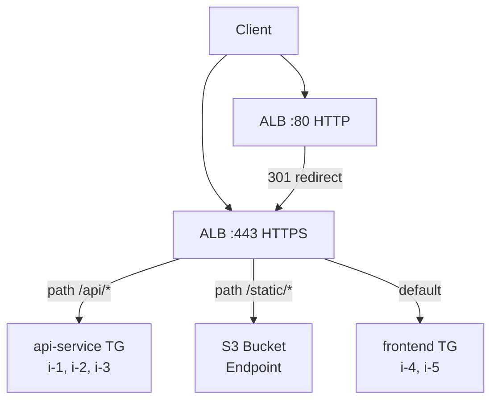
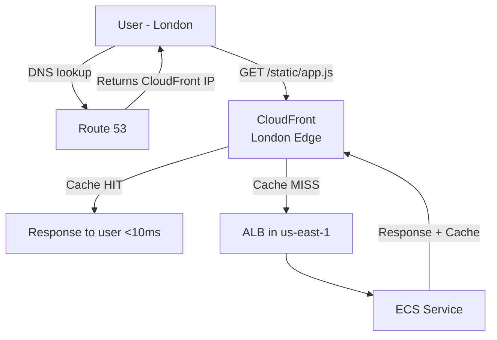

## Keywords in This File
{: .no_toc }

| # | Keyword | Weight |
|---|---------|--------|
| 12 | [Cloud Load Balancing](#cloud-load-balancing) | ★★☆ |
| 13 | [CDN and DNS in the Cloud](#cdn-and-dns-in-the-cloud) | ★★☆ |

---

# Cloud Load Balancing

**Interview Weight:** ★★☆ - Core availability component.
Load balancers distribute traffic across multiple instances.
They are used in every production cloud architecture.
Understanding ALB vs NLB, health checks, and SSL termination
is expected at senior level.

---

### 🎯 Model Answer

**30 seconds:**

> A load balancer distributes incoming traffic across multiple
> backend instances for availability and scalability. ALB
> (Application Load Balancer) operates at Layer 7 (HTTP):
> it can route by URL path, host header, and HTTP method.
> NLB (Network Load Balancer) operates at Layer 4 (TCP/UDP):
> ultra-low latency, preserves client IP, handles millions
> of requests/second. Health checks automatically remove
> unhealthy instances from rotation.

**3 minutes:**

> AWS Load Balancer types:
>
> ALB (Application LB) - Layer 7:
> - HTTP/HTTPS, WebSocket
> - Path-based routing: /api/* -> API service,
>   /static/* -> S3 or static server
> - Host-based routing: api.example.com -> API,
>   app.example.com -> frontend
> - Header/query routing: canary deployments
> - SSL termination: ALB handles TLS, backends use HTTP
> - Slowest of three but most features
>
> NLB (Network LB) - Layer 4:
> - TCP, UDP, TLS
> - Static IP per AZ (predictable DNS for allowlisting)
> - Preserves source IP
> - Very low latency (< 100 microseconds)
> - Use: gaming, IoT, real-time, or when static IP required
>
> CLB (Classic LB) - legacy:
> - Avoid for new deployments
>
> Gateway LB (GWLB):
> - Transparent bump-in-the-wire for virtual appliances
>   (firewalls, IDS/IPS)
>
> Health checks:
> - ALB: HTTP check on a path (e.g., /health)
>   unhealthy threshold = 2 failures -> deregistered
> - Deregistered but in-flight requests complete
>   (connection draining)

**Blank Mind Recovery:**

**(1) Two types:** "ALB: Layer 7, HTTP routing by path/host.
NLB: Layer 4, ultra-low latency, static IP."

**(2) ALB routing:** "Path: /api -> service A, /static -> S3.
Host: api.example.com -> service A."

**(3) SSL:** "ALB terminates TLS. Backends use HTTP.
Renew cert in ACM (auto-renews)."

---

### 📘 Concept Explanation

**ALB Path-Based Routing:**

```
INCOMING REQUEST: POST /api/v2/orders HTTP/1.1
                  Host: www.example.com

ALB LISTENER RULES (evaluated in order):
  Rule 1: if path = /api/*
    -> Target Group: api-service (ECS tasks)
  Rule 2: if path = /static/*
    -> Target Group: static-s3 (S3 bucket endpoint)
  Rule 3: if host = admin.example.com
    -> Target Group: admin-service
  Rule 4: default
    -> Target Group: frontend-service

RESULT: rule 1 matches -> api-service receives request
```

> **Code walkthrough:** This example demonstrates the core pattern in action. The key mechanism shows how the concept works in practice. Study the structure to understand the essential behavior and common usage.

**Blue-Green Deployment via ALB Weights:**

```
INITIAL: 100% Blue (v1), 0% Green (v2)

CANARY PHASE:
  Blue:  90%  (stable v1)
  Green: 10%  (new v2, monitoring errors/latency)

ROLLOUT:
  Blue: 50% | Green: 50% (if metrics OK)
  Blue: 0%  | Green: 100% (complete cutover)
  Blue TG deregistered -> Blue instances stopped

ROLLBACK (if Green has errors):
  Revert weights: Blue 100%, Green 0%
  No DNS change needed (ALB does it instantly)
```

> **Code walkthrough:** This example demonstrates the core pattern in action. The key mechanism shows how the concept works in practice. Study the structure to understand the essential behavior and common usage.

---

### 💻 Code Example

```hcl
# TERRAFORM: ALB with path-based routing
# and ACM certificate for HTTPS

resource "aws_lb" "app" {
  name               = "app-alb"
  load_balancer_type = "application"
  # Spans all public subnets (multi-AZ):
  subnets = var.public_subnet_ids
  security_groups = [aws_security_group.alb.id]
}

# Target Groups:
resource "aws_lb_target_group" "api" {
  name        = "api-service"
  port        = 8080
  protocol    = "HTTP"
  vpc_id      = var.vpc_id
  target_type = "ip"  # For ECS Fargate

  health_check {
    path                = "/health"
    healthy_threshold   = 2
    unhealthy_threshold = 3
    interval            = 30
    timeout             = 5
    matcher             = "200"
  }

  deregistration_delay = 30
  # 30s for in-flight requests to complete on deregister
}

resource "aws_lb_target_group" "frontend" {
  name        = "frontend-service"
  port        = 3000
  protocol    = "HTTP"
  vpc_id      = var.vpc_id
  target_type = "ip"
  health_check { path = "/" }
}

# HTTPS Listener (port 443):
resource "aws_lb_listener" "https" {
  load_balancer_arn = aws_lb.app.arn
  port              = 443
  protocol          = "HTTPS"
  ssl_policy        = "ELBSecurityPolicy-TLS13-1-2-2021-06"
  # ACM certificate - auto-renews:
  certificate_arn = aws_acm_certificate_validation.cert.certificate_arn

  # Default: frontend
  default_action {
    type             = "forward"
    target_group_arn = aws_lb_target_group.frontend.arn
  }
}

# Path-based routing rules:
resource "aws_lb_listener_rule" "api" {
  listener_arn = aws_lb_listener.https.arn
  priority     = 100  # Lower = evaluated first

  condition {
    path_pattern { values = ["/api/*"] }
  }
  action {
    type             = "forward"
    target_group_arn = aws_lb_target_group.api.arn
  }
}

# HTTP to HTTPS redirect:
resource "aws_lb_listener" "http_redirect" {
  load_balancer_arn = aws_lb.app.arn
  port              = 80
  protocol          = "HTTP"
  default_action {
    type = "redirect"
    redirect {
      port        = "443"
      protocol    = "HTTPS"
      status_code = "HTTP_301"
    }
  }
}

# WEIGHTED ROUTING for canary deployment:
resource "aws_lb_listener_rule" "api_canary" {
  listener_arn = aws_lb_listener.https.arn
  priority     = 99

  condition {
    path_pattern { values = ["/api/*"] }
  }
  action {
    type = "forward"
    forward {
      target_group {
        arn    = aws_lb_target_group.api_v1.arn
        weight = 90
      }
      target_group {
        arn    = aws_lb_target_group.api_v2.arn
        weight = 10
      }
    }
  }
}
```

> **Code walkthrough:** The Terraform creates an ALB with
> three listeners: HTTPS (443), HTTP redirect (80), and the
> API path rule. The ssl_policy `ELBSecurityPolicy-TLS13-1-2-2021-06`
> enforces TLS 1.2+ and disables weak ciphers - using the
> default policy often means accepting TLS 1.0 which is
> deprecated. The `deregistration_delay = 30` ensures in-flight
> requests complete before the target is removed from rotation
> (without it, active connections drop with a connection reset).
> The health check `unhealthy_threshold = 3` means a target needs
> 3 consecutive failures before being marked unhealthy - too
> sensitive a threshold causes flapping during transient issues.
> The weighted routing rule shows canary deployment: 90% to v1,
> 10% to v2, adjustable without redeployment.

---

### 🎓 Answers by Seniority

**Junior / Mid:**

> "A load balancer distributes traffic across multiple servers.
> AWS has ALB for HTTP traffic (Layer 7, routing by path or
> host) and NLB for TCP traffic (Layer 4, ultra-low latency).
> Health checks detect unhealthy instances and stop sending
> them traffic. SSL termination at the ALB means the backends
> don't need to handle TLS certificates."

---

**Senior / Staff:**

> "Load balancer selection drives architecture. ALB is the
> right default for HTTP microservices: path-based routing
> enables multiple services behind one ALB (reducing cost),
> weighted target groups enable canary deployments without
> DNS changes, and the access log provides per-request
> latency data. NLB is the right choice when you need
> static IPs for network allowlisting (no DNS resolution
> latency), sub-millisecond latency for financial systems,
> or UDP support. The common ALB mistake: too-aggressive
> deregistration_delay (low value) causes connection resets
> for long-lived connections like WebSockets or gRPC streams."

---

### ⚠️ Common Misconceptions

**Misconception 1: "ALB distributes traffic evenly across instances."**

ALB uses least-outstanding-requests by default. An instance
handling a long database query holds more outstanding requests
than instances handling fast in-memory operations - so ALB
routes new requests away from the slow instance. Round-robin
was the original algorithm but least-outstanding-requests
is better for heterogeneous workloads. If you need strict
round-robin, it can be configured.

**Misconception 2: "SSL termination at the ALB means traffic
is unencrypted end-to-end."**

ALB can be configured for end-to-end encryption: HTTPS
listener to ALB (encrypted) and HTTPS from ALB to backends
(encrypted). SSL termination (decryption + re-encryption)
adds minimal latency but simplifies certificate management.
For regulated workloads (PCI-DSS, HIPAA), end-to-end
encryption is often required.

---

### 🚨 Failure Modes and Diagnosis

**Failure 1: 502 Bad Gateway from ALB**

*Symptom:* Users see 502 errors. ALB logs show target
response code 502.

*Root cause:* Target returned an error response, or
target closed the connection before ALB could establish it
(deployment race condition, application crash, OOM).

*Diagnosis:*
```bash
# Enable ALB access logs to S3, then query:
# Athena query on ALB access logs:
# SELECT target_ip, target_port,
#   elb_status_code, target_status_code, count(*)
# FROM alb_logs
# WHERE elb_status_code = '502'
# GROUP BY 1,2,3,4
# ORDER BY 5 DESC

# Check target health:
aws elbv2 describe-target-health \
  --target-group-arn arn:aws:elasticloadbalancing:...
# Look for: reason = Target.Timeout,
#           Target.ResponseCodeMismatch
```

> **Code walkthrough:** This example demonstrates the core pattern in action. The key mechanism shows how the concept works in practice. Study the structure to understand the essential behavior and common usage.

---

**Failure 2: Health check flapping causes traffic disruption**

*Symptom:* Instances cycle in/out of service. Users
see intermittent errors.

*Root cause:* Health check timeout too low, endpoint
takes > threshold time to respond under load.

*Fix:* Increase timeout and interval. Add a dedicated
lightweight `/health` endpoint (does NOT hit database).
Set `healthy_threshold = 2` and `unhealthy_threshold = 3`
to require multiple consecutive failures before deregistering.

---

### 🎯 Interview Deep-Dive

| Category | Count | Coverage |
|---|---|---|
| Conceptual | 2 | ALB vs NLB vs CLB, connection draining, health checks |
| Trade-off | 2 | ALB vs API Gateway, sticky sessions |
| Failure Mode | 2 | 502/503 diagnosis, health check grace period |
| Debugging | 1 | ALB access log analysis |
| Behavioral | 2 | Multi-service ALB routing, incident diagnosis |

**Q1. When would you use an ALB vs NLB vs CLB, and why is CLB
considered legacy?**

ALB (Application Load Balancer - Layer 7):
- HTTP/HTTPS/gRPC traffic
- Path-based routing: `/api` -> service A, `/web` -> service B
- Host-based routing: `api.example.com` vs `admin.example.com`
- Request-level features: sticky sessions, redirect rules,
  weighted routing, Lambda as target
- Use for: microservices, REST APIs, web applications

NLB (Network Load Balancer - Layer 4):
- TCP/UDP/TLS traffic with no HTTP awareness
- Preserves client source IP natively (ALB needs X-Forwarded-For)
- Static Elastic IP per AZ (ALB uses DNS)
- Ultra-low latency (< 100 microseconds vs ALB ~1-5ms)
- Use for: gaming, VoIP, financial trading, TCP-based protocols,
  services that require a static IP for allowlisting

CLB (Classic Load Balancer):
- Pre-2016 legacy, lacks path-based routing
- Higher cost, fewer features than ALB
- Reason to avoid: AWS will eventually deprecate it

*What separates good from great:* Knowing that NLB with TLS
termination (NLB + ACM) provides end-to-end encryption with
static IP, which ALB cannot provide. Financial services with
partner allowlisting requirements often need NLB.

---

**Q2. What is connection draining (deregistration delay) and
what happens without it?**

Connection draining: when a target is deregistered from an ALB/NLB
(scale-down, rolling deploy, health check failure), the load
balancer waits for in-flight connections to complete before
closing them. Default: 300 seconds.

Without connection draining:
```
Deploy new version -> ALB removes old instance
In-flight requests: ECONNRESET (connection reset)
User sees: 500 error or connection failure mid-request
```

> **Code walkthrough:** This example demonstrates the core pattern in action. The key mechanism shows how the concept works in practice. Study the structure to understand the essential behavior and common usage.

With connection draining:
```
Deploy new version -> ALB marks old instance draining
In-flight requests: complete normally (up to 300s)
New requests: routed to new instances only
Old instance: deregistered after all connections close
```

> **Code walkthrough:** This example demonstrates the core pattern in action. The key mechanism shows how the concept works in practice. Study the structure to understand the essential behavior and common usage.

Tuning:
```hcl
resource "aws_lb_target_group" "app" {
  deregistration_delay = 30  # shorter for fast requests
  # 300s default wastes time for APIs with < 5s max response
  # Match to your p99.9 request duration
}
```

> **Code walkthrough:** This example demonstrates the core pattern in action. The key mechanism shows how the concept works in practice. Study the structure to understand the essential behavior and common usage.

*What separates good from great:* Setting deregistration delay to
match actual request duration. A 300s delay on an API with 2s max
response time slows deploys by 298 unnecessary seconds per batch.
p99.9 response time + 10% buffer is the right value.

---

**Q3. How do you implement path-based routing on an ALB for
microservices and what are the rule limits?**

```bash
# ALB routing architecture:
# Client -> ALB (one per environment) -> target groups

# Create target groups per service:
aws elbv2 create-target-group \
  --name api-service --protocol HTTP --port 8080 --vpc-id $VPC
aws elbv2 create-target-group \
  --name web-service --protocol HTTP --port 3000 --vpc-id $VPC

# Add routing rules (priority order matters):
aws elbv2 create-rule \
  --listener-arn $LISTENER_ARN \
  --priority 10 \
  --conditions '[{"Field":"path-pattern","Values":["/api/*"]}]' \
  --actions '[{"Type":"forward","TargetGroupArn":"'$API_TG_ARN'"}]'

# Default action (priority 1000, catches everything else):
aws elbv2 modify-listener \
  --listener-arn $LISTENER_ARN \
  --default-actions '[{"Type":"forward","TargetGroupArn":"'$WEB_TG_ARN'"}]'
```

> **Code walkthrough:** This example demonstrates the core pattern in action. The key mechanism shows how the concept works in practice. Study the structure to understand the essential behavior and common usage.

Limits:
- 100 rules per listener (default, can request increase)
- Rules evaluated in priority order (lowest number first)
- Last rule (default action) is a catch-all

*What separates good from great:* Knowing header-based routing for
cannary deploys: `X-Version: canary` header routes 5% of requests
to the new version target group while the old version handles the
rest. Requires no DNS change or feature flags.

---

**Q4. DEBUGGING: Your ALB returns 502 errors. Walk through
your diagnosis systematically.**

```bash
# 502 = ALB received an invalid response from the target
# (NOT a client error, NOT ALB timeout)

# Step 1: Check ALB access logs:
# Enable if not already:
aws elbv2 modify-load-balancer-attributes \
  --load-balancer-arn $ALB_ARN \
  --attributes Key=access_logs.s3.enabled,Value=true \
               Key=access_logs.s3.bucket,Value=my-alb-logs

# Query logs (Athena):
SELECT request_url, target_status_code, elb_status_code,
       target_processing_time, error_reason
FROM alb_logs
WHERE elb_status_code = '502'
LIMIT 100;

# Key fields:
# target_status_code = '-': target did not respond at all
# error_reason = 'Target.ResponseCodeMismatch': app returned
#   non-HTTP response (binary, closed connection early)

# Step 2: Check target health:
aws elbv2 describe-target-health \
  --target-group-arn $TG_ARN
# unhealthy: health check failing, no traffic should flow
# healthy but getting 502: app issue on healthy instances

# Step 3: Check for connection reset:
# SSH to target, curl the health endpoint directly:
curl -v http://localhost:8080/health
# If timeout: app is not responding to keep-alive connections
# ALB keeps connection open; app closes it; ALB sends 502
```

> **Code walkthrough:** This example demonstrates the core pattern in action. The key mechanism shows how the concept works in practice. Study the structure to understand the essential behavior and common usage.

*What separates good from great:* The keep-alive connection reset
cause. ALB reuses connections to backends. If the app has a lower
keepalive timeout than the ALB (ALB default: 60s), the app closes
the connection just as ALB sends a new request. Set app keepalive
timeout higher than ALB idle timeout.

---

**Q5. How does NLB preserve client source IP and why does
it matter?**

NLB operates at Layer 4 and does NOT terminate TCP connections
(in TCP mode). It passes the connection directly to the backend.
The backend sees the actual client IP in the TCP source address.

ALB terminates the TCP connection and opens a new connection
to the backend. Backend sees ALB's IP, not client's. Client IP
is in the `X-Forwarded-For` header (HTTP header, not TCP).

When source IP preservation matters:
- **IP-based allowlisting**: backend needs to verify client IP
  against an allow list. ALB's header can be spoofed; NLB's TCP
  source cannot.
- **Rate limiting by IP**: WAF/nginx rate limits based on IP
  work correctly only with real source IP
- **Compliance logging**: some regulations require logging
  the actual client network address at the TCP level
- **Financial partner integration**: partner firewalls allowlist
  specific IPs; NLB's static EIP per AZ is allowlistable

*What separates good from great:* Knowing the NLB TLS offload mode
difference. With TLS passthrough (TCP mode), source IP is preserved
all the way to the backend. With NLB TLS termination (TLS mode),
NLB terminates TLS but still preserves source IP at TCP level
because it still proxies at Layer 4.

---

**Q6. TRADE-OFF: ALB vs API Gateway for REST APIs. When do
you choose each?**

| Dimension | ALB | API Gateway |
|---|---|---|
| Request rate | Up to millions/s | 10,000 req/s (default limit) |
| Latency added | ~1-5ms | ~10-50ms (additional hop) |
| Auth integration | None native | IAM, Cognito, Lambda authorizer |
| Rate limiting | None | Built-in throttling per API key |
| Request transformation | None | Mapping templates (Velocity) |
| WebSocket | Yes | Yes (API GW WebSocket) |
| Cost | Per LCU hour | Per million requests + data |
| Caching | None | Built-in response caching |

Choose ALB when:
- Already have ECS/EKS services with standard HTTP routing
- Request rate may exceed API Gateway limits
- Lowest possible latency required
- No need for request transformation or API-level auth

Choose API Gateway when:
- Serverless (Lambda) backend
- Need built-in auth (Cognito/IAM), throttling, usage plans
- API product (external developer API with keys and quotas)
- Need request/response transformation

*What separates good from great:* Knowing you can use both: API
Gateway for external-facing API management, routed to ALB for the
actual backend. API Gateway handles auth, throttling, and versioning;
ALB handles internal routing to microservices.

---

**Q7. What is a sticky session and when is using it a mistake?**

Sticky sessions (session affinity): ALB routes subsequent requests
from the same client to the same backend target, using a cookie
(`AWSALB` for ALB, `AWSALBAPP` for application-managed).

When it is appropriate:
- Legacy stateful applications that store session data in memory
  and cannot be migrated immediately
- Stateful WebSocket connections where the protocol requires
  all messages go to one backend process

When it is a mistake (most cases):
- Breaks horizontal scaling: all requests from a "heavy" user go
  to one instance, starving it while others are idle
- Hides the real bug: the real problem is that the app stores state
  locally. Sticky sessions mask this instead of fixing it.
- Deploy complexity: can't drain one instance without dropping
  sticky sessions from all users on that instance

Right fix: move session state to Redis/ElastiCache. Then disable
sticky sessions. Any instance handles any request.

*What separates good from great:* Treating sticky sessions as
a temporary bridge during a migration, not a permanent solution.
The work items: move session store to ElastiCache, update app
to use `spring-session-data-redis` or equivalent, remove stickiness.

---

**Q8. How do you configure an ALB to route traffic across
both ECS and Lambda backends?**

```hcl
# ALB supports multiple target types in different target groups:
# instance, ip, lambda - NOT mixed within one TG

# ECS target group (ip type for Fargate):
resource "aws_lb_target_group" "ecs_service" {
  name        = "api-ecs"
  port        = 8080
  protocol    = "HTTP"
  vpc_id      = var.vpc_id
  target_type = "ip"  # Fargate uses IP targeting
}

# Lambda target group:
resource "aws_lb_target_group" "lambda_fn" {
  name        = "api-lambda"
  target_type = "lambda"
  # No port/protocol needed for Lambda
}

# Permission for ALB to invoke Lambda:
resource "aws_lambda_permission" "alb" {
  statement_id  = "AllowALBInvoke"
  action        = "lambda:InvokeFunction"
  function_name = aws_lambda_function.api.function_name
  principal     = "elasticloadbalancing.amazonaws.com"
  source_arn    = aws_lb_target_group.lambda_fn.arn
}

# Route: /async/* -> Lambda, everything else -> ECS
resource "aws_lb_listener_rule" "async" {
  listener_arn = aws_lb_listener.https.arn
  priority     = 10
  condition { path_pattern { values = ["/async/*"] } }
  action {
    type             = "forward"
    target_group_arn = aws_lb_target_group.lambda_fn.arn
  }
}
```

> **Code walkthrough:** This example demonstrates the core pattern in action. The key mechanism shows how the concept works in practice. Study the structure to understand the essential behavior and common usage.

*What separates good from great:* Knowing that Lambda targets have
a 1MB request/response payload limit through ALB. Requests with
large bodies must go to ECS/EC2 targets. This constraint often
drives the Lambda vs ECS routing boundary.

---

**Q9. BEHAVIORAL: Your ALB access logs show 40% of requests
returning 503 for 15 minutes. Walk through your investigation.**

503 from ALB = no healthy targets available to route the request.

Step 1: Check target health immediately:
```bash
aws elbv2 describe-target-health --target-group-arn $TG_ARN
# All "unhealthy"? -> health check failure, not app crash
# Partial unhealthy? -> rolling failure
```

> **Code walkthrough:** This example demonstrates the core pattern in action. The key mechanism shows how the concept works in practice. Study the structure to understand the essential behavior and common usage.

Step 2: Check health check endpoint from a target directly:
```bash
# SSH to a target instance:
curl -v http://localhost:8080/health
# timeout -> app is unresponsive
# 200 OK -> health check config problem (wrong path/port)
```

> **Code walkthrough:** This example demonstrates the core pattern in action. The key mechanism shows how the concept works in practice. Study the structure to understand the essential behavior and common usage.

Step 3: Correlate with deployment or config change:
```bash
# Check recent deploys:
aws ecs describe-services --cluster prod --services api
# runningCount vs desiredCount, recent deployments

# Check ASG activity:
aws autoscaling describe-scaling-activities --auto-scaling-group-name prod-asg
# Recent launch failures?
```

> **Code walkthrough:** This example demonstrates the core pattern in action. The key mechanism shows how the concept works in practice. Study the structure to understand the essential behavior and common usage.

Step 4: Immediate mitigation:
- Roll back the last deployment if one occurred
- Temporarily increase health check `unhealthyThreshold` to give
  targets more time to recover
- Add capacity if load spike is the cause

*What separates good from great:* Distinguishing 503 (no healthy
targets) from 502 (target responding incorrectly). 503 investigation
starts with target registration and health checks. 502 investigation
starts with what the target is returning. Different root causes,
different playbooks.

---

### ⚖️ Comparison Table

| Feature | ALB | NLB | CLB (legacy) |
|---------|-----|-----|--------------|
| OSI Layer | 7 (HTTP) | 4 (TCP/UDP) | 4/7 |
| Latency | ~1-5ms | < 100 microseconds | ~1-5ms |
| Path-based routing | Yes | No | No |
| Host-based routing | Yes | No | No |
| WebSocket support | Yes | Yes | Limited |
| Static IP | No (DNS) | Yes (per AZ) | No |
| Source IP preservation | Via X-Forwarded-For | Native | No |
| Protocols | HTTP/HTTPS/gRPC | TCP/UDP/TLS | HTTP/HTTPS/TCP |
| Use case | HTTP microservices | Low-latency, static IP | Avoid |

---

### 🏛️ System Design

*(Omit: ★★☆ keyword - system design section is for ★★★ only.)*

---

### 📊 Diagram

```
ALB PATH-BASED ROUTING:

Client -> ALB:443 (HTTPS)
  |
  +-- /api/*     -> api-service TG  (ECS)
  |                 (instances: i-1, i-2, i-3)
  |
  +-- /static/*  -> S3 bucket endpoint
  |
  +-- default    -> frontend TG     (ECS)
                    (instances: i-4, i-5)

ALB:80 -> redirect to :443 (HTTP 301)
```



> **Diagram walkthrough:** Traffic enters the ALB on port 443
> (HTTPS). The listener rules evaluate path patterns in priority
> order: /api/* routes to the API ECS service's target group,
> /static/* routes to S3 (bypassing any compute), and everything
> else goes to the frontend. The HTTP 80 listener only redirects
> to HTTPS - no traffic is processed unencrypted. Health checks
> continuously probe each instance's /health endpoint; if 3
> checks fail, the instance is deregistered and traffic
> redistributes to healthy targets.

---

---

---

### 💻 Code Example

*(Omit: this concept does not have a programmatic interface that can be demonstrated in code. The conceptual explanation above is sufficient.)*


---

### 🏛️ System Design

*(Omit: system design diagram not applicable for this concept - see ★★★ keywords for full system design coverage.)*


---

### ⚖️ Comparison Table

*(Omit: this is a ★☆☆ foundational concept with no direct alternatives to compare - see higher-difficulty keywords for trade-off analysis.)*


---

### 📊 Diagram

*(Omit: no standalone visual diagram required for this concept - the explanations and code examples above provide sufficient clarity.)*


# CDN and DNS in the Cloud

**Interview Weight:** ★★☆ - Core delivery components.
CDNs and DNS configuration are required knowledge for
public-facing cloud applications. CloudFront, Route 53,
and DNS routing policies are commonly discussed in
cloud architecture interviews.

---

### 🎯 Model Answer

**30 seconds:**

> A CDN (Content Delivery Network) caches content at edge
> locations closer to users, reducing latency and origin load.
> CloudFront has 400+ edge locations globally. DNS routes domain
> names to IP addresses. Route 53 provides DNS with routing
> policies: simple, weighted (canary), latency-based (nearest
> region), failover (active-passive HA), and geolocation.
> The combination: DNS routes to CloudFront, CloudFront
> caches and routes to your origin.

**3 minutes:**

> CDN (CloudFront):
> - Edge locations cache content near users
> - Cache hit: response from edge (< 10ms)
> - Cache miss: request forwarded to origin (ALB, S3, API GW)
> - Cache key: URL, query strings, headers
>   (configure carefully - wrong key = caching user-specific data)
> - Behaviors: per path pattern cache rules
>   /static/* -> S3, cache 1 year
>   /api/* -> ALB, no cache
> - Lambda@Edge / CloudFront Functions: run code at edge
>   (auth, URL rewriting, A/B testing)
> - WAF integration: block malicious requests at edge
>   before they reach origin
>
> Route 53 routing policies:
> - Simple: one record, one IP
> - Weighted: 90% to v1, 10% to v2 (canary)
> - Latency: route to AWS region with lowest latency
>   for user's location
> - Failover: primary active, secondary passive
>   health check on primary -> if unhealthy, use secondary
> - Geolocation: route EU users to EU region,
>   US users to US region (data sovereignty)
> - Geoproximity: shift traffic between regions

**Blank Mind Recovery:**

**(1) CDN:** "Edge caches content near user. Cache miss
-> origin. Cache hit -> fast response from edge."

**(2) Route 53 failover:** "Primary + secondary.
Health check on primary. If fails -> secondary."

**(3) CloudFront key rule:** "Static: cache long (1 year,
immutable). API: no cache or very short TTL."

---

### 📘 Concept Explanation

**CloudFront Cache Decision:**

```
USER REQUEST: GET /static/app.js
              Location: London, UK

1. Route 53 resolves cdn.example.com -> CloudFront
2. Request routed to nearest edge: London PoP
3. Edge cache lookup: does /static/app.js exist?
   HIT:  Serve from edge cache (1-5ms, ~100ms savings)
   MISS: Forward request to origin (ALB in us-east-1)
         Cache response at edge for next request

CACHE KEY (matters for correctness):
  Default: URL path only
  Custom: URL + specific headers + query params
  WRONG: cache /profile if it returns user-specific data
    -> User A's profile served to User B
  RIGHT: /profile -> no cache (dynamic, user-specific)
         /static/app.js -> cache 1 year (immutable file)
```

> **Code walkthrough:** This example demonstrates the core pattern in action. The key mechanism shows how the concept works in practice. Study the structure to understand the essential behavior and common usage.

**Route 53 Failover:**

```
ACTIVE-PASSIVE FAILOVER:
  Primary record: ALB in us-east-1
    Health check: HTTP GET /health -> must return 200
  Secondary record: ALB in eu-west-1 (standby)

NORMAL: DNS returns us-east-1 ALB IP
FAILURE: Health check fails 3 consecutive times
         DNS switches to eu-west-1 ALB
         TTL = 60s (time for clients to re-resolve)
         Full failover: 60-180s (check interval + TTL)
```

> **Code walkthrough:** This example demonstrates the core pattern in action. The key mechanism shows how the concept works in practice. Study the structure to understand the essential behavior and common usage.

---

### 💻 Code Example

```hcl
# TERRAFORM: CloudFront + Route 53 setup

# CloudFront distribution:
resource "aws_cloudfront_distribution" "app" {
  enabled             = true
  default_root_object = "index.html"
  aliases             = ["app.example.com"]

  # Origin 1: S3 for static assets
  origin {
    origin_id   = "s3-static"
    domain_name = aws_s3_bucket.static.bucket_domain_name
    s3_origin_config {
      origin_access_identity =
        aws_cloudfront_origin_access_identity.oai.
          cloudfront_access_identity_path
    }
  }

  # Origin 2: ALB for API
  origin {
    origin_id   = "alb-api"
    domain_name = aws_lb.app.dns_name
    custom_origin_config {
      http_port              = 80
      https_port             = 443
      origin_protocol_policy = "https-only"
      origin_ssl_protocols   = ["TLSv1.2"]
    }
  }

  # Default behavior: static assets, cache 1 year
  default_cache_behavior {
    allowed_methods        = ["GET", "HEAD"]
    cached_methods         = ["GET", "HEAD"]
    target_origin_id       = "s3-static"
    viewer_protocol_policy = "redirect-to-https"

    forwarded_values {
      query_string = false
      cookies { forward = "none" }
      # Don't include query strings in cache key for static
    }
    min_ttl     = 0
    default_ttl = 86400    # 1 day
    max_ttl     = 31536000 # 1 year
  }

  # /api/* behavior: no caching
  ordered_cache_behavior {
    path_pattern           = "/api/*"
    allowed_methods        = [
      "GET", "HEAD", "OPTIONS",
      "PUT", "POST", "PATCH", "DELETE"]
    cached_methods         = ["GET", "HEAD"]
    target_origin_id       = "alb-api"
    viewer_protocol_policy = "redirect-to-https"

    forwarded_values {
      query_string = true
      headers      = ["Authorization", "Host"]
      # Forward Auth header so API can authenticate
      cookies { forward = "all" }
    }
    min_ttl     = 0
    default_ttl = 0    # No caching for API
    max_ttl     = 0
  }

  viewer_certificate {
    acm_certificate_arn =
      aws_acm_certificate_validation.cert.certificate_arn
    ssl_support_method  = "sni-only"
    # CloudFront certs must be in us-east-1 (global)
  }

  restrictions {
    geo_restriction { restriction_type = "none" }
  }

  web_acl_id = aws_wafv2_web_acl.app.arn
  # WAF at edge: blocks malicious traffic before origin
}

# Route 53: point domain to CloudFront
resource "aws_route53_record" "app" {
  zone_id = aws_route53_zone.main.zone_id
  name    = "app.example.com"
  type    = "A"

  alias {
    name                   = aws_cloudfront_distribution.app.domain_name
    zone_id                = aws_cloudfront_distribution.app.hosted_zone_id
    evaluate_target_health = true
  }
  # Alias record: no charge per query (unlike CNAME)
  # Required for CloudFront, ALB, S3 website endpoints
}

# Route 53 latency-based routing (multi-region):
resource "aws_route53_record" "api_us" {
  zone_id        = aws_route53_zone.main.zone_id
  name           = "api.example.com"
  type           = "A"
  set_identifier = "us-east-1"

  latency_routing_policy {
    region = "us-east-1"
  }
  alias {
    name                   = aws_lb.us.dns_name
    zone_id                = aws_lb.us.zone_id
    evaluate_target_health = true
  }
}

resource "aws_route53_record" "api_eu" {
  zone_id        = aws_route53_zone.main.zone_id
  name           = "api.example.com"
  type           = "A"
  set_identifier = "eu-west-1"

  latency_routing_policy {
    region = "eu-west-1"
  }
  alias {
    name                   = aws_lb.eu.dns_name
    zone_id                = aws_lb.eu.zone_id
    evaluate_target_health = true
  }
}
# Result: US users routed to us-east-1 (lower latency)
#         EU users routed to eu-west-1 (lower latency)
```

> **Code walkthrough:** Two CloudFront origin behaviors
> handle static vs API traffic differently. The static behavior
> (default) forwards no query strings or headers to S3 and
> caches up to 1 year - this means a user in Tokyo gets
> app.js from the nearest edge rather than crossing the
> Pacific to the S3 bucket. The /api/* behavior forwards
> the Authorization header and all cookies to the ALB and
> sets max_ttl=0 (no caching) - critical, because caching
> API responses that include user data would serve one user's
> data to another. The ACM certificate must be in us-east-1
> even if the distribution serves global traffic - a common
> gotcha. The latency-based routing creates two records for
> api.example.com and Route 53 measures latency from the
> user's location to each region to decide which record to return.

---

### 🎓 Answers by Seniority

**Junior / Mid:**

> "A CDN caches content at edge locations near users.
> CloudFront has hundreds of edge locations globally.
> When a user requests a file, CloudFront checks its cache.
> If found, it serves from the edge. If not, it requests
> from the origin (S3 or ALB). Route 53 is AWS's DNS service.
> It supports routing policies like failover (switch to backup
> on failure) and latency-based (route to nearest region)."

---

**Senior / Staff:**

> "CDN cache key design is critical and often wrong. The
> most dangerous mistake: including cookies or session tokens
> in the cache key, then forgetting to configure CloudFront
> to vary on those keys. Result: user A's authenticated
> response is served to user B. Static assets should be
> cached with immutable filenames (hash in filename like
> app.abc123.js) and max-age=31536000 in Cache-Control.
> API endpoints should be no-store. CloudFront Functions
> for auth at edge (JWT validation) can block unauthenticated
> requests before they consume origin capacity - important
> for protecting expensive backend operations."

---

### ⚠️ Common Misconceptions

**Misconception 1: "CloudFront is only for static content."**

CloudFront proxies dynamic API traffic too, providing
DDoS protection, WAF integration, and global anycast
routing even when not caching. Many architectures put
all traffic through CloudFront with cache-control headers
controlling what is cached vs forwarded. Lambda@Edge
enables custom logic at edge (authentication, A/B testing,
URL rewriting) without cold starts like Lambda.

**Misconception 2: "Low TTL means always fresh content."**

TTL=0 means CloudFront validates with the origin on every
request (conditional GET with ETag or Last-Modified). This
is different from bypassing the CDN. CloudFront still handles
the connection, DDoS protection, and compression. The origin
still receives every request (at reduced load, since
CloudFront uses connection reuse). For frequently changing
data: short TTL. For static versioned assets: 1-year TTL
with version in filename.

---

### 🚨 Failure Modes and Diagnosis

**Failure 1: CloudFront serving stale content after update**

*Symptom:* New deployment pushed. Some users still see
old version of app.js.

*Root cause:* Old app.js cached at CloudFront edge.
TTL has not expired.

*Fix:*
```bash
# Invalidate specific paths:
aws cloudfront create-invalidation \
  --distribution-id E1234567890 \
  --paths "/static/app.js" "/static/app.*.js"

# Better long-term fix:
# Include hash in filename: app.abc123.js
# Old and new can coexist in cache
# Invalidation not needed - new hash = new cache entry
# Old HTML references old hash, new HTML references new hash
```

> **Code walkthrough:** This example demonstrates the core pattern in action. The key mechanism shows how the concept works in practice. Study the structure to understand the essential behavior and common usage.

---

**Failure 2: Route 53 failover not triggering**

*Symptom:* Primary region down, but Route 53 still
returns primary record IP. Users cannot connect.

*Root cause:* Health check not configured, or health
check endpoint is returning 200 even when service is down
(health check too shallow).

*Diagnosis:*
```bash
# Check health check status:
aws route53 get-health-check-status \
  --health-check-id HEALTH-CHECK-ID
# Should show UNHEALTHY if primary is down

# Check health check configuration:
aws route53 get-health-check \
  --health-check-id HEALTH-CHECK-ID
# Verify: FailureThreshold, RequestInterval, Path
```

> **Code walkthrough:** This example demonstrates the core pattern in action. The key mechanism shows how the concept works in practice. Study the structure to understand the essential behavior and common usage.

*Fix:* Implement a deep health check that validates
the application can reach its database and dependencies.
A health check that only tests "is the web process running"
misses scenarios where the process is up but the database
is unreachable.

---

### 🎯 Interview Deep-Dive

| Category | Count | Coverage |
|---|---|---|
| Conceptual | 2 | CDN caching, OAC, DNS record types |
| Trade-off | 2 | TTL trade-offs, CloudFront vs S3 direct |
| Failure Mode | 2 | Stale cache post-deploy, SPA routing |
| Debugging | 1 | Diagnosing CloudFront cache headers |
| Behavioral | 2 | Regional latency, SPA deployment |

**Q1. How does a CDN cache work and what determines whether
a response is a cache hit or miss?**

CDN cache flow:
1. User in London requests `https://app.example.com/image.png`
2. DNS resolves to the nearest CloudFront edge PoP (London)
3. Edge checks cache: does it have a fresh copy of this object?
   - Cache HIT: returns stored copy instantly (no origin request)
   - Cache MISS: forwards request to origin, stores response,
     returns to user

Cache key (what determines hit vs miss):
- Default: URL path + query string (if configured)
- Can add: HTTP headers, cookies
- More cache key elements = more cache misses = less effective cache

TTL hierarchy (CloudFront):
1. Origin `Cache-Control: max-age=3600` header (highest priority
   if within CloudFront min/max TTL bounds)
2. CloudFront behaviour min TTL (floor)
3. CloudFront behaviour max TTL (ceiling)
4. CloudFront behaviour default TTL (when no Cache-Control header)

*What separates good from great:* Understanding that `Cache-Control:
no-cache` does NOT mean "never cache" - it means "must revalidate
with origin before serving." CloudFront will store the object but
send conditional requests (`If-None-Match`). `no-store` means
never cache at all.

---

**Q2. What is a CloudFront Origin Access Control (OAC) and
why should you use it instead of OAI?**

OAC (Origin Access Control) and OAI (Origin Access Identity) both
restrict S3 bucket access: only CloudFront can read objects,
not direct S3 URLs.

OAI (legacy):
- Uses a special CloudFront IAM identity
- Does not support SSE-KMS encrypted buckets without extra config
- Does not support all S3 regions
- Being deprecated by AWS

OAC (current):
- Uses SigV4 signing (requests to S3 are signed with OAC credentials)
- Supports SSE-KMS encrypted S3 buckets natively
- Supports all AWS regions and S3 features
- Supports POST/PUT requests (for S3 uploads through CloudFront)

Setup:
```hcl
resource "aws_cloudfront_origin_access_control" "s3" {
  name                              = "s3-oac"
  origin_access_control_origin_type = "s3"
  signing_behavior                  = "always"
  signing_protocol                  = "sigv4"
}
# S3 bucket policy allows cloudfront.amazonaws.com with OAC:
data "aws_iam_policy_document" "s3_oac" {
  statement {
    principals {
      type        = "Service"
      identifiers = ["cloudfront.amazonaws.com"]
    }
    actions   = ["s3:GetObject"]
    resources = ["${aws_s3_bucket.app.arn}/*"]
    condition {
      test     = "StringEquals"
      variable = "AWS:SourceArn"
      values   = [aws_cloudfront_distribution.app.arn]
    }
  }
}
```

> **Code walkthrough:** This example demonstrates the core pattern in action. The key mechanism shows how the concept works in practice. Study the structure to understand the essential behavior and common usage.

*What separates good from great:* The `AWS:SourceArn` condition
in the bucket policy. Without it, ANY CloudFront distribution
could access your bucket (if it has the OAC). The ARN condition
restricts access to your specific CloudFront distribution only.

---

**Q3. How do you implement cache invalidation in CloudFront
and what are its cost implications?**

```bash
# Invalidate specific paths:
aws cloudfront create-invalidation \
  --distribution-id $DIST_ID \
  --paths "/index.html" "/static/main.js"

# Invalidate all (use sparingly):
aws cloudfront create-invalidation \
  --distribution-id $DIST_ID \
  --paths "/*"

# Cost: first 1000 invalidation paths/month free,
# then $0.005 per path. Wildcard /* counts as 1 path.
```

> **Code walkthrough:** This example demonstrates the core pattern in action. The key mechanism shows how the concept works in practice. Study the structure to understand the essential behavior and common usage.

Better alternative: versioned asset filenames (cache-busting):
```html
<!-- Instead of invalidating /static/main.js: -->
<script src="/static/main.abc123.js"></script>
<!-- Hash changes on every build, each version has its own cache key -->
<!-- Never needs invalidation - old versions expire naturally -->
<!-- Only index.html needs short TTL or invalidation on deploy -->
```

> **Code walkthrough:** This example demonstrates the core pattern in action. The key mechanism shows how the concept works in practice. Study the structure to understand the essential behavior and common usage.

Recommended strategy:
- Static assets (`*.js`, `*.css`, fonts): `Cache-Control: max-age=31536000,
  immutable` with content-hash filenames. Never invalidate.
- HTML files: `Cache-Control: max-age=0, must-revalidate` or
  CloudFront default TTL=0. Short lived. Invalidate on deploy.

*What separates good from great:* The immutable flag. `Cache-Control:
immutable` tells browsers the object will never change at this URL.
Browser never revalidates even on hard refresh. Requires content-hash
in filename to guarantee uniqueness per version.

---

**Q4. DEBUGGING: CloudFront is serving stale content after a
deployment. How do you diagnose and fix?**

```bash
# Step 1: Check what CloudFront cached vs what origin has:
# Fetch from CloudFront with cache-status header:
curl -I -H "Cache-Control: no-cache" \
  https://app.example.com/static/main.js
# Response headers to check:
# X-Cache: Hit from cloudfront (served from cache)
# X-Cache: Miss from cloudfront (went to origin)
# Age: 3600 (cached for 3600 seconds so far)

# Step 2: Check origin directly:
curl -I https://my-origin.s3.amazonaws.com/static/main.js
# Compare ETag and Last-Modified

# Step 3: Is the new file actually at the origin?
# If S3: check the file timestamp
aws s3 ls s3://my-bucket/static/main.js

# Step 4: Force edge cache refresh (2 options):

# Option A: Invalidation (immediate but costs $):
aws cloudfront create-invalidation \
  --distribution-id $DIST_ID \
  --paths "/static/main.js"

# Option B: Wait for TTL expiry (free but slow)
# Next request after TTL will be a cache miss -> fresh content

# Root cause fix (permanent):
# Add content hash to filenames in build pipeline
# Set max-age=31536000 on hashed assets
# Only /index.html needs short TTL + invalidation on deploy
```

> **Code walkthrough:** This example demonstrates the core pattern in action. The key mechanism shows how the concept works in practice. Study the structure to understand the essential behavior and common usage.

*What separates good from great:* The permanent fix (content-hash
filenames) vs the reactive fix (invalidation). Invalidation is a
symptom treatment. The real solution eliminates the need for
invalidation for 99% of assets.

---

**Q5. What is Route 53 latency-based routing and when does
it route to a non-nearest region?**

Latency-based routing: Route 53 routes DNS queries to the region
with the lowest measured network latency from the user's location.
AWS continuously measures latency from thousands of global vantage
points to each AWS region.

Configuration:
```hcl
# Two records for same name, different regions:
resource "aws_route53_record" "api_us" {
  zone_id = var.zone_id
  name    = "api.example.com"
  type    = "A"
  set_identifier = "us-east-1"
  latency_routing_policy {
    region = "us-east-1"
  }
  # Points to ALB in us-east-1
}
resource "aws_route53_record" "api_eu" {
  zone_id = var.zone_id
  name    = "api.example.com"
  type    = "A"
  set_identifier = "eu-west-1"
  latency_routing_policy {
    region = "eu-west-1"
  }
  # Points to ALB in eu-west-1
}
```

> **Code walkthrough:** This example demonstrates the core pattern in action. The key mechanism shows how the concept works in practice. Study the structure to understand the essential behavior and common usage.

When a non-nearest region is chosen:
- The nearest region's record has a health check that is failing:
  Route 53 excludes it and falls back to the next-lowest latency
- Network conditions temporarily make the closer region slower
- The "nearest" region is geographic, not always lowest latency

*What separates good from great:* Combining latency routing with
health checks. Without health checks, Route 53 will route to a
region even if the ALB there is unhealthy. Health check + latency
routing = both fast AND resilient.

---

**Q6. What is the difference between A, CNAME, and ALIAS
records in Route 53, and when do you use each?**

| Record Type | Maps To | Root Domain? | Latency? |
|---|---|---|---|
| A | IPv4 address | Yes | None |
| CNAME | Another hostname | No | DNS resolution |
| ALIAS | AWS resource | Yes | None (direct) |

Key distinctions:

**CNAME limitations**:
- Cannot be used for root domain (`example.com`)
  Only `www.example.com` can be a CNAME
- Every resolution requires an extra DNS lookup (CNAME -> IP)

**ALIAS records** (Route 53-specific extension):
- Maps a hostname to an AWS resource (ALB, CloudFront, S3 website)
- Works at root domain
- Resolves directly (no extra DNS hop)
- Automatically updates if the ALB's IP changes
- Free queries (AWS resources, charged for external)

Practice:
```bash
# WRONG: CNAME at root domain
example.com CNAME my-alb.us-east-1.elb.amazonaws.com
# Error: cannot create CNAME at zone apex

# CORRECT: ALIAS at root domain
example.com ALIAS my-alb.us-east-1.elb.amazonaws.com
# Works because Route 53 resolves the ALB directly
```

> **Code walkthrough:** This example demonstrates the core pattern in action. The key mechanism shows how the concept works in practice. Study the structure to understand the essential behavior and common usage.

*What separates good from great:* Knowing that ALIAS records for
AWS resources are not standard DNS. They are a Route 53 extension.
External DNS providers (Cloudflare, etc.) use CNAME flattening
to achieve the same effect at the zone apex.

---

**Q7. TRADE-OFF: Long vs short TTLs in DNS and CDN. What are
the specific costs of each choice?**

Long TTLs (3600s DNS, 86400s CDN):
- Benefits: fewer origin requests, lower cost, faster user
  experience (cache hits serve sub-ms)
- Costs of long DNS TTL: DNS change propagation is slow.
  During a failover, users still resolve to old IP for TTL duration.
  For a 3600s TTL, failover takes up to 60 minutes globally.
- Costs of long CDN TTL: stale content after deploy until TTL
  expires or explicit invalidation

Short TTLs (60s DNS, 300s CDN):
- Benefits: fast propagation of changes, failover works in minutes
- Costs: more DNS queries (higher DNS cost + resolver load),
  more origin requests (lower cache hit rate, higher origin cost)

Practice:
- DNS TTL in normal operation: 300-3600s
- DNS TTL 24h before a planned migration: reduce to 60s
  to ensure fast cutover. Restore after migration.
- CDN TTL for static immutable assets: max (31536000s)
- CDN TTL for dynamic API responses: 0 (pass-through)
- CDN TTL for HTML (SPA index): 0 or short (300s)

*What separates good from great:* Reducing DNS TTL ahead of planned
migrations. This is a standard playbook step: lower TTL 24-48 hours
before the change, make the change, wait for propagation, then
raise TTL again. Reducing TTL after the change is too late.

---

**Q8. How do you configure CloudFront for a single-page
application (SPA) with client-side routing?**

The SPA routing problem: user navigates to `app.example.com/dashboard`.
CloudFront sees the path `/dashboard`, requests it from S3. S3 has
no file at that path (the file is `/index.html`). Returns 403 or 404.

Fix: custom error pages redirect all 403/404 to index.html:
```hcl
resource "aws_cloudfront_distribution" "spa" {
  custom_error_response {
    error_code         = 403
    response_code      = 200
    response_page_path = "/index.html"
  }
  custom_error_response {
    error_code         = 404
    response_code      = 200
    response_page_path = "/index.html"
  }
}
```

> **Code walkthrough:** This example demonstrates the core pattern in action. The key mechanism shows how the concept works in practice. Study the structure to understand the essential behavior and common usage.

With OAC + S3: S3 returns 403 for missing files (not 404) because
bucket policy blocks direct access. Map both 403 and 404 to index.html.

Caching for SPA:
```
/index.html:          Cache-Control: max-age=0, must-revalidate
/static/main.abc.js:  Cache-Control: max-age=31536000, immutable
/assets/logo.png:     Cache-Control: max-age=31536000, immutable
```

> **Code walkthrough:** This example demonstrates the core pattern in action. The key mechanism shows how the concept works in practice. Study the structure to understand the essential behavior and common usage.

*What separates good from great:* Using a build tool (Vite, Webpack)
that automatically generates content-hash filenames for all bundled
assets. Then CloudFront config is simple: only index.html has short
TTL, everything else is immutable with year-long TTL.

---

**Q9. BEHAVIORAL: Users in Europe report 3x slower response times
than users in the US. How do you diagnose?**

Step 1: Confirm and quantify:
```bash
# Real User Monitoring (RUM) or synthetic tests:
# Test from multiple regions using curl:
for region in us-east-1 eu-west-1 ap-southeast-1; do
  echo "=== $region ==="
  # Use an EC2 instance in that region or CloudShell
  curl -w "ttfb: %{time_starttransfer}\n" \
    https://api.example.com/health -s -o /dev/null
done
```

> **Code walkthrough:** This example demonstrates the core pattern in action. The key mechanism shows how the concept works in practice. Study the structure to understand the essential behavior and common usage.

Step 2: Determine if CDN is in use:
- Check response for `X-Cache: Hit/Miss from cloudfront`
- If no CDN: all requests go to origin (single region). EU users
  pay full transatlantic latency.

Step 3: If CDN exists, check cache hit rate by region:
```bash
# CloudFront metrics in CloudWatch:
aws cloudwatch get-metric-statistics \
  --namespace AWS/CloudFront \
  --metric-name CacheHitRate \
  --dimensions Name=DistributionId,Value=$DIST_ID
# Low cache hit rate in EU -> frequent cache misses -> origin round-trip
```

> **Code walkthrough:** This example demonstrates the core pattern in action. The key mechanism shows how the concept works in practice. Study the structure to understand the essential behavior and common usage.

Fix options:
- No CDN for API: deploy to EU region, add Route 53 latency routing
- SPA assets: CDN with immutable caching (EU edge serves locally)
- API: consider CloudFront with short TTL for cacheable endpoints

*What separates good from great:* Distinguishing between API latency
(CDN rarely helps; needs edge deployment or origin in EU) vs static
asset latency (CDN solves directly). These require different fixes.

---

### ⚖️ Comparison Table

| Feature | CloudFront | Competitor CDN (e.g., Fastly) |
|---------|-----------|-------------------------------|
| Edge locations | 400+ PoPs | 60-100 PoPs |
| AWS integration | Native | API-based |
| Lambda@Edge | Yes | VCL / Workers |
| Real-time logs | Yes (Kinesis) | Yes |
| WAF integration | Native (WAFv2) | Separate |
| Price | Free tier, $0.0085/10K requests | Varies |
| DDoS protection | Shield Standard (free) | Varies |

| Route 53 Policy | Use Case |
|-----------------|----------|
| Simple | Single endpoint |
| Weighted | Canary / A/B testing |
| Latency | Multi-region, lowest latency |
| Failover | Active-passive HA |
| Geolocation | Data sovereignty, locale |
| Multivalue | Random selection, health-checked |

---

### 🏛️ System Design

*(Omit: ★★☆ keyword - system design section is for ★★★ only.)*

---

### 📊 Diagram

```
CDN + DNS TRAFFIC FLOW:

User (London)
  |
  | DNS: what is app.example.com?
  v
Route 53 -> CloudFront IP (London PoP)
  |
  | HTTP GET /static/app.js
  v
CloudFront London Edge
  |-- CACHE HIT:  return from cache (<10ms)
  |-- CACHE MISS: forward to origin
          |
          v
       AWS ALB (us-east-1)
       -> ECS Service
```



> **Diagram walkthrough:** The flow shows why CDNs improve
> performance. The user in London makes a DNS query to
> Route 53. Route 53 returns a CloudFront IP in the London
> PoP (nearest edge). The request travels to London's edge
> datacenter rather than to us-east-1. On a cache hit, the
> response returns from London in < 10ms vs 100ms cross-Atlantic.
> On a cache miss, the edge fetches from the origin once and
> caches for all subsequent London users. This is the
> "thundering herd" protection: even if 10,000 London users
> simultaneously request app.js after a deployment, only one
> request reaches the origin.

---

---

### 💻 Code Example

*(Omit: this concept does not have a programmatic interface that can be demonstrated in code. The conceptual explanation above is sufficient.)*


---

### 🏛️ System Design

*(Omit: system design diagram not applicable for this concept - see ★★★ keywords for full system design coverage.)*


---

### ⚖️ Comparison Table

*(Omit: this is a ★☆☆ foundational concept with no direct alternatives to compare - see higher-difficulty keywords for trade-off analysis.)*


---

### 📊 Diagram

*(Omit: no standalone visual diagram required for this concept - the explanations and code examples above provide sufficient clarity.)*


