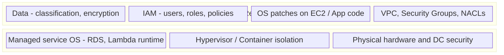

## Keywords in This File
{: .no_toc }

| # | Keyword | Weight |
|---|---------|--------|
| 14 | [Cloud Shared Responsibility Model](#cloud-shared-responsibility-model) | ★★☆ |
| 15 | [Cloud IAM Least Privilege](#cloud-iam-least-privilege) | ★★☆ |

---

# Cloud Shared Responsibility Model

**Interview Weight:** ★★☆ - Core security framework.
The shared responsibility model defines the boundary
between cloud provider and customer security obligations.
Every cloud architecture decision involves knowing
where this boundary lies.

---

### 🎯 Model Answer

**30 seconds:**

> AWS secures "the cloud" - physical infrastructure,
> hardware, networking, hypervisor. Customers secure
> "in the cloud" - OS, applications, data, IAM, network
> configuration, and encryption. The boundary shifts by
> service: EC2 (IaaS) requires customers to manage OS
> patches. RDS (PaaS) has AWS manage OS/DB patches.
> Lambda (Serverless) has AWS manage runtime.

**3 minutes:**

> AWS responsibilities (always):
> - Physical security: data center access, guards, cameras
> - Hardware: network equipment, servers, storage
> - Hypervisor: isolating VMs from each other
> - Managed service infrastructure: patching RDS OS,
>   Lambda runtime, EKS control plane
>
> Customer responsibilities (always):
> - Data: encryption at rest and in transit
> - IAM: who can access what
> - Network: VPC config, security groups, NACLs
> - Application: code vulnerabilities, dependencies
>
> Where it varies by service:
> - EC2: customer patches OS, installs software
> - RDS: AWS patches OS and DB engine; customer owns data
> - Lambda: AWS manages runtime; customer owns code and IAM
>
> Compliance implication:
> - AWS has PCI-DSS, HIPAA, SOC 2 certifications
> - AWS certification != your application is compliant
> - Customer must implement data encryption, access logging,
>   and controls required by the compliance framework

**Blank Mind Recovery:**

**(1) Divide:** "AWS secures the cloud (hardware, hypervisor).
You secure what's in the cloud (OS, data, IAM)."

**(2) Service shift:** "EC2: you patch OS. RDS: AWS patches OS.
Lambda: AWS patches runtime."

**(3) Compliance:** "AWS certifications cover the infrastructure.
Your application must also meet requirements."

---

### 📘 Concept Explanation

**Responsibility by Service Type:**

```
RESPONSIBILITY COMPARISON:

SERVICE    CUSTOMER OWNS         AWS OWNS
---------------------------------------------------
EC2        OS patches, app,      Hypervisor,
           data, IAM, network    hardware, DC

RDS        Data, DB config,      OS patches,
           IAM, VPC              DB engine patches

Lambda     Code, IAM role,       Runtime, OS,
           data, function cfg    hardware, isolation

S3         Data, bucket policy,  Hardware,
           encryption config     availability
```

> **Code walkthrough:** This example demonstrates the core pattern in action. The key mechanism shows how the concept works in practice. Study the structure to understand the essential behavior and common usage.

**Common Mistakes:**

```
MISTAKE 1: Not patching EC2 OS
  AWS: secured the hypervisor (my responsibility)
  Customer: forgot EC2 OS patching is THEIRS
  Result: unpatched Apache Struts -> breach
          (Equifax 2017: $700M fine)

MISTAKE 2: No encryption in S3
  AWS: stores whatever you provide
  Customer: "AWS encrypts by default"
  Reality: pre-2023 buckets need explicit config

MISTAKE 3: Not enabling CloudTrail
  AWS: provides audit service
  Customer: never enabled it
  Result: no audit log when breach investigated

MISTAKE 4: AWS HIPAA eligibility != compliance
  AWS: provides HIPAA-eligible services + BAA
  Customer: must also encrypt, audit, limit access
```

> **Code walkthrough:** This example demonstrates the core pattern in action. The key mechanism shows how the concept works in practice. Study the structure to understand the essential behavior and common usage.

---

### 💻 Code Example

```python
import boto3

# CUSTOMER RESPONSIBILITY 1: S3 encryption
# AWS does not encrypt older buckets by default

s3 = boto3.client('s3')

try:
    enc = s3.get_bucket_encryption(Bucket='my-bucket')
    print(f"Encrypted: {enc}")
except Exception:
    print("Not encrypted - customer responsibility")
    s3.put_bucket_encryption(
        Bucket='my-bucket',
        ServerSideEncryptionConfiguration={
            'Rules': [{
                'ApplyServerSideEncryptionByDefault': {
                    'SSEAlgorithm': 'AES256'
                },
                'BucketKeyEnabled': True
            }]
        }
    )


# CUSTOMER RESPONSIBILITY 2: EC2 OS patching
# SSM automates what AWS does NOT do automatically

ssm = boto3.client('ssm')

# Define compliance baseline (customer defines what
# "patched" means - AWS does not define this for you):
ssm.create_patch_baseline(
    Name='CriticalSecurityPatches',
    OperatingSystem='AMAZON_LINUX_2',
    ApprovalRules={
        'PatchRules': [{
            'PatchFilterGroup': {
                'PatchFilters': [{
                    'Key': 'SEVERITY',
                    'Values': ['Critical', 'High']
                }]
            },
            'ApproveAfterDays': 7,
        }]
    }
)


# CUSTOMER RESPONSIBILITY 3: Audit logging
# CloudTrail is NOT enabled globally by default

cloudtrail = boto3.client('cloudtrail')

cloudtrail.create_trail(
    Name='org-security-trail',
    S3BucketName='my-cloudtrail-logs',
    IsMultiRegionTrail=True,       # All regions
    EnableLogFileValidation=True,  # Detect tampering
    IncludeGlobalServiceEvents=True  # IAM events
)
cloudtrail.start_logging(Name='org-security-trail')
# Without CloudTrail: cannot answer "who deleted this?"
# Required for SOC 2, PCI-DSS, HIPAA compliance
```

> **Code walkthrough:** Three blocks, each showing a customer
> responsibility that AWS does not automatically handle.
> S3 encryption: AWS provides the capability but pre-2023
> buckets need explicit configuration. The BucketKeyEnabled=True
> setting uses a single KMS key reference per bucket instead
> of a key per object - reducing KMS API calls and cost by
> up to 99% for high-object-count buckets. EC2 patching via
> SSM removes the need to SSH into instances: the Systems
> Manager Agent (pre-installed on Amazon Linux) receives
> patch commands. CloudTrail is the compliance audit foundation:
> every API call with caller identity, timestamp, source IP,
> and request parameters. Without it, "who deleted this bucket?"
> is unanswerable during incident response.

---

### 🎓 Answers by Seniority

**Junior / Mid:**

> "The shared responsibility model divides security between
> AWS and the customer. AWS handles physical security,
> hardware, and the hypervisor. Customers handle OS patches
> on EC2, applications, data encryption, and IAM. For managed
> services like RDS, AWS handles OS patching too. The line
> shifts based on how managed the service is."

---

**Senior / Staff:**

> "The shared responsibility model is the foundation of
> cloud security architecture. The practical implication:
> you need a control for every customer-owned layer. For EC2:
> OS hardening, patch management via SSM, and Inspector for
> vulnerability scanning. For all services: encryption at
> rest (KMS with customer-managed keys for regulated data),
> encryption in transit (TLS everywhere), and audit logging
> (CloudTrail, VPC Flow Logs, S3 access logs). The most common
> compliance gap: using managed services but assuming AWS
> certifications cover the application. AWS certifications
> reduce the audit scope for the infrastructure layer, but
> data classification, access controls, and incident response
> procedures remain customer obligations."

---

### ⚠️ Common Misconceptions

**Misconception 1: "AWS compliance certifications make
my application compliant."**

AWS PCI-DSS, HIPAA, and SOC 2 certifications apply to
AWS's infrastructure. Your application must separately meet
the standards: data must be encrypted, access must be logged,
credentials must be managed. AWS certifications reduce the
scope of what you need to audit for the infrastructure layer,
but your application layer remains fully your responsibility.

**Misconception 2: "Data in S3 is private by default."**

New S3 buckets have Block Public Access enabled by default
(2023+). Older buckets, buckets with explicit public access,
or incorrect bucket policies (allowing any authenticated
AWS user rather than specific roles) expose data. Always
test bucket access explicitly - use S3 Block Public Access
at the account level as a safety net.

---

### 🚨 Failure Modes and Diagnosis

**Failure 1: EC2 compromised due to unpatched vulnerability**

*Symptom:* Unexpected outbound network traffic from EC2.
CloudTrail shows API calls from unusual source IP.

*Diagnosis:*
```bash
# Check patch compliance:
aws ssm describe-instance-patch-states \
  --instance-ids i-0abc123def456 \
  --query '[].{Missing: MissingCount, Failed: FailedCount}'
# MissingCount > 0 = unpatched = customer failed their duty

# Check Inspector vulnerability findings:
aws inspector2 list-findings \
  --filter-criteria '{
    "resourceId": [{"comparison":"EQUALS",
      "value":"i-0abc123def456"}],
    "severity": [{"comparison":"EQUALS","value":"CRITICAL"}]
  }'
```

> **Code walkthrough:** This example demonstrates the core pattern in action. The key mechanism shows how the concept works in practice. Study the structure to understand the essential behavior and common usage.

---

**Failure 2: S3 bucket exposed publicly**

*Response:*
```bash
# Immediately block:
aws s3api put-public-access-block \
  --bucket exposed-bucket \
  --public-access-block-configuration \
    "BlockPublicAcls=true,IgnorePublicAcls=true,\
BlockPublicPolicy=true,RestrictPublicBuckets=true"

# Audit what was accessed (requires CloudTrail):
aws cloudtrail lookup-events \
  --lookup-attributes \
    AttributeKey=ResourceName,Value=exposed-bucket
```

> **Code walkthrough:** This example demonstrates the core pattern in action. The key mechanism shows how the concept works in practice. Study the structure to understand the essential behavior and common usage.

---

### 🎯 Interview Deep-Dive

| Category | Count | Coverage |
|---|---|---|
| Conceptual | 2 | Responsibility boundary, IaaS vs PaaS vs SaaS |
| Trade-off | 2 | Managed services trade-off, compliance verification |
| Failure Mode | 2 | S3 public exposure, OS-level breach |
| Debugging | 1 | CloudTrail forensics |
| Behavioral | 2 | Auditor response, customer controls |

**Q1. Where exactly is the shared responsibility boundary
and how does it change across IaaS, PaaS, and SaaS?**

The fundamental split:
- **AWS always manages**: physical hardware, data center security,
  power, cooling, network hardware, hypervisor layer
- **Customer always manages**: their data, their access management
  (IAM), their encryption decisions, their application code

Boundary shifts by service type:

IaaS (EC2):
- AWS: hardware, hypervisor, physical network
- Customer: OS patches, OS configuration, application, app security,
  data, IAM, network config (security groups), encryption

PaaS (RDS, ECS):
- AWS: adds OS patches, database engine patches, hardware
- Customer: database schema and access config, data, IAM for access,
  network placement (VPC/subnets), encryption settings

SaaS (S3):
- AWS: adds application management, storage infrastructure
- Customer: bucket policies (who can access), data classification,
  encryption choice (SSE-S3 vs SSE-KMS vs SSE-C), lifecycle rules

*What separates good from great:* Knowing that encryption is always
a customer responsibility, even for managed services. AWS provides
the encryption mechanism (KMS, SSE-S3, TLS in transit) but the
customer decides whether to enable it. An unencrypted RDS instance
is a customer misconfiguration, not an AWS failure.

---

**Q2. What is the most commonly misunderstood customer
responsibility in the AWS shared model?**

Three common misunderstandings:

**1. IAM is always the customer's responsibility:**
AWS manages the IAM service. The customer manages all IAM users,
roles, policies, and group memberships. An overly permissive IAM
policy that leads to a data breach is a customer responsibility.
AWS has no authority to restrict what IAM policies a customer creates.

**2. Data durability guarantees do not replace backup strategy:**
S3 provides 99.999999999% durability (11 nines). This means AWS
will not lose your data due to hardware failure. But if a customer
code bug deletes the objects, or a disgruntled employee with IAM
access deletes them, that is not a hardware failure. Durability
covers infrastructure. Backup covers human/application error.
Versioning + replication + lifecycle rules = customer responsibility.

**3. DDoS protection has shared responsibilities:**
AWS Shield Standard protects against network-level DDoS. Application-
level DDoS (HTTP flood, Layer 7) requires customer-side WAF rules
(AWS WAF, Shield Advanced). The customer must configure WAF rate
limiting; Shield Standard alone does not stop application floods.

*What separates good from great:* The backup vs durability distinction.
Many engineers assume that 11 nines durability means they do not need
backups. This is wrong. 11 nines = hardware never loses data. It
does not protect against application bugs, deletion, or ransomware.

---

**Q3. How does the customer implement their side of the shared
responsibility model at scale?**

Four pillars of customer security controls:

1. **Identity and access**: IAM least privilege roles, no root
   account usage, MFA on all privileged accounts, SSO/federation
   via AWS IAM Identity Center

2. **Data protection**: encryption at rest (KMS for all storage),
   encryption in transit (TLS 1.2+, enforce HTTPS on S3 and ALB),
   S3 Block Public Access (organization-level SCP), DLP tagging

3. **Infrastructure security**: security groups (deny by default),
   NACLs for subnet-level controls, VPC Flow Logs, no public
   subnets for databases, private endpoints for AWS services

4. **Detection and response**: CloudTrail (all regions, all
   management events), Config rules for continuous compliance,
   GuardDuty for threat detection, Security Hub for aggregation

Automation approach:
```bash
# Enable AWS Config managed rules:
aws configservice put-config-rule --config-rule '{
  "ConfigRuleName": "s3-bucket-public-read-prohibited",
  "Source": {
    "Owner": "AWS",
    "SourceIdentifier": "S3_BUCKET_PUBLIC_READ_PROHIBITED"
  }
}'
```

> **Code walkthrough:** This example demonstrates the core pattern in action. The key mechanism shows how the concept works in practice. Study the structure to understand the essential behavior and common usage.

*What separates good from great:* Using AWS Config Rules + Security
Hub for continuous compliance verification. Manual audits find
misconfiguration after the fact. Config Rules alert immediately when
a resource drifts from the security baseline.

---

**Q4. DEBUGGING: An S3 bucket was publicly accessible. AWS
notified you. What are your investigation steps?**

```bash
# Step 1: Immediately remediate - remove public access:
aws s3api put-public-access-block \
  --bucket exposed-bucket \
  --public-access-block-configuration \
    'BlockPublicAcls=true,
     IgnorePublicAcls=true,
     BlockPublicPolicy=true,
     RestrictPublicBuckets=true'

# Step 2: Investigate root cause in CloudTrail:
aws cloudtrail lookup-events \
  --lookup-attributes \
    AttributeKey=ResourceName,Value=exposed-bucket \
  --start-time $(date -d '30 days ago' --iso-8601=seconds)
# Look for: PutBucketPolicy, PutBucketAcl events
# Note: who (userIdentity), when (eventTime), from where (sourceIPAddress)

# Step 3: Check what was accessed:
# Enable S3 server access logging if not already enabled
# Analyse existing logs for GET requests during exposure window:
aws s3 sync s3://access-log-bucket/exposed-bucket/ ./logs/
grep -h '"GET "' logs/*.log | \
  awk '{print $8, $7}' | sort | uniq -c | sort -rn | head -20
# Shows: what objects were accessed and how many times

# Step 4: Assess blast radius:
# What data was in the bucket?
# Was any PII, credentials, or keys exposed?
# Notification obligations (GDPR, HIPAA timing requirements)
```

> **Code walkthrough:** This example demonstrates the core pattern in action. The key mechanism shows how the concept works in practice. Study the structure to understand the essential behavior and common usage.

*What separates good from great:* Running the S3 access log analysis
immediately - not after the investigation. You need to know if
anything was actually exfiltrated to determine if breach notification
is required. Many teams investigate why the bucket was exposed
but forget to check what was read during the exposure window.

---

**Q5. What is the TRADE-OFF between managed services (reduced
customer responsibility) and vendor dependency?**

Managed service benefits:
- AWS manages OS patching, database engine upgrades, hardware
- Reduces operational burden: 80% of infrastructure security
  is AWS's problem instead of yours
- SLA guarantees: AWS bears responsibility for availability
  within their managed scope

Vendor dependency costs:
- Lock-in: RDS PostgreSQL is not the same as Aurora PostgreSQL
  in terms of performance characteristics and supported features
- Upgrade timing: AWS deprecates old versions on their schedule.
  RDS MySQL 5.7 end-of-life was a forcing function for many teams.
- Price control: AWS changes managed service pricing, you pay it
- Feature availability: new database features come to managed
  versions on AWS's schedule, not immediately on engine GA
- Compliance complexity: for regulated industries, managed service
  means you must trust AWS's compliance certifications (SOC2, HIPAA
  BAA) rather than controlling the environment yourself

Decision framework:
- Standard workload with no regulatory custom requirements: managed
  services are the clear choice (cost of management > lock-in cost)
- Highly regulated with specific OS/kernel/network requirements:
  EC2 + own software may be required for audit control

*What separates good from great:* Abstracting the managed service
behind an application interface. A `Repository` interface that hides
whether the underlying store is RDS or Aurora allows migration
without application code changes. The lock-in is then operational,
not architectural.

---

**Q6. What does AWS CloudTrail capture and what does it NOT
capture that customers often assume it does?**

CloudTrail captures:
- **Management events**: API calls that manage AWS resources
  (create/modify/delete EC2, S3, IAM, etc.) - enabled by default
- **S3 data events**: object-level operations (GetObject, PutObject)
  - NOT enabled by default, must be explicitly turned on
- **Lambda data events**: function invocations - NOT by default
- **Insights**: unusual API call volume anomalies - NOT by default

CloudTrail does NOT capture:
- **Content of requests**: what data was in the S3 object body
- **Application-level logs**: what your application did internally
- **Database queries**: SQL queries inside RDS (need Enhanced
  Monitoring or database audit logs for this)
- **In-memory operations**: nothing inside EC2 instances
- **Traffic between instances**: use VPC Flow Logs for network-level

For a complete audit trail:
```
CloudTrail (API calls) +
VPC Flow Logs (network) +
S3 Server Access Logs or S3 Data Events (object access) +
RDS audit logs (SQL queries) +
Application logs (business actions)
= Complete audit coverage
```

> **Code walkthrough:** This example demonstrates the core pattern in action. The key mechanism shows how the concept works in practice. Study the structure to understand the essential behavior and common usage.

*What separates good from great:* Knowing that S3 Data Events cost
money (per-API-call charge) and must be explicitly enabled. Teams
that assume CloudTrail covers all S3 access discover during an
incident that they have no record of which objects were read.

---

**Q7. How do you verify AWS has fulfilled its side of the
shared responsibility model?**

AWS fulfills its side through third-party audits and certifications:

- **SOC 2 Type II**: independent auditor verifies AWS security
  controls over a 6-12 month period. Available via AWS Artifact.
- **ISO 27001**: information security management system
- **PCI DSS Level 1**: for payment card data environments
- **HIPAA**: AWS provides a HIPAA BAA (Business Associate Agreement)
  for covered entities
- **FedRAMP**: US government authorization
- **AWS Shared Responsibility PDF**: formal documentation of what
  AWS manages vs customer

```bash
# Access compliance reports via AWS Artifact (free):
# Console -> AWS Artifact -> Reports
# Download: SOC 2 Type II, ISO certificates, PCI DSS
# These are NDA-covered documents from third-party auditors

# For infrastructure compliance evidence:
# AWS Config -> Conformance Packs -> AWS Foundational Security
# Shows which of YOUR configurations meet security standards
```

> **Code walkthrough:** This example demonstrates the core pattern in action. The key mechanism shows how the concept works in practice. Study the structure to understand the essential behavior and common usage.

*What separates good from great:* Knowing the difference between
AWS's certifications (which cover their infrastructure) and your
organization's certifications (which cover your use of that
infrastructure). Your PCI DSS audit requires your controls on top
of AWS's certified infrastructure.

---

**Q8. What is the AWS Well-Architected Security Pillar and
how does it relate to the shared responsibility model?**

The Well-Architected Security Pillar defines six security best
practice areas for customer responsibilities:

1. **Security foundations**: AWS Organizations, SCPs, account
   structure, GuardDuty, Security Hub
2. **Identity and access management**: IAM least privilege, SSO,
   no long-term credentials, permission boundaries
3. **Detection**: CloudTrail, Config, CloudWatch alarms, Security Hub
4. **Infrastructure protection**: VPC design, security groups,
   WAF, Shield, private subnets
5. **Data protection**: encryption at rest and in transit,
   data classification, S3 Block Public Access
6. **Incident response**: runbooks, IR automation, forensics access

Each area covers only the customer side of shared responsibility.
The Well-Architected review is a mechanism to evaluate your customer
controls against best practices.

*What separates good from great:* Running an AWS Well-Architected
Review annually and tracking improvement items. The review creates
a measurable security posture gap analysis. Teams that do this
have a structured roadmap; teams that skip it discover gaps during
audits or incidents.

---

**Q9. BEHAVIORAL: A compliance auditor asks "Who is responsible
for ensuring database data is encrypted?" What is your answer?**

Complete answer covering the shared responsibility:

"The responsibility is shared, with specific parts owned by each side.

AWS is responsible for:
- Providing the encryption capability: RDS supports SSE with KMS,
  TLS for connections, EBS encryption for storage
- Ensuring those mechanisms work correctly and are FIPS 140-2 compliant

Our organization is responsible for:
- Deciding whether to enable encryption (it is not automatically on
  for all RDS configurations)
- Configuring the correct KMS key (AWS-managed CMK vs. customer-managed
  CMK for additional key control)
- Enforcing TLS for all connections (setting `ssl=true` in connection
  strings, rejecting unencrypted connections via parameter group)
- Key rotation policy (KMS automatic annual rotation enabled)
- Access control to the KMS key (who can use the key to decrypt)

In our environment, we have [enabled RDS storage encryption with a
customer-managed KMS CMK, enabled automated annual key rotation,
and set `rds.force_ssl=1` in the parameter group to reject
unencrypted connections]."

*What separates good from great:* Being specific about the exact
configuration steps your team has taken. Auditors do not want
theory - they want evidence of controls implemented. "We enabled
encryption" with the specific KMS key ARN and the parameter group
configuration is evidence.

---

### ⚖️ Comparison Table

| Service | AWS Manages | Customer Manages |
|---------|-------------|-----------------|
| EC2 | Hardware, hypervisor | OS patches, app, data, IAM |
| RDS | Hardware, OS, DB patches | Data, DB config, IAM, VPC |
| EKS | K8s control plane | Worker nodes, apps, IAM |
| Lambda | Runtime, OS, hardware | Code, IAM, data, config |
| S3 | Hardware, availability | Data, bucket policy, encryption |

---

### 🏛️ System Design

*(Omit: ★★☆ keyword - system design section is for ★★★ only.)*

---

### 📊 Diagram

```
SHARED RESPONSIBILITY MODEL:

+--------------------------------------+
| CUSTOMER RESPONSIBILITY              |
|  Data (classification, encryption)  |
|  IAM (users, roles, policies)        |
|  OS patches on EC2                   |
|  App vulnerabilities                 |
|  VPC, Security Groups, NACLs         |
+--------------------------------------+
| AWS RESPONSIBILITY                   |
|  Managed service OS (RDS, Lambda)    |
|  Hypervisor / container isolation    |
|  Physical hardware and networking    |
|  Data center physical security       |
+--------------------------------------+
```



> **Diagram walkthrough:** The model divides into two clear
> bands. The customer responsibility band covers data and
> access (IAM), and for IaaS services (EC2), the OS layer.
> The AWS responsibility band covers everything physical and
> the isolation layer between workloads. The important nuance:
> for managed services (RDS, Lambda), the OS row moves to
> the AWS band but data and IAM remain customer-owned.
> The compliance failure is mistaking "AWS manages RDS"
> to mean "AWS manages our RDS security" - data encryption,
> access controls, and audit logging remain customer obligations.

---

---

---

### 💻 Code Example

*(Omit: this concept does not have a programmatic interface that can be demonstrated in code. The conceptual explanation above is sufficient.)*


---

### 🏛️ System Design

*(Omit: system design diagram not applicable for this concept - see ★★★ keywords for full system design coverage.)*


---

### ⚖️ Comparison Table

*(Omit: this is a ★☆☆ foundational concept with no direct alternatives to compare - see higher-difficulty keywords for trade-off analysis.)*


---

### 📊 Diagram

*(Omit: no standalone visual diagram required for this concept - the explanations and code examples above provide sufficient clarity.)*


# Cloud IAM Least Privilege

**Interview Weight:** ★★☆ - Critical security practice.
Least privilege is the most important IAM security principle.
Overly permissive IAM is the most common cloud breach
amplifier.

---

### 🎯 Model Answer

**30 seconds:**

> Least privilege means granting only the specific permissions
> needed, nothing more. In AWS IAM: use specific actions
> (s3:GetObject, not s3:*), specific resources (one bucket
> ARN, not *), and conditions (only from this VPC).
> Audit regularly with IAM Access Analyzer - it generates
> minimum policies from actual CloudTrail usage. If a service
> is compromised, least privilege limits the blast radius.

**3 minutes:**

> Why it matters:
> - Blast radius: compromised service can only do what it's
>   allowed. Role with s3:* -> attacker can delete all S3.
>   Role with s3:GetObject on one bucket -> attacker reads
>   only that bucket.
> - Accidental damage: wrong command in prod only affects
>   what the role permits
> - Compliance: PCI-DSS, SOC 2, ISO 27001 require it
>
> Implementation:
> 1. Specific actions: s3:GetObject, not s3:*
> 2. Specific resources: ARN of one resource, not *
> 3. Conditions: aws:SourceVpc, aws:RequestedRegion,
>    aws:MultiFactorAuthPresent
> 4. IAM Access Analyzer: generate policy from last 90 days
>    of CloudTrail (only what was actually used)
> 5. Quarterly review: remove unused permissions
>
> Privilege escalation risk:
> - iam:CreateRole + iam:AttachRolePolicy = can create
>   admin role and assign to self -> full escalation
> - Even "limited" IAM permissions are dangerous if they
>   include policy modification
>
> Scoping mechanisms:
> - Permission boundaries: max allowed regardless of policy
> - SCPs: org-level max, overrides even admin roles
> - Resource-based policies: cross-account control

**Blank Mind Recovery:**

**(1) Principle:** "Specific actions + specific resources
+ conditions. Never wildcards."

**(2) Tool:** "IAM Access Analyzer generates least-privilege
policy from actual CloudTrail activity."

**(3) Escalation:** "iam:CreateRole + iam:AttachRolePolicy
= escalate to admin. Never pair these in app roles."

---

### 📘 Concept Explanation

**Permission Minimization:**

```
START WITH: no permissions (default deny)
ADD:
  Specific action:   s3:GetObject
  Specific resource: arn:aws:s3:::reports/2024/*
  Condition:         aws:SourceVpc = vpc-0abc123
                     aws:RequestedRegion = us-east-1

RESULT: This role can ONLY:
  - Read S3 objects matching reports/2024/*
  - Only from within the specified VPC
  - Only in us-east-1

If compromised: attacker reads 2024 reports only
NOT: delete any bucket, access other data, change IAM
```

> **Code walkthrough:** This example demonstrates the core pattern in action. The key mechanism shows how the concept works in practice. Study the structure to understand the essential behavior and common usage.

**Privilege Escalation via IAM:**

```
RISKY COMBINATION (never in app roles):
  iam:CreateRole        -> can create any new role
  iam:AttachRolePolicy  -> can attach any policy to it

ESCALATION:
  1. Create role with AdministratorAccess policy
  2. AssumeRole to that admin role
  3. Full AWS account access

MITIGATION:
  Permission boundary: even admin can't grant > boundary
  SCP: org-level blocks iam:* on non-admin roles
  Separate: IAM management roles from service roles
```

> **Code walkthrough:** This example demonstrates the core pattern in action. The key mechanism shows how the concept works in practice. Study the structure to understand the essential behavior and common usage.

---

### 💻 Code Example

```json
// BAD: Lambda role with wildcard permissions
{
  "Version": "2012-10-17",
  "Statement": [{
    "Effect": "Allow",
    "Action": ["s3:*", "dynamodb:*", "sqs:*"],
    "Resource": "*"
  }]
}
// Lambda can delete ALL S3 buckets, wipe ALL DynamoDB
// tables, and drain ALL SQS queues in the account.


// GOOD: Lambda that processes orders (SQS -> DynamoDB)
{
  "Version": "2012-10-17",
  "Statement": [
    {
      "Sid": "ReadFromOrderQueue",
      "Effect": "Allow",
      "Action": [
        "sqs:ReceiveMessage",
        "sqs:DeleteMessage",
        "sqs:GetQueueAttributes"
      ],
      "Resource":
        "arn:aws:sqs:us-east-1:123456:order-queue"
    },
    {
      "Sid": "WriteOrdersToTable",
      "Effect": "Allow",
      "Action": [
        "dynamodb:PutItem",
        "dynamodb:UpdateItem",
        "dynamodb:GetItem"
      ],
      "Resource": [
        "arn:aws:dynamodb:us-east-1:123456:table/Orders",
        "arn:aws:dynamodb:us-east-1:123456:table/Orders/index/*"
      ]
    },
    {
      "Sid": "WriteLogsToThisFunction",
      "Effect": "Allow",
      "Action": [
        "logs:CreateLogStream",
        "logs:PutLogEvents"
      ],
      "Resource":
        "arn:aws:logs:us-east-1:123456:log-group:/aws/lambda/order-processor:*"
    }
  ]
}
```

> **Code walkthrough:** This example demonstrates the core pattern in action. The key mechanism shows how the concept works in practice. Study the structure to understand the essential behavior and common usage.

```python
import boto3
import json

iam = boto3.client('iam')

# PERMISSION BOUNDARY: cap developer-created roles
boundary_policy = {
    "Version": "2012-10-17",
    "Statement": [
        {
            "Effect": "Allow",
            "Action": ["s3:*", "dynamodb:*", "lambda:*"],
            "Resource": "*"
        },
        {
            # DENY IAM in boundary: devs can't escalate
            "Effect": "Deny",
            "Action": "iam:*",
            "Resource": "*"
        }
    ]
}

iam.create_policy(
    PolicyName='DeveloperRoleBoundary',
    PolicyDocument=json.dumps(boundary_policy)
)
# Any role with this boundary can never manage IAM
# even if the identity policy would allow it


# IAM Access Analyzer: identify unused permissions
# CLI (uses last 90 days of CloudTrail):
# aws iam generate-service-last-accessed-details \
#   --arn arn:aws:iam::123:role/lambda-role
# Review each service's LastAuthenticated date
# Services never accessed -> remove their permissions
```

> **Code walkthrough:** The BAD policy grants three wildcards
> on all resources - this Lambda can destroy the entire account's
> S3 data, DynamoDB data, and SQS queues. The GOOD policy has
> three separate statement blocks, each with a Sid (documentation),
> exactly the actions needed (3 SQS actions, 3 DynamoDB actions,
> 2 log actions), and specific resource ARNs. The CloudWatch Logs
> resource is scoped to this function's log group: the Lambda
> cannot write to other functions' logs. The permission boundary
> shows how to constrain developer-created roles: even if a
> developer creates a role with full permissions, the boundary
> denies all IAM actions, preventing privilege escalation.
> The `Deny` in the boundary overrides any `Allow` in the
> identity policy - this is the key evaluation rule.

---

### 🎓 Answers by Seniority

**Junior / Mid:**

> "Least privilege means granting only what a service needs.
> Instead of s3:* on *, use s3:GetObject on one specific
> bucket ARN. The benefit: if the service is compromised,
> the attacker's ability is limited to exactly what the
> service was allowed to do."

---

**Senior / Staff:**

> "Least privilege implementation is three layers: correct
> actions (no wildcards), correct resources (specific ARNs),
> and conditions (source VPC, MFA, region). The operational
> challenge is maintenance: permissions grow as requirements
> are added and never removed. IAM Access Analyzer's policy
> generation from CloudTrail right-sizes permissions based
> on actual usage. The dangerous combination to watch for:
> iam:CreateRole + iam:AttachRolePolicy in the same role.
> Together these allow escalation to admin. Use permission
> boundaries to ensure developer-created roles cannot
> manage IAM, and SCPs at the org level to enforce guardrails
> that even account administrators cannot override."

---

### ⚠️ Common Misconceptions

**Misconception 1: "Broad permissions are acceptable as
a temporary measure."**

Temporary permissions become permanent. Every sprint adds
requirements; no sprint removes permissions. Permission
drift is the norm in organizations without a formal
review process. Start minimal and add specifically.
Use IAM Access Analyzer quarterly to right-size.

**Misconception 2: "IAM roles are safe because credentials
expire."**

Temporary credentials (roles) rotate automatically. But
they still carry the same permissions as the role.
A compromised Lambda with dynamodb:* can still delete
every table before credentials expire in an hour.
Credential rotation (via roles) prevents long-term
credential theft; it does not reduce permission scope.

---

### 🚨 Failure Modes and Diagnosis

**Failure 1: Service compromise with wide IAM scope**

*Symptom:* API service compromised via SSRF. Attacker
reached instance metadata, got Lambda role credentials,
and deleted S3 data.

*Root cause:* Lambda role had s3:* on *.

*Detection:*
```bash
aws cloudtrail lookup-events \
  --lookup-attributes \
    AttributeKey=Username,Value=lambda-role \
  --start-time $(date -u -d '1 hour ago' +%FT%TZ)
# Look for DeleteBucket, DeleteObject in bulk
# from unexpected source IPs
```

> **Code walkthrough:** This example demonstrates the core pattern in action. The key mechanism shows how the concept works in practice. Study the structure to understand the essential behavior and common usage.

*Prevention:* Scope s3 permissions to specific bucket and
specific objects. Add explicit Deny for delete operations
in all non-admin roles.

---

**Failure 2: Access denied breaks deployment pipeline**

*Symptom:* CI/CD fails with AccessDenied on new resource.

*Diagnosis:*
```bash
# Simulate the specific permission:
aws iam simulate-principal-policy \
  --policy-source-arn arn:aws:iam::123:role/deploy-role \
  --action-names ecr:GetAuthorizationToken \
  --resource-arns "*"
# DENIED + which policy/boundary caused it

# Review current policies:
aws iam list-attached-role-policies --role-name deploy-role
```

> **Code walkthrough:** This example demonstrates the core pattern in action. The key mechanism shows how the concept works in practice. Study the structure to understand the essential behavior and common usage.

*Fix:* Add only the specific required action to the role.
Never add wildcards to fix a single permission issue.

---

### 🎯 Interview Deep-Dive

| Category | Count | Coverage |
|---|---|---|
| Conceptual | 2 | Least privilege, IAM Access Analyzer, cross-account |
| Trade-off | 2 | Least privilege vs productivity, SCPs vs IAM policies |
| Failure Mode | 2 | AccessDenied diagnosis, permission boundary edge cases |
| Debugging | 1 | Policy evaluation logic |
| Behavioral | 2 | AdministratorAccess remediation, cross-account setup |

**Q1. What is the principle of least privilege in AWS IAM
and what are the four mechanisms to implement it?**

Least privilege: grant only the permissions required to perform
an action on specific resources, for the minimum necessary time.

Four AWS IAM mechanisms:

1. **Resource-level permissions**: specify exact ARNs instead of
   wildcards:
   ```json
   {"Effect":"Allow","Action":"s3:GetObject",
    "Resource":"arn:aws:s3:::my-bucket/*"}  // NOT "*"
   ```

> **Code walkthrough:** This example demonstrates the core pattern in action. The key mechanism shows how the concept works in practice. Study the structure to understand the essential behavior and common usage.

2. **Condition keys**: restrict by IP, time, MFA, request type:
   ```json
   {"Condition":{"IpAddress":{"aws:SourceIp":"10.0.0.0/8"}}}
   ```

> **Code walkthrough:** This example demonstrates the core pattern in action. The key mechanism shows how the concept works in practice. Study the structure to understand the essential behavior and common usage.

3. **Permission boundaries**: maximum permission ceiling for
   a role, regardless of what policies are attached:
   a developer can only create roles with permissions within
   the boundary

4. **Service Control Policies (SCPs)**: account-level guardrails
   in AWS Organizations. No IAM policy in the account can
   grant what the SCP denies.

Least privilege in practice is iterative: start broad, use
Access Analyzer to find what was actually used, narrow to that.

*What separates good from great:* Knowing that an explicit Allow in
a resource policy can override IAM Deny in some cases (cross-account
S3 access with bucket policy). IAM policy evaluation has 5+ layers.
For sensitive resources, use both IAM AND resource policies.

---

**Q2. How do you audit existing IAM permissions to find
over-permissive policies at scale?**

```bash
# Tool 1: IAM Access Analyzer (identifies external access):
aws accessanalyzer create-analyzer \
  --analyzer-name account-analyzer \
  --type ACCOUNT
# Finds: S3 buckets, IAM roles, KMS keys, Lambda functions
# that are accessible from OUTSIDE your account

# Tool 2: IAM Access Advisor (finds unused permissions):
aws iam generate-service-last-accessed-details \
  --arn arn:aws:iam::123456789012:role/my-role
# Shows: last time each service was accessed
# Services never accessed in 90 days = candidates for removal

# Tool 3: AWS Config rule for over-broad permissions:
# Managed rule: iam-no-inline-policy-on-entities
# Managed rule: iam-policy-no-statements-with-admin-access

# Tool 4: boto3 credential report (bulk scan):
aws iam generate-credential-report
aws iam get-credential-report
# Shows: all IAM users, last access dates, MFA status, key rotation
```

> **Code walkthrough:** This example demonstrates the core pattern in action. The key mechanism shows how the concept works in practice. Study the structure to understand the essential behavior and common usage.

Finding over-permissive roles:
```bash
aws iam list-roles --query \
  'Roles[?contains(AssumeRolePolicyDocument, `*`)].RoleName'
# Roles with trust policy wildcards = overly permissive assume-role
```

> **Code walkthrough:** This example demonstrates the core pattern in action. The key mechanism shows how the concept works in practice. Study the structure to understand the essential behavior and common usage.

*What separates good from great:* Automating the audit, not just
running it once. Schedule the Access Advisor report monthly; alert
when a service has not been accessed in 90 days. This catches
permission creep before it becomes a risk.

---

**Q3. What is IAM Access Analyzer and what specific risks
does it detect that manual review misses?**

Access Analyzer uses automated reasoning to find resources that
grant external access. It analyzes resource policies and tells
you exactly who outside your account or AWS organization can
access each resource, and through what path.

What it detects:
- S3 bucket accessible from another account or public internet
- IAM role assumable by an external AWS account or AWS service
  in another account
- KMS key with grants to external principals
- Lambda function with resource-based policy allowing external invoke
- Secrets Manager secrets readable by external accounts

```bash
# Check analyzer findings:
aws accessanalyzer list-findings \
  --analyzer-arn arn:aws:accessanalyzer:us-east-1::analyzer/account
# Shows each finding:
# resourceType: AWS::S3::Bucket
# principal: { "AWS": "*" }  <- public access
# action: ["s3:GetObject"]
```

> **Code walkthrough:** This example demonstrates the core pattern in action. The key mechanism shows how the concept works in practice. Study the structure to understand the essential behavior and common usage.

What Access Analyzer does NOT detect:
- Over-permissive policies within your account (internal over-privilege)
- IAM policies with unnecessary actions that have never been used
- For internal analysis: use IAM Access Advisor

*What separates good from great:* Knowing Access Analyzer uses
formal automated reasoning (Zelkova). It is not heuristic - it
mathematically proves whether external access is possible. This
makes findings authoritative (no false positives) and makes
"no findings" a meaningful security guarantee.

---

**Q4. DEBUGGING: A Lambda function receives AccessDenied despite
having a policy that appears correct. Walk through diagnosis.**

```bash
# Step 1: Get the exact denied action from CloudTrail:
aws cloudtrail lookup-events \
  --lookup-attributes AttributeKey=EventName,Value=AssumeRole
# Or search for AccessDenied errors:
aws logs filter-log-events \
  --log-group-name /aws/lambda/my-function \
  --filter-pattern '"AccessDenied"'
# Lambda errors show the full ARN, action, and resource

# Step 2: Use IAM Policy Simulator:
aws iam simulate-principal-policy \
  --policy-source-arn arn:aws:iam::123456789012:role/lambda-role \
  --action-names s3:GetObject \
  --resource-arns arn:aws:s3:::target-bucket/key
# Output: EvalDecision = "allowed" or "explicitDeny" or "implicitDeny"
# Shows which policy caused the decision

# Step 3: Check all policy layers:
# 1. SCP - does organization deny this action for all accounts?
# 2. Permission boundary - does it limit what the role can do?
# 3. Identity policy - does the role have the Allow?
# 4. Resource policy - does S3 bucket policy allow this role?
# 5. VPC endpoint policy - if using S3 VPC endpoint, is it restrictive?
# 6. Session policy - was the role assumed with a session policy?
```

> **Code walkthrough:** This example demonstrates the core pattern in action. The key mechanism shows how the concept works in practice. Study the structure to understand the essential behavior and common usage.

*What separates good from great:* The VPC endpoint policy layer.
Teams often add S3 VPC endpoints with restrictive endpoint policies
that prevent all traffic except from specific roles. A Lambda without
VPC access or not on the allowlist hits the endpoint policy before
the bucket policy. This is the most commonly overlooked deny layer.

---

**Q5. What is the difference between SCPs and IAM policies
and how do they interact in AWS Organizations?**

IAM policies: define what an identity (user, role) CAN do within
an AWS account. They grant permissions.

SCPs (Service Control Policies): define what the MAXIMUM permissions
are for the entire AWS account or OU. They do not grant permissions;
they restrict what IAM policies in the account can grant.

Interaction:
```
Effective permissions =
  IAM policy Allow ∩ SCP Allow
  (minus any explicit Deny)
```

> **Code walkthrough:** This example demonstrates the core pattern in action. The key mechanism shows how the concept works in practice. Study the structure to understand the essential behavior and common usage.

If SCP denies `s3:DeleteBucket` for the account:
- Even if a user has `s3:DeleteBucket` in their IAM policy: DENIED
- Even if the user is the account root: DENIED (SCPs override root)
- The SCP is evaluated BEFORE IAM policies

SCP use cases:
```json
// Prevent disabling of GuardDuty across all accounts:
{"Sid":"DenyGuardDutyDisable","Effect":"Deny",
 "Action":["guardduty:DeleteDetector",
           "guardduty:DisassociateFromMasterAccount"],
 "Resource":"*"}

// Restrict to specific regions:
{"Sid":"AllowOnlyEU","Effect":"Deny",
 "Action":"*","Resource":"*",
 "Condition":{"StringNotEquals":{"aws:RequestedRegion":
   ["eu-west-1","eu-central-1"]}}}
```

> **Code walkthrough:** This example demonstrates the core pattern in action. The key mechanism shows how the concept works in practice. Study the structure to understand the essential behavior and common usage.

*What separates good from great:* Knowing that SCPs apply to the
management account only in read-only mode (they cannot restrict
management account root). Security teams attach SCPs to child OUs
but cannot restrict themselves via SCP without careful architecture.

---

**Q6. TRADE-OFF: Least privilege vs developer productivity.
How do you implement least privilege without blocking developers?**

The tension: strict least privilege creates constant friction
(developers unable to deploy, test, or debug). Over-permissive
policies increase risk.

Practical balance:

Development environments:
- Developers have PowerUser or broad permissions in dev account
- Dev account is isolated (no production data, no customer PII)
- Cost: broader permissions in a low-risk environment

CI/CD pipelines:
- Specific deploy roles: exactly the permissions needed for that
  pipeline (EC2:RunInstances for the AMI, ECS:UpdateService,
  S3:PutObject for the specific deployment bucket)
- Principle: pipeline roles are the most locked-down identities

Production human access:
- Just-in-time access (AWS IAM Identity Center session policies)
- Break-glass: read-only by default, elevated access via approval
  workflow with time-bound session

Access Analyzer baseline:
- Grant broadly initially, use Access Advisor to measure
  actual usage after 30-90 days, narrow to what was used

*What separates good from great:* The Access Analyzer-first approach.
Start with a broad policy, observe for 90 days, generate least-privilege
policy from actual usage, apply as the new baseline. This gives
both productivity (broad initial) and compliance (measured actual).

---

**Q7. How do you handle cross-account access in AWS IAM?**

Cross-account access via role assumption:

```bash
# Account A (resource owner): create a role that Account B can assume
# Trust policy on Role in Account A:
{
  "Effect": "Allow",
  "Principal": {"AWS": "arn:aws:iam::ACCOUNT_B_ID:role/deploy-role"},
  "Action": "sts:AssumeRole"
}

# Permission policy on same role:
{"Effect": "Allow", "Action": "s3:GetObject",
 "Resource": "arn:aws:s3:::account-a-bucket/*"}

# Account B: assume the role from Account A:
aws sts assume-role \
  --role-arn arn:aws:iam::ACCOUNT_A_ID:role/cross-account-role \
  --role-session-name deployment-session
# Returns temporary credentials with 1-hour TTL
```

> **Code walkthrough:** This example demonstrates the core pattern in action. The key mechanism shows how the concept works in practice. Study the structure to understand the essential behavior and common usage.

For S3 cross-account access, BOTH are required:
1. IAM policy in the requesting account (allows `sts:AssumeRole`
   or `s3:GetObject`)
2. S3 bucket policy in the owning account (allows the requesting
   principal)

Missing either side = AccessDenied.

*What separates good from great:* The dual-policy requirement for
S3 cross-account access without role assumption. Engineers often
add only the bucket policy and forget the IAM policy in the
requesting account. Both are required when not using role assumption.

---

**Q8. What are IAM permission boundaries and when should
you use them?**

Permission boundary: an advanced IAM feature that defines the
maximum permissions a role or user can have, regardless of
what policies are attached to it.

Use case - delegated IAM management:
```json
// Scenario: Security team sets a permission boundary.
// Developer can create any role BUT only with this boundary attached.
// The boundary limits the max permissions any created role can have:

// Permission boundary (attached to any new role):
{"Effect":"Allow","Action":["s3:*","dynamodb:*"],"Resource":"*"}
// Even if developer attaches AdministratorAccess to the new role,
// effective permissions = AllowAll ∩ [s3+dynamodb] = s3+dynamodb only

// Developer's IAM policy (allows creating roles with constraint):
{"Effect":"Allow","Action":"iam:CreateRole","Resource":"*",
 "Condition":{"StringEquals":{"iam:PermissionsBoundary":
   "arn:aws:iam::123456789012:policy/DeveloperBoundary"}}}
// Developer cannot create a role without the boundary
```

> **Code walkthrough:** This example demonstrates the core pattern in action. The key mechanism shows how the concept works in practice. Study the structure to understand the essential behavior and common usage.

Other use cases:
- Service accounts for CI/CD: limit max blast radius even if
  CI/CD pipeline is compromised
- Sandbox accounts: users can do anything within a budget-limited
  set of services

*What separates good from great:* Knowing that permission boundaries
do NOT grant permissions. A role with only a boundary attached has
no effective permissions until a policy is also attached. Boundary
= ceiling, policy = actual grant, effective = intersection.

---

**Q9. BEHAVIORAL: You discover a production service role has
AdministratorAccess. How do you remediate safely?**

This requires careful change management because removing permissions
from production roles can break services immediately.

Step 1: Identify actual permissions used:
```bash
# Enable Access Advisor for the role:
aws iam generate-service-last-accessed-details \
  --arn arn:aws:iam::123456789012:role/prod-service-role
# Wait 4-6 hours for report generation
aws iam get-service-last-accessed-details --job-id <JOB_ID>
# Shows: which services were actually accessed and when
```

> **Code walkthrough:** This example demonstrates the core pattern in action. The key mechanism shows how the concept works in practice. Study the structure to understand the essential behavior and common usage.

Step 2: Check CloudTrail for the specific API calls:
```bash
aws cloudtrail lookup-events \
  --lookup-attributes AttributeKey=Username,Value=prod-service-role \
  --start-time $(date -d '90 days ago' --iso-8601=seconds)
# More granular than Access Advisor: exact actions and resources
```

> **Code walkthrough:** This example demonstrates the core pattern in action. The key mechanism shows how the concept works in practice. Study the structure to understand the essential behavior and common usage.

Step 3: Draft least-privilege policy from actual usage

Step 4: Staged rollout:
- Create new least-privilege policy
- Attach BOTH AdministratorAccess AND new policy to role
  (no change in permissions yet)
- Monitor for 2 weeks: are there any access patterns the
  new policy misses? Check CloudTrail for denials.
- Remove AdministratorAccess after validation period

*What separates good from great:* The staged overlap period (step 4).
Removing AdministratorAccess directly in production is high-risk.
Running both policies simultaneously means the service still works
while you validate the new policy is complete. No service interruption
during remediation.

---

### ⚖️ Comparison Table

| Approach | Security | Operational Cost | Recommendation |
|----------|----------|-----------------|----------------|
| Wildcard (s3:* on *) | Very low | Very low | Never |
| Service wildcard (s3:* on specific ARN) | Low | Low | Avoid |
| Specific actions + specific ARN | High | Medium | Yes |
| Specific + conditions | Very high | Higher | Sensitive data |
| Access Analyzer generated | High | Low (automated) | Yes, as baseline |

| IAM Feature | Purpose | When to Use |
|------------|---------|-------------|
| Permission Boundary | Cap delegated permissions | Developer-created roles |
| SCP | Org-wide guardrails | Always, at org level |
| Resource Policy | Cross-account access | S3, KMS, SQS |
| Access Analyzer | Find over-broad policies | Quarterly audits |

---

### 🏛️ System Design

*(Omit: ★★☆ keyword - system design section is for ★★★ only.)*

---

### 📊 Diagram

*(Omit: IAM policy structure is best expressed as code and tables.)*

---

---

### 💻 Code Example

*(Omit: this concept does not have a programmatic interface that can be demonstrated in code. The conceptual explanation above is sufficient.)*


---

### 🏛️ System Design

*(Omit: system design diagram not applicable for this concept - see ★★★ keywords for full system design coverage.)*


---

### ⚖️ Comparison Table

*(Omit: this is a ★☆☆ foundational concept with no direct alternatives to compare - see higher-difficulty keywords for trade-off analysis.)*


---

### 📊 Diagram

*(Omit: no standalone visual diagram required for this concept - the explanations and code examples above provide sufficient clarity.)*


