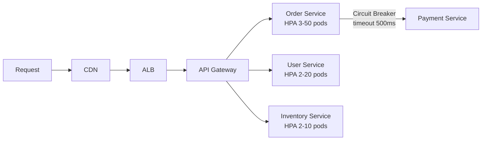
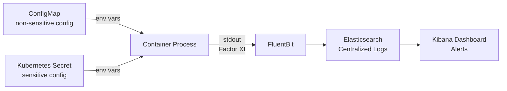

## Keywords in This File
{: .no_toc }

| # | Keyword | Weight |
|---|---------|--------|
| 16 | [Cloud-Native Architecture Principles](#cloud-native-architecture-principles) | ★★☆ |
| 17 | [12-Factor App in the Cloud](#12-factor-app-in-the-cloud) | ★★☆ |

---

# Cloud-Native Architecture Principles

**Interview Weight:** ★★☆ - Architecture philosophy.
Cloud-native principles define how applications are built
to take full advantage of cloud: scalability, resilience,
and operator efficiency. This is the foundation of modern
cloud application design.

---

### 🎯 Model Answer

**30 seconds:**

> Cloud-native applications are designed to exploit the
> cloud's dynamic scaling, resilience, and automation.
> Key principles: microservices (small, independently
> deployable), containers (consistent environments),
> dynamic orchestration (Kubernetes auto-schedules),
> and API-driven infrastructure. The CNCF (Cloud Native
> Computing Foundation) defines the ecosystem. The goal:
> systems that are resilient, manageable, and observable
> at scale.

**3 minutes:**

> Cloud-native vs traditional:
>
> Traditional (monolith on VMs):
> - Deploy entire app as one unit
> - Scale by adding larger VMs (vertical)
> - Failure: entire app down
> - Deployment: hours of downtime (often)
>
> Cloud-native:
> - Microservices: each service deployed independently
>   -> one service can be scaled without scaling all
> - Immutable infrastructure: never modify running instances
>   Replace them (new container image = new deployment)
> - Dynamic scaling: Kubernetes HPA scales based on load
> - Designed for failure: services expect dependencies
>   to fail, implement retries, circuit breakers, timeouts
> - Observability: structured logging, distributed tracing
>   (required because a single request spans many services)
> - GitOps: infrastructure and app config in git,
>   automated reconciliation
>
> Five CNCF principles:
> 1. Microservices
> 2. Containers
> 3. Dynamic orchestration (Kubernetes)
> 4. DevOps automation (CI/CD)
> 5. Continuous delivery

**Blank Mind Recovery:**

**(1) Core concept:** "Cloud-native = designed for dynamic
cloud. Microservices, containers, auto-scale, resilience."

**(2) vs Traditional:** "Monolith -> scale whole app.
Cloud-native -> scale one service. Deploy one service."

**(3) Resilience:** "Expect failures. Retries, circuit
breakers, timeouts. Any service can fail any time."

---

### 📘 Concept Explanation

**Resilience Patterns:**

```
TRADITIONAL: call service B and wait indefinitely
  if B is down: A hangs forever
  thread pool exhausted -> A also crashes

CLOUD-NATIVE: defensive patterns
  TIMEOUT: if B doesn't respond in 500ms -> fail fast
  RETRY: with exponential backoff + jitter
    attempt 1: immediate
    attempt 2: 500ms wait
    attempt 3: 1000ms + random(0-100ms)
  CIRCUIT BREAKER: if 50% of calls fail in 10s
    -> open circuit, don't call B for 30s
    -> prevents cascade failure
  BULKHEAD: separate thread pools for different calls
    -> B being slow can't exhaust all threads for A

RESULT: failure of B is isolated
  A degrades gracefully (returns cached data or default)
  A recovers automatically when B recovers
```

> **Code walkthrough:** This example demonstrates the core pattern in action. The key mechanism shows how the concept works in practice. Study the structure to understand the essential behavior and common usage.

**Immutable Infrastructure:**

```
MUTABLE (traditional):
  Server S1 running v1
  Deploy v2: SSH in, pull code, restart service
  Problems: SSH access is a security risk
            What if restart fails?
            S1 is now different from S2 (config drift)

IMMUTABLE (cloud-native):
  Build: docker build -> image:v2
  Deploy: launch new containers with image:v2
          health check passes
  Cutover: load balancer routes to v2 containers
  Old containers: graceful shutdown
  Rollback: route back to image:v1 containers
            (they still exist, just not receiving traffic)
  Benefits: no SSH, no config drift, instant rollback
```

> **Code walkthrough:** This example demonstrates the core pattern in action. The key mechanism shows how the concept works in practice. Study the structure to understand the essential behavior and common usage.

---

### 💻 Code Example

```yaml
# KUBERNETES: Cloud-native deployment with resilience

apiVersion: apps/v1
kind: Deployment
metadata:
  name: order-service
spec:
  replicas: 3
  selector:
    matchLabels:
      app: order-service
  # Rolling update (zero-downtime deployment):
  strategy:
    type: RollingUpdate
    rollingUpdate:
      maxUnavailable: 1  # At most 1 pod down at a time
      maxSurge: 1        # Add 1 extra during update
  template:
    metadata:
      labels:
        app: order-service
    spec:
      containers:
        - name: order-service
          image: myrepo/order-service:2.1.0
          # Immutable: version pinned in image tag
          ports:
            - containerPort: 8080
          resources:
            requests:
              memory: "256Mi"
              cpu: "100m"
            limits:
              memory: "512Mi"
              cpu: "500m"

          # Readiness: ready to receive traffic?
          readinessProbe:
            httpGet:
              path: /ready
              port: 8080
            initialDelaySeconds: 5
            periodSeconds: 10
            failureThreshold: 3
            # 3 failures: remove from Service endpoints
            # Traffic continues to other pods

          # Liveness: should container be restarted?
          livenessProbe:
            httpGet:
              path: /health
              port: 8080
            initialDelaySeconds: 30
            periodSeconds: 30
            failureThreshold: 3
            # 3 failures: kill and restart container

          # Cloud-native: 12-factor config via env vars
          env:
            - name: DATABASE_URL
              valueFrom:
                secretKeyRef:
                  name: db-credentials
                  key: url
            - name: REDIS_HOST
              valueFrom:
                configMapKeyRef:
                  name: app-config
                  key: redis_host
---
# HPA: auto-scale based on load
apiVersion: autoscaling/v2
kind: HorizontalPodAutoscaler
metadata:
  name: order-service-hpa
spec:
  scaleTargetRef:
    apiVersion: apps/v1
    kind: Deployment
    name: order-service
  minReplicas: 2
  maxReplicas: 50
  metrics:
    - type: Resource
      resource:
        name: cpu
        target:
          type: Utilization
          averageUtilization: 70
    - type: Resource
      resource:
        name: memory
        target:
          type: Utilization
          averageUtilization: 80
---
# PodDisruptionBudget: maintain availability during
# node drain or rolling updates
apiVersion: policy/v1
kind: PodDisruptionBudget
metadata:
  name: order-service-pdb
spec:
  minAvailable: 2  # Always have at least 2 pods
  selector:
    matchLabels:
      app: order-service
```

> **Code walkthrough:** The Deployment manifest shows four
> cloud-native patterns. Rolling update strategy ensures
> zero-downtime deployment: Kubernetes adds one new pod,
> waits for it to pass readiness, then removes one old pod.
> The readinessProbe prevents traffic routing to a pod that
> hasn't finished starting (JVM warmup, database connection
> pool initialization). The livenessProbe restarts pods that
> become deadlocked or unhealthy without crashing (memory leak,
> thread exhaustion). The HPA scales replicas 2-50 based on CPU
> and memory utilization - removing the manual scaling decision.
> The PodDisruptionBudget ensures Kubernetes doesn't drain all
> nodes simultaneously during cluster upgrades, always maintaining
> at least 2 available pods.

---

### 🎓 Answers by Seniority

**Junior / Mid:**

> "Cloud-native means building applications designed for
> the cloud's capabilities: automatic scaling, resilience
> to failures, and fast deployment. Key patterns: microservices
> (small independent services), containers (consistent
> packaging), Kubernetes for orchestration, and CI/CD for
> automated deployment. Applications expect dependencies
> to fail and handle failures gracefully with retries
> and circuit breakers."

---

**Senior / Staff:**

> "Cloud-native is primarily about operational efficiency:
> systems that self-heal (liveness probes restart unhealthy
> pods), self-scale (HPA), and self-deploy (GitOps reconciles
> desired vs actual state). The hardest cultural shift is
> designing for failure: traditional software assumes
> dependencies are available. Cloud-native services treat
> every network call as potentially failing - implement
> timeouts on every external call, retries with exponential
> backoff, and circuit breakers for cascading failure prevention.
> The observability requirement follows from microservices:
> a single user request spans 10-20 services, each with
> their own logs. Distributed tracing (OpenTelemetry + Jaeger)
> is not optional at this scale."

---

### ⚠️ Common Misconceptions

**Misconception 1: "Cloud-native means putting a monolith
in a container."**

Containerizing a monolith gains deployment consistency
but not cloud-native benefits. The monolith still scales
as a whole, deploys as a whole, and fails as a whole.
Cloud-native requires architectural changes: decomposing
into services with independent deployability, implementing
resilience patterns, and building for horizontal scaling.

**Misconception 2: "Microservices are always better than
monoliths."**

Microservices add operational complexity: distributed
tracing, service discovery, network latency, eventual
consistency, and more things to deploy. For small teams
or simple domains: a well-structured monolith is often
the right choice. The modular monolith - a single deployable
with clear internal module boundaries - provides easier
debugging and simpler operations while maintaining
architectural cleanliness. Migrate to microservices when
you have specific scaling or team independence requirements.

---

### 🚨 Failure Modes and Diagnosis

**Failure 1: Cascade failure - service B slowdown kills A**

*Symptom:* Service B becomes slow (database query timeout).
Service A, which calls B, also becomes slow. Then service A
callers become slow. Eventually the entire system hangs.

*Root cause:* No timeout on service A -> B calls. Slow B
responses hold threads. Thread pool exhausted. A can't
process new requests.

*Diagnosis:*
```bash
kubectl top pods -n production
# High CPU + memory on service-a despite low request count

kubectl logs deployment/service-a | grep -i "timeout\|slow"

# Distributed trace shows all latency in service-b call:
# jaeger query -> trace for recent slow request
```

> **Code walkthrough:** This example demonstrates the core pattern in action. The key mechanism shows how the concept works in practice. Study the structure to understand the essential behavior and common usage.

*Fix:* Add Hystrix/Resilience4j circuit breaker +
timeout on every service-to-service HTTP call.

---

**Failure 2: Pod restarts due to missing liveness probe tuning**

*Symptom:* Pod restarts every 2-3 minutes during high load.
RESTARTS count in `kubectl get pods` incrementing.

*Root cause:* Liveness probe fires during GC pause.
Application pauses for > probe timeout -> killed and restarted.

*Fix:*
```yaml
livenessProbe:
  httpGet:
    path: /health
    port: 8080
  initialDelaySeconds: 30
  periodSeconds: 30      # Less frequent
  timeoutSeconds: 10     # Longer timeout
  failureThreshold: 3    # 3 failures needed (not 1)
# 3 * 10s timeout = 30s of failures before restart
# GC pause < 30s: pod not killed
```

> **Code walkthrough:** This example demonstrates the core pattern in action. The key mechanism shows how the concept works in practice. Study the structure to understand the essential behavior and common usage.

---

### 🎯 Interview Deep-Dive

| Category | Count | Coverage |
|---|---|---|
| Conceptual | 2 | Cloud-native principles, microservices vs monolith |
| Trade-off | 2 | Microservices trade-offs, sidecar complexity |
| Failure Mode | 2 | Scaling without throughput gain, stateful cloud-native |
| Debugging | 1 | Bottleneck identification in distributed scale-out |
| Behavioral | 2 | Monolith migration, service mesh adoption |

**Q1. What are the core cloud-native architecture principles
and how do they differ from traditional application design?**

Cloud-native principles (CNCF definition):

1. **Containerization**: package application + dependencies into
   immutable images. Eliminates "works on my machine."

2. **Dynamic orchestration**: Kubernetes manages placement,
   scaling, health, and rolling upgrades. No manual server management.

3. **Microservices orientation**: decompose by business capability.
   Independent deployability, failure isolation.

4. **API-driven communication**: services communicate only via
   well-defined APIs (REST, gRPC). No shared databases between services.

5. **Resilience by design**: assume any component can fail at any time.
   Circuit breakers, retries with backoff, timeout budgets everywhere.

6. **Observability-first**: metrics, logs, traces are not afterthoughts;
   they are designed in from day one.

Vs. traditional design:
- Traditional: stateful VMs, shared databases, vertical scaling,
  long deploy cycles, manual failover
- Cloud-native: stateless pods, service-owned storage, horizontal
  scaling, continuous delivery, automated failover

*What separates good from great:* Knowing that cloud-native is a
decision spectrum, not a binary. An application can adopt individual
principles incrementally (containerize first, add orchestration,
then break into services). Full cloud-native from a monolith in
one step is a high-risk bet.

---

**Q2. What is the strangler fig pattern and when is it the
correct approach for cloud-native migration?**

Strangler fig (Martin Fowler): gradually replace a monolith by
building new functionality as microservices and routing traffic
to them, while the monolith shrinks. Eventually the monolith is
completely replaced ("strangled").

Pattern components:
```
Client
  |
  v
API Gateway / Facade (new)
  |
  +-> New Service (new functionality, cloud-native)
  |
  +-> Monolith (legacy functionality, still running)

Over time: more routes point to new services,
           monolith handles fewer and fewer requests
```

> **Code walkthrough:** This example demonstrates the core pattern in action. The key mechanism shows how the concept works in practice. Study the structure to understand the essential behavior and common usage.

When to use:
- Large monolith that cannot be rewritten in one shot
- Risk-averse migration (rollback = redirect route back to monolith)
- Team building cloud-native skills while keeping production stable
- Business requirement to add new features while migrating

When NOT to use:
- Small application (full rewrite is cheaper and faster)
- Monolith with heavy shared state (database per service is required
  before strangler can proceed)
- Greenfield (no monolith to strangle)

*What separates good from great:* Knowing that the strangler
requires decomposing the database alongside the services. A
microservice that shares the monolith's database is not truly
independent. The hardest part of the strangler is the data layer.

---

**Q3. What is the difference between cloud-native and
cloud-enabled ("lift and shift")?**

Cloud-enabled (lift and shift):
- Same application, moved to cloud VMs
- No re-architecture, no redesign
- Benefits gained: cloud billing model, managed hardware
- Benefits NOT gained: elastic scaling, resilience, managed services,
  auto-recovery, cloud-native cost optimization

Cloud-native:
- Application redesigned to leverage cloud primitives
- Stateless services, managed databases, auto-scaling, container
  orchestration, infrastructure as code
- Full cloud benefit realised

The continuum (7 Rs):
- Retire, Retain, Rehost (lift-and-shift), Replatform
  (lift-tinker-shift), Repurchase, Refactor/Re-architect,
  Rebuild from scratch

Business impact:
- Lift-and-shift: fast migration, 20-30% cost savings (managed
  hardware vs owned)
- Cloud-native: slower (12-24 months), 40-80% cost savings
  (auto-scaling eliminates over-provisioning), full agility

*What separates good from great:* Matching the migration approach
to business goals. "Migrate to cloud by Q3" justifies lift-and-shift.
"Reduce infrastructure cost by 50% and enable weekly deploys"
justifies cloud-native re-architecture.

---

**Q4. DEBUGGING: A microservice is scaling out (more pods/instances)
but overall system throughput is not improving. How do you diagnose?**

This is Amdahl's Law applied to distributed systems: the serial
bottleneck limits parallel scaling benefit.

```bash
# Step 1: Identify the bottleneck tier:
# Check each tier's saturation:
# CPU: kubectl top pods --sort-by=cpu
# Memory: kubectl top pods --sort-by=memory
# Request queue: check ALB RequestCount vs ServiceCount

# Step 2: Look for the common bottlenecks:

# Database (most common):
# Check RDS CPU, connections, read/write IOPS:
aws cloudwatch get-metric-statistics \
  --namespace AWS/RDS \
  --metric-name CPUUtilization \
  --dimensions Name=DBInstanceIdentifier,Value=prod-db
# If DB CPU is high while app CPU is low: DB is the bottleneck

# Shared cache:
# ElastiCache: check CurrConnections, CPUUtilization
# If cache saturated: all pods queue on same cache

# Downstream service:
# Check the slowest dependency via distributed tracing
# Jaeger/X-Ray: find p95 span by service

# Step 3: Check for serial operations within the service itself:
# Distributed lock? All instances lock on one key?
# Global rate limiter backed by Redis? Single-instance Redis?
```

> **Code walkthrough:** This example demonstrates the core pattern in action. The key mechanism shows how the concept works in practice. Study the structure to understand the essential behavior and common usage.

*What separates good from great:* Starting with the database, not
the application tier. In 80% of cases where horizontal scaling
doesn't help, the database is saturated. More application pods
only increases database connection pressure, making things worse.

---

**Q5. How do service meshes (Istio, Linkerd) relate to cloud-native
principles and when do you need one?**

Service mesh: infrastructure layer that handles service-to-service
communication. Implemented as sidecar proxies (Envoy in Istio)
injected into each pod.

Capabilities:
- **mTLS between all services**: encrypted and authenticated traffic
  without application code changes
- **Traffic management**: weighted routing, canary deploys, circuit
  breaking, retries, timeouts - all in config, not code
- **Observability**: per-service request rate, error rate, latency
  histograms generated automatically from sidecar metrics
- **Access policy**: declarative policies for which services can
  communicate (NetworkPolicy alternative at L7)

When you need a service mesh:
- 10+ services with complex inter-service communication
- mTLS compliance requirement (financial, healthcare)
- Canary deployments need fine-grained traffic control
- Observability across services without instrumenting each one

When a service mesh is premature:
- Under 5-10 services: overhead exceeds benefit
- Simple request-response with no complex routing
- Team doesn't have bandwidth to operate the mesh

*What separates good from great:* Knowing the Istio operational
cost. Each sidecar adds ~50MB memory and ~50ms latency per hop.
At 100 services with 3 pods each = 300 sidecar proxies. The mesh
control plane itself requires dedicated capacity. This is not a
"free" abstraction.

---

**Q6. TRADE-OFF: Microservices vs monolith. When does a
microservices architecture make things worse?**

Microservices make things worse when:

1. **Team too small**: microservices require each service to have
   independent CI/CD, monitoring, oncall. A 3-person team cannot
   operate 10 services effectively. Rule: 1 team should own 1-5
   services ("two-pizza team" per service).

2. **Business logic is tightly coupled**: if Service A must call
   Service B must call Service C for every request = distributed
   monolith with network hops. Worse latency, harder to debug.

3. **Shared database**: microservices sharing a database lose
   independent deployability. The database is the coupling point.
   This is often called the "shared database anti-pattern."

4. **Domain boundaries unclear**: services carved by technical
   tier (UserService, DataService, ValidationService) not by
   business capability = chatty interfaces, tight coupling.

5. **Early product stage**: if the domain model is evolving,
   service boundaries will be wrong. Refactoring across service
   boundaries is expensive. Wait until the domain is stable.

*What separates good from great:* The single-team monolith guideline.
"Is the monolith deployable independently?" is the right question,
not "is it microservices?" A well-structured monolith with module
boundaries is often better than poorly-decomposed microservices.

---

**Q7. What is the sidecar pattern and what problems does it
solve in cloud-native systems?**

Sidecar: a secondary container that runs alongside the main
application container in the same Kubernetes pod, sharing the
same network namespace (localhost) and volumes.

```yaml
# Pod with application + sidecar:
apiVersion: v1
kind: Pod
spec:
  containers:
  - name: app           # Main: business logic
    image: my-service:v1
    ports: [{containerPort: 8080}]
  - name: envoy         # Sidecar: service mesh proxy
    image: envoyproxy/envoy:v1.28
    # Intercepts all inbound/outbound traffic
    # Adds mTLS, retries, metrics without code changes
  - name: filebeat      # Second sidecar: log shipping
    image: elastic/filebeat:8.x
    # Reads logs from shared volume, ships to Elasticsearch
```

> **Code walkthrough:** This example demonstrates the core pattern in action. The key mechanism shows how the concept works in practice. Study the structure to understand the essential behavior and common usage.

Problems solved:
- **Cross-cutting concerns**: add logging, tracing, auth, proxying
  to any service without modifying its code
- **Language-agnostic**: Java, Python, Go services all get the same
  capabilities via the sidecar
- **Operational decoupling**: sidecar can be upgraded independently
  of the application container

*What separates good from great:* Knowing the resource overhead
accumulates. Each sidecar (Envoy: 50MB + CPU) multiplied by 1000
pods = significant cluster cost. Cloud-native 2024 trend is to move
cross-cutting concerns to node-level DaemonSets or eBPF rather than
per-pod sidecars to reduce overhead.

---

**Q8. How do you handle state in a stateless cloud-native service
and what are the data storage options?**

Stateless means: a pod can be terminated and replaced at any time
without data loss. Any state must be external to the pod.

State types and storage options:

| State Type | Storage Option | AWS Service |
|---|---|---|
| Session state | Key-value cache | ElastiCache Redis |
| Application data | Relational DB | RDS / Aurora |
| Document store | NoSQL | DynamoDB |
| Blobs/assets | Object storage | S3 |
| Job queue | Message queue | SQS / Kafka |
| Distributed lock | Cache with TTL | ElastiCache SETNX |
| Config/feature flags | Config service | AppConfig / SSM |

For Kubernetes specifically, persistent state options:
- `PersistentVolume` (EBS): single-node, survives pod restart
- StatefulSet + `volumeClaimTemplate`: each pod gets its own
  persistent volume (good for databases on Kubernetes)
- External managed service: always preferred for production state
  (AWS manages durability and backup)

*What separates good from great:* Knowing that PersistentVolumes
on EBS are zone-locked. A pod with an EBS PV can only be scheduled
in the same AZ as the EBS volume. This breaks multi-AZ availability.
For HA stateful workloads: use multi-AZ managed services, not EBS.

---

**Q9. BEHAVIORAL: Your team has a Java monolith serving 10M daily
users. How do you approach making it cloud-native?**

Phased migration roadmap:

Phase 1: Containerize and observe (months 1-3)
- Package monolith as Docker image, deploy on ECS/EKS
- Add structured logging, distributed tracing (X-Ray/Jaeger),
  metrics (Micrometer + CloudWatch)
- Establish deployment pipeline (build -> test -> staging -> prod)
- No re-architecture yet: just containerize and observe

Phase 2: Identify seams (months 3-6)
- Use telemetry from Phase 1 to find:
  - Hottest code paths (scale targets)
  - Highest-traffic APIs (candidates for extraction)
  - Domain boundaries (DDD event storming)
- Pick first extraction: simplest, most isolated, highest value
  (e.g., email notification service, file processing)

Phase 3: Strangle first service out (months 6-9)
- Add API gateway in front of monolith
- Extract and deploy first microservice
- Route traffic via API gateway: new service handles extracted domain,
  monolith handles rest
- Validate: same behavior, measured performance

Phase 4: Repeat and accelerate
- Apply lessons from first extraction
- Parallelize extractions as team confidence grows

Risk management:
- Roll back = redirect route in API gateway (minutes)
- Never extract without >80% test coverage on the extracted domain

*What separates good from great:* Phase 1 observability first.
You cannot safely extract a service from a monolith you cannot
observe. Teams that skip Phase 1 extract services that behave
differently from the monolith in ways they cannot diagnose.

---

### ⚖️ Comparison Table

| Characteristic | Traditional | Cloud-Native |
|---------------|-------------|-------------|
| Deployment unit | VM or WAR file | Container image |
| Scaling | Vertical (bigger VM) | Horizontal (more pods) |
| Deployment | Hours, with downtime | Minutes, zero-downtime |
| Failure handling | Restart service | Auto-restart, self-heal |
| Config management | Files on server | Env vars / ConfigMaps |
| Infrastructure | Mutable (SSH in) | Immutable (replace) |
| Observability | Logs on server | Centralized, structured |
| Operations | Manual | Automated (GitOps) |

---

### 🏛️ System Design

*(Omit: ★★☆ keyword - system design section is for ★★★ only.)*

---

### 📊 Diagram

```
CLOUD-NATIVE REQUEST FLOW:

Request -> CDN -> ALB -> [API Gateway]
                           |
          +----------------+-------------------+
          |                |                   |
     Order Service    User Service      Inventory Service
          |                |                   |
     (HPA: 3-50)     (HPA: 2-20)        (HPA: 2-10)
          |
     [Circuit Breaker]
          |
     Payment Service
     (timeout: 500ms)
          |
     [Retry + backoff]
```



> **Diagram walkthrough:** Each service has its own HPA
> (autoscaler): Order Service scales 3-50 pods based on
> CPU, independently from Inventory Service which scales
> 2-10 pods. This is the key cloud-native advantage: a spike
> in orders doesn't force scaling of the User or Inventory
> services. The circuit breaker between Order and Payment
> Service shows the resilience pattern: if Payment Service
> is slow, the circuit opens and Order Service fails fast
> rather than accumulating slow threads. The API Gateway
> layer provides a single entry point for cross-cutting
> concerns: auth, rate limiting, and request routing.

---

---

---

### 💻 Code Example

*(Omit: this concept does not have a programmatic interface that can be demonstrated in code. The conceptual explanation above is sufficient.)*


---

### 🏛️ System Design

*(Omit: system design diagram not applicable for this concept - see ★★★ keywords for full system design coverage.)*


---

### ⚖️ Comparison Table

*(Omit: this is a ★☆☆ foundational concept with no direct alternatives to compare - see higher-difficulty keywords for trade-off analysis.)*


---

### 📊 Diagram

*(Omit: no standalone visual diagram required for this concept - the explanations and code examples above provide sufficient clarity.)*


# 12-Factor App in the Cloud

**Interview Weight:** ★★☆ - Architecture methodology.
The 12-Factor App methodology defines best practices for
cloud-native applications. Created at Heroku, now the
standard for portable, scalable, and maintainable
cloud applications.

---

### 🎯 Model Answer

**30 seconds:**

> The 12-Factor App is a methodology for building scalable,
> maintainable cloud applications. Key factors: codebase
> in version control, dependencies explicitly declared,
> config from environment variables (not code), processes
> are stateless (state in backing services), logs as event
> streams. The 12 factors collectively enable apps to scale
> horizontally, deploy anywhere, and be operated by platforms
> like Kubernetes without special handling.

**3 minutes:**

> The most important factors for cloud:
>
> Factor 3 - Config in environment:
> - Never hardcode: DB URLs, API keys, region
> - Store in environment variables (not files, not code)
> - Kubernetes: ConfigMap (non-sensitive), Secret (sensitive)
> - Why: same image deploys to dev/staging/prod with
>   different env vars. No credentials in source code.
>
> Factor 6 - Stateless processes:
> - Process stores no session state in memory or local disk
> - State lives in backing services (Redis, DB)
> - Why: any process instance can handle any request
>   enables horizontal scaling + zero-downtime restarts
>
> Factor 7 - Port binding:
> - App exports its own HTTP server, doesn't rely on
>   Apache/IIS being installed on the host
> - Runs as: java -jar app.jar or ./start.sh
>   not: must deploy to Tomcat on port 8080 of a server
>
> Factor 9 - Disposability:
> - Fast startup (< 10s ideally) for quick scaling
> - Graceful shutdown: handle SIGTERM, finish in-flight
>   requests, drain queues, then exit
> - Why: Kubernetes sends SIGTERM before SIGKILL
>   if app ignores it: in-flight requests are dropped
>
> Factor 11 - Logs as streams:
> - App writes to stdout only (never manages log files)
> - Execution environment routes to centralized log aggregator
> - Why: no log rotation to manage, logs survive container
>   restarts, centralized search

**Blank Mind Recovery:**

**(1) Factor 3:** "Config from env vars. Never hardcode
credentials or environment-specific URLs."

**(2) Factor 6:** "Stateless processes. Session state
in Redis/DB, not in process memory."

**(3) Factor 9:** "Fast startup. Graceful shutdown on SIGTERM.
Handle SIGTERM or lose in-flight requests."

---

### 📘 Concept Explanation

**All 12 Factors:**

```
I.   Codebase: one repo, many deploys (dev/staging/prod)
II.  Dependencies: explicitly declared (pom.xml, package.json)
III. Config: environment variables (not hardcoded)
IV.  Backing services: DB, cache, queue as attached resources
     (can swap dev MySQL for prod PostgreSQL via URL change)
V.   Build/release/run: separate stages
     Build: compile + package
     Release: build + config = release artifact
     Run: execute release in environment
VI.  Processes: stateless and share-nothing
VII. Port binding: self-contained web server
VIII.Concurrency: scale via process model (more processes)
IX.  Disposability: fast startup, graceful shutdown
X.   Dev/prod parity: keep dev and production similar
     (same OS, same services, same versions)
XI.  Logs: treat as event streams (write to stdout)
XII. Admin processes: run as one-off processes
     (database migrations, maintenance tasks)
```

> **Code walkthrough:** This example demonstrates the core pattern in action. The key mechanism shows how the concept works in practice. Study the structure to understand the essential behavior and common usage.

**Factor VI Violation (Sticky Sessions):**

```
BAD: stateful process (sticky sessions)
  User session stored in web process memory
  Load balancer: route user A always to server 1
  Server 1 crashes: user A loses session
  Cannot scale by adding server 3 (session not there)

GOOD: stateless process
  User session stored in Redis
  Load balancer: route to any available server
  Server 1 crashes: server 2 or 3 handles next request
  Can add server 3 instantly: has access to all sessions
  (session data is in Redis, not in any server's memory)
```

> **Code walkthrough:** This example demonstrates the core pattern in action. The key mechanism shows how the concept works in practice. Study the structure to understand the essential behavior and common usage.

---

### 💻 Code Example

```java
// JAVA: 12-Factor App patterns

// Factor III - BAD: hardcoded config
// @Component
// class DatabaseConfig {
//   private String url = "jdbc:postgresql://prod-db:5432/app";
//   private String password = "supersecret123";
// }

// Factor III - GOOD: config from environment
@Configuration
@ConfigurationProperties(prefix = "app.db")
public class DatabaseConfig {
    // Spring reads from:
    // APP_DB_URL, APP_DB_PASSWORD env vars
    // OR application.properties (for defaults only)
    // OR Kubernetes Secret mounted as env vars
    private String url;
    private String password;
    // getters/setters omitted
}

// application.properties (non-sensitive defaults only):
// app.db.url=${DATABASE_URL:jdbc:postgresql://localhost:5432/dev}
// app.db.password=${DATABASE_PASSWORD:devpassword}
// The ${VAR:default} syntax: use env var, fall back to default
// Production env var overrides the default


// Factor VI - Stateless session management
@RestController
public class OrderController {

    // BAD: session in process memory
    // private Map<String, Order> pendingOrders = new HashMap<>();
    // (lost on restart, breaks horizontal scaling)

    // GOOD: session in Redis backing service
    @Autowired
    private RedisTemplate<String, Order> redisTemplate;

    @PostMapping("/orders/draft")
    public String saveDraft(@RequestBody Order order,
                            HttpServletRequest request) {
        String sessionId = extractSessionId(request);
        String key = "draft:" + sessionId;
        // Store in Redis (survives process restart):
        redisTemplate.opsForValue().set(
            key, order, Duration.ofHours(1));
        return sessionId;
    }
    // Any process instance can retrieve this draft
    // Kubernetes can restart any pod, user experience
    // is not affected
}


// Factor IX - Graceful shutdown (handle SIGTERM)
@Component
public class GracefulShutdown implements
    DisposableBean, ApplicationListener<ContextClosedEvent> {

    private final OrderQueue orderQueue;
    private volatile boolean shuttingDown = false;

    public GracefulShutdown(OrderQueue orderQueue) {
        this.orderQueue = orderQueue;
    }

    @Override
    public void onApplicationEvent(ContextClosedEvent event) {
        this.shuttingDown = true;
        // Kubernetes sends SIGTERM before SIGKILL (30s default)
        // Drain the queue: finish in-flight processing
        orderQueue.drainAndWait(Duration.ofSeconds(20));
        // Log final state for observability:
        log.info("Graceful shutdown complete");
    }
    // Without this: Kubernetes SIGKILL drops all in-flight orders
}


// Factor XI - Logs as event stream
// BAD:
// FileHandler handler = new FileHandler("/var/log/app.log");
// logger.addHandler(handler);  // Log to file = anti-pattern

// GOOD: log to stdout (container platform routes it)
// Spring Boot default: logs to stdout
// No log rotation configuration needed
// kubectl logs pod-name streams it
// Fluentd/Fluent Bit aggregates to Elasticsearch/CloudWatch
```

> **Code walkthrough:** Four patterns matching 12-factor
> principles. Factor III (config): Spring's `@ConfigurationProperties`
> with environment variable binding. The `${DATABASE_URL:default}`
> syntax provides a development default while allowing production
> override via environment variable. Kubernetes Secret is mounted
> as an environment variable - the app doesn't know or care
> whether the value comes from a local .env file or a Kubernetes
> Secret. Factor VI (stateless): OrderController stores draft
> orders in Redis rather than a HashMap. The Redis key includes
> the session ID: any pod can retrieve it. Factor IX (graceful
> shutdown): the DisposableBean receives the Spring shutdown event
> (triggered by JVM shutdown hook on SIGTERM) and drains the
> order queue before exiting. Without this, Kubernetes pods are
> killed while processing messages, causing duplicate processing
> or lost orders. Factor XI (logs): no file handler, Spring Boot
> writes to stdout by default - Kubernetes captures it and
> container log aggregators route it to centralized storage.

---

### 🎓 Answers by Seniority

**Junior / Mid:**

> "The 12-Factor App is a methodology for cloud-native
> applications. Key practices: store config in environment
> variables (not hardcoded), make processes stateless
> (session data in Redis, not memory), write logs to stdout
> (not files), and handle graceful shutdown. These enable
> apps to scale horizontally and deploy across environments
> without modification."

---

**Senior / Staff:**

> "The 12-Factor App is essential for Kubernetes deployment.
> Factor VI (stateless processes) is the prerequisite for
> horizontal scaling: if your app stores session in memory,
> sticky sessions are required, which complicates load
> balancing and breaks zero-downtime deployments. Factor IX
> (disposability) is critical for Kubernetes: pods are killed
> with SIGTERM daily during rolling updates and node drains.
> Applications that don't handle SIGTERM gracefully drop
> in-flight requests or lose queued messages on every deployment.
> The 30-second window between SIGTERM and SIGKILL is the
> contract: finish what you're doing in 30 seconds."

---

### ⚠️ Common Misconceptions

**Misconception 1: "Config files in containers are acceptable
if they're not checked into source control."**

Config files in containers have two problems: they are
baked into the image (different images needed per environment),
and secrets in config files can appear in image build logs
or layer diffs. Environment variables are the correct
mechanism: the same image deploys to dev, staging, and
production with different env vars. Kubernetes Secrets
mount as env vars: application code is identical everywhere.

**Misconception 2: "Graceful shutdown happens automatically."**

JVM applications handle SIGTERM: the JVM shutdown hook
runs and Spring's `@PreDestroy` is called. But in-flight
HTTP requests may not complete, and queue consumers may not
drain. Explicit graceful shutdown logic is required: drain
message queues, complete in-flight HTTP requests (via
server.shutdown.graceful in Spring Boot), and close database
connections after draining. The Kubernetes terminationGracePeriodSeconds
(default: 30s) must be set longer than your worst-case
shutdown time.

---

### 🚨 Failure Modes and Diagnosis

**Failure 1: Config leak via Docker image**

*Symptom:* Security scanner finds database password in
Docker image layer. Discovered via `docker history` or
image layer inspection.

*Root cause:* Config was COPY'd into the image during build,
or hardcoded in application.properties.

*Fix:*
```dockerfile
# BAD: secret in build arg or hardcoded file
# ARG DB_PASSWORD=secret
# COPY application.properties .  # file contains secret

# GOOD: empty properties in image, env at runtime
COPY application.properties .
# application.properties contains ONLY:
# spring.datasource.url=${DATABASE_URL}
# spring.datasource.password=${DATABASE_PASSWORD}
# No actual values - all from env at runtime
```

> **Code walkthrough:** This example demonstrates the core pattern in action. The key mechanism shows how the concept works in practice. Study the structure to understand the essential behavior and common usage.

---

**Failure 2: Message loss on pod restart (no graceful shutdown)**

*Symptom:* Orders occasionally go missing during deployments.
CloudTrail shows message received but order not created.

*Root cause:* Pod receives SIGTERM while processing SQS message.
Process exits before acknowledging message to SQS.
SQS requeues after visibility timeout. Processing started
twice - idempotency check misses the race.

*Fix:*
```java
// Kubernetes deployment: give enough time to drain
// spec.terminationGracePeriodSeconds: 60
// (default 30s may not be enough for batch processing)

// SQS consumer: track in-flight messages
@Component
public class OrderConsumer {
    private final AtomicInteger inFlight = new AtomicInteger();
    private volatile boolean shuttingDown = false;

    public void processMessage(Message msg) {
        if (shuttingDown) return;
        inFlight.incrementAndGet();
        try {
            processOrder(msg);
            sqs.deleteMessage(msg);
        } finally {
            inFlight.decrementAndGet();
        }
    }

    @PreDestroy
    public void onShutdown() {
        shuttingDown = true;
        while (inFlight.get() > 0) {
            Thread.sleep(100);  // Wait for in-flight
        }
    }
}
```

> **Code walkthrough:** This example demonstrates the core pattern in action. The key mechanism shows how the concept works in practice. Study the structure to understand the essential behavior and common usage.

---

### 🎯 Interview Deep-Dive

| Category | Count | Coverage |
|---|---|---|
| Conceptual | 2 | 12 factors, config vs code, log as event stream |
| Trade-off | 2 | Pragmatic exceptions, stateless vs stateful |
| Failure Mode | 2 | Instance state divergence, graceful shutdown |
| Debugging | 1 | Identifying 12-factor violations in code |
| Behavioral | 2 | Fixing sticky session anti-pattern, 12-factor review |

**Q1. What are the 12 factors and what problem were they
designed to solve?**

The 12-factor app methodology (Heroku, 2012) defines practices
for building software-as-a-service applications that are:
- Deployable to multiple environments without code changes
- Scalable horizontally without operational changes
- Operable by developers, not just ops (DevOps-friendly)

The 12 factors:
1. **Codebase**: one codebase per app, tracked in version control
2. **Dependencies**: explicitly declared and isolated (no system deps)
3. **Config**: stored in environment variables, not code
4. **Backing services**: attached resources (DB, cache, queue)
5. **Build/release/run**: strict stage separation
6. **Processes**: stateless and share-nothing
7. **Port binding**: app exports HTTP via port binding
8. **Concurrency**: scale out via process model
9. **Disposability**: fast startup, graceful shutdown
10. **Dev/prod parity**: minimize environment differences
11. **Logs**: treat as event streams (stdout)
12. **Admin processes**: run as one-off processes

Problem solved: the "works on my machine / breaks in prod" pattern
that plagued pre-cloud server deployments.

*What separates good from great:* Knowing which factors are
hardest to implement in practice: Config (teams hardcode URLs in
code routinely), Disposability (Java services with 90-second
startup are not disposable), Dev/prod parity ("local Redis" vs
"production ElastiCache" = different behavior).

---

**Q2. Which 12-factor violations are most impactful for
cloud deployments and what do they cost operationally?**

Most impactful violations:

**Factor III (Config) violation - config in code:**
```java
// VIOLATION: hardcoded environment-specific config
private static final String DB_URL =
    "jdbc:postgresql://prod-db.us-east-1.rds.amazonaws.com:5432/myapp";
// Cost: every environment needs a different build
// Secrets in source control
// Config changes require redeployment
```

> **Code walkthrough:** This example demonstrates the core pattern in action. The key mechanism shows how the concept works in practice. Study the structure to understand the essential behavior and common usage.

**Factor VI (Processes) violation - local state:**
```java
// VIOLATION: in-memory session
HttpSession session = request.getSession();
session.setAttribute("user", user);
// Cost: sticky sessions needed (ALB config)
// Scaling out breaks existing sessions
// Cannot roll deploy without session loss
```

> **Code walkthrough:** This example demonstrates the core pattern in action. The key mechanism shows how the concept works in practice. Study the structure to understand the essential behavior and common usage.

**Factor IX (Disposability) violation - slow startup:**
```
// Monolith starts in 90 seconds
// Kubernetes readiness probe fails, pod restarts
// Rolling deploy takes 15 minutes
// Cost: slow deploys, poor self-healing, can't scale quickly
```

> **Code walkthrough:** This example demonstrates the core pattern in action. The key mechanism shows how the concept works in practice. Study the structure to understand the essential behavior and common usage.

**Factor XI (Logs) violation - log files:**
```bash
# App writes to /var/log/app.log
# Kubernetes pod is ephemeral: logs lost on pod restart
# No centralized log aggregation possible
# Cost: cannot debug after pod crash
```

> **Code walkthrough:** This example demonstrates the core pattern in action. The key mechanism shows how the concept works in practice. Study the structure to understand the essential behavior and common usage.

*What separates good from great:* Knowing Factor IX (Disposability)
is the most expensive violation in Kubernetes. Kubernetes assumes
fast startup (health checks start immediately). Slow-starting apps
require `startupProbe` to avoid restart loops during deployment.

---

**Q3. How does Factor III (Config) apply in Kubernetes
and what are the three mechanisms?**

Factor III: config stored in environment variables, separate from
code. Same code image deploys to dev/staging/prod with different
config.

Kubernetes mechanisms:

**1. ConfigMap (non-sensitive config):**
```yaml
apiVersion: v1
kind: ConfigMap
metadata: { name: app-config }
data:
  DATABASE_HOST: prod-db.us-east-1.rds.amazonaws.com
  FEATURE_FLAG_NEW_UI: "true"
---
spec:
  containers:
  - envFrom:
    - configMapRef: { name: app-config }
```

> **Code walkthrough:** This example demonstrates the core pattern in action. The key mechanism shows how the concept works in practice. Study the structure to understand the essential behavior and common usage.

**2. Secret (sensitive config):**
```yaml
apiVersion: v1
kind: Secret
type: Opaque
data:
  DATABASE_PASSWORD: <base64-encoded>  # not encrypted, just encoded
# Better: use External Secrets Operator + AWS Secrets Manager
```

> **Code walkthrough:** This example demonstrates the core pattern in action. The key mechanism shows how the concept works in practice. Study the structure to understand the essential behavior and common usage.

**3. AWS Secrets Manager via External Secrets Operator (production):**
```yaml
apiVersion: external-secrets.io/v1beta1
kind: ExternalSecret
spec:
  secretStoreRef: { name: aws-secretsmanager }
  target: { name: db-password }
  data:
  - secretKey: password
    remoteRef: { key: prod/database/password }
# Kubernetes Secret auto-synced from AWS Secrets Manager
# Rotation: External Secrets re-syncs when AWS secret rotates
```

> **Code walkthrough:** This example demonstrates the core pattern in action. The key mechanism shows how the concept works in practice. Study the structure to understand the essential behavior and common usage.

*What separates good from great:* Kubernetes Secrets are base64-
encoded, not encrypted at rest by default. For production: enable
Kubernetes Secret encryption at rest using AWS KMS provider, or
use External Secrets Operator to keep secrets in AWS Secrets Manager
(not in Kubernetes at all).

---

**Q4. DEBUGGING: Two instances of your service behave differently
in production. What 12-factor violations could cause this?**

Different instance behavior indicates one of:

**Factor III (Config) violation - config in local files:**
```bash
# Instance A has /app/config.properties from an old deployment
# Instance B has different /app/config.properties
# Diagnosis: exec into both pods and diff the config files:
kubectl exec pod-a -- cat /app/config.properties > a.conf
kubectl exec pod-b -- cat /app/config.properties > b.conf
diff a.conf b.conf
```

> **Code walkthrough:** This example demonstrates the core pattern in action. The key mechanism shows how the concept works in practice. Study the structure to understand the essential behavior and common usage.

**Factor VI (Processes) violation - local cached state:**
```bash
# Instance A has warm in-memory cache
# Instance B is new, starts with cold cache and different logic
# Symptom: cache miss behavior differs from cache hit path
# Diagnosis: check application metrics per-pod:
kubectl exec pod-a -- curl localhost:8080/metrics | grep cache
```

> **Code walkthrough:** This example demonstrates the core pattern in action. The key mechanism shows how the concept works in practice. Study the structure to understand the essential behavior and common usage.

**Factor X (Dev/prod parity) violation - different image:**
```bash
# Check if instances are running different image versions:
kubectl get pods -o jsonpath='{range .items[*]}{.metadata.name}
  {.spec.containers[0].image}{"\n"}{end}'
# If different hashes: rolling deploy in progress, or image pull issue
```

> **Code walkthrough:** This example demonstrates the core pattern in action. The key mechanism shows how the concept works in practice. Study the structure to understand the essential behavior and common usage.

**Factor IX violation - startup-time initialisation not complete:**
```bash
# New pod started but readiness probe passed before init finished
# Check pod start time vs when traffic started:
kubectl describe pod pod-b | grep 'Start Time\|Ready'
```

> **Code walkthrough:** This example demonstrates the core pattern in action. The key mechanism shows how the concept works in practice. Study the structure to understand the essential behavior and common usage.

*What separates good from great:* Factor VI (local cache state)
is the hardest to diagnose because the warm-cache instance
behaves correctly. The symptom looks random because it depends on
which pod the ALB routes to.

---

**Q5. What is Factor XI (Logs) and how do you correctly
implement it in a Java service on Kubernetes?**

Factor XI: "A twelve-factor app never concerns itself with routing
or storage of its output stream. It should not attempt to write to
or manage logfiles. Instead, each running process writes its event
stream, unbuffered, to stdout."

In Java with Logback:
```xml
<!-- logback-spring.xml: write to stdout only -->
<configuration>
  <appender name="STDOUT" class="ch.qos.logback.core.ConsoleAppender">
    <encoder class="net.logstash.logback.encoder.LogstashEncoder"/>
    <!-- LogstashEncoder: outputs JSON structured logs -->
    <!-- JSON is required for log aggregators to parse fields -->
  </appender>
  <root level="INFO">
    <appender-ref ref="STDOUT"/>
    <!-- NO FileAppender, NO RollingFileAppender -->
  </root>
</configuration>
```

> **Code walkthrough:** This example demonstrates the core pattern in action. The key mechanism shows how the concept works in practice. Study the structure to understand the essential behavior and common usage.

Kubernetes collects stdout and routes to log aggregator:
```yaml
# FluentBit DaemonSet collects from all pods' stdout:
# Pod stdout -> node journal -> FluentBit -> Elasticsearch/CloudWatch
# Application has zero configuration for log routing
```

> **Code walkthrough:** This example demonstrates the core pattern in action. The key mechanism shows how the concept works in practice. Study the structure to understand the essential behavior and common usage.

Why it matters in Kubernetes:
- Pod ephemeral storage: files written to container filesystem
  are lost on pod crash
- No `kubectl logs` for file-based logs
- Log aggregators cannot collect files without extra sidecar

*What separates good from great:* Structured JSON logs (LogstashEncoder
or equivalent). Plain-text logs sent to Elasticsearch require manual
grok parsing. JSON logs are automatically indexed by field.
`level`, `traceId`, `userId` become queryable dimensions without
configuring parsers.

---

**Q6. TRADE-OFF: When is it correct to deviate from 12-factor
compliance?**

Pragmatic exceptions:

**Factor III (Config) - when to use config files instead of env vars:**
Complex structured config (YAML-format Spring application.yml with
nested structures) is impractical as flat env vars. Acceptable:
use ConfigMap mounted as a file for structured config; still
external to the container image.

**Factor VI (Processes) - when local state is acceptable:**
In-process CPU cache (Caffeine, Guava) is legitimate local state.
It improves performance and can be rebuilt from the database on
restart. The constraint is: local cache loss must not cause
incorrectness, only temporary performance degradation.

**Factor IX (Disposability) - when slow startup is unavoidable:**
JVM warmup, Liquibase migrations, complex startup validation.
Acceptable: use `startupProbe` with a long initial delay. The
constraint is: pod must eventually start fast enough for
Kubernetes node recovery to work (<5 minutes).

**Factor X (Dev/prod parity) - hardware differences:**
Laptop dev cannot replicate production RDS multi-AZ or
ElastiCache cluster mode. Acceptable: use LocalStack/Testcontainers
for dev, with documented behavioral differences. The goal is
minimizing divergence, not eliminating it entirely.

*What separates good from great:* Documenting intentional deviations.
A team that knows they deviate from Factor X for specific reasons
can make informed decisions. A team that has never thought about
it discovers the divergence during incidents.

---

**Q7. How do you implement Factor IX (Disposability) for a
Java Spring Boot service?**

Disposability requires: fast startup, graceful shutdown on SIGTERM.

Fast startup:
```bash
# Spring Boot default startup time for medium app: 10-30s
# Problem: Kubernetes restarts pod after failureThreshold × period
# If failureThreshold=3, period=10: 30s grace window

# Solutions:
# 1. Spring Boot lazy initialization:
spring.main.lazy-initialization=true  # delays bean creation to first use

# 2. Ahead-of-time compilation (Spring Boot 3+):
# Build native image with GraalVM: startup < 100ms
# Tradeoff: 10-20 minute build time, debugging complexity

# 3. startupProbe to extend the startup window without blocking:
startupProbe:
  httpGet: { path: /actuator/health, port: 8080 }
  failureThreshold: 30  # 30 × 5s = 150s startup window
  periodSeconds: 5
```

> **Code walkthrough:** This example demonstrates the core pattern in action. The key mechanism shows how the concept works in practice. Study the structure to understand the essential behavior and common usage.

Graceful shutdown (Spring Boot 2.3+):
```yaml
server.shutdown: graceful
spring.lifecycle.timeout-per-shutdown-phase: 30s
# Spring waits for in-flight requests to complete
# before shutting down (up to 30s)
# Kubernetes sends SIGTERM, then SIGKILL after terminationGracePeriodSeconds
# Set terminationGracePeriodSeconds > 30s to match
```

> **Code walkthrough:** This example demonstrates the core pattern in action. The key mechanism shows how the concept works in practice. Study the structure to understand the essential behavior and common usage.

*What separates good from great:* Coordinating Spring's shutdown
timeout with Kubernetes' `terminationGracePeriodSeconds`. If
Kubernetes kills the pod (SIGKILL) before Spring finishes draining
requests, in-flight requests are dropped. The K8s grace period
MUST be longer than Spring's shutdown timeout.

---

**Q8. What is the relationship between 12-factor and GitOps
and how do they complement each other?**

GitOps: Git is the single source of truth for all desired
infrastructure and application state. Changes are made by
committing to Git; an operator (ArgoCD, FluxCD) applies changes
to the cluster.

Complementary factors:

**Factor V (Build/release/run)**: strict stage separation. GitOps
provides this: the Git commit = build artifact version. Deployment
= new git commit to the deployments repo. No manual release steps.

**Factor X (Dev/prod parity)**: GitOps ensures prod and staging run
the same manifests (same image tags, same config). Divergence
between environments is a git diff.

**Factor III (Config)**: GitOps stores config in git as Kubernetes
manifests or Helm values. Environment-specific config is a separate
branch or directory, not hardcoded.

How GitOps enforces 12-factor compliance:
- If config is in code (Factor III violation): ArgoCD sync will
  show the config in the container image, not in git. Code review
  catches the violation.
- If an operator makes a manual change: ArgoCD marks the application
  as OutOfSync and can auto-revert (self-healing).

*What separates good from great:* ArgoCD's self-healing mode enforces
12-factor compliance continuously. It reverts any manual change to
match git. This makes git the mandatory change path and eliminates
drift.

---

**Q9. BEHAVIORAL: A code review reveals the app stores session
state on local disk. How do you explain the problem and lead
the fix?**

Explaining the problem:
"Storing session state on local disk violates Factor VI (stateless
processes) and Factor XI (logs as streams). The consequences are:
1. If this pod crashes or is rescheduled (which Kubernetes does
   routinely), all sessions on that pod are lost. Users are logged out.
2. When we scale to 2+ pods, new requests may route to a pod that
   doesn't have the session file. Users see 'session expired' randomly.
3. Rolling deployments terminate pods - each deployment logs out
   all active users."

Lead the fix:
```
Step 1: Add Redis (ElastiCache) to the stack
Step 2: Replace local disk session with Redis session store
  Spring Boot: add spring-session-data-redis
  Node.js: replace express-session FileStore with connect-redis
  Python: replace FileSystemStore with RedisSessionInterface

Step 3: Update Kubernetes config to inject Redis endpoint
  via ConfigMap (Factor III compliance)

Step 4: Verify via rolling deploy:
  - Deploy new version (terminates old pods)
  - Confirm users are NOT logged out (session persisted in Redis)

Step 5: Remove sticky sessions from ALB
  (no longer needed once state is external)
```

> **Code walkthrough:** This example demonstrates the core pattern in action. The key mechanism shows how the concept works in practice. Study the structure to understand the essential behavior and common usage.

*What separates good from great:* Removing sticky sessions after
the migration. Teams often add Redis but forget to remove sticky
sessions from the load balancer. The sticky sessions continue to
impart uneven load distribution even after they are no longer
technically necessary.

---

### ⚖️ Comparison Table
|---------------------|--------|-----------|
| Hardcoded config | Same image can't deploy to multiple environments | Env vars, Kubernetes Secrets/ConfigMaps |
| Stateful session | Sticky sessions, scaling complexity | Redis session store |
| Log files in container | Logs lost on restart, disk fills | Stdout + log aggregator (FluentBit) |
| No graceful shutdown | Message loss, request drops on pod termination | Handle SIGTERM, drain queues |
| Dev/prod parity gap | "Works on my machine" | Docker Compose for local dev stack |
| Bundled dependencies | Version conflicts, non-reproducible builds | Maven/Gradle lockfiles, container layers |

---

### 🏛️ System Design

*(Omit: ★★☆ keyword - system design section is for ★★★ only.)*

---

### 📊 Diagram

```
12-FACTOR CONFIG + LOG FLOW:

[Environment Variables]            [ConfigMap / Secret]
  DATABASE_URL=jdbc:pg://prod...     app-config.yaml
  API_KEY=...                        k8s-secret.yaml
          |                                |
          v                                v
     [Container Process]  <--- env vars injected at start
          |
          | stdout (Factor XI)
          v
     [Fluentd/FluentBit]
          |
          v
     [Elasticsearch / CloudWatch]
          -> search, alert, dashboard
```



> **Diagram walkthrough:** The 12-factor config flow shows
> separation of concerns. ConfigMaps hold non-sensitive
> configuration (feature flags, service URLs) and Secrets
> hold credentials - both are injected as environment
> variables at container startup. The application code
> reads environment variables and has no knowledge of
> whether it's running in dev or production. Log output
> goes to stdout and is captured by FluentBit on each
> Kubernetes node, then forwarded to centralized storage.
> The container process itself never manages log files,
> rotation, or buffering.

---

---

### 💻 Code Example

*(Omit: this concept does not have a programmatic interface that can be demonstrated in code. The conceptual explanation above is sufficient.)*


---

### 🏛️ System Design

*(Omit: system design diagram not applicable for this concept - see ★★★ keywords for full system design coverage.)*


---

### ⚖️ Comparison Table

*(Omit: this is a ★☆☆ foundational concept with no direct alternatives to compare - see higher-difficulty keywords for trade-off analysis.)*


---

### 📊 Diagram

*(Omit: no standalone visual diagram required for this concept - the explanations and code examples above provide sufficient clarity.)*


