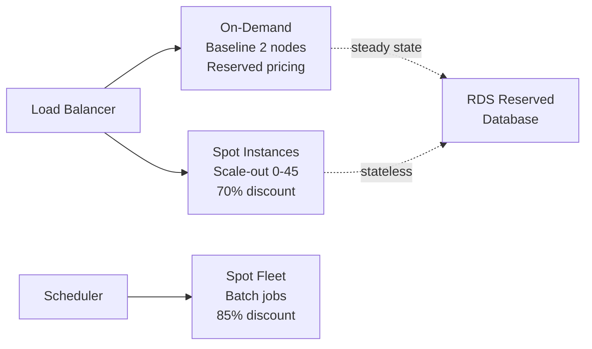

## Keywords in This File
{: .no_toc }

| # | Keyword | Weight |
|---|---------|--------|
| 20 | [Cloud Cost Optimization Patterns](#cloud-cost-optimization-patterns) | ★★☆ |
| 21 | [Reserved vs On-Demand vs Spot Pricing](#reserved-vs-on-demand-vs-spot-pricing) | ★★☆ |

---

# Cloud Cost Optimization Patterns

**Interview Weight:** ★★☆ - Expected at senior level.
Cost optimization is an engineering responsibility.
Unchecked cloud spend is a common operational failure.
Understanding and applying cost optimization patterns
demonstrates operational maturity.

---

### 🎯 Model Answer

**30 seconds:**

> Cloud cost optimization has three levers: right-sizing
> (use appropriate instance types), reservation (commit
> to usage for 40-75% discount), and resource hygiene
> (eliminate idle/unused resources). The biggest wins:
> S3 lifecycle policies for old data (80%+ cost reduction),
> right-sizing oversized instances (often 50% reduction),
> and Reserved Instances for steady-state workloads.
> AWS Cost Explorer identifies the top cost drivers.

**3 minutes:**

> Optimization dimensions:
>
> 1. Right-sizing:
>    - EC2 instances at < 20% CPU utilization are oversized
>    - AWS Compute Optimizer: analyzes metrics, recommends
>      right-sized instance type
>    - Example: m5.xlarge at 5% CPU -> t3.medium = 75% cheaper
>
> 2. Pricing model:
>    - On-Demand: full price, no commitment
>    - Reserved/Savings Plans: 40-75% off for 1-3yr commit
>    - Spot: up to 90% off, can be interrupted 2 min notice
>    - Strategy: Reserved for baseline, On-Demand for burst,
>      Spot for batch/CI
>
> 3. Storage optimization:
>    - S3 lifecycle: move old data to Glacier (93% cheaper)
>    - EBS snapshot cleanup: unused snapshots accumulate cost
>    - Unattached EBS volumes: persist after instance termination
>
> 4. Data transfer:
>    - Inter-AZ transfer: $0.01/GB * high volume = significant
>    - S3 VPC endpoints: free vs NAT Gateway charges
>    - CloudFront: serve static from CDN (reduce origin cost)
>
> 5. Resource hygiene:
>    - Idle EC2 instances: stop/terminate after hours
>    - Unattached EBS volumes: delete
>    - Unused Elastic IPs: release (charged $0.005/hr)
>    - Old CloudWatch log groups: set retention (not infinite)

**Blank Mind Recovery:**

**(1) Three levers:** "Right-size (smaller instances).
Commit (Reserved/Savings Plans).
Clean up (idle resources, old data)."

**(2) Biggest wins:** "Reserved for steady workloads (40-75%).
S3 Glacier lifecycle for old data (80%). Spot for batch."

**(3) Data transfer trap:** "Inter-AZ traffic charges.
Use VPC endpoints to avoid NAT Gateway for AWS services."

---

### 📘 Concept Explanation

**Cost Optimization Hierarchy (80/20 rule):**

```
TOP COST DRIVERS (typical order):
1. EC2 compute (usually 40-60% of bill)
   Win: Reserved Instances = 40-75% savings on baseline
   Win: Right-size oversized instances (Compute Optimizer)
   Win: Stop dev instances after hours

2. RDS database
   Win: Reserved DB instances (30-60% off)
   Win: Aurora Serverless for intermittent workloads
   Win: Stop dev RDS after hours (can pause/resume)

3. Data transfer
   Win: VPC endpoints (avoid NAT for S3, DynamoDB, ECR)
   Win: Co-locate high-traffic services in same AZ
   Win: CloudFront for static assets (reduce origin egress)

4. Storage (S3, EBS)
   Win: S3 lifecycle policies (80-93% reduction for old data)
   Win: Delete unattached EBS volumes
   Win: Delete unused snapshots older than 90 days

5. NAT Gateway
   Win: VPC endpoints bypass NAT entirely for AWS services
   Win: Reduce cross-AZ traffic between microservices
```

**Compute Optimizer Example:**

```
Current instance: m5.xlarge
  vCPU: 4 | RAM: 16GB | Cost: $138/month
  Actual usage: CPU 6%, RAM 2GB

Recommended: t3.medium
  vCPU: 2 | RAM: 4GB | Cost: $30/month (78% savings)

Rationale: burstable t3 handles low-steady + occasional
  bursts better than oversized m5 running at 6% CPU
  t3 credits accumulate during low usage, spend during bursts

WARNING: t3 has CPU burst limits - not suitable for
  sustained CPU-intensive workloads (batch, video encoding)
```

---

### 💻 Code Example

```python
import boto3
from datetime import datetime, timezone

# COST OPTIMIZATION: identify and clean unused resources

ec2 = boto3.client('ec2', region_name='us-east-1')
cloudwatch = boto3.client('cloudwatch')

# 1. Find unattached EBS volumes:
volumes = ec2.describe_volumes(
    Filters=[{'Name': 'status', 'Values': ['available']}]
    # 'available' = not attached to any instance
)

total_wasted_gb = 0
for vol in volumes['Volumes']:
    size = vol['Size']
    total_wasted_gb += size
    cost_per_month = size * 0.08  # gp2 = $0.08/GB
    print(f"Unattached: {vol['VolumeId']} "
          f"{size}GB = ${cost_per_month:.2f}/month")

print(f"Total wasted: ${total_wasted_gb * 0.08:.2f}/month")


# 2. Find unused Elastic IPs:
addresses = ec2.describe_addresses()
for addr in addresses['Addresses']:
    if 'AssociationId' not in addr:
        # Not attached to running instance: $3.60/month
        print(f"Unused EIP: {addr['PublicIp']} "
              f"AllocationId: {addr['AllocationId']}")
        # ec2.release_address(AllocationId=addr['AllocationId'])


# 3. S3 lifecycle policy: major cost reduction
s3 = boto3.client('s3')

# Before lifecycle: 10TB in Standard = $230/month
# After lifecycle: most in Glacier = ~$13/month (94% savings)
s3.put_bucket_lifecycle_configuration(
    Bucket='application-logs',
    LifecycleConfiguration={
        'Rules': [{
            'ID': 'log-cost-optimization',
            'Status': 'Enabled',
            'Filter': {'Prefix': ''},  # All objects
            'Transitions': [
                {
                    'Days': 30,
                    'StorageClass': 'STANDARD_IA'
                    # 0-30 days: Standard $0.023/GB
                    # 30+ days: Standard-IA $0.0125/GB (46% off)
                },
                {
                    'Days': 90,
                    'StorageClass': 'GLACIER_INSTANT_RETRIEVAL'
                    # 90+ days: $0.004/GB (83% off)
                },
                {
                    'Days': 365,
                    'StorageClass': 'DEEP_ARCHIVE'
                    # 365+ days: $0.00099/GB (96% off)
                }
            ],
            'Expiration': {
                'Days': 2555  # 7 years, then delete
            }
        }]
    }
)

# 4. CloudWatch Logs retention: prevent unbounded growth
logs = boto3.client('logs')
log_groups = logs.describe_log_groups()

for lg in log_groups['logGroups']:
    if 'retentionInDays' not in lg:
        # No retention = infinite = expensive
        group_name = lg['logGroupName']
        print(f"No retention: {group_name}")
        # Set 30-day retention for app logs:
        logs.put_retention_policy(
            logGroupName=group_name,
            retentionInDays=30
            # Old events auto-deleted: storage cost controlled
        )
```

> **Code walkthrough:** Four optimization scripts. The EBS
> scan uses `status = available` to find volumes not attached
> to any instance - these are billing continuously at $0.08/GB/month
> with no value. An instance was terminated but EBS was not
> deleted (delete_on_termination=false or manually detached).
> The unused EIP check is a quick win: each unattached Elastic IP
> costs $3.60/month, and teams often accumulate dozens.
> The S3 lifecycle policy is the most impactful single configuration:
> application logs transition from Standard ($0.023/GB) to
> Deep Archive ($0.00099/GB) over time - 96% reduction. For 10TB
> of logs, this is $230/month vs $10/month. The CloudWatch Logs
> retention fix prevents unbounded log accumulation: without a
> retention policy, logs are stored forever at $0.03/GB/month.
> A high-volume service can accumulate hundreds of GB in months.

---

### 🎓 Answers by Seniority

**Junior / Mid:**

> "Cloud cost optimization has three main areas: right-size
> your instances (don't pay for compute you don't use),
> use commitment discounts (Reserved Instances for steady
> workloads), and clean up unused resources (idle instances,
> old snapshots, unattached EBS volumes). S3 lifecycle
> policies automatically move old data to cheaper storage
> tiers - this alone can reduce S3 costs by 80-90%."

---

**Senior / Staff:**

> "Cost optimization is a continuous engineering practice,
> not a one-time project. Three structural changes make
> the biggest impact: Reserved Instance coverage for baseline
> compute (40-75% savings), S3 lifecycle policies for all
> data buckets (80-96% savings on old data), and VPC endpoints
> for AWS service traffic (eliminates NAT Gateway charges for
> S3, ECR, DynamoDB access from within VPC). The hidden cost
> driver most teams miss: inter-AZ data transfer. At high
> request rates, microservices making cross-AZ calls can
> generate thousands of dollars monthly from $0.01/GB transfer
> fees. AWS Cost Explorer with Usage Type granularity reveals
> this. The fix: VPC endpoints and service co-location, not
> code changes."

---

### ⚠️ Common Misconceptions

**Misconception 1: "Cost optimization is a DevOps/finance
responsibility, not an engineering concern."**

Cloud cost is a direct result of architectural decisions:
instance type selection, data transfer patterns, storage
class choices, and resource lifecycle management. Engineers
who don't consider cost make decisions that create large
bills. AWS Well-Architected Framework makes Cost Optimization
one of the six pillars - equal importance to security
and reliability.

**Misconception 2: "Reserved Instances are inflexible."**

Standard Reserved Instances are inflexible (committed to
specific instance type and AZ). But Savings Plans (Compute
and EC2 Instance) commit to spending ($/hour) rather than
specific instances - flexible across instance types, sizes,
and regions. Convertible Reserved Instances allow exchanging
for different instance types. Unused Reserved capacity can
be listed on the Reserved Instance Marketplace.

---

### 🚨 Failure Modes and Diagnosis

**Failure 1: Bill spike from auto-scaling without cap**

*Symptom:* Monthly bill doubles. Auto-scaling event
created 200 EC2 instances during a traffic spike. Traffic
normalized but bill grew dramatically.

*Root cause:* Auto Scaling Group max size not set.
Or max size set too high. No budget alerts configured.

*Prevention:*
```hcl
resource "aws_autoscaling_group" "app" {
  min_size         = 2
  max_size         = 30   # Set explicit cap
  desired_capacity = 5
}

# AWS Budget alert:
resource "aws_budgets_budget" "monthly" {
  name         = "monthly-budget"
  budget_type  = "COST"
  limit_amount = "5000"
  limit_unit   = "USD"
  time_unit    = "MONTHLY"

  notification {
    comparison_operator = "GREATER_THAN"
    threshold           = 80  # Alert at 80%
    threshold_type      = "PERCENTAGE"
    notification_type   = "ACTUAL"
    subscriber_email_addresses = ["billing@company.com"]
  }
}
```

---

**Failure 2: NAT Gateway charges from ECR pulls**

*Symptom:* NAT Gateway "BytesProcessed" metric is high.
Bill shows $500+/month in NAT data charges.

*Root cause:* ECS tasks in private subnets pull Docker images
from ECR through NAT Gateway. Large images (1-2GB) * many
task starts * $0.045/GB = significant.

*Fix:*
```hcl
# VPC endpoint for ECR: free for in-VPC traffic
resource "aws_vpc_endpoint" "ecr_dkr" {
  vpc_id              = aws_vpc.main.id
  service_name        = "com.amazonaws.us-east-1.ecr.dkr"
  vpc_endpoint_type   = "Interface"
  subnet_ids          = aws_subnet.private[*].id
  security_group_ids  = [aws_security_group.vpc_endpoint.id]
  private_dns_enabled = true
  # ECR traffic stays within AWS network, no NAT charges
}

resource "aws_vpc_endpoint" "s3" {
  vpc_id            = aws_vpc.main.id
  service_name      = "com.amazonaws.us-east-1.s3"
  vpc_endpoint_type = "Gateway"
  # Gateway type: free, no security group needed
  # S3 traffic (ECR layers stored in S3) avoids NAT
}
```

---

### 🎯 Interview Deep-Dive

| Category | Count | Coverage |
|---|---|---|
| Conceptual | 2 | Cost optimization patterns, right-sizing, lifecycle policies |
| Trade-off | 2 | Cost vs performance, optimization vs complexity |
| Failure Mode | 2 | Bill spike diagnosis, VPC data transfer costs |
| Debugging | 1 | AWS Cost Explorer analysis workflow |
| Behavioral | 2 | 40% bill spike investigation, $50k optimization |

**Q1. What are the highest-ROI cloud cost optimization patterns
and how do you prioritize them?**

Prioritized by ROI-to-effort ratio:

1. **Reserved Instances / Savings Plans** (40-75% savings, 1 day effort):
   Identify steady-state EC2/RDS usage, purchase 1-year commitments.
   Highest ROI for minimal engineering effort.

2. **Right-sizing over-provisioned resources** (30-80% savings, 1-2 weeks):
   Most cloud resources are over-provisioned by 2-3x. CPU/memory
   utilization under 20% = right-size candidate.

3. **S3 lifecycle policies** (50-96% savings on storage, 1 day effort):
   Data more than 30 days old -> Intelligent Tiering.
   Data more than 90 days old -> Glacier Instant Retrieval.
   Data older than 1 year -> Glacier Deep Archive.

4. **Delete unused resources** (100% savings, 1 week):
   Snapshots, AMIs, idle ELBs, stopped EC2, unused Elastic IPs,
   abandoned RDS instances. Tools: AWS Trusted Advisor, Cost Explorer.

5. **Auto-scaling for variable load** (40-60% savings, 2-4 weeks):
   Eliminate over-provisioning for peak load by scaling down during
   off-peak hours.

6. **VPC Endpoints to avoid NAT Gateway** (variable, 1 day effort):
   High S3/ECR/Secrets Manager traffic through NAT Gateway
   can be rerouted via free Gateway VPC Endpoints.

*What separates good from great:* Starting with Reserved Instances
before optimization. Engineers often spend weeks right-sizing when
a 1-year RI purchase on current (over-provisioned) instances would
save more money faster. RI first, right-size after.

---

**Q2. How do you identify right-sizing opportunities for
EC2 instances?**

```bash
# AWS Compute Optimizer (automated right-sizing recommendations):
aws compute-optimizer get-ec2-instance-recommendations \
  --instance-arns arn:aws:ec2:us-east-1:123456789012:instance/i-xxx
# Output: recommended_instance_type, projected_utilization,
#         estimated_monthly_savings

# Manual: CloudWatch CPU/memory metrics (2-week baseline):
aws cloudwatch get-metric-statistics \
  --namespace AWS/EC2 \
  --metric-name CPUUtilization \
  --dimensions Name=InstanceId,Value=i-xxx \
  --start-time 2024-01-01T00:00:00Z \
  --end-time 2024-01-15T00:00:00Z \
  --period 3600 \
  --statistics Average,Maximum

# Interpretation:
# Average CPU < 10%, Maximum < 30%: right-size down 1-2 sizes
# Average CPU > 70%: already well-utilized, do not right-size
# Average CPU 10-40%, Maximum 80-100%: burstable instance (T3/T4g)
#   might be appropriate (pays per actual burst, cheaper for spiky)
```

Memory metrics require CloudWatch agent (not default):
```bash
# Install CW agent on EC2 to get memory metrics:
# Then check: mem_used_percent
# If both CPU < 20% AND memory < 30%: downsize both dimensions
```

*What separates good from great:* The burstable instance insight.
T3/T4g instances use CPU credits. For workloads that are idle 90%
of the time but need full CPU for short bursts, T3 is often 50%
cheaper than M5 with equivalent peak performance.

---

**Q3. How do S3 storage classes work and how do lifecycle
policies reduce storage costs?**

| Storage Class | Cost (GB/mo) | Retrieval | Min Duration | Use Case |
|---|---|---|---|---|
| Standard | $0.023 | Instant | None | Frequently accessed |
| Intelligent Tiering | $0.023 (active) | Instant | None | Unknown/variable access |
| Standard-IA | $0.0125 | Instant | 30 days | Infrequent, fast retrieval |
| Glacier Instant | $0.004 | Milliseconds | 90 days | Archives, rare access |
| Glacier Flexible | $0.0036 | 1-12 hours | 90 days | Backups, yearly access |
| Glacier Deep Archive | $0.00099 | 12-48 hours | 180 days | Compliance archives |

Lifecycle policy example:
```json
{
  "Rules": [{
    "ID": "cost-optimization",
    "Status": "Enabled",
    "Transitions": [
      {"Days": 30, "StorageClass": "INTELLIGENT_TIERING"},
      {"Days": 90, "StorageClass": "GLACIER_IR"},
      {"Days": 365, "StorageClass": "DEEP_ARCHIVE"}
    ],
    "Expiration": {"Days": 2555}  // delete after 7 years
  }]
}
```

Intelligent Tiering note: automatically moves objects between
frequent and infrequent access tiers. No retrieval fee.
Monitoring fee: $0.0025/1000 objects/month (only worthwhile
for objects > 128KB).

*What separates good from great:* The minimum storage duration
caveat. If you store something in Standard-IA for 15 days and
then delete it, you pay for 30 days. For frequently deleted data
(processed files, temp uploads), Standard is cheaper than IA
despite higher per-GB price.

---

**Q4. DEBUGGING: Your AWS bill is 40% higher than last month
with no new services deployed. How do you investigate?**

```bash
# Step 1: Cost Explorer - find the cause by service and time:
aws ce get-cost-and-usage \
  --time-period Start=2024-01-01,End=2024-01-31 \
  --granularity DAILY \
  --group-by Type=DIMENSION,Key=SERVICE \
  --metrics BlendedCost
# Shows: cost by service, day by day
# Find: which service increased, which day it started

# Step 2: Drill into the spike service (e.g., EC2-Other):
aws ce get-cost-and-usage \
  --time-period Start=2024-01-15,End=2024-01-16 \
  --granularity HOURLY \
  --filter '{"Dimensions":{"Key":"SERVICE","Values":["EC2-Other"]}}' \
  --group-by Type=DIMENSION,Key=USAGE_TYPE
# EC2-Other includes: NAT Gateway, data transfer, EBS snapshots

# Step 3: Common causes of unexpected 40% increase:
# a. Data transfer (EC2-Other 'DataTransfer-Out-Bytes')
#    -> check if traffic spiked or a new cross-region call was added
# b. NAT Gateway (NatGateway-Bytes)
#    -> check for new containers pulling large images through NAT
# c. Snapshot accumulation (EBS:SnapshotUsage)
#    -> check for missing snapshot retention policies
# d. New provisioned resources (ECS tasks, RDS instances)
#    -> check CloudTrail for resource creation events

# Step 4: Tag-based analysis:
aws ce get-cost-and-usage ... \
  --group-by Type=TAG,Key=Environment,Type=TAG,Key=Team
# Find which team or environment is responsible
```

*What separates good from great:* The NAT Gateway data transfer
cost pattern. A team that adds a new service pulling Docker images
from ECR through a NAT Gateway can generate $500-2000/month in
NAT charges. ECR is an S3-backed service; a Gateway VPC Endpoint
for S3 eliminates this cost entirely.

---

**Q5. What is a VPC Endpoint and how does it reduce data
transfer costs?**

VPC Endpoint: private connection from a VPC to AWS services
without traffic leaving the AWS network.

Two types:

**Gateway Endpoint (FREE)**: for S3 and DynamoDB only.
```hcl
resource "aws_vpc_endpoint" "s3" {
  vpc_id       = aws_vpc.main.id
  service_name = "com.amazonaws.us-east-1.s3"
  # Add route to private subnet route tables:
  route_table_ids = [aws_route_table.private.id]
  # S3 traffic via gateway endpoint: FREE
  # S3 traffic via NAT Gateway: $0.045/GB
}
```

**Interface Endpoint (HOURLY COST)**: for all other AWS services.
```hcl
resource "aws_vpc_endpoint" "ecr_api" {
  vpc_id            = aws_vpc.main.id
  service_name      = "com.amazonaws.us-east-1.ecr.api"
  vpc_endpoint_type = "Interface"
  # Cost: $0.01/hour per AZ + $0.01/GB processed
  # Break-even vs NAT: > 3.5 GB/hour of ECR traffic
}
```

NAT Gateway cost avoided by VPC Endpoints:
```
NAT Gateway: $0.045/GB processed + $0.045/hour
S3 Gateway Endpoint: FREE

Example: 100GB/day S3 traffic through NAT
= $4.50/day = $135/month (just data transfer)
VPC Endpoint: $0 (Gateway endpoint is free)
Savings: $135/month with 1-hour implementation
```

*What separates good from great:* Knowing that ECR (Docker images)
stores layers in S3. Adding the Gateway VPC Endpoint for S3 (not
just the ECR Interface Endpoint) is what captures the cost savings
for ECR image pulls.

---

**Q6. TRADE-OFF: Optimize for cost vs optimize for performance.
How do you make the decision?**

Framework: optimize where the cost reduction does not impact user
experience; accept cost for user-facing performance.

Cost optimization SAFE zones:
- Batch processing, analytics: Spot Instances (70-90% savings)
  Interruptions acceptable; jobs retry from checkpoint
- Non-prod environments: scale to zero at night/weekends
  (Lambda scheduler: `desired_count = 0` at 8PM, 2 at 8AM)
- Data storage: lifecycle policies for old data
- Idle resources: delete stopped EC2, unused snapshots

Cost optimization RISKY zones:
- API tier: right-sizing too aggressively leaves no headroom for
  traffic spikes. A t3.medium API handling 60% CPU has no room
  for a 2x traffic spike.
- Database: under-provisioning DB causes cascading latency
  issues across the entire application
- Single points of failure: cost of one more instance < cost
  of one hour of downtime

Decision rule:
```
Savings > $100/month AND P99 latency impact < 5%: optimize
Savings > $500/month AND P99 latency impact < 20%: optimize
Any impact on availability SLA: do not optimize
```

*What separates good from great:* Measuring performance AFTER
optimization, not predicting. Right-size an instance in a staging
environment, run load tests to P99 latency at 2x production load,
then apply to production.

---

**Q7. How do you use AWS Cost Explorer and Savings Plans
analyzer to identify RI and Savings Plans opportunities?**

```bash
# Step 1: Get Savings Plans recommendations:
aws ce get-savings-plans-purchase-recommendation \
  --savings-plans-type COMPUTE_SP \
  --term-in-years ONE_YEAR \
  --payment-option NO_UPFRONT \
  --lookback-period-in-days SIXTY_DAYS
# Output: recommended_commitment ($/hour), estimated_savings
# Shows: how much Compute Savings Plan to buy for 60-day usage pattern

# Step 2: Get RI recommendations for RDS:
aws ce get-reservation-purchase-recommendation \
  --service "Amazon Relational Database Service" \
  --term-in-years ONE_YEAR \
  --payment-option PARTIAL_UPFRONT
# Output: per-instance recommendations, estimated savings

# Step 3: Check current coverage:
aws ce get-savings-plans-coverage \
  --time-period Start=2024-01-01,End=2024-01-31
# Shows: % of eligible usage covered by Savings Plans
# Coverage < 70%: significant on-demand spend opportunity

# Step 4: Coverage report for RI:
aws ce get-reservation-coverage \
  --time-period Start=2024-01-01,End=2024-01-31
# Shows: On-Demand Hours, Reserved Hours, Coverage%
```

*What separates good from great:* Buying Compute Savings Plans
instead of EC2 Instance Savings Plans or standard RIs for EC2.
Compute SP applies to any EC2 instance family, size, region, and
OS. This means you don't lose savings if you right-size or change
instance families - the commitment automatically re-applies.

---

**Q8. What is auto-scaling and how do you configure it to
reduce cost while maintaining performance?**

```hcl
# Target tracking scaling (simplest, highest value):
resource "aws_autoscaling_policy" "cpu" {
  name                   = "cpu-target-tracking"
  autoscaling_group_name = aws_autoscaling_group.app.name
  policy_type            = "TargetTrackingScaling"
  target_tracking_configuration {
    predefined_metric_specification {
      predefined_metric_type = "ASGAverageCPUUtilization"
    }
    target_value = 60.0  # target 60% CPU average
    # Scale out when CPU > 60%, scale in when CPU < 60%
  }
}

# Scheduled scaling for predictable patterns:
resource "aws_autoscaling_schedule" "scale_down_night" {
  scheduled_action_name  = "scale-down-night"
  min_size               = 0
  max_size               = 2
  desired_capacity       = 1  # run minimum at night
  recurrence             = "0 20 * * 1-5"  # 8PM weekdays
  autoscaling_group_name = aws_autoscaling_group.app.name
}

# Cost impact:
# If avg load is 30% of peak, and peak is 6 hours/day:
# Properly scaled: 3 instances at peak, 1 instance overnight
# Fixed provisioned: 3 instances 24/7
# Savings: 18 instance-hours/day = 60% cost reduction
```

*What separates good from great:* Setting scale-in cooldown longer
than scale-out cooldown. Scale out quickly (CPU spike = scale NOW),
scale in slowly (wait 5-10 minutes of low CPU before removing an
instance). This prevents oscillation (scale in -> traffic spikes
-> scale out -> repeat every 5 minutes).

---

**Q9. BEHAVIORAL: Your team has a $50k/month AWS bill.
How do you start optimizing?**

Week 1: Establish baseline and quick wins
```bash
# 1. Enable Cost Explorer, view by service and tag
# 2. Run AWS Trusted Advisor cost checks
# 3. Check Compute Optimizer for right-sizing recommendations
# 4. Delete obvious waste:
#    - Snapshots older than 30 days (check retention policy)
#    - Stopped EC2 instances not returning to service
#    - Elastic IPs not attached to running instances
#    - Old AMIs with no active instances
```

Week 2-4: Analysis and RI/SP purchase
```bash
# 1. Check RI/Savings Plans coverage:
#    If < 70% covered: buy Compute Savings Plans
#    For $50k/mo: typically $15-20k/mo could be covered
#    1-year no-upfront SP: 30% immediate savings on that portion
# 2. Right-size top 10 highest-cost instances:
#    EC2 Compute Optimizer recommendations
```

Month 2+: Architectural optimization
- Auto-scaling for variable-load services
- VPC Endpoints for S3/ECR traffic
- S3 lifecycle policies for all storage buckets
- Spot Instances for CI/CD and batch processing
- Reserved Instances for RDS (if not on Savings Plans)

Tracking:
- Tag all resources with Team and Environment
- Create monthly cost report per team
- Set budget alerts at 80% and 100% of team budget

*What separates good from great:* Buying Compute Savings Plans
before engineering work. A 1-year no-upfront Compute SP takes
30 minutes to purchase and delivers immediate 30% savings on
covered compute. This frees engineering time for harder
architectural optimizations.

---

### ⚖️ Comparison Table

| Optimization | Savings | Effort | When to Apply |
|-------------|---------|--------|--------------|
| S3 lifecycle to Glacier | 80-96% | Low | All data buckets |
| Reserved Instances | 40-75% | Medium | Steady compute |
| Right-sizing EC2 | 30-80% | Medium | After baseline measurement |
| VPC Endpoints | Variable | Low | High S3/ECR traffic |
| Spot Instances | Up to 90% | High | Batch/CI workloads |
| CloudWatch retention | Variable | Low | All log groups |
| Stop dev instances | ~70% | Low | Dev/test environments |
| Delete orphan EBS/EIP | 100% of waste | Low | Regular hygiene |

---

### 🏛️ System Design

*(Omit: ★★☆ - system design is for ★★★ only.)*

### 📊 Diagram

*(Omit: cost optimization is best expressed as code and tables.)*

---

---

# Reserved vs On-Demand vs Spot Pricing

**Interview Weight:** ★★☆ - Common architecture decision.
Understanding AWS pricing models and when to use each
is a standard senior cloud interview topic. Choosing
the wrong pricing model for a workload wastes significant
money or creates availability risk.

---

### 🎯 Model Answer

**30 seconds:**

> Three EC2 pricing tiers: On-Demand (full price, no
> commitment), Reserved (40-75% off, 1-3yr commitment),
> Spot (up to 90% off, 2-minute termination notice).
> Strategy: Reserved for baseline steady load, On-Demand
> for predictable bursts and stateful, Spot for batch
> jobs, CI runners, and fault-tolerant stateless workloads.
> Savings Plans are flexible reserved (commit to $/hour
> spend, not specific instance type).

**3 minutes:**

> On-Demand:
> - Highest per-hour price. No commitment.
> - Best for: unpredictable, short-lived, stateful
>   workloads that can't survive interruption
>
> Reserved Instances (RI):
> - 1-year: 40% savings. 3-year: 60-75% savings.
> - Standard RI: locked to instance type, OS, region
> - Convertible RI: can exchange (slightly less discount)
> - Payment options: All Upfront > Partial > No Upfront
>   (more upfront = more discount)
>
> Savings Plans:
> - Compute SP: flexible across instance family, OS, region
>   (same 66% savings as Convertible RI)
> - EC2 Instance SP: locked to instance family, more discount
> - Commit to $/hour spend, not specific instances
>   Covers EC2, Fargate, Lambda
>
> Spot Instances:
> - Up to 90% discount. Market-priced.
> - 2-minute termination notice (can enable graceful shutdown)
> - Use for: batch processing, CI/CD runners, stateless
>   Spark jobs, rendering, training jobs
> - Never for: databases, sessions, leader nodes, stateful
>
> Optimal strategy:
> - Baseline: Reserved/Savings Plans (predictable steady)
> - Burst: On-Demand (automatic scale, stateful)
> - Batch: Spot (interrupt-tolerant, cost-optimized)

**Blank Mind Recovery:**

**(1) Three tiers:** "On-Demand: full price, flexible.
Reserved: 40-75% off, commitment. Spot: 90% off, can terminate."

**(2) Spot rule:** "Only for interrupt-tolerant workloads.
Never databases, never sessions, never leaders."

**(3) Savings Plans:** "Flexible reserved. Commit to $/hour
spend, flexible across instance families."

---

### 📘 Concept Explanation

**Pricing Comparison:**

```
m5.xlarge in us-east-1 (1 month = 730 hours):
  On-Demand:           $0.192/hr = $140/month
  1-yr Reserved (no upfront): $0.118/hr = $86/month (39% off)
  3-yr Reserved (all upfront): $0.075/hr = $55/month (61% off)
  Spot (typical):       $0.058/hr = $42/month (70% off)
  Spot (low-demand):    $0.025/hr = $18/month (87% off)

BREAK-EVEN (On-Demand vs 1yr Reserved):
  If running > 7.3 months/year: Reserved is cheaper
  If running < 7.3 months/year: On-Demand is cheaper

SAVINGS PLAN example:
  Commit: $0.10/hour in Compute Savings Plan
  AWS applies 66% off EC2, Fargate, Lambda hourly charges
  If you spend $0.15/hr but committed $0.10:
    First $0.10: at Savings Plan rate (66% off)
    Next $0.05: at On-Demand rate
```

**Spot Interruption Risk:**

```
SPOT AVAILABILITY POOLS:
  Each (region, AZ, instance type, OS) = pool
  Pool capacity depends on unused EC2 capacity
  Low capacity in pool -> higher interruption frequency

MITIGATION:
  1. Diversify across multiple instance types:
     m5.xlarge, m4.xlarge, m5a.xlarge, m5d.xlarge
     Statistically unlikely all pools interrupted simultaneously
  2. Diversify across AZs
  3. Use Spot Fleet or EC2 Auto Scaling with mixed policy
  4. Handle SIGTERM: 2 minutes to checkpoint state

WORKLOADS SUITABLE FOR SPOT:
  - CI/CD build jobs (restartable)
  - Batch data processing (checkpoint supported)
  - Kubernetes worker nodes (pods rescheduled on interrupt)
  - ML training (checkpoint frequent)
  - Video encoding (segment-based)
```

---

### 💻 Code Example

```hcl
# TERRAFORM: Mixed On-Demand + Spot Auto Scaling Group
# Baseline: On-Demand. Scale: Spot. Batch: Spot only.

# MIXED POLICY: 2 baseline On-Demand + Spot for scaling
resource "aws_autoscaling_group" "app" {
  name = "app-mixed-asg"

  mixed_instances_policy {
    instances_distribution {
      on_demand_base_capacity                  = 2
      # First 2 instances are always On-Demand (stable baseline)
      on_demand_percentage_above_base_capacity = 0
      # Additional instances: 100% Spot
      spot_allocation_strategy = "capacity-optimized"
      # Picks pool least likely to be interrupted
    }

    launch_template {
      launch_template_specification {
        launch_template_id = aws_launch_template.app.id
        version            = "$Latest"
      }

      # Diversify across instance types:
      override {
        instance_type = "m5.xlarge"
      }
      override {
        instance_type = "m5a.xlarge"
      }
      override {
        instance_type = "m5d.xlarge"
      }
      override {
        instance_type = "m4.xlarge"
      }
      # 4 instance types: reduces interruption probability
    }
  }

  min_size         = 2
  max_size         = 50
  desired_capacity = 5

  # Multi-AZ for Spot diversification:
  vpc_zone_identifier = aws_subnet.private[*].id

  health_check_type         = "ELB"
  health_check_grace_period = 300
}


# SPOT FLEET for batch jobs:
resource "aws_spot_fleet_request" "batch" {
  iam_fleet_role                      = aws_iam_role.spot_fleet.arn
  spot_price                          = "0.07"  # Max bid price
  target_capacity                     = 20
  allocation_strategy                 = "diversified"
  terminate_instances_with_expiration = true

  launch_specification {
    instance_type = "m5.xlarge"
    ami           = data.aws_ami.amazon_linux.id
    subnet_id     = aws_subnet.private[0].id
    user_data = base64encode(<<-EOF
      #!/bin/bash
      # Handle Spot termination signal:
      TOKEN=$(curl -X PUT -H "X-aws-ec2-metadata-token-ttl-seconds: 21600" \
        http://169.254.169.254/latest/api/token)
      while true; do
        TERMINATION=$(curl -H "X-aws-ec2-metadata-token: $TOKEN" \
          http://169.254.169.254/latest/meta-data/spot/termination-time 2>/dev/null)
        if [ ! -z "$TERMINATION" ]; then
          echo "Spot termination in 2 minutes - checkpointing"
          pkill -SIGTERM batch-job  # Signal job to checkpoint
          break
        fi
        sleep 5
      done &
      # Start batch job:
      /usr/local/bin/process-batch-job
    EOF
    )
  }

  launch_specification {
    instance_type = "m4.xlarge"  # Diversify
    ami           = data.aws_ami.amazon_linux.id
    subnet_id     = aws_subnet.private[1].id
  }
}


# SAVINGS PLAN commitment (via AWS Console or CLI):
# aws savingsplans purchase-savings-plan \
#   --savings-plan-type ComputeSavingsPlan \
#   --payment-option NoUpfront \
#   --duration-seconds 31536000 \  # 1 year
#   --commitment 0.50               # $0.50/hour commitment
# AWS applies 66% discount to first $0.50/hr of Compute
```

> **Code walkthrough:** The mixed instances policy is the
> production pattern: `on_demand_base_capacity = 2` ensures
> two stable, uninterruptible instances always run for
> the baseline workload. `on_demand_percentage_above_base = 0`
> means all scale-out instances are Spot. The `capacity-optimized`
> allocation strategy (not `lowest-price`) picks the Spot pool
> with the most available capacity - empirically this reduces
> interruptions significantly because pools with capacity
> are less likely to reclaim it. The four instance type overrides
> (m5.xlarge, m5a.xlarge, m5d.xlarge, m4.xlarge) diversify
> across pools: if m5.xlarge capacity runs out in one AZ,
> Spot Fleet can use m5a.xlarge from another pool. The Spot
> termination handler in the user_data polls the instance
> metadata endpoint every 5 seconds: when a termination notice
> appears, it signals the batch job to checkpoint state before
> the 2-minute window closes.

---

### 🎓 Answers by Seniority

**Junior / Mid:**

> "Three EC2 pricing models: On-Demand (full price, no
> commitment), Reserved (40-75% off, 1-3 year commitment),
> and Spot (up to 90% off, can be terminated with 2 minutes
> notice). Use On-Demand for unpredictable workloads,
> Reserved for steady-state production, and Spot for batch
> jobs that can handle interruption."

---

**Senior / Staff:**

> "Pricing model selection is as important as instance type
> selection. The financial framework: Reserved coverage for
> baseline steady-state compute (40-75% savings), On-Demand
> for burst capacity, Spot for interrupt-tolerant batch.
> The key Spot engineering decision: capacity-optimized
> allocation strategy (not lowest-price) reduces interruptions
> at a small premium. Spot termination handler is non-negotiable:
> without it, in-flight batch jobs lose their work on interruption.
> Savings Plans vs Reserved: Savings Plans are better for
> organizations that change instance types frequently - commit
> to $/hour spend, flexible across instance families. Standard
> Reserved requires exchanging or letting unused capacity bill
> at On-Demand if you change instance types."

---

### ⚠️ Common Misconceptions

**Misconception 1: "Spot instances are unreliable."**

Spot interruption rates are typically 2-5% per day for
well-diversified fleets (multiple instance types, multiple
AZs). Most interruptions happen during 9-10am business
hours when On-Demand capacity is high. With capacity-optimized
strategy and 4+ instance types, Spot is reliable for batch.
The risk is workload-specific: stateless batch with checkpointing
is highly suitable; stateful databases are not.

**Misconception 2: "Reserved Instances always save money."**

Reserved Instances only save money if the instance runs
for most of the commitment period. If you buy a 1-year
Reserved Instance for a service that runs 6 months and
is retired, the 6 months of unused reservation costs money
vs On-Demand. Always analyze utilization history before
purchasing. The Reserved Instance Marketplace can sell
unused capacity, but at a discount.

---

### 🚨 Failure Modes and Diagnosis

**Failure 1: Spot interruption causes batch job failure**

*Symptom:* Batch job fails during nightly run. Instance
terminated mid-job. No checkpoint. Job must restart from
beginning.

*Root cause:* Spot termination not handled. Job state
not checkpointed.

*Fix:* Implement termination handler. Enable graceful
checkpoint before 2-minute window closes.

```bash
# Spot termination polling (run as background process):
while true; do
  # Query IMDS v2 for termination notice:
  TOKEN=$(curl -sf -X PUT \
    -H "X-aws-ec2-metadata-token-ttl-seconds: 30" \
    http://169.254.169.254/latest/api/token)
  STATUS=$(curl -sf -o /dev/null -w "%{http_code}" \
    -H "X-aws-ec2-metadata-token: $TOKEN" \
    http://169.254.169.254/latest/meta-data/spot/termination-time)
  if [ "$STATUS" == "200" ]; then
    echo "Spot termination notice received"
    /usr/local/bin/checkpoint-job.sh
    exit 0
  fi
  sleep 5
done
```

---

**Failure 2: Reserved Instances under-utilized**

*Symptom:* Reserved Instance coverage report shows
30% of reservations unused. Billing shows RI charges
but instances are running On-Demand.

*Root cause:* Reserved Instances purchased in wrong AZ
or wrong instance type after team changed architecture.

*Diagnosis:*
```bash
# Check Reserved Instance utilization:
aws ec2 describe-reserved-instances-modifications
# Look for reservations with 0% utilization

# Use Cost Explorer:
# Cost Explorer -> Reservations -> Coverage
# Shows which instance types are covered vs On-Demand
```

*Fix:* Exchange Standard RIs for Convertible RIs
(allows type change). Or use Compute Savings Plans
which auto-apply to any instance type.

---

### 🎯 Interview Deep-Dive

| Category | Count | Coverage |
|---|---|---|
| Conceptual | 2 | Purchase option hierarchy, Spot interruption |
| Trade-off | 2 | 1yr vs 3yr commitment, Savings Plans vs RIs |
| Failure Mode | 2 | Spot interruption handling, RI stranded |
| Debugging | 1 | Spot capacity unavailable diagnosis |
| Behavioral | 2 | Spot for batch, RI purchase recommendation |

**Q1. What is the EC2 pricing hierarchy and when does each
purchase option make sense?**

| Option | Discount | Commitment | Interruption | Best For |
|---|---|---|---|---|
| On-Demand | 0% | None | Never | Unknown workloads, short-lived |
| 1-yr Reserved | 40% | 1 year | Never | Steady-state production |
| 3-yr Reserved | 60-75% | 3 years | Never | Long-term stable |
| Savings Plans | 30-66% | 1-3 years | Never | Mixed/changing instances |
| Spot | 70-90% | None | 2-min notice | Batch, CI, fault-tolerant |

Decision rules:
- **Steady-state production** (runs 24/7, same instance type for
  1 year): 1-year Reserved Instance or Compute Savings Plan.
  Both give ~40% off vs on-demand.

- **Bursty production** (varies by day/week, may change instance
  type): Compute Savings Plans (applies to any EC2 configuration,
  unlike RIs that are locked to instance family).

- **Batch, CI/CD, non-critical**: Spot Instances (70-90% off).
  Must tolerate 2-minute interruption notice.

- **New workloads, experiments**: On-Demand until usage pattern
  is established (usually 1-3 months). Then evaluate Savings Plans.

*What separates good from great:* Mixing purchase options in the
same ASG. "Base capacity" = Reserved Instances (steady load).
"Burst capacity" = Spot Instances (peak load). On-Demand as last
resort (when Spot unavailable). This pattern captures 40-70% cost
savings across the fleet.

---

**Q2. How do EC2 Spot Instances work and what triggers an
interruption?**

Spot Instances: excess EC2 capacity sold at discount. AWS can
reclaim the capacity with a 2-minute warning.

Interruption causes:
- AWS needs capacity back for on-demand customers
- Spot price exceeds your maximum price (rarely the cause;
  AWS changed Spot billing in 2017: you pay current Spot price,
  not your max bid. Max bid is now just a hard limit.)

Interruption notification:
```bash
# Instance metadata - check for impending interruption:
curl http://169.254.169.254/latest/meta-data/spot/interruption-action
# Returns 'terminate' 2 minutes before termination
# Poll this endpoint every 5 seconds in your startup script:

#!/bin/bash
while true; do
  STATUS=$(curl -s http://169.254.169.254/latest/meta-data/\
spot/termination-time 2>/dev/null)
  if [ ! -z "$STATUS" ]; then
    echo "SPOT INTERRUPTION: termination at $STATUS"
    # Graceful shutdown: drain queue, checkpoint, notify
    /app/shutdown-gracefully.sh
    break
  fi
  sleep 5
done &
```

Interruption rates by instance type (approximate):
- Small, common types (m5.large): 5-15% monthly rate
- Large, less common (x1e.32xlarge): < 1% monthly rate
- Diversify across multiple instance types and AZs to reduce
  simultaneous interruption risk

*What separates good from great:* The instance diversification
strategy. A Spot Fleet requesting only `m5.large` in one AZ will
have all instances interrupted simultaneously during a capacity
reclaim event. Requesting `m5.large`, `m4.large`, `m5a.large`
across 3 AZs means interruptions are unlikely to hit all at once.

---

**Q3. What are Compute Savings Plans and how do they differ
from EC2 Instance Savings Plans and Reserved Instances?**

| Type | Applies To | Flexibility | Discount |
|---|---|---|---|
| EC2 Instance SP | Specific family + region | Can change size/OS in family | 40% |
| Compute SP | Any EC2, Fargate, Lambda | Full flexibility | 30% |
| EC2 RI (Standard) | Specific instance type + AZ | None | 40-60% |
| EC2 RI (Convertible) | Specific family | Can exchange to different family | 30-54% |

Compute Savings Plans:
- Apply to any EC2 instance (any family, any size, any region, any OS)
- Apply to Fargate tasks and Lambda invocations
- 1-year or 3-year commitment
- Payment: No Upfront, Partial Upfront, All Upfront

When to use Compute SP (most teams):
- Applying to all compute: EC2 + Fargate + Lambda in one commitment
- Team changes instance types or sizes over time
- Multi-region: one SP applies globally

When to use EC2 Instance SP:
- Same instance family for certain for 1 year
- Want maximum EC2 discount (extra 10% vs Compute SP)

When to use Standard RI:
- Absolute certainty about instance type AND Availability Zone
- Want to sell unused capacity on RI Marketplace

*What separates good from great:* Knowing the Savings Plans
automated application order. AWS applies Savings Plans to usage
starting with the highest discount match first. If you have both
a Compute SP and an EC2 Instance SP, the Instance SP applies
first (higher discount) and Compute SP covers the rest.

---

**Q4. DEBUGGING: Your Spot Fleet is not launching any instances
despite requesting 100 units of capacity. How do you diagnose?**

```bash
# Step 1: Check Spot Fleet request status:
aws ec2 describe-spot-fleet-requests \
  --spot-fleet-request-ids sfr-xxx
# ActivityStatus: 'error' means problem
# FulfilledCapacity: how many units actually launched

# Step 2: Check Spot Fleet history for specific errors:
aws ec2 describe-spot-fleet-request-history \
  --spot-fleet-request-id sfr-xxx \
  --start-time 2024-01-01T00:00:00Z
# Common errors:
# 'capacity-not-available': requested types not available in AZs
# 'price-too-low': max price below current Spot price
# 'spot-fleet-insufficient-capacity': all instance types exhausted

# Step 3: Check individual instance type availability:
aws ec2 get-spot-placement-scores \
  --instance-types '["m5.large","m5a.large","m4.large"]' \
  --target-capacity 100 \
  --target-capacity-unit-type units
# Returns: best regions/AZs for this request

# Step 4: Expand instance type diversity:
# From: requesting only m5.large
# To: m5.large, m5a.large, m4.large, t3.large (all similar performance)
# Increases probability of capacity being available
```

*What separates good from great:* Using the Spot Placement Score
before submitting a large Spot request. The score shows which
combination of region/AZ/instance-types has the best probability
of fulfillment. Check it before needing the capacity.

---

**Q5. How do you calculate the ROI of a 3-year Reserved Instance
vs on-demand pricing?**

```
Example: m5.xlarge in us-east-1

On-Demand:
  $0.192/hour * 8760 hours/year * 3 years = $5,045 total

1-Year RI (All Upfront):
  $1,164 upfront for 1 year = $0.133/hour
  3 purchases = $3,492 total
  Savings: $1,553 (31%) vs on-demand

3-Year RI (All Upfront):
  $2,286 upfront for 3 years = $0.087/hour
  Savings: $2,759 (55%) vs on-demand

Break-even analysis:
  All-Upfront RI: break even at month 8-10 (vs on-demand)
  No-Upfront RI: break even at month 6-8 (lower upfront risk,
  slightly less total savings)
```

Risk factors for 3-year commitment:
- Will this instance type still fit the workload in 3 years?
- What if we migrate to Fargate/Lambda? (Savings Plans better)
- What if we move to a different AWS region? (RI is region-locked)

For most production RDS databases (PostgreSQL, MySQL) running 3+
years: 3-year Convertible RI is standard practice. For EC2: prefer
Compute Savings Plans (flexible) unless instance family is certain.

*What separates good from great:* Knowing the RI Marketplace. If
you commit to a 3-year RI and the workload changes, you can sell
the remaining RI time on AWS Marketplace (Standard RIs only, not
Convertible). This exit option reduces the risk of long commitments.

---

**Q6. TRADE-OFF: 1-year vs 3-year Reserved Instance. How do
you decide?**

| Dimension | 1-Year | 3-Year |
|---|---|---|
| Discount (All Upfront) | 40% | 60-75% |
| Upfront cash | Lower | Higher |
| Flexibility | Can re-evaluate yearly | Locked for 3 years |
| Technology risk | Low (1 year) | Higher (3 years = 2027) |
| Break-even vs On-Demand | Month 8-10 | Month 8-12 |

Decision factors:

**Choose 3-year when:**
- Long-running database infrastructure (RDS PostgreSQL, MySQL).
  Databases rarely change instance type or move regions.
- Core application servers with well-understood load
- CFO/finance asking for cost predictability over 3 years

**Choose 1-year when:**
- Technology migration possible in 2-3 years
  (evaluating Kubernetes, Fargate, serverless migration)
- Instance family may change (newer AMD/Graviton generation
  releases typically every 18 months)
- First time buying RIs: validate pattern before committing 3 years

**Hybrid approach (common in production):**
- Buy 3-year Convertible RIs (allows exchange to newer instance
  family when AWS releases Graviton3 or better)
- Top up with 1-year Standard RIs for stable workloads

*What separates good from great:* Buying Convertible RI for 3 years
instead of Standard RI. The Convertible RI can be exchanged to a
newer instance type (e.g., m5 -> m6g Graviton) without losing the
commitment. Standard RI cannot be exchanged. The extra flexibility
costs ~10% less discount.

---

**Q7. What is a Spot Fleet and when would you use it vs
a simple Spot Instance request?**

Single Spot Instance request: requests a specific instance type in
a specific AZ. If that type is unavailable: request fails.

Spot Fleet: requests a mix of instance types and AZs to maintain
a target capacity. Automatically substitutes when one type is
interrupted or unavailable.

```json
{
  "TargetCapacity": 100,
  "AllocationStrategy": "diversified",
  "LaunchSpecifications": [
    {"InstanceType": "m5.large", "SubnetId": "subnet-az1"},
    {"InstanceType": "m5a.large", "SubnetId": "subnet-az1"},
    {"InstanceType": "m4.large", "SubnetId": "subnet-az2"},
    {"InstanceType": "m5.large", "SubnetId": "subnet-az2"},
    {"InstanceType": "t3.large", "SubnetId": "subnet-az3"}
  ]
}
```

Allocation strategies:
- `lowestPrice`: always use cheapest available (highest interruption risk)
- `diversified`: spread across all specified pools (lowest interruption risk)
- `capacityOptimized`: choose pools with most available capacity
  (lowest interruption probability, usually recommended)

Use Spot Fleet when:
- Need 10+ Spot instances: diversification reduces interruption impact
- Batch processing where partial interruption is acceptable
- CI/CD worker pools (can run 80 of 100 jobs if 20 instances interrupted)

*What separates good from great:* `capacityOptimized` as the
allocation strategy. Most engineers default to `lowestPrice` but
`capacityOptimized` minimizes interruption probability by selecting
instance pools with the most available capacity, which correlates
with lower interruption rates.

---

**Q8. How do Compute Savings Plans differ from EC2 Instance
Savings Plans and how do they interact?**

Application order (automatic, most specific first):
```
1. EC2 Instance Savings Plans applied first
   (most specific = highest discount)
2. Compute Savings Plans applied second
   (catch-all for remaining eligible usage)
3. On-Demand rate applied to uncovered usage
```

Practical example:
```
Usage: 100 m5.large hours in us-east-1 (Linux)
       50 Lambda GB-seconds
       20 Fargate vCPU hours

Have: $5/hr EC2 Instance SP (m5 family, us-east-1)
      $3/hr Compute SP

Application:
- m5.large first covered by EC2 Instance SP (best rate)
  When exhausted: Compute SP covers remaining m5.large
- Lambda: Compute SP only (EC2 SP doesn't apply)
- Fargate: Compute SP only (EC2 SP doesn't apply)
```

Optimization: buy EC2 Instance SP for your primary instance family
(highest discount for that specific commitment), then add Compute SP
for Fargate/Lambda and mixed EC2 usage. Never buy more EC2 Instance
SP than your steady-state usage in that specific family.

*What separates good from great:* Monitoring Savings Plans coverage
monthly and adjusting. Workloads change; your SP coverage should
be reviewed when utilization patterns change significantly (new
service launch, major re-architecture).

---

**Q9. BEHAVIORAL: Your team runs 50 EC2 instances 24/7 at
on-demand rates. How do you reduce cost?**

Step 1: Classify the workload (1 week):
```bash
# Categorize by stability:
# Group A: Long-running, stable production (30 instances):
#   - Same instance type for >1 year expected
#   - -> 1-year Compute Savings Plan or EC2 Instance SP
#   - Immediate 30-40% savings

# Group B: Variable load, auto-scaled (15 instances):
#   - Peak 15, off-peak 3-5
#   - -> Auto-scaling + Savings Plan for baseline
#   - 40-60% savings when scaled down

# Group C: Batch/CI/development (5 instances):
#   - Can tolerate interruption
#   - -> Spot Instances
#   - 70-90% savings
```

Step 2: Purchase Savings Plans immediately:
```bash
aws ce get-savings-plans-purchase-recommendation \
  --savings-plans-type COMPUTE_SP \
  --term-in-years ONE_YEAR \
  --payment-option NO_UPFRONT
# No-upfront: no cash outlay, savings start immediately
# Apply to Group A steady-state usage
```

Step 3: Migrate Group C to Spot (2 weeks):
```bash
# Move CI/CD workers to Spot Fleet
# Jenkins agents, build runners, batch processors
# 80% savings for 5 instances = large absolute saving
```

Step 4: Right-size Group A and Group B (4 weeks):
- Compute Optimizer recommendations
- Load test at smaller sizes before production change

Estimated outcome: 40-60% total bill reduction.

*What separates good from great:* Sequencing Savings Plans before
right-sizing. If you right-size first, your smaller instances are
still on-demand. If you buy Savings Plans first, the Savings Plan
applies to your current usage immediately. Then right-sizing reduces
the amount of SP coverage needed (you can sell the unused RI or
let the SP expire without purchasing the next one).

---

### ⚖️ Comparison Table

| Pricing Model | Discount | Commitment | Interruption | Best For |
|--------------|---------|------------|-------------|----------|
| On-Demand | 0% | None | Never | Unpredictable, short-lived |
| 1-yr Reserved | 40% | 1 year | Never | Steady-state production |
| 3-yr Reserved | 60-75% | 3 years | Never | Long-term stable workloads |
| Savings Plans | 40-66% | 1-3 years | Never | Mixed/changing instances |
| Spot | 70-90% | None | 2-min notice | Batch, CI, fault-tolerant |

---

### 🏛️ System Design

*(Omit: ★★☆ - system design is for ★★★ only.)*

### 📊 Diagram

```
MIXED PRICING STRATEGY:

PRODUCTION ARCHITECTURE:
  Baseline (On-Demand / Reserved): 2-5 instances
    -> stateful, SLA-critical, databases
  Scale-out (Spot): 0-45 instances
    -> stateless web tier, scales with demand
  Batch (Spot Fleet): 0-100 instances
    -> nightly/weekend processing

COST PROFILE:
  Baseline: $300/month (Reserved, 40% off On-Demand)
  Scale-out: $150/month (Spot, 70% off avg)
  Batch: $50/month (Spot, 85% off during off-peak)
  Total: $500/month vs $1,200/month On-Demand only
```



> **Diagram walkthrough:** The production architecture
> uses all three pricing models for their optimal use cases.
> The On-Demand/Reserved baseline handles steady-state
> web traffic and connects to the RDS database (also Reserved,
> for the 30-60% DB instance discount). Spot instances
> provide scale-out capacity: the load balancer routes to
> both tiers. If a Spot instance is terminated, the load
> balancer health check removes it from rotation; the
> autoscaler replaces it. Batch jobs run on a separate Spot
> Fleet: when the primary batch node is interrupted, the
> termination handler checkpoints the job before the
> 2-minute window, and a replacement instance resumes from
> the checkpoint.

---
