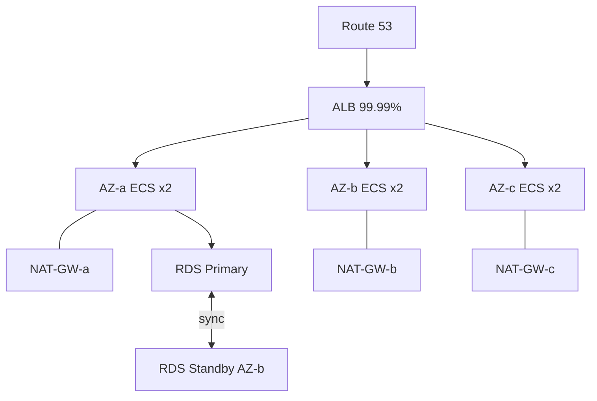
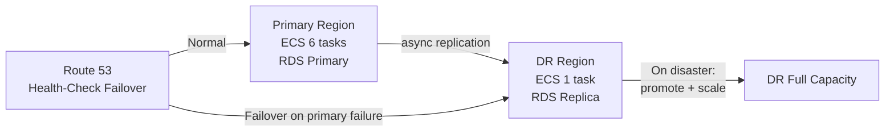

## Keywords in This File
{: .no_toc }

| # | Keyword | Weight |
|---|---------|--------|
| 18 | [High Availability Design in the Cloud](#high-availability-design-in-the-cloud) | ★★☆ |
| 19 | [Disaster Recovery Strategies](#disaster-recovery-strategies) | ★★☆ |

---

# High Availability Design in the Cloud

**Interview Weight:** ★★☆ - Core reliability architecture.
HA design is required for any senior cloud discussion.
AWS targets 99.99% SLA for multi-AZ deployments.

---

### 🎯 Model Answer

**30 seconds:**

> High availability eliminates single points of failure
> (SPOFs) at every tier. In the cloud: deploy across
> multiple AZs, use managed services with built-in HA
> (RDS Multi-AZ, ALB, ECS), and design stateless
> application tiers. 99.99% uptime = 52 minutes
> downtime/year. Two redundant 99.9% components
> in parallel achieve 99.9999%.

**3 minutes:**

> HA at each tier:
>
> Load balancer: ALB spans all AZs automatically. 99.99% SLA.
>
> Compute: ECS/EC2 in at least 2 AZs.
> Auto Scaling Group replaces unhealthy instances automatically.
>
> Database:
> - RDS Multi-AZ: synchronous standby in another AZ.
>   Failover: 60-120s. RPO = 0 (sync replication).
> - Aurora: 6-copy across 3 AZs. Failover < 30s.
>
> Cache: ElastiCache Redis Multi-AZ. Primary + replica
> in different AZs. Failover: ~30-60s.
>
> DNS: Route 53 = 100% SLA (only AWS service with 100%).
>
> Network (common missed SPOF):
> - Single NAT Gateway for all AZs = SPOF
> - One NAT Gateway per AZ = full AZ isolation
>
> SLA calculation:
> - Parallel: P(both fail) = 0.1% * 0.1% = 0.0001%
> - Series: 99.99% * 99.99% * 99.99% = 99.97%
> - Series reduces overall SLA: weakest link wins

**Blank Mind Recovery:**

**(1) SPOF checklist:** "ALB (managed HA), compute (multi-AZ),
DB (Multi-AZ/Aurora), cache (Redis Multi-AZ), NAT GW
(one per AZ)."

**(2) RDS Multi-AZ:** "Sync replication. RPO = 0.
RTO = 60-120s. Auto failover."

**(3) SLA math:** "Series multiplies. 99.9% * 99.9% = 99.8%.
Parallel eliminates SPOFs."

---

### 📘 Concept Explanation

**SLA and Redundancy Math:**

```
SINGLE INSTANCE (99.9% SLA):
  Downtime = 0.1% * 8760 hrs/yr = 8.76 hours/year

MULTI-AZ (parallel, both must fail):
  P(both fail) = 0.1% * 0.1% = 0.0001%
  Downtime: < 1 minute/year

SERIES CHAIN:
  App (99.99%) + DB (99.99%) + Cache (99.99%)
  = 99.97% combined
  Downtime: ~2.6 hours/year
  Even though each component is 99.99%

LESSON: Series components reduce overall SLA.
  Target each tier for its own 99.99% SLA.
```

> **Code walkthrough:** This High Availability Design in the Cloud example demonstrates a key concept in practice. **KEY MECHANISM:** the runtime executes these instructions in sequence with specific memory and execution semantics. **WHY IT MATTERS:** misapplying this pattern causes subtle bugs that only manifest under production load. **TAKEAWAY: understand the execution model before using this pattern in production code.**

**NAT Gateway SPOF Pattern:**

```
BAD: Single NAT GW for all AZs
  AZ-a private -> NAT-GW-a -> Internet
  AZ-b private -> NAT-GW-a -> Internet (SPOF!)
  AZ-a failure: ALL private subnets lose internet

GOOD: One NAT GW per AZ
  AZ-a private -> NAT-GW-a -> Internet
  AZ-b private -> NAT-GW-b -> Internet
  AZ-a failure: only AZ-a affected
  Cost: 3 * $32/month = $96/month extra
```

> **Code walkthrough:** This High Availability Design in the Cloud example demonstrates a key concept in practice. **KEY MECHANISM:** the runtime executes these instructions in sequence with specific memory and execution semantics. **WHY IT MATTERS:** misapplying this pattern causes subtle bugs that only manifest under production load. **TAKEAWAY: understand the execution model before using this pattern in production code.**

---

### 💻 Code Example

```hcl
# TERRAFORM: Multi-AZ HA infrastructure

data "aws_availability_zones" "available" {
  state = "available"
}

# NAT Gateway per AZ (eliminate SPOF):
resource "aws_nat_gateway" "nat" {
  count         = 3
  allocation_id = aws_eip.nat[count.index].id
  subnet_id     = aws_subnet.public[count.index].id
}

resource "aws_route_table" "private" {
  count  = 3
  vpc_id = aws_vpc.main.id
  route {
    cidr_block     = "0.0.0.0/0"
    nat_gateway_id = aws_nat_gateway.nat[count.index].id
  }
  # Each AZ routes through its own NAT GW
}

# RDS Multi-AZ (sync standby):
resource "aws_db_instance" "postgres" {
  engine                  = "postgres"
  engine_version          = "15.4"
  instance_class          = "db.r6g.large"
  multi_az                = true
  # Primary in AZ-a, sync standby in AZ-b
  # Automatic failover: 60-120 seconds
  # RPO = 0 (synchronous replication)

  backup_retention_period  = 7
  deletion_protection      = true
  storage_encrypted        = true
  max_allocated_storage    = 1000
  db_subnet_group_name     = aws_db_subnet_group.main.name
}

# ECS: distribute across all AZs
resource "aws_ecs_service" "app" {
  name          = "app-service"
  cluster       = aws_ecs_cluster.main.id
  desired_count = 6  # 2 per AZ

  network_configuration {
    # All 3 AZs - ECS distributes evenly:
    subnets         = aws_subnet.private[*].id
    security_groups = [aws_security_group.app.id]
  }

  deployment_minimum_healthy_percent = 100
  deployment_maximum_percent         = 200
  # Zero-downtime rolling deploy
}

# ALB health check (fast detection):
resource "aws_lb_target_group" "app" {
  port     = 8080
  protocol = "HTTP"
  vpc_id   = aws_vpc.main.id

  health_check {
    path                = "/health"
    interval            = 10
    healthy_threshold   = 2
    unhealthy_threshold = 2
    timeout             = 5
  }
  # 2 failures in 20s: instance removed from rotation
}
```

> **Code walkthrough:** The count = 3 pattern creates a NATice. **KEY MECHANISM:** the runtime executes these instructions in sequence with specific memory and execution semantics. **WHY IT MATTERS:** misapplying this pattern causes subtle bugs that only manifest under production load. **TAKEAWAY: understand the execution model before using this pattern in production code.**
> Gateway in each AZ's public subnet. The private route tables
> each reference their AZ's NAT Gateway by index. If AZ-a fails,
> its NAT Gateway goes down but AZ-b and AZ-c route tables
> still point to their own NAT Gateways - outbound connectivity
> is isolated per AZ. The RDS multi_az=true creates a synchronous
> standby replica: every write is committed to both primary and
> standby before ACKing to the client. This ensures RPO=0 but
> adds ~1ms to write latency (cross-AZ round trip). The ECS
> service uses all three private subnet IDs: Fargate distributes
> tasks across subnets, which maps to AZ distribution.
> The deployment_minimum_healthy_percent=100 ensures old tasks
> stay running until new tasks are confirmed healthy, achieving
> zero-downtime rolling updates.

---

### 🎓 Answers by Seniority

**Junior / Mid:**

> "High availability means no single point of failure.
> Deploy across multiple AZs. Use RDS Multi-AZ for automatic
> database failover (60-120 seconds). Deploy ECS tasks in
> all three AZs. The ALB spans all AZs automatically. The
> often-missed SPOF: a single NAT Gateway - create one
> per AZ for full isolation."

---

**Senior / Staff:**

> "HA design is identifying and eliminating SPOFs at every
> tier. The missed SPOFs: single NAT Gateway, single AZ cache
> (Redis without Multi-AZ), and RDS without Multi-AZ. The SLA
> calculation shows why series components matter: a chain of
> 99.99% tiers quickly reaches 99.97% overall. The architecture
> question is: what is the acceptable downtime budget and cost?
> NAT GW per AZ costs $96/month extra but provides full AZ
> isolation. Aurora costs 3x RDS Multi-AZ but provides
> sub-30s failover. The right decision is always driven by
> the business impact of downtime."

---

### ⚠️ Common Misconceptions

**Misconception 1: "Multi-AZ DB means HA application."**

Multi-AZ RDS protects the database tier. If application
servers are in a single AZ and that AZ fails, the application
is down even though the database is fine. Every tier must
be multi-AZ independently.

**Misconception 2: "AWS SLA guarantees no downtime."**

AWS SLAs define financial compensation thresholds. AWS can
have hours-long outages while meeting SLA terms (credits
are calculated monthly). SLAs are financial instruments,
not operational guarantees. Design for failure regardless.

---

### 🚨 Failure Modes and Diagnosis

**Failure 1: AZ failure exposes single NAT GW SPOF**

*Symptom:* All private subnet instances lose internet
when AZ-a experiences issues.

*Root cause:* Single NAT GW in AZ-a. AZ-b and AZ-c private
route tables both point to AZ-a's NAT GW.

*Diagnosis:*
```bash
aws ec2 describe-route-tables \
  --filters "Name=vpc-id,Values=vpc-abc" \
  --query 'RouteTables[].Routes[?DestinationCidrBlock==`0.0.0.0/0`]'
# Multiple route tables pointing to same nat-xxx = SPOF
```

> **Code walkthrough:** This Multiple route tables pointing to same nat-xxx = SPOF example demonstrates shell script pattern. **KEY MECHANISM:** the shell executes commands sequentially; pipes pass stdout of one command to stdin of the next. **WHY IT MATTERS:** unquoted variables with spaces cause word splitting - IFS splits the value into multiple arguments. **TAKEAWAY: always double-quote variables: "$VAR"; use [[ ]] instead of [ ] for safer conditionals.**

*Fix:* Create NAT GW in AZ-b, update AZ-b route table.

---

**Failure 2: RDS failover causes long app downtime**

*Symptom:* RDS failover completes in 120s but app shows
errors for 5 minutes.

*Root cause:* JDBC connection pool doesn't invalidate
stale connections to old primary IP.

*Fix:*
```yaml
spring:
  datasource:
    hikari:
      connection-test-query: SELECT 1
      validation-timeout: 5000
      # Pool validates connections before use
      # Stale connections (to old primary) fail validation
      # New connections made to new primary (via RDS endpoint)
```

> **Code walkthrough:** This New connections made to new primary (via RDS endpoint) example demonstrates YAML configuration pattern using SQL. **KEY MECHANISM:** YAML parsers are whitespace-sensitive; indentation errors cause silent value misinterpretation. **WHY IT MATTERS:** unquoted strings starting with special chars (*, &, ?, |) trigger YAML parser errors. **TAKEAWAY: quote strings containing YAML special chars; validate YAML before deploying to production.**

---

### 🎯 Interview Deep-Dive

| Category | Count | Coverage |
|---|---|---|
| Conceptual | 2 | AZ failure, SLA math, health check grace period |
| Trade-off | 2 | Multi-AZ vs multi-region, HA cost |
| Failure Mode | 2 | Thundering herd on failover, health check killing services |
| Debugging | 1 | Diagnosing 2-minute periodic 5xx |
| Behavioral | 2 | 3-tier HA design, HA testing strategy |

**[JUNIOR] Q1 - [TRADE-OFF] What is the SLA difference between single-AZ and multi-AZ deployments and how do you calculate it?**

Combined SLA math:

For services in parallel (any one of them can serve requests):
```
Availability = 1 - ((1 - AZ1_availability) * (1 - AZ2_availability))

Single AZ EC2: 99.9% = 0.999
Two AZs:       1 - (0.001 * 0.001) = 1 - 0.000001 = 99.9999%
               (Both AZs must be down simultaneously)

AWS Published SLAs:
- Single AZ EC2:  No SLA guarantee (best effort)
- Multi-AZ EC2:   99.9%
- RDS Multi-AZ:   99.99%
- Aurora:         99.99%
- ALB:            99.99% (always multi-AZ)
```

> **Code walkthrough:** This New connections made to new primary (via RDS endpoint) example demonstrates a key concept in practice. **KEY MECHANISM:** the runtime executes these instructions in sequence with specific memory and execution semantics. **WHY IT MATTERS:** misapplying this pattern causes subtle bugs that only manifest under production load. **TAKEAWAY: understand the execution model before using this pattern in production code.**

For services in series (all must be available):
```
SLA = SLA1 * SLA2 * SLA3

EC2 (99.9%) + RDS (99.9%) + ElastiCache (99.9%)
= 0.999 * 0.999 * 0.999 = 0.997 = 99.7%

# Three 99.9% services in series = 99.7% end-to-end
# Each additional dependency reduces composite SLA
```

> **Code walkthrough:** This Each additional dependency reduces composite SLA example demonstrates a key concept in practice. **KEY MECHANISM:** the runtime executes these instructions in sequence with specific memory and execution semantics. **WHY IT MATTERS:** misapplying this pattern causes subtle bugs that only manifest under production load. **TAKEAWAY: understand the execution model before using this pattern in production code.**

*What separates good from great:* Applying the series SLA formula
to your actual architecture. Most engineers know multi-AZ is better
but cannot quantify why. The series formula shows that adding
dependencies reduces overall SLA even if each is individually reliable.

---

**[JUNIOR] Q2 - [MECHANISM] Why can an entire AWS Availability Zone fail and what does a real AZ failure look like?**

AZs are designed to be isolated fault domains: separate power,
cooling, and physical facilities within a region. But failures occur:

Historical AWS AZ failures:
- `us-east-1a` power event (December 2021): cooling failure in
  one data center took down multiple services
- `us-east-1e` network issues: BGP misconfiguration caused
  connectivity loss to one AZ

Types of AZ failures:
1. **Full AZ failure**: all services in the AZ unreachable
   (power, connectivity). Multi-AZ recovers automatically.
2. **Partial AZ degradation**: high latency or packet loss
   within the AZ. Health checks may or may not detect this.
3. **Zonal service failure**: one AWS service fails in one AZ
   (e.g., EC2 API throttled in one AZ). Other AZs unaffected.

What multi-AZ gives you:
- RDS Multi-AZ: automatic failover to standby in another AZ
  (60-120s for RDS, ~30s for Aurora)
- ALB: automatically stops routing to unhealthy AZ
- ASG: respawns instances in healthy AZs when one AZ fails

*What separates good from great:* Understanding the partial AZ
degradation case. Health checks look for HTTP 200 responses. If
the AZ is degraded (high latency, not failed), health checks may
still pass, and traffic continues to flow to the slow AZ. Multi-AZ
with aggressive health check thresholds catches this.

---

**[JUNIOR] Q3 - [SCENARIO] How do you implement HA for a stateless application tier across multiple AZs?**

```hcl
# Auto Scaling Group spanning 3 AZs:
resource "aws_autoscaling_group" "app" {
  min_size            = 2    # never below 2 instances
  max_size            = 10
  desired_capacity    = 4    # 4 instances across 3 AZs = 2 in one AZ
  vpc_zone_identifier = [
    aws_subnet.app_az1.id,
    aws_subnet.app_az2.id,
    aws_subnet.app_az3.id,
  ]
  # If one AZ fails: 2 instances instead of 4 serve traffic
  # ALB routes to remaining healthy targets
  # ASG eventually respawns instances in healthy AZs

  # Best practice: set min_size such that
  # (AZ_count - 1) / AZ_count * desired_capacity handles full load
  # For 4 instances, 3 AZs:
  # AZ failure = 3 instances = 75% capacity
  # Design for 75% of instances to handle 100% of load

  health_check_type         = "ELB"  # use ALB health checks
  health_check_grace_period = 60     # seconds before first health check
}
```

> **Code walkthrough:** This Design for 75% of instances to handle 100% of load example demonstrates a key concept in practice. **KEY MECHANISM:** the runtime executes these instructions in sequence with specific memory and execution semantics. **WHY IT MATTERS:** misapplying this pattern causes subtle bugs that only manifest under production load. **TAKEAWAY: understand the execution model before using this pattern in production code.**

ALB spanning AZs:
```hcl
resource "aws_lb" "app" {
  load_balancer_type = "application"
  subnets = [
    aws_subnet.public_az1.id,
    aws_subnet.public_az2.id,
    aws_subnet.public_az3.id,
  ]
  # ALB has nodes in each AZ
  # Routes only to healthy targets in each AZ
  enable_cross_zone_load_balancing = true  # default for ALB
}
```

> **Code walkthrough:** This Routes only to healthy targets in each AZ example demonstrates a key concept in practice. **KEY MECHANISM:** the runtime executes these instructions in sequence with specific memory and execution semantics. **WHY IT MATTERS:** misapplying this pattern causes subtle bugs that only manifest under production load. **TAKEAWAY: understand the execution model before using this pattern in production code.**

*What separates good from great:* Capacity planning for AZ failure.
Setting `min_size` to handle full load across N-1 AZs. A `min_size=2`
across 2 AZs means an AZ failure leaves 1 instance for full load.
The system is HA (stays up) but severely degraded.

---

**[MID] Q4 - [DEBUGGING] DEBUGGING: Your service shows 5xx errors for ~2 minutes, once every 30-60 days with no obvious trigger. How do you diagnose?**

This pattern (periodic 2-minute outage, no pattern) suggests RDS
Multi-AZ failover.

```bash
# Step 1: Correlate with RDS failover events:
aws rds describe-events \
  --source-type db-instance \
  --source-identifier prod-db \
  --start-time 2024-01-01T00:00:00Z
# Look for: "Multi-AZ instance failover started"
# Timestamp should match your 5xx window

# Step 2: Check RDS connection metrics:
aws cloudwatch get-metric-statistics \
  --namespace AWS/RDS \
  --metric-name DatabaseConnections \
  --dimensions Name=DBInstanceIdentifier,Value=prod-db
# Drop to 0 during failover = confirmed

# Step 3: Check what triggers the failover:
# Planned: RDS OS patching (AWS schedule)
# Unplanned: underlying host issue
# Check AWS Health dashboard for maintenance windows
```

> **Code walkthrough:** This Check AWS Health dashboard for maintenance windows example demonstrates shell script pattern. **KEY MECHANISM:** the shell executes commands sequentially; pipes pass stdout of one command to stdin of the next. **WHY IT MATTERS:** unquoted variables with spaces cause word splitting - IFS splits the value into multiple arguments. **TAKEAWAY: always double-quote variables: "$VAR"; use [[ ]] instead of [ ] for safer conditionals.**

Fix (reduce 2 minutes to < 10 seconds for Aurora):
```bash
# Migrate to Aurora: ~30s failover vs RDS 60-120s
# Add connection pooling (RDS Proxy):
# RDS Proxy maintains connections during failover
# Application connections do not drop - proxy handles reconnect
```

> **Code walkthrough:** This proxy handles reconnect example demonstrates shell script pattern. **KEY MECHANISM:** the shell executes commands sequentially; pipes pass stdout of one command to stdin of the next. **WHY IT MATTERS:** unquoted variables with spaces cause word splitting - IFS splits the value into multiple arguments. **TAKEAWAY: always double-quote variables: "$VAR"; use [[ ]] instead of [ ] for safer conditionals.**

*What separates good from great:* RDS Proxy as the long-term fix.
Even with Aurora's faster failover, applications that hold long-lived
connections see errors during failover. RDS Proxy keeps connections
alive through the failover, reducing application-visible downtime
to near-zero.

---

**[MID] Q5 - [FAILURE] What is the health check grace period on an ASG and what happens without it?**

Health check grace period: the time after an instance launches
during which ASG ignores health check failures. The instance
has time to start up before it is evaluated.

Without grace period (grace period = 0):
```
Instance launches
ASG immediately checks health (ELB health check)
Application not yet started (still in JVM init)
ELB health check returns 503
ASG marks instance unhealthy
ASG terminates and replaces
New instance launches
  -> infinite replacement loop
No instances ever become healthy
Service is down
```

> **Code walkthrough:** This proxy handles reconnect example demonstrates a key concept in practice. **KEY MECHANISM:** the runtime executes these instructions in sequence with specific memory and execution semantics. **WHY IT MATTERS:** misapplying this pattern causes subtle bugs that only manifest under production load. **TAKEAWAY: understand the execution model before using this pattern in production code.**

With correct grace period:
```
Instance launches
Grace period: 60s (no health checks evaluated)
Application starts (JVM init, Spring context)
After 60s: ELB health check starts
Application responds 200 OK
Instance marked healthy, receives traffic
```

> **Code walkthrough:** This proxy handles reconnect example demonstrates a key concept in practice. **KEY MECHANISM:** the runtime executes these instructions in sequence with specific memory and execution semantics. **WHY IT MATTERS:** misapplying this pattern causes subtle bugs that only manifest under production load. **TAKEAWAY: understand the execution model before using this pattern in production code.**

Tuning:
```hcl
health_check_grace_period = 120  # > startup time
# For Java services with 30s startup: use 120s
# For Go/Node with 1s startup: use 30s
# Too short = replacement loop (service never comes up)
# Too long = broken instance serves traffic during grace period
```

> **Code walkthrough:** This Too long = broken instance serves traffic during grace period example demonstrates a key concept in practice. **KEY MECHANISM:** the runtime executes these instructions in sequence with specific memory and execution semantics. **WHY IT MATTERS:** misapplying this pattern causes subtle bugs that only manifest under production load. **TAKEAWAY: understand the execution model before using this pattern in production code.**

*What separates good from great:* The `startupProbe` in Kubernetes
is equivalent to the ASG grace period. The same concept applies
across orchestrators: protect new instances from health checks
until they have had time to initialize.

---

**[SENIOR] Q6 - [TRADE-OFF] TRADE-OFF: Multi-AZ vs multi-region. What are the cost and complexity differences?**

| Dimension | Multi-AZ | Multi-Region |
|---|---|---|
| Cost multiplier | ~1.5-2x | ~2-3x |
| Data replication | Synchronous (strong consistency) | Asynchronous (eventual consistency) |
| Failover time | Seconds (automatic) | Minutes (often manual) |
| RPO | Near-zero | Seconds to minutes (async replication lag) |
| RTO | < 60s (automated) | 5-60 minutes |
| DNS change required | No (same endpoint) | Yes (Route 53 failover) |
| Database complexity | Multi-AZ = one cluster | Global Database or cross-region replication |
| Protects against | Single AZ failure, hardware | Region-wide outage |
| Required for 99.99% SLA | Yes | Only for 99.999%+ |

Decision framework:
- 99.99% SLA, RTO < 5 min: multi-AZ is sufficient
- 99.999%+ SLA, RTO < 1 min, RPO = 0: multi-region active-active
- Data sovereignty (EU data must stay in EU): multi-region required
- Compliance (DR requirement for secondary region): multi-region pilot light

*What separates good from great:* Knowing that Aurora Global Database
is asynchronous replication (< 1 second lag typically, but not zero).
For true RPO=0, you need synchronous multi-region writes, which no
managed AWS service provides natively at all database types.

---

**[SENIOR] Q7 - [MECHANISM] How do you test HA and failover mechanisms without disrupting production?**

Chaos Engineering approach:

```bash
# Test 1: AZ failure simulation (using ASG suspend):
# Suspend launch in one AZ:
aws autoscaling suspend-processes \
  --auto-scaling-group-name prod-asg \
  --scaling-processes Launch
# Terminate all instances in one AZ:
aws autoscaling terminate-instance-in-auto-scaling-group \
  --instance-id i-xxx --should-decrement-desired-capacity false
# Observe: does ALB route away from terminated instances?
# Does ASG launch replacements in other AZs?

# Test 2: RDS failover:
aws rds reboot-db-instance \
  --db-instance-identifier prod-db \
  --force-failover
# Measures actual application-visible downtime
# Compare to SLA target

# Test 3: ALB target health check (terminate one instance,
# observe response time during deregistration):
aws autoscaling terminate-instance-in-auto-scaling-group \
  --instance-id i-xxx --should-decrement-desired-capacity false
# Monitor: does error rate spike? For how long?

# Test 4: AWS Fault Injection Simulator (FIS):
# Scheduled experiments with automatic rollback
aws fis create-experiment-template ...
```

> **Code walkthrough:** This Scheduled experiments with automatic rollback example demonstrates shell script pattern. **KEY MECHANISM:** the shell executes commands sequentially; pipes pass stdout of one command to stdin of the next. **WHY IT MATTERS:** unquoted variables with spaces cause word splitting - IFS splits the value into multiple arguments. **TAKEAWAY: always double-quote variables: "$VAR"; use [[ ]] instead of [ ] for safer conditionals.**

*What separates good from great:* Running failover tests in
production during low-traffic windows. Staging failover tests
prove the mechanism works in staging. Only production tests measure
the actual user impact (connection pool behavior, cached state,
real traffic patterns).

---

**[SENIOR] Q8 - [MECHANISM] What is the thundering herd problem during HA failover and how do you prevent it?**

Thundering herd: when a primary fails and a standby takes over,
all connections that were on the primary reconnect simultaneously
to the new primary. This connection storm can overwhelm the new
primary immediately after failover.

For RDS failover:
```
Primary fails -> 200 application threads lose connection
All 200 threads retry immediately
New primary receives 200 simultaneous connect requests
+ 200 query executions in first second
New primary overwhelmed -> performance degraded
Application sees slow responses even after "successful" failover
```

> **Code walkthrough:** This Scheduled experiments with automatic rollback example demonstrates a key concept in practice. **KEY MECHANISM:** the runtime executes these instructions in sequence with specific memory and execution semantics. **WHY IT MATTERS:** misapplying this pattern causes subtle bugs that only manifest under production load. **TAKEAWAY: understand the execution model before using this pattern in production code.**

Prevention:
```java
// Exponential backoff on connection retry:
HikariConfig config = new HikariConfig();
config.setConnectionTimeout(3000);  // 3s per attempt
config.setInitializationFailTimeout(60000);  // 60s total

// Add jitter to prevent synchronized retry:
// Use HikariCP connectionInitSql or custom retry with:
long backoff = (long)(Math.random() * 5000) + attempt * 1000;
Thread.sleep(backoff);  // 0-5s + linear backoff
```

> **Code walkthrough:** This Scheduled experiments with automatic rollback example demonstrates mutex locking using concurrency primitive. **KEY MECHANISM:** the JVM acquires the intrinsic lock on the object monitor before entering the block. **WHY IT MATTERS:** a thread holding the lock blocks all other threads - a bottleneck at scale. **TAKEAWAY: prefer ReentrantLock or ConcurrentHashMap over synchronized for hot paths.**

For RDS: use RDS Proxy. It maintains a warm connection pool
to the primary. On failover, application connections stay open
(proxy absorbs the reconnect), then proxy reconnects to new
primary. Application-visible reconnect: near-zero.

*What separates good from great:* Measuring the post-failover
performance, not just whether the service came back up. A failover
that takes 30 seconds and then operates at 20% throughput for 2
minutes due to thundering herd is worse than a 60-second failover
that returns to full capacity immediately.

---

**[SENIOR] Q9 - [DESIGN] BEHAVIORAL: Design a highly available architecture for a 3-tier web application on AWS.**

Requirements assumed: 99.99% availability, RTO < 5 minutes,
RPO < 1 minute, supports 10,000 concurrent users.

```
ARCHITECTURE:

Region: us-east-1, 3 AZs (us-east-1a, 1b, 1c)

Tier 1 - Edge:
  - Route 53: latency routing + health check failover
  - CloudFront: CDN for static assets (SPA, images)

Tier 2 - Web/API:
  - ALB: multi-AZ, path-based routing
  - ECS Fargate: stateless services in 3 AZs
    min 2 tasks/AZ, auto-scaling on CPU/request rate
  - No sticky sessions: session state in ElastiCache

Tier 3 - Data:
  - Aurora PostgreSQL: 6-copy storage, 3 AZs
    1 writer + 2 read replicas (one per remaining AZ)
    Failover: ~30 seconds automatic
  - ElastiCache Redis: cluster mode, 3 shards x 2 replicas
    Provides session store, rate limiting, caching
  - S3: static assets, backups (11 nines durability)

Security:
  - Web tier: public subnets, ALB only
  - App tier: private subnets, security groups
  - Data tier: private subnets, no public access
  - All inter-service: mTLS or security group rules

Observability:
  - CloudWatch + X-Ray for distributed tracing
  - ALB access logs -> S3 -> Athena for deep queries
  - Aurora Performance Insights for query analysis
```

> **Code walkthrough:** This Scheduled experiments with automatic rollback example demonstrates a key concept in practice. **KEY MECHANISM:** the runtime executes these instructions in sequence with specific memory and execution semantics. **WHY IT MATTERS:** misapplying this pattern causes subtle bugs that only manifest under production load. **TAKEAWAY: understand the execution model before using this pattern in production code.**

*What separates good from great:* Sizing the ASG for AZ failure.
"Min 2 tasks/AZ" means on AZ failure we have 4 tasks handling load
that 6 tasks handled before. The question is: does your application
perform acceptably at 66% capacity? Design for N-1 AZ capacity.

---

### ⚖️ Comparison Table

| Component | Single-AZ SLA | Multi-AZ SLA | Notes |
|-----------|--------------|-------------|-------|
| EC2/ECS | 99.9% | 99.99% | Spread across AZs |
| RDS | 99.95% | 99.99% | Sync replica |
| Aurora | - | 99.99% | 6-copy, 3 AZs |
| ALB | N/A | 99.99% | Always multi-AZ |
| ElastiCache | 99.9% | 99.99% | Multi-AZ mode |
| NAT Gateway | SPOF risk | 99.99% | One per AZ |
| Route 53 | N/A | 100% | Global |

---

### 🏛️ System Design

*(Omit: ★★☆ - system design is for ★★★ only.)*

---

### 📊 Diagram

```
MULTI-AZ HA:

         [Route 53 100% SLA]
                |
          [ALB 99.99%]
          /     |    \
       AZ-a   AZ-b  AZ-c
        |       |      |
     ECS x2  ECS x2  ECS x2
        |       |      |
     NAT-a  NAT-b   NAT-c

[RDS Primary AZ-a] --sync--> [RDS Standby AZ-b]
[Redis Primary AZ-a] --async-> [Redis Replica AZ-b]
```



> **Diagram walkthrough:** Each AZ is fully self-contained:
> its own NAT Gateway and its own ECS tasks. ALB spans all
> three AZs and stops routing to tasks in a failed AZ.
> The RDS primary and synchronous standby are in different
> AZs: if AZ-a's primary fails, RDS promotes the AZ-b
> standby automatically (60-120s). Route 53 does not need
> to change because the RDS endpoint DNS automatically
> updates to point to the new primary.

---

---

---

### 💻 Code Example

*(Omit: this concept does not have a programmatic interface that can be demonstrated in code. The conceptual explanation above is sufficient.)*


---

### 🏛️ System Design

*(Omit: system design diagram not applicable for this concept - see ★★★ keywords for full system design coverage.)*


---

### ⚖️ Comparison Table

*(Omit: this is a ★☆☆ foundational concept with no direct alternatives to compare - see higher-difficulty keywords for trade-off analysis.)*


---

### 📊 Diagram

*(Omit: no standalone visual diagram required for this concept - the explanations and code examples above provide sufficient clarity.)*


# Disaster Recovery Strategies

**Interview Weight:** ★★☆ - Critical for regulated industries.
DR defines recovery from major failures (region outage,
data corruption). RPO/RTO and the four DR tiers are
essential for senior cloud discussions.

---

### 🎯 Model Answer

**30 seconds:**

> DR defines recovery from a major failure. Two metrics:
> RPO (Recovery Point Objective) - maximum data loss
> tolerated; RTO (Recovery Time Objective) - maximum
> recovery time. Four strategies: Backup+Restore (cheapest,
> slowest), Pilot Light, Warm Standby, Multi-Site Active-Active
> (most expensive, fastest). Choose based on RPO/RTO
> requirements versus cost.

**3 minutes:**

> RPO and RTO:
> - RPO: max data loss. RPO=1hr: last hour of data can be lost.
>   Drives backup frequency and replication strategy.
> - RTO: max recovery time. RTO=4hr: restore within 4 hours.
>   Drives active vs passive standby architecture.
>
> Four DR tiers:
>
> Tier 1 - Backup and Restore:
> - Restore from S3 backup. RTO: hours. RPO: backup frequency.
> - Cost: storage only. Use: non-critical systems.
>
> Tier 2 - Pilot Light:
> - Core services in DR region (DB replicating, no app servers)
> - Scale up on disaster. RTO: 30-60 min. RPO: minutes.
>
> Tier 3 - Warm Standby:
> - Scaled-down but running in DR region (1 task, smaller DB)
> - Scale to full capacity on disaster.
> - RTO: 5-30 min. RPO: seconds to minutes.
>
> Tier 4 - Active-Active:
> - Full capacity in both regions, both serving traffic
> - RTO: seconds (DNS shift). RPO: near-zero.
> - Cost: 2x infrastructure.

**Blank Mind Recovery:**

**(1) Metrics:** "RPO = data loss tolerance.
RTO = recovery time tolerance."

**(2) Four tiers:** "Backup (cheapest, slowest) -> Pilot Light
-> Warm Standby -> Active-Active (expensive, fastest)."

**(3) Choose by:** "Business cost of downtime vs cost
of DR tier. Calculate break-even."

---

### 📘 Concept Explanation

**RPO vs RTO Decision:**

```
E-COMMERCE EXAMPLE:
  Revenue: $100,000/hr during peak
  Acceptable data loss: last transaction (RPO ~ 0)
  Acceptable downtime: 15 min (RTO 15 min)

STRATEGY:
  RPO ~ 0: synchronous replication (Multi-AZ)
            OR async replication with < 60s lag
  RTO 15 min: Warm Standby or Active-Active

BREAK-EVEN:
  Active-Active cost: +$10,000/month
  Downtime cost: $100,000/hr
  Break-even: one 6-minute outage/month
  If 1+ outage per month: Active-Active pays for itself
```

> **Code walkthrough:** This Disaster Recovery Strategies example demonstrates a key concept in practice. **KEY MECHANISM:** the runtime executes these instructions in sequence with specific memory and execution semantics. **WHY IT MATTERS:** misapplying this pattern causes subtle bugs that only manifest under production load. **TAKEAWAY: understand the execution model before using this pattern in production code.**

**Pilot Light vs Warm Standby:**

```
PILOT LIGHT (DR region):
  DB: replicating (running)
  App servers: NOT running (cost saving)
  On disaster: start app servers (5-15 min)
  Total RTO: ~30-60 min

WARM STANDBY (DR region):
  DB: replicating (running, smaller instance)
  App servers: 1 task running (minimal cost)
  On disaster: scale app servers up (5 min)
  Total RTO: ~5-20 min
  Cost: slightly higher (1 task running)

DIFFERENCE: Warm Standby has running app tier,
  Pilot Light has only data tier running.
```

> **Code walkthrough:** This Disaster Recovery Strategies example demonstrates a key concept in practice. **KEY MECHANISM:** the runtime executes these instructions in sequence with specific memory and execution semantics. **WHY IT MATTERS:** misapplying this pattern causes subtle bugs that only manifest under production load. **TAKEAWAY: understand the execution model before using this pattern in production code.**

---

### 💻 Code Example

```hcl
# WARM STANDBY DR SETUP

# Primary: full capacity in us-east-1
resource "aws_db_instance" "primary" {
  provider        = aws.primary
  engine          = "postgres"
  instance_class  = "db.r6g.xlarge"
  multi_az        = true
  backup_retention_period = 7
  identifier      = "prod-primary"
}

# DR: smaller replica in us-west-2
resource "aws_db_instance" "dr_replica" {
  provider            = aws.dr
  replicate_source_db = aws_db_instance.primary.arn
  instance_class      = "db.r6g.large"  # Smaller
  # Async replication - typical lag: < 1 min
  identifier          = "prod-dr-replica"
}

# ECS in DR: warm (1 task, not 6)
resource "aws_ecs_service" "app_dr" {
  provider        = aws.dr
  desired_count   = 1   # Scale to 6 on disaster
  task_definition = aws_ecs_task_definition.app.arn
  cluster         = aws_ecs_cluster.dr.id
}

# Route 53 failover:
resource "aws_route53_health_check" "primary" {
  fqdn              = aws_lb.primary.dns_name
  port              = 443
  type              = "HTTPS"
  resource_path     = "/health"
  failure_threshold = 3
  request_interval  = 30
  # 3 * 30s = 90 seconds to detect failure
}

resource "aws_route53_record" "api_primary" {
  zone_id        = aws_route53_zone.main.zone_id
  name           = "api.example.com"
  type           = "A"
  set_identifier = "primary"
  failover_routing_policy { type = "PRIMARY" }
  health_check_id = aws_route53_health_check.primary.id
  alias {
    name    = aws_lb.primary.dns_name
    zone_id = aws_lb.primary.zone_id
    evaluate_target_health = true
  }
}

resource "aws_route53_record" "api_dr" {
  zone_id        = aws_route53_zone.main.zone_id
  name           = "api.example.com"
  type           = "A"
  set_identifier = "secondary"
  failover_routing_policy { type = "SECONDARY" }
  alias {
    name    = aws_lb.dr.dns_name
    zone_id = aws_lb.dr.zone_id
    evaluate_target_health = true
  }
}
```

> **Code walkthrough:** This 3 * 30s = 90 seconds to detect failure example demonstrates a key concept in practice. **KEY MECHANISM:** the runtime executes these instructions in sequence with specific memory and execution semantics. **WHY IT MATTERS:** misapplying this pattern causes subtle bugs that only manifest under production load. **TAKEAWAY: understand the execution model before using this pattern in production code.**

```bash
# DR RUNBOOK (executed when primary fails)

# 1. Verify primary is truly down:
aws rds describe-db-instances \
  --db-instance-identifier prod-primary \
  --region us-east-1 \
  --query 'DBInstances[].DBInstanceStatus'

# 2. Promote DR replica:
aws rds promote-read-replica \
  --db-instance-identifier prod-dr-replica \
  --region us-west-2
# ~3-5 minutes

# 3. Scale ECS to full capacity:
aws ecs update-service \
  --cluster prod-dr-cluster \
  --service app-service-dr \
  --desired-count 6 \
  --region us-west-2
# ~5 minutes for tasks to be healthy

# 4. Verify Route 53 has switched:
dig +short api.example.com
# Should return DR ALB IP after TTL expires

# Total RTO: ~15-20 minutes
```

> **Code walkthrough:** The Warm Standby maintains one runningice. **KEY MECHANISM:** the runtime executes these instructions in sequence with specific memory and execution semantics. **WHY IT MATTERS:** misapplying this pattern causes subtle bugs that only manifest under production load. **TAKEAWAY: understand the execution model before using this pattern in production code.**
> ECS task in the DR region (not zero, like Pilot Light).
> The cross-region RDS read replica uses async replication:
> typical lag is seconds to minutes, giving RPO of seconds.
> The Route 53 health check probes the primary ALB every 30
> seconds: three consecutive failures (90 seconds) trigger
> failover. The DR record has no health check - it's always
> the fallback. The runbook shows the manual actions needed
> after Route 53 fails over: promote the read replica (3-5 min,
> makes it writable) and scale ECS (5 min for 6 healthy tasks).
> The total RTO is 15-20 minutes from the moment of primary
> failure.

---

### 🎓 Answers by Seniority

**Junior / Mid:**

> "Disaster Recovery defines recovery from a major failure.
> RPO is the maximum data loss you can tolerate. RTO is
> how long recovery can take. Four strategies: Backup+Restore
> (cheapest, hours to recover), Pilot Light, Warm Standby,
> and Active-Active (most expensive, seconds to recover).
> Choose based on how critical the system is and what
> downtime costs the business."

---

**Senior / Staff:**

> "DR strategy selection is a business decision: what does
> one hour of downtime cost? Multiply by expected frequency
> of major failures to get annual downtime cost, then compare
> to DR tier cost. The technical challenge is testing:
> DR plans that are never tested fail at the worst moment.
> Quarterly DR drills are the minimum. The subtle issue:
> cross-region application configuration. JDBC URLs hardcoded
> to primary region endpoints break on failover. All
> environment-specific config must be parameterized and
> switchable, not hardcoded. For Active-Active: application
> data consistency across regions (active-active writes)
> is the hardest problem and requires careful conflict
> resolution strategy."

---

### ⚠️ Common Misconceptions

**Misconception 1: "Multi-AZ IS disaster recovery."**

Multi-AZ protects against single AZ failures within a region.
A region-level failure affects all AZs. Cross-region DR
is separate from multi-AZ HA. Both are needed for
comprehensive resilience coverage.

**Misconception 2: "An untested DR plan is good enough."**

Untested DR plans fail the majority of the time due to
outdated runbooks, expired credentials, changed infrastructure,
or missing IAM permissions. Test quarterly minimum.
The test should be a real failover, not a tabletop exercise.

---

### 🚨 Failure Modes and Diagnosis

**Failure 1: High replica lag before disaster**

*Symptom:* DR promotion happens but significant data loss.
Replica was hours behind primary.

*Diagnosis:*
```bash
# Monitor ReplicaLag in CloudWatch:
aws cloudwatch get-metric-statistics \
  --namespace AWS/RDS \
  --metric-name ReplicaLag \
  --dimensions Name=DBInstanceIdentifier,Value=prod-dr-replica \
  --period 60 --statistics Maximum \
  --start-time $(date -u -d '1 hour ago' +%FT%TZ) \
  --end-time $(date -u +%FT%TZ)
# Alert if ReplicaLag > 300 seconds
```

> **Code walkthrough:** This Alert if ReplicaLag > 300 seconds example demonstrates shell script pattern. **KEY MECHANISM:** the shell executes commands sequentially; pipes pass stdout of one command to stdin of the next. **WHY IT MATTERS:** unquoted variables with spaces cause word splitting - IFS splits the value into multiple arguments. **TAKEAWAY: always double-quote variables: "$VAR"; use [[ ]] instead of [ ] for safer conditionals.**

*Fix:* Alert on ReplicaLag. Scale up replica instance type
if it can't keep up with write load.

---

**Failure 2: App JDBC still pointing to primary after failover**

*Symptom:* Route 53 switched to DR. But app logs show
connection errors to primary region RDS endpoint.

*Fix:*
```yaml
# application.yml: config from env var
spring:
  datasource:
    url: ${DATABASE_URL}
# Set DATABASE_URL per region in ECS task definition
# On DR failover: update task definition env var
# to DR region endpoint, redeploy ECS service
```

> **Code walkthrough:** This to DR region endpoint, redeploy ECS service example demonstrates YAML configuration pattern using SQL. **KEY MECHANISM:** YAML parsers are whitespace-sensitive; indentation errors cause silent value misinterpretation. **WHY IT MATTERS:** unquoted strings starting with special chars (*, &, ?, |) trigger YAML parser errors. **TAKEAWAY: quote strings containing YAML special chars; validate YAML before deploying to production.**

---

### 🎯 Interview Deep-Dive

| Category | Count | Coverage |
|---|---|---|
| Conceptual | 2 | RTO/RPO, four DR strategies, Route 53 failover |
| Trade-off | 2 | RPO zero vs RPO 5min cost, DR testing |
| Failure Mode | 2 | Stale data after failover, partial failover |
| Debugging | 1 | Diagnosing failed DR execution |
| Behavioral | 2 | DR design for SLA, chaos experiment |

**[JUNIOR] Q1 - [TRADE-OFF] What is the difference between RTO and RPO and how do you determine appropriate values?**

RTO (Recovery Time Objective): maximum acceptable time between
a disaster event and service restoration. How long can the business
function without this system?

RPO (Recovery Point Objective): maximum acceptable data loss.
How much data can the business afford to lose (measured in time)?

Determining values:
- Business analysis: what revenue/compliance impact per hour of
  downtime? Per hour of data loss?
- Example: payment processing at $1M/minute revenue. RTO = 1 minute
  has very different DR design than RTO = 4 hours.
- Regulatory: HIPAA, PCI DSS, SOX often specify RTO/RPO contractually

Mapping to DR strategies:
```
RPO=hours, RTO=hours  -> Backup + Restore ($)
RPO=minutes, RTO=hours -> Pilot Light ($$)
RPO=minutes, RTO=minutes -> Warm Standby ($$$)
RPO=seconds, RTO=seconds -> Active-Active ($$$$)
```

> **Code walkthrough:** This to DR region endpoint, redeploy ECS service example demonstrates a key concept in practice. **KEY MECHANISM:** the runtime executes these instructions in sequence with specific memory and execution semantics. **WHY IT MATTERS:** misapplying this pattern causes subtle bugs that only manifest under production load. **TAKEAWAY: understand the execution model before using this pattern in production code.**

Calibration:
```bash
# Measure actual RTO from DR test:
# Time 1: disaster event detected
# Time 2: failover initiated
# Time 3: service accepting traffic in DR region
# Time 4: smoke tests passing
# RTO = Time 4 - Time 1

# Measure actual RPO:
# Find last transaction replicated to DR region
# at time of simulated failure
# RPO = event_time - last_replicated_timestamp
```

> **Code walkthrough:** This last_replicated_timestamp example demonstrates shell script pattern. **KEY MECHANISM:** the shell executes commands sequentially; pipes pass stdout of one command to stdin of the next. **WHY IT MATTERS:** unquoted variables with spaces cause word splitting - IFS splits the value into multiple arguments. **TAKEAWAY: always double-quote variables: "$VAR"; use [[ ]] instead of [ ] for safer conditionals.**

*What separates good from great:* Measuring RTO and RPO during
actual DR tests rather than estimating from architecture diagrams.
The estimate is always optimistic. The measurement includes
unexpected steps (manual DNS update that took 20 minutes, forgot
to update a config file).

---

**[JUNIOR] Q2 - [TRADE-OFF] What are the four DR strategies and what are the exact cost and complexity trade-offs?**

| Strategy | RTO | RPO | Cost vs Prod | Description |
|---|---|---|---|---|
| Backup + Restore | Hours | Hours | 5-10% | Backups to S3/Glacier; restore from scratch |
| Pilot Light | 30-60 min | Minutes | 15-25% | Core infrastructure running (DB), rest dormant |
| Warm Standby | 5-30 min | Seconds | 50-75% | Reduced-capacity running copy, scale up on failover |
| Active-Active | Seconds | Near-zero | 200% | Full capacity in both regions, traffic split |

Backup + Restore: cheapest, slowest. For non-critical systems
(internal tools, dev environments). You restore AMIs, redeploy
applications, restore database from backup. Manual process.

Pilot Light: RDS Multi-AZ replication to DR region (continuous
async replication). EC2/ECS dormant. On failure: promote DB,
launch app tier. 30-60 minutes to restore.

Warm Standby: small but running copy in DR region. ALB + small
ECS cluster + RDS replica. On failure: scale up ECS, promote DB,
switch Route 53. 5-30 minutes.

Active-Active: full production capacity in two regions, traffic
split via Route 53 weighted routing. Database: Aurora Global
Database or CockroachDB. Most complex: must handle write conflicts
if both regions accept writes.

*What separates good from great:* Knowing that Active-Active's
cost is 2x per region PLUS the operational complexity of
cross-region write coordination. The real cost is often the
engineering effort to make the application handle multi-region
writes correctly, which can be 6-18 months of work.

---

**[JUNIOR] Q3 - [MECHANISM] How does Route 53 health-check-based failover work and what are its failure detection limitations?**

```hcl
# Primary record with health check:
resource "aws_route53_record" "primary" {
  name           = "api.example.com"
  type           = "A"
  set_identifier = "primary"
  failover_routing_policy { type = "PRIMARY" }
  health_check_id = aws_route53_health_check.primary.id
  records         = ["1.2.3.4"]  # primary ALB
}

resource "aws_route53_health_check" "primary" {
  fqdn              = "api.example.com"
  port              = 443
  type              = "HTTPS"
  resource_path     = "/health"
  failure_threshold = 3   # 3 consecutive failures
  request_interval  = 30  # check every 30 seconds
  # Failover trigger: 3 * 30 = 90 seconds from failure to DNS change
}

# Secondary (DR) record - no health check:
resource "aws_route53_record" "secondary" {
  name           = "api.example.com"
  set_identifier = "secondary"
  failover_routing_policy { type = "SECONDARY" }
  records = ["5.6.7.8"]  # DR ALB
}
```

> **Code walkthrough:** This no health check: example demonstrates a key concept in practice. **KEY MECHANISM:** the runtime executes these instructions in sequence with specific memory and execution semantics. **WHY IT MATTERS:** misapplying this pattern causes subtle bugs that only manifest under production load. **TAKEAWAY: understand the execution model before using this pattern in production code.**

Failover detection timeline:
- Failure occurs
- Up to 30s: next health check fires, detects failure (1 of 3)
- 60s: second failure
- 90s: third failure -> Route 53 marks unhealthy -> DNS change
- DNS TTL (60s): resolvers start returning DR IP
- Total: 90s + TTL = ~150 seconds minimum

Limitation: Route 53 checks from multiple AWS regions
(approximately 18 vantage points). A partial failure (one region)
may not trigger enough failures to change DNS.

*What separates good from great:* Using `calculated health checks`
(composite of multiple endpoint health checks) for application-aware
failover. A single endpoint health check misses cases where the
endpoint is up but the application cannot reach its database.

---

**[MID] Q4 - [DEBUGGING] DEBUGGING: Your DR failover completed but the application is serving stale or incorrect data. How do you diagnose?**

```bash
# Step 1: Check replication lag at time of failover:
# If using Aurora Global Database:
aws cloudwatch get-metric-statistics \
  --namespace AWS/RDS \
  --metric-name AuroraGlobalDBReplicationLag \
  --dimensions Name=DBClusterIdentifier,Value=dr-cluster
# Replication lag at failover time = data loss (RPO)
# If lag was 45 seconds: all writes in last 45s are lost in DR

# Step 2: Check if DR is still reading from stale replica:
# After failover, was the replica promoted to writer?
aws rds describe-db-clusters \
  --db-cluster-identifier dr-cluster \
  --query 'DBClusters[0].{Status: Status, Endpoint: Endpoint}'
# Status should be 'available', Endpoint should be writer endpoint

# Step 3: Application connection string:
# Is the app using the DR cluster WRITER endpoint?
# If app still connects to old PRIMARY endpoint (now unreachable)
# it may be caching the DNS resolution
dig api-db.example.com  # should resolve to DR IP now

# Step 4: Check application cache (Redis/ElastiCache):
# If DR region has a separate ElastiCache, it starts cold
# Old cached data = stale but safe to serve (cache miss = fresh DB query)
# Corrupted cached data = incorrect behavior
redis-cli -h dr-cache.example.com FLUSHDB  # if cache corruption suspected
```

> **Code walkthrough:** This Corrupted cached data = incorrect behavior example demonstrates shell script pattern. **KEY MECHANISM:** the shell executes commands sequentially; pipes pass stdout of one command to stdin of the next. **WHY IT MATTERS:** unquoted variables with spaces cause word splitting - IFS splits the value into multiple arguments. **TAKEAWAY: always double-quote variables: "$VAR"; use [[ ]] instead of [ ] for safer conditionals.**

*What separates good from great:* The DNS resolution cache check.
Applications and their database drivers often cache DNS resolutions
for minutes. After a Route 53 failover, the application must flush
its DNS cache to connect to the DR endpoint. Java's `networkaddress.
cache.ttl=0` setting is needed to prevent this.

---

**[MID] Q5 - [TRADE-OFF] How do you handle database DR - what is the difference between backup-based and replication-based RPO?**

Backup-based RPO:
- Daily snapshot -> RPO = up to 24 hours of data loss
- Hourly automated backup -> RPO = up to 60 minutes
- 5-minute transaction log backup (RDS) -> RPO = up to 5 minutes

Replication-based RPO:
- RDS Read Replica (async) -> RPO = replication lag (seconds to minutes)
- Aurora Global Database (async) -> RPO < 1 second (typically)
- Synchronous replication -> RPO = 0 (no data loss possible)

For synchronous replication:
```
Write must succeed on BOTH primary and secondary before ACK to app
Trade-off:
+ RPO = 0: no data loss
- Write latency = network RTT between regions (~20-100ms)
  Every write waits for the remote region to acknowledge
- For financial systems: worth it
- For high-write applications: prohibitively expensive
```

> **Code walkthrough:** This Corrupted cached data = incorrect behavior example demonstrates a key concept in practice. **KEY MECHANISM:** the runtime executes these instructions in sequence with specific memory and execution semantics. **WHY IT MATTERS:** misapplying this pattern causes subtle bugs that only manifest under production load. **TAKEAWAY: understand the execution model before using this pattern in production code.**

For Aurora Global Database:
```bash
# Check typical replication lag:
aws cloudwatch get-metric-statistics \
  --namespace AWS/RDS \
  --metric-name AuroraGlobalDBReplicationLag
# Typical: 50-100ms lag (asynchronous)
# On failover: up to lag value of data at risk
```

> **Code walkthrough:** This On failover: up to lag value of data at risk example demonstrates shell script pattern. **KEY MECHANISM:** the shell executes commands sequentially; pipes pass stdout of one command to stdin of the next. **WHY IT MATTERS:** unquoted variables with spaces cause word splitting - IFS splits the value into multiple arguments. **TAKEAWAY: always double-quote variables: "$VAR"; use [[ ]] instead of [ ] for safer conditionals.**

*What separates good from great:* Measuring replication lag
continuously and alerting when it exceeds the RPO target. A lag
of 30 seconds when your RPO is 10 seconds is an SLA violation
waiting to happen during a failover.

---

**[SENIOR] Q6 - [TRADE-OFF] TRADE-OFF: RPO of zero vs RPO of 5 minutes. What is the true cost difference?**

RPO of 5 minutes (Aurora Global Database, async replication):
- Cost: DR Aurora cluster in secondary region (~50-75% of primary
  cluster cost + replication data transfer)
- Engineering: straightforward, well-documented AWS pattern
- Operational: monitor replication lag alert, DR failover runbook

RPO of 0 (synchronous replication or multi-region active-active):
- No AWS managed service provides synchronous multi-region
  replication for relational databases
- Options: CockroachDB, YugabyteDB, Spanner (via GCP)
- For AWS-only: custom application-level write coordination
  (write to both regions in same transaction = distributed
  transaction with 2PC = latency + complexity)
- Cost: 2x infrastructure + significant engineering effort
  + higher write latency for all operations globally

Real-world decision:
- Healthcare (patient records): RPO = 0 required by HIPAA (in practice,
  sync replication within same region multi-AZ achieves this;
  cross-region is RPO = replication lag)
- Financial trading: RPO < 1s (Aurora Global adequate)
- E-commerce: RPO = 5-60 min typically acceptable

*What separates good from great:* Distinguishing RPO=0 within a
region (achievable with synchronous multi-AZ: Aurora, RDS Multi-AZ)
from RPO=0 cross-region (not achievable with standard AWS managed
services). Most RPO=0 requirements are for single-region resilience.

---

**[SENIOR] Q7 - [SCENARIO] What is a chaos experiment in the context of DR validation and how do you implement one safely?**

Chaos engineering: deliberately inject failures to measure and
improve system resilience. For DR: simulate the disaster to validate
the recovery plan.

```bash
# AWS Fault Injection Simulator (FIS) - managed chaos:
# Create experiment: terminate all instances in one AZ
aws fis create-experiment-template --cli-input-json '{
  "description": "Terminate all EC2 in us-east-1a",
  "targets": {
    "ec2-instances": {
      "resourceType": "aws:ec2:instance",
      "resourceTags": {"Environment": "prod"},
      "filters": [{"path": "Placement.AvailabilityZone",
                   "values": ["us-east-1a"]}],
      "selectionMode": "ALL"
    }
  },
  "actions": {
    "terminate-instances": {
      "actionId": "aws:ec2:terminate-instances",
      "targets": {"Instances": "ec2-instances"}
    }
  },
  "stopConditions": [
    {"source": "aws:cloudwatch:alarm",
     "value": "arn:aws:...high-error-rate"}
  ]
}'
# stopConditions: experiment stops if error rate exceeds threshold
# Built-in safety: experiment cannot make things worse than expected
```

> **Code walkthrough:** This Built-in safety: experiment cannot make things worse than expected example demonstrates shell script pattern using SQL. **KEY MECHANISM:** the shell executes commands sequentially; pipes pass stdout of one command to stdin of the next. **WHY IT MATTERS:** unquoted variables with spaces cause word splitting - IFS splits the value into multiple arguments. **TAKEAWAY: always double-quote variables: "$VAR"; use [[ ]] instead of [ ] for safer conditionals.**

Safe chaos principles:
1. Start with staging; graduate to production at low traffic
2. Define success criteria BEFORE running: "Error rate < 0.1%
   within 60 seconds of AZ termination"
3. Set stop conditions: abort if the blast radius exceeds bounds
4. Run during business hours with engineers watching dashboards
5. Document findings and fix before re-running

*What separates good from great:* Stop conditions as mandatory
guardrails. Without them, a chaos experiment can exceed its intended
scope. FIS stop conditions automatically halt the experiment if
a specified CloudWatch alarm fires.

---

**[SENIOR] Q8 - [MECHANISM] How do you test a DR plan without disrupting production?**

DR test spectrum:

1. **Tabletop exercise** (no infrastructure): team walks through
   the runbook step-by-step on a whiteboard. Finds gaps in process
   ("who has access to the DR console?"). No risk.

2. **Backup restore test**: restore last backup to a throwaway
   environment. Validates backup integrity without touching
   production. Monthly practice.

3. **Failover to staging DR**: run a parallel staging environment
   with full DR stack. Fail over staging, measure RTO/RPO.
   No production risk.

4. **Production read-replica promotion test**: Aurora supports
   promoting a read replica to writer. Test the promotion in
   production with maintenance window. Measures actual RTO for
   DB tier without losing prod data.

5. **Full production failover** (highest fidelity): during planned
   maintenance window, fail over to DR, measure RTO/RPO in production,
   fail back. Confirms everything in the runbook works with real
   traffic and real dependencies.

Minimum cadence:
- Tabletop: quarterly
- Backup restore test: monthly
- Staging DR failover: biannual
- Production DR failover: annual (or after major architecture change)

*What separates good from great:* Running the production failover
test annually. Teams that only test in staging discover production-
specific failures (IAM cross-account permissions, DNS TTLs not
reduced, dependency APIs not configured for DR endpoints) during
an actual disaster, not before.

---

**[SENIOR] Q9 - [DESIGN] BEHAVIORAL: Your company's RPO is 1 hour, RTO is 4 hours. Design a DR solution for a 3-tier app on AWS.**

RPO=1 hour, RTO=4 hours maps to **Pilot Light** strategy.

```
Primary Region (us-east-1):
  - ECS Fargate: running at full capacity
  - Aurora PostgreSQL: primary cluster
  - ElastiCache: session cache
  - ALB: serving traffic
  - Route 53: primary record (health-checked)

DR Region (us-west-2) - Pilot Light:
  - Aurora PostgreSQL: Global Database secondary cluster
    (async replication, RPO < 1 hour - typically < 1s)
  - ECS task definitions: registered but desired_count = 0
  - ALB: configured but no targets
  - Route 53: secondary failover record (no health check)

DR Activation Runbook (target: 4 hours):
  Step 1 (0-5 min): Detect outage, declare DR event
  Step 2 (5-15 min): Promote Aurora secondary to writer
  Step 3 (15-60 min): Scale ECS desired_count to prod level
    (Fargate tasks launch in ~1-2 minutes each)
  Step 4 (60-120 min): Smoke test application in DR region
  Step 5 (120-180 min): Update Route 53 to fail over DNS
    (or already automatic if health checks configured)
  Step 6 (180-240 min): Verify full traffic serving in DR

Cost: ~30% of primary region cost (Aurora replica + ECS at 0)
```

> **Code walkthrough:** This Built-in safety: experiment cannot make things worse than expected example demonstrates a key concept in practice using SQL. **KEY MECHANISM:** the runtime executes these instructions in sequence with specific memory and execution semantics. **WHY IT MATTERS:** misapplying this pattern causes subtle bugs that only manifest under production load. **TAKEAWAY: understand the execution model before using this pattern in production code.**

*What separates good from great:* Pre-warming Fargate capacity
in the DR region. Fargate capacity is not always immediately
available when you scale from 0 to 100 tasks. Request a Fargate
capacity reservation in the DR region to guarantee launch time.

---

### ⚖️ Comparison Table

| Strategy | RTO | RPO | Cost | Use Case |
|----------|-----|-----|------|----------|
| Backup + Restore | Hours | Hours | Low | Non-critical |
| Pilot Light | 30-60 min | Minutes | Low-Med | Low-traffic |
| Warm Standby | 5-30 min | Seconds | Medium | Production |
| Active-Active | Seconds | Near-zero | 2x | Financial, regulated |

---

### 🏛️ System Design

*(Omit: ★★☆ - system design is for ★★★ only.)*

---

### 📊 Diagram

```
WARM STANDBY DR:
Normal: Primary region active, DR region minimal

PRIMARY (us-east-1):       DR (us-west-2):
  ALB -> ECS 6 tasks         ALB -> ECS 1 task
       -> RDS Primary  --->  RDS Replica (async)
Route 53: api -> Primary (health check passing)

Disaster: primary fails
  Route 53 health check: 3 failures -> 90s
  DNS switches to DR ALB
  Manual: promote replica (3-5 min)
  Manual: scale ECS to 6 (5 min)
  RTO: ~15-20 min
```



> **Diagram walkthrough:** Warm Standby keeps the DR region
> always warm: one ECS task running and the RDS replica
> continuously receiving data. Route 53 health check actively
> monitors the primary. On failure, DNS automatically switches
> to the DR ALB (within 60-120 seconds for clients to re-resolve).
> The human actions - promote replica and scale ECS - take
> 10-15 minutes. Total RTO from failure to full capacity:
> 15-20 minutes. The RPO is determined by replica lag at the
> moment of failure: typically seconds for active systems
> with continuous write traffic.

---

---

### 💻 Code Example

*(Omit: this concept does not have a programmatic interface that can be demonstrated in code. The conceptual explanation above is sufficient.)*


---

### 🏛️ System Design

*(Omit: system design diagram not applicable for this concept - see ★★★ keywords for full system design coverage.)*


---

### ⚖️ Comparison Table

*(Omit: this is a ★☆☆ foundational concept with no direct alternatives to compare - see higher-difficulty keywords for trade-off analysis.)*


---

### 📊 Diagram

*(Omit: no standalone visual diagram required for this concept - the explanations and code examples above provide sufficient clarity.)*


