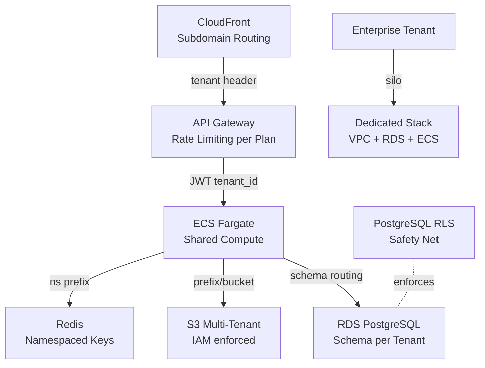

## Keywords in This File
{: .no_toc }

| # | Keyword | Weight |
|---|---------|--------|
| 24 | [Multi-Tenant Cloud Architecture](#multi-tenant-cloud-architecture) | ★★★ |

---

# Multi-Tenant Cloud Architecture

**Interview Weight:** ★★★ - Core SaaS architecture pattern.
Multi-tenancy is the economic model behind all SaaS.
Understanding isolation models, data separation strategies,
and the operational challenges is required for staff-level
cloud and system design discussions.

---

### 🎯 Model Answer

**30 seconds:**

> Multi-tenancy: multiple customers share the same
> infrastructure. Three isolation models: Silo (separate
> stack per tenant - most isolated, most expensive),
> Pool (all tenants share everything - cheapest, hardest
> to isolate), and Bridge/Hybrid (shared compute, separate
> data stores). The risk: noisy neighbor, data leakage,
> and compliance (HIPAA/PCI tenants may require silo).
> Key challenge: tenant-aware data access control at every
> layer.

**3 minutes:**

> Isolation spectrum:
>
> Silo (per-tenant stack):
> - Separate VPC, RDS, compute per tenant
> - Strongest isolation: no shared resources
> - Cost: O(n) resources per n tenants
> - Best for: regulated tenants (HIPAA, FedRAMP), enterprise
>   tenants requiring dedicated resources
>
> Pool (fully shared):
> - All tenants share everything: same DB tables, same compute
> - Must enforce isolation via application logic + tenant ID
> - Cheapest: amortizes infrastructure across tenants
> - Risk: tenant data leakage if query bug or missing filter
> - Best for: commodity SaaS with many small tenants
>
> Bridge/Hybrid (most common):
> - Shared compute (ECS, Lambda)
> - Separate data stores per tenant (separate RDS schema
>   or database, separate S3 prefix/bucket)
> - Balance: cost efficiency + data isolation
>
> Key challenges:
>
> 1. Tenant context propagation: every request must carry
>    tenant identity, every DB query must filter by tenant
>
> 2. Noisy neighbor: one tenant's high CPU/memory/IOPS usage
>    impacts others sharing the same compute/database
>
> 3. Per-tenant pricing and limits: rate limiting,
>    storage quotas, API throttling per tenant
>
> 4. Data residency: EU tenant data must stay in EU region
>    (GDPR). Multi-tenant app may need per-region routing.
>
> 5. Tenant onboarding/offboarding: automate resource
>    provisioning and GDPR-compliant deletion

**Blank Mind Recovery:**

**(1) Three models:** "Silo (dedicated, expensive, isolated),
Pool (shared, cheap, must-isolate-in-app),
Bridge (shared compute, separate data - most common)."

**(2) Biggest risks:** "Data leakage (query without tenant
filter), noisy neighbor, compliance mismatch (HIPAA tenant
in shared pool)."

**(3) Fix for data leakage:** "Row-Level Security (PostgreSQL
RLS), tenant ID in every query, service mesh attribute
injection, test with cross-tenant queries."

---

### 📘 Concept Explanation

**Isolation Model Comparison:**

```
SILO MODEL:
  Tenant A: VPC-A, RDS-A, ECS-A, S3-A
  Tenant B: VPC-B, RDS-B, ECS-B, S3-B
  Cost: $500/month/tenant (10 tenants = $5,000/month)
  If 1 tenant breached: only that tenant's data at risk
  Scaling: add tenant = run Terraform, provision new stack
  Best for: enterprise SaaS, regulated industries

POOL MODEL:
  Shared: VPC, RDS (one database, all tenants), ECS, S3
  Cost: $500/month total (10 tenants = $50/tenant/month)
  Tables: users (tenant_id, user_id, ...), orders (tenant_id, ...)
  Risk: SELECT * FROM orders WHERE user_id = 123
         (missing tenant filter - returns other tenants' data)
  Fix: PostgreSQL Row Level Security (RLS), enforced at DB
  Scaling: add tenant = insert row in tenants table

BRIDGE MODEL (most common in production SaaS):
  Shared: compute (ECS Fargate), API Gateway, cache (Redis)
  Separate: RDS schema per tenant (same RDS cluster, separate schema)
            S3 bucket per tenant OR S3 prefix per tenant
  Cost: ~$100-200/month/tenant depending on size
  Isolation: DB schema = hard boundary, compute = shared
  Noisy neighbor: compute shared, DB IOPS isolated per schema
  Scaling: add tenant = create schema, provision S3 prefix
```

**Row Level Security (PostgreSQL):**

```sql
-- POOL MODEL SAFETY NET: RLS at database level
-- Even if application forgets tenant filter, DB enforces it

-- Enable RLS on tenant-scoped tables:
ALTER TABLE orders ENABLE ROW LEVEL SECURITY;

-- Policy: user can only see rows matching their tenant:
CREATE POLICY tenant_isolation ON orders
  USING (tenant_id = current_setting('app.tenant_id')::uuid);

-- Application sets tenant context per connection:
-- SET LOCAL app.tenant_id = '<tenant-uuid>';
-- (Set within transaction, not reused across connections)

-- Test: tenant A cannot see tenant B's orders:
-- SET LOCAL app.tenant_id = 'tenant-a-uuid';
-- SELECT * FROM orders; -> only tenant A rows returned
-- Even if JOIN or subquery would otherwise expose other rows

-- CRITICAL: verify RLS is enforced for non-superusers
-- Superuser BYPASSES RLS by default
-- Use unprivileged application user:
ALTER TABLE orders FORCE ROW LEVEL SECURITY;
-- FORCE: applies RLS even to table owner
```

**Noisy Neighbor Controls:**

```
PROBLEM:
  Tenant X runs a large batch report: 100% CPU, 80% DB IOPS
  Tenant Y's normal requests become slow
  SLA violation for Tenant Y even though they didn't do anything

CONTROLS:
  1. Compute: ECS task CPU/memory limits (hard cap per task)
     Container CPU throttling prevents noisy neighbor

  2. Database:
     Aurora: pg_resourcegroups to cap connections per tenant
     DynamoDB: RCU/WCU capacity per table = per-tenant cap
     RDS: schema per tenant, per-schema connection pool cap

  3. API: per-tenant rate limiting at API Gateway
     Plan with throttle limits per API key (= per tenant)

  4. Queue: SQS FIFO per tenant for batch jobs
     Fair scheduling: Tenant X batch doesn't starve Tenant Y

  5. Monitoring: per-tenant metrics
     Alert when one tenant consumes > N% of shared resources
```

---

### 💻 Code Example

```java
// TENANT CONTEXT PROPAGATION: Spring Boot
// Tenant ID flows from HTTP header -> ThreadLocal
// -> database query filter -> every service call

// 1. Extract tenant from request:
@Component
public class TenantFilter implements Filter {

    @Override
    public void doFilter(
        ServletRequest req,
        ServletResponse res,
        FilterChain chain
    ) throws IOException, ServletException {

        HttpServletRequest httpReq = (HttpServletRequest) req;
        // Tenant ID from JWT claims or header:
        String tenantId = extractTenant(httpReq);

        if (tenantId == null || tenantId.isBlank()) {
            ((HttpServletResponse) res)
                .sendError(401, "Missing tenant context");
            return;
        }

        // Store in ThreadLocal for this request:
        TenantContext.setTenant(tenantId);
        try {
            chain.doFilter(req, res);
        } finally {
            // CRITICAL: clear after request (thread pool reuse)
            TenantContext.clear();
        }
    }

    private String extractTenant(HttpServletRequest req) {
        // Option A: from JWT sub-claim or custom claim:
        String auth = req.getHeader("Authorization");
        if (auth != null && auth.startsWith("Bearer ")) {
            // Parse JWT, extract tenantId claim
            // (use Nimbus JOSE library, not manual parsing)
            return jwtValidator.extractTenantId(
                auth.substring(7)
            );
        }
        // Option B: subdomain (tenant.app.com)
        String host = req.getServerName();
        // tenant.app.com -> tenant
        return host.split("\\.")[0];
    }
}

// 2. ThreadLocal carrier:
public class TenantContext {
    private static final ThreadLocal<String> TENANT =
        new ThreadLocal<>();

    public static void setTenant(String tenantId) {
        TENANT.set(tenantId);
    }

    public static String getTenant() {
        String id = TENANT.get();
        if (id == null) {
            throw new IllegalStateException(
                "No tenant context - missing TenantFilter?"
            );
        }
        return id;
    }

    public static void clear() {
        TENANT.remove();  // REMOVE not set(null) - cleaner
    }
}

// 3. Repository: mandatory tenant filter
@Repository
public class OrderRepository {

    private final JdbcTemplate jdbc;

    // BAD: missing tenant filter - NEVER do this
    public List<Order> findAllOrders_BAD() {
        return jdbc.query(
            "SELECT * FROM orders",  // ALL tenants!
            ORDER_ROW_MAPPER
        );
    }

    // GOOD: tenant-scoped query
    public List<Order> findOrders() {
        String tenantId = TenantContext.getTenant();
        return jdbc.query(
            "SELECT * FROM orders WHERE tenant_id = ?",
            ORDER_ROW_MAPPER,
            UUID.fromString(tenantId)
        );
    }

    // GOOD: parameterized + tenant-scoped
    public Optional<Order> findById(UUID orderId) {
        String tenantId = TenantContext.getTenant();
        return jdbc.query(
            "SELECT * FROM orders "
            + "WHERE id = ? AND tenant_id = ?",
            ORDER_ROW_MAPPER,
            orderId, UUID.fromString(tenantId)
        ).stream().findFirst();
        // Attacker cannot retrieve other tenant's order
        // even with a valid orderId from another tenant
    }
}

// 4. Per-tenant rate limiting:
@RestController
@RequestMapping("/api/orders")
public class OrderController {

    private final LoadingCache<String, RateLimiter>
        tenantLimiters = CacheBuilder.newBuilder()
            .expireAfterAccess(1, TimeUnit.HOURS)
            .build(new CacheLoader<String, RateLimiter>() {
                @Override
                public RateLimiter load(String tenantId)
                    throws Exception {
                    // Look up tenant's plan for rate limit:
                    int rps = tenantService
                        .getRateLimit(tenantId);
                    return RateLimiter.create(rps);
                }
            });

    @GetMapping
    public ResponseEntity<List<Order>> listOrders() {
        String tenantId = TenantContext.getTenant();
        RateLimiter limiter = tenantLimiters
            .getUnchecked(tenantId);
        if (!limiter.tryAcquire()) {
            return ResponseEntity
                .status(429)
                .header("Retry-After", "1")
                .build();
        }
        return ResponseEntity.ok(
            orderRepository.findOrders()
        );
    }
}
```

```sql
-- S3 PER-TENANT ISOLATION via IAM:

-- ECS task role for tenant A:
-- Allow access ONLY to tenant A's prefix:
{
  "Version": "2012-10-17",
  "Statement": [{
    "Effect": "Allow",
    "Action": ["s3:GetObject", "s3:PutObject"],
    "Resource": "arn:aws:s3:::app-data/${aws:PrincipalTag/TenantId}/*"
    -- ${aws:PrincipalTag/TenantId}: tag on the IAM role
    -- matches the role's TenantId tag value
    -- Tenant A role (tagged TenantId=tenant-a):
    --   can only access s3://app-data/tenant-a/*
    -- Cannot access s3://app-data/tenant-b/*
  }]
}
```

> **Code walkthrough:** The TenantFilter is the security
> boundary at the HTTP layer: it extracts the tenant ID
> from the JWT claim (verified, not trusted as a raw header)
> and stores it in a ThreadLocal. The `finally` block clearing
> the ThreadLocal is critical: Spring uses thread pools,
> so without clearing, the next request on this thread
> would inherit the previous request's tenant context.
> This is the data leakage failure mode. The repository
> methods always append `AND tenant_id = ?` to every query:
> the `findById` method takes a UUID but still filters by
> tenant - an attacker with a valid order UUID from tenant B
> cannot retrieve it while authenticated as tenant A.
> The per-tenant rate limiter uses Guava's LoadingCache:
> on first request from a tenant, it loads their plan's
> rate limit from the database. Subsequent requests reuse
> the cached limiter. Different tenants can have different
> rate limits based on their subscription tier.

---

### 🎓 Answers by Seniority

**Junior / Mid:**

> "Multi-tenancy means multiple customers share the same
> infrastructure. Three models: Silo (each tenant gets
> their own separate stack - expensive but isolated),
> Pool (all tenants share everything - cheap but requires
> careful data isolation), and Hybrid (shared compute,
> separate databases - most common). The most important
> rule: every database query must filter by tenant ID.
> A missing tenant filter is a data leakage vulnerability."

---

**Senior / Staff:**

> "Multi-tenancy architecture is fundamentally about the
> isolation model choice, and that choice is driven by
> compliance requirements and business model. Enterprise SaaS
> with HIPAA tenants needs silo isolation - shared is not
> an option regardless of cost. SMB SaaS with thousands
> of small tenants needs pool or bridge - silo costs
> are prohibitive. The hardest problem is not the data
> model - it's tenant context propagation. Every layer
> of the stack must carry and enforce tenant identity:
> HTTP filter, service layer, repository layer, database
> RLS as a safety net. The failure mode that causes breaches
> is a developer writing a query without the tenant filter.
> Defense in depth: PostgreSQL Row Level Security catches
> this at the database level even when application code
> is wrong. Per-tenant rate limiting and noisy neighbor
> controls are the operational challenge - one large tenant
> can destabilize the service for all others on shared
> infrastructure."

---

### ⚠️ Common Misconceptions

**Misconception 1: "Tenant ID in a query is sufficient
for isolation."**

A SQL query with `WHERE tenant_id = ?` can still leak
data if the application has a JOIN to a non-tenant-scoped
table, or if the tenant_id parameter is not correctly
validated. Defense in depth: application-level filtering
PLUS database-level Row Level Security. RLS enforces
isolation even when application code has bugs.

**Misconception 2: "Multi-tenancy is only about the database."**

Every layer must enforce tenant isolation: compute
(if tasks are shared, prevent one tenant's task from
accessing another's files), storage (IAM policies on S3
using tenant tag), cache (namespace per tenant in Redis
to prevent cache poisoning across tenants), message queues
(separate SQS queue or topic partition per tenant),
and API (rate limiting per tenant).

---

### 🚨 Failure Modes and Diagnosis

**Failure 1: Missing tenant filter causes data leakage**

*Symptom:* Customer reports seeing another customer's
data in their account. Support cannot reproduce.
Happens intermittently.

*Root cause:* One code path has a query without tenant
filter. On certain request types (admin export), all
tenants' data returned.

*Diagnosis:*
```bash
# Enable query logging and find queries without tenant_id:
# PostgreSQL: enable log_statement = 'all'
# Filter for queries without tenant_id filter:
grep -v "tenant_id" /var/log/postgresql/postgresql.log | \
  grep "SELECT.*FROM orders"
# Any match: missing tenant filter in application code
```

*Fix:*
1. Add PostgreSQL RLS as immediate safety net
2. Create custom Hibernate filter that auto-appends tenant
   condition to all entity queries
3. Unit test: attempt to access resource with wrong tenant
   in every repository method

---

**Failure 2: ThreadLocal tenant context not cleared**

*Symptom:* Sporadic security audit finding: request from
Tenant A retrieves Tenant B's data. Cannot reproduce
consistently.

*Root cause:* TenantContext.clear() not called in finally
block. Thread pool reuses thread. Next request on that
thread inherits previous request's tenant context.

*Detection:*
```java
// Add assertion in test environment:
@Around("execution(* com.app..*Controller.*(..))")
public Object assertTenantCleared(ProceedingJoinPoint pjp)
    throws Throwable {
    String before = TenantContext.getTenant();
    // Should be null at start of request handler
    if (before != null) {
        throw new IllegalStateException(
            "Tenant context leaked from previous request: "
            + before
        );
    }
    return pjp.proceed();
}
```

---

### ⚖️ Comparison Table

| Model | Isolation | Cost/Tenant | Best For | Risk |
|-------|-----------|------------|----------|------|
| Silo | Strongest | High ($400+) | Regulated, enterprise | Cost scales with tenants |
| Pool | Application | Lowest ($5-50) | SMB, high volume | Data leakage if bug |
| Bridge | Medium | Medium ($50-200) | Most SaaS | Noisy neighbor on compute |
| Account-per-tenant | AWS-native | High | Highly regulated | Management overhead |

---

### 🏛️ System Design

**SaaS Multi-Tenant Platform:**

```
TENANT TIERS:
  Enterprise: silo model
    - Dedicated VPC, RDS, ECS cluster
    - Custom domain (client.app.com)
    - SLA: 99.99%, dedicated support
    - Price: $2,000+/month

  Business: bridge model
    - Shared compute (ECS Fargate)
    - Dedicated RDS schema (same cluster, schema isolated)
    - Shared S3 with per-tenant prefix + IAM boundary
    - Price: $99-499/month

  Starter: pool model
    - Fully shared compute + database
    - RLS enforced at database level
    - Redis: tenant-namespaced keys (tenant:{id}:cache:*)
    - Price: $0-29/month

SHARED INFRASTRUCTURE (all tiers):
  API Gateway: per-tenant API key, rate limiting per plan
  CloudFront: tenant routing (subdomain -> tenant header injection)
  Route 53: tenant.app.com -> CloudFront
  Auth: Cognito User Pool per tier (or single pool with groups)

ISOLATION ENFORCEMENT LAYERS:
  1. API Gateway: API key = tenant identity
  2. Application: JWT claim = tenant_id in ThreadLocal
  3. Repository: every query has tenant_id = ?
  4. Database: PostgreSQL RLS (safety net)
  5. S3: IAM policy with PrincipalTag/TenantId
  6. Cache: Redis key namespace prefix

TENANT ONBOARDING (automated):
  Trigger: payment confirmed -> EventBridge event
  Lambda: create RDS schema, create S3 prefix,
          create API Gateway usage plan, create Cognito group
  Duration: < 2 minutes from payment to usable tenant
  Offboarding: GDPR-compliant deletion (schedule, not immediate)
```



> **Diagram walkthrough:** CloudFront routing uses subdomain
> to inject a `X-Tenant-ID` header (or the JWT contains
> the tenant claim). API Gateway validates the API key
> and enforces per-tenant rate limits. ECS Fargate is shared:
> the application extracts tenant_id from the JWT and puts
> it in ThreadLocal. Database routing goes to the tenant's
> schema in the shared RDS cluster - separate schemas provide
> hard data isolation. PostgreSQL RLS is the safety net:
> even if application code forgets the tenant filter,
> the database enforces it. Enterprise tenants bypass the
> shared infrastructure entirely and get a dedicated stack,
> provisioned via Terraform from the same codebase.

---

### 🎯 Interview Deep-Dive

> **Timing:** 5-7 minutes per question.

| Type | Questions |
|------|-----------|
| CONCEPT | 2 |
| DEBUGGING | 2 |
| TRADE-OFF | 2 |
| DESIGN | 2 |
| BEHAVIORAL | 2 |
| SCENARIO | 2 |

---

#### CONCEPT 1: Explain the three multi-tenancy isolation models and when you would choose each.

**Silo model (per-tenant stack):**

Each tenant has completely separate AWS resources: VPC,
compute (ECS cluster or EC2), database (RDS instance),
storage (S3 bucket). Zero sharing at infrastructure level.

When to choose:
- Regulated industries: HIPAA, FedRAMP, PCI DSS tenants
  where shared infrastructure may violate compliance
- Enterprise contracts requiring dedicated resources
- Tenants with extreme isolation requirements (government,
  financial institutions with strict data residency)
- High-revenue tenants where blast radius cost is acceptable

Trade-off: O(n) resources. 1,000 tenants = 1,000 RDS instances.
At scale: account limits, provisioning complexity, cost.

**Pool model (fully shared):**

Single database, single compute, single storage. Tenant
identity enforced via application logic (tenant_id column
in every table) and database-level RLS.

When to choose:
- High volume, low-revenue per tenant (SaaS $0-99/month)
- Tenants with no compliance requirements
- Early-stage product where cost efficiency is critical
- Tenants who are fungible (no differentiated treatment)

Risk: a missing tenant filter in one query exposes all
tenant data. Defense in depth required (RLS).

**Bridge/Hybrid model:**

Shared compute, isolated data. Separate RDS schema per
tenant (same cluster, different schemas or databases).
Separate S3 prefix with IAM policy enforcement.

When to choose:
- Most production SaaS applications
- Need data isolation without silo cost
- Compliance requires data isolation but not compute isolation
- Medium-revenue tenants ($50-500/month)

This is the dominant production pattern because it balances
cost efficiency (shared compute, single cluster) with
meaningful data isolation (schema = hard database boundary).

*What separates good from great:* The compliance-driven
choice is the key insight. Pool model is adequate technically
but HIPAA/FedRAMP regulations require physical or logical
isolation that pool may not satisfy. Silo is always
compliant but economically unsustainable at scale.
Bridge is the engineering compromise.

---

#### CONCEPT 2: What is the noisy neighbor problem in multi-tenancy and how do you mitigate it?

**Definition:** One tenant's resource consumption degrades
performance for other tenants sharing the same infrastructure.

**Examples:**

CPU noisy neighbor: Tenant X runs a report query that
consumes 80% of shared ECS cluster CPU. Tenant Y's normal
API requests take 5x longer.

Database noisy neighbor: Tenant X runs a full table scan
that causes all shared RDS connections to block.
Tenant Y's queries queue.

Cache noisy neighbor: Tenant X fills the shared Redis
cache (eviction policy). Tenant Y's cached objects are
evicted. Cache miss rate spikes for all tenants.

**Mitigation per resource type:**

Compute: ECS task CPU/memory hard limits. Container CPU
throttling at the cgroup level caps Tenant X's CPU usage.
Lambda concurrency limits per API key.

Database: per-tenant connection pool caps.
DynamoDB with per-tenant tables: explicit RCU/WCU caps.
Aurora: pg_resourcegroups for per-tenant connection limits.
Separate tenants with heavy batch loads to off-peak windows.

Cache: per-tenant key namespace + maxmemory-policy allkeys-lru
per namespace (Redis 7.0 logical databases, or Valkey).
Soft cap: alert when tenant consumes > N% of total cache.

API: per-tenant rate limiting at API Gateway (throttle plan).
429 response with Retry-After header. Exponential backoff.

Queue: dedicated SQS FIFO queue per tenant for batch jobs.
Shared queue = one tenant's burst fills queue, others wait.

Monitoring: per-tenant CloudWatch metrics for CPU, DB
connection count, cache usage, API call rate. Alert when
any tenant exceeds 30% of shared resource. Trigger: offer
tenant an upgrade to dedicated tier.

*What separates good from great:* Database-level noisy
neighbor is the hardest to mitigate because SQL is hard
to rate-limit. The combination of per-tenant connection
pool caps + pg_resourcegroups + off-peak batch scheduling
covers the database tier comprehensively.

---

#### DEBUGGING 1: Tenant A reports seeing Tenant B's orders in their export. How do you investigate and what is the most likely cause?

**Step 1: Reproduce and contain:**
- Attempt to reproduce: call the export endpoint as Tenant A
- If reproducible: disable the export endpoint (harm containment)
- If not reproducible: gather logs from Tenant A's session

**Step 2: Find the missing tenant filter:**
```sql
-- PostgreSQL query logging: enable temporarily
ALTER SYSTEM SET log_statement = 'all';
SELECT pg_reload_conf();

-- Trigger the export as Tenant A
-- Find the query in logs:
grep "SELECT.*FROM orders" /var/log/postgresql/postgresql.log |
  grep -v "tenant_id"
-- Any match: this query has no tenant filter
```

**Step 3: Identify the code path:**
The query without tenant filter maps to a specific
repository method. Cross-reference with the export
code path - which service, which repository method,
which query.

**Most likely causes:**

1. **Admin export endpoint**: engineers sometimes add
   "admin" endpoints that bypass normal tenant scoping
   for reporting purposes. If the authorization check
   fails (any authenticated user can hit it), all tenants'
   data is exposed.

2. **Eager loading in ORM**: Hibernate/JPA fetch joins
   that cross entity boundaries. Parent entity is
   tenant-scoped, but the JOIN loads related entities
   without tenant filter.

3. **ThreadLocal not set**: the export runs as a scheduled
   job (Quartz, @Scheduled). Scheduled jobs don't go
   through the TenantFilter. No tenant context = null
   = missing filter = all rows.

**Immediate remediation:**
1. Add RLS at database level (safety net while fixing)
2. Fix the code path with the missing filter
3. Add integration test: export as Tenant A, verify
   no Tenant B data in result

*What separates good from great:* The scheduled job
scenario is the most often missed. Scheduled tasks don't
go through the HTTP filter chain. Engineers who build
the filter for web requests forget that background jobs
also need tenant context (or must explicitly scope
to a single tenant per job execution).

---

#### DEBUGGING 2: Response times for all tenants degrade from 50ms to 800ms. Investigation shows one tenant is responsible. How do you identify and isolate them?

**Step 1: Identify the noisy tenant:**
```bash
# CloudWatch: requests per tenant by response time:
aws logs insights query \
  --log-group-name /app/access-logs \
  --query-string '
    fields tenantId, @duration
    | stats
      avg(@duration) as avgMs,
      count(*) as requests
      by tenantId
    | sort avgMs desc
    | limit 20
  '
# One tenant with high request count AND high duration = noisy neighbor

# RDS: connections per schema:
SELECT
  schemaname,
  count(*) as connections
FROM pg_stat_activity
GROUP BY schemaname
ORDER BY connections DESC;
# Schema with excessive connections = database noisy neighbor
```

**Step 2: Immediate mitigation:**
```bash
# Rate limit the offending tenant at API Gateway:
aws apigateway update-usage \
  --usage-plan-id <plan-id> \
  --key-id <tenant-api-key> \
  --patch-operations op=replace,path=/throttle/rateLimit,value=10
# Drop from e.g. 1000 RPS to 10 RPS temporarily

# Kill long-running queries from this tenant's schema:
SELECT pg_terminate_backend(pid)
FROM pg_stat_activity
WHERE query_start < now() - interval '30 seconds'
  AND schemaname = 'tenant_x';
```

**Step 3: Permanent fix:**
- Add per-tenant rate limiting to API Gateway usage plans
- Add per-tenant connection pool cap in HikariCP
- Add database query timeout per session (statement_timeout)
- Add monitoring: alert if any single tenant > 20% of
  cluster CPU or > 30% of connection pool

*What separates good from great:* The combination of
access log analysis (identify tenant) + pg_stat_activity
(identify DB cause) is the production diagnostic workflow.
The immediate mitigation (rate limit at API Gateway,
kill long queries) shows incident response instinct.

---

#### TRADE-OFF 1: Schema-per-tenant vs row-per-tenant. What are the trade-offs?

**Schema-per-tenant:**

Isolation: hard. Schema is a database namespace.
A query in schema_a cannot accidentally access schema_b
even without tenant_id filters.

Performance: no cross-tenant query interference.
Table statistics and indexes are per-schema.

Migration: schema migration must run on all schemas.
1,000 tenants = 1,000 schema migrations. Tooling challenge.
`flyway.schemas=tenant_a,tenant_b,...` or custom migration runner.

Connection routing: must route to correct schema per request.
Spring Boot multi-tenant datasource routing.

Scale: PostgreSQL handles thousands of schemas efficiently.
But schema count * tables = total table count.
At very large scale (100,000+ tenants): table count may
impact catalog queries.

**Row-per-tenant (shared schema):**

Isolation: application + RLS. More attack surface.
A bug can expose cross-tenant data.

Migration: single schema migration, instant.

Performance: indexes include all tenants' data.
A missing index is multiplied by tenant count.
Noisy neighbor at the index level (one tenant's writes
affect index maintenance for all).

Scale: table rows grow with tenants. Multi-tenant
tables with 1B+ rows need partitioning.
Table partitioning by tenant_id (PARTITION BY LIST)
improves query performance and maintenance.

**Recommendation:** Schema-per-tenant up to ~10,000 tenants.
Row-per-tenant for very large (100,000+) tenant counts
with PostgreSQL partitioning. The schema approach provides
better isolation with manageable migration complexity.

*What separates good from great:* Database partitioning
for row-per-tenant at scale shows the candidate has thought
beyond the toy example. Migration tooling for schema-per-tenant
shows operational experience.

---

#### TRADE-OFF 2: Tenant isolation via application code vs database-level enforcement (RLS). Why not just trust the application?

**Application-level isolation only:**

Pros: simpler code (no RLS configuration), portable
across database engines.

Cons:
- Every code path must implement the filter. Human error
  in one endpoint = data leakage.
- ORM abstractions can hide the tenant filter. A new
  developer adds a query without the pattern.
- Testing cannot exhaustively verify every code path.
  A single untested edge case = vulnerability.

**Database-level (RLS) as safety net:**

PostgreSQL RLS adds tenant isolation at the database kernel.
Even if application sends `SELECT * FROM orders`,
the database returns only the current tenant's rows.

This is the defense-in-depth principle: multiple independent
enforcement layers. Application bug bypasses app-level filter.
RLS catches it at database level.

Cost: minor per-query overhead (RLS adds a WHERE clause
internally). Typically < 5% overhead on indexed queries.

Constraint: requires setting tenant context per database
connection (`SET LOCAL app.tenant_id`). Must be set
in every transaction. Connection pool must not reuse
connections across tenants without resetting context.

**Recommendation:** Both, always. Application-level for
correctness (fast, explicit). RLS as safety net
for security (defense-in-depth). The cost of RLS is
negligible vs the risk of application-level-only isolation.

*What separates good from great:* The defense-in-depth
framing is the key insight. RLS is not a replacement for
application code - it is a safety net that catches the
inevitable bugs. The connection pool context leak risk
shows awareness of the operational challenge.

---

#### DESIGN 1: Design the data isolation layer for a SaaS application serving 5,000 tenants with varying compliance requirements.

**Tier classification:**

```
TIER 1 - Regulated (HIPAA/FedRAMP, ~50 tenants):
  Silo model: dedicated VPC, dedicated RDS, dedicated ECS
  Deployment: Terraform modules, one stack per tenant
  Cost: ~$800-1,200/tenant/month
  Migration: tenant requests -> operations team provisions
  SLA: 99.99% (independent stack)

TIER 2 - Business (SOC2 required, ~500 tenants):
  Bridge model: shared ECS, dedicated RDS schema
  Schema per tenant: schema_t_{tenant_id}
  S3: separate bucket per tenant (cross-account if needed)
  Cost: ~$150-300/tenant/month
  Connection routing: HikariCP multi-tenant DataSource
  Migration: automated per-schema Flyway migration runner

TIER 3 - Starter (no compliance, ~4,450 tenants):
  Pool model: shared everything
  PostgreSQL RLS enabled on all tables
  S3: shared bucket with tenant prefix + IAM tag condition
  Redis: namespace prefix (app:{tenant_id}:*)
  Cost: ~$10-50/tenant/month
  Migration: single schema migration for all starter tenants
```

**Shared infrastructure:**

API Gateway: usage plans per tier (throttle limits).
Auth: JWT with `tenant_id` and `tier` claims.
CloudFront: subdomain routing (subdomain -> tenant lookup).
Tenant metadata DB: maps tenant_id -> tier + stack info.
Route 53: tenant.app.com -> CloudFront + tenant header.

**Tenant onboarding pipeline:**

EventBridge: payment_confirmed -> tenant_provisioner Lambda.
Lambda: based on tier -> provision stack (Tier 1) or
create schema + S3 bucket (Tier 2) or create entry
in metadata table (Tier 3). All < 5 minutes.

**GDPR deletion:**

Scheduled 30-day hard delete after account cancellation.
Tier 1: destroy Terraform stack. Tier 2: DROP SCHEMA.
Tier 3: DELETE WHERE tenant_id, S3 lifecycle expiration.
Audit trail: deletion event in append-only audit log
(even after tenant data is gone).

*What separates good from great:* The tiered compliance
approach (not uniform isolation for all) is the economic
answer. HIPAA requires silo; starters don't. The GDPR
deletion pipeline shows operational completeness.

---

#### DESIGN 2: How would you implement per-tenant feature flags and A/B testing in a multi-tenant platform?

**Requirements:** Different tenants can have different
features enabled. Enterprise tenants get early access.
Starter tenants can be in A/B test groups.

**Data model:**

```sql
CREATE TABLE tenant_features (
  tenant_id UUID NOT NULL,
  feature_key VARCHAR(100) NOT NULL,
  enabled BOOLEAN NOT NULL DEFAULT false,
  config JSONB,  -- feature-specific config
  expires_at TIMESTAMP,  -- for time-limited trials
  PRIMARY KEY (tenant_id, feature_key)
);

-- Feature definition (admin-managed):
CREATE TABLE features (
  key VARCHAR(100) PRIMARY KEY,
  rollout_percentage INTEGER DEFAULT 0,
  -- 0-100: % of tenants enrolled
  description TEXT,
  created_at TIMESTAMP DEFAULT now()
);
```

**Evaluation logic:**

```java
@Service
public class FeatureFlagService {

    private final LoadingCache<String, FeatureFlags> cache;

    // Per-tenant feature evaluation:
    public boolean isEnabled(String featureKey) {
        String tenantId = TenantContext.getTenant();
        FeatureFlags flags = cache.getUnchecked(tenantId);
        return flags.isEnabled(featureKey);
        // Cache per tenant: avoids DB call per request
        // TTL: 5 minutes (balance freshness vs DB load)
    }

    // Gradual rollout:
    // Hash tenantId+featureKey -> deterministic 0-100 value
    // If hash % 100 < rollout_percentage: enabled
    // Same tenant always gets same result (consistent)
}
```

**Infrastructure:**

Cache in Redis: `features:{tenant_id}` -> JSON flags.
Admin API: update feature flags -> invalidate cache.
EventBridge: feature flag change -> Lambda cache invalidation.

**A/B test assignment:**

Assign tenants to groups deterministically:
`hash(tenant_id + experiment_key) % 100 < 50` = group A.
Same tenant always in same group (consistent experience).
Track experiment results in analytics (Segment, Mixpanel)
with tenant_id and group as attributes.

*What separates good from great:* Deterministic hashing
(same tenant always in same group) is the key correctness
requirement. Randomizing per-request creates inconsistent
UX. The cache invalidation design shows operational thinking.

---

#### BEHAVIORAL 1: Describe a time you had to add multi-tenancy to an existing single-tenant application.

**STAR:**

**Situation:** Our analytics product was built for a single
enterprise customer. The business decided to expand to
multiple customers. The codebase had no tenant concept:
no tenant_id columns, no isolation, hardcoded customer name
in some queries.

**Task:** Add multi-tenancy without taking the existing
customer offline, within 6 months.

**Action:** Three-phase migration:

Phase 1 (months 1-2): Add tenant concept without breaking.
Added `tenants` table and `tenant_id` FK to all tables.
Filled existing rows with `DEFAULT_TENANT` UUID. No behavior
change. Added TenantContext + TenantFilter but with a fallback
to DEFAULT_TENANT if no tenant header present (legacy path).

Phase 2 (months 3-4): New tenants. Onboarded second customer
to the new schema. All new code paths required tenant context.
Existing customer's requests used legacy path (fallback).
Found 12 queries missing tenant filter via code review
and PostgreSQL audit log.

Phase 3 (months 5-6): Legacy migration. Updated existing
customer to provide tenant header. Removed fallback.
Added RLS. Validated with cross-tenant access tests.
Load tested with 5 simulated tenants.

**Result:** Launched multi-tenancy with zero downtime
for the existing customer. Onboarded 8 new customers
in first month.

*What separates good from great:* The fallback-to-legacy
pattern is the migration strategy that enables backward
compatibility. Removing the fallback only after the existing
customer is migrated is the safe sequence. Finding 12 missing
tenant filters via audit log shows the operational discovery
process.

---

#### BEHAVIORAL 2: How do you handle a situation where a tenant asks for data residency in a specific region that your platform doesn't currently support?

**The business and technical tension:**

Business: the customer is enterprise, high-value, GDPR
requires EU data residency. You want to close the deal.
Technical: your platform is us-east-1 only. EU deployment
requires new region, new infrastructure, operational burden.

**Response approach:**

Short term (if deal is urgent and high-value):
Deploy silo model for this specific tenant in eu-west-1.
The silo model (separate stack per tenant) is region-agnostic:
run the Terraform module in eu-west-1. This is possible
without multi-region platform infrastructure.

Cost: dedicated stack in EU = ~$1,000/month for this tenant.
Price accordingly.

Medium term (multiple EU tenants):
Build EU region support into the platform as a tier option.
Regional VPCs, cross-region CloudFront routing,
region as a tenant metadata attribute.
Route `tenant.app.com` to the nearest region where
the tenant's data is provisioned.

Long term:
Multi-region platform with tenant metadata as the
routing configuration. All new regions are supported
by the same provisioning pipeline.

**What I would NOT do:**

Promise EU residency without implementing it (GDPR violation
risk). Delay indefinitely while building the full multi-region
platform (business impact). Store EU data temporarily in
us-east-1 "just for now."

*What separates good from great:* The silo model as the
short-term solution for a single tenant with special
requirements shows architectural flexibility. The long-term
roadmap from silo to multi-region platform shows strategic
thinking.

---

#### SCENARIO 1: Your SaaS platform's largest tenant (30% of revenue) says their performance is degrading. Other tenants report no issues. What is the likely cause and how do you fix it?

**30% of revenue tenant on a shared pool/bridge platform:**

This tenant is almost certainly doing more volume than
other tenants, which is why they're both high-revenue
and experiencing degradation.

**Possible causes:**

1. **Tenant's own data growth:** their schema/partition has
   grown to 100x the size of other tenants. Index scan time
   grows with data size. Query that was 10ms at 1M rows
   takes 1,000ms at 100M rows.
   Fix: add indexes on their schema, partition large tables,
   run VACUUM ANALYZE.

2. **Noisy neighbor - reverse:** other tenants are noisy
   and this tenant's SLA is most visible due to revenue.
   The shared RDS connection pool is saturated.
   Fix: increase max connections temporarily, migrate
   this tenant to bridge model with dedicated schema.

3. **Tenant needs to be upgraded to silo:**
   At 30% of revenue, this tenant probably justifies
   a dedicated stack. Silo removes all shared infrastructure
   contention and gives them predictable performance.

**Diagnosis:**
```bash
# Check schema-specific query performance:
SELECT
  query,
  mean_exec_time,
  calls,
  total_exec_time
FROM pg_stat_statements
WHERE query LIKE '%tenant_large%'
ORDER BY mean_exec_time DESC
LIMIT 10;
```

**Recommendation:** Short term: add indexes, VACUUM,
increase connection cap for their schema. Long term:
migrate this tenant to the bridge or silo model.
Frame to the customer as a "dedicated infrastructure"
upgrade at a higher price point. Solves performance
and increases revenue.

*What separates good from great:* Identifying the
business opportunity (upgrade to silo) shows product
thinking alongside technical diagnosis. The data growth
+ index degradation root cause is the most common
real production scenario for SaaS performance issues.

---

#### SCENARIO 2: A potential enterprise customer requires penetration testing of your multi-tenant SaaS. What do you allow and what safeguards do you put in place?

**What to allow:**

Authenticated penetration testing of the customer's
own tenant environment. Attacker credentials + tenant ID.
Attack the application layer, API, authentication.
Attempt horizontal privilege escalation (access other
tenants) - this is the most important test.

**What to NOT allow without controls:**

Unauthenticated scanning of shared infrastructure.
DoS testing against shared compute/database (harms all tenants).
Direct database access testing (requires network access
you should not give).
Testing other tenants' data (ethical and legal issue).

**Safeguards:**

Isolated test tenant: provision a silo-mode test tenant
specifically for the pentest. The pentester has full
access to this tenant but it is isolated from production.
If they find a data leakage vulnerability, it leaks
to the test tenant, not real customer data.

Monitoring: during the pentest window, enable enhanced
CloudTrail logging and anomaly alerts. Any API call
from the pentest IP to other tenants' data triggers
immediate alert.

Rules of engagement document: define what is in-scope
(tenant A's data, auth endpoints), what is out-of-scope
(infrastructure, DoS, other tenant data).

Results: any cross-tenant data access vulnerability
found by the pentester = critical severity, immediate fix
before the customer signs the contract.

*What separates good from great:* The isolated silo test
tenant for pentesting is the security-conscious design.
It allows genuine testing of horizontal privilege
escalation without risking real customer data. Most SaaS
companies do not have this - they either refuse pentesting
or allow it with no containment.

---
