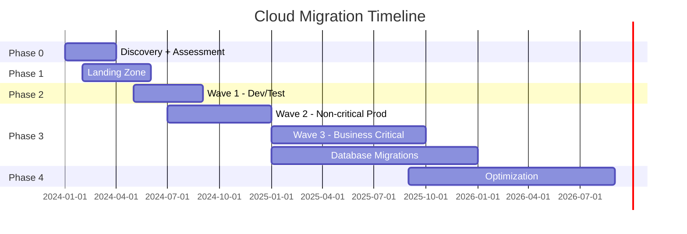

## Keywords in This File
{: .no_toc }

| # | Keyword | Weight |
|---|---------|--------|
| 26 | [Cloud Migration Strategy](#cloud-migration-strategy) | ★★★ |

---

# Cloud Migration Strategy

**Interview Weight:** ★★★ - Staff/Principal level.
Cloud migration is a multi-year program for large
organizations. Understanding the 7Rs (or 6Rs), phased
approach, risk mitigation, and the real failure modes
is expected for senior engineering and architecture roles.

---

### 🎯 Model Answer

**30 seconds:**

> Cloud migration starts with the 7Rs: Retire, Retain,
> Rehost (lift-and-shift), Relocate, Replatform, Repurchase,
> Refactor. Most organizations do rehost first (fastest,
> lowest risk), then optimize. Key risks: undiscovered
> dependencies, data migration with minimal downtime,
> and culture shift (ops teams must adopt cloud tooling).
> The single most common failure: treating cloud migration
> as a technology project, not a business transformation.

**3 minutes:**

> The 7Rs decision framework:
>
> Retire (5-10%): decommission - application no longer needed.
> Free win: no migration needed.
>
> Retain: don't migrate (yet). Regulatory constraints,
> end-of-life hardware contracts, or too risky.
>
> Rehost (lift-and-shift) (30-50%): move as-is to EC2/VMs.
> Fastest. Minimal code change. No cloud-native benefit.
> Tool: CloudEndure/AWS Application Migration Service.
> Good for: migration under time pressure, legacy apps.
>
> Relocate: move to cloud-based version of same environment.
> VMware -> VMware Cloud on AWS. Minimal change.
>
> Replatform (20-30%): minor optimizations while migrating.
> PostgreSQL on EC2 -> RDS PostgreSQL (managed).
> No code changes, but use managed service.
>
> Repurchase: switch to SaaS alternative.
> On-prem CRM -> Salesforce.
>
> Refactor/Re-architect (5-15%): redesign for cloud.
> Monolith -> microservices, EC2 -> Lambda.
> Most benefit, most risk, most time.
>
> Migration approach:
> Wave-based migration:
> Wave 1: dev/test environments (low risk, learn tooling)
> Wave 2: non-critical production (validate process)
> Wave 3+: business-critical production (proven process)
>
> Database migration is the hardest:
> - Schema conversion (Oracle -> Aurora PostgreSQL = months)
> - Zero-downtime cutover: AWS DMS with CDC
>   (replicate, sync lag to seconds, cutover, point DNS)
> - Data validation: row counts, checksums, spot checks

**Blank Mind Recovery:**

**(1) 7Rs:** "Retire, Retain, Rehost (lift+shift), Relocate,
Replatform, Repurchase, Refactor. Most start with Rehost."

**(2) Wave sequence:** "Dev/test first (learn). Non-critical
production (validate). Business-critical last (proven)."

**(3) Database:** "AWS DMS for continuous replication.
Reduce lag to seconds. Cutover during maintenance window.
Validate before switching DNS."

---

### 📘 Concept Explanation

**The 7Rs Decision Tree:**

```
For each application:

Step 1: Is the app still needed?
  No -> RETIRE (stop maintaining, decommission)
  Yes -> continue

Step 2: Can it be migrated in this wave?
  No (compliance, contract, dependency) -> RETAIN
  Yes -> continue

Step 3: Can you replace with SaaS?
  Yes (e.g., on-prem email -> Microsoft 365) -> REPURCHASE
  No (custom business logic) -> continue

Step 4: How much change is justified?
  Maximum ROI (greenfield redesign) -> REFACTOR
    Monolith -> microservices. Max cloud benefit.
    Risk: high. Time: months-years.
    Reserve for: strategic systems, high-growth workloads

  Medium change (managed services) -> REPLATFORM
    PostgreSQL on EC2 -> RDS PostgreSQL (same code)
    Tomcat on EC2 -> Elastic Beanstalk
    Benefit: reduced ops, managed HA/backups
    Risk: low. Time: days-weeks.

  Minimal change (move as-is) -> REHOST
    EC2 for EC2, same configuration
    Use Application Migration Service (replicate + test + cutover)
    Benefit: migration speed
    Risk: very low. Time: hours-days per server
    Use for: legacy apps, migration under time pressure
```

> **Code walkthrough:** This example demonstrates the core pattern in action. The key mechanism shows how the concept works in practice. Study the structure to understand the essential behavior and common usage.

**Database Migration Zero-Downtime Pattern:**

```
CHALLENGE: migrate 5TB PostgreSQL from on-prem to RDS
  Must maintain < 30s downtime SLA for production database
  Cannot run parallel writes to both for long (complexity)

PATTERN: DMS CDC (Change Data Capture)

Phase 1: FULL LOAD (days, hours for large DB)
  DMS replicates all existing data from source to target
  Source: still taking writes from application
  Target: accumulates the full load
  Application: pointed at source, unaffected

Phase 2: CDC CATCH-UP
  DMS switches to CDC: replays all changes made during full load
  Replication lag: may start at hours, reduces over time
  Monitor: ReplicationLag metric in CloudWatch
  Wait until: lag < 5 seconds consistently

Phase 3: CUTOVER (< 30 seconds)
  - Put application in maintenance mode (or redirect to
    status page, or reject writes for 10 seconds)
  - Wait for DMS lag to reach 0
  - Validate row counts in target
  - Update application connection string to RDS endpoint
  - Remove maintenance mode
  Downtime: typically 10-30 seconds
  No data loss (DMS ensured all writes replicated)

Phase 4: VALIDATION
  - Run automated data integrity checks
  - Monitor application error rates for 1 hour
  - Rollback plan: repoint to source if issues (DMS can reverse)
```

> **Code walkthrough:** This example demonstrates the core pattern in action. The key mechanism shows how the concept works in practice. Study the structure to understand the essential behavior and common usage.

---

### 💻 Code Example

```bash
# AWS DMS: Zero-downtime database migration

# 1. Create replication instance:
aws dms create-replication-instance \
  --replication-instance-identifier prod-migration \
  --replication-instance-class dms.r5.xlarge \
  --allocated-storage 200 \
  --engine-version 3.5.0 \
  --publicly-accessible false
  # Place in same VPC as target RDS

# 2. Create endpoints:
aws dms create-endpoint \
  --endpoint-identifier source-postgres \
  --endpoint-type source \
  --engine-name postgres \
  --server-name on-prem-db.internal \
  --port 5432 \
  --database-name appdb \
  --username dmsuser \
  --password "$(aws secretsmanager get-secret-value \
    --secret-id migration/db-creds --query SecretString \
    --output text | jq -r .password)"

aws dms create-endpoint \
  --endpoint-identifier target-rds \
  --endpoint-type target \
  --engine-name aurora-postgresql \
  --server-name prod-rds.cluster-xxx.us-east-1.rds.amazonaws.com \
  --port 5432 \
  --database-name appdb \
  --username dmsuser \
  --password "$(aws secretsmanager get-secret-value \
    --secret-id migration/rds-creds --query SecretString \
    --output text | jq -r .password)"

# 3. Create and start migration task:
aws dms create-replication-task \
  --replication-task-identifier full-load-cdc \
  --source-endpoint-arn <source-arn> \
  --target-endpoint-arn <target-arn> \
  --replication-instance-arn <replication-instance-arn> \
  --migration-type full-load-and-cdc \
  --table-mappings '{"rules":[{
    "rule-type":"selection","rule-id":"1",
    "rule-name":"include-all","object-locator":{
      "schema-name":"%","table-name":"%"},
    "rule-action":"include"
  }]}'

# Start the task:
aws dms start-replication-task \
  --replication-task-arn <task-arn> \
  --start-replication-task-type start-replication

# 4. Monitor replication lag (run until < 5 seconds):
watch -n 30 "aws cloudwatch get-metric-statistics \
  --namespace AWS/DMS \
  --metric-name CDCLatencySource \
  --dimensions Name=ReplicationInstanceIdentifier,\
    Value=prod-migration \
  --period 60 --statistics Average \
  --start-time \$(date -u -d '5 min ago' +%FT%TZ) \
  --end-time \$(date -u +%FT%TZ) \
  --query 'Datapoints[-1].Average'"

# 5. CUTOVER SCRIPT (run during maintenance window):
#!/bin/bash
TASK_ARN="arn:aws:dms:..."
RDS_ENDPOINT="prod-rds.cluster-xxx.us-east-1.rds.amazonaws.com"

echo "Starting cutover at $(date)"

# Check current lag:
LAG=$(aws cloudwatch get-metric-statistics \
  --namespace AWS/DMS \
  --metric-name CDCLatencySource \
  --dimensions Name=ReplicationInstanceIdentifier,Value=prod-migration \
  --period 60 --statistics Average \
  --start-time $(date -u -d '2 min ago' +%FT%TZ) \
  --end-time $(date -u +%FT%TZ) \
  --query 'sort_by(Datapoints,&Timestamp)[-1].Average' \
  --output text)

echo "Current CDC lag: ${LAG} seconds"
if (( $(echo "$LAG > 10" | bc -l) )); then
  echo "LAG TOO HIGH. Aborting cutover."
  exit 1
fi

# Point application at RDS:
aws ssm put-parameter \
  --name "/app/DATABASE_URL" \
  --value "jdbc:postgresql://${RDS_ENDPOINT}:5432/appdb" \
  --overwrite
# Application reads DB URL from SSM - instant config change
# Trigger ECS rolling deploy to pick up new URL
aws ecs update-service --cluster prod --service app \
  --force-new-deployment
echo "Cutover complete at $(date)"
```

> **Code walkthrough:** The DMS migration task uses
> `full-load-and-cdc` mode: it starts with a full copy
> of all data, then continuously replicates changes.
> The CDCLatencySource metric measures how far behind
> the replication is from the source database. The cutover
> script checks that lag is < 10 seconds before proceeding:
> higher lag means more data loss risk during cutover.
> The configuration change uses AWS SSM Parameter Store
> rather than hardcoded connection strings: `put-parameter`
> updates the database URL instantly, and the `force-new-deployment`
> triggers a rolling ECS update that picks up the new
> parameter. This gives a zero-downtime configuration change
> (old tasks still use old URL until replaced, new tasks
> get the RDS URL). The alternative - updating environment
> variables in a task definition and deploying - takes
> longer but is equivalent.

---

### 🎓 Answers by Seniority

**Junior / Mid:**

> "Cloud migration strategy uses the 7Rs framework:
> Retire (decommission), Retain (don't migrate yet),
> Rehost (lift and shift to EC2 as-is), Relocate, Replatform
> (use managed services like RDS instead of EC2),
> Repurchase (replace with SaaS), and Refactor (redesign
> for cloud). Most migrations start with rehost because
> it's fast and low risk, then optimize to replatform
> or refactor over time."

---

**Senior / Staff:**

> "Migration strategy is about sequencing risk. Start with
> dev/test environments in the first wave to build tooling
> proficiency before touching production. The 7Rs give a
> framework but the real decision is: what is the risk/reward
> of each approach for each application? Rehost is fast but
> forfeits cloud-native benefits. Refactor is high ROI but
> high risk. The typical mistake: teams refactor everything
> simultaneously, creating massive coordination complexity.
> The pragmatic approach: rehost first, then incrementally
> replatform and refactor the high-value workloads once
> the team has cloud operational maturity. Database migration
> is always the hardest: AWS DMS with CDC achieves < 30s
> downtime for databases of any size if lag is managed
> correctly before cutover. The non-technical challenge
> is always larger than the technical: ops teams that
> managed bare metal for 10 years need retraining and
> time to build confidence in cloud tooling."

---

### ⚠️ Common Misconceptions

**Misconception 1: "Lift-and-shift to the cloud immediately
reduces costs."**

Rehosting to EC2 without optimization often INCREASES costs:
- On-prem: server is paid for (capital expense)
- Cloud: same server size as EC2 billed hourly (higher operational cost)
- Without Reserved Instances: $140/month per comparable instance
  vs fully depreciated on-prem hardware

Cost reduction comes from: right-sizing, reserved capacity,
using managed services (removing ops overhead), and
eliminating low-utilization servers (retire).

**Misconception 2: "We can migrate everything in 6 months."**

Large organizations (100+ applications) take 2-5 years
for complete migration. Databases with complex schemas
take months per database (schema conversion, testing,
CDC setup). Legacy applications with undiscovered
dependencies add months of dependency mapping.
Security and compliance review adds months.
Realistic timeline: 3-6 months for dev/test waves,
then 6-18 months per business-critical system wave.

---

### 🚨 Failure Modes and Diagnosis

**Failure 1: Undiscovered dependencies cause production
outage post-migration**

*Symptom:* After migrating application A to AWS, a
critical dependency (application B on-prem) is blocked
by the new network topology. A is in VPC, B is on-prem,
and the firewall rules for this specific integration
were not documented.

*Root cause:* Dependency mapping incomplete. Application A
was documented as standalone but had an undiscovered
integration with B via a shared database table.

*Prevention:*
```bash
# Before migration: capture ALL network connections
# From the application server, run for 30 days:
ss -tnp | awk '{print $5}' | sort -u > actual_connections.txt
# Compare to documented dependencies
# Any IP not in documentation = undiscovered dependency

# AWS tools:
# VPC Flow Logs: analyze ALL traffic patterns before
# and after migration to validate no missing connections
```

> **Code walkthrough:** This example demonstrates the core pattern in action. The key mechanism shows how the concept works in practice. Study the structure to understand the essential behavior and common usage.

---

**Failure 2: DMS replication lag prevents cutover**

*Symptom:* DMS CDC lag stays at 30+ seconds even after
24 hours of full load completion. Cannot cut over
with acceptable RPO.

*Root cause:* Source database write rate exceeds DMS
replication instance capacity. DMS instance is undersized.

*Diagnosis:*
```bash
aws cloudwatch get-metric-statistics \
  --namespace AWS/DMS \
  --metric-name CDCThroughputBandwidthSource \
  --dimensions Name=ReplicationInstanceIdentifier,Value=prod-migration \
  --period 60 --statistics Average ...
# Compare bandwidth to replication instance class capacity

# Check DMS task logs for errors:
aws dms describe-replication-task-individual-assessments \
  --filters Name=replication-task-arn,Values=<task-arn>
```

> **Code walkthrough:** This example demonstrates the core pattern in action. The key mechanism shows how the concept works in practice. Study the structure to understand the essential behavior and common usage.

*Fix:* Scale up the replication instance class
(r5.xlarge -> r5.2xlarge). Or reduce peak write load
on source during migration window.

---

### ⚖️ Comparison Table

| Strategy | Effort | Timeline | Cloud Benefit | Risk | Best For |
|----------|--------|---------|-------------|------|---------|
| Retire | None | Immediate | N/A | None | End-of-life apps |
| Rehost | Low | Days-weeks | Low | Very Low | Legacy, time pressure |
| Replatform | Medium | Weeks | Medium | Low | Most workloads |
| Repurchase | Low | Weeks | High (SaaS) | Low | Commodity functions |
| Refactor | High | Months-years | High | High | Strategic systems |

---

### 🏛️ System Design

**Enterprise Cloud Migration Program:**

```
PHASE 0 - DISCOVERY (weeks 1-12):
  Application Portfolio Assessment:
    - Inventory: 200+ applications
    - Classify: 7Rs recommendation per app
    - Dependency mapping: network + data dependencies
    - Complexity scoring: database size, integration count
    - Business criticality: SLA requirements, revenue impact
  Output: migration waves, prioritized backlog

PHASE 1 - FOUNDATION (months 1-6):
  Landing Zone:
    AWS Organizations, Control Tower
    Account structure: management, security, networking,
    dev, staging, production
    Networking: Transit Gateway, Direct Connect to on-prem
    Security: GuardDuty, Security Hub, CloudTrail baseline
    IAM: Identity Center (SSO), baseline SCPs
  Tooling:
    CI/CD: CodePipeline or GitHub Actions with AWS deployment
    IaC: Terraform modules for standard workloads
    Monitoring: CloudWatch, Datadog/New Relic

PHASE 2 - PILOT (months 3-9):
  Wave 1: dev/test environments
    - 20 low-risk applications, rehosted
    - Build operational experience: runbooks, on-call
    - Test tooling: deployment, monitoring, alerting
  Output: refined process, team upskilling

PHASE 3 - PRODUCTION WAVES (months 6-36):
  Wave 2: non-critical production (30 apps, rehost/replatform)
  Wave 3: business-critical tier 2 (50 apps)
  Wave 4: business-critical tier 1 (databases, core systems)
  Database migrations: dedicated sub-project per database
    - Schema conversion: AWS Schema Conversion Tool
    - DMS setup and validation: 4-8 weeks per database
    - Cutover: maintenance window

PHASE 4 - OPTIMIZATION (ongoing after migration):
  Right-sizing: Compute Optimizer recommendations
  Reserved Instances: after 3 months of stable baseline
  Modernization: replatform EC2 -> RDS, Lambda, containers
  Cost: target 40-60% reduction vs on-prem at comparable
    utilization after full optimization
```



> **Diagram walkthrough:** The Gantt timeline shows overlapping
> phases: the Landing Zone is established before Wave 1
> completes, and Wave 2 production migrations start during
> the tail of Wave 1. Database migrations run in parallel
> with application migrations (Waves 3+) because database
> migration is the longest-lead item: schema conversion,
> DMS setup, validation, and cutover planning take 4-8 weeks
> per database regardless of size. The optimization phase
> starts after significant production workloads are migrated:
> you need at least 3 months of CloudWatch metrics to get
> accurate Compute Optimizer recommendations for right-sizing
> and to justify Reserved Instance commitments.

---

### 🎯 Interview Deep-Dive

> **Timing:** 5-7 minutes per question.

| Type | Questions |
|------|-----------|
| CONCEPT | 2 |
| DEBUGGING | 2 |
| TRADE-OFF | 2 |
| DESIGN | 2 |
| BEHAVIORAL | 2 |
| SCENARIO | 2 |

---

#### CONCEPT 1: Walk me through the 7Rs migration framework. When do you use each?

**Retire:** Application is no longer needed. Decommission.
This is the highest ROI: zero migration cost, zero ongoing
operational cost. Typical: 5-10% of enterprise portfolios
are unused or redundant applications that were never
shut down. Identification: who owns it, when was it last
used, what happens if it's turned off for 30 days?

**Retain:** Application stays on-prem for now. Reasons:
regulatory (data residency, compliance not yet validated),
hardware contract not expired, application is end-of-life
in 12 months (not worth migrating), or critical dependency
not yet ready. Retain is not permanent - schedule a
review date.

**Rehost (Lift and Shift):** Move to EC2 as-is. No code
changes. AWS Application Migration Service automates
this: agent on source, replicates to staging, test,
cutover. Best for: time-pressured migrations, legacy apps
with unknown internals, anything where code change is
risky. The fastest path to cloud. Does not leverage
managed services or cloud-native features.

**Relocate:** Move like-for-like but in cloud form.
VMware on-prem -> VMware Cloud on AWS. Operating model
does not change. Uses familiar tools. Good for:
organizations not ready to re-train on cloud-native.

**Replatform:** Move with targeted optimizations.
PostgreSQL on EC2 -> RDS PostgreSQL. Same application
code, same PostgreSQL. But no more DBA managing backups,
patching, HA. Lowest risk path to managed services.
Good for: databases, caches, message queues.
Risk: managed service behavior differences (Aurora
vs PostgreSQL, parameter settings, connection limits).

**Repurchase:** Replace with SaaS. On-prem CRM -> Salesforce.
Internal HR -> Workday. Often the right answer for
commodity business functions. Risk: data migration
(formats, history), user retraining, customization limits.

**Refactor/Re-architect:** Redesign for cloud-native.
Monolith -> microservices. EC2 -> Lambda. Batch -> event-driven.
Highest cloud-native benefit (scalability, resilience,
cost per transaction). Highest risk and time investment.
Reserve for: strategic applications where cloud-native
properties (auto-scaling, serverless, event-driven) provide
competitive advantage.

*What separates good from great:* The "when" for each is
the interview answer. Rehost for time pressure. Replatform
for databases. Refactor only for strategic systems.
The Retire analysis as the first step (eliminate before
migrating) shows operational maturity.

---

#### CONCEPT 2: What are the phases of a typical cloud migration program and what are the most common failure points?

**Five phases:**

Phase 0 - Discovery and Assessment: Inventory all applications.
Map dependencies. Score complexity and business criticality.
Assign 7R recommendation. Identify wave sequence.
Failure point: underestimating undiscovered dependencies.
Network topology mapping is often incomplete.

Phase 1 - Foundation: Landing zone, account structure,
networking (Direct Connect, Transit Gateway), IAM, security
baseline, CI/CD tooling. Failure point: skipping this phase
to "go fast." Without a proper landing zone, each migration
team makes different decisions, creating inconsistent
security and networking configurations.

Phase 2 - Pilot (Wave 1): Dev/test environments. Build
tooling, runbooks, operational experience. Failure point:
pilot workloads are too simple. Choose pilot workloads
that exercise the real challenges (not a static HTML page).

Phase 3 - Production Waves: Migrate production workloads
in waves, increasing criticality per wave. Failure point:
moving too fast. Each wave should complete (migrate, validate,
stabilize, run for 30 days) before the next wave starts.

Phase 4 - Optimization: Right-sizing, Reserved Instances,
modernization. Failure point: skipping optimization.
Many migrations achieve no cost savings because they
stopped after rehost without optimizing.

**Most common overall failures:**

1. No executive sponsor (becomes a technology project, not
   a business transformation - stalls)
2. Skipping discovery (hidden dependencies cause outages)
3. Moving databases before applications are ready
4. Insufficient operational training (cloud is different
   from on-prem - not just "servers in someone else's DC")

*What separates good from great:* The cultural and
organizational failure modes (no sponsor, insufficient
training) are as important as technical ones. Engineering
candidates who only discuss technical challenges miss the
primary reasons real migrations fail.

---

#### DEBUGGING 1: After migrating an application to AWS, it experiences intermittent connection timeouts to the on-prem database. What do you investigate?

**The scenario:** Application migrated to ECS in AWS VPC.
Database remains on-prem, connected via AWS Direct Connect
or VPN. Intermittent timeouts: some connections succeed,
some timeout at exactly 30s.

**Step 1: Determine the connection path:**
```bash
# From ECS task, trace to on-prem DB:
traceroute <on-prem-db-ip>
# Identify: VPN/Direct Connect -> on-prem router -> DB

# Check if Direct Connect or VPN:
aws directconnect describe-connections
aws ec2 describe-vpn-connections
```

> **Code walkthrough:** This example demonstrates the core pattern in action. The key mechanism shows how the concept works in practice. Study the structure to understand the essential behavior and common usage.

**Step 2: Network packet loss:**
```bash
# MTR (My Traceroute) from EC2 to on-prem:
mtr --report --tcp --port 5432 <on-prem-db-ip>
# Look for packet loss at any hop
# If loss at Direct Connect endpoint: AWS support
```

> **Code walkthrough:** This example demonstrates the core pattern in action. The key mechanism shows how the concept works in practice. Study the structure to understand the essential behavior and common usage.

**Step 3: Connection pool behavior:**
"Exactly 30s timeout" is a pattern: TCP keepalive or
connection timeout. The connection was established but
an intermediate firewall with stateful inspection has
idle timeout < 30s.

The firewall drops idle connections after 30s.
Application connection pool holds connections for longer.
Next query on a "stale" connection gets TCP RST after
keepalive sends fail.

*Fix:*
```yaml
spring:
  datasource:
    hikari:
      # Test connections before use:
      connection-test-query: SELECT 1
      # Connection max age < firewall idle timeout:
      max-lifetime: 25000  # 25 seconds
      # Send keepalive more frequently:
      keepalive-time: 15000  # 15 seconds
      # TCP keepalive at OS level:
      # java.net.preferIPv4Stack=true and
      # net.ipv4.tcp_keepalive_time=10
```

> **Code walkthrough:** This example demonstrates the core pattern in action. The key mechanism shows how the concept works in practice. Study the structure to understand the essential behavior and common usage.

*What separates good from great:* Firewall idle timeout
causing "exactly 30s" stale connection failures is the
most common real-world symptom for hybrid cloud database
connections. HikariCP max-lifetime < firewall timeout
is the fix.

---

#### DEBUGGING 2: DMS task is running but data counts don't match between source and target. How do you diagnose?

**Step 1: Check DMS task status and errors:**
```bash
aws dms describe-replication-tasks \
  --filters Name=replication-task-arn,Values=<arn> \
  --query 'ReplicationTasks[].{
    Status:Status,
    StopReason:StopReason,
    FullLoadRows:ReplicationTaskStats.FullLoadRowsTransferred,
    FullLoadErrors:ReplicationTaskStats.FullLoadRowsInserted
  }'
# FullLoadRowsInserted < FullLoadRowsTransferred = rows failed
```

> **Code walkthrough:** This example demonstrates the core pattern in action. The key mechanism shows how the concept works in practice. Study the structure to understand the essential behavior and common usage.

**Step 2: Table-level validation:**
```bash
aws dms describe-table-statistics \
  --replication-task-arn <arn> \
  --query 'TableStatistics[?FullLoadRowsInserted!=FullLoadRowsTransferred]'
# Finds tables with mismatched row counts
```

> **Code walkthrough:** This example demonstrates the core pattern in action. The key mechanism shows how the concept works in practice. Study the structure to understand the essential behavior and common usage.

**Step 3: Check DMS logs:**
```bash
# DMS logs in CloudWatch:
aws logs get-log-events \
  --log-group-name dms-tasks \
  --log-stream-name <task-id> \
  --query 'events[].message' | \
  grep -i "error\|warn\|failed"
```

> **Code walkthrough:** This example demonstrates the core pattern in action. The key mechanism shows how the concept works in practice. Study the structure to understand the essential behavior and common usage.

**Common causes:**

1. **LOB (Large Object) columns:** DMS has limited LOB support.
   BYTEA, TEXT > 32KB, or CLOB may be truncated.
   Fix: set LOB settings `--lob-settings MaxLobSize=512` or
   enable full LOB mode (slower but complete).

2. **Case-sensitive table names:** Oracle to PostgreSQL.
   Oracle: case-insensitive. PostgreSQL: case-sensitive.
   DMS may map `TABLE_NAME` to `table_name` or `"TABLE_NAME"`.
   Fix: validate schema conversion with AWS SCT.

3. **Generated columns or triggers:** Source has triggers
   that modify data on insert. DMS replicates the INSERT
   but not the trigger output. Target has different values.
   Fix: disable triggers on target during full load.
   Re-enable for CDC phase.

4. **CDC missed events:** Network interruption during CDC.
   DMS resumed from a checkpoint but may have missed events.
   Fix: validate with AWS DMS Data Validation feature
   (compares row-level data, not just counts).

*What separates good from great:* LOB column handling and
trigger interactions are the production-realistic DMS
failure modes that candidates with real migration experience
would know.

---

#### TRADE-OFF 1: Big Bang migration vs Wave-based migration. What are the trade-offs?

**Big Bang migration:**

Migrate all workloads simultaneously in one event.
On-prem goes dark, everything is in the cloud at once.

Pros: clean cutover, no prolonged hybrid state, lower
duration of dual-run cost.

Cons: extremely high risk. If anything fails, the rollback
requires reverting everything simultaneously. Coordination
complexity for hundreds of services is near-impossible
without significant errors. No learning curve - first
attempt is production.

When it works: very small organizations (< 10 apps),
startup with no legacy complexity, or forced migration
(data center lease expiry with firm deadline).

**Wave-based migration:**

Migrate in logical groups, progressively increasing
criticality. Each wave is tested and stabilized before
the next starts.

Pros: risk contained per wave. Team builds experience.
Failures affect a subset of workloads. Rollback is
limited in scope. Each wave teaches lessons for the next.

Cons: prolonged hybrid state (months to years). Dual-run
cost: on-prem + cloud simultaneously. Complex dependency
management between migrated and unmigrated workloads.

**Why waves always win for enterprise:**

Risk management: business-critical systems fail, you
roll back one wave, not the entire company. The cost
of a big bang failure (multi-day outage of all systems)
vastly exceeds years of hybrid state cost.

Learning curve: first wave teaches you things about
your environment that no amount of planning uncovers.
Applying those lessons to the critical systems in wave 3
is the value of waves.

*What separates good from great:* "Learning curve" as a
first-class reason for waves shows engineering wisdom.
Wave-based migration produces a better outcome for the
critical systems because you've already solved the problems
on non-critical ones.

---

#### TRADE-OFF 2: Rehost first then modernize (two-phase) vs modernize while migrating (combined). Which approach?

**Rehost then modernize (two-phase):**

Phase 1: Migrate everything as-is (lift and shift).
Phase 2: Modernize workloads once in the cloud.

Pros: Phase 1 is fast (weeks per application). Team
has time to learn cloud tooling in production before
redesigning. Baseline cost savings from shutting down
data center.

Cons: technical debt of running EC2 workloads when
you should be using managed services. Phase 2 can be
deprioritized (never gets funded after data center is shut).
Cost: higher EC2 costs during Phase 1 vs optimized
managed services.

**Modernize during migration (combined):**

Refactor and migrate simultaneously.

Pros: no technical debt. One migration event. Cloud-native
from day one.

Cons: scope explosion. Each application needs architecture
redesign, code changes, migration, AND testing.
Timeline: 3x longer per application. Risk: code and
infrastructure changes simultaneously increase failure
probability.

**The pragmatic recommendation:**

Replatform (not rehost) as Phase 1. Not pure lift-and-shift,
but also not full refactor. Use managed services (RDS,
ElastiCache, SQS) with minimal code changes. This
eliminates the worst EC2 technical debt while maintaining
manageable scope. Full refactor (Lambda, containers,
event-driven) as Phase 2 for strategic applications
that justify the investment.

The refactor-everything-during-migration approach fails
consistently: it combines two high-risk activities
(new code + new infrastructure), creates unmaintainable
scope, and extends timelines past the point where
organizational support holds.

*What separates good from great:* Replatform as a middle
ground (not pure rehost, not full refactor) is the
pragmatic engineering answer. This shows the candidate
has seen migrations in practice, not just in theory.

---

#### DESIGN 1: Design a landing zone for a 100-workload cloud migration.

**Landing Zone definition:** A pre-configured, secure,
multi-account AWS environment that provides a standardized
baseline for all migrated workloads.

**Account structure (AWS Control Tower):**

```
Root:
  Management Account:
    - AWS Organizations root
    - Control Tower, SCPs
    - Billing and cost allocation
    - No workloads

  Security OU:
    Security Account:
      - GuardDuty delegated admin
      - Security Hub aggregation
      - CloudTrail log aggregation
      - SIEM integration
    Log Archive Account:
      - S3 buckets for all CloudTrail, Config logs
      - Write-only from workload accounts
      - Immutable (Object Lock)

  Infrastructure OU:
    Networking Account:
      - Transit Gateway
      - Direct Connect connections
      - VPC peering hub
      - DNS (Route 53 resolver)
    Shared Services Account:
      - ECR (shared container registry)
      - CI/CD pipelines
      - Monitoring dashboards (Grafana)

  Workloads OU:
    Sandbox OU: Developer experimentation
    Dev OU: Dev environments (relaxed SCPs)
    Staging OU: Staging (production-like SCPs)
    Prod OU: Production (strictest SCPs)
      - One account per business domain
        (or per application for large apps)
```

> **Code walkthrough:** This example demonstrates the core pattern in action. The key mechanism shows how the concept works in practice. Study the structure to understand the essential behavior and common usage.

**Networking:**
Transit Gateway connects all accounts and on-prem
via Direct Connect. Central egress VPC with NAT Gateways.
VPC CIDR plan: standardized per environment (10.x.0.0/16
for prod, 10.x.128.0/17 for staging, etc.).
Security Groups: baseline module with standard rules.

**IAM:**
Identity Center (SSO) federated to corporate IdP.
Permission sets: ReadOnly, Developer, Admin.
No IAM users in workload accounts.

**Guardrails (SCPs):**
- Deny disabling CloudTrail
- Deny creating public S3 buckets
- Deny creating IAM users
- Restrict to approved regions
- Require instance types from approved list

*What separates good from great:* The account-per-business-domain
pattern (not just one prod account) provides blast radius
containment and cost allocation. The Log Archive account
with write-only access (workloads can write logs, not delete)
is the tamper-evident audit trail requirement.

---

#### DESIGN 2: A company has a 10TB Oracle database on-prem that must be migrated to AWS Aurora PostgreSQL with < 1 minute downtime. Design the migration.

**This is the hardest migration scenario:**
Oracle to PostgreSQL = schema conversion, data type mapping,
stored procedure rewrite, plus zero-downtime requirement.

**Phase 1 - Assessment (weeks 1-4):**

AWS Schema Conversion Tool (SCT):
```
oracle-to-postgres conversion assessment:
  Tables: 2,000 -> estimated 95% auto-converted
  Stored procedures: 500 -> estimated 40% auto-converted
  Functions: 200 -> estimated 60% auto-converted
  Manual work: 300 stored procedures needing rewrite
  Estimated: 8 weeks of developer time for manual conversion
```

> **Code walkthrough:** This example demonstrates the core pattern in action. The key mechanism shows how the concept works in practice. Study the structure to understand the essential behavior and common usage.

Identify incompatibilities:
- Oracle sequences -> PostgreSQL SERIAL or UUID
- Oracle NUMBER -> PostgreSQL NUMERIC or INTEGER
- Oracle DATE (includes time) -> PostgreSQL TIMESTAMP
- Oracle ROWNUM -> PostgreSQL ROW_NUMBER()
- Oracle CONNECT BY (hierarchical) -> PostgreSQL recursive CTE

**Phase 2 - Schema Conversion (weeks 4-12):**

SCT converts 60% automatically.
Development team: convert the remaining 40% manually.
Test: run existing stored procedures against PostgreSQL.
Performance test: key queries re-validated on PostgreSQL.

**Phase 3 - DMS Full Load + CDC (weeks 10-16):**

```
DMS task: Oracle -> Aurora PostgreSQL
Mode: full-load-and-cdc
LOB handling: inline (tables with LOBs use full LOB mode)
Table mapping: all schemas included
Duration: 10TB full load at ~100GB/hr = 100 hours
CDC: starts after full load, catches up
```

> **Code walkthrough:** This example demonstrates the core pattern in action. The key mechanism shows how the concept works in practice. Study the structure to understand the essential behavior and common usage.

CDC lag monitoring: wait until consistently < 5 seconds.

**Phase 4 - Validation (weeks 14-16):**

DMS Data Validation (row-level comparison):
Every row compared between Oracle and Aurora.
Fix any discrepancies before cutover date.

Application-level testing: full regression suite
against Aurora PostgreSQL (not Oracle anymore).

**Phase 5 - Cutover (maintenance window, < 1 minute):**

```
T-0: maintenance window opens (2 AM Sunday)
T+0s: put Oracle in read-only mode
T+5s: DMS lag reaches 0 (confirm)
T+15s: validate row counts (automated script)
T+25s: update SSM Parameter Store DB URL to Aurora
T+30s: trigger ECS rolling deploy (new tasks use Aurora)
T+35s: remove Oracle read-only mode
T+40s: monitor first 100 requests to Aurora
T+60s: confirm no errors -> cutover complete
```

> **Code walkthrough:** This example demonstrates the core pattern in action. The key mechanism shows how the concept works in practice. Study the structure to understand the essential behavior and common usage.

Rollback plan: SSM parameter reverted to Oracle in < 10s
if errors detected. Oracle is read-only but still running
during the cutover - immediate rollback is available.

*What separates good from great:* The schema conversion
effort (manual rewrite of stored procedures) is the
real-world bottleneck that candidates who haven't done
Oracle migrations miss. The 10 second read-only + 0-lag
check sequence before switch is the production cutover
procedure.

---

#### BEHAVIORAL 1: Describe the most challenging aspect of a cloud migration you have led or contributed to.

**STAR:**

**Situation:** Led the migration of a financial services
company's Oracle database (3TB) to AWS Aurora PostgreSQL.
The database had 800 stored procedures accumulated
over 15 years.

**Task:** Complete migration with < 30 minutes downtime,
zero data loss, and all stored procedures functioning.

**Challenge:** AWS SCT auto-converted 45% of the stored
procedures. The remaining 55% (440 procedures) used
Oracle-specific features: CONNECT BY hierarchical queries,
bulk collect, Oracle packages, Oracle types.

**Action:** Three-part approach:

1. Triage: categorized procedures by usage frequency
   (via Oracle AWR report - most active procedures first).
   Top 50 procedures = 90% of daily execution volume.
   Started with those. Bottom 400 = low frequency,
   lower risk if delayed.

2. Wrapper pattern: for Oracle packages, created
   PostgreSQL schemas to mirror the package namespace.
   `PKG_ORDERS.get_by_status` -> `pkg_orders.get_by_status`.
   Application code unchanged.

3. Parallel run: ran both Oracle and Aurora for 4 weeks.
   All writes went to Oracle. All reads ran against both.
   Compared results: 12 procedures returned different
   results (numeric precision differences, date handling).
   Fixed before cutover.

**Result:** Zero data loss. 18-minute downtime (7 minutes
for CDC catch-up, 4 minutes for validation, 7 minutes
for deployment). 99.8% of procedure calls identical
in test. The 0.2% (3 procedures) were mathematical
rounding differences caught by parallel run and fixed.

*What separates good from great:* The parallel run
pattern (write to Oracle, read from both) is the
real-world technique for validating zero-difference
before cutover. AWR report to prioritize stored procedure
conversion by actual usage frequency shows production
experience.

---

#### BEHAVIORAL 2: How have you managed the cultural and organizational challenges of a cloud migration?

**The real challenge:** Technical migration is typically
easier than organizational transformation.

**Common organizational resistance:**

1. Operations team: "We've managed these servers for 10 years.
   Why do we need to change?" The ops team's expertise
   (rack mounting, OS patching, on-call for hardware)
   becomes less relevant in the cloud.
   Risk: active resistance or passive non-cooperation.

2. Application teams: "We don't have time to learn Terraform
   and new deployment pipelines during migration."
   Migration = additional work on top of existing product
   work.

3. Security team: "We need to approve every cloud control.
   We don't understand AWS IAM." Security team may slow
   approvals for every resource.

**Approach that worked:**

Embedded migration engineers: assigned one cloud
specialist to each application team for their wave.
Not a gatekeeping role - a helper role. This removed
the "additional work" objection.

Ops team re-skilling: framed as evolution, not replacement.
"You'll manage IAM policies instead of RAID configurations.
SRE instead of sysadmin." Formal AWS training + certification
support. Gave ops team ownership of the Landing Zone
(their domain in cloud).

Security team: pre-approved patterns. Created a library
of pre-approved Terraform modules (standard VPC, standard
RDS, standard ECS). Security reviewed the modules once.
Teams use approved modules without individual review.

Cloud center of excellence (CCoE): 5 engineers who
"went native" on cloud first. They defined patterns,
reviewed architectures, ran enablement sessions. Not
a bottleneck - an accelerator.

*What separates good from great:* The pre-approved module
library (review the pattern once, not every instance)
is the organizational scaling mechanism for security review.
The ops team re-skilling as evolution (not replacement)
shows people-first leadership thinking.

---

#### SCENARIO 1: Your migration team discovers that a business-critical application has 40 undocumented integrations with on-prem systems, discovered during the first wave. The scheduled migration date is 3 months away. How do you respond?

**The discovery:** Application was documented as having
6 integrations. Network traffic analysis revealed 40.
Many are point-to-point connections to other on-prem
applications not in the migration scope.

**Step 1: Categorize the 40 integrations:**

Active vs inactive: check VPC Flow Logs equivalent on-prem.
Which integrations had traffic in the last 30 days?
Maybe only 15 of 40 are currently active.

Critical vs non-critical: for each active integration,
what is the impact if it breaks? Revenue-impacting,
compliance-required, or nice-to-have?

**Step 2: Determine resolution for each:**

Option A - Migrate both sides together: migrate both
this application and the dependent on-prem application
in the same wave. Requires coordination.

Option B - Network extension: establish Direct Connect
or VPN from AWS VPC to on-prem. Migrated application
still calls on-prem systems. Hybrid operation.

Option C - Decommission the integration: some may be
from legacy flows that are no longer used. Remove them.

Option D - Delay migration: if too complex, slide this
application to a later wave.

**Step 3: Communication:**

Escalate immediately: 3 months is enough time IF
we start now and descope where possible.
Revised estimate: 6 months for this application.

**My response:**

"The schedule of 3 months was based on incomplete dependency
information. Given the discovery of 40 integrations,
we have three realistic options: [A, B, or D] above.
I recommend a 2-week analysis sprint to categorize all 40
integrations. After that, we can give a confident revised
date. Rushing with incomplete information creates high
risk of production outage."

*What separates good from great:* The systematic
categorization (active vs inactive, critical vs non-critical)
is the analytical framework. The honest "the schedule was
based on incomplete information" communication is the
professional response. Not promising an impossible deadline.

---

#### SCENARIO 2: Six months into a 2-year migration program, business leadership wants to cut the migration budget by 40%. How do you respond?

**The business context:** Cloud migrations are long programs.
At 6 months, ROI is not yet realized (data center not
yet decommissioned, still paying for both). Leadership
sees cost without seeing benefit.

**Step 1: Understand the financial reality:**

Current spend: $X/month (team + dual-run cost).
Projected break-even: month 24 (when data center decommissioned).
If budget cut 40%: team reduced, migration slows.
Break-even shifts from month 24 to month 36.
Additional 12 months of dual-run cost: $Y.
If Y > savings from 40% budget reduction: the cut
is financially counterproductive.

**Step 2: Quantify with numbers:**

Dual-run cost: $80,000/month (both on-prem and AWS running).
Migration team cost (to be cut): $100,000/month.
Savings from 40% cut: $40,000/month.
Extension of dual-run due to slower migration: 12 months.
Additional dual-run cost: $80,000 * 12 = $960,000.
Net: lose $960,000 to save $40,000 * 18 months = $720,000.
Cutting the budget costs $240,000 more than keeping it.

**Step 3: Offer a risk-adjusted alternative:**

Option 1: Maintain budget, accelerate migration.
Target 18 months instead of 24: higher team cost but
faster data center decommission = more savings sooner.

Option 2: If cuts are unavoidable: prioritize migration
of the highest-cost-to-operate on-prem systems first.
Decommission those specifically to start reducing on-prem
cost even if not fully migrated.

**Communication:**

"Cutting the migration budget will cost more in the long run
than it saves. Here is the math: [show calculation].
If we must reduce spend: let's focus the remaining budget
on migrating the workloads that eliminate the most on-prem
cost first. That way we get partial data center cost savings
sooner while operating within the new budget."

*What separates good from great:* The ROI math (dual-run
extension cost > budget savings) makes this a business
argument, not an engineering argument. The alternative
(prioritize highest-cost-to-decommission) shows adaptability.

---

---

### 💻 Code Example

*(Omit: this concept does not have a programmatic interface that can be demonstrated in code. The conceptual explanation above is sufficient.)*


---

### 🏛️ System Design

*(Omit: system design diagram not applicable for this concept - see ★★★ keywords for full system design coverage.)*


---

### ⚖️ Comparison Table

*(Omit: this is a ★☆☆ foundational concept with no direct alternatives to compare - see higher-difficulty keywords for trade-off analysis.)*


---

### 📊 Diagram

*(Omit: no standalone visual diagram required for this concept - the explanations and code examples above provide sufficient clarity.)*


