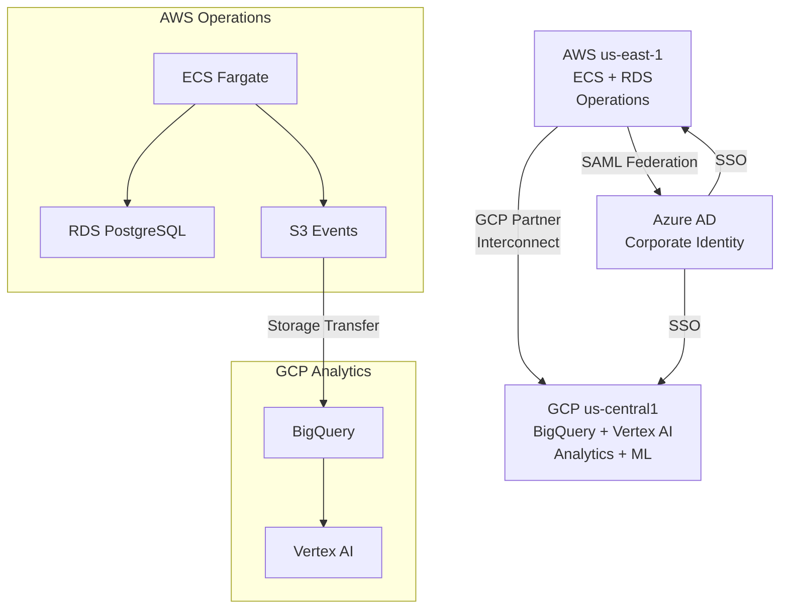

## Keywords in This File
{: .no_toc }

| # | Keyword | Weight |
|---|---------|--------|
| 25 | [Multi-Cloud Strategy](#multi-cloud-strategy) | ★★★ |

---

# Multi-Cloud Strategy

**Interview Weight:** ★★★ - Strategy/architecture discussion.
Multi-cloud is a board-level decision with significant
engineering implications. Understanding the real reasons
for multi-cloud (vs marketing reasons), the actual
challenges (data gravity, operational complexity), and
the patterns that work (vs those that don't) is expected
at Staff/Principal level.

---

### 🎯 Model Answer

**30 seconds:**

> Multi-cloud means workloads deliberately run across
> multiple cloud providers. Real reasons: regulatory
> (different regions require different providers), business
> continuity (provider-level resilience), or best-of-breed
> (specific service only available on provider X).
> The main cost: operational complexity doubles per provider.
> Most organizations do not benefit from multi-cloud.
> Those that do use it for specific workloads, not wholesale
> platform duplication.

**3 minutes:**

> Three distinct multi-cloud patterns:
>
> Pattern 1 - Segmented (most common, most practical):
> Different workloads on different providers.
> Example: primary on AWS, ML workloads on GCP (Vertex AI),
> collaboration on Microsoft 365 (Azure AD).
> No cross-cloud dependency: each workload is cloud-native
> on its chosen provider.
>
> Pattern 2 - Redundant (disaster recovery):
> Same workload deployed on two providers.
> Active-passive: AWS primary, GCP standby.
> Active-active: traffic split across providers.
> Challenge: data sync across providers (egress costs,
> latency, consistency).
>
> Pattern 3 - Portable (cloud-agnostic):
> Workloads containerized + abstraction layer to run
> on any provider. Kubernetes, Terraform, open standards.
> Challenge: lowest common denominator features.
> Cannot use cloud-native managed services.
> Usually results in operating the hardest things yourself.
>
> Real reasons to adopt multi-cloud:
> - Regulatory: data residency laws require specific providers
>   in some countries (China = Alibaba, Russia = Yandex)
> - Acquisition: acquired company runs on different cloud
> - Negotiation: credible second-source supplier
> - Specific services: GCP BigQuery for analytics,
>   AWS for operations
>
> Reasons NOT to adopt multi-cloud:
> - Vendor lock-in fear (theoretical): the switching cost
>   if you ever need to move is vastly cheaper than the
>   ongoing operational tax of multi-cloud
> - Resilience (usually wrong): AWS regions provide 99.99%+
>   SLA. Provider failure is rarer than AZ failure.
>   Multi-region on one provider achieves near-identical
>   resilience at much lower complexity.

**Blank Mind Recovery:**

**(1) Three patterns:** "Segmented (different workloads
on different clouds - practical), Redundant (same workload
on two clouds - DR), Portable (cloud-agnostic abstraction -
avoid)."

**(2) Real reasons:** "Regulation (country-specific),
acquisition, negotiation leverage, best-of-breed service."

**(3) Main challenge:** "Data gravity. Data egress costs
money. Cross-cloud data sync is expensive and slow.
Keep data near compute."

---

### 📘 Concept Explanation

**The Vendor Lock-in Myth:**

```
COMMON ARGUMENT FOR MULTI-CLOUD:
  "We can't be locked into AWS. We need to be able to
  switch to Azure or GCP at any time."

REALITY CHECK:
  Switching an AWS-native application to Azure:
  - ECS -> AKS: rewrite deployment config
  - RDS PostgreSQL -> Azure Database: rewrite connection strings
    (but same PostgreSQL protocol - moderate effort)
  - S3 -> Azure Blob: rewrite SDK calls
  - Lambda -> Azure Functions: rewrite function signatures
  - Estimated effort: 3-6 months for a medium application

  Multi-cloud operational tax:
  - Two sets of IAM/RBAC policies to maintain
  - Two sets of monitoring/alerting
  - Two sets of runbooks
  - Two sets of networking configurations
  - Two sets of tooling expertise (not transferable)
  - This tax is paid EVERY MONTH FOREVER

  Break-even: when does vendor switching become cheaper
  than ongoing multi-cloud operations?
  Answer: almost never. Cloud providers rarely fail.
  The scenario that justifies multi-cloud cost almost
  never materializes.

VALID LOCK-IN CONCERNS:
  - Proprietary data formats (DynamoDB table -> migrate?)
  - Provider-specific APIs with no open standard
  - Pricing changes: Reserved Instance pricing can increase
  For these: design for portability within reason.
  Use PostgreSQL (not Aurora), S3-compatible storage,
  container-based workloads.
```

> **Code walkthrough:** This Multi-Cloud Strategy example demonstrates a key concept in practice using container. **KEY MECHANISM:** the runtime executes these instructions in sequence with specific memory and execution semantics. **WHY IT MATTERS:** misapplying this pattern causes subtle bugs that only manifest under production load. **TAKEAWAY: understand the execution model before using this pattern in production code.**

**Data Gravity:**

```
DATA GRAVITY: data attracts compute
  Processing data is cheapest when compute is co-located.
  Moving data is expensive: $0.08-0.09/GB egress.
  100 TB/month cross-cloud = ~$8,000-9,000/month in egress alone

IMPLICATION FOR MULTI-CLOUD:
  Pattern: AWS primary for operations
           GCP BigQuery for analytics
           Challenge: ETL data from AWS to GCP
           S3 -> BigQuery: $0.08/GB * data volume
           Solution: Amazon S3 Transfer to BigQuery is free
                     via Google Storage Transfer Service for
                     first 1TB. Large scale: expensive.

  ALTERNATIVE: Keep analytics on AWS (Redshift, Athena)
  Even if GCP BigQuery has better features, the data egress
  cost for large volumes often makes it uneconomical.

  GOLDEN RULE: Keep data near compute.
  Decide cloud first, then pick services.
  Don't let service preference override data locality.
```

> **Code walkthrough:** This Multi-Cloud Strategy example demonstrates a key concept in practice. **KEY MECHANISM:** the runtime executes these instructions in sequence with specific memory and execution semantics. **WHY IT MATTERS:** misapplying this pattern causes subtle bugs that only manifest under production load. **TAKEAWAY: understand the execution model before using this pattern in production code.**

---

### 💻 Code Example

```hcl
# SEGMENTED MULTI-CLOUD: Terraform with multiple providers
# AWS for operations, GCP for BigQuery analytics

# AWS provider (primary workloads):
provider "aws" {
  alias  = "primary"
  region = "us-east-1"
}

# GCP provider (analytics):
provider "google" {
  alias   = "analytics"
  project = "my-analytics-project"
  region  = "us-central1"
}

# AWS: operational database (source of truth)
resource "aws_db_instance" "operational" {
  provider       = aws.primary
  engine         = "postgres"
  instance_class = "db.r6g.xlarge"
  # Application reads/writes here
}

# GCP: BigQuery dataset for analytics
resource "google_bigquery_dataset" "analytics" {
  provider   = google.analytics
  dataset_id = "operational_analytics"
  location   = "US"
  # ETL: daily batch from AWS RDS -> BigQuery
  # BigQuery: analytical queries, ML features
}

# AWS: S3 bucket for raw event data (data lake source)
resource "aws_s3_bucket" "events" {
  provider = aws.primary
  bucket   = "my-app-events-raw"
  # All application events land here first
}

# GCP: Storage Transfer Service config (free tier: 1TB)
# For large volume: use AWS Data Pipeline + GCS
# Or: use Fivetran/Airbyte (managed ETL)

# CROSS-CLOUD NETWORKING: AWS Direct Connect -> GCP
# (private, no public internet egress, 50-80% cost reduction)
resource "aws_dx_connection" "to_gcp" {
  provider    = aws.primary
  bandwidth   = "1Gbps"
  location    = "EqDC2"  # Equinix DC
  name        = "aws-to-gcp-analytics"
}
# GCP Partner Interconnect on the other side
```

> **Code walkthrough:** This GCP Partner Interconnect on the other side example demonstrates a key concept in practice. **KEY MECHANISM:** the runtime executes these instructions in sequence with specific memory and execution semantics. **WHY IT MATTERS:** misapplying this pattern causes subtle bugs that only manifest under production load. **TAKEAWAY: understand the execution model before using this pattern in production code.**

```python
# CLOUD-AGNOSTIC STORAGE ABSTRACTION (Pattern 3 - Portable)
# Abstract S3/GCS/Azure Blob behind a common interface

from abc import ABC, abstractmethod
from typing import BinaryIO

class ObjectStorage(ABC):
    """Cloud-agnostic object storage interface."""

    @abstractmethod
    def put(self, key: str, data: BinaryIO) -> None: ...

    @abstractmethod
    def get(self, key: str) -> BinaryIO: ...

    @abstractmethod
    def delete(self, key: str) -> None: ...


class S3Storage(ObjectStorage):
    def __init__(self, bucket: str):
        import boto3
        self._client = boto3.client('s3')
        self._bucket = bucket

    def put(self, key: str, data: BinaryIO) -> None:
        self._client.upload_fileobj(data, self._bucket, key)

    def get(self, key: str) -> BinaryIO:
        import io
        buf = io.BytesIO()
        self._client.download_fileobj(self._bucket, key, buf)
        buf.seek(0)
        return buf

    def delete(self, key: str) -> None:
        self._client.delete_object(
            Bucket=self._bucket, Key=key
        )


class GCSStorage(ObjectStorage):
    def __init__(self, bucket: str):
        from google.cloud import storage
        self._client = storage.Client()
        self._bucket = self._client.bucket(bucket)

    def put(self, key: str, data: BinaryIO) -> None:
        blob = self._bucket.blob(key)
        blob.upload_from_file(data)

    def get(self, key: str) -> BinaryIO:
        import io
        blob = self._bucket.blob(key)
        buf = io.BytesIO()
        blob.download_to_file(buf)
        buf.seek(0)
        return buf

    def delete(self, key: str) -> None:
        self._bucket.blob(key).delete()


# Factory (configured from environment):
def create_storage(provider: str, bucket: str) -> ObjectStorage:
    if provider == "aws":
        return S3Storage(bucket)
    elif provider == "gcp":
        return GCSStorage(bucket)
    raise ValueError(f"Unknown provider: {provider}")

# WARNING: this abstraction works for simple operations.
# Cloud-native features (S3 multipart, GCS resumable,
# lifecycle policies, cross-region replication) are
# provider-specific and cannot be abstracted without
# losing their value. The abstraction hides complexity
# at the cost of features.
```

> **Code walkthrough:** The Terraform shows the segmentedice. **KEY MECHANISM:** the runtime executes these instructions in sequence with specific memory and execution semantics. **WHY IT MATTERS:** misapplying this pattern causes subtle bugs that only manifest under production load. **TAKEAWAY: understand the execution model before using this pattern in production code.**
> multi-cloud pattern: AWS handles operational workloads
> (RDS, ECS, S3 events), GCP handles analytics (BigQuery).
> The providers are aliased so the same Terraform codebase
> manages both. The cross-cloud transfer challenge is
> addressed by AWS Direct Connect to GCP Partner Interconnect:
> private network connectivity eliminates public internet
> egress and reduces data transfer cost by 50-80%.
> The Python abstraction illustrates why cloud-agnostic
> code is a trade-off: the ObjectStorage interface works
> for basic operations but hides S3-specific features
> (multipart upload for large files, pre-signed URLs,
> lifecycle policies). Any feature beyond the abstraction
> requires provider-specific code, which defeats the
> portability goal. The warning comment makes this explicit:
> the abstraction is only worth it if portability is
> a genuine near-term requirement.

---

### 🎓 Answers by Seniority

**Junior / Mid:**

> "Multi-cloud means using more than one cloud provider.
> The main reason to do it is when different workloads
> have specific requirements: maybe you use AWS for most
> things but GCP for machine learning. The main challenge
> is that each provider has its own APIs and tooling,
> so you pay an operational cost to maintain expertise
> in multiple platforms. Most small teams are better
> off mastering one cloud deeply."

---

**Senior / Staff:**

> "Multi-cloud is often proposed as a solution to vendor
> lock-in or for resilience, but neither argument is usually
> sound. Provider-level failures are rarer than AZ-level
> failures. Multi-region on one provider achieves near-equivalent
> resilience at a fraction of the operational complexity.
> Genuine multi-cloud is justified for regulatory requirements
> (data residency laws in China or Russia require specific
> local providers), for acquisitions, or for best-of-breed
> specific services (BigQuery for analytics when no AWS
> equivalent meets requirements). The operational tax is
> real: two IAM models, two monitoring stacks, two sets
> of runbooks, two expertise pools. Before recommending
> multi-cloud, I'd ask: what specific provider failure
> scenario are we protecting against, and what is the
> annual probability of that failure? Then calculate
> whether the ongoing multi-cloud operational tax
> is worth it."

---

### ⚠️ Common Misconceptions

**Misconception 1: "Multi-cloud eliminates vendor lock-in."**

Cloud-agnostic abstractions work for commodity services
(object storage, compute). They don't work for differentiated
services: you cannot abstract DynamoDB's single-digit
millisecond performance, BigQuery's serverless SQL at scale,
or Spanner's global consistency. Using only the lowest
common denominator across providers means not using
the services that made you choose a cloud in the first place.
The abstraction tax is paid continuously; the switching
scenario it enables happens rarely.

**Misconception 2: "Multi-cloud provides resilience
against provider outages."**

A provider-level outage (not AZ, not region, but entire
AWS or GCP) has happened once in the history of cloud
computing (partial, for a few services). Multi-region
within a single provider is far more effective against
the actual failure modes (AZ failure, region failure)
at dramatically lower complexity. Multi-cloud for resilience
is solving a problem that rarely occurs with a solution
that increases complexity permanently.

---

### 🚨 Failure Modes and Diagnosis

**Failure 1: Cloud-agnostic abstraction prevents
using needed features**

*Symptom:* Team spent 6 months building a cloud-agnostic
data pipeline. Now a requirement needs S3 event notifications
(S3 -> Lambda trigger). The abstraction doesn't support it.
Must either break the abstraction or rewrite.

*Root cause:* Over-engineering portability before knowing
which cloud-native features will be needed.

*Prevention:* Design for the actual workloads, not
theoretical portability. Use cloud-native services.
If you must migrate: accept the migration cost when
(if) it occurs, rather than paying the abstraction
tax permanently.

---

**Failure 2: Data egress costs explode in redundant
multi-cloud**

*Symptom:* Redundant multi-cloud deployment for DR.
AWS -> GCP data sync: $15,000/month in egress costs.
This was not in the original cost estimate.

*Root cause:* Data volume underestimated. $0.09/GB egress
* 170TB/month = $15,300. DR budget was $2,000/month.

*Fix:* Switch to AWS Cross-Region DR (us-east-1 to eu-west-1).
Same provider replication: $0.02/GB (78% cheaper).
Or: AWS Direct Connect to GCP (private, $0.02/GB vs $0.09/GB).

---

### ⚖️ Comparison Table

| Pattern | Use Case | Complexity | Data Cost | Lock-in |
|---------|----------|-----------|-----------|---------|
| Single cloud, multi-region | Primary HA + DR | Low | $0.02/GB | Full |
| Segmented multi-cloud | Best-of-breed services | Medium | Per workload | Per domain |
| Redundant multi-cloud | Provider-level DR | High | $0.09+/GB | Partial |
| Portable (cloud-agnostic) | Max portability | Very High | Per workload | Minimal |

---

### 🏛️ System Design

**Enterprise Multi-Cloud Architecture (Segmented Pattern):**

```
AWS (Primary Operations):
  Production: ECS, RDS, S3, ElastiCache
  CI/CD: CodePipeline, ECR
  Networking: Direct Connect to on-prem + GCP
  Security: GuardDuty, Security Hub, CloudTrail
  Region: us-east-1 (primary), eu-west-1 (EU residency)

GCP (Analytics + ML):
  BigQuery: analytical queries, business intelligence
  Vertex AI: ML model training and serving
  Pub/Sub: event streaming for analytics pipeline
  Region: us-central1

Azure (Enterprise Identity):
  Azure Active Directory: corporate SSO
  Microsoft 365: productivity
  Federation: AWS IAM Identity Center -> Azure AD SAML

INTEGRATION LAYER:
  AWS -> GCP data transfer:
    Event data: S3 -> GCS via Storage Transfer Service
    Operational data: Datastream (CDC, S3 -> BigQuery)
  AWS -> Azure:
    Identity: SAML federation (no data movement)

NETWORK:
  AWS Direct Connect + GCP Partner Interconnect:
    Private Equinix cross-connect
    Bypasses public internet: lower cost, lower latency
  Bandwidth: 1Gbps per cloud pair
  Monthly transfer: estimated 20TB/month AWS->GCP
  Cost: ~$400/month (private) vs $1,800 (public internet)
```



> **Diagram walkthrough:** The segmented architecture assigns
> each cloud to its strongest domain. AWS handles transactional
> operations (ECS, RDS, S3) where its managed services ecosystem
> is the deepest. GCP handles analytics and ML where BigQuery
> and Vertex AI have architectural advantages. Azure handles
> enterprise identity because the company is already using
> Microsoft 365 - removing Azure would require rebuilding
> identity infrastructure. The integration points are minimal
> and well-defined: S3 event data flows to BigQuery via
> Storage Transfer Service (low cost, automated). Identity
> uses SAML federation (no data movement). Private interconnect
> between AWS and GCP replaces public internet egress,
> reducing the cost from $1,800/month to $400/month for
> 20TB/month transfer volume.

---

### 🎯 Interview Deep-Dive

> **Timing:** 5-7 minutes per question.

| Type | Questions |
|------|-----------|
| CONCEPT | 2 |
| DEBUGGING | 2 |
| TRADE-OFF | 2 |
| DESIGN | 2 |
| BEHAVIORAL | 2 |
| SCENARIO | 2 |

---

**[SENIOR] Q1 - [MECHANISM] What are the three multi-cloud patterns and what are the realistic use cases for each?**

**Pattern 1 - Segmented (different workloads on different clouds):**

Each cloud handles the workloads it does best. No cross-cloud
redundancy or portability requirement. Data and compute
are co-located per cloud.

Realistic use cases:
- AWS for operations (broadest managed service portfolio),
  GCP for BigQuery/Vertex AI (analytical + ML workloads),
  Azure for Microsoft identity stack
- Company acquired another company running on Azure.
  Rather than migrating, maintain both clouds.
- Regulatory requirement: financial data must be in
  a specific cloud in certain countries (sovereign cloud).

Operational model: teams specialize per cloud. AWS team
owns AWS, GCP team owns GCP. Integration at the data
layer (ETL pipelines between clouds).

**Pattern 2 - Redundant (same workload on two clouds for DR):**

Active-passive: AWS primary, GCP warm standby.
Active-active: traffic split across clouds, data sync.

Realistic use cases:
- Mission-critical systems where single-provider failure
  (however unlikely) is catastrophic (financial exchanges,
  national infrastructure)
- Regulatory requirement: some government contracts require
  provider redundancy

Challenge: data consistency across clouds. Active-active
requires conflict resolution. Active-passive requires
replication lag management. Both require expensive
cross-cloud networking.

**Pattern 3 - Portable (cloud-agnostic):**

Kubernetes, Terraform, open-source services run on
any cloud. Avoid managed services that are provider-specific.
Maximum portability, minimum lock-in.

Realistic use cases: almost none in production at scale.
The portability cost (operating your own databases, cache,
message queues instead of using managed services) exceeds
the value in nearly all cases. Every organization that
has tried this has either ended up operating managed services
themselves (running Kafka instead of MSK) or gradually
adopted cloud-native services and abandoned portability.

*What separates good from great:* Explicitly calling
out that Pattern 3 is rarely the right choice in production
shows real-world experience over theoretical thinking.
The regulatory use case for Pattern 2 is the only genuinely
compelling one.

---

**[SENIOR] Q2 - [MECHANISM] What is data gravity and how does it constrain multi-cloud architecture?**

Data gravity is the concept that data attracts compute
and processing: the more data you have in one location,
the more services and compute accumulate around it because
moving data is expensive (cost, latency, complexity).

**Economics of data movement:**

AWS egress: $0.08-0.09/GB (first 10TB/month).
100TB/month of cross-cloud transfer = ~$8,000-9,000/month.
1PB/month = ~$80,000-90,000/month.

These costs make cross-cloud data pipelines expensive
at scale. A GCP BigQuery use case that requires 500TB/month
of data from AWS: $40,000/month in egress alone.
Often cheaper to use Redshift or Athena on AWS (same
data, lower performance) than pay cross-cloud egress.

**Implication for multi-cloud design:**

1. Data should be in one provider. Processing follows.
   Don't split data for architectural reasons.

2. If you must use multi-cloud services, minimize data
   movement. Event-driven (small payloads), not batch
   (large file transfers).

3. Private interconnect (Direct Connect, Dedicated Interconnect)
   reduces egress cost 50-80% for high-volume use cases.

4. Near-zero data transfer: Azure AD -> AWS IAM via SAML
   (zero data movement, identity federation only).

**Practical example:**

Company has 5PB in S3. They want to use GCP BigQuery.
Monthly egress to run analytics: 200TB/month = $18,000/month
in egress. BigQuery equivalent capacity in AWS (Redshift):
$8,000/month. Decision: unless BigQuery has an irreplaceable
advantage, the data gravity economics favor keeping
analytics in AWS.

*What separates good from great:* The quantified cost
calculation (200TB * $0.09 = $18,000/month) makes this
concrete. The Private Interconnect alternative reduces
cost but requires capital expenditure. The practical
example shows how data gravity constrains the theoretical
"best-of-breed" argument.

---

**[SENIOR] Q3 - [DEBUGGING] Your multi-cloud DR setup (AWS primary, GCP secondary) has a data lag of 4 hours between providers. Acceptable RPO is 1 hour. How do you fix this?**

**Step 1: Identify the replication bottleneck:**

```bash
# What is the replication mechanism currently?
# Option A: S3 batch export + GCS import (scheduled job)
# Option B: CDC (Change Data Capture) stream
# Option C: Database cross-cloud replication

# If Option A (batch): the job runs every 4 hours
# Switch to: streaming CDC or smaller batch intervals

# Check current data pipeline lag:
# If Kafka-based: check consumer lag
kafka-consumer-groups.sh \
  --bootstrap-server kafka:9092 \
  --group cross-cloud-replication \
  --describe
# Look for lag column - if high: consumer is behind
```

> **Code walkthrough:** This if high: consumer is behind example demonstrates shell script pattern using Kafka messaging. **KEY MECHANISM:** the shell executes commands sequentially; pipes pass stdout of one command to stdin of the next. **WHY IT MATTERS:** unquoted variables with spaces cause word splitting - IFS splits the value into multiple arguments. **TAKEAWAY: always double-quote variables: "$VAR"; use [[ ]] instead of [ ] for safer conditionals.**

**Step 2: CDC streaming approach:**

```
CURRENT (batch, 4-hr lag):
  RDS -> cron job (every 4h) -> S3 -> GCS -> GCP DB
  Lag: up to 4 hours

TARGET (streaming CDC, < 5 min lag):
  RDS -> DMS (AWS Database Migration Service, ongoing)
      -> Kafka (MSK) -> Kafka Connect -> GCS -> BigQuery
  OR:
  RDS -> AWS DMS -> Kinesis -> Lambda -> GCP Pub/Sub
      -> Dataflow -> GCP database
  Lag: typically 1-5 minutes
```

> **Code walkthrough:** This if high: consumer is behind example demonstrates a key concept in practice using Kafka messaging. **KEY MECHANISM:** the runtime executes these instructions in sequence with specific memory and execution semantics. **WHY IT MATTERS:** misapplying this pattern causes subtle bugs that only manifest under production load. **TAKEAWAY: understand the execution model before using this pattern in production code.**

**Step 3: Network bandwidth constraint:**

If CDC stream is running but lag is growing:
```bash
# Check DMS task lag:
aws dms describe-replication-tasks \
  --query 'ReplicationTasks[].{
    Task:ReplicationTaskIdentifier,
    Status:Status,
    Lag:ReplicationTaskStats.AppliedLatencyInSec
  }'
# AppliedLatencyInSec > 3600 = 1+ hour lag

# Bandwidth between AWS and GCP: check throughput
# If Private Interconnect: check utilization on port
# If public internet: check NAT Gateway BytesProcessed
```

> **Code walkthrough:** This If public internet: check NAT Gateway BytesProcessed example demonstrates shell script pattern. **KEY MECHANISM:** the shell executes commands sequentially; pipes pass stdout of one command to stdin of the next. **WHY IT MATTERS:** unquoted variables with spaces cause word splitting - IFS splits the value into multiple arguments. **TAKEAWAY: always double-quote variables: "$VAR"; use [[ ]] instead of [ ] for safer conditionals.**

**Step 4: Target architecture for < 1 hour RPO:**

AWS DMS + Kinesis (< 30s to Kinesis) -> GCP Dataflow
(subscribes to Kinesis via cross-cloud connector, applies
to GCP database). Typical lag: 2-5 minutes.

*What separates good from great:* The specific AWS DMS
lag query command shows operational experience. The
distinction between batch (4-hour lag) and CDC streaming
(minutes lag) is the architectural insight.

---

**[SENIOR] Q1 - [DEBUGGING] Cross-cloud API calls from AWS Lambda to GCP are failing intermittently with timeout errors. How do you diagnose?**

**Step 1: Determine the network path:**

Lambda is in a VPC. GCP API calls go through:
VPC -> NAT Gateway -> public internet -> GCP API endpoint.

Or if Direct Connect/Partner Interconnect is configured:
VPC -> Transit Gateway -> Direct Connect -> GCP Interconnect.

**Step 2: Test connectivity:**

```bash
# Lambda test function: measure GCP API latency
import boto3, time, requests

def lambda_handler(event, context):
    start = time.time()
    try:
        # GCP API call:
        response = requests.get(
            'https://storage.googleapis.com/...',
            timeout=10,
            headers={'Authorization': f'Bearer {get_token()}'}
        )
        latency = (time.time() - start) * 1000
        return {
            'statusCode': response.status_code,
            'latency_ms': latency
        }
    except requests.Timeout:
        return {
            'error': 'timeout',
            'elapsed_ms': (time.time() - start) * 1000
        }
```

> **Code walkthrough:** This GCP API call: example demonstrates shell script pattern using authentication. **KEY MECHANISM:** the shell executes commands sequentially; pipes pass stdout of one command to stdin of the next. **WHY IT MATTERS:** unquoted variables with spaces cause word splitting - IFS splits the value into multiple arguments. **TAKEAWAY: always double-quote variables: "$VAR"; use [[ ]] instead of [ ] for safer conditionals.**

**Step 3: Common causes:**

NAT Gateway connection limits: Lambda in VPC creates
connections through NAT Gateway. Each Lambda execution
creates a new connection. High concurrency -> NAT Gateway
connection table fills -> new connections fail with timeout.
Check: CloudWatch metric `NatGatewayConnectionAttemptCount`
vs `NatGatewayActiveConnectionCount`.

GCP API rate limiting: some GCP APIs have per-project
quotas. High Lambda concurrency may hit GCP-side limits.
Check: GCP API quota dashboard for 429 errors.

Lambda timeout too short: Lambda function timeout is 3s
(default). Cross-cloud API call may need 2-3s on high
latency. Timeout hit before GCP responds.
Check Lambda timeout configuration.

*What separates good from great:* NAT Gateway connection
limits as the cause of cross-cloud timeout shows real
cloud networking knowledge. Most candidates would suggest
VPC or security group issues without thinking about
NAT Gateway state table limits.

---

**[SENIOR] Q2 - [TRADE-OFF] Portability (cloud-agnostic architecture) vs performance (cloud-native services). How do you decide?**

**The core trade-off:**

Cloud-native services: fully managed, optimized for
the provider's infrastructure, advanced features,
operational simplicity. But provider-specific.

Cloud-agnostic: portable, open standards, runs anywhere.
But requires operating the infrastructure yourself or
using the lowest common denominator.

**Concrete comparison:**

DynamoDB (cloud-native, AWS):
- Single-digit millisecond latency at any scale
- Fully managed: zero operational overhead
- Lock-in: cannot run DynamoDB outside AWS

Cassandra on EC2 (portable):
- Sub-10ms latency achievable, but requires tuning
- Operational burden: patching, replication, compaction
- Portable: run on GCP, Azure, on-prem

Performance difference: DynamoDB is typically 2-5x faster
at scale with zero operational effort. Cassandra at scale
requires dedicated database engineers.

**When portability is justified:**

- Organization has a genuine near-term probability of
  migrating providers (post-acquisition integration,
  government contract change, etc.)
- Workload will be deployed on-premises AND cloud
- Workload is already containerized and stateless
  (portability is cheap because there is no state)

**When portability is NOT justified:**

- Theoretical "we might want to move someday"
- No concrete migration plan or timeline
- Workload requires high performance (portability = worse perf)
- Team is small (cannot afford dual expertise)

**Decision framework:**

Probability of migration * cost of migration > ongoing
portability tax? If yes: build portable.
For most organizations, P(migration) is < 5% and
portability tax is high: use cloud-native.

*What separates good from great:* The quantified decision
framework (probability * cost vs ongoing tax) gives a
structure for a decision that is often made emotionally.
The DynamoDB vs Cassandra example is concrete and
technically accurate.

---

**[SENIOR] Q3 - [TRADE-OFF] Multi-cloud redundancy vs multi-region single cloud. Which provides better resilience?**

**Multi-region single cloud (e.g., AWS us-east-1 + eu-west-1):**

Protection against:
- AZ failure: multi-AZ within region
- Region failure: cross-region failover
- Region-specific service outage: failover to other region

What it does NOT protect against:
- Entire provider going offline (extremely rare)
- Provider-wide IAM/control plane issues (rare but has occurred)

Complexity: moderate. Same tooling, same IAM, same APIs.
DR can be tested with existing team skills.
Cost: ~1.5-2x infrastructure (active + warm standby).

**Multi-cloud redundant:**

Protection against:
- All of the above PLUS provider-level failure
- Regulatory: data in both jurisdictions

Additional risks:
- Data synchronization across providers (egress cost, lag)
- Inconsistent IAM/security policies across providers
- Two sets of operational runbooks
- Data consistency during failover (active-active)

Complexity: very high. Two teams, two tooling stacks,
cross-cloud networking, data sync.
Cost: 2-3x infrastructure + egress + operational overhead.

**The decision:**

For 99.99% of workloads: multi-region single cloud provides
adequate resilience. Provider-level failures are extremely rare
(and partial when they occur). The complexity of multi-cloud
provides marginal additional resilience at high operational cost.

Exceptions: exchange-level financial systems, national
critical infrastructure, workloads with regulatory requirements
for provider redundancy.

*What separates good from great:* Quantifying "provider-level
failure is extremely rare" with actual history shows the
risk assessment is grounded. The exceptions (exchanges,
national infrastructure) are the real use cases where
multi-cloud redundancy is genuinely justified.

---

**[SENIOR] Q4 - [DESIGN] Design the integration architecture for a company that must use AWS (operations) and GCP (analytics/ML) with 50TB/month of data flowing between them.**

**Architecture:**

Data classification:
- Real-time events (clickstream, transactions): < 1MB each,
  high volume, need in BigQuery within 5 minutes
- Daily operational snapshots: 5-10TB/day batches
- Historical archive: petabytes in S3, queried ad-hoc

Integration per type:

Real-time events:
```
App (ECS) -> Kinesis Data Streams
          -> Kinesis Firehose -> S3 (raw events)
          -> GCP Pub/Sub via custom connector or Kafka Connect
          -> BigQuery Streaming Inserts (< 5 min lag)
```

> **Code walkthrough:** This GCP API call: example demonstrates a key concept in practice using SQL. **KEY MECHANISM:** the runtime executes these instructions in sequence with specific memory and execution semantics. **WHY IT MATTERS:** misapplying this pattern causes subtle bugs that only manifest under production load. **TAKEAWAY: understand the execution model before using this pattern in production code.**

Daily snapshots:
```
RDS -> AWS DMS -> S3 Parquet files (daily export)
S3 -> GCP Storage Transfer Service -> GCS
GCS -> BigQuery Data Transfer -> BigQuery tables
(batch, acceptable 24hr lag for daily analytics)
```

> **Code walkthrough:** This GCP API call: example demonstrates a key concept in practice. **KEY MECHANISM:** the runtime executes these instructions in sequence with specific memory and execution semantics. **WHY IT MATTERS:** misapplying this pattern causes subtle bugs that only manifest under production load. **TAKEAWAY: understand the execution model before using this pattern in production code.**

Network:
```
AWS Direct Connect (1Gbps) + GCP Partner Interconnect:
  Private, no public internet
  Cost: ~$0.02/GB vs $0.09/GB public
  50TB/month: $1,000/month vs $4,500/month
  ROI: Direct Connect cost (~$500/month) < savings ($3,500)
```

> **Code walkthrough:** This GCP API call: example demonstrates a key concept in practice. **KEY MECHANISM:** the runtime executes these instructions in sequence with specific memory and execution semantics. **WHY IT MATTERS:** misapplying this pattern causes subtle bugs that only manifest under production load. **TAKEAWAY: understand the execution model before using this pattern in production code.**

Security:
```
GCP service account for BigQuery access
AWS IAM role: assume role with conditions
  No long-lived keys - use Workload Identity Federation
  (GCP -> AWS: exchange GCP token for temporary AWS creds)
  OIDC federation: GCP workload authenticates to AWS
    without static AWS access keys
```

> **Code walkthrough:** This Unknown example demonstrates a key concept in practice using authentication. **KEY MECHANISM:** the runtime executes these instructions in sequence with specific memory and execution semantics. **WHY IT MATTERS:** misapplying this pattern causes subtle bugs that only manifest under production load. **TAKEAWAY: understand the execution model before using this pattern in production code.**

*What separates good from great:* The three-tier data
classification with different pipelines for each is
the production-realistic architecture. A single pipeline
for all data types is over-simplified. The Workload
Identity Federation for cross-cloud authentication
eliminates static credentials entirely - the security
insight for cross-cloud integration.

---

**[SENIOR] Q5 - [DESIGN] A SaaS company wants to expand to customers in China. Their primary infrastructure is AWS us-east-1. What multi-cloud considerations apply?**

**China cloud regulatory reality:**

AWS China (BJ and NNX) is operated by local partners
(Sinnet, NWCD), not Amazon Inc. It is a separate cloud:
separate accounts, separate IAM, separate endpoints,
separate pricing. Not connected to global AWS.

GCP is not available in China. Azure China exists but
operated by 21Vianet.

Alternative: Alibaba Cloud (Aliyun) - dominant in China.
Native Chinese cloud, full managed service portfolio.

**Architecture decision:**

Option A: AWS China:
Same provider family, familiar tooling.
But: completely separate infrastructure, different IAM,
different endpoints, different compliance requirements
(MLPS 2.0 - Multi-Level Protection Scheme).
Not a simple region addition: separate account,
separate deployment pipeline.

Option B: Alibaba Cloud:
Best local support and compliance expertise.
Full managed services: Alibaba RDS, OSS (S3-equivalent),
Function Compute (Lambda-equivalent).
Trade-off: completely different provider, new expertise.

**Practical architecture:**

Globally: AWS us-east-1 (primary), separate China stack.

China stack (Alibaba Cloud or AWS China):
- Separate VPC, separate RDS, separate compute
- All Chinese customer data stays in China (PIPL - Personal
  Information Protection Law requirement)
- Application code: same codebase, deployed separately
- User authentication: separate Cognito equivalent
  (Alibaba IDaaS or local IdP)

Integration: China users access China stack only.
No data flows from China to global AWS.
Global admin: separate management plane.

CI/CD: maintain two deployment pipelines.
Monitoring: aggregate to global dashboard via read-only
agent (no customer data transferred).

*What separates good from great:* Understanding that
"AWS China" is fundamentally a different cloud (not just
another region) is the key technical insight. PIPL as
the regulatory driver (Chinese personal data cannot leave
China) explains why a data-isolated separate stack is
required, not just a new region.

---

**[SENIOR] Q6 - [BEHAVIORAL] Have you evaluated or implemented a multi-cloud strategy? What drove the decision and what would you do differently?**

**Structured response:**

**Context:** At my previous company, leadership proposed
multi-cloud to "reduce vendor lock-in." The proposal
was to run the same application on both AWS and Azure
with automatic failover.

**Evaluation process:** I led the architectural review.
We examined:
1. What specific scenario requires multi-cloud? (Provider failure)
2. What is the probability of that scenario? (AWS has not
   had a complete global outage in its history)
3. What is the cost of the proposed solution?
   (2x infrastructure + $5,000/month data egress + 40%
   engineering overhead for dual-cloud tooling)
4. What alternative achieves similar resilience?
   (Multi-region within AWS: same infrastructure at 1.5x cost,
   no dual-cloud operational overhead)

**Decision:** Multi-region AWS instead of multi-cloud.
Added us-east-1 + eu-west-1 with Route 53 failover.
Cost: 1.5x infrastructure. Same team skills. No egress.
Achieved 99.99% cross-region SLA in 3 months.

**What I would do differently:** The vendor lock-in
concern was valid for one specific area: our ETL tool
was deeply coupled to AWS Glue proprietary format.
I would have pushed for standard Parquet/Iceberg format
at the data layer while staying AWS-native for compute.
Portable data formats at minimal cost vs portable compute
at high cost.

*What separates good from great:* The decision framework
(probability * impact vs ongoing cost) applied to a real
evaluation is the answer. The nuance (portable data formats
yes, portable compute no) shows calibrated thinking
rather than all-or-nothing.

---

**[SENIOR] Q7 - [BEHAVIORAL] How do you manage the organizational complexity of multi-cloud - different teams with different expertise?**

**Structured response:**

**The organizational reality:** Multi-cloud requires either
(a) teams that maintain expertise in multiple providers -
expensive and surface to errors from context-switching,
or (b) specialized teams per cloud with coordination overhead.

**The model that works:** Platform team owns the integration
layer; product teams work with one cloud.

Concrete structure:
- Platform Engineering team: owns Terraform modules for
  both AWS and GCP, owns the cross-cloud networking,
  owns the data pipeline (S3 -> BigQuery ETL).
  Maintains expertise in both providers.
  Size: 3-5 engineers.

- Product teams: consume the platform. Work primarily
  on AWS. Don't need GCP expertise for their workloads.
  They use the BigQuery output through a Metabase dashboard.

- Analytics/ML team: GCP-native. Owns BigQuery, Vertex AI.
  Don't need AWS expertise beyond "data comes from S3."

**Coordination model:**

Platform provides a data contract: "analytics data available
in BigQuery dataset X within 5 minutes of events."
How data gets there (the cross-cloud pipeline) is platform
responsibility. Product teams don't care about the mechanism.

**What doesn't work:** Cross-functional teams that each
own a multi-cloud slice of a workload. Every incident
requires AWS and GCP knowledge. Every deployment is
a cross-cloud coordination point. This creates constant
handoffs and unclear ownership.

*What separates good from great:* The platform-as-integration-
layer model is the organizational pattern that makes
multi-cloud sustainable. The "data contract" abstraction
shows how to isolate complexity (the platform handles
cross-cloud, product teams don't need to know).

---

**[SENIOR] Q8 - [SCENARIO] Your company is acquiring a startup that runs entirely on GCP. How do you integrate their infrastructure?**

**Integration options (from least to most effort):**

Option A - Leave as-is (segmented multi-cloud):
Keep the acquired company on GCP.
Establish identity federation (Azure AD or AWS IAM
Identity Center -> GCP SAML).
Data integration: define what data flows between
the two organizations and build targeted pipelines.
Cost: low. Risk: separate operational silos.
Best for: if the acquired product is standalone,
different customer base, minimal data overlap.

Option B - Partial migration (bridge model):
Migrate compute to AWS (ECS, Lambda).
Keep GCP data services (BigQuery, Spanner) if they
provide genuine value.
Build integration at the data layer.
Cost: medium. Risk: medium (migration complexity).
Best for: if the acquired team has GCP data service
dependency that cannot be replicated on AWS.

Option C - Full migration to AWS:
Migrate everything to AWS.
Timeline: 6-18 months depending on size.
Cost: migration project cost but ends operational split.
Best for: if the acquired product will be deeply integrated
with your existing AWS infrastructure.

**Decision factors:**

1. Customer data residency: can you migrate customer data?
   (Contractual, regulatory constraints)
2. Data volume: 500TB of BigQuery data -> AWS migration cost
3. Team expertise: acquired team is GCP-native;
   re-training for AWS adds time to delivery
4. Product independence: standalone product -> Option A.
   Core platform integration -> Option C.

**My recommendation:** Start with Option A for the first
6 months. Stabilize operations, understand the integration
requirements deeply. Then evaluate Option B or C
with full information. Rushing migration during the post-
acquisition period creates risk and kills morale.

*What separates good from great:* The staged approach
(stabilize first, then decide) is the operational wisdom.
Trying to migrate during the acquisition integration
period (high organizational uncertainty) is a common
failure mode that delays product delivery.

---

**[SENIOR] Q9 - [SCENARIO] The business wants to reduce AWS costs by moving specific workloads to a cheaper provider. How do you evaluate this?**

**The evaluation framework:**

Step 1: Quantify the current cost and the projected
savings with specificity.

```
Current: AWS RDS + ECS = $15,000/month
GCP Cloud Run + Cloud SQL = $10,000/month
Gross savings: $5,000/month
```

> **Code walkthrough:** This Unknown example demonstrates a key concept in practice. **KEY MECHANISM:** the runtime executes these instructions in sequence with specific memory and execution semantics. **WHY IT MATTERS:** misapplying this pattern causes subtle bugs that only manifest under production load. **TAKEAWAY: understand the execution model before using this pattern in production code.**

Step 2: Calculate the migration cost:

```
Engineering effort: 3 engineers * 2 months = ~$60,000
Testing and validation: 1 month * 3 engineers = $30,000
Dual-operation period: 1 month * both stacks = $15,000
Total migration cost: $105,000
```

> **Code walkthrough:** This Unknown example demonstrates a key concept in practice. **KEY MECHANISM:** the runtime executes these instructions in sequence with specific memory and execution semantics. **WHY IT MATTERS:** misapplying this pattern causes subtle bugs that only manifest under production load. **TAKEAWAY: understand the execution model before using this pattern in production code.**

Step 3: Calculate break-even:

```
Break-even: $105,000 / $5,000/month = 21 months
After 21 months: net positive ROI
Year 3 savings: $5,000 * 12 = $60,000/year
```

> **Code walkthrough:** This Unknown example demonstrates a key concept in practice. **KEY MECHANISM:** the runtime executes these instructions in sequence with specific memory and execution semantics. **WHY IT MATTERS:** misapplying this pattern causes subtle bugs that only manifest under production load. **TAKEAWAY: understand the execution model before using this pattern in production code.**

Step 4: Identify the ongoing operational tax:

```
Dual-cloud tooling expertise: +15% engineering overhead
Dual monitoring stack: +$500/month
Migration risk: quantify P(migration failure) * cost
```

> **Code walkthrough:** This Unknown example demonstrates a key concept in practice. **KEY MECHANISM:** the runtime executes these instructions in sequence with specific memory and execution semantics. **WHY IT MATTERS:** misapplying this pattern causes subtle bugs that only manifest under production load. **TAKEAWAY: understand the execution model before using this pattern in production code.**

Step 5: Consider alternatives (stay on AWS):

```
AWS savings alternatives (no migration required):
- Reserved Instances: 40% off -> $9,000/month (saves $6,000)
  vs GCP which saves $5,000 with 21-month payback
- Right-sizing via Compute Optimizer: 20-30% savings
- RDS Reserved + Spot for non-critical = similar savings
```

> **Code walkthrough:** This Unknown example demonstrates a key concept in practice. **KEY MECHANISM:** the runtime executes these instructions in sequence with specific memory and execution semantics. **WHY IT MATTERS:** misapplying this pattern causes subtle bugs that only manifest under production load. **TAKEAWAY: understand the execution model before using this pattern in production code.**

**Often the conclusion:** AWS Reserved Instances + right-sizing
saves as much or more as migrating to a cheaper provider,
with zero migration cost and zero operational overhead.
The "cheaper alternative cloud" analysis rarely survives
a rigorous cost model when migration cost and ongoing
dual-cloud overhead are included.

*What separates good from great:* The break-even calculation
is the engineering answer. Showing that Reserved Instances
often achieve equivalent savings without migration cost
demonstrates both financial and technical knowledge.

---

---

### 💻 Code Example

*(Omit: this concept does not have a programmatic interface that can be demonstrated in code. The conceptual explanation above is sufficient.)*


---

### 🏛️ System Design

*(Omit: system design diagram not applicable for this concept - see ★★★ keywords for full system design coverage.)*


---

### ⚖️ Comparison Table

*(Omit: this is a ★☆☆ foundational concept with no direct alternatives to compare - see higher-difficulty keywords for trade-off analysis.)*


---

### 📊 Diagram

*(Omit: no standalone visual diagram required for this concept - the explanations and code examples above provide sufficient clarity.)*


