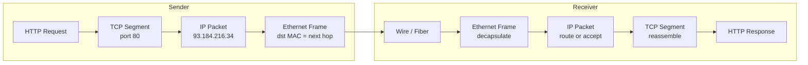
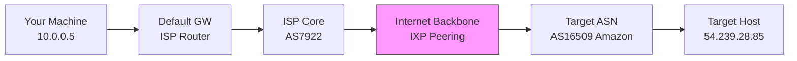

## Keywords in This File
{: .no_toc }

| # | Keyword | Weight |
|---|---|---|
| 1 | [OSI and TCP/IP Models](#osi-and-tcpip-models) | high |
| 2 | [How Packets Travel the Internet](#how-packets-travel-the-internet) | medium |
| 3 | [Network Fundamentals for Software Engineers](#network-fundamentals-for-software-engineers) | high |

---

# OSI and TCP/IP Models

**Interview Weight:** High - The OSI and TCP/IP models appear in almost every backend/infrastructure interview as the foundation for discussing protocols, debugging, and system communication.

---

## Quick Reference

**One-line definition:** The OSI model is a 7-layer conceptual framework separating networking concerns (physical, data link, network, transport, session, presentation, application); the TCP/IP model is its practical 4-layer implementation (link, internet, transport, application).

**Difficulty:** ★☆☆ | **Asked at:** All levels | **Seniority:** Junior-Senior

---

### 🎯 Model Answer

**30 seconds:**
The OSI model is a seven-layer abstraction: Physical (bits on wire), Data Link (frames, MAC addresses), Network (IP routing), Transport (TCP/UDP end-to-end), Session (connection lifecycle), Presentation (encoding, encryption), Application (HTTP, DNS). TCP/IP collapses these into four layers - Link, Internet, Transport, and Application. Engineers primarily work at Layer 3 (IP addresses, routing) and Layer 4 (TCP ports) for infrastructure, and Layer 7 (HTTP, gRPC) for application code.

**3 minutes (Senior):**
The OSI model exists to separate concerns so you can reason about failures at the right layer. When a connection drops: is it Layer 1 (bad cable), Layer 2 (ARP poisoning), Layer 3 (route not found, firewall blocking IP), Layer 4 (TCP RST, port unreachable), or Layer 7 (HTTP 503, application-level rejection)? Each layer has different diagnostic tools: Layer 1/2: `ethtool`, `ip link show`. Layer 3: `ping`, `traceroute`. Layer 4: `ss -tunp`, `tcpdump`. Layer 7: `curl -v`, application logs.

The TCP/IP model is what actual implementations use. The four layers: Link layer handles Ethernet frames and ARP. Internet layer handles IP packets and routing. Transport layer provides TCP (reliable) or UDP (unreliable). Application layer is where HTTP, DNS, TLS, and gRPC live. The critical insight: TLS sits between Transport and Application - it encrypts a byte stream after TCP establishes the connection but before HTTP sends requests.

**Framework:** LAYER → PROTOCOL EXAMPLE → FAILURE MODE → DIAGNOSTIC TOOL

**Blank Mind Recovery:**

**(1) Restate:** "OSI and TCP/IP - layered models for understanding how data travels across networks."

**(2) First principles:** "Networking has many independent concerns: sending bits on a wire, addressing machines, routing across networks, providing reliability, formatting application data. Layering solves this by assigning each concern to one layer that can be independently implemented and diagnosed."

**(3) Bridge:** "Like sending a letter internationally - the postal system has layers: physical delivery, sorting hubs, routing, final delivery. Each layer handles its own concern. OSI/TCP/IP is the same idea for network packets."

---

### 📘 Concept Explanation

**What it is:**
The OSI (Open Systems Interconnection) model is a 7-layer reference model created by ISO in 1984. The TCP/IP model is the practical 4-layer implementation used in the internet.

**The problem it solves:**
Without layering, switching from Ethernet to Wi-Fi at Layer 1/2 would require rewriting everything up to HTTP. Layering allows each concern to be swapped independently - changing the physical medium doesn't affect TCP/IP or HTTP.

**How it works:**

```
OSI (7 layers)        TCP/IP (4 layers)  Examples
7. Application  -+
6. Presentation  +--- Application       HTTP, DNS, FTP, gRPC
5. Session      -+
4. Transport    ---- Transport          TCP, UDP
3. Network      ---- Internet           IP, ICMP, ARP
2. Data Link    -+
1. Physical     -+-- Link               Ethernet, Wi-Fi, fiber

Encapsulation (sending):
  data -> segment -> packet -> frame -> bits

Decapsulation (receiving):
  bits -> frame -> packet -> segment -> data
```

> **Diagram walkthrough:** The ASCII diagram maps OSI 7 layers to TCP/IP 4 layers. OSI layers 5-7 collapse into TCP/IP Application layer. Each layer adds a header during encapsulation and strips it during decapsulation. IP packets carry TCP segments, which carry HTTP messages - each layer nested inside the next. The edge case: IPv6 fragmentation at Layer 3 affects TCP behavior at Layer 4, showing layer separation is not perfectly strict. The senior insight: TLS sits between Transport and Application, not strictly in either - it's a session-level protocol that encrypts the application stream.

The following diagram shows data encapsulation as a packet travels from sender to receiver:



> **Diagram walkthrough:** This Mermaid flowchart shows encapsulation on the sender side and decapsulation on the receiver side. The HTTP request is the payload; each wrapping layer adds addressing for its scope. The Ethernet frame contains MAC addresses for the next-hop (next router), not the final destination. The IP packet contains source and destination IPs that never change across hops (unless NAT is involved). The TCP segment contains port numbers. The key relationship: MAC addresses change at every hop; IP addresses stay constant across the entire path. The edge case: NAT (Network Address Translation) modifies IP addresses at the edge of private networks, breaking the invariant. The senior insight: understanding this stack explains why `ping` (ICMP, Layer 3) can succeed while HTTP (Layer 7) fails - you can have Layer 3 connectivity without Layer 7 accessibility.

**Key insight:**
Each layer solves one problem and relies on the layer below. Layer 3 doesn't need to know if Layer 1 is fiber or satellite. Layer 7 doesn't need to know if Layer 4 uses TCP or QUIC. This separation is why the internet runs over any physical medium.

**Layer responsibilities for engineers:**

- Layer 3: IP routing, subnets, CIDR, NAT, BGP, firewall rules by IP
- Layer 4: TCP ports, connection state, firewall rules by port, load balancer VIPs
- Layer 7: HTTP headers, TLS termination, gRPC, WebSocket upgrade, cookie management

---

### 💻 Code Example

**BAD: Debugging by jumping straight to application logs**

```bash
# BAD: Service appears unreachable.
# Going straight to application logs without
# checking network layers first.
# This wastes 30 minutes when the issue is a
# firewall rule blocking port 8080 at Layer 4.

tail -f /var/log/app/service.log
kubectl logs pod/myservice
grep ERROR /var/log/nginx/error.log
# No relevant errors found.
# Developer concludes: "must be a code bug"
# Reality: a firewall rule was blocking port 8080
```

> **Code walkthrough:** Application logs only reveal Layer 7 failures. A firewall blocking TCP at Layer 4 means the application never sees the connection - its logs are silent. Checking application logs first when a service is "unreachable" is a category error: the problem exists at a different layer than you're looking. The consequence is 30+ minutes debugging code for a problem that has no code solution. The takeaway: always start at Layer 3 and work upward - each layer only becomes relevant once the layer below is confirmed working.

**GOOD: Systematic layer-by-layer debugging**

```bash
# GOOD: Systematic debugging from Layer 3 upward.
# Each step rules out one layer before moving higher.

# Layer 3: Can we reach the IP?
ping 10.0.0.50
# No response = routing issue OR firewall blocking ICMP

# Layer 4: Is the TCP port open?
nc -zv 10.0.0.50 8080
# "Connection refused" = app not listening on port
# Timeout = firewall blocking port 8080 at Layer 4

# Layer 4: What connections exist on this host?
ss -tunp | grep 8080

# Layer 3: Check route and hop count to destination
traceroute 10.0.0.50
# Timeout at hop N = problem at that router

# Layer 7: Check HTTP only after Layers 3 and 4 pass
curl -v http://10.0.0.50:8080/health
# -v shows full request/response including TLS headers
```

> **Code walkthrough:** This follows the OSI model bottom-up. `ping` tests Layer 3 IP reachability. `nc -zv` tests Layer 4 TCP establishment - a timeout (not "connection refused") means a firewall rule. `ss` shows live socket state. `traceroute` reveals where at Layer 3 packets stop. `curl -v` tests Layer 7 only after confirming lower layers work. The mechanism: each layer depends on layers below - if Layer 3 fails, Layer 4 will also fail, and Layer 7 will definitely fail. Testing bottom-up eliminates false positives. The takeaway: when diagnosing connectivity, `ping` before `curl`, `nc` before logs - this is the habit that makes a 5-minute debug instead of a 50-minute debug.

---

### 🎓 Answers by Seniority

**Junior / Mid (0-5 years):**
The OSI model has 7 layers, but TCP/IP uses 4. The ones engineers work with most: Layer 3 (IP addresses, routing), Layer 4 (TCP/UDP, ports), Layer 7 (HTTP, DNS, TLS). When debugging connectivity: check from the bottom up - can I ping (Layer 3)? Can I connect to the port (Layer 4)? Does the application respond (Layer 7)? Each layer failure has different root causes and different diagnostic tools. A firewall rule blocking port 8080 is a Layer 4 failure that looks like an application failure at Layer 7.

---

**Senior / Staff (5+ years):**
At senior level, the model matters for system design: load balancers operate at Layer 4 (TCP proxy, no HTTP awareness) or Layer 7 (HTTP proxy, URL-based routing, TLS termination). Layer 4 LBs are faster but can't route by URL. Layer 7 LBs can inspect headers, set cookies, terminate TLS. For microservices: service meshes (Istio, Linkerd) operate at Layer 7 by intercepting HTTP/gRPC traffic for mTLS, circuit breaking, and observability - which is why they add latency. For network performance: TCP congestion window (Layer 4), packet retransmission, and MTU (Layer 3/2) affect throughput in ways invisible at Layer 7. Knowing which layer to tune for a given problem is the senior-level skill.

---

### ⚠️ Common Misconceptions

**Misconception 1: "TLS is a Layer 7 protocol"**

TLS operates between Layer 4 (TCP) and Layer 7 (HTTP). It encrypts a byte stream - it doesn't understand HTTP. HTTP runs on top of TLS. This matters because: a TLS error (certificate mismatch, expired cert) appears before any HTTP response. If you're debugging "connection refused" vs "TLS handshake failed" vs "HTTP 403", knowing TLS is between TCP and HTTP explains where the error originates. The fix for a TLS error is not in your application code - it's in certificate configuration.

---

**Misconception 2: "OSI layers are enforced by hardware/software"**

The OSI model is a conceptual reference, not an implementation standard. Real protocols don't always respect layer boundaries. IP fragmentation (Layer 3) affects TCP performance (Layer 4). TCP's Nagle algorithm (Layer 4) affects application latency (Layer 7). VPNs encapsulate Layer 3 packets inside Layer 4 UDP. The model is for reasoning about where problems occur, not for predicting strict implementation boundaries.

---

**Misconception 3: "Routers are Layer 3 and switches are Layer 2"**

Traditional routers are Layer 3 and traditional switches are Layer 2 (forward by MAC). But modern "Layer 3 switches" route by IP at wire speed using ASICs. SDN controllers program forwarding rules at any layer. Cloud load balancers labeled "Layer 7" still terminate TCP (Layer 4). The label indicates the highest layer a device understands, not a restriction on lower layers.

---

### 🚨 Failure Modes and Diagnosis

**Failure 1: Asymmetric Routing (Layer 3)**

Symptom: TCP connection establishes, but data transfer intermittently fails; `tcpdump` shows packets going out but ACKs not returning.

Cause: traffic from A to B goes through router X, but return traffic (B to A) goes through router Y. A stateful firewall on only one path blocks return traffic as "unexpected."

Diagnosis:
```bash
# Check outbound path
traceroute <destination>
# Ask destination to run traceroute back to you
# Large asymmetry in paths = suspect asymmetric routing

# Observe with tcpdump
tcpdump -n -i eth0 host <destination> and port 443
# Look for SYN sent, SYN-ACK received, but data not ACK'd
```

> **Code walkthrough:** Asymmetric routing is difficult to detect because both `ping` and TCP handshake may succeed - only data transfer with a stateful firewall fails. The tcpdump command captures all packets to/from the destination on port 443. Seeing a SYN leave and SYN-ACK return confirms Layer 3 and Layer 4 work. Seeing data packets leave without ACKs returning reveals the asymmetric firewall blocking the return path. The fix is to ensure stateful firewall rules are applied symmetrically or to engineer symmetric routing. The takeaway: always capture both directions simultaneously (on both endpoints if possible) when debugging asymmetric failures.

---

**Failure 2: MTU Mismatch Causing Silent Failures (Layer 3/4)**

Symptom: small requests succeed; large requests (uploads, file transfers) hang silently; `ping` works fine.

Cause: MTU mismatch. VPN tunnels add encapsulation headers, reducing effective MTU from 1500 to 1400-1450. Large packets are fragmented. If the "Don't Fragment" bit is set (TCP sets this for PMTUD), packets are silently dropped when exceeding the VPN MTU.

Diagnosis:
```bash
# Test with specific packet sizes (1472 + 28 header = 1500 MTU)
ping -M do -s 1472 <destination>
# If 1472 fails but smaller sizes succeed: MTU issue

# Check MTU on interface
ip link show eth0 | grep mtu
# Compare to what VPN interface shows
ip link show tun0 | grep mtu
```

> **Code walkthrough:** The `-M do` flag sets the Don't Fragment bit on the ping, mimicking TCP's behavior. The `-s 1472` sets the payload to 1472 bytes (plus 28 bytes of ICMP/IP headers = 1500 bytes total, the standard Ethernet MTU). If this ping fails but `-s 1400` succeeds, the path's effective MTU is between 1400 and 1472, pointing to a VPN or encapsulation tunnel. The fix: either configure PMTUD properly (ensure ICMP Fragmentation Needed packets are not blocked by firewalls), or explicitly set the MSS (Maximum Segment Size) in TCP to match the reduced MTU via iptables TCPMSS target. The takeaway: test MTU explicitly when large transfers fail but small ones succeed - it's a common VPN and tunnel issue.

---

### 🎯 Interview Deep-Dive

| Category | Count | Coverage |
|---|---|---|
| Conceptual | 3 | Layer model, encapsulation, TCP/IP vs OSI |
| Application | 2 | Debugging, tool selection per layer |
| Behavioral | 1 | Production network debug story |
| Trade-off | 1 | Layer 4 vs Layer 7 LB trade-offs |

---

**[JUNIOR] Q1 - [CONCEPTUAL] Name the 7 OSI layers and what each one does.**

Layer 1 Physical: converts bits to electrical/optical signals - cables, NICs, fiber optic. Layer 2 Data Link: organizes bits into frames, handles MAC addresses for same-network delivery, error detection via FCS checksum. Protocols: Ethernet, Wi-Fi (802.11). Layer 3 Network: routes packets between networks using IP addresses. Protocols: IP, ICMP, ARP. Layer 4 Transport: end-to-end communication between processes using port numbers. TCP (reliable, ordered) and UDP (unreliable, fast). Layer 5 Session: establishes, maintains, and terminates connections (largely handled by TCP in practice). Layer 6 Presentation: data formatting, encoding, compression, encryption (largely handled by TLS in practice). Layer 7 Application: application-level protocols - HTTP, DNS, SMTP, FTP. In the TCP/IP model: Layers 1-2 become Link, Layer 3 stays Internet, Layer 4 stays Transport, Layers 5-7 become Application.

*What separates good from great:* Knowing which layers TCP/IP collapses (sessions and presentation merge into Transport and Application), and providing concrete protocol examples at each layer rather than abstract descriptions.

---

**[JUNIOR] Q2 - [APPLICATION] You cannot connect to a web service. Walk me through your debugging process.**

Step 1 (Layer 3): run `ping <hostname>`. Success means IP routing works. Failure could be DNS - separate with `nslookup <hostname>`. If ping to IP works but not hostname: DNS issue. Step 2 (Layer 4): if Layer 3 is OK, test TCP connectivity: `nc -zv <ip> 443`. Timeout means the port is firewalled. Connection refused means the service isn't listening (network is reachable, application is not). Step 3 (Layer 7): if Layer 4 is OK, test HTTP: `curl -v https://<hostname>/health`. `-v` shows TLS handshake, HTTP headers, response code. TLS failure = certificate issue. HTTP 4xx = application-level issue. HTTP 5xx = server-side error. Always start at the lowest visible layer - higher layers build on lower ones. Fixing Layer 3 often automatically resolves Layer 7 symptoms.

*What separates good from great:* The discipline of starting at Layer 3 and not jumping to application logs, and giving specific commands (not vague advice like "check the firewall").

---

**[MID] Q3 - [MECHANISM] What is ARP and why does it matter for network debugging?**

ARP (Address Resolution Protocol) sits at the Layer 2/3 boundary. IP addresses are Layer 3 (logical). Ethernet MAC addresses are Layer 2 (physical hardware). ARP translates IP to MAC for same-subnet delivery. When host A wants to reach 192.168.1.5 (same subnet): A broadcasts "Who has 192.168.1.5?" to FF:FF:FF:FF:FF:FF. The host with that IP replies with its MAC. A caches the mapping. For cross-subnet: A sends to its default gateway's MAC (the router), not the destination's MAC. The router resolves the next hop's MAC at each step. ARP matters for debugging: ARP poisoning (a rogue machine claiming another's MAC) enables man-in-the-middle attacks on local networks. Stale ARP cache entries cause failures when machines change IP (old MAC cached, packets go to wrong host). `arp -n` shows current ARP cache; clear with `ip neigh flush all`.

*What separates good from great:* The cross-subnet routing detail - destination MAC is the gateway's MAC, not the server's MAC - and ARP poisoning as the Layer 2 security attack that is invisible from Layer 3.

---

**[SENIOR] Q4 - [TRADE-OFF] When would you choose a Layer 4 vs Layer 7 load balancer?**

Layer 4 load balancer: proxies raw TCP connections without understanding the application protocol. Routes by IP and port only. Lower latency (no HTTP parsing). Supports any TCP/UDP protocol (MySQL, gaming). Cannot route by URL path or hostname. Cannot terminate TLS. Cannot inject headers. Use for: non-HTTP workloads, ultra-latency-sensitive applications, very high connection rates where HTTP parsing overhead is too high. Layer 7 load balancer: understands HTTP. Routes by URL path, hostname, or headers. Terminates TLS (one certificate location). Injects X-Forwarded-For. Supports WebSocket upgrade, gRPC. Adds 0.5-2ms latency per request for parsing. Can integrate WAF rules. Use for: all web/API workloads, microservices, anything needing content-based routing. My default: Layer 7 for web/API (routing flexibility and TLS termination are essential). Layer 4 for databases (MySQL, PostgreSQL, Kafka) where the load balancer doesn't understand the protocol and pass-through is the only option.

*What separates good from great:* The TLS termination distinction - Layer 7 LB terminates TLS (handles certificates centrally), Layer 4 LB passes encrypted traffic to backends (each backend needs its own certificate) - and concrete examples of non-HTTP workloads requiring Layer 4.

---

**[SENIOR] Q5 - [BEHAVIORAL] Describe a production network issue you diagnosed using the layer model.**

At a previous company, our payment service started timing out for ~15% of requests after a datacenter network upgrade. Application logs showed timeout errors from the database connection pool. My first thought was pool size, but the pattern was strange - short queries worked, long-running transactions timed out. Layer 7: nothing in application logs explained selective timeouts. Layer 4: `tcpdump` showed packets being sent for long transactions, but after ~30 seconds the TCP connection was RST by an intermediary - not by the database. Layer 3: `traceroute` to the database showed a new hop not present before the upgrade. Root cause: a new firewall had been inserted with a 30-second idle TCP connection timeout. Long-running transactions appeared idle to the firewall (no packets for >30 seconds during query processing). The firewall silently killed connections. Fix: configured TCP keepalive on the database driver - keepalive interval of 20 seconds sends periodic empty TCP segments keeping the connection "alive" to the firewall. Total debugging time using layer methodology: 45 minutes. The lesson: stateful firewalls with idle timeouts are a common source of mysterious database disconnections in production.

*What separates good from great:* Identifying the firewall idle timeout as a Layer 3/4 problem invisible at Layer 7, and the TCP keepalive mechanism as a cross-layer solution that prevents the firewall from seeing the connection as idle.

---

**[STAFF] Q6 - [DESIGN] How does understanding the network stack influence microservices architecture decisions?**

Service mesh implications: service meshes (Istio, Linkerd) operate at Layer 7 by injecting sidecar proxies (Envoy) that intercept all traffic. They provide mTLS, circuit breaking, and telemetry - but add latency because every internal request goes through two extra TCP connections (client sidecar to server sidecar). For high-frequency internal calls (thousands per second), this latency matters. Decision: use service mesh for external-facing services needing mTLS; for ultra-low-latency internal RPC, consider application-level auth instead of mesh overhead. Protocol selection: gRPC uses HTTP/2 (multiplexed streams over one TCP connection). REST typically uses HTTP/1.1 (one request per connection). For high-request-rate microservices, HTTP/2 multiplexing reduces connection overhead. This is a Layer 4/7 trade-off visible only when you understand the network stack. Network partitions: understanding that partitions happen at Layer 1-4 (physical failures, routing issues) while distributed system protocols operate at Layer 7 helps design graceful degradation - specifically, set TCP timeouts explicitly because Layer 3/4 failures are silent from Layer 7's perspective.

*What separates good from great:* The service mesh latency overhead (two extra TCP connections per internal call), and the CAP theorem partition connection - network partitions are Layer 3/4 phenomena, not application-level events, which is why TCP timeouts must be explicitly configured.

---

**[STAFF] Q7 - [MECHANISM] Explain how a packet travels from a browser to a server in another country, naming the protocol at each stage.**

(1) DNS resolution (Layer 7): browser checks cache. If miss, OS resolver queries DNS recursively: root nameserver → TLD nameserver (.com) → authoritative nameserver for example.com → returns IP (93.184.216.34). Uses UDP (Layer 4) port 53. (2) ARP (Layer 2): destination IP is not on local subnet, so packet goes to default gateway. ARP resolves the gateway's MAC address. (3) TCP 3-way handshake (Layer 4): OS creates TCP socket, sends SYN to server, receives SYN-ACK, sends ACK. Reliable byte stream established. (4) TLS handshake (Layer 6/7 boundary): client and server negotiate cipher suites, exchange certificates, derive session keys. No application data yet. (5) IP routing (Layer 3): IP packet is encapsulated. Each router reads destination IP, looks up route table (populated by BGP), forwards to next hop. 15-30 router hops typical for transatlantic. (6) HTTP request (Layer 7): after TLS is established, browser sends HTTP GET over the encrypted tunnel. (7) Response: same path in reverse - HTTP response, TCP ACK, IP routing home, Ethernet frames at each hop.

*What separates good from great:* Including DNS as a protocol event before TCP (most miss this), explaining that ARP resolves to the gateway's MAC (not destination), and identifying BGP as the global routing protocol at Layer 3.

---

### ⚖️ Comparison Table

| Aspect | OSI Model | TCP/IP Model |
|---|---|---|
| Layers | 7 | 4 |
| Purpose | Conceptual reference | Practical implementation |
| Session/Presentation | Explicit layers 5, 6 | Merged into Application |
| Real protocols | Few (X.400, NetBIOS) | HTTP, TCP, IP, Ethernet |
| Use in practice | Debugging taxonomy | Building and deploying systems |
| Reference | "This is a Layer 4 issue" | Configuring TCP keepalive |

**The deciding factor:** Use OSI for communication and debugging taxonomy ("this is a Layer 4 firewall issue"). Use TCP/IP for implementation decisions ("configure TCP keepalive on the driver"). Both are correct; OSI is more granular for diagnosis, TCP/IP is more accurate to how implementations actually work.

---

### 🏛️ System Design

*(Omit: ★☆☆ difficulty - system design section is reserved for ★★★ keywords.)*

---

### 📊 Diagram

*(Included in Concept Explanation section above with full walkthroughs.)*

---
---

# How Packets Travel the Internet

**Interview Weight:** Moderate - Understanding packet routing is the foundation for questions about latency, BGP, anycast, and why global content delivery works.

---

## Quick Reference

**One-line definition:** A packet travels the internet hop-by-hop - each router reads the destination IP, looks up its routing table (populated by BGP), and forwards the packet to the next router until it reaches the destination network.

**Difficulty:** ★☆☆ | **Asked at:** Junior-Senior | **Seniority:** Junior-Senior

---

### 🎯 Model Answer

**30 seconds:**
Your machine sends a packet to the default gateway. Each router reads the destination IP, consults its routing table (built via BGP between ISPs and datacenters), and sends the packet to the next hop. The path from London to a US server might cross 15 routers. BGP (Border Gateway Protocol) is the global routing protocol - how ISPs tell each other which IP blocks they own. Routing is best-effort; different packets in the same TCP connection may take different routes.

**3 minutes (Senior):**
Routing tables are hierarchical. Your home router has one default route (everything goes to the ISP). ISP routers have regional routes and a default to upstream. Tier 1 ISPs have the full BGP routing table (~900,000 IPv4 routes). Each BGP route has an AS path (sequence of Autonomous System numbers it crossed) and attributes affecting route selection. Anycast is routing used cleverly: multiple servers worldwide advertise the same IP via BGP. Routers forward to the "nearest" one (shortest AS path). This is how Cloudflare's 1.1.1.1 and Google's 8.8.8.8 work - you're transparently routed to the nearest datacenter. CDNs use anycast for DNS and edge servers. `traceroute` to 1.1.1.1 resolves differently from different locations for this reason.

**Framework:** SOURCE → DEFAULT GATEWAY → ISP NETWORK → BACKBONE → DESTINATION → HOST

**Blank Mind Recovery:**

**(1) Restate:** "How packets travel the internet - routing: how a packet finds its way from one IP to another across many networks."

**(2) First principles:** "A router knows which IP blocks are 'near' it and forwards each packet toward the destination. The destination eventually has a router that knows exactly where the target host is."

**(3) Bridge:** "Like a relay race: you pass the packet to the next runner who is closer to the finish line. Each runner only needs to know who to hand it to next - not the entire route."

---

### 📘 Concept Explanation

**What it is:**
IP routing is the process of forwarding packets across multiple networks. Each router independently decides the next hop for each packet based on its routing table. No router knows the full path - only the next step.

**The problem it solves:**
The internet has billions of devices. No single router can know how to reach all of them. Distributed routing (each router knowing only its neighborhood) scales globally. BGP is the protocol sharing routing information between the independent networks (Autonomous Systems) that compose the internet.

**How it works:**

```
Your Machine (10.0.0.5)
     |
  Default GW (10.0.0.1) - your home/office router
     |
  ISP Core Router
  - routes to major provider networks
     |
  Internet Exchange Point (IXP)
  - physical location where ISPs peer
     |
  Target AS (e.g., Amazon AS16509)
     |
  Target Router (knows all AWS subnets)
     |
  Target Host (54.239.28.85)

BGP Route example:
  54.239.28.0/22 via AS16509
  AS path: [AS7922 AS1299 AS16509]
  Route selection: AS path length, local preference, MED
```

> **Diagram walkthrough:** The diagram shows hop-by-hop routing from a home machine to an AWS server. The home machine sends to its default gateway. The ISP routes toward Amazon's network via IXP peering. Amazon's routers (AS16509) know all their subnets. The key relationship: each router only needs the next hop, not the complete path - this is what makes internet routing scale to billions of devices. The edge case: BGP path selection is policy-driven, not just distance - an ISP may route through a longer path for commercial reasons (paid transit vs settlement-free peering). The senior insight: this explains why `traceroute` paths are asymmetric - forward and reverse paths are independently determined by BGP policies of different network operators.

The following diagram visualizes the AS-level routing:



> **Diagram walkthrough:** This Mermaid flowchart shows the AS-level path from a home user to Amazon. The ISP (AS7922 - Comcast example) connects to the internet backbone via Internet Exchange Point peering (highlighted in pink). Amazon's AS16509 receives the packet and delivers to the target host. The key relationship: each arrow represents a BGP peering relationship between Autonomous Systems. The edge case: if the IXP has an outage or the BGP session between two ASes resets, traffic must find an alternate AS path (BGP convergence takes 30-180 seconds). The senior insight: the number of AS hops is not proportional to geographic distance - BGP routing is driven by commercial relationships, so packets sometimes travel geographically backwards to use a preferred transit provider.

**TTL as a safety mechanism:**
Each IP packet starts with a TTL (usually 64 or 128). Each router decrements TTL by 1. If TTL reaches 0, the router drops the packet and sends ICMP "TTL exceeded" back to the sender. `traceroute` exploits this: sends packets with TTL=1 (triggers response from hop 1), TTL=2 (hop 2), etc., building a path map. TTL prevents routing loops from cycling packets forever.

---

### 💻 Code Example

**BAD: Assuming high latency is server-side without checking the network path**

```bash
# BAD: Service has high latency. Assuming it's
# a server-side performance issue.
# Scaling up the server when the real issue is
# a routing detour in the ISP network.

# Developer adds CPU/RAM:
kubectl scale deployment/api --replicas=10
# Latency unchanged. Adds more replicas: 20.
# Still the same. Problem persists.
# Root cause was a routing issue in the network,
# invisible from the application level.
```

> **Code walkthrough:** Scaling horizontally cannot fix latency introduced by routing - adding more server instances doesn't change the path packets take through the internet. This is a fundamental category error: server performance affects processing time (time after the request arrives), but routing affects transmission time (time getting to the server). The two are independent. The takeaway: always measure where latency occurs (mtr/traceroute) before deciding where to optimize.

**GOOD: Using traceroute/mtr to find where latency is introduced**

```bash
# GOOD: Use mtr to find exactly where latency
# is introduced along the network path.

# Real-time combined ping + traceroute
mtr --report --report-cycles 100 example.com

# Expected output:
# HOST: myhost         Loss%   Avg  Best  Wrst StDev
# 1. 192.168.1.1       0.0%    1.2  0.9   1.5  0.2
# 2. 10.44.128.1       0.0%    8.1  7.8   8.4  0.2
# 3. 72.14.198.65      0.0%   10.2  9.8  11.0  0.4
# 4. *** timeout ***  100.0%   ---  ---   ---  ---
# 5. 142.250.200.14    0.0%   11.8 11.2  12.5  0.3

# Hop 4 shows 100% loss but hop 5 succeeds:
# NOT real packet loss - hop 4 router deprioritizes
# ICMP (traceroute probes) but forwards TCP normally.
# Real loss: appears at hop N and ALL subsequent hops.

# TCP-mode traceroute for firewalled paths:
traceroute -T -p 443 example.com
# Uses TCP SYN instead of UDP/ICMP - more likely
# to pass through firewalls that block ICMP.
```

> **Code walkthrough:** `mtr` runs 100 probe cycles and shows statistics per hop: loss percentage, average/best/worst/stddev latency. The key interpretation rule: loss at an intermediate hop that does NOT persist at later hops is ICMP rate-limiting (that router de-prioritizes traceroute probes but forwards real traffic normally). Real packet loss appears at hop N and persists at all subsequent hops. The `--report` flag runs `mtr` in non-interactive mode, suitable for scripting. TCP-mode traceroute (`-T -p 443`) follows the path real HTTPS traffic takes, because ECMP hash-based routing uses protocol and ports - regular ICMP traceroute may take a different ECMP path than your actual TCP traffic.

---

### 🎓 Answers by Seniority

**Junior / Mid (0-5 years):**
Packets travel hop-by-hop from router to router. Each router reads the destination IP and forwards to the next router based on its routing table. `traceroute` shows the path. TTL prevents infinite loops - each router decrements it; TTL=0 drops the packet and notifies the sender. BGP is the protocol that populates routing tables globally - it's how your ISP knows how to reach Amazon's IP blocks.

---

**Senior / Staff (5+ years):**
At senior level, routing knowledge matters for several concerns: (1) Latency optimization - CDNs, anycast DNS, geo-routing for APIs. (2) Reliability - BGP route oscillations can cause brief outages. (3) Cost - cloud provider egress charges are per-byte because traffic crossing the internet has transit costs. Anycast is particularly important: Cloudflare, AWS Route 53, and Google's DNS all use anycast. When you query 8.8.8.8, BGP routes you to Google's nearest datacenter (BGP-nearest, not geographically nearest). DDoS attacks on anycast are difficult: attacking 8.8.8.8 only hits the nearest datacenter, not all of Google's infrastructure - traffic is naturally distributed.

---

### ⚠️ Common Misconceptions

**Misconception 1: "Packets in a TCP connection always take the same path"**

IP routing is stateless and per-packet. Different packets in the same TCP connection can take different paths if routing tables change mid-connection (BGP update, link failure). This is why TCP sequence numbers and reordering buffers exist - packets may arrive out of order due to different paths with different latencies. This also means ECMP (Equal-Cost Multi-Path) can split a single flow across multiple paths, and if one path has higher loss, some packets in every connection are affected.

---

**Misconception 2: "A higher TTL makes packets travel farther"**

TTL limits the number of router hops, not geographic distance. A TTL of 64 allows 64 router hops. A packet from New York to Sydney typically crosses 20-25 hops. TTL=64 is sufficient for any global internet path. Higher TTL is only useful in abnormal routing loop scenarios, not for "reaching distant hosts."

---

**Misconception 3: "traceroute shows the exact path of real traffic"**

traceroute UDP probes may take a different path than TCP traffic because routers use ECMP hashing on the 5-tuple (source IP, source port, destination IP, destination port, protocol). Since traceroute probes have different source ports than your real traffic, they may hash to different ECMP paths. Use TCP traceroute (`traceroute -T -p 443`) to follow the path real HTTPS traffic takes.

---

### 🚨 Failure Modes and Diagnosis

**Failure 1: BGP Route Withdrawal Causing Service Outage**

Symptom: subset of users worldwide cannot reach your service; others can; `traceroute` shows traffic stopping at a specific AS border.

Cause: a BGP peer withdrew your IP block advertisement, making your IPs unreachable from networks that used that peer as their path.

Diagnosis:
```bash
# From outside your network - check BGP routing tables:
# Hurricane Electric Looking Glass: lg.he.net
# Shows traceroutes from different global nodes
# bgp.he.net shows BGP routing visibility for your IP blocks

# Check your BGP session status
# BIRD routing daemon:
birdc show protocol all
# Look for "Established" vs "Idle/Active" for BGP peers

# Verify your ASN is still advertising your prefixes
# from multiple BGP looking glasses worldwide
```

> **Code walkthrough:** BGP route withdrawal makes your IP prefixes unreachable from networks that used the withdrawn path. The BIRD daemon (common on Linux) shows BGP protocol state: "Established" means the session is up and routes are being exchanged; "Idle" or "Active" means the session is down and routes have been withdrawn. Hurricane Electric's Looking Glass lets you see traceroutes from diverse global nodes, revealing which parts of the internet can still reach you. The takeaway: when your service becomes unreachable for a geographic subset of users, check BGP routing before any application-level diagnosis.

---

**Failure 2: ECMP Path Asymmetry Causing Intermittent Failures**

Symptom: some requests work, some fail; retrying the same request sometimes succeeds; pattern appears random.

Cause: ECMP distributes traffic across multiple paths via hash. One path has a faulty link. Requests hashing to the faulty path fail.

Diagnosis:
```bash
# Use hping3 to test with specific source ports
# (changes the ECMP hash)
hping3 -S -p 443 --sport 12345 <destination>
hping3 -S -p 443 --sport 12346 <destination>
# If one source port consistently fails and
# another succeeds: ECMP path issue.

# Alternative: use curl with explicit interface binding
# to test different source ports
```

> **Code walkthrough:** ECMP distributes flows across paths using a hash of the 5-tuple. `hping3` lets you control the source port, which changes the hash and forces the probe to take different ECMP paths. If port 12345 consistently fails but 12346 succeeds, you have a bad link on one ECMP path. The network team can then identify which physical link is faulty by correlating the hash result with the physical topology. The takeaway: intermittent failures that succeed on retry, with no pattern in application logs, are often ECMP-related - the load balancer or router is distributing across paths and one is broken.

---

### 🎯 Interview Deep-Dive

| Category | Count | Coverage |
|---|---|---|
| Conceptual | 3 | Routing, BGP, anycast |
| Application | 2 | traceroute diagnosis, CDN routing |
| Design | 1 | Anycast design |
| Behavioral | 1 | Routing incident story |

---

**[JUNIOR] Q1 - [MECHANISM] What happens at each hop when a packet travels across the internet?**

At each router hop: (1) Router receives the Ethernet frame on its incoming interface. (2) Decapsulates the Layer 2 frame to extract the Layer 3 IP packet. (3) Reads the destination IP address. (4) Looks up the destination in its forwarding table (FIB - Forwarding Information Base) using longest prefix match. (5) Decrements TTL by 1. If TTL reaches 0: drops the packet and sends ICMP TTL Exceeded to the source. (6) Re-encapsulates the IP packet in a new Ethernet frame with the next-hop's MAC address (ARP-resolved if not cached). (7) Sends the frame out the correct outgoing interface. This happens at wire speed in modern routers (hardware ASIC forwarding). Key detail: the IP packet's source and destination IPs never change across hops (unless NAT is involved). Only the Layer 2 Ethernet frame headers change at each hop - destination MAC becomes the next router's MAC, not the final host's MAC.

*What separates good from great:* The MAC address re-encapsulation at each hop (IP stays constant, only Ethernet headers change), and distinguishing the hardware FIB (wire-speed forwarding) from the software RIB (routing table computed by BGP/OSPF).

---

**[MID] Q2 - [MECHANISM] What is BGP and why is it called the "routing protocol of the internet"?**

BGP (Border Gateway Protocol) exchanges route advertisements between Autonomous Systems (ASes) - independently administered networks (Comcast is AS7922, AWS is AS16509). Each AS advertises the IP prefixes it owns to its BGP neighbors. Neighbors propagate these with an updated AS path. All BGP-speaking routers build a global route table of ~900K IPv4 prefixes. Route selection: BGP uses local preference (operator-configured), AS path length (shorter is preferred), MED (metric from peer), and other attributes. BGP is "path vector" routing - it knows the complete AS path to the destination, enabling loop detection (reject routes already containing your own AS number). Why it's critical: BGP route leaks or hijacks have caused internet-wide incidents. Pakistan Telecom's BGP hijack of YouTube in 2008 made YouTube unreachable globally for hours. Facebook's 2021 BGP withdrawal (they accidentally withdrew all their routes) made all Facebook services including internal tooling unreachable, requiring physical datacenter access to restore.

*What separates good from great:* The loop prevention mechanism (path vector rejects routes containing your own AS), and the Facebook 2021 outage - where the BGP withdrawal made even their internal management tools unreachable.

---

**[SENIOR] Q3 - [MECHANISM] Explain anycast and give a production use case.**

Anycast: multiple servers worldwide advertise the same IP via BGP. Routers forward to the topologically nearest server (shortest AS path). The client doesn't know multiple servers exist - they connect to the single IP, and routing delivers them to the nearest instance. Use case 1 - DNS: Cloudflare's 1.1.1.1 and Google's 8.8.8.8. Queries from Tokyo route to Cloudflare's Tokyo datacenter; from London to the London PoP. Reduces DNS latency from 100ms+ to <5ms. Use case 2 - DDoS mitigation: attacking an anycast IP only hits the nearest node. Cloudflare has hundreds of anycast nodes - attack traffic is naturally distributed and absorbed globally before reaching the origin. Use case 3 - CDN edges: Cloudflare, Fastly, Akamai all use anycast for edge PoPs. Differences from GeoDNS: anycast is IP-layer routing (no DNS tricks). GeoDNS returns different DNS records per client IP. Anycast advantage: works even if DNS caching sends a client to a "wrong" record. Anycast limitation: BGP convergence takes 30-180 seconds when a node fails - failover is slower than DNS TTL-based switching.

*What separates good from great:* The DDoS absorption property (geographic distribution of attack traffic), and the BGP convergence time limitation (30-180 seconds for failover vs DNS TTL-based switching which can be <60 seconds).

---

**[SENIOR] Q4 - [APPLICATION] How do you diagnose high latency between two services?**

Systematic diagnosis: (1) Establish baseline: what's the expected RTT? `ping` gives raw Layer 3 RTT. Expected: <2ms same datacenter, <20ms same region, <100ms cross-continent. (2) Run `mtr --report-cycles 100 <destination>`: per-hop latency and loss over 100 samples. Find the hop where latency jumps. (3) If latency introduced at an ISP hop: outside your control. If consistent at every hop beyond yours: problem is at the destination. (4) Check TCP-specific issues: `ss -ti <connection>` shows TCP retransmit count, RTT variance, congestion window. High retransmits = packet loss. (5) Capture with `tcpdump -n -i eth0 host <dest> and tcp`: look for retransmits (same sequence number sent multiple times) or delayed ACKs. (6) Check bandwidth: `iperf3 -c <host>` measures actual TCP throughput; compare to expected link capacity. (7) If all hops clear but application latency high: issue is application-level (processing time, DB, GC pauses) - hand off to application profiling.

*What separates good from great:* `ss -ti` for TCP internals (retransmits, congestion window, RTT variance), and the explicit hand-off criterion (when network clears, escalate to application profiling).

---

**[SENIOR] Q5 - [BEHAVIORAL] Tell me about a time routing affected your production service.**

At a startup running infrastructure across two cloud providers, we had a cross-cloud RPC path (AWS → GCP for a specific data service). Performance was excellent in load testing but degraded 10x in production for users in Southeast Asia. Investigation: `mtr` from an AWS Singapore node to a GCP Singapore endpoint showed traffic leaving Singapore (AWS), crossing to US West Coast, then returning to Singapore (GCP) - a 300ms round trip instead of expected <10ms. Root cause: AWS Singapore and GCP Singapore don't have direct BGP peering. Traffic left AWS's network, crossed the Pacific via AWS's global backbone to the US, entered GCP's network there, and returned to GCP Singapore over GCP's backbone. Geographically absurd, but BGP-correct because each provider's backbone connects to its own regions, not to competitors. Fix: deployed a VPN between AWS Singapore VPC and GCP Singapore VPC with static routes, forcing traffic to stay in Singapore. RTT dropped from 300ms to 8ms. Lesson: cloud providers do not peer regionally with competitors - cross-cloud same-region traffic may route via the US.

*What separates good from great:* The specific cloud-provider peering insight (AWS and GCP backbone is internal to each provider, not cross-provider), and the VPN-with-static-routes fix that bypasses BGP routing with explicit next-hop rules.

---

**[STAFF] Q6 - [DESIGN] How would you architect a globally distributed service with sub-10ms response times?**

Sub-10ms globally requires serving from within the user's region. The architecture: (1) Anycast edge network: 30+ PoPs worldwide, each advertising the service IP via BGP. Users automatically routed to nearest PoP. Use Cloudflare Workers, Fastly Compute@Edge, or AWS Lambda@Edge for edge compute. (2) Edge caching: serve 95%+ of reads from edge cache (TTL by content type: static assets 1 year, API responses 10-60 seconds). Cache misses go to origin. (3) Origin: 3-5 regional origin clusters with regional primary databases. Reads from nearest replica. Writes to a global primary (or regional primary with conflict resolution for multi-master). (4) DNS: anycast DNS for <5ms DNS resolution. Short TTLs (60s) for service health failover. (5) Protocol: HTTP/3 (QUIC) for mobile users (handles packet loss better than TCP). gRPC for edge-to-origin communication. The constraint: sub-10ms is achievable for reads only. Writes requiring global consistency cannot be sub-10ms globally - speed of light from New York to London is ~35ms minimum one-way. Accept that writes are slower, or use eventual consistency.

*What separates good from great:* The speed-of-light limit on global write consistency (physics, not engineering), and the hybrid architecture (fast reads from anycast edge, slower writes to regional primary with eventual consistency).

---

**[STAFF] Q7 - [MECHANISM] What happened in the Facebook October 2021 outage?**

Facebook's October 4, 2021 outage lasted ~6 hours. Cause: a BGP route withdrawal. During maintenance, a configuration change caused Facebook's backbone routers to withdraw all BGP route advertisements for Facebook's IP prefixes from the global internet. Effect: all Facebook IP addresses became unreachable. Facebook.com, WhatsApp, Instagram, and Oculus went down globally. Facebook's DNS servers (on Facebook's IP blocks) also became unreachable - DNS for facebook.com failed. The recursive failure: Facebook's internal systems use Facebook's IP infrastructure. Internal monitoring, deployment tools, and management access all routed through the same infrastructure. Engineers couldn't SSH into the routers remotely - those management paths used the same network being managed. Physical access was required: staff had to travel to datacenters to manually reset routers. Recovery took hours due to physical access requirements and a cascade of authentication systems that also relied on the downed infrastructure. Lessons: (1) Control plane must be separated from data plane - management access should not route through the network you're managing. (2) BGP changes must be staged with automatic rollback (not just tested). (3) Out-of-band management (separate physical path) is critical for infrastructure that manages the network itself. (4) DNS infrastructure needs diverse routing for resilience.

*What separates good from great:* The control-plane/data-plane separation principle (the root lesson), and the physical access requirement showing what happens when the control plane is on the data plane - engineers couldn't reach the tools needed to fix the problem.

---

### ⚖️ Comparison Table

| Routing Concept | Scope | Protocol | Used For |
|---|---|---|---|
| ARP | Same subnet | ARP | IP-to-MAC address resolution |
| OSPF / IS-IS | Within one AS | Link-state IGP | Intra-datacenter routing |
| BGP | Between ASes | Path vector | Global internet routing |
| Anycast | Global | BGP | CDN, DNS, DDoS mitigation |
| ECMP | Router to next hop | Routing extension | Load balancing across paths |
| NAT | Private network edge | IP translation | Private IP to public IP |

---

### 🏛️ System Design

*(Omit: ★☆☆ difficulty.)*

---

### 📊 Diagram

*(See Concept Explanation above; packet-routing flow diagram and walkthrough are in that section.)*

---
---

# Network Fundamentals for Software Engineers

**Interview Weight:** High - Software engineers are increasingly expected to understand network fundamentals to debug production issues, design distributed systems, and make informed infrastructure choices.

---

## Quick Reference

**One-line definition:** The practical networking knowledge software engineers need: latency math (speed-of-light constraints by geography), bandwidth vs throughput, TCP connection overhead, DNS caching behavior, and port/connection multiplexing.

**Difficulty:** ★☆☆ | **Asked at:** All levels | **Seniority:** Junior-Staff

---

### 🎯 Model Answer

**30 seconds:**
The fundamentals that matter most: latency (speed of light dominates cross-region; congestion dominates within-region), bandwidth vs throughput (bandwidth is capacity; throughput is actual delivery, affected by packet loss and RTT), TCP connection overhead (3-way handshake = 1.5 RTT before any data; TLS adds 1-2 more RTTs), DNS (every cold hostname lookup adds a round-trip; TTL controls caching), and ports (multiplexing - one IP, many services via port numbers). Understanding these predicts and prevents the majority of production network issues.

**3 minutes (Senior):**
The most important practical concepts: (1) Latency math. Speed of light in fiber: ~200,000 km/s. London to New York is ~5,500 km, so minimum RTT is ~55ms. Actual RTT is ~75-85ms due to routing overhead and non-straight-line fiber. You cannot optimize below this floor. Latency budgets: <100ms feels instant to users, 100-300ms is noticeable, >300ms is frustrating. Design user-facing services to stay under 100ms by serving from nearby regions. (2) Bandwidth vs throughput. A 1Gbps link can theoretically deliver 125MB/s. With 1% packet loss and 100ms RTT, TCP throughput drops to ~3MB/s. The bandwidth-delay product (BDP = bandwidth × RTT) limits TCP throughput: BDP = 1Gbps × 0.1s = 100MB in-flight maximum. If TCP's window can't reach 100MB, throughput is capped. (3) Connection establishment cost. TCP: 1.5 RTT. TLS 1.3: +1 RTT first connection, 0-RTT possible for resumed sessions. HTTP/1.1: one request per connection (serial). HTTP/2: multiplex many requests over one connection. Connection pooling is non-optional for any protocol with setup overhead.

**Framework:** LATENCY → THROUGHPUT → CONNECTION OVERHEAD → DNS → PRACTICAL DESIGN IMPLICATIONS

**Blank Mind Recovery:**

**(1) Restate:** "Network fundamentals for software engineers - what do I need to know to build and debug networked systems?"

**(2) First principles:** "Every networked operation has a minimum latency (physics: speed of light), a maximum throughput (bandwidth and packet loss), and a connection setup cost. Understanding these three constraints predicts performance."

**(3) Bridge:** "Like understanding electricity before wiring a house - you don't need to be an electrician, but you must know that current is limited by wire gauge (bandwidth), voltage drops over distance (latency), and switches have overhead (connection setup)."

---

### 📘 Concept Explanation

**What it is:**
Network fundamentals for software engineers is the practical subset of networking knowledge needed to design distributed systems, debug connectivity issues, and make informed decisions about protocols and architecture.

**The problem it solves:**
Without this knowledge, engineers blame code for network problems, choose wrong protocols for their latency/throughput requirements, and design architectures that violate physics (expecting sub-10ms synchronous cross-continental calls).

**Key concepts and numbers:**

```
Latency by tier (approximate):
  Same process (loopback): 0.05-0.1ms
  Same host, different process: 0.1-0.5ms
  Same rack/datacenter: 0.5-2ms
  Same region, different AZ: 1-5ms
  Same cloud, different region: 10-100ms
  Cross-continent (transatlantic): 70-100ms
  Cross-ocean (Pacific): 120-200ms

Bandwidth-Delay Product:
  BDP = bandwidth x RTT
  1Gbps link, 100ms RTT:
    BDP = 1Gbps x 0.1s = 100MB
  TCP window must reach 100MB to saturate 1Gbps.
  Default Linux receive buffer: 4-6MB -> max ~50Mbps
  on that link without tuning.

TCP Connection Overhead:
  Time 0: SYN sent
  Time 1 RTT: SYN-ACK received
  Time 1.5 RTT: ACK + first data sent
  TLS 1.3: adds 1 more RTT for handshake
  Total: 2.5 RTT before first HTTP byte
```

> **Diagram walkthrough:** The latency table shows order-of-magnitude differences between network tiers. Same-datacenter is ~1ms; transatlantic is ~80ms; cross-Pacific is ~150ms. These are physics floors - no amount of engineering makes a transatlantic round trip sub-35ms. The BDP diagram shows why high-bandwidth links still have throughput ceilings: TCP must keep BDP bytes in-flight simultaneously to saturate the link, but default Linux buffers (4-6MB) cap this far below 1Gbps for high-RTT links. The TCP overhead diagram shows the 1.5 RTT cost of connection establishment plus 1 RTT for TLS 1.3 - meaning HTTP/1.1 with a new connection per request pays 2.5 RTT before any application data moves.

**DNS as a practical concern:**
Every cold hostname lookup takes 1-4 round trips (stub resolver → recursive resolver → root → TLD → authoritative). A cold DNS lookup can take 50-200ms. Applications that resolve hostnames at connection time (rather than startup or with caching) pay this cost per connection. Best practice: use DNS caching at the OS level (systemd-resolved, nscd) and application level, and set TTLs appropriate to change frequency (60-300s for dynamic services).

**Ports and multiplexing:**
One IP hosts many services because TCP/UDP add 16-bit port numbers. Well-known ports (0-1023) require root on Linux. Application ports (1024-65535) are freely available. Ephemeral ports (source ports for outgoing connections): default range 32768-60999 (~28K ports). At high connection rates, TIME_WAIT connections (60 seconds after close) consume ports. Tuning: expand to 1024-65535 via `net.ipv4.ip_local_port_range`, enable `net.ipv4.tcp_tw_reuse` for port reuse.

---

### 💻 Code Example

**BAD: Creating a new HTTP connection for every request**

```python
# BAD: New HTTP connection per request.
# Each request pays 1.5 RTT (TCP) + 1 RTT (TLS)
# = 2.5 RTT overhead before any data transfers.
# At 20ms RTT: 50ms overhead per request.
# At 1000 RPS: 1000 new TCP connections/second.
# Fills kernel connection tracking table.
# TIME_WAIT state: 60 seconds per closed connection.

import requests

def call_payment_service(order_id):
    # Creates a new TCP+TLS connection every call!
    response = requests.get(
        f"https://payment.internal/orders/{order_id}"
    )
    return response.json()
```

> **Code walkthrough:** The `requests.get()` call without a session creates a new TCP connection for every invocation. With a 20ms RTT, each request incurs 50ms of handshake overhead before the server even sees the request. At 1,000 RPS, this creates 1,000 TCP handshakes per second, each generating kernel state (socket struct, TCP buffers, TLS session state). After the request completes, the connection enters TIME_WAIT for 60 seconds before the port is released - at high rates, the 28K ephemeral port pool exhausts. The application appears to work but has 50x higher connection overhead than necessary.

**GOOD: Session with connection pooling and keep-alive**

```python
# GOOD: Reuse TCP connections across requests.
# Connection overhead amortized: ~50ms first request,
# ~0.5ms all subsequent requests (reuse existing conn).

import requests
from requests.adapters import HTTPAdapter
from urllib3.util.retry import Retry

# Create one session per process/thread pool.
_session = requests.Session()
_adapter = HTTPAdapter(
    pool_connections=10,  # connections per host
    pool_maxsize=20,      # max pool size
    max_retries=Retry(
        total=3,
        backoff_factor=0.3,
        status_forcelist=[500, 502, 503, 504]
    )
)
_session.mount("https://", _adapter)

def call_payment_service(order_id):
    # Reuses existing TCP+TLS connection.
    # Overhead: ~0.5ms vs 50ms for new connection.
    response = _session.get(
        f"https://payment.internal/orders/{order_id}",
        timeout=(3, 10)
        # connect_timeout=3s, read_timeout=10s
        # Never omit timeout - hangs cause thread exhaustion
    )
    response.raise_for_status()
    return response.json()
```

> **Code walkthrough:** `requests.Session` with `HTTPAdapter` maintains a pool of persistent TCP connections. After the first request's handshake, subsequent requests reuse the established connection, reducing overhead from 50ms to <1ms. `pool_connections=10` limits connections per host (prevents overwhelming a single backend). `timeout=(3, 10)` is the connect-timeout/read-timeout tuple - 3 seconds to establish the TCP+TLS connection, 10 seconds to receive the response. Both timeouts are mandatory: a missing connect-timeout causes hangs when the server is unreachable; a missing read-timeout causes thread exhaustion when the server is slow. The retry config handles transient 5xx failures with exponential backoff (0.3, 0.6, 1.2 seconds) for the listed status codes only - not for 4xx errors which are client-side problems that won't resolve on retry.

---

### 🎓 Answers by Seniority

**Junior / Mid (0-5 years):**
Key numbers: same datacenter ~1ms, same region ~10ms, cross-continent ~100ms. TCP needs 1.5 RTT to establish plus 1 RTT for TLS. Always use connection pooling and keep-alive for HTTP clients. DNS adds latency if not cached. Ports are how multiple services share one IP. Most common mistakes: not setting timeouts on HTTP clients (causes thread exhaustion when a downstream service hangs), creating new HTTP connections per request (50ms overhead per call), and expecting sub-millisecond cross-region calls.

---

**Senior / Staff (5+ years):**
At senior level, network fundamentals shape architecture decisions. The bandwidth-delay product determines TCP buffer sizing for high-throughput transfers. The speed-of-light constraint means any user-facing synchronous call crossing the Atlantic has a ~75ms floor regardless of code quality. For global services, data placement (which region hosts what) is as important as code efficiency - a fast algorithm on the wrong continent is slower than a slow algorithm on the right one. The port exhaustion limit (65,535 ephemeral ports per source IP:destination IP:port tuple) appears at high-concurrency gateways and requires either port range expansion, multiple source IPs, or connection pooling to avoid.

---

### ⚠️ Common Misconceptions

**Misconception 1: "Gigabit connections are always fast"**

Bandwidth and throughput are different. A 1Gbps link can have low throughput due to high RTT (BDP exceeds TCP window), packet loss (TCP backs off exponentially), or protocol overhead. A cross-continental 1Gbps link with 100ms RTT and 0.1% packet loss achieves much lower throughput than a local 100Mbps LAN link. For bulk transfers over high-latency links, the BDP must be satisfied by tuning TCP buffer sizes.

---

**Misconception 2: "TCP always retransmits lost packets quickly"**

TCP's retransmission timeout (RTO) starts at 200ms-1 second and doubles with each failure (exponential backoff). With 1% packet loss, a TCP flow periodically stalls for 200ms-1s waiting for retransmission. This causes latency spikes at the application layer that appear to be application-level slowdowns. The fix is reducing packet loss (better networking), not tuning RTO.

---

**Misconception 3: "DNS failures are rare in production"**

DNS failures are surprisingly common: a TTL expiring during a rolling restart, a DNS server becoming overloaded, or a misconfigured record causes instantaneous failures for all services using that hostname. Best practices: monitor DNS resolution time as a metric, use multiple DNS resolvers in `/etc/resolv.conf` (`options rotate`), set TTLs appropriate to change frequency (60-300s for services with IPs that change), and test behavior when DNS is slow (not just when it fails).

---

### 🚨 Failure Modes and Diagnosis

**Failure 1: Ephemeral Port Exhaustion**

Symptom: high-throughput service starts failing with "Cannot assign requested address"; `ss -s` shows thousands of TIME_WAIT connections.

Cause: each TCP connection consumes one ephemeral port. Default range 32768-60999 gives ~28K ports. At high connection rates with short-lived connections, ports stay in TIME_WAIT (60 seconds) and aren't reused until exhausted.

Diagnosis:
```bash
# Check connection state distribution
ss -s
# Look for large TIME-WAIT count

# View current ephemeral port range
sysctl net.ipv4.ip_local_port_range
# Default: 32768 60999

# Fix: expand range and enable reuse
sysctl -w net.ipv4.ip_local_port_range="1024 65535"
sysctl -w net.ipv4.tcp_tw_reuse=1
# tcp_tw_reuse: allow reusing TIME_WAIT sockets
# for new connections (safe - timestamp-guarded)
```

> **Code walkthrough:** Port exhaustion is a systems-level failure that appears as a network error at the application level. `ss -s` shows the count of sockets in each TCP state. When TIME_WAIT count approaches the ephemeral port range size, new connections start failing with EADDRNOTAVAIL. Expanding the port range from ~28K to ~64K buys time, but the root fix is connection pooling (reusing connections instead of creating new ones per request). `tcp_tw_reuse=1` allows TIME_WAIT port reuse when TCP timestamps confirm the old connection is gone. The takeaway: port exhaustion is preventable entirely with connection pooling - the sysctl tuning is for legacy code that cannot be pooled immediately.

---

**Failure 2: DNS Cache Stampede on TTL Expiry**

Symptom: periodic latency spikes at intervals matching the DNS TTL; during each spike, many requests fail or slow simultaneously.

Cause: a widely-used hostname has a short TTL. When the TTL expires, all application instances simultaneously do a cold DNS lookup. The DNS resolver handles a burst of concurrent queries.

Diagnosis:
```bash
# Time the DNS resolution
time nslookup payment.internal
# >10ms = resolver slow; >100ms = resolver overloaded

# Check application-level DNS TTL settings
# Java: system property
java -Dnetworkaddress.cache.ttl=300 ...
# Java default: caches only 30 seconds, causing
# frequent re-resolution under load

# Linux system DNS cache
# Enable nscd or systemd-resolved caching
systemctl status systemd-resolved
resolvectl statistics
```

> **Code walkthrough:** DNS stampedes occur when many clients simultaneously query the same hostname after a shared TTL expires. The DNS resolver becomes a bottleneck, causing all queries to queue and taking 100ms+ instead of <1ms. The Java JVM has an aggressively short DNS cache TTL (30 seconds by default, configurable via `networkaddress.cache.ttl`). For high-RPS Java services hitting the same hostname hundreds of times per second, every 30 seconds there's a brief period of slow DNS resolution. Setting TTL to 300 seconds (5 minutes) reduces resolution frequency 10x while still reacting to DNS changes within 5 minutes. The takeaway: always configure DNS TTL in your HTTP client or JVM to match the service's change frequency - the platform default is often too aggressive for high-traffic scenarios.

---

### 🎯 Interview Deep-Dive

| Category | Count | Coverage |
|---|---|---|
| Conceptual | 2 | Latency math, BDP |
| Application | 2 | Connection pooling, timeout design |
| Behavioral | 1 | Network performance investigation |
| Design | 2 | Latency budgets, partition handling |

---

**[JUNIOR] Q1 - [MECHANISM] What is the difference between latency and throughput, and why does each matter?**

Latency is the time from sending a request to receiving the first byte of response - the round-trip time. Throughput is the amount of data transferred per unit time - bytes per second. They're independent: a satellite connection has high latency (~600ms RTT) but potentially high throughput (100Mbps+). Fiber within a datacenter has low latency (~0.5ms) and high throughput. Why both matter: for interactive applications (web APIs, user interfaces), latency determines responsiveness. A 600ms latency feels broken regardless of available bandwidth. For bulk transfers (backups, streaming, file uploads), throughput determines completion time. A 100GB backup over 100Mbps takes ~8,000 seconds regardless of latency. For production services: optimize latency first (affects user experience), then throughput (affects data capacity). They interact via the bandwidth-delay product: high throughput on a high-latency link requires large TCP windows to keep the link saturated while waiting for ACKs.

*What separates good from great:* The satellite internet example (high latency, high throughput are independent axes), and the BDP as the mechanism linking latency and throughput.

---

**[MID] Q2 - [MECHANISM] Why is connection pooling essential for high-throughput services?**

TCP connection establishment requires a 3-way handshake (1.5 RTT). TLS 1.3 adds 1 RTT. Database connection authentication adds ~1 RTT. For a service with 2ms internal RTT: new connection overhead = ~5ms per request. With connection pooling: reuse overhead = ~0.1ms per request (existing connection, no handshake). At 1,000 RPS: without pooling, 1,000 new connections/second, each creating kernel state (socket buffers, TLS session). With pooling: 10-20 long-lived connections, near-zero overhead. Beyond latency: each TCP connection consumes kernel resources. PostgreSQL has `max_connections` (default 100), each using 5-10MB RAM. Without pooling, 200 application threads each hold a database connection = 200 connections × 10MB = 2GB just for connection state. Connection poolers like PgBouncer let 1,000 application threads share 20 database connections. Pool sizing: use Little's Law - pool_size >= throughput × average_connection_hold_time. Too small: threads starve waiting for a connection. Too large: overwhelm the backend.

*What separates good from great:* PostgreSQL `max_connections` as a hard resource limit (not just latency optimization), PgBouncer as a connection pooler for databases that can't be pooled at the driver level, and Little's Law for pool sizing.

---

**[SENIOR] Q3 - [APPLICATION] How do you set timeouts for outbound HTTP calls, and what happens without them?**

Every outbound HTTP call needs two timeouts: connect timeout (time to complete TCP+TLS handshake) and read timeout (time to receive response after connecting). Without timeouts: a hung downstream service causes the calling thread to block indefinitely. In a thread-per-request model (Spring MVC): 100 threads all blocked on one slow downstream = service unresponsive. In async model: unbounded outstanding requests cause memory exhaustion. Values to use: connect timeout 1-5 seconds (TCP handshake should be fast; >5s means host is likely unreachable). Read timeout: depends on called service's SLA - 500ms-2s for real-time APIs, 30-60s for batch operations. Never set read timeout to 0 (infinite). Circuit breaker as complement: after N timeouts in a time window, open the circuit and fail-fast for 30-60 seconds instead of waiting for each timeout. This prevents cascading failures where one slow downstream backs up threads in every upstream service.

*What separates good from great:* The circuit breaker as the complement to timeouts - timeouts prevent individual hangs, circuit breakers prevent cascading failures when many requests are timing out simultaneously.

---

**[SENIOR] Q4 - [APPLICATION] Explain the bandwidth-delay product and when it matters practically.**

BDP = bandwidth × RTT = the amount of data that can be "in-flight" (sent but not yet ACK'd) on a network path. TCP throughput is bounded by min(congestion window, receive window) / RTT. If the window is smaller than the BDP, the sender exhausts its window before the ACK returns and must pause. Example: 10Gbps transatlantic link (75ms RTT). BDP = 10Gbps × 0.075s = 937MB. To saturate this link, TCP must keep 937MB in-flight simultaneously. Default Linux TCP receive buffer: 4-6MB. Actual throughput: ~4MB / 0.075s ≈ 53Mbps on a 10Gbps link - less than 1% utilization! Tuning: `net.ipv4.tcp_rmem/wmem` and `net.core.rmem_max/wmem_max`. Linux auto-tuning (`tcp_moderate_rcvbuf=1`, default on) handles most cases by dynamically growing buffers. When to care: bulk replication between regions (database dumps, backups), large file transfers across WAN links. When not to care: low-latency LAN connections (BDP is small, default buffers sufficient), high-frequency small requests (connection count, not window size, is the bottleneck).

*What separates good from great:* The concrete calculation showing <1% utilization with default buffers on a transatlantic 10Gbps link, and the auto-tuning note (most Linux systems handle this automatically, but explicit tuning is needed for very high-speed, high-RTT paths).

---

**[SENIOR] Q5 - [BEHAVIORAL] Describe a network performance issue you diagnosed and resolved.**

At a data pipeline company, a batch job replicating 500GB daily from AWS US-East-1 to EU-West-1 was consistently taking 14+ hours - far exceeding an 8-hour window. Initial diagnosis: Python script making sequential S3 GetObject calls and uploading to EU S3 one object at a time. Measurement: `iperf3 -c eu-endpoint` showed ~150Mbps actual throughput despite a 1Gbps link. The BDP: 1Gbps × 0.080s (AWS US to EU) = 80MB in-flight needed. Sequential single-file transfer: one 100MB object at a time, each completing in ~5.5 seconds. Five thousand objects sequentially: 5,000 × 5.5s = 7.6 hours for transfer alone, plus connection overhead per file. Fix step 1: parallelism - changed to 20 concurrent S3 transfers via ThreadPoolExecutor. 20 TCP connections × 150Mbps = 3Gbps aggregate, capped by S3 API limits. Result: 14h → 2.5h. Fix step 2: S3 Transfer Manager with multipart upload and 8MB parts, optimizing BDP per part. Final: 1.8 hours. Lesson: sequential transfers across high-latency links dramatically underutilize bandwidth; parallelism is the primary fix because each parallel connection independently satisfies the BDP.

*What separates good from great:* The BDP calculation applied to real numbers (showing why sequential transfer underutilizes bandwidth), the two-step fix (parallelism for throughput, then multipart for per-connection optimization), and measuring with iperf3 before optimizing.

---

**[STAFF] Q6 - [DESIGN] Design a latency budget for a user-facing API that must respond in under 100ms globally.**

A 100ms global budget breakdown: (1) Edge termination (<10ms): terminate TLS at the nearest PoP (CloudFront, Cloudflare). TLS negotiation happens locally. (2) Edge-to-origin (<50ms): edge processes request or forwards to nearest origin region within 50ms budget. For global sub-100ms read performance, you need PoPs within 50ms of all users - ~30+ PoPs worldwide. (3) Processing (<30ms): backend processing including a local replica read. (4) Response transmission (<10ms): ~20KB response at 16Mbps = 10ms. Budget validation: sub-100ms is achievable for users within ~1,000km of a PoP. For remote users (Pacific islands, central Africa), propagation delay alone may exceed 100ms - speed of light from Nairobi to the nearest major PoP is ~20ms minimum one-way. Accept this: define SLA as "p99 < 100ms for users in covered regions." Write handling: decouple from reads. Writes go to regional primary (async), return 202 Accepted. Reads serve from local replica with potential staleness. The 100ms constraint applies to reads only.

*What separates good from great:* The acknowledgment that 100ms globally is physically impossible for all users (requires PoPs within 1,000km of users, not available everywhere), and the read/write decoupling (writes accept latency via 202 Accepted, reads are fast via local replica).

---

**[STAFF] Q7 - [DESIGN] How would you design a service to detect and handle network partitions gracefully?**

Partition detection: (1) TCP keepalive (kernel-level) detects dead connections in 2-15 minutes (configurable). (2) Application heartbeats at 5-second intervals detect logical failures within 10-15 seconds. (3) Health check endpoints test the application, not just the TCP layer. Partition types: (1) Hard partition: no connectivity, TCP connections RST or timeout. Design: aggressive timeouts (5-10s), circuit breakers to fail-fast after repeated failures, serve cached/stale data with staleness header rather than error when possible. (2) Soft partition: some packets lost, TCP retransmits, latency spikes. Design: monitor p99 latency (partitions show in tail latency before overall availability degrades), timeout on read. (3) Gray failure: flapping connectivity, hardest to detect. Design: circuit breaker with sliding window failure rate (open at >50% failure in 10s window, not just on timeout count). Operations: implement idempotent endpoints so partition-driven retries don't cause duplicate operations. Use distributed tracing to correlate partition events with user-visible failures. Practice chaos engineering: inject network latency and partitions in staging to validate partition handling before production.

*What separates good from great:* The three partition types (hard, soft, gray) with different detection and handling strategies, idempotent operations as a prerequisite for safe retries, and chaos engineering as the only reliable way to validate partition handling.

---

### ⚖️ Comparison Table

| Network Parameter | Typical Value | Engineering Implication |
|---|---|---|
| Same-host RTT | <0.1ms | Local IPC baseline |
| Same-datacenter RTT | 0.5-2ms | Microservice call baseline |
| Same-region (cross-AZ) RTT | 1-5ms | Acceptable for synchronous calls |
| Transatlantic RTT | 70-90ms | Minimum for cross-region sync calls |
| TCP handshake overhead | 1.5 RTT | Per new TCP connection |
| TLS 1.3 overhead | 1 RTT | Per new TLS session (0-RTT on resume) |
| DNS cold lookup | 50-200ms | Per uncached hostname |

---

### 🏛️ System Design

*(Omit: ★☆☆ difficulty.)*

---

### 📊 Diagram

*(Latency reference table in Concept Explanation provides the key diagram for this keyword.)*
