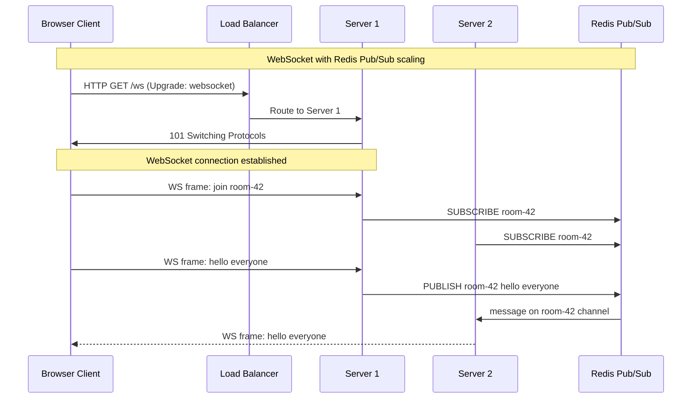
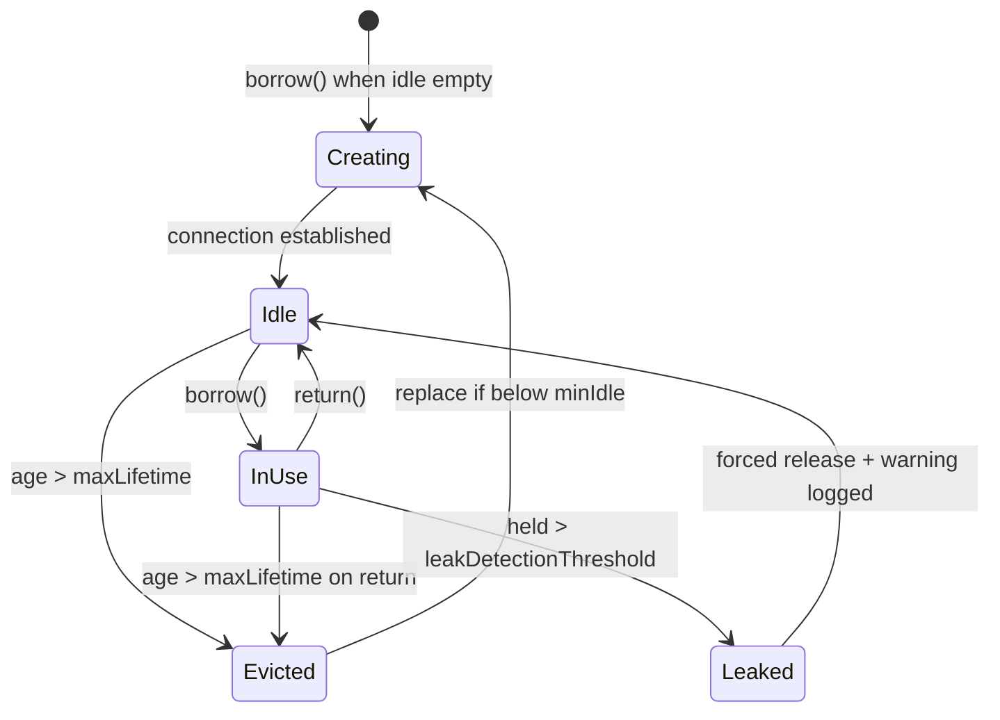

## Keywords in This File
{: .no_toc }

| # | Keyword | Weight |
|---|---|---|
| 12 | [WebSockets and Persistent Connections](#websockets-and-persistent-connections) | high |
| 13 | [Connection Pooling and Keep-Alive](#connection-pooling-and-keep-alive) | high |

---

# WebSockets and Persistent Connections

---
id: CN-012
title: "WebSockets and Persistent Connections"
category: Computer Networks
difficulty: ★★☆
interview_weight: high
seniority: mid-senior
tags: #websockets #persistent-connections #upgrade #full-duplex #real-time
---

## Quick Reference

**One-line definition:** WebSockets provide a full-duplex, persistent TCP connection initiated via an HTTP/1.1 Upgrade handshake, enabling the server to push data to the client at any time without polling, at the cost of a long-lived stateful connection per client.

**Difficulty:** ★★☆ | **Asked at:** Mid-Senior | **Seniority:** Mid through Senior

---

### 🎯 Model Answer

**30 seconds:**
WebSockets upgrade an HTTP/1.1 connection to a persistent, full-duplex channel. The client sends `Upgrade: websocket` and `Connection: Upgrade` headers; the server responds with 101 Switching Protocols; from that point both sides send frames freely in any order. Unlike HTTP request-response, the server can push data unprompted. The trade-off: each WebSocket connection holds a TCP socket open, so 1 million concurrent connections consume significant server resources.

**3 minutes:**
HTTP is request-response: the client initiates, the server responds, and the exchange ends. For real-time use cases (chat, live stock tickers, collaborative editors, game state), this model forces polling or long-polling, both of which add latency and overhead.

**WebSocket handshake:** The client sends a regular HTTP/1.1 GET with special headers: `Upgrade: websocket`, `Connection: Upgrade`, `Sec-WebSocket-Key` (random base64), and `Sec-WebSocket-Version: 13`. The server validates, generates `Sec-WebSocket-Accept` (SHA-1 of key + GUID), and returns 101. The underlying TCP connection is now a WebSocket; all subsequent bytes use the WebSocket frame format.

**Full-duplex frame format:** WebSocket frames have a 2-10 byte header with FIN bit, opcode (text=0x1, binary=0x2, ping=0x9, pong=0xA, close=0x8), masking key (client-to-server always masked; server-to-client unmasked), and payload length. Frames can be fragmented (continuation frames).

**Masking (client-to-server):** The WebSocket spec requires client-to-server frames to be XOR-masked with a 4-byte key sent in the frame header. This prevents cache poisoning attacks where a malicious WebSocket proxy reuses TCP connections with HTTP caches. Server-to-client frames are NOT masked - masking adds no security when the sender controls the key.

**Ping/pong heartbeat:** Either side sends Ping (0x9); the other must respond with Pong (0xA). Used to detect dead connections (not all TCP RST events propagate immediately). Production systems send a ping every 30-60 seconds and close the connection if no pong is received.

**State and scalability:** Each WebSocket is a stateful TCP connection to a specific server. Horizontal scaling requires sticky sessions (IP hash or cookie-based) at the load balancer, or externally-managed state (Redis Pub/Sub) so any server can handle any client. A server with 50K WebSocket connections and 1Kbps average traffic needs 50MB of socket buffers plus OS file descriptor capacity.

**Blank Mind Recovery:** WebSocket = HTTP upgrade to full-duplex TCP pipe. Say: "Client sends Upgrade: websocket, server says 101, now both sides can send frames anytime without waiting for a request."

---

### 📘 Concept Explanation

**Core concept:** WebSockets solve the HTTP polling problem by converting a one-shot HTTP connection into a persistent two-way channel.

**The polling problem:**

```
Polling (1 req/sec per client):
Client -> Server: GET /updates  every 1 second
Server -> Client: 200 {data: null}  (usually empty)
= 86400 empty HTTP requests per day per client

Long-polling:
Client -> Server: GET /updates (holds connection open)
Server -> Client: 200 {data: event}  (when ready)
Client -> Server: GET /updates  (immediately re-connects)
= latency = server processing time only
  but: headers repeated, conn setup every event

WebSocket (single connection):
Client -> Server: WS: upgrade
Server -> Client: 101 Switching Protocols
Server -> Client: frame{event: tick, price: 42}
Server -> Client: frame{event: tick, price: 43}
= zero polling overhead, sub-ms delivery
```

> **Code walkthrough:** WHAT IT SHOWS: the overhead reduction from polling through long-polling to WebSockets for real-time data. KEY MECHANISM: polling sends a full HTTP request+response cycle per interval; long-polling reduces wasted requests but re-establishes the connection after each event; WebSockets send only frame bytes after the one-time upgrade. WHY IT MATTERS: 10,000 polling clients each sending 1 request/second generate 10,000 TCP segments/second with zero business value; WebSockets generate traffic only when events occur. WHAT BREAKS: long-polling degrades on reverse proxies with read timeouts; many proxies close idle HTTP connections after 60-120 seconds, breaking long polls. TAKEAWAY: WebSockets are optimal for high-frequency events (> 1 event/minute per client); for low-frequency server push, SSE (Server-Sent Events) is simpler.

**WebSocket handshake:**

```
Client request:
GET /ws/live-prices HTTP/1.1
Host: api.example.com
Upgrade: websocket
Connection: Upgrade
Sec-WebSocket-Key: dGhlIHNhbXBsZSBub25jZQ==
Sec-WebSocket-Version: 13

Server response:
HTTP/1.1 101 Switching Protocols
Upgrade: websocket
Connection: Upgrade
Sec-WebSocket-Accept: s3pPLMBiTxaQ9kYGzzhZRbK+xOo=

Connection is now a WebSocket; HTTP no longer applies
```

> **Code walkthrough:** WHAT IT SHOWS: the complete HTTP/1.1 to WebSocket upgrade handshake headers. KEY MECHANISM: Sec-WebSocket-Key is a random 16-byte base64 value; the server computes SHA-1(key + "258EAFA5-E914-47DA-95CA-C5AB0DC85B11") and returns base64 as Sec-WebSocket-Accept; this proves the server understood the WebSocket upgrade and is not a plain HTTP server. WHY IT MATTERS: the handshake uses HTTP so it traverses existing HTTP firewalls, load balancers, and proxies without special configuration. WHAT BREAKS: reverse proxies that do not support the Upgrade header forward the 101 response incorrectly; nginx requires `proxy_http_version 1.1; proxy_set_header Upgrade $http_upgrade; proxy_set_header Connection "upgrade";`. TAKEAWAY: always configure WebSocket proxy headers explicitly in nginx/ALB; missing these causes the upgrade to fail silently.

**Frame format:**

```
WebSocket frame (simplified):
+--+--+---------+------+-----------+----------+
|FI|RS|  Opcode |MASK..|  Length   |  Payload |
|N |V |  (4b)   |(1b)  | (7/16/64b)|  (bytes) |
+--+--+---------+------+-----------+----------+

Opcodes:
  0x0 Continuation
  0x1 Text (UTF-8 payload)
  0x2 Binary (raw bytes)
  0x8 Close (with status code)
  0x9 Ping
  0xA Pong

Client -> Server: MASK=1 (XOR with 4-byte key)
Server -> Client: MASK=0 (unmasked)
```

> **Code walkthrough:** WHAT IT SHOWS: the WebSocket frame header structure and opcode table. KEY MECHANISM: the 2-10 byte frame header encodes all routing information; text frames carry UTF-8 strings, binary frames carry arbitrary bytes; close frames include a 2-byte status code (1000=normal, 1001=going away, 1011=server error). WHY IT MATTERS: binary frames are more efficient for structured data (use MessagePack or Protocol Buffers instead of JSON). WHAT BREAKS: sending UTF-8 text frames with invalid UTF-8 bytes causes the remote side to send a Close(1007=Invalid Frame Payload Data) and terminate the connection. TAKEAWAY: use binary frames for structured data; validate UTF-8 before sending text frames.

**Production architecture with Redis Pub/Sub:**

```
Without sticky sessions:
Client A (WS to Server 1) -> sends message
Server 1 -> no memory of Client A's session
-> message lost or error

With sticky sessions (nginx ip_hash):
Client A -> ALB -> Server 1 (always)
Client A (WS) -> Server 1 -> processes message

With Redis Pub/Sub (any server handles any client):
Client A (WS to Server 1) -> sends message
Server 1 -> publishes to Redis channel "room-42"
Server 2 (handles Client B in same room) ->
  subscribes to Redis "room-42" ->
  delivers to Client B's WebSocket
```

> **Code walkthrough:** WHAT IT SHOWS: two architectural patterns for WebSocket horizontal scaling. KEY MECHANISM: sticky sessions bind a client to a specific server using IP hash or cookie routing; the server holds in-memory state for that client. Redis Pub/Sub decouples message routing from server affinity - any server can receive a message and any server can deliver to the intended client. WHY IT MATTERS: sticky sessions fail during pod restarts (client must reconnect to a different server and re-establish state); Redis Pub/Sub is resilient to pod restarts at the cost of Redis latency. WHAT BREAKS: IP hash routing fails behind corporate NATs where many users share one IP - all NATted users go to the same server, creating uneven load. TAKEAWAY: prefer Redis Pub/Sub for production WebSocket scaling; use sticky sessions only for low-scale deployments where reconnection is acceptable.

The following sequence diagram shows a Redis Pub/Sub-based WebSocket fan-out across two server instances.



> **Diagram walkthrough:** WHAT IT DEPICTS: a chat-room style WebSocket architecture using Redis Pub/Sub to route messages across multiple servers. HOW TO READ IT: C is a browser on Server 1, another browser is on Server 2; both join room-42; C's message is published to Redis and delivered to Server 2's subscriber, which then pushes to its local WebSocket client. KEY RELATIONSHIP: Redis decouples publishing from delivery, allowing any server to serve any room without direct server-to-server communication. EDGE CASE: if Redis goes down, all cross-server message delivery fails; mitigate with Redis Sentinel or Cluster and graceful degradation to local-only messaging. INSIGHT: this pattern scales to thousands of servers with O(1) message delivery latency regardless of which server holds each client connection.

---

### 💻 Code Example

**BAD: Polling for real-time data (wasteful)**

```javascript
// BAD: polling every second - 86,400 requests/day
// Responses are empty when no update occurred
// CPU and network wasted on server AND client
setInterval(async () => {
  const resp = await fetch('/api/stock-price');
  const data = await resp.json();
  updateUI(data);
}, 1000);  // 1 req/sec regardless of updates
```

> **Code walkthrough:** WHAT IT SHOWS: the anti-pattern of interval polling for real-time data. KEY MECHANISM: setInterval fires every 1000ms; each call makes a full HTTP round trip - even when the server has nothing new to report. WHY IT MATTERS: 10,000 polling clients at 1 req/sec = 10,000 requests/sec server-side for zero data throughput under quiet conditions. WHAT BREAKS: if the server response takes > 1 second under load, intervals pile up; use setTimeout recursion instead of setInterval. TAKEAWAY: replace polling with WebSockets or SSE when update frequency exceeds 1 per 30 seconds per client.

**GOOD: Java WebSocket server (Spring WebFlux)**

```java
import org.springframework.web.reactive.socket
    .WebSocketHandler;
import org.springframework.web.reactive.socket
    .WebSocketSession;
import reactor.core.publisher.Mono;
import reactor.core.publisher.Flux;
import java.time.Duration;

@Component
public class StockPriceHandler
    implements WebSocketHandler {

    private final StockPriceService priceService;

    @Override
    public Mono<Void> handle(WebSocketSession session) {
        // Receive messages from client
        Mono<Void> receive = session.receive()
            .map(msg -> msg.getPayloadAsText())
            .flatMap(msg ->
                handleClientMessage(msg, session))
            .then();

        // Push price updates every 100ms
        Flux<WebSocketMessage> prices =
            Flux.interval(Duration.ofMillis(100))
                .flatMap(tick ->
                    priceService.getLatestPrices())
                .map(price ->
                    session.textMessage(
                        price.toJson()))
                .takeUntilOther(
                    session.closeStatus().then());

        Mono<Void> send = session.send(prices);
        // Run receive and send concurrently
        return Mono.zip(receive, send).then();
    }
}
```

> **Code walkthrough:** WHAT IT SHOWS: a reactive Spring WebFlux WebSocket handler that simultaneously receives client messages and pushes server updates. KEY MECHANISM: Mono.zip runs receive and send in parallel on the same session; price updates are emitted by Flux.interval and mapped to WebSocket text frames; takeUntilOther stops the price stream when the client closes. WHY IT MATTERS: the reactive model handles tens of thousands of concurrent WebSocket connections without a thread per connection. WHAT BREAKS: if priceService.getLatestPrices() blocks (e.g., JDBC call), it blocks the reactive thread pool; all service calls must be non-blocking. TAKEAWAY: in reactive WebSocket handlers, every I/O operation must return Mono/Flux; use a bounded elastic scheduler for blocking calls.

**Nginx WebSocket proxy configuration:**

```nginx
http {
    map $http_upgrade $connection_upgrade {
        default upgrade;
        ''      close;
    }

    server {
        listen 443 ssl;
        server_name api.example.com;

        location /ws/ {
            proxy_pass http://ws_backends;
            proxy_http_version 1.1;
            proxy_set_header Upgrade $http_upgrade;
            proxy_set_header Connection
                $connection_upgrade;
            proxy_set_header Host $host;
            # Prevent nginx closing idle WS conns
            proxy_read_timeout 3600s;
            proxy_send_timeout 3600s;
        }
    }

    upstream ws_backends {
        ip_hash;  # sticky sessions
        server backend1:8080;
        server backend2:8080;
        keepalive 1000;
    }
}
```

> **Code walkthrough:** WHAT IT SHOWS: complete nginx WebSocket proxy configuration with sticky sessions and idle timeout. KEY MECHANISM: the map directive sets Connection to "upgrade" when Upgrade header is present; proxy_http_version 1.1 is required for WebSocket upgrade; ip_hash ensures the same client always reaches the same backend. WHY IT MATTERS: without proxy_read_timeout 3600s, nginx closes idle WebSocket connections after 60 seconds, causing surprise disconnections. WHAT BREAKS: ip_hash fails for clients behind a shared NAT - all users from the same office IP go to one backend, creating hotspots. TAKEAWAY: prefer Redis Pub/Sub over ip_hash for production scale; ip_hash is only safe for low-scale or homogeneous traffic.

---

### 🎓 Answers by Seniority

**Junior / Mid-level answer:**
WebSockets upgrade an HTTP connection to a full-duplex, persistent channel using `Upgrade: websocket` and `Connection: Upgrade` headers. After the 101 response, both sides can send frames independently. Used for real-time features like chat, live dashboards, and collaborative editing. Nginx requires `proxy_set_header Upgrade $http_upgrade; proxy_set_header Connection "upgrade";` to proxy WebSocket connections.

**Senior / Staff answer:**
WebSockets solve real-time push at the cost of stateful connection management. I evaluate three tradeoffs: (1) WebSocket vs SSE - WebSockets are bidirectional; SSE is server-to-client only (simpler, uses regular HTTP, auto-reconnects). For most real-time dashboards, SSE is sufficient and far easier to operate. (2) Sticky sessions vs Pub/Sub - ip_hash in nginx breaks under NAT and is dangerous with rolling deployments; Redis Pub/Sub is operationally superior. (3) Frame protocol - JSON text frames are debuggable; binary frames with MessagePack reduce payload 40-60% at cost of inspectability. Production concerns: proxy idle timeout (set > heartbeat interval), file descriptor limits (ulimit -n must exceed connection count), heartbeat design (ping every 30s, close after 2 missed pongs), and graceful shutdown (send Close(1001) before pod termination).

---

### ⚠️ Common Misconceptions

**Misconception 1: "WebSockets work through all proxies and firewalls"**
WebSockets require HTTP Upgrade support in every proxy in the chain. Corporate proxies that only forward CONNECT (for HTTPS) silently strip Upgrade headers. The result is a 200 response (not 101) and a broken connection. Mitigation: fall back to long-polling (Socket.IO does this automatically).

**Misconception 2: "WebSocket connections are free resources"**
Each WebSocket holds a TCP socket with an OS file descriptor. The default ulimit on Linux is 1024; production servers need `ulimit -n 1000000`. At 50K connections, socket buffers alone consume ~800MB RAM.

**Misconception 3: "WebSockets are inherently more reliable than HTTP"**
WebSockets have no built-in reconnection. A TCP reset (network hiccup, pod restart, proxy timeout) terminates the connection permanently unless the client implements reconnection logic with exponential backoff.

**Misconception 4: "Server-Sent Events is obsolete since WebSockets exist"**
SSE is simpler (HTTP, no upgrade), auto-reconnects, has built-in event ID for resumption, and traverses all proxies without special configuration. For server-push dashboards (no client-to-server messages), SSE is the better choice.

---

### 🚨 Failure Modes and Diagnosis

**Failure 1: WebSocket upgrade fails with 400 Bad Request**

```bash
# Symptom: client gets 400 instead of 101
# Test handshake directly:
curl -v \
  -H "Upgrade: websocket" \
  -H "Connection: Upgrade" \
  -H "Sec-WebSocket-Key: dGhlIHNhbXBsZQ==" \
  -H "Sec-WebSocket-Version: 13" \
  https://api.example.com/ws/test 2>&1 \
  | grep -E "< HTTP|101|400|Upgrade"
```

> **Code walkthrough:** WHAT IT SHOWS: diagnosing WebSocket upgrade failure using curl to simulate the handshake. KEY MECHANISM: a 400 response from a proxy means the Upgrade header was stripped; nginx with proxy_http_version 1.1 and correct header forwarding passes the full upgrade request to the backend. WHY IT MATTERS: debugging WebSocket failures is harder than HTTP failures because the 400 error occurs during handshake before the JS WebSocket API fires an error event. WHAT BREAKS: AWS ALB supports WebSocket but the target group must use ws:// (not http://); using http:// causes the ALB to strip upgrade headers. TAKEAWAY: always test WebSocket upgrades with curl -H "Upgrade: websocket" before deploying; this catches proxy misconfiguration instantly.

**Failure 2: Connections drop after 60 seconds idle**

```bash
# Symptom: WebSocket connections close after exactly
# 60s of no traffic; client sees CloseEvent code 1006

# Cause 1: nginx default proxy_read_timeout = 60s
# Fix: proxy_read_timeout 3600s;

# Cause 2: ALB idle timeout = 60s by default
aws elbv2 modify-load-balancer-attributes \
  --load-balancer-arn arn:aws:... \
  --attributes \
  Key=idle_timeout.timeout_seconds,Value=3600

# Heartbeat to keep connections alive:
# Client: setInterval(() =>
#   ws.send(JSON.stringify({type:'ping'})),30000);
```

> **Code walkthrough:** WHAT IT SHOWS: two causes of 60-second WebSocket timeout and their fixes. KEY MECHANISM: nginx proxy_read_timeout (default 60s) and AWS ALB idle timeout (default 60s) both close connections that are silent for the configured duration; setting both to 3600s with a 30-second application heartbeat keeps connections alive during quiet periods. WHY IT MATTERS: CloseEvent code 1006 means the connection was reset without a proper Close frame - almost always a network timeout, not an application error. WHAT BREAKS: increasing ALB idle_timeout to 3600s means silent dead connections are not cleaned up promptly; combine with application-level ping/pong to detect dead connections in < 2 minutes. TAKEAWAY: set proxy timeout > 2x heartbeat interval; set heartbeat interval to 30s; close connection after 2 missed pong responses.

---

### 🎯 Interview Deep-Dive

| Format | Questions | Est. Time |
|---|---|---|
| Junior/Mid | 9 questions | 25-35 min |
| Senior/Staff | 9 questions + extensions | 40-50 min |

**Category: CONCEPT**

**[JUNIOR] Q1 - [CONCEPTUAL] What is the WebSocket upgrade process? What headers are involved?**

The WebSocket upgrade is a standard HTTP/1.1 request with special headers. The client sends:
- `Upgrade: websocket` - requests protocol switch
- `Connection: Upgrade` - signals upgrade intent
- `Sec-WebSocket-Key: <base64>` - random 16-byte value
- `Sec-WebSocket-Version: 13` - protocol version

The server responds with 101 Switching Protocols and:
- `Upgrade: websocket`
- `Connection: Upgrade`
- `Sec-WebSocket-Accept: <sha1-hash>` - SHA-1 of client key + fixed GUID, base64-encoded

After 101, the TCP connection is exclusively used for WebSocket frames. HTTP semantics no longer apply.

*What separates good from great:* Explaining WHY the Sec-WebSocket-Key/Accept exchange exists - it prevents cache poisoning by proving the server is a WebSocket endpoint, not an HTTP cache that mistook the upgrade request for a cached resource.

---

**[JUNIOR] Q2 - [CONCEPTUAL] What is the difference between WebSockets, Server-Sent Events, and long-polling?**

**Long-polling:** Client sends HTTP request; server holds it open until an event occurs; client immediately re-requests. Works through all proxies. Inefficient under high event rate (re-connection overhead per event).

**SSE (Server-Sent Events):** Server streams events over a single HTTP connection using `text/event-stream` content type. Server-to-client only (one direction). Built-in reconnection. Simple to implement. Works through HTTP proxies without special config.

**WebSockets:** Full-duplex TCP channel. Both directions. No built-in reconnection. Requires Upgrade support in proxies.

Choose by use case:
- Client sends commands, server pushes updates -> WebSocket
- Server pushes data only (dashboards) -> SSE
- Works-everywhere requirement -> SSE or long-polling

*What separates good from great:* Not treating WebSockets as the default - SSE handles 90% of server-push use cases with far less operational complexity.

---

**[MID] Q3 - [MECHANISM] Why must client-to-server WebSocket frames be masked? Why not server-to-client?**

Masking was introduced in RFC 6455 to prevent a cache-poisoning attack. Without masking, a malicious JavaScript page could:
1. Open a WebSocket connection to an intermediate proxy or cache
2. Send crafted bytes that look like an HTTP response
3. The proxy stores the "response" in its cache
4. Subsequent users get the malicious cached content

Masking with an unpredictable 4-byte key prevents the client from constructing specific byte sequences at the TCP level, because the actual bytes on the wire are XOR'd with an unknown key that is in the frame header so the recipient can unmask.

Server-to-client frames are not masked because the server is trusted - a malicious server can harm clients directly without needing cache poisoning.

*What separates good from great:* Knowing the specific attack masking prevents (cache poisoning, not confidentiality) - masking provides zero confidentiality since the key is in the same frame.

---

**Category: DEBUGGING**

**[SENIOR] Q4 - [DEBUGGING] WebSocket connections work in development but fail in production. How do you debug?**

Step 1: Classify the failure - does the upgrade (101) succeed?

```bash
curl -v --include \
  -H "Upgrade: websocket" \
  -H "Connection: Upgrade" \
  -H "Sec-WebSocket-Key: dGhlIHNhbXBsZQ==" \
  -H "Sec-WebSocket-Version: 13" \
  https://prod.example.com/ws/test 2>&1 \
  | grep -E "< HTTP|Upgrade|101"
```

> **Code walkthrough:** WHAT IT SHOWS: curl-based WebSocket handshake test to verify the 101 upgrade response in production. KEY MECHANISM: curl -v shows all request and response headers; 101 confirms the proxy chain forwards Upgrade correctly; 200 or 400 indicates a proxy stripping the headers. WHY IT MATTERS: this test runs outside the browser, ruling out browser-specific issues and isolating the network path. WHAT BREAKS: curl exits immediately after receiving 101 (it doesn't speak WebSocket frames); that is expected and acceptable for this test. TAKEAWAY: if curl gets 101 but the browser fails, the issue is TLS certificate or browser-specific proxy; if curl gets 400/502, the network proxy is the problem.

If upgrade fails: check every proxy in path (nginx, ALB, CDN) for WebSocket support. CDNs require explicit WebSocket origin rules.

If upgrade succeeds but connection drops: check timeouts (proxy_read_timeout, ALB idle_timeout). Check if heartbeat is implemented.

*What separates good from great:* Testing from outside the network to isolate whether the issue is the application or the network path.

---

**[SENIOR] Q5 - [DEBUGGING] You have 50,000 WebSocket connections and see increasing latency. What metrics do you check?**

In order of likelihood:

1. OS file descriptor exhaustion:

```bash
# Check current FD usage
cat /proc/$(pgrep java)/fdinfo | wc -l
# Check limit
ulimit -n
# Near limit: increase /etc/security/limits.conf
# * hard nofile 1000000
```

> **Code walkthrough:** WHAT IT SHOWS: diagnosing file descriptor exhaustion in a WebSocket server. KEY MECHANISM: each WebSocket connection consumes 1 OS file descriptor; at 50K connections on a server with default ulimit 65536, only 15K FDs remain for logs, databases, and JVM internals. WHY IT MATTERS: FD exhaustion causes accept() to fail silently, dropping new connections while existing ones continue. WHAT BREAKS: JVM processes need FDs for class files and JARs in addition to sockets; effective WebSocket capacity is (ulimit - 2000). TAKEAWAY: set ulimit -n to 10x expected connection count; monitor /proc/PID/fd count in Prometheus.

2. GC pauses (JVM servers): check GC logs for stop-the-world pauses > 200ms; during GC pause, heartbeat frames are not sent and clients may disconnect.

3. Thread pool saturation: if each WebSocket uses a thread (blocking model), 50K connections = 50K threads = OOM or context-switch storm; switch to reactive model.

4. Redis Pub/Sub lag: if using Redis for message fanout, check Redis slow log and pipeline backpressure.

*What separates good from great:* Ordering checks from OS-level (fastest to diagnose) to application to external dependencies; knowing GC pauses can silently kill WebSocket connections.

---

**Category: TRADE-OFF**

**[SENIOR] Q6 - [TRADE-OFF] When would you choose SSE over WebSockets?**

Choose SSE when:
1. **One-directional server push:** notifications, live dashboards, log tailing - no client-to-server messages needed.
2. **Proxy/firewall hostile environments:** SSE uses standard HTTP; traverses corporate proxies without configuration.
3. **Auto-reconnect requirement:** SSE has built-in reconnection with last-event-id.
4. **HTTP/2 multiplexing:** SSE over HTTP/2 multiplexes multiple event streams per connection.
5. **Simpler infrastructure:** no special proxy config, no sticky session overhead.

Choose WebSocket when:
1. **Bidirectional communication:** client sends data continuously (collaborative editor, game).
2. **Sub-100ms latency:** WebSocket frame overhead is minimal.
3. **Binary protocol:** binary frames with MessagePack are more efficient.

*What separates good from great:* SSE over HTTP/2 multiplexing - multiple SSE streams share one HTTP/2 connection, making SSE actually more efficient than WebSockets for pure server-push workloads on HTTP/2.

---

**[SENIOR] Q7 - [TRADE-OFF] How do you handle WebSocket reconnection and state recovery?**

```javascript
class ReconnectingWebSocket {
    constructor(url, options = {}) {
        this.url = url;
        this.minDelay = options.minDelay || 1000;
        this.maxDelay = options.maxDelay || 30000;
        this.attempt = 0;
        this.lastEventId = null;
        this.connect();
    }
    connect() {
        const url = this.lastEventId
            ? `${this.url}?last=${this.lastEventId}`
            : this.url;
        this.ws = new WebSocket(url);
        this.ws.onopen = () => {
            this.attempt = 0;
        };
        this.ws.onmessage = (e) => {
            const msg = JSON.parse(e.data);
            if (msg.id) this.lastEventId = msg.id;
            this.onmessage?.(msg);
        };
        this.ws.onclose = () => {
            const delay = Math.min(
                this.minDelay * 2 ** this.attempt,
                this.maxDelay);
            this.attempt++;
            setTimeout(() => this.connect(), delay);
        };
    }
}
```

> **Code walkthrough:** WHAT IT SHOWS: a reconnecting WebSocket client with exponential backoff and event ID tracking for state recovery. KEY MECHANISM: on close, the delay doubles each attempt up to maxDelay (30s); lastEventId is sent as a query parameter so the server can replay missed events. WHY IT MATTERS: without exponential backoff, a pod restart causes all 50K clients to reconnect simultaneously - a thundering herd that crashes the new pod. WHAT BREAKS: if the server does not support event ID replay, the client will miss events during disconnect. TAKEAWAY: implement both exponential backoff and event ID replay; missing either means data loss or reconnect storms.

*What separates good from great:* The thundering herd risk during pod restarts - without exponential backoff, all clients reconnect within 1 second, amplifying the load spike.

---

**Category: BEHAVIORAL**

**[SENIOR] Q8 - [BEHAVIORAL] Describe a WebSocket scaling challenge you encountered and how you resolved it.**

Situation: A live trading dashboard with 15,000 WebSocket clients started dropping connections during market open (9:30 AM EST) when price update volume spiked 10x.

Task: Maintain sub-500ms price update latency for all connected clients during peak load.

Action:
1. Profiled CPU: message serialisation (JSON.stringify per-client) was consuming 80% of CPU.
2. Solution: pre-serialise the shared JSON payload once and fan it out to all subscribers.
3. Identified Redis Pub/Sub as bottleneck: delivery to 10 server instances had growing queue depth.
4. Switched to Redis Streams with consumer groups for backpressure control.
5. Added backpressure: slow clients received less frequent updates instead of queuing.

Result: CPU dropped 60%, P99 latency stabilised at 120ms during market open, zero connection drops.

*What separates good from great:* Identifying per-client serialisation cost (CPU scales O(N) with clients if done naively) and the distinction between Redis Pub/Sub (broadcast, no consumer tracking) vs Redis Streams (consumer groups, backpressure).

---

**[STAFF] Q9 - [DESIGN] Design a WebSocket messaging system for 1 million concurrent connections.**

Architecture choices at 1M connections:

1. **Connection tier:** 20 servers x 50K connections each. Each server is an event loop (Node.js or Netty-based Java); one thread handles all connections via epoll. 50K connections x 16KB socket buffer = 800MB per server.

2. **Message routing:** Redis Cluster with 6 shards; each shard handles 1/6 of room channels. Message publish O(1); fan-out scales with subscriber count, not connection count.

3. **Connection registry:** Redis Hash: clientId -> serverId mapping for targeted delivery. TTL = heartbeat interval x 3.

4. **Backpressure:** slow clients get buffered up to 10 messages; beyond that, messages drop and client receives "missed N messages" catchup signal.

5. **OS tuning:**

```bash
echo "* hard nofile 1000000" >> \
  /etc/security/limits.conf
sysctl -w net.core.somaxconn=65535
```

> **Code walkthrough:** WHAT IT SHOWS: OS tuning required to support 50K+ WebSocket connections per server. KEY MECHANISM: nofile limit controls file descriptors (one per WebSocket); net.core.somaxconn sets the accept queue depth for TCP connections. WHY IT MATTERS: without these settings, a server accepting connections at 10K/second fills its accept queue in 6 seconds and drops new connections. WHAT BREAKS: ulimit changes in systemd services require LimitNOFILE in the unit file, not /etc/security/limits.conf. TAKEAWAY: verify FD limits in the exact process that runs the application - shell ulimit differs from systemd service limits.

6. **Graceful shutdown:** on SIGTERM, server publishes GOAWAY to all connected clients' channels; clients receive, disconnect, reconnect to another server; server waits for 0 connections before exiting.

*What separates good from great:* The backpressure and graceful shutdown designs - at 1M connections these are not optional; without them, reconnect storms make the system unstable during any planned or unplanned event.

---

### ⚖️ Comparison Table

| Property | WebSockets | SSE | Long-Polling | HTTP/2 Push |
|---|---|---|---|---|
| Direction | Bidirectional | Server-to-client | Server-to-client | Server-to-client |
| Protocol | WS (over TCP) | HTTP | HTTP | HTTP/2 |
| Proxy support | Requires Upgrade | Universal | Universal | HTTP/2 only |
| Reconnection | Manual | Built-in | Manual | N/A |
| Overhead | Frame header (2-10B) | HTTP event stream | Full HTTP round trip | PUSH_PROMISE |
| Binary support | Yes (native) | No (base64) | No | Yes |
| HTTP/2 multiplex | No | Yes | No | N/A |
| Browser support | All modern | All modern | All | Deprecated |
| Best use case | Bidirectional RT | Server-push only | Fallback | Not recommended |

> **Diagram walkthrough:** WHAT IT DEPICTS: comparison of four server-push mechanisms across key operational properties. HOW TO READ IT: rows are properties, columns are mechanisms. KEY RELATIONSHIP: WebSockets are uniquely bidirectional but require proxy support; SSE is simpler and works everywhere but is unidirectional; long-polling is the universally compatible fallback. EDGE CASE: HTTP/2 Server Push was removed from Chrome 106 (2022) - do not use for new projects. INSIGHT: Socket.IO automatically falls back through WebSocket to long-polling, making it resilient to proxy restrictions at the cost of complexity.

---

### 🏛️ System Design

*(Omit: ★★☆ difficulty - system design section targets ★★★ architectural keywords.)*

---

### 📊 Diagram

*(See Concept Explanation above; the Redis Pub/Sub WebSocket scaling sequence diagram appears in that section.)*

---
---

# Connection Pooling and Keep-Alive

---
id: CN-013
title: "Connection Pooling and Keep-Alive"
category: Computer Networks
difficulty: ★★☆
interview_weight: high
seniority: mid-senior
tags: #connection-pooling #keep-alive #tcp #http #performance
---

## Quick Reference

**One-line definition:** Connection pooling pre-establishes a set of reusable TCP (and TLS) connections to a backend, eliminating per-request handshake latency, while HTTP Keep-Alive allows multiple HTTP requests to share a single TCP connection without explicit pooling.

**Difficulty:** ★★☆ | **Asked at:** Mid through Senior | **Seniority:** Mid-Senior

---

### 🎯 Model Answer

**30 seconds:**
Connection pooling maintains a set of open connections to a database or service. Instead of opening a new TCP+TLS connection per request (1-3 RTTs of overhead), the caller borrows a connection from the pool, uses it, and returns it. HTTP Keep-Alive achieves the same for HTTP: the `Connection: keep-alive` header signals "don't close this TCP connection after the response." The critical failure mode: a pool sized too small causes connection wait timeouts; too large causes connection storms on backend restart.

**3 minutes:**
Every TCP connection requires a three-way handshake (1.5 RTT) and, for HTTPS, a TLS handshake (1 RTT). On a 10ms LAN, this is 25ms of setup overhead for a request that takes 5ms to serve. Multiply by 1000 requests/second and you're spending 5x more time on setup than service.

**HTTP Keep-Alive (HTTP/1.1 default):** HTTP/1.1 keeps connections open by default. The server can close with `Connection: close`. This allows connection reuse within a session without explicit pooling infrastructure.

**JDBC connection pooling:** Database connections are even more expensive - a PostgreSQL connection allocates a backend process (~5MB RAM) and requires authentication, SSL negotiation, and session parameter initialisation. A pool of 10 connections handles hundreds of concurrent requests by serialising database access through the pool.

**Pool sizing:** The optimal pool size is bounded by the backend's capacity, not the caller's load. For a PostgreSQL server: `connections = num_cores x 2 + effective_spindle_count`. A 4-core server with SSD supports ~9 connections efficiently; beyond this, lock contention on PostgreSQL's internal structures degrades throughput.

**Connection validation:** Stale connections occur when the network drops an idle TCP connection silently. Mitigation: `maxLifetime` setting recycles connections before server-side timeouts, or background validation queries.

**Blank Mind Recovery:** Connection pool = pre-warmed TCP connections; borrow and return like library books. Keep-Alive = same TCP connection for multiple HTTP requests. Size the pool for the server's core count, not request rate.

---

### 📘 Concept Explanation

**Core concept:** Connection pooling solves the per-connection establishment overhead by amortising handshake cost across many requests on the same connection.

**Cost breakdown without pooling:**

```
Per-request lifecycle (no pool):
1. DNS lookup: 0-50ms (cached after first)
2. TCP handshake (SYN/SYN-ACK/ACK): 1 RTT
3. TLS 1.3 handshake: 1 RTT
4. Application request + response: 1 RTT
5. TCP FIN/ACK: 0.5 RTT
Total: 3.5 RTT overhead + 1 RTT service

At 10ms RTT: 35ms overhead for a 10ms query
= 3.5x overhead penalty per request

With pool (connections pre-established):
4. Application request + response: 1 RTT
Total: 1 RTT
= 3.5x speedup
```

> **Code walkthrough:** WHAT IT SHOWS: the overhead breakdown for creating a new TCP+TLS connection vs using a pooled connection. KEY MECHANISM: the pool pre-completes steps 1-3 during initialisation; borrowers start at step 4; returning the connection skips step 5 entirely. WHY IT MATTERS: at 1000 requests/second, eliminating 3.5 RTT per request saves 3500 RTTs/second. WHAT BREAKS: if the pool is empty at peak load, requests block waiting - the queue grows faster than it drains, creating the classic pool starvation cascading failure. TAKEAWAY: always set pool connectionTimeout (reject after N ms, not queue forever) to prevent cascading pool starvation.

**HTTP Keep-Alive mechanics:**

```
HTTP/1.0 (no keep-alive by default):
TCP SYN -> GET /a HTTP/1.0
           200 OK (Connection: close)
TCP FIN   <- connection closed
TCP SYN -> GET /b HTTP/1.0  <- new TCP connection
           200 OK
TCP FIN   <- connection closed

HTTP/1.1 (keep-alive by default):
TCP SYN -> GET /a HTTP/1.1
           200 OK (keep-alive implied)
           GET /b HTTP/1.1  <- same TCP connection
           200 OK
           GET /c HTTP/1.1  <- same TCP connection
           200 OK
TCP FIN   <- close after idle timeout
```

> **Code walkthrough:** WHAT IT SHOWS: the contrast between HTTP/1.0 connection-per-request and HTTP/1.1 persistent connection reuse. KEY MECHANISM: HTTP/1.1 defaults to keep-alive; the server may limit reuse with `Keep-Alive: timeout=5, max=100` (close after 5 idle seconds or 100 requests). WHY IT MATTERS: a browser loading a page with 50 resources needs 50 TCP handshakes in HTTP/1.0; HTTP/1.1 keep-alive reduces this to 6-8 handshakes. WHAT BREAKS: HTTP/1.1 keep-alive allows only one in-flight request per connection at a time (no multiplexing); HTTP/2 multiplexing is the next level. TAKEAWAY: HTTP/1.1 keep-alive reduces connection count; connection pooling is the application-level solution that applies regardless of HTTP version.

**HikariCP pool configuration:**

```java
HikariConfig config = new HikariConfig();
config.setJdbcUrl(
    "jdbc:postgresql://db:5432/app");
config.setUsername("app");
config.setPassword(System.getenv("DB_PASS"));

// Pool size: db_cores * 2 + spindles
// 4-core PostgreSQL SSD -> 9 connections
config.setMaximumPoolSize(9);

// Minimum idle: keep connections warm
config.setMinimumIdle(3);

// Fail fast: 5s (not default 30s)
// prevents pool exhaustion cascade
config.setConnectionTimeout(5000);

// Recycle before MySQL 8h wait_timeout
config.setMaxLifetime(1800000);  // 30 min

// Detect leaked connections in dev
config.setLeakDetectionThreshold(2000);

DataSource ds = new HikariDataSource(config);
```

> **Code walkthrough:** WHAT IT SHOWS: production HikariCP configuration with correct sizing and failure-fast settings. KEY MECHANISM: maximumPoolSize=9 limits PostgreSQL backend processes (4 cores x 2 + 1); connectionTimeout=5000 fails fast instead of queuing for 30 seconds; maxLifetime=1800000 recycles connections before MySQL/Aurora's 8-hour wait_timeout closes them silently. WHY IT MATTERS: the default connectionTimeout=30000 (30 seconds) means pool starvation blocks all threads for 30 seconds before failing, exhausting the application thread pool; 5 seconds is sufficient to detect a problem. WHAT BREAKS: maximumPoolSize=100 doesn't help throughput and actively hurts PostgreSQL through lock contention. TAKEAWAY: size pools for the server (Hikari's formula), not the caller; more connections is not always better.

**Connection pool state machine:**

```
Pool lifecycle:
IDLE ──borrow──> IN-USE ──return──> IDLE
 |                   |
 |               maxLifetime
 |                   |
 v                   v
EVICTED <──────────────
 |
 v
NEW (replace with fresh connection)

Pool states at any moment:
Total = Idle + In-Use + Creating
Max = maximumPoolSize
```

> **Code walkthrough:** WHAT IT SHOWS: the state machine for individual connections within a pool. KEY MECHANISM: connections cycle between IDLE and IN-USE; maxLifetime recycles connections to prevent server-side stale detection; eviction creates a new connection to maintain pool size. WHY IT MATTERS: understanding the state machine explains why pool metrics (active, idle, pending) predict application performance. WHAT BREAKS: a connection stuck IN-USE forever (thread leak) fills the pool; leakDetectionThreshold logs a warning and releases stuck connections. TAKEAWAY: configure leakDetectionThreshold=2000 in development; monitor active pool connections; near-maxSize active connections is the early warning of cascade failure.

The following diagram shows the connection pool state transitions.



> **Diagram walkthrough:** WHAT IT DEPICTS: the complete connection lifecycle state machine within a HikariCP-style connection pool. HOW TO READ IT: each node is a connection state; arrows are transitions with the triggering event. KEY RELATIONSHIP: connections oscillate between Idle and InUse during normal operation; eviction and creation happen in the background. EDGE CASE: the Leaked state - a connection held beyond leakDetectionThreshold triggers a log warning and forced return, preventing pool exhaustion from thread leaks. INSIGHT: monitoring Idle vs InUse ratio reveals utilisation; all connections InUse with Pending > 0 is the leading indicator of pool starvation, visible 30-60 seconds before timeout errors.

---

### 💻 Code Example

**BAD: New connection per request (no pooling)**

```java
// BAD: creating a new DB connection per request
// Each call: TCP handshake + TLS + auth + setup
// = ~50ms overhead per 5ms query
@GetMapping("/users/{id}")
public User getUser(@PathVariable Long id)
    throws Exception {
    // NEW connection created every request
    try (Connection conn = DriverManager
            .getConnection(DB_URL, USER, PASS)) {
        PreparedStatement ps = conn
            .prepareStatement(
                "SELECT * FROM users WHERE id=?");
        ps.setLong(1, id);
        return mapToUser(ps.executeQuery());
    }
    // Connection closed -> TCP FIN
    // Next request: repeat the 50ms overhead
}
```

> **Code walkthrough:** WHAT IT SHOWS: the anti-pattern of creating a new database connection per HTTP request. KEY MECHANISM: DriverManager.getConnection() initiates a full TCP+TLS+auth handshake every invocation; at 200 req/sec this opens and closes 200 connections/sec, exhausting PostgreSQL's max_connections (default 100) within seconds. WHY IT MATTERS: PostgreSQL spawns a new OS process per connection; 200 connections/sec = 200 process forks/sec = OS scheduler thrashing. WHAT BREAKS: under load, PostgreSQL returns "FATAL: sorry, too many clients already" and rejects all further connections. TAKEAWAY: never create database connections in request handlers; always use a singleton pool.

**GOOD: HikariCP pooled connection**

```java
@Configuration
public class DataSourceConfig {

    @Bean
    @Primary
    public DataSource dataSource() {
        HikariConfig config = new HikariConfig();
        config.setJdbcUrl(
            "jdbc:postgresql://db:5432/app");
        config.setUsername("app");
        config.setPassword(
            System.getenv("DB_PASSWORD"));
        // Size for 4-core PostgreSQL SSD
        config.setMaximumPoolSize(9);
        config.setMinimumIdle(3);
        // Fail fast: 5s not 30s default
        config.setConnectionTimeout(5_000);
        // Recycle before MySQL 8h wait_timeout
        config.setMaxLifetime(1_800_000);
        // Detect leaked connections in dev
        config.setLeakDetectionThreshold(2_000);
        return new HikariDataSource(config);
    }
}

// Controller - borrows from pool, auto-returned
@GetMapping("/users/{id}")
public User getUser(@PathVariable Long id) {
    // Pool provides pre-authenticated connection
    return userRepository.findById(id)
        .orElseThrow(NotFoundException::new);
}
```

> **Code walkthrough:** WHAT IT SHOWS: correct HikariCP configuration as a Spring singleton DataSource with production settings. KEY MECHANISM: the DataSource bean is created once at startup; Spring Data JPA's transaction management ensures connections are returned after each transaction boundary; no explicit connection management in controllers. WHY IT MATTERS: with maximumPoolSize=9 and connectionTimeout=5s, the system handles 1000 req/sec with predictable latency - requests exceeding pool capacity fail within 5 seconds with a clear error. WHAT BREAKS: if @Bean is not @Primary and another DataSource bean exists, Spring may use the wrong bean and ignore pool settings. TAKEAWAY: configure leakDetectionThreshold=2000 in development to catch any code path that forgets to return a connection.

---

### 🎓 Answers by Seniority

**Junior / Mid-level answer:**
Connection pooling maintains pre-established connections to a database or service so each request doesn't pay TCP+TLS handshake overhead. HikariCP is the standard JDBC pool in Spring Boot. Key settings: `maximumPoolSize` (not too large - size for the database server's core count), `connectionTimeout` (fail fast, not 30s), `maxLifetime` (recycle connections before server-side timeout). HTTP Keep-Alive works similarly for HTTP connections - reuses the TCP socket across multiple requests.

**Senior / Staff answer:**
Connection pool sizing is one of the most misunderstood performance topics. The Hikari team's recommendation (db_cores x 2 + spindles) seems small but is correct: PostgreSQL contends on shared lock structures when connections exceed CPU count; more connections create more waits, not more throughput. I set connectionTimeout=5s (not 30s) so pool starvation manifests as fast failures (HTTP 503) rather than slow timeouts that cascade through upstream services. Production monitoring: `hikaricp.connections.active` and `hikaricp.connections.pending` via Micrometer; I alert when `pending > 0 for > 10 seconds` as the leading indicator of pool exhaustion. One failure mode that often surprises engineers: read replicas behind AWS RDS Proxy reset connections on failover, making all pool connections stale simultaneously; the fix is maxLifetime set to less than the RDS Proxy pin timeout.

---

### ⚠️ Common Misconceptions

**Misconception 1: "More pool connections = better performance"**
False above a threshold. For PostgreSQL on a 4-core server, 9 connections performs better than 100 because connections compete for shared lock structures (LockManager, ProcArray). The optimal size is bounded by the server's CPU count, not by request rate.

**Misconception 2: "HTTP/2 makes JDBC connection pooling unnecessary"**
HTTP/2 multiplexes HTTP streams on one TCP connection. But database connections (JDBC) are not HTTP/2 - each connection is a separate TCP connection with session state. JDBC pooling remains essential regardless of HTTP version.

**Misconception 3: "Connection keep-alive and connection pooling are the same thing"**
Keep-alive is an HTTP header that reuses an existing connection for the next request. Connection pooling is an application-level mechanism that pre-creates and manages connections. Pooling is independent of HTTP version and applies to any protocol (JDBC, Redis, gRPC).

**Misconception 4: "Pool validation (SELECT 1) is free"**
Test-on-borrow adds 0.5-2ms latency per borrow - significant at 10K requests/second. Use maxLifetime-based recycling instead; it validates in the background without blocking request processing.

---

### 🚨 Failure Modes and Diagnosis

**Failure 1: Connection pool exhaustion cascade**

```bash
# Symptom: "Connection is not available,
# request timed out after 30000ms"

# Step 1: check pool utilisation via Actuator
curl -s \
  http://localhost:8080/actuator/metrics/ \
  hikaricp.connections.pending

# Step 2: check what connections are doing
# (run from psql)
# SELECT count(*), state
# FROM pg_stat_activity GROUP BY state;
# "idle in transaction" = connection leak!
```

> **Code walkthrough:** WHAT IT SHOWS: a two-step workflow for diagnosing connection pool exhaustion. KEY MECHANISM: hikaricp.connections.pending shows requests blocked waiting for a connection; pg_stat_activity shows what pool connections are actually doing; "idle in transaction" means a transaction was opened but not committed - the connection is held until the transaction completes. WHY IT MATTERS: "idle in transaction" connections hold locks and block other queries; a single stalled request can cascade to exhaust the entire pool. WHAT BREAKS: these Actuator metrics require management.endpoints.web.exposure.include=metrics in application.properties. TAKEAWAY: monitor hikaricp.connections.pending; > 0 for 10+ seconds predicts imminent timeout errors.

**Failure 2: Silent connection staleness (half-open TCP)**

```bash
# Symptom: first request after idle period fails
# with "broken pipe"; subsequent requests succeed

# Cause: firewall silently dropped idle TCP conn
# Pool holds a dead socket; first write fails

# Fix 1: set maxLifetime below firewall idle timeout
# Firewall = 30 min -> maxLifetime = 25 min
# config.setMaxLifetime(1500000);

# Fix 2: enable JDBC keepalive at socket level
# config.addDataSourceProperty(
#   "tcpKeepAlive", "true");

# Verify TCP keepalive on socket:
ss -o state established dport = :5432
# "timer:(keepalive,...)" = keepalive active
```

> **Code walkthrough:** WHAT IT SHOWS: diagnosing half-open TCP connections causing intermittent first-request failures. KEY MECHANISM: cloud firewalls (AWS NAT Gateway idle timeout = 350s; many VPN gateways = 30 min) silently drop idle TCP connections; the pool holds a dead socket; the first request after idle writes to the dead socket, gets a TCP RST. WHY IT MATTERS: the user sees a single error every 25-30 minutes - very hard to reproduce in testing. WHAT BREAKS: OS-level TCP keepalive (default 7200s on Linux) is far too slow to help; application-level maxLifetime is the reliable fix. TAKEAWAY: set maxLifetime to 80% of the firewall's idle timeout; if unsure of the firewall timeout, set maxLifetime=25 minutes as a safe default.

---

### 🎯 Interview Deep-Dive

| Format | Questions | Est. Time |
|---|---|---|
| Junior/Mid | 9 questions | 25-35 min |
| Senior/Staff | 9 questions + follow-ups | 40-55 min |

**Category: CONCEPT**

**[JUNIOR] Q1 - [CONCEPTUAL] What is a connection pool and why is it necessary?**

A connection pool is a set of pre-established, reusable connections to a backend system (database, cache, service). It is necessary because connection establishment is expensive:
- TCP three-way handshake: 1.5 RTT
- TLS handshake: 1 RTT
- Database authentication and session setup: 0.5-1 RTT

At 10ms RTT, this is 35ms of overhead for every request. With a pool of 10 connections handling 1000 requests/second, this overhead is paid once at startup and amortised over all requests.

Beyond latency, databases like PostgreSQL spawn a new OS process per connection. Without pooling, 1000 requests/second = 1000 process forks/second, exhausting the server.

*What separates good from great:* Quantifying the overhead (35ms at 10ms RTT) and knowing the server-side cost of unmanaged connections (PostgreSQL process per connection).

---

**[JUNIOR] Q2 - [CONCEPTUAL] What is HTTP Keep-Alive and how does it relate to connection pooling?**

HTTP Keep-Alive (`Connection: keep-alive`) tells the server to not close the TCP connection after responding. HTTP/1.1 enables this by default.

Keep-Alive is passive: the existing connection is reused if the client makes another request on the same connection. Connection pooling is active: the application pre-creates a set of connections and manages their lifecycle explicitly.

Relationship:
- HTTP keep-alive = connection reuse at the HTTP protocol level
- Connection pool = connection management at the application level
- Both reduce handshake overhead by different mechanisms
- Pools apply to any protocol (JDBC, Redis, gRPC); keep-alive is HTTP-specific

*What separates good from great:* Distinguishing passive reuse (keep-alive) from active lifecycle management (pool) and knowing pools apply to non-HTTP protocols.

---

**[MID] Q3 - [MECHANISM] How does HikariCP determine the correct pool size? What is the Hikari sizing formula?**

HikariCP's recommended sizing formula:

`pool_size = (core_count * 2) + effective_spindle_count`

For a 4-core PostgreSQL server with SSD (1 effective spindle): `pool_size = 4 * 2 + 1 = 9`

The formula emerges from Little's Law applied to database connections: at saturation, a server's CPU cores can process connections concurrently; additional connections wait in a queue, adding contention without throughput gain. PostgreSQL's internal lock structures (LockManager, ProcArray) are shared across connections and become bottlenecks when connection count exceeds core count x2.

Practical implication: for a database handling 500 requests/second at 5ms average query time, 9 connections provide 9/0.005 = 1800 queries/second theoretical throughput - far more than needed. Adding 100 connections would not increase throughput and would degrade it through lock contention.

*What separates good from great:* Applying Little's Law to derive the formula rather than treating it as a magic number, and knowing more connections can actively degrade performance.

---

**Category: DEBUGGING**

**[SENIOR] Q4 - [DEBUGGING] How do you diagnose connection pool exhaustion in a Spring Boot application?**

Step 1 - Confirm pool exhaustion: look for `HikariPool-1 - Connection is not available` in logs.

Step 2 - Check pool metrics via Actuator:

```bash
# Requests waiting for connections
curl -s localhost:8080/actuator/metrics/ \
  hikaricp.connections.pending
# > 0 = pool is exhausted at this moment

# All connections in use?
curl -s localhost:8080/actuator/metrics/ \
  hikaricp.connections.active
# = maximumPoolSize = fully exhausted
```

> **Code walkthrough:** WHAT IT SHOWS: using Spring Actuator endpoints to diagnose pool exhaustion in real time. KEY MECHANISM: hikaricp.connections.pending counts requests blocked waiting for a connection; this counter going above zero is the earliest warning of pool starvation, visible 5-10 seconds before the first timeout errors appear in logs. WHY IT MATTERS: catching pending > 0 before timeouts allows investigation while connections are held. WHAT BREAKS: these metrics require management.endpoints.web.exposure.include=metrics in application.properties. TAKEAWAY: add alerting on hikaricp.connections.pending > 0 lasting > 5 seconds; this gives 25 seconds before timeout errors surface.

Step 3 - Find what holds connections: check PostgreSQL pg_stat_activity for "idle in transaction" - transactions opened but not committed. Check state_change timestamp for long-running idle transactions.

Step 4 - Determine root cause: slow queries, transaction leaks (missing try/finally or @Transactional rollback issue), or genuinely undersized pool.

*What separates good from great:* Going to pg_stat_activity immediately to see what pool connections are doing, not just inferring from application logs.

---

**[SENIOR] Q5 - [DEBUGGING] Intermittent connection errors occur only after a 30-minute idle period. What is the root cause?**

This is the half-open TCP connection pattern. The network path (VPC firewall, corporate firewall, NAT gateway) silently drops TCP connections after an idle timeout - typically 15-30 minutes. The pool holds a reference to a dead socket.

When a request borrows the stale connection and writes to it, it receives a TCP RST. HikariCP removes the bad connection and creates a new one; subsequent requests use the new connection. Result: first request after 30 minutes always fails with "broken pipe."

Fix priority:
1. Set `maxLifetime` to 80% of the firewall idle timeout (e.g., 24 minutes for a 30-minute firewall).
2. Enable JDBC-level keepalive (`tcpKeepAlive=true` for PostgreSQL JDBC driver).
3. Use `keepaliveTime` in HikariCP (sends a keepalive query on idle connections every N ms).

*What separates good from great:* Immediately identifying the half-open TCP pattern from the "only first request after idle" signature, without needing to reproduce the network timeout in a lab.

---

**Category: TRADE-OFF**

**[SENIOR] Q6 - [TRADE-OFF] What are the failure modes when a connection pool is sized too large vs too small?**

**Too small (e.g., maxPoolSize=3 for a busy service):**
- Requests queue waiting for connections
- Queue grows faster than it drains under load spikes
- connectionTimeout errors cascade to all upstream services
- Result: service degradation within seconds of load spike

**Too large (e.g., maxPoolSize=200 for a 4-core database):**
- PostgreSQL spawns 200 backend processes (200 x 5MB = 1GB RAM)
- Lock structure contention increases with connection count
- Context switching on DB server increases
- Reconnection burst after pod restart: 200 connections to re-establish
- Result: paradoxically lower throughput than a smaller pool

**Goldilocks (maxPoolSize=9 for 4-core DB):**
- 9 connections serving 1000+ requests/second
- DB server process count low; lock contention minimal
- Restart reconnection burst is manageable

*What separates good from great:* Knowing that oversizing is as harmful as undersizing; and the restart reconnection burst is a real operational risk - connection storms after pod restarts.

---

**[SENIOR] Q7 - [TRADE-OFF] How does AWS RDS Proxy change connection pool management?**

RDS Proxy sits between application pods and RDS, aggregating connections. Instead of each pod having its own pool, all pods share RDS Proxy's pool.

**Benefits:**
- Multiplexes 1000 application-level connections to 10 DB connections
- Handles RDS failover transparently (reconnects DB side without exposing disruption)
- Enables Lambda scale-to-zero (Lambda functions reuse proxy connections between invocations)

**Trade-offs:**
- Adds ~1ms latency per query (proxy round trip)
- Pinning: prepared statements and certain transaction modes "pin" a proxy connection to the DB, reducing multiplexing; avoid SET statements and explicit transaction isolation setting changes
- Additional cost (RDS Proxy pricing per vCPU)

**maxLifetime interaction:** Set application maxLifetime = proxy pin timeout x 0.8; otherwise application pools hold connections longer than the proxy expects, causing sudden connection resets.

*What separates good from great:* Knowing the pinning behavior - specific transaction modes force the proxy to dedicate a backend connection to one client, defeating multiplexing.

---

**Category: BEHAVIORAL**

**[SENIOR] Q8 - [BEHAVIORAL] Describe a connection pool failure you diagnosed and resolved.**

Situation: A Spring Boot microservice started throwing `HikariPool-1 - Connection is not available` every night at 2 AM, exactly 30 minutes into a low-traffic period.

Task: Diagnose and fix without reproducing in production.

Action:
1. Noted the 30-minute pattern - immediately suspected firewall idle timeout.
2. Checked AWS VPC and NAT Gateway documentation. Found the service called a legacy system behind a corporate VPN with a 30-minute idle TCP timeout.
3. Checked `maxLifetime` setting: it was the default 1800000ms (30 minutes exactly) - connections were being recycled exactly as the firewall dropped them, creating a race condition.
4. Fix: reduced `maxLifetime` to 1500000ms (25 minutes) and added `keepaliveTime=60000` (1-minute keepalive queries on idle connections).

Result: Zero connection errors during low-traffic windows for 60 days post-fix.

*What separates good from great:* Identifying the race condition between maxLifetime and firewall idle timeout - the textbook scenario that makes the first-request-after-idle pattern appear unpredictably.

---

**[STAFF] Q9 - [DESIGN] How would you design connection pooling for a multi-tenant SaaS with 1000 tenants and 100 databases?**

Challenge: 1000 tenants, each with their own database, means 1000 pools x 9 connections = 9000 active DB connections. At 5MB per PostgreSQL process: 45GB RAM just for database backends.

**Solution: tiered pool strategy**

Tier 1 - Active tenant pool (warm): the 50 tenants with current activity have dedicated pool entries (9 connections each = 450 total).

Tier 2 - Inactive tenant pool (lazy): the remaining 950 tenants share a connection-on-demand model - 0 idle connections; connections created on first request, returned after use, closed after 60 seconds idle.

```java
// Pseudo-code: tiered pool manager
public DataSource getPool(String tenantId) {
    if (activeTenants.contains(tenantId)) {
        return dedicatedPools.get(tenantId);
    }
    // Lazy: connect on demand, max 2 connections
    return lazyPoolFactory.create(
        tenantId,
        maxPoolSize(2),
        idleTimeout(60_000)
    );
}
```

> **Code walkthrough:** WHAT IT SHOWS: a tiered pool strategy that limits total DB connections at scale. KEY MECHANISM: only active tenants (determined by rolling 5-minute request count) have warm pools; inactive tenants create connections on demand and release after 60 seconds idle; total connections = 50 x 9 + ~200 (peak lazy borrows) = 650 instead of 9000. WHY IT MATTERS: 9000 always-open connections would require a 192-core database server at the 2 connections/core guideline. WHAT BREAKS: cold start for first inactive tenant request adds 25-50ms; mitigate with predictive warming - open connections 5 minutes before scheduled tenant batch jobs. TAKEAWAY: match pool lifecycle to tenant activity pattern; warm pools for active tenants, on-demand for inactive, evict pools when inactive for > 10 minutes.

*What separates good from great:* Quantifying the resource savings and identifying the cold start trade-off, then proposing predictive warming as the mitigation.

---

### ⚖️ Comparison Table

| Property | No Pooling | HTTP Keep-Alive | App Pool (Hikari) | PgBouncer/RDS Proxy |
|---|---|---|---|---|
| Setup overhead | Per request (3.5 RTT) | Per session | Once at startup | Once at proxy |
| Concurrent connections | N per request | Reused per client | Fixed pool size | Multiplexed |
| Staleness handling | None (new each time) | Server idle timeout | maxLifetime + recycle | Proxy-managed |
| Failover support | Full reconnect cost | Reconnect | Pool drain + refill | Transparent |
| Added latency | 3.5 RTT | ~0 (reuse) | ~0 (pool borrow) | ~1ms (proxy hop) |
| Protocol | Any | HTTP only | Any | DB-specific |
| Best for | Testing only | HTTP/1.1 requests | DB connections | Lambda, multi-tenant |

> **Diagram walkthrough:** WHAT IT DEPICTS: a spectrum of connection management strategies from no pooling to infrastructure-level proxy. HOW TO READ IT: rows are properties; columns are strategies in increasing sophistication. KEY RELATIONSHIP: each strategy reduces effective connection count at the server at the cost of some added complexity; RDS Proxy/PgBouncer provide strongest multiplexing but add a network hop. EDGE CASE: PgBouncer in transaction pooling mode is incompatible with prepared statements and session-level settings (SET, advisory locks) - verify compatibility before adoption. INSIGHT: most microservice architectures use app-level HikariCP; RDS Proxy becomes valuable when Lambda functions need database access or when connection count exceeds the database server's capacity.

---

### 🏛️ System Design

*(Omit: ★★☆ difficulty - system design section targets ★★★ architectural keywords.)*

---

### 📊 Diagram

*(See Concept Explanation above; the connection pool state machine Mermaid diagram appears in that section.)*
