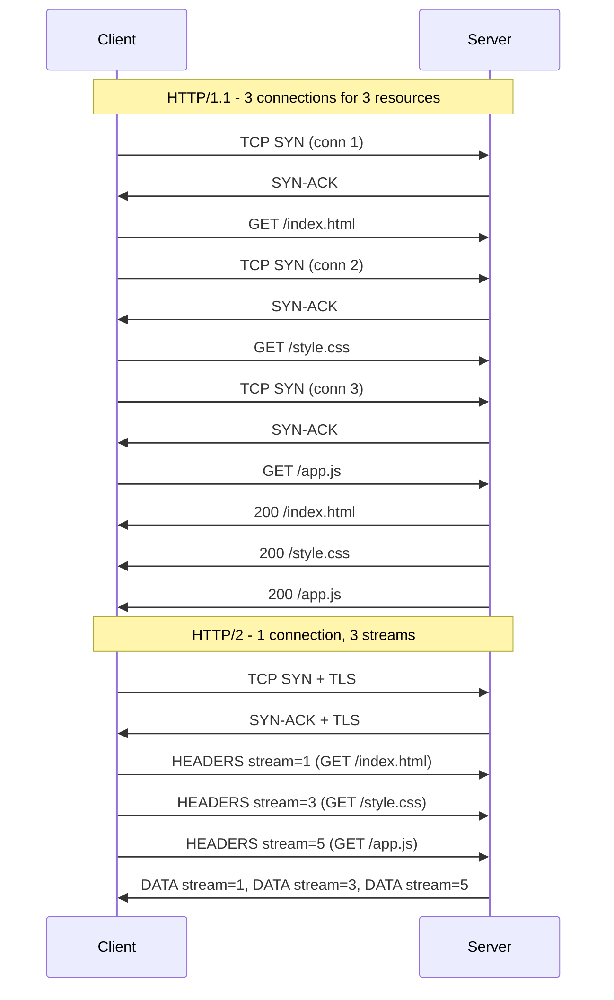

## Keywords in This File
{: .no_toc }

| # | Keyword | Weight |
|---|---|---|
| 10 | [HTTP/2: Multiplexing and Header Compression](#http2-multiplexing-and-header-compression) | high |
| 11 | [HTTP/3 and QUIC Protocol](#http3-and-quic-protocol) | high |

---

# HTTP/2: Multiplexing and Header Compression

---
id: CN-010
title: "HTTP/2: Multiplexing and Header Compression"
category: Computer Networks
difficulty: ★★☆
interview_weight: high
seniority: mid-senior
tags: #http2 #multiplexing #hpack #streams #head-of-line-blocking
---

## Quick Reference

**One-line definition:** HTTP/2 uses a single binary-framed TCP connection to carry multiple request/response streams concurrently, eliminating HTTP/1.1's per-request connection overhead and head-of-line blocking at the application layer, while HPACK header compression reduces redundant metadata transfer by 80-90%.

**Difficulty:** ★★☆ | **Asked at:** Mid-Senior | **Seniority:** Mid through Senior

---

### 🎯 Model Answer

**30 seconds:**
HTTP/2 multiplexes multiple logical streams over one TCP connection using binary frames. Each request gets a stream ID; frames from different streams are interleaved on the wire and reassembled at the receiver. HPACK compresses headers with a shared dynamic table, so repeated headers (like `Authorization`) send only an index after the first request. This removes the HTTP/1.1 need for 6-8 parallel TCP connections per domain and eliminates application-layer head-of-line blocking.

**3 minutes:**
HTTP/1.1 required one TCP connection per in-flight request (with persistent connections, one request per connection at a time). Browsers worked around this with domain sharding (multiple subdomains) and connection pools (6-8 per domain). HTTP/2 solves this at the protocol level.

**Binary framing layer:** HTTP/2 splits all communication into frames (HEADERS, DATA, SETTINGS, WINDOW_UPDATE, RST_STREAM, PING, GOAWAY). Each frame has a stream ID. Multiple streams are multiplexed over a single TCP connection - stream frames are interleaved, and endpoints reassemble them by stream ID.

**Stream lifecycle:** A client opens a stream by sending a HEADERS frame with an odd stream ID (1, 3, 5, ...). The server responds on the same stream ID. Streams progress through states: idle to open to half-closed (remote/local) to closed. RST_STREAM aborts a stream without closing the connection.

**HPACK compression:** HTTP/1.1 headers repeat on every request (User-Agent, Accept-Encoding, Cookie, Authorization). HPACK maintains a static table (61 common headers like `:method: GET`) and a dynamic table (headers seen in this session). Subsequent requests reference table entries by index (1-2 bytes) instead of re-sending full header strings. On typical requests this reduces header overhead from 800-1400 bytes to 50-100 bytes.

**Flow control:** HTTP/2 has two levels of flow control - connection-level (total bytes in flight across all streams) and stream-level (bytes in flight per stream). The receiver advertises its buffer size via WINDOW_UPDATE frames. This prevents a fast sender from overwhelming a slow receiver without TCP-level back-pressure.

**Server push:** The server can proactively push resources (PUSH_PROMISE + DATA frames) the client has not requested yet. In practice, browser support is inconsistent and HTTP/3 deprecated it. Prefer `Link: <url>; rel=preload` headers instead.

**Remaining limitation - TCP head-of-line blocking:** HTTP/2 eliminates application-layer HOL blocking but TCP still delivers data in order. A single lost packet blocks ALL streams until the retransmission arrives. This is why HTTP/3 replaced TCP with QUIC.

**Blank Mind Recovery:** HTTP/2 = one TCP connection, many streams, binary frames, HPACK headers. Say: "HTTP/1.1 needs 6 connections to parallelise; HTTP/2 multiplexes 100 streams on 1 connection with binary frames and compressed headers."

---

### 📘 Concept Explanation

**Core concept:** HTTP/2 is a binary multiplexed protocol that replaces HTTP/1.1's text-based request-response pipeline with a stream-per-request model over a single TCP connection.

**Why it exists - the HTTP/1.1 problem:**

```
HTTP/1.1 bottleneck:
Connection 1: GET /index.html   [waiting]
Connection 2: GET /style.css    [waiting]
Connection 3: GET /app.js       [waiting]
Connection 4: GET /logo.png     [waiting]
Connection 5: GET /font.woff    [waiting]
Connection 6: GET /api/data     [waiting]
(6 TCP connections, 3-way handshakes each)
```

> **Code walkthrough:** WHAT IT SHOWS: the HTTP/1.1 parallel connection workaround browsers use. KEY MECHANISM: each connection requires a TCP three-way handshake (1.5 RTT) and optionally a TLS handshake (1 RTT), meaning 6 connections on a 100ms link incur 600ms of setup overhead before the first byte of content. WHY IT MATTERS: on high-latency mobile connections this setup cost dominates page load time and cannot be reduced without changing the protocol. WHAT BREAKS: domain sharding (spreading assets across cdn1.example.com, cdn2.example.com) doubled available connections at the cost of extra DNS lookups - HTTP/2 makes sharding an anti-pattern. TAKEAWAY: HTTP/1.1 parallelism is achieved by multiplying connections; HTTP/2 achieves it by multiplying streams on one connection.



> **Diagram walkthrough:** WHAT IT DEPICTS: the contrast between HTTP/1.1 three-connection setup and HTTP/2 single-connection multiplexing. HOW TO READ IT: the top half shows three separate TCP handshakes before any GET request is sent; the bottom half shows one handshake followed by three concurrent HEADERS frames on stream IDs 1, 3, 5. KEY RELATIONSHIP: HTTP/2 saves 2 TCP handshakes (roughly 4 round trips saved on handshake alone at 100ms RTT). EDGE CASE: connection setup still costs one TLS round trip in HTTP/2; HTTP/3 (QUIC) collapses this to 0-RTT. INSIGHT: the stream IDs use odd numbers from the client side; even IDs are reserved for server push streams.

**Binary framing:**

```
HTTP/1.1 (text, hard to parse):
GET /path HTTP/1.1\r\n
Host: example.com\r\n
\r\n

HTTP/2 frame (binary, fixed format):
+-----------------------------------------------+
|                Length (24 bits)               |
+---------------+---------------+---------------+
|   Type (8)    |   Flags (8)   |
+-+-------------+---------------+--------...----+
|R|        Stream ID (31 bits)                  |
+=+=============+===============+========...====+
|              Frame Payload                    |
+-----------------------------------------------+
```

> **Code walkthrough:** WHAT IT SHOWS: the structural difference between HTTP/1.1 text headers and HTTP/2 binary frame layout. KEY MECHANISM: HTTP/2 frames have a fixed-length 9-byte header with Type, Flags, and Stream ID fields, allowing any parser to skip or route frames without understanding their payload. WHY IT MATTERS: binary framing is the foundation of multiplexing - frames from different streams can be interleaved because each carries its own stream ID. WHAT BREAKS: HTTP/2 frames cannot be read with nc or curl -v directly; you need nghttp or Wireshark's HTTP/2 dissector. TAKEAWAY: binary framing enables zero-copy routing of frames by stream ID without re-parsing headers.

**Stream multiplexing:**

```
HTTP/2 wire (interleaved frames, one TCP conn):
[HEADERS s=1][HEADERS s=3][HEADERS s=5]
[DATA s=3 chunk1][DATA s=1 chunk1]
[DATA s=5 chunk1][DATA s=1 chunk2]
[DATA s=3 chunk2][DATA s=1 END_STREAM]
[DATA s=5 END_STREAM][DATA s=3 END_STREAM]
```

> **Code walkthrough:** WHAT IT SHOWS: frame interleaving across three concurrent streams on one TCP connection. KEY MECHANISM: the sender writes frames from any stream into the TCP send buffer without waiting for previous streams to complete; the receiver demultiplexes by stream ID. WHY IT MATTERS: a slow response (stream 1) does not block fast responses (streams 3, 5) - application-level HOL blocking is eliminated. WHAT BREAKS: TCP retransmissions still stall all streams; on lossy networks (> 2% loss) HTTP/2 can be slower than HTTP/1.1 with multiple connections. TAKEAWAY: multiplexing is only as good as the underlying transport; on lossy links HTTP/3 QUIC delivers the same benefit at the transport level.

**HPACK header compression:**

```
Request 1 (full headers, dynamic table built):
:method: GET         <- ~10 bytes
:path: /api/users    <- ~16 bytes
:authority: api.example.com  <- ~28 bytes
authorization: Bearer eyJ... <- ~350 bytes
accept: application/json     <- ~26 bytes
user-agent: Mozilla/5.0...   <- ~40 bytes
Total: ~850 bytes sent on wire

Request 2 (only changes; repeated = 1-2 byte index):
:method: GET         <- 1 byte (static table idx 2)
:path: /api/orders   <- ~16 bytes (new path literal)
:authority: ...      <- 1 byte (dynamic table idx 62)
authorization: ...   <- 1 byte (dynamic table idx 63)
accept: ...          <- 1 byte (dynamic table idx 64)
user-agent: ...      <- 1 byte (dynamic table idx 65)
Total: ~22 bytes sent on wire
```

> **Code walkthrough:** WHAT IT SHOWS: HPACK reducing header overhead from ~850 bytes to ~22 bytes on repeated requests. KEY MECHANISM: after the first request builds the dynamic table, repeated headers (Authorization, User-Agent, Accept, Host) are sent as 1-2 byte indices; HPACK also uses Huffman coding on literal values achieving ~40% compression. WHY IT MATTERS: on mobile APIs making 50 requests per page, 800-byte headers becomes 22 bytes - a 97% reduction in header overhead. WHAT BREAKS: HPACK is stateful; the dynamic table must stay synchronised between client and server; connection drops reset it and the first request after reconnect pays full header cost. TAKEAWAY: HPACK benefits amortise over the session; maximise connection reuse to maximise compression benefit.

**TCP HOL blocking (still present in HTTP/2):**

```
Packet loss scenario on HTTP/2:
Stream 1 data: [frame 1a][frame 1b][LOST][frame 1d]
Stream 3 data: [frame 3a][frame 3b][frame 3c]
Stream 5 data: [frame 5a][frame 5b][frame 5c]

TCP kernel: holds ALL received data in recv buffer
until retransmit of frame 1c (lost packet) arrives
-> streams 3 and 5 data cannot be delivered to app
-> all 3 streams stalled by one lost packet in stream 1
```

> **Code walkthrough:** WHAT IT SHOWS: TCP retransmission stalling all HTTP/2 streams even when their data arrived intact. KEY MECHANISM: TCP delivers a byte stream in order; packet N lost means packets N+1 onward sit in the receive buffer until N arrives via retransmit, stalling the entire connection regardless of which stream the lost bytes belonged to. WHY IT MATTERS: on mobile networks with 2-5% loss, HTTP/2 with 100 streams on one connection blocks more often than HTTP/1.1 with 6 independent connections. WHAT BREAKS: heavily multiplexed connections on lossy links amplify HOL blocking; each additional stream increases the probability that some stream has an in-flight loss. TAKEAWAY: HTTP/2 solves application-layer HOL but not transport-layer HOL; HTTP/3 QUIC solves both.

**Performance conditions:**

| Condition | HTTP/1.1 | HTTP/2 |
|---|---|---|
| Low latency, no loss | Slower (6 conns) | Faster (1 conn) |
| High latency (100ms RTT) | Very slow | Fast |
| 0% packet loss | Multiple connections | Single connection |
| 2% packet loss | Degrades per connection | Can degrade all streams |
| Many small requests | High setup overhead | Excellent |
| Large file downloads | Adequate | Similar |

> **Diagram walkthrough:** WHAT IT DEPICTS: relative HTTP/1.1 vs HTTP/2 performance across network conditions. HOW TO READ IT: rows are network scenarios, columns are protocol performance. KEY RELATIONSHIP: HTTP/2 excels on high-latency, zero-loss networks (corporate WAN, mobile with good signal); it loses its advantage on lossy connections. EDGE CASE: HTTP/2 on localhost benchmarks often shows no improvement because the bottleneck is CPU or application layer. INSIGHT: the real-world gain comes from eliminating TCP connection setup on high-latency links, not from parallelism alone.

**Analogies:**
- HTTP/1.1 = a single-lane checkout (one item per lane, multiple lanes)
- HTTP/2 = a conveyor belt with labelled packages (multiple items, one belt)
- TCP HOL blocking = the belt jams when one package label tears off

**Mental model:**
> HTTP/2 is a stream ID router over one TCP pipe. Every frame carries a stream ID. The connection is just a byte pipe; the protocol adds a thin routing layer on top. When you see performance issues, ask: "Is TCP dropping packets?" because packet loss collapses all the multiplexing benefit.

---

### 💻 Code Example

**BAD: Domain sharding - HTTP/1.1 trick that hurts HTTP/2**

```java
// BAD: domain sharding to get more parallel connections
// With HTTP/1.1 this helped; with HTTP/2 it hurts
// (each hostname = separate HTTP/2 connection)
// -> no HPACK table sharing across hostnames
// -> extra DNS lookups, extra TLS handshakes
String[] cdnShards = {
    "https://cdn1.example.com/style.css",
    "https://cdn2.example.com/app.js",
    "https://cdn3.example.com/logo.png"
};
// Each CDN hostname requires a separate HTTP/2 connection
// with a separate HPACK dynamic table
```

> **Code walkthrough:** WHAT IT SHOWS: domain sharding - an HTTP/1.1 performance optimisation - becoming an active anti-pattern under HTTP/2. KEY MECHANISM: HTTP/2 can share HPACK compression state only within a single connection; different hostnames force separate connections and separate HPACK dynamic tables, negating header compression. WHY IT MATTERS: CDNs configured for sharding in the HTTP/1.1 era will create more connections under HTTP/2, not fewer. WHAT BREAKS: migrating to HTTP/2 without removing domain sharding can produce worse performance than HTTP/1.1 on header-heavy APIs. TAKEAWAY: audit CDN origin configuration when enabling HTTP/2; consolidate origins.

**GOOD: Java 11+ HttpClient with HTTP/2 multiplexing**

```java
import java.net.URI;
import java.net.http.HttpClient;
import java.net.http.HttpRequest;
import java.net.http.HttpResponse;
import java.util.List;
import java.util.concurrent.CompletableFuture;

public class Http2Client {

    // Single client reused - shares one HTTP/2 connection
    private static final HttpClient CLIENT =
        HttpClient.newBuilder()
            .version(HttpClient.Version.HTTP_2)
            .build();

    public static void fetchConcurrent() {
        List<String> paths = List.of(
            "/api/users",
            "/api/orders",
            "/api/products",
            "/api/inventory"
        );

        // All 4 requests share ONE TCP+TLS connection
        // Frames interleaved; headers HPACK-compressed
        List<CompletableFuture<HttpResponse<String>>> futures =
            paths.stream()
                .map(path -> HttpRequest.newBuilder()
                    .uri(URI.create(
                        "https://api.example.com" + path))
                    .build())
                .map(req -> CLIENT.sendAsync(
                    req,
                    HttpResponse.BodyHandlers.ofString()))
                .toList();

        CompletableFuture.allOf(
            futures.toArray(new CompletableFuture[0]))
            .join();

        futures.forEach(f -> {
            HttpResponse<String> r = f.join();
            System.out.printf(
                "version=%s path=%s status=%d%n",
                r.version(),
                r.request().uri().getPath(),
                r.statusCode());
        });
    }
}
```

> **Code walkthrough:** WHAT IT SHOWS: Java 11 HttpClient configured for HTTP/2, sending four concurrent API requests over a single connection. KEY MECHANISM: HttpClient.Version.HTTP_2 sets the ALPN preference to h2 during TLS negotiation; sendAsync returns immediately and all four requests are framed and multiplexed by the client's connection pool. WHY IT MATTERS: reusing the same HttpClient instance is essential - each new instance creates new connections; sharing one instance enables multiplexing and HPACK table sharing. WHAT BREAKS: creating a new HttpClient per request defeats HTTP/2 completely and adds TLS handshake overhead per request. TAKEAWAY: treat HttpClient as a long-lived singleton; never create it per-request.

**Nginx HTTP/2 configuration:**

```nginx
server {
    listen 443 ssl http2;
    server_name api.example.com;

    ssl_certificate /etc/ssl/certs/example.crt;
    ssl_certificate_key /etc/ssl/private/example.key;

    # ALPN negotiation is automatic with 'http2' keyword

    # HTTP/2 tuning
    http2_max_concurrent_streams 128;
    # Max streams per connection (default 128)

    http2_idle_timeout 3m;
    # Close idle HTTP/2 connections after 3 minutes

    location /api/ {
        proxy_pass http://backend_pool;
        # nginx uses HTTP/1.1 to backends by default
        # (gRPC backends need grpc_pass directive)
    }
}
```

> **Code walkthrough:** WHAT IT SHOWS: production nginx configuration enabling HTTP/2 for client connections. KEY MECHANISM: the http2 keyword on the listen directive adds h2 to the ALPN extension list during TLS handshake; nginx terminates HTTP/2 at the edge and uses HTTP/1.1 to upstream backends. WHY IT MATTERS: nginx HTTP/2-to-HTTP/1.1 translation is the most common production topology and means backend services do not need HTTP/2 support. WHAT BREAKS: if http2_max_concurrent_streams is set too low, clients with many concurrent requests receive RST_STREAM (stream refused) errors instead of queuing. TAKEAWAY: HTTP/2 at the edge (nginx or ALB) is often sufficient; end-to-end HTTP/2 adds complexity unless backends are gRPC services.

---

### 🎓 Answers by Seniority

**Junior / Mid-level answer:**
HTTP/2 multiplexes multiple requests over a single TCP connection using binary frames and stream IDs, unlike HTTP/1.1 which requires one connection per in-flight request. HPACK compression reduces header overhead by 80-90% for repeated headers. In practice, HTTP/2 improves page load time by eliminating the overhead of opening 6+ TCP connections. Java 11's HttpClient supports HTTP/2 natively via ALPN.

**Senior / Staff answer:**
HTTP/2 solves three HTTP/1.1 pathologies: connection-count bottleneck (6-8 connections per domain), redundant header transfer (HPACK dynamic tables compress repeated headers to 1-2 bytes), and request-level HOL blocking (streams are interleaved, not serialised). The critical nuance is TCP-level HOL blocking - a single lost packet blocks ALL streams until retransmission, which is why HTTP/3 replaced TCP with QUIC. In production I watch for: (1) load balancers that terminate HTTP/2 at the edge but use HTTP/1.1 to backends, potentially losing multiplexing benefits for gRPC; (2) HPACK table desync after connection drops in stateful API gateways; (3) misconfigured http2_max_concurrent_streams causing RST_STREAM floods under load. HTTP/2 is not universally faster - on lossy mobile networks with 100+ stream connections, HTTP/1.1 with 6 independent connections can outperform HTTP/2 because each degrades independently.

---

### ⚠️ Common Misconceptions

**Misconception 1: "HTTP/2 is always faster than HTTP/1.1"**
HTTP/2 is faster on high-latency, low-loss networks. On high-loss networks (> 2% packet loss), TCP HOL blocking causes HTTP/2 to block all streams simultaneously while HTTP/1.1's separate connections degrade independently. Always measure on realistic network conditions.

**Misconception 2: "HPACK means requests have no headers"**
HPACK compresses headers; it does not remove them. The dynamic table must be built on the first request. A connection frequently dropped and re-established loses the compression benefit entirely.

**Misconception 3: "HTTP/2 requires TLS"**
The spec allows HTTP/2 over plain TCP (h2c). But all major browsers require TLS for HTTP/2. In practice, HTTP/2 equals TLS. Internal gRPC over h2c (plaintext) is common in Kubernetes clusters.

**Misconception 4: "Server push is useful for production"**
Browser support was inconsistent; Chrome removed HTTP/2 server push in 2022. Use `Link: <url>; rel=preload` response headers instead for resource hints.

**Misconception 5: "HTTP/2 eliminates the need for CDN caching"**
HTTP/2 reduces connection overhead but not origin server load. CDN caching remains essential and HTTP/2 improves CDN connection reuse to origin.

---

### 🚨 Failure Modes and Diagnosis

**Failure 1: HTTP/2 silently downgraded to HTTP/1.1**

```bash
# Symptom: expected HTTP/2 gains not observed
# curl shows "HTTP/1.1 200" despite --http2 flag

# Diagnose ALPN negotiation
openssl s_client -alpn h2 \
  -connect api.example.com:443 < /dev/null 2>&1 \
  | grep -i "ALPN\|protocol"
# "No ALPN negotiated" = server does not support h2

# Check AWS ALB target group
aws elbv2 describe-target-groups \
  --query "TargetGroups[].ProtocolVersion"
# "HTTP1" = ALB uses HTTP/1.1 to backends
# "HTTP2" = ALB uses HTTP/2 to backends

# Fix nginx: add 'http2' keyword to listen directive
# Fix ALB: set target group protocol version to HTTP2
```

> **Code walkthrough:** WHAT IT SHOWS: diagnosing silent HTTP/2 downgrade using openssl and AWS CLI. KEY MECHANISM: ALPN is a TLS extension where the client offers h2 and the server selects http/1.1 if it does not support HTTP/2; the fallback is transparent to application code. WHY IT MATTERS: HTTP/2 downgrade is invisible to the application - responses arrive correctly but slower, making it hard to detect without explicit protocol-level checks. WHAT BREAKS: AWS ALB supports HTTP/2 on the listener side but defaults to HTTP/1.1 on the target group side; gRPC services fail completely on HTTP/1.1. TAKEAWAY: verify ALPN negotiation at each network hop using openssl, not just at the browser or curl output.

**Failure 2: RST_STREAM flood under load**

```bash
# Symptom: HTTP client errors "stream reset by peer"
# or gRPC "REFUSED_STREAM" errors under load

# Check server's max concurrent streams
nghttp -v https://api.example.com/health 2>&1 \
  | grep "SETTINGS"
# Look for SETTINGS_MAX_CONCURRENT_STREAMS value

# nginx fix:
# http2_max_concurrent_streams 256;

# gRPC Java server fix:
# serverBuilder.maxConcurrentCallsPerConnection(500);
```

> **Code walkthrough:** WHAT IT SHOWS: diagnosing RST_STREAM errors caused by exceeding the server's concurrent stream limit. KEY MECHANISM: the HTTP/2 SETTINGS frame advertises SETTINGS_MAX_CONCURRENT_STREAMS; when the client exceeds this, the server sends RST_STREAM with REFUSED_STREAM error code (retryable). WHY IT MATTERS: default stream limits are conservative and commonly hit when adding HTTP/2 without tuning. WHAT BREAKS: gRPC clients interpret REFUSED_STREAM as retryable, causing retry storms if limits are too low under load. TAKEAWAY: set max_concurrent_streams based on thread pool size and expected RPS; monitor using Prometheus http2_streams_total metric.

**Failure 3: HPACK desync after pod restart**

```
Symptom: "COMPRESSION_ERROR" in HTTP/2 responses
         Connection closed after encoding error

Root cause: dynamic table state must match between
  client and server. Abruptly killed server worker
  (SIGKILL) loses table state while client still holds
  references to table entries that no longer exist.

Fix:
  - Send GOAWAY frame before shutdown to allow graceful
    drain (HTTP/2 GOAWAY announces last stream ID served)
  - Kubernetes: add preStop lifecycle hook:
    lifecycle:
      preStop:
        exec:
          command: ["/bin/sh","-c","sleep 5"]
  - nginx: use 'graceful_shutdown_timeout' before kill
```

> **Code walkthrough:** WHAT IT SHOWS: HPACK desync from Kubernetes rolling deployments that SIGKILL pods. KEY MECHANISM: HPACK tables are per-connection state; abrupt pod termination without GOAWAY causes the client's dynamic table references to mismatch the new connection's empty table, resulting in COMPRESSION_ERROR at the connection level. WHY IT MATTERS: this closes the entire HTTP/2 connection (affecting all in-flight streams), not just the affected stream - one pod restart can abort hundreds of concurrent requests. WHAT BREAKS: Kubernetes default termination sends SIGTERM then SIGKILL after 30s; if the application catches SIGTERM and drains, GOAWAY is sent; if it exits without draining, HPACK desync occurs. TAKEAWAY: always implement graceful HTTP/2 shutdown with GOAWAY and stream drain before pod termination.

---

### 🎯 Interview Deep-Dive

| Format | Questions | Est. Time |
|---|---|---|
| Junior/Mid | 9 questions | 25-35 min |
| Senior/Staff | 9 questions + extensions | 40-55 min |

**Category: CONCEPT**

**[JUNIOR] Q1 - [CONCEPTUAL] What problem does HTTP/2 multiplexing solve, and what problem does it NOT solve?**

It solves application-layer head-of-line blocking. In HTTP/1.1, a browser waiting for a slow CSS file cannot reuse that TCP connection for other requests; it needs a new connection. HTTP/2 multiplexes multiple request/response streams over one connection using stream IDs in binary frames, so all requests proceed concurrently without waiting for each other.

What it does NOT solve: TCP-level head-of-line blocking. When a TCP packet is lost, the kernel holds all subsequent data in the receive buffer until retransmission arrives. Since all HTTP/2 streams share the same TCP connection, one lost packet stalls every stream. On lossy networks, HTTP/2 with 100 streams on one connection can be slower than HTTP/1.1 with 6 separate connections because those 6 connections fail independently.

*What separates good from great:* Knowing not just what HTTP/2 solves but its specific failure mode (TCP HOL blocking), framing this as the exact motivation for HTTP/3's switch to QUIC.

---

**[MID] Q2 - [MECHANISM] Explain HPACK. What are the static table, dynamic table, and Huffman coding?**

HPACK is HTTP/2's header compression scheme (RFC 7541). Three components:

**Static table:** 61 pre-defined header fields (`:method: GET` = index 2, `:status: 200` = index 8, `content-type: application/json` = index 31). Referenced by 1-2 byte integer, never re-transmitted.

**Dynamic table:** A per-connection FIFO table populated during the session. First request adds headers to the table; subsequent requests reference them by index. Bounded by SETTINGS_HEADER_TABLE_SIZE (default 4096 bytes).

**Huffman coding:** A fixed code (not adaptive) applied to literal header values, achieving ~40% compression on alphanumeric strings. Used when the literal is shorter than an index reference.

A typical Authorization header (Bearer eyJ...300-char-token) is sent in full on the first request (300 bytes), then as a 1-2 byte dynamic table index on every subsequent request in the same connection.

*What separates good from great:* Explaining the security implication - HPACK compression oracles are possible when compressing secret values alongside user-controlled data. Mitigation is not mixing static and dynamic secrets in compressed headers (relevant for sidechannel attacks similar to BREACH).

---

**[MID] Q3 - [CONCEPTUAL] What is stream priority in HTTP/2, and why was it removed in HTTP/3?**

HTTP/2 allows streams to declare a weight (1-256) and a dependency tree (stream A depends on stream B, meaning B should be sent first). Browsers used this to signal: send critical CSS before images.

In practice, priority implementations were inconsistent across servers and clients - most implemented it superficially or ignored it. A 2019 attack (CVE-2019-9511, "Data Dribble") exploited the dependency tree to amplify server CPU usage. HTTP/3 (RFC 9114) removes the dependency-tree model entirely in favour of Extensible Priorities (RFC 9218), which uses a simpler `priority` HTTP header with urgency (0-7) and incremental flags.

*What separates good from great:* Knowing the removal was driven by implementation complexity, security concerns, and the RFC 9218 redesign - not just "HTTP/3 dropped it."

---

**Category: DEBUGGING**

**[SENIOR] Q4 - [DEBUGGING] You upgraded to HTTP/2 but see no improvement in response time. How do you diagnose?**

Step 1 - Verify HTTP/2 is actually negotiated end-to-end:
Step 2 - Check ALPN at the backend port:
Step 3 - Check connection counts:
Step 4 - Check for TCP packet loss causing HOL blocking:

```bash
# Step 1: verify ALPN negotiation
curl -v --http2 https://api.example.com/health 2>&1 \
  | grep -E "< HTTP|ALPN|h2"

# Step 2: check ALPN at backend port
openssl s_client -alpn h2 \
  -connect backend.internal:8443 < /dev/null 2>&1 \
  | grep ALPN

# Step 3: count connections per client IP
ss -tn | awk '{print $5}' | sort | uniq -c
# HTTP/1.1: many connections per client IP
# HTTP/2: 1-2 connections per client IP

# Step 4: check TCP retransmit rate
netstat -s | grep -i "retransmitted\|out-of-order"
# High retransmit rate = packet loss hurting HTTP/2
```

> **Code walkthrough:** WHAT IT SHOWS: a four-step HTTP/2 diagnosis
> workflow from ALPN verification to TCP health. KEY MECHANISM: curl
> -v shows ALPN at the TLS layer; openssl s_client bypasses curl to
> check the backend directly; ss counts active connections (HTTP/2 =
> 1-2 per client vs HTTP/1.1 = 6-8); netstat retransmit counter
> identifies the TCP-layer cause of performance regression. WHY IT
> MATTERS: each step rules out a different root cause in a logical
> sequence. WHAT BREAKS: ss is unavailable on macOS; use netstat -an
> instead. TAKEAWAY: always verify ALPN at every network hop - HTTP/2
> can be terminated at an intermediate proxy without the caller knowing.

*What separates good from great:* Going beyond curl to examine SS socket counts, AWS ALB target group settings, and TCP retransmit statistics.

---

**[SENIOR] Q5 - [DEBUGGING] A gRPC service returns REFUSED_STREAM under load after a deployment. What happened?**

REFUSED_STREAM means the server rejected the stream because it hit SETTINGS_MAX_CONCURRENT_STREAMS. Under load, clients open more concurrent gRPC calls than the server limit.

After deployment, new pods have an empty connection pool. Reconnecting clients all send requests simultaneously before connections warm up, creating a burst exceeding stream limits.

Diagnosis:

```bash
# Check server's concurrent streams limit
nghttp -v https://grpc-svc:443/grpc... 2>&1 \
  | grep MAX_CONCURRENT

# gRPC Java server: increase stream limit
# ServerBuilder.forPort(8080)
#     .maxConcurrentCallsPerConnection(1000)
#     .build();

# Add Kubernetes PodDisruptionBudget to
# slow rollout pace and avoid connection bursts
```

> **Code walkthrough:** WHAT IT SHOWS: diagnosing REFUSED_STREAM after
> deployment using nghttp to inspect server SETTINGS. KEY MECHANISM:
> nghttp sends the HTTP/2 client preface and logs all SETTINGS frames;
> MAX_CONCURRENT_STREAMS reveals the server's configured limit; the fix
> is to increase maxConcurrentCallsPerConnection and add a
> PodDisruptionBudget to throttle rollout speed. WHY IT MATTERS: gRPC
> clients auto-retry REFUSED_STREAM, so a misconfigured limit creates a
> retry storm amplifying load on already-stressed new pods. WHAT BREAKS:
> nghttp uses a `/grpc...` path placeholder - use the actual gRPC service
> path. TAKEAWAY: set max concurrent calls to 2x expected peak RPS per
> pod so bursts during deployment are absorbed without triggering retries.

*What separates good from great:* Connecting the deployment timing to connection pool warm-up, and knowing REFUSED_STREAM is retryable - so gRPC clients retry, creating a retry storm if not rate-limited.

---

**Category: TRADE-OFF**

**[SENIOR] Q6 - [TRADE-OFF] When would you choose NOT to use HTTP/2 for an internal service?**

1. **Lossy network links (> 2% packet loss):** TCP HOL blocking makes HTTP/2 slower than multiple HTTP/1.1 connections.
2. **Single large streaming response:** A video stream or large file is one stream; multiplexing adds frame overhead with no benefit.
3. **Internal services on localhost or same host:** TCP overhead is negligible; HTTP/2 HPACK overhead may exceed benefits.
4. **Services behind a service mesh with mTLS:** If Istio or Linkerd already handles connection reuse, adding explicit HTTP/2 is redundant unless gRPC is used.
5. **Legacy clients that do not support HTTP/2:** Serving HTTP/1.1 anyway; parallel HTTP/2 listener adds operational complexity for limited gain.

*What separates good from great:* Treating HTTP/2 as a trade-off optimised for high-latency, low-loss networks - not universally applicable.

---

**[SENIOR] Q7 - [TRADE-OFF] How does HTTP/2 interact with load balancers? What is the difference between L4 and L7 termination?**

L4 load balancer (TCP passthrough): forwards raw bytes to backends. HTTP/2 TLS terminates at the backend. One TCP connection per client goes to one backend; no request-level load balancing - 100 concurrent streams all go to the same backend instance.

L7 load balancer (HTTP/2 termination): terminates HTTP/2 at the load balancer, then makes new connections to backends (typically HTTP/1.1 or HTTP/2). Can load-balance at the stream level - individual gRPC calls go to different backend instances.

In practice:
- AWS ALB: L7 termination. Listener receives h2 from client; forwards HTTP/1.1 or HTTP/2 to target group.
- nginx: terminates h2 from client; proxies HTTP/1.1 to upstream by default.
- AWS NLB: L4 passthrough - HTTP/2 reaches the backend but all streams from one client go to one target.

Critical gRPC implication: L4 passthrough means all gRPC streams from one client go to one pod, defeating horizontal scaling unless client-side load balancing or a sidecar proxy is implemented.

*What separates good from great:* Knowing the gRPC-specific implication of L4 vs L7 load balancing.

---

**Category: BEHAVIORAL**

**[SENIOR] Q8 - [BEHAVIORAL] Tell me about a time you diagnosed an HTTP/2-related performance issue in production.**

Situation: We migrated our mobile API gateway from HTTP/1.1 to HTTP/2 expecting a 30% latency reduction based on benchmarks. In production, mobile clients showed no improvement - some showed 10% regression.

Task: Investigate why HTTP/2 was not delivering expected gains on mobile.

Action:
1. Confirmed HTTP/2 was negotiated (ALPN check passed).
2. Added Prometheus metrics for TCP retransmit rates per connection.
3. Found mobile LTE connections showed 3-5% packet loss.
4. Correlated high retransmit rates with latency regression.
5. Tested reducing http2_max_concurrent_streams to 20 - no improvement.
6. Tested HTTP/3 (QUIC) via Cloudflare - mobile latency dropped 25%.

Result: Kept HTTP/2 for desktop clients (low loss, significant gain); routed mobile traffic through a CDN with HTTP/3 support. Post-mortem noted that HTTP/2 benchmarks must use realistic network conditions, not localhost.

*What separates good from great:* Quantifying the loss rate, trying intermediate solutions, and arriving at the correct fix (HTTP/3 for lossy mobile) rather than concluding "HTTP/2 is broken."

---

**[STAFF] Q9 - [DEBUGGING] What metrics would you monitor for an HTTP/2 API gateway in production?**

Connection metrics:
- `http2_connections_active` - active HTTP/2 connections (expect 1-2 per client, not 6-8)
- `http2_connections_total` - connection churn rate (high = frequent reconnects)
- `http2_goaway_sent_total` - GOAWAY frames (high = graceful shutdown issues)

Stream metrics:
- `http2_streams_active` - concurrent in-flight streams
- `http2_rst_stream_total{error_code="REFUSED_STREAM"}` - stream limit exceeded
- `http2_rst_stream_total{error_code="CANCEL"}` - client-cancelled (timeouts)

Header compression:
- `http2_hpack_header_bytes_total` vs `http2_hpack_encoded_bytes_total` (compression ratio)

Network health:
- TCP retransmit rate - high rate means HTTP/2 is hurting not helping
- `http2_connection_errors_total{error="COMPRESSION_ERROR"}` - HPACK desync events

*What separates good from great:* Tracking HPACK compression ratio (verify overhead reduction is real) and TCP retransmit rates (the canary for when HTTP/2 is actively hurting performance).

---

### ⚖️ Comparison Table

| Feature | HTTP/1.1 | HTTP/2 | HTTP/3 (QUIC) |
|---|---|---|---|
| Connections per client | 6-8 (browser default) | 1 | 1 |
| Protocol format | Text | Binary | Binary |
| App HOL blocking | Yes | No | No |
| Transport HOL blocking | N/A (separate conns) | Yes (TCP) | No (QUIC) |
| Header compression | None | HPACK | QPACK |
| TLS required (de facto) | No | Yes | Yes (mandatory) |
| Stream priority | No | Yes (complex) | Extensible (RFC 9218) |
| Server push | No | Yes (deprecated) | No |
| New connection RTT | 2-3 | 2 (TCP + TLS 1.3) | 1 |
| Resume RTT | 1 (TCP+TLS session) | 1 (TLS session) | 0 (0-RTT) |
| Packet loss sensitivity | Low (independent conns) | High (shared TCP) | Low (per-stream QUIC) |
| Middlebox compatibility | Excellent | Good | Fair (UDP blocked) |

> **Diagram walkthrough:** WHAT IT DEPICTS: feature comparison across the three HTTP versions. HOW TO READ IT: rows are protocol features, columns are HTTP versions. KEY RELATIONSHIP: HTTP/3 resolves the one remaining weakness of HTTP/2 (TCP HOL blocking) by replacing TCP with QUIC, but introduces a new trade-off (UDP firewall blocking). EDGE CASE: enterprise networks commonly block UDP/443, causing HTTP/3 to fall back to HTTP/2 silently via Alt-Svc - monitor access logs to verify actual h3 adoption rate. INSIGHT: HTTP/2 hit 70% global adoption by 2023; HTTP/3 is at 30% and growing but limited by UDP filtering in corporate environments.

---

### 🏛️ System Design

*(Omit: ★★☆ difficulty - system design section targets ★★★ architectural keywords.)*

---

### 📊 Diagram

*(See Concept Explanation above; the HTTP/2 multiplexing sequence diagram and framing layout diagrams appear in that section.)*

---
---

# HTTP/3 and QUIC Protocol

---
id: CN-011
title: "HTTP/3 and QUIC Protocol"
category: Computer Networks
difficulty: ★★☆
interview_weight: high
seniority: mid-senior
tags: #http3 #quic #udp #0rtt #tls13 #head-of-line-blocking
---

## Quick Reference

**One-line definition:** HTTP/3 is the third major version of HTTP, built on QUIC (Quick UDP Internet Connections) instead of TCP, eliminating TCP's head-of-line blocking, providing 0-RTT connection resumption, and integrating TLS 1.3 into the transport layer to reduce new-connection overhead to one round trip.

**Difficulty:** ★★☆ | **Asked at:** Mid-Senior | **Seniority:** Mid through Staff

---

### 🎯 Model Answer

**30 seconds:**
HTTP/3 replaces TCP with QUIC, a UDP-based transport that provides independent stream delivery - a lost packet for stream 1 does not stall streams 2 and 3. QUIC integrates TLS 1.3 into the handshake, so a new connection takes 1 RTT instead of HTTP/2's 2-3 RTTs. Returning clients resume with 0-RTT (zero round trips). The trade-off: QUIC runs over UDP, which corporate firewalls often block, causing automatic fallback to HTTP/2.

**3 minutes:**
HTTP/2 solved application-layer HOL blocking but left TCP HOL blocking in place. On a lossy mobile network, a single lost TCP segment stalls ALL HTTP/2 streams on that connection until retransmission arrives. QUIC solves this by making each stream independently recoverable from packet loss.

**QUIC is a userspace protocol:** Unlike TCP (OS kernel), QUIC runs entirely in userspace. It can be updated without OS upgrades, can implement new congestion control algorithms as library updates, and can be tuned per application.

**TLS 1.3 integration:** HTTP/2 requires separate TCP (1.5 RTT) and TLS (1 RTT) handshakes - roughly 2.5 RTTs before application data. QUIC merges both: the first UDP packet includes both QUIC transport parameters and TLS 1.3 ClientHello. Total: 1 RTT for new connections.

**0-RTT resumption:** If the client has previously connected, it can send application data in the very first UDP packet using cached session keys. Connection establishment overhead drops to zero. Trade-off: 0-RTT data is replayable - avoid for state-changing POST/PUT.

**QUIC stream independence:** Each QUIC stream has its own flow control and loss recovery. A lost packet for stream A is retransmitted by QUIC for stream A only; stream B's data that arrived is immediately delivered. This is the fundamental difference from TCP.

**QPACK:** HTTP/3 uses QPACK (not HPACK) because HPACK requires in-order delivery for table updates, which defeats QUIC's out-of-order delivery benefit. QPACK separates table update streams from request streams.

**Blank Mind Recovery:** HTTP/3 = QUIC (UDP) + TLS 1.3 built-in + independent streams. Say: "HTTP/2 fixed app-layer HOL but not TCP HOL. HTTP/3 replaces TCP with QUIC so each stream is independent - lost packet in stream 1 does not block stream 2."

---

### 📘 Concept Explanation

**Core concept:** HTTP/3 is HTTP over QUIC, a multiplexed, encrypted, UDP-based transport that eliminates TCP's ordering constraint by making each stream independently recoverable from packet loss.

**The problem HTTP/3 solves:**

```
HTTP/2 TCP HOL blocking:
Client -> Server: 3 streams over 1 TCP connection
Received: [S1-1][S1-2][LOST][S2-2][S3-1][S3-2]
                        ^
TCP holds S2-2, S3-1, S3-2 in buffer
Waits for retransmit of the LOST packet
Streams 1 and 3 stalled even if their data arrived

HTTP/3 QUIC independent streams:
Received: [S1-1][S1-2][LOST][S2-2][S3-1][S3-2]
S1: delivered immediately (own packets arrived)
S2: buffers S2-2, triggers QUIC retransmit
S3: delivered immediately (own packets arrived)
-> S3 complete before S2 retransmit
```

> **Code walkthrough:** WHAT IT SHOWS: the core difference between TCP HOL blocking (HTTP/2) and QUIC independent stream recovery (HTTP/3). KEY MECHANISM: TCP delivers bytes in connection-level order; QUIC delivers bytes in per-stream order; a lost packet for stream 2 does not prevent stream 3 delivery because they are on independent QUIC streams. WHY IT MATTERS: on mobile networks with 1-3% packet loss, HTTP/2 blocks all streams every few hundred packets on average; HTTP/3 limits the impact to the affected stream only. WHAT BREAKS: correlated burst loss (multiple streams all lose packets simultaneously) eliminates QUIC's advantage; at > 5% sustained loss both protocols degrade severely. TAKEAWAY: QUIC's benefit is largest for uncorrelated, low-rate packet loss (typical mobile) and smallest for high-rate or burst loss (congested networks).

```mermaid
sequenceDiagram
    participant C as Client
    participant N as Network
    participant S as Server
    Note over C,N,S: HTTP/2 - TCP HOL Blocking
    C->>N: TCP segments (streams 1, 2, 3 interleaved)
    N--xS: Packet lost (stream 2 data)
    Note over S: TCP buffers streams 1,3 data
    Note over S: Cannot deliver until stream 2 retransmit
    C->>S: TCP retransmit stream 2 packet
    Note over S: Delivers all 3 streams after delay
    Note over C,N,S: HTTP/3 - QUIC Independent Streams
    C->>N: QUIC packets (streams 1, 2, 3)
    N--xS: Packet lost (stream 2 data)
    S->>C: QUIC ACK streams 1 and 3 (delivered now)
    Note over S: Delivers streams 1 and 3 immediately
    C->>S: QUIC retransmit stream 2 only
    S->>C: Stream 2 delivered after retransmit
```

> **Diagram walkthrough:** WHAT IT DEPICTS: the contrast between HTTP/2 TCP HOL blocking and HTTP/3 QUIC per-stream loss recovery. HOW TO READ IT: N is the network dropping one packet; in the TCP scenario this stalls all three streams; in the QUIC scenario streams 1 and 3 are delivered immediately while only stream 2 waits. KEY RELATIONSHIP: the critical difference is that QUIC's ACK and delivery semantics are per-stream, not per-connection. EDGE CASE: if all three streams simultaneously lose packets in the same network burst, all three stall in HTTP/3 just as in HTTP/2 - correlated burst loss eliminates the advantage. INSIGHT: the performance benefit is most measurable on CDN-to-browser delivery on mobile with 0.5-2% uncorrelated loss; it is imperceptible on data center LAN links with 0.001% loss.

**QUIC handshake vs TCP+TLS:**

```
HTTP/2 new connection (2 RTT minimum with TLS 1.3):
RTT 0.5: TCP SYN
RTT 1.0: TCP SYN-ACK -> ACK (TCP established)
RTT 1.5: TLS 1.3 ClientHello
RTT 2.0: TLS ServerHello + Cert + Finished
         -> HTTP/2 SETTINGS sent
         -> First request possible

HTTP/3 QUIC new connection (1 RTT):
RTT 0.5: QUIC Initial (ClientHello + transport params)
RTT 1.0: QUIC Initial+Handshake (ServerHello +
         Cert + Finished + HTTP/3 SETTINGS)
         -> First request possible

HTTP/3 QUIC 0-RTT (returning client):
RTT 0: First packet contains application data
       (request + cached session keys)
       -> Response starts arriving immediately
```

> **Code walkthrough:** WHAT IT SHOWS: the RTT comparison for connection establishment across HTTP/2 and HTTP/3. KEY MECHANISM: QUIC merges the transport handshake and TLS 1.3 handshake into a single exchange; HTTP/3 SETTINGS are included in the same Handshake packet, so the first application request can be sent in the same round trip as the TLS Finished. WHY IT MATTERS: at 100ms RTT (typical mobile), saving 1 RTT saves 100ms per new connection; for mobile apps making 20 API calls per session this compounds to 2 seconds saved. WHAT BREAKS: 0-RTT data is not forward-secret and is replayable by an attacker who captures and replays the first packet; safe use is limited to idempotent GETs. TAKEAWAY: enable 0-RTT only for read-only endpoints and add server-side idempotency enforcement (425 Too Early for POST/PUT in 0-RTT).

**QPACK vs HPACK:**

```
Why HPACK cannot work with QUIC:
HPACK dynamic table update:
  "Add Authorization: Bearer X as table entry 62"
  -> delivered inline with header block
  -> if header block for stream 5 arrives before
     the table update for entry 62, the decoder
     cannot decompress stream 5's headers
  -> requires in-order delivery across streams
  -> defeats QUIC's per-stream delivery

QPACK solution:
  Encoder stream (unidirectional, table updates):
    [Add entry 62: Authorization: Bearer X]
  Request stream 5:
    [HEADERS referencing entry 62]
    -> if encoder stream update has not arrived:
       stream 5 blocks only until entry 62 arrives
       (not blocked by unrelated streams)
    -> if using static table: no blocking at all
```

> **Code walkthrough:** WHAT IT SHOWS: why HPACK's in-order delivery requirement is incompatible with QUIC and how QPACK solves it via stream separation. KEY MECHANISM: QPACK isolates the encoder/decoder state update onto a dedicated unidirectional stream; request streams can proceed independently and only block when they reference a table entry that has not yet been delivered on the encoder stream. WHY IT MATTERS: QPACK achieves HPACK-equivalent compression ratios (80-90% header reduction) while remaining compatible with QUIC's out-of-order delivery. WHAT BREAKS: early QUIC library implementations often fell back to literal headers (no compression) to avoid QPACK complexity; this is visible as low header compression ratios in protocol analyser logs. TAKEAWAY: QPACK blocking is localised to specific table entries, not to all streams - it is fundamentally more concurrent than HPACK's sequential model.

**Connection migration:**

```
TCP connection identifier:
  (src-IP, src-port, dst-IP, dst-port)
  IP changes -> connection breaks -> reconnect required

QUIC connection identifier:
  Random Connection ID (chosen at handshake)
  IP changes -> QUIC sends PATH_CHALLENGE on new path
  Server responds with PATH_RESPONSE
  Connection continues with new IP transparently
  -> In-flight streams resume on new path
  -> Application sees no interruption
```

> **Code walkthrough:** WHAT IT SHOWS: how QUIC connection migration enables transparent IP address changes. KEY MECHANISM: QUIC uses a random Connection ID instead of the TCP 4-tuple; when the client's IP changes, it sends a PATH_CHALLENGE on the new IP/port; the server validates the new path and updates its routing table; subsequent packets are sent to the new IP. WHY IT MATTERS: mobile clients change IP on every WiFi-to-LTE transition; with TCP this breaks all in-flight HTTP requests; with QUIC the application sees no interruption. WHAT BREAKS: connection migration requires server-side PATH_CHALLENGE handling and is not universal; some QUIC implementations disable it by default; corporate NATs may also interfere with Connection ID-based routing. TAKEAWAY: verify whether your QUIC library enables migration and test it explicitly with IP address changes in staging.

**Deployment reality - UDP blocking:**

```
QUIC runs on UDP port 443.
Many corporate firewalls block UDP/443.
Empirical: ~5-8% of internet connections
cannot use QUIC due to UDP blocking.

Alt-Svc upgrade mechanism:
HTTP/2 response:
  Alt-Svc: h3=":443"; ma=86400

Client logic:
  1. First request over HTTP/2 receives Alt-Svc
  2. Next request: race QUIC attempt vs HTTP/2
     (happy eyeballs - 300ms timeout)
  3. If QUIC wins: switch to h3
  4. If TCP wins (UDP blocked): record and use h2
     for future requests to this server
```

> **Code walkthrough:** WHAT IT SHOWS: the Alt-Svc-based HTTP/3 discovery and UDP blocking fallback mechanism. KEY MECHANISM: the browser caches the Alt-Svc advertisement; on the next request it races QUIC against TCP in parallel (happy eyeballs); whichever completes first within 300ms is used; if QUIC consistently fails, the browser marks the path as h2-only. WHY IT MATTERS: enterprises frequently block UDP/443 for security (UDP amplification attack mitigation, exfiltration concerns), making HTTP/3 silently unavailable for all corporate users. WHAT BREAKS: if Alt-Svc max-age is 24 hours and UDP suddenly becomes blocked (new firewall rule), clients continue attempting QUIC for 24 hours, adding 300ms latency penalty per connection. TAKEAWAY: start with ma=3600 (1 hour) during rollout; increase to ma=86400 only after confirming stable UDP connectivity across your client segments.

---

### 💻 Code Example

**BAD: 0-RTT for non-idempotent POST request**

```java
// BAD: using 0-RTT for a POST request
// Attacker can capture first QUIC packet and replay
// -> duplicate orders created silently
HttpRequest request = HttpRequest.newBuilder()
    .uri(URI.create(
        "https://shop.example.com/orders"))
    .POST(HttpRequest.BodyPublishers.ofString(
        "{\"product\":\"SKU-123\",\"qty\":1}"))
    // 0-RTT data sent in first packet if session
    // ticket exists -> replayable
    .build();
```

> **Code walkthrough:** WHAT IT SHOWS: the security risk of 0-RTT for non-idempotent HTTP requests. KEY MECHANISM: 0-RTT session resumption uses a pre-shared key (PSK) from a previous session; data in the 0-RTT packet is encrypted but replayable because the nonce is fixed on the initial packet. WHY IT MATTERS: an attacker capturing the first QUIC packet on a shared WiFi can replay a POST order request, creating duplicates without needing the full TLS session key. WHAT BREAKS: application-level idempotency keys can mitigate this, but require the server to check an idempotency store before processing; if the store lookup has a race window, duplicates occur. TAKEAWAY: restrict 0-RTT to GET/HEAD/OPTIONS only; for POST/PUT/DELETE always use 1-RTT connections.

**GOOD: Safe HTTP/3 with Early-Data handling**

```java
import java.net.URI;
import java.net.http.HttpClient;
import java.net.http.HttpRequest;
import java.net.http.HttpResponse;

// Java 21+ HttpClient: HTTP/3 support is JEP-draft
// Using OkHttp + quiche or Netty + QUIC for now.
// Conceptual implementation showing safe 0-RTT:

public class SafeHttp3Client {

    // Safe methods only benefit from 0-RTT
    private static boolean isSafeMethod(String method) {
        return switch (method) {
            case "GET", "HEAD", "OPTIONS" -> true;
            default -> false;
        };
    }

    public HttpResponse<String> send(
            URI uri,
            String method,
            String body) throws Exception {

        HttpRequest.Builder builder =
            HttpRequest.newBuilder(uri)
                .method(method,
                    body == null
                        ? HttpRequest.BodyPublishers
                            .noBody()
                        : HttpRequest.BodyPublishers
                            .ofString(body));

        // Add Early-Data: 1 for safe methods only
        // (RFC 8470 - server can return 425 Too Early)
        if (isSafeMethod(method)) {
            builder.header("Early-Data", "1");
        }

        return HttpClient.newHttpClient()
            .send(
                builder.build(),
                HttpResponse.BodyHandlers.ofString());
    }
}
```

> **Code walkthrough:** WHAT IT SHOWS: a client that adds the Early-Data header only for safe (idempotent) methods, enabling server-side replay detection. KEY MECHANISM: RFC 8470 defines Early-Data: 1 as a signal that the request was sent in 0-RTT data; servers can respond with 425 Too Early to reject it if they cannot guarantee idempotency; the client then retries over a 1-RTT connection. WHY IT MATTERS: this pattern allows servers to be the final gatekeeper for replay safety without requiring the client to know the server's idempotency capabilities. WHAT BREAKS: most servers do not implement 425 Too Early checking; the Early-Data header alone is a hint, not a guarantee. TAKEAWAY: combine Early-Data header on the client with server-side 425 response for POST/PUT, and application-level idempotency keys as the third layer of defence.

**Nginx HTTP/3 configuration:**

```nginx
# nginx 1.25+ with HTTP/3 (QUIC) native support
server {
    # UDP port 443 for HTTP/3 clients
    listen 443 quic reuseport;
    # TCP port 443 for HTTP/2 / HTTP/1.1 fallback
    listen 443 ssl;

    ssl_certificate /etc/ssl/certs/example.crt;
    ssl_certificate_key /etc/ssl/private/example.key;

    # QUIC requires TLS 1.3 minimum
    ssl_protocols TLSv1.3;

    # Advertise HTTP/3 availability to clients
    add_header Alt-Svc 'h3=":443"; ma=3600';
    # Start with ma=3600 (1h); increase after validation

    # 0-RTT: disabled by default; enable with caution
    # ssl_early_data on; # only for GET-only endpoints

    location /api/ {
        proxy_pass http://backend_pool;
        # QUIC terminates at nginx; backend is HTTP/1.1
    }
}
```

> **Code walkthrough:** WHAT IT SHOWS: nginx 1.25+ configuration enabling HTTP/3 alongside HTTP/2 for backward compatibility. KEY MECHANISM: two listen directives - 443 quic on UDP for HTTP/3 and 443 ssl on TCP for HTTP/2; Alt-Svc tells clients to try QUIC on the next request. WHY IT MATTERS: the dual-listen is essential for graceful rollout - HTTP/3 clients upgrade on subsequent visits; older clients continue using TCP without any change. WHAT BREAKS: ssl_protocols TLSv1.3 is mandatory for QUIC (TLS 1.2 unsupported by QUIC spec); setting this globally may break clients requiring TLS 1.2 unless a separate server block is used. TAKEAWAY: start with ma=3600 during rollout; increase to ma=86400 after confirming stable QUIC adoption and no fallback spikes in access logs.

**Monitoring HTTP/3 adoption:**

```bash
# Check server advertises HTTP/3 via Alt-Svc
curl -sI https://api.example.com/health \
  | grep -i alt-svc
# Expected: alt-svc: h3=":443"; ma=3600

# Force HTTP/3 connection (curl with QUICHE support)
curl --http3 -v https://api.example.com/health 2>&1 \
  | grep -E "< HTTP|QUIC|h3|UDP"
# Expected: "< HTTP/3 200"

# Monitor protocol split in nginx access log
# Custom log format: $server_protocol or $http2 var
awk '{print $NF}' /var/log/nginx/access.log \
  | sort | uniq -c | sort -rn
# h3: 35% h2: 60% HTTP/1.1: 5%

# Check UDP socket for QUIC
ss -unp | grep :443
# Shows UDP listeners for QUIC connections
```

> **Code walkthrough:** WHAT IT SHOWS: four commands for verifying HTTP/3 deployment health and monitoring adoption rates. KEY MECHANISM: Alt-Svc absence means no client will ever try QUIC; curl --http3 forces a QUIC attempt regardless of Alt-Svc, useful for direct verification; access log protocol distribution shows real-world adoption split. WHY IT MATTERS: HTTP/3 can be silently unavailable due to UDP blocking; monitoring the protocol split in access logs is the only reliable way to measure actual adoption vs Alt-Svc advertisement. WHAT BREAKS: curl --http3 requires a build with QUICHE (check curl --version for HTTP3 in features); most package manager builds do not include it. TAKEAWAY: add protocol version to your access log format and alert when h3 adoption drops unexpectedly (QUIC may have become blocked).

---

### 🎓 Answers by Seniority

**Junior / Mid-level answer:**
HTTP/3 uses QUIC (UDP-based) instead of TCP. The key improvement is that packet loss in one stream does not block other streams - each stream recovers independently. QUIC also has TLS 1.3 built in, reducing connection setup to 1 RTT. Returning clients can use 0-RTT for near-zero connection overhead. It is deployed at CDN edges (Cloudflare, Google, AWS CloudFront) and handles about 30% of internet traffic by volume.

**Senior / Staff answer:**
HTTP/3 resolves TCP's architectural constraint: in-order byte-stream delivery causes all HTTP/2 streams to stall when a single packet is lost. QUIC moves loss recovery to userspace, making it per-stream. I focus on three production concerns: (1) UDP blocking - 5-8% of internet paths (mostly corporate) cannot use QUIC; verify Alt-Svc adoption in access logs, not just Alt-Svc presence. (2) 0-RTT replay risk - restrict 0-RTT to GET-only endpoints; use RFC 8470 Early-Data header and server-side 425 Too Early response for any POST in a 0-RTT context. (3) QUIC flow control stalls - default initial stream windows are 64KB; on high-bandwidth links this limits throughput to 640KB/s at 100ms RTT; tune based on bandwidth-delay product. At scale (1M connections), QUIC userspace encryption consumes significant CPU (mitigated by hardware AES-NI) and connection state consumes memory (50KB per connection = 50GB for 1M connections). HTTP/3 delivers the biggest gains for CDN-to-mobile delivery; for data center-to-data center links the improvement over HTTP/2 is negligible.

---

### ⚠️ Common Misconceptions

**Misconception 1: "HTTP/3 replaces HTTP/2 everywhere"**
HTTP/3 is optimised for high-latency, potentially lossy connections (mobile, international CDN). HTTP/2 remains the dominant protocol for data center communication. CDN edges speak HTTP/3 to browsers and HTTP/2 to origins.

**Misconception 2: "0-RTT is always safe to enable"**
0-RTT data is replayable. Acceptable for idempotent GETs; dangerous for POSTs. Mitigate with Early-Data handling (RFC 8470) and server-side idempotency keys.

**Misconception 3: "QUIC is unreliable because it uses UDP"**
QUIC implements reliable, ordered per-stream delivery on top of UDP, including its own ACKs, retransmissions, and congestion control. UDP means it bypasses OS TCP state machines, not that it drops data silently.

**Misconception 4: "HTTP/3 is not widely deployed yet"**
HTTP/3 accounts for ~30% of internet traffic (2024), driven by Google, Cloudflare, and Meta. All major browsers support it. The constraint is server deployment and UDP firewall rules, not client readiness.

**Misconception 5: "Connection migration works everywhere"**
QUIC connection migration requires explicit server-side Path Validation. Not all QUIC implementations enable it. Corporate NATs may interfere with Connection ID routing. Mobile clients on Cloudflare benefit; internal services with static IPs never need it.

---

### 🚨 Failure Modes and Diagnosis

**Failure 1: HTTP/3 not adopted despite Alt-Svc header**

```bash
# Symptom: Alt-Svc present in responses but
# 0% h3 in access logs

# Test QUIC connectivity
curl --http3-prior-knowledge \
  https://api.example.com/health -v 2>&1 \
  | grep -E "QUIC|h3|UDP|error"

# Test if UDP 443 is reachable
nmap -sU -p 443 api.example.com
# "filtered" = UDP 443 blocked

# Common causes:
# 1. Corporate firewall blocks UDP/443
# 2. VPN re-encrypts UDP as TCP
# 3. Cloud security group blocks UDP
# 4. nginx quic module not compiled
#    (nginx -V 2>&1 | grep http_v3)

# Segment access logs by network type:
# Corporate IP ranges -> h3 = 0%
# Consumer broadband -> h3 = 50-70%
```

> **Code walkthrough:** WHAT IT SHOWS: diagnosing zero HTTP/3 adoption despite Alt-Svc advertisement. KEY MECHANISM: Alt-Svc is a hint; the browser races QUIC against TCP in parallel (happy eyeballs); if QUIC handshake packets are dropped by a firewall, TCP wins every race and the browser marks the path as h2-only. WHY IT MATTERS: teams often mistake Alt-Svc advertisement for HTTP/3 adoption and miss that the entire corporate user segment is silently excluded. WHAT BREAKS: VPN clients commonly block UDP 443 because they re-encrypt all traffic over TCP; all VPN users lose HTTP/3 access. TAKEAWAY: segment access logs by client IP range (corporate vs consumer) to identify the true adoption rate; UDP blocking is often 100% on managed enterprise networks.

**Failure 2: Duplicate POST from 0-RTT replay**

```bash
# Symptom: duplicate orders/records in database
# correlated with mobile client reconnections

# Root cause: client sends POST as 0-RTT data
# after reconnect; attacker or network replay causes
# duplicate processing

# nginx fix - reject 0-RTT for non-safe methods:
# In nginx config:
# if ($request_method !~ ^(GET|HEAD|OPTIONS)$) {
#   if ($http_early_data = 1) {
#     return 425;
#   }
# }

# Or disable 0-RTT entirely (safest):
# ssl_early_data off; (nginx default is off)

# Spring Boot middleware approach:
# @RestController
# public class OrderController {
#   @PostMapping("/orders")
#   public ResponseEntity<?> createOrder(
#       @RequestHeader(value="Early-Data",
#         defaultValue="0") String earlyData,
#       @RequestBody OrderRequest req) {
#     if ("1".equals(earlyData)) {
#       return ResponseEntity.status(425).build();
#     }
#     // ... process order
#   }
# }
```

> **Code walkthrough:** WHAT IT SHOWS: two approaches to preventing 0-RTT replay for POST endpoints - nginx-level rejection and application-level 425 response. KEY MECHANISM: the Early-Data: 1 header (RFC 8470) signals that a request arrived in 0-RTT data; servers return 425 Too Early to force the client to retry over a 1-RTT connection with full anti-replay protection. WHY IT MATTERS: this bug is particularly insidious because it only manifests during reconnection scenarios (mobile handoff, VPN reconnect) and is rare enough to escape test coverage. WHAT BREAKS: application middleware that checks Early-Data must run before business logic; if early-data detection is added after idempotency checking, a race window remains. TAKEAWAY: implement 0-RTT protection at the gateway layer (nginx, API gateway) before it reaches application code.

**Failure 3: QUIC flow control stall on large responses**

```bash
# Symptom: HTTP/3 requests stall at ~64KB responses
# Then resume after several seconds
# Not reproducible with HTTP/2

# Diagnosis: QUIC stream-level flow control window
# exhausted at default 64KB
# Wireshark QUIC filter:
# quic.frame_type == 0x10  (STREAM_DATA_BLOCKED)
# quic.frame_type == 0x15  (MAX_STREAM_DATA update)

# Look for STREAM_DATA_BLOCKED followed by
# MAX_STREAM_DATA then traffic resumes

# Fix (quiche library example):
# config.set_initial_max_stream_data_bidi_remote(
#   1024 * 1024)  # 1MB per stream
# config.set_initial_max_data(
#   10 * 1024 * 1024)  # 10MB per connection

# Calculate optimal window:
# BDP = bandwidth x RTT
# 100Mbps x 100ms = 10MB optimal window
```

> **Code walkthrough:** WHAT IT SHOWS: diagnosing QUIC flow control stalls with Wireshark and calculating the correct window size. KEY MECHANISM: QUIC has two flow control windows - stream-level and connection-level; the receiver advertises initial sizes in the handshake and sends MAX_STREAM_DATA to increase them; if the sender exhausts the window, it sends STREAM_DATA_BLOCKED and waits. WHY IT MATTERS: the default 64KB window limits throughput to bandwidth-delay product / RTT = 64KB / 100ms = 640KB/s on a 100ms mobile link, regardless of available bandwidth. WHAT BREAKS: large API responses (reports, exports) and gRPC streaming calls are most affected; small API responses (< 16KB) are rarely impacted. TAKEAWAY: always tune QUIC initial window sizes for your bandwidth-delay product; this is analogous to TCP receive buffer tuning (`net.core.rmem_max`) but done per application in QUIC.

---

### 🎯 Interview Deep-Dive

| Format | Questions | Est. Time |
|---|---|---|
| Junior/Mid | 9 questions | 25-40 min |
| Senior/Staff | 9 questions + extensions | 45-60 min |

**Category: CONCEPT**

**[JUNIOR] Q1 - [CONCEPTUAL] What is QUIC, and why was a new transport protocol needed for HTTP/3?**

QUIC (RFC 9000) is a multiplexed, encrypted, UDP-based transport developed by Google and standardised by IETF. A new protocol was needed because TCP has three fundamental constraints that cannot be fixed without changing OS kernels:

1. **In-order delivery:** TCP delivers bytes in connection-level sequence. A lost segment stalls all HTTP/2 streams on that connection.

2. **Separate TLS handshake:** TCP (1.5 RTT) plus TLS 1.3 (1 RTT) equals 2.5 RTT before application data. QUIC merges them into 1 RTT.

3. **Ossification:** TCP is implemented in OS kernels and hardware middleboxes. Changing TCP semantics requires OS updates across billions of devices. QUIC in userspace can be updated with a library release.

QUIC solves all three: independent per-stream loss recovery; merged 1 RTT handshake (0-RTT for resumption); and deployability without OS changes.

*What separates good from great:* The ossification argument - explaining why a completely new protocol was needed instead of extending TCP, which is the central design motivation for QUIC.

---

**[MID] Q2 - [MECHANISM] Explain QUIC connection migration. When does it matter in practice?**

QUIC connections are identified by a randomly generated Connection ID, not by the TCP 4-tuple (src-IP, src-port, dst-IP, dst-port). When a mobile client's IP changes (WiFi to LTE), the TCP connection breaks. The QUIC connection survives: the client sends PATH_CHALLENGE frames on the new path; the server responds with PATH_RESPONSE; the connection migrates transparently; in-flight streams resume on the new path.

When it matters: mobile clients on cellular networks (frequent tower handoffs), video streaming (a buffering spike during IP change is audible), real-time communication (Zoom/Meet use QUIC-derived transports).

When it does NOT matter: data center services (static IPs), batch API calls (reconnection overhead is acceptable), backend microservices (stable network).

*What separates good from great:* Knowing migration requires server-side PATH_CHALLENGE support and is not automatic - many QUIC implementations disable it by default; verify explicitly in staging.

---

**[MID] Q3 - [MECHANISM] Explain QPACK. Why can't HTTP/3 use HPACK?**

HPACK dynamic table updates are delivered inline with header blocks. To process a header block referencing dynamic entry 62, the decoder must have received the update that added entry 62. This creates a sequential ordering dependency across streams.

HTTP/3 over QUIC delivers streams independently - stream 5 can arrive before stream 3. If stream 5 references a table entry added by a stream 3 update that hasn't arrived, HPACK would require blocking stream 5 until stream 3's update arrives - reimposing the HOL blocking QUIC was designed to eliminate.

QPACK solution: separate the encoder/decoder state onto a dedicated unidirectional stream. Request streams reference table entries and only block if a specific entry hasn't arrived on the encoder stream. All other streams proceed independently.

*What separates good from great:* Explaining the specific ordering dependency in HPACK that makes it incompatible with QUIC - the sequential table update constraint, not just "QPACK is HPACK for HTTP/3."

---

**Category: DEBUGGING**

**[SENIOR] Q4 - [DEBUGGING] After enabling HTTP/3, your access logs show 30% h3 and 70% h2. Why might 70% use HTTP/2?**

In descending probability:

1. **UDP port 443 blocked:** Corporate firewalls, VPNs, ISP middleboxes block UDP/443. Typically accounts for 5-15% of internet clients but up to 70-80% on managed corporate networks.

2. **First-visit penalty:** Alt-Svc is only received after an HTTP/2 connection. New visitors use HTTP/2 on their first request, then upgrade. The 70% may be first-time visitors or clients whose Alt-Svc cache expired.

3. **Old browser versions:** Enterprise locked browsers (Chrome < 87) do not support HTTP/3.

4. **Alt-Svc stripped by proxy:** Intermediate proxies may remove Alt-Svc headers. Check the full proxy chain.

5. **Nginx quic module not compiled:** Verify with `nginx -V 2>&1 | grep http_v3`.

Diagnosis: segment the 70% by IP range (corporate vs residential) and first-visit vs return-visit. Corporate ranges typically show 0% h3; return visitors show higher h3 adoption.

*What separates good from great:* Immediately separating corporate vs consumer traffic segments - the 70% on h2 is likely almost entirely explained by corporate UDP blocking.

---

**[SENIOR] Q5 - [DEBUGGING] A mobile app reports intermittent stalls with HTTP/3 that don't occur with HTTP/2. How do you diagnose?**

Step 1 - Characterise the stall: Does it happen at a specific data size (flow control window exhausted) or at a specific event (network transition = migration failure)?

Step 2 - Flow control check:
Step 3 - Connection migration check:

```bash
# Step 2: check for STREAM_DATA_BLOCKED frames
# Wireshark filter: quic.frame_type == 0x10
# STREAM_DATA_BLOCKED at ~64KB = window exhausted
# -> increase initial_max_stream_data

# Step 3: check for migration failure
# Enable QUIC debug logging in server
# Look for PATH_CHALLENGE without PATH_RESPONSE
# = new path blocked by firewall
```

> **Code walkthrough:** WHAT IT SHOWS: two parallel diagnostic
> approaches for QUIC stalls - flow control exhaustion vs migration
> failure. KEY MECHANISM: STREAM_DATA_BLOCKED (frame type 0x10)
> appears when the sender hits the receiver's stream window limit;
> PATH_CHALLENGE without PATH_RESPONSE appears when migration packets
> are blocked by firewall rules on the new network path. WHY IT
> MATTERS: the fix is completely different - window tuning vs firewall
> rule change; confusing the two leads to wrong remediation. WHAT
> BREAKS: QUIC traffic is encrypted; Wireshark needs an NSS key log
> file to decrypt frames (set SSLKEYLOGFILE env var in the app). TAKEAWAY:
> collect both QUIC server logs and Wireshark captures before
> diagnosing; the stall trigger (fixed size vs network transition)
> tells you which path to follow.

Step 4 - Compare timing: stall correlated with WiFi-to-LTE transition = migration failure. Stall at fixed data size = flow control.

Fix for flow control: increase initial_max_stream_data to bandwidth-delay product.
Fix for migration: verify PATH_CHALLENGE/RESPONSE works across IP changes in staging.

*What separates good from great:* Distinguishing the two root causes (fixed-size trigger vs transition trigger) using different diagnostic tools.

---

**Category: TRADE-OFF**

**[SENIOR] Q6 - [TRADE-OFF] When is HTTP/2 a better choice than HTTP/3?**

1. **Data center LAN traffic** - Packet loss < 0.01%; TCP HOL blocking never occurs; QUIC adds userspace encryption CPU overhead with no benefit.

2. **Large file transfers** - One stream; per-stream benefit does not apply; TCP bulk transfer is highly optimised (BBR, CUBIC).

3. **UDP-hostile corporate networks** - When > 30% of clients are on UDP-blocked networks, Alt-Svc upgrade fails silently; HTTP/2 is more reliable.

4. **Limited engineering resources** - QUIC deployment requires nginx 1.25+, TLS 1.3 only, Alt-Svc management, flow control tuning, and 0-RTT security audit; for internal admin tools HTTP/2 is sufficient.

5. **High connection churn** - Services creating new connections per request gain no 0-RTT benefit; HTTP/2 connection reuse is simpler.

*What separates good from great:* The data center case - HTTP/3 is optimised for last-mile delivery, not backbone; recognising this prevents unnecessary complexity in internal microservice communication.

---

**[SENIOR] Q7 - [DESIGN] How does QUIC's userspace design affect operations and performance at scale?**

**Advantages:**
- Deploy new congestion control (BBR v2, Copa) as library update without OS kernel changes
- Different services can run different QUIC configurations and versions

**Disadvantages at scale:**
- **CPU:** AES-GCM encryption in userspace; at 10Gbps can saturate CPU cores. Mitigation: hardware AES-NI.
- **Memory:** each connection holds ~50KB of QUIC state; 1M connections = 50GB RAM.
- **UDP send limiting:** kernel may rate-limit UDP bursts without GSO (Generic Segmentation Offload); mitigate with kernel 5.x+ and io_uring.
- **No shared state:** different processes cannot share QUIC connection state (unlike kernel TCP stack).

Cloudflare and Google use kernel bypass (DPDK) and hardware AES acceleration to handle QUIC at wire speed. For typical application servers (< 50K concurrent connections), the overhead is negligible.

*What separates good from great:* Knowing the memory formula (50KB x connections) and that solutions exist (hardware AES-NI, io_uring) - rather than treating userspace as purely beneficial.

---

**Category: BEHAVIORAL**

**[SENIOR] Q8 - [BEHAVIORAL] Walk me through how you would evaluate and deploy HTTP/3 safely for a mobile API.**

**Evaluation:**
1. Profile traffic - measure mobile vs desktop split, geographic distribution (high-latency regions benefit most), current TCP retransmit rates on mobile connections.
2. Quantify opportunity - mobile with 2-5% retransmit rates = direct HTTP/3 benefit; data center with 0.001% = minimal.
3. Assess UDP risk - B2B APIs with 50-80% corporate clients: high UDP blocking risk; consumer mobile APIs: < 10% UDP blocking.

**Deployment:**
1. **CDN-first** - Enable HTTP/3 at Cloudflare or CloudFront; zero risk to backend.
2. **Short Alt-Svc max-age** - Start with `ma=3600`; monitor h3 adoption for one week.
3. **Disable 0-RTT** - `ssl_early_data off` by default; enable only after security audit of all POST endpoints.
4. **Segment access logs** - Watch h3 vs h2 by client IP range; corporate should be ~0% h3 (expected), consumer should be 40-70%.
5. **Increase max-age** - After stable week of h3 adoption, increase `ma=86400`.
6. **Monitor flow control** - Watch p99 latency by response size; spikes at 64KB boundary = window exhaustion.

*What separates good from great:* CDN-first as the default entry point - 80% of benefit with near-zero backend risk; and explicit 0-RTT security audit before enabling.

---

**[STAFF] Q9 - [DESIGN] What changes at scale when operating HTTP/3 at 1 million concurrent connections?**

**CPU:** AES-GCM in userspace at 1M connections + 1 Gbps = 4-8 CPU cores saturated. Solution: hardware AES-NI acceleration; DPDK kernel bypass.

**Memory:** 1M connections x 50KB QUIC state = 50GB RAM minimum. Solution: aggressive idle timeout (30s vs HTTP/2 default 5 min); connection draining with GOAWAY equivalent.

**UDP receive buffer:** Default Linux UDP socket buffer is 212KB. At 1M connections, incoming QUIC packets overflow:

```bash
sysctl -w net.core.rmem_max=67108864  # 64MB
sysctl -w net.core.wmem_max=67108864
```

> **Code walkthrough:** WHAT IT SHOWS: tuning Linux UDP receive buffer
> for high-connection QUIC servers. KEY MECHANISM: net.core.rmem_max
> sets the maximum receive socket buffer; for QUIC at 1M connections,
> the default 212KB buffer causes kernel UDP queue drops, which look
> like network loss to QUIC but are actually CPU/buffer starvation.
> WHY IT MATTERS: dropped UDP packets trigger QUIC retransmission,
> degrading throughput on an otherwise healthy server. WHAT BREAKS:
> setting too high (> 128MB) can exhaust kernel memory under memory
> pressure; also requires application-level SO_RCVBUF to take effect
> on existing sockets. TAKEAWAY: monitor /proc/net/snmp RcvbufErrors
> counter; non-zero value indicates UDP buffer drops needing this fix.

**Alt-Svc cache invalidation during incidents:** When you must disable HTTP/3 (incident), `Alt-Svc: clear` invalidates browser cache but 1M clients with 24h cached Alt-Svc continue attempting QUIC for up to 24h. Solution: keep ma=3600 during incident-prone periods.

**0-RTT anti-replay at scale:** 1M requests/second checking idempotency for 0-RTT data requires a distributed cache (Redis cluster) with < 1ms lookup. Solution: restrict 0-RTT to GET-only; use consistent hashing to route to the same shard holding session state.

*What separates good from great:* The Alt-Svc invalidation problem during incidents - the 24-hour cache window means even sending Alt-Svc: clear in responses takes up to 24h for all clients to stop trying QUIC.

---

### ⚖️ Comparison Table

| Property | TCP (HTTP/2) | QUIC (HTTP/3) |
|---|---|---|
| Transport location | OS kernel | Userspace library |
| Stream HOL blocking | Yes (all streams stall) | No (per-stream recovery) |
| New connection RTT | 2 (TCP + TLS 1.3) | 1 (merged handshake) |
| Resume RTT | 1 (TLS session) | 0 (0-RTT) |
| Encryption | TLS over TCP | TLS 1.3 built-in |
| Header compression | HPACK | QPACK |
| Connection migration | No | Yes (Connection ID) |
| Packet loss impact | All streams stall | Only affected stream |
| UDP blocking risk | None (TCP) | 5-8% of paths |
| CPU overhead | Low (kernel) | Medium (userspace AES) |
| Congestion control | CUBIC/BBR (kernel) | Pluggable (library) |
| Protocol upgradability | OS update required | Library update |
| Debug tool support | Excellent (Wireshark) | Limited (encrypted) |

> **Diagram walkthrough:** WHAT IT DEPICTS: a comprehensive comparison between TCP (HTTP/2) and QUIC (HTTP/3) transport properties. HOW TO READ IT: rows are protocol properties; columns are TCP vs QUIC. KEY RELATIONSHIP: QUIC resolves TCP's HOL blocking and slow handshake but introduces UDP blocking risk and CPU overhead - the trade-off is best for mobile CDN delivery. EDGE CASE: the Wireshark debugging row is a real operational pain point - QUIC encrypts connection IDs and packet numbers, requiring key log files from the application to decrypt in Wireshark. INSIGHT: HTTP/3 is at ~30% global adoption while HTTP/2 is at ~70%; the rate-limiting factor is server deployment complexity and UDP firewall rules, not browser readiness (all major browsers have supported h3 since 2021).

---

### 🏛️ System Design

*(Omit: ★★☆ difficulty - system design section targets ★★★ architectural keywords.)*

---

### 📊 Diagram

*(See Concept Explanation above; the HTTP/3 vs HTTP/2 HOL blocking sequence diagrams and QUIC handshake comparison diagrams appear in that section.)*
