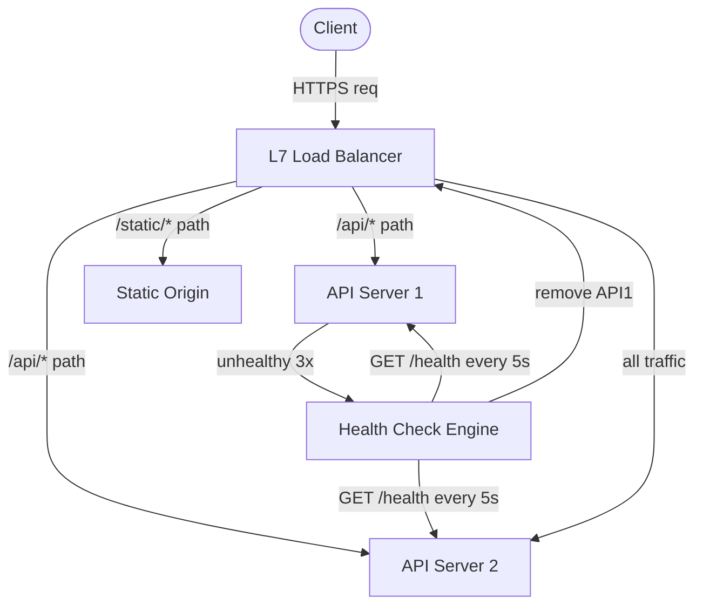

## Keywords in This File
{: .no_toc }

| # | Keyword | Weight |
|---|---|---|
| 14 | [Load Balancing: L4 vs L7, Algorithms, Health Checks](#load-balancing-l4-vs-l7-algorithms-health-checks) | high |
| 15 | [Reverse Proxy and API Gateway Patterns](#reverse-proxy-and-api-gateway-patterns) | high |

---

# Load Balancing: L4 vs L7, Algorithms, Health Checks

---
id: CN-014
title: "Load Balancing: L4 vs L7, Algorithms, Health Checks"
category: Computer Networks
difficulty: ★★☆
interview_weight: high
seniority: mid-senior
tags: #load-balancing #l4 #l7 #round-robin #health-checks #nginx #haproxy
---

## Quick Reference

**One-line definition:** Load balancing distributes incoming requests across a pool of backend servers to maximise availability and throughput; L4 load balancers operate at the TCP/IP layer (fast, protocol-agnostic), while L7 load balancers operate at the HTTP layer (feature-rich, content-aware routing).

**Difficulty:** ★★☆ | **Asked at:** Mid-Senior | **Seniority:** Mid through Senior

---

### 🎯 Model Answer

**30 seconds:**
Load balancers come in two main flavors: L4 (transport layer) and L7 (application layer). L4 LBs forward TCP flows by IP and port - they're fast and protocol-agnostic but can't inspect HTTP content. L7 LBs terminate HTTP, inspect headers, URLs, and cookies, enabling content-based routing, SSL termination, and sticky sessions. Algorithm choices: round-robin for equal-capacity servers, least-connections when request duration varies, consistent hashing for cache locality. Health checks detect unhealthy backends before traffic reaches them.

**3 minutes:**
**L4 load balancing (TCP/UDP):** Operates at the transport layer. Sees only source/destination IP and port. Forwards packets without inspecting payload. Examples: AWS NLB, HAProxy in TCP mode. Use when: high throughput with minimal overhead, non-HTTP protocols (SMTP, database, game servers), ultra-low latency requirement (L4 adds ~100 microseconds vs L7's 1-5ms).

**L7 load balancing (HTTP/HTTPS):** Terminates the TCP connection, reads the full HTTP request, and routes based on URL, headers, method, or body. Examples: nginx, HAProxy (HTTP mode), AWS ALB, Envoy. Enables: host-based routing (`api.example.com` vs `app.example.com`), path-based routing (`/api/v1` vs `/api/v2`), A/B testing via header, canary deployments, SSL offloading.

**Algorithms:**
- **Round-robin:** requests cycle through servers. Simple, works when requests are similar cost.
- **Weighted round-robin:** server weight proportional to capacity. Use when backends differ in CPU/RAM.
- **Least connections:** route to server with fewest active connections. Best for long-lived or variable-cost requests.
- **IP hash / consistent hashing:** hash client IP or a header to select server. Produces sticky routing without cookies; critical for cache locality in Redis or session affinity without app support.
- **Random:** select random server. Surprisingly competitive with round-robin; avoids correlation.

**Health checks:** The load balancer periodically probes each backend. Passive health checks detect failures on real traffic (mark server unhealthy after N consecutive errors). Active health checks send synthetic probes (HTTP GET /health, TCP connect, or GRPC health). When a backend fails, traffic is redistributed to healthy backends within 1-3 health check intervals (typically 5-30 seconds).

**Blank Mind Recovery:** L4 = TCP router (fast, blind to content). L7 = HTTP-aware router (slower, feature-rich). Round-robin for equal servers; least-connections for variable requests; consistent hash for cache affinity.

---

### 📘 Concept Explanation

**Core concept:** A load balancer is a traffic distributor. Its job is to maximise availability (route around failures), maximise utilisation (spread load evenly), and provide operational control (canary, A/B, gradual rollouts).

**L4 vs L7 comparison:**

```
L4 Load Balancer (TCP level):
Client -> [IP:port] -> LB -> Backend A:8080
Client -> [IP:port] -> LB -> Backend B:8080

LB sees: src_ip, dst_ip, src_port, dst_port
LB does: forward TCP segments to backend
LB does NOT see: HTTP method, URL, headers

L7 Load Balancer (HTTP level):
Client -> [HTTP req] -> LB (terminates TLS) ->
  reads Host header, URL path ->
    /api/* -> Backend API:8080
    /static/* -> CDN origin:8080
    Host: admin.* -> Admin cluster:8080

LB sees: full HTTP request
LB does: route, transform headers, rewrite
```

> **Code walkthrough:** WHAT IT SHOWS: the information available to L4 vs L7 load balancers and what routing decisions each can make. KEY MECHANISM: L4 operates at the packet level - it reads the 5-tuple (src IP, dst IP, src port, dst port, protocol) and selects a backend; L7 terminates the TCP connection, buffers the full HTTP request, parses headers, and routes based on semantic content. WHY IT MATTERS: L4 has near-zero added latency (packet forwarding is hardware-accelerated on modern NICs); L7 adds 1-5ms for TLS termination and HTTP parsing, but enables features that are impossible at L4. WHAT BREAKS: L4 cannot do SSL offloading (it doesn't see the TLS payload); L4 cannot route by URL (it doesn't read HTTP). TAKEAWAY: use L4 for high-throughput non-HTTP protocols or when latency is paramount; use L7 for all HTTP/HTTPS traffic where routing features justify the overhead.

**Load balancing algorithm comparison:**

```
Round-Robin:
t=0: req1 -> A, req2 -> B, req3 -> C
t=1: req4 -> A, req5 -> B, req6 -> C
= uniform distribution, ignores server load

Least-Connections:
A: 10 active conns
B:  3 active conns  <- route here
C:  7 active conns

= adapts to backend processing speed
= critical when request cost varies widely

Consistent Hash (by user_id header):
user_id=123 -> SHA256 -> ring position 340
ring: A=0-341, B=342-683, C=684-1023
user_id=123 always routes to A
= same user always hits same shard/cache
= cache hit rate maximised
```

> **Code walkthrough:** WHAT IT SHOWS: three load balancing algorithms with their routing logic and trade-offs. KEY MECHANISM: round-robin tracks only a counter; least-connections tracks active connection count per backend (updated on connection open/close); consistent hash applies SHA-256 to the routing key and maps to a ring of backend positions. WHY IT MATTERS: least-connections is crucial when request duration varies - a slow backend doing a 30-second query would accumulate 30 requests at round-robin's pace, while least-connections detects the queue depth and stops routing to it. WHAT BREAKS: consistent hash breaks cache locality when backends are added or removed (ring rebalancing moves ~1/N of keys); use consistent hashing with virtual nodes to minimise disruption. TAKEAWAY: round-robin for stateless services with uniform request cost; least-connections for databases and APIs with variable latency; consistent hash for cache sharding and session affinity.

**Health check mechanics:**

```
Active health check (every 5 seconds):
LB -> GET /health HTTP/1.1 -> Backend A
Backend A -> 200 OK {"status":"healthy"}
= healthy: keep in pool

Backend A -> timeout (>2s) OR 5xx
= failure #1 (unhealthy threshold = 3)

LB -> GET /health -> Backend A
Backend A -> 503 Service Unavailable
= failure #2

LB -> GET /health -> Backend A
Backend A -> timeout
= failure #3 -> REMOVED FROM POOL

Traffic redistributed to B and C
LB -> GET /health -> Backend A (continues)
Backend A -> 200 OK (3 consecutive)
= RETURNED TO POOL
```

> **Code walkthrough:** WHAT IT SHOWS: the health check state machine for detecting and recovering from backend failures. KEY MECHANISM: unhealthy threshold (typically 3) prevents a single slow response from removing a backend; healthy threshold (typically 2-3) prevents a flapping backend from being re-added after one successful probe. WHY IT MATTERS: without health checks, 1 in N requests fail (N = backend count) when a backend dies; health checks converge in unhealthy_threshold x check_interval (15-30 seconds) to eliminate all failed-backend traffic. WHAT BREAKS: health check endpoint (`/health`) that returns 200 even when the application is broken (e.g., DB connection pool exhausted but the process is running) - health checks must verify actual readiness. TAKEAWAY: implement deep health checks that test critical dependencies (DB connectivity, cache reachability), not just process liveness; separate liveness from readiness probes.

The following diagram shows L7 routing paths and health check flow.



> **Diagram walkthrough:** WHAT IT DEPICTS: an L7 load balancer with path-based routing, two API backends, and an active health check engine. HOW TO READ IT: the client sends HTTPS requests to the LB; the LB routes /api/* to API servers and /static/* to the static origin; the health check engine probes both API servers independently. KEY RELATIONSHIP: when API1 fails 3 health checks, the health check engine signals the LB to remove API1 from the active pool; all traffic shifts to API2 until API1 recovers. EDGE CASE: if API2 also becomes unhealthy while API1 is removed, the LB returns 503 to all /api/* requests - this is correct behavior (fail fast) rather than routing to a known-broken backend. INSIGHT: the health check engine and routing engine are logically separate; this separation allows health check intervals to be tuned independently of routing performance.

---

### 💻 Code Example

**BAD: Static backend list with no health checking**

```nginx
# BAD: hard-coded backends, no health checks
# Backend outage -> 50% of requests fail silently
upstream api_backend {
    server backend1:8080;
    server backend2:8080;
    # No health_check directive
    # No passive failure detection
}
server {
    location /api/ {
        proxy_pass http://api_backend;
        # No retry logic
        # No timeout tuning
    }
}
```

> **Code walkthrough:** WHAT IT SHOWS: the anti-pattern of static upstream with no health checks or retry configuration. KEY MECHANISM: nginx with no health_check will continue routing to a down backend; each request routed to the dead backend returns a 502/504 to the client; clients experience ~50% failure rate (1 in 2 requests hits the dead server). WHY IT MATTERS: in production, a backend pod restart takes 5-30 seconds; without health checks, 5-30 seconds of 50% error rate is invisible until alerts fire. WHAT BREAKS: adding `max_fails=1 fail_timeout=10s` in the server line enables passive health checks, but the first request to a failed backend still fails and is returned to the client. TAKEAWAY: always use active health checks for production upstreams; passive checks (max_fails) still expose one failure per check interval to real clients.

**GOOD: nginx L7 load balancer with health checks and retries**

```nginx
upstream api_backend {
    least_conn;  # route to fewest connections

    server backend1:8080 weight=2;
    server backend2:8080 weight=1;

    # Passive health: mark down after 3 failures
    # in 30s; retry after 10s
    server backend1:8080 max_fails=3
        fail_timeout=30s;
    server backend2:8080 max_fails=3
        fail_timeout=30s;

    keepalive 32;  # reuse upstream conns
}

server {
    listen 443 ssl;

    location /api/ {
        proxy_pass http://api_backend;
        proxy_http_version 1.1;
        proxy_set_header Connection "";

        # Retry on connection errors only
        # NOT on 5xx (avoid duplicate POSTs)
        proxy_next_upstream error timeout;
        proxy_next_upstream_tries 2;
        proxy_next_upstream_timeout 5s;

        # Timeouts
        proxy_connect_timeout 2s;
        proxy_read_timeout 30s;
        proxy_send_timeout 10s;

        # Add load balancer identity header
        proxy_set_header X-Real-IP $remote_addr;
        proxy_set_header
            X-Forwarded-For $proxy_add_x_forwarded_for;
    }

    # Active health check (nginx-plus or OSS plugin)
    location /nginx_health {
        health_check interval=5 fails=3 passes=2
            uri=/health;
    }
}
```

> **Code walkthrough:** WHAT IT SHOWS: production nginx upstream configuration with least_conn routing, weighted backends, passive health checks, and safe retry semantics. KEY MECHANISM: least_conn distributes to the backend with the fewest active connections; weight=2/1 routes twice as much traffic to backend1 (assuming it has more capacity); proxy_next_upstream error timeout retries on network errors but NOT on 5xx to prevent duplicate non-idempotent requests; keepalive 32 pools upstream connections. WHY IT MATTERS: proxy_next_upstream is critically important - retrying on 5xx causes POST requests to be sent twice, silently creating duplicate orders, charges, or messages. WHAT BREAKS: proxy_next_upstream_timeout must be less than the client's total request timeout; otherwise, the retry exhausts the client timeout window. TAKEAWAY: only retry on connection-level failures (error, timeout); never retry on HTTP 5xx without verifying idempotency.

**AWS ALB path-based routing (Terraform):**

```hcl
resource "aws_lb_listener_rule" "api_v1" {
  listener_arn = aws_lb_listener.https.arn

  action {
    type             = "forward"
    target_group_arn = aws_lb_target_group.api_v1.arn
  }
  condition {
    path_pattern {
      values = ["/api/v1/*"]
    }
  }
}

resource "aws_lb_target_group" "api_v1" {
  name     = "api-v1-tg"
  port     = 8080
  protocol = "HTTP"
  vpc_id   = var.vpc_id

  health_check {
    enabled             = true
    path                = "/health/ready"
    interval            = 15   # seconds
    healthy_threshold   = 2
    unhealthy_threshold = 3
    timeout             = 5
    matcher             = "200"
  }
}
```

> **Code walkthrough:** WHAT IT SHOWS: AWS ALB configuration with path-based routing and health check settings expressed as Terraform infrastructure-as-code. KEY MECHANISM: the listener rule matches /api/v1/* path and forwards to the v1 target group; health checks probe /health/ready every 15 seconds; the backend is removed after 3 consecutive failures and reinstated after 2 consecutive successes. WHY IT MATTERS: using /health/ready (readiness) instead of /health (liveness) ensures the ALB waits for the application to be fully initialised before routing traffic; this prevents cascading failures during rolling deployments. WHAT BREAKS: health check interval=15 with unhealthy_threshold=3 means a dead backend receives traffic for up to 45 seconds; for lower tolerance, use interval=5 with threshold=2 (10 seconds to detect failure). TAKEAWAY: tune health check interval and threshold based on acceptable failure window; shorter interval = faster detection but more health check traffic to backends.

---

### 🎓 Answers by Seniority

**Junior / Mid-level answer:**
L4 load balancers route TCP traffic by IP and port without reading HTTP content; they're fast but limited. L7 load balancers terminate HTTP connections and can route by URL path, headers, and host - enabling SSL termination, path-based routing, and sticky sessions. Common algorithms: round-robin (default), least-connections (for variable request duration), consistent hash (for cache affinity). Health checks detect backend failures by probing `/health` endpoints and removing unhealthy servers from the pool.

**Senior / Staff answer:**
I choose between L4 and L7 based on protocol and feature requirements: L4 for non-HTTP traffic, ultra-low latency, or when I don't need content-based routing; L7 for all HTTP/HTTPS with path routing, SSL offload, or WAF integration. Algorithm selection matters: least-connections is important when backend response times vary significantly (database-backed APIs vs static content); consistent hashing is critical when backend selection must be stable across requests (Redis shard routing, session affinity without cookies). In production, health check design is where most outages originate: shallow health checks that return 200 while the app is broken (DB pool exhausted, dependency down) give a false sense of health. I implement readiness probes that test all critical dependencies with timeouts. For rolling deployments: ALB deregistration delay (default 300s) gives in-flight requests time to complete before a backend is fully removed; reducing this to 30-60s speeds deployments but risks dropping long-running requests.

---

### ⚠️ Common Misconceptions

**Misconception 1: "L7 is always better than L4"**
L7 adds 1-5ms latency (TLS termination, HTTP parsing). For high-frequency, low-latency protocols (game servers, financial order routing, VoIP), L4 is correct. L7 also terminates TLS at the load balancer - the backend-to-LB connection may be unencrypted unless mTLS is configured.

**Misconception 2: "Round-robin is the default best algorithm"**
Round-robin assumes all requests have equal cost. For APIs with mixed workloads (fast reads vs slow writes), a slow backend can accumulate connections faster than it drains them. Least-connections adapts automatically to backend processing speed.

**Misconception 3: "Health checks guarantee zero downtime"**
Health checks have detection lag: unhealthy_threshold x interval. During that window (15-30 seconds typically), real user traffic still reaches the failed backend. Combine health checks with circuit breakers in the application layer for near-zero downtime.

**Misconception 4: "IP hash provides reliable session affinity"**
IP hash fails behind corporate NATs (many users share one IP -> all go to one backend). Use cookie-based sticky sessions (L7 LB inserts a routing cookie) for reliable session affinity.

---

### 🚨 Failure Modes and Diagnosis

**Failure 1: Uneven load distribution**

```bash
# Check backend connection counts
# (nginx status module or HAProxy stats)
curl http://localhost:8080/nginx_status
# Active connections: 150
# Reading: 2 Writing: 147 Waiting: 1

# HAProxy stats:
echo "show stat" | \
  nc localhost 9999 | \
  cut -d',' -f2,48 | \
  grep BACKEND
# pxname, scur (current sessions per backend)
```

> **Code walkthrough:** WHAT IT SHOWS: using nginx status and HAProxy stats socket to check connection distribution across backends. KEY MECHANISM: nginx status shows total active connections globally; HAProxy's stats socket provides per-backend current session count (scur field, column 48 in CSV output). WHY IT MATTERS: if one backend has 200 connections and another has 5, the algorithm is wrong for the workload or a backend is slow and accumulating queued connections. WHAT BREAKS: round-robin can become uneven when one backend processes requests slower than others - it receives the same number of requests but completes fewer, accumulating a backlog. TAKEAWAY: if you see uneven distribution with round-robin, switch to least_conn; rebalancing happens automatically as the slow backend drains its queue.

**Failure 2: Health checks succeed but backend is broken**

```bash
# Symptom: all backends "healthy" per LB
# but users report 500 errors

# Shallow health check returns 200 even when
# DB connection pool is exhausted:
# GET /health -> 200 {"status":"ok"}
# (doesn't check DB connectivity)

# Fix: implement deep health check
# GET /health/ready ->
#   checks DB: SELECT 1
#   checks Redis: PING
#   checks disk space < 90%
#   -> 200 if ALL pass, 503 if ANY fail

# Verify health endpoint includes
# dependency checks:
curl -v https://api.example.com/health/ready
# {"status":"healthy","db":"ok","cache":"ok"}
```

> **Code walkthrough:** WHAT IT SHOWS: the gap between shallow (process liveness) and deep (readiness) health checks. KEY MECHANISM: a shallow health check returns 200 as long as the HTTP server is listening; a deep readiness check queries each critical dependency and returns 503 if any dependency is unavailable. WHY IT MATTERS: a backend with an exhausted database connection pool serves 200 to the health checker but returns 500 to all real requests; the LB keeps routing traffic to it. WHAT BREAKS: deep health checks that take > timeout seconds (default 5s) appear as failures and remove healthy backends; ensure dependency checks have tight timeouts (500ms per check). TAKEAWAY: always implement readiness checks for load balancer health probes; liveness checks (process alive) are for Kubernetes pod restart decisions, not for load balancer routing.

---

### 🎯 Interview Deep-Dive

| Format | Questions | Est. Time |
|---|---|---|
| Junior/Mid | 9 questions | 25-35 min |
| Senior/Staff | 9 questions + extensions | 40-50 min |

**Category: CONCEPT**

**[JUNIOR] Q1 - [CONCEPTUAL] What is the difference between L4 and L7 load balancing?**

L4 (Transport Layer) load balancing routes traffic based on TCP/IP information: source and destination IP addresses and ports. It operates at the packet level without reading application data. It's fast and protocol-agnostic - works for HTTP, SMTP, database protocols, game servers, anything over TCP/UDP.

L7 (Application Layer) load balancing terminates the TCP connection, reads the full HTTP request, and routes based on application-layer information: URL path, HTTP headers, cookies, or request body. It's HTTP-specific (or gRPC, WebSocket, etc.) and adds 1-5ms latency for TLS termination and parsing.

L4 use cases: high-throughput low-latency protocols, non-HTTP protocols, when you don't need content inspection.

L7 use cases: HTTP/HTTPS services, SSL offloading, path-based routing (`/api/v1` vs `/api/v2`), host-based routing, canary deployments, A/B testing, sticky sessions via cookies.

*What separates good from great:* Knowing that L4 sees only a 5-tuple (src IP, dst IP, src port, dst port, protocol) while L7 sees the full HTTP request; and that L7 enables features (SSL termination, URL routing) that are physically impossible at L4.

---

**[JUNIOR] Q2 - [CONCEPTUAL] What load balancing algorithms exist and when would you use each?**

**Round-robin:** Route requests cyclically through the server list. Simple, no state required. Best when servers have equal capacity and requests have similar cost.

**Weighted round-robin:** Same as round-robin but server receives proportional traffic. Use when backends differ in CPU/RAM (e.g., one server is twice as powerful).

**Least connections:** Route to the server with the fewest active connections. Best for variable-duration requests (mix of fast queries and slow batch operations). The load balancer automatically detects slow servers accumulating connections.

**IP hash / consistent hash:** Hash the client IP (or a session ID) to determine the server. Produces sticky routing without cookies. Best for cache locality (same client always hits same cache shard) or when app state is local to the server.

**Random:** Randomly select a server. Competitive with round-robin; avoids sequential correlation patterns.

*What separates good from great:* Recommending least-connections for APIs with variable response times rather than defaulting to round-robin everywhere.

---

**[MID] Q3 - [MECHANISM] How do health checks work and what is the difference between active and passive health checks?**

**Active health checks (proactive):** The load balancer sends synthetic probes to each backend on a fixed interval (e.g., GET /health every 5 seconds). The backend is removed after `unhealthy_threshold` consecutive failures and added back after `healthy_threshold` consecutive successes.

Benefits: detects failures before real user traffic is affected (within 1-2 check intervals). Detects flapping backends. Can check deep dependencies (DB, cache).

**Passive health checks (reactive):** The load balancer monitors real traffic to each backend. If N consecutive real requests return errors or time out, the backend is marked unhealthy (nginx `max_fails`/`fail_timeout`).

Limitation: the first N failed requests are returned to real users before the backend is removed.

Production recommendation: use both. Active checks catch silent failures quickly; passive checks catch backends that pass active health probes but fail under load.

*What separates good from great:* The limitation of passive checks (real user requests are used to detect failures, not synthetic probes) and the value of running both.

---

**Category: DEBUGGING**

**[SENIOR] Q4 - [DEBUGGING] One backend in a pool receives 10x more traffic than others. How do you investigate?**

Step 1: Confirm with metrics - check per-backend request count from LB metrics (ALB metrics by target, nginx upstream log, HAProxy stats). Confirm uneven distribution is real and not a metric artifact.

Step 2: Check algorithm - if using round-robin, uneven distribution suggests backend A is processing requests much slower than B and C, so A accumulates more active connections over time. Switch to least_conn to automatically redistribute.

Step 3: Check sticky sessions - IP hash or cookie-based affinity may concentrate traffic. Many clients behind one NAT IP all route to the same backend with IP hash.

Step 4: Check backend health - is the overloaded backend the only "healthy" one? Check if others are being excluded by health checks.

Step 5: Check server weights - explicit weight configuration may be unintentionally routing more traffic.

*What separates good from great:* Starting with whether the algorithm is appropriate for the workload (round-robin vs least_conn) before investigating configuration - most uneven distribution is an algorithm mismatch.

---

**[SENIOR] Q5 - [DEBUGGING] Load balancer health checks pass but users experience 500 errors on some requests. What is happening?**

This is almost always a shallow health check problem. The health check endpoint returns 200 even when the application cannot serve real requests.

Common causes:
1. **DB connection pool exhausted:** health check hits a cached response or lightweight endpoint; real requests need DB connections that are all in use.
2. **Dependency down:** health check doesn't verify downstream services; a broken payment API or auth service causes real requests to fail.
3. **Memory/CPU exhaustion:** the server responds to health checks (small packets) but is too slow for real requests (which time out).

Diagnostic approach:

```bash
# Check if health endpoint is testing dependencies
curl -v https://api.example.com/health/ready
# If response is just {"status":"ok"} without
# dependency checks -> shallow health check

# Check DB pool exhaustion on the failing backend
# Look for "Connection is not available" in logs
grep "HikariPool.*not available" \
  /var/log/app/app.log | tail -20
```

> **Code walkthrough:** WHAT IT SHOWS: curl-based health endpoint inspection and log grep for connection pool exhaustion to identify why health checks pass but real requests fail. KEY MECHANISM: a shallow /health endpoint that always returns 200 gives the load balancer false confidence; /health/ready that tests DB connectivity exposes the actual state. WHY IT MATTERS: in a pod restart scenario, the JVM starts, health check passes (process is alive), but HikariCP takes 2-3 seconds to establish connections; traffic is routed before the app is ready. WHAT BREAKS: fixing by checking DB in health returns 503 during startup; Kubernetes needs separate liveness and readiness probes for this case. TAKEAWAY: health check endpoints that skip dependency validation are a safety theater - implement deep readiness checks and accept that they may briefly return 503 during startup.

*What separates good from great:* Distinguishing between liveness (is the process alive) and readiness (is the application ready to serve traffic) - these require different health endpoints with different expected behaviors.

---

**Category: TRADE-OFF**

**[SENIOR] Q6 - [TRADE-OFF] When does an L7 load balancer create a security problem? How do you mitigate it?**

**Problem 1: TLS termination exposes internal traffic**
L7 LBs terminate TLS at the load balancer. Backend connections are plaintext HTTP unless mutual TLS (mTLS) is configured between LB and backend. Any attacker with access to internal network traffic can read backend data.

Mitigation: use mTLS between LB and backends (nginx supports SSL on upstream connections). AWS ALB with HTTPS target groups re-encrypts traffic to backends.

**Problem 2: Trust boundary collapse with X-Forwarded-For**
L7 LBs add `X-Forwarded-For: <client-ip>` headers. If backends trust this header for authentication or rate limiting, attackers can spoof it by adding their own header before the LB.

Mitigation: strip incoming `X-Forwarded-For` headers at the LB before adding the real client IP. Never trust `X-Forwarded-For` from headers added by the client.

**Problem 3: HTTP request smuggling**
L7 LBs parse HTTP differently than backends. Mismatched parsing of `Content-Length` vs `Transfer-Encoding: chunked` headers allows attackers to inject requests. Mitigate by using HTTP/2 end-to-end and ensuring consistent HTTP parsing between LB and backend.

*What separates good from great:* Knowing that the LB trust boundary is a security decision - once TLS terminates, the security model of the internal network matters as much as the external boundary.

---

**[SENIOR] Q7 - [TRADE-OFF] How do you implement zero-downtime deployments with a load balancer?**

Process for rolling deployments:

1. **Deregister backend from LB** before stopping it. The LB stops sending new requests.
2. **Drain in-flight requests:** wait for active connections to close. ALB deregistration delay (default 300s, tune to 30-60s for short-lived requests).
3. **Deploy new version** on the deregistered backend.
4. **Health check passes** on new version (readiness probe confirms dependencies ready).
5. **Re-register backend** in LB.
6. **Repeat** for all backends.

Key configurations:
- `deregistration_delay.timeout_seconds` in ALB target group (default 300; reduce to 30s for APIs with < 30s max request duration)
- Kubernetes `terminationGracePeriodSeconds` must be >= deregistration delay + longest expected request

Canary deployment: keep 90% on old version backend group, 10% on new version backend group. Verify error rate. Gradually shift weight. ALB weighted target groups support this natively.

*What separates good from great:* Knowing that Kubernetes terminationGracePeriodSeconds must be coordinated with the ALB deregistration delay - if the pod is killed before ALB finishes draining, in-flight requests are interrupted.

---

**Category: BEHAVIORAL**

**[SENIOR] Q8 - [BEHAVIORAL] Describe a load balancing production incident you investigated.**

Situation: Every night at 11 PM, 15% of API requests returned 502 errors for approximately 5 minutes. Total duration: 3 weeks before investigation.

Task: Root cause a nightly 502 error pattern.

Action:
1. Correlated 11 PM with our nightly database backup job that ran heavy I/O on one backend.
2. Found: the backup job was running on backend1, causing high CPU and slow health check responses (> 5s). nginx was marking backend1 unhealthy but the health check was also slow on backend2 during the 5-minute backup window (shared NFS volume).
3. Root cause: shallow health check included a filesystem check; NFS mount was slow during backup, causing both backends to appear unhealthy simultaneously.
4. Fix: removed filesystem check from health check; added a dedicated health check endpoint that only tests DB connectivity and app readiness.

Result: No 502 errors during subsequent backup windows.

*What separates good from great:* Recognising that health check endpoints themselves can be the source of instability - a health check that checks too many dependencies can create correlated failures.

---

**[STAFF] Q9 - [DESIGN] Design a multi-region load balancing architecture for a globally distributed API serving 10 million requests per day.**

**Layer 1: DNS-based global routing (latency routing)**
- Route 53 or Cloudflare latency routing directs clients to nearest region (US-EAST, EU-WEST, AP-EAST)
- Health checks at DNS level fail over entire regions (60-90s DNS TTL, 3-minute total failover)

**Layer 2: Regional L7 load balancer (ALB)**
- Each region has an ALB with multiple AZs
- Cross-zone load balancing distributes evenly across AZ backends
- SSL termination at ALB level; mTLS to backends

**Layer 3: Service mesh (Envoy/Istio) for intra-cluster routing**
- L7 routing within each region cluster
- Circuit breakers, retries, distributed tracing

**Failure modes and mitigations:**

- Regional outage: DNS failover (60-90s) + client retry with exponential backoff
- Single AZ failure: ALB cross-zone routing absorbs in < 10s
- Single backend failure: ALB health checks (15s x 3 = 45s to detect and remove)

**Data consistency trade-off:** Multi-region write routing requires careful consideration. Options: active-passive (all writes to primary, reads from nearest), active-active (conflict resolution needed), or CQRS (writes to single region, reads globally cached).

*What separates good from great:* Addressing the data consistency problem in active-active multi-region - load balancing is the easy part; data routing across regions is the hard constraint.

---

### ⚖️ Comparison Table

| Property | L4 LB (NLB) | L7 LB (ALB/nginx) | Service Mesh (Envoy) | DNS Load Balancing |
|---|---|---|---|---|
| Protocol awareness | TCP/UDP only | HTTP/HTTPS/gRPC | Any (L7 + L4) | IP-level only |
| SSL termination | No (pass-through) | Yes | Yes (mTLS) | No |
| Routing granularity | IP + port | URL, headers, host | Headers + service ID | DNS record TTL |
| Health check type | TCP connect | HTTP/HTTPS | gRPC health protocol | DNS health probe |
| Latency overhead | ~0.1ms | 1-5ms | 0.5-2ms per hop | DNS TTL lag |
| Sticky sessions | IP hash only | Cookie + IP hash | Header-based | None |
| Canary deployments | No | Yes (weighted TG) | Yes (traffic shifting) | Partial (CNAME) |
| Best for | Non-HTTP, DB, games | HTTP/HTTPS APIs | Microservices mesh | Global routing |

> **Diagram walkthrough:** WHAT IT DEPICTS: four load balancing approaches compared across operational properties. HOW TO READ IT: rows are properties; columns are approaches in increasing application-layer sophistication. KEY RELATIONSHIP: higher-layer load balancers provide more routing features at the cost of latency overhead; the right choice depends on protocol and feature requirements. EDGE CASE: DNS load balancing has a TTL lag problem - even with 30-second TTL, some resolvers cache longer; during regional failover, 5-10% of clients may continue routing to the failed region for several minutes. INSIGHT: production systems use all four layers simultaneously - DNS for global routing, ALB for regional L7, and Envoy service mesh for inter-service routing; each layer handles a different failure domain.

---

### 🏛️ System Design

*(Omit: ★★☆ difficulty - system design section targets ★★★ architectural keywords.)*

---

### 📊 Diagram

*(See Concept Explanation above; the L7 routing paths and health check flow Mermaid diagram appears in that section.)*

---
---

# Reverse Proxy and API Gateway Patterns

---
id: CN-015
title: "Reverse Proxy and API Gateway Patterns"
category: Computer Networks
difficulty: ★★☆
interview_weight: high
seniority: mid-senior
tags: #reverse-proxy #api-gateway #nginx #envoy #rate-limiting #authentication
---

## Quick Reference

**One-line definition:** A reverse proxy sits in front of backend servers, forwarding client requests while providing SSL termination, caching, and protection; an API gateway is a specialised reverse proxy that additionally handles authentication, rate limiting, request transformation, and API versioning for microservices.

**Difficulty:** ★★☆ | **Asked at:** Mid through Senior | **Seniority:** Mid-Senior

---

### 🎯 Model Answer

**30 seconds:**
A reverse proxy forwards client requests to backend servers on their behalf - clients talk to the proxy, not the origin. It provides SSL termination, compression, caching, and DDoS protection. An API gateway is a reverse proxy with additional API management: authentication, rate limiting, request/response transformation, versioning, and analytics. In microservices, the API gateway is the single entry point for all external traffic.

**3 minutes:**
**Reverse proxy (basics):** The client makes a request to `https://api.example.com`. The reverse proxy terminates TLS, forwards the request to a backend pool, receives the response, and forwards it back. The client never directly contacts the backend. This provides: SSL offloading, IP hiding, DDoS absorption, caching, and compression.

**Nginx as reverse proxy:** The most common open-source reverse proxy. Handles SSL termination, upstream selection, connection pooling to backends, request/response header manipulation, static file serving, and rate limiting via `limit_req_zone`.

**API gateway vs reverse proxy:** An API gateway does everything a reverse proxy does, plus: authentication (JWT validation, OAuth2 token introspection), rate limiting per client/API key, request transformation (header injection, body rewriting), routing across microservices, API versioning, analytics and billing (request counting per consumer), circuit breaking.

**Common API gateways:** Kong (nginx-based, plugin ecosystem), AWS API Gateway (fully managed), Envoy (L7 proxy, used in Istio service mesh), Traefik (Kubernetes-native), NGINX Plus, Google Cloud Endpoints.

**Anti-pattern: fat gateway:** The API gateway that implements business logic (e.g., data aggregation, complex validation). Gateways should handle cross-cutting concerns (auth, rate limit, routing) and route to services that handle business logic. A fat gateway creates a monolithic bottleneck.

**Blank Mind Recovery:** Reverse proxy = traffic middleman (SSL, cache, DDoS shield). API gateway = reverse proxy + auth + rate limit + routing for microservices. The gateway is the single entry point; never put business logic in it.

---

### 📘 Concept Explanation

**Core concept:** The reverse proxy pattern separates concerns: clients see one unified endpoint; backends are isolated from direct internet exposure and benefit from the proxy's cross-cutting capabilities.

**Reverse proxy architecture:**

```
Without reverse proxy:
Client A -> Backend A (port 443)
Client B -> Backend B (port 443)
= each backend manages SSL, DDoS, compression

With reverse proxy (nginx):
Client A -> nginx:443 -> Backend A:8080
Client B -> nginx:443 -> Backend A:8080
                      -> Backend B:8080
= SSL, DDoS, caching handled once at nginx
= backends receive plain HTTP, focus on business
```

> **Code walkthrough:** WHAT IT SHOWS: the architectural difference between direct backend access and reverse-proxy-mediated access. KEY MECHANISM: the reverse proxy terminates TLS so backends receive unencrypted HTTP, eliminating per-backend SSL certificate management; the backends only need to handle application logic. WHY IT MATTERS: centralising SSL at the reverse proxy means certificate rotation updates one place instead of N backend services; DDoS protection and WAF run once at the proxy instead of being duplicated per backend. WHAT BREAKS: internal network between proxy and backends becomes a trust boundary; any attacker on the internal network can read backend traffic unless mTLS is added on the backend connections. TAKEAWAY: treat the internal network between proxy and backends as untrusted; use TLS (not just HTTP) for proxy-to-backend traffic in security-sensitive environments.

**API gateway request lifecycle:**

```
Client Request Lifecycle:
1. Client -> API Gateway (HTTPS)
2. Gateway: SSL termination
3. Gateway: Authentication
   - validate JWT signature + expiry
   - or call /auth/introspect (OAuth2)
4. Gateway: Rate limiting
   - check Redis: client_id counter
   - if over limit -> 429 Too Many Requests
5. Gateway: Routing
   - URL /api/users/* -> user-service:8080
   - URL /api/orders/* -> order-service:8080
6. Gateway: Request transformation
   - add X-Consumer-ID header
   - strip Authorization header
7. Gateway -> Backend Service (HTTP)
8. Backend -> Gateway: response
9. Gateway: Response transformation
   - add CORS headers
   - strip internal headers
10. Gateway -> Client
```

> **Code walkthrough:** WHAT IT SHOWS: the complete request lifecycle through an API gateway's processing pipeline. KEY MECHANISM: each step is a filter that can modify or reject the request; authentication and rate limiting run before the request reaches any backend, protecting backend services from unauthenticated and excessive traffic. WHY IT MATTERS: centralising authentication at the gateway means each microservice doesn't need its own auth logic; a single policy change (new JWT issuer, revoked key) propagates instantly to all services. WHAT BREAKS: if the gateway's auth cache (JWT validation) is stale, revoked tokens may be accepted for up to cache TTL; implement short TTL (30-60s) and a revocation check for critical operations. TAKEAWAY: gateways process requests sequentially through a plugin/filter chain; each plugin adds latency; audit the plugin chain and remove plugins not in active use.

**Kong API gateway configuration:**

```yaml
# Kong declarative config (deck format)
services:
  - name: user-service
    url: http://user-service:8080
    routes:
      - name: user-api
        paths:
          - /api/users
        methods:
          - GET
          - POST
        plugins:
          - name: jwt
            config:
              secret_is_base64: false
          - name: rate-limiting
            config:
              minute: 100  # 100 req/min per consumer
              policy: redis
              redis_host: redis:6379
          - name: request-transformer
            config:
              add:
                headers:
                  - X-Gateway-Version:2
```

> **Code walkthrough:** WHAT IT SHOWS: a Kong declarative configuration that attaches JWT authentication and rate limiting plugins to a user service route. KEY MECHANISM: the jwt plugin validates the JWT signature using the registered consumer's key before forwarding to the backend; the rate-limiting plugin uses Redis to track per-consumer request counts with a sliding window; the request-transformer plugin injects a gateway version header for backend observability. WHY IT MATTERS: declarative configuration makes the gateway state auditable and reproducible; changing a rate limit is a config commit, not a UI click. WHAT BREAKS: if Redis is unavailable and policy=redis, the rate-limiting plugin fails open (allows requests) by default; set fault_tolerant=false to fail closed if rate limiting is a hard security requirement. TAKEAWAY: always configure the Redis fault tolerance policy explicitly; the default fail-open behavior for rate limiting may violate security requirements.

**Envoy proxy (service mesh sidecar) configuration:**

```yaml
static_resources:
  listeners:
    - address:
        socket_address:
          address: 0.0.0.0
          port_value: 8080
      filter_chains:
        - filters:
            - name: envoy.filters.network.http_connection_manager
              typed_config:
                route_config:
                  virtual_hosts:
                    - name: backend
                      domains: ["*"]
                      routes:
                        - match:
                            prefix: "/api/"
                          route:
                            cluster: api_cluster
                            timeout: 30s
                            retry_policy:
                              retry_on: 5xx,reset
                              num_retries: 2
                http_filters:
                  - name: envoy.filters.http.router
  clusters:
    - name: api_cluster
      connect_timeout: 2s
      lb_policy: LEAST_REQUEST
      health_checks:
        - timeout: 5s
          interval: 10s
          http_health_check:
            path: "/health/ready"
```

> **Code walkthrough:** WHAT IT SHOWS: Envoy static configuration with routing, retry policy, and health checks. KEY MECHANISM: Envoy's retry policy retries on 5xx and TCP reset (reset) conditions up to num_retries=2 times; the retry adds exponential jitter to prevent thundering herds on backend recovery; LEAST_REQUEST lb_policy routes to the backend with fewest active requests. WHY IT MATTERS: Envoy's retry policy is more nuanced than nginx's proxy_next_upstream - it supports per-route retry budgets to prevent retry storms amplifying load on an already overloaded backend. WHAT BREAKS: retrying on 5xx without idempotency guarantees can cause duplicate non-idempotent operations; restrict retry_on to reset,connect-failure for non-idempotent endpoints. TAKEAWAY: configure retry budgets (e.g., retry 20% of requests maximum) to prevent a cascade where retries amplify backend load during an incident.

---

### 💻 Code Example

**BAD: Direct backend exposure without reverse proxy**

```nginx
# BAD: backends directly exposed to internet
# Each backend manages its own SSL
# No DDoS protection, no rate limiting
# No central auth enforcement

# backend1 - manages its own SSL cert
server {
    listen 443 ssl;
    ssl_certificate /etc/ssl/backend1.crt;
    # Different SSL config per backend
    # Different rate limits per backend
    # Auth logic duplicated in each service
}
```

> **Code walkthrough:** WHAT IT SHOWS: the anti-pattern of exposing backend servers directly to the internet without a reverse proxy. KEY MECHANISM: each backend must independently manage SSL certificates, TLS configuration, DDoS protection, and authentication; a change to rate limiting policy requires updating all N backends simultaneously. WHY IT MATTERS: certificate rotation mistakes on one backend cause partial outages (some requests succeed, some fail SSL); inconsistent auth policy between backends creates security gaps. WHAT BREAKS: when a new security policy (e.g., block a malicious IP) must be applied, it requires N deployments instead of 1 gateway config change. TAKEAWAY: always use a reverse proxy or API gateway as the single internet-facing entry point; backends should only be reachable from the internal network.

**GOOD: Nginx reverse proxy with rate limiting and auth offload**

```nginx
# Rate limiting zone: 10 req/s per IP
limit_req_zone $binary_remote_addr
    zone=api_limit:10m rate=10r/s;

# JWT validation upstream (auth service)
upstream auth_service {
    server auth:8080;
    keepalive 16;
}

upstream user_service {
    least_conn;
    server user-svc-1:8080;
    server user-svc-2:8080;
    keepalive 32;
}

server {
    listen 443 ssl http2;
    ssl_certificate /etc/ssl/example.crt;
    ssl_certificate_key /etc/ssl/example.key;
    ssl_protocols TLSv1.2 TLSv1.3;

    # Validate JWT before routing
    location = /auth/validate {
        internal;
        proxy_pass http://auth_service/validate;
        proxy_pass_request_body off;
        proxy_set_header Content-Length "";
        proxy_set_header X-Original-URI $request_uri;
    }

    location /api/ {
        # Rate limit: 10 req/s, burst of 20
        limit_req zone=api_limit burst=20
            nodelay;

        # Require valid JWT
        auth_request /auth/validate;
        auth_request_set $auth_user
            $upstream_http_x_user_id;

        proxy_pass http://user_service;
        proxy_set_header X-User-ID $auth_user;
        proxy_set_header X-Real-IP $remote_addr;
        proxy_set_header Host $host;
        proxy_connect_timeout 2s;
        proxy_read_timeout 30s;
    }
}
```

> **Code walkthrough:** WHAT IT SHOWS: a production nginx reverse proxy with rate limiting, JWT auth offload via auth_request subrequest, and upstream connection pooling. KEY MECHANISM: `auth_request /auth/validate` sends a subrequest to the auth service before forwarding the main request; if auth returns 401, nginx rejects the main request without touching the backend; `limit_req` enforces 10 req/s with a burst buffer of 20. WHY IT MATTERS: centralising auth at the gateway means microservices receive pre-validated requests and don't need JWT libraries or auth logic. WHAT BREAKS: auth_request adds 1-5ms latency for the subrequest to the auth service; cache JWT validation results in auth service with short TTL (30s) to avoid this overhead on every request. TAKEAWAY: use auth_request for delegated authentication; ensure the auth service is fast (< 5ms P99) and highly available - it is now in the critical path for every API request.

---

### 🎓 Answers by Seniority

**Junior / Mid-level answer:**
A reverse proxy sits between clients and backend servers, forwarding requests. It provides SSL termination (backends receive plain HTTP), load balancing, caching, and DDoS protection. An API gateway is a specialised reverse proxy for microservices that adds authentication (JWT validation), rate limiting, and URL routing across services. Common tools: nginx (reverse proxy), Kong (API gateway, nginx-based), AWS API Gateway (managed), Envoy (service mesh).

**Senior / Staff answer:**
The distinction between reverse proxy, API gateway, and service mesh is a deployment topology question. A reverse proxy handles edge traffic (client to cluster boundary) - SSL, DDoS, rate limiting. A service mesh handles internal traffic (service to service) - mTLS, circuit breaking, distributed tracing. An API gateway handles API management concerns (authentication, versioning, consumer billing). In production, I distinguish edge gateway (public-facing, handles authn/authz) from internal mesh (handles service-to-service reliability). The biggest mistake I see: putting business logic in the API gateway (data aggregation, complex validation). The gateway should be thin - only cross-cutting concerns; services handle business logic. Fat gateways become monolithic bottlenecks that require deployment for every business logic change. For rate limiting strategy, I prefer token bucket over leaky bucket: token bucket allows burst capacity for legitimate traffic spikes while still enforcing the long-term rate limit.

---

### ⚠️ Common Misconceptions

**Misconception 1: "API gateway and reverse proxy are interchangeable terms"**
A reverse proxy is a network pattern (forward requests, terminate TLS). An API gateway is a specific product/role that adds API management (auth, rate limiting, versioning, analytics). Every API gateway is a reverse proxy, but not every reverse proxy is an API gateway.

**Misconception 2: "The API gateway should aggregate data across microservices"**
Data aggregation in the gateway creates a fat gateway that requires redeployment for business logic changes. Use a Backend-for-Frontend (BFF) pattern: a dedicated aggregation service behind the gateway that handles composition. The gateway stays thin.

**Misconception 3: "Rate limiting at the gateway prevents all abuse"**
Gateway rate limiting protects the backend from volume attacks, but a single request that triggers an expensive operation (O(N) database scan) bypasses rate limits on its own. Combine gateway rate limiting with application-level rate limiting and database query cost controls.

**Misconception 4: "Reverse proxies add significant latency"**
nginx and Envoy add 0.5-2ms latency at most. For comparison, a database query takes 5-50ms. The proxy overhead is negligible in most real-world systems.

---

### 🚨 Failure Modes and Diagnosis

**Failure 1: Auth service down causes total API outage**

```bash
# Symptom: all API requests return 401 or 502
# When auth_request upstream is down:
# nginx returns 500 if auth service unreachable

# Diagnose:
curl -v https://api.example.com/api/users \
  -H "Authorization: Bearer <valid-token>" 2>&1 \
  | grep -E "< HTTP|502|500|401"

# Check auth service health:
curl http://auth-service:8080/health

# Check nginx error log:
tail -f /var/log/nginx/error.log | \
  grep "auth"
# "connect() failed (111: Connection refused)
#  while connecting to upstream auth:8080"
```

> **Code walkthrough:** WHAT IT SHOWS: diagnosing total API outage caused by auth service unavailability in an auth_request architecture. KEY MECHANISM: nginx auth_request returns 500 (not 401) when the auth upstream is unreachable; this causes all API requests to fail with 500 until the auth service recovers. WHY IT MATTERS: the auth service is now in the critical path for every API request; its availability directly determines API availability. WHAT BREAKS: if auth is a shared singleton service and it crashes, 100% of APIs fail simultaneously - a single point of failure at the highest-traffic bottleneck. TAKEAWAY: auth services must be high-availability deployments with at least 3 replicas, circuit breakers, and response caching; never route all traffic through a single auth instance.

**Failure 2: Rate limiting not triggering on distributed clients**

```bash
# Symptom: clients exceed rate limit in ALB metrics
# but never receive 429 responses

# Cause: multiple LB nodes, no shared state
# Each nginx instance has its own limit_req_zone
# 3 nginx nodes, 10 req/s limit each =
# 30 req/s effective limit per client

# Fix: use Redis-based rate limiting
# Kong: policy: redis (shared across all gateways)
# nginx: use lua-resty-redis or nginx+ zone_sync

# Verify rate limit is firing:
curl -H "Authorization: Bearer ..." \
  https://api.example.com/api/test \
  -w "%{http_code}\n" \
  --output /dev/null \
  -s & for i in $(seq 1 50); do ...; done
# Should see 429 after first 10 requests
```

> **Code walkthrough:** WHAT IT SHOWS: diagnosing rate limiting that doesn't fire correctly in a multi-node reverse proxy deployment. KEY MECHANISM: nginx's limit_req_zone uses local shared memory; with 3 nginx instances each allowing 10 req/s, the effective limit is 30 req/s per client (3 x 10); to enforce a true 10 req/s limit across all nodes, rate limit state must be shared via Redis. WHY IT MATTERS: local rate limiting provides only approximate protection in multi-instance deployments; DDoS protection and API key rate limits need centralised counters. WHAT BREAKS: moving to Redis-based rate limiting adds 1-2ms per request for the Redis check; this is usually acceptable but must be accounted for in P99 latency SLOs. TAKEAWAY: always use shared-state (Redis) rate limiting in multi-node deployments; local rate limiting is only suitable for single-node reverse proxies.

---

### 🎯 Interview Deep-Dive

| Format | Questions | Est. Time |
|---|---|---|
| Junior/Mid | 9 questions | 25-40 min |
| Senior/Staff | 9 questions + extensions | 45-55 min |

**Category: CONCEPT**

**[JUNIOR] Q1 - [CONCEPTUAL] What is the difference between a forward proxy and a reverse proxy?**

**Forward proxy:** Sits in front of clients. Clients configure the proxy and send requests to it; the proxy forwards on their behalf. The destination server sees the proxy's IP, not the client's. Use cases: corporate content filtering, anonymous browsing, bypassing geo-restrictions.

**Reverse proxy:** Sits in front of servers. Clients have no knowledge of the proxy; they make requests to the service's domain. The proxy forwards to backend servers. The client sees the proxy's IP, not the backend's. Use cases: load balancing, SSL termination, DDoS protection, caching.

Key distinction: a forward proxy acts for clients (hides client from servers); a reverse proxy acts for servers (hides servers from clients).

*What separates good from great:* The trust direction - with a forward proxy, the server doesn't know the client; with a reverse proxy, the client doesn't know the server. This has security implications for IP allowlisting and rate limiting.

---

**[JUNIOR] Q2 - [CONCEPTUAL] What cross-cutting concerns does an API gateway handle?**

Cross-cutting concerns are capabilities needed across all (or most) services that would be duplicated if implemented in each service:

1. **Authentication:** validate JWT tokens, API keys, OAuth2 tokens - before the request reaches any backend.
2. **Rate limiting:** enforce per-consumer or per-IP request quotas.
3. **SSL termination:** handle HTTPS; backends receive plain HTTP.
4. **Request/response transformation:** add/remove headers, transform request format.
5. **Routing:** route requests to the correct backend service based on URL or headers.
6. **Observability:** log all requests, trace IDs, response codes across all services.
7. **CORS:** add Access-Control-Allow-Origin headers at the gateway.
8. **API versioning:** route /api/v1/* and /api/v2/* to different backend versions.

*What separates good from great:* Emphasising that the gateway handles only cross-cutting concerns; business logic (data validation, domain rules) belongs in services, not the gateway.

---

**[MID] Q3 - [MECHANISM] How does JWT authentication work at an API gateway?**

The gateway validates the JWT before forwarding any request to a backend service:

1. Client sends `Authorization: Bearer <jwt>` header.
2. Gateway extracts the JWT (header.payload.signature).
3. Gateway verifies the signature using the issuer's public key (downloaded from JWKS endpoint or configured statically).
4. Gateway checks claims: `exp` (not expired), `iss` (expected issuer), `aud` (intended audience).
5. If valid: gateway extracts user identity from claims (sub, roles), adds headers to the upstream request (X-User-ID, X-User-Roles), strips the Authorization header (backend never sees the raw JWT).
6. If invalid: gateway returns 401 Unauthorized immediately; backend never receives the request.

JWKS (JSON Web Key Set) endpoint: the issuer publishes public keys at `/.well-known/jwks.json`. The gateway periodically fetches and caches this. Key rotation: the issuer adds a new key with a new kid; the gateway fetches JWKS on `kid` cache miss and validates with the new key.

*What separates good from great:* Explaining JWKS key rotation - the gateway must refresh its key cache when it encounters a JWT signed with an unknown kid; otherwise, key rotation breaks authentication for all new tokens.

---

**Category: DEBUGGING**

**[SENIOR] Q4 - [DEBUGGING] API gateway is adding 200ms of latency to every request. How do you debug?**

Step 1: Measure latency breakdown with curl timing:

```bash
curl -w "namelookup:%{time_namelookup}\n\
tcp_connect:%{time_connect}\n\
tls_handshake:%{time_appconnect}\n\
first_byte:%{time_starttransfer}\n\
total:%{time_total}\n" \
  -o /dev/null -s \
  https://api.example.com/api/health
```

> **Code walkthrough:** WHAT IT SHOWS: using curl timing variables to isolate where latency is occurring in the full request lifecycle. KEY MECHANISM: time_connect = TCP handshake time; time_appconnect = TLS handshake time; time_starttransfer - time_appconnect = time to first byte (processing time); total - time_starttransfer = response body transfer time. WHY IT MATTERS: 200ms total latency could be DNS (unlikely), TLS (unlikely if cached), gateway processing (possible), or backend response time (most likely); curl timing immediately tells you which phase. WHAT BREAKS: if time_appconnect is 150ms, the TLS handshake is the problem (TLS session not being reused - add ssl_session_cache in nginx). TAKEAWAY: use curl -w timing before blaming any component; the numbers point to exactly which phase has the problem.

Step 2: Identify gateway processing time. If `time_starttransfer - time_connect` > 100ms, the gateway is slow. Check: auth_request latency (add `$upstream_response_time` to access log), plugin chain execution time (Kong: enable debug logging), upstream response time.

Step 3: Check connection pooling. If the gateway opens a new TCP connection to the backend for every request, add `keepalive 32` to the upstream block.

*What separates good from great:* Using curl timing variables to segment latency rather than guessing; the timing breakdown immediately points to DNS, TLS, gateway processing, or backend.

---

**[SENIOR] Q5 - [DEBUGGING] Rate limiting is inconsistently applied. Some clients exceed the limit without getting 429. Why?**

Most likely cause: rate limiting state is local to each gateway instance (not shared via Redis). With 3 gateway nodes each allowing 10 req/s, a client can send 30 req/s total without triggering any individual node's limit.

Verify:

```bash
# Send 25 requests rapidly to the same gateway
for i in $(seq 1 25); do
  curl -s -o /dev/null -w "%{http_code}\n" \
    -H "X-API-Key: client123" \
    https://api.example.com/api/test &
done | sort | uniq -c
# If no 429s: rate limiting is local,
# not shared across nodes
```

> **Code walkthrough:** WHAT IT SHOWS: a parallel curl test that sends 25 simultaneous requests to verify whether rate limiting fires correctly. KEY MECHANISM: if all 25 return 200, the rate limit is either too high or not shared; if some return 429, the limit is working locally but may not be distributed. WHY IT MATTERS: local rate limiting provides false confidence - the system appears to have rate limiting but clients can multiply effective quota by the number of gateway instances. WHAT BREAKS: switching to Redis-based rate limiting in Kong (policy: redis) adds Redis as a dependency; Redis unavailability may cause rate limiting to fail open (allow) or fail closed (block all requests) depending on configuration. TAKEAWAY: test rate limiting with load testing tools (k6, locust) against a multi-node deployment to confirm limits are enforced globally, not locally.

---

**Category: TRADE-OFF**

**[SENIOR] Q6 - [TRADE-OFF] When should you use a managed API gateway (AWS API Gateway) vs self-hosted (Kong, nginx)?**

**Managed API Gateway (AWS API Gateway, Google Apigee):**

Advantages:
- Zero operational overhead (no deployment, patching, scaling)
- Native integration with AWS services (Lambda, Cognito, WAF)
- Built-in DDoS protection, SSL certificate management
- Pay-per-request pricing (cost-effective for low traffic)

Disadvantages:
- Vendor lock-in (AWS-specific configuration, custom domain setup)
- Higher per-request cost at high volume ($3.50 per million requests vs $0.01 on EC2)
- Limited customisation (no arbitrary Lua plugins)
- Cold start latency for Lambda-backed integrations

**Self-hosted (Kong, nginx, Envoy):**

Advantages:
- Full control over configuration, plugins, and performance tuning
- No per-request cost; cost is instance-based
- No vendor lock-in; portable across cloud providers
- Lower latency (co-located with backends)

Disadvantages:
- Operational burden (deployment, HA, upgrades, monitoring)
- Security patching responsibility

Decision framework: use managed for simple use cases (< 1M requests/day, AWS-native stack, team without Ops expertise). Use self-hosted for high volume (> 10M requests/day), multi-cloud, or when custom plugins are needed.

*What separates good from great:* Quantifying the cost crossover point and recognising that managed gateways often become cost-prohibitive at high traffic, making migration to self-hosted necessary.

---

**[SENIOR] Q7 - [TRADE-OFF] Describe the Backend-for-Frontend (BFF) pattern and when it is preferable to a general API gateway.**

A BFF is a server-side aggregation layer specific to a client type (mobile BFF, web BFF). It aggregates data from multiple microservices into a single response optimised for that client's UI.

**API Gateway vs BFF:**

- API Gateway: cross-cutting concerns, thin routing, no business logic
- BFF: client-specific aggregation, UI-optimised response shapes, may contain light business logic

**When to use BFF:**

1. Mobile client needs 1 API call; data spans 5 microservices. Without BFF: mobile makes 5 calls (slow, battery drain). With BFF: mobile makes 1 call; BFF makes 5 internal calls and composes the response.
2. Web and mobile clients need different response shapes for the same data (web: full detail; mobile: compact).
3. GraphQL as a BFF: allows clients to request exactly the fields they need, reducing over-fetching.

**Pattern:** API Gateway (auth, rate limiting) -> BFF (aggregation, composition) -> Microservices. The gateway handles security; the BFF handles client-specific data shaping.

*What separates good from great:* Recognising that GraphQL is a BFF pattern implementation, not just a query language - it solves the same N+1 API call problem that BFFs address.

---

**Category: BEHAVIORAL**

**[SENIOR] Q8 - [BEHAVIORAL] Describe a time you designed or modified an API gateway configuration to solve a production problem.**

Situation: A high-traffic API (5M requests/day) was experiencing 2% error rate after a new authentication requirement was added. Every request now made a subrequest to an auth service that was undersized for the 2x traffic.

Task: Restore < 0.1% error rate without removing authentication.

Action:
1. Identified that auth subrequests were the bottleneck - each JWT validation hit the auth service's database.
2. Implemented JWT caching at the gateway: cache validated JWTs by their signature (not content) with a 60-second TTL using nginx's lua module (OpenResty).
3. 95% of requests used the same JWT within a 60-second window; cache hit rate reached 94%.
4. Residual 6% cache misses still validated against auth service, now with 94% less traffic.
5. Added auth service circuit breaker: if auth responds > 500ms, use a cached result or return 503 with a specific error code (not a silent failure).

Result: Error rate dropped to 0.05%; auth service CPU reduced 85%.

*What separates good from great:* Implementing JWT caching with an appropriate TTL (short enough to honour revocation within SLA, long enough to reduce auth service load) and adding a circuit breaker rather than accepting the auth service as a hard dependency.

---

**[STAFF] Q9 - [DESIGN] Design an API gateway for a platform API serving 50 partners with different rate limits, authentication methods, and SLAs.**

**Requirements per partner:**
- Different rate limits (Partner A: 1000 req/s; Partner B: 100 req/s)
- Different auth (Partner A: mTLS; Partner B: JWT; Partner C: API Key)
- Different SLAs (Tier 1: 99.99% availability; Tier 2: 99.9%)

**Design:**

1. **Consumer registration:** Each partner registers as a Kong consumer with a consumer_group mapping. Consumer groups carry rate limit and auth plugin configurations.

2. **Multi-auth plugin chain:**
   ```
   Request -> Try mTLS cert auth
           -> If no cert: try JWT Bearer
           -> If no JWT: try x-api-key header
           -> If none: 401
   ```

   > **Code walkthrough:** WHAT IT SHOWS: a cascading authentication chain that supports three authentication methods. KEY MECHANISM: the gateway tries each method in priority order; mTLS is strongest (client certificate mutual auth); JWT is used by OAuth2 clients; API keys are used by simple integration partners. WHY IT MATTERS: supporting multiple auth methods at the gateway prevents service fragmentation - all partners reach the same API with their preferred auth. WHAT BREAKS: if the JWT plugin runs before mTLS is checked, every mTLS client also needs a JWT; order of plugin execution is critical. TAKEAWAY: in Kong, control plugin execution order via the plugin priority field; always order auth plugins from strongest to weakest.
   - Tier 1 consumers: Redis token bucket, 1000 req/s, burst 2000
   - Tier 2 consumers: Redis token bucket, 100 req/s, burst 200
   - Applied via consumer_group plugin

4. **SLA enforcement by routing:**
   - Tier 1 traffic -> premium backend pool (more instances, autoscaling)
   - Tier 2 traffic -> standard backend pool
   - Gateway adds X-Consumer-Tier header; backends use it for priority queuing

5. **Analytics and billing:**
   - Kong's logging plugin emits per-consumer request events to Kafka
   - Billing service consumes Kafka events, aggregates by partner, generates invoices

6. **Observability:**
   - Distributed traces: inject X-B3-TraceId at gateway; propagate to all backends
   - Per-consumer dashboards in Grafana using Kong's Prometheus plugin

*What separates good from great:* The Kafka-based billing pipeline - rate limiting tells the gateway to stop; the billing pipeline tells finance how much to charge; these are separate systems and must be decoupled to avoid billing accuracy depending on rate limiting state.

---

### ⚖️ Comparison Table

| Property | nginx (plain) | Kong | AWS API Gateway | Envoy (Istio) |
|---|---|---|---|---|
| Type | Reverse proxy | API gateway | Managed API gateway | Service mesh proxy |
| Auth plugins | Manual (lua) | JWT, OAuth2, OIDC | Cognito, Lambda auth | JWT + Ext Authz |
| Rate limiting | local (limit_req) | Redis (distributed) | per-method (managed) | Global (Envoy RLS) |
| Config format | nginx.conf | Declarative YAML/API | Console/OpenAPI | xDS API (dynamic) |
| Plugin ecosystem | Lua modules | 50+ plugins | Limited | Wasm extensions |
| Latency added | 0.5-1ms | 1-3ms | 5-30ms (cold) | 1-2ms |
| Operational cost | Low | Medium | Zero (managed) | High (mesh ops) |
| Best for | High-perf proxy | Microservices API | Simple AWS-native | Service-to-service |

> **Diagram walkthrough:** WHAT IT DEPICTS: four reverse proxy/API gateway tools compared across operational properties. HOW TO READ IT: rows are properties; columns are tools in increasing operational sophistication. KEY RELATIONSHIP: nginx is the fastest and simplest; Kong adds plugin ecosystem at the cost of complexity; AWS API Gateway eliminates operational burden at the cost of per-request pricing; Envoy handles service-to-service traffic within the cluster. EDGE CASE: AWS API Gateway has a default regional quota of 10,000 requests/second - high-traffic APIs must request quota increases or use CloudFront + API Gateway for caching. INSIGHT: production deployments often use multiple tools simultaneously - nginx at the edge for static content and SSL termination, Kong for API management and auth, and Envoy inside the cluster for service-to-service mTLS and circuit breaking.

---

### 🏛️ System Design

*(Omit: ★★☆ difficulty - system design section reserved for ★★★ production architecture keywords.)*

---

### 📊 Diagram

*(See Concept Explanation above; the API gateway request lifecycle flow diagram appears in that section.)*
