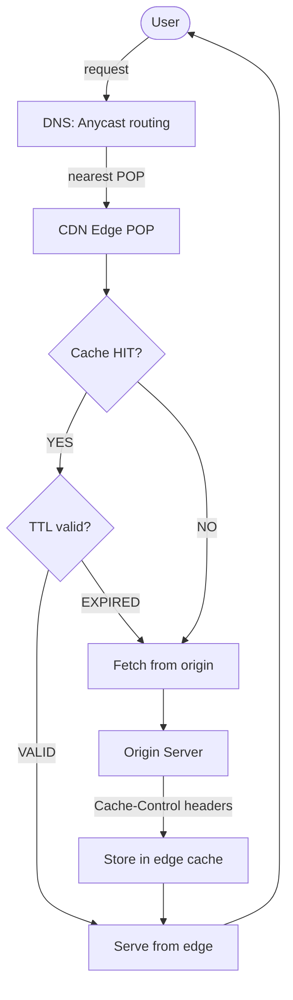
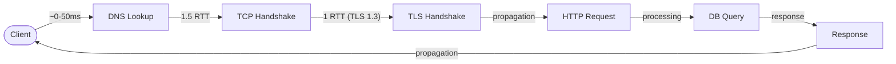

## Keywords in This File
{: .no_toc }

| # | Keyword | Weight |
|---|---|---|
| 16 | [CDN Architecture and Cache Invalidation](#cdn-architecture-and-cache-invalidation) | high |
| 17 | [Network Latency: Sources, Measurement, and Optimization](#network-latency-sources-measurement-and-optimization) | high |

---

# CDN Architecture and Cache Invalidation

---
id: CN-016
title: "CDN Architecture and Cache Invalidation"
category: Computer Networks
difficulty: ★★☆
interview_weight: high
seniority: mid-senior
tags: #cdn #cache-invalidation #edge #ttl #purge #origin
---

## Quick Reference

**One-line definition:** A CDN (Content Delivery Network) distributes content to geographically dispersed edge nodes close to users, reducing latency and origin load; cache invalidation is the mechanism for ensuring stale content is replaced when the origin changes.

**Difficulty:** ★★☆ | **Asked at:** Mid-Senior | **Seniority:** Mid through Senior

---

### 🎯 Model Answer

**30 seconds:**
A CDN caches content at edge nodes close to users, so a request from London hits a London edge node (5ms) instead of a US-East origin (100ms). The CDN's job: cache HIT = serve from edge (fast), cache MISS = fetch from origin, cache it, serve it. Cache invalidation solves the problem: when origin content changes (new deployment, price update), how do we ensure users don't get the old cached version? Methods: TTL expiry, CDN purge API, URL versioning (cache-busting), or surrogate keys.

**3 minutes:**
**CDN request flow:** Client -> DNS (resolves to nearest CDN POP) -> CDN edge node. If the edge has a fresh cached copy: serve it (cache HIT, ~5ms). If the edge has no copy or TTL expired: cache MISS - edge fetches from origin, caches response, serves to client (~100ms first hit, fast thereafter).

**Cache-Control headers:** The origin controls CDN caching behavior via HTTP headers. `Cache-Control: max-age=3600` - cache for 1 hour. `Cache-Control: s-maxage=86400` - CDN-specific max-age (overrides max-age for shared caches). `Cache-Control: no-store` - never cache. `Cache-Control: private` - client may cache, CDN must not. `Vary: Accept-Encoding` - cache separate copies for different encodings.

**Cache invalidation strategies:**
1. **TTL-based expiry:** content is cached for `max-age` seconds. Simple but stale for up to TTL after update.
2. **Purge API:** call CDN's purge API after deployment to immediately invalidate affected paths. Fast but requires deployment pipeline integration; most CDNs have purge latency of 5-30 seconds.
3. **URL versioning (cache-busting):** include content hash in URL (`app.abc123.js`). Old URL is never invalidated (it's immutable). HTML page references new URL. CDN caches both; old URL naturally expires.
4. **Surrogate keys / cache tags:** associate cached responses with a logical tag (e.g., `product-42`). Purge all responses tagged `product-42` with one API call. Supported by Fastly, Cloudflare Enterprise.

**Blank Mind Recovery:** CDN = copy of your content at 200 cities worldwide. HIT = fast from edge. MISS = slow from origin, then cached. Invalidation = tell edge to discard stale copy. URL versioning = never need to invalidate (new URL = new cache entry).

---

### 📘 Concept Explanation

**Core concept:** A CDN trades consistency (caching creates copies that can diverge from origin) for performance (serving from edge reduces latency by 80-95% for cache hits).

**CDN request flow:**

```
Without CDN:
User (London) -> Origin (US-East): 100ms RTT
Every request: 100ms + server processing

With CDN:
User (London) -> CDN London POP: 5ms RTT
MISS (first request):
  London POP -> Origin (US-East): 100ms
  Origin -> POP: response + Cache-Control
  POP: store in edge cache
  POP -> User: response (105ms first hit)

HIT (subsequent requests):
  London POP: found in cache, TTL valid
  London POP -> User: response (5ms!)
= 95% latency reduction for cache hits
```

> **Code walkthrough:** WHAT IT SHOWS: the latency impact of CDN caching for a user in London accessing a US-East origin. KEY MECHANISM: the CDN POP acts as a local cache; the first request incurs the full origin round trip plus CDN overhead; all subsequent requests within TTL are served from the edge at ~5ms. WHY IT MATTERS: at 60% cache hit ratio and 1M requests/day, 600K requests are served at 5ms instead of 100ms; this reduces origin load by 60% and improves user experience for 60% of requests. WHAT BREAKS: dynamic content (personalised dashboards, authenticated APIs) has 0% cache hit rate unless headers explicitly scope the cache key; CDN charges for both hit and miss requests. TAKEAWAY: always instrument cache hit ratio; below 70% suggests caching configuration issues or overly dynamic content that needs URL versioning or surrogate keys.

**Cache-Control header matrix:**

```
Origin response headers -> CDN behavior:

Cache-Control: max-age=3600
  CDN: cache 1 hour (and browser)

Cache-Control: s-maxage=86400, max-age=3600
  CDN: cache 24 hours (s-maxage for shared)
  Browser: cache 1 hour (max-age)

Cache-Control: no-store
  CDN: never cache; always fetch from origin

Cache-Control: private
  CDN: must not cache (user-specific content)
  Browser: may cache for that user

Cache-Control: no-cache
  CDN: cache but revalidate with origin on
  every request (ETag / If-None-Match)
  = low origin bandwidth but full RTT

Vary: Accept-Language
  CDN: caches separate copies per language
  = 5 languages = 5x cache space required
```

> **Code walkthrough:** WHAT IT SHOWS: how Cache-Control header values determine CDN caching behavior and the distinction between s-maxage (CDN-targeted) and max-age (browser-targeted). KEY MECHANISM: s-maxage was introduced specifically to allow different TTLs for shared caches (CDNs) vs private caches (browsers); with s-maxage=86400 the CDN holds the copy for 24 hours while browsers revalidate hourly. WHY IT MATTERS: without s-maxage, you must use the same TTL for both CDN and browser; s-maxage lets the CDN hold content for days while browsers re-check more frequently. WHAT BREAKS: Vary: Accept-Language multiplies cache space; 5 languages x 1GB cached content = 5GB edge storage; CDN edges with limited storage evict these entries faster, reducing hit ratio. TAKEAWAY: always use s-maxage to separate CDN TTL from browser TTL; avoid Vary headers with high-cardinality values.

**Cache invalidation approaches:**

```
Strategy 1: TTL Expiry (simplest)
Origin sets: Cache-Control: max-age=3600
After deployment: stale for up to 1 hour
= acceptable for slowly-changing content

Strategy 2: CDN Purge API
After deployment:
curl -X POST https://api.cloudflare.com/
  client/v4/zones/{zone_id}/purge_cache \
  -H "Authorization: Bearer {API_KEY}" \
  -d '{"files":["https://example.com/app.js"]}'
= immediate invalidation (5-30s propagation)
= requires API key in deployment pipeline

Strategy 3: URL Versioning (cache-busting)
index.html references: /app.abc123.js
After update: /app.def456.js
= new URL = new CDN entry (never stale)
= old URL remains cached until TTL (orphan)
= HTML must be served with short TTL or no-cache

Strategy 4: Surrogate Keys (Fastly/Cloudflare)
Origin sets: Surrogate-Key: product-42 sale
Purge: PURGE https://api.fastly.com/
  purge/product-42
= invalidates ALL responses tagged product-42
= supports complex content relationships
```

> **Code walkthrough:** WHAT IT SHOWS: four cache invalidation strategies with their trade-offs. KEY MECHANISM: TTL expiry is passive (time-based), purge is active (event-driven), URL versioning converts the cache invalidation problem into a new URL problem, and surrogate keys enable semantic invalidation by content tags. WHY IT MATTERS: URL versioning is the most reliable approach for assets (JS, CSS, images) because it's impossible to serve stale content - the filename encodes the content hash; any change creates a new URL. WHAT BREAKS: if HTML pages are cached with a long TTL, the HTML still references old asset URLs even after the CDN has new asset files; HTML must have a short TTL or use CDN purge on each deployment. TAKEAWAY: combine URL versioning (for assets, long TTL) with CDN purge (for HTML/API responses, immediate update); this achieves maximum cache efficiency with reliable freshness.

The following diagram shows CDN cache decision flow.



> **Diagram walkthrough:** WHAT IT DEPICTS: the CDN cache decision tree from client request through DNS routing to edge cache hit or origin fetch. HOW TO READ IT: the client's request is routed by anycast DNS to the nearest POP; the POP checks if a valid cached copy exists; hits are served directly; misses fetch from origin and populate the cache. KEY RELATIONSHIP: Cache-Control headers from the origin control whether the response is stored and for how long - without them, CDNs use heuristic caching (often 10% of the Last-Modified age). EDGE CASE: if the origin is unavailable, some CDNs serve stale content (stale-while-revalidate, stale-if-error directives); this is a reliability feature but may serve outdated critical data. INSIGHT: cache hit ratio is the CDN's primary performance indicator; low hit ratio (< 50%) usually means content varies by cookie, query string, or user agent - the CDN must be configured to normalise or ignore these to improve hits.

---

### 💻 Code Example

**BAD: HTML served with long TTL, preventing updates**

```nginx
# BAD: serving index.html with 1-day cache
# After deployment, users get stale HTML
# even after CDN purge completes
server {
    location / {
        root /var/www/html;
        # WRONG: same long cache for HTML and assets
        add_header Cache-Control
            "public, max-age=86400";
    }
}
```

> **Code walkthrough:** WHAT IT SHOWS: the anti-pattern of applying a long TTL to HTML pages that reference versioned assets. KEY MECHANISM: the HTML page at `/` is cached for 24 hours; after a deployment, the CDN serves the old HTML for up to 24 hours; this HTML references old asset hashes; the new asset files are deployed but the cached HTML doesn't reference them. WHY IT MATTERS: users with cached HTML see old JS/CSS files even after the CDN has new copies, creating version mismatches that cause runtime errors. WHAT BREAKS: even if the CDN is purged after deployment, browsers that have the old HTML cached locally continue to request old assets. TAKEAWAY: HTML must be served with no-cache or very short TTL (60 seconds); static assets with content-hash URLs can use max-age=31536000 (1 year).

**GOOD: Split caching strategy for HTML and assets**

```nginx
server {
    listen 443 ssl;

    # HTML: no CDN cache, short browser cache
    # Ensures users always get current HTML
    location ~* \.html$ {
        root /var/www/html;
        add_header Cache-Control
            "no-cache, must-revalidate";
        # CDN: always fetch from origin
        # Browser: revalidate with ETag
        add_header Vary "Accept-Encoding";
    }

    # Versioned assets: cache forever
    # filename contains content hash: app.abc123.js
    # New version = new filename = new cache entry
    location ~* \.[0-9a-f]{8}\.(js|css|png|woff2) {
        root /var/www/html;
        add_header Cache-Control
            "public, max-age=31536000, immutable";
        # s-maxage allows CDN to cache even longer
        # (already 1 year, but signals CDN intent)
        add_header Surrogate-Control
            "max-age=31536000";
    }

    # API responses: short CDN cache
    location /api/ {
        proxy_pass http://api_backend;
        # CDN: 10 min; browser: 30 sec
        add_header Cache-Control
            "public, s-maxage=600, max-age=30";
    }
}
```

> **Code walkthrough:** WHAT IT SHOWS: a split caching strategy that gives HTML, versioned assets, and API responses each their optimal TTL. KEY MECHANISM: HTML uses no-cache (CDN always revalidates with origin on every request, using ETag to avoid retransmitting unchanged content); assets use immutable + 1-year TTL (the immutable directive tells browsers to never revalidate since the URL includes a content hash); API responses use s-maxage=600 (CDN caches 10 minutes) with shorter max-age=30 (browser caches 30 seconds). WHY IT MATTERS: the immutable directive saves browsers from sending conditional GET requests for hashed assets - once they have it, they know it will never change at that URL. WHAT BREAKS: if the build process does not regenerate content hash filenames on every change, the immutable directive serves stale content with no way to invalidate it. TAKEAWAY: always verify that your build pipeline changes asset filenames when content changes; the immutable directive is a promise to browsers that you must keep.

---

### 🎓 Answers by Seniority

**Junior / Mid-level answer:**
A CDN caches content at edge nodes close to users, reducing latency by serving from a nearby node instead of the origin server. Cache hits return in milliseconds vs hundreds of milliseconds for origin fetches. Cache-Control headers control CDN behavior: `max-age` sets how long to cache, `s-maxage` sets CDN-specific TTL, `private` prevents CDN caching. Invalidation options: wait for TTL expiry, call the CDN's purge API, or use URL versioning (content hash in filename).

**Senior / Staff answer:**
I design CDN caching around content type: assets (JS, CSS, images) get URL versioning with `Cache-Control: immutable, max-age=31536000` - these never need invalidation because every change creates a new URL. HTML pages get `no-cache` so the CDN always revalidates; ETag support means the origin only transmits data when the HTML actually changes (304 Not Modified). APIs use short TTLs (30-300 seconds) with CDN purge on write operations for time-sensitive data. The key metric I watch is CDN hit ratio by content type - a hit ratio below 80% for static assets indicates a caching bug; hit ratio for APIs below 30% might be acceptable if content is highly dynamic. For invalidation pipelines, I integrate CDN purge into the CI/CD pipeline (post-deployment step) rather than relying on TTL expiry, targeting invalidation within 30 seconds of any deployment.

---

### ⚠️ Common Misconceptions

**Misconception 1: "CDN caches only static content"**
CDNs can cache API responses if Cache-Control headers permit it. Many APIs benefit from edge caching (product catalog, public prices, news feed). The CDN caches based on headers, not content type.

**Misconception 2: "Purging the CDN is instant"**
CDN purge propagates across all edge nodes within 5-30 seconds globally (varies by CDN). During propagation, some edge nodes serve the old content. For critical updates (security fixes, price corrections), combine purge with a short TTL to bound maximum stale window.

**Misconception 3: "Cache-Control: no-cache means CDN doesn't cache"**
`no-cache` means "cache but revalidate with origin on every request" - the CDN can store a copy but must confirm freshness with the origin (via ETag or Last-Modified). `no-store` means "never store anywhere." Many engineers confuse these.

**Misconception 4: "High CDN hit ratio is always good"**
If personalised content is being cached (e.g., user-specific pricing leaked into a public cache), a high hit ratio means many users are getting someone else's data. Always verify that cached responses are not user-specific before deploying CDN caching.

---

### 🚨 Failure Modes and Diagnosis

**Failure 1: Cache poisoning (wrong content served)**

```bash
# Symptom: users see another user's data
# or wrong-language content

# Check CDN cache key configuration
# If cache key includes Cookie header,
# different users share cache entries only
# when cookies match

# Cloudflare: check Cache-Control headers
curl -v https://example.com/api/profile \
  -H "Cookie: session=abc123" \
  2>&1 | grep -E "CF-Cache|Cache-Control|Age"
# CF-Cache-Status: HIT = cached (DANGER if user data)
# Cache-Control: private = should NOT be cached

# Fix: ensure user-specific responses include:
# Cache-Control: private, no-store
```

> **Code walkthrough:** WHAT IT SHOWS: diagnosing cache poisoning where user-specific content is being cached and served to other users. KEY MECHANISM: CF-Cache-Status: HIT on a user-specific endpoint means Cloudflare is serving cached content; if the cache key doesn't include the session cookie, all users get the same cached profile. WHY IT MATTERS: cache poisoning of authenticated endpoints exposes user data to other users - a GDPR and PII violation. WHAT BREAKS: authenticated endpoints that return user-specific data MUST include Cache-Control: private or no-store; any response marked public may be cached by CDN or shared proxies. TAKEAWAY: audit all API endpoints for Cache-Control headers; any endpoint that accesses session data or user identity must return Cache-Control: private, no-store.

**Failure 2: Cache stampede on TTL expiry**

```bash
# Symptom: origin CPU spikes every N minutes
# (N = TTL value); many simultaneous cache misses

# Cause: popular resource's TTL expires at the
# same time on all edge nodes; all nodes
# simultaneously request from origin

# Mitigation 1: request collapsing
# Most CDNs collapse concurrent MISS requests:
# 100 simultaneous misses -> 1 origin request
# Verify: Cloudflare "Tiered Cache" enables this

# Mitigation 2: stale-while-revalidate
# Serve stale while refreshing in background:
Cache-Control: s-maxage=3600,
  stale-while-revalidate=300

# Edge serves stale up to 300s after TTL expires
# while asynchronously fetching fresh copy
# = zero-latency refreshes
```

> **Code walkthrough:** WHAT IT SHOWS: the cache stampede failure mode and two mitigations - request collapsing and stale-while-revalidate. KEY MECHANISM: request collapsing (also called cache coalescing) means the CDN edge sends only one origin request for all simultaneous cache misses on the same resource; stale-while-revalidate allows the edge to serve the expired cached response for up to 300 additional seconds while fetching a fresh copy in the background. WHY IT MATTERS: without these mitigations, a popular page with 1000 simultaneous users at TTL expiry sends 1000 concurrent origin requests in a 100ms window, overwhelming the origin. WHAT BREAKS: stale-while-revalidate means users may see content up to 300 seconds old after TTL expiry; not suitable for time-sensitive data (prices, stock levels). TAKEAWAY: enable request collapsing (Cloudflare Tiered Cache) for high-traffic content; use stale-while-revalidate only for content where 5-minute staleness is acceptable.

---

### 🎯 Interview Deep-Dive

| Format | Questions | Est. Time |
|---|---|---|
| Junior/Mid | 9 questions | 25-35 min |
| Senior/Staff | 9 questions + extensions | 40-50 min |

**Category: CONCEPT**

**[JUNIOR] Q1 - [CONCEPTUAL] What is a CDN and how does it reduce latency?**

A CDN (Content Delivery Network) is a distributed network of servers (edge nodes or Points of Presence, POPs) located in data centres around the world, close to end users. When a user requests content, DNS routes them to the nearest POP rather than the origin server.

Latency reduction mechanism: instead of a user in London making a round trip to a US-East origin server (100ms RTT), they fetch from a London POP (5ms RTT). For cached content (CSS, JS, images, API responses), this reduces latency by 90-95%.

Cache HIT flow: User -> DNS -> nearest POP -> POP has cached copy -> serve directly (~5ms).

Cache MISS flow: User -> DNS -> nearest POP -> POP has no copy -> POP fetches from origin (100ms) -> POP caches response -> serves to user (105ms first hit; 5ms all subsequent).

The CDN also reduces origin load: if 1 million users request the same page, the CDN serves from cache at edge nodes; only cache misses reach the origin.

*What separates good from great:* Quantifying the latency improvement (100ms to 5ms, 95% reduction) and the origin load reduction (cache hit ratio = % of requests that never reach origin).

---

**[JUNIOR] Q2 - [CONCEPTUAL] What Cache-Control headers does a CDN respect and what do they mean?**

The most important Cache-Control directives for CDN behavior:

- `max-age=N` - cache for N seconds (both CDN and browser)
- `s-maxage=N` - CDN-specific max age; overrides max-age for shared caches
- `private` - CDN MUST NOT cache; client may cache (user-specific content)
- `no-store` - no one should store this response
- `no-cache` - store but revalidate with origin on each request (ETag-based)
- `immutable` - content will never change at this URL; never revalidate
- `stale-while-revalidate=N` - serve stale up to N seconds while refreshing

The most important for CDN tuning: use `s-maxage` to give CDN a longer TTL than the browser (e.g., CDN: 24 hours, browser: 1 hour).

*What separates good from great:* Distinguishing `no-cache` (can store, must revalidate) from `no-store` (cannot store at all) - this is a common interview trap.

---

**[MID] Q3 - [MECHANISM] What is the difference between cache invalidation by TTL, purge, URL versioning, and surrogate keys?**

**TTL expiry:** The CDN automatically removes cached entries after `max-age` seconds. Simplest but stale for up to TTL after a change. Suitable for content that can tolerate staleness (news articles, product images).

**Purge API:** Call the CDN's API to immediately delete specific cached paths. Fast (5-30s propagation). Requires deployment pipeline integration. Suitable for HTML pages and API responses when immediate freshness is required.

**URL versioning (cache-busting):** Include a content hash in the asset URL (`app.abc123.js`). New content = new URL = new cache entry; the old URL is never updated (it's immutable). The CDN never needs to be told to invalidate - you just reference the new URL. Suitable for CSS, JavaScript, images.

**Surrogate keys / cache tags:** Origin sends a response header `Surrogate-Key: product-42 category-electronics`. CDN associates this response with those tags. Purge `product-42` to invalidate all responses tagged with it. One API call invalidates thousands of related pages. Supported by Fastly and Cloudflare Enterprise.

*What separates good from great:* URL versioning being the most reliable (impossible to serve stale content at the new URL) and why it's the standard practice for build pipelines.

---

**Category: DEBUGGING**

**[SENIOR] Q4 - [DEBUGGING] After a deployment, 20% of users still see the old version. How do you diagnose?**

Step 1: Determine if CDN or browser is serving stale:

```bash
# Check CDN cache headers in response
curl -I https://example.com/ \
  | grep -E "Age|Cache-Status|CF-Cache"
# Age: 3547 = content is 3547 seconds old
# CDN hasn't been purged/TTL hasn't expired
```

> **Code walkthrough:** WHAT IT SHOWS: using curl -I to inspect CDN cache headers and determine staleness source. KEY MECHANISM: the Age header shows how old the cached copy is in seconds; CF-Cache-Status: HIT confirms Cloudflare is serving from cache; Age > 0 with HIT means the CDN is serving the old version. WHY IT MATTERS: distinguishing CDN staleness from browser staleness determines the fix - CDN purge fixes the former, a cache-busting deployment fixes the latter. WHAT BREAKS: if Age is 0 and the user still sees old content, their browser has a locally cached copy with a long max-age TTL; the fix is a cache-busting URL for subsequent deployments. TAKEAWAY: always check Age header first; CDN staleness is usually a deployment pipeline configuration issue (missing CDN purge step); browser staleness is a Cache-Control max-age setting issue.

Step 2: Check if CDN purge ran:
- Check deployment logs for CDN purge API call
- Check CDN purge API response code (200 = success, 401 = auth error)

Step 3: Check browser cache: DevTools -> Network -> disable cache -> reload. If correct version appears, the issue is browser cache (max-age too long or immutable on non-versioned URL).

*What separates good from great:* Immediately checking the Age header to distinguish CDN vs browser staleness, rather than blindly invalidating everything.

---

**[SENIOR] Q5 - [DEBUGGING] CDN hit ratio dropped from 85% to 40% overnight. What happened?**

Possible causes to investigate in order:

1. **New query string parameter:** a new tracking parameter (`?utm_campaign=summer`) creates a new cache key for every UTM variation. Verify by checking CDN miss reasons.

2. **Cookie variance added:** a new feature added a `Set-Cookie` header to responses that previously had none. CDN excludes cookied responses from cache by default.

3. **Cache-Control header change:** a new backend version accidentally changed `s-maxage=86400` to `no-cache`.

4. **Traffic pattern change:** a sudden influx of requests for uncached (long-tail) URLs (e.g., search results, personalised URLs) lowers the overall hit ratio.

Diagnostic steps:
- CDN analytics: compare hit/miss ratio by URL pattern (grouped by path, not full URL)
- Check CDN "top miss" URLs for new patterns
- Compare Cache-Control headers between old and new backend deployment

*What separates good from great:* Query string as the first hypothesis - UTM parameters are the most common cause of unexpected hit ratio drops after marketing campaigns launch.

---

**Category: TRADE-OFF**

**[SENIOR] Q6 - [TRADE-OFF] What are the trade-offs between long CDN TTL and aggressive cache invalidation?**

**Long TTL (hours/days):**

Benefits:
- High cache hit ratio (less origin traffic, lower latency)
- Lower CDN egress cost (many responses served from edge)
- Resilience: if origin goes down, stale content continues serving

Costs:
- Updates are slow to propagate (users see old content)
- Must rely on CDN purge API for timely updates (adds operational dependency)
- Mistakes in production (wrong prices, broken HTML) stay visible longer

**Short TTL (seconds/minutes):**

Benefits:
- Updates propagate naturally (low staleness bound)
- No purge infrastructure needed
- Errors self-correct quickly

Costs:
- Lower hit ratio (more requests reach origin)
- Higher origin load (must handle more requests)
- Higher latency during cache miss (every few minutes)

**Sweet spot strategy:** long TTL for versioned assets (immutable), short TTL for HTML (no-cache/60s), medium TTL for API responses (s-maxage=300) with CDN purge on writes. This combines hit efficiency with operational control.

*What separates good from great:* Articulating stale-while-revalidate as a third option that gives long TTL performance with background refresh freshness - the best of both worlds for non-critical data.

---

**[SENIOR] Q7 - [TRADE-OFF] When should you NOT use a CDN?**

**Cases where CDN adds cost without benefit:**

1. **Highly dynamic content (0% cache hit rate):** Real-time trading data, personalised API responses, session-based content. CDN caching is disabled (Cache-Control: private/no-store); the CDN becomes a pass-through that adds latency and cost.

2. **Internal APIs (intranet):** APIs only called from within the data centre or VPC have network latency of < 1ms; CDN edge nodes are irrelevant.

3. **Content that must not be cached for compliance:** HIPAA-regulated health data, financial transaction responses, personally identifiable information - these must not reside on third-party CDN infrastructure.

4. **WebSocket / streaming connections:** CDNs cache static responses; WebSocket connections and HTTP long-polling are not cacheable. The CDN becomes a reverse proxy without caching value (though it still provides DDoS protection).

5. **B2B APIs with authenticated machine-to-machine calls:** Service-to-service calls with unique credentials per request have 0% cache hit rate; direct routing is faster.

*What separates good from great:* Recognising compliance constraints (HIPAA, PCI-DSS) that prevent caching on shared CDN infrastructure.

---

**Category: BEHAVIORAL**

**[SENIOR] Q8 - [BEHAVIORAL] Describe a CDN caching incident you diagnosed or prevented.**

Situation: An e-commerce site deployed a price update for a seasonal sale. Despite CDN purge, 15% of users saw old prices for 4 minutes post-deployment.

Task: Reduce the stale-price window to under 30 seconds.

Action:
1. Diagnosed: CDN purge propagated globally in 30 seconds, but the product pages had `Vary: Accept-Language` with 6 language variants. The purge API purged the English URL but not the 5 localised URLs, which used different cache keys.
2. Fix part 1: updated the purge script to iterate all language codes and purge each variant URL.
3. Fix part 2: switched from TTL-based expiry to surrogate key invalidation. Product pages include `Surrogate-Key: product-{id}` in response headers. Post-deployment, the pipeline purges by product ID, invalidating all language variants in one API call.

Result: Stale-price window reduced from 4 minutes to under 15 seconds (surrogate key purge propagation time).

*What separates good from great:* Identifying the Vary header as the root cause (it creates separate cache entries per language) and switching to surrogate keys as a scalable solution.

---

**[STAFF] Q9 - [DESIGN] Design a CDN caching strategy for a news website serving 50 million users globally with content that changes every 30 minutes.**

**Content types and their caching strategy:**

1. **Homepage and article pages (HTML):**
   - TTL: `s-maxage=120, stale-while-revalidate=60`
   - 2-minute CDN TTL; stale served for 1 extra minute during refresh
   - CDN purge on every publish event (via CMS webhook -> purge API)
   - Result: content within 120 seconds of publication, often 30 seconds via purge

2. **Images and videos:**
   - URL versioning: `/img/article-headline.{hash}.jpg`
   - TTL: `max-age=31536000, immutable`
   - Never invalidated; new uploads get new URLs

3. **JavaScript/CSS bundles:**
   - URL versioning (Webpack content hash)
   - TTL: `max-age=31536000, immutable`

4. **Real-time data (live sports scores, breaking news ticker):**
   - CDN bypass: `Cache-Control: no-store`
   - Served directly from origin or via dedicated real-time data pipeline (WebSocket/SSE)

5. **Multi-region strategy:**
   - Cloudflare or Fastly with tiered caching (regional PoPs cache from central shield node)
   - Shield nodes prevent origin stampede (one shield per region fetches from origin)

*What separates good from great:* The shield node pattern - without a CDN shield, 200 edge POPs each miss independently and all hit the origin simultaneously; a shield node collapses 200 misses into 1 per region.

---

### ⚖️ Comparison Table

| Strategy | Staleness | Complexity | Use For |
|---|---|---|---|
| TTL expiry only | Up to TTL | Low | Slowly-changing content |
| CDN purge | 5-30s after deploy | Medium | HTML, API responses |
| URL versioning | Zero (new URL) | Medium (build) | JS, CSS, images |
| Surrogate keys | 5-30s after tag purge | High (header + API) | Complex content graphs |
| no-cache + ETag | Near-zero (bandwidth ok) | Low | Low-traffic, max-fresh |
| stale-while-revalidate | Up to TTL + revalidate | Low | Tolerates brief staleness |

> **Diagram walkthrough:** WHAT IT DEPICTS: six cache invalidation strategies compared on staleness window and implementation complexity. HOW TO READ IT: lower staleness = more complex or more operational work; higher staleness = simpler but potentially stale content during updates. KEY RELATIONSHIP: URL versioning achieves zero staleness with medium complexity because it converts the invalidation problem into a deployment pipeline problem. EDGE CASE: stale-while-revalidate requires CDN support (Cloudflare, Fastly support it; older CDNs may ignore it and treat it as max-age only). INSIGHT: production systems typically combine multiple strategies - URL versioning for assets (zero-staleness guarantee), CDN purge for HTML (fast operational control), and TTL expiry for low-priority API responses.

---

### 🏛️ System Design

*(Omit: ★★☆ difficulty - system design section targets ★★★ architectural keywords.)*

---

### 📊 Diagram

*(See Concept Explanation above; the CDN cache decision flow Mermaid diagram appears in that section.)*

---
---

# Network Latency: Sources, Measurement, and Optimization

---
id: CN-017
title: "Network Latency: Sources, Measurement, and Optimization"
category: Computer Networks
difficulty: ★★☆
interview_weight: high
seniority: mid-senior
tags: #latency #rtt #ping #traceroute #tcp #optimization #p99
---

## Quick Reference

**One-line definition:** Network latency is the time for a packet to travel from sender to receiver; it is determined by propagation delay (speed of light), transmission delay (bandwidth), processing delay (router/switch), and queuing delay (congestion); optimisation requires identifying which component dominates.

**Difficulty:** ★★☆ | **Asked at:** Mid through Senior | **Seniority:** Mid-Senior

---

### 🎯 Model Answer

**30 seconds:**
Latency has four components: propagation delay (speed of light in fiber - irreducible), transmission delay (bandwidth - reducible with more bandwidth), processing delay (router forwarding - tiny), and queuing delay (congestion - reducible with better routing and capacity). For most web applications, the dominant sources are propagation (geography matters - US to Australia is 170ms minimum), TCP handshakes (1.5 RTT overhead per connection), and TLS handshakes (1 additional RTT). Measure with ping, traceroute, and p99 percentiles from application logs.

**3 minutes:**
**Propagation delay:** Light travels at ~200,000 km/s in fiber (2/3 the speed of light in vacuum). New York to London is 5,600 km; minimum propagation time is 28ms one-way, 56ms RTT. This is a physics limit - irreducible without getting physically closer (CDN edge nodes, regional services).

**TCP handshake overhead:** Every new TCP connection requires 1.5 RTT before data can be sent: SYN (client) -> SYN-ACK (server) -> ACK+data (client). At 100ms RTT, that's 150ms of setup. Mitigations: HTTP keep-alive (reuse connections), HTTP/2 multiplexing (one connection for multiple requests), connection pooling.

**TLS 1.3 overhead:** TLS 1.3 adds 1 RTT on top of TCP: ClientHello -> ServerHello+cert+Finished -> Finished+request -> response. TLS 1.3 session resumption reduces this to 0.5 RTT (0-RTT). At 100ms RTT, TLS adds 100ms without resumption.

**Queuing delay (bufferbloat):** When a router's queue fills, packets wait behind other packets. This can add 10-1000ms of variable latency ("jitter"). Solutions: smaller queues (low-latency mode), Active Queue Management (AQM algorithms: CoDel, FQ-CoDel), or traffic shaping.

**Measurement:** `ping` for basic RTT. `traceroute` for hop-by-hop path analysis. Application-layer P99 latency (99th percentile) from logs is more meaningful than average. P99 > 2x P50 = latency outliers (usually TCP retransmission, GC pause, or connection pool wait).

**Blank Mind Recovery:** Latency = propagation (distance, irreducible) + transmission (bandwidth) + processing (negligible) + queuing (congestion). Fight distance with CDN/edge. Fight handshakes with persistent connections and HTTP/2. Measure with P99, not average.

---

### 📘 Concept Explanation

**Core concept:** Understanding which latency component dominates in your system determines which optimisation to pursue. Reducing irreducible propagation delay requires physical proximity (CDN, multi-region deployment).

**The four latency components:**

```
1. Propagation Delay (geography, physics limit)
   = distance / speed of light in fiber
   = 1000 km / 200,000 km/s = 5ms one-way
   NY to London: 5600 km = 28ms one-way
   Can reduce: move servers closer to users (CDN)
   Cannot reduce: beyond physics

2. Transmission Delay (bandwidth limit)
   = packet_size / bandwidth
   = 1500 bytes / 100 Mbps = 0.12ms
   Usually negligible for modern broadband
   Matters: large file on low-bandwidth link

3. Processing Delay (router/switch forwarding)
   = microseconds per hop
   Usually <1ms total, negligible

4. Queuing Delay (congestion, most variable)
   = time waiting in router/switch queue
   = 0ms (no queue) to 1000ms (saturated link)
   Highly variable -> causes p99 spikes
```

> **Code walkthrough:** WHAT IT SHOWS: the four latency components with their formulas and magnitude. KEY MECHANISM: propagation delay is the physics floor - no software optimisation can reduce it; transmission delay is relevant only for large payloads on limited bandwidth; processing delay is negligible in modern hardware; queuing delay is the most variable and the source of P99 spikes. WHY IT MATTERS: engineers often try to optimise the wrong component - adding caching when the latency source is geographic (propagation delay), or adding bandwidth when the latency source is TCP handshakes. WHAT BREAKS: diagnosing latency sources requires measurement at each layer; traceroute shows hop-by-hop RTT to identify the dominant propagation leg; application logs show request latency distribution to identify P99 outliers. TAKEAWAY: before optimising latency, measure which component dominates; propagation = CDN; handshakes = persistent connections; queuing = capacity or traffic shaping.

**TCP connection overhead:**

```
TCP + TLS 1.3 handshake timeline:
ms  0: Client sends SYN
ms 50: Server receives SYN (50ms propagation)
ms 50: Server sends SYN-ACK + TLS ServerHello
ms100: Client receives SYN-ACK
ms100: Client sends ACK + TLS ClientHello response
ms150: Server receives, sends TLS Finished
ms200: Client receives Finished
ms200: Client sends HTTP request
ms250: Server receives request, processes, responds
ms300: Client receives response

= 300ms total for 1 HTTP request at 50ms RTT
  of which 150ms is TCP+TLS setup (50%)!

With HTTP keep-alive (reuse connection):
ms  0: Client sends HTTP request (connection open)
ms 50: Server receives, processes, responds
ms100: Client receives response

= 100ms for same request (67% faster)
```

> **Code walkthrough:** WHAT IT SHOWS: the overhead of TCP+TLS handshake vs connection reuse at 50ms RTT. KEY MECHANISM: TCP three-way handshake takes 1 full RTT (100ms); TLS 1.3 takes 1 additional RTT (100ms); together they consume 200ms of a 300ms total request time; HTTP keep-alive eliminates this by reusing the established connection. WHY IT MATTERS: for APIs called multiple times per user session, the first call establishes the connection; subsequent calls are 3x faster; this is why API clients should use persistent connections (connection pooling). WHAT BREAKS: if keep-alive connections are not pooled (a new connection per API call), the application pays the full handshake overhead every time. TAKEAWAY: always use HTTP persistent connections and connection pooling for service-to-service communication; the handshake overhead dominates at typical inter-datacenter RTTs.

**P99 vs average latency:**

```
Latency distribution for 1000 requests:
ms  10: 900 requests (fast, cache hits)
ms  50: 80 requests (cache misses, normal)
ms 200: 15 requests (DB queries, slow paths)
ms1500: 5 requests (TCP retransmit, GC pause)

Average = (900*10 + 80*50 + 15*200 + 5*1500)/1000
        = (9000 + 4000 + 3000 + 7500)/1000
        = 23.5ms average

P50 (median) = 10ms (50th percentile)
P95 = ~50ms (95th percentile)
P99 = ~200ms (99th percentile)
P99.9 = 1500ms (99.9th percentile)

Average hides the 1500ms outliers
P99 = what your slowest 1% of users experience
P99.9 = what your high-value users (who reload
        most) are likely to experience
```

> **Code walkthrough:** WHAT IT SHOWS: how average latency conceals the true worst-case experience seen by real users, and why percentile-based metrics are essential. KEY MECHANISM: 5 requests at 1500ms add 7500ms to the average, dragging it from ~15ms to 23.5ms; but the P99 reveals that 1% of users wait 200ms and P99.9 reveals 0.1% wait 1500ms. WHY IT MATTERS: SLAs should be defined on P99 or P99.9, not average; "average response time < 50ms" can be met while 1% of users wait 2 seconds. WHAT BREAKS: P99 spikes that correlate with GC pauses (every 5-10 minutes) or TCP retransmission timeouts (every 200ms = RTO) indicate application-level, not network-level issues. TAKEAWAY: always alert on P99 latency, not average; instrument your application to emit latency histograms (Prometheus histogram) for accurate percentile calculation.

The following diagram shows latency measurement across the request path.



> **Diagram walkthrough:** WHAT IT DEPICTS: the sequential latency components in a full client-to-server request including DNS, TCP, TLS, request processing, and database query. HOW TO READ IT: each arrow is a latency source; boxes are where time is spent; arrows are transmission or propagation time. KEY RELATIONSHIP: DNS, TCP, and TLS are all per-connection overhead that can be amortised via connection reuse; the DB query and processing time are per-request. EDGE CASE: DNS latency can spike from 0ms (cached) to 200ms (uncached DNSSEC validation); set appropriate DNS TTLs and verify clients cache DNS records. INSIGHT: for microservice calls, the DNS -> TCP -> TLS overhead repeats for each service; service mesh (Envoy sidecar) with connection pooling and DNS caching eliminates this overhead for inter-service communication.

---

### 💻 Code Example

**BAD: No connection reuse - paying handshake cost every call**

```java
// BAD: creating new HTTP client per request
// Each call: DNS + TCP + TLS = ~150ms overhead
// on a 50ms RTT network
@Service
public class PaymentService {
    public PaymentResult charge(Order order) {
        // NEW client per call - no connection reuse
        HttpClient client = HttpClient.newBuilder()
            .connectTimeout(Duration.ofSeconds(5))
            .build();
        HttpRequest req = HttpRequest.newBuilder()
            .uri(URI.create(
                "https://payments.example.com/charge"))
            .POST(BodyPublishers.ofString(
                order.toJson()))
            .build();
        // Each call: DNS + TCP SYN/SYN-ACK/ACK
        // + TLS handshake = 3 RTTs wasted
        return client.send(req,
            BodyHandlers.ofString());
    }
}
```

> **Code walkthrough:** WHAT IT SHOWS: the anti-pattern of creating a new HttpClient per service call, which prevents connection reuse. KEY MECHANISM: Java's HttpClient with no explicit connection pool creates a new TCP connection for each call; at 50ms RTT, each connection wastes 150ms on handshakes before any application data is exchanged. WHY IT MATTERS: a payment service called 100 times per second pays 100 x 150ms = 15 seconds of wasted handshake time per second across the application - consuming threads and increasing tail latency. WHAT BREAKS: Java 11 HttpClient does support HTTP/2 multiplexing when the server supports it; but this anti-pattern disables it by creating throwaway clients. TAKEAWAY: always create HTTP clients as singletons or beans injected at startup; the client manages a connection pool internally.

**GOOD: Singleton HTTP client with connection pooling**

```java
@Configuration
public class HttpClientConfig {

    @Bean
    public HttpClient httpClient() {
        // Single instance; reuses connections
        return HttpClient.newBuilder()
            .version(HttpClient.Version.HTTP_2)
            .connectTimeout(Duration.ofSeconds(2))
            .executor(Executors.newFixedThreadPool(20))
            .build();
        // HTTP/2 multiplexes many requests over
        // one TCP+TLS connection
    }
}

@Service
public class PaymentService {

    private final HttpClient client;

    public PaymentService(HttpClient client) {
        this.client = client;
    }

    public PaymentResult charge(Order order) {
        HttpRequest req = HttpRequest.newBuilder()
            .uri(URI.create(
                "https://payments.example.com/charge"))
            .POST(BodyPublishers.ofString(
                order.toJson()))
            .header("Content-Type", "application/json")
            .timeout(Duration.ofSeconds(5))
            .build();
        // Reuses existing connection:
        // DNS cached, TCP open, TLS session resumed
        // Actual latency = propagation + processing
        HttpResponse<String> resp = client.send(
            req, BodyHandlers.ofString());
        return parseResult(resp.body());
    }
}
```

> **Code walkthrough:** WHAT IT SHOWS: a singleton HttpClient bean with HTTP/2 support that reuses connections across all service calls. KEY MECHANISM: the singleton HttpClient maintains an internal connection pool; subsequent requests to the same host reuse the existing TCP+TLS connection; HTTP/2 multiplexes multiple concurrent requests on one connection, reducing latency to propagation + processing time only. WHY IT MATTERS: with HTTP/2 and connection reuse, 100 requests/second to the same payment service share 1-5 connections; total handshake overhead drops from 15 seconds/second to near-zero. WHAT BREAKS: the request timeout (5s) must be set at the request level, not the client level, to apply per-request; without it, a slow payment service holds a thread indefinitely. TAKEAWAY: always configure per-request timeouts even with singleton HTTP clients; a slow downstream service with no timeout can exhaust your thread pool.

---

### 🎓 Answers by Seniority

**Junior / Mid-level answer:**
Network latency has four components: propagation (physics, distance), transmission (bandwidth), processing (router forwarding), and queuing (congestion). The most common sources of high latency in applications are: geographic distance (fix with CDN/edge deployment), TCP handshakes per request (fix with keep-alive/HTTP/2), and connection pool exhaustion (fix with pooling). Measure with `ping` (propagation) and application P99 percentile (tail latency).

**Senior / Staff answer:**
Latency optimisation requires attributing where time is spent. I use a layered approach: First, measure P50/P99/P99.9 latency from application logs. P99 > 3x P50 indicates outliers from TCP retransmission (check `ss -s` for retransmit count), GC pauses (check GC logs), or connection pool wait (check Hikari pending metrics). Second, use distributed tracing (Zipkin, Jaeger) to identify which service call in a chain contributes the most latency. Third, check for TCP inefficiencies: Nagle's algorithm (disable with TCP_NODELAY for latency-sensitive protocols), connection setup overhead (measure with ping + traceroute), and TCP retransmission. The most impactful optimisations at scale: (1) CDN/edge deployment to reduce propagation delay, (2) HTTP/2 multiplexing to eliminate per-request handshake overhead, (3) connection pooling to amortise TCP setup, (4) database read replicas in the same region as the application to reduce data access latency.

---

### ⚠️ Common Misconceptions

**Misconception 1: "Average latency is a good performance metric"**
Average latency hides the tail. 1% of users experiencing 2-second responses can have a disproportionate business impact (high-value users often retry more, hitting P99 more frequently). Always use P99 for SLA commitments.

**Misconception 2: "More bandwidth always reduces latency"**
Bandwidth reduces transmission delay (bytes in flight). For small requests (< 1KB), transmission delay is already sub-millisecond on any modern network. Latency for small requests is dominated by propagation delay and handshake overhead - adding bandwidth doesn't help.

**Misconception 3: "TCP_NODELAY always improves latency"**
TCP_NODELAY disables Nagle's algorithm (which batches small packets to fill a segment). For interactive protocols (SSH, game state), TCP_NODELAY reduces latency by sending small packets immediately. For bulk data transfer, Nagle's algorithm improves throughput by batching. Disabling it for bulk transfer can increase network overhead.

**Misconception 4: "Latency only matters for user-facing systems"**
Service-to-service latency compounds. If service A calls B which calls C, and each hop adds 10ms, the total is 30ms. With 10 microservices in a chain (not unusual in large systems), this is 100ms of pure network overhead. Service mesh with local sidecars (< 0.5ms per hop) and HTTP/2 multiplexing are essential for microservice chains.

---

### 🚨 Failure Modes and Diagnosis

**Failure 1: Sudden P99 latency spike**

```bash
# Check TCP retransmission rate (spike = network issue)
ss -s
# "retrans: 1234/5678" = retransmission ratio

# Check which connections are retransmitting
ss -o state established \
  | grep "timer:(on," \
  | awk '{print $NF}' \
  | sort | uniq -c | sort -rn | head -10

# Check if GC is causing latency (JVM):
# Look for stop-the-world pauses > 100ms
grep "Pause Full\|GC pause" /var/log/app/gc.log \
  | awk -F'ms' '{print $2}' \
  | sort -rn | head -10

# Check connection pool wait time:
curl -s localhost:8080/actuator/metrics/ \
  hikaricp.connections.acquire
```

> **Code walkthrough:** WHAT IT SHOWS: a diagnostic workflow for P99 latency spikes covering TCP retransmission, JVM GC pauses, and connection pool wait time. KEY MECHANISM: ss -s shows TCP stack statistics including retransmission count; high retransmit rate correlates with network congestion or packet loss, causing 200ms (Linux initial RTO) or longer delays; GC pauses stop all application threads, creating bursty latency spikes that appear in P99. WHY IT MATTERS: P99 spikes from GC pauses have a distinctive pattern - they recur on GC intervals (every few seconds to minutes) and affect all concurrent requests, not just a single request. WHAT BREAKS: TCP retransmission with exponential backoff (200ms, 400ms, 800ms...) creates very long-tail latency for the affected requests; even 0.1% packet loss causes some P99 requests to wait 200ms. TAKEAWAY: instrument both application and OS-level metrics; a GC pause causing P99 spikes requires heap tuning; a TCP retransmission spike requires network investigation.

**Failure 2: Latency increases linearly with request rate**

```bash
# Symptom: latency doubles when requests double
# Indicates queuing (Little's Law: L = lambda * W)

# Check server CPU and network saturation
top  # CPU% by process
sar -n DEV 1 10  # network utilisation

# Check if application is CPU-bound
# (latency = 1/throughput when CPU = 100%)

# Check reverse proxy queue depth
# nginx active connections vs worker_connections
grep worker_connections /etc/nginx/nginx.conf
curl http://localhost:8080/nginx_status
# Active connections > 90% of worker_connections
# = queue forming, latency increasing
```

> **Code walkthrough:** WHAT IT SHOWS: diagnosing queuing-induced latency that scales linearly with load. KEY MECHANISM: when a system is CPU-saturated, requests queue; by Little's Law (L = lambda x W), if arrival rate lambda doubles, the average wait time W doubles; this manifests as latency doubling with request rate - the classic queue saturation signature. WHY IT MATTERS: this pattern is the warning sign that the system is approaching capacity; above the saturation point, latency increases exponentially. WHAT BREAKS: nginx's worker_connections limit per worker_process; when active connections approach this limit, new connections are queued or dropped; increase worker_connections and worker_processes or scale horizontally. TAKEAWAY: always monitor utilisation metrics (CPU%, connection count) alongside latency; if latency tracks with utilisation, the system is approaching saturation and needs capacity.

---

### 🎯 Interview Deep-Dive

| Format | Questions | Est. Time |
|---|---|---|
| Junior/Mid | 9 questions | 25-35 min |
| Senior/Staff | 9 questions + follow-ups | 40-55 min |

**Category: CONCEPT**

**[JUNIOR] Q1 - [CONCEPTUAL] What are the four components of network latency and which is most reducible?**

The four components:

1. **Propagation delay:** time for a signal to travel the physical medium. Set by geography and the speed of light in fiber (~200,000 km/s). A packet from New York to London (5,600 km) has a minimum propagation delay of 28ms one-way.

2. **Transmission delay:** time to push all packet bits onto the wire. `= packet_size / bandwidth`. At 1Gbps, a 1500-byte packet takes 12 microseconds. Usually negligible except for very large packets on slow links.

3. **Processing delay:** time for routers and switches to process the packet (lookup forwarding table, check ACL). Microseconds per hop. Negligible in practice.

4. **Queuing delay:** time spent waiting in router queues when a link is congested. Highly variable: 0ms (no queue) to hundreds of milliseconds (saturated link).

Most reducible:
- Propagation: can reduce by moving closer to users (CDN, multi-region) but cannot beat physics
- Queuing: most variable, can reduce with capacity, traffic shaping, AQM
- Transmission: reduce with larger bandwidth or smaller packet sizes (compression)
- Processing: already negligible

*What separates good from great:* Propagation is the floor (physics-bound); queuing is the most variable and controllable component in practice.

---

**[JUNIOR] Q2 - [CONCEPTUAL] What is the difference between P50, P99, and average latency? Why does P99 matter more?**

Given 1000 requests with latencies from 10ms to 2000ms:

- **Average:** sum of all latencies / count. Useful as a rough baseline but misleading because a few extreme values (outliers) inflate the average significantly.
- **P50 (median):** 500th fastest response. The "typical" experience - half of users are faster, half slower.
- **P99:** 990th fastest response. The experience of the slowest 1% of users.
- **P99.9:** 999th fastest response. The worst 0.1% - often the high-engagement users who make the most requests.

Why P99 matters: average latency can be 20ms while P99 is 2000ms. An SLA of "average < 100ms" is met while 1% of users wait 2 seconds. For user experience, the worst-case experienced matters most because users who encounter slowness are most likely to abandon.

Example: a page that takes > 3 seconds loses 50% of visitors (Google research). If P99 is 3 seconds, 1 in 100 page loads triggers this abandonment.

*What separates good from great:* Knowing that users who experience P99 slowness are often the highest-value users who use the product most frequently, making tail latency disproportionately important for retention.

---

**[MID] Q3 - [MECHANISM] How does TCP slow start affect application latency? How do you mitigate it?**

TCP slow start is the algorithm by which a new TCP connection gradually increases its transmission rate, starting at 1-10 MSS (Maximum Segment Size) and doubling each RTT until it reaches the congestion window limit or detects packet loss.

Impact on latency: for large responses (HTML pages, API JSON), TCP slow start means the first 10-15ms, the server can only send 10-15KB per RTT. A 100KB response over a 100ms RTT connection:
- RTT 1: send 10KB (initial window)
- RTT 2: send 20KB (doubled)
- RTT 3: send 40KB (doubled)
- RTT 4: send remaining 30KB
- Total: 4 RTTs = 400ms just for transmission

Mitigations:
1. **TCP Fast Open (TFO):** allows data in the SYN packet, reducing handshake latency.
2. **HTTP keep-alive / connection pooling:** reuses established connections with full congestion window. Eliminates slow start for subsequent requests.
3. **HTTP/2 multiplexing:** many requests on one connection; slow start only for the first connection.
4. **Response compression:** smaller responses finish faster before slow start becomes a bottleneck.
5. **Increase TCP initial congestion window (IW10):** Linux default is 10 MSS (15KB). Some servers use IW20 (30KB).

*What separates good from great:* Knowing that connection reuse (keep-alive) avoids slow start entirely for all requests after the first, making it the most impactful single optimisation.

---

**Category: DEBUGGING**

**[SENIOR] Q4 - [DEBUGGING] A microservice call that takes 5ms locally takes 150ms in production. How do you investigate?**

Step 1: Measure each component separately:

```bash
# Test propagation delay between services
ping -c 10 <service-ip>
# min/avg/max/mdev = 20ms/22ms/30ms/2ms
# 20ms RTT between services (data centre latency)

# Measure DNS resolution time
time curl --resolve service:443:<ip> \
  https://service/health
# Repeat without --resolve to measure DNS cost

# Check if TLS is being renegotiated per call
# (indicates no connection reuse)
curl -v https://service/endpoint 2>&1 \
  | grep -E "Connected|TLS|Session"
```

> **Code walkthrough:** WHAT IT SHOWS: a three-step latency attribution process for a service call that is unexpectedly slow in production. KEY MECHANISM: ping establishes the baseline propagation RTT; comparing curl with and without --resolve measures DNS cost; checking TLS session in curl -v output reveals if TLS resumption is working. WHY IT MATTERS: 150ms for a 5ms operation suggests ~3 RTTs of overhead (150/50ms RTT per RTT) - consistent with DNS + TCP + TLS handshake without connection reuse. WHAT BREAKS: if ping shows 100ms RTT but the code showed 5ms locally, the services are in different regions; this is a deployment configuration problem, not an application bug. TAKEAWAY: always measure the RTT between services in production; services that should be in the same AZ but are across regions produce exactly this pattern.

Step 2: Check if connection pooling is active (check HTTP client configuration, as shown in code examples above).

Step 3: Enable distributed tracing to see span breakdown.

*What separates good from great:* Using ping to establish the propagation RTT baseline before investigating application-level causes; this immediately tells you whether the overhead is network or application.

---

**[SENIOR] Q5 - [DEBUGGING] P99 latency for your API is 2 seconds but P50 is 10ms. What could cause this pattern?**

P99/P50 ratio of 200x indicates severe tail latency. Most likely causes:

1. **JVM GC stop-the-world pauses:** G1GC or ZGC pauses > 500ms during concurrent collection. Affects all concurrent requests when pause occurs. Pattern: P99 spikes every few seconds/minutes, correlates with GC logs.

2. **TCP retransmission timeout:** TCP RTO starts at 200ms; a lost packet causes 200ms stall for that specific connection. Affects 0.1-1% of requests depending on packet loss rate. Check `ss -s` for retransmit count.

3. **Connection pool wait:** requests waiting for a pooled connection. Occurs when pool is exhausted and connectionTimeout is long. Check Hikari pending connections metric.

4. **Cold database query:** first execution of a query that triggers a full table scan (no query plan cache, cold buffer pool). Subsequent executions are fast. Pattern: P99 spike on new query, then normalises.

5. **Thread pool contention:** a slow downstream call holds threads; when thread pool saturates, new requests queue. Pattern: P99 latency correlated with thread pool active count.

*What separates good from great:* GC as the first hypothesis for JVM services - stop-the-world pauses create exactly this pattern (most requests fast, occasional long pauses for all concurrent requests).

---

**Category: TRADE-OFF**

**[SENIOR] Q6 - [TRADE-OFF] When is it worth paying the cost of an additional network hop for observability?**

Adding a sidecar proxy (Envoy, Linkerd) or a service mesh adds 0.5-2ms per hop. Is this worth it?

**Justified when:**
- The baseline latency is already 50ms+ (2ms is < 4% overhead)
- You need distributed tracing across 10+ microservices (the alternative is manual instrumentation in every service)
- You need mTLS between services (the alternative is managing certificates in every service)
- You need circuit breaking and retry policies (the alternative is library code in every service)

**Not justified when:**
- Service calls are already < 5ms (2ms adds 40% overhead)
- Single-service deployment (no service-to-service calls)
- Edge case: latency-sensitive trading systems where every microsecond matters

Cost-benefit calculation: at 50ms baseline, adding Envoy sidecar (2ms per hop, 3 hops in chain = 6ms total added) increases latency from 50ms to 56ms (12% overhead). The observability and reliability benefits of distributed tracing, circuit breaking, and mTLS are usually worth 12% latency overhead.

*What separates good from great:* Quantifying the overhead as a percentage of baseline latency and framing it as a trade-off rather than a binary yes/no decision.

---

**[SENIOR] Q7 - [TRADE-OFF] What is TCP_NODELAY and when would you enable or disable it?**

TCP_NODELAY disables Nagle's algorithm. Nagle's algorithm combines small TCP packets into a single larger segment before sending, waiting up to 200ms for more data or until the previous segment is acknowledged.

**Enable TCP_NODELAY (disable Nagle) when:**
- Interactive protocols: SSH, Telnet, game state updates. A 200ms batching delay destroys interactivity.
- RPC frameworks (gRPC, REST APIs with small payloads). A 100-byte JSON request should not wait 200ms for batching.
- Database clients: each SQL statement should be sent immediately.

**Disable TCP_NODELAY (enable Nagle) when:**
- Bulk data transfer: large file uploads, database backups. Nagle's algorithm fills segments to 1500 bytes, reducing the number of packets and overhead.
- Streaming where output rate naturally fills TCP segments.

In practice: most HTTP servers and database clients default to TCP_NODELAY. Disabling it (re-enabling Nagle) is unusual and only done for bulk streaming scenarios.

*What separates good from great:* Knowing that gRPC and most modern RPC frameworks set TCP_NODELAY by default and why - small RPC payloads + Nagle's 200ms delay = unacceptable RPC latency.

---

**Category: BEHAVIORAL**

**[SENIOR] Q8 - [BEHAVIORAL] Describe a latency investigation where the root cause was unexpected.**

Situation: A checkout API was experiencing P99 latency of 800ms despite a P50 of 15ms. All downstream services (payment, inventory) showed normal latency.

Task: Find the root cause of the 800ms tail spikes.

Action:
1. Distributed traces showed the 800ms requests had a 780ms gap in the trace that corresponded to no span - the time was unaccounted for.
2. Correlated with JVM GC logs: found G1GC "Pause Young (Evacuation Failure)" events of 750-900ms occurring every 8 minutes.
3. Root cause: the application was creating large numbers of short-lived objects (one per request for request context). Under load, the young generation filled rapidly, causing frequent minor GC. Eventually, objects were promoted to old generation faster than tenured collection could run, causing evacuation failures.
4. Fix: increased the young generation size, switched from G1GC to ZGC (near-zero pause GC), and cached the request context object with a ThreadLocal instead of creating per-request.

Result: P99 dropped from 800ms to 45ms.

*What separates good from great:* Recognising the unaccounted time in distributed traces as GC pause time (no application code runs during GC pause, so no spans are emitted), and working backwards to the object allocation pattern.

---

**[STAFF] Q9 - [DESIGN] Design a latency monitoring system for a microservices architecture with 50 services.**

**Requirements:** detect latency regressions within 5 minutes, identify which service in a call chain is responsible, support P50/P99/P99.9 SLAs per service.

**Components:**

1. **Distributed tracing:** Jaeger or Zipkin with OpenTelemetry instrumentation. Each request gets a trace ID; each service call creates a span. Traces stored in Elasticsearch or Cassandra.

2. **Metric collection:** Each service emits Prometheus histograms: `http_request_duration_seconds_bucket` with buckets at 0.01, 0.05, 0.1, 0.25, 0.5, 1, 2.5, 5, 10 seconds. Histograms aggregate server-side; no per-request storage overhead.

3. **Alerting rules (Prometheus/AlertManager):**

```yaml
# Alert on P99 regression (30-min window)
- alert: LatencyP99High
  expr: |
    histogram_quantile(0.99,
      rate(http_request_duration_seconds_bucket
        [5m])) > 0.5
  for: 5m
  labels:
    severity: warning
  annotations:
    summary: "P99 latency > 500ms for 5 min"
```

> **Code walkthrough:** WHAT IT SHOWS: a Prometheus alerting rule for P99 latency using histogram_quantile over a 5-minute rate window. KEY MECHANISM: histogram_quantile computes the approximate P99 from the histogram bucket counts accumulated over 5 minutes; the alert fires if this value exceeds 500ms for 5 continuous minutes. WHY IT MATTERS: alerting on a 5-minute window prevents false alarms from brief spikes (load test, GC pause) while still catching sustained latency regressions within the 5-minute detection requirement. WHAT BREAKS: if histogram buckets don't include the expected P99 range (e.g., all buckets are below 100ms but P99 is 500ms), histogram_quantile returns +Inf; always include buckets beyond the expected SLA. TAKEAWAY: always instrument with histogram (not summary) for accurate cross-service P99 aggregation; summaries cannot be aggregated across instances.

4. **SLA dashboard:** Grafana heatmaps per service, per endpoint; latency trend over 24 hours; comparison with previous week (catch gradual regressions).

5. **Root cause shortcut:** when an alert fires, automated runbook queries Jaeger for traces in the P99 window and surfaces the top-3 slowest spans across those traces.

*What separates good from great:* Using Prometheus histograms (not summaries) because histograms can be aggregated across replicas; summaries compute percentiles at the source and cannot be aggregated.

---

### ⚖️ Comparison Table

| Tool | Measures | Level | Best For |
|---|---|---|---|
| ping | RTT, packet loss | Network | Baseline propagation delay |
| traceroute | Per-hop RTT, path | Network | Path analysis, routing issues |
| curl -w | DNS, TCP, TLS, TTFB | HTTP | Full request breakdown |
| ss -s | TCP state, retransmits | OS/TCP | TCP-level anomalies |
| Prometheus histogram | P50/P99/P99.9 | Application | SLA monitoring |
| Distributed tracing | Per-span duration | Application | Root cause in call chains |
| nmap/netcat | Port reachability | Network | Firewall and connectivity |

> **Diagram walkthrough:** WHAT IT DEPICTS: a latency troubleshooting tool comparison organised by measurement level and purpose. HOW TO READ IT: rows are tools; columns are key properties; Level shows where in the stack the measurement occurs. KEY RELATIONSHIP: network-level tools (ping, traceroute) establish the propagation baseline; OS-level tools (ss) diagnose TCP anomalies; application-level tools (Prometheus, Jaeger) measure actual user experience. EDGE CASE: traceroute uses ICMP (or UDP) which many routers deprioritise or filter; a high RTT on a traceroute hop does not always mean the application data path through that router is slow. INSIGHT: the most impactful latency information comes from combining curl -w (measures handshake components) with application P99 metrics (measures end-to-end user experience); together they narrow the gap between network measurement and business impact.

---

### 🏛️ System Design

*(Omit: ★★☆ difficulty - system design section targets ★★★ architectural keywords.)*

---

### 📊 Diagram

*(See Concept Explanation above; the request latency component flowchart diagram appears in that section.)*
