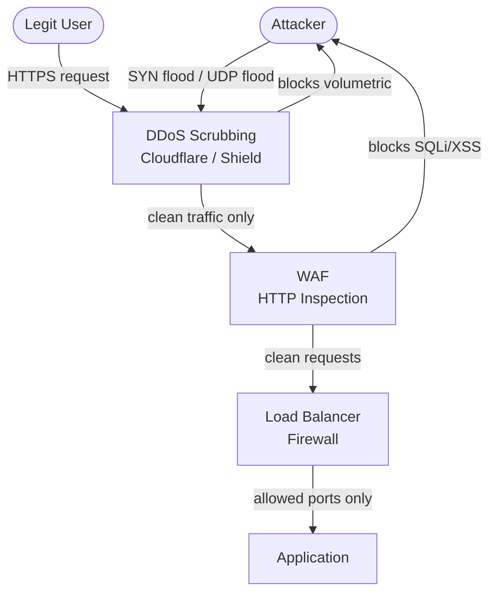
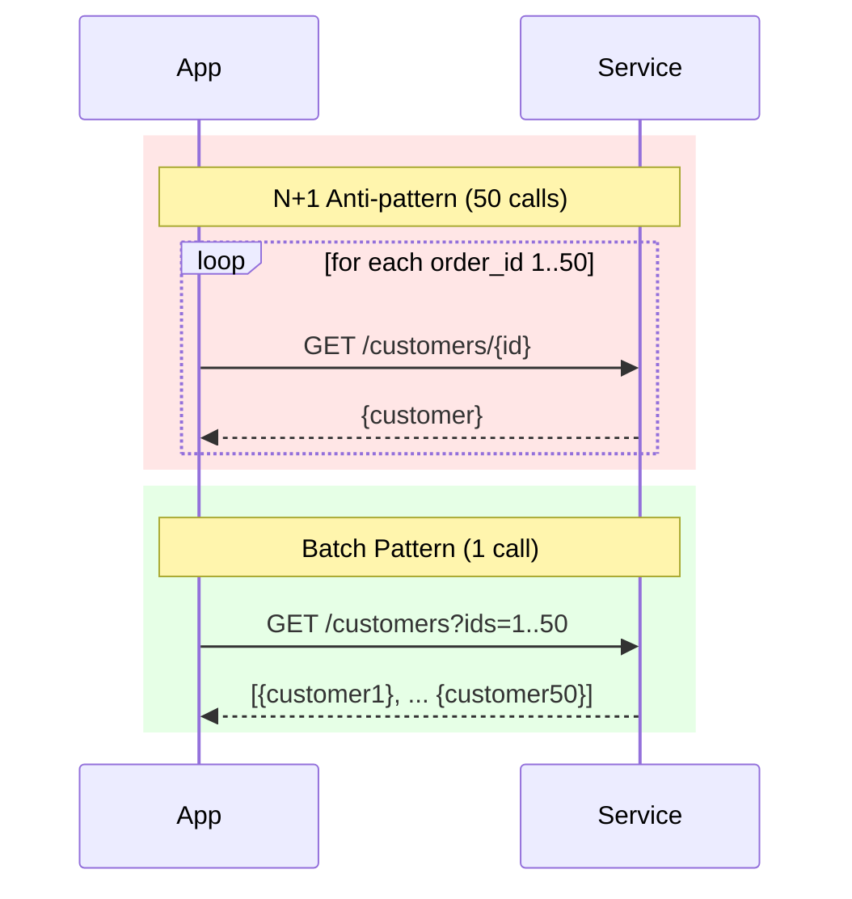

## Keywords in This File
{: .no_toc }

| # | Keyword | Weight |
|---|---|---|
| 18 | [Network Security: Firewalls, WAF, and DDoS Protection](#network-security-firewalls-waf-and-ddos-protection) | high |
| 19 | [Network Anti-patterns: Chatty Protocols and Latency Traps](#network-anti-patterns-chatty-protocols-and-latency-traps) | high |

---

# Network Security: Firewalls, WAF, and DDoS Protection

---
id: CN-018
title: "Network Security: Firewalls, WAF, and DDoS Protection"
category: Computer Networks
difficulty: ★★☆
interview_weight: high
seniority: mid-senior
tags: #firewall #waf #ddos #security #iptables #cloudflare #rate-limiting
---

## Quick Reference

**One-line definition:** Network security for web applications involves three layered defences: a stateful firewall (blocks traffic by IP, port, and connection state), a Web Application Firewall (WAF, which inspects HTTP requests for application-layer attacks like SQLi and XSS), and DDoS protection (which absorbs volumetric attacks by scrubbing or rate-limiting at network/transport layer).

**Difficulty:** ★★☆ | **Asked at:** Mid-Senior | **Seniority:** Mid through Senior

---

### 🎯 Model Answer

**30 seconds:**
Network security for web applications uses three layers. Firewall: allows/blocks traffic by IP, port, and TCP state - the first filter. WAF (Web Application Firewall): inspects HTTP requests for injection attacks, XSS, CSRF - the application-layer filter. DDoS protection: absorbs volumetric attacks (Cloudflare, AWS Shield) by scrubbing traffic before it reaches your infrastructure. Defence in depth: each layer catches what the others miss.

**3 minutes:**
**Stateful firewalls:** Track TCP connection state. Inbound rule: `allow TCP port 443 from any`. Outbound rule: `allow established connections`. This means an external attacker cannot send a packet with TCP RST to terminate your connections, but your servers can initiate outbound requests. AWS Security Groups are stateful - an inbound rule automatically allows the response traffic.

**Web Application Firewall (WAF):** Inspects HTTP layer. Protects against OWASP Top 10: SQL injection (`' OR 1=1`), XSS (`<script>` in parameters), command injection, path traversal (`../../etc/passwd`). WAF rules: managed rulesets (AWS WAF Core Rules, Cloudflare OWASP) or custom rules (block specific IPs, rate-limit by path). WAF operates in detection mode (log only) or prevention mode (block). Start in detection to tune false positives.

**DDoS protection layers:**
- **L3/L4 (volumetric):** Flood with UDP packets or SYN packets. Cloudflare and AWS Shield absorb at the edge before traffic reaches your infrastructure.
- **L7 (application):** HTTP flood - many legitimate-looking requests exhaust application resources. Rate limiting + bot detection at CDN/WAF layer.
- **Amplification attacks:** attacker sends small DNS/NTP request with spoofed source IP; server sends large response to victim (amplification factor 10-100x).

**Blank Mind Recovery:** Firewall = IP/port filter (L3/L4). WAF = HTTP attack detector (L7). DDoS protection = volumetric absorber. Layer them: firewall first, then WAF, then application.

---

### 📘 Concept Explanation

**Core concept:** Defence in depth - each security layer handles a class of threat. No single layer can handle all threats.

**Security layer architecture:**

```
Internet
   |
[ DDoS scrubbing ] <- Cloudflare/AWS Shield
   | (volumetric attacks dropped here)
[ WAF ]             <- Cloudflare WAF / AWS WAF
   | (SQLi, XSS, path traversal blocked)
[ Load Balancer + Firewall ] <- AWS Security Group
   | (port filtering, IP allowlisting)
[ Application ]
   | (business logic, auth)
[ Database firewall ]
   | (SQL-level access control)
```

> **Code walkthrough:** WHAT IT SHOWS: the defence-in-depth architecture for a web application with each security layer and the threat class it handles. KEY MECHANISM: each layer sits in the request path and can drop traffic based on its criteria; volumetric attacks (millions of packets/second) are dropped at the DDoS scrubbing layer before they saturate network links; application-layer attacks (SQL injection in HTTP body) are caught by WAF rules. WHY IT MATTERS: a firewall alone cannot protect against SQL injection (it only sees ports and IPs, not HTTP content); a WAF alone cannot handle a 100Gbps volumetric flood (it would saturate before it could inspect). WHAT BREAKS: WAF false positives block legitimate requests; false negatives pass attacks; tuning requires running in detection mode first to establish the baseline. TAKEAWAY: defence in depth is the principle - each layer provides independent protection; a breach of one layer does not compromise the entire defence.

**Stateful firewall vs packet filter:**

```
Stateless (packet filter):
Rule: ALLOW TCP src=any, dst=port 443
Result: attacker can send TCP ACK packets
  with spoofed IP to ports that are not
  connected (no SYN seen) - bypasses filter

Stateful firewall:
Tracks connection state table:
  src_ip:port -> dst_ip:443, state=ESTABLISHED
Only allows packets that match a tracked
  connection state
Result: RST or ACK with no SYN in state table
  -> packet dropped
= prevents IP spoofing and TCP state attacks
```

> **Code walkthrough:** WHAT IT SHOWS: the difference between stateless packet filtering and stateful firewall inspection. KEY MECHANISM: a stateful firewall maintains a connection state table; for each TCP connection it tracks whether SYN has been seen, whether the handshake is complete, and whether the connection is established; packets that don't match a valid connection state are dropped. WHY IT MATTERS: without state tracking, an attacker can inject packets into existing connections by spoofing the source IP; stateful tracking validates packet sequence numbers. WHAT BREAKS: the state table has a finite size; SYN flood attacks create millions of half-open connections that exhaust the state table, causing legitimate connections to be dropped. TAKEAWAY: SYN cookies (enabled via `net.ipv4.tcp_syncookies=1` in Linux) allow the kernel to handle SYN floods without consuming state table entries.

**WAF rule categories:**

```
OWASP Core Rule Set (CRS) - Common categories:

SQL Injection detection:
  Request: GET /users?id=1' OR '1'='1
  WAF rule: REQUEST_URI contains SQL keywords
  [OR, UNION, SELECT, INSERT, DROP]
  Action: BLOCK + log

XSS detection:
  Request: GET /search?q=<script>alert(1)
  WAF rule: parameters contain <script>,
    javascript:, onerror=, onload=
  Action: BLOCK + log

Path traversal:
  Request: GET /download?f=../../etc/passwd
  WAF rule: parameters contain ../ or ..\
  Action: BLOCK + log

Rate limiting (custom rule):
  If IP makes > 100 requests/min to /login:
  Action: BLOCK for 5 minutes
  (brute force mitigation)
```

> **Code walkthrough:** WHAT IT SHOWS: WAF rule categories from the OWASP Core Rule Set with examples of attacks and detection logic. KEY MECHANISM: WAF rules use pattern matching on request URI, query parameters, headers, and body; each matched rule contributes to a threat score; if the score exceeds a threshold, the request is blocked. WHY IT MATTERS: SQL injection is the most commonly exploited OWASP vulnerability; a single unparameterised SQL query exposed to user input allows attackers to dump entire databases. WHAT BREAKS: WAF rules have false positives - legitimate queries with SQL-like syntax (product search for "SELECT ALL") may be blocked; managed rulesets should be tuned for false positive rate before enabling prevention mode. TAKEAWAY: always run WAF in detection-only mode for 2-4 weeks to identify false positives before enabling blocking; production WAF blocking with untested rules causes outages.

The following diagram shows DDoS protection and WAF in the traffic path.



> **Diagram walkthrough:** WHAT IT DEPICTS: a three-layer security architecture showing how different attack types are stopped at each layer. HOW TO READ IT: both the attacker and legitimate users enter through DDoS scrubbing; volumetric attacks (SYN floods) are dropped at this layer; the remaining clean traffic reaches the WAF which drops application-layer attacks; only clean HTTP requests reach the application. KEY RELATIONSHIP: each layer is specialised - DDoS scrubbing operates at wire speed (Tbps), WAF operates at HTTP inspection speed (< 10ms per request), and the application firewall provides fine-grained access control. EDGE CASE: a sophisticated attacker can make individually valid HTTP requests at low volume to bypass DDoS scrubbing and WAF; application-level anomaly detection and authentication are needed as the final line of defence. INSIGHT: the total throughput that can be processed decreases at each layer; DDoS scrubbing handles 100Gbps+ but WAF can only process ~100Gbps of HTTP traffic; architectural layers must match their throughput capabilities.

---

### 💻 Code Example

**BAD: No WAF, direct exposure to SQL injection**

```python
# BAD: raw SQL with user input, no WAF
# SQL injection trivially compromises the DB
from flask import Flask, request
import sqlite3

app = Flask(__name__)

@app.route('/users')
def get_user():
    user_id = request.args.get('id')
    # CRITICAL: raw string interpolation
    # Attacker sends: id=1 UNION SELECT * FROM users
    # Returns ALL users
    query = f"SELECT * FROM users WHERE id = {user_id}"
    conn = sqlite3.connect('app.db')
    return str(conn.execute(query).fetchall())
```

> **Code walkthrough:** WHAT IT SHOWS: a SQL injection vulnerability where user input is interpolated directly into a SQL query. KEY MECHANISM: the attacker sends `id=1 UNION SELECT password, username FROM users--`; SQLite executes the injected UNION query and returns all usernames and passwords; the WAF is the last line of defence if the application code is vulnerable. WHY IT MATTERS: SQL injection is OWASP #3 (Injection); it allows attackers to read, modify, and delete any data the application database user has access to; a WAF blocks the most obvious injection patterns but cannot catch all variants. WHAT BREAKS: WAF evasion techniques (URL encoding, comment injection) can bypass simple WAF rules; parameterised queries in the application are the only reliable defence. TAKEAWAY: WAF is a defence-in-depth layer, not a substitute for secure code; always use parameterised queries or ORMs; never trust WAF to fix application vulnerabilities.

**GOOD: Parameterised query + WAF + rate limiting**

```python
# GOOD: parameterised query as primary defence
# WAF + rate limiting as additional layers
from flask import Flask, request, abort
import sqlite3
import redis
import time

app = Flask(__name__)
redis_client = redis.Redis(host='localhost', port=6379)

def rate_limit(ip: str, max_req: int = 100,
               window: int = 60) -> bool:
    """Returns True if request is allowed."""
    key = f"rate:{ip}"
    pipe = redis_client.pipeline()
    pipe.incr(key)
    pipe.expire(key, window)
    count, _ = pipe.execute()
    return count <= max_req

@app.route('/users')
def get_user():
    client_ip = request.remote_addr

    # Layer 1: Rate limiting (application layer)
    if not rate_limit(client_ip):
        abort(429)  # Too Many Requests

    # Layer 2: Input validation
    user_id = request.args.get('id', '').strip()
    if not user_id.isdigit():
        abort(400)  # Bad Request

    # Layer 3: Parameterised query (primary defence)
    # '?' placeholder - input NEVER concatenated
    query = "SELECT id, name FROM users WHERE id = ?"
    conn = sqlite3.connect('app.db')
    result = conn.execute(query, (int(user_id),))
    row = result.fetchone()

    if not row:
        abort(404)
    return {"id": row[0], "name": row[1]}
```

> **Code walkthrough:** WHAT IT SHOWS: three defensive layers in application code: rate limiting, input validation, and parameterised queries. KEY MECHANISM: the `?` placeholder in sqlite3 separates the query structure from the data; the database driver passes `user_id` as a data parameter, never as SQL text - injection is impossible regardless of what the user sends. WHY IT MATTERS: this pattern is safe even if the WAF is bypassed or misconfigured; defence is at the application layer where it is most reliable. WHAT BREAKS: `user_id.isdigit()` does not validate range; an attacker could send `id=999999999` to trigger a long-running query; add a range check (`1 <= int(user_id) <= 1_000_000`). TAKEAWAY: parameterised queries are the non-negotiable baseline; input validation and rate limiting are defence-in-depth; WAF is an additional independent layer but never a substitute for secure code.

---

### 🎓 Answers by Seniority

**Junior / Mid-level answer:**
Network security for web applications uses three layers: firewall (blocks by IP and port), WAF (blocks SQL injection, XSS, and other HTTP attacks), and DDoS protection (absorbs volumetric floods). Firewalls are stateful - they track TCP connection state so only legitimate connections get through. WAFs like Cloudflare or AWS WAF inspect HTTP requests and block known attack patterns. DDoS protection from providers like Cloudflare absorbs large-scale attacks before they reach your servers.

**Senior / Staff answer:**
I design network security in layers: DDoS protection at the edge (Cloudflare Magic Transit or AWS Shield Advanced for volumetric L3/L4 attacks), WAF for HTTP-layer inspection (Cloudflare WAF or AWS WAF with managed rulesets, run in detection mode before blocking), and network ACLs and security groups for port-level restriction. The most common operational failure I see is WAF false positives - legitimate API traffic blocked because a JSON field contains SQL-like text. I address this by running WAF in detection mode for 2-4 weeks, reviewing false-positive logs, and writing exclusion rules before enabling prevention. For DDoS: I never rely on infrastructure DDoS protection alone; rate limiting at the application (Redis-based) and API gateway (token bucket) layers protects against L7 HTTP floods that bypass volumetric scrubbing. The threat model for each layer: L3/L4 = Cloudflare/Shield; L7 volumetric = rate limiting; L7 application = WAF + parameterised queries + auth.

---

### ⚠️ Common Misconceptions

**Misconception 1: "WAF protects against SQL injection reliably"**
WAF detects common patterns but attackers use encoding, comments, and case variations to bypass WAF rules. Parameterised queries (or ORM) in application code are the reliable defence. WAF is an additional layer, not a substitute.

**Misconception 2: "Firewall rules are enough for web security"**
Firewalls operate at L3/L4 and cannot inspect HTTP content. SQL injection, XSS, and CSRF attacks use valid HTTP traffic on port 443 and pass through firewalls transparently. A firewall alone provides zero protection against application-layer attacks.

**Misconception 3: "DDoS attacks only affect large companies"**
Any internet-facing service can be targeted. DDoS-for-hire services cost as little as $10/hour. Small businesses and indie developers are common targets for extortion. Cloudflare's free tier provides basic DDoS protection.

**Misconception 4: "Security groups and NACLs in AWS are redundant"**
Security Groups are stateful (automatically allow response traffic), applied at the instance level. NACLs are stateless, applied at the subnet level. They protect different layers and have different default behaviors. Use both: NACL for subnet-level IP blocking, Security Groups for per-instance port control.

---

### 🚨 Failure Modes and Diagnosis

**Failure 1: WAF blocking legitimate traffic in production**

```bash
# Symptom: legitimate API requests returning 403
# from Cloudflare or AWS WAF

# Step 1: Identify blocked requests
# Cloudflare: Security > Events (firewall log)
# AWS WAF: CloudWatch Logs > aws-waf-logs-*

# Step 2: Check which rule is matching
# AWS WAF CLI:
aws wafv2 get-sampled-requests \
  --web-acl-arn <acl-arn> \
  --rule-metric-name AWS-AWSManagedRulesCommonRuleSet \
  --scope REGIONAL \
  --time-window StartTime=... EndTime=...

# Look for:
# RuleId: SizeRestrictions_BODY
# or: CrossSiteScripting_BODY
# or: SQLi_BODY

# Step 3: Create exclusion rule
# If SizeRestrictions_BODY blocking large uploads:
# Add rule: exclude SizeRestrictions when
# URI = /api/upload
```

> **Code walkthrough:** WHAT IT SHOWS: a workflow for identifying and exempting WAF false positives in AWS WAF. KEY MECHANISM: aws wafv2 get-sampled-requests returns the last 500 requests that matched a rule with their full headers and rule ID; this identifies exactly which rule is triggering the false positive. WHY IT MATTERS: a WAF blocking legitimate traffic causes partial outages; engineers who don't know how to read WAF logs often disable the entire WAF rule set instead of creating a targeted exclusion. WHAT BREAKS: exclusion rules that are too broad (e.g., exclude entire SQLi ruleset for one endpoint) create security gaps; exclusions should be as specific as possible (path + parameter + specific rule ID). TAKEAWAY: always review WAF logs before going live; common false positives include JSON fields containing SQL syntax, URLs with special characters, and large request bodies; create targeted exclusions rather than disabling rulesets.

**Failure 2: SYN flood exhausting connection table**

```bash
# Symptom: server refusing new connections
# while CPU and bandwidth are low

# Diagnose: check half-open connections
ss -s
# Netid  State    Recv-Q  Send-Q
# tcp    SYN-RECV 0       0 (many of these)

# Check SYN cookies status
sysctl net.ipv4.tcp_syncookies
# 0 = disabled (vulnerable)
# 1 = enabled (SYN cookies active)

# Enable SYN cookies:
sysctl -w net.ipv4.tcp_syncookies=1

# Also tune SYN backlog:
sysctl -w net.ipv4.tcp_max_syn_backlog=4096
sysctl -w net.core.somaxconn=4096
```

> **Code walkthrough:** WHAT IT SHOWS: diagnosing a SYN flood attack and enabling SYN cookies as a mitigation. KEY MECHANISM: a SYN flood sends millions of TCP SYN packets with spoofed source IPs; the server allocates a state table entry for each half-open connection; when the table fills, legitimate connections are rejected; SYN cookies eliminate the state table by encoding connection state in the sequence number of the SYN-ACK. WHY IT MATTERS: SYN flood is a classic DDoS technique that is inexpensive to execute and requires no botnet; it targets the state table rather than bandwidth. WHAT BREAKS: enabling SYN cookies disables some TCP options (window scaling, timestamps) for the first data packet in a cookied connection; this is generally acceptable for the protection it provides. TAKEAWAY: always ensure tcp_syncookies=1 in Linux production servers; also configure DDoS scrubbing at the network edge for high-traffic services.

---

### 🎯 Interview Deep-Dive

| Format | Questions | Est. Time |
|---|---|---|
| Junior/Mid | 9 questions | 25-35 min |
| Senior/Staff | 9 questions + extensions | 40-50 min |

**Category: CONCEPT**

**[JUNIOR] Q1 - [CONCEPTUAL] What is the difference between a firewall and a WAF?**

A **firewall** operates at L3/L4 (network and transport layers). It filters traffic based on:
- Source/destination IP addresses
- TCP/UDP port numbers
- TCP connection state (stateful: allows return traffic for established connections)

A firewall cannot inspect HTTP content - it only sees packets.

A **Web Application Firewall (WAF)** operates at L7 (application layer). It terminates HTTP connections, reads the full request, and inspects:
- URL path and query parameters
- HTTP headers
- Request body (form data, JSON, XML)

A WAF blocks application-layer attacks: SQL injection, XSS, CSRF, path traversal, and other OWASP Top 10 vulnerabilities.

Key distinction: a firewall cannot protect against SQL injection because SQL injection uses valid HTTP on port 443; a WAF can detect the injection pattern in the query parameter.

*What separates good from great:* The OWASP Top 10 framing - interviewers want to know you understand that firewalls and WAFs protect against completely different attack classes.

---

**[JUNIOR] Q2 - [CONCEPTUAL] What is DDoS and what are the main types of DDoS attacks?**

DDoS (Distributed Denial of Service) floods a target with traffic from many sources simultaneously to exhaust a resource (bandwidth, CPU, connection table, application threads).

Main types:

**L3/L4 Volumetric attacks (most common):**
- UDP flood: sends many UDP packets to random ports; server exhausts bandwidth responding to ICMP port unreachable messages
- SYN flood: sends many TCP SYN packets with spoofed IPs; exhausts the server's connection state table
- Amplification: attacker sends DNS/NTP queries with spoofed source IP; servers send large responses to victim (amplification factor 10-100x)

**L7 HTTP attacks (most sophisticated):**
- HTTP flood: sends many valid-looking HTTP requests that trigger expensive operations (DB queries, file reads)
- Slowloris: opens many HTTP connections and sends headers very slowly; exhausts server thread pool
- Bot attacks: simulates legitimate user behavior to bypass rate limiting

Mitigation levels:
- L3/L4: CDN/provider scrubbing (Cloudflare, AWS Shield)
- L7: rate limiting, bot detection, CAPTCHAs, WAF

*What separates good from great:* Explaining amplification attacks - the attacker doesn't send the flood directly; they weaponise publicly available UDP services (DNS, NTP) to multiply attack bandwidth.

---

**[MID] Q3 - [MECHANISM] How does Cloudflare protect against DDoS attacks?**

Cloudflare's DDoS protection operates at multiple layers:

**Anycast network (L3/L4 volumetric):** Cloudflare's 300+ data centres absorb attack traffic. When a 100Gbps UDP flood targets `api.example.com`, it is distributed across all Cloudflare POPs globally; each POP absorbs a fraction. Cloudflare's total network capacity (100+ Tbps) far exceeds most attack sizes.

**Rate limiting and fingerprinting (L7):** Cloudflare identifies attack patterns: request rate, URL patterns, HTTP headers, TLS fingerprints (JA3). Bots often have distinctive JA3 fingerprints that differ from real browsers.

**CAPTCHA and managed challenge:** Suspicious IP ranges or unusual traffic patterns trigger a JavaScript challenge; legitimate browsers pass silently, bots fail.

**Magic Transit (enterprise):** BGP-announces the customer's IP ranges via Cloudflare; all traffic is routed through Cloudflare scrubbing before reaching the customer's infrastructure.

*What separates good from great:* Explaining anycast - attack traffic is naturally distributed across all 300+ POPs rather than hitting one server; this distributes the absorption capacity.

---

**Category: DEBUGGING**

**[SENIOR] Q4 - [DEBUGGING] Your API is receiving what appears to be a credential stuffing attack. How do you detect and block it?**

Credential stuffing uses a list of compromised username/password pairs from other data breaches to try to log into accounts.

Symptoms:
- High login attempt rate from many IPs (distributed)
- Low success rate (< 1%) indicating bot credential lists
- Requests arriving at uniform timing intervals (bot behavior)
- Common User-Agent strings from headless browsers

Detection and blocking:

```bash
# Check login endpoint hit rate in nginx logs
awk '{print $7}' /var/log/nginx/access.log \
  | grep "^/api/login" | wc -l
# Compare to baseline; 100x = attack

# Check unique IPs hitting login endpoint
awk '$7 == "/api/login" {print $1}' \
  /var/log/nginx/access.log \
  | sort | uniq | wc -l
# Many IPs = distributed attack (no simple IP block)

# Enable WAF rate limiting rule for /login:
# Cloudflare: Security > WAF > Rate Limiting
# Rule: /api/login, 5 req/min per IP
# Action: block for 10 minutes
```

> **Code walkthrough:** WHAT IT SHOWS: nginx log analysis commands to detect credential stuffing and a WAF rate limiting rule to mitigate it. KEY MECHANISM: awk extracts the request URI and source IP; high request count on /login from many unique IPs is the credential stuffing signature; WAF rate limiting on the specific endpoint blocks further attempts from each IP after 5 tries per minute. WHY IT MATTERS: credential stuffing bypasses DDoS scrubbing (individually valid HTTP requests at low per-IP rate); it must be detected at the application layer via pattern analysis. WHAT BREAKS: WAF rate limiting by IP is circumvented by large botnets (each IP makes only 1-2 attempts); add device fingerprinting and user-behaviour analysis for sophisticated attacks. TAKEAWAY: credential stuffing requires application-layer defences; implement account lockout (5 failed attempts -> lock 30 min), CAPTCHA on repeated failures, and consider HIBP (Have I Been Pwned) integration to detect compromised passwords.

---

**[SENIOR] Q5 - [DEBUGGING] After adding WAF rules, legitimate mobile app users cannot log in. How do you diagnose?**

Step 1: Correlate timing - when did login failures start? Did it match WAF rule deployment?

Step 2: Check WAF logs for blocked mobile app requests:

```bash
# AWS WAF: query CloudWatch Logs
# (WAF log group: aws-waf-logs-*)
aws logs filter-log-events \
  --log-group-name aws-waf-logs-production \
  --filter-pattern '{ $.action = "BLOCK" }' \
  --start-time $(date -d '1 hour ago' +%s000) \
  | jq '.events[].message' \
  | python3 -c "import sys,json; \
    [print(json.loads(l)) for l in sys.stdin]" \
  | grep -i "login"
```

> **Code walkthrough:** WHAT IT SHOWS: querying AWS CloudWatch Logs for WAF block events to identify which requests are being blocked. KEY MECHANISM: AWS WAF logs every blocked request to a CloudWatch Logs group; each log entry contains the rule ID, action, request headers, and URI; filtering for BLOCK action and /login path identifies the WAF rule causing the false positive. WHY IT MATTERS: without WAF logs, engineers guess which rule is blocking and disable entire rule groups; targeted diagnosis enables precise exclusion rules. WHAT BREAKS: WAF logs can have a 5-10 minute delay in CloudWatch; for real-time diagnosis, use Cloudflare's live activity log instead. TAKEAWAY: always enable WAF logging before enabling prevention mode; logs are essential for diagnosing false positives and cannot be reconstructed retroactively.

Step 3: Identify the rule - common mobile app false positives include: large JSON bodies triggering SizeRestrictions, base64-encoded data triggering XSS rules, unusual User-Agent.

Step 4: Create targeted exclusion for the specific rule on the specific URI.

---

**Category: TRADE-OFF**

**[SENIOR] Q6 - [TRADE-OFF] What are the trade-offs of a WAF in blocking mode vs detection mode?**

**Detection mode (log only):**

Benefits:
- No false positives; legitimate traffic unaffected
- Can evaluate rule effectiveness before commitment
- Safe to deploy during business hours

Costs:
- Attacks are detected but not blocked
- Requires manual review of logs to action
- Provides no automatic protection

**Blocking mode:**

Benefits:
- Attacks blocked automatically without human intervention
- Real-time protection against known attack patterns

Costs:
- False positives block legitimate traffic (business impact)
- Requires careful tuning to reduce false positive rate
- Changes to application may introduce new false positives

**Recommended approach:**
1. Deploy in detection mode for 2-4 weeks
2. Review logs; identify and add exclusions for false positives
3. Enable blocking during low-traffic period; monitor alert dashboards
4. Keep WAF in detection mode for new rule additions (add to blocking incrementally)

*What separates good from great:* Explaining that the tuning period length depends on traffic diversity - if the application receives traffic from many different clients (mobile, desktop, API), 2-4 weeks catches more false positive scenarios than a 1-day test.

---

**[SENIOR] Q7 - [TRADE-OFF] When should you build your own rate limiting vs using a managed WAF rate limit?**

**Managed WAF rate limiting (Cloudflare, AWS WAF):**

Benefits:
- No implementation effort; built-in Redis-backed distributed counters
- Operates at network edge before traffic reaches application
- Tuned for high throughput (millions of rules evaluated per second)
- Global distribution absorbs L7 floods at edge

Costs:
- Per-rule billing (AWS WAF: $1/month per rule, $0.60 per 1M requests)
- Limited customisation (standard dimensions: IP, IP+path, custom headers)
- Requires WAF to be in the traffic path (unavailable for direct-to-origin paths)

**Application-layer rate limiting (Redis + application code):**

Benefits:
- Full control: rate limit by user ID, API key, tenant, or any business dimension
- No WAF cost at high volume
- Can implement sophisticated algorithms (token bucket, sliding window)
- Works for any transport (WebSocket, gRPC)

Costs:
- Redis dependency; implementation and maintenance cost
- Does not protect from traffic reaching the application (DDoS can still saturate)

Decision: use WAF rate limiting for public-facing endpoints (login, public API) to stop attacks before they reach infrastructure. Use application rate limiting for business logic enforcement (per-user quota, per-tenant limits) where WAF lacks the business context.

*What separates good from great:* Recognising that WAF operates before traffic reaches the application (protecting infrastructure) while application rate limiting operates inside the application (enforcing business rules); both are needed for complete protection.

---

**Category: BEHAVIORAL**

**[SENIOR] Q8 - [BEHAVIORAL] Describe a security incident involving network security that you diagnosed or mitigated.**

Situation: A public API receiving 5,000 requests/day suddenly received 500,000 requests in 30 minutes, causing 100% CPU on application servers. Paying customers could not access the API.

Task: Mitigate the attack within 30 minutes while preserving legitimate traffic.

Action:
1. Identified from access logs: 95% of requests from 50 unique IPs, all to one endpoint `/api/reports` which triggered a heavy database aggregation query.
2. Immediate triage: added temporary IP block for top 20 attacker IPs via Cloudflare IP rules (5 minutes to deploy).
3. This reduced attack traffic to 60% (attackers had a larger IP rotation pool).
4. Longer fix: enabled rate limiting rule on `/api/reports`: 10 requests/minute per IP. Attackers hit rate limit; CPU dropped to 15%.
5. Root cause: the report endpoint had no auth requirement (it was meant to be public but cacheable). Added caching (`Cache-Control: s-maxage=60`) to reduce repeated origin hits to 1/60th.

Result: Service restored within 25 minutes. Rate limiting and caching prevented recurrence.

*What separates good from great:* The caching fix as a performance optimisation that also reduced attack surface - a cached response at the CDN edge means the attacker's requests never reach the origin even when they exceed the rate limit.

---

**[STAFF] Q9 - [DESIGN] Design the network security posture for a fintech API handling payment data (PCI-DSS scope).**

**PCI-DSS requirements for network security:**
- Requirement 1: install and maintain a firewall; restrict inbound/outbound traffic to only necessary communications
- Requirement 6.6: address web-facing vulnerabilities via WAF or code review
- Requirement 10: maintain audit logs of all access

**Architecture:**

1. **DDoS protection:** Cloudflare Magic Transit (BGP-announced IPs routed through Cloudflare for volumetric scrubbing). AWS Shield Advanced as secondary (native AWS integration with ALB).

2. **WAF:** Cloudflare WAF with OWASP ruleset in blocking mode. Additional custom rule: block all countries except operating regions. PCI-specific rule: block requests with card number patterns in URL parameters (regex: `\b\d{13,16}\b` in query strings).

3. **Network segmentation:**
   - Public subnet: load balancer only (port 443 inbound from internet)
   - Private subnet: application servers (port 8080 from LB only, no internet access)
   - Database subnet: RDS instances (port 5432 from app subnet only)
   - No direct internet access from application or database subnets

4. **Mutual TLS (mTLS) for PCI scope:** all service-to-service calls within PCI scope use mTLS certificates managed by AWS ACM Private CA. Prevents unauthorised internal access if an attacker gains internal network access.

5. **Audit logging:** VPC Flow Logs + WAF logs -> S3 -> Athena for PCI audit queries. All logs retained 12 months (PCI requirement).

6. **Vulnerability scanning:** nightly DAST scanning (OWASP ZAP) of API in staging environment; weekly dependency CVE scan.

*What separates good from great:* mTLS for service-to-service communication in PCI scope - PCI-DSS requirement 4.1 requires encryption of cardholder data in transit; mTLS provides mutual authentication and encryption for all internal paths, not just the external edge.

---

### ⚖️ Comparison Table

| Tool | Layer | Protects Against | Misses |
|---|---|---|---|
| Stateful Firewall | L3/L4 | Port scans, IP spoofing, state attacks | SQL injection, XSS, app logic |
| WAF | L7 HTTP | SQLi, XSS, CSRF, path traversal | Novel attacks, encrypted payloads |
| DDoS scrubbing | L3/L4 | Volumetric floods, amplification | L7 HTTP floods, slow loris |
| Rate limiting (app) | L7 | Brute force, credential stuffing | Distributed low-rate attacks |
| Network ACL | L3 | IP allowlisting, subnet isolation | Application attacks, stateful attacks |
| mTLS | L4/L7 | MITM, impersonation between services | Application vulnerabilities |

> **Diagram walkthrough:** WHAT IT DEPICTS: a comparison of six network security tools by OSI layer and what they protect against and fail to catch. HOW TO READ IT: the Protects Against column shows the threat class each tool handles well; the Misses column shows the gap that requires a complementary layer. KEY RELATIONSHIP: no single tool covers all threat classes; layering firewalls, WAF, DDoS protection, and application rate limiting provides defence in depth. EDGE CASE: mTLS protects service-to-service channels but a compromised service with valid certificates can still abuse those channels; WAF and application-layer auth are still needed within the service mesh. INSIGHT: the most common security gap is relying on WAF as the only line of defence while application code has SQL injection vulnerabilities; WAF is regularly bypassed; parameterised queries are the reliable fix.

---

### 🏛️ System Design

*(Omit: ★★☆ difficulty - system design section reserved for ★★★ production architecture keywords.)*

---

### 📊 Diagram

*(See Concept Explanation above; the DDoS protection and WAF traffic path Mermaid diagram appears in that section.)*

---
---

# Network Anti-patterns: Chatty Protocols and Latency Traps

---
id: CN-019
title: "Network Anti-patterns: Chatty Protocols and Latency Traps"
category: Computer Networks
difficulty: ★★☆
interview_weight: high
seniority: mid-senior
tags: #anti-patterns #n+1 #chatty #latency #microservices #grpc #batching
---

## Quick Reference

**One-line definition:** Network anti-patterns are design choices that create unnecessary network overhead: chatty protocols make many small requests where one large request would suffice; N+1 query patterns make one request per item instead of batching; synchronous chains create additive latency; and over-wide payloads transfer more data than clients need.

**Difficulty:** ★★☆ | **Asked at:** Mid through Senior | **Seniority:** Mid-Senior

---

### 🎯 Model Answer

**30 seconds:**
The most damaging network anti-patterns are: (1) chatty protocols - making N round trips when one would do; (2) N+1 queries - fetching a list then fetching details one by one; (3) synchronous chain - services calling services calling services, adding latency at each hop; and (4) over-fetching - downloading 100 fields when the client needs 5. Each adds either latency (round trips) or bandwidth (unnecessary data). Fixes: batch requests, parallelize independent calls, use GraphQL or sparse fieldsets for over-fetching.

**3 minutes:**
**Chatty protocol (N round trips):** A mobile app builds a user dashboard: 1 request for user profile, 1 for recent orders, 1 for recommendations, 1 for notifications = 4 sequential round trips at 100ms each = 400ms minimum. Fix: combine into one API call or use a Backend-for-Frontend (BFF) that makes all 4 calls server-side (< 10ms between servers) and returns one aggregated response.

**N+1 query problem:** Fetch a list of 50 orders, then for each order fetch the customer name (50 separate requests). Total: 51 requests instead of 1. Fix: bulk fetch customers in one request (`GET /customers?id=1,2,3...50`) or use DataLoader pattern (batch within one tick).

**Synchronous call chain:** ServiceA calls ServiceB calls ServiceC calls ServiceD. Each service adds 20ms processing + 5ms network = 25ms per hop. 4 services: 100ms of network overhead, serialised. Fix: identify which calls are independent, fan them out in parallel.

**Over-fetching:** GraphQL REST anti-pattern where the response includes all fields even though the client uses 10%. A 50KB JSON response for a 2KB needed payload. Fix: sparse fieldsets, projection in queries, or GraphQL.

**Blank Mind Recovery:** Network anti-patterns = wasted round trips or wasted bytes. Chatty = too many trips. N+1 = loop with network call. Sync chain = sequential when parallel is possible. Over-fetch = too many bytes.

---

### 📘 Concept Explanation

**Core concept:** Every network round trip has a fixed latency cost (propagation + handshake). The optimal design minimises round trips; each unnecessary trip multiplies by the RTT between the calling service and the callee.

**The N+1 problem:**

```
N+1 Pattern (anti-pattern):
SELECT * FROM orders LIMIT 50
  -> returns [order_id=1, order_id=2, ..., order_id=50]

for each order_id in [1..50]:
    GET /customers/{order_id}/info
    <- 50 separate HTTP requests
    <- 50 x 10ms = 500ms

Total: 51 requests, ~500ms customer fetch time

Batch Pattern (solution):
SELECT * FROM orders LIMIT 50
  -> [order_id=1..50]

GET /customers?ids=1,2,3,...,50
  <- 1 request
  <- 10ms

Total: 2 requests, 10ms
= 50x fewer requests, 50x faster
```

> **Code walkthrough:** WHAT IT SHOWS: the N+1 anti-pattern where a loop makes one network request per list item, and the batch solution that makes a single request for all items. KEY MECHANISM: the loop-with-network-call pattern is O(N) network requests; the batch solution collapses all N lookups into 1 request; the speedup is proportional to N times the per-request latency. WHY IT MATTERS: N+1 is invisible in development (local calls are < 1ms) but catastrophic in production (network calls are 5-50ms); a page rendering 50 items makes 50 hidden network calls. WHAT BREAKS: the batch endpoint must be available and support bulk IDs; if the downstream service only offers a single-item endpoint, implement caching (DataLoader pattern) to batch within the same tick. TAKEAWAY: any time you see a loop that contains a network call (HTTP request, DB query, Redis get), ask whether the inner call can be batched outside the loop.

**Synchronous call chain vs parallel fan-out:**

```
Synchronous chain (anti-pattern):
A -> B (20ms)
     B -> C (30ms)
          C -> D (15ms)
Total latency = 20 + 30 + 15 = 65ms
= serialised, each hop waits

Parallel fan-out (solution):
A -> B (20ms) \
A -> C (30ms)  > concurrent (CompletableFuture)
A -> D (15ms) /
Total latency = max(20, 30, 15) = 30ms
= 2x faster for same work

Exception: if B's result is needed by C,
  B must complete before C starts.
  Use parallel for independent calls only.
```

> **Code walkthrough:** WHAT IT SHOWS: the latency difference between a synchronous service call chain and parallelised fan-out. KEY MECHANISM: in the synchronous chain, each service waits for the previous to complete; total latency is the sum; in parallel fan-out, all independent calls start simultaneously and the total latency is the slowest call (critical path). WHY IT MATTERS: microservice architectures naturally create synchronous chains; a request through 5 microservices each taking 20ms = 100ms minimum even if all microservices are healthy. WHAT BREAKS: parallel fan-out fails if any downstream service fails and there is no fallback; synchronous chains fail if the last service in the chain is down but the error is at least returned quickly. TAKEAWAY: map the dependency graph for each request; identify which downstream calls have no data dependency on each other; parallelise those; only serialise when one call's output is another call's input.

**Over-fetching and under-fetching:**

```
Over-fetching (too much data per call):
REST: GET /users/42
Response: {
    "id": 42,
    "name": "Alice",
    "email": "alice@example.com",
    "address": {...},       // 20 fields
    "preferences": {...},   // 15 fields
    "activity": {...},      // 50 fields
    "billingHistory": [...] // 100 items
}
Client needs: name, email only
= 50KB transferred, 2KB used = 96% waste

Under-fetching (N+1 to get related data):
REST: GET /users/42 -> {id, name, ordersCount}
Client also needs order details
= second request required: GET /orders?userId=42

GraphQL solution (precise data fetching):
query { user(id: 42) { name email } }
= returns exactly name + email
= no over-fetching, no under-fetching
```

> **Code walkthrough:** WHAT IT SHOWS: REST over-fetching and under-fetching problems and how GraphQL resolves both with client-specified field selection. KEY MECHANISM: REST endpoints return fixed response shapes regardless of what the client needs; GraphQL queries specify exactly which fields to return; the resolver only fetches and serialises the requested fields. WHY IT MATTERS: mobile clients on cellular networks pay real bandwidth costs for over-fetching; a 50KB response instead of 2KB is 25x the transfer time. WHAT BREAKS: GraphQL N+1 is still possible if resolvers make per-field database queries without DataLoader batching; GraphQL solves the protocol problem but not the resolver implementation problem. TAKEAWAY: GraphQL or REST sparse fieldsets (e.g., `?fields=name,email`) solve over-fetching; DataLoader or bulk endpoints solve N+1 within resolvers; both are needed.

The following diagram shows N+1 vs batch request patterns.



> **Diagram walkthrough:** WHAT IT DEPICTS: a sequence diagram comparing the N+1 anti-pattern (50 individual requests) with the batch pattern (1 request for all 50 items). HOW TO READ IT: the red section shows the N+1 loop; each arrow pair is one round trip; the green section shows the batch equivalent as a single request and response. KEY RELATIONSHIP: 50 round trips at 10ms each = 500ms; 1 batch request = 10ms; the visual makes the latency multiplication obvious. EDGE CASE: the downstream service must support bulk IDs; if it doesn't, implement an in-process cache (DataLoader) that batches within the same event loop tick, making multiple caller requests appear as one downstream call. INSIGHT: N+1 is most common in ORM usage (Hibernate lazy loading) and microservice client code; code review should specifically check for loops that contain database queries or HTTP calls.

---

### 💻 Code Example

**BAD: N+1 in Spring REST controller**

```java
// BAD: N+1 - one DB query per order
@RestController
public class OrderController {

    @Autowired
    private OrderRepository orderRepo;
    @Autowired
    private CustomerRepository customerRepo;

    @GetMapping("/api/orders")
    public List<OrderDTO> getOrders() {
        List<Order> orders = orderRepo.findAll();
        return orders.stream()
            .map(order -> {
                // ANTI-PATTERN: DB query inside loop
                // 50 orders = 51 queries total
                Customer customer = customerRepo
                    .findById(order.getCustomerId())
                    .orElse(null);
                return new OrderDTO(order, customer);
            })
            .collect(Collectors.toList());
    }
}
```

> **Code walkthrough:** WHAT IT SHOWS: a Spring REST controller with a classic N+1 problem where customer lookup is inside the orders loop. KEY MECHANISM: orderRepo.findAll() executes 1 SQL query; then customerRepo.findById() executes inside the loop, making 1 query per order; 50 orders = 51 queries; Hibernate may hide this through lazy loading. WHY IT MATTERS: this code works correctly and appears efficient in tests (< 10ms local); in production with 50-100ms DB round trips, 50 queries take 2.5-5 seconds. WHAT BREAKS: Spring Data's CrudRepository does not batch findById calls; each call is an independent SELECT statement. TAKEAWAY: in JPA/Spring Data, avoid findById inside loops; use findAllById(ids) or JOIN FETCH in the original query to load related entities in one SQL.

**GOOD: Batch loading with JOIN FETCH**

```java
// GOOD: single query with JOIN FETCH
// or batch loading
@RestController
public class OrderController {

    @Autowired
    private OrderRepository orderRepo;

    @GetMapping("/api/orders")
    public List<OrderDTO> getOrders() {
        // Option 1: JOIN FETCH in JPQL
        // Single query: SELECT o, c FROM Order o
        //   JOIN FETCH o.customer
        List<Order> orders = orderRepo
            .findAllWithCustomers();
        return orders.stream()
            .map(OrderDTO::new)
            .collect(Collectors.toList());
    }
}

@Repository
public interface OrderRepository
    extends JpaRepository<Order, Long> {

    // Single SQL: SELECT * FROM orders o
    // JOIN customers c ON o.customer_id = c.id
    @Query("SELECT o FROM Order o " +
           "JOIN FETCH o.customer")
    List<Order> findAllWithCustomers();
}
```

> **Code walkthrough:** WHAT IT SHOWS: using JPQL JOIN FETCH to eliminate N+1 by loading the related entity in the same SQL query. KEY MECHANISM: JOIN FETCH generates a single SQL with an INNER JOIN between orders and customers; all data is returned in one round trip; Hibernate populates both Order and Customer objects from the single result set. WHY IT MATTERS: 51 DB round trips (N+1) become 1; at 10ms per DB round trip, 50 orders go from 510ms to 10ms - a 50x improvement. WHAT BREAKS: JOIN FETCH with large result sets can cause Cartesian product if both sides of the join are collections; use @BatchSize or a second query for one-to-many relationships. TAKEAWAY: always enable SQL logging in development (`spring.jpa.show-sql=true`) and check for repeated similar queries; JOIN FETCH in JPQL is the primary fix for one-to-one and many-to-one N+1; @BatchSize is the fix for one-to-many.

**Parallel fan-out with CompletableFuture:**

```java
@Service
public class DashboardService {

    @Autowired
    private UserService userService;
    @Autowired
    private OrderService orderService;
    @Autowired
    private RecommendationService recommendationService;

    public DashboardDTO getDashboard(Long userId) {
        // BAD (synchronous): 3 calls sequential
        // 30ms + 20ms + 25ms = 75ms
        // UserProfile profile = userService.get(userId);
        // OrderList orders = orderService.recent(userId);
        // RecommendationList recs = recommendationService.get(userId);

        // GOOD: parallel fan-out
        // All 3 calls start simultaneously
        // Total time = slowest call = 30ms
        CompletableFuture<UserProfile> profileFuture =
            CompletableFuture.supplyAsync(
                () -> userService.get(userId));

        CompletableFuture<OrderList> ordersFuture =
            CompletableFuture.supplyAsync(
                () -> orderService.recent(userId));

        CompletableFuture<RecommendationList> recsFuture =
            CompletableFuture.supplyAsync(
                () -> recommendationService.get(userId));

        // Wait for all three to complete
        CompletableFuture.allOf(
            profileFuture, ordersFuture, recsFuture
        ).join();  // blocks until all done

        return new DashboardDTO(
            profileFuture.get(),
            ordersFuture.get(),
            recsFuture.get()
        );
    }
}
```

> **Code walkthrough:** WHAT IT SHOWS: replacing a synchronous service call sequence with parallel CompletableFuture fan-out for three independent downstream calls. KEY MECHANISM: supplyAsync() submits each call to the ForkJoinPool thread pool; all three calls execute concurrently; allOf().join() waits until the slowest call completes; total latency = max(30ms, 20ms, 25ms) = 30ms instead of 75ms. WHY IT MATTERS: in microservice architectures, dashboard-style endpoints must aggregate data from multiple services; sequential calls multiply latency; parallel calls reduce it to the critical path. WHAT BREAKS: if any CompletableFuture throws an exception, allOf().join() throws the exception but the other futures may still be running; use exceptionally() or handle() to implement per-service fallback (partial dashboard vs total failure). TAKEAWAY: always use timeout per future: CompletableFuture.supplyAsync(...).orTimeout(5, TimeUnit.SECONDS) to bound wait time; a single slow downstream service can hold threads indefinitely without timeouts.

---

### 🎓 Answers by Seniority

**Junior / Mid-level answer:**
Network anti-patterns waste round trips or bandwidth. N+1: fetching a list then fetching details one by one in a loop (51 requests instead of 2). Fix: batch the inner loop into one request. Chatty protocol: making many small sequential requests. Fix: combine requests or use BFF for aggregation. Over-fetching: downloading 50KB when the client needs 2KB. Fix: GraphQL or field projection. Synchronous call chain: services calling services in sequence. Fix: identify independent calls and run them in parallel.

**Senior / Staff answer:**
I categorise network anti-patterns by their root cause. N+1 is a data access problem - fix at the ORM layer (JOIN FETCH, @BatchSize) or service layer (DataLoader batch). Synchronous call chains are an architectural problem - fix with parallel fan-out (CompletableFuture, reactive) and dependency graph analysis. Over-fetching is a contract problem - fix with GraphQL or RESTful sparse fieldsets. Chatty protocols are a boundary problem - fix with BFF or event-driven patterns. The production diagnostic: enable SQL logging + distributed tracing; N+1 shows up as N similar queries in the same trace span; synchronous chains show up as sequential spans with no overlap; over-fetching shows up as high payload size in API metrics with low field utilisation. For microservice systems, I track "external call depth" (how many service calls deep is the critical path) as a design metric; if it exceeds 3, the architecture needs to be reviewed for fan-out or event sourcing.

---

### ⚠️ Common Misconceptions

**Misconception 1: "N+1 only applies to database queries"**
N+1 applies to any external call in a loop: HTTP requests to microservices, Redis gets, S3 fetches. An HTTP N+1 (50 REST calls instead of 1 batch) is often worse than a DB N+1 because network RTT is 10-50ms vs 1-5ms for a local DB.

**Misconception 2: "Microservices eliminate monolith performance problems"**
Microservices can amplify performance problems: a monolith's in-process function call (microseconds) becomes a network call (milliseconds). A synchronous chain of 10 microservices at 20ms each = 200ms minimum latency. Monoliths can complete the equivalent work in < 5ms.

**Misconception 3: "More API endpoints = better API design"**
Fine-grained endpoints optimise for server simplicity but create N+1 and chatty patterns on the client side. Coarser-grained endpoints that return aggregated data reduce client round trips at the cost of over-fetching. The right balance depends on client constraints.

**Misconception 4: "Parallel requests always improve performance"**
Parallel requests increase concurrency which increases upstream resource pressure. If each parallel call opens a DB connection, 10 parallel calls require 10 concurrent DB connections. Resource pools must be sized for the concurrency level. Unbounded parallelism (no thread pool limit) creates resource exhaustion.

---

### 🚨 Failure Modes and Diagnosis

**Failure 1: Slow dashboard endpoint with no obvious bottleneck**

```bash
# Symptom: dashboard takes 3-5 seconds
# CPU low, no slow DB queries visible

# Diagnose: enable distributed tracing
# Jaeger: look for sequential spans with no overlap
# If traces show:
# [----userService (20ms)----]
#                             [----orderService (25ms)----]
#                                                          [---recs (30ms)---]
# = synchronous chain, fix with parallel fan-out

# If traces show one span with 50 child spans:
# [order1 fetch]
# [order2 fetch]
# ...
# [order50 fetch]
# = N+1, fix with batch fetch

# Quick check with SQL logging:
# Enable: spring.jpa.show-sql=true
# Count unique query shapes per request
# > 20 queries per request = likely N+1
```

> **Code walkthrough:** WHAT IT SHOWS: using distributed tracing and SQL logging to diagnose whether a slow endpoint is a synchronous chain or N+1 pattern. KEY MECHANISM: distributed traces show span timing visually; sequential spans with no overlap (one starts when the previous ends) indicate a synchronous chain; many similar spans in the same parent span indicate N+1. WHY IT MATTERS: both patterns appear as "slow endpoint" in monitoring but require different fixes; chain = parallelise; N+1 = batch; without tracing, engineers often add caching which fixes symptoms but not the root cause. WHAT BREAKS: caching masks N+1 for repeated requests but the first uncached request still pays the full cost; new data (uncached) is always slow. TAKEAWAY: instrument every new endpoint with distributed tracing before release; trace analysis during code review catches N+1 and synchronous chains before they reach production.

**Failure 2: Memory spike when fixing N+1 with JOIN FETCH**

```java
// Symptom: after adding JOIN FETCH,
// memory usage spiked from 512MB to 4GB

// Cause: JOIN FETCH on a one-to-many
// relationship creates Cartesian product:
// 50 orders x 20 items each = 1000 rows
// JPA loads all 1000 into memory before
// deduplication

// Diagnose:
// Enable JPQL logging; count rows in result set
// before and after JOIN FETCH

// Fix for one-to-many: use @BatchSize
@Entity
@BatchSize(size = 25)  // loads items in batches
public class Order {
    @OneToMany(fetch = FetchType.LAZY)
    private List<OrderItem> items;
}
// Result: 50 orders + 2 batches of 25 items each
// = 3 queries, no Cartesian product
```

> **Code walkthrough:** WHAT IT SHOWS: the Cartesian product problem caused by JOIN FETCH on one-to-many relationships and the @BatchSize fix. KEY MECHANISM: JOIN FETCH on Order.items generates SQL with two JOINs; for 50 orders with 20 items each, the result set has 50 x 20 = 1000 rows; JPA must read all 1000 rows into memory and deduplicate; this is the Hibernate "Cartesian product explosion". WHY IT MATTERS: fixing N+1 with JOIN FETCH can exchange a latency problem for a memory problem; @BatchSize avoids the Cartesian product by loading the collection in batches using IN clauses. WHAT BREAKS: @BatchSize still makes additional queries (50 orders / 25 batch size = 2 extra queries); this is acceptable (3 total vs 51 total vs 1 with memory explosion). TAKEAWAY: use JOIN FETCH for many-to-one and one-to-one relationships; use @BatchSize for one-to-many relationships; never use JOIN FETCH on collections that can have many elements.

---

### 🎯 Interview Deep-Dive

| Format | Questions | Est. Time |
|---|---|---|
| Junior/Mid | 9 questions | 25-35 min |
| Senior/Staff | 9 questions + follow-ups | 40-50 min |

**Category: CONCEPT**

**[JUNIOR] Q1 - [CONCEPTUAL] What is the N+1 query problem and how do you detect it?**

The N+1 problem occurs when code fetches a list of N items, then makes one additional query per item to fetch related data - resulting in N+1 total queries instead of 1 or 2.

Example: fetch 50 orders (1 query), then fetch each order's customer name (50 queries) = 51 queries.

Why it's bad: each query has round-trip latency (5-50ms for a network database). 50 queries x 10ms = 500ms, vs 1 batch query = 10ms.

Detection methods:
1. Enable SQL logging (`spring.jpa.show-sql=true` for Spring, `logging.level.org.hibernate.SQL=DEBUG`) and count repeated similar queries per request
2. Distributed tracing: many similar spans in one parent span
3. Database slow query log or pg_stat_statements: high count for simple SELECT WHERE id=?
4. APM tools (Datadog, New Relic): "repeated queries" or "N+1 detected" alerts

*What separates good from great:* Mentioning that N+1 is invisible locally (fast DB, no network) but catastrophic in production (real network latency multiplied by N).

---

**[JUNIOR] Q2 - [CONCEPTUAL] What is over-fetching and under-fetching in REST APIs?**

**Over-fetching:** An API returns more data than the client needs. Example: `GET /users/42` returns a 50KB response with 30 fields; the mobile client only displays name and avatar. The extra 49KB is transferred, deserialised, and discarded.

Impact: wasted bandwidth (costs money), slower response (transfer time), increased memory usage (deserialisation).

**Under-fetching:** A single API call doesn't return all the data the client needs, requiring multiple requests. Example: `GET /users/42` returns user info but not the user's orders; the client then calls `GET /orders?userId=42`.

Impact: N requests for N related resources = N round trips = N x RTT latency.

Solutions:
- Over-fetching: GraphQL (client specifies fields), REST sparse fieldsets (`?fields=name,avatar`)
- Under-fetching: BFF endpoint that aggregates data, or GraphQL relationships
- Both: GraphQL resolves both by allowing clients to request exactly what they need, including nested related data

*What separates good from great:* Linking over-fetching to mobile/battery concerns (parsing large JSON on device) and under-fetching to the N+1 pattern they create on the client.

---

**[MID] Q3 - [MECHANISM] How does the DataLoader pattern solve N+1 in GraphQL?**

In GraphQL, resolvers for list fields can trigger N+1: resolve 50 users, then each user's resolver calls the DB to get their orders.

DataLoader batches multiple resolver calls into one:

1. All 50 user resolvers run; each calls `dataLoader.load(userId)` (does not execute immediately)
2. DataLoader collects all 50 IDs during the current event loop tick
3. At the end of the tick, DataLoader calls the batch function once: `GET /orders?userId=1,2,...,50`
4. DataLoader distributes results back to each resolver's promise

Result: 50 resolver calls -> 1 batch request.

DataLoader also caches: within one request, if `userId=42` appears in multiple places in the GraphQL query, it is only fetched once.

This is the Node.js DataLoader pattern (facebook/dataloader); Java equivalent: using CompletableFuture with manual batching or GraphQL Java's DataFetcher batching.

*What separates good from great:* Explaining the event loop tick batching mechanism - DataLoader exploits the async nature of GraphQL resolvers to batch within one resolution cycle; this is why it's specific to async runtime environments.

---

**Category: DEBUGGING**

**[SENIOR] Q4 - [DEBUGGING] A REST API response time increased from 100ms to 3000ms after a data migration added 100 new users to every team. How do you investigate?**

Hypothesis: N+1 pattern. The data migration increased the N in "N+1" from a small number to 100.

Step 1: Reproduce locally with 100 users in a team and compare SQL counts:

```bash
# Enable Hibernate SQL statistics
# In application.properties:
# spring.jpa.properties.hibernate.generate_statistics=true

# Look for:
# Queries executed: 101 (1 team + 100 users)
# Before migration: 11 (1 team + 10 users)
```

> **Code walkthrough:** WHAT IT SHOWS: using Hibernate statistics to detect N+1 by counting queries per request before and after the data change. KEY MECHANISM: Hibernate statistics report total queries per session; if query count scales with team size (10 users = 11 queries, 100 users = 101 queries), the N+1 is confirmed. WHY IT MATTERS: N+1 hidden by small N values (small development datasets) explodes with production data; data migrations that add related records reveal N+1 in existing code. WHAT BREAKS: if the endpoint has no obvious N+1 in code review, the issue may be Hibernate lazy loading - the entity graph loads associations on first access inside a serialisation loop. TAKEAWAY: always run load tests with production-scale data volumes; a dataset with 10 items passes with N+1 but a dataset with 1000 items fails; data migrations that increase N expose existing N+1 bugs.

Step 2: Trace the code - identify where user collection is loaded, check for lazy loading in serialisation.

Step 3: Fix with JOIN FETCH or @BatchSize.

*What separates good from great:* Immediately recognising that a performance regression triggered by adding records (not code change) is N+1, not an algorithm change.

---

**[SENIOR] Q5 - [DEBUGGING] API calls to a microservice take 15ms each in isolation but the overall endpoint takes 2000ms. No individual call appears slow in tracing. How do you explain this?**

The likely causes, in order:

1. **Serial call chain of many calls:** 150 calls x 15ms = 2250ms. The tracing might show each individual call as 15ms but doesn't visualise that there are 150 of them. Look at the trace span count, not just the duration of individual spans.

2. **Thread pool exhaustion causing queue wait:** individual calls are 15ms but requests wait in a queue for a thread to process them. The 15ms is the processing time; the 1985ms is queue wait. Check: thread pool pending metric, connection pool pending metric.

3. **Synchronous tail-call chain:** ServiceA calls ServiceB (15ms) which calls ServiceC (15ms) which calls ServiceD... etc., 130 levels deep. Unlikely but possible in recursive or fan-out architectures.

4. **N+1 microservice calls:** a loop calling the service once per item for a 130-item list.

Diagnosis: use trace flame graph view to count spans and identify whether spans overlap (parallel) or are sequential (serial chain).

*What separates good from great:* Distinguishing between per-call latency and total call count; "15ms each but 2000ms total" mathematically implies ~130 calls; the trace count confirms it.

---

**Category: TRADE-OFF**

**[SENIOR] Q6 - [TRADE-OFF] When should you use a coarse-grained API vs a fine-grained API?**

**Fine-grained API (one resource per endpoint):**

Benefits:
- Simple, single-responsibility endpoints
- Cacheable at individual resource level
- Easy to version independently

Costs:
- Client must make multiple requests to build a view
- N+1 pattern risk (client fetches list, then details per item)
- Higher number of round trips = worse mobile experience

**Coarse-grained API (aggregated endpoint):**

Benefits:
- Fewer round trips for complex views
- Server can optimise the aggregation query
- Better for mobile (bandwidth, latency, battery)

Costs:
- Over-fetching if different views need different subsets
- Harder to cache (aggregated responses are view-specific)
- Harder to version (changing one resource changes the aggregate)

Decision framework:
- Fine-grained: server-to-server calls within a data centre (low RTT, no bandwidth cost)
- Coarse-grained: client-to-server calls over internet (high RTT, bandwidth constraint)
- GraphQL: when you need both (different clients need different subsets of the same aggregate)

*What separates good from great:* The network location matters - fine-grained is fine between services in the same data centre; it's expensive for mobile clients across the internet.

---

**[SENIOR] Q7 - [TRADE-OFF] When is synchronous request-response the wrong communication pattern?**

Synchronous request-response is wrong when:

1. **The consumer doesn't need the result immediately:** sending an email, generating a report, resizing an image. Use async (message queue, event). The producer fires and continues; the consumer processes at its own rate.

2. **The result takes a long time:** > 30 seconds (client timeout risk). Use async with polling or webhook callback.

3. **The operation is non-idempotent and unreliable downstream:** payment processing with unreliable payment gateway. If the synchronous call times out, was the payment made? Use outbox pattern + async to guarantee exactly-once.

4. **The event needs multiple consumers:** synchronous call reaches one service; an event reaches all subscribers. Use event-driven for fan-out to multiple independent consumers.

5. **Loose coupling is required:** synchronous call creates a compile-time or runtime dependency. Event-driven decouples producer from consumer deployment lifecycle.

When synchronous IS correct: when the result is needed immediately (user authentication, real-time balance check, payment authorisation), the operation is fast (< 5s), and exactly-one-response semantics are required.

*What separates good from great:* The payment timeout ambiguity - a synchronous payment call that times out leaves the system in an unknown state (payment may have been processed); async with idempotent retry and outbox pattern is the correct model for financial transactions.

---

**Category: BEHAVIORAL**

**[SENIOR] Q8 - [BEHAVIORAL] Describe a time you discovered and fixed an N+1 problem in production.**

Situation: A product listing page took 8 seconds to load for sellers with large catalogs (> 200 products). The endpoint had been working fine for 2 years; sellers with small catalogs (< 20 products) saw normal performance.

Task: Reduce load time for large catalogs from 8 seconds to under 500ms.

Action:
1. Enabled SQL logging in a staging environment with a 200-product catalog. Found 203 queries per page load: 1 for the product list, 1 per product for its category, and 1 per product for its inventory count.
2. Fixed category loading: added JOIN FETCH to the product query (eliminated 200 queries).
3. Fixed inventory loading: the inventory service only supported single-item lookups. Added a bulk lookup endpoint: `GET /inventory?productIds=1,2,...,200` (eliminated 200 HTTP calls, replaced with 1).
4. Verified: SQL logging showed 2 queries per page load.

Result: page load time reduced from 8 seconds to 180ms for 200-product catalogs.

*What separates good from great:* Fixing the N+1 for the HTTP service call, not just the DB query - recognising that the pattern applies to all external calls, not only SQL.

---

**[STAFF] Q9 - [DESIGN] Design an API strategy to minimise network overhead for a mobile app that displays a complex dashboard aggregating data from 5 backend microservices.**

**Problem:** 5 independent microservices, mobile client needs data from all 5. Naive approach: 5 separate API calls = 5 x RTT latency + 5 x TLS overhead.

**Solution: Backend-for-Frontend (BFF) + GraphQL**

1. **BFF service (aggregation layer):**
   - Single endpoint: `POST /dashboard` with GraphQL query
   - Mobile client sends one request to BFF
   - BFF fans out to all 5 microservices in parallel (CompletableFuture/reactive)
   - BFF aggregates and returns one response
   - Mobile: 1 RTT total (vs 5 RTTs)

2. **BFF to microservice protocol: gRPC (not REST):**
   - gRPC uses HTTP/2 (multiplexed, low overhead)
   - Connection pool between BFF and each microservice
   - Protocol Buffers: binary, 3-5x smaller than JSON
   - BFF -> 5 services: all on existing multiplexed HTTP/2 connections (no new TCP setup)

3. **Caching at BFF level:**
   - User profile: cache 5 minutes (changes rarely)
   - Recommendations: cache 1 minute (stale acceptable)
   - Orders: no cache (real-time required)
   - Dashboard response: cache by field combination (GraphQL query hash as cache key)

4. **Partial failure handling:**
   - If recommendations service is down: return partial dashboard without recommendations
   - If orders service is down: return error for orders section, others still shown
   - Never fail the entire dashboard because one non-critical service is unavailable

5. **Bandwidth optimisation:**
   - GraphQL field selection: mobile requests compact fields (name, amount) not full objects
   - HTTP/2 compression: gzip response compression at BFF edge
   - Delta updates: after initial load, mobile subscribes to BFF via Server-Sent Events for incremental updates (no full re-fetch)

*What separates good from great:* Partial failure handling - a BFF that fails entirely when one service is unavailable is worse than individual calls (no partial data visible); graceful degradation is the critical design requirement.

---

### ⚖️ Comparison Table

| Anti-pattern | Root Cause | Symptom | Fix |
|---|---|---|---|
| N+1 queries | Loop with DB/HTTP call | Latency scales with N | JOIN FETCH, batch endpoint |
| Synchronous chain | Sequential independent calls | Latency = sum of hops | CompletableFuture fan-out |
| Over-fetching | Fixed response shape | High bandwidth, slow mobile | GraphQL, sparse fieldsets |
| Under-fetching | Too fine-grained endpoint | Multiple client round trips | BFF aggregation |
| Chatty protocol | No batching | High request count | Batch API, BFF |
| Tight coupling | Sync calls to slow service | Cascading latency | Async + circuit breaker |

> **Diagram walkthrough:** WHAT IT DEPICTS: six common network anti-patterns with their root cause, observable symptom, and recommended fix. HOW TO READ IT: each row is a distinct anti-pattern; the Root Cause column explains what design decision creates it; the Symptom column describes what appears in monitoring; the Fix column gives the architectural remedy. KEY RELATIONSHIP: N+1 and chatty protocol are both "too many requests" patterns but with different causes (loop vs missing batch API); the fixes are similar (batching) but applied at different layers. EDGE CASE: fixing N+1 by adding a BFF aggregation layer (rather than batching at the DB or service layer) moves the N+1 problem inside the BFF; the BFF must itself use parallel fan-out and batch loading. INSIGHT: most of these anti-patterns are invisible in development (small datasets, local network, no RTT) and only appear at production scale; this is why production-realistic load testing with production-scale data is essential.

---

### 🏛️ System Design

*(Omit: ★★☆ difficulty - system design section reserved for ★★★ production architecture keywords.)*

---

### 📊 Diagram

*(See Concept Explanation above; the N+1 vs batch request sequence diagram appears in that section.)*
