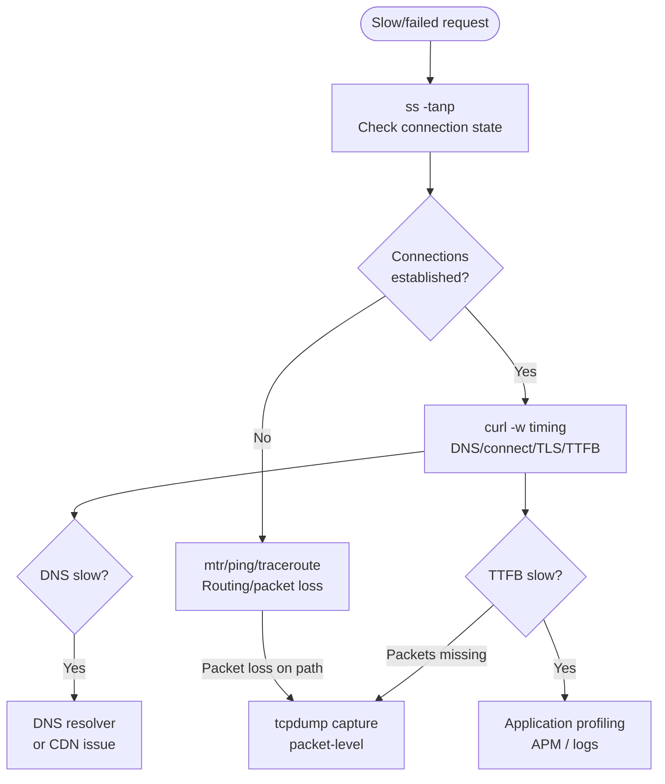
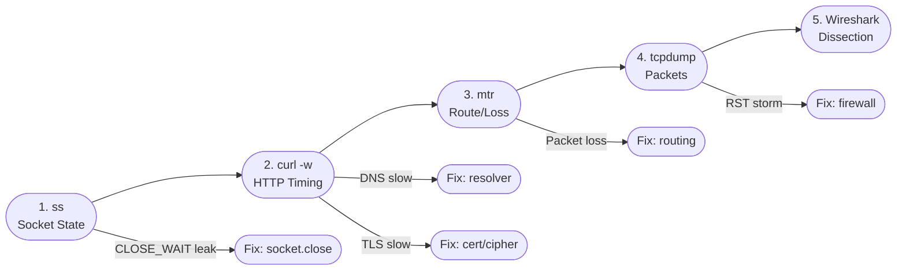

## Keywords in This File
{: .no_toc }

| # | Keyword | Weight |
|---|---|---|
| 21 | [Network Debugging: tcpdump, Wireshark, ss, and curl](#network-debugging-tcpdump-wireshark-ss-and-curl) | critical |

---

# Network Debugging: tcpdump, Wireshark, ss, and curl

---
id: CN-021
title: "Network Debugging: tcpdump, Wireshark, ss, and curl"
category: Computer Networks
difficulty: ★★★
interview_weight: critical
seniority: senior-staff
tags: #tcpdump #wireshark #ss #curl #netstat #debugging #diagnosis #network-tools
---

## Quick Reference

**One-line definition:** Production network debugging uses a layered toolkit: ss/netstat for socket state and connection counts, curl for HTTP-layer timing, tcpdump for raw packet capture, and Wireshark for deep protocol dissection; the debugging strategy is "coarse to fine" - start with socket stats to confirm the problem layer, then use curl for HTTP timing, then drop to tcpdump only when packet-level diagnosis is needed.

**Difficulty:** ★★★ | **Asked at:** Senior-Staff | **Seniority:** Senior through Staff

---

### 🎯 Model Answer

**30 seconds:**
Network debugging follows a "coarse to fine" strategy. First: ss (socket stats) to see connection states and counts - are connections established, in CLOSE_WAIT, or failing? Second: curl with timing to measure DNS, connect, TLS, and TTFB independently. Third: tcpdump to capture raw packets when you need to see what's actually being exchanged. Fourth: Wireshark for deep dissection of captures. The key skill is knowing WHICH layer the problem is at before reaching for packet capture - most issues are diagnosable with ss and curl without ever needing tcpdump.

**3 minutes:**
**ss (socket statistics):** Replaces netstat. Shows all sockets with state, local/remote address, process, and TCP internals. `ss -tanp` shows all TCP sockets, with process names. `ss -tnp state CLOSE_WAIT` shows lingering half-open connections (common bug: server not calling close() on the socket). `ss -tmn` shows memory usage per socket. Key socket states: ESTABLISHED (active), CLOSE_WAIT (peer closed, local not yet), TIME_WAIT (normal, 2*MSL wait after close), LISTEN (server waiting).

**curl timing breakdown:** `curl -w "@curl-format.txt"` prints DNS resolution time, TCP connect time, TLS handshake time, time-to-first-byte (TTFB), and total time. This tells you exactly where latency comes from without a packet capture. Slow DNS = CDN or resolver issue. Slow TCP connect = network latency or firewall. Slow TLS = certificate chain issue or HSM. Slow TTFB = application processing time.

**tcpdump:** Packet-level capture. Filter syntax: `host 10.0.0.1 and tcp port 443`. Capture to file: `-w /tmp/cap.pcap`. Read back: `-r /tmp/cap.pcap`. Key for debugging: `-v` for verbose (shows TTL, TOS), `-s 0` for full packet capture (not just headers). `tcpdump -i any` for all interfaces. Captures at kernel ring buffer; stop quickly to avoid missed packets.

**Wireshark:** GUI analysis of pcap files. Key features: `tcp.analysis.retransmission` filter shows retransmitted packets; `http.response_time > 1` shows slow HTTP responses; Expert Information panel surfaces anomalies automatically. Follow TCP Stream: right-click on packet -> Follow -> TCP Stream shows entire HTTP conversation as text.

**Blank Mind Recovery:** ss = socket states (fast overview). curl = HTTP timing breakdown. tcpdump = raw packet capture. Wireshark = analyze pcap. Drill from coarse (ss) to fine (tcpdump) only as needed.

---

### 📘 Concept Explanation

**Core concept:** Network problems manifest at different protocol layers; the debugging tool hierarchy matches the layers. Starting at the socket/application layer (ss, curl) and moving down to packet capture (tcpdump) only when necessary is faster and less disruptive than starting with packet capture.

**Debugging layer hierarchy:**

```
Problem layer -> Tool to use

Application (HTTP/gRPC response):
  curl -v -w "@fmt.txt" https://api.example.com
  -> HTTP status, timing breakdown

Transport (TCP connection):
  ss -tanp | grep <port>
  -> connection state, cwnd, RTT

Network (routing, packet loss):
  ping, mtr, traceroute
  -> per-hop latency, packet loss

Packet level (exact bytes):
  tcpdump -i eth0 -w /tmp/cap.pcap \
    "host <ip> and port 443"
  -> what is actually being exchanged

Protocol dissection:
  wireshark /tmp/cap.pcap
  -> protocol decode, timing, anomaly detection

Rule: start at application, work down.
If ss shows ESTABLISHED -> TCP is fine, debug HTTP.
If ss shows nothing -> TCP not connecting, debug network.
If tcp connects but HTTP fails -> debug TLS or application.
```

> **Code walkthrough:** WHAT IT SHOWS: the debugging layer hierarchy mapping problem types to the appropriate tool. KEY MECHANISM: each layer's tool observes at a different level of abstraction; ss sees TCP state without reading packet bytes; curl reads HTTP without writing a packet capture; this allows diagnosis at the appropriate level without the overhead of full packet capture. WHY IT MATTERS: engineers who default to tcpdump first create large captures that are slow to analyze; the layered approach typically diagnoses 80% of issues with ss and curl in < 5 minutes. WHAT BREAKS: if a firewall is silently dropping packets, ss will show no connection and tcpdump will show SYN packets with no SYN-ACK; the layer hierarchy correctly routes to packet capture for this case. TAKEAWAY: always ask "which layer is failing?" before choosing a tool; each tool answers a specific question at a specific layer.

**curl timing format:**

```bash
# Create curl timing format file:
cat > /tmp/curl-format.txt << 'EOF'
     dns_lookup:  %{time_namelookup}s\n
  tcp_connect:  %{time_connect}s\n
 tls_handshake:  %{time_appconnect}s\n
   ttfb:  %{time_starttransfer}s\n
    total:  %{time_total}s\n
EOF

# Use it:
curl -w "@/tmp/curl-format.txt" -o /dev/null \
  -s https://api.example.com/health
```

> **Code walkthrough:** WHAT IT SHOWS: a curl write-out format file that measures and prints each timing component of an HTTPS request. KEY MECHANISM: curl's -w flag accepts format strings with timing variables; time_namelookup is DNS resolution time; time_connect is TCP handshake completion; time_appconnect is TLS handshake completion; time_starttransfer is when the first byte of the response body is received (TTFB). WHY IT MATTERS: TTFB is the most important performance metric for user-facing APIs; it equals DNS + TCP + TLS + server processing; breaking it down identifies which component is slow. WHAT BREAKS: curl measures DNS from the OS resolver; if the OS caches DNS, repeated runs show 0ms for DNS even if the first resolution was slow; clear DNS cache or use `--dns-cache` options. TAKEAWAY: always run curl 3-5 times and compare; the first run may have DNS cache miss latency; subsequent runs show steady-state performance; use percentiles not averages for SLO validation.

**ss internals for TCP diagnosis:**

```bash
# Full TCP socket status with internals:
ss -tnipm

# Example output for one socket:
# State   Recv-Q  Send-Q  Local  Peer
# ESTAB   0       0       10.0.0.1:8080  10.0.0.2:52341
#  cubic wscale:7,7 rto:201 rtt:0.5/0.25 ato:40
#  mss:1448 pmtu:1500 rcvmss:1448 advmss:1448
#  cwnd:10 ssthresh:2147483647 bytes_sent:12345
#  segs_out:10 segs_in:8 data_segs_out:9
#  send 231.7Mbps lastsnd:2 lastrcv:4 lastack:2
#  pacing_rate 277.8Mbps delivery_rate 231.7Mbps
#  delivered:8 busy:4ms rcv_space:14600 rcv_ssthresh:64076

# Key fields:
# cwnd:10  -> congestion window in MSS
# rtt:0.5  -> current RTT in ms
# send 231.7Mbps -> estimated send bandwidth
# ssthresh:2147483647 -> max int = no threshold set (still in slow start)
```

> **Code walkthrough:** WHAT IT SHOWS: the detailed TCP socket information from ss -tnipm including congestion control state, RTT, cwnd, and estimated throughput. KEY MECHANISM: ss reads this data from the kernel's TCP subsystem via netlink socket; no packet capture needed; `cwnd` tells whether slow start or congestion avoidance; `rtt` shows current RTT; `send` shows the estimated available bandwidth. WHY IT MATTERS: this output is the fastest way to check if a specific connection is experiencing congestion (low cwnd, high RTT) or is healthy (cwnd near BDP, low RTT, send bandwidth matches expected). WHAT BREAKS: ss shows a snapshot; cwnd and RTT change every RTT; for trending, sample ss output every 1-5 seconds. TAKEAWAY: bookmark `ss -tnipm` for TCP diagnostics; it provides Wireshark-equivalent TCP state information in < 1 second without packet capture overhead.

**tcpdump for TLS debugging:**

```bash
# Capture TLS handshake (without decrypting):
tcpdump -i eth0 -n -s 0 \
  "tcp port 443 and (tcp[13] & 0x02 != 0 \
   or tcp[13] & 0x04 != 0 \
   or tcp[13] & 0x10 != 0)" \
  -w /tmp/tls.pcap
# Filters: SYN, SYN-ACK, ACK, RST packets
# Shows: handshake timing, RST storms

# Capture all traffic to an IP (no filter):
tcpdump -i eth0 -n -s 100 \
  host 10.0.0.1 \
  -w /tmp/debug.pcap

# Quick one-liner for HTTP (no TLS):
tcpdump -i eth0 -n -A \
  "tcp port 8080 and (tcp[13] & 8 != 0)"
# -A: print as ASCII
# Filter: PSH flag (data packets only, not SYN/ACK)

# Find TCP resets (RST storms):
tcpdump -i eth0 -n \
  "tcp[13] & 4 != 0"
# tcp[13] = flags byte: 4 = RST bit
```

> **Code walkthrough:** WHAT IT SHOWS: targeted tcpdump filters for TLS handshakes, general traffic capture, HTTP data, and TCP RST detection. KEY MECHANISM: tcp[13] is the TCP flags byte in the packet header; bit 1 = SYN (0x02), bit 2 = RST (0x04), bit 3 = PSH (0x08), bit 4 = ACK (0x10); combining these allows filtering to specific packet types without capturing all traffic. WHY IT MATTERS: RST storm diagnosis is one of the most common tcpdump use cases; when a firewall or load balancer sends RSTs to close connections, `tcp[13] & 4 != 0` captures all of them and reveals the source. WHAT BREAKS: capturing on a busy interface with `-s 0` (full packet capture) can miss packets if the kernel ring buffer fills; use `-s 100` (first 100 bytes) to capture headers only for high-traffic diagnosis. TAKEAWAY: always use targeted filters with tcpdump; capturing all traffic without filters produces gigabytes of useless data; the most useful filters are by port, IP, and TCP flag combinations.

The following diagram shows the network debugging decision tree.

```
SLOW/FAILED network request
         |
    ss -tanp
    Connections established?
     /           \
   NO             YES
   |              |
Connectivity    curl timing
problem         breakdown
   |            /       \
mtr/ping      DNS       TTFB
route         slow      slow
issue         |         |
              |      tcpdump
           Resolver    or app logs
           or CDN
```

> **Diagram walkthrough:** WHAT IT DEPICTS: a debugging decision tree for network issues showing tool selection based on observed symptoms. HOW TO READ IT: start at the top with the symptom; check connection state with ss; if connections are failing, use mtr/ping for routing; if connections succeed but requests are slow, use curl timing to identify the slow phase. KEY RELATIONSHIP: each decision narrows the problem space before reaching for a more expensive tool; this is the "coarse to fine" principle. EDGE CASE: if ss shows ESTABLISHED but curl shows slow TTFB, the bottleneck is the application (not the network); tcpdump would be unhelpful; application profiling or APM traces are needed. INSIGHT: the tree forces the engineer to form a hypothesis before capturing packets; engineers who capture first and look later spend hours analyzing irrelevant traffic.



> **Diagram walkthrough:** WHAT IT DEPICTS: the same debugging decision tree as a Mermaid flowchart with tool nodes and decision branches. HOW TO READ IT: diamond nodes are decision points; rectangle nodes are tool invocations; the flow routes from symptom to the appropriate tool based on observed state. KEY RELATIONSHIP: tcpdump is only reached via two paths: TTFB is slow but application logs show nothing, or packet loss is detected by mtr; both cases genuinely require packet-level visibility. EDGE CASE: if mtr shows packet loss at hops 3-5 but not at the final destination, the loss may be ICMP rate-limiting by intermediate routers rather than actual path loss; always verify with TCP-based tools (iperf3 or curl). INSIGHT: the flowchart encodes the principle that most production issues are resolved above the packet level; tcpdump is the last resort, not the first tool.

---

### 💻 Code Example

**BAD: Starting with tcpdump for every issue**

```bash
# BAD: capturing all traffic blindly
# for a "slow API" complaint
tcpdump -i eth0 -w /tmp/debug.pcap
# Problem 1: captures gigabytes per minute
#   on a busy server
# Problem 2: captures all traffic, not just
#   the problematic connection
# Problem 3: doesn't tell you WHICH layer
#   is slow (DNS? TCP? TLS? App?)
# Problem 4: requires opening in Wireshark
#   and guessing what to look for
# Result: 2 hours of analysis for a problem
#   that ss and curl would diagnose in 3 min
```

> **Code walkthrough:** WHAT IT SHOWS: the anti-pattern of jumping directly to tcpdump without first narrowing the problem with higher-level tools. KEY MECHANISM: tcpdump on a busy server generates hundreds of megabytes per minute; without a filter, it captures every packet on the interface; analyzing this without a hypothesis wastes engineering time and creates disk pressure. WHY IT MATTERS: engineers who default to packet capture bypass faster, less disruptive tools; most production issues (connection refused, slow TTFB, timeout) are diagnosable in 2 minutes with ss and curl. WHAT BREAKS: unfiltered tcpdump on a high-traffic interface can itself cause performance degradation by consuming CPU for packet copying; always use targeted filters. TAKEAWAY: never start with tcpdump; use ss for connection state, curl for HTTP timing, and only drop to tcpdump when those tools reveal a packet-level anomaly.

**GOOD: Structured debugging workflow with correct tool selection**

```bash
#!/bin/bash
# Structured network debugging script
# Usage: ./debug_api.sh <host> <port>

HOST=${1:-"api.example.com"}
PORT=${2:-"443"}

echo "=== Step 1: Connection State ==="
ss -tanp | grep ":${PORT}" | head -20
# Check: ESTABLISHED, CLOSE_WAIT, TIME_WAIT counts

echo ""
echo "=== Step 2: HTTP Timing Breakdown ==="
curl -w "\n  dns: %{time_namelookup}s\n  tcp: \
%{time_connect}s\n  tls: %{time_appconnect}s\n  \
ttfb: %{time_starttransfer}s\n  total: \
%{time_total}s\n" \
  -o /dev/null -s \
  "https://${HOST}:${PORT}/health"

echo ""
echo "=== Step 3: DNS Check ==="
dig +stats "${HOST}" | tail -10
# Check: Query time, server used

echo ""
echo "=== Step 4: TLS Certificate ==="
echo | openssl s_client \
  -connect "${HOST}:${PORT}" \
  -servername "${HOST}" 2>/dev/null \
  | openssl x509 -noout \
  -subject -issuer -dates
# Check: cert expiry, correct CN/SAN

echo ""
echo "=== Step 5: Packet Loss (if needed) ==="
echo "Run if Steps 1-4 show no clear cause:"
echo "mtr --report --report-cycles 20 ${HOST}"
```

> **Code walkthrough:** WHAT IT SHOWS: a structured debugging script that works through layers from coarse (connection state) to fine (TLS certificate), stopping when the issue is found. KEY MECHANISM: each step answers a specific question; Step 1 (ss) answers "are connections working?"; Step 2 (curl) answers "which phase is slow?"; Step 3 (dig) answers "is DNS the bottleneck?"; Step 4 (openssl) answers "is TLS the bottleneck?"; Step 5 (mtr) is only run if the previous steps don't identify the cause. WHY IT MATTERS: this script runs in < 30 seconds and produces structured output that engineers can share via Slack without needing access to the production server. WHAT BREAKS: the curl timing requires an `/health` endpoint that responds quickly; if the endpoint is unavailable, timing phases up to the connection failure are still reported. TAKEAWAY: create a debugging runbook script like this for your production systems; engineers under stress (incident at 3am) need a step-by-step process, not a blank terminal.

**tcpdump capture + Wireshark analysis workflow:**

```bash
# Targeted capture for HTTP/2 to specific service:
# Step 1: Identify remote IP
DIG_OUT=$(dig +short api.example.com)
echo "Resolved: ${DIG_OUT}"

# Step 2: Capture with targeted filter
# -G 60: rotate file every 60 seconds
# -W 3: keep 3 files max (180 seconds total)
# -s 200: first 200 bytes (headers only)
tcpdump -i eth0 -n \
  -s 200 \
  -G 60 -W 3 \
  -w /tmp/cap-%Y%m%d-%H%M%S.pcap \
  "host ${DIG_OUT} and tcp port 443"

# Step 3: Analyze with tshark (CLI Wireshark)
# Show TCP retransmissions:
tshark -r /tmp/cap-*.pcap \
  -Y "tcp.analysis.retransmission" \
  -T fields \
  -e frame.time_relative \
  -e ip.src \
  -e tcp.seq

# Show TLS alert messages:
tshark -r /tmp/cap-*.pcap \
  -Y "tls.alert_message" \
  -T fields \
  -e frame.time_relative \
  -e tls.alert_message.desc

# Count by TCP flag type:
tshark -r /tmp/cap-*.pcap \
  -q -z "io,stat,1,tcp.flags.reset==1"
```

> **Code walkthrough:** WHAT IT SHOWS: a targeted tcpdump capture workflow with file rotation and tshark analysis commands for retransmissions, TLS alerts, and RST counts. KEY MECHANISM: -G 60 -W 3 creates rolling captures of 60-second windows, keeping only the last 3 files; this prevents disk fill-up on busy servers; tshark provides CLI access to Wireshark's protocol dissection without a GUI. WHY IT MATTERS: file rotation is non-negotiable for production captures; an unrotated tcpdump on a 1Gbps interface fills a 100GB disk in ~14 minutes; the -G -W combination creates a fixed-size capture window. WHAT BREAKS: tshark -Y with TLS filters cannot decrypt encrypted payloads (only sees the TLS record type, not the content); for HTTP/2 content inspection, SSLKEYLOGFILE environment variable is needed to export session keys to Wireshark. TAKEAWAY: for TLS-encrypted traffic debugging, use the SSLKEYLOGFILE technique in development environments; in production, rely on application-layer logging and APM traces rather than packet decryption.

---

### 🎓 Answers by Seniority

**Junior / Mid-level answer:**
Network debugging starts with ss to check socket state (is the connection established?), then curl with timing to see where latency comes from (DNS, TCP, TLS, server), then tcpdump to capture packets if needed. ss replaces the older netstat command and shows detailed TCP internals. curl's -w flag prints DNS, connect, TLS, and TTFB timing. tcpdump captures raw packets and saves to a .pcap file for Wireshark analysis. The key principle: start coarse (ss) and go finer (tcpdump) only if needed.

**Senior / Staff answer:**
Production network debugging requires a hypothesis before tool selection. I follow a layered approach: ss/netstat first to understand connection state distribution (ESTABLISHED, CLOSE_WAIT, TIME_WAIT counts reveal different bug classes - CLOSE_WAIT explosion means server not closing connections; TIME_WAIT explosion means connection churn is high); curl timing next to decompose TTFB into DNS, TCP, TLS, and app processing; mtr for per-hop path analysis when routing is suspect; tcpdump only when I need to verify what bytes are actually on the wire. My most common high-value tcpdump filter is TCP RST detection (`tcp[13] & 4 != 0`) for diagnosing firewall/load balancer behavior, and SYN without SYN-ACK for connection refusal diagnosis. For TLS issues: openssl s_client is faster than Wireshark for cert chain and cipher negotiation diagnosis. In Wireshark, I use Expert Information as the first view on any new capture - it surfaces retransmissions, zero windows, and reset storms automatically. Production captures always use -G 60 -W 10 file rotation to prevent disk fill.

---

### ⚠️ Common Misconceptions

**Misconception 1: "netstat is equivalent to ss"**
ss is the modern replacement for netstat. ss is significantly faster (reads directly from kernel via netlink), shows TCP internals (cwnd, RTT, congestion algorithm), and supports richer filters. `netstat -an` on a server with 100,000 connections takes 30+ seconds; `ss -an` takes < 1 second. Use ss in all production contexts.

**Misconception 2: "tcpdump misses packets on fast links"**
tcpdump uses kernel ring buffers; the kernel captures packets before the application reads them. On a 1 Gbps link with targeted filters, tcpdump rarely drops packets. Drops occur when the ring buffer fills faster than it can be written to disk; use `-s 100` (headers only) for high-traffic interfaces to reduce buffer pressure. Monitor drop count in the final tcpdump output (`X packets dropped by kernel`).

**Misconception 3: "curl -v gives timing information"**
`curl -v` shows request/response headers (verbose mode) but does NOT show timing. Use `curl -w "@format.txt"` for timing. These are different flags for different purposes.

**Misconception 4: "Wireshark can decrypt HTTPS traffic by default"**
Wireshark cannot decrypt TLS without the session keys. On Linux/Mac, set `SSLKEYLOGFILE=/tmp/keys.log` before starting the browser or application; Wireshark's Edit -> Preferences -> TLS -> Master-Secret log file can then decrypt the captured traffic. This requires the client to write key material to a file - not available in production.

**Misconception 5: "CLOSE_WAIT means the connection is being closed"**
CLOSE_WAIT means the remote peer has sent a FIN (closed its half), but the LOCAL application has not yet called close(). The connection is stuck in CLOSE_WAIT because the application is not closing the socket. A large number of CLOSE_WAIT sockets is a bug - the application is leaking connections.

---

### 🚨 Failure Modes and Diagnosis

**Failure 1: CLOSE_WAIT accumulation causing connection leak**

```bash
# Symptom: server runs out of file descriptors
# (EMFILE / ENFILE errors)
# "Too many open files" in application logs

# Diagnose: count socket states
ss -tan | awk '{print $1}' | sort | uniq -c
# Output:
# 50000 CLOSE_WAIT   <- BUG: should be near 0
#   200 ESTABLISHED
#    50 TIME_WAIT

# Find which process owns CLOSE_WAIT sockets:
ss -tanp state close-wait | head -20
# Look for: process name and fd count
# (process field shows pid and fd)

# Check fd limit:
cat /proc/$(pidof <process>)/limits \
  | grep "Max open files"
# If CLOSE_WAIT count approaches this limit:
# process will fail to accept new connections

# Fix: check that the application calls
# socket.close() in all code paths
# including error paths and finally blocks
```

> **Code walkthrough:** WHAT IT SHOWS: diagnosing a CLOSE_WAIT connection leak using ss to count socket states and identify the leaking process. KEY MECHANISM: CLOSE_WAIT means the remote side closed the connection but the local application has not called close(); each CLOSE_WAIT socket holds a file descriptor; when CLOSE_WAIT count approaches the process file descriptor limit (ulimit -n), the process can no longer accept new connections. WHY IT MATTERS: CLOSE_WAIT leaks are a common production bug in Java/Python applications; HTTP connection handlers that don't close the socket in finally blocks create permanent CLOSE_WAIT entries. WHAT BREAKS: if the application process is restarted, CLOSE_WAIT sockets are cleaned up; but root cause (missing close()) persists; code fix is required. TAKEAWAY: ss state counts are a valuable monitoring metric; add CLOSE_WAIT count to application dashboards; alert when it exceeds 1000 for any single process.

**Failure 2: DNS lookup causing slow TTFB**

```bash
# Symptom: curl shows:
#   dns: 1.200s  <- much higher than expected
#   tcp: 0.020s
#   tls: 0.060s
#   ttfb: 1.300s
# Total latency: 1.3s, mostly DNS

# Diagnose: test DNS directly
dig +stats api.example.com
# Look for: "Query time: 1200 msec"
# and: "SERVER: 10.0.0.53#53"
# = slow corporate DNS resolver

# Test with alternative resolver:
dig @8.8.8.8 +stats api.example.com
# If this returns in 20ms: resolver is the bottleneck

# Check DNS cache:
# Linux nscd:
nscd -g | grep "hosts cache"
# Look for: cache hits vs misses ratio

# Workaround: add /etc/hosts entry for internal services
echo "10.0.0.100 api.internal.example.com" \
  >> /etc/hosts
# Eliminates DNS latency for that hostname

# Fix: switch resolver or add DNS caching layer
# Options: systemd-resolved, dnsmasq, CoreDNS
```

> **Code walkthrough:** WHAT IT SHOWS: diagnosing slow DNS resolution using curl timing to identify DNS as the bottleneck, then dig to test the resolver directly. KEY MECHANISM: curl's time_namelookup measures DNS resolution; if it exceeds 100ms, DNS is the bottleneck; testing with an alternative resolver (@8.8.8.8) compares local resolver vs public; if the public resolver is fast, the local resolver is misconfigured or overloaded. WHY IT MATTERS: slow DNS is one of the most common TTFB problems; it is invisible in application code (the application just sees "connection taking 1.2 seconds") but immediately visible with curl timing. WHAT BREAKS: the /etc/hosts workaround bypasses DNS caching entirely; IP addresses must be kept up to date manually; use only for internal services with static IPs. TAKEAWAY: always check DNS resolution time separately from TCP connection time; curl's -w format is the simplest way to isolate these phases; slow DNS accounts for a surprisingly large fraction of "slow API" incidents.

**Failure 3: TLS certificate expiry causing connection failures**

```bash
# Symptom: connections succeed intermittently
# or fail with SSL_ERROR_RX_RECORD_TOO_LONG

# Diagnose certificate expiry:
echo | openssl s_client \
  -connect api.example.com:443 \
  -servername api.example.com 2>/dev/null \
  | openssl x509 -noout -dates
# Output:
# notBefore=Jan  1 00:00:00 2024 GMT
# notAfter=Jan  1 00:00:00 2025 GMT
# If notAfter < today: certificate expired

# Check entire certificate chain:
echo | openssl s_client \
  -connect api.example.com:443 \
  -showcerts 2>/dev/null \
  | grep -E "subject|issuer|notAfter"

# Verify TLS version and cipher:
openssl s_client \
  -connect api.example.com:443 \
  -tls1_3 2>&1 | head -5
# If fails: server doesn't support TLS 1.3

# Monitor cert expiry with script:
EXPIRE=$(echo | openssl s_client \
  -connect api.example.com:443 2>/dev/null \
  | openssl x509 -noout -enddate \
  | cut -d= -f2)
DAYS=$(( ($(date -d "$EXPIRE" +%s) - \
  $(date +%s)) / 86400 ))
echo "Certificate expires in ${DAYS} days"
# Alert if DAYS < 30
```

> **Code walkthrough:** WHAT IT SHOWS: diagnosing TLS certificate issues including expiry and chain validation using openssl s_client. KEY MECHANISM: openssl s_client simulates a TLS client and reports the certificate chain, TLS version, and cipher suite; the certificate dates can be extracted and compared to the current date to compute days until expiry. WHY IT MATTERS: certificate expiry causes 100% of connections to fail instantly at the TLS layer; the failure is indistinguishable from network issues without checking the certificate explicitly; monitoring cert expiry prevents outages. WHAT BREAKS: certificate rotation (replacing the cert before expiry) must be coordinated with CDN edge nodes that may cache the old cert; after rotation, wait 30 minutes for CDN cache to clear. TAKEAWAY: add certificate expiry monitoring to every production SSL endpoint; alert at 30 days before expiry; automate renewal with Let's Encrypt (certbot) or AWS ACM (automatic rotation).

---

### 🎯 Interview Deep-Dive

| Format | Questions | Est. Time |
|---|---|---|
| Junior/Mid | 12 questions | 35-45 min |
| Senior/Staff | 12 questions + deep-dives | 55-70 min |

**Category: CONCEPT**

**[JUNIOR] Q1 - [CONCEPTUAL] What is the difference between ESTABLISHED, CLOSE_WAIT, and TIME_WAIT TCP states?**

**ESTABLISHED:** Both sides have completed the TCP three-way handshake. Data is actively flowing or the connection is idle but still open. This is the "healthy active connection" state.

**CLOSE_WAIT:** The remote peer has sent a FIN packet (signalling it won't send more data). The local TCP stack has received the FIN and sent an ACK. But the local application has NOT yet called close() on the socket. The connection is waiting for the local application to finish its half-close.

Normal: briefly CLOSE_WAIT while the application processes remaining data and then calls close(). Pathological: thousands of CLOSE_WAIT sockets = application is not calling close(), leaking connections.

**TIME_WAIT:** The local side has sent a FIN and received the remote's FIN. The connection is fully closed from both sides but the TCP stack waits for 2*MSL (Maximum Segment Lifetime, 60 seconds on Linux) before releasing the port. This ensures any delayed packets from the old connection are absorbed before a new connection uses the same port/IP combination.

Normal: TIME_WAIT is expected on servers that close many short-lived connections. Pathological: too many TIME_WAIT (> 100,000) can exhaust local port numbers. Fix: `SO_REUSEPORT`, or server-side keep-alive to reuse connections.

*What separates good from great:* Understanding WHY TIME_WAIT exists - the 2*MSL wait ensures delayed packets from the old connection don't corrupt a new connection on the same IP:port pair; removing TIME_WAIT (via SO_LINGER=0 or RST) sacrifices this safety property.

---

**[JUNIOR] Q2 - [CONCEPTUAL] What does curl's -v flag show vs -w?**

**`curl -v` (verbose):** Shows the request and response at the HTTP protocol level:
- DNS resolution (hostname -> IP)
- TCP connection establishment
- TLS handshake (certificates exchanged, cipher selected)
- HTTP request headers sent
- HTTP response headers received
- Transfer summary

Does NOT show timing broken down by phase. Good for: seeing what headers are being sent, what certificate is being presented, and confirming the HTTP exchange.

**`curl -w "@format"` (write-out):** Shows timing and metadata extracted from the request:
- `time_namelookup`: DNS resolution duration
- `time_connect`: TCP connection duration
- `time_appconnect`: TLS handshake duration
- `time_starttransfer`: TTFB (server processing)
- `time_total`: total duration
- `http_code`: HTTP status code
- `size_download`: response size in bytes

Good for: measuring performance, comparing before/after changes, scripted monitoring.

The two flags serve different purposes and can be combined: `curl -v -w "@fmt"` shows headers AND timing.

*What separates good from great:* Knowing that `-v` shows the conversation while `-w` measures it; combining both gives the complete picture; `-v` output goes to stderr, `-w` to stdout, enabling separate capture.

---

**[MID] Q3 - [CONCEPTUAL] What are the most important tcpdump filters and when do you use each?**

Key tcpdump filters by use case:

**Connection establishment/failure:**
```bash
# SYN packets (new connections being initiated):
tcpdump "tcp[13] & 2 != 0 and tcp[13] & 16 = 0"
# SYN without ACK = pure connection initiation

# RST packets (connection resets):
tcpdump "tcp[13] & 4 != 0"
# Diagnoses: firewall blocking, server refusing
```

> **Code walkthrough:** WHAT IT SHOWS: tcpdump filters for SYN and RST packets using TCP flags byte access. KEY MECHANISM: tcp[13] accesses byte 13 of the TCP header (the flags byte); bit masking extracts specific flag combinations; SYN without ACK (new connection) uses mask `& 2 != 0 and & 16 = 0`. WHY IT MATTERS: capturing only SYN and RST packets reduces capture volume to < 1% of total traffic while capturing all connection state transitions. WHAT BREAKS: tcpdump's BPF filter is evaluated in the kernel; complex filters with multiple conditions can have evaluation order issues; test filters on known traffic before production use. TAKEAWAY: maintain a library of tested tcpdump filter strings for common scenarios (connection debug, TLS, RST, DNS); being able to type the right filter under incident pressure is a core production skill.

**HTTP/gRPC traffic:**
```bash
# HTTP requests (port 8080, unencrypted):
tcpdump -i eth0 -A "tcp port 8080 and \
  tcp[13] & 8 != 0"  # PSH flag = data

# DNS queries:
tcpdump -i eth0 "udp port 53"
```

> **Code walkthrough:** WHAT IT SHOWS: filters for HTTP (port + PSH flag) and DNS (UDP 53) traffic. KEY MECHANISM: PSH flag (bit 3 = 0x08) is set on segments carrying application data; filtering PSH eliminates handshake and ACK-only packets, showing only data transfers; DNS uses UDP on port 53 making it simply filterable by port and protocol. WHY IT MATTERS: filtering to data packets reduces noise significantly; a busy HTTP server generates many ACK packets for every data transfer; PSH filtering focuses on the actual requests and responses. WHAT BREAKS: HTTP/2 and HTTP/3 over TLS cannot be inspected with -A (all bytes appear as encrypted binary); for TLS traffic, use tshark with session keys or application-level logging. TAKEAWAY: the PSH filter is reliable for unencrypted HTTP (microservice mesh without mTLS); for mTLS-encrypted traffic, use Envoy/Istio access logs instead of packet capture.

**Specific host and port:**
```bash
# Targeted capture for one connection:
tcpdump "host 10.0.0.1 and tcp port 5432"
# PostgreSQL traffic to/from one server
```

> **Code walkthrough:** WHAT IT SHOWS: the most common tcpdump filter pattern combining host and port for targeted capture. KEY MECHANISM: the `host` keyword matches both source and destination address; `and port` adds port filtering; BPF compiles this to an efficient kernel filter that only copies matching packets to userspace. WHY IT MATTERS: capturing all traffic on a production database server generates gigabytes of irrelevant noise; targeting host + port reduces capture to only the connection under investigation. WHAT BREAKS: if the problematic connection changes port (connection reset and reconnected), the capture misses the new connection; use only the host filter if port is not known in advance. TAKEAWAY: always include port in tcpdump filters for targeted debugging; the host filter alone on a busy server still captures too much; host + port is the minimum targeted filter.

*What separates good from great:* Knowing `tcp[13]` as the flags byte and being able to construct flag filters from bit positions; this is the difference between looking up filters vs constructing them on demand under incident pressure.

---

**[SENIOR] Q4 - [DEBUGGING] An API endpoint returns 200 OK but the response body is truncated. Diagnose using network tools.**

Step 1: Verify with curl - compare Content-Length vs actual bytes received:
```bash
curl -v -o /tmp/resp.bin \
  "https://api.example.com/data" 2>&1 \
  | grep -E "Content-Length|content-length"
wc -c /tmp/resp.bin
# If Content-Length = 50000 but wc = 32768:
# Transfer truncated at 32KB
```

> **Code walkthrough:** WHAT IT SHOWS: using curl to capture the response body and compare it against the Content-Length header to confirm truncation. KEY MECHANISM: curl writes the body to /tmp/resp.bin; wc -c counts bytes; if bytes < Content-Length, the transfer was truncated; this distinguishes server-side truncation from network truncation. WHY IT MATTERS: HTTP 200 with a truncated body is a common issue with proxies, load balancers, and CDNs that have response size limits; the client application may silently accept the partial response. WHAT BREAKS: if the server sends chunked encoding (no Content-Length), use `-D -` to see headers and compare total chunk bytes to expected size. TAKEAWAY: always check Content-Length vs actual response size when investigating partial response issues; curl -o captures the body for offline comparison.

Step 2: Check for proxy/LB response size limits:
```bash
# Capture the truncated response packet:
tcpdump -i eth0 -n -s 200 \
  "tcp and port 443" -w /tmp/trunc.pcap

# Analyze in tshark:
tshark -r /tmp/trunc.pcap \
  -Y "http.content_length > 10000" \
  -T fields -e frame.len -e http.content_length
```

> **Code walkthrough:** WHAT IT SHOWS: capturing and analyzing the network exchange to find where truncation occurs - whether at the server, proxy, or CDN layer. KEY MECHANISM: tshark filters for HTTP responses with large content-length and reports actual frame size; if frame.len < content_length, the response is truncated at the TCP/IP layer before it reaches the client. WHY IT MATTERS: identifying whether truncation happens at the server, proxy, or client determines which component to fix; truncation at the proxy layer (Nginx, HAProxy response buffer limit) requires proxy configuration changes. WHAT BREAKS: TLS-encrypted traffic shows encrypted frames; tshark cannot read content-length without decryption; use SSLKEYLOGFILE for development environment diagnosis. TAKEAWAY: layer the investigation: curl confirms truncation, tcpdump + tshark identifies the truncation point, application logs or proxy logs identify the cause.

*What separates good from great:* Considering CDN and proxy buffer limits as likely suspects for 32KB or 64KB truncations - these are common default limits in Nginx (proxy_buffer_size) and AWS ALB (response body limit).

---

**[SENIOR] Q5 - [DEBUGGING] ss shows 50,000 CLOSE_WAIT sockets on a Java application. What caused this and how do you fix it?**

Root cause: the Java application is not closing HTTP connections after receiving a response. When the remote server closes its side (sends FIN), the Java TCP stack acknowledges (CLOSE_WAIT) but the Java application never calls connection.close() or response.close().

Typical code bugs:

Pattern 1: InputStream not closed:
```java
URL url = new URL("http://api/data");
HttpURLConnection conn = (HttpURLConnection) 
    url.openConnection();
// Reading response but NOT closing:
InputStream in = conn.getInputStream();
String body = new String(in.readAllBytes());
// MISSING: in.close() and conn.disconnect()
// -> CLOSE_WAIT socket leak
```

> **Code walkthrough:** WHAT IT SHOWS: a Java HTTP connection that leaks CLOSE_WAIT sockets by not closing the InputStream and disconnecting the URLConnection. KEY MECHANISM: HttpURLConnection holds an open socket; when the server sends FIN (closes its side), the socket enters CLOSE_WAIT; the Java application must call disconnect() to complete the local close and transition to TIME_WAIT (then closed); without it, CLOSE_WAIT persists until the JVM or process is restarted. WHY IT MATTERS: 50,000 CLOSE_WAIT sockets each hold a file descriptor; the JVM's file descriptor limit (ulimit -n) determines how many open sockets are allowed; when this limit is hit, no new connections can be opened. WHAT BREAKS: increasing ulimit only delays the problem; the root cause (missing close()) must be fixed; increasing limits without fixing leaks eventually hits OS limits. TAKEAWAY: always use try-with-resources for HTTP connections in Java; any Closeable (InputStream, HttpURLConnection, OkHttpResponse) that is not closed in a finally block is a potential resource leak.

Fix: use try-with-resources or proper close in finally:
```java
try (CloseableHttpResponse response = 
    httpClient.execute(request)) {
    String body = EntityUtils.toString(
        response.getEntity());
    // response automatically closed on exit
}
```

> **Code walkthrough:** WHAT IT SHOWS: the fix using try-with-resources to ensure CloseableHttpResponse (Apache HttpClient) is closed in all code paths including exceptions. KEY MECHANISM: try-with-resources calls close() on the AutoCloseable resource at the end of the block regardless of how the block exits (normal, exception, return); this closes the InputStream, disconnects from the server, and allows the socket to complete the four-way TCP close. WHY IT MATTERS: this pattern is the only reliable way to close HTTP resources; manually calling close() in finally blocks is error-prone when exceptions can skip the finally path or when multiple resources need closing in the right order. WHAT BREAKS: if the entity body is not fully consumed before close(), Apache HttpClient cannot reuse the connection (it must discard unconsumed bytes first); consume the response body before relying on connection pooling. TAKEAWAY: use Apache HttpClient or OkHttpClient with try-with-resources; never use HttpURLConnection in new code; modern HTTP clients with connection pooling handle close() automatically.

*What separates good from great:* Connecting the code pattern (missing close) to the TCP state (CLOSE_WAIT) to the operational symptom (file descriptor exhaustion) - understanding the full causality chain from code bug to production failure.

---

**[SENIOR] Q6 - [DEBUGGING] tcpdump shows SYN packets leaving the server but no SYN-ACK coming back. What are the possible causes?**

SYN without SYN-ACK means the remote side either:
1. Never received the SYN packet
2. Received it but dropped it (firewall)
3. Received it but sent SYN-ACK that was dropped on return path

Diagnosis:

Cause 1: Routing problem - SYN not reaching destination:
```bash
# Traceroute to identify where SYN is lost:
mtr --report --tcp --port 443 <destination>
# Packets shown per hop; 100% loss at hop N
# = routing problem at router N
```

> **Code walkthrough:** WHAT IT SHOWS: using mtr (My Traceroute) with TCP mode to trace the path and find where SYN packets are lost. KEY MECHANISM: mtr --tcp sends TCP SYN packets (not ICMP) on the specified port; this traces the exact path that real TCP connections take; some routers that drop ICMP traceroute still pass TCP traffic; --report provides a summary after 10 packets per hop. WHY IT MATTERS: traditional traceroute uses UDP or ICMP which may be filtered by firewalls; mtr --tcp shows the path that real connections take; 100% loss at a specific hop identifies the blocking router. WHAT BREAKS: some routers limit ICMP TTL-exceeded responses; mtr may show 100% loss at an intermediate hop even though traffic passes (the router doesn't respond to traceroute but forwards packets). TAKEAWAY: verify with TCP-level test: if mtr shows loss at hop 5 but an iperf3 connection succeeds, the loss is ICMP rate-limiting not actual blocking.

Cause 2: Firewall dropping SYN:
```bash
# Check if security group / iptables blocking:
iptables -L -n -v | grep DROP
# Or AWS: check security group inbound rules
# for port 443
```

> **Code walkthrough:** WHAT IT SHOWS: checking iptables rules for DROP entries that could be blocking inbound SYN packets. KEY MECHANISM: iptables processes packets through chains (INPUT, OUTPUT, FORWARD); a DROP rule silently discards matching packets without sending any response back; SYN packets dropped by iptables explain SYN-without-SYN-ACK in tcpdump captures. WHY IT MATTERS: firewalls that DROP (vs REJECT) silently discard packets without RST; the sender must wait for timeout (usually 3-75 seconds) before declaring the connection failed; this is the "75 second hang" common in misconfigured firewall environments. WHAT BREAKS: iptables -L requires root; in containers or restricted environments, use `ss` to check if the server is even listening on the port before checking firewall rules. TAKEAWAY: when SYN has no SYN-ACK, check both endpoints: is the server listening (`ss -tlnp | grep 443`)? Is a firewall blocking (`iptables -L`)? In cloud environments, also check security groups and NACLs.

*What separates good from great:* The asymmetric routing case - SYN may reach the destination but SYN-ACK returns via a different path that is blocked; this is why source routing tests (send SYN from the server's address) are needed to distinguish symmetric vs asymmetric path issues.

---

**Category: TRADE-OFF**

**[SENIOR] Q7 - [TRADE-OFF] When is full packet capture (tcpdump -s 0) vs header-only capture (-s 100) appropriate?**

**Full packet capture (`-s 0` or `-s 65535`):**

Captures entire packet including payload.

When appropriate:
- Debugging application protocol issues: need to see request/response bodies (unencrypted HTTP, Redis, Kafka protocol)
- Reproducing network-level bugs: need exact bytes for protocol verification
- TLS debugging with SSLKEYLOGFILE: Wireshark needs full TLS records for decryption

Risks:
- Very high disk I/O on busy interfaces (Gbps links generate TB/day of captures)
- Privacy risk: captures user data in plaintext (GDPR/PCI implications)
- Performance risk: copying entire payload to userspace is expensive

**Header-only capture (`-s 100` or `-s 200`):**

Captures first 100-200 bytes (Ethernet + IP + TCP headers, first line of HTTP/2 frames).

When appropriate:
- TCP-level diagnosis: connection states, SYN/ACK, retransmissions (only need headers)
- High-traffic interfaces: keeps capture file small
- Latency analysis: timing of SYN/SYN-ACK/data are in headers

Limitation: cannot see application payload; TLS records appear as opaque bytes.

Decision: default to `-s 200` unless you specifically need the payload. For production security-sensitive services, capture headers only to avoid capturing passwords, tokens, and PII in plaintext.

*What separates good from great:* The compliance implication - full packet capture on an HTTPS endpoint without TLS decryption only shows encrypted bytes; full packet capture on an HTTP endpoint captures user credentials, session tokens, and PII; this is a PCI-DSS violation if done on cardholder data environments.

---

**[SENIOR] Q8 - [TRADE-OFF] When do you use ss vs Wireshark vs Datadog APM for network diagnosis?**

**ss:** Use when you need the current snapshot of all connections on a server. Answers: "how many connections are ESTABLISHED?", "are there CLOSE_WAIT leaks?", "what is the current cwnd/RTT for a specific connection?". Best for: connection state auditing, capacity assessment, rapid connection health check.

**Wireshark:** Use when you need to see the exact bytes on the wire. Answers: "what is the exact TLS alert being sent?", "are there TCP retransmissions?", "what is the server sending in this HTTP/2 HEADERS frame?". Best for: deep protocol debugging, TCP timing analysis, vendor interoperability issues.

**Datadog APM (or similar):** Use when you need distributed traces across services. Answers: "which service in the call chain is slow?", "how much time does each microservice spend processing vs waiting for downstream?", "how does P99 latency change over time?". Best for: production performance monitoring, SLO tracking, cross-service latency attribution.

Decision framework:
- Single server, now: ss
- Single connection, exact protocol: Wireshark (tcpdump to file + Wireshark offline)
- Production, cross-service, over time: APM/tracing

They are complementary: APM identifies which service is slow, ss checks its connection state, Wireshark diagnoses the exact protocol exchange.

*What separates good from great:* APM traces identify the slow service but cannot diagnose whether slowness is network or application; ss confirms whether TCP connections to the slow service are healthy (low RTT, high cwnd); Wireshark provides the definitive packet-level evidence.

---

**[SENIOR] Q9 - [TRADE-OFF] What are the limitations of tcpdump in Kubernetes pods?**

**Limitation 1: Container network namespace:**
tcpdump captures on a specific network interface; Kubernetes pods run in separate network namespaces with virtual interfaces (veth pairs); running tcpdump on the host captures the veth interface, not the pod's eth0 view.


```bash
# Option: nsenter to run tcpdump in pod namespace
PID=$(docker inspect -f '{{.State.Pid}}' <container>)
nsenter -n -t $PID -- \
  tcpdump -i eth0 -s 100 -w /tmp/cap.pcap
```


> **Code walkthrough:** WHAT IT SHOWS: using nsenter to run tcpdump inside a container's network namespace to capture traffic from the container's perspective. KEY MECHANISM: nsenter -n enters the network namespace of the specified process (container PID); tcpdump then runs as if it is inside the container, capturing traffic on the container's eth0 interface. WHY IT MATTERS: capturing on the host's eth0 captures all pods' traffic interleaved; nsenter gives pod-specific capture with the container's routing and interface view. WHAT BREAKS: the container must have tcpdump installed, or you must copy it in; in distroless containers, nsenter without a binary in the container requires volume-mounting the binary. TAKEAWAY: for Kubernetes packet capture, use kubectl debug (ephemeral container with network-admin capability) or a dedicated capture sidecar rather than nsenter; these are cleaner and don't require host access.

**Limitation 2: mTLS / service mesh:**
Istio, Linkerd, and similar service meshes encrypt service-to-service traffic with mTLS inside the pod; tcpdump sees encrypted Envoy proxy traffic; readable application protocol is only visible in the proxy's access logs, not packet captures.

**Limitation 3: eBPF-based observability (better than tcpdump in K8s):**
Tools like Cilium Hubble, Pixie, and Datadog Network Performance Monitoring use eBPF to observe network traffic without packet capture overhead; they provide service-level connectivity metrics (latency, error rate, throughput per pod pair) without decryption or capture files.

*What separates good from great:* Knowing that eBPF-based network observability is the production-appropriate approach in Kubernetes, and naming specific tools (Cilium Hubble, Pixie); tcpdump is a development and basic debugging tool, not the recommended approach for production Kubernetes debugging.

---

**Category: BEHAVIORAL**

**[SENIOR] Q10 - [BEHAVIORAL] Describe a production incident you diagnosed using tcpdump or other low-level network tools.**

Situation: A payment processing service intermittently failed with "Connection reset by peer" errors - 2-3 times per hour, random clients affected. All health checks and monitoring showed green. The payment provider's support team insisted their service was healthy.

Task: Determine whether the resets were from our side, the payment provider side, or an intermediate network component.

Action:
1. Captured TCP RST packets on the server: `tcpdump "tcp[13] & 4 != 0" -w /tmp/rst.pcap`
2. Analyzed in tshark: `tshark -r /tmp/rst.pcap -T fields -e ip.src -e tcp.flags.reset`
3. Found: RSTs originating from 203.0.113.1 (the payment provider's IP, confirmed via WHOIS). RSTs sent mid-request (sequence numbers matched an in-flight payment POST).
4. Shared pcap with payment provider. They identified a load balancer bug: idle connections over 30 seconds were reset even if a request was in-flight.
5. Workaround: added SO_KEEPALIVE to our connections; keepalive probes prevented the connection from appearing idle.

Result: resets stopped; incident closed with payment provider responsible for fix.

*What separates good from great:* The RST source attribution - identifying which IP sent the RST exonerated our infrastructure and directed the incident to the correct owner; without the packet capture, both teams would have argued about "service health" without evidence.

---

**[SENIOR] Q11 - [DEBUGGING] After a kernel upgrade, TCP connections to a third-party service fail within 60 seconds. Diagnose.**

First observation: 60-second timeout is significant - TCP default retransmission timeout starts at 1 second, doubles to 2, 4, 8, 16, 32, then the final timeout is at ~63 seconds. This is a TCP timeout (not a kernel TCP close timeout).

Diagnosis steps:

Step 1: Check if the failure is TCP or TLS:
```bash
curl -w "connect: %{time_connect}s\n" \
  --connect-timeout 70 https://api.third-party.com
# If connection hangs 60s then fails: TCP timeout
# TCP connect never completes
```

> **Code walkthrough:** WHAT IT SHOWS: using curl with connect-timeout to distinguish TCP timeout from TLS or HTTP failure. KEY MECHANISM: time_connect measures TCP handshake completion; if curl hangs for 60 seconds and then fails with "Connection timed out", the SYN packet is not receiving a SYN-ACK; the 60-second timeout is the kernel's TCP retransmission sequence (1+2+4+8+16+32=63 seconds). WHY IT MATTERS: a 60-second timeout immediately points to TCP SYN being dropped, not an application error; the kernel upgrade may have changed TCP stack behavior (initial window, TCP options, congestion algorithm). WHAT BREAKS: NAT gateways and middleboxes sometimes reject TCP connections with options that were added or changed in kernel upgrades (TCP timestamps, MPTCP, ECN). TAKEAWAY: a 60-second connection failure almost always means TCP SYN timeout; shorter failures (10-30 seconds) may be application timeouts; longer (> 90 seconds) may be kernel retransmit count changes.

Step 2: Check TCP options that may have changed:
```bash
# Capture SYN packet:
tcpdump -i eth0 "tcp[13] & 2 != 0" -s 200 -c 5
# Tshark: check TCP options in SYN:
tshark -r /tmp/syn.pcap -Y "tcp.flags.syn==1" \
  -T fields -e tcp.options
# Compare to pre-upgrade SYN options
```

> **Code walkthrough:** WHAT IT SHOWS: capturing SYN packets and comparing TCP options before and after the kernel upgrade to identify options that may have changed and are being rejected. KEY MECHANISM: the TCP SYN contains option fields (MSS, window scale, SACK permitted, timestamps, MPTCP, ECN); some middleboxes and old devices reject connections with TCP options they don't recognise; a kernel upgrade that enables new options by default can break connectivity with those devices. WHY IT MATTERS: "TCP option stripping" by middleboxes is a real phenomenon; firewall appliances and NAT devices sometimes drop SYN packets with unrecognised options. WHAT BREAKS: disabling all TCP options reduces performance (disabling window scale limits bandwidth, disabling SACK increases retransmission latency). TAKEAWAY: when diagnosing post-upgrade connectivity failures, always compare the TCP SYN options before and after the upgrade; check if ECN, MPTCP, or TCP timestamps were newly enabled.

*What separates good from great:* Knowing the kernel's TCP retransmission sequence timing (1+2+4+8+16+32 = ~63 seconds) which uniquely identifies a SYN timeout pattern and focuses the investigation immediately.

---

**[STAFF] Q12 - [DESIGN] Design a network observability platform for a microservice architecture with 500 services that provides real-time connectivity visibility without packet capture.**

**Requirements:**
- Real-time: < 30 second latency for detecting connectivity issues
- No packet capture: privacy compliance (no plaintext payload)
- 500 services: scalable, low overhead
- Coverage: detect latency increases, error rates, retransmissions per service pair

**Architecture: eBPF-based network observability**

1. **Data collection: eBPF probes on all nodes:**
   - Cilium or custom eBPF programs attach to TCP socket events: connect(), sendmsg(), recvmsg()
   - Per-connection metrics: RTT, cwnd, retransmit count, bytes transferred
   - No packet payload captured - only metadata
   - Overhead: < 1% CPU (eBPF programs are JIT-compiled and run in kernel context)

2. **Service identity from pod labels:**
   - Each TCP connection is tagged with source/destination pod IP
   - IP -> service mapping via Kubernetes API (pod list with labels)
   - This creates a service-pair key: `(payment-service, postgres-db)` -> metrics

3. **Metrics aggregation:**
   - Node agent (Cilium Hubble or custom) aggregates per-connection metrics into per-service-pair counters
   - Exported to Prometheus every 10 seconds
   - Labels: src_service, dst_service, namespace, direction

4. **Alerting:**
   - Prometheus alert rules:
     - `rate(tcp_retransmits[5m]) > 0.01` -> retransmission rate > 1%
     - `avg(tcp_rtt_ms) > 10` -> RTT > 10ms (inter-service, same datacenter)
     - `rate(tcp_connection_errors[5m]) > 0` -> connection failures
   - PagerDuty integration for critical paths

5. **Connectivity graph (Grafana):**
   - Service dependency map with edge health (colour-coded by error rate)
   - Drill-down: click on edge -> show RTT histogram, retransmit count, error codes
   - Time-lapse: replay last 1 hour of connectivity changes

6. **Fallback for TLS debugging:**
   - For TLS issues, use Envoy proxy access logs (not packet capture)
   - Envoy logs: request duration, TLS error codes, downstream/upstream bytes
   - These logs contain metadata without payload content (compliant)

**Trade-offs:**
- eBPF approach: low overhead, no privacy risk, scalable; but requires Linux kernel 4.9+ and eBPF expertise
- Istio/Envoy approach: application-level metrics with TLS error codes; but adds 2-10ms latency per request for proxy overhead
- tcpdump: maximum visibility; but high overhead, privacy risk, not scalable to 500 services

*What separates good from great:* eBPF as the production-appropriate technology - it provides packet-level observability (TCP state, RTT, retransmits) without the overhead or privacy risks of packet capture; naming Cilium Hubble or Pixie as concrete implementations shows real-world production knowledge.

---

### ⚖️ Comparison Table

| Tool | Layer | What It Shows | When to Use |
|---|---|---|---|
| ss | TCP socket | Connection states, cwnd, RTT | Quick health check; connection leak diagnosis |
| netstat | TCP socket | Connection states (slower) | Legacy; prefer ss |
| curl -w | HTTP | DNS/TCP/TLS/TTFB timing | Performance diagnosis; SLO validation |
| tcpdump | Packet | Raw bytes, TCP flags, headers | Protocol-level anomalies; RST source |
| Wireshark | Packet | Protocol dissection, timing | Deep analysis of pcap files |
| mtr | Network path | Per-hop latency and loss | Routing and path quality |
| openssl s_client | TLS | Certificate chain, cipher, TLS version | TLS/cert debugging |
| tshark | Packet (CLI) | Filtered protocol analysis | Scripted pcap analysis |

> **Diagram walkthrough:** WHAT IT DEPICTS: a comparison of eight network debugging tools by OSI layer, what they reveal, and the optimal use case for each. HOW TO READ IT: the Layer column indicates the abstraction level (TCP socket, packet, network path, TLS); the What It Shows column describes the visibility each tool provides; the When to Use column guides tool selection during incidents. KEY RELATIONSHIP: ss, curl, and mtr are the primary tools covering the most common problem classes (connection state, HTTP timing, routing); tcpdump and Wireshark are secondary tools used only when primary tools can't identify the root cause. EDGE CASE: openssl s_client is often forgotten but is the fastest TLS certificate debugging tool; it provides cert chain, expiry, and cipher information in < 1 second without packet capture. INSIGHT: senior engineers are distinguished by knowing which tool answers the current question fastest; using Wireshark first for a "slow API" problem (when curl would answer in 10 seconds) is a sign of inexperience.

---

### 🏛️ System Design

**Design a network debugging and observability platform for a SaaS application serving 10,000 enterprise customers, with strict compliance (SOC 2, PCI-DSS) and a 5-minute MTTR target for network incidents.**

**Requirements:**
- 5-minute MTTR: automated detection and alerting within 2 minutes, diagnosis tools available in 3 minutes
- SOC 2 / PCI: no plaintext packet capture of customer data; all debugging audit-logged
- Multi-tenant: customer-specific visibility (customer A's issues not visible to customer B's support team)
- Scale: 10,000 customers, 100 microservices, 20 Kubernetes clusters

**Platform Architecture:**

1. **Real-time network telemetry (eBPF + Cilium Hubble):**
   - Per-node eBPF agents collect TCP metrics (RTT, retransmit, connections, errors)
   - Metrics tagged with customer namespace label (Kubernetes namespace = customer)
   - Exported to VictoriaMetrics (high-cardinality time series at this scale)
   - No payload capture; compliant with SOC 2

2. **Per-customer Connectivity Dashboard (Grafana):**
   - Customer support team views connectivity for their customer's namespace only (RBAC-gated Grafana)
   - Service dependency map per customer namespace
   - Alert: if any service-pair RTT increases > 2x baseline for > 60 seconds

3. **Pre-authorized debug runbooks (no-console access):**
   - Each debug action is an automated runbook (Jenkins, Rundeck)
   - Actions: `run-ss [namespace]`, `run-curl-timing [endpoint] [namespace]`, `collect-headers [pod] [port]`
   - All actions audit-logged (who ran, what command, what result) for SOC 2
   - No shell access to production pods; runbooks are the only approved interface

4. **Certificate monitoring service:**
   - Scans all TLS endpoints every 6 hours
   - Alerts at 30 days before expiry (PagerDuty)
   - Automatic renewal trigger (Let's Encrypt ACME or AWS ACM)

5. **Packet capture approval workflow (exception path):**
   - Full packet capture requires Security team approval (Jira ticket workflow)
   - Captures run for < 10 minutes in isolated network namespace
   - Captured files stored in encrypted S3 with 90-day retention
   - Customer data environments: capture limited to headers only (-s 100); no PII

6. **SLO-driven alerting:**
   - SLO: 99.9% of API requests < 500ms TTFB
   - Alert: P99 TTFB > 500ms for > 2 minutes -> PagerDuty
   - Alert source: APM trace percentiles (not packet capture)

**5-minute MTTR workflow:**
1. Alert fires (T+0): automated runbook checks ss state, curl timing, certificate status
2. Runbook output posted to PagerDuty (T+1 minute)
3. On-call engineer reads runbook output, identifies layer (DNS? TCP? TLS? App?) (T+2 minutes)
4. If DNS: automated failover to secondary resolver (T+3 minutes)
5. If TCP: automated connection draining + rerouting to healthy AZ (T+4 minutes)
6. If TLS cert expired: cert rotation runbook triggered (T+5 minutes)

*What separates good from great:* The "approved runbooks as the debugging interface" pattern - audit compliance (SOC 2, PCI) requires that every action in a production environment is logged; interactive shell access is incompatible with this requirement; pre-approved, audit-logged runbooks are the compliant alternative that still enables rapid diagnosis.

---

### 📊 Diagram

```
Network Debugging Decision Tree:

Problem reported
     |
     v
[ss -tanp] -> Count states
     |
  Any CLOSE_WAIT > 1000?
  -> Code bug: socket not closed
  Any SYN_RECV > 10000?
  -> SYN flood or overloaded
     |
     v
[curl -w timing] -> DNS/TCP/TLS/TTFB
     |
  DNS > 100ms?  -> Resolver issue
  TCP > 50ms?   -> Network latency
  TLS > 200ms?  -> Cert chain issue
  TTFB > 500ms? -> App processing
     |
     v
  Still unclear?
     |
     v
[tcpdump] -> Targeted packet capture
  RST from remote? -> Remote rejecting
  SYN no SYN-ACK?  -> Firewall/routing
  Retransmits?     -> Packet loss
     |
     v
[Wireshark] -> Deep protocol analysis
```

> **Diagram walkthrough:** WHAT IT DEPICTS: a linear debugging decision tree showing tool progression from fastest/coarsest (ss) to slowest/finest (Wireshark) with specific conditions that drive each tool selection. HOW TO READ IT: each level answers a specific question; the question below each tool shows what positive results look like and where they route; progression down the tree only happens when the current tool fails to identify the cause. KEY RELATIONSHIP: 80% of production network issues are resolved at the ss + curl level; tcpdump and Wireshark are needed for < 20% of cases. EDGE CASE: some problems (intermittent TCP resets, asymmetric routing) can only be diagnosed at the packet level; they manifest as occasional errors in application logs but leave no state in ss (connections appear healthy between events). INSIGHT: the debugging tree should be executed sequentially in < 5 minutes; engineers who skip ss and curl go directly to packet capture add 30+ minutes to MTTR; the tree is a speed multiplier for incident response.



> **Diagram walkthrough:** WHAT IT DEPICTS: the five-tool progression for network debugging as a left-to-right flow with exit arrows showing common resolutions at each tool level. HOW TO READ IT: the main path (top row) shows tools in sequence; exit arrows branch off when a tool identifies the root cause; the exit labels show the resolution action for each identified issue. KEY RELATIONSHIP: most incidents exit before reaching tcpdump; the earlier in the chain an issue is identified, the faster the resolution; this is why the coarse-to-fine order is critical. EDGE CASE: issues that require Wireshark (rightmost node) are typically protocol interoperability bugs, firmware-level TCP stack issues, or security incidents; these are rare and require the most expertise to resolve. INSIGHT: the left-to-right layout represents increasing depth of analysis and increasing time required; a well-trained engineer moves right only when left tools cannot identify the cause.
