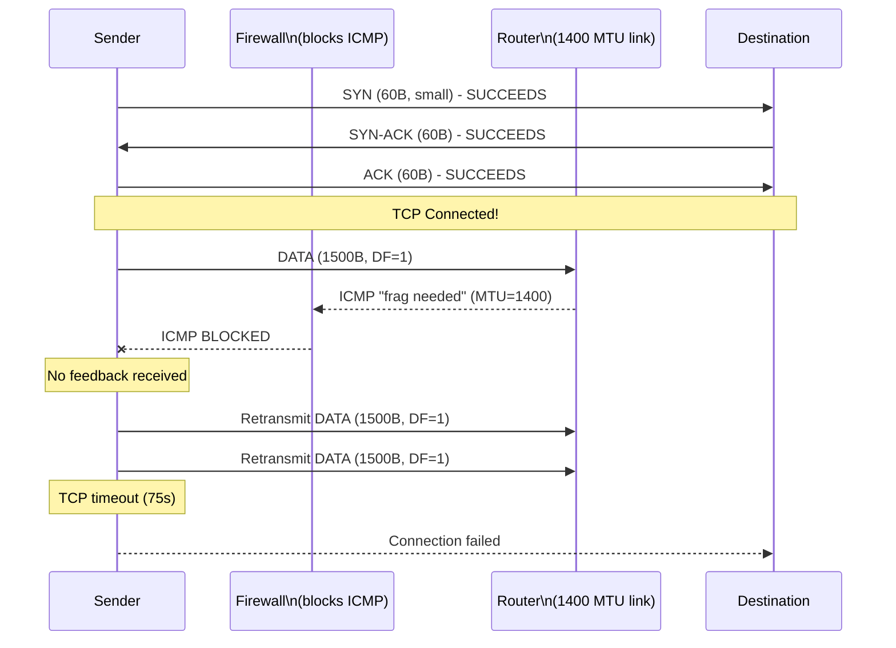
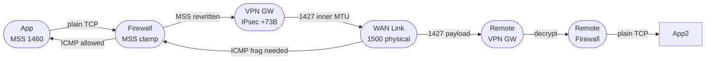

## Keywords in This File
{: .no_toc }

| # | Keyword | Weight |
|---|---|---|
| 23 | [MTU, Fragmentation, and Jumbo Frames](#mtu-fragmentation-and-jumbo-frames) | high |

---

# MTU, Fragmentation, and Jumbo Frames

---
id: CN-023
title: "MTU, Fragmentation, and Jumbo Frames"
category: Computer Networks
difficulty: ★★★
interview_weight: high
seniority: senior-staff
tags: #mtu #fragmentation #pmtud #jumbo-frames #ICMP #DF-bit #black-hole
---

## Quick Reference

**One-line definition:** MTU (Maximum Transmission Unit) is the largest IP packet a network link can carry without fragmentation; Path MTU Discovery (PMTUD) probes the end-to-end path to find the minimum MTU; the DF (Don't Fragment) bit instructs routers not to fragment, relying on ICMP "fragmentation needed" feedback to trigger packet size reduction; ICMP black holes (firewalls blocking ICMP) silently break PMTUD, causing hangs and connection failures that are notoriously difficult to diagnose.

**Difficulty:** ★★★ | **Asked at:** Senior-Staff | **Seniority:** Senior through Staff

---

### 🎯 Model Answer

**30 seconds:**
MTU is the maximum packet size for a link - Ethernet is 1500 bytes by default. If a packet exceeds the MTU on a path, routers fragment it (split into smaller packets) OR drop it and send ICMP "fragmentation needed" back. TCP's Path MTU Discovery sets the DF bit and relies on these ICMP messages to learn the path MTU. The worst failure mode: firewalls that block ICMP "fragmentation needed" create "ICMP black holes" - TCP sends packets that are silently dropped; connections hang indefinitely. Jumbo frames (9000 bytes) improve throughput for bulk transfers but require ALL hops to support them.

**3 minutes:**
**MTU basics:** IP packets larger than the link MTU cannot traverse that link. For IPv4, routers can fragment packets (split into smaller pieces) if the DF bit is NOT set. For IPv6, routers never fragment - only end hosts can. Ethernet standard MTU: 1500 bytes. This 1500-byte limit is why TCP defaults to an MSS (Maximum Segment Size) of 1460 bytes (1500 - 20 IP header - 20 TCP header).

**Path MTU Discovery (PMTUD):** Modern TCP sets the DF bit on all packets to prevent fragmentation (fragmented packets have higher reassembly overhead and can cause head-of-line blocking). PMTUD probes the path: if a router receives a DF packet larger than its link MTU, it drops the packet and sends ICMP type 3 code 4 ("Fragmentation Needed") back to the sender with the next-hop MTU. The sender reduces its MSS and retransmits.

**ICMP Black Hole:** If a firewall blocks ICMP type 3 code 4, the sender never receives the "fragmentation needed" message. It keeps sending large DF packets that are silently dropped. The result: TCP connection appears to establish (SYN/SYN-ACK with small packets work fine) but data transfer hangs after the first few bytes (when packet size exceeds 1500 bytes). This is the "black hole" symptom: initial handshake succeeds, data transfer hangs.

**TCP MSS Clamping:** A workaround for ICMP black holes. Configure the firewall or router to rewrite TCP SYN packets to reduce the MSS option to 1460 (or lower for VPN/tunnel overhead). This prevents the MSS negotiation from ever agreeing on a size that causes fragmentation. Used widely in home routers for PPPoE (MTU 1492) and VPN gateways.

**Jumbo Frames:** MTU of 9000 bytes. Require ALL network hops to support it (NIC, switch, router, VM hypervisor). Reduce per-packet overhead for bulk transfers (fewer packets for same data). Common in storage networks, HPC, and cloud provider internal backbones. Never work across the public internet.

**Blank Mind Recovery:** MTU = max packet size (1500 for Ethernet). DF bit = "don't fragment me". PMTUD = learns the path MTU. ICMP black hole = firewall blocks the ICMP feedback -> connection hangs. Jumbo frames = 9000 MTU for internal networks.

---

### 📘 Concept Explanation

**Core concept:** Packet size constraints exist at every network layer, and mismatches cause subtle failures. Understanding the interplay between MTU, fragmentation, PMTUD, and ICMP is essential for diagnosing the most opaque class of network failures - the kind where connections establish but data doesn't flow.

**The fragmentation decision tree:**

```
IP Packet > link MTU?
    |
    v
DF bit set?
   /    \
 YES     NO
  |       |
  v       v
Drop +   Fragment
ICMP    (IPv4 only;
 "frag  IPv6: drop
 needed"+ ICMPv6 PTB)

DF=YES + ICMP blocked?
  -> Packet silently dropped
  -> Sender never retransmits
  -> Connection hangs

MTU discovery (PMTUD):
  Sender sets DF=1
  Sends max-size packet
  If ICMP "frag needed" received:
    -> Reduce packet size
    -> Retransmit at smaller size
  If no ICMP (black hole):
    -> Retransmit same size (3 times)
    -> TCP timeout
    -> Connection fail

TCP MSS Clamping (firewall fix):
  Rewrite TCP SYN MSS option
  to <= 1460 (or path MTU - 40)
  Prevents large packets entirely
```

> **Code walkthrough:** WHAT IT SHOWS: the complete fragmentation decision tree for IP packets encountering a smaller-MTU link, including the ICMP black hole failure path. KEY MECHANISM: the DF bit is set by the OS when using PMTUD; for IPv4 routers may fragment DF=0 packets; for IPv6, routers never fragment; PMTUD relies on ICMP feedback to learn path MTU; when ICMP is blocked, the loop has no exit condition and the connection eventually times out. WHY IT MATTERS: ICMP black holes are the most opaque network failure - TCP handshake with small packets succeeds, data transfer with larger packets fails; the symptom is "connection establishes, then hangs"; without understanding PMTUD, this looks like an application bug. WHAT BREAKS: PMTUD works in both directions; if the return path has a smaller MTU, response packets may also be dropped; both sender and receiver must handle PMTUD. TAKEAWAY: always ensure "ICMP Fragmentation Needed" (type 3 code 4) and "ICMPv6 Packet Too Big" (type 2) are allowed through firewalls; blocking these breaks PMTUD for all TCP connections.

**MTU calculation for common encapsulations:**

```
Ethernet standard MTU:  1500 bytes
IP header:               -20 bytes
TCP header:              -20 bytes
TCP MSS (default):      1460 bytes

With VPN (IPsec ESP tunnel):
  Ethernet MTU:          1500
  IPsec ESP overhead:    -73 bytes (approx)
    (new IP header: 20, ESP header: 8,
     IV: 16, auth: 12, padding: ~17)
  TCP MSS for IPsec:     1387 bytes
  -> Without clamping: 1460-byte segments
     fragmented at VPN endpoint

With VXLAN (overlay network):
  Ethernet MTU:          1500
  VXLAN overhead:        -50 bytes
    (outer UDP: 8, outer IP: 20,
     VXLAN header: 8, outer Ethernet: 14)
  Inner MTU:             1450 bytes
  TCP MSS for VXLAN:     1410 bytes
  -> Kubernetes default VXLAN:
     MTU set to 1450 on tunnel interfaces

With GRE tunnel:
  Ethernet MTU:          1500
  GRE overhead:          -24 bytes
    (outer IP: 20, GRE: 4)
  Inner MTU:             1476 bytes
```

> **Code walkthrough:** WHAT IT SHOWS: MTU calculations for common network encapsulation scenarios showing how each encapsulation reduces the available payload space. KEY MECHANISM: every encapsulation adds headers that consume bytes from the 1500-byte Ethernet MTU; IPsec's ~73 bytes overhead is the largest because it adds encryption, authentication, padding, and a new IP header; VXLAN's 50-byte overhead is why Kubernetes nodes with VXLAN networking configure tunnel interface MTU to 1450. WHY IT MATTERS: if application traffic generates 1460-byte TCP segments (full MSS) inside an IPsec tunnel, the resulting packet is 1460 + 73 = 1533 bytes, exceeding the Ethernet MTU; the VPN gateway must either fragment or drop these packets; the fix is MSS clamping to 1387. WHAT BREAKS: incorrect MTU configuration in overlay networks is one of the most common Kubernetes networking bugs; pods communicating via VXLAN with wrong MTU settings cause intermittent failures for large responses (> 1410 bytes) while small responses (< 1410 bytes) succeed. TAKEAWAY: always subtract encapsulation overhead from the physical MTU to get the inner MTU; configure TCP MSS clamping on VPN gateways and overlay network interfaces to prevent fragmentation at these boundaries.

**Path MTU Discovery in practice:**

```bash
# Find path MTU to destination manually:
# Method 1: ping with DF bit set (Linux)
# Find max ping size that doesn't fragment:
ping -M do -s 1472 8.8.8.8
# -M do: set DF bit
# -s 1472: payload (+ 28 byte IP+ICMP header = 1500)
# If 1472 fails, try 1400, 1200, etc.
# The largest that succeeds = path MTU - 28

# Method 2: tracepath (discovers path MTU)
tracepath 8.8.8.8
# Output:
# 1: gateway (0.472ms, pmtu 1500)
# 2: isp-router (10.1ms, pmtu 1492)  <- PPPoE
# 3: upstream (25ms)
# ...
# Resume: pmtu 1492
# pmtu = smallest MTU on path = 1492

# Method 3: TCP-level check (most accurate)
curl -v --max-time 5 http://target/large-file \
  2>&1 | head -5
# If hangs after "* Connected to target":
# ICMP black hole suspected
# (connection established, data transfer hangs)

# Verify PMTUD is enabled on interface:
cat /proc/sys/net/ipv4/ip_no_pmtu_disc
# 0 = PMTUD enabled (default)
# 1 = PMTUD disabled (dangerous)
```

> **Code walkthrough:** WHAT IT SHOWS: three methods to discover path MTU - manual ping with DF bit, tracepath utility, and curl as a practical TCP-level test. KEY MECHANISM: ping -M do sets the DF bit in ICMP packets; if the packet size exceeds path MTU, the router drops it and sends "fragmentation needed" which ping reports; tracepath uses increasing TTLs and ICMP to trace the path, reporting PMTUs at each hop; the path MTU is the minimum across all hops. WHY IT MATTERS: discovering the path MTU before deployment prevents "works in testing, fails in production" scenarios where the production path has a smaller MTU (e.g., PPPoE with 1492 MTU or VPN with 1387). WHAT BREAKS: the manual ping method fails in ICMP black hole environments (DF packet is silently dropped; ping reports only "timeout" not the cause); tracepath also fails; TCP-level testing (curl) is the most realistic test. TAKEAWAY: always test path MTU with the actual protocol (TCP) not just ICMP; a working ping does not guarantee TCP will work at full MSS.

**Jumbo frames configuration and validation:**

```bash
# Check current MTU on interface:
ip link show eth0
# 3: eth0: <BROADCAST,MULTICAST,UP,LOWER_UP>
#   mtu 1500 qdisc pfifo_fast state UP
#                 ^^^^ - current MTU

# Enable jumbo frames on Linux (temporary):
ip link set eth0 mtu 9000
# Check: ip link show eth0 | grep mtu

# Enable permanently (systemd-networkd):
# /etc/systemd/network/10-eth0.network:
# [Link]
# MTUBytes=9000

# Verify end-to-end jumbo support:
ping -M do -s 8972 <target-IP>
# -s 8972: 8972 payload + 28 bytes = 9000 bytes
# If no response: an intermediate hop blocks 9000
# -> jumbo frames will NOT work end-to-end

# Check if switch supports jumbo frames:
# Cisco: show interfaces GigabitEthernet0/0
#        (look for "MTU 9000 bytes")
# Linux: ip link show dev eth0
#        (MTU field)
```

> **Code walkthrough:** WHAT IT SHOWS: commands to check, enable, and validate jumbo frame support on Linux interfaces and end-to-end path testing. KEY MECHANISM: `ip link set eth0 mtu 9000` changes the interface MTU; this only affects the local NIC; every hop (switch, router, other NIC) must also be configured for 9000-byte frames; the ping test with 8972 payload + 28 header = 9000 bytes validates end-to-end support. WHY IT MATTERS: jumbo frames that are configured on some but not all hops cause silent fragmentation or packet drops; the problem often appears only for large transfers (small files work because they fit in normal 1500-byte frames). WHAT BREAKS: configuring jumbo frames on cloud VMs without checking if the cloud provider supports 9000-byte frames causes immediate connectivity failures; AWS supports jumbo frames (9001 bytes) only within a VPC, not across VPC peering or internet gateways. TAKEAWAY: jumbo frames require unanimous support across all hops; test with a full-size ping BEFORE enabling jumbo frames in production; a single non-supporting hop silently drops all oversized packets.

The following diagram shows the PMTUD and ICMP black hole mechanism.

```
Normal PMTUD (working):

Sender ---[1500B DF=1]---> Router --[1400 MTU link]
                             |
                             | Packet > 1400
                             v
                         ICMP "frag needed"
                         next-hop MTU: 1400
Sender <---[ICMP type3]----/
Sender reduces MSS to 1360
Sender ---[1360B DF=1]---> Router ---> Dest
           [works]

ICMP Black Hole (broken):

Sender ---[1500B DF=1]---> Router --[1400 MTU link]
                             |
                             | Packet > 1400, DF=1
                             v
                         Drop packet (DF, no frag)
                         ICMP "frag needed" generated
                         Firewall BLOCKS the ICMP!
Sender: no ICMP received
Sender: retransmit 3x (same 1500B)
Sender: TCP timeout after 75s
Result: connection hangs/fails
```

> **Diagram walkthrough:** WHAT IT DEPICTS: two scenarios - working PMTUD with ICMP feedback and ICMP black hole where ICMP is blocked. HOW TO READ IT: the top path shows the correct PMTUD flow; the router drops the oversized DF packet and sends ICMP "fragmentation needed"; the sender reduces MSS and retransmits successfully; the bottom path shows the firewall blocking the ICMP response, leaving the sender with no feedback and causing TCP timeout. KEY RELATIONSHIP: the DF bit and ICMP "fragmentation needed" are a paired mechanism; disabling one without the other breaks MTU discovery; firewalls that block ICMP type 3 break PMTUD for all hosts behind them. EDGE CASE: some implementations use "Packetization Layer PMTUD" (RFC 4821) which uses TCP probe packets instead of relying on ICMP; this works through ICMP black holes but is slower to converge. INSIGHT: the "initial TCP handshake works but data transfer hangs" pattern is a near-definitive signature of an ICMP black hole; when you see this in a tcpdump capture (SYN/SYN-ACK/ACK succeed, then only retransmissions), PMTUD failure is the first suspect.



> **Diagram walkthrough:** WHAT IT DEPICTS: the ICMP black hole failure as a sequence diagram showing why TCP handshake succeeds but data transfer fails. HOW TO READ IT: the first three messages (SYN/SYN-ACK/ACK) are small packets (60 bytes) and traverse the path successfully; the first data packet (1500 bytes, DF=1) hits the smaller MTU link; the router generates ICMP "fragmentation needed" but the firewall blocks it; the sender retransmits the same-size packet three times and eventually times out. KEY RELATIONSHIP: the asymmetry between handshake success and data failure is the diagnostic signature; the handshake uses small packets (headers only); data uses large packets (MSS); the MTU problem only manifests when large packets enter the path. EDGE CASE: in some TCP implementations, MSS clamping at the firewall prevents the MSS from ever being set to 1460; even if ICMP is blocked, large packets are never sent; ICMP black holes only appear when MSS clamping is absent. INSIGHT: this sequence diagram is the most important visualization in networking for diagnosing mysterious connection hangs; memorizing the pattern (small=works, large=hangs) allows immediate hypothesis formation during incident response.

---

### 💻 Code Example

**BAD: Enabling jumbo frames on only one end**

```bash
# BAD: setting jumbo frames only on the server
# without verifying all hops support 9000 bytes

# Server:
ip link set eth0 mtu 9000

# Not checking:
# - Cloud provider supports 9000B
#   (AWS: only within VPC, not VPN/TGW)
# - Network switch configured for 9000B
# - Client NIC supports 9000B
# - Hypervisor virtual NIC for 9000B

# Result:
# Large file transfers fail intermittently
# Small files (< 1500B) succeed
# "Works for small requests" - very confusing

# Classic symptom:
curl -o /dev/null http://server/small-file  # OK
curl -o /dev/null http://server/large-file  # HANGS
# The difference: large file uses 9000B frames
# that are dropped at the non-jumbo switch
```

> **Code walkthrough:** WHAT IT SHOWS: the classic jumbo frame misconfiguration where the server MTU is changed without verifying all network hops. KEY MECHANISM: jumbo frames require unanimous support; the server sets MTU to 9000 and sends 9000-byte packets; when these reach a switch still configured at 1500-byte MTU, the switch must either fragment (IPv4 with DF=0) or drop (IPv4 with DF=1, or IPv6); the fragmentation creates reassembly overhead and packet loss; DF=1 creates silent drops. WHY IT MATTERS: the "small requests succeed, large requests fail" symptom is one of the hardest to diagnose because the failure threshold is invisible in application logs. WHAT BREAKS: a 9000-byte frame that reaches a 1500-byte switch is treated as an oversized frame (jumbo on standard Ethernet is a protocol violation); some switches drop it with no error; others return an error. TAKEAWAY: before enabling jumbo frames in production, test end-to-end with `ping -M do -s 8972 <destination>`; if the ping fails, jumbo frames will fail; do not enable production jumbo frames without a successful end-to-end test.

**GOOD: End-to-end jumbo frame validation before enabling**

```bash
#!/bin/bash
# Jumbo frame validation script
# Run BEFORE enabling jumbo frames

TARGET=${1:-"10.0.0.1"}
DESIRED_MTU=9000

echo "=== Step 1: Test current MTU ==="
ip link show eth0 | grep mtu
echo "Current MTU shown above"

echo ""
echo "=== Step 2: Test target supports 9000B ==="
# 9000 - 28 (IP + ICMP headers) = 8972
ping -M do -c 3 -s 8972 "${TARGET}"
if [ $? -ne 0 ]; then
    echo "FAIL: path does not support 9000B"
    echo "Do NOT enable jumbo frames"
    exit 1
fi
echo "PASS: 9000B frames reach ${TARGET}"

echo ""
echo "=== Step 3: Test intermediate MTU ==="
tracepath "${TARGET}" | grep pmtu
# Shows pmtu at each hop

echo ""
echo "=== Step 4: Enable jumbo (if tests pass) ==="
echo "Run: ip link set eth0 mtu ${DESIRED_MTU}"
echo "Verify: ip link show eth0"
echo ""
echo "=== Step 5: Validate after enabling ==="
# After enabling: TCP test with large file
curl --max-time 30 \
    -o /dev/null \
    -w "size: %{size_download} bytes\n" \
    "http://${TARGET}/large-test-file"
```

> **Code walkthrough:** WHAT IT SHOWS: a validation script that tests end-to-end jumbo frame support before enabling them in production. KEY MECHANISM: Step 2 uses ping -M do with 8972-byte payload (9000 total with headers); if any hop doesn't support 9000 bytes, ping fails and the script exits; tracepath shows per-hop MTU to identify the bottleneck hop. WHY IT MATTERS: this script catches the most common jumbo frame deployment mistake (partial configuration) before it causes production failures; the 30-second rule is enforced - if tracepath or ping fail, jumbo frames are not enabled. WHAT BREAKS: the ping test uses ICMP; a firewall that blocks ICMP will cause the ping to fail even if the path supports jumbo frames; in ICMP-blocked environments, test with a TCP large-file transfer instead. TAKEAWAY: always validate jumbo frame support end-to-end before enabling; this script should be part of the deployment runbook for any network MTU change.

**ICMP black hole detection and MSS clamping fix:**

```bash
# Detect ICMP black hole:
# Step 1: Verify TCP connects (small packets work)
nc -z -v <target> 443
# "Connection to target 443 port [tcp/https] succeeded"

# Step 2: Test data transfer (fails if black hole)
curl --max-time 15 -o /dev/null \
    -s -w "%{http_code}\n" \
    https://<target>/health
# If timeout (no response in 15s):
# ICMP black hole suspected

# Step 3: Confirm with tcpdump
# Terminal 1: capture on server
tcpdump -i eth0 -n "host <target>" &

# Terminal 2: connect
curl --max-time 10 https://<target>/health

# Look for: SYN/SYN-ACK/ACK succeed,
# then only retransmissions with no response
# This is the black hole signature

# Fix 1: MSS clamping (iptables)
iptables -t mangle -A FORWARD \
    -p tcp --tcp-flags SYN,RST SYN \
    -j TCPMSS --clamp-mss-to-pmtu
# Rewrites MSS in SYN packets to path MTU - 40
# Prevents large segments that would need ICMP

# Fix 2: Manual MSS value for VPN interface
# (if path MTU is known: e.g., IPsec = 1387)
iptables -t mangle -A FORWARD \
    -p tcp --tcp-flags SYN,RST SYN \
    -o tun0 \
    -j TCPMSS --set-mss 1347
# 1387 (IPsec inner MTU) - 40 = 1347

# Verify MSS clamping is working:
tcpdump -i eth0 -n "tcp[13] & 2 != 0" -v \
    | grep "mss"
# Should show reduced MSS in SYN packets
```

> **Code walkthrough:** WHAT IT SHOWS: a complete workflow for detecting ICMP black holes with tcpdump and fixing them with iptables MSS clamping. KEY MECHANISM: MSS clamping (TCPMSS target in iptables mangle table) intercepts TCP SYN packets in the FORWARD chain and rewrites the MSS option to match the path MTU minus 40 bytes; this prevents both endpoints from negotiating an MSS larger than the path can carry, eliminating the need for PMTUD and its ICMP dependency. WHY IT MATTERS: MSS clamping is the standard fix for ICMP black holes; it's used in virtually every enterprise VPN gateway, home router (PPPoE), and cloud NAT gateway; understanding it allows engineers to fix connectivity problems without changing firewall rules. WHAT BREAKS: `--clamp-mss-to-pmtu` requires the kernel to know the path MTU; if PMTUD is broken, the kernel may not know the correct value and uses an incorrect MSS; explicit `--set-mss` with a known value is more reliable for VPN tunnels with known overhead. TAKEAWAY: for any VPN or tunnel configuration, always add MSS clamping rules; the overhead is negligible and it prevents the entire class of ICMP black hole failures; treat MSS clamping as mandatory on tunnel interfaces.

---

### 🎓 Answers by Seniority

**Junior / Mid-level answer:**
MTU (Maximum Transmission Unit) is the maximum packet size for a network link - standard Ethernet is 1500 bytes. If a packet is too big, it's either fragmented (split) or dropped (if DF bit is set). Path MTU Discovery (PMTUD) is how TCP learns the smallest MTU on the path - it sends packets with DF set and relies on ICMP "fragmentation needed" messages to reduce packet size. Jumbo frames increase MTU to 9000 bytes for better bulk transfer performance, but all hops must support them.

**Senior / Staff answer:**
MTU is not just a configuration value - it's a system with failure modes. The critical failure is ICMP black holes: DF=1 packets that exceed an intermediate link MTU are dropped silently (ICMP type 3 code 4 blocked by firewall); TCP retransmits the same oversized packet three times, then times out; the symptom is "TCP handshake succeeds, data transfer hangs" - one of the most deceptive failure signatures in networking. The fix is MSS clamping: rewrite TCP SYN MSS option to path MTU - 40 bytes, preventing both endpoints from ever negotiating a segment size that exceeds the path capacity. In container and overlay networks (VXLAN, IPsec, GRE), MTU deserves special attention: each encapsulation layer subtracts 20-73 bytes from the effective payload MTU; misconfigured overlay MTUs cause exactly this failure pattern for responses > 1410 bytes (VXLAN) or > 1387 bytes (IPsec). For production, jumbo frames require unanimous switch and NIC support; I validate with `ping -M do -s 8972` before enabling, and configure iptables MSS clamping on all VPN and tunnel interfaces as standard practice.

---

### ⚠️ Common Misconceptions

**Misconception 1: "Disabling ICMP is safe for security"**
Blocking ICMP type 3 (Destination Unreachable) and type 11 (Time Exceeded) breaks PMTUD and ICMP black holes. Blocking ICMP type 8/0 (ping) is acceptable from a security perspective (prevents ping-based reconnaissance), but filtering all ICMP breaks TCP Path MTU Discovery for all connections behind the firewall. Rule: allow ICMP type 3 code 4 and type 11; restrict type 8 (ping) if required.

**Misconception 2: "IPv6 doesn't have this problem"**
IPv6 routers never fragment (unlike IPv4 where DF=0 packets can be fragmented). IPv6 uses ICMPv6 type 2 "Packet Too Big" for PMTUD. Blocking ICMPv6 type 2 creates the same black hole problem. IPv6 is MORE sensitive to ICMP blocking because fragmentation by routers is never an option - the packet must be dropped and the sender must resize.

**Misconception 3: "Jumbo frames always improve performance"**
Jumbo frames reduce per-packet overhead for LARGE transfers (bulk, streaming). For small request/response workloads (REST APIs, short queries), jumbo frames provide no benefit because responses fit in standard 1500-byte frames. For latency-sensitive traffic, larger frames may INCREASE latency (larger frames take longer to transmit at the same bandwidth). Jumbo frames benefit: high-throughput bulk transfers (NFS, iSCSI, Kafka brokers, DB replication).

**Misconception 4: "AWS supports jumbo frames everywhere"**
AWS supports 9001-byte MTU within a single VPC (EC2 instances). However, jumbo frames are NOT supported across: VPC peering connections, VPN connections, AWS Direct Connect in some configurations, Classic ELB. Always check the AWS documentation for the specific service path before enabling jumbo frames.

**Misconception 5: "TCP MSS and MTU are the same"**
MTU includes IP and TCP headers. MSS is the maximum TCP payload size = MTU - 40 bytes (20 IP + 20 TCP). Default: MTU 1500 -> MSS 1460. MSS is negotiated in the TCP SYN/SYN-ACK options. If both sides advertise MSS 1460, actual TCP segments will be 1460 bytes payload + 40 bytes headers = 1500 bytes total = exactly fits standard MTU.

---

### 🚨 Failure Modes and Diagnosis

**Failure 1: "Works on small responses, fails on large" - VXLAN MTU misconfiguration**

```bash
# Symptom: HTTP 200 for small responses,
# hangs for large responses in Kubernetes

# Diagnose: identify where the hang occurs
# Step 1: measure at what size it hangs
for SIZE in 100 500 1000 2000 5000; do
    echo -n "Testing ${SIZE} bytes: "
    timeout 5 curl -s -o /dev/null \
        -w "%{http_code}" \
        "http://service/endpoint?size=${SIZE}"
    echo ""
done
# If 100/500/1000 work but 2000 fails:
# MTU boundary near 1500 bytes

# Step 2: check overlay network MTU in pods
kubectl exec -it <pod> -- ip link show eth0
# Should show: mtu 1450 (VXLAN) or 1410 (Calico)
# If showing 1500: incorrect MTU for overlay

# Step 3: verify pod-to-pod path MTU
kubectl exec -it <pod> -- \
    ping -M do -s 1422 <other-pod-IP>
# 1422 + 28 headers = 1450 (VXLAN inner MTU)
# If fails: actual overlay MTU is smaller

# Fix: configure correct MTU in CNI plugin
# For Flannel VXLAN (/etc/kube-flannel/kube-flannel.yml):
# net-conf.json: {"Network": "10.244.0.0/16",
#   "Backend": {"Type": "vxlan", "MTU": 1450}}
# For Calico:
kubectl patch felixconfiguration default \
    --type merge \
    --patch '{"spec":{"mtu":1450}}'
```

> **Code walkthrough:** WHAT IT SHOWS: diagnosing overlay network MTU misconfiguration in Kubernetes where large responses fail but small ones succeed. KEY MECHANISM: VXLAN adds 50 bytes of overhead to each packet; the inner MTU is 1450 bytes; if the CNI plugin reports 1500-byte MTU to the pod, the pod's TCP stack uses MSS 1460; the resulting packets (1460 + 40 = 1500 byte inner frame) become 1550 bytes with VXLAN overhead, exceeding the physical MTU of 1500 bytes. WHY IT MATTERS: this failure pattern is endemic to new Kubernetes clusters deployed with incorrect CNI MTU configuration; it appears to be an application bug (large responses fail) but is actually a network configuration error. WHAT BREAKS: the ping test with specific sizes identifies the exact MTU boundary; if ping -s 1422 passes but 1423 fails, the inner MTU is 1450 (1422 + 28 = 1450). TAKEAWAY: when deploying Kubernetes, always check pod interface MTU (`kubectl exec -- ip link show eth0`) and verify it matches the overlay network overhead; VXLAN = 1450, Calico with VXLAN = 1440, IPsec = 1390.

**Failure 2: VPN tunnel causing intermittent connection failures**

```bash
# Symptom: connections via VPN hang after
# initial data exchange

# Diagnose: check MSS in captured packets
tcpdump -i tun0 -n \
    "tcp[13] & 2 != 0" -v 2>/dev/null \
    | grep "mss"
# Output: "mss 1460" - TOO HIGH for VPN!
# IPsec adds 73B, so 1460 + 73 = 1533 > 1500

# Check if MSS clamping is active:
iptables -t mangle -L FORWARD -v \
    | grep -i "tcpmss\|clamp"
# No output = no MSS clamping = packets too large

# Check VPN interface MTU:
ip link show tun0
# Should show mtu 1387 or lower for IPsec

# Fix: add MSS clamping for VPN interface
iptables -t mangle -A FORWARD \
    -p tcp --tcp-flags SYN,RST SYN \
    -i tun0 -j TCPMSS --set-mss 1347
iptables -t mangle -A FORWARD \
    -p tcp --tcp-flags SYN,RST SYN \
    -o tun0 -j TCPMSS --set-mss 1347
# 1387 inner MTU - 40 headers = 1347 MSS

# Verify fix:
tcpdump -i tun0 -n \
    "tcp[13] & 2 != 0" -v 2>/dev/null \
    | grep "mss"
# Should now show: "mss 1347"
```

> **Code walkthrough:** WHAT IT SHOWS: diagnosing and fixing VPN MSS mismatch by capturing SYN packets and inspecting the advertised MSS, then adding iptables MSS clamping. KEY MECHANISM: VPN tunnels reduce the effective MTU by their encapsulation overhead; IPsec adds ~73 bytes; inner MTU = 1500 - 73 = 1427 bytes; MSS = 1427 - 40 = 1387; but without MSS clamping, the endpoints negotiate MSS 1460, leading to 1500-byte inner frames that exceed the tunnel MTU and get fragmented or dropped. WHY IT MATTERS: VPN-induced fragmentation is a common source of performance degradation; fragmented packets require reassembly at the other end; reassembly failures (lost fragment) cause retransmissions; fixing MSS clamping eliminates fragmentation entirely. WHAT BREAKS: iptables rules set with -A (append) are added after any existing rules; if a previous ACCEPT rule matches first, the TCPMSS target never executes; use -I (insert at position 1) to ensure MSS clamping fires first. TAKEAWAY: always add MSS clamping rules in BOTH directions for VPN interfaces (-i tun0 for inbound, -o tun0 for outbound); missing one direction causes asymmetric failures (data flows one way but not the other).

---

### 🎯 Interview Deep-Dive

| Format | Questions | Est. Time |
|---|---|---|
| Junior/Mid | 12 questions | 35-45 min |
| Senior/Staff | 12 questions + deep-dives | 55-70 min |

**Category: CONCEPT**

**[JUNIOR] Q1 - [CONCEPTUAL] What is MTU and why is it 1500 bytes for Ethernet?**

MTU (Maximum Transmission Unit) is the largest IP packet that can be sent across a network link without being fragmented. It includes the IP header, TCP/UDP header, and the data payload.

Why 1500 bytes? Historical: when Ethernet was standardized (IEEE 802.3), 1500 bytes was chosen as a balance between:
- Transmission efficiency: larger frames = less per-frame overhead
- Error recovery: larger frames = longer retransmit time on error
- Memory requirements: larger frames = more buffer RAM needed (expensive in 1980s)
- Propagation delay: larger frames hold the shared medium longer

1500 bytes became the universal Ethernet standard and has remained so for backward compatibility. The actual Ethernet frame capacity is 1518 bytes (1500 payload + 14 Ethernet header + 4 CRC), but the IP layer sees only 1500 bytes.

For TCP: IP header = 20 bytes, TCP header = 20 bytes, so TCP payload (MSS) = 1500 - 40 = 1460 bytes by default.

*What separates good from great:* Knowing that the 1500-byte MTU is not technically optimal for modern hardware (modern NICs handle 9000-byte frames easily); it persists only for backward compatibility and the massive cost of changing the universal standard.

---

**[JUNIOR] Q2 - [CONCEPTUAL] What is the DF bit in an IP header and why does TCP set it?**

The DF (Don't Fragment) bit is a flag in the IPv4 header (bit 1 of the flags field). When set, it instructs routers: "do not fragment this packet; if it doesn't fit, drop it and send an ICMP error."

Why TCP sets DF: Modern TCP uses Path MTU Discovery (PMTUD). PMTUD relies on the DF bit + ICMP feedback to discover the minimum MTU on the path:
1. TCP sends packets with DF=1
2. If a router can't forward the packet (too big for its link), it drops the packet and sends ICMP "Fragmentation Needed" with the next-hop MTU
3. TCP receives the ICMP, reduces its MSS, and retransmits

Why avoid fragmentation?
- Fragmented packets must be reassembled by the destination host, not routers
- If one fragment is lost, the entire original packet must be retransmitted
- Fragment reassembly requires buffer memory proportional to concurrent fragments
- Some firewalls and NAT devices have bugs with fragmented packets
- UDP applications using large packets over IPv4 still risk fragmentation

For IPv6, routers NEVER fragment; only the source host can fragment IPv6 packets, and fragmentation in IPv6 is discouraged (use PMTUD).

*What separates good from great:* The IPv6 distinction - IPv6 made fragmentation a source-only operation to simplify router processing; this makes PMTUD and ICMP "Packet Too Big" even more critical in IPv6 networks.

---

**[MID] Q3 - [MECHANISM] Describe the full Path MTU Discovery mechanism step by step.**

PMTUD discovers the minimum MTU on the path between two hosts:

Step 1 - SYN exchange: Both ends negotiate TCP MSS via the SYN and SYN-ACK options. Each host advertises its local link MSS (usually 1460 for Ethernet). Both use the minimum of the two as the initial MSS.

Step 2 - DF=1 on all packets: The sender sets DF=1 on all data packets to prevent fragmentation along the path.

Step 3 - Large packet hits smaller MTU link:
- Router receives packet: 1500 bytes, DF=1
- Router's output link MTU: 1400 bytes
- Packet cannot be forwarded without fragmentation
- Router drops the packet
- Router sends ICMP type 3 code 4 ("Fragmentation Needed, Don't Fragment was Set") to the sender with the `Next-Hop MTU` field set to 1400

Step 4 - Sender adjusts: The sender receives the ICMP message, extracts the Next-Hop MTU (1400), reduces its effective PMTU for this destination to 1400, reduces MSS to 1360 (1400 - 40), and retransmits the dropped data.

Step 5 - Forward progress: The 1360-byte segments now fit the 1400-byte link. If there are further smaller MTU links ahead, ICMP messages arrive again and the sender further reduces MSS.

Step 6 - PMTU aging: The OS maintains a per-destination PMTU cache with a timeout (Linux default: 10 minutes). After timeout, the cache entry expires and PMTUD starts again (allows recovery if the path changes to a larger MTU).

*What separates good from great:* PMTU aging is necessary because the path can change (BGP rerouting); if the new path has a larger MTU, the old (smaller) cached MTU unnecessarily limits performance; the 10-minute timer allows the sender to probe for a larger MTU periodically.

---

**[SENIOR] Q4 - [MECHANISM] How does TCP MSS clamping work and when do you apply it?**

MSS clamping is a firewall/router technique that modifies the MSS option in TCP SYN packets as they pass through. This prevents both TCP endpoints from negotiating an MSS larger than the actual path MTU can carry.

How it works:
1. A TCP SYN packet includes an MSS option (typically 1460)
2. The clamping firewall inspects the SYN, compares the MSS to the path MTU
3. If MSS > (path MTU - 40), the firewall rewrites the MSS to (path MTU - 40)
4. Both endpoints now use the clamped MSS for all data
5. TCP never sends packets larger than path MTU - no fragmentation needed

Linux iptables implementation:
```bash
# Clamp to automatic path MTU:
iptables -t mangle -A FORWARD \
    -p tcp --tcp-flags SYN,RST SYN \
    -j TCPMSS --clamp-mss-to-pmtu

# Clamp to specific value (VPN: 1347):
iptables -t mangle -A FORWARD \
    -p tcp --tcp-flags SYN,RST SYN \
    -o tun0 \
    -j TCPMSS --set-mss 1347
```

> **Code walkthrough:** WHAT IT SHOWS: iptables MSS clamping rules in the mangle table for both automatic (clamp to PMTU) and manual (fixed value) approaches. KEY MECHANISM: the mangle table processes packets before routing; FORWARD chain applies to packets being routed through (not originating from) the host; `--tcp-flags SYN,RST SYN` matches only SYN packets (new connection initiation); TCPMSS target modifies the MSS option in the matched packet. WHY IT MATTERS: MSS clamping is the only reliable fix for ICMP black holes; it eliminates the dependency on ICMP feedback entirely by ensuring packets are never larger than the path can carry. WHAT BREAKS: `--clamp-mss-to-pmtu` relies on the kernel knowing the path MTU; on a freshly rebooted system or after network path changes, the kernel PMTU cache may be stale; `--set-mss` with a known value is more reliable for fixed VPN tunnels. TAKEAWAY: use `--clamp-mss-to-pmtu` for general internet-facing firewalls; use `--set-mss` with a specific calculated value for VPN and tunnel interfaces where overhead is fixed and known.

When to apply MSS clamping:
- PPPoE connections (MTU 1492 -> clamp MSS to 1452)
- Any VPN or GRE tunnel (subtract encapsulation overhead)
- Any firewall/NAT where ICMP might be blocked
- Kubernetes cluster edge routers
- Any path where MTU reduction exists and ICMP is not guaranteed

*What separates good from great:* Understanding that MSS clamping is passive on the firewall (it only sees SYN packets, which are tiny) and has zero performance overhead; there is no reason not to add MSS clamping on all edge firewalls and VPN gateways as a default configuration.

---

**[SENIOR] Q5 - [DEBUGGING] A cloud-to-on-premises VPN connection works for small requests but fails for large ones. Diagnose and fix.**

Symptom pattern: small requests (<1KB) succeed; large requests (>1KB) hang or fail.

Step 1: Confirm it's an MTU issue (not application):
```bash
# Test with increasing sizes:
for SIZE in 100 500 1000 1400 1500; do
    echo -n "Test ${SIZE}B: "
    curl --max-time 5 \
        -o /dev/null -w "%{http_code}\n" \
        "http://on-prem-service/?size=${SIZE}"
done
# Find the threshold where failures begin
```

> **Code walkthrough:** WHAT IT SHOWS: binary search for the MTU boundary by testing requests of increasing sizes. KEY MECHANISM: if requests succeed up to 1000 bytes but fail at 1400 bytes, the MTU boundary is between 1000 and 1400; this narrows the problem to packets exceeding a specific size; since TCP MSS negotiation happens at connection time, once MSS is set, the threshold is predictable. WHY IT MATTERS: finding the size threshold immediately suggests MTU as the cause (vs application bugs which are not size-dependent); presenting this data in an incident bridges from symptom to cause quickly. WHAT BREAKS: the response size (not request size) is what matters; a 100-byte request can generate a 10KB response; test with an endpoint that controls response size. TAKEAWAY: always distinguish request size vs response size when hunting MTU issues; the MTU limit affects outbound data from each side.

Step 2: Check VPN tunnel MTU:
```bash
ip link show | grep tun\|ipsec
# Expected: mtu 1427 or lower for IPsec
# If 1500: MTU not configured for tunnel

# Check MSS in captured SYN packets:
tcpdump -i <tun-interface> -n "tcp[13] & 2 != 0" -v \
    | grep mss
# Expected: mss 1387 (for IPsec with 1427 inner MTU)
# If mss 1460: no MSS clamping
```

> **Code walkthrough:** WHAT IT SHOWS: checking VPN tunnel interface MTU and inspecting MSS in SYN packets to confirm whether MSS clamping is active. KEY MECHANISM: `ip link show` reports the configured MTU for each interface; tunnel interfaces should show the inner MTU (physical MTU - encapsulation overhead); tcpdump on the tunnel interface with TCP SYN filter shows the MSS both ends are advertising. WHY IT MATTERS: if the tunnel interface shows MTU 1500 (not reduced) and SYN packets show MSS 1460, the tunnel has no MTU configuration; packets will be fragmented or dropped at the VPN encapsulation point. WHAT BREAKS: some VPN implementations set tunnel MTU automatically; others require manual configuration; check vendor documentation for automatic vs manual MTU configuration. TAKEAWAY: always verify tunnel interface MTU separately from physical interface MTU; they must be independently configured; a tunnel with default MTU 1500 on a 1500-byte physical link WILL cause fragmentation.

Fix: apply MSS clamping and configure correct tunnel MTU:
```bash
# Set tunnel interface MTU:
ip link set ipsec0 mtu 1427

# Add MSS clamping (both directions):
iptables -t mangle -A FORWARD \
    -p tcp --tcp-flags SYN,RST SYN \
    -i ipsec0 -j TCPMSS --set-mss 1387
iptables -t mangle -A FORWARD \
    -p tcp --tcp-flags SYN,RST SYN \
    -o ipsec0 -j TCPMSS --set-mss 1387
```

> **Code walkthrough:** WHAT IT SHOWS: configuring the correct MTU on the IPsec tunnel interface and adding bidirectional MSS clamping rules. KEY MECHANISM: `ip link set mtu 1427` updates the interface MTU for IP-level fragmentation decisions; iptables MSS clamping with `--set-mss 1387` ensures TCP never negotiates an MSS that would produce packets exceeding 1427 bytes (1387 + 40 = 1427 inner MTU). WHY IT MATTERS: applying both changes is necessary - the MTU change affects non-TCP traffic (UDP, ICMP) fragmentation; the MSS clamping prevents fragmentation for TCP traffic without relying on ICMP. WHAT BREAKS: making these changes on a live VPN drops all existing TCP connections (MSS is negotiated at connection time; existing connections keep their old MSS); apply during maintenance window or on new VPN endpoints only. TAKEAWAY: the combined fix (tunnel MTU + MSS clamping) is the complete solution; either alone is incomplete; always apply both.

*What separates good from great:* Knowing the exact IPsec ESP overhead calculation (outer IP: 20, ESP header: 8, IV: 16, auth: 12, padding: ~17 = ~73 bytes), giving a VPN inner MTU of 1500 - 73 = 1427 and MSS of 1387; being able to calculate this on the spot rather than looking it up demonstrates deep understanding.

---

**Category: MECHANISM**

**[SENIOR] Q6 - [MECHANISM] How does IPv6 handle fragmentation differently from IPv4?**

**IPv4 fragmentation:**
- Routers MAY fragment DF=0 packets when they exceed the link MTU
- End hosts use PMTUD (DF=1) to avoid router fragmentation
- Fragmentation ID is 16 bits -> limited to 65,535 concurrent fragments per source IP
- Security issue: fragment reassembly attacks (overlapping fragments, LAND attack)

**IPv6 fragmentation:**
- Routers NEVER fragment IPv6 packets
- If an IPv6 packet exceeds link MTU: router drops it and sends ICMPv6 type 2 "Packet Too Big"
- Only the source host can fragment IPv6 packets using an Extension Header (Fragment Extension Header)
- This shifts CPU load from routers to hosts (design goal: simpler, faster routers)
- IPv6 PMTUD uses ICMPv6 type 2 ("Packet Too Big") instead of ICMP type 3 code 4

**Practical implication:**
- IPv6 is MORE dependent on ICMP than IPv4: blocking ICMPv6 type 2 completely breaks all IPv6 TCP connections that encounter a smaller-MTU link
- IPv6 minimum MTU: 1280 bytes (all IPv6 nodes and links must support at least 1280)
- IPv6 PMTUD must work; there is no fallback to router fragmentation

*What separates good from great:* The IPv6 minimum MTU of 1280 bytes - any network design that fragments to below 1280 bytes violates the IPv6 spec and breaks all IPv6 traffic; this is a hard lower bound that doesn't exist in IPv4.

---

**[SENIOR] Q7 - [TRADE-OFF] When do jumbo frames provide real performance benefits vs when are they irrelevant?**

**Jumbo frames provide significant benefit:**

For bulk transfers (large files, video streaming, backup, database replication):
- Standard 1500 MTU: 1 million 1-byte packets to transfer 1.5GB
  Actually: ~1 million 1460-byte segments
- Jumbo 9000 MTU: same data in ~167,000 segments (6x fewer)
- Per-packet overhead (Ethernet frame header, IP header, TCP header, CRC): 58 bytes
- Standard: 58/1500 = 3.9% overhead
- Jumbo: 58/9000 = 0.6% overhead (6x less overhead)
- CPU savings: 6x fewer interrupts, 6x fewer TCP operations

High-throughput storage (NFS, iSCSI):
- Storage I/O is sequential and large-block; jumbo frames match the I/O pattern
- iSCSI standard recommends jumbo frames for > 1Gbps storage networks
- NFS over 10GbE: jumbo frames can increase throughput by 20-30%

**Jumbo frames are irrelevant or harmful:**

Low-latency, small-message workloads (REST APIs, key-value store, RPC):
- Average response size: 200-500 bytes
- Packets never exceed 1500 bytes anyway; MTU is not the bottleneck
- Jumbo frames don't help when payload << 9000 bytes

Shared internet paths:
- Internet MTU is 1500 bytes; jumbo frames never leave the local network
- Jumbo frames end at the first 1500-byte hop

Latency-sensitive applications:
- A 9000-byte frame takes 6x longer to transmit than a 1500-byte frame at the same bandwidth
- At 1Gbps: 9000 bytes = 72 microseconds vs 1500 bytes = 12 microseconds
- For sub-millisecond latency requirements, larger frames ADD latency

*What separates good from great:* The transmission latency implication - jumbo frames have higher serialization delay; at 10Gbps this is negligible (0.72 vs 0.12 microseconds), but at 1Gbps it can matter for HFT or real-time applications; always match frame size to the workload pattern.

---

**Category: TRADE-OFF**

**[SENIOR] Q8 - [TRADE-OFF] How should Kubernetes CNI plugin MTU be configured for different deployment environments?**

CNI plugin MTU must account for overlay encapsulation overhead:

VXLAN (Flannel, Calico in VXLAN mode):
- VXLAN overhead: 50 bytes (outer Ethernet: 14, outer IP: 20, UDP: 8, VXLAN: 8)
- Physical MTU 1500 -> inner MTU: 1450
- Configure CNI MTU to 1450

WireGuard (Calico in WireGuard mode):
- WireGuard overhead: 60 bytes
- Physical MTU 1500 -> inner MTU: 1440

IPsec (Calico in IPsec mode, Cilium):
- IPsec ESP overhead: ~60-80 bytes
- Physical MTU 1500 -> inner MTU: 1420-1440

AWS EKS (no overlay, VPC-native CNI):
- AWS uses VPC ENI direct routing; no encapsulation
- Inner MTU = physical MTU = 9001 bytes (AWS supports jumbo frames in VPC)
- Configure CNI MTU to 9001 for maximum throughput

GKE (Alias IP routing):
- No VXLAN by default; Alias IP uses direct VPC routing
- MTU: 1500 (standard Ethernet) - no overhead

Common mistake: CNI auto-detecting MTU from eth0 (1500) and using 1500 for overlay interfaces; results in 1500-byte inner frames that become 1550 bytes with VXLAN, exceeding physical MTU.

```bash
# Verify CNI MTU is correctly set:
kubectl exec -it <any-pod> -- ip link show eth0
# Should show mtu 1450 for VXLAN, 9001 for AWS

# Test maximum packet size:
kubectl exec -it <pod1> -- \
    ping -M do -s 1422 <pod2-IP>
# 1422 payload + 28 headers = 1450 = inner MTU
# Pass: MTU correctly set
# Fail: MTU misconfigured
```

> **Code walkthrough:** WHAT IT SHOWS: kubectl commands to verify CNI MTU configuration and test maximum packet size between pods. KEY MECHANISM: `ip link show eth0` inside a pod shows the MTU the CNI assigned; for VXLAN CNIs this should be 1450; the ping test with `1422 payload + 28 headers = 1450` tests the maximum packet size that should work without fragmentation. WHY IT MATTERS: incorrect CNI MTU is the most common cause of "large requests fail in Kubernetes" bugs; it affects all pods in the cluster and is typically a cluster-wide configuration error. WHAT BREAKS: if ping -s 1422 fails but ping -s 1000 succeeds, the MTU is less than 1450; check for additional overlay or tunnel overhead the CNI may be applying. TAKEAWAY: always verify pod MTU after cluster deployment; add MTU verification to cluster health checks; automate this test as part of CI/CD for Kubernetes configuration changes.

*What separates good from great:* AWS VPC-native CNI supporting 9001-byte jumbo frames - this is a significant advantage over on-premises VXLAN deployments; applications running on EKS can use up to 9001-byte MTU for high-throughput transfers without overlay overhead.

---

**[SENIOR] Q9 - [TRADE-OFF] What is Packetization Layer PMTUD (PLPMTUD) and how does it improve on standard PMTUD?**

Standard PMTUD problems:
- Relies on ICMP "Fragmentation Needed" messages
- ICMP black holes (firewalls blocking ICMP) silently break PMTUD
- ICMP messages may not include the Next-Hop MTU field (optional in RFC 792)
- No standard mechanism to probe for larger MTU after path change

PLPMTUD (RFC 4821 - Packetization Layer Path MTU Discovery):
- Uses probes at the transport layer rather than relying on ICMP
- For TCP: uses TCP-level "probes" (deliberately large packets) to test if they succeed
- If a large probe is ACKed: path MTU is at least that large; try larger
- If a large probe is lost (no ACK, retransmission timeout): MTU exceeded; reduce probe size
- Binary search to find exact PMTU: probe with 1500, then 1400, then 1450, etc.

Advantages:
- Works through ICMP black holes (doesn't need ICMP)
- Actively discovers larger MTU when path changes
- Correct even when ICMP Next-Hop MTU field is wrong or missing

Disadvantages:
- Slower convergence: each probe requires a round-trip (RTT) and potential retransmit
- Some probes may be incorrectly treated as lost (spurious timeout)
- More complex implementation

SCTP and QUIC use PLPMTUD by default. TCP uses it in newer Linux kernels.

*What separates good from great:* QUIC's adoption of PLPMTUD - QUIC (HTTP/3) uses PLPMTUD for all connections, making it robust to ICMP black holes by design; this is one reason QUIC performs better than TCP in environments with broken ICMP (some enterprise firewalls).

---

**[SENIOR] Q10 - [BEHAVIORAL] Describe a production incident caused by MTU or fragmentation issues.**

Situation: A distributed data pipeline had intermittent batch failures affecting 5% of jobs. Jobs would start successfully, read initial data, then hang during the bulk data transfer phase and eventually time out. The problem occurred only for jobs reading datasets > 10MB.

Task: Determine why large data transfers fail while small ones succeed.

Action:
1. Identified the size threshold: jobs reading < 1MB succeeded; > 1MB failed. Consistent threshold near 1500 bytes of single TCP segment data.
2. Checked the path: data pipeline ran across a VPN connection to an on-premises data store.
3. Ran tcpdump: confirmed TCP handshake succeeded, data transfer started, then retransmissions with no response. Classic black hole signature.
4. Checked ICMP: `ping -M do -s 1472 on-prem-server` - timeout. Normal ping worked. Confirmed ICMP "fragmentation needed" blocked.
5. Added MSS clamping: `iptables -t mangle -A FORWARD -p tcp --tcp-flags SYN,RST SYN -o vpn0 -j TCPMSS --set-mss 1347`
6. Verified: jobs reading 100MB datasets completed successfully.

Result: Zero-downtime fix; 5% failure rate dropped to 0%.

*What separates good from great:* The tcpdump signature identification (handshake works, then retransmissions-only) being the decisive clue; experienced engineers know this pattern uniquely identifies ICMP black hole vs application timeout vs network congestion.

---

**[SENIOR] Q11 - [MECHANISM] How does ECMP (Equal-Cost Multi-Path) routing interact with MTU and fragmentation?**

ECMP routes packets across multiple equal-cost paths. This introduces an MTU interaction:

**Problem:** Different ECMP paths may have different MTUs. A path through Router-A may have MTU 1500; a path through Router-B may have MTU 1400 (some WAN or MPLS link). PMTUD discovers the MTU for the specific path used for the PMTUD probe; if subsequent packets use a different ECMP path with smaller MTU, PMTUD gives the wrong answer.

**Asymmetric PMTUD failure:** PMTUD runs for the path from A to B. The probe goes via Router-X (MTU 1500). PMTUD succeeds - MSS set to 1460. Subsequent data packets are ECMP-routed via Router-Y (MTU 1400). Packets dropped; ICMP arrives from Router-Y. TCP reduces MSS to 1360. Now some packets go via Router-X again (larger MSS is fine) and some via Router-Y. Result: intermittent failures that appear random.

**Mitigations:**
1. Ensure all ECMP paths have consistent MTU (ideal)
2. Set conservative MSS (1360) that fits any path
3. Use flow-based ECMP hashing (5-tuple): a single TCP flow uses the same path; PMTUD works correctly for that flow

**ECMP in Kubernetes:** ECMP is used for service load balancing in some CNI plugins (Cilium with eBPF). Flow-based ECMP ensures a TCP connection always uses the same path; PMTUD works correctly per connection.

*What separates good from great:* Flow-based ECMP as the correct solution - consistent 5-tuple hashing means one TCP connection always takes the same path; PMTUD works for that path; this is why flow-based ECMP is the industry standard over per-packet ECMP (which creates all these problems).

---

**[STAFF] Q12 - [DESIGN] Design the network configuration for a 10Gbps storage cluster with NFS and iSCSI traffic, maximizing throughput while maintaining reliability.**

**Requirements:**
- 10Gbps storage cluster (NFS + iSCSI)
- Maximize throughput for bulk transfer
- Reliability: single link failure must not drop connections

**Network configuration:**

1. **Jumbo frames: 9000 bytes throughout:**
   - Server NICs: `ip link set eth0 mtu 9000`
   - Storage array interfaces: configure 9000 MTU (array-specific CLI)
   - Top-of-rack switches: configure MTU 9216 (must be > 9000 for headers)
   - Validate end-to-end: `ping -M do -s 8972 <storage-array>`

2. **NIC bonding for redundancy:**
   - Mode: LACP (802.3ad) for active-active with full 20Gbps capacity
   - OR active-backup if switch doesn't support LACP
   - MTU on bond interface: 9000 (same as physical)

3. **iSCSI TCP tuning:**
   - Large send offload (LSO): `ethtool -K eth0 tso on gso on gro on`
   - Receive buffer: `sysctl -w net.core.rmem_max=134217728`
   - TCP no-delay for iSCSI: set at iSCSI initiator (`node.conn[0].iscsi.HeaderDigest = None`)
   - MSS: auto-negotiated from 9000 MTU = 8960 bytes MSS

4. **NFS tuning:**
   - rsize/wsize: 1048576 (1MB) - maximum NFS I/O block
   - noatime, nodiratime: reduce metadata I/O
   - TCP over UDP: `nfsvers=4` for TCP
   - Multiple TCP connections: `nconnect=16` (Linux 5.3+, parallel connections)

5. **Dedicated storage VLAN:**
   - VLAN segmentation separates storage from application traffic
   - QoS: storage VLAN gets strict priority queuing (DSCP EF marking)
   - No firewall between storage servers and arrays (same trusted VLAN)
   - This eliminates risk of ICMP being blocked (same L2 domain, no routing)

6. **MTU monitoring:**
   - Alert if any storage interface drops to 1500 MTU (NIC reset clears MTU setting on some drivers)
   - Prometheus metric: `node_network_mtu_bytes{device="eth0"} 9000`
   - Alert rule: `node_network_mtu_bytes < 9000 and on (instance) storage_node == 1`

7. **Fragmentation prevention:**
   - Same L2 VLAN: no routing = no PMTUD needed (L2 path always same MTU)
   - iSCSI target: configure `MaxRecvDataSegmentLength = 8388608` (1MB)
   - MSS naturally configured to 8960 from 9000 MTU

**Throughput calculation:**
- Jumbo frames (9000B) vs standard (1500B): 6x fewer packets
- At 10Gbps: 10Gbps / 9000*8 bits = 138,888 packets/sec (vs 833,333 for 1500B)
- CPU saving: 6x fewer interrupts, 6x fewer TCP operations per GB
- Expected: 9-9.5Gbps effective throughput (vs 7-8Gbps with standard MTU)

*What separates good from great:* The dedicated storage VLAN insight - by keeping storage traffic on the same L2 domain (no routing), all PMTUD and ICMP concerns are eliminated; the path has uniform MTU by design; this is simpler and more reliable than PMTUD-based solutions.

---

### ⚖️ Comparison Table

| Scenario | MTU Needed | Key Risk | Fix |
|---|---|---|---|
| Standard Ethernet | 1500 | None (baseline) | None required |
| PPPoE (DSL) | 1492 | PMTUD/black hole | MSS clamp to 1452 |
| IPsec VPN | ~1427 | Fragment at VPN endpoint | MSS clamp to 1387 |
| VXLAN overlay | 1450 | Pod communication failure | CNI MTU = 1450 |
| Jumbo frames | 9000 | Hop not supporting 9000B | Validate all hops first |
| IPv6 | 1280+ | ICMPv6 "Packet Too Big" blocked | Allow ICMPv6 type 2 |

> **Diagram walkthrough:** WHAT IT DEPICTS: a comparison table mapping networking scenarios to required MTU, key risk, and the appropriate fix. HOW TO READ IT: the MTU Needed column shows what the effective MTU is for each scenario; the Key Risk column identifies the failure mode specific to each; the Fix column provides the preventive measure. KEY RELATIONSHIP: every encapsulation scenario (PPPoE, IPsec, VXLAN) reduces effective MTU and requires MSS clamping or CNI MTU adjustment to prevent the ICMP black hole pattern. EDGE CASE: IPv6 has a separate row because its fragmentation model is completely different; blocking ICMPv6 type 2 breaks ALL IPv6 TCP connections that encounter smaller-MTU links (no fallback to router fragmentation). INSIGHT: the table shows that MTU problems are not edge cases - they appear in VPNs (common), overlays (every Kubernetes cluster with VXLAN), PPPoE (every home router), and IPv6 (any dual-stack deployment); treating MTU knowledge as advanced or rare is incorrect.

---

### 🏛️ System Design

**Design a multi-site network that connects three data centers (US, EU, AP) over leased WAN links, ensuring consistent throughput for bulk data replication while maintaining correct behavior for all application traffic.**

**Requirements:**
- Three DCs connected by 10Gbps WAN links (MPLS)
- Bulk replication: database backups and object storage sync (TB/day)
- Application traffic: microservices, REST APIs, event streaming (Kafka)
- Zero tolerance for ICMP black hole failures
- Consistent MTU handling across all paths

**Network Design:**

1. **WAN link MTU (MPLS overhead):**
   - MPLS adds 4 bytes per label; typical stack: 2 labels = 8 bytes
   - Inner MTU: 1500 - 8 = 1492 bytes (Ethernet carrying MPLS)
   - Configure WAN router interfaces: MTU 1508 (allows 1500-byte Ethernet payload over MPLS)
   - OR: use MPLS with IP tunnel mode = inner IP MTU 1480

2. **Jumbo frames within each DC:**
   - All intra-DC switches: MTU 9216 (for 9000-byte jumbo frames)
   - All servers: MTU 9000
   - Jumbo frames terminate at DC edge (before WAN)
   - DC gateway routers: handle MTU reduction from 9000 (DC) to 1480 (WAN)

3. **MSS clamping at DC edge routers:**
   - All outbound WAN paths: `iptables TCPMSS --set-mss 1440` (1480 - 40)
   - This prevents any host in any DC from negotiating MSS that exceeds WAN MTU
   - Inbound from WAN: same clamping (bidirectional)

4. **Application traffic PMTUD:**
   - ICMP type 3 code 4 explicitly allowed between DCs
   - ACL rule: `permit icmp any any unreachable` (on WAN interfaces)
   - MSS clamping is the primary mechanism; ICMP is the backup

5. **Bulk replication path:**
   - Dedicated VLAN for replication traffic
   - QoS: scavenger class (lower priority than application traffic)
   - TCP optimization: large socket buffers for long-fat pipes
     - BDP = 10Gbps * 50ms RTT = 62.5MB
     - Socket buffer: `sysctl -w net.core.rmem_max=67108864`
   - MSS for WAN: 1440 (from edge clamping)

6. **MTU monitoring and alerting:**
   - SNMP poll: interface MTU on all WAN edge routers
   - Alert if WAN interface MTU drops below 1480 (config drift)
   - Grafana dashboard: MTU per interface, per DC

7. **Failover path MTU:**
   - If primary MPLS fails: backup via internet (VPN)
   - VPN adds 73 bytes: inner MTU = 1500 - 73 = 1427
   - MSS clamping on failover VPN interface: `--set-mss 1387`
   - Different MSS on primary vs backup: acceptable (per-connection negotiation)

**Key design principle:** MSS clamping at every MTU boundary, ICMP explicitly allowed as a secondary mechanism, and per-path monitoring to detect MTU configuration drift.

*What separates good from great:* The BDP (Bandwidth-Delay Product) socket buffer calculation for the bulk replication path - 10Gbps * 50ms = 62.5MB buffer needed to keep the pipe full; with default 256KB buffers, throughput is capped at ~40Mbps on a 10Gbps link; tuning socket buffers is necessary to utilize the available bandwidth.

---

### 📊 Diagram

```
MTU Boundaries in a Production Stack:

Physical:   [====NIC 9000B====]
                   |
Hypervisor: [=VXLAN 50B over=]  inner 8950B
                   |
Switch port:[===1500B limit===]  PROBLEM if
                   |            jumbo not configured
  DC router: MPLS label overhead -8B -> inner 1492B
                   |
    WAN link:[===1492B===]
  IPsec VPN: ESP overhead -73B -> inner 1427B
                   |
  MSS:  1427 - 40 = 1387 bytes TCP payload
  (Each encapsulation subtracts from usable space)
```

> **Diagram walkthrough:** WHAT IT DEPICTS: a vertical stack showing how each network layer reduces the available MTU through encapsulation overhead. HOW TO READ IT: start at the top (physical NIC at 9000B); each box shows a layer and the overhead it adds; the MTU decreases as packets traverse more layers; the final MSS at the bottom is what TCP uses for data segments. KEY RELATIONSHIP: each encapsulation boundary must either have matching MTU on both sides (jumbo throughout) or MSS clamping to prevent packets exceeding the reduced MTU. EDGE CASE: the "PROBLEM" annotation at the switch port shows where jumbo frames most commonly fail; a 9000-byte frame from a server hits a switch still configured at 1500 bytes; the frame is oversized and dropped. INSIGHT: drawing this stack for a specific production path identifies all MTU reduction points; the smallest value in the stack is the effective path MTU; all other configurations must be ≥ this value.



> **Diagram walkthrough:** WHAT IT DEPICTS: a complete VPN path showing MSS clamping at the firewall, IPsec encapsulation overhead at the VPN gateway, and ICMP feedback paths. HOW TO READ IT: application traffic starts at MSS 1460; the firewall rewrites the MSS in SYN packets (MSS clamp); the VPN gateway adds IPsec overhead; the WAN link carries the encapsulated traffic; ICMP messages flow from the WAN link back to the firewall and application as a secondary feedback mechanism. KEY RELATIONSHIP: MSS clamping at the firewall is the primary prevention mechanism; ICMP "fragmentation needed" allowed through the firewall is the secondary mechanism; together they ensure no packets exceed the WAN MTU. EDGE CASE: if the VPN gateway uses hardware encryption acceleration that adds variable padding, the overhead is not fixed at 73 bytes; in this case, use a conservative MSS (e.g., 1360) to account for maximum padding. INSIGHT: the diagram shows that MSS clamping must happen BEFORE VPN encapsulation (at the firewall, on traffic going TO the VPN gateway, not at the VPN gateway itself); the SYN packet needs to be clamped before the connection is established.
