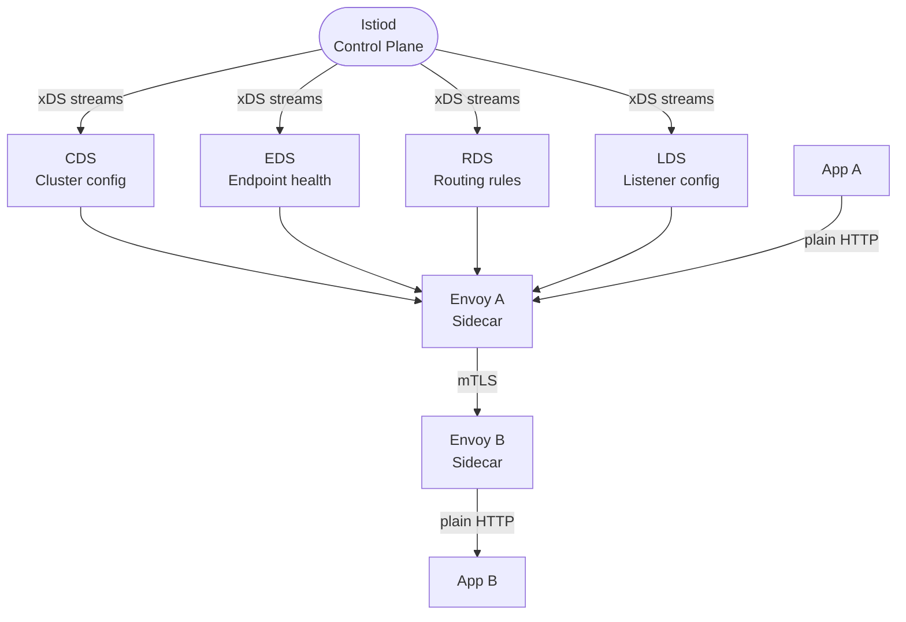
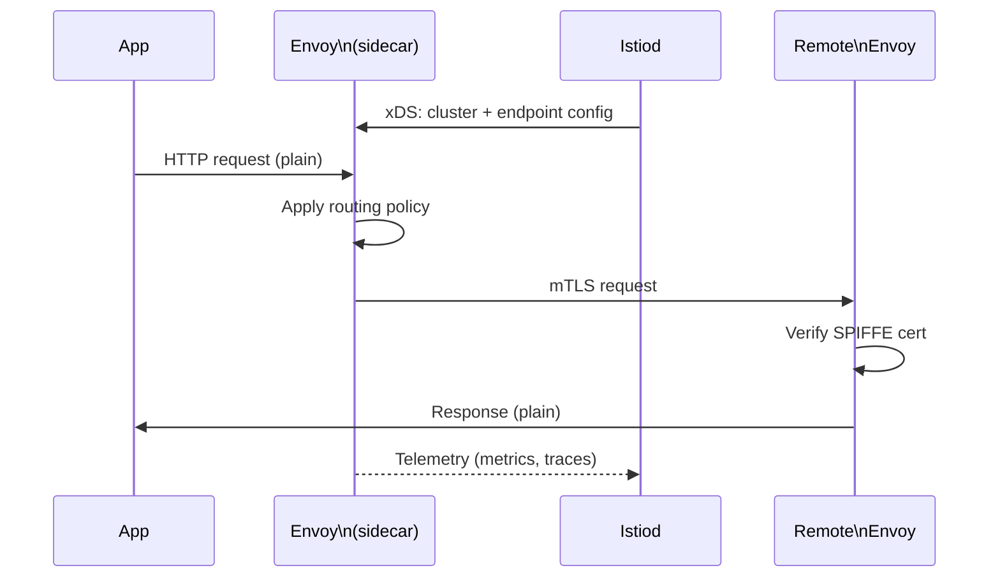

## Keywords in This File
{: .no_toc }

| # | Keyword | Weight |
|---|---|---|
| 22 | [Service Discovery and Service Mesh Internals](#service-discovery-and-service-mesh-internals) | critical |

---

# Service Discovery and Service Mesh Internals

---
id: CN-022
title: "Service Discovery and Service Mesh Internals"
category: Computer Networks
difficulty: ★★★
interview_weight: critical
seniority: senior-staff
tags: #service-discovery #service-mesh #istio #envoy #consul #sidecar #mTLS #xDS
---

## Quick Reference

**One-line definition:** Service discovery is the mechanism by which services locate each other's network endpoints dynamically (without hard-coded IPs); a service mesh extends this with a data plane (Envoy sidecar proxies) and control plane (Istio/Linkerd) that transparently adds observability, mTLS, retries, circuit breaking, and traffic shaping to all service-to-service communication.

**Difficulty:** ★★★ | **Asked at:** Senior-Staff | **Seniority:** Senior through Staff

---

### 🎯 Model Answer

**30 seconds:**
Service discovery solves the problem of finding service endpoints when IPs change (pods restart, scale, redeploy). Kubernetes uses CoreDNS (DNS-based discovery) and Endpoints objects (IP lists). A service mesh adds a data plane: Envoy sidecar proxies intercept all traffic and enforce policies (mTLS, retries, circuit breaking) without application code changes. The control plane (Istio, Linkerd) pushes configuration to Envoy via xDS APIs. The cost: sidecar adds 2-10ms latency per hop; the benefit: traffic policies enforced uniformly without library-level changes.

**3 minutes:**
**Kubernetes service discovery:** A Service object has a ClusterIP (virtual IP). CoreDNS resolves `payments.production.svc.cluster.local` to the ClusterIP. kube-proxy programs iptables rules that load-balance connections from the ClusterIP to the current set of healthy Pods (Endpoints object). When pods restart, the Endpoints object is updated and iptables rules are refreshed.

**Service mesh data plane (Envoy sidecar):** Each pod gets an Envoy proxy injected as a sidecar container. iptables rules in the pod network namespace redirect all inbound and outbound traffic to Envoy (port 15001 outbound, 15006 inbound in Istio). Applications connect to `http://payments/` - Envoy intercepts, applies policies, and proxies to the target.

**Control plane (Istio):** Istiod distributes configuration to all Envoy proxies via xDS APIs: CDS (Cluster Discovery Service) for upstream service endpoints, EDS (Endpoint Discovery Service) for endpoint health, LDS (Listener Discovery Service) for inbound port config, RDS (Route Discovery Service) for traffic rules. Each proxy maintains a configuration cache and reconnects if the control plane is unavailable - data plane continues working during control plane downtime.

**mTLS in the mesh:** Istiod issues certificates to each pod's Envoy sidecar via SPIFFE/SVID identity (workload identity). Envoy-to-Envoy connections use mTLS automatically. Service A's application sends plain HTTP to its Envoy; Envoy upgrades to mTLS to the target Envoy; target Envoy decrypts and delivers plain HTTP to Service B's application. Zero application code changes.

**Blank Mind Recovery:** Service discovery = DNS resolves service name to VIP, load balancer routes to pods. Service mesh = sidecar proxies intercept all traffic, control plane pushes config. mTLS = automatic between sidecars. Data plane works without control plane (cached config).

---

### 📘 Concept Explanation

**Core concept:** Service discovery and service mesh operate at two layers: the "where to connect" layer (service discovery - DNS + load balancing) and the "how to connect with policies" layer (service mesh - mTLS, retries, observability). A service mesh augments service discovery with consistent policy enforcement.

**Kubernetes service discovery internals:**

```
Service: payments (ClusterIP: 10.96.0.100)
Endpoints: [10.0.0.5:8080, 10.0.0.6:8080, 10.0.0.7:8080]

DNS resolution chain:
  app -> CoreDNS:
    query: payments.production.svc.cluster.local
    answer: 10.96.0.100 (ClusterIP)

iptables DNAT (kube-proxy):
  PREROUTING: -d 10.96.0.100/32 -j DNAT
    --to-destination 10.0.0.5:8080  (1/3 probability)
    --to-destination 10.0.0.6:8080  (1/2 probability)
    --to-destination 10.0.0.7:8080  (remaining)

Endpoint update (pod restart):
  1. Pod deleted -> Endpoints updated (removes .7)
  2. kube-proxy watches Endpoints
  3. iptables rules refreshed (removes .7 entry)
  4. New pod started -> Endpoints updated (adds .8)
  5. iptables rules refreshed (adds .8 entry)

Discovery latency: 1-5 seconds from pod death
to iptables update (watch + reconcile loop)
```

> **Code walkthrough:** WHAT IT SHOWS: the complete Kubernetes service discovery chain from DNS resolution through iptables DNAT to endpoint selection. KEY MECHANISM: CoreDNS resolves the service name to ClusterIP; iptables DNAT rules in the PREROUTING chain intercept connections to the ClusterIP and rewrite the destination to a random healthy pod IP using probability-based rules; kube-proxy watches the Endpoints API and updates iptables within seconds of pod changes. WHY IT MATTERS: iptables-based load balancing is stateless (each new connection chooses independently); this means connection-level load balancing, not request-level; a hot pod with many long-lived connections gets more traffic than a pod with fewer short connections. WHAT BREAKS: iptables rules are processed linearly; services with many endpoints (hundreds of pods) have long iptables chains that add per-packet latency; IPVS mode (kube-proxy --proxy-mode=ipvs) solves this with O(1) lookup. TAKEAWAY: Kubernetes service discovery has a 1-5 second endpoint update latency; applications must implement connection retries for the pod-restart transition period.

**Envoy sidecar traffic interception:**

```
Pod network namespace:
  eth0: 10.0.0.5/32 (pod IP)

iptables rules injected by Istio init container:
  PREROUTING:
    -j ISTIO_INBOUND (for all inbound TCP)
    ISTIO_INBOUND:
      -p tcp --dport 15006 -j RETURN (Envoy itself)
      -p tcp -j REDIRECT --to-port 15006

  OUTPUT:
    -j ISTIO_OUTPUT (for all outbound TCP)
    ISTIO_OUTPUT:
      --uid-owner 1337 -j RETURN (Envoy itself)
      -j REDIRECT --to-port 15001

Traffic flow for App -> payments:
  App (port 8080) -> connects to 10.96.0.100:8080
  OUTPUT chain -> REDIRECT to 127.0.0.1:15001 (Envoy)
  Envoy (15001) -> looks up CDS/EDS config for payments
  Envoy -> connects to 10.0.0.6:8080 (selected endpoint)
  Envoy (inbound at 10.0.0.6) -> PREROUTING
  -> REDIRECT to 127.0.0.1:15006
  Envoy (15006) -> delivers to App (9090)
  App (9090) -> processes request

Result: App -> App, zero mTLS code changes
  Envoy-to-Envoy path is mTLS encrypted
```

> **Code walkthrough:** WHAT IT SHOWS: the iptables rules that intercept traffic in an Istio pod and the full traffic flow for a service-to-service call. KEY MECHANISM: the init container adds iptables rules before the application starts; PREROUTING redirects all inbound TCP to Envoy's 15006 port; OUTPUT redirects all outbound TCP (except Envoy's own traffic, UID 1337) to Envoy's 15001 port; Envoy processes the redirected traffic and forwards with mTLS. WHY IT MATTERS: this transparent interception is the key service mesh property - zero application code changes; the application sends plain HTTP; Envoy handles TLS, load balancing, retries, and observability. WHAT BREAKS: the iptables redirect adds 1-2 additional socket hops per request; each redirect involves a kernel network stack traversal; this is the source of the 2-5ms latency overhead per hop in a service mesh. TAKEAWAY: service mesh sidecar latency (2-10ms) is significant for synchronous call chains; services that call 10 downstream services each add 10 x 2-10ms = 20-100ms of sidecar overhead; async messaging patterns avoid this.

**xDS API - How Istiod configures Envoy:**

```
xDS Protocol (gRPC streaming):

Istiod -> Envoy (each proxy):
  CDS (Cluster Discovery):
    "payments" cluster:
      endpoints: [10.0.0.5:8080, 10.0.0.6:8080]
      load_balancing: ROUND_ROBIN
      tls: { cert: /etc/certs/cert.pem }

  EDS (Endpoint Discovery):
    payments.production: 
      [10.0.0.5:8080 health=HEALTHY,
       10.0.0.6:8080 health=HEALTHY]
    Update: 10.0.0.7 fails health check
      -> EDS update removes .7
      -> Envoys stop routing to .7 in ~100ms

  RDS (Route Discovery):
    VirtualService rule:
      payments.svc.cluster.local:
        route 90% -> payments:v1
        route 10% -> payments:v2
        retry: 3 attempts, 250ms timeout
        timeout: 10s

  LDS (Listener Discovery):
    Listen on 0.0.0.0:15006
    Filter chain for inbound mTLS
```

> **Code walkthrough:** WHAT IT SHOWS: the four xDS API streams (CDS, EDS, RDS, LDS) that Istiod uses to configure each Envoy proxy with cluster topology, endpoint health, routing rules, and listener config. KEY MECHANISM: xDS uses gRPC server-side streaming; Istiod sends updates when configuration changes; Envoy applies the new configuration immediately without restart; EDS updates propagate endpoint health changes within 100ms, much faster than iptables rule updates (1-5 seconds). WHY IT MATTERS: this is how A/B testing and canary deployments work in Istio - an RDS rule routes 90%/10% of traffic to two versions; no application code changes; the update propagates to all Envoy proxies within seconds. WHAT BREAKS: if the control plane (Istiod) is unavailable, Envoy uses the last known configuration (stale config is better than no config); connections to unhealthy endpoints may continue until the cached EDS expires. TAKEAWAY: the xDS protocol is the key to understanding how Istio traffic management (VirtualService, DestinationRule, CircuitBreaker) translates to Envoy configuration; learning the xDS API directly enables debugging Istio issues at the Envoy configuration level.

The following diagram shows the Istio service mesh data and control plane.

```
Control Plane:              Data Plane:
                            +--Pod A--+   +--Pod B--+
+----------+                | App     |   | App     |
| Istiod   |--xDS API---->  | Envoy   |===| Envoy   |
| (Pilot)  |<- telemetry -- |  proxy  |   |  proxy  |
+----------+                +---------+   +---------+
     |                           |mTLS|
     v                           +----+
cert mgmt
(SPIFFE/SVID)
```

> **Diagram walkthrough:** WHAT IT DEPICTS: the two-plane architecture of Istio with the control plane (Istiod) managing the data plane (Envoy sidecar proxies). HOW TO READ IT: Istiod sends configuration to each Envoy sidecar via xDS API gRPC streams; Envoy proxies exchange mTLS-encrypted traffic with each other; Envoy also sends telemetry (metrics, access logs, traces) back to the control plane or observability stack. KEY RELATIONSHIP: the data plane is independent of the control plane for traffic handling; Envoy proxies continue forwarding traffic using cached configuration if Istiod is temporarily unavailable. EDGE CASE: if Istiod is down for an extended period and a pod restarts, the new pod's Envoy cannot get initial configuration; it waits with no routing config and fails all requests until Istiod recovers. INSIGHT: this is why control plane high availability (Istiod active-active across zones) is critical in production service meshes; a single-instance Istiod is a single point of failure for new pod startup.



> **Diagram walkthrough:** WHAT IT DEPICTS: the Istio xDS protocol flow from Istiod to Envoy proxies and the application traffic path through sidecars. HOW TO READ IT: Istiod distributes four types of xDS configuration (CDS, EDS, RDS, LDS) to each Envoy sidecar; application traffic flows from App A to its local Envoy (plain HTTP), across the network as mTLS to the destination Envoy, then as plain HTTP to App B. KEY RELATIONSHIP: the mTLS connection is always Envoy-to-Envoy, not app-to-app; applications are unaware of TLS; this is "transparent mTLS" - the key service mesh security benefit. EDGE CASE: when Envoy A sends mTLS to Envoy B, it presents a SPIFFE certificate with the identity of the service (e.g., `spiffe://cluster.local/ns/production/sa/payments`); Envoy B can enforce authorization policies based on this identity without any code in App B. INSIGHT: the SPIFFE identity model decouples authentication from service code; renewing certificates or changing policies happens in Istiod configuration, not application deployments.

---

### 💻 Code Example

**BAD: Hard-coded service endpoints - the pre-service-discovery pattern**

```java
// BAD: hard-coded service IP + port
// Fails when the service scales or restarts
@Service
public class PaymentClient {

    // ANTI-PATTERN: hard-coded IP
    // If payments service restarts: connection fails
    // If payments scales to 3 pods: no load balancing
    // If payments moves to different host: outage
    private static final String PAYMENTS_URL =
        "http://10.0.1.42:8080";  // hard-coded IP

    public PaymentResult charge(ChargeRequest req) {
        return restTemplate.postForObject(
            PAYMENTS_URL + "/charge",
            req,
            PaymentResult.class
        );
    }
}
```

> **Code walkthrough:** WHAT IT SHOWS: the pre-service-discovery anti-pattern where a service endpoint is hard-coded in application configuration. KEY MECHANISM: if the payments service pod is restarted (new IP) or scaled to multiple pods, the hard-coded IP either becomes invalid or points to only one of the pods; this creates both availability (no failover) and load distribution problems. WHY IT MATTERS: in container environments, pod IPs change on every restart; hard-coded IPs are the single most common source of deployment-related connectivity failures; DNS-based service discovery is the universal solution. WHAT BREAKS: hard-coded IPs fail silently in Kubernetes - the old pod IP may be reassigned to a different service within seconds of pod termination, causing connections to reach the wrong service. TAKEAWAY: never hard-code IP addresses or port numbers in service client code; always use DNS names (Kubernetes service names) that the platform resolves to current endpoints.

**GOOD: DNS-based service discovery with health-aware load balancing**

```java
// GOOD: DNS-based service discovery
// Kubernetes Service: http://payments.production/
// CoreDNS resolves to ClusterIP
// kube-proxy load balances to healthy pods

@Service
public class PaymentClient {

    // Service name: resolved by CoreDNS
    // Format: <service>.<namespace>.svc.cluster.local
    // Short form: <service>.<namespace>
    // Shortest (same namespace): <service>
    private static final String PAYMENTS_URL =
        "http://payments.production/";

    // Use RestTemplate with connection pool
    // (avoids new TCP connection per request)
    @Bean
    public RestTemplate restTemplate() {
        HttpComponentsClientHttpRequestFactory factory =
            new HttpComponentsClientHttpRequestFactory();
        factory.setConnectTimeout(5000);
        factory.setReadTimeout(10000);
        return new RestTemplate(factory);
    }

    public PaymentResult charge(ChargeRequest req) {
        try {
            return restTemplate.postForObject(
                PAYMENTS_URL + "charge",
                req,
                PaymentResult.class
            );
        } catch (ResourceAccessException e) {
            // Connection refused / timeout:
            // Pod may be restarting; retry once
            return retryWithBackoff(req, e);
        }
    }
}
```

> **Code walkthrough:** WHAT IT SHOWS: DNS-based service discovery using Kubernetes service name, with a connection pool (Apache HttpClient) and retry on connection failure. KEY MECHANISM: `payments.production` resolves via CoreDNS to the ClusterIP; kube-proxy's iptables rules load-balance each new connection to a healthy pod; RestTemplate's connection pool reuses existing TCP connections (HTTP keep-alive), reducing per-request handshake overhead. WHY IT MATTERS: DNS names survive pod restarts (DNS updates within seconds); connection pool reuses sockets for hot paths (eliminates TCP + TLS handshake overhead); retry on connection failure handles the 1-5 second endpoint update gap. WHAT BREAKS: RestTemplate uses per-host connection pool keyed on DNS name; if two pods are at different IPs, the pool may route all requests to the first resolved IP (DNS TTL caching); configure `evictExpiredConnections()` to force reconnection when pod IPs change. TAKEAWAY: always use DNS names for service-to-service connections; pair with a connection pool for performance; add retry logic for the pod restart transition period.

**Istio VirtualService for canary deployment:**

```yaml
# VirtualService: route 90% to v1, 10% to v2
# Applied via: kubectl apply -f canary.yaml
apiVersion: networking.istio.io/v1alpha3
kind: VirtualService
metadata:
  name: payments
  namespace: production
spec:
  hosts:
  - payments.production.svc.cluster.local
  http:
  - name: canary-route
    match:
    - headers:
        x-canary:
          exact: "true"
    route:
    - destination:
        host: payments
        subset: v2
      weight: 100
  - name: default-route
    route:
    - destination:
        host: payments
        subset: v1
      weight: 90
    - destination:
        host: payments
        subset: v2
      weight: 10
    retries:
      attempts: 3
      perTryTimeout: 250ms
      retryOn: gateway-error,connect-failure
    timeout: 10s
```

> **Code walkthrough:** WHAT IT SHOWS: an Istio VirtualService that implements canary deployment (90/10 traffic split) with header-based canary routing and automatic retries. KEY MECHANISM: the first match rule routes requests with `x-canary: true` header entirely to v2 (for manual testing); the default route splits 90/10 between v1 and v2; retries=3 with perTryTimeout=250ms means Envoy retries up to 3 times on gateway errors; this configuration is pushed to all Envoy proxies via Istiod's RDS API within seconds of kubectl apply. WHY IT MATTERS: implementing 90/10 traffic splitting in application code requires every service to have a routing logic change; Istio implements it at the proxy layer with zero application changes; this enables safe canary deployments with instant rollback (change weight to 100/0). WHAT BREAKS: retryOn=gateway-error retries on 502/503/504; retrying non-idempotent operations (POST /payments/charge) on gateway error may cause duplicate charges; use retries only on idempotent endpoints or ensure idempotency keys. TAKEAWAY: service mesh traffic management (retries, timeouts, canary) belongs in the mesh configuration, not application code; this allows platform teams to enforce policies uniformly without requiring every service team to implement them.

---

### 🎓 Answers by Seniority

**Junior / Mid-level answer:**
Service discovery lets services find each other by name instead of IP address. In Kubernetes, a Service object has a stable DNS name (like `payments.production.svc.cluster.local`) and a ClusterIP; CoreDNS resolves the name to the ClusterIP; kube-proxy routes connections to healthy pods. A service mesh like Istio adds a sidecar proxy (Envoy) to each pod that intercepts all traffic and adds mTLS encryption, load balancing, retries, and metrics without any application code changes.

**Senior / Staff answer:**
Service discovery in Kubernetes is DNS + iptables: CoreDNS resolves service names to ClusterIPs; kube-proxy programs iptables DNAT rules to load-balance ClusterIP connections to endpoints. This gives connection-level (not request-level) load balancing - a long-lived connection always goes to the same pod. A service mesh adds request-level routing: Envoy sidecars intercept every request (via iptables redirect) and apply VirtualService policies (retries, timeouts, circuit breaking, canary). The key architecture question is control plane availability: Envoy caches xDS configuration and serves traffic during Istiod outages, but new pods can't get initial config until Istiod recovers - this is why Istiod must be highly available (anti-affinity, PodDisruptionBudget). The latency cost: each Envoy hop adds 2-10ms (two socket traversals + iptables DNAT + policy evaluation); a 5-service call chain adds 10-50ms of sidecar overhead. This is acceptable for synchronous calls but not for high-throughput async paths; sidecars are often exempted from internal message broker connections.

---

### ⚠️ Common Misconceptions

**Misconception 1: "DNS in Kubernetes caches aggressively"**
CoreDNS's default TTL for service records is 30 seconds, but pod's local resolver (ndots:5 setting) means most service lookups include a search path that goes through multiple fallback domains. Applications using Java or Go default DNS resolvers may cache DNS responses for 60-300 seconds (JVM default: forever until restart), causing stale IP issues when services restart.

**Misconception 2: "Service mesh mTLS means the application code doesn't need to handle auth"**
Service mesh mTLS authenticates the workload identity (which service, not which user). Application-level authentication (JWT, API keys, OAuth) for user identity is still required. mTLS tells you that "the payments service is calling me"; it doesn't tell you that "Alice is authorised to do this payment".

**Misconception 3: "Disabling the Istio sidecar improves performance"**
Disabling sidecars eliminates the 2-10ms per-hop overhead but also removes mTLS, retries, circuit breaking, and metrics. In production, the observability loss (no distributed traces, no per-service error metrics) is often worse than the latency cost. Profile the sidecar cost for your specific latency budget before disabling.

**Misconception 4: "Service mesh handles all load balancing"**
Envoy provides request-level load balancing (each HTTP request can go to a different pod). But the Kubernetes Service's ClusterIP is still used for DNS; if the application's HTTP library creates a single long-lived connection (HTTP/1.1 keep-alive to ClusterIP), all requests go to the same pod. Envoy's upstream connections use HTTP/2 multiplexing, which enables request-level load balancing on the upstream side.

**Misconception 5: "IPVS mode kube-proxy is always better than iptables"**
IPVS provides O(1) rule lookup (vs iptables linear scan) for services with many pods. But IPVS uses a different implementation that some firewall plugins are not compatible with. For clusters with < 100 pods per service, iptables performance is acceptable. For clusters with > 1,000 pods per service or > 10,000 services, IPVS is required.

---

### 🚨 Failure Modes and Diagnosis

**Failure 1: Service unavailable due to endpoint propagation lag**

```bash
# Symptom: connections fail for 1-5 seconds
# after pod restart, then recover

# Diagnose: check endpoint readiness propagation
# Step 1: Check Endpoints object
kubectl get endpoints payments -n production
# NAME      ENDPOINTS             AGE
# payments  10.0.0.5:8080,10.0.0.6:8080   5m
# (10.0.0.7 should be there but pod restarted)

# Step 2: Check if readinessProbe is configured
kubectl describe pod payments-xyz | grep -A5 Readiness
# If readinessProbe missing:
# Pod is added to Endpoints as soon as it starts
# but app may not be ready yet -> connection refused

# Step 3: Check kube-proxy sync delay
kubectl logs -n kube-system \
  -l k8s-app=kube-proxy \
  | grep "Syncing"
# Should show sync every few seconds

# Fix: add readinessProbe to pod spec
# readinessProbe:
#   httpGet:
#     path: /health
#     port: 8080
#   initialDelaySeconds: 5
#   periodSeconds: 2
```

> **Code walkthrough:** WHAT IT SHOWS: diagnosing endpoint propagation lag using kubectl to check Endpoints object, readiness probe configuration, and kube-proxy sync logs. KEY MECHANISM: Kubernetes adds a pod to the Endpoints list only when its readinessProbe passes; without a readiness probe, the pod is added immediately after container start; if the application takes 5 seconds to initialize, connections during initialization receive "Connection refused"; with a readiness probe, the pod is only added after the probe passes. WHY IT MATTERS: readiness probes are the mechanism for graceful pod startup; without them, rolling deployments route traffic to pods that aren't ready, causing request failures during deployment. WHAT BREAKS: a readiness probe that takes too long to pass (> 30 seconds) delays pod startup and can trigger deployment timeouts; balance probe sensitivity (catch unready pods) with probe latency (don't delay healthy pods). TAKEAWAY: always configure readiness probes for all services in Kubernetes; the initialDelaySeconds should be 5-10 seconds less than the typical startup time to avoid unnecessary delays.

**Failure 2: Istio sidecar causing mTLS connection failures**

```bash
# Symptom: services fail with "upstream connect error"
# after Istio enabled on a namespace

# Diagnose: check Istio PeerAuthentication
kubectl get peerauthentication -n production
# If no output: default permissive mode
# If STRICT mode: all non-mTLS connections blocked

# Check if source service has Istio sidecar:
kubectl get pod -n production \
  -o jsonpath='{range .items[*]}{.metadata.name}: \
    {.spec.containers[*].name}{"\n"}{end}' \
  | grep -v "istio-proxy"
# Pods without istio-proxy cannot send mTLS

# Check specific connection:
istioctl proxy-status
# Shows sync status for each proxy

# Check Envoy logs for mTLS errors:
kubectl logs -n production <pod> \
  -c istio-proxy \
  | grep "TLS error\|SSL_ERROR"

# Temporary fix: set PERMISSIVE mode
kubectl apply -f - <<EOF
apiVersion: security.istio.io/v1beta1
kind: PeerAuthentication
metadata:
  name: default
  namespace: production
spec:
  mtls:
    mode: PERMISSIVE
EOF
```

> **Code walkthrough:** WHAT IT SHOWS: diagnosing Istio mTLS failures by checking PeerAuthentication policy mode, sidecar injection status, and Envoy proxy logs. KEY MECHANISM: STRICT PeerAuthentication requires all inbound connections to be mTLS; if a service without an Istio sidecar (or from outside the mesh) sends plain HTTP to a service in STRICT mode, Envoy rejects the connection; PERMISSIVE mode accepts both mTLS and plain HTTP during migration. WHY IT MATTERS: migrating a namespace to STRICT mTLS breaks any client that doesn't have an Istio sidecar; this includes monitoring systems, CI/CD pipelines, and admin tools that connect directly; PERMISSIVE mode during migration allows incremental rollout. WHAT BREAKS: PERMISSIVE mode allows unencrypted traffic; if security compliance requires all traffic to be mTLS, PERMISSIVE is only acceptable during the migration window; set STRICT after all services have sidecars. TAKEAWAY: migrate to STRICT mTLS incrementally: enable per namespace, validate all clients have sidecars (using istioctl proxy-status), then switch to STRICT; never switch an entire cluster to STRICT in one change.

**Failure 3: DNS resolution loop with ndots**

```bash
# Symptom: DNS lookups take 100ms+ for internal
# service names in Kubernetes

# Diagnose: check ndots setting
cat /etc/resolv.conf
# nameserver 10.96.0.10
# search production.svc.cluster.local \
#   svc.cluster.local cluster.local
# options ndots:5

# Problem: "payments" has 0 dots
# ndots:5 means: if < 5 dots, try all search domains first:
# payments.production.svc.cluster.local (NXDOMAIN if wrong ns)
# payments.svc.cluster.local (NXDOMAIN)
# payments.cluster.local (NXDOMAIN)
# then bare: payments (NXDOMAIN)
# = 4 DNS queries for 1 failed lookup!

# Fix: use fully qualified name (trailing dot):
# http://payments.production.svc.cluster.local./

# Or reduce ndots:
# pod spec: dnsConfig:
#   options:
#     - name: ndots
#       value: "1"

# Measure:
time dig payments.production.svc.cluster.local
# vs:
time dig payments.production.svc.cluster.local.
# Trailing dot = no search path = 1 query
```

> **Code walkthrough:** WHAT IT SHOWS: the Kubernetes ndots:5 problem where short service names trigger multiple DNS search path queries before finding the correct record. KEY MECHANISM: ndots:5 means any name with fewer than 5 dots is treated as relative and tried against each search domain first; "payments" has 0 dots, so the resolver tries all 3 search domains before trying the bare name; each NXDOMAIN response takes 5-10ms, making 4 total queries = 20-40ms DNS overhead. WHY IT MATTERS: DNS overhead is invisible but cumulative; a service making 100 requests/second pays this cost 100 times/second; reducing ndots from 5 to 1 and using fully qualified names eliminates this overhead. WHAT BREAKS: changing ndots to 1 requires using fully qualified service names (with namespace) in all code; short names like "payments" no longer resolve; this is a breaking change for existing code. TAKEAWAY: for high-throughput services, configure ndots:1 in pod spec and use fully qualified service names; for low-traffic services, the default ndots:5 is acceptable; always measure DNS latency before optimising.

---

### 🎯 Interview Deep-Dive

| Format | Questions | Est. Time |
|---|---|---|
| Junior/Mid | 12 questions | 35-45 min |
| Senior/Staff | 12 questions + deep-dives | 55-70 min |

**Category: CONCEPT**

**[JUNIOR] Q1 - [CONCEPTUAL] What is the difference between a Kubernetes Service, ClusterIP, and Endpoint?**

**Service:** A Kubernetes API object that defines a stable network identity for a set of pods. A Service has a selector that matches pod labels; any pod matching the selector is a member of the Service.

**ClusterIP:** The virtual IP assigned to the Service. It is stable - it doesn't change when pods restart, scale, or move. ClusterIP is only accessible within the cluster.

**Endpoint (Endpoints object):** The list of actual IP:port pairs of the pods currently backing the Service. Updated automatically when pods start (added) or stop (removed). kube-proxy watches the Endpoints object and updates iptables rules accordingly.

Relationship:
- DNS resolves `payments.production.svc.cluster.local` -> ClusterIP (e.g., 10.96.0.100)
- iptables DNAT: connections to 10.96.0.100:8080 are redirected to one of the Endpoint IPs
- If a pod dies: it is removed from Endpoints; iptables updated; new connections go to remaining pods

Types of Services:
- ClusterIP (default): accessible within cluster
- NodePort: accessible from outside cluster via `<node-IP>:<node-port>`
- LoadBalancer: provisions cloud load balancer (AWS ELB, GCP LB) pointing to NodePorts

*What separates good from great:* Explaining the timing: Endpoint removal takes 1-5 seconds from pod deletion to iptables update; without readiness probes, new pods may receive traffic before they're ready; with readiness probes, Endpoints are only updated when the probe passes.

---

**[JUNIOR] Q2 - [CONCEPTUAL] What is a service mesh and why would you add one to Kubernetes?**

Kubernetes provides basic service discovery (DNS) and simple load balancing (iptables). A service mesh adds a layer of capabilities that Kubernetes doesn't provide by default:

1. **Mutual TLS (mTLS) between services:** all service-to-service traffic is encrypted and mutually authenticated; without a mesh, services communicate over unencrypted HTTP inside the cluster.

2. **Traffic management:** A/B testing, canary deployments (route 10% of traffic to v2), circuit breaking (stop sending to unhealthy pods), retries, and timeouts - all configurable without code changes.

3. **Observability:** distributed traces (how long each service takes per request), per-service error rates and latency histograms - automatically generated from all service calls.

4. **Authorization policies:** enforce that only specific services can call each other (`payments` can call `database` but `frontend` cannot) - based on service identity, not IP addresses.

The cost: a sidecar proxy (Envoy) is added to every pod, consuming ~50MB memory and adding 2-10ms latency per hop. For most production environments, the security and observability benefits outweigh this cost.

*What separates good from great:* Mentioning that mTLS without a service mesh requires every service to implement TLS, manage certificates, and verify peer certificates in application code; a service mesh moves this to the platform layer, eliminating per-service implementation.

---

**[MID] Q3 - [MECHANISM] How does Istio inject Envoy sidecars automatically?**

Istio uses a Kubernetes MutatingAdmissionWebhook to modify pod specs before pods are created.

Process:
1. Namespace is labeled: `istio-injection: enabled`
2. Developer deploys a pod without any Istio config
3. Pod creation request goes to kube-apiserver
4. kube-apiserver calls Istio's MutatingAdmissionWebhook (istio-sidecar-injector)
5. The webhook modifies the pod spec:
   - Adds `istio-init` init container (sets up iptables rules for traffic redirect)
   - Adds `istio-proxy` (Envoy) container to the pod
   - Adds volume mounts for TLS certificates
6. Modified pod spec is returned; kube-apiserver creates the pod with all containers

The iptables rules added by the init container:
- Redirect all outbound traffic to Envoy port 15001
- Redirect all inbound traffic to Envoy port 15006
- Exclude Envoy's own traffic (UID 1337) from redirection

This is transparent to the application developer: they deploy a normal pod and Istio adds the sidecar automatically.

*What separates good from great:* Knowing that the MutatingAdmissionWebhook is a Kubernetes extension point (not Istio-specific); any Kubernetes operator can use this to inject sidecar containers; understanding the webhook pattern explains how other tools (Vault Agent Injector, Datadog, etc.) also inject sidecars.

---

**[SENIOR] Q4 - [MECHANISM] Explain Istio's control plane architecture. What happens if Istiod goes down?**

Istiod (formerly Pilot + Citadel + Galley) is the unified control plane:

1. **Pilot function (traffic management):** Watches Kubernetes API server for Service, Endpoint, VirtualService, DestinationRule, and Gateway resources. Translates these to xDS configuration (CDS, EDS, RDS, LDS) and distributes to all Envoy proxies via gRPC streaming.

2. **Citadel function (certificate management):** Issues SPIFFE/SVID certificates to each service account. Certificates identify the workload (`spiffe://cluster.local/ns/production/sa/payments`). Rotates certificates before expiry (default: 24 hours).

3. **Galley function (validation):** Validates Istio config resources before they are applied.

**When Istiod goes down:**
- Existing Envoy proxies continue serving traffic using their last-known xDS configuration
- New pod starts: the new pod's Envoy cannot get initial xDS config; all outbound requests fail (no CDS/EDS config = no routes)
- Certificate expiry: if Istiod is down when a certificate expires, the pod cannot get a new certificate; mTLS connections fail after cert expiry (24-hour window)
- Impact window: short outage (< 10 minutes) has minimal impact; longer outage causes certificate expiry issues and new pod startup failures

**High availability setup:** Istiod with multiple replicas (3), pod anti-affinity across zones, PodDisruptionBudget (maxUnavailable: 1).

*What separates good from great:* The certificate expiry implication - "data plane continues working, but certificates expire after 24 hours" is a key production concern; Istiod downtime SLA must be shorter than the certificate TTL.

---

**[SENIOR] Q5 - [MECHANISM] How does Consul service discovery differ from Kubernetes DNS service discovery?**

**Kubernetes DNS (CoreDNS + Endpoints):**
- Discovery mechanism: DNS lookup + iptables DNAT
- Health checking: Kubernetes readiness probes; pod removed from Endpoints when probe fails
- Multi-cluster: requires Kubernetes Federation or separate service meshes
- Configuration: declarative (Service YAML), Kubernetes-native
- Data store: Kubernetes etcd (shared with all cluster state)

**Consul:**
- Discovery mechanism: DNS lookup OR HTTP API or agent sidecar
- Health checking: Consul agent runs health checks (HTTP, TCP, script, Docker, gRPC) with configurable intervals and thresholds
- Multi-datacenter: native multi-datacenter federation; services in DC1 can discover services in DC2 via WAN gossip
- Non-Kubernetes: works for VMs, bare metal, any service type
- Configuration: Consul KV or service registration API (not Kubernetes-native)

Key difference: Consul is service-mesh-agnostic (works on VMs, not just K8s) and has native multi-datacenter. Kubernetes DNS is tighter integration with K8s primitives but is cluster-scoped.

When to use Consul:
- Multi-cloud or hybrid (VMs + Kubernetes)
- Multi-datacenter service discovery
- Non-Kubernetes workloads
- Need application-level health checks (not just pod health)

*What separates good from great:* Consul's Raft-based consensus vs Kubernetes DNS's etcd backend - both are consistent, but Consul is designed specifically for service registry and allows arbitrary health check definitions; Kubernetes health checks are limited to HTTP, TCP, and exec probes.

---

**Category: DEBUGGING**

**[SENIOR] Q6 - [DEBUGGING] A service in Istio is returning 503 errors. How do you diagnose whether it's the mesh or the application?**

Step 1: Check Envoy proxy status:
```bash
# Check Envoy proxy sync status:
istioctl proxy-status
# NAME      CLUSTER  CDS  LDS  EDS  RDS  ISTIOD
# pod-abc   Kubernetes  SYNCED  SYNCED  SYNCED  SYNCED
# If NOT SYNCED: Envoy has stale config
```

> **Code walkthrough:** WHAT IT SHOWS: using istioctl proxy-status to check whether all Envoy proxies have synchronized configuration from Istiod. KEY MECHANISM: proxy-status queries each Envoy proxy's xDS state via Istiod; SYNCED means the proxy has the latest CDS, LDS, EDS, and RDS configuration; NOT SYNCED means the proxy is working with stale config. WHY IT MATTERS: a NOT SYNCED proxy may not have the current endpoint list; it may route to deleted pod IPs, causing 503 errors that look like application failures. WHAT BREAKS: proxy-status requires the istioctl tool installed locally and KUBECONFIG access; in environments without local kubectl access, check istiod logs directly. TAKEAWAY: istioctl proxy-status is the first Istio-specific diagnostic to run when services return unexpected 5xx errors; it quickly separates mesh config issues from application issues.

Step 2: Check Envoy access logs for upstream errors:
```bash
kubectl logs -n production <pod-name> \
  -c istio-proxy \
  | tail -50 | grep "503\|UF\|UC\|NR"
# UF = Upstream connection failure
# UC = Upstream connection timeout
# NR = No route configured (missing VirtualService)
```

> **Code walkthrough:** WHAT IT SHOWS: reading Envoy access logs and filtering for 503 response codes and Envoy response flags. KEY MECHANISM: Envoy's access logs include "response flags" that indicate why a request was terminated; UF (upstream failure) means Envoy connected to the upstream pod but the connection failed; NR (no route) means no VirtualService/DestinationRule matches the request; these are mesh-level failures, not application-level. WHY IT MATTERS: NR response flag means the Istio routing configuration is missing or misconfigured; this is always a mesh config problem, not an application bug; the fix is to correct the VirtualService. WHAT BREAKS: Envoy logs are per-pod; for cluster-wide analysis, aggregate logs with a log platform (Elasticsearch, Loki, Datadog). TAKEAWAY: Envoy response flags (UF, UC, NR, UO, UT) are the quickest way to distinguish mesh vs application errors; learn the 10 most common flags to speed up Istio debugging.

Step 3: Check application pod logs (istio-proxy container bypassed):
```bash
kubectl logs -n production <pod-name> \
  -c <app-container>
# If app logs show the 503: application is returning it
# If app logs show no errors: mesh is generating the 503
```

> **Code walkthrough:** WHAT IT SHOWS: checking application container logs separately from Envoy proxy logs to distinguish mesh-generated vs application-generated errors. KEY MECHANISM: in an Istio pod, there are two containers: the application container and istio-proxy; errors in the Envoy access logs with 503 and no corresponding errors in the application logs indicate the mesh is generating the error before the request reaches the application. WHY IT MATTERS: this is the definitive separation: if both Envoy and the app log the 503, the app is failing; if only Envoy logs it, the mesh is failing. WHAT BREAKS: some application frameworks catch errors internally and return 503 without logging; if the app has no 503 in its logs, check whether exceptions are being silently swallowed. TAKEAWAY: always check both Envoy and application logs separately; the presence or absence of 503 in each tells you definitively which layer generated the error.

*What separates good from great:* Using `istioctl analyze` to check for configuration issues: `istioctl analyze -n production` runs all built-in Istio config validators and reports misconfigured VirtualService, DestinationRule, and Gateway resources.

---

**[SENIOR] Q7 - [DEBUGGING] Service A can reach Service B, but Service C cannot reach Service B. All services have Istio sidecars. How do you diagnose?**

This pattern suggests an AuthorizationPolicy is blocking Service C specifically.

Step 1: Check AuthorizationPolicy:
```bash
kubectl get authorizationpolicy -n production
# List all auth policies
kubectl describe authorizationpolicy -n production
# Check rules: allowed source principals
```

> **Code walkthrough:** WHAT IT SHOWS: listing and describing AuthorizationPolicy resources in the namespace to identify rules that may be blocking Service C. KEY MECHANISM: AuthorizationPolicy rules specify allowed source principals (SPIFFE identities) and operations; if Service C's service account is not in the allow list, all its requests to Service B are blocked. WHY IT MATTERS: AuthorizationPolicy misconfigurations are silent - the caller only receives a generic 403 or connection error; examining the policy YAML directly is faster than reading logs for identifying a missing allow rule. WHAT BREAKS: `kubectl describe` shows the policy spec but not which specific request was blocked; combine with Envoy RBAC logs for correlation. TAKEAWAY: always check AuthorizationPolicy when some callers succeed and others fail to the same service; the allow list is the most common source of asymmetric access failures.

Step 2: Check Envoy access logs on Service B for Service C requests:
```bash
# On pod B, filter for connections from service C:
kubectl logs <service-b-pod> -c istio-proxy \
  | grep "RBAC"
# RBAC denial: "RBAC: access denied"
# = AuthorizationPolicy blocking C
```

> **Code walkthrough:** WHAT IT SHOWS: checking Envoy RBAC denial logs to identify AuthorizationPolicy blocking specific source services. KEY MECHANISM: Istio AuthorizationPolicy uses RBAC-like rules; when a request is denied, Envoy logs "RBAC: access denied" with the source principal; the source principal is the SPIFFE identity of the calling service. WHY IT MATTERS: AuthorizationPolicy denials are silent to the caller (receives 403 or connection refused); the calling service has no indication of why it was blocked; only the target pod's Envoy logs record the denial reason. WHAT BREAKS: AuthorizationPolicy with empty rules denies all traffic by default; adding an empty AuthorizationPolicy to a namespace blocks all ingress, which is a common configuration mistake during security hardening. TAKEAWAY: when adding AuthorizationPolicy, always test from all known callers before deploying to production; use "audit mode" (action: AUDIT) to log denials without blocking.

*What separates good from great:* Knowing that Istio AuthorizationPolicy with action=DENY overrides any ALLOW policy - if both an ALLOW and a DENY policy match, DENY wins; this is the opposite of most firewall rule processing order.

---

**Category: TRADE-OFF**

**[SENIOR] Q8 - [TRADE-OFF] What are the performance overhead and memory costs of running Istio in production?**

**CPU overhead:**
- Envoy proxy: ~10-50ms CPU per 1000 requests (per core)
- At 10,000 RPS per pod: ~0.1-0.5 CPU cores for the sidecar
- mTLS TLS operations: ~0.1-0.3 CPU cores at 10K RPS

**Memory overhead:**
- Envoy proxy: ~60-100MB baseline per pod (xDS configuration cache)
- For 500 services with 10 endpoints each: Envoy stores all endpoint data; ~100MB per proxy
- For 10,000 pods each with 100MB sidecar: 1TB total sidecar memory

**Latency overhead:**
- Loopback path: ~0.1ms (application -> 15001 -> Envoy -> upstream)
- iptables DNAT: ~0.01ms per packet
- mTLS handshake: ~1-5ms per new connection (amortised by connection pooling)
- Policy evaluation: ~0.1ms per request
- Total per hop: 2-10ms depending on TLS session cache hit rate

**When overhead is unacceptable:**
- Ultra-low latency services (< 10ms SLO): mesh adds 20-40ms for a 4-hop chain
- High-throughput (> 100K RPS per pod): Envoy becomes a bottleneck
- Memory-constrained environments: 100MB per pod is prohibitive for 100+ pod deployments

*What separates good from great:* Knowing the 100MB baseline memory figure and calculating cluster-wide implications (500 pods x 100MB = 50GB just for sidecars); and the mitigation: ProxyConfig to tune Envoy memory (reduce statistics workers, disable detailed telemetry for non-critical services).

---

**[SENIOR] Q9 - [TRADE-OFF] How do you choose between Istio, Linkerd, and Consul Connect for a Kubernetes service mesh?**

**Istio:**
Strengths: most features (traffic management, mTLS, WAF rules, Envoy extensibility via Wasm), broad ecosystem, Envoy data plane is battle-tested at Google scale.
Weaknesses: operational complexity (Istiod + CRDs + Envoy config learning curve), high memory overhead (100MB/pod), slower to start (Envoy initialisation), complex debugging.
Best for: large organisations with platform teams, need for advanced traffic management (canary, circuit breaking), or existing Envoy expertise.

**Linkerd:**
Strengths: simplest to operate (one CRD type, single binary), lowest overhead (~30MB/pod, Rust proxy), fast startup, strong security defaults.
Weaknesses: fewer features (no Wasm, limited TCP traffic management), smaller ecosystem, less battle-tested at extreme scale.
Best for: small/medium teams wanting quick mTLS + observability without operational complexity; security-first deployments.

**Consul Connect:**
Strengths: multi-datacenter, multi-cloud, works on VMs and Kubernetes, HashiCorp ecosystem integration (Vault for certs), layer 7 traffic management.
Weaknesses: requires Consul server cluster (operational overhead), less Kubernetes-native, fewer Kubernetes-specific integrations.
Best for: hybrid environments (VMs + Kubernetes), multi-datacenter, or existing Consul deployments.

Decision framework:
- Kubernetes-only, simplicity: Linkerd
- Advanced traffic management, Envoy ecosystem: Istio
- Hybrid (VMs + K8s) or multi-datacenter: Consul
- Cilium (eBPF mesh): emerging option, lowest overhead, built into CNI

*What separates good from great:* Cilium as an emerging option - CNI-level eBPF mesh eliminates the sidecar entirely, reducing latency to near-zero and memory overhead to near-zero; it's the direction the industry is moving for high-performance mesh.

---

**Category: BEHAVIORAL**

**[SENIOR] Q10 - [BEHAVIORAL] Describe a time you introduced or evaluated a service mesh in a production environment.**

Situation: A fintech startup with 50 microservices needed PCI-DSS compliance - specifically, all service-to-service communication within the payment namespace must be encrypted and mutually authenticated. Services were written in Java, Go, and Python by 5 different teams.

Task: Implement service-to-service mTLS across 50 services without requiring code changes to any service.

Action:
1. Evaluated Istio vs Linkerd. Chose Linkerd for operational simplicity (smaller team, no dedicated platform team).
2. Enabled Linkerd in staging namespace; measured overhead: 25MB per pod (acceptable), 1.5ms latency per hop (acceptable).
3. Identified 3 services with hard-coded HTTP connections that bypassed service names; worked with teams to update to DNS names.
4. Enabled Linkerd with STRICT mTLS in staging; ran integration tests; all passed.
5. Enabled in production in waves: non-payment namespace first (no compliance impact), then payment namespace.
6. Set up certificate rotation monitoring (alert 48 hours before expiry).

Result: PCI-DSS mTLS requirement met without a single line of application code changed. 6-week timeline.

*What separates good from great:* Starting with staging and measuring overhead before production - presenting the "25MB per pod, 1.5ms per hop" numbers to stakeholders allowed an informed decision; vague "minimal overhead" claims are less persuasive.

---

**[SENIOR] Q11 - [DEBUGGING] After migrating from kube-proxy iptables to IPVS mode, some services have unexpected load balancing behavior. Diagnose.**

IPVS and iptables handle connection tracking differently:

**iptables mode:** Each new connection is independently load-balanced via probability-based DNAT rules. Result: stateless, even connection distribution over time.

**IPVS mode:** IPVS uses a connection table (like a NAT table). Connections to a ClusterIP are tracked; IPVS can use round-robin, least-connection, or source-hash scheduling. Default: round-robin.

Common issue after migration to IPVS: source-IP-based session affinity (sessionAffinity: ClientIP in Service spec) behaves differently. iptables uses random selection; IPVS uses source-hash by default for ClientIP affinity.

```bash
# Check IPVS rules:
ipvsadm -Ln
# Proto  LocalAddress:Port Scheduler Flags
#   -> RemoteAddress:Port  Forward Weight ActiveConn
# TCP  10.96.0.100:8080 rr       <- round-robin
#   -> 10.0.0.5:8080      Masq    1      10
#   -> 10.0.0.6:8080      Masq    1      5
# If weights not equal: check health status
```

> **Code walkthrough:** WHAT IT SHOWS: using ipvsadm to inspect IPVS virtual server rules and their connection distribution. KEY MECHANISM: ipvsadm -Ln shows virtual servers (ClusterIPs) and their real servers (pod IPs) with weights and active connection counts; round-robin (rr) should distribute connections evenly; if one pod has significantly more ActiveConn, check if that pod is sticky (source-hash session affinity) or if the scheduling algorithm has been changed. WHY IT MATTERS: IPVS mode enables more scheduling algorithms than iptables (least-connection, source-hash) which can improve load distribution; but migrating from iptables to IPVS changes the default behavior for session affinity. WHAT BREAKS: IPVS requires `nf_conntrack` kernel module; if missing, IPVS rules are created but don't apply correctly; verify with `lsmod | grep nf_conntrack`. TAKEAWAY: after migrating to IPVS, verify connection distribution with ipvsadm -Ln; compare ActiveConn counts across pods; uneven distribution indicates scheduling algorithm mismatch.

*What separates good from great:* Knowing that IPVS mode requires `nf_conntrack` and `ip_vs` kernel modules; a kube-proxy mode migration checklist includes verifying kernel module availability before switching.

---

**[STAFF] Q12 - [DESIGN] Design a service-to-service communication architecture for a 10,000-pod Kubernetes cluster with 500 services, zero-trust security, and < 5ms P99 latency for all internal calls.**

**Constraints:** < 5ms P99 for internal calls means each hop can add at most 1ms (for a 4-hop chain); Istio's 2-10ms sidecar overhead is too high.

**Solution: eBPF-based mesh (Cilium)**

1. **Data plane: Cilium (eBPF, no sidecar):**
   - Cilium runs as a DaemonSet on each node
   - Network policies enforced at the Linux kernel level using eBPF programs
   - No sidecar containers; overhead: < 0.1ms per packet (eBPF vs iptables: 10x faster)
   - Memory: ~200MB per node (shared, not per pod) vs 100MB per pod with Istio

2. **mTLS without sidecar: WireGuard encryption in Cilium:**
   - Cilium 1.10+ uses WireGuard for transparent pod-to-pod encryption
   - Handshake: once per node pair (not per pod pair); low overhead
   - No application code changes; no per-pod Envoy

3. **Service identity: Kubernetes Service Account + RBAC:**
   - Cilium NetworkPolicy uses pod labels and service accounts for identity
   - Each pod's service account is the identity; policies enforce "payments SA can call database SA"
   - SPIFFE/SVID not required (Cilium uses Kubernetes RBAC directly)

4. **Observability: Cilium Hubble:**
   - Real-time network flow visibility per pod pair
   - Metrics: flows/s, latency histograms, packet loss, error rates
   - No packet capture; eBPF observes at kernel level

5. **Traffic management: still needs application-level:**
   - Cilium provides L3/L4 policies and basic L7 HTTP policies
   - For advanced canary, retries, circuit breaking: either (a) application-level (Resilience4j, Polly) or (b) lightweight Envoy sidecar for selected services only (hybrid mesh)
   - For the 10-20% of services that need advanced traffic management: opt-in Envoy sidecar; rest use pure Cilium

6. **DNS optimization:**
   - CoreDNS with NodeLocal DNSCache (per-node DNS cache)
   - Reduces DNS latency from 2-5ms (CoreDNS pod) to < 0.5ms (local cache)

**Performance result:**
- Cilium WireGuard: 0.2ms overhead per hop
- NodeLocal DNS: 0.3ms DNS resolution
- Total for 4-hop chain: < 2ms (well under 5ms P99)
- Memory: 200MB per node (shared) vs 50GB total for Istio at 500 pods

*What separates good from great:* The hybrid mesh approach - using pure Cilium for 80% of services (no sidecar, lowest overhead) and opt-in Envoy sidecars for the 20% of services that genuinely need advanced traffic management; this matches the overhead to the services that justify it.

---

### ⚖️ Comparison Table

| Approach | Discovery Mechanism | Traffic Management | mTLS | Overhead | Use Case |
|---|---|---|---|---|---|
| Kubernetes DNS only | CoreDNS + iptables | None | None | Minimal | Simple clusters |
| Istio (Envoy sidecar) | xDS + CoreDNS | Full (VirtualService) | Automatic | 100MB/pod, 2-10ms/hop | Advanced traffic; large orgs |
| Linkerd | CoreDNS + Rust proxy | Basic (retry, LB) | Automatic | 30MB/pod, 1ms/hop | Simple mesh; security-first |
| Consul Connect | Consul DNS/API | Full L7 | Automatic | 50MB/pod | Hybrid VM + K8s |
| Cilium (eBPF) | CoreDNS + eBPF | L3/L4 + basic L7 | WireGuard | 0.1ms/hop | Low-latency; large clusters |

> **Diagram walkthrough:** WHAT IT DEPICTS: a comparison of five service discovery and mesh approaches across six dimensions including mechanism, traffic management capabilities, mTLS approach, overhead, and optimal use case. HOW TO READ IT: the Overhead column is the primary differentiator for performance-sensitive environments; the Traffic Management column guides feature-based selection. KEY RELATIONSHIP: there is a trade-off between overhead and features - Istio has the richest feature set but highest overhead; Cilium has the lowest overhead but limited traffic management. EDGE CASE: "Kubernetes DNS only" with no mesh requires application-level mTLS implementation (expensive) and provides no observability (requires manual instrumentation); the operational cost of not having a mesh is often higher than the overhead of adding one. INSIGHT: the industry is converging toward eBPF-based mesh (Cilium, Calico eBPF, Merbridge) as the performance-optimal solution; traditional sidecar meshes will evolve toward eBPF data planes over the next 3-5 years.

---

### 🏛️ System Design

**Design a service discovery and communication system for a multi-cloud microservice platform spanning AWS and GCP, with 1,000 services, zero-trust security, and automatic failover between clouds.**

**Requirements:**
- 1,000 services; 500 in AWS (EKS), 500 in GCP (GKE)
- Zero-trust: all service-to-service calls authenticated and encrypted
- Multi-cloud failover: if AWS degrades, GCP can serve traffic
- Discovery: services in AWS can discover and call services in GCP

**Architecture:**

1. **Multi-cluster service discovery: Consul Federation + DNS**
   - Each cluster runs Consul agents; WAN gossip protocol federates across clusters
   - Consul DNS in AWS: `payments.service.aws.consul` -> payments pods in AWS
   - Consul DNS in GCP: `payments.service.gcp.consul` -> payments pods in GCP
   - Global: `payments.service.consul` -> load-balanced across both

2. **Service mesh: Istio with multi-cluster (Flat Network or Routing)**
   - Single Istio control plane (Istiod) with agents in both clusters
   - Istio multi-cluster: Endpoint Discovery runs in both but shares config
   - Cross-cluster calls use VPN (WireGuard) or AWS Direct Connect / GCP Interconnect

3. **mTLS cross-cluster:**
   - Single SPIFFE root CA managed by Vault (HashiCorp, runs in its own cluster)
   - Istiod in each cluster requests certificates from Vault
   - Both clusters trust the same root; mTLS works cross-cluster

4. **Traffic management for multi-cloud failover:**
   - VirtualService: route to local cluster preferentially:
     ```yaml
     trafficPolicy:
       localityLbSetting:
         enabled: true
         failover:
           - from: us-east1
             to: us-central1
     ```

> **Code walkthrough:** WHAT IT SHOWS: Istio DestinationRule locality-based load balancing configuration that routes traffic to the local region first and fails over to a secondary region on health check failure. KEY MECHANISM: `localityLbSetting.enabled: true` activates locality-weighted load balancing; Envoy prioritises endpoints in the same region/zone as the calling pod; when local endpoints fail health checks, the `failover` list specifies the ordered list of fallback regions. WHY IT MATTERS: without locality awareness, Envoy would route equally to AWS and GCP endpoints, causing 50% of requests to incur 50-100ms cross-cloud latency; with locality, cross-cloud calls only happen during failover. WHAT BREAKS: locality-based failover requires Envoy health checks (outlier detection) to be configured; without outlier detection, Envoy doesn't know when local endpoints are failing and doesn't trigger failover. TAKEAWAY: always pair localityLbSetting with outlierDetection in the DestinationRule; the two work together - locality routing selects the region, outlier detection detects failures and triggers the fallback.

   - Automatic failover: if AWS us-east-1 services fail health checks, Istio EDS routes to GCP us-central-1

5. **Latency consideration:**
   - AWS <-> GCP: 50-100ms (internet or interconnect)
   - Cross-cloud calls are last resort (failover only)
   - Design: stateless services (DB replicated, cache warm) so failover is seamless

6. **Certificate management:**
   - Vault PKI manages root CA; intermediate CAs per cluster
   - Certificate TTL: 4 hours; rotation automated by Vault Agent Injector
   - Revocation: Vault CRL distributed to all Istio instances

**Key operational concern:** Multi-cluster Istio control plane is complex; a simpler alternative is two independent meshes with Consul as the cross-cluster discovery layer and application-level retries for cross-cloud failover.

*What separates good from great:* The Vault-based SPIFFE PKI for cross-cluster mTLS - a single root CA that both clusters trust is the correct approach for cross-cluster mutual authentication; separate per-cluster root CAs would require complex trust federation and are a common architecture mistake.

---

### 📊 Diagram

```
Kubernetes Service Discovery Flow:

DNS lookup: payments.production
       |
       v
  CoreDNS (10.96.0.10:53)
       |
       v
  ClusterIP: 10.96.0.100:8080
       |
       v (iptables DNAT)
  Pod selection:
    10.0.0.5:8080 (33%)
    10.0.0.6:8080 (33%)
    10.0.0.7:8080 (33%)
       |
       v (chosen pod)
  10.0.0.5:8080 (payments pod 1)
```

> **Diagram walkthrough:** WHAT IT DEPICTS: the step-by-step flow of Kubernetes service discovery from DNS lookup to pod selection via iptables DNAT. HOW TO READ IT: each arrow represents a protocol step; the DNS lookup returns a stable ClusterIP; iptables DNAT redirects the connection to one of three equally-weighted pod IPs. KEY RELATIONSHIP: the ClusterIP is stable (survives pod restarts); the pod IP is ephemeral; iptables rules are the glue that maps ClusterIP to current pod IPs. EDGE CASE: if a pod is deleted between iptables rule update (1-5 seconds), a connection to the deleted pod IP reaches no service (TCP RST or timeout); applications must retry on connection failure. INSIGHT: iptables load balancing is connection-level (not request-level); HTTP keep-alive sessions are pinned to one pod; if one pod is slower, its persistent connections get more requests; proper load balancing requires either short connection lifetimes or HTTP/2 multiplexing.



> **Diagram walkthrough:** WHAT IT DEPICTS: the full Istio request flow from xDS config push through sidecar interception to mTLS upstream connection and telemetry reporting. HOW TO READ IT: Istiod sends xDS configuration first (offline); when App makes an HTTP request, Envoy intercepts and applies routing policies from xDS config; Envoy upgrades the connection to mTLS and sends to the remote Envoy; the remote Envoy verifies the SPIFFE certificate and delivers plain HTTP to the target App. KEY RELATIONSHIP: the App-to-Envoy and Envoy-to-App paths are plain HTTP (local loopback); only the Envoy-to-Envoy path is mTLS; this allows the application to be completely TLS-agnostic. EDGE CASE: if the remote Envoy's SPIFFE certificate is expired (Istiod was down), the mTLS handshake fails; this manifests as a connection error in the calling Envoy's access log with TLS error flag. INSIGHT: the telemetry arrow back to Istiod is the source of all Istio observability (metrics, distributed traces, access logs); when Envoy cannot reach the telemetry backend, metrics are buffered locally and may be lost; persistent telemetry loss indicates control plane connectivity issues.
