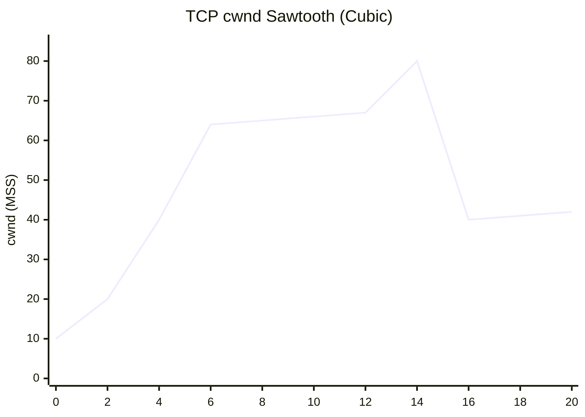
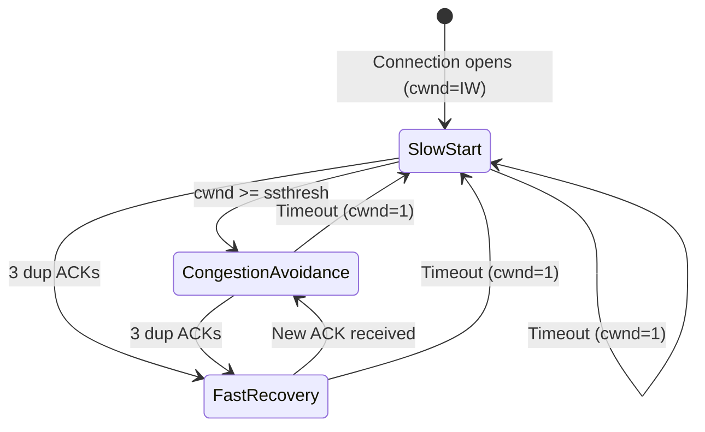

## Keywords in This File
{: .no_toc }

| # | Keyword | Weight |
|---|---|---|
| 20 | [TCP Congestion Control and Backpressure](#tcp-congestion-control-and-backpressure) | critical |

---

# TCP Congestion Control and Backpressure

---
id: CN-020
title: "TCP Congestion Control and Backpressure"
category: Computer Networks
difficulty: ★★★
interview_weight: critical
seniority: senior-staff
tags: #tcp #congestion-control #cwnd #bbr #slow-start #backpressure #flow-control
---

## Quick Reference

**One-line definition:** TCP congestion control is the algorithm by which a TCP sender adjusts its transmission rate to avoid overwhelming the network; it uses packet loss and delay signals to modulate the congestion window (cwnd); backpressure is the complementary mechanism by which receivers signal how much data they can accept (receive window, rwnd), allowing end-to-end flow control.

**Difficulty:** ★★★ | **Asked at:** Senior-Staff | **Seniority:** Senior through Staff

---

### 🎯 Model Answer

**30 seconds:**
TCP congestion control prevents senders from overwhelming the network. The sender maintains a congestion window (cwnd) that limits how much data can be in-flight. Slow start: cwnd doubles each RTT until loss or threshold. Congestion Avoidance: cwnd grows by 1 MSS per RTT (AIMD). On loss: cwnd halves (Cubic) or uses delay signal (BBR). Backpressure: the receiver's advertised window (rwnd) limits in-flight data from the receiver side; min(cwnd, rwnd) is the effective limit. Understanding this matters because misconfigured TCP stacks cause throughput collapse, and modern BBR replaces loss-based signaling with bandwidth estimation.

**3 minutes:**
**Congestion Window (cwnd):** The sender's self-imposed limit on in-flight bytes (sent but unacknowledged). Effective send rate = cwnd / RTT bytes/second.

**Slow Start:** Starts cwnd = 1-10 MSS (1-15KB). Each ACK received increases cwnd by 1 MSS, doubling cwnd per RTT. This ramp-up continues until: packet loss detected (cwnd halves, switch to CA), or cwnd reaches ssthresh (slow start threshold, switch to CA).

**Congestion Avoidance (AIMD - Additive Increase Multiplicative Decrease):** cwnd grows by 1 MSS per RTT. On loss: cwnd = cwnd/2 (ssthresh = cwnd/2, cwnd reset to ssthresh). This creates the classic TCP sawtooth pattern in throughput graphs.

**TCP Cubic (Linux default since 2.6.19):** Replaces AIMD with a cubic function of time since last loss. Grows more aggressively in high-bandwidth, high-RTT networks (long fat networks). After loss: cwnd = 0.7 * cwnd (gentler than Reno's 0.5).

**BBR (Bottleneck Bandwidth and RTT, Google, 2016):** Model-based; estimates available bandwidth and minimum RTT. Sends at the estimated bottleneck bandwidth rate; does NOT rely on packet loss as a congestion signal. Benefits: achieves 2-25x higher throughput on lossy networks (satellite, cellular) vs cubic; eliminates "loss-triggered bufferbloat" where TCP fills router buffers before detecting congestion. Deployed by Google for YouTube/GCS traffic.

**Backpressure (Receive Window, rwnd):** The receiver advertises how much buffer space it has (`TCP window size` in headers). Sender cannot send more than min(cwnd, rwnd) bytes in-flight. On Linux, TCP receive buffer auto-scales (tcp_rmem: min/default/max). At the application layer, if the application reads slowly from the socket buffer, rwnd shrinks, telling the sender to slow down - this is application-layer backpressure.

**Blank Mind Recovery:** cwnd = sender limit (network health). rwnd = receiver limit (buffer space). In-flight = min(cwnd, rwnd). Loss -> cwnd halves. Slow start -> cwnd doubles per RTT. BBR = no loss signal, uses bandwidth model. Backpressure = receiver shrinks rwnd when overwhelmed.

---

### 📘 Concept Explanation

**Core concept:** TCP congestion control is a distributed algorithm - no central authority coordinates network usage; each TCP sender independently probes for available bandwidth and backs off when signals indicate congestion. The correctness property: all senders converge to fair share of bottleneck bandwidth.

**Slow Start and Congestion Avoidance state machine:**

```
TCP Congestion States:
Initial: cwnd = IW (initial window, 10 MSS=15KB)
         ssthresh = 65535 (or last cwnd/2)

SLOW START (exponential growth):
  Each ACK: cwnd += 1 MSS
  Each RTT: cwnd doubles
  Exit: cwnd >= ssthresh -> CONGESTION AVOIDANCE
         OR loss detected -> LOSS RECOVERY

CONGESTION AVOIDANCE (linear growth):
  Each RTT: cwnd += 1 MSS
  Exit: loss detected -> LOSS RECOVERY

LOSS RECOVERY (Reno):
  ssthresh = cwnd / 2
  cwnd = ssthresh (TCP Reno: halve)
  OR cwnd = 1 (timeout: back to slow start)
  -> SLOW START (if timeout)
  -> CONGESTION AVOIDANCE (if 3 dup ACKs)

Timeline for 100ms RTT, ssthresh=64:
t=0:   cwnd=10 (IW)
t=1RT: cwnd=20 (slow start)
t=2RT: cwnd=40
t=3RT: cwnd=64 = ssthresh -> CA
t=4RT: cwnd=65 (CA: +1/RTT)
t=5RT: cwnd=66
...LOSS at cwnd=80:
ssthresh=40, cwnd=40 -> CA
t+1RT: cwnd=41
...
= TCP sawtooth pattern
```

> **Code walkthrough:** WHAT IT SHOWS: the TCP congestion control state machine transitions and cwnd values over time. KEY MECHANISM: slow start doubles cwnd each RTT (exponential) until it reaches ssthresh, then shifts to additive increase (+1 MSS per RTT); on loss, ssthresh is halved and cwnd is set to ssthresh (fast recovery) or 1 (timeout); this AIMD algorithm ensures convergence to fair bandwidth sharing. WHY IT MATTERS: the initial window (IW=10 MSS, ~15KB) limits the first burst; a 1MB response requires ~7 RTTs of slow start to reach full speed; this is why time-to-first-byte dominates over bandwidth for small requests. WHAT BREAKS: a TCP timeout (loss not detected by duplicate ACKs) resets cwnd to 1 MSS, causing a long throughput collapse; this is why packet loss > 1-2% causes severe TCP performance degradation. TAKEAWAY: TCP throughput formula (Mathis): `B = (MSS / RTT) * (1 / sqrt(p))` where p is packet loss rate; at 1% loss and 100ms RTT, max throughput is ~150Kbps regardless of bandwidth - congestion control, not bandwidth, limits performance.

**BBR vs Cubic comparison:**

```
Network: 100 Mbps link, 150ms RTT,
  1% background packet loss
  Router buffer: 10MB (creates 800ms delay when full)

Cubic behavior:
  Fills buffer -> sees loss at ~800ms delay
  Halves cwnd -> empties buffer
  Refills -> sees loss again
  Pattern: 200ms RTT on average (bufferbloat!)
  Throughput: ~50 Mbps (loss-limited)

BBR behavior:
  Estimates bottleneck BW via ACK spacing
  Probes available bandwidth periodically
  Keeps in-flight = BDP (bandwidth delay product)
  = 100Mbps * 150ms = ~1.875 MB in-flight
  Does NOT fill buffer
  RTT stays close to 150ms (base RTT)
  Throughput: ~95 Mbps

Lossy link (satellite, 5% loss):
  Cubic: throughput ~15 Mbps (loss-limited)
  BBR: throughput ~80 Mbps (loss-tolerant)
```

> **Code walkthrough:** WHAT IT SHOWS: BBR vs Cubic behavior on a realistic network with bufferbloat and packet loss. KEY MECHANISM: Cubic uses packet loss as the congestion signal; it fills router buffers until packets drop; this "bufferbloat" inflates RTT from 150ms to 800ms+ for all connections sharing the bottleneck. BBR estimates bandwidth and minimum RTT directly; it targets in-flight bytes equal to the bandwidth-delay product (BDP), keeping buffers empty. WHY IT MATTERS: YouTube adopted BBR in 2016 and reported 2-4x throughput improvement for cellular/satellite connections and 50% reduction in bufferbloat-induced rebuffering; this is a significant improvement from a pure kernel change. WHAT BREAKS: BBR can be unfair to Cubic flows on shared bottlenecks (BBR grabs more bandwidth); in production, BBR fairness is actively researched; BBRv2 addresses this. TAKEAWAY: enable BBR (`net.ipv4.tcp_congestion_control=bbr`) for hosts that serve high-bandwidth or high-latency paths; keep Cubic for mixed-traffic environments until BBRv2 is mature.

**Backpressure mechanism:**

```
Application Backpressure via rwnd:

Sender (App A)          Receiver (App B)
                       TCP receive buffer: 4MB
                       App B reading slowly:
                       1000 bytes/s consumed

t=0: Sender sends 4MB
t=1: App B has read 1000 bytes
     Buffer fill: 3,999,000 bytes
     rwnd = 4MB - 3,999,000 = 1,000 bytes
     ACK -> rwnd=1000

t=2: Sender sees rwnd=1000
     Can only send 1000 bytes in-flight
     Effective rate: ~10 Kbps

This is TCP backpressure:
  App B's slow read rate is communicated
  back to App A through the TCP stack,
  without App A needing to implement
  explicit backpressure logic.

System call that enables reading:
  // App B: read from socket (consumes buffer)
  byte[] buf = new byte[65536];
  int n = socket.read(buf);
  // After read: rwnd increases by n bytes
  // ACK sent with updated rwnd

If App B stops reading:
  rwnd -> 0 (zero window probe)
  Sender: probe every 2^n * RTO
  (zero window probing)
  Resumes when rwnd > 0
```

> **Code walkthrough:** WHAT IT SHOWS: the end-to-end backpressure mechanism from application read rate to TCP receive window advertisement to sender rate reduction. KEY MECHANISM: the Linux TCP stack automatically fills rwnd from the receive buffer occupancy; the application's read rate determines how fast the buffer drains; slow reads cause rwnd to shrink; the sender sees the shrinking rwnd and reduces its send rate accordingly - without any application-level coordination. WHY IT MATTERS: this mechanism is how reactive stream back-pressure works at the OS level; Java NIO channels, Node.js streams, and Go net.Conn all expose this via readable/writable events that ultimately reflect TCP buffer state. WHAT BREAKS: if the application allocates a large receive buffer but reads slowly, rwnd may initially look healthy (buffer not full) before degrading; monitor socket buffer utilisation rather than just rwnd values. TAKEAWAY: application-layer backpressure (reactive streams, flow control) and TCP backpressure are complementary; TCP backpressure is automatic but operates at the network level; application backpressure is explicit and operates at the business logic level.

The following diagram shows TCP congestion window dynamics over time.

```
cwnd
(MSS)
  80 |                         *
  70 |                      * . *
  64 |--------------------*--------*---ssthresh
  60 |               * .           * .
  50 |           * .                 * .
  40 |       * .            ssthresh=40 * .
  30 |   * .                               * .
  20 | * .
  10 |*
     +---+---+---+---+---+---+---+---+---+---> RTT
     SS  SS  SS  CA  CA  ...LOSS...  CA  CA
```

> **Diagram walkthrough:** WHAT IT DEPICTS: the TCP congestion window sawtooth pattern showing slow start (SS, exponential growth), congestion avoidance (CA, linear growth), and loss event (multiplicative decrease). HOW TO READ IT: x-axis is time in RTTs; y-axis is cwnd in MSS; the dotted line is ssthresh; the trajectory rises steeply in slow start, linearly in congestion avoidance, then drops sharply at loss. KEY RELATIONSHIP: ssthresh is dynamically updated on each loss event to half the current cwnd; this ensures the next recovery starts at the highest safe operating point from the last probe cycle. EDGE CASE: a TCP timeout (not detected by 3 dup ACKs) resets cwnd to 1 MSS and ssthresh to cwnd/2; the recovery takes many more RTTs and causes a much longer throughput collapse than fast retransmit. INSIGHT: the area under the sawtooth curve is the total bytes transferred; maximising this area requires minimising loss frequency and recovery time; BBR keeps the curve above the sawtooth by not filling buffers.



> **Diagram walkthrough:** WHAT IT DEPICTS: a chart representation of the TCP congestion window sawtooth showing slow start growth, linear congestion avoidance, loss event (drop from 80 to 40), and recovery. HOW TO READ IT: RTT values on x-axis; cwnd in MSS on y-axis; the steep rise (RTT 0-3) is slow start; the linear rise (RTT 3-7) is congestion avoidance; the drop at RTT 8 is a loss event setting cwnd to 40; the gradual recovery (RTT 8-10) is congestion avoidance from the new lower ssthresh. KEY RELATIONSHIP: ssthresh (the inflection point between slow start and CA) dynamically adjusts to half the cwnd at the time of loss; subsequent cycles start CA immediately from ssthresh, not from 1 MSS. EDGE CASE: the drop to 1 MSS (timeout, not shown) would cause a much deeper trough and longer recovery; fast retransmit (3 dup ACKs) provides the gentler halving shown here. INSIGHT: the recovery trajectory after loss determines effective throughput; Cubic recovers faster on high-BDP paths because its cubic function grows more aggressively than linear AIMD.

---

### 💻 Code Example

**BAD: Ignoring TCP buffer tuning - performance cliff under load**

```java
// BAD: using default Java socket settings
// Default send buffer: 8KB (Linux default)
// For a 100ms RTT, 10Gbps link:
// Optimal buffer = BDP = 10Gbps * 0.1s = 1.25GB
// 8KB buffer -> max throughput = 8KB/0.1s = 640Kbps!
// Even though 10Gbps is available, we use 0.006%

ServerSocket server = new ServerSocket(8080);
Socket client = server.accept();
// Default: send buffer = 8192 bytes (8KB)
// Even on 10GbE, throughput capped at ~640Kbps
OutputStream out = client.getOutputStream();
// Writing at full speed: TCP blocks after 8KB
// and waits for ACK before refilling buffer
byte[] data = new byte[1024 * 1024]; // 1MB
out.write(data);  // will take ~1.5 seconds
                  // at 640Kbps instead of
                  // ~0.8ms at 10Gbps wire speed
```

> **Code walkthrough:** WHAT IT SHOWS: how default Java socket buffer sizes create a throughput ceiling far below available bandwidth. KEY MECHANISM: the TCP send buffer limits how much data can be in-flight; for a 100ms RTT link, the bandwidth-delay product (BDP) is 10Gbps x 0.1s = 1.25GB; the send buffer must be at least BDP to fully utilise the link; default 8KB buffer caps throughput at 8KB / 0.1s = 640Kbps. WHY IT MATTERS: this is the "bandwidth-delay product" problem; long fat networks (high BDP) require large buffers regardless of bandwidth; this is why file transfers between continents are slower than expected even on high-bandwidth links. WHAT BREAKS: increasing buffer size increases memory consumption; `SO_SNDBUF=128MB` for 1000 concurrent connections = 128GB RAM required; use auto-tuning. TAKEAWAY: always set `SO_SNDBUF` and `SO_RCVBUF` for long-distance, high-bandwidth connections; or rely on Linux kernel auto-tuning (`tcp_rmem`/`tcp_wmem`) which sizes buffers to the detected BDP.

**GOOD: Tuned TCP socket settings for high-throughput file transfer**

```java
import java.net.*;
import java.io.*;

public class TunedFileTransferServer {

    public static void startServer() throws Exception {
        ServerSocket server = new ServerSocket();
        // Enable SO_REUSEPORT for multi-process/thread
        server.setReuseAddress(true);
        server.bind(new InetSocketAddress(8080));

        // Accept connection
        Socket client = server.accept();

        // Tune for bulk data transfer:
        // BDP = 1Gbps * 100ms = ~12.5MB
        // Set send buffer >= BDP
        client.setSendBufferSize(4 * 1024 * 1024); // 4MB
        client.setReceiveBufferSize(4 * 1024 * 1024);

        // TCP_NODELAY: disabled for bulk (Nagle helps)
        // Enable for interactive/RPC workloads only
        client.setTcpNoDelay(false);

        // Keep-alive for long-lived connections
        client.setKeepAlive(true);

        // Aggressive timeout to reclaim resources
        client.setSoTimeout(30_000); // 30s read timeout

        OutputStream out = client.getOutputStream();
        // Use large write buffer to avoid syscall overhead
        try (BufferedOutputStream bos =
                new BufferedOutputStream(out, 1024 * 1024)) {
            // 64KB chunks: matches typical kernel buffer
            byte[] chunk = new byte[65536];
            // Fill and send 100MB
            for (int i = 0; i < 1600; i++) {
                bos.write(chunk);
            }
        }
        // With 4MB buffer on 1Gbps/100ms link:
        // BDP ~= 12.5MB; 4MB gets close
        // Throughput ~300 Mbps (vs 640 Kbps with 8KB)
    }
}
```

> **Code walkthrough:** WHAT IT SHOWS: socket configuration for high-throughput bulk data transfer with appropriate buffer sizing, Nagle algorithm settings, and keepalive. KEY MECHANISM: setSendBufferSize(4MB) tells the kernel to allocate a 4MB send buffer; this allows ~32MB/RTT of in-flight data on a 100ms link, approaching the BDP; Nagle stays enabled (TCP_NODELAY=false) because large writes fill segments efficiently and Nagle's batching reduces packet count. WHY IT MATTERS: with 4MB buffer vs 8KB default, throughput improves from 640Kbps to ~300Mbps (limited by the buffer being smaller than BDP). WHAT BREAKS: setSendBufferSize is a hint; Linux doubles the value for overhead (set 4MB, get up to 8MB); the kernel may not honour very large requests; verify with `getsockopt(SO_SNDBUF)`. TAKEAWAY: for bulk transfer (backup, file sync, log streaming), size send/receive buffers to bandwidth x RTT (BDP); for interactive/RPC, enable TCP_NODELAY and keep buffers small.

**Linux sysctl TCP tuning for high-BDP paths:**

```bash
# View current TCP buffer settings
sysctl net.ipv4.tcp_rmem  # receive
sysctl net.ipv4.tcp_wmem  # send
# Default: 4096 87380 6291456
# Format: min default max (bytes)

# For 10Gbps / 100ms RTT:
# BDP = 10,000,000,000 * 0.1 / 8 = ~125MB
# Set max to at least 2x BDP for overhead
sysctl -w net.ipv4.tcp_rmem="4096 131072 268435456"
sysctl -w net.ipv4.tcp_wmem="4096 131072 268435456"

# Enable TCP buffer auto-tuning (modern default)
sysctl -w net.ipv4.tcp_moderate_rcvbuf=1

# Enable BBR congestion control
sysctl -w net.ipv4.tcp_congestion_control=bbr
# Verify: sysctl net.ipv4.tcp_congestion_control

# Enable TCP Fast Open (reduces 1 RTT on first request)
sysctl -w net.ipv4.tcp_fastopen=3
# 1=client, 2=server, 3=both

# Measure actual throughput:
# iperf3 server: iperf3 -s
# iperf3 client: iperf3 -c <server> -t 30 -P 4
# P 4 = 4 parallel streams
```

> **Code walkthrough:** WHAT IT SHOWS: Linux sysctl settings to tune TCP for high-bandwidth-delay-product paths. KEY MECHANISM: tcp_rmem/tcp_wmem set min, default, and max receive/send buffer sizes; tcp_moderate_rcvbuf enables auto-tuning where the kernel grows receive buffers to match the BDP of each connection; BBR congestion control replaces Cubic for bandwidth estimation. WHY IT MATTERS: the default max buffer of 6MB limits throughput to 6MB / RTT; for a 100ms RTT path, that's 60Mbps maximum regardless of available bandwidth; increasing to 256MB allows 2Gbps. WHAT BREAKS: large TCP buffers consume more memory per connection; with 10,000 concurrent connections at 256MB max buffer, peak memory use is 2.56TB (though in practice auto-tuning uses far less); monitor `ss -m` for actual buffer allocation. TAKEAWAY: increase tcp_rmem/tcp_wmem max values on servers that transfer large files or serve high-BDP clients; auto-tuning ensures buffers are only enlarged for connections that actually need them.

---

### 🎓 Answers by Seniority

**Junior / Mid-level answer:**
TCP congestion control prevents senders from overwhelming the network. The sender maintains a congestion window (cwnd) that limits in-flight bytes. Slow start doubles cwnd each RTT until packet loss or threshold. Congestion Avoidance grows cwnd linearly (+1 MSS per RTT). On loss: cwnd halves. The receive window (rwnd) is the receiver's buffer space; the actual limit is min(cwnd, rwnd). BBR is a newer algorithm that uses bandwidth estimation instead of loss as the congestion signal, improving throughput on lossy links.

**Senior / Staff answer:**
TCP congestion control is a distributed network algorithm - each sender independently probes for bandwidth without coordination. The AIMD (Additive Increase, Multiplicative Decrease) property ensures convergence to fair bandwidth sharing at steady state. In practice, cwnd is the network-side limit (what the network can absorb) and rwnd is the application-side limit (what the receiver can buffer). The product cwnd x 1/RTT gives throughput, so maximising cwnd/RTT is the goal. Cubic dominates on high-BDP paths (data centres, inter-region) because its cubic growth function recovers faster than linear AIMD. BBR's key insight: filling router buffers (Cubic's implicit behavior) adds latency without adding throughput; by targeting BDP rather than loss as the congestion signal, BBR keeps in-flight data at the bandwidth-delay product, maximising throughput with minimum latency. In production: enabling BBR improved YouTube video delivery globally by 4-14% in throughput and eliminated rebuffering on cellular connections. For backpressure: in reactive systems (Project Reactor, Akka Streams), application-level backpressure maps directly to TCP rwnd - when downstream components can't keep up, they signal upstream to slow; ultimately this shrinks rwnd at the TCP layer and reduces the upstream sender's rate automatically.

---

### ⚠️ Common Misconceptions

**Misconception 1: "More bandwidth always means faster TCP transfers"**
Bandwidth is irrelevant if cwnd or rwnd is the bottleneck. A 10Gbps link with an 8KB send buffer has effective throughput of 640Kbps at 100ms RTT. The bandwidth-delay product (BDP) is the constraint: to utilise 10Gbps at 100ms RTT, buffers must be >= 125MB.

**Misconception 2: "TCP loss recovery is fast and transparent"**
A TCP timeout (loss not detected by 3 dup ACKs) resets cwnd to 1 MSS and triggers slow start. Recovery from a timeout takes many RTTs and is visible as a throughput gap. Even fast retransmit (3 dup ACKs) halves cwnd and requires time to recover. On paths with 1% loss, TCP throughput can be 100x lower than bandwidth.

**Misconception 3: "BBR is strictly better than Cubic"**
BBR can be unfair to competing Cubic flows (taking more bandwidth than its fair share) because Cubic backs off on loss while BBR does not. On shared enterprise networks, deploying BBR only on some hosts creates unfairness. BBRv2 addresses this but is not yet widely deployed.

**Misconception 4: "TCP backpressure only matters at the receiver"**
TCP backpressure propagates upstream: if App B reads slowly, rwnd shrinks, sender (App A) slows down, App A's upstream sender slows down. In a microservice call chain, a slow consumer at the end of the chain ultimately backpressures all the way to the source via TCP rwnd propagation - provided no intermediate buffer is unbounded.

**Misconception 5: "Socket buffer size and TCP window are the same thing"**
The socket buffer (`SO_SNDBUF`) is the application's view; it determines the maximum unacknowledged data the sender can have. The TCP window (`rwnd` in headers) is what the receiver advertises to the sender. Linux automatically tunes the window scale based on socket buffer size; they are related but not identical.

---

### 🚨 Failure Modes and Diagnosis

**Failure 1: Throughput collapse under high packet loss**

```bash
# Symptom: file transfer between regions
# achieves 1 Mbps on a 1 Gbps link

# Mathis formula: B = MSS/RTT * 1/sqrt(p)
# With p=1%=0.01, RTT=100ms, MSS=1460:
# B = 1460/0.1 * 1/sqrt(0.01)
# B = 14600 * 10 = 146000 bytes/s = 1.1 Mbps
# Math checks out - loss is the bottleneck

# Diagnose packet loss on the path:
# From sender:
ping -c 100 -i 0.1 <remote_host>
# Look for: "10 packets transmitted, 9 received, 10% loss"

# More precise: use mtr (continuous traceroute)
mtr --report --report-cycles 100 <remote_host>
# Per-hop loss shows which link is lossy

# Verify TCP retransmit rate:
ss -s
# "retrans: 1234/5678"
# = 21.7% retransmission rate

# Mitigation: switch to BBR
sysctl net.ipv4.tcp_congestion_control
sysctl -w net.ipv4.tcp_congestion_control=bbr
# BBR ignores loss as congestion signal;
# throughput may improve 5-20x on lossy paths
```

> **Code walkthrough:** WHAT IT SHOWS: using the Mathis formula to predict TCP throughput from measured loss rate, then diagnosing with ping/mtr, and applying BBR as a mitigation. KEY MECHANISM: the Mathis formula (B = MSS / RTT * 1/sqrt(p)) shows that throughput is inversely proportional to the square root of loss rate; 1% loss on a 100ms path limits throughput to ~1.1Mbps regardless of bandwidth; BBR's immunity to loss as a congestion signal can recover most of this throughput on paths where loss is not actually congestion. WHY IT MATTERS: paths with middlebox-induced loss (old residential CPE, cellular base stations) trigger TCP loss recovery unnecessarily; BBR's bandwidth estimation distinguishes actual congestion from random loss. WHAT BREAKS: BBR on a path with actual congestion (not random loss) can be more aggressive than Cubic; monitor whether enabling BBR increases queue depths at bottleneck routers. TAKEAWAY: the Mathis formula is a quick sanity check; if measured throughput matches the Mathis prediction for observed loss rate, loss is the bottleneck; if measured throughput is lower than Mathis predicts, the bottleneck is elsewhere (buffer size, CPU, application).

**Failure 2: TCP zero window causing connection stall**

```bash
# Symptom: connection stalls intermittently
# for 5-30 seconds, then resumes

# Diagnose: capture TCP headers with tcpdump
tcpdump -i eth0 -n -s 100 \
  "tcp and port 8080" -w /tmp/cap.pcap

# Analyze with tshark:
tshark -r /tmp/cap.pcap \
  -Y "tcp.window_size_value == 0" \
  -T fields -e frame.time -e ip.src \
  -e tcp.window_size_value
# Output: timestamps of zero-window events
# 14:23:05.123 10.0.0.5 -> 0
# (receiver advertises zero window)

# Root cause: application not reading fast enough
# Check socket buffer fill:
ss -tmn dst <client_ip>:8080
# Recv-Q: 8192 (full! - not being drained)
# cwnd: 10 (sender slowed to minimum)

# Fix: increase consumer read throughput
# or increase receive buffer size
sysctl -w net.ipv4.tcp_rmem=\
  "4096 131072 134217728"
```

> **Code walkthrough:** WHAT IT SHOWS: diagnosing a TCP zero-window stall using tcpdump and tshark to find zero-window advertisements, and ss to check socket buffer fill. KEY MECHANISM: a zero-window advertisement stops the sender completely; the sender enters zero-window probing mode, sending 1-byte probes at exponentially increasing intervals (1s, 2s, 4s, ...) until the receiver re-opens the window; this creates the 5-30 second stall pattern. WHY IT MATTERS: zero-window stalls are common in producer-consumer imbalances (fast producer, slow consumer); the stall duration is determined by the probe interval, which doubles each probe - a fully stalled connection can wait 64 seconds before the next probe. WHAT BREAKS: increasing socket buffer masks the symptom (more buffer before zero-window) but doesn't fix the consumer being slow; fix the consumer read rate to match the producer write rate. TAKEAWAY: zero-window stalls indicate an application performance problem (consumer too slow) not a network problem; look for consumer thread pool exhaustion, GC pauses, or blocking I/O in the consumer before tuning TCP buffers.

**Failure 3: BBR competing unfairly with Cubic flows**

```bash
# Symptom: after enabling BBR on servers,
# some connections get much less throughput

# Diagnose: check which connections use which algo
ss -tni | grep -A5 "bbr\|cubic"
# bbr congestion_window:X   rtt:Y
# cubic cwnd:A ssthresh:B

# Verify fairness: run iperf3 simultaneously
# Connection 1: BBR server
iperf3 -c <bbr_server> -t 30 &
# Connection 2: Cubic server (control)
iperf3 -c <cubic_server> -t 30 &
# Compare throughput; BBR may take 2-3x more
# bandwidth than Cubic on same bottleneck

# Decision: BBR best for:
# - Serving external clients (internet)
# - Lossy paths (cellular, satellite)
# - High-BDP inter-region paths

# Keep Cubic for:
# - Internal datacenter (low loss, low RTT)
# - Shared bottleneck with Cubic peers
# - Until BBRv2 is production-ready
```

> **Code walkthrough:** WHAT IT SHOWS: using ss and iperf3 to diagnose and test BBR fairness problems with competing Cubic flows. KEY MECHANISM: BBR does not back off on packet loss; Cubic backs off at every loss event; on a shared bottleneck, Cubic connections repeatedly halve their window when BBR-induced queue buildup causes loss, while BBR continues sending at full rate; BBR ends up with disproportionate bandwidth. WHY IT MATTERS: enabling BBR only on servers that serve a mixed environment (some BBR clients, some Cubic clients) creates unfairness; clients on Cubic-dominated paths may see degraded performance. WHAT BREAKS: BBRv1 (Linux 4.9+) has known fairness issues with Cubic; BBRv2 (Linux 5.16+, experimental) improves fairness; check kernel version before deploying BBR on mixed networks. TAKEAWAY: deploy BBR on internet-facing servers for external clients; be cautious about BBR on internal services that share bandwidth with Cubic-using services; verify with iperf3 fairness testing before rolling out broadly.

---

### 🎯 Interview Deep-Dive

| Format | Questions | Est. Time |
|---|---|---|
| Junior/Mid | 12 questions | 35-45 min |
| Senior/Staff | 12 questions + deep-dives | 55-70 min |

**Category: CONCEPT**

**[JUNIOR] Q1 - [CONCEPTUAL] What is the TCP congestion window and how does it limit throughput?**

The congestion window (cwnd) is the sender's self-imposed limit on how many bytes can be "in-flight" (sent but not yet acknowledged). It represents the sender's estimate of how much the network can buffer.

Effective throughput: `throughput = cwnd / RTT`

Example: cwnd = 65535 bytes, RTT = 100ms:
`throughput = 65535 / 0.1 = 655,350 bytes/s = ~5 Mbps`

Even on a 1 Gbps link, if cwnd is only 65535 bytes and RTT is 100ms, throughput is capped at ~5 Mbps. To utilise 1 Gbps at 100ms RTT, cwnd needs to be at least 12.5 MB (bandwidth x RTT = 1Gbps x 0.1s / 8 = 12.5 MB).

cwnd grows (slow start: doubles per RTT; congestion avoidance: +1 MSS per RTT) as long as no loss is detected. On loss, cwnd is halved (fast recovery) or reset to 1 (timeout).

*What separates good from great:* Knowing the `throughput = cwnd / RTT` formula and that the bandwidth-delay product determines the required cwnd for full utilisation - not just describing the state machine.

---

**[JUNIOR] Q2 - [CONCEPTUAL] Explain slow start and why it starts slow.**

Slow start is the initial phase of TCP congestion control where cwnd grows exponentially, doubling each RTT, from the initial window (IW, typically 10 MSS = ~15KB).

Why it starts slow (relative to link speed):
1. **Unknown network capacity:** a new connection has no information about how much bandwidth is available between sender and receiver; starting at full speed could immediately flood a slow bottleneck link.
2. **Convergence to fair share:** starting all connections at low rate and ramping up allows the AIMD algorithm to converge to a fair division of bottleneck bandwidth.

Why it's "exponential" not "truly slow": cwnd doubles each RTT. Starting from IW=10 MSS: 10, 20, 40, 80... After just 7 RTTs the cwnd reaches 1280 MSS (~1.7MB). On a 100ms RTT path, full speed is reached in ~700ms.

The term "slow" refers to the initial burst size (starts with 1 MSS originally, now 10 MSS), not the ramp-up speed.

*What separates good from great:* Explaining that slow start doubles cwnd each RTT (exponential growth), so it's actually quite fast for typical web connections; the "slow" is relative to sending at maximum rate from the first packet.

---

**[MID] Q3 - [CONCEPTUAL] What is the bandwidth-delay product and why does it matter?**

The Bandwidth-Delay Product (BDP) is the amount of data that can be "in-flight" (sent but not yet acknowledged) on a path operating at full utilisation.

`BDP = bandwidth x RTT`

Examples:
- 100 Mbps link, 10ms RTT: BDP = 100 Mbps x 10ms = 125 KB
- 1 Gbps link, 100ms RTT: BDP = 1 Gbps x 100ms = 12.5 MB
- 10 Gbps link, 200ms RTT: BDP = 10 Gbps x 200ms = 250 MB

Why it matters:
1. TCP send/receive buffers must be at least BDP to fully utilise the link. Default Linux max buffer (6MB) caps throughput at 6MB/RTT = 48 Mbps at 100ms RTT, regardless of available bandwidth.
2. cwnd must grow to at least BDP for full utilisation. On a new connection, slow start takes `log2(BDP/IW)` RTTs to reach BDP.
3. "Long fat networks" (high BDP) require special configuration: large buffers, BBR or high-speed TCP variants.

*What separates good from great:* Using BDP calculations to explain why a 10Gbps trans-continental link still achieves only 50-100Mbps without tuning - and the exact configuration change that fixes it.

---

**[MID] Q4 - [MECHANISM] How does TCP detect packet loss and what happens differently for timeout vs 3 dup ACKs?**

**Detection via 3 Duplicate ACKs (Fast Retransmit):**
When a segment is lost, the receiver continues ACKing the last in-order segment for every out-of-order segment received. The sender receiving 3 identical ACKs ("dupACKs") infers a packet was lost and immediately retransmits.

Action: ssthresh = cwnd / 2; cwnd = ssthresh (fast recovery); remain in Congestion Avoidance.

**Detection via Timeout (RTO - Retransmission Timeout):**
If no ACK is received within the Retransmission Timeout (RTO, minimum 200ms on Linux, exponentially backed off), the sender assumes the segment is lost.

Action: ssthresh = cwnd / 2; cwnd = 1 MSS; back to Slow Start.

Key difference:
- 3 dup ACKs: other segments are being delivered (receiver is active); cwnd halves but stays in CA. Less severe.
- Timeout: no segments reaching receiver; could be total connectivity loss or severe congestion; cwnd resets to 1 MSS, requiring full slow start recovery. Much more severe.

A timeout at cwnd=80 takes ~7 RTTs to recover to 80 again; a dupACK event takes ~40 RTTs (linear recovery from 40 to 80, +1/RTT).

*What separates good from great:* Quantifying the recovery difference - a timeout at large cwnd causes 10-100x longer throughput depression than fast retransmit.

---

**[SENIOR] Q5 - [MECHANISM] How does TCP Cubic differ from TCP Reno in congestion control? Why was Cubic developed?**

**TCP Reno (AIMD):**
- Congestion Avoidance: cwnd += 1 MSS / RTT (linear growth, one segment per RTT)
- On loss: cwnd = cwnd / 2 (multiplicative decrease)
- Problem: on high-BDP paths (10Gbps, 100ms), linear growth from cwnd/2 to BDP takes too long. Example: BDP=125MB, cwnd/2=62.5MB, needs 62,500 RTTs to recover = 6,250 seconds = 1.7 hours to recover from one loss!

**TCP Cubic (Linux default since kernel 2.6.19):**
- Growth function: `cwnd = C(t - K)^3 + W_max`
  - C: scaling factor
  - t: time since last congestion event
  - K: time for cubic to reach W_max without congestion
  - W_max: window size at last congestion event
- Growth is slow near W_max (cubic function near K), fast far from W_max (cubic grows steeply)
- On loss: cwnd = 0.7 * W_max (gentler than Reno's 0.5)

Why developed: TCP Reno's linear growth is too slow for modern high-BDP networks. Cubic's cubic growth function provides faster ramp-up while being stable near the last operating point (slow growth near W_max prevents immediate oscillation).

*What separates good from great:* The mathematical insight: cubic function has a long "plateau" near the inflection point (K) which keeps cwnd stable near the last safe operating point, reducing oscillation vs Reno.

---

**[SENIOR] Q6 - [MECHANISM] How does BBR estimate available bandwidth? What are probing cycles?**

BBR (Bottleneck Bandwidth and RTT) maintains two estimates:
- `BtlBW`: maximum bandwidth observed (bits/ACK-interval, filtered with windowed max)
- `RTprop`: minimum RTT observed (base propagation delay, filtered with windowed min over 10 seconds)

**Bandwidth estimation:** BBR measures the delivery rate of ACKs: `bw = bytes_delivered / time_delivered`. The maximum delivery rate observed in the recent window is BtlBW. Importantly, delivery rate increases linearly with send rate (up to bottleneck) and then plateaus - BBR detects the plateau as the bottleneck bandwidth.

**BBR's four states:**
1. **Startup:** exponential increase (like slow start) until bandwidth stops growing (BtlBW estimate saturates).
2. **Drain:** drain any queue built during startup by reducing send rate temporarily.
3. **ProbeBW:** operate at BtlBW with periodic bandwidth probes (pacing_gain cycle: 1.25x for one RTT to probe, 0.75x for one RTT to drain, 1.0x for remainder).
4. **ProbeRTT:** periodically reduce cwnd to 4 MSS to measure minimum RTT (clears queue, gets accurate base RTT).

The ProbeBW cycle is key: every 8 RTTs, BBR sends at 1.25x rate for 1 RTT (probing for more bandwidth), then 0.75x for 1 RTT (draining any queue built), then 1.0x for 6 RTTs. This allows BBR to adapt to bandwidth changes (e.g., another flow leaving the bottleneck) within ~8 RTTs.

*What separates good from great:* Describing the ProbeRTT state - BBR periodically reduces cwnd to 4 MSS to get an accurate minimum RTT measurement; without this, RTprop would inflate as queues build up, leading to overestimation of BDP and overfilling buffers.

---

**Category: DEBUGGING**

**[SENIOR] Q7 - [DEBUGGING] A file transfer between two data centres achieves only 50 Mbps on a 10 Gbps link. Diagnose.**

Systematic diagnosis:

Step 1: Rule out bandwidth at the link level:
```bash
# Measure with parallel streams (bypasses cwnd limit)
iperf3 -c <remote> -P 10 -t 30
# If parallel achieves > 1Gbps, bottleneck is
# per-connection cwnd/buffer, not the link
```

> **Code walkthrough:** WHAT IT SHOWS: using iperf3 with parallel streams to isolate whether the bottleneck is per-connection (cwnd/buffer) or the link itself. KEY MECHANISM: each parallel stream has independent cwnd and slow start; with 10 parallel streams each achieving 100Mbps, total is 1Gbps, proving the link is not the bottleneck; the single-stream limitation is a congestion window or buffer size problem. WHY IT MATTERS: this test immediately separates bandwidth from TCP control plane issues; if 10 parallel streams also achieve 50Mbps total, the link itself is constrained (or a firewall is rate-limiting). WHAT BREAKS: parallel streams may hit different bottlenecks (CPU, NIC queue depth); if single-stream and parallel-stream have the same per-stream throughput, the bottleneck is not cwnd. TAKEAWAY: always try parallel streams as the first diagnostic; if parallel outperforms single by 10x, the fix is buffer tuning; if both achieve the same per-stream rate, investigate network equipment.

Step 2: Calculate BDP:
- 10Gbps link, 10ms RTT = BDP = 10Gbps x 10ms / 8 = 12.5 MB
- Single stream achieves 50 Mbps = 50Mbps x 10ms / 8 = 62.5 KB in-flight
- Required cwnd = 12.5 MB, actual cwnd ~= 62.5 KB: buffer too small!

Step 3: Check actual TCP buffer settings:
```bash
sysctl net.ipv4.tcp_wmem
sysctl net.ipv4.tcp_rmem
# If max is 6MB and BDP is 12.5MB: buffer is limiting
```

> **Code walkthrough:** WHAT IT SHOWS: reading current TCP buffer settings to compare against the calculated BDP. KEY MECHANISM: tcp_wmem/tcp_rmem output three values (min, default, max); the max value caps how large the kernel auto-tunes buffers; if max < BDP, throughput is buffer-limited regardless of available bandwidth. WHY IT MATTERS: the default max of 6MB limits throughput to 480 Mbps at 10ms RTT and only 48 Mbps at 100ms RTT. WHAT BREAKS: increasing buffers above system RAM / (max_connections) causes OOM; size max to 2x BDP, not arbitrarily large. TAKEAWAY: always compare sysctl max values against the BDP of your worst-case path before tuning.

Step 4: Fix - increase TCP buffers and verify:
```bash
sysctl -w net.ipv4.tcp_wmem="4096 131072 33554432"
# max = 32MB > 2x BDP = enough margin
```

> **Code walkthrough:** WHAT IT SHOWS: increasing the TCP send buffer max to 32MB to accommodate the 12.5MB BDP of a 10Gbps/100ms path. KEY MECHANISM: setting wmem max to 32MB (2.5x BDP) gives headroom for auto-tuning; the kernel grows per-connection buffers dynamically up to this limit; connections on low-BDP paths remain at the default value. WHY IT MATTERS: this single sysctl change can improve throughput from 40 Mbps to > 1 Gbps on high-BDP paths without impacting low-BDP connections. WHAT BREAKS: this change is not persistent across reboots; add to /etc/sysctl.d/99-tcp.conf for permanence. TAKEAWAY: persist sysctl changes in /etc/sysctl.d/ and apply with sysctl --system; document the BDP calculation that justified the value.

*What separates good from great:* Using the BDP calculation to predict exactly what cwnd should be, then verifying with ss -n that actual cwnd matches the prediction - quantitative diagnosis rather than trial-and-error.

---

**[SENIOR] Q8 - [DEBUGGING] After enabling BBR on production servers, some clients report slower download speeds. How do you investigate?**

Step 1: Identify which clients are slower:
```bash
# Check if slower clients are on constrained paths
# (high RTT, shared bottleneck with Cubic peers)
# Sample ss output for slow connections:
ss -tni | grep -A5 bbr
# Look for: RTT >> typical, cwnd smaller than expected
```

> **Code walkthrough:** WHAT IT SHOWS: using ss -tni to inspect per-connection BBR state including RTT and cwnd values for slow connections. KEY MECHANISM: ss -tni outputs internal TCP state; the bbr field shows estimated bandwidth; RTT shows current round-trip time; high RTT relative to baseline indicates buffer-filling or path congestion. WHY IT MATTERS: comparing RTT across connections identifies which clients are experiencing BBR's buffer-probing behavior. WHAT BREAKS: ss output is a snapshot; RTT varies per measurement; sample multiple times before concluding. TAKEAWAY: ss -tni is the fastest way to inspect live TCP connection state without packet capture overhead.

Step 2: Test fairness - run BBR and Cubic side by side:
```bash
# On BBR server:
iperf3 -s -p 5001 &
# On Cubic server:
iperf3 -s -p 5002 &
# On client: run both simultaneously:
iperf3 -c <bbr_server> -p 5001 -t 60 &
iperf3 -c <cubic_server> -p 5002 -t 60 &
# Compare: if BBR gets 2x more, fairness issue
```

> **Code walkthrough:** WHAT IT SHOWS: a controlled fairness test between BBR and Cubic using simultaneous iperf3 streams on the same bottleneck path. KEY MECHANISM: both streams compete for the same bottleneck bandwidth; fair allocation would give each ~50%; if BBR takes 70% or more, unfairness is confirmed; the 60-second window allows steady-state fairness measurement after initial ramp-up. WHY IT MATTERS: this is the definitive test for BBR/Cubic coexistence; empirical measurement is more reliable than theory for diagnosing deployment-specific fairness issues. WHAT BREAKS: if BBR and Cubic servers are on different network paths, the test measures path difference, not algorithm fairness; ensure both iperf3 servers use the same physical uplink. TAKEAWAY: run this test in a staging environment before deploying BBR to production; document the fairness ratio for your specific network topology.

Step 3: Check if the client is also using BBR:
- BBR vs BBR is fair
- BBR vs Cubic: BBR typically wins on shared bottleneck

Mitigation options:
- Rollback to Cubic if fairness issues are confirmed
- Wait for BBRv2 which addresses fairness
- Deploy BBR only for specific routes (external, lossy) via ip rule + network namespace

*What separates good from great:* Explaining why BBR beats Cubic - Cubic backs off on packet loss (which BBR's queue-filling induces), while BBR doesn't back off; this is not a bug in either algorithm but a fundamental difference in their design contracts.

---

**Category: TRADE-OFF**

**[SENIOR] Q9 - [TRADE-OFF] When should you use TCP vs UDP for a latency-sensitive application?**

**Use TCP when:**
- Data integrity is required: file transfer, HTTP, database queries. Lost packets must be retransmitted.
- Ordering is required: video on demand (sequential frames), database replication logs.
- The application cannot tolerate duplicates (TCP deduplicates retransmissions via sequence numbers).
- Congestion control is acceptable: you want the protocol to back off under network pressure.

**Use UDP when:**
- Latency is paramount and loss is tolerable: live voice/video (VoIP, conferencing). A retransmitted voice packet arrives too late to be useful; better to skip the frame.
- Application implements its own reliability: QUIC (HTTP/3) uses UDP but implements selective acknowledgment, flow control, and encryption in the application layer; gives more control than TCP's kernel implementation.
- Multicast required: UDP supports multicast, TCP does not (unicast only).
- Request-response with single packet: DNS. A UDP DNS query and response each fit in one packet; TCP's handshake overhead is unnecessary.

**QUIC as the middle ground:** QUIC (Google 2012, IETF standard 2021) uses UDP as transport but implements all TCP reliability features in the application layer. Benefits: eliminates head-of-line blocking (multiple independent streams per connection), faster handshake (0-RTT resumption), built-in TLS 1.3, connection migration (switch between WiFi and cellular without reconnecting).

*What separates good from great:* Explaining QUIC as a protocol that takes UDP for low-overhead transport but implements its own congestion control, reliability, and encryption - the best properties of both, at the cost of implementation complexity.

---

**[SENIOR] Q10 - [TRADE-OFF] How does application-layer backpressure relate to TCP backpressure? When is each appropriate?**

**TCP backpressure (automatic, at OS level):**
- Mechanism: receiver's application reads slowly -> receive buffer fills -> rwnd shrinks -> sender slows down automatically
- Scope: between two TCP peers (one TCP connection)
- Latency: propagation delay (1 RTT for rwnd update to reach sender)
- Granularity: entire TCP connection (all data on the connection is throttled)

**Application-layer backpressure (explicit, at application level):**
- Mechanism: consumer signals "I can't keep up" via protocol message, callback, or reactive stream demand
- Scope: can span multiple hops (A -> B -> C, consumer C backpressures through B to A)
- Latency: application round trip (can be faster or slower than RTT depending on design)
- Granularity: per-stream, per-topic, per-logical-queue (finer than per-TCP-connection)

**When each is appropriate:**

TCP backpressure: single connection, where you want OS to handle throttling automatically. Works well for bulk data transfer (file sync, log streaming).

Application backpressure: needed when:
1. Multiple logical streams share one TCP connection (HTTP/2, multiplexed WebSocket) - TCP backpressure throttles all streams when one is slow; application backpressure can target only the slow stream.
2. Multi-hop chains: if B and C are separate services, TCP backpressure from C only reaches B; application-layer signals are needed to propagate to A.
3. Priority: high-priority messages should not be blocked by backpressure on low-priority streams (requires application-layer signaling).

*What separates good from great:* The head-of-line blocking problem in HTTP/1.1 vs HTTP/2 - HTTP/1.1 has one stream per connection (TCP backpressure throttles the whole connection); HTTP/2 multiplexes streams but uses one TCP connection, so TCP backpressure still affects all streams; HTTP/3 (QUIC) has per-stream flow control, making application backpressure per-stream possible at the protocol level.

---

**Category: BEHAVIORAL**

**[SENIOR] Q11 - [BEHAVIORAL] Describe a production performance issue you solved that involved TCP congestion control or buffer tuning.**

Situation: A log aggregation service was supposed to stream 2 GB/hour of compressed logs from 500 servers across two data centres (20ms RTT). Actual throughput: 800 MB/hour, with periodic stalls that caused log delays.

Task: Diagnose and fix the throughput gap.

Action:
1. Measured with iperf3: single stream achieved 40 Mbps; 10 parallel streams achieved 400 Mbps on the same path. Conclusion: per-connection buffer problem, not link problem.
2. Calculated BDP: 1Gbps x 20ms = 2.5MB. Required cwnd = 2.5MB. Checked `sysctl net.ipv4.tcp_wmem`: max was 524288 (512KB). cwnd was limited to 512KB = 204 Mbps theoretical max; actual was 40Mbps due to slow start.
3. Fixed: increased `tcp_wmem` max to 16MB, enabled `tcp_moderate_rcvbuf=1`.
4. Tested: single stream now achieved 220 Mbps (limited by gzip compression CPU, not TCP).
5. Secondary fix: the periodic stalls were zero-window events from the log consumer not reading fast enough. Added async read thread and increased `SO_RCVBUF` on the consumer.

Result: Throughput increased from 800 MB/hour to 2.8 GB/hour; stalls eliminated.

*What separates good from great:* Using parallel streams to immediately isolate the problem as per-connection (not link-level) and then applying the BDP calculation to verify the diagnosis before changing any settings.

---

**[STAFF] Q12 - [DESIGN] Design the congestion control and backpressure strategy for a distributed video streaming platform serving 10 million concurrent viewers.**

**Layer 1: Transport (TCP tuning):**
- Edge servers: enable BBR for client connections (internet clients, lossy/high-latency paths)
- Origin-to-edge: Cubic or BBR (low-loss datacenter paths; test fairness)
- TCP buffers: sized to BDP of worst-case client path (100Mbps x 200ms = 2.5MB minimum)

**Layer 2: Application-level ABR (Adaptive Bitrate):**
- ABR (Adaptive Bitrate Streaming, HLS/DASH): video player estimates available bandwidth from segment download speed; requests lower-quality segments when bandwidth drops
- Relationship to TCP: ABR download speed directly reflects TCP cwnd growth/shrinkage; ABR adapts at the application level while TCP adapts at the transport level
- ABR complements TCP congestion control: TCP handles packet-level adaptation; ABR handles quality-level adaptation

**Layer 3: CDN backpressure strategy:**
- CDN edge nodes have finite storage and bandwidth; when overloaded, they must apply backpressure to the origin
- Origin-pull: CDN fetches content from origin on cache miss; if origin is slow, CDN queue fills; backpressure implemented via connection count limit (limit concurrent origin connections)
- Graceful degradation: if CDN is overloaded, serve lower-quality tier (360p instead of 4K) rather than failing

**Layer 4: Server-sent events for real-time control:**
- Manifest servers send `EXT-X-START:TIME-OFFSET` to hint clients where to start in the live stream; this is an application-level backpressure signal for live streams (tell clients not to seek to real-time edge when server is behind)
- Clients respect manifest hints; reduces rebuffering by keeping playback 5-10 seconds behind live edge

**Layer 5: Congestion at scale:**
- 10M viewers, 4K = ~40Mbps each = 400 Tbps total bandwidth requirement
- No single CDN can handle this; global multi-CDN strategy required
- Anycast routing (BBR sessions to nearest CDN POP)
- DNS load balancing for CDN selection; health checks remove overloaded CDNs

**Key production metric:** Rebuffering rate (% of time spent buffering). Controlled by: CDN hit ratio (cache misses cause slow origin pulls), ABR algorithm aggressiveness, and TCP throughput stability. Netflix and YouTube target < 0.1% rebuffering.

*What separates good from great:* Linking TCP congestion control to ABR algorithm behavior - the ABR decision (which quality to request) is driven by the download speed of TCP segments; TCP and ABR form a nested feedback loop where TCP provides the throughput signal that ABR uses for quality decisions.

---

### ⚖️ Comparison Table

| Algorithm | Loss Response | Bandwidth Estimation | Best For | Pitfall |
|---|---|---|---|---|
| TCP Reno (AIMD) | cwnd halved | None (loss-based) | Basic fairness | Slow recovery on high-BDP |
| TCP Cubic | cwnd * 0.7 | Time-based cubic | High-BDP paths | Fills buffers (bufferbloat) |
| TCP BBR | Ignores loss | BW x RTT model | Lossy, high-latency | Unfair to Cubic on shared |
| TCP Vegas | Reduce before loss | RTT increase | Low-loss paths | Poor when sharing with Reno |
| QUIC | Per-stream CC | BBR or Cubic | HTTP/3, mobile | New; less deployed |
| SCTP | Per-path CC | Multiple paths | Telecom, multi-homed | Complex, niche |

> **Diagram walkthrough:** WHAT IT DEPICTS: six TCP congestion control algorithms compared on loss response, bandwidth estimation approach, optimal deployment context, and primary pitfall. HOW TO READ IT: rows are algorithms; columns are key properties; Best For guides deployment decisions. KEY RELATIONSHIP: Reno, Cubic, and BBR form an evolutionary sequence - each improves on the previous algorithm's weakness on high-BDP paths; BBR's model-based approach represents the most significant departure from the AIMD principle. EDGE CASE: QUIC's per-stream congestion control means a slow stream does not head-of-line block other streams on the same connection - this is the key advantage over TCP which throttles the entire connection. INSIGHT: algorithm choice matters most on high-RTT, high-loss paths; on low-latency datacenter paths (< 1ms RTT, < 0.01% loss), all algorithms perform similarly because cwnd rarely reaches the loss threshold.

---

### 🏛️ System Design

**Design a high-throughput file distribution system for deploying 100GB firmware updates to 50,000 IoT devices globally.**

**Requirements:**
- 50,000 devices across US, Europe, Asia-Pacific
- 100 GB firmware update per device
- Target: complete all updates within 4 hours
- Devices: constrained bandwidth (1-10 Mbps), variable latency (50-500ms RTT), variable packet loss (0.1-5%)

**Throughput calculation:**
- Total data: 50,000 x 100 GB = 5 PB
- Time window: 4 hours = 14,400 seconds
- Required throughput: 5 PB / 14,400s = ~350 Gbps sustained

**Architecture:**

1. **Multi-tier CDN distribution:**
   - Origin: 3-region distribution (US-East, EU-West, AP-East)
   - Regional CDN: Akamai/Cloudflare for last-mile delivery to devices
   - CDN cache: pre-position firmware to CDN edge 1 hour before rollout

2. **TCP protocol selection:**
   - Device connections: BBR (high RTT, variable loss on IoT paths)
   - Origin-to-CDN: parallel TCP streams + Cubic (low-loss datacenter)

3. **Resumable download with range requests:**
   - HTTP Range requests (`Range: bytes=10000-`) for connection resumption
   - Progressive decompression: devices decompress as they download
   - SHA-256 chunked verification: verify integrity per 1MB chunk

4. **Backpressure and rate limiting:**
   - Per-device rate limit: 8 Mbps sustained to prevent cellular overage
   - Rollout waves: 10% of devices per hour (avoid CDN saturation)
   - Device backpressure: if device CPU > 80% (decompressing), pause download (application-layer backpressure)

5. **TCP buffer tuning for CDN edges:**
   - Target BBR for client connections
   - Auto-tune buffers (`tcp_moderate_rcvbuf=1`)
   - Initial window: 10 MSS (15KB) is adequate for IoT (small initial burst)

6. **Failure handling:**
   - Partial transfer recovery: store downloaded bytes, resume from offset
   - Device-side exponential backoff: retry failed segments at 30s, 60s, 120s
   - CDN failover: DNS health checks remove unhealthy CDN edges within 60s

**Monitoring:**
- Per-device download progress (percentage, bytes/sec, ETA)
- P99 download speed per region (detect CDN bottlenecks)
- TCP retransmission rate per region (detect path quality degradation)

*What separates good from great:* The staged rollout (10% per hour) as a risk management mechanism - not just a bandwidth constraint; if firmware has a defect, 10% rollout limits blast radius before the problem is detected in monitoring.

---

### 📊 Diagram

```
TCP Congestion Control Comparison:

Throughput
^
|  BBR  _______________  (flat, at bandwidth)
|      /
|  Cubic ___    ___    ___
|       /   \/   \/   \  (fills buffer, periodic loss)
|
| Reno  __  __  __  __
|      /  \/  \/  \/   (sawtooth, linear recovery)
+-----+--+--+--+--+--+---> Time (RTTs)
      0  5  10 15 20 25

Legend:
Reno: AIMD sawtooth (cwnd halved on loss)
Cubic: Cubic growth, gentler decrease (0.7x)
BBR: bandwidth estimation, no sawtooth
```

> **Diagram walkthrough:** WHAT IT DEPICTS: comparative throughput curves for Reno, Cubic, and BBR over time, showing the sawtooth pattern of loss-based algorithms vs BBR's stable throughput. HOW TO READ IT: x-axis is time in RTTs; y-axis is throughput; each algorithm's trajectory shows how it responds to network conditions. KEY RELATIONSHIP: Reno and Cubic both show sawtooth patterns because they use packet loss as the feedback signal (oscillate between fast and slow); BBR maintains stable throughput by targeting bandwidth directly. EDGE CASE: BBR's flat line can become unstable in heavily shared bottlenecks where BBR's probing creates queue spikes; the probe-and-drain cycles (1.25x then 0.75x) create brief throughput dips every ~8 RTTs. INSIGHT: the area under the curve is total bytes transferred; BBR's flat curve maximises area; Reno's sawtooth wastes significant capacity during recovery phases.



> **Diagram walkthrough:** WHAT IT DEPICTS: the TCP Reno congestion control state machine with all state transitions and their triggers. HOW TO READ IT: states are Slow Start, Congestion Avoidance, and Fast Recovery; arrows show transitions with their triggering events (cwnd threshold, dup ACKs, timeout). KEY RELATIONSHIP: Timeout always reverts to Slow Start (cwnd=1), the most severe recovery path; 3 dup ACKs trigger Fast Recovery which maintains higher throughput by not resetting cwnd to 1. EDGE CASE: a connection in Fast Recovery that experiences another timeout reverts to Slow Start from the Fast Recovery state; multiple consecutive timeouts can hold cwnd at 1 MSS for seconds, appearing as a connection hang. INSIGHT: production TCP monitoring should separately track Fast Recovery events (dupACK-triggered) and Slow Start entries (timeout-triggered); timeout-triggered Slow Starts indicate severe network problems that require investigation.
