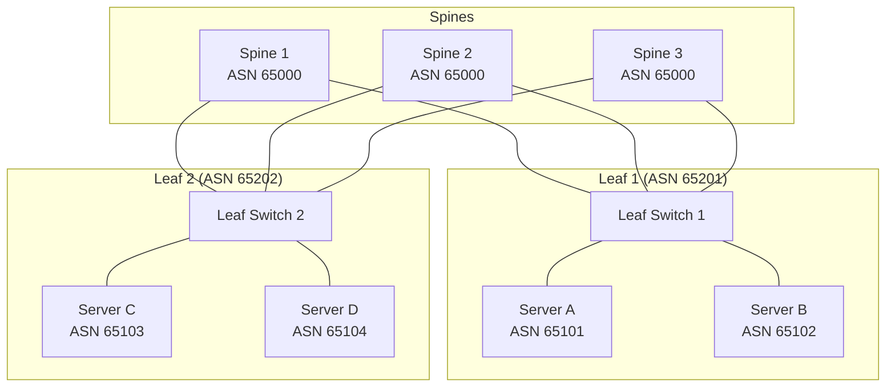
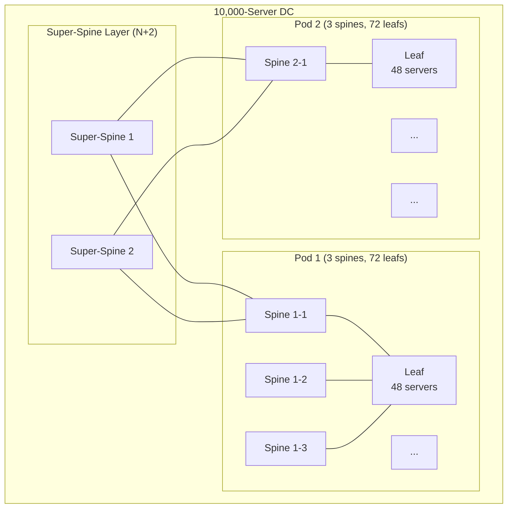

## Keywords in This File
{: .no_toc }

| # | Keyword | Weight |
|---|---|---|
| 24 | [Network Architecture for Large-Scale Distributed Systems](#network-architecture-for-large-scale-distributed-systems) | critical |

---

# Network Architecture for Large-Scale Distributed Systems

---
id: CN-024
title: "Network Architecture for Large-Scale Distributed Systems"
category: Computer Networks
difficulty: ★★★
interview_weight: critical
seniority: senior-staff
tags: #spine-leaf #clos #east-west #oversubscription #bgp #datacenter #network-design
---

## Quick Reference

**One-line definition:** Large-scale distributed systems require datacenter networks designed for east-west traffic (service-to-service within the datacenter) rather than north-south (client-to-server); the dominant architecture is the spine-leaf (Clos) topology which provides predictable, equal-cost paths between any two servers, low latency, and horizontal scalability; modern datacenters use BGP as the routing protocol at every layer including inside the server itself.

**Difficulty:** ★★★ | **Asked at:** Senior-Staff | **Seniority:** Senior through Staff

---

### 🎯 Model Answer

**30 seconds:**
Large-scale distributed systems changed datacenter network design. Old designs were tree-shaped (north-south: clients to servers) with oversubscribed uplinks at every layer. Modern designs are spine-leaf (Clos network): every leaf switch connects to every spine switch; any server can reach any other server in exactly 2 hops with equal-cost multipath (ECMP). This eliminates oversubscription bottlenecks, provides linear horizontal scalability, and enables east-west traffic (service-to-service calls) at line rate. BGP runs between leaf and spine switches (eBGP) and between server and leaf (BGP unnumbered) for the fastest convergence and maximum flexibility.

**3 minutes:**
**East-west vs north-south shift:** Traditional applications had one or few tiers (web frontend, database). Modern distributed systems (microservices, MapReduce, Spark, distributed databases) have thousands of services calling each other. This traffic is east-west (server-to-server within the DC) rather than north-south (from internet to server). A 3-tier tree topology (access -> aggregation -> core) handles north-south well but creates an oversubscribed bottleneck at the aggregation layer for east-west traffic.

**Spine-leaf (Clos) topology:** Every leaf switch connects to every spine switch. No direct leaf-to-leaf connections. Any server can reach any other server in exactly 2 hops: server -> leaf -> spine -> leaf -> server. This enables ECMP across all spine switches: a flow from server A to server B has N equal-cost paths (one through each spine). N spines = N equal-cost paths = N times bandwidth. Adding more spines scales east-west bandwidth linearly.

**Oversubscription ratio:** Ratio of downlink bandwidth (to servers) to uplink bandwidth (to spines). A leaf with 48 x 25Gbps server ports (1200Gbps down) and 8 x 100Gbps uplinks (800Gbps up) has oversubscription ratio 1200:800 = 1.5:1. Traditional aggregation layers had 20:1 or higher oversubscription. Spine-leaf aims for 1:1 or 2:1 for performance-sensitive workloads.

**BGP in the datacenter:** BGP replaces traditional OSPF/IS-IS for leaf-spine routing. Reasons: fine-grained prefix control (advertise specific prefixes, not all routes), route filtering (leaf only advertises its own server prefixes), multi-vendor support (BGP is universal; OSPF implementations differ). BGP unnumbered (RFC 5549) allows BGP sessions over IPv6 link-local addresses without IP address assignment on each interface - simplifying provisioning.

**Blank Mind Recovery:** Spine-leaf = every leaf connects to every spine = N hops for any server pair = ECMP across all spines. East-west = service-to-service traffic. Oversubscription = downlink/uplink ratio. BGP = routing protocol in modern DCs (not OSPF). 

---

### 📘 Concept Explanation

**Core concept:** Network architecture for distributed systems is a capacity planning and topology problem: the network must carry as much east-west traffic as compute generates, with low latency and no single points of failure. Spine-leaf with ECMP is the solution to all three requirements simultaneously.

**Traditional 3-tier tree topology (the problem it solves):**

```
           [Core]
          /      \
    [Aggr]        [Aggr]
   /     \       /     \
[Acc]   [Acc] [Acc]   [Acc]
 |||     |||   |||     |||
Servers  Srv  Servers  Srv

Oversubscription at each layer:
  Access -> Aggregation: 20:1 typical
  Aggregation -> Core: 5:1 typical

East-west traffic (Server A -> Server B):
  A -> Access1 -> Aggregation -> Aggregation
    -> Access4 -> B
  = 4-6 hops, oversubscribed at aggregation
  = BOTTLENECK for microservices
```

> **Code walkthrough:** WHAT IT SHOWS: the traditional 3-tier tree topology and its east-west traffic path showing oversubscription bottlenecks. KEY MECHANISM: in a 3-tier tree, east-west traffic must traverse up to the aggregation or core layer before descending to the destination; this path passes through oversubscribed uplinks at each layer; 20:1 oversubscription means 20Gbps of downlink traffic competes for 1Gbps of uplink bandwidth. WHY IT MATTERS: microservices generate massive east-west traffic (every API call is multiple service-to-service calls); a 20:1 oversubscription ratio throttles this traffic to 5% of the available server NIC bandwidth; this creates the "network is the bottleneck" scenario that spine-leaf was designed to eliminate. WHAT BREAKS: burst traffic at aggregation layer creates hot spots; queue buildup at aggregation switches causes latency spikes across all services even when individual server pairs have low traffic; eliminating the aggregation layer eliminates this shared bottleneck. TAKEAWAY: the number of hops and the oversubscription ratio at each hop determine east-west bandwidth; minimizing both is the design goal of spine-leaf.

**Spine-leaf (Clos) topology:**

```
   [Spine1] [Spine2] [Spine3] [Spine4]
      ||||      ||||      ||||      ||||
      ||\\      //||      ||\\      //||
      || Leaf1  || \\     || Leaf2  ||
      ||/------\||  \----/||/------\||
     Leaf1    Leaf2    Leaf3    Leaf4
      |||      |||      |||      |||
     Srv     Srv      Srv      Srv

Every leaf connects to every spine:
  4 spines x 4 leafs = 16 inter-switch links
  Any server pair = 2 hops (leaf->spine->leaf)
  4 ECMP paths (one through each spine)

Bandwidth: 4 x 100Gbps spines = 400Gbps
  east-west per leaf pair
ECMP: hash flow across spines by 5-tuple
  -> traffic distributed across all spines

Scale out: add 1 spine = +100Gbps east-west
  capacity for ALL leaf-to-leaf pairs
  no reconfiguration needed
```

> **Code walkthrough:** WHAT IT SHOWS: the spine-leaf topology with equal connections from every leaf to every spine and the resulting ECMP paths. KEY MECHANISM: equal-cost multipath (ECMP) distributes flows across all spine switches using 5-tuple hash (src IP, dst IP, src port, dst port, protocol); each unique flow follows a consistent path (prevents reordering); adding a spine switch increases east-west bandwidth for ALL leaf pairs simultaneously without reconfiguring anything. WHY IT MATTERS: horizontal scalability is the key property - a 3-tier tree requires redesign to scale; a spine-leaf network scales by adding spine switches; this matches the horizontal scaling philosophy of distributed systems. WHAT BREAKS: ECMP's 5-tuple hashing can create hot spots when flows are few or use the same 5-tuple pattern (e.g., a single large Kafka replication flow between two specific servers gets only 1 spine, not all 4); use Flowlet Switching or fine-grained ECMP to mitigate. TAKEAWAY: spine-leaf is the de facto standard for new datacenter construction because it provides predictable performance, equal paths, and linear scalability; all major cloud providers use variants of this topology.

**ECMP and flow hash:**

```bash
# View ECMP routes on a Linux server:
ip route show | grep "nexthop"
# Example:
# default
#   nexthop via 10.0.1.1 dev eth0 weight 1
#   nexthop via 10.0.2.1 dev eth1 weight 1
# = 2 equal-cost paths to default gateway

# Test which path a specific flow uses:
# Kernel ECMP hash: based on src IP, dst IP,
# src port, dst port, protocol
# Same 5-tuple -> same path every time
# (prevents packet reordering)

# For multiple connections:
# Each uses different (randomized) source port
# -> different ECMP hash -> different spine
# -> traffic distributed across spines

# Verify ECMP distribution (network level):
# On Cisco/Arista spine switches:
# show ip route 10.0.0.0/8
# show ip bgp 10.0.0.0/8
# Check: multiple equal-cost next-hops listed

# sysctl for ECMP:
sysctl net.ipv4.fib_multipath_hash_policy
# 0 = L3 only (src/dst IP hash)
# 1 = L4 (5-tuple hash, recommended)
sysctl -w net.ipv4.fib_multipath_hash_policy=1
```

> **Code walkthrough:** WHAT IT SHOWS: Linux ECMP configuration and the multipath hash policy that determines how flows are distributed across equal-cost paths. KEY MECHANISM: `fib_multipath_hash_policy=1` enables 5-tuple hashing (src IP, dst IP, src/dst ports, protocol); this ensures packets in the same TCP/UDP flow always take the same path (critical for TCP which requires in-order delivery); different connections to the same destination take different paths based on source port variation. WHY IT MATTERS: without 5-tuple hashing (policy=0), the hash is only on IP addresses; all traffic between two specific servers takes the same path regardless of connection count; this defeats ECMP load balancing for server-to-server communication. WHAT BREAKS: UDP flows (like Kafka) use ephemeral source ports for each message; they distribute well across ECMP paths; TCP long-lived connections (database) from one server to another always take the same path; add connection pooling with port randomization to distribute TCP across ECMP paths. TAKEAWAY: always set `fib_multipath_hash_policy=1` on Linux servers in ECMP environments; the default policy=0 concentrates all traffic between two IPs on one path, wasting ECMP capacity.

**BGP as datacenter routing protocol:**

```
eBGP topology:
  Server ASN: 65100 (each server = unique ASN)
  Leaf ASN: 65200-65299 (each leaf = unique)
  Spine ASN: 65000 (all spines share one ASN)

  Server -> Leaf: eBGP (different ASN)
    Server advertises: /32 host route for itself
    Leaf learns: server's IP via BGP

  Leaf -> Spine: eBGP (different ASN)
    Leaf advertises: /32 routes for all servers
    Spine learns: all server routes via all leafs
    (ECMP: same /32 reachable via multiple leafs)

  Spine -> Leaf (return): eBGP
    Spine advertises: default route 0.0.0.0/0
    OR: /32 routes from all other leafs
    (prefix-dependent: scale vs granularity trade-off)

BGP convergence on failure:
  Server down -> leaf detects (BFD < 1s) ->
  leaf withdraws /32 -> all spines update ->
  no traffic sent to dead server
  Convergence: < 1-2 seconds (with BFD)

VS OSPF:
  OSPF floods entire topology database
  BGP shares only prefixes (not topology)
  = BGP has lower control-plane overhead at scale
```

> **Code walkthrough:** WHAT IT SHOWS: the eBGP ASN design for a datacenter where each server, leaf, and spine has a distinct ASN, enabling fine-grained route control. KEY MECHANISM: each server announces only its own /32 host route to the leaf; the leaf announces all server /32s to the spines; spines learn all host routes with ECMP next-hops (multiple leaf paths); BFD (Bidirectional Forwarding Detection) runs alongside BGP sessions and detects link failures in < 1 second, triggering faster convergence than BGP timers alone. WHY IT MATTERS: BGP /32 host routes allow fine-grained traffic engineering - individual servers can be moved, decommissioned, or their traffic redirected by manipulating BGP advertisements; OSPF's link-state flooding makes this granular control harder. WHAT BREAKS: a BGP configuration error (wrong ASN, wrong peer IP) brings down the entire server's connectivity; BGP misconfigurations in datacenter fabrics are high-impact; use BGP validation and pre-commit checks. TAKEAWAY: BGP unnumbered (using IPv6 link-local addresses for peering) eliminates IP address assignment on switch interfaces, simplifying fabric provisioning; most modern datacenter OS (Arista EOS, Cumulus Linux) support BGP unnumbered natively.

The following diagram shows the spine-leaf topology with ECMP paths.

```
Servers:    A    B    C    D
            |    |    |    |
Leaf:    [Leaf1]   [Leaf2]
           ||\\    //||
           || \\  // ||
           ||  \\//  ||
           ||  //\\  ||
           || //  \\ ||
Spine:  [Spine1] [Spine2]

Server A -> Server C:
  2 ECMP paths:
  A->Leaf1->Spine1->Leaf2->C
  A->Leaf1->Spine2->Leaf2->C
  (ECMP hash distributes flows)

Any-to-any: always 2 hops (Leaf->Spine->Leaf)
```

> **Diagram walkthrough:** WHAT IT DEPICTS: a two-spine, two-leaf Clos topology showing the equal-cost paths between servers on different leafs. HOW TO READ IT: servers connect to their local leaf; leafs connect to all spines; any server-to-server path traverses exactly 2 inter-switch hops; two spines provide two ECMP paths for any server pair. KEY RELATIONSHIP: adding a third spine adds a third ECMP path for ALL server pairs simultaneously; this is the linear scalability property of spine-leaf. EDGE CASE: servers on the same leaf communicate directly via the leaf (1 hop, not 2); local traffic bypasses the spines entirely; this is an advantage for co-located services (same rack = lower latency). INSIGHT: the equal number of hops between any two servers is the key performance property; in a 3-tier tree, servers on the same switch have 2-hop paths while servers across aggregation have 4-hop paths; this latency inequality complicates service placement optimization.



> **Diagram walkthrough:** WHAT IT DEPICTS: a three-spine, two-leaf Clos topology with BGP ASN assignments showing the eBGP peering structure. HOW TO READ IT: each element has a unique ASN (Autonomous System Number); solid lines represent eBGP peering sessions; spines share ASN 65000 (multiple spines = same routing domain); each leaf has its own ASN; each server has its own ASN for per-host BGP advertisement control. KEY RELATIONSHIP: eBGP between different ASNs provides natural route filtering - a leaf only learns routes from its directly connected servers and the spines; it never learns routes from other leafs directly (spine acts as route reflector). EDGE CASE: all three spines share ASN 65000; BGP's AS_PATH loop prevention would normally reject routes that have already passed through AS 65000; this requires `allowas-in` configuration on the leaf-to-spine sessions to accept routes that traversed spines. INSIGHT: the ASN-per-server design gives operators per-server traffic steering capability; if server A has a network issue, its BGP session can be taken down (or route withdrawn) to immediately remove it from all routing tables across the fabric.

---

### 💻 Code Example

**BAD: Oversubscribed 3-tier tree for east-west heavy workload**

```
# BAD DESIGN: Traditional 3-tier for microservices
# (conceptual - not runnable)

# Access switch: 48 x 1Gbps server ports
# Uplinks: 2 x 10Gbps (20Gbps up)
# Downlinks: 48Gbps total
# Oversubscription: 48:20 = 2.4:1

# Aggregation switch: receives from 4 access
# Total access downlinks: 4 x 20Gbps = 80Gbps
# Uplinks to core: 2 x 40Gbps = 80Gbps
# Oversubscription: effectively 1:1 at aggregation
# (but access is already 2.4:1 oversubscribed)

# Result: microservice at 1Gbps server NIC
# Gets: 1Gbps / 2.4 = ~417Mbps effective east-west
# throughput when all servers active
#
# For 100 servers x 1Gbps = 100Gbps aggregate
# Available east-west: ~40Gbps (2.4x overhead)
# = 60% of bandwidth wasted at access layer
```

> **Code walkthrough:** WHAT IT SHOWS: the bandwidth calculation for a traditional 3-tier tree showing that oversubscription wastes 60% of server NIC bandwidth for east-west traffic. KEY MECHANISM: 2.4:1 oversubscription means each server can only use 1/2.4 of its NIC bandwidth for east-west traffic before hitting the uplink bottleneck; for a 1Gbps NIC, effective east-west throughput is ~417Mbps. WHY IT MATTERS: microservices with high east-west traffic (Kafka, distributed caching, gRPC service mesh) saturate oversubscribed uplinks; the result is application latency proportional to oversubscription ratio. WHAT BREAKS: the oversubscription problem is worse during burst traffic; all services are non-uniformly active; when a Spark job or database backup runs, it saturates the access uplinks and degrades all other services on the same access switch. TAKEAWAY: oversubscription ratio is the primary design parameter for east-west traffic; document it explicitly for any datacenter design and compare to the traffic pattern of the workload.

**GOOD: Spine-leaf design for microservices**

```bash
# GOOD DESIGN: Spine-leaf for east-west
# Leaf switch configuration (Cumulus Linux / FRR BGP):

# /etc/frr/frr.conf on Leaf1:

# BGP unnumbered (no IP address needed on interface)
router bgp 65201
  bgp router-id 10.0.1.1

  # Peer with all spine switches:
  neighbor swp1 interface remote-as 65000
  neighbor swp2 interface remote-as 65000
  neighbor swp3 interface remote-as 65000
  # swp1-3 = physical ports to spine 1-3

  # Address family: IPv4 unicast
  address-family ipv4 unicast
    # Only advertise directly connected networks
    # (server subnets on this leaf)
    redistribute connected
    # Do NOT redistribute spine routes back
    # (prevents routing loops)
    neighbor swp1 prefix-list SERVERS-ONLY out
    neighbor swp2 prefix-list SERVERS-ONLY out
    neighbor swp3 prefix-list SERVERS-ONLY out
  exit-address-family

# Only advertise server /32 routes to spines:
ip prefix-list SERVERS-ONLY permit 10.10.0.0/24 le 32
ip prefix-list SERVERS-ONLY deny 0.0.0.0/0 le 32
```

> **Code walkthrough:** WHAT IT SHOWS: FRR (Free Range Routing) BGP configuration for a leaf switch using BGP unnumbered to peer with three spine switches. KEY MECHANISM: BGP unnumbered uses IPv6 link-local addresses for the BGP session establishment, eliminating the need to assign IP addresses to each inter-switch link; `redistribute connected` advertises only the directly connected server subnets; the prefix-list SERVERS-ONLY ensures the leaf never advertises spine routes back to the spines (which would create routing loops). WHY IT MATTERS: this configuration is the standard for leaf switches in a datacenter fabric; it gives the leaf full control over what routes it originates (only its own servers), preventing route leakage between fabric segments. WHAT BREAKS: if `redistribute connected` is used without a prefix-list filter, the leaf would advertise all its connected routes including loopback and spine-facing interfaces; this pollutes the route table and can create routing loops. TAKEAWAY: always pair `redistribute connected` with an outbound prefix-list that matches only the server subnets; this is non-negotiable in datacenter BGP configurations.

```bash
# ECMP configuration on leaf (FRR):
router bgp 65201
  bgp maximum-paths 4
  # Allow up to 4 equal-cost paths
  # for ECMP across spines

# Verify ECMP paths to a server:
vtysh -c "show ip route 10.10.1.5/32"
# Expected:
# B>* 10.10.1.5/32 [20/0]
#   via 169.254.0.1, swp1, ...  <- Spine1
#   via 169.254.0.2, swp2, ...  <- Spine2
#   via 169.254.0.3, swp3, ...  <- Spine3
#   (3 ECMP paths to this server)
```

> **Code walkthrough:** WHAT IT SHOWS: BGP ECMP configuration allowing up to 4 equal-cost paths, and the command to verify that a specific server's /32 route has multiple ECMP next-hops. KEY MECHANISM: `bgp maximum-paths 4` tells BGP to install up to 4 equal-cost BGP paths into the FIB (Forwarding Information Base); each path goes via a different spine; traffic is distributed across paths using the hash policy. WHY IT MATTERS: without maximum-paths, BGP installs only one best path; even with multiple spines, only one is used; setting maximum-paths to at least the number of spine switches is mandatory to achieve ECMP across all spines. WHAT BREAKS: BGP adds a next-hop as ECMP only if the paths are truly equal-cost (same BGP weight, local preference, AS path length, and MED); a single mis-configuration that changes one path's attributes removes it from ECMP consideration. TAKEAWAY: verify ECMP path count with `show ip route` after any fabric change; confirm the number of via entries matches the number of spine switches; fewer entries means ECMP is not fully configured.

---

### 🎓 Answers by Seniority

**Junior / Mid-level answer:**
Large-scale distributed systems generate massive east-west traffic (servers talking to other servers). The spine-leaf topology handles this: every leaf switch connects to every spine switch, creating equal-cost paths between any two servers. You add more spine switches to increase bandwidth. BGP is used for routing between switches, allowing fine-grained control over which routes are advertised. Oversubscription ratio (downlinks vs uplinks) should be low (1:1 to 2:1) for high-performance workloads.

**Senior / Staff answer:**
Network architecture for distributed systems starts with traffic pattern analysis: what is the east-west to north-south ratio? What are the burst traffic patterns (Spark job, Kafka replication)? The spine-leaf topology is the standard answer for east-west-heavy workloads, but the design parameters matter: oversubscription ratio (target 1:1 for database/storage, 2:1 for compute), number of spines (more = more ECMP paths = more bandwidth), ECMP hash policy (5-tuple for per-flow distribution, flowlet for better balancing of elephant flows). BGP in the datacenter gives fine-grained route control: each server can be individually added or removed from routing by manipulating BGP advertisements; this enables graceful server decommissioning, blue-green deployments at the network layer, and anycast routing for service discovery. The emerging challenge at scale: BGP control-plane convergence time during large-scale failures (100+ servers failing simultaneously, e.g., power domain failure); BFD sub-second detection + BGP withdrawals + FIB updates across 1000+ switches must complete within the application's retry timeout (typically 5-30 seconds); at very large scale, event-driven architectures and circuit breakers must compensate for the control-plane convergence gap.

---

### ⚠️ Common Misconceptions

**Misconception 1: "Spine-leaf is only for cloud providers"**
Spine-leaf is appropriate for any datacenter with more than 2-4 racks of servers running east-west-heavy workloads. Even a 3-rack cluster with Kafka, Elasticsearch, or distributed databases benefits from spine-leaf's equal-cost paths and lack of oversubscribed aggregation layers. The minimum practical spine-leaf is 2 spine + 4 leaf switches.

**Misconception 2: "ECMP eliminates hot spots"**
ECMP eliminates structural bottlenecks (aggregation layer) but not hash-based hot spots. A 4-spine fabric with one large flow (elephant flow) between specific servers uses only 1 spine for that flow (consistent 5-tuple hash). All other traffic between those servers also uses the same spine. ECMP hot spots are mitigated by flowlet switching (short bursts on different paths) or weighted ECMP.

**Misconception 3: "BGP is only for the internet"**
BGP is widely used inside datacenters for the reasons described: prefix control, multi-vendor support, and route filtering. The eBGP-in-datacenter pattern was popularized by Facebook (paper: "Elastic Routing" 2014) and Cumulus Networks. All major datacenter OS (Arista EOS, Cisco NX-OS, Cumulus Linux, Juniper Junos) support datacenter BGP.

**Misconception 4: "Adding more spine switches is always beneficial"**
Adding spines increases east-west bandwidth between all leaf pairs (ECMP paths). But: more spines mean more fiber/cable runs (each spine needs a port on every leaf); leaf switches have limited ports (adding spines consumes ports that could connect servers); there is a sweet spot (typically 4-8 spines) beyond which the port cost exceeds the bandwidth benefit. For higher bandwidth: use higher-speed links (100G -> 400G) rather than more spines.

**Misconception 5: "Network partition = datacenter network failure"**
"Network partition" in distributed systems (CAP theorem) usually refers to unreachable nodes due to software failures, process crashes, or application-layer network issues - not physical datacenter network failures. The spine-leaf network provides redundant paths; a physical network partition (no path between two nodes) is extremely rare with proper spine-leaf + BFD design. Most "network partitions" in real systems are application-layer issues (misconfigured firewall, service crash, connection pool exhaustion).

---

### 🚨 Failure Modes and Diagnosis

**Failure 1: Single spine switch failure causing east-west degradation**

```bash
# Symptom: 25% latency increase for all inter-rack
# traffic, 1 spine in 4-spine fabric is down

# Diagnose: check ECMP path counts on leaf:
# SSH to leaf switch:
vtysh -c "show ip route summary"
# Look for: routes with 4 ECMP paths vs 3
# A route that should have 4 paths
# but shows 3 has lost a spine next-hop

# Verify BGP sessions:
vtysh -c "show bgp summary"
# Output:
# Neighbor     AS  Up/Down  State/PfxRcd
# 169.254.0.1  65000  5d   200      <- Spine1: UP
# 169.254.0.2  65000  NEVER  Active <- Spine2: DOWN
# 169.254.0.3  65000  5d   200      <- Spine3: UP
# Active = BGP session down, no routes received

# Traffic impact: 25% of flows that were
# hashed to Spine2 now have no path;
# ECMP reconverges to remaining 3 spines
# Time to reconverge: 1-5 seconds (with BFD)
# During convergence: those flows are dropped

# Check BFD status:
vtysh -c "show bfd peers"
# BFD peer to Spine2: state=DOWN, diag=no-diag
```

> **Code walkthrough:** WHAT IT SHOWS: diagnosing a spine switch failure using BGP session status and BFD (Bidirectional Forwarding Detection) on the leaf switch. KEY MECHANISM: BGP `show bgp summary` shows session state (Active = no connection); BFD is a fast hello protocol that detects link failures in 300ms-1 second (vs BGP holddown timer of 90 seconds); when BFD detects the link down, it immediately withdraws BGP routes for that peer; ECMP removes the failed spine from the next-hop list. WHY IT MATTERS: without BFD, BGP takes 90 seconds to detect a peer failure (holddown timer); 90 seconds of blackholing 25% of east-west traffic is unacceptable; BFD reduces this to < 1 second. WHAT BREAKS: BFD itself can cause false positives (spurious link down events) under high CPU load; configure BFD minimum interval to 300ms (not 50ms) to reduce false positives on loaded switches. TAKEAWAY: always pair BGP with BFD in datacenter fabrics; the combination provides < 1 second failure detection and traffic re-convergence; document the expected convergence time for your fabric and compare it to application retry timeouts.

**Failure 2: ECMP hash imbalance (elephant flow)**

```bash
# Symptom: one spine switch is saturated
# while others are 20% utilized
# during a large data transfer

# Diagnose: check per-spine traffic:
# On monitoring system:
# Grafana: 'interface_tx_bytes_total' per spine
# Expected: all spines similar utilization
# Actual: Spine1 = 95%, Spine2-4 = 20%

# Identify elephant flow:
# On leaf switch:
vtysh -c "show ip route 10.10.2.5/32"
# All traffic to 10.10.2.5 hashes to Spine1
# because src/dst IP hash -> same spine for
# all connections between server pair A,B

# Check flow table (if available):
# Arista EOS:
# show hardware capacity counters
# show ip hardware forwarding-table detail

# Mitigation: enable flowlet switching
# (breaks elephant flows into smaller flowlets
# that can take different ECMP paths)
# Arista: "load-balance profile adaptive"
# Linux kernel 4.4+:
sysctl net.ipv4.fib_multipath_use_neigh=1
# (use neighbor info for ECMP hash variation)

# Or: use application-level striping
# (multiple connections from different ports
# will hash to different ECMP paths)
```

> **Code walkthrough:** WHAT IT SHOWS: diagnosing ECMP hash imbalance where a single large flow saturates one spine while others are underutilized. KEY MECHANISM: ECMP 5-tuple hashing is deterministic; for a given (src IP, dst IP, src port, dst port, protocol), the flow always takes the same path; if one server is sending a large file to another with a single TCP connection, all traffic uses one spine; other spines remain idle. WHY IT MATTERS: elephant flows (single large TCP connections) consistently land on one ECMP path; this is the primary cause of ECMP underutilization in datacenter networks; at 10Gbps, one elephant flow can saturate one spine while others carry only smaller flows. WHAT BREAKS: flowlet switching breaks elephant flows into variable-length flowlets (25-50 microsecond gaps between burst) and can place each flowlet on a different ECMP path; this reduces hash imbalance but adds complexity and slight latency variance. TAKEAWAY: for workloads with known elephant flows (database backups, large object storage transfers), design with flowlet switching or application-level multi-connection striping; monitoring per-spine utilization is essential to detect hash imbalance early.

---

### 🎯 Interview Deep-Dive

| Format | Questions | Est. Time |
|---|---|---|
| Junior/Mid | 12 questions | 35-45 min |
| Senior/Staff | 12 questions + deep-dives | 55-70 min |

**Category: CONCEPT**

**[JUNIOR] Q1 - [CONCEPTUAL] Why is spine-leaf better than 3-tier tree for microservices?**

Three-tier tree topology (access -> aggregation -> core) was designed for north-south traffic: users connect from the internet, traffic flows to servers, responses go back. The bottleneck is vertical: uplinks from access to aggregation.

Microservices generate east-west traffic: Service A calls Service B, C, D. In a 3-tier tree, east-west traffic must go up to aggregation (or core) and back down. All east-west traffic competes for the same oversubscribed uplinks. Result: east-west bandwidth is a fraction of server NIC bandwidth.

Spine-leaf advantages:
1. **Equal paths:** Any server pair is exactly 2 hops (leaf -> spine -> leaf). No path is longer.
2. **ECMP:** Multiple spines provide multiple equal-cost paths between any leaf pair. More spines = more bandwidth.
3. **No oversubscription at aggregation:** There IS no aggregation layer. Leafs connect directly to spines.
4. **Horizontal scalability:** Add spines = add bandwidth for all pairs simultaneously.

The fundamental principle: Clos network provides non-blocking bandwidth between all ports. If the leaf-to-spine links have sufficient capacity, no server should be bandwidth-limited by the network.

*What separates good from great:* Non-blocking: a Clos network is "non-blocking" if it can simultaneously route all inputs to all outputs without contention; achieving true non-blocking requires leaf uplink bandwidth equal to downlink bandwidth (1:1 oversubscription).

---

**[MID] Q2 - [CONCEPTUAL] What is oversubscription and what ratio is appropriate for different workloads?**

Oversubscription ratio = total downlink bandwidth (to servers) / total uplink bandwidth (to spine).

Example: Leaf switch with 48 x 25Gbps server ports (1200Gbps down) and 8 x 100Gbps spine ports (800Gbps up) = 1200:800 = 1.5:1 oversubscription.

Meaning: if ALL servers transmit at 100% simultaneously, there is only 800/1200 = 67% of the bandwidth available for uplink; 33% of traffic is dropped or buffered.

**Appropriate ratios by workload:**

1:1 (non-blocking):
- High-performance computing (HPC): every node generates traffic at full NIC rate
- All-flash storage (NVMe): I/O-intensive with no caching
- High-frequency trading: deterministic latency, no drops acceptable
- Cost: expensive (many high-speed uplink ports)

2:1 to 3:1:
- Distributed databases (Cassandra, MongoDB): burst replication, steady-state is lower
- Kafka clusters: bulk replication is bursty, not continuous
- Most cloud workloads: sufficient for typical application traffic patterns

4:1 to 6:1:
- Compute clusters (batch jobs): bursty traffic, idle between jobs
- Development environments: low average utilization

20:1 (legacy 3-tier):
- Web hosting with database on same network: north-south dominant, low east-west
- Inappropriate for microservices (overloads aggregation during deployment or batch)

*What separates good from great:* The relationship between oversubscription and tail latency - even moderate oversubscription (2:1) causes P99 latency spikes when all servers generate burst traffic simultaneously; for latency-sensitive services (payment processing, real-time APIs), the oversubscription must be 1:1.

---

**[SENIOR] Q3 - [MECHANISM] How does BGP converge after a spine switch failure in a datacenter fabric?**

Step-by-step convergence:

1. **Physical failure detected (T=0):** Link between leaf and spine goes down (fiber cut, power failure).

2. **BFD detects link failure (T=50-300ms):** BFD (Bidirectional Forwarding Detection) sends sub-second hello packets on each BGP session. BFD minimum interval: 300ms (3x 100ms intervals). BFD detects link down within one hello interval.

3. **BGP session torn down (T+300ms):** BFD signals BGP that the peer is down. BGP marks all routes learned from the failed spine as invalid.

4. **Route withdrawal (T+300ms):** BGP withdraws all routes that used the failed spine as next-hop. The FIB (forwarding table) is updated immediately.

5. **ECMP reconvergence (T+300ms):** Routes that had ECMP paths including the failed spine now have one fewer path. Traffic is redistributed across remaining spines. The reconvergence is instantaneous (FIB update removes the failed next-hop).

6. **Traffic impact:** Flows that were actively using the failed spine experience 1-2 packet drops during the FIB update window (~1ms). TCP retransmits these lost packets automatically. Applications see < 1 packet's worth of latency increase.

7. **Spine failure affects all leaves (T+300ms - T+1s):** Each leaf independently detects its own BFD failure to the spine and updates its own FIB. The failure propagates to all leaves within 1 second.

*What separates good from great:* The application impact distinction: flows on the failed spine experience 1-2 packet drops (TCP retransmit ~1RTT delay); flows on other spines are unaffected; the ~25% throughput reduction (for 4-spine, 1 down) persists until the spine is repaired; capacity planning must account for this N-1 degradation scenario.

---

**[SENIOR] Q4 - [MECHANISM] Explain how ECMP handles an "elephant flow" problem and the solutions.**

Elephant flow problem: ECMP assigns each flow (unique 5-tuple) to a path using a hash. A single large TCP connection (elephant flow) - like a database backup or large object upload - always takes the same path. This flow can saturate one spine's link capacity. Other spines remain underutilized. The network has bandwidth (on unused spines) but the elephant flow can't use it.

Solutions:

**1. Flowlet switching (hardware-based):**
A "flowlet" is a burst of packets within a single flow separated by an inter-packet gap > 50 microseconds. When a gap occurs, the switch rehashes the flow to a potentially different ECMP path. Large files are transmitted in bursts; gaps occur during TCP window filling or CPU context switches. Flowlet switching distributes the bursts of one logical flow across multiple paths.

**2. Application-level parallel connections:**
The application opens multiple TCP connections for the same transfer (each with different source port). Each connection gets a different ECMP hash and different spine. Effective for applications that support parallel connections (S3 multipart upload, HDFS block distribution). This is why S3 uses multiple parallel connections for large uploads.

**3. Weighted ECMP / spraying (data center specific):**
Some datacenter switches support "per-packet ECMP" or "packet spraying" - each packet in a flow uses a different ECMP path. This maximizes path utilization but requires packet reordering handling at the destination (more complex).

**4. Larger link bundles (workaround, not solution):**
Increase the leaf-to-spine link speed (e.g., 40G -> 100G -> 400G). One elephant flow at 40G saturates a 40G link but is only 40% of a 100G link. This raises the ceiling but doesn't solve the underlying imbalance.

*What separates good from great:* S3 multipart uploads as a concrete application of parallel connections - AWS explicitly recommends multipart for objects > 100MB, and the reason is partly network utilization (parallel connections use multiple ECMP paths) not just error recovery; this shows the connection between application-level design and network topology.

---

**[SENIOR] Q5 - [DEBUGGING] How do you diagnose that your datacenter network is causing application latency?**

Step 1: Isolate network vs application latency:
```bash
# Measure baseline server-to-server RTT:
ping -c 100 <other-server>
# Check P99 RTT; same-rack should be < 0.1ms
# Cross-rack (leaf-spine-leaf) should be < 0.5ms
# If P99 > 1ms: switch buffering or congestion

# Measure with iperf3 (bulk bandwidth):
# Server 1 (receiver):
iperf3 -s

# Server 2 (sender):
iperf3 -c <server1> -P 4 -t 30
# -P 4: 4 parallel streams (tests ECMP distribution)
# Expect: near-line-rate (25Gbps for 25G NIC)
# If <<25Gbps: congestion or ECMP imbalance
```

> **Code walkthrough:** WHAT IT SHOWS: baseline network RTT measurement with ping and bulk throughput test with iperf3 using multiple parallel streams. KEY MECHANISM: ping measures round-trip latency; P99 latency (99th percentile) reveals switch buffer latency under load; iperf3 with -P 4 (4 parallel streams) tests ECMP distribution; each stream has a different 5-tuple and should hash to a different spine. WHY IT MATTERS: application latency diagnosis requires separating network latency from application processing time; if ping P99 is 5ms on a same-rack path (expected < 0.1ms), the network is introducing latency before the application processes anything. WHAT BREAKS: iperf3 requires firewall rules to allow TCP connections on port 5201; in production, run on a dedicated monitoring interface or use an existing open port. TAKEAWAY: maintain baseline network performance metrics (RTT and throughput between all server pairs) and alert when they deviate; a latency increase from 0.1ms to 1ms on a same-rack pair is a network problem, not an application problem.

Step 2: Check switch buffer utilization (sign of congestion):
```bash
# On Arista EOS switch (example):
show interfaces counters queue
# Shows output queue depth per port
# High queue: congestion on that port

# Check ECN (Explicit Congestion Notification):
# Linux: check if ECN is enabled:
sysctl net.ipv4.tcp_ecn
# 0 = disabled, 1 = enabled (recommended)

# ECN marks packets instead of dropping them
# at congestion; applications can adapt
# faster than TCP retransmit-based detection
```

> **Code walkthrough:** WHAT IT SHOWS: monitoring switch output queue depth (a sign of congestion) and checking if ECN (Explicit Congestion Notification) is enabled on servers. KEY MECHANISM: switch output queues build up when input traffic exceeds output link capacity; high queue depth causes increased latency (packet waits in queue); ECN marks packets with a "congestion experienced" bit when queues reach a threshold, allowing TCP to reduce send rate before queues overflow and drops occur. WHY IT MATTERS: brief switch queue buildups cause millisecond latency spikes invisible to network monitoring tools but visible in application P99/P999 latency; enabling ECN converts packet drops to rate reductions, maintaining TCP connections without retransmission delays. WHAT BREAKS: ECN requires support from both endpoints (sender and receiver); if one endpoint doesn't support ECN, the ECN bits are ignored and packets are still dropped under congestion. TAKEAWAY: enable ECN on all servers in the datacenter (`sysctl -w net.ipv4.tcp_ecn=1`); pair with DCTCP (Data Center TCP) for microsecond-level congestion control; these settings reduce P99 latency under load.

*What separates good from great:* DCTCP (Data Center TCP) as the optimal congestion control for spine-leaf networks - DCTCP uses ECN marks to reduce congestion window proportionally, maintaining queue depths at near-zero while preserving throughput; the default Cubic TCP reduces window by 50% on any congestion signal, which causes throughput oscillation inside a datacenter.

---

**Category: DESIGN**

**[SENIOR] Q6 - [DESIGN] How do you scale a spine-leaf network beyond the limits of a single-tier spine?**

A single-tier spine has port limits: a spine switch might have 64 x 100Gbps ports. If all 64 ports connect to leaf switches, you have a maximum of 64 leaf switches. To scale beyond this:

**Option 1: Super-spine (3-tier Clos):**

```
[Super-spine1] [Super-spine2]
     |||              |||
  [Spine-pod1]    [Spine-pod2]
   /  |  \         /  |  \
[L1][L2][L3]   [L4][L5][L6]
|||  |||  |||   |||  |||  |||
Srv  Srv  Srv   Srv  Srv  Srv
```

> **Code walkthrough:** WHAT IT SHOWS: a 3-tier Clos topology (leaf-spine-super-spine) for scaling beyond single-tier spine limits. KEY MECHANISM: pods group a set of leafs with their local spines; multiple pods connect to super-spines; any two servers in different pods communicate via leaf -> spine -> super-spine -> spine -> leaf (4 inter-switch hops); within a pod, paths are still 2 hops. WHY IT MATTERS: real hyperscale datacenters (Facebook's Altoona, Google's Jupiter) use 3-5 tier Clos networks; the principles of ECMP and equal-cost paths apply at every tier. WHAT BREAKS: 3-tier Clos doubles the hop count for cross-pod traffic (2 -> 4 hops); each additional hop adds 1-5 microseconds latency; for ultra-latency-sensitive applications, co-locate within the same pod to use 2-hop paths. TAKEAWAY: when a single-tier spine is insufficient, add a super-spine tier; design pods to co-locate services that communicate most frequently (same pod = 2 hops vs cross-pod = 4 hops).

**Option 2: Link aggregation (higher-speed links):**
Replace 100Gbps links with 400Gbps or 800Gbps links. Each spine port provides 4x bandwidth. This delays the need for a super-spine tier.

**Option 3: Multi-plane fabric (multiple independent spine planes):**
Build two or more completely independent spine planes (Spine-plane-A and Spine-plane-B). Each leaf connects to spines in both planes. Traffic distributes across both planes. Total bandwidth: 2x single plane. If one plane fails: 50% capacity (graceful degradation).

*What separates good from great:* Google's Jupiter network design (published 2015) uses a multi-plane Clos network with software-defined routing that provides high bisection bandwidth; naming a real-world implementation shows the architecture is used at extreme scale, not just theoretical.

---

**[SENIOR] Q7 - [TRADE-OFF] What are the trade-offs between eBGP, OSPF, and IS-IS for datacenter routing?**

**eBGP in datacenter (modern standard):**
Pros:
- Fine-grained prefix control (advertise exactly what you want)
- Route filtering at policy level (prefix-lists, route-maps)
- Multi-vendor: BGP is universal
- BGP unnumbered simplifies interface configuration

Cons:
- More complex configuration than OSPF
- Manual ASN assignment required
- BGP is designed for policy routing; some operators find it overcomplicated for DC use

**OSPF (Link-State IGP):**
Pros:
- Simple configuration (just enable on interfaces)
- Fast convergence (LSA flooding)
- Widely understood

Cons:
- Floods entire topology database to all routers; all routers have all routes
- No easy way to prevent specific routes from propagating (no prefix-level filtering without complex route-maps)
- Large networks: OSPF database becomes large, increases CPU/memory

**IS-IS (also Link-State):**
Pros:
- Used by hyperscalers (Google's original Jupiter network used IS-IS)
- Slightly more scalable than OSPF (fewer SPF calculations)
- Good multi-vendor support

Cons:
- Less commonly configured; fewer engineers know it
- More complex troubleshooting

**Decision:** For new datacenter fabrics: eBGP. For existing OSPF deployments: keep OSPF if it's working. For hyperscale: eBGP for edge flexibility, IS-IS or OSPF within pods.

*What separates good from great:* The fundamental difference - BGP is a path-vector protocol (route-level control); OSPF/IS-IS are link-state protocols (topology-level); BGP is better for policy, OSPF/IS-IS are better for autonomous convergence; datacenter use cases (granular control, multi-vendor) align better with BGP.

---

**Category: BEHAVIORAL**

**[SENIOR] Q8 - [BEHAVIORAL] Describe an experience where network architecture became a bottleneck for a distributed system.**

Situation: A company's analytics platform processed 1TB of data per hour using Spark. They ran 200 worker nodes on a 3-tier tree network with 4:1 oversubscription at the aggregation layer. Shuffle operations (every reduce task reads data from all map tasks) generated massive east-west traffic. Spark job duration was 45 minutes for a 1TB job.

Problem: Network was saturating the aggregation layer during shuffle phases. iperf3 tests showed effective east-west bandwidth of only 25% of server NIC capacity. Switch queue depths spiked to 100% during shuffle.

Action:
1. Analyzed traffic pattern: 80% of traffic was east-west shuffle; aggregation layer was the bottleneck.
2. Proposed spine-leaf migration: 4 spine + 8 leaf switches, 1.5:1 oversubscription (vs existing 4:1).
3. Calculated ROI: network cost (hardware + cabling + maintenance) vs cost of 45-minute jobs that could be reduced to 12-15 minutes. 3x job reduction -> 3x cluster capacity without new servers.
4. Implemented in phases: new switches for half the cluster, validated with shadow Spark jobs.
5. Full migration: job duration dropped from 45 to 12 minutes.

Result: 3.75x improvement in job completion time on the same compute hardware. Network was definitively the bottleneck, not CPU or storage.

*What separates good from great:* The ROI calculation tying network cost to compute utilization - framing the network upgrade as "equivalent to 3x the compute capacity" made the business case compelling to non-technical stakeholders; pure technical arguments about oversubscription ratios are less persuasive than "same compute, 3.75x more throughput."

---

**[SENIOR] Q9 - [MECHANISM] How does VXLAN extend layer 2 across a spine-leaf fabric?**

VXLAN (Virtual Extensible LAN) encapsulates layer 2 Ethernet frames in UDP/IP packets, allowing virtual LANs to span physical network boundaries (across leafs and spines).

How it works:
- Each leaf switch is a VTEP (VXLAN Tunnel Endpoint)
- A VM on Leaf1 wants to reach a VM on Leaf2
- Both VMs are on the same "virtual LAN" (VXLAN VNI = virtual network identifier)
- Leaf1 encapsulates the VM's Ethernet frame: outer IP/UDP header + VXLAN header + inner Ethernet frame
- The encapsulated packet is a normal IP/UDP packet traversing the spine-leaf fabric
- Leaf2 decapsulates the packet and delivers the inner Ethernet frame to the VM

BUM (Broadcast, Unknown Unicast, Multicast) handling:
- Traditional Ethernet needs L2 broadcast (ARP) to discover MAC addresses
- VXLAN solves this with either multicast (for BUM traffic) or EVPN (BGP-based MAC learning)
- Modern DCs use EVPN: BGP distributes MAC/IP associations (MAC routing); no multicast needed

EVPN + VXLAN:
- Each leaf learns which MACs are behind it (from its local VMs)
- Leaf advertises MAC/IP -> VXLAN next-hop via BGP EVPN (address-family l2vpn evpn)
- Other leafs receive these routes and know: "MAC XX:XX:XX is at VTEP 10.0.0.1"
- ARP requests are suppressed at the leaf (leaf responds with known MAC locally)

*What separates good from great:* ARP suppression in EVPN - instead of flooding ARP requests to all VTEPs (expensive at scale), EVPN-enabled leafs answer ARP queries locally from the BGP-learned MAC/IP table; this eliminates broadcast storms in large VXLAN overlays.

---

**[SENIOR] Q10 - [MECHANISM] How does anycast routing work in a datacenter for service distribution?**

Anycast assigns the same IP address to multiple servers. The routing fabric (BGP) routes each client's connection to the nearest (in routing terms) anycast server. Different clients reach different servers based on their network location.

Use cases:
- DNS resolvers: root DNS servers use anycast (same IP from hundreds of locations)
- CDN points of presence: same IP, nearest PoP serves the request
- Kubernetes service load balancing (Cilium uses anycast-like IP assignment)

How it works in datacenter:
- Multiple servers announce the same IP prefix (/32) via BGP
- BGP selects the "best" route based on: AS_PATH length, lowest latency (MEDs)
- ECMP: if multiple servers have equal-cost paths, BGP ECMP distributes flows across them
- Failover: if one server fails, its BGP session drops, routing falls back to remaining servers

Anycast vs load balancer:
- Load balancer: central point (single IP), distributes to backend pool
- Anycast: distributed (same IP on all backends), routing protocol distributes traffic
- Anycast failover is faster (BGP convergence < 1s) vs LB health check polling (5-30s)
- Anycast doesn't support session affinity easily (same client may reach different servers on different connections)

*What separates good from great:* The session affinity problem - anycast routes each connection independently; a stateful service (needs session data from previous connection) must use distributed session storage (Redis, Cassandra) accessible from all anycast nodes; stateless services (like DNS, CDN) are ideal for anycast.

---

**[SENIOR] Q11 - [TRADE-OFF] How does network architecture affect distributed consensus algorithms (Raft, Paxos)?**

Distributed consensus requires a majority quorum to agree on each operation. The network properties that matter:

**Latency:** Raft commit latency = 2 x RTT (leader -> follower -> leader). A 5-node cluster with 3 followers in a different rack (cross-rack RTT = 500 microseconds with spine-leaf) has commit latency ~1ms. With a 20:1 oversubscribed 3-tier tree, RTT spikes to 5ms under load -> commit latency 10ms.

**Packet loss:** Even 0.1% packet loss causes TCP retransmissions. Raft leader -> follower replication: a single lost segment stalls replication until retransmit (~300ms with default timers). In a cluster with 0.1% loss: expected stall every 1000 replication RPCs -> significant P99 degradation.

**Partition tolerance:** A spine switch failure partitions the fabric if servers in both halves cannot reach the majority. In a 5-node Raft cluster:
- 3 nodes in one rack, 2 in another
- Spine fails: all cross-rack paths lost
- If 3-node side has the majority: cluster continues
- If the split is 2/2/1 across three racks: no majority -> cluster stops

**Design implications:**
- Distribute consensus nodes across failure domains (racks, power domains) to survive single failures
- Place the majority in one region/AZ if availability > consistency
- Spine-leaf with 1:1 oversubscription: RTT < 0.5ms, enabling < 1ms commit latency
- Enable DCTCP + ECN: prevents TCP retransmit-induced latency spikes

*What separates good from great:* Naming the specific Raft commit latency formula (2xRTT) and calculating the production impact; showing that network design choices directly influence the SLA achievable by the consensus layer.

---

**[STAFF] Q12 - [DESIGN] Design the complete network architecture for a new datacenter serving a globally distributed SaaS application with 10,000 servers.**

**Requirements:**
- 10,000 servers, 25Gbps NICs
- 50% east-west traffic (microservices)
- 50% north-south (user API traffic)
- 5 nines availability (< 5 minutes downtime/year)
- Peak east-west bandwidth: 100Tbps aggregate

**Network Architecture:**

1. **Layer 1: Server NICs**
   - Each server: 2 x 25Gbps NICs (active-active LACP bond)
   - Effective: 50Gbps per server (bonded)
   - 10,000 servers: 500Tbps total NIC capacity
   - Requirement: east-west = 250Tbps (50%)

2. **Layer 2: Leaf switches**
   - Leaf spec: 48 x 25Gbps server ports + 8 x 100Gbps uplinks
   - Servers per leaf: 48 servers
   - Total leafs: 10,000 / 48 = 208 leaf switches (round to 216)
   - Uplink bandwidth per leaf: 800Gbps
   - Downlink bandwidth per leaf: 48 x 50Gbps (bonded) = 2400Gbps
   - Oversubscription: 2400:800 = 3:1
   - Acceptable for mixed microservice/batch workload

3. **Layer 3: Spine switches**
   - Each spine: 64 x 100Gbps ports
   - Connects to: 64 leaf switches
   - Need: 216 leafs; group into pods: 3 pods of 72 leafs each
   - Spines per pod: 72 leafs x 100Gbps = 7.2Tbps; each spine = 6.4Tbps (64 ports)
   - Spines per pod: 72/64 = 2 (add 1 for redundancy = 3 spines per pod)

4. **Layer 4: Super-spine**
   - 3 pods; inter-pod traffic requires super-spine
   - Super-spine: 48 x 100Gbps = 4.8Tbps per switch
   - 3 pods x 3 spines = 9 spine uplinks needed per super-spine
   - Super-spine count: 6 (provides N+2 redundancy)

5. **Routing:**
   - Servers: BGP unnumbered to leaf (per-server /32 advertisement)
   - Leaf to spine: eBGP (ASN per leaf, spine ASN 65000 within pod)
   - Spine to super-spine: eBGP (pod ASN scheme)
   - BFD on all BGP sessions: sub-second failure detection

6. **North-south: Edge layer**
   - 16 x edge routers (BGP to upstream ISPs, Anycast IPs for services)
   - 4 x DDoS scrubbing appliances inline
   - Edge load balancers (L4): distribute to service clusters
   - CDN offload: static content served from CDN (reduces north-south by 60%)

7. **High availability:**
   - All servers: dual NIC, dual leaf (one NIC to each of 2 leaf switches)
   - Each leaf: 3 spines (N+1 redundancy)
   - Each pod: 3 super-spines (N+2)
   - Power: A+B feeds to all switches, servers
   - Single switch failure: traffic reconverges via ECMP in < 1 second

8. **Monitoring:**
   - Streaming telemetry from all switches (gRPC, 10-second intervals)
   - Per-link utilization alerting (>80% = capacity warning)
   - BGP session monitoring (all sessions expected to be ESTABLISHED)
   - BFD session health checks

*What separates good from great:* The capacity math - working through the actual numbers (10,000 servers, 3:1 oversubscription, pod/spine/super-spine sizing) shows architectural reasoning, not just vocabulary; the ability to size a datacenter network from requirements to switch count is a Staff-level skill.

---

### ⚖️ Comparison Table

| Topology | East-West Scaling | Oversubscription | Path Length | Best For |
|---|---|---|---|---|
| 3-tier tree | Poor (aggregation bottleneck) | 20:1 typical | 4-6 hops | Legacy north-south |
| 2-tier Spine-leaf | Linear (add spines) | 1:1 to 3:1 | 2 hops | Microservices, distributed systems |
| 3-tier Clos | Linear at pod level | 1:1 within pod | 4 hops cross-pod | Hyperscale (10k+ servers) |
| Fat-tree | Non-blocking at design point | 1:1 | 4 hops | HPC, research |

> **Diagram walkthrough:** WHAT IT DEPICTS: a comparison of four datacenter network topologies across east-west scalability, oversubscription ratio, path length, and optimal use case. HOW TO READ IT: Path Length is the most important for latency-sensitive workloads; Oversubscription is most important for throughput-sensitive workloads; East-West Scaling determines whether the topology can grow with the workload. KEY RELATIONSHIP: spine-leaf optimizes for the east-west + low-latency combination required by microservices; 3-tier tree is sufficient for north-south-dominant workloads; choosing the wrong topology for the workload is a capacity planning mistake that is expensive to correct. EDGE CASE: fat-tree (Fattree topology from research) is theoretically optimal (non-blocking) but requires specific radix switches and a full Clos matrix wiring; it is more common in academic HPC clusters than production datacenters. INSIGHT: the gap between 3-tier tree (20:1) and spine-leaf (3:1) oversubscription explains the 5-7x improvement in east-west throughput seen when migrating; this is why the migration is often justified purely by eliminating the need for additional compute hardware.

---

### 🏛️ System Design

**Design the network infrastructure for a financial trading platform requiring ultra-low latency (<10 microseconds server-to-server), 99.999% availability, and deterministic performance with no packet loss.**

**Requirements:**
- < 10 microseconds server-to-server RTT
- Zero packet loss (trading errors from reordering/retransmit are costly)
- Deterministic latency (P99.99 < 20 microseconds)
- 99.999% availability (< 5 minutes downtime per year)

**Architecture:**

1. **Physical layer (ultra-low latency):**
   - Direct copper cabling (not fiber): 1ns per 20cm vs 5ns per meter for fiber
   - Maximum cable length: 5 meters between co-located servers
   - NIC selection: Mellanox ConnectX-7 with RDMA/RoCE (Remote Direct Memory Access over Converged Ethernet)
   - RDMA bypasses kernel networking stack: end-to-end latency ~1-2 microseconds

2. **Switch selection:**
   - Cut-through switching: Broadcom Trident or Mellanox Spectrum switches
   - Cut-through forwarding: first bit out before last bit in (~300ns latency)
   - vs Store-and-forward: receive entire packet before forwarding (~1-5 microseconds)
   - Single-tier switching: all trading servers connected to the SAME switch fabric
   - No spine-leaf: even one extra switch hop adds 1-3 microseconds

3. **Network topology: Non-blocking crossbar**
   - All trading servers on the same non-blocking switch fabric
   - Zero oversubscription (1:1)
   - If servers exceed one switch's port count: two switches in crossbar configuration
   - Crossbar: every port on Switch A connects to every port on Switch B

4. **QoS and Priority:**
   - Order traffic: highest priority (Strict Priority Queue)
   - Market data: high priority
   - Risk/compliance: normal priority
   - Admin/monitoring: lowest priority
   - PFC (Priority-based Flow Control): pauses specific priority traffic during congestion
   - ECN on all ports: congestion signaled before drops

5. **RDMA / RoCE v2:**
   - Trading applications use RDMA for kernel-bypass communication
   - Latency: 1-2 microseconds (vs 20-100 microseconds for TCP socket)
   - Requires: lossless Ethernet (PFC) or Routable RDMA (RoCE v2 with ECN)
   - Eliminates: TCP overhead, interrupt-driven I/O, memory copy

6. **Availability:**
   - Dual-homed to two independent switch fabrics (active-active)
   - Each switch: dual power supplies, hot-swap line cards
   - BFD interval: 50ms (fastest possible without false positives)
   - Failover: < 100ms for any single switch failure
   - Geographic redundancy: hot standby site with pre-positioned switches

7. **Monitoring (without adding latency):**
   - Hardware timestamping on all NICs (nanosecond precision)
   - Passive monitoring: traffic mirror to out-of-band monitoring switch
   - No inline monitoring appliances (add latency)
   - FPGA-based latency measurement: timestamps at switch ingress/egress

**Key trade-offs:**
- RDMA (ultra-low latency) vs TCP (error recovery): trading platforms accept RDMA's complexity because the latency difference (1us vs 100us) is decisive
- Single-tier (lower latency) vs spine-leaf (higher scale): for trading, scale is secondary to latency; 100-500 servers fit on one high-radix switch
- PFC (zero-loss) vs ECN (some loss): trading platforms use PFC to prevent any drops; this requires careful fabric engineering to prevent PFC pause propagation (deadlock)

*What separates good from great:* RDMA/RoCE as the specific technology for ultra-low latency - kernel bypass networking is the only way to achieve sub-10-microsecond server-to-server latency; TCP's interrupt handling and kernel stack traversal adds 20-100 microseconds minimum; naming Mellanox ConnectX as a specific NIC product shows real implementation knowledge.

---

### 📊 Diagram

```
Spine-Leaf East-West Path:
  +---------+   +---------+
  | Server A|   | Server C|
  +---------+   +---------+
       |              |
  +--------+    +--------+
  | Leaf 1 |    | Leaf 2 |
  +--------+    +--------+
      |  \      /  |
      |   \    /   |
      |    \  /    |
  +-------+ +-------+
  |Spine 1| |Spine 2|
  +-------+ +-------+

A -> C: 2 ECMP paths
  Path 1: A -> L1 -> Spine1 -> L2 -> C
  Path 2: A -> L1 -> Spine2 -> L2 -> C
  Always exactly 2 inter-switch hops
```

> **Diagram walkthrough:** WHAT IT DEPICTS: a minimal spine-leaf topology showing two equal-cost paths between servers on different leaf switches. HOW TO READ IT: vertical arrows show server-to-leaf connections (always 1 hop); diagonal lines show leaf-to-spine connections; the two paths from A to C use the same leaf switches but different spines. KEY RELATIONSHIP: both paths have exactly the same number of hops (2 inter-switch hops); this is the equal-latency property of Clos networks that enables predictable application performance. EDGE CASE: if Server A and Server C were on the same leaf, the path would be 0 inter-switch hops (direct leaf forwarding); co-locating high-bandwidth service pairs on the same leaf is a valid latency optimization. INSIGHT: the "exactly 2 hops" property is what makes latency predictable; in a 3-tier tree, some server pairs are 2 hops and others are 6 hops; application latency is unpredictable because service placement determines which paths are used.



> **Diagram walkthrough:** WHAT IT DEPICTS: a 3-tier Clos topology for a 10,000-server datacenter showing super-spine, pod-level spines, and leaf switches. HOW TO READ IT: each pod contains a set of leaf switches (each connecting 48 servers) and a local spine layer (3 switches); pods connect to super-spines for inter-pod traffic; N+2 super-spines provide resilience. KEY RELATIONSHIP: within a pod, traffic takes 2 inter-switch hops (leaf-spine-leaf); across pods, traffic takes 4 hops (leaf-spine-super-spine-spine-leaf); pod design should co-locate frequently communicating services. EDGE CASE: all 3 spines in a pod can fail simultaneously (power domain failure); this isolates the pod from other pods but intra-pod traffic still flows via the local spines; this failure mode must be accounted for in service placement. INSIGHT: at 10,000 servers, the super-spine layer exists only for inter-pod traffic; keeping traffic within a pod (by co-locating dependent services) reduces average path length from 4 to 2 hops and halves inter-switch-hop latency.
