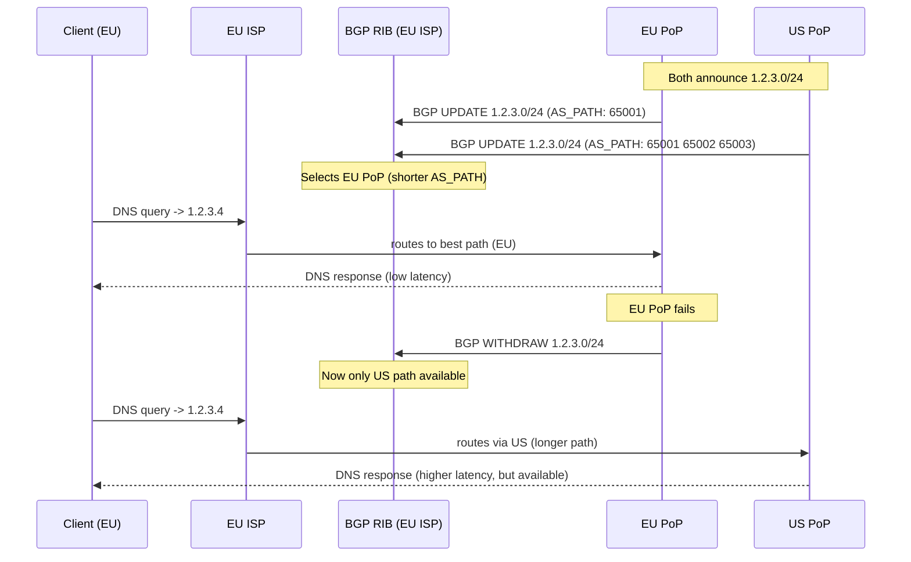
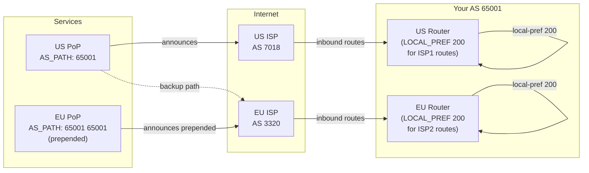

## Keywords in This File
{: .no_toc }

| # | Keyword | Weight |
|---|---|---|
| 25 | [BGP, Anycast, and Multi-Region Traffic Engineering](#bgp-anycast-and-multi-region-traffic-engineering) | critical |

---

# BGP, Anycast, and Multi-Region Traffic Engineering

---
id: CN-025
title: "BGP, Anycast, and Multi-Region Traffic Engineering"
category: Computer Networks
difficulty: ★★★
interview_weight: critical
seniority: senior-staff
tags: #bgp #anycast #traffic-engineering #multi-region #as-path #meds #routing
---

## Quick Reference

**One-line definition:** BGP (Border Gateway Protocol) is the routing protocol that glues the internet together - every major cloud provider, CDN, and ISP uses BGP to exchange routing information; anycast assigns the same IP prefix to multiple geographic locations so the routing fabric directs each user to the nearest server; multi-region traffic engineering uses BGP attributes (AS path, MED, local preference, communities) to steer traffic toward preferred regions, balance load across regions, and failover automatically when a region fails.

**Difficulty:** ★★★ | **Asked at:** Senior-Staff | **Seniority:** Senior through Staff

---

### 🎯 Model Answer

**30 seconds:**
BGP is how the internet routes packets between autonomous systems (ISPs, cloud providers, enterprises). Each AS has a unique ASN and advertises IP prefixes. BGP selects the best path using attributes: AS_PATH (prefer fewer hops), LOCAL_PREF (prefer exits), MED (prefer specific ingress), and Communities (tags for policy). Anycast assigns the same IP to multiple locations; BGP routes each user to the nearest location. Traffic engineering uses these attributes to control which region receives traffic - useful for failover, cost optimization, and latency routing.

**3 minutes:**
**BGP fundamentals:** BGP operates between autonomous systems (AS) - independently administered networks. eBGP (external BGP) runs between different AS; iBGP runs within one AS. Each router maintains a BGP routing table (RIB - Routing Information Base) with all known paths to all prefixes. Best-path selection is deterministic based on attribute priority: weight (Cisco-local) -> LOCAL_PREF -> locally-originated -> AS_PATH length -> ORIGIN -> MED -> eBGP over iBGP -> lowest IGP cost to next-hop -> lowest router ID. The winner is installed in the FIB.

**Anycast:** Multiple routers in different locations advertise the same IP prefix (/24 or /32). BGP routes each client to the "nearest" (best-path) location based on AS_PATH length and latency. Anycast is used for DNS (root servers - same IP from 800+ locations), CDN PoPs (same IP, nearest PoP answers), and anycast load balancing (same VIP from multiple DCs). Anycast failover: if one location withdraws its BGP advertisement, clients are automatically routed to the next-best location - BGP converges in seconds.

**Multi-region traffic engineering:** BGP attributes allow fine-grained traffic steering:
- LOCAL_PREF: set higher on preferred region's routes to make that region the default exit
- AS_PATH prepending: artificially lengthen the AS_PATH on less-preferred advertisements to make competitors prefer another path
- MED (Multi-Exit Discriminator): tell upstream ISPs which of your entry points is preferred
- BGP Communities: tag routes with metadata (e.g., "do not re-advertise to peers", "set local pref 100 at provider X")

**Active-active multi-region:** All regions advertise the same prefixes, BGP distributes users to nearest region. Requires: session state replication across regions (or stateless services), global load balancer or anycast IP for ingress.

**Active-passive (failover):** Primary region advertises, secondary uses AS_PATH prepending (longer path). Traffic normally goes to primary; if primary withdraws, BGP routes to secondary. BGP convergence on failover: 30-90 seconds (BGP holddown timers) unless BFD is used (sub-second).

**Blank Mind Recovery:** BGP = routing between networks (AS). ASN = identifier for an AS. Anycast = same IP from multiple locations. AS_PATH prepending = make this path look longer (less preferred). LOCAL_PREF = tell your routers which exit to prefer. Failover = withdraw the prefix, traffic moves to next-best path.

---

### 📘 Concept Explanation

**Core concept:** BGP is a policy routing protocol - it doesn't find the shortest path (that's OSPF's job); it applies business and operational policies to select paths. Understanding BGP means understanding how internet-scale routing decisions are made and how operators influence them.

**BGP path selection (simplified priority order):**

```
BGP Best Path Selection (abbreviated):

1. WEIGHT (Cisco-proprietary, local only)
   Higher = better. Set per-neighbor policy.
   Used to prefer one upstream ISP over another.

2. LOCAL_PREF (iBGP, within one AS)
   Higher = better. Default: 100.
   "Prefer routes learned from this neighbor."
   Use: prefer Region A exits over Region B.

3. Locally-originated routes
   (routes injected by this router itself)
   Always preferred over learned routes.

4. AS_PATH length
   Shorter = better.
   A path through 3 AS is preferred over 4 AS.
   AS_PATH prepending: artificially adds
   your own ASN to make path LOOK longer.

5. ORIGIN (i < e < ?)
   i = IGP (most trusted),
   e = EGP (external),
   ? = incomplete.

6. MED (MULTI_EXIT_DISC)
   Lower = better.
   Tells neighboring AS which entry is preferred.
   Only compared between routes from SAME AS.

7. eBGP over iBGP paths
   External paths preferred over internal.

8. Lowest IGP cost to next-hop
   "Hot potato routing": exit at closest egress.

9. Lowest Router ID (tie-breaker)
   Deterministic, ensures consistent selection.
```

> **Code walkthrough:** WHAT IT SHOWS: the BGP best-path selection order showing how attributes are evaluated in priority sequence until a winner is found. KEY MECHANISM: BGP evaluates each attribute in order; if a tie exists after applying one attribute, it moves to the next; this means a single high LOCAL_PREF can override a shorter AS_PATH; the priority order is critical to understand when designing traffic engineering policies. WHY IT MATTERS: operators who only know AS_PATH length may wonder why their AS_PATH prepending isn't working; the answer is often that the opponent has a higher LOCAL_PREF at their side, which trumps AS_PATH length; understanding the full priority order is essential for troubleshooting BGP traffic engineering failures. WHAT BREAKS: weight (Cisco-proprietary) is local only; a policy set with weight on Router A does not propagate to Router B; forgetting this causes traffic to use the wrong exit on a different router in the same AS. TAKEAWAY: memorize the top 5 BGP attributes in priority order (Weight, LOCAL_PREF, locally-originated, AS_PATH, ORIGIN); these determine 95% of real-world BGP behavior.

**Anycast mechanics:**

```
Anycast: Same prefix from multiple locations

Client: 8.8.8.8 DNS query (Google DNS anycast)

Internet routing:
  ISP in New York:
    BGP route to 8.8.8.8:
    - via Google New York (AS_PATH: 15169, 2 hops)
    - via Google London (AS_PATH: 15169, 5 hops)
    BGP prefers shorter path -> NY datacenter
    -> Query answered by Google NY

  ISP in Frankfurt:
    BGP route to 8.8.8.8:
    - via Google Amsterdam (AS_PATH: 15169, 2 hops)
    - via Google New York (AS_PATH: 15169, 7 hops)
    BGP prefers shorter path -> Amsterdam DC
    -> Query answered by Google Amsterdam

Failover:
  Google NY datacenter goes offline:
  Google withdraws announcement from NY
  BGP in New York converges (30-90 seconds)
  New York ISP now routes 8.8.8.8 -> London
  Queries from NY now answered by London
```

> **Code walkthrough:** WHAT IT SHOWS: how anycast routing works in practice for Google's 8.8.8.8 DNS service, showing that different geographic clients reach different physical servers despite using the same IP. KEY MECHANISM: anycast relies entirely on BGP shortest-AS_PATH selection; each Google PoP announces the same /32 prefix (8.8.8.8/32); ISPs select the route with the fewest AS hops; since physical distance correlates loosely with AS hop count, clients are generally routed to the nearest PoP. WHY IT MATTERS: anycast provides automatic geographic load distribution and failover without application-level changes; the routing infrastructure handles both functions; this is why anycast is used for global infrastructure services (DNS, NTP, CDN). WHAT BREAKS: anycast routes are not guaranteed to be geographically nearest - AS_PATH length is based on policy, not distance; a shorter AS_PATH might route through a geographically distant but peering-adjacent datacenter; this can cause counterintuitive routing where a user in Brazil is served by a US server because the Brazilian ISP has direct BGP peering with a US PoP. TAKEAWAY: anycast is appropriate for stateless services (DNS, NTP, anycast CDN origin); for stateful services, BGP route changes during failover break existing sessions because the new destination doesn't have session state.

**Multi-region traffic engineering techniques:**

```bash
# Technique 1: AS_PATH prepending
# (advertise secondary region as less preferred)

# Primary region (US-East): normal advertisement
router bgp 65001
  network 203.0.113.0/24
  # Normal announcement: AS_PATH = "65001"

# Secondary region (EU-West): prepend own ASN
router bgp 65001
  network 203.0.113.0/24
  neighbor <upstream-ISP> route-map PREPEND out

route-map PREPEND permit 10
  set as-path prepend 65001 65001
  # AS_PATH will be "65001 65001 65001"
  # (3 hops vs 1 hop for primary)
  # Most ISPs prefer primary

# Technique 2: LOCAL_PREF for egress preference
router bgp 65001
  neighbor <US-ISP> route-map SET-HIGHPREF in
  neighbor <EU-ISP> route-map SET-LOWPREF in

route-map SET-HIGHPREF permit 10
  set local-preference 200
  # Routes learned via US-ISP = LOCAL_PREF 200

route-map SET-LOWPREF permit 10
  set local-preference 100
  # Routes learned via EU-ISP = LOCAL_PREF 100
  # Traffic exits via US-ISP by default
```

> **Code walkthrough:** WHAT IT SHOWS: two BGP traffic engineering techniques - AS_PATH prepending for ingress traffic control and LOCAL_PREF for egress traffic preference. KEY MECHANISM: AS_PATH prepending adds your own ASN multiple times to the AS_PATH attribute on outbound advertisements; other AS's BGP prefers shorter AS_PATHs, so they route to your primary announcement (shorter path) not your prepended announcement (longer path); LOCAL_PREF is set on inbound advertisements and affects which exit your AS uses for outbound traffic. WHY IT MATTERS: AS_PATH prepending controls WHERE traffic enters your network (ingress traffic engineering); LOCAL_PREF controls WHERE your network exits to reach external destinations (egress traffic engineering); both are necessary for complete traffic control in a multi-region, multi-ISP deployment. WHAT BREAKS: AS_PATH prepending is advisory - it works for ISPs that have no higher-priority policy; a large ISP might ignore your prepending because their LOCAL_PREF or weights override it; prepending more than 3 times is generally ineffective and may cause route filtering by some ISPs. TAKEAWAY: use AS_PATH prepending for ingress steering and LOCAL_PREF for egress steering; these are the two most commonly needed BGP traffic engineering tools for multi-region applications.

**BGP failover timing:**

```
BGP session keepalives:
  Keepalive interval: 60 seconds
  Hold time: 180 seconds (3x keepalive)
  Detection: up to 3 missed keepalives = 180s

With BFD (Bidirectional Forwarding Detection):
  BFD min interval: 300ms
  Detection: 1-3 BFD intervals = 300-900ms
  BGP session brought down immediately
  Failover: < 1 second

BGP route withdrawal propagation:
  After session down: router withdraws routes
  Propagation: each hop adds ~50-200ms
  5-hop path: ~1-2 seconds total

Total failover time:
  Without BFD: 180s (3 min) + propagation
  With BFD: 1-2 seconds total

For anycast failover:
  Health check -> trigger withdrawal -> propagate
  Using BFD: ~2 seconds
  Using keepalives only: 3-5 minutes (unacceptable)
```

> **Code walkthrough:** WHAT IT SHOWS: BGP failover timing with and without BFD, showing the dramatic difference between keepalive-based detection (3 minutes) and BFD (1-2 seconds). KEY MECHANISM: BGP's default hold time of 180 seconds means a failed peer isn't detected for up to 3 minutes; BFD sends sub-second hellos independently of BGP and immediately notifies BGP to bring down the session when the peer is unreachable; the combination provides enterprise-grade failover timing. WHY IT MATTERS: 3-minute failover is unacceptable for production services; even 30 seconds is too long for most SLAs; without BFD, BGP is unsuitable as a failover mechanism; with BFD, BGP provides competitive failover times. WHAT BREAKS: BFD is sensitive to CPU overload on the BGP speaker (router or server); if the CPU can't send BFD hellos at 300ms intervals, false positives (unnecessary session teardowns) occur; monitor BFD session stability separately from BGP. TAKEAWAY: always configure BFD alongside BGP for any failover-critical BGP sessions; the 180-second default hold time is appropriate only for paths where slow failover is acceptable.

The following diagram shows BGP anycast routing topology.

```
Anycast Routing:

Same prefix (1.2.3.0/24) from 3 regions:

  [EU Client]    [US Client]    [AP Client]
       |               |              |
   [EU ISP]        [US ISP]       [AP ISP]
       |               |              |
  AS_PATH: 1     AS_PATH: 1     AS_PATH: 1
    (local)        (local)        (local)
       |               |              |
   [EU PoP]        [US PoP]       [AP PoP]
   1.2.3.0/24    1.2.3.0/24    1.2.3.0/24
   (advertised)  (advertised)  (advertised)

  EU client -> EU PoP (shortest AS_PATH)
  US client -> US PoP (shortest AS_PATH)
  AP client -> AP PoP (shortest AS_PATH)

  If US PoP fails -> withdraws 1.2.3.0/24
  US ISP: next-best = EU PoP (longer path)
  US clients -> EU PoP until recovery
```

> **Diagram walkthrough:** WHAT IT DEPICTS: anycast routing where three regional PoPs advertise the same IP prefix and each client is routed to its nearest PoP via BGP shortest-path selection. HOW TO READ IT: each PoP independently announces the same prefix (1.2.3.0/24); the AS_PATH is shortest to the local PoP (1 hop vs 3+ hops for remote PoPs); BGP shortest-AS_PATH selection directs each regional ISP to the local PoP. KEY RELATIONSHIP: anycast routing is fully automatic and requires no application changes; the routing fabric does the geographic distribution; adding a new PoP (new advertisement) automatically attracts traffic from nearby regions. EDGE CASE: two ISPs equidistant from two PoPs receive the same AS_PATH length to both PoPs; BGP tie-breaking (router ID) determines which PoP is selected; this creates asymmetric routing where two clients at the same ISP might reach different PoPs. INSIGHT: anycast requires stateless services because a single session might be routed to different PoPs at different times (route changes between SYN and subsequent packets); DNS and NTP are perfect for anycast; TCP sessions requiring state are problematic unless ECMP routing is consistent per-flow.



> **Diagram walkthrough:** WHAT IT DEPICTS: the full anycast lifecycle including normal operation (routing to nearest PoP), BGP best-path selection, and failover when the nearest PoP withdraws. HOW TO READ IT: the left column (Client, EU ISP, BGP RIB) represents the network near the client; the right two columns (PoP_EU, PoP_US) represent the service PoPs; the BGP UPDATE and WITHDRAW messages show how the routing table changes as PoP availability changes. KEY RELATIONSHIP: the BGP RIB (Routing Information Base) is the decision-maker; it holds all known paths and selects the best; when the preferred path withdraws, the RIB automatically promotes the next-best path without any manual intervention. EDGE CASE: the BGP convergence gap between WITHDRAW and the routing table update (30-90 seconds without BFD) means clients continue sending traffic to the failed PoP during convergence; implementing health-check-triggered route withdrawal with BFD reduces this to < 2 seconds. INSIGHT: the sequence diagram shows that anycast failover is fully automatic at the BGP layer - applications and clients need no knowledge of the failover; the same IP address routes to a different server transparently.

---

### 💻 Code Example

**BAD: Hard-coded regional IPs for multi-region service**

```python
# BAD: Regional IP addresses hard-coded in app config
# No automatic failover, no traffic engineering

REGION_ENDPOINTS = {
    "us-east": "10.1.0.10",
    "eu-west": "10.2.0.10",
    "ap-south": "10.3.0.10",
}

def get_endpoint(user_region):
    # Client-side region detection (fragile)
    # No fallback if region endpoint fails
    return REGION_ENDPOINTS.get(user_region, REGION_ENDPOINTS["us-east"])

# Failover: manual config change + re-deploy
# Traffic engineering: not possible
# Latency routing: based on client-set region,
# not actual network distance
```

> **Code walkthrough:** WHAT IT SHOWS: the anti-pattern of hard-coding regional IPs at the application layer instead of using anycast routing or a global load balancer. KEY MECHANISM: this approach requires the application to know user geography, maintain IP-to-region mappings, and handle failover; when us-east fails, someone must change the config, deploy the change, and wait for applications to restart; the downtime is measured in minutes to hours. WHY IT MATTERS: anycast or DNS-based routing (with short TTLs) fully automates geographic routing and failover; the routing infrastructure already solves this problem; reimplementing it in the application layer adds complexity without benefit. WHAT BREAKS: the regional IP approach breaks when a user's client region detection is wrong (VPN, proxy, mobile roaming); sends traffic to the wrong region entirely. TAKEAWAY: use anycast IPs or DNS-based global load balancing for multi-region routing; never hard-code regional IP logic in the application layer; let the routing infrastructure do what it was designed to do.

**GOOD: Anycast IP with BGP-controlled routing**

```bash
# GOOD: Single anycast IP, BGP routes to nearest PoP

# Each PoP announces the same /32 via BGP:
# /etc/frr/frr.conf on US PoP:
router bgp 65001
  bgp router-id 10.1.0.1
  network 203.0.113.1/32
  # Announces the anycast IP
  neighbor <upstream-ISP-peer> remote-as 7018
  neighbor <upstream-ISP-peer> route-map ANNOUNCE out

route-map ANNOUNCE permit 10
  set community 7018:70  # Do not advertise further
  # Communities control propagation scope

# /etc/frr/frr.conf on EU PoP:
router bgp 65001
  bgp router-id 10.2.0.1
  network 203.0.113.1/32  # SAME IP as US PoP
  neighbor <eu-upstream-ISP-peer> remote-as 3356
  neighbor <eu-upstream-ISP-peer> route-map EU-ANNOUNCE out

route-map EU-ANNOUNCE permit 10
  set community 3356:70

# Health-check triggered withdrawal:
# health_check.sh - run every 5 seconds
#!/bin/bash
if ! curl -sf --max-time 3 http://localhost/health; then
  # Service unhealthy: withdraw BGP announcement
  vtysh -c "conf t" \
        -c "router bgp 65001" \
        -c "no network 203.0.113.1/32"
  logger "BGP: withdrew anycast 203.0.113.1/32"
fi
```

> **Code walkthrough:** WHAT IT SHOWS: BGP configuration for anycast where both PoPs announce the same /32 IP prefix, plus a health-check script that withdraws the announcement if the local service is unhealthy. KEY MECHANISM: both US and EU PoPs run the same BGP router-ID scheme but announce the same prefix; BGP community attributes control how far the prefix is propagated (ISP-specific communities like 7018:70 = "do not export to peers"); the health check withdraws the announcement when the service fails, triggering BGP failover to the other PoP. WHY IT MATTERS: this is the production anycast pattern used by DNS providers, CDNs, and cloud providers; the health-check-triggered withdrawal is essential - without it, BGP continues routing to a failed PoP indefinitely. WHAT BREAKS: the health check script uses vtysh to modify the live BGP configuration; if vtysh fails or the FRR daemon restarts, the withdrawal may not take effect; use a more robust withdrawal mechanism (systemd service that manages BGP advertisement state) in production. TAKEAWAY: health-check-triggered BGP withdrawal is the correct failover mechanism for anycast services; pair it with monitoring to alert when a withdrawal occurs so operations can investigate the root cause.

```bash
# Verify anycast routing from multiple locations:
# From a network looking glass service or your
# own servers in different regions:

# AWS us-east-1 server:
traceroute 203.0.113.1
# Should reach US PoP in < 10 hops

# AWS eu-west-1 server:
traceroute 203.0.113.1
# Should reach EU PoP in < 10 hops
# (different path, same destination IP)

# Verify BGP advertisements:
# Using public BGP looking glass (e.g., RIPE RIS):
# https://stat.ripe.net/203.0.113.1
# Shows: which ASes are announcing this prefix

# On-router verification:
vtysh -c "show bgp ipv4 unicast 203.0.113.1/32"
# Shows: BGP table for this prefix
# Multiple paths = anycast in effect
```

> **Code walkthrough:** WHAT IT SHOWS: verification commands to confirm anycast routing is working correctly from different geographic locations and on the BGP router itself. KEY MECHANISM: traceroute from different regions should show different paths reaching different physical servers at the same IP; if both regions show the same path (same AS hops), the anycast routing is not working (only one PoP is announcing); `show bgp ipv4 unicast` on the router shows all known paths for the prefix. WHY IT MATTERS: verifying anycast routing from multiple geographic vantage points is the only reliable test; routing tables at one location show only local routing, not the global picture; RIPE RIS or BGP.he services provide global BGP visibility. WHAT BREAKS: anycast verification is difficult because you need servers in multiple regions to test from; use cloud VMs (AWS, GCP, Azure) in different regions as test points during setup. TAKEAWAY: add geographic routing tests to the deployment verification checklist for anycast services; a broken anycast configuration (one PoP not announcing) concentrates all traffic on the remaining PoPs and causes unexpected load.

---

### 🎓 Answers by Seniority

**Junior / Mid-level answer:**
BGP is the routing protocol used between different networks (ISPs, cloud providers) to exchange routing information. Each network has an ASN (Autonomous System Number) and advertises IP prefixes it can reach. BGP selects paths based on attributes like AS_PATH length (prefer fewer hops) and LOCAL_PREF (prefer specific exits). Anycast means multiple servers at different locations use the same IP address - BGP routes each client to the nearest one. For multi-region failover, the failed region withdraws its BGP advertisement and traffic routes to the next-best location.

**Senior / Staff answer:**
BGP is a policy routing protocol - unlike OSPF which finds the shortest path, BGP applies business rules to select paths. The key attributes I use for multi-region traffic engineering: AS_PATH prepending (make secondary region look less preferred to upstream ISPs, controlling ingress traffic); LOCAL_PREF (tell our routers which ISP exit to prefer, controlling egress traffic); BGP Communities (attach metadata to routes for ISPs to apply their own policies - e.g., "increase local-pref at Level3"). For anycast, the critical operational concern is health-check-triggered withdrawal - BGP routing a broken PoP is worse than no routing; our anycast services run health checks every 5 seconds and withdraw the BGP announcement if the health check fails 2 consecutive times, triggering failover in < 15 seconds. The subtle challenge in multi-region BGP is asymmetric routing: a user in Germany might reach our US PoP because their ISP has direct BGP peering with our US upstream but only transit access to our EU upstream; this causes higher latency than expected even though EU is geographically closer. Monitoring per-PoP traffic distribution and investigating unexpected asymmetry is part of ongoing traffic engineering maintenance.

---

### ⚠️ Common Misconceptions

**Misconception 1: "Anycast ensures clients reach the geographically nearest server"**
Anycast uses BGP shortest AS_PATH, not geographic distance. A server in Amsterdam might be reached by clients in London if the London ISP has direct peering with Amsterdam but indirect (via US) paths to London. Geographic proximity and BGP routing distance often differ, especially for clients behind ISPs with non-intuitive peering arrangements. Use latency-based routing (DNS-based with latency measurements) for true nearest-server routing.

**Misconception 2: "AS_PATH prepending always works for traffic steering"**
AS_PATH prepending is advisory. An upstream ISP can override it with LOCAL_PREF, which has higher priority in BGP selection than AS_PATH. If your ISP sets LOCAL_PREF 200 for all routes from you (regardless of AS_PATH length), your prepending has no effect. Large ISPs often do this. Always verify traffic steering with actual traffic measurements, not just BGP table inspection.

**Misconception 3: "BGP failover is fast because BGP is a routing protocol"**
Default BGP failover is 3-5 minutes (holddown timer 180s + propagation). BGP was designed for the internet where slow convergence is acceptable. For datacenter and anycast failover, BFD must be paired with BGP to achieve sub-second failure detection. Without BFD, BGP failover is too slow for most production SLAs.

**Misconception 4: "iBGP and eBGP are the same protocol with different scope"**
iBGP (within an AS) and eBGP (between ASes) have critical behavioral differences: iBGP does not change the AS_PATH or next-hop (eBGP does both); iBGP has a "split-horizon" rule - routes learned via iBGP are not re-advertised to other iBGP peers (to prevent loops), requiring route reflectors or full mesh; eBGP adds your ASN to the AS_PATH. Confusing the two causes routing loops and unreachable prefixes.

**Misconception 5: "BGP Communities are standardized globally"**
BGP Communities are agreed between peering parties - each ISP defines their own communities for local policy effects. Community 65001:100 might mean "set LOCAL_PREF 100 at Level3" but has no meaning at another ISP. The meaning of communities must be looked up in each ISP's routing policy documentation. Well-known communities (NO_EXPORT: 0xFFFFFF01, NO_ADVERTISE: 0xFFFFFF02) are standardized (RFC 1997), but vendor-specific communities are not.

---

### 🚨 Failure Modes and Diagnosis

**Failure 1: BGP route leak causing traffic to wrong region**

```bash
# Symptom: traffic from EU clients routing to
# US PoP even though EU PoP is operational

# Diagnose: check BGP table at EU PoP
vtysh -c "show bgp ipv4 unicast 203.0.113.1/32"
# Expected: local route (best) + US route
# Problem: if US route has higher LOCAL_PREF
# or shorter AS_PATH at EU PoP:
# EU traffic exits to US instead of local

# Check what EU upstream ISP is announcing:
vtysh -c "show bgp neighbors <EU-ISP-IP> routes"
# Look for: unexpected 203.0.113.1/32 route
# learned from EU ISP pointing to US PoP
# (EU ISP is re-advertising our US announcement)

# Fix: add NO_EXPORT community to US announcement
# This prevents EU ISP from re-advertising
# the US prefix to EU region

# On US PoP BGP config:
route-map US-ANNOUNCE permit 10
  set community no-export
  # "no-export" = 0xFFFFFF01
  # Instructs all ISPs: do NOT re-advertise
  # this route to their other peers/customers

# Verify fix:
vtysh -c "show bgp ipv4 unicast 203.0.113.1/32"
# EU PoP should now only see: its own local route
# (no longer sees US route re-advertised via EU ISP)
```

> **Code walkthrough:** WHAT IT SHOWS: diagnosing a BGP route leak where a US prefix is being re-advertised by an EU ISP, causing EU clients to route to the US instead of the local EU PoP. KEY MECHANISM: the NO_EXPORT well-known community (0xFFFFFF01) is a BGP standard; any router that receives a route tagged with NO_EXPORT must not re-advertise it to eBGP peers; attaching this to the US announcement prevents EU ISPs from re-advertising it to their own region. WHY IT MATTERS: route leaks cause traffic to travel unexpected paths (higher latency, potentially different legal/compliance jurisdiction); without NO_EXPORT on regional announcements, ISPs freely re-advertise routes to all their customers and peers, causing geographic routing to behave unpredictably. WHAT BREAKS: NO_EXPORT also prevents the US ISP from advertising the US prefix to their other customers and peers; this is usually desired for PoP-specific prefixes but would be wrong for global anycast prefixes that should be visible worldwide. TAKEAWAY: for anycast prefixes that should only be served from a specific region, always tag the advertisement with NO_EXPORT to prevent unintended re-advertisement by upstream ISPs.

**Failure 2: BGP session oscillation causing traffic flapping**

```bash
# Symptom: traffic to anycast IP fluctuates every
# few minutes, causing intermittent failures

# Diagnose: check BGP session stability
vtysh -c "show bgp summary"
# Look for: "Up/Down" column showing recent changes
# "00:02:30" = session established 2.5 minutes ago
# Repeated short up times = session oscillating

# Check BGP log:
tail -f /var/log/frr/bgpd.log | grep -E "ESTABLISHED|IDLE|CONNECT"
# Pattern like:
# BGP: %NOTIFICATION: sent to neighbor 10.0.0.1
#   4/0 (Hold Timer Expired)
# = keepalive not sent in time = hold timer expired

# Check system load (CPU might be preventing
# keepalive timers from firing):
top -d 1
# If CPU > 80%, BGP keepalives may be delayed
# causing hold timer expiration

# Fix: increase hold timer if CPU-limited
router bgp 65001
  neighbor <peer> timers 30 90
  # 30s keepalive, 90s hold time (was 60/180)
  # More frequent keepalives = faster detection
  # But also more sensitive to CPU spikes

# Better fix: decrease keepalive timer
# and enable BFD (separate low-overhead protocol)
router bgp 65001
  neighbor <peer> timers 10 30
  # Fast timers to reduce detection time
  neighbor <peer> bfd
  # BFD handles failure detection independently
```

> **Code walkthrough:** WHAT IT SHOWS: diagnosing BGP session oscillation (session repeatedly going up and down) caused by hold timer expiration, with fixes for both the symptom (timer adjustment) and root cause (BFD). KEY MECHANISM: BGP sends keepalive messages every 60 seconds by default; if 3 keepalives are missed (180 second hold time), the session is declared down; high CPU load can delay keepalive packet sending, causing false hold timer expirations; this creates the oscillation pattern (session comes up, CPU spikes, keepalive misses, session drops, repeat). WHY IT MATTERS: BGP session oscillation causes traffic flapping - traffic alternates between the anycast PoP and fallback with each oscillation; applications experience intermittent failures as routing changes every few minutes. WHAT BREAKS: reducing keepalive interval (to 10 seconds) makes sessions more sensitive to transient CPU spikes; a 12-second CPU spike misses one keepalive and could trigger a session drop; BFD is a better solution because it uses hardware timestamping on the NIC, not software timers. TAKEAWAY: if BGP sessions oscillate, check CPU load first; use BFD instead of relying on software timer-based keepalives for failure detection; BFD is implemented at lower priority and uses hardware timestamping, making it more reliable than BGP keepalives under load.

---

### 🎯 Interview Deep-Dive

| Format | Questions | Est. Time |
|---|---|---|
| Junior/Mid | 12 questions | 35-45 min |
| Senior/Staff | 12 questions + deep-dives | 55-70 min |

**Category: CONCEPT**

**[JUNIOR] Q1 - [CONCEPTUAL] What is BGP and how does it differ from IGP protocols like OSPF?**

BGP (Border Gateway Protocol) is the protocol that routers use to exchange routing information between different networks (Autonomous Systems). An AS is an independently managed network - an ISP, cloud provider, or large enterprise. Every AS has a unique ASN (Autonomous System Number).

Key differences from OSPF (an IGP - Interior Gateway Protocol):

1. **Scope:**
   - OSPF: within one AS (e.g., routes within your company network)
   - BGP: between ASes (e.g., between your company and an ISP)

2. **Goal:**
   - OSPF: finds the shortest path (Dijkstra's algorithm on link costs)
   - BGP: applies policy to select paths (business rules, not just math)

3. **Routing information:**
   - OSPF: shares link-state (full topology, every router knows everything)
   - BGP: shares path vectors (list of ASes traversed; no topology details)

4. **Scale:**
   - OSPF: works for thousands of routes
   - BGP: powers the entire internet (800,000+ prefixes in the global routing table)

5. **Configuration:**
   - OSPF: minimal (enable on interfaces)
   - BGP: explicit neighbor configuration, policy (route-maps, prefix-lists)

The internet is one big BGP network: your ISP has an AS, Google has an AS, AWS has an AS. BGP sessions between them carry routes for all IP prefixes. Your packets reach Google because your router learns Google's prefixes via BGP through your ISP.

*What separates good from great:* The policy vs path nature of BGP - an ISP might have a direct 2-hop path to a destination and a 5-hop path via a partner; if the 5-hop path costs less money (cheaper peering), the ISP might prefer it despite being longer; BGP makes this business decision possible; OSPF only sees topology, not business relationships.

---

**[MID] Q2 - [CONCEPTUAL] What is an Autonomous System and an ASN? Give examples.**

An Autonomous System (AS) is a collection of IP networks managed by a single organization with a common routing policy. The organization decides which routes to accept, filter, and advertise to the internet.

An ASN (Autonomous System Number) is the unique identifier for an AS. Originally 16-bit (1-65535), now 32-bit (1-4294967296). Private ASNs: 64512-65535 (16-bit) and 4200000000-4294967294 (32-bit) - used for internal BGP configurations that don't appear on the internet.

Examples:
- Google: AS15169 (runs Google.com, YouTube, Google Cloud)
- Amazon/AWS: AS16509 (primary AWS ASN; they have dozens)
- Cloudflare: AS13335 (CDN, DNS, Workers)
- AT&T: AS7018 (major US ISP)
- Deutsche Telekom: AS3320 (major EU ISP)

How to look up an ASN:
- `whois 8.8.8.8` -> shows AS15169 (Google)
- BGP looking glass: https://bgp.he.net/ip/8.8.8.8

Peering relationships between ASes:
- Transit: you pay an upstream ISP for global connectivity
- Peering: two networks exchange routes at no cost (mutual benefit)
- Customer: a smaller network pays for access to your network

*What separates good from great:* The commercial relationship structure - transit is paid (you pay an ISP to carry all your traffic globally); peering is free exchange (both ASes benefit); settlement-free peering is how large networks connect directly without payment; understanding this explains why routing is not always shortest-path (it follows commercial interests).

---

**[SENIOR] Q3 - [MECHANISM] Walk through the BGP best-path selection for a specific scenario.**

Scenario: Your router receives two routes for prefix 10.0.0.0/8 from two different BGP peers:
- Path A: via ISP-1 (AS 7018), AS_PATH = "7018 3356 15169", next-hop 192.168.1.1
- Path B: via ISP-2 (AS 3356), AS_PATH = "3356 15169", next-hop 192.168.2.1

Assuming no weight difference:

1. **Weight** (Cisco local): Not set. Tied.
2. **LOCAL_PREF:** Suppose Path A has LOCAL_PREF 200, Path B has LOCAL_PREF 100 (you've set this in your route-map for ISP-1 because it's cheaper). **Path A wins (LOCAL_PREF 200 > 100).** Traffic exits via ISP-1.

Alternate scenario - LOCAL_PREF equal:
1. Weight: tied
2. LOCAL_PREF: both 100. Tied.
3. Locally originated: neither. Tied.
4. **AS_PATH length:** Path A = 3 ASNs (7018, 3356, 15169). Path B = 2 ASNs (3356, 15169). **Path B wins (shorter AS_PATH).** Traffic exits via ISP-2.

This demonstrates why LOCAL_PREF overrides AS_PATH - a business decision (prefer cheaper ISP) can be enforced even when the path is technically longer.

*What separates good from great:* The second scenario result is counterintuitive to engineers who assume shortest-path wins; LOCAL_PREF at priority #2 overrides AS_PATH at priority #4; this is intentional design - policy rules take precedence over topology in BGP.

---

**[SENIOR] Q4 - [MECHANISM] How does BGP prevent routing loops?**

BGP uses the AS_PATH attribute for loop detection. When an AS receives a BGP route, it checks the AS_PATH list. If its own ASN already appears in the list, it discards the route (loop detected).

Example:
- AS1 announces prefix 10.0.0.0/8 with AS_PATH "1"
- AS2 receives it, adds its own ASN: AS_PATH becomes "2 1"
- AS3 receives it, adds its own ASN: AS_PATH becomes "3 2 1"
- AS1 receives the route back (via some path through AS3)
- AS1 sees its own ASN (1) in the AS_PATH
- AS1 discards the route: loop detected

For iBGP (within one AS): no AS_PATH modification occurs (routes aren't re-stamped within an AS). iBGP uses split-horizon: routes learned via iBGP are not re-advertised to other iBGP neighbors. This prevents iBGP loops at the cost of requiring route reflectors or full-mesh iBGP.

Confederations: large AS can be split into sub-ASes (private ASNs) with eBGP sessions between them; externally, the entire organization appears as one AS; internally, sub-AS path tracking prevents loops.

*What separates good from great:* The iBGP split-horizon problem - iBGP doesn't re-advertise routes between iBGP peers, so a router learned a route only if it has a direct iBGP session to the route originator; a 100-router AS needs 4950 iBGP sessions for full mesh; route reflectors solve this by acting as iBGP route redistribution points.

---

**[SENIOR] Q5 - [DEBUGGING] Traffic from certain regions is going to the wrong PoP. Diagnose with BGP tools.**

Step 1: Identify the unexpected behavior:
```bash
# Get user IPs that are reaching wrong PoP
# Check PoP access logs:
grep "X-Forwarded-For\|request_ip" /var/log/nginx/access.log \
  | awk '{print $1}' | sort | uniq -c | sort -rn | head -20
# Identify IPs from unexpected regions
# (EU IPs on US PoP, or similar)
```

> **Code walkthrough:** WHAT IT SHOWS: extracting client IPs from nginx logs to identify which regions are reaching the wrong PoP. KEY MECHANISM: nginx access logs record client IP in the remote_addr or X-Forwarded-For header; sorting and counting IPs helps identify unexpected geographic concentrations; this is the first step in anycast debugging - confirm the symptom before investigating BGP. WHY IT MATTERS: BGP routing changes can redirect whole ISP customer bases to the wrong PoP; identifying the affected IP ranges helps target the BGP investigation. WHAT BREAKS: X-Forwarded-For headers can be spoofed; for security-sensitive analysis, use the actual TCP source IP, not the header. TAKEAWAY: always start anycast debugging by identifying which IPs/networks are reaching which PoPs; this turns a vague "routing is wrong" complaint into a specific "ASN X is routing to US instead of EU" investigation.

Step 2: Check BGP table for the affected IP range:
```bash
# Find which AS is sending the EU traffic to US:
# Use RIPE routing information service:
curl -s "https://stat.ripe.net/data/routing-status/data.json?resource=<affected-IP>&sourceapp=debug"

# On your US PoP BGP router:
vtysh -c "show bgp ipv4 unicast <your-anycast-IP>/32"
# Look for: unexpected paths with SHORT AS_PATH
# from EU region (indicating route leak)

# Check which upstream ISP is sending you the
# EU-region traffic:
vtysh -c "show bgp neighbors <peer-IP> advertised-routes" \
  | grep "203.0.113"
# If EU ISP is advertising your EU prefix to US:
# They are leaking your routes
```

> **Code walkthrough:** WHAT IT SHOWS: using RIPE RIS API and router BGP commands to identify route leaks where EU prefixes are being re-advertised to US PoPs. KEY MECHANISM: RIPE RIS provides global BGP visibility from hundreds of collector points; checking routing status for the affected IP shows which ASes are announcing it and from which locations; if the EU anycast prefix appears in US BGP paths, it has been re-advertised. WHY IT MATTERS: BGP route leaks are a common cause of unexpected anycast routing; a customer of your EU ISP re-announces your prefix globally, causing traffic from anywhere to route to your EU PoP (or in reverse). WHAT BREAKS: RIPE RIS API has rate limits; for operational debugging, use a locally deployed BGP looking glass or a commercial service. TAKEAWAY: RIPE RIS and BGP.he.net are invaluable for debugging anycast routing from a global perspective; learn to use these tools before a production incident, not during one.

*What separates good from great:* The RIPE RIS API call - knowing to use publicly available BGP data sources (RIPE, RouteViews, BGPmon) for global routing visibility shows operational experience beyond just local router commands.

---

**Category: DESIGN**

**[SENIOR] Q6 - [DESIGN] Design a multi-region active-active BGP setup for a global API service.**

Requirements: Global API service, 3 regions (US, EU, AP), all regions active, latency routing, < 30 second failover.

Architecture:

1. **Anycast IP:** Single IP (203.0.113.0/24) announced from all 3 regions simultaneously.

2. **BGP peering per region:**
   - Each region peers with 2+ upstream ISPs (redundancy)
   - Upstream ISPs selected for coverage in target user geography
   - US: peer with Level3 (AS3356) and Comcast (AS7922)
   - EU: peer with Deutsche Telekom (AS3320) and Telia (AS1299)
   - AP: peer with PCCW (AS3491) and Singtel (AS7473)

3. **Route advertising policy:**
   - All regions announce 203.0.113.0/24 without modification
   - NO_EXPORT to prevent ISPs from cross-advertising
   - Result: each region's ISPs only see routes from their local PoP

4. **Failover mechanism:**
   - Health check runs every 5 seconds per PoP
   - On failure: `vtysh -c "no network 203.0.113.0/24"` -> withdrawal
   - BFD on all ISP BGP sessions: 300ms detection
   - BGP withdrawal propagates in < 5 seconds with BFD

5. **Load distribution monitoring:**
   - Traffic per region tracked (bytes/requests per second)
   - Alert: if one region receives > 60% of global traffic (expected 33%)
   - Investigate: route leak, ISP peering change, or capacity imbalance

6. **Session affinity for stateful APIs:**
   - Problem: BGP route change during a session -> different PoP -> lost state
   - Solution 1: stateless API (JWT tokens, no server-side session)
   - Solution 2: distributed session store (Redis Cluster across all regions) - expensive
   - Solution 3: DNS with regional IPs + short TTL (60 seconds) as alternative to anycast for stateful services

*What separates good from great:* The stateful vs stateless distinction for anycast - anycast is ideal for stateless APIs (each request independently routable); for stateful services, either a shared session store or DNS-based routing (with affinity) is required; recognizing this constraint is critical for API design decisions.

---

**[SENIOR] Q7 - [TRADE-OFF] When should you use DNS-based global load balancing vs anycast for multi-region routing?**

**Anycast advantages:**
- Zero application changes (same IP everywhere)
- Fastest failover (BGP convergence < 1-5 seconds with BFD)
- Works at Layer 3 (no DNS overhead)
- No TTL expiration issues (routing changes instantly)
- Ideal for stateless services (DNS, NTP, CDN)

**Anycast disadvantages:**
- Requires BGP infrastructure (your own AS or provider anycast service)
- Route leaks can cause unexpected routing
- No latency-based routing (uses hop count, not measured RTT)
- Session continuity not guaranteed during route changes
- Debugging requires BGP expertise

**DNS-based global LB advantages:**
- Works without BGP infrastructure (cloud DNS does it)
- Supports latency-based routing (AWS Route53, Google Cloud DNS)
- Can implement session affinity (sticky CNAME)
- Granular control (route by country, latency bucket, weighted)
- Easy failover (change DNS record with TTL-based propagation)

**DNS-based disadvantages:**
- DNS caching: failover delay = TTL (minimum 30-60 seconds; clients may cache longer)
- DNS resolver behavior varies (some ignores TTL)
- Extra round-trip for DNS resolution
- Incorrect TTL configuration causes stale routing after failover

**When to choose:**
- Anycast: DNS services, NTP, stateless APIs requiring fast failover
- DNS-based: stateful services, web applications, services requiring latency-based routing or geographic affinity
- Both (hybrid): anycast for global DNS resolution + DNS-based for individual services

*What separates good from great:* DNS TTL caching as the key operational challenge for DNS-based GLB - browsers and OS resolvers cache DNS responses; a client that cached a stale DNS response continues sending to a failed PoP until their TTL expires; 60-second TTL means up to 60 seconds of failed requests after a failover, even if the DNS update is immediate; anycast has no TTL issue.

---

**Category: MECHANISM**

**[SENIOR] Q8 - [MECHANISM] How do BGP Communities work and how are they used for traffic engineering?**

BGP Communities are optional attributes attached to BGP route advertisements. They are 32-bit values, written as "ASN:value" (e.g., 65001:100). They have no standard behavior - ISPs publish their own community documentation.

How they work:
- You tag your route with a community when advertising to an ISP: `set community 7018:70`
- The ISP's routers match on community and apply policy: if community 7018:70 then set local-pref 70
- The ISP distributes traffic based on your community tag

Common use cases:

**1. Controlling LOCAL_PREF at upstream ISPs:**
Level3 (AS3356) community 3356:70 = set LOCAL_PREF 70 (de-prefer your route)
Level3 (AS3356) community 3356:120 = set LOCAL_PREF 120 (prefer your route)
Use: advertise primary region with 3356:120 and secondary with 3356:70

**2. Controlling propagation scope:**
NO_EXPORT (0xFFFFFF01): don't advertise this route to other ASes
NO_ADVERTISE (0xFFFFFF02): don't advertise this route to any BGP peers

**3. Blackhole communities:**
Community 65535:666 (RFC 7999 BLACKHOLE): upstream ISP drops traffic to this prefix
Use: DDoS mitigation - announce the attacked prefix with BLACKHOLE community -> ISP drops traffic upstream

*What separates good from great:* Blackhole communities as a DDoS mitigation tool - when a prefix is under DDoS attack, advertising it with BLACKHOLE community causes upstream ISPs to drop the traffic before it reaches your network; this eliminates the attack but also makes the attacked prefix unreachable; it's the nuclear option for DDoS defense when scrubbing is insufficient.

---

**[SENIOR] Q9 - [TRADE-OFF] What are the trade-offs between using BGP anycast vs a hardware load balancer for global traffic distribution?**

**Hardware load balancer (e.g., F5, AWS NLB):**
- Single VIP; load balancer distributes to backends
- Session affinity: yes (source IP hash or cookies)
- Failover: health-check-based; new health check interval (5-10 seconds)
- Geographic routing: requires GLB tier above LB
- Scale: limited by LB capacity (horizontal scaling of LB = more complexity)
- Operations: well-understood; most engineers know LB debugging

**BGP Anycast:**
- Same VIP from multiple locations; BGP distributes globally
- Session affinity: only within a session (same BGP route); route changes break sessions
- Failover: BGP + BFD; sub-5-second failover
- Geographic routing: inherent (BGP routes to nearest PoP by AS_PATH)
- Scale: scales with internet routing fabric (unlimited)
- Operations: requires BGP expertise (higher operational complexity)

**Hybrid (most production systems):**
- Anycast for global routing layer (BGP routes users to nearest region)
- Load balancer within each region (distributes within the PoP)
- Health check: LB health checks backends; if all backends fail, trigger BGP withdrawal
- Session affinity: LB provides affinity within region; BGP routes to same region on reconnect (usually)

*What separates good from great:* The hybrid model as the production standard - cloud providers (Cloudflare, Fastly, AWS Global Accelerator) use exactly this pattern: anycast at the edge for global routing, NLB/ALB within each region for per-server distribution; naming specific products shows knowledge of how it's actually implemented.

---

**Category: BEHAVIORAL**

**[SENIOR] Q10 - [BEHAVIORAL] Describe a BGP-related production incident and how you resolved it.**

Situation: A global SaaS company's anycast service started receiving 400% more traffic on its US PoP while EU traffic dropped to near-zero. This caused US PoP capacity alarm and EU users experienced high latency.

Task: Identify the cause and restore geographic routing.

Action:
1. Checked RIPE RIS for the anycast prefix: saw the EU prefix was being advertised from a US AS with a shorter AS_PATH than the EU announcement.
2. Identified the cause: a new peering connection was established between the EU upstream ISP and a US content delivery network. The US CDN received the EU anycast route (via EU ISP) and re-advertised it globally with its shorter AS_PATH. EU clients, resolving via the CDN's DNS, were receiving routing to the US CDN's path instead of the EU PoP.
3. Added NO_EXPORT community to the EU anycast announcement to the EU ISP.
4. EU ISP stopped re-advertising the EU prefix to the US CDN.
5. Global BGP converged in approximately 90 seconds (standard BGP hold timer).

Result: EU traffic returned to EU PoP; US PoP load normalized. Added NO_EXPORT to all PoP-specific anycast advertisements as standard policy.

*What separates good from great:* Using RIPE RIS for global route visibility - debugging route leaks requires a global view of BGP; local router tables only show what your network receives, not where your routes end up; public BGP collectors (RIPE RIS, RouteViews) show your routes from hundreds of vantage points worldwide.

---

**[SENIOR] Q11 - [MECHANISM] How does BGP handle multi-path (ECMP) routing for anycast?**

BGP ECMP (Equal-Cost Multi-Path) allows multiple BGP paths to be installed in the FIB simultaneously. This distributes traffic across multiple next-hops.

Standard BGP ECMP requirements:
- Same AS_PATH length
- Same ORIGIN code
- Same LOCAL_PREF
- Same MED (or MED ignored)
- Next-hops from same neighboring AS (eBGP)
- Configuration: `bgp maximum-paths 4` (enable up to 4 ECMP paths)

For anycast, BGP ECMP means: if two PoPs in the same region have equal paths, BGP can ECMP between them. Example: two US East Coast PoPs with equal AS_PATH -> an ISP installs both in its routing table and distributes traffic between them.

Multi-path within a PoP (intra-PoP load balancing):
- PoP announces the same /32 prefix from multiple routers
- Upstream ISP has ECMP between PoP routers
- Traffic distributed across PoP entry points

Cross-PoP ECMP (less common):
- Two PoPs in different cities with equal AS_PATH to same ISP
- ISP distributes between both PoPs
- Useful for capacity, but increases operational complexity (debugging routing is harder with ECMP across PoPs)

*What separates good from great:* The intra-PoP multi-path pattern - a single PoP with two border routers both announcing the same prefix; the upstream ISP's ECMP distributes ingress traffic across both border routers; this eliminates single-router-as-bottleneck at the PoP ingress and doubles the available ingress bandwidth.

---

**[STAFF] Q12 - [DESIGN] Design a global BGP traffic engineering strategy for a company launching in 5 continents simultaneously, requiring < 50ms latency to 95% of users and < 30 second failover.**

**Requirements:**
- 5 continents: NA, EU, AP, SA, AF
- < 50ms P95 latency
- < 30 second failover
- Multiple ISP redundancy per region

**Strategy:**

1. **PoP selection for < 50ms coverage:**
   - North America: US-East + US-West (covers 95% NA users within 30ms)
   - Europe: Amsterdam + Frankfurt (covers 95% EU users within 20ms)
   - Asia Pacific: Singapore + Tokyo + Sydney (covers 95% AP users within 40ms)
   - South America: Sao Paulo (covers 95% SA users within 45ms)
   - Africa: Johannesburg + Lagos (covers 70% AF users; 50ms to some regions)
   - Total: 10 PoPs

2. **BGP peering per PoP:**
   - Minimum 2 ISPs per PoP (redundancy)
   - Prefer ISPs with local presence and good peering with regional carriers
   - US-East: Comcast, Level3; EU: DT, Telia; AP: PCCW, Singtel

3. **Anycast prefix design:**
   - Single /24 anycast prefix (203.0.113.0/24)
   - Each PoP announces the same /24 with NO_EXPORT to prevent cross-region re-advertisement
   - More-specific /32s for PoP-specific services (can be more precisely controlled)

4. **Failover mechanism (< 30 seconds):**
   - BFD on all ISP BGP sessions: 300ms interval, 3x multiplier
   - Total BFD detection: 900ms
   - BGP withdrawal after BFD detection: < 1 second
   - ISP propagation time: 1-5 seconds
   - Conservative estimate: < 10 second failover (well within 30 second SLA)

5. **Health check automation:**
   - Synthetic monitor every 5 seconds from 3 external probes (PagerDuty/Catchpoint)
   - On 2 consecutive failures: trigger withdrawal via FRR API
   - On recovery: re-announce with delay (30 second warmup to avoid flapping)

6. **Capacity planning:**
   - Each PoP sized for 150% of expected regional peak traffic
   - ECMP within each PoP (2 border routers, ECMP across them)
   - If one PoP fails: neighboring PoP must absorb 100% of traffic -> size at 150% to absorb it without degradation

7. **Latency monitoring:**
   - Synthetic probes from 100 geographic points to all PoPs every minute
   - Alert: if P95 latency from any continent exceeds 50ms to its nearest PoP
   - Dashboard: Grafana with per-continent, per-PoP latency heatmap

8. **Africa-specific challenge:**
   - 50ms P95 not achievable for all of Africa with 2 PoPs
   - Lagos + Johannesburg covers 70% within 50ms
   - Remaining 30%: add Nairobi in year 2 when traffic justifies the investment
   - Accept: 75ms P95 for Africa initially, plan for improvement

*What separates good from great:* Acknowledging the Africa challenge honestly - no amount of BGP engineering achieves 50ms to all of Africa from 2 PoPs; the distance physics won't allow it; a Staff engineer provides the realistic assessment and a roadmap rather than promising an impossible SLA; this shows engineering judgment over empty promises.

---

### ⚖️ Comparison Table

| Attribute | Priority | Effect | Use Case |
|---|---|---|---|
| Weight (Cisco) | 1 (highest) | Local to router | Prefer one ISP's routes on this router |
| LOCAL_PREF | 2 | AS-wide | Prefer EU exit over US exit for all routers |
| AS_PATH length | 4 | Global | Make secondary region look less attractive |
| MED | 6 | Per-AS comparison | Tell ISP which entry point to prefer |
| Communities | Any | ISP-dependent | Control ISP's policy for your routes |

> **Diagram walkthrough:** WHAT IT DEPICTS: a comparison of BGP traffic engineering attributes by priority, scope, and typical use case. HOW TO READ IT: Priority determines which attribute wins when attributes conflict; the higher priority attribute (lower number) always wins; this is why a LOCAL_PREF difference overrides an AS_PATH length difference. KEY RELATIONSHIP: attributes 1-2 (Weight, LOCAL_PREF) control egress traffic from your AS; attributes 4-6 (AS_PATH, MED) influence how other ASes route traffic toward you (ingress); they operate on opposite traffic directions. EDGE CASE: Weight is Cisco-proprietary and local to one router; it does not propagate in BGP updates; a policy set with Weight must be configured on every router that needs to apply it; forgetting this causes inconsistent routing within your AS. INSIGHT: the most common traffic engineering mistake is applying AS_PATH prepending when LOCAL_PREF at the upstream ISP is higher - the prepending has no effect because LOCAL_PREF (priority 2) trumps AS_PATH (priority 4); always check ISP documentation for their LOCAL_PREF policies before relying on AS_PATH prepending.

---

### 🏛️ System Design

**Design the BGP and anycast infrastructure for a global DDoS-protected DNS service handling 1 trillion queries per day with zero planned downtime.**

**Scale:** 1 trillion queries/day = ~11.5 million queries/second globally. DNS queries are stateless (UDP, typically < 512 bytes). Require: anycast, DDoS mitigation, ultra-high availability.

**Architecture:**

1. **Anycast prefix design:**
   - 4 anycast IPs (matching Cloudflare's 1.1.1.1 model):
     - Primary resolver: 203.0.113.1 and 203.0.113.2
     - Each IP announced from 50+ PoPs worldwide (similar to Cloudflare's 310 cities)
   - DNS queries route to the nearest PoP via BGP

2. **PoP architecture:**
   - Each PoP: 4-8 DNS servers (Anycast cluster)
   - Each server: 10Gbps NIC, capable of 500k QPS
   - Cluster: 4 servers = 2M QPS per PoP
   - PoP receives traffic from BGP; ECMP distributes to servers via IPVS/XDP load balancing

3. **BGP peering (50+ PoPs):**
   - Each PoP peers with 3-5 ISPs (IXP participation preferred)
   - IXP (Internet Exchange Point): all ISPs connected at same physical point; single BGP session reaches hundreds of ISPs
   - Example: LINX (London), AMS-IX (Amsterdam), EQUINIX-NY

4. **DDoS mitigation via BGP:**
   - Normal: full anycast prefix announced
   - Under attack: BGP Flowspec (RFC 5575) pushes L3/L4 filter to ISP routers
     - Flowspec rule: drop UDP source port 53, dst 203.0.113.1, rate > 1Mpps
     - ISP drops attack traffic before it reaches PoP
   - Alternative: RTBH (Remote Triggered Black Hole) - blackhole attacked IP, re-announce with new IP

5. **Failover logic:**
   - Health monitor: every PoP has watchdog checking DNS resolution (self-test)
   - On failure: BGP withdraw; neighboring PoPs absorb traffic
   - BFD + BGP: < 5 second total failover per PoP
   - Global capacity: any 40 PoPs can handle 100% traffic (50 PoPs = 150% capacity; 10 PoP failures still leaves 40)

6. **DNS query distribution:**
   - Stateless DNS (no session): anycast is perfect
   - Cache: each PoP has local DNS cache (Unbound or PowerDNS)
   - Cache hit rate target: 80% (reduces recursive queries by 80%)
   - Cache size: 64GB RAM per server (holds 500M entries)

7. **Monitoring:**
   - Synthetic DNS probes from 500 global points every 30 seconds
   - Alert: P99 > 5ms, error rate > 0.01%
   - BGP route monitoring: RIPE RIS streaming to detect route leaks
   - Traffic dashboard: per-PoP QPS, cache hit rate, error rate, latency

*What separates good from great:* IXP (Internet Exchange Point) participation - connecting to an IXP gives access to hundreds of ISPs from a single physical connection; Cloudflare and Google's DNS services use IXP peering extensively because it provides broader BGP peering coverage without bilateral peering agreements with each ISP; this is the scaling mechanism that allows 310 PoP coverage with manageable operations.

---

### 📊 Diagram

```
BGP Attributes and Traffic Direction:

Egress (your network -> internet):
  [Your AS] ---> Route Selection
  Priority:  LOCAL_PREF -> AS_PATH -> MED
  Tool:      route-map on inbound from ISPs
             (set local-preference 200)

Ingress (internet -> your network):
  ISPs decide based on YOUR advertisements
  Priority:  AS_PATH length (you control this)
  Tool:      AS_PATH prepending on outbound
             BGP Communities to ISPs

  Primary PoP:  AS_PATH = "65001"       (1 hop)
  Secondary:    AS_PATH = "65001 65001" (2 hops)
                (prepended = less preferred)
```

> **Diagram walkthrough:** WHAT IT DEPICTS: the directional nature of BGP traffic engineering showing that different attributes control egress vs ingress traffic. HOW TO READ IT: the top half (Egress) shows that LOCAL_PREF controls how your network exits to reach external destinations - set in route-maps on inbound advertisements from ISPs; the bottom half (Ingress) shows that AS_PATH prepending and communities influence how external networks route TO your network - applied on outbound advertisements. KEY RELATIONSHIP: egress and ingress traffic engineering use different attributes and are configured at different places; misapplying an egress tool for ingress control (or vice versa) is a common BGP mistake. EDGE CASE: asymmetric routing is common - a packet from a US client to your EU PoP might enter via your US PoP (ingress) and reply via EU ISP (egress); BGP routing of the two directions is completely independent. INSIGHT: many engineers only understand AS_PATH prepending (ingress) but not LOCAL_PREF (egress); a senior engineer masters both because real traffic engineering requires controlling both directions.



> **Diagram walkthrough:** WHAT IT DEPICTS: a complete BGP traffic engineering setup showing both egress control (LOCAL_PREF on inbound routes) and ingress control (AS_PATH prepending on outbound announcements). HOW TO READ IT: the Internet box contains two upstream ISPs; the "Your AS" box has two edge routers, each setting LOCAL_PREF 200 for routes from their local ISP; the Services box shows the two PoPs with different AS_PATH lengths for primary (shorter) vs secondary (prepended). KEY RELATIONSHIP: LOCAL_PREF 200 on US ISP routes means your US router prefers US ISP exits for traffic going out; AS_PATH prepending on EU PoP means external networks prefer US PoP for traffic coming in; both policies point traffic through the US path by default. EDGE CASE: the dashed backup path from US PoP to EU ISP represents the failover path; if US ISP fails, US PoP can still reach the internet via EU ISP (but users still route to US via EU ISP, which may be suboptimal latency). INSIGHT: the combination of LOCAL_PREF + AS_PATH prepending creates a "preferred region" bias; US gets 90%+ of traffic in this configuration; to switch to EU-primary, swap the LOCAL_PREF and prepend settings; this is the rollback mechanism during a region migration.
