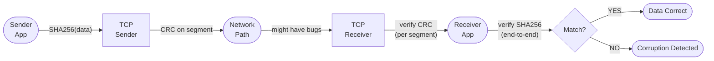
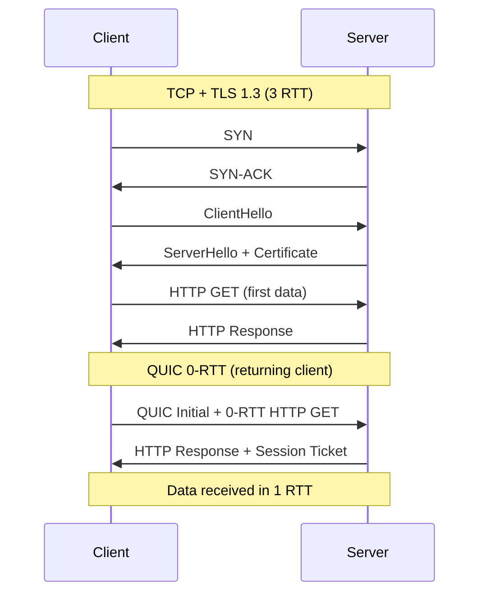

## Keywords in This File
{: .no_toc }

| # | Keyword | Weight |
|---|---|---|
| 26 | [End-to-End Principle and Protocol Design Philosophy](#end-to-end-principle-and-protocol-design-philosophy) | medium |
| 27 | [QUIC Protocol Design Decisions](#quic-protocol-design-decisions) | high |

---

# End-to-End Principle and Protocol Design Philosophy

---
id: CN-026
title: "End-to-End Principle and Protocol Design Philosophy"
category: Computer Networks
difficulty: ★★☆
interview_weight: medium
seniority: mid-senior
tags: #end-to-end-principle #protocol-design #layering #network-theory #distributed-systems
---

## Quick Reference

**Difficulty:** ★★☆ | **Asked at:** Mid-Senior | **Seniority:** Mid through Senior

---

### 🎯 Model Answer

**30 seconds:**
The end-to-end principle (Saltzer, Reed, Clark - 1984) states that reliability and correctness functions should be implemented at the endpoints of a communication system, not in the network core. The network should be a "dumb pipe" that delivers packets on a best-effort basis; applications at the endpoints verify correctness and retransmit if needed. This enables a simple, fast, and universal network that supports diverse applications. Violations of the E2E principle (firewalls doing deep packet inspection, NAT, network-layer encryption) often create unforeseen problems.

**3 minutes:**
**The principle stated:** If a communication function is needed for correctness (e.g., error detection, ordering), it must be implemented at the endpoints even if the network already provides partial guarantees - because the network's guarantee might not be complete or reliable. A file transfer must verify the received file's integrity, not just trust that "the network didn't corrupt anything."

**Why "even if the network already provides it":** Suppose a network provides error-corrected delivery per-hop (each link does CRC check). Is end-to-end error checking still needed? Yes - because: (1) software on routers can corrupt data in memory; (2) the application's definition of "correct" may differ from the network's; (3) the network's guarantee might not cover all cases (e.g., buffer overflow reordering). The TCP checksum exists even though Ethernet has CRC - they protect against different failure modes.

**Protocol layering:** The E2E principle drives the OSI/Internet layering model. Each layer provides services to the layer above and uses services from the layer below. The network layer (IP) provides unreliable, best-effort delivery. TCP adds reliability at the transport layer (endpoint). Applications add their own application-level semantics (idempotency, application checksums). Each layer is independently testable and replaceable.

**NAT as an E2E violation:** NAT (Network Address Translation) places state in the middle of the network (the NAT box knows which flows are active). This violates E2E: NAT boxes break protocols that embed IP addresses in payloads (SIP, FTP active mode), break PMTUD, and prevent inbound connections. The internet's original design assumed any host could reach any other host; NAT violates this by hiding hosts behind a shared IP.

**Blank Mind Recovery:** E2E = put correctness at endpoints, not in the network. Dumb pipe = network just forwards packets. TCP checksum = E2E principle example. NAT = E2E violation. Layering = each layer is E2E for its own correctness.

---

### 📘 Concept Explanation

**Core concept:** The E2E principle is both a design guideline and a philosophical position about where intelligence belongs in a distributed system. The internet succeeded because IP is simple and universal; applications build complexity at the edges.

**The argument from the original paper:**

```
E2E Argument (Saltzer, Reed, Clark 1984):

"The function in question can completely
and correctly be implemented only with the
knowledge and help of the application standing
at the end points of the communication system.
Therefore, providing that questioned function
as a feature of the communication system itself
is not possible."

Example: File Transfer Correctness

Network provides: per-hop error checking
                  (Ethernet CRC)

Is this sufficient?
  - Network hardware bug: corrupts data
    in memory between input and output CRC
  -> Ethernet CRC passes, data is wrong
  - Network software: reorders packets
    (valid retransmit of wrong segment)
  -> Delivery appears correct, data out of order

Conclusion: end-to-end file checksum is
REQUIRED regardless of network guarantees
TCP: CRC checksum on every segment
Application: MD5/SHA-256 of entire file

Each layer adds its own correctness check
because lower layers cannot guarantee
the full application-level correctness.
```

> **Code walkthrough:** WHAT IT SHOWS: the original argument from the E2E principle paper showing why network-level correctness guarantees are insufficient for application-level correctness. KEY MECHANISM: each layer of the stack has different failure modes; Ethernet CRC protects against transmission errors but not memory corruption in router buffers; TCP checksum protects against in-transit corruption but not application bugs; each layer must verify its own invariants. WHY IT MATTERS: this principle drives the design of every robust distributed system - checksums at every layer, idempotent operations, retry-with-verification patterns all stem from the E2E principle. WHAT BREAKS: applications that trust lower-layer guarantees without verification experience "impossible" data corruption bugs; a checksum in every layer is cheap insurance against this. TAKEAWAY: when designing distributed systems, add application-level verification even when the transport layer (TCP) provides error checking; TCP checksum is not cryptographic and cannot detect all data integrity failures; use application-level hash verification for any critical data transfer.

**Protocol layering and layer violations:**

```
Internet Stack and E2E principle:

Layer 7: Application  [E2E: semantics]
  HTTP/2, gRPC, WebSocket
  Adds: request/response mapping,
        application checksums, auth

Layer 4: Transport    [E2E: reliability]
  TCP: reliable, ordered byte stream
  UDP: unreliable, unordered datagrams
  Adds: error detection (CRC), flow/congestion

Layer 3: Network      [E2E: routing]
  IP: best-effort, unordered delivery
  Adds: fragmentation, routing, TTL

Layer 2: Datalink     [E2E: link]
  Ethernet, Wi-Fi
  Adds: per-hop error detection (CRC)

Layer 1: Physical     [transmission]
  Bits over wire/air

E2E principle says: each layer is responsible
for its OWN correctness guarantees.
Higher layers cannot delegate correctness
down to lower layers.
```

> **Code walkthrough:** WHAT IT SHOWS: the internet stack with E2E responsibilities labeled at each layer, showing that correctness is additive from physical to application. KEY MECHANISM: each layer addresses a different failure mode; physical layer handles signal noise; datalink layer handles per-hop corruption; network layer handles unreachable paths; transport layer handles end-to-end reliability; application layer handles semantic correctness. WHY IT MATTERS: understanding layer responsibilities explains why HTTP/2 adds its own stream-level checksums even though TCP already has CRC - they protect against different failure modes (TCP CRC protects in-transit; HTTP/2 stream mapping protects against stream mismatch bugs). WHAT BREAKS: protocols that "cross layer boundaries" (e.g., applications that include IP addresses in payloads) break when NAT is present because NAT modifies IP headers without updating the payload. TAKEAWAY: when designing a new protocol or API, clearly define which layer owns each correctness guarantee; never assume a lower layer's guarantee covers the higher layer's requirements.

**E2E principle violations and their consequences:**

```
Violation 1: NAT (Network Address Translation)

  Behind NAT: Host A (10.0.0.1)
  Outside IP: 203.0.113.1 (NAT box)

  Problem 1: Protocols embedding IP addresses
    SIP (VoIP): "Contact: sip:10.0.0.1:5060"
    NAT must rewrite this (ALG: app-layer gateway)
    -> NAT box must understand SIP protocol
    -> Each protocol needs a separate ALG
    -> NAT adds protocol-specific complexity

  Problem 2: Inbound connections
    External host cannot initiate to 10.0.0.1
    NAT has no mapping for unsolicited inbound
    Solution: NAT traversal (STUN/TURN/ICE)
    Complexity: 3 additional protocols to work
    around one NAT violation

  Problem 3: PMTUD
    NAT may not forward ICMP fragmentation needed
    -> ICMP black hole for all hosts behind NAT
```

> **Code walkthrough:** WHAT IT SHOWS: the downstream consequences of NAT as an E2E principle violation, including protocol breakage, inbound connection impossibility, and PMTUD failures. KEY MECHANISM: NAT places state in the middle of the network (connection tracking table); every new protocol that embeds IP addresses or port numbers in its payload must have a corresponding NAT Application Layer Gateway; each ALG is protocol-specific and must be updated when the protocol changes. WHY IT MATTERS: NAT was designed to extend IPv4 address space, but it created decades of protocol complexity; WebRTC (video calling), VoIP, and peer-to-peer protocols all require elaborate NAT traversal mechanisms (STUN, TURN, ICE) that wouldn't be needed without NAT. WHAT BREAKS: new protocols designed assuming end-to-end IP connectivity (direct host-to-host) fail behind NAT without NAT traversal; IPv6 eliminates NAT (every device gets a global IP), which is one reason IPv6 adoption enables simpler protocol design. TAKEAWAY: IPv6 adoption restores the E2E principle for IPv6-connected networks; designing protocols for IPv6 is simpler than designing for NAT; when possible, prefer IPv6 to avoid the complexity tax of NAT traversal.

---

### 💻 Code Example

**BAD: Trusting network-level guarantees for application correctness**

```python
# BAD: Sending file via TCP without
# application-level integrity verification

import socket

def send_file(host, port, filename):
    with open(filename, 'rb') as f:
        data = f.read()
    
    # TCP provides reliable delivery
    # "If send() doesn't throw, data was delivered"
    # This is WRONG reasoning.
    sock = socket.socket()
    sock.connect((host, port))
    sock.sendall(data)
    sock.close()
    # No hash, no verification
    # If data was corrupted in a router buffer:
    # TCP CRC detects per-packet corruption
    # but not all software-level corruptions
    # E.g.: OS copy bug, zero-copy scatter-gather
    # Can silently corrupt data that passes CRC
```

> **Code walkthrough:** WHAT IT SHOWS: a file transfer that trusts TCP's reliability without adding application-level integrity verification, violating the E2E principle. KEY MECHANISM: TCP's 16-bit checksum detects most in-transit corruption, but it can be defeated by hardware bugs in NICs (checksum offload errors) or software bugs in the OS TCP stack; a 16-bit checksum has 1 in 65536 chance of passing a corrupt packet even on a well-functioning network. WHY IT MATTERS: production data pipelines (database backups, data lake ingestion) that skip application-level checksums have experienced silent data corruption that went undetected for days or weeks; the cost of recovery exceeded the cost of adding checksums from the start. WHAT BREAKS: the assumption "sendall() succeeded = data correct" is only true if the OS, NIC, and TCP implementation are bug-free; in practice, checksum offload bugs and NIC firmware bugs have caused silent data corruption through TCP connections. TAKEAWAY: always add application-level checksums to critical data transfers; use SHA-256 or xxHash for the full file; verify at the receiver; this is the E2E principle applied to file transfer.

**GOOD: Application-level integrity per E2E principle**

```python
# GOOD: Apply E2E principle with end-to-end hash

import socket
import hashlib
import json

def send_file_with_integrity(host, port, filename):
    with open(filename, 'rb') as f:
        data = f.read()
    
    # Compute hash BEFORE sending:
    file_hash = hashlib.sha256(data).hexdigest()
    file_size = len(data)
    
    sock = socket.socket()
    sock.connect((host, port))
    
    # Send metadata first:
    metadata = json.dumps({
        "filename": filename,
        "size": file_size,
        "sha256": file_hash,
    }).encode() + b'\n'
    sock.sendall(metadata)
    
    # Send data:
    sock.sendall(data)
    
    # Wait for receiver confirmation:
    ack = sock.recv(100).decode().strip()
    if ack != "HASH_OK":
        raise RuntimeError(f"Integrity check failed: {ack}")
    
    sock.close()
    return file_hash

# Receiver (E2E verification):
def receive_file(sock):
    meta_line = b''
    while b'\n' not in meta_line:
        meta_line += sock.recv(1)
    metadata = json.loads(meta_line.decode())
    
    data = sock.recv(metadata['size'])
    actual_hash = hashlib.sha256(data).hexdigest()
    
    if actual_hash == metadata['sha256']:
        sock.sendall(b"HASH_OK\n")
        with open(metadata['filename'], 'wb') as f:
            f.write(data)
    else:
        sock.sendall(f"HASH_FAIL:{actual_hash}\n".encode())
        raise RuntimeError("Data integrity failure")
```

> **Code walkthrough:** WHAT IT SHOWS: a file transfer implementing the E2E principle with SHA-256 hashing at the application layer, independent of TCP's reliability guarantees. KEY MECHANISM: SHA-256 is computed by the sender before sending; the receiver independently computes SHA-256 after receiving all data; if they match, integrity is verified; the receiver sends an explicit acknowledgment (HASH_OK) so the sender knows verification passed; this is E2E because both endpoints participate in the verification. WHY IT MATTERS: this pattern is used in S3 (Content-MD5 header), HDFS (block checksum), and database backup tools; the overhead is minimal (SHA-256 at 1GB/s on modern CPUs for a 1GB file = 1 second) but the protection against silent corruption is complete. WHAT BREAKS: this implementation receives all data before verifying; for large files, pre-verify using chunked hashing (S3 multipart checksum per part); if the receiver's disk fills up during transfer, data is lost even though verification would pass. TAKEAWAY: implement E2E integrity as: (1) sender computes hash, (2) includes hash in metadata, (3) receiver verifies after receipt, (4) receiver acknowledges verification; any deviation from this pattern leaves a correctness gap.

---

### 🎓 Answers by Seniority

**Junior / Mid-level answer:**
The end-to-end principle says that reliability and correctness should be implemented at the endpoints (sender and receiver), not in the network itself. Even if the network provides error checking (like Ethernet CRC), the application should still verify data integrity because different failure modes exist at different layers. TCP's checksum protects against in-transit corruption, but an application should still use SHA-256 on the full file because software bugs can corrupt data even after TCP delivery. NAT is a violation of the E2E principle - it adds state to the middle of the network, breaking protocols that need direct host-to-host connectivity.

**Senior / Staff answer:**
The E2E principle is the foundational design philosophy behind the internet's success. It kept IP simple and universal - "just deliver bits, don't interpret them" - enabling diverse applications to be built on top without modifying the network. The principle generates a specific design guideline: when you can't trust that an intermediate component handles a concern correctly in all cases, move that concern to the endpoints. This explains why TCP has a checksum (can't trust Ethernet CRC for end-to-end correctness), why HTTPS does its own integrity (can't trust TCP for semantic correctness), and why object storage adds content MD5 headers. The tension today is between E2E purity and operational need: firewalls violate E2E (they inspect packets) but provide necessary security; CDNs violate E2E (they terminate TLS in the middle) but provide necessary performance. The key insight is that E2E violations should be explicit, justified, and understood in terms of what they break - NAT was introduced for address space reasons but its protocol-breaking consequences are still being paid for decades later.

---

### ⚠️ Common Misconceptions

**Misconception 1: "E2E principle means the network should do nothing"**
The E2E principle says correctness MUST be at endpoints; it doesn't say the network can't also help. Firewalls can block clearly malicious traffic. QoS can prioritize video over email. These are optimizations that don't substitute for endpoint correctness. The key phrase: "not possible" in the original paper means the network alone cannot achieve correctness, not that it shouldn't try to help.

**Misconception 2: "TCP checksum is enough for data integrity"**
TCP's checksum is 16-bit and computed at the IP stack level. It protects against in-transit corruption but not: OS software bugs in the TCP implementation, NIC driver bugs that corrupt before checksumming, and application-level bugs in serialization/deserialization. Application-level hash verification (SHA-256, MD5) is a separate layer of defense that the E2E principle requires.

**Misconception 3: "IPv6 makes NAT unnecessary immediately"**
IPv6 does provide globally unique addresses to all devices, eliminating the address-scarcity reason for NAT. However, NAT has accumulated a secondary role as a "security feature" (hiding internal network topology). The security benefit is debatable (stateful firewalls provide real security without NAT's drawbacks), but the perception of security-through-obscurity keeps NAT alive even in IPv6 deployments. Dual-stack environments often use NAT64 or NAT66.

---

### 🚨 Failure Modes and Diagnosis

**Failure: Silent data corruption across distributed pipeline**

```bash
# Symptom: ML model training produces wrong results
# periodically; data appears to arrive correctly

# Diagnose: check for checksums in pipeline
# Stage 1: Object storage -> compute nodes
# Does your pipeline verify data integrity?
aws s3 cp s3://bucket/data.parquet /tmp/data.parquet
# AWS S3 cp verifies MD5 on download (built-in)
# But does your pipeline check it?

# Add E2E verification:
# Upload with checksum:
aws s3 cp local_file.parquet s3://bucket/file.parquet \
    --checksum-algorithm SHA256
# AWS stores SHA256 with the object

# Download and verify:
aws s3 cp s3://bucket/file.parquet /tmp/file.parquet \
    --checksum-mode ENABLED
# AWS verifies SHA256 on download
# Fails with error if checksum mismatch

# For custom pipelines: store checksums in metadata
# and verify at each pipeline stage:
import hashlib
def verify_file(filepath, expected_sha256):
    with open(filepath, 'rb') as f:
        actual = hashlib.sha256(f.read()).hexdigest()
    if actual != expected_sha256:
        raise ValueError(
            f"Checksum mismatch: {actual} vs {expected_sha256}"
        )
    return True
```

> **Code walkthrough:** WHAT IT SHOWS: adding E2E integrity verification to an AWS S3 data pipeline using AWS's built-in checksum support and a custom Python verification function. KEY MECHANISM: AWS S3's `--checksum-algorithm SHA256` stores the object checksum with the object metadata; `--checksum-mode ENABLED` on download triggers verification; the Python function independently computes SHA-256 and compares against a stored expected value. WHY IT MATTERS: ML training pipelines that skip integrity checks produce incorrect models when silent data corruption occurs (bit flips in NVMe storage, network corruption that passed TCP CRC by chance); the corruption is usually not caught until model performance degrades, which takes weeks. WHAT BREAKS: checksum verification adds latency (SHA-256 computation); for terabyte datasets, consider chunk-level checksums (verify as you stream) rather than reading the entire file before verifying. TAKEAWAY: add checksum verification at every stage boundary in data pipelines; the compute cost is < 1% of processing time; the cost of undetected corruption is unbounded.

---

### 🎯 Interview Deep-Dive

| Format | Questions | Est. Time |
|---|---|---|
| Junior/Mid | 9 questions | 25-35 min |
| Senior/Staff | 9 questions + deep-dives | 35-40 min |

**[JUNIOR] Q1 - [CONCEPTUAL] What is the end-to-end principle and why is it important?**

The end-to-end principle (Saltzer, Reed, Clark 1984) states that reliability and correctness should be implemented at the endpoints of a communication system, not in the network core. The network should forward packets on a best-effort basis; endpoints ensure correctness.

Why important:
1. Simpler network: IP only needs to forward packets; no need for the network to understand application semantics
2. Universal: the same network supports all applications (email, video, file transfer) without modification
3. Resilient: if the network can't guarantee correctness anyway (see below), endpoints must anyway
4. Evolvable: applications can improve independently of the network

The "why not trust the network": even if the network provides partial guarantees (Ethernet CRC), the network cannot guarantee application-level correctness because: hardware bugs can corrupt data after the checksum is computed, software on routers can reorder or corrupt data, and the application's definition of "correct" is specific to the application.

*What separates good from great:* The "even if the network provides it" clause in the original argument - the paper explicitly says you need E2E verification even when the network claims to provide it; the question of whether the network's guarantee is complete or covers all failure modes is always uncertain.

---

**[MID] Q2 - [MECHANISM] How does the internet's layered architecture implement the E2E principle?**

Each layer in the internet stack implements E2E correctness for its own layer:
- Physical: signal integrity (modulation, encoding)
- Datalink (Ethernet): per-hop frame integrity (CRC-32)
- Network (IP): best-effort routing (no guarantees)
- Transport (TCP): end-to-end reliable delivery (sequence numbers, CRC, retransmit)
- Application (HTTP, custom): semantic correctness (application checksums, retry logic)

Critically, higher layers don't remove lower-layer correctness checks; they add their own on top. TCP has a checksum even though Ethernet has CRC - they protect against different failure modes.

*What separates good from great:* The reason TCP checksum exists even with Ethernet CRC - Ethernet CRC is per-hop (each router verifies and removes the CRC, then generates a new CRC for the next hop); if the router's software corrupts data between receiving and re-transmitting, the new CRC will be correct; TCP's checksum covers the end-to-end path and would catch this corruption.

---

**[SENIOR] Q3 - [TRADE-OFF] What are the trade-offs of violating the E2E principle in modern networks?**

Violations and their costs:

NAT: Solves IPv4 address exhaustion. Costs: breaks inbound connectivity (requires NAT traversal), breaks protocols embedding IPs in payloads (requires ALGs), breaks PMTUD (ICMP filtering), and created decades of workaround complexity (STUN, TURN, ICE).

Firewalls (deep packet inspection): Provides security. Costs: must understand every protocol, becomes a bottleneck for encrypted protocols (DPI can't see inside TLS), breaks protocol evolution (DPI must be updated for new protocols).

CDN TLS termination: Improves performance. Costs: CDN decrypts user traffic (trust boundary extension), violates E2E encryption between user and origin, CDN becomes a point of compromise for user data.

Application-layer gateways: Make protocols work through NAT. Costs: must be updated for every protocol version, add latency, create security vulnerabilities (parsing complex protocols in privileged position).

The pattern: every violation creates complexity and maintenance cost. The internet works despite these violations, but systems that rely on true E2E connectivity (P2P, VoIP, WebRTC) must implement elaborate workarounds.

*What separates good from great:* CDN TLS termination as a trade-off - CloudFlare and AWS CloudFront decrypt and re-encrypt user traffic; this is a deliberate E2E violation accepted for performance (cache at the edge); users who understand this should evaluate whether their threat model accepts CDN access to unencrypted traffic.

---

**[SENIOR] Q4 - [MECHANISM] How does the E2E principle apply to microservices design?**

The E2E principle translates directly to microservices:

Service-level E2E: Each service verifies data integrity for the data it owns. A payment service doesn't trust that the database returned uncorrupted data - it validates the returned record against its known invariants.

Message queue E2E: Messages delivered via Kafka are guaranteed exactly-once by Kafka. But the consumer must still verify message content (schema validation, business invariants) because Kafka guarantees delivery, not correctness.

API call E2E: Service A calls Service B. TCP guarantees delivery. But Service A must still handle: corrupted response (schema mismatch), partial response (connection drop after partial write), and out-of-order responses (same ID used twice).

Idempotency as E2E: E2E principle says you might need to retry. If retries happen, they must be idempotent (same result whether called once or many times). This is an application-level concern, not a network concern.

*What separates good from great:* Idempotency as an E2E design requirement - E2E implies retries are necessary; retries require idempotency; therefore E2E principle drives microservice API design toward idempotent operations; this connects the 1984 networking theory to modern API design best practices.

---

**[SENIOR] Q5 - [TRADE-OFF] How does TLS relate to the E2E principle?**

TLS provides confidentiality and integrity at the application layer, aligned with the E2E principle:
- Confidentiality: data is encrypted before leaving the endpoint (not encrypted by a network box)
- Integrity: TLS MAC protects against in-transit modification
- Authentication: certificate verification ensures connection to correct endpoint

TLS and E2E: TLS is an E2E mechanism (endpoints negotiate keys; network cannot decrypt). This is why TLS was designed to terminate at the application endpoint (server), not at a network appliance.

CDN as E2E violation: When Cloudflare terminates TLS, they decrypt and re-encrypt to the origin. The user's E2E connection terminates at Cloudflare, not the origin server. This is a deliberate, useful E2E violation: Cloudflare inspects requests for security (WAF) and caches responses. The user must trust Cloudflare as an additional party in the "end-to-end."

Certificate transparency: Even with TLS, a rogue CA can issue a certificate for your domain, allowing a man-in-the-middle. Certificate transparency logs (RFC 6962) are an E2E mechanism at a higher level: endpoint verification of certificate legitimacy via public audit logs.

*What separates good from great:* Certificate transparency as an E2E application - CT logs allow the domain owner to audit all certificates issued for their domain; this is E2E verification at the PKI layer, not relying on the CA infrastructure alone to prevent certificate fraud.

---

**[MID] Q6 - [CONCEPTUAL] What is "protocol layering" and when is it appropriate to violate layer boundaries?**

Protocol layering groups related functions at the same abstraction level. Each layer uses only the services provided by the layer below and exports a well-defined interface to the layer above. This enables: independent evolution (TCP can be updated without changing IP), testing in isolation, and reuse (TCP used by many applications).

Layer boundary violations occur when a protocol needs information from a different layer:
- TCP uses IP-level information (destination address) for checksum calculation
- NAT needs to modify both IP headers (network layer) and payload (application layer) for SIP
- ECN marks packets at IP layer based on transport-layer congestion signals

When violations are appropriate:
- Necessary for performance: protocol performance requires cross-layer information (cross-layer optimization in wireless networks)
- NAT traversal: unavoidable given real-world deployment
- Hardware offload: NIC handles TCP checksumming (crossing software layer boundaries)

When violations are not appropriate:
- Application logic in the network: firewalls applying business rules to traffic
- Network assumptions about application semantics (breaks when application changes)

*What separates good from great:* Cross-layer optimization in wireless (IEEE 802.11): the wireless MAC layer needs transport-layer information (TCP vs UDP) to choose appropriate retry policies; a TCP segment that will be retransmitted anyway doesn't need MAC-layer retries; this is a productive layer violation that improves performance without breaking abstractions.

---

**[SENIOR] Q7 - [MECHANISM] How does the E2E principle explain why IPv6 was designed differently from IPv4?**

IPv6 incorporated E2E principle lessons from IPv4's shortcomings:

1. **No fragmentation by routers:** IPv4 allowed routers to fragment packets (a network-layer function that was supposed to help endpoints). This created the ICMP black hole problem and PMTUD complexity. IPv6 moved fragmentation entirely to endpoints (source host fragments, not routers), consistent with E2E - the endpoint controls packet sizing.

2. **Mandatory IPsec support:** IPv6 originally required IPsec. This is an E2E encryption mechanism (endpoints negotiate keys) rather than link-level encryption. Aligned with E2E: don't trust network links, encrypt at endpoints.

3. **Address space eliminates NAT:** IPv6's 128-bit addresses give every device a globally unique IP, restoring E2E connectivity (any host can reach any other host). This eliminates the need for NAT (the most destructive E2E violation in IPv4).

4. **Extension headers for options:** IPv4 has a fixed 40-byte options field. IPv6 uses extension headers (variable, unlimited). This enables endpoint-to-endpoint communication of options (hop-by-hop options for endpoints, not routers) without the network needing to understand them.

*What separates good from great:* The fragmentation design - IPv4's router-fragmentation-allowed approach created decades of problems (ICMP black holes, PMTUD, reassembly attacks); IPv6's source-only fragmentation is a direct application of E2E - the endpoint owns the fragmentation decision, not the network.

---

**[SENIOR] Q8 - [DEBUGGING] How would you diagnose an application that works locally but fails when connecting across the internet?**

The E2E principle suggests a diagnostic framework: each layer can be failing independently.

Step 1: Identify the failure layer:
```bash
# L4 test: TCP connection works?
nc -z -v target.example.com 443
# "Connected" = TCP works; "Connection refused" = L4 block

# L7 test: HTTP responds?
curl -v --max-time 10 https://target.example.com/health
# Hangs after CONNECT = TLS or application problem
# Returns error code = application error
```

> **Code walkthrough:** WHAT IT SHOWS: layered diagnosis commands starting from TCP connectivity and progressing to HTTP application-level testing. KEY MECHANISM: nc (netcat) tests pure TCP connectivity (no application protocol); if nc succeeds but curl fails, the problem is in TLS negotiation or HTTP; if nc fails, the problem is at network or transport layer; this top-down isolation approach narrows the failure layer. WHY IT MATTERS: E2E debugging requires testing each layer independently; a developer who jumps to "the application is broken" without first confirming TCP works wastes time debugging the wrong layer. WHAT BREAKS: nc -z only tests TCP connection; it doesn't verify the service is responding; the port might be open but the application crashed; always follow up with an application-level test. TAKEAWAY: build a diagnostic habit of testing from Layer 4 up (TCP -> TLS -> HTTP); each test adds information about which layer is failing.

Step 2: Test for MTU issues (E2E principle: network can corrupt/drop):
```bash
# Test PMTUD: large packet works?
ping -M do -s 1472 target.example.com
# Timeout = ICMP blocked (MTU issue) or unreachable

# Test TCP data transfer with size variation:
for SIZE in 100 500 1000 1400; do
    curl -s -o /dev/null \
        -w "Size %{size_download}B: %{http_code}\n" \
        "https://target.example.com/test?size=${SIZE}"
done
# If < 1400 works but >= 1400 fails:
# MTU/PMTUD issue between local and target
```

> **Code walkthrough:** WHAT IT SHOWS: testing for PMTUD failures by varying packet sizes to identify the MTU boundary. KEY MECHANISM: the ping DF bit test identifies if ICMP is blocked (PMTUD will fail); the curl size-variation test identifies the exact MTU boundary for TCP connections; if responses < 1400 bytes succeed but >= 1400 bytes fail, the MTU is less than 1500 bytes on the path. WHY IT MATTERS: MTU issues are invisible to local testing (loopback has 65536 MTU; LAN has 1500 MTU; but VPN/internet path may have 1427 MTU); E2E testing is necessary because the failure only appears with the full path. WHAT BREAKS: the test endpoint must support variable response sizes; add a test endpoint to your service that returns exactly N bytes. TAKEAWAY: when "works locally, fails remotely", always test MTU as a first step; it's the most common network-layer failure that passes local testing.

*What separates good from great:* The layer-by-layer diagnostic approach as a direct application of E2E principle - each layer has its own failure mode; isolating the failing layer before debugging is more efficient than trying all possible fixes.

---

**[SENIOR] Q9 - [BEHAVIORAL] Describe how understanding the E2E principle influenced a system design decision you made.**

Situation: Designing a distributed ledger system where financial transactions flow through: mobile app -> API gateway -> transaction service -> database. The team proposed using the API gateway to validate transaction integrity (schema validation, business rules).

Task: Evaluate whether to implement validation at the API gateway (network middle layer) vs transaction service (endpoint).

Analysis using E2E principle:
- API gateway is a "middle box" - validating there is an E2E violation
- If the gateway validates transaction integrity, can we trust no corruption occurs between gateway and transaction service?
- What if the gateway has a bug that allows some invalid transactions through?
- What if the message queue between gateway and service corrupts a message?

Decision: API gateway validates syntax and auth only (well-defined, doesn't require business context). Transaction service validates all business invariants (amount ranges, account states, fraud rules). Both layers validate their own concerns.

Result: When a message queue delivered a corrupted transaction (random bit flip in a test), the transaction service caught it with its checksum verification. If we had relied on gateway validation alone, the corrupted transaction would have been applied to the ledger.

*What separates good from great:* The specific example of what the middle-box validation would miss (bit flip in message queue) - this is the core E2E argument applied to a real scenario; validation at the API gateway validates what enters the queue, not what exits; the service must validate what it receives because the queue is not trusted.

---

### ⚖️ Comparison Table

*(Omit: ★★☆ tier - single conceptual keyword focused on theory rather than alternatives)*

---

### 🏛️ System Design

*(Omit: L6 theory keyword - not a system design topic; the E2E principle is applied within system designs rather than being a design itself)*

---

### 📊 Diagram

```
E2E Principle in Distributed System:

[Sender App] -----> [Network] -----> [Receiver App]
      |                                    |
  Computes                             Verifies
  SHA256                               SHA256
      |                                    |
  Transmits via TCP (reliable)             |
  TCP adds CRC (in-transit only)           |
      |                                    |
  If CRC detects corruption: TCP retransmit
  If no corruption detected: packet delivered
  If software bug corrupts after CRC check:
    TCP: undetected! CRC was on original data
    App: detected! SHA256 fails on received data
      |                                    |
  SHA256 = end-to-end correctness guarantee
  TCP CRC = per-transport-path guarantee
  (not the same; both needed)
```

> **Diagram walkthrough:** WHAT IT DEPICTS: the E2E principle as applied to data integrity, showing that TCP CRC and application SHA-256 protect against different failure modes. HOW TO READ IT: the sender computes SHA-256 before TCP transmission; TCP adds its own CRC; at the receiver, TCP verifies its CRC (per-path), then the application verifies the SHA-256 (end-to-end); if TCP CRC passes but SHA-256 fails, a post-CRC corruption occurred. KEY RELATIONSHIP: TCP CRC protects the byte stream during transmission; SHA-256 protects the data content from source to destination including all intermediate processing; the two checks are complementary, not redundant. EDGE CASE: if TCP delivers data in the correct order with correct checksum but a memory bus error corrupts the data after it lands in the receiver's memory, SHA-256 catches it but TCP CRC won't (the CRC was verified before memory placement). INSIGHT: the diagram shows exactly what the E2E principle paper argued in 1984 - there is always a gap between the network's correctness guarantee and the application's correctness requirement; closing that gap requires endpoint-to-endpoint verification.



> **Diagram walkthrough:** WHAT IT DEPICTS: the complete E2E integrity verification flow showing TCP-level and application-level checks as separate, independent protection layers. HOW TO READ IT: data flows left to right; the sender app computes SHA-256; TCP adds per-segment CRC; the network path has potential for bugs; TCP receiver verifies CRC per segment; the receiver app verifies SHA-256; both checks must pass for the data to be considered correct. KEY RELATIONSHIP: the two verification steps (TCP CRC and SHA-256) are at different granularities and positions; TCP CRC checks each segment in transit; SHA-256 checks the complete data end-to-end; a bug that occurs after TCP delivery (memory corruption, software bug) is caught by SHA-256 but not TCP CRC. EDGE CASE: SHA-256 verification requires having the expected hash from a trusted source; if the hash itself was corrupted in transit (sent over the same channel as the data), verification fails to detect corruption; always transmit hashes separately or via an independent channel. INSIGHT: this pattern (compute hash before sending, verify hash after receiving, send hash separately) is the production implementation of the E2E principle for data integrity; it appears in S3 Content-MD5, HDFS block checksums, and Git object hashing.

---

---

# QUIC Protocol Design Decisions

---
id: CN-027
title: "QUIC Protocol Design Decisions"
category: Computer Networks
difficulty: ★★☆
interview_weight: high
seniority: mid-senior
tags: #quic #http3 #protocol-design #0rtt #head-of-line-blocking #tls13 #udp
---

## Quick Reference

**Difficulty:** ★★☆ | **Asked at:** Mid through Senior | **Seniority:** Mid-Senior

---

### 🎯 Model Answer

**30 seconds:**
QUIC is a transport protocol built on UDP (not TCP) that provides TCP-like reliability plus built-in TLS 1.3 encryption, multiplexed streams without head-of-line blocking, 0-RTT connection establishment, and connection migration (IP address changes don't break the connection). QUIC is the transport layer for HTTP/3. The key design decision: by building on UDP and embedding TLS in the protocol itself, QUIC eliminated the "middleware ossification" problem where network equipment that knew about TCP prevented TCP from evolving.

**3 minutes:**
**Why UDP, not TCP?** TCP is a kernel-implemented protocol. Network equipment (firewalls, NAT boxes, load balancers) has deep knowledge of TCP internals. Any attempt to evolve TCP (e.g., add new header fields) was blocked by "ossified" middleboxes that would drop unknown TCP options. UDP is simpler; middleboxes only inspect the port number; the QUIC protocol runs inside UDP and can evolve freely.

**Head-of-line blocking:** HTTP/2 solved HTTP/1.1 head-of-line blocking by multiplexing streams over one TCP connection. But if one TCP segment is lost, ALL streams waiting for data stall until the segment is retransmitted (TCP requires in-order delivery of the byte stream). QUIC's streams are independent within the transport layer: if one QUIC stream's data is lost, only that stream is blocked; other streams continue delivering data.

**0-RTT:** TLS 1.2 required 2 round-trips to establish a new connection; TLS 1.3 requires 1 RTT; QUIC's 0-RTT can send application data in the FIRST packet if the client has seen this server before (using a session ticket). For short-lived connections (DNS over QUIC, HTTP/3 for small resources), 0-RTT is significant - it eliminates the connection setup latency entirely.

**Connection migration:** QUIC connections are identified by a Connection ID, not a 4-tuple (src IP, src port, dst IP, dst port). When a mobile user moves from Wi-Fi to cellular (IP address changes), the QUIC connection continues using the new IP. TCP would reset the connection on IP change.

**Blank Mind Recovery:** QUIC = TCP-like reliability + TLS 1.3 + multiplexing + 0-RTT, all running over UDP. No head-of-line blocking. Connection ID survives IP change.

---

### 📘 Concept Explanation

**Core concept:** QUIC solves TCP ossification (inability to evolve due to middlebox hardcoding) by running above UDP; solves HTTP/2 head-of-line blocking by making streams independent at the transport layer; and reduces latency by integrating TLS handshake into the connection setup.

**TCP's problems that QUIC solves:**

```
Problem 1: Head-of-line blocking in HTTP/2

HTTP/2 over TCP: one connection, multiple streams
Stream 1: [SEQ 1] [SEQ 2] [SEQ 3]...
Stream 2: [SEQ 4] [SEQ 5] [SEQ 6]...
Stream 3: [SEQ 7] [SEQ 8] [SEQ 9]...

If SEQ 4 is lost:
  Stream 2: BLOCKED (waiting for SEQ 4)
  Stream 1: BLOCKED (TCP is ordered!)
  Stream 3: BLOCKED (TCP is ordered!)
  SEQ 1-3, SEQ 5-9 are buffered, not delivered
  -> ALL streams stall for retransmit of SEQ 4

QUIC streams are independent:
  Stream 1 [QUIC packet 1, 2, 3]
  Stream 2 [QUIC packet 4, 5, 6]
  Stream 3 [QUIC packet 7, 8, 9]

If QUIC packet 4 (Stream 2) is lost:
  Stream 2: BLOCKED (waiting for pkt 4)
  Stream 1: CONTINUES (pkt 1,2,3 already delivered)
  Stream 3: CONTINUES (pkt 7,8,9 delivered)
  -> Only the affected stream is stalled
```

> **Code walkthrough:** WHAT IT SHOWS: a comparison of HTTP/2 over TCP head-of-line blocking versus QUIC's stream independence. KEY MECHANISM: TCP provides a single ordered byte stream; HTTP/2 multiplexes streams over this single stream by interleaving their data; when one TCP segment is lost, the entire byte stream stalls until retransmit; QUIC maintains per-stream sequence numbers independently, so a lost packet for one stream doesn't affect others. WHY IT MATTERS: head-of-line blocking is a significant performance issue for web pages that load dozens of resources (CSS, JS, images) concurrently; a single lost packet for one resource delays ALL others under TCP; QUIC eliminates this completely, improving P99 latency for web applications. WHAT BREAKS: QUIC's per-stream independence creates complexity in congestion control - if one stream is generating high traffic and another is idle, which stream should be slowed down when congestion is detected? QUIC needs congestion control at the connection level that is fair across streams. TAKEAWAY: head-of-line blocking is the primary reason HTTP/3 (QUIC) outperforms HTTP/2 on lossy networks (mobile, cross-continental); on a perfect zero-loss network, HTTP/2 and HTTP/3 perform similarly.

**QUIC handshake vs TCP+TLS:**

```
TCP + TLS 1.3 handshake:

Client          Server
  |-- SYN ------->|  (RTT 0)
  |<-- SYN-ACK ---|
  |-- ACK ------->|  (1 RTT: TCP established)
  |-- ClientHello->|
  |<-- ServerHello-|
  |<-- Certificate-|
  |<-- Finished --|
  |-- Finished -->|  (2 RTT: TLS established)
  |-- HTTP GET -->|  (data starts at 2 RTT)

QUIC 1-RTT handshake:

Client          Server
  |-- QUIC Initial ->|  (contains ClientHello)
  |                  |  (QUIC + TLS in one)
  |<- QUIC+TLSdata--|
  |-- QUIC Finished ->|  (1 RTT: connected+encrypted)
  |-- HTTP GET ------>|  (data starts at 1 RTT)

QUIC 0-RTT (returning clients):

Client (has session ticket from prior connection):
  |-- QUIC+0RTT Data ->|  (HTTP GET in FIRST packet)
  |<-- HTTP Response --|  (0 RTT for client!)
  |-- Handshake fin -->|
```

> **Code walkthrough:** WHAT IT SHOWS: a side-by-side comparison of TCP+TLS 1.3 (2 RTT), QUIC 1-RTT, and QUIC 0-RTT handshake sequences. KEY MECHANISM: QUIC combines transport handshake and TLS 1.3 cryptographic handshake in a single message exchange (1 RTT vs 2 RTT for TCP+TLS); 0-RTT uses a pre-shared session ticket from a prior connection to encrypt the first data packets without waiting for the server's key material; the server verifies the session ticket and processes the data immediately. WHY IT MATTERS: at 50ms RTT (typical internet), 2 RTT = 100ms added latency for TCP+TLS vs 50ms for QUIC 1-RTT vs 0ms for QUIC 0-RTT; for APIs with many short-lived connections (microservices, CDN edge), this latency saving is significant. WHAT BREAKS: 0-RTT data is not forward-secret (an attacker who later compromises the server's ticket key can decrypt 0-RTT data); 0-RTT is also vulnerable to replay attacks (an attacker can replay the 0-RTT data to trigger the action again); 0-RTT should only be used for idempotent, low-sensitivity requests. TAKEAWAY: QUIC 0-RTT is appropriate for idempotent GET requests (fetching web resources); for POST/PUT/DELETE operations (non-idempotent), use 1-RTT QUIC to prevent replay attacks.

**Connection migration:**

```
TCP Connection:
  Identified by: (src IP, src port, dst IP, dst port)
  Mobile user: Wi-Fi IP 192.168.1.100
  Connection: (192.168.1.100:50000, server:443)
  
  User moves to cellular: new IP 10.0.0.50
  TCP sees: source IP changed
  TCP: connection broken (IP != IP in 4-tuple)
  Result: TCP RST or timeout -> reconnect required

QUIC Connection:
  Identified by: Connection ID (64-bit random token)
  Mobile user: Wi-Fi IP 192.168.1.100
  Connection: CID = 0x1a2b3c4d

  User moves to cellular: new IP 10.0.0.50
  QUIC server sees: new IP, same Connection ID
  QUIC: verifies ownership (path validation)
  QUIC: migrates connection to new path
  Result: continuous connection, no interruption
```

> **Code walkthrough:** WHAT IT SHOWS: how QUIC connection migration allows a mobile client to change IP addresses without interrupting the connection, contrasted with TCP's IP-bound connection model. KEY MECHANISM: QUIC identifies connections by a Connection ID (CID), not the 4-tuple; when the client's IP changes, it sends a PATH_CHALLENGE frame on the new path; the server responds with PATH_RESPONSE; if correct, the server knows the client owns the new path and migrates the connection to it. WHY IT MATTERS: mobile users frequently switch between Wi-Fi and cellular; TCP connections break on each switch (app must reconnect, re-authenticate); QUIC connections survive these transitions; this is why HTTP/3 (QUIC) provides better mobile experience than HTTP/2 (TCP). WHAT BREAKS: connection migration has a security concern - an attacker could forge a PATH_CHALLENGE using a victim's CID and redirect the victim's traffic; QUIC mitigates this with IP-address verification (PATH_CHALLENGE/RESPONSE sequence) and limits the attack window. TAKEAWAY: connection migration is one of the most user-visible QUIC improvements for mobile applications; videos, file transfers, and live streams that previously interrupted on network switch now continue seamlessly with QUIC.

---

### 💻 Code Example

**BAD: Assuming TCP performance is sufficient for all use cases**

```python
# BAD: Using TCP for a mobile API client without
# considering connection overhead

import http.client
import time

def get_weather(city):
    # New TCP + TLS connection per request
    # = 2 RTT overhead for EVERY request
    conn = http.client.HTTPSConnection("api.weather.com")
    conn.request("GET", f"/weather?city={city}")
    resp = conn.getresponse()
    data = resp.read()
    conn.close()
    return data

# Mobile app makes 20 API calls per page load
# Each call: 2 RTT setup + 1 RTT data = 3 RTT
# At 100ms RTT (mobile LTE): 300ms per call
# 20 calls = 6 seconds just for network overhead
# (assumes sequential; parallel helps but
#  each still costs 2 RTT for setup)
```

> **Code walkthrough:** WHAT IT SHOWS: a mobile API client that creates a new TCP+TLS connection per request, incurring 2 RTT overhead for every API call. KEY MECHANISM: each `HTTPSConnection()` call triggers a TCP 3-way handshake (1 RTT) followed by a TLS 1.3 handshake (1 RTT) before the first byte of application data is sent; at 100ms RTT, this is 200ms overhead per request. WHY IT MATTERS: mobile applications frequently make dozens of API calls per interaction; multiplying 200ms by 20 calls = 4 seconds of pure connection overhead on top of actual data transfer; this is user-visible latency. WHAT BREAKS: HTTP keep-alive (connection reuse) mitigates this by reusing TCP connections; but keep-alive requires the client to maintain the connection state and doesn't help when connections time out between requests. TAKEAWAY: for mobile APIs with many small requests, connection setup overhead often exceeds data transfer time; QUIC 0-RTT or HTTP/2 connection multiplexing reduce this dramatically.

**GOOD: HTTP/3 (QUIC) with 0-RTT for mobile performance**

```python
# GOOD: Using aioquic / httpx with HTTP/3 (QUIC)
# Note: Python HTTP/3 support via httpx + h3

import httpx
import asyncio

async def fetch_weather_quic(cities):
    # HTTP/3 (QUIC): multiplexed streams,
    # 0-RTT for subsequent connections,
    # no head-of-line blocking
    
    async with httpx.AsyncClient(http2=True) as client:
        # For QUIC/HTTP3, use a QUIC-capable library
        # httpx supports HTTP/2 (connection reuse)
        # Real QUIC requires aioquic or
        # a QUIC-capable server + client

        # QUIC advantages demonstrated:
        # 1. One connection for all requests
        # 2. Multiplexed: all cities fetched in parallel
        #    without head-of-line blocking
        # 3. 0-RTT on second page load (session ticket)
        
        tasks = [
            client.get(f"https://api.weather.com/weather?city={city}")
            for city in cities
        ]
        results = await asyncio.gather(*tasks)
        return [r.json() for r in results]

# With QUIC:
# First load: 1 RTT setup + parallel data transfer
# Subsequent loads: 0-RTT + parallel data transfer
# 20 city requests: 1 RTT (parallel, not sequential)
# vs TCP: 20 x 2 RTT = 40 RTT sequential
```

> **Code walkthrough:** WHAT IT SHOWS: HTTP/3-capable client using connection multiplexing (HTTP/2 example, QUIC conceptual) that fetches all cities in parallel over a single connection. KEY MECHANISM: connection multiplexing (HTTP/2 over TCP or HTTP/3 over QUIC) allows all 20 API requests to run concurrently over a single connection; the connection setup overhead is paid once, not 20 times; QUIC's 0-RTT further reduces the first request's setup to zero on return visits. WHY IT MATTERS: parallelizing 20 requests over one connection reduces total time from 20 x (2 RTT + data) = dominated by setup to 1 x (1 RTT setup) + max(data transfer) = dominated by data; this is a 10-20x improvement in perceived latency for multi-resource page loads. WHAT BREAKS: HTTP/2's head-of-line blocking means one lost TCP packet stalls all 20 requests; QUIC's independent streams prevent this; on lossy networks (2-5% loss typical for some mobile connections), QUIC's superiority becomes significant. TAKEAWAY: for mobile applications with multiple concurrent API calls, HTTP/3 (QUIC) provides measurable improvements; the investment in QUIC support is justified for latency-critical mobile experiences.

---

### 🎓 Answers by Seniority

**Junior / Mid-level answer:**
QUIC is a new transport protocol built on UDP that is used by HTTP/3. It provides the same reliability as TCP but with several improvements: it includes TLS encryption built-in (unlike TCP which needs a separate TLS layer), uses 0-RTT to connect faster when reconnecting, and allows multiple independent streams so if one stream's data is lost, other streams aren't blocked (no head-of-line blocking). Connection migration means mobile users can switch from Wi-Fi to cellular without losing the connection.

**Senior / Staff answer:**
QUIC addresses TCP's structural limitations: ossification (middleboxes prevent TCP evolution), head-of-line blocking (stream multiplexing requires transport-layer stream independence), and connection setup latency (2 RTT for TCP+TLS vs 1 RTT for QUIC, 0 RTT for returning clients). The build-on-UDP decision was intentional: UDP passes through middleboxes unchanged; the QUIC protocol inside UDP can evolve freely. The key protocol design insight: by making streams a first-class concept at the transport layer (not just the application layer as in HTTP/2), QUIC eliminates the fundamental mismatch between HTTP/2's stream model and TCP's byte stream model. The operational challenge: QUIC's encryption-by-default means network debugging is harder (can't inspect QUIC traffic with tcpdump like TCP); QUIC QLOG (RFC 9473) provides application-layer tracing; QUIC's UDP also bypasses some TCP-aware firewall rules. Deployment consideration: QUIC requires application code changes (or a QUIC-capable runtime); the first version (QUIC v1, RFC 9000) was published in 2021; client library support varies; measure actual performance improvement before committing to QUIC migration for your workload.

---

### ⚠️ Common Misconceptions

**Misconception 1: "QUIC is faster than TCP in all cases"**
QUIC outperforms TCP in high-loss environments (mobile networks with 1-5% loss) and for multi-resource page loads (no head-of-line blocking). On a low-loss, high-bandwidth wired network, QUIC has slightly higher CPU overhead than TCP (TLS handling in userspace vs kernel) and may be marginally slower. QUIC's advantages are specific to the problems it solves; if those problems don't apply to your workload, the improvement is minimal.

**Misconception 2: "QUIC running over UDP means unreliable delivery"**
QUIC implements reliable delivery in userspace on top of UDP. It has its own packet acknowledgment, retransmission, and congestion control. The use of UDP is an implementation choice (avoiding kernel TCP limitations); QUIC's reliability guarantees are equivalent to TCP's.

**Misconception 3: "HTTP/3 means QUIC, QUIC means HTTP/3"**
HTTP/3 is an application protocol that uses QUIC as its transport. QUIC is a general-purpose transport protocol that can carry other applications (DNS over QUIC - DoQ, SSH over QUIC in research). QUIC is a transport layer protocol; HTTP/3 is an application layer protocol. Conflating them is like confusing TCP and HTTP.

**Misconception 4: "0-RTT is always safe to use"**
0-RTT data is vulnerable to replay attacks: an attacker who captures the 0-RTT packet can re-send it, triggering the action again. For idempotent GET requests (same request returns same result), replay is harmless. For POST/DELETE/financial transactions, replaying is catastrophic. 0-RTT should only be used for clearly idempotent operations.

---

### 🚨 Failure Modes and Diagnosis

**Failure: QUIC connections failing on enterprise networks**

```bash
# Symptom: HTTP/3 fails but HTTP/2 works
# Enterprise firewall blocks UDP port 443

# Diagnose: test if QUIC is reachable
# Method 1: curl with HTTP/3 flag
curl --http3 -v https://cloudflare.com/
# If falls back to HTTP/2 automatically:
# "QUIC connection attempt failed, falling back"
# -> QUIC blocked (UDP 443 dropped)

# Method 2: check if UDP 443 is open
# nc for UDP (unreliable test but quick):
nc -zu -w3 cloudflare.com 443
echo "Exit: $?"
# 0 = port reachable (but UDP has no handshake)
# Non-zero = likely blocked

# Method 3: QUIC diagnostic tool
# Using quic-go tool (if installed):
# go run github.com/quic-go/quic-go/interop/client

# Fix: QUIC clients fall back to HTTP/2 automatically
# (Alt-Svc header advertises QUIC availability)
# No fix needed if client implements fallback

# For server-side QUIC deployment:
# Ensure UDP 443 is allowed outbound from clients
# Document: QUIC requires UDP; many enterprise
# firewalls block UDP 443; HTTP/2 fallback
# is automatic but means no QUIC benefits
```

> **Code walkthrough:** WHAT IT SHOWS: diagnosing QUIC connection failures on enterprise networks where UDP port 443 is blocked by firewalls. KEY MECHANISM: QUIC uses UDP port 443; many enterprise firewalls allow only TCP 443 (HTTPS) and block UDP 443; QUIC clients detect this and fall back to HTTP/2 via the Alt-Svc header mechanism; the fallback is automatic and transparent to the application. WHY IT MATTERS: QUIC deployments on enterprise networks often see 0% QUIC adoption due to firewall rules; measuring QUIC vs HTTP/2 fallback rates is essential to understanding actual QUIC benefit in the deployment. WHAT BREAKS: firewalls that rate-limit UDP can cause QUIC to fall back to TCP even if UDP is technically allowed; QUIC sends a burst of UDP packets at connection setup which may trigger rate limiting. TAKEAWAY: when evaluating QUIC for enterprise deployments, measure the percentage of clients that successfully establish QUIC connections; if < 50%, enterprise firewall policies are blocking QUIC and the expected benefits won't materialize.

---

### 🎯 Interview Deep-Dive

| Format | Questions | Est. Time |
|---|---|---|
| Junior/Mid | 9 questions | 25-35 min |
| Senior/Staff | 9 questions + deep-dives | 35-45 min |

**[JUNIOR] Q1 - [CONCEPTUAL] Why was QUIC built on UDP instead of TCP?**

QUIC was built on UDP for two reasons: middlebox ossification and flexibility.

Middlebox ossification: Network equipment (firewalls, NAT boxes, proxies, load balancers) has deep knowledge of TCP internals. They inspect TCP flags, sequence numbers, and headers. Over 25 years, this knowledge became hardcoded. Attempts to add new TCP header options or change TCP behavior were blocked by middleboxes that would drop or mishandle packets they didn't recognize. TCP could no longer evolve.

UDP is simpler: Middleboxes only look at UDP source/destination ports. They don't inspect UDP payloads. QUIC runs inside UDP, so QUIC headers and new features are inside the UDP payload - invisible to middleboxes. QUIC can add new features without middlebox interference.

Flexibility: By running in userspace over UDP, QUIC can be updated with a software release (no kernel update, no OS vendor cooperation). Google deployed QUIC to all Chrome users as a browser update - this was impossible for a TCP extension which would have required OS kernel changes.

*What separates good from great:* The speed of deployment - Chrome deployed QUIC without waiting for any OS update; TCP extensions take 5-10 years to reach critical deployment because they require kernel updates in hundreds of millions of devices; QUIC can deploy at software release speed, which is why it became the de facto replacement for TCP+TLS in high-performance web.

---

**[MID] Q2 - [MECHANISM] Explain QUIC's 0-RTT connection establishment step by step.**

0-RTT (Zero Round-Trip Time) allows a QUIC client to send application data in its first packet to a server it has connected to before.

Step 1 - First connection (1-RTT):
- Client sends QUIC Initial packet with TLS ClientHello
- Server sends ServerHello, certificate, session ticket
- Client verifies certificate, completes handshake
- Server sends a "NewSessionTicket" containing a PSK (Pre-Shared Key)
- Client stores the PSK for this server

Step 2 - Subsequent connection (0-RTT):
- Client: "I have a PSK for this server from my last connection"
- Client sends QUIC Initial packet + 0-RTT packet (HTTP request) in one UDP datagram
- 0-RTT packet encrypted using PSK (no server key needed yet)
- Server receives: decrypts 0-RTT packet using PSK, processes the HTTP request
- Server sends response + new session ticket
- Client receives response even before the handshake completes

Security limitation:
- 0-RTT is not forward secret: compromised PSK decrypts 0-RTT data
- 0-RTT is replayable: an attacker can re-send the 0-RTT packet
- Use only for idempotent, non-sensitive requests (CDN cache hits, DNS queries)

*What separates good from great:* The replay attack limitation and the specific use case restriction - 0-RTT is a performance optimization with a security cost; RFC 9001 explicitly restricts when 0-RTT should be used; an engineer who knows this restriction shows they understand security implications, not just performance wins.

---

**[SENIOR] Q3 - [MECHANISM] How does QUIC handle congestion control differently from TCP?**

QUIC implements congestion control in userspace (application code, not kernel). This gives QUIC several advantages:

Pluggable congestion control:
- TCP congestion control is in the kernel (CUBIC, BBR, RENO as kernel modules)
- QUIC congestion control is in userspace code
- Applications can choose or implement their own congestion control algorithm
- A QUIC server can use different algorithms for different clients (BBR for cellular, CUBIC for wired)
- Updates don't require kernel upgrades

Built-in for QUIC specifically:
- QUIC mandates loss detection via packet acknowledgment number gaps
- QUIC ACKs include timestamps for accurate RTT measurement
- Accurate RTT -> better congestion window adjustment
- TCP's timestamp option (TSOPT) is optional; many deployments don't use it

ECN (Explicit Congestion Notification):
- QUIC natively supports ECN marking
- QUIC endpoints can signal congestion via ECN bits in the IP header
- Allows immediate congestion response without waiting for loss

Loss vs congestion:
- TCP: losing a packet = congestion (halve window)
- QUIC: can distinguish between network loss and actual congestion
- QUIC loss detection uses ACK-based gap detection, not just timeouts
- More accurate congestion signals -> better throughput

*What separates good from great:* Pluggable congestion control as the key architectural advantage - userspace congestion control lets researchers and operators deploy experimental algorithms (e.g., BBRv3) without kernel changes; Google deployed BBR in QUIC before BBR was available in the Linux kernel; this is the deployment speed advantage of userspace protocols.

---

**[SENIOR] Q4 - [DEBUGGING] How do you debug QUIC connections given that all traffic is encrypted?**

QUIC encrypts everything including its own headers (to prevent middlebox interference). This makes traditional network debugging (tcpdump + Wireshark) less effective.

QUIC debugging tools:

1. QLOG (RFC 9473):
   - Standardized logging format for QUIC events
   - Libraries emit qlog files during connection
   - Format: JSON lines with events: packet sent/received, stream data, congestion window
   - Viewer: qvis (https://quic.edm.uhasselt.be/qvis)

2. QUIC internal key export (for Wireshark):
   - QUIC implementations can export TLS session keys
   - Set environment variable: `SSLKEYLOGFILE=/tmp/quic_keys.log`
   - Wireshark reads the key log and decrypts QUIC traffic
   - Allows full packet inspection even though traffic is encrypted

3. Server-side metrics:
   - QUIC connection stats exposed via application logs
   - Key metrics: 0-RTT rate, stream reset count, migration count, retransmit rate

4. Protocol-level testing:
   - quic-interop-runner (GitHub): tests QUIC implementation against a reference server
   - h3spec: HTTP/3 conformance tests
   - QUIC implementations publish test vectors for protocol validation

*What separates good from great:* The SSLKEYLOGFILE approach for Wireshark decryption - this is how developers actually debug TLS-encrypted protocols; the browser (Chrome, Firefox) writes session keys to this file when set; Wireshark imports the key log and decrypts all TLS/QUIC traffic; knowing this tool exists and how to use it is a production debugging skill.

---

**[SENIOR] Q5 - [TRADE-OFF] When should you choose HTTP/3 (QUIC) over HTTP/2 (TCP) for an API service?**

Choose HTTP/3 (QUIC) when:
- High-loss network paths: mobile cellular (1-5% loss), cross-continental (0.1-1% loss)
- Multiple concurrent resources: page loads with 20+ parallel resources (images, CSS, JS)
- Frequent short connections: if 0-RTT saves significant latency (API microservice calls)
- Mobile clients: connection migration benefit for users switching networks
- DNS over QUIC: DNS queries benefit from 0-RTT and encrypted transport

Stick with HTTP/2 (TCP) when:
- Enterprise network (UDP 443 often blocked; QUIC falls back to TCP anyway)
- Few, large transfers: a single 1GB file download doesn't benefit from HOL blocking fix
- Low-loss wired networks: where QUIC's overhead exceeds its benefit
- Operational simplicity: QUIC debugging is harder; team not familiar with QUIC tools
- Legacy infrastructure: reverse proxies, load balancers, CDNs that don't support QUIC

Measurement approach:
- Instrument both HTTP/2 and HTTP/3 with latency metrics
- A/B test: send 10% of traffic to HTTP/3 endpoint, 90% to HTTP/2
- Compare P99 latency, error rate, and connection success rate
- Measure QUIC success rate (how many clients establish QUIC, not fall-back)

*What separates good from great:* Measuring QUIC success rate (the percentage of connections that use QUIC, not fall back to TCP) as the first metric - if QUIC success rate is < 50%, the enterprise firewall policies mean HTTP/3's benefits don't reach most users; improving QUIC coverage requires network policy changes, not protocol tuning.

---

**[MID] Q6 - [CONCEPTUAL] What is stream multiplexing in QUIC and how does it differ from HTTP/2?**

Both HTTP/2 and HTTP/3 multiplex multiple request-response pairs over a single connection. The key difference is at which layer streams are implemented.

HTTP/2 + TCP:
- HTTP/2 assigns each request a stream ID
- HTTP/2 frames (HEADERS, DATA) carry the stream ID
- All frames share a single TCP byte stream
- TCP doesn't know about streams - it delivers an ordered byte stream
- Lost TCP packet -> TCP buffers out-of-order data -> HTTP/2 receives no data
- ALL HTTP/2 streams blocked until retransmit

HTTP/3 + QUIC:
- QUIC makes streams a transport-layer concept
- Each QUIC stream is independently sequenced
- A lost QUIC packet only blocks the stream it belongs to
- Other streams receive their data without waiting
- HTTP/3 maps directly to QUIC streams (no separate multiplexing layer needed)

The difference matters under packet loss:
- 1% packet loss with 20 concurrent streams over TCP: every 5 seconds (on average), one packet is lost, blocking ALL 20 streams for one retransmit RTT (~100ms)
- 1% packet loss with QUIC: each stream has an independent 1% chance of loss; on average each stream loses a packet every 5 seconds, blocking only that stream for 100ms; other streams continue

*What separates good from great:* The mathematical impact on P99 latency - 20 streams over TCP with 1% loss means the entire page load is delayed by roughly 20 x (20 concurrent streams / some probability of blocking) = frequent full-page blocking; with QUIC, each stream is blocked independently and the overall page load time is dominated by the slowest stream, not by head-of-line blocking.

---

**[SENIOR] Q7 - [TRADE-OFF] What are the security implications specific to QUIC vs TCP?**

QUIC security advantages:
- Encryption mandatory: QUIC encrypts packet headers AND payload; no plaintext QUIC possible; prevents eavesdropping and middlebox modification
- Header protection: connection ID and packet numbers are encrypted; prevents traffic analysis based on packet patterns
- Forward secrecy: QUIC uses TLS 1.3 with ephemeral keys by default; compromise of long-term keys doesn't expose past sessions

QUIC security concerns:
- Amplification attack: QUIC's Initial packet can be sent with a spoofed source IP; the server's response is larger than the client's request; an attacker can amplify traffic to a victim; QUIC mitigates with token-based address validation and response limits (3x amplification limit before address validated)
- 0-RTT replay: as described above; applications must restrict 0-RTT to idempotent operations
- UDP firewall bypass: QUIC over UDP can bypass TCP-aware firewall inspection; a firewall that blocks TCP 443 for DLP (data loss prevention) doesn't block UDP 443 QUIC; this is a security concern for enterprise DLP/inspection

*What separates good from great:* UDP firewall bypass as a security concern, not just a feature - enterprise security teams often specifically block QUIC (UDP 443) because their DLP tools only inspect TCP; from a security perspective, QUIC's encryption advantage also means security tools lose visibility; this is the dual-edged nature of always-on encryption.

---

**[SENIOR] Q8 - [BEHAVIORAL] How would you approach migrating a high-traffic API from HTTP/2 to HTTP/3?**

Situation: 100M requests/day API, 40% mobile clients, P99 latency target 200ms.

Step 1 - Measure baseline: collect P50, P99, P999 latency per client type (mobile vs desktop, geographic region) over 2 weeks. Identify if P99 latency bottleneck is network (high RTT, packet loss) or application (slow queries).

Step 2 - Enable QUIC on the server: deploy HTTP/3 support on load balancers (nginx with QUIC, Caddy, or AWS Application Load Balancer with QUIC). Configure Alt-Svc header to advertise QUIC availability.

Step 3 - Shadow traffic: configure a canary deployment (10% of traffic) to use HTTP/3. Monitor: QUIC success rate, P99 latency for QUIC vs HTTP/2, error rate.

Step 4 - Measure actual improvement: compare P99 latency between HTTP/3 users (successful QUIC connections) and HTTP/2 fallback users. For mobile clients: measure connection migration events.

Step 5 - Scale: if QUIC success rate is > 70% and P99 latency improved > 10% for mobile clients, roll out to 100% traffic.

Step 6 - Operational readiness: train team on QUIC debugging tools (QLOG, SSLKEYLOGFILE + Wireshark, aioquic). Add QUIC-specific metrics to dashboards (0-RTT rate, migration rate, retransmit rate).

*What separates good from great:* Measuring QUIC success rate (not just enabling QUIC) - you can't improve performance if 60% of clients fall back to HTTP/2 due to enterprise firewall policies; measuring this first prevents over-investment in QUIC tuning when the bottleneck is UDP blocking.

---

**[SENIOR] Q9 - [MECHANISM] How does QUIC handle flow control across multiple streams?**

QUIC has two levels of flow control:

1. Per-stream flow control:
   - Each stream has a MAX_STREAM_DATA limit
   - Receiver sends MAX_STREAM_DATA frames to allow more data
   - If a sender reaches the stream's limit, it stops sending on that stream
   - This prevents one fast stream from drowning out slow-processing streams

2. Per-connection flow control:
   - The entire connection has a MAX_DATA limit
   - Sum of all stream data cannot exceed MAX_DATA
   - Prevents total connection bandwidth from overwhelming the receiver's buffer

Comparison to TCP:
- TCP: single receive window per connection (both flow and congestion control)
- QUIC: separate flow control per stream + per connection; congestion control is separate

Stream priority:
- QUIC supports stream priority (via HTTP/3 PRIORITY_UPDATE frames)
- Critical resources (HTML, CSS) can be prioritized over non-critical (images, analytics)
- Prioritization controls which streams are sent first when connection is congested

Deadlock prevention:
- Flow control deadlock: stream A is blocked waiting for MAX_STREAM_DATA; receiver is blocked waiting for data from stream B; but stream B is also blocked
- QUIC prevents this: receiver must send flow control updates even if it can't process data immediately; blocked streams don't prevent control frames from flowing

*What separates good from great:* Stream priority via HTTP/3 PRIORITY_UPDATE - this is a key performance optimization for web page loads; CSS and JavaScript needed to render the page should have higher priority than analytics pixels; HTTP/3 with correct priority configuration can render the critical path 30-50% faster; most developers don't configure stream priorities even though the protocol supports it.

---

### ⚖️ Comparison Table

| Feature | TCP + TLS 1.3 | QUIC (HTTP/3) |
|---|---|---|
| Connection setup | 2 RTT | 1 RTT (0-RTT on return) |
| Head-of-line blocking | Yes (all streams) | No (per-stream) |
| Multiplexing | HTTP layer only | Transport layer |
| Connection migration | No (IP-bound) | Yes (CID-based) |
| Encryption | Optional (TLS) | Mandatory |
| Packet loss behavior | All streams stall | Only affected stream |
| Debugging | Easy (plaintext-ish) | Complex (QLOG, SSLKEYLOGFILE) |
| Enterprise compatibility | High | Low (UDP often blocked) |

> **Diagram walkthrough:** WHAT IT DEPICTS: a feature comparison between TCP+TLS 1.3 and QUIC, showing where QUIC improves on TCP and where it introduces trade-offs. HOW TO READ IT: green advantages for QUIC: 0-RTT, no HOL blocking, connection migration, mandatory encryption; neutral differences: multiplexing level; QUIC disadvantages: debugging complexity, enterprise compatibility. KEY RELATIONSHIP: QUIC's advantages are most impactful on mobile (connection migration, HOL blocking) and high-loss networks (per-stream loss isolation); QUIC's disadvantages (UDP blocking, complex debugging) are most impactful in enterprise environments. EDGE CASE: QUIC's "mandatory encryption" is a protocol requirement; implementations must encrypt; but the encryption uses TLS 1.3 keys which can be exported via SSLKEYLOGFILE for debugging purposes, mitigating the debugging disadvantage. INSIGHT: the "Enterprise compatibility: Low" row is often the deciding factor in practice; large organizations with strict firewall policies block UDP 443, causing QUIC to fall back to TCP for 80%+ of enterprise users; measuring QUIC adoption rate in your specific user population is essential before investing in QUIC infrastructure.

---

### 🏛️ System Design

*(Omit: L6 theory keyword focused on protocol design decisions; system design of a QUIC-based service is covered in the application of the protocol, not the protocol design itself)*

---

### 📊 Diagram

```
QUIC vs TCP+TLS: Connection Timeline

TCP + TLS 1.3:
t=0   [SYN]          -> (network)
t=50  [SYN-ACK]      <- (network, 1 RTT)
t=50  [ClientHello]  -> (TLS start)
t=100 [ServerHello+  <- (network, 2 RTT)
       Certificate]
t=100 [Finished]     ->
t=150 [HTTP GET]     ->  <- (data, 3 RTT)
(3 RTT before first byte received)

QUIC 1-RTT:
t=0   [QUIC Initial + <- sends ClientHello
       ClientHello]
t=50  [ServerHello  <- (1 RTT: TLS+transport)
       + data]
t=50  [HTTP GET]    -> (first request at 1 RTT)
(1 RTT before first byte received)

QUIC 0-RTT (return visit):
t=0   [QUIC + 0-RTT -> (HTTP GET in first pkt)
       HTTP GET]
t=50  [HTTP resp]  <- (0 RTT setup, 1 RTT total)
(0 RTT setup, data arrives after 1 RTT)
```

> **Diagram walkthrough:** WHAT IT DEPICTS: timeline comparison of TCP+TLS 1.3 (3 RTT), QUIC 1-RTT, and QUIC 0-RTT handshakes showing when data transmission begins. HOW TO READ IT: each row in the timelines represents a packet sent or received; the t= values represent time in milliseconds assuming 50ms RTT; the first application data exchange occurs at 150ms for TCP+TLS, 50ms for QUIC 1-RTT, and 50ms for QUIC 0-RTT (though with 0 RTT of setup overhead). KEY RELATIONSHIP: the reduction from 3 RTT to 1 RTT is the primary QUIC latency advantage for new connections; at 50ms RTT, this saves 100ms; at 200ms RTT (cross-continental), it saves 400ms. EDGE CASE: QUIC 0-RTT saves the client-side wait but the server still needs 1 RTT to validate the client; the total round-trip from client sending to client receiving is still 1 RTT; the "0 RTT" refers to zero additional RTT for connection setup overhead compared to data transfer RTT. INSIGHT: for high-latency connections (200ms+ RTT), QUIC's 1 RTT vs TCP's 3 RTT saves 400ms on each connection; this is why QUIC has large impact for cross-continental or satellite connections.



> **Diagram walkthrough:** WHAT IT DEPICTS: a direct sequence comparison between TCP+TLS 1.3 (requiring 5 exchanges before data) and QUIC 0-RTT (requiring only 1 exchange before data is sent). HOW TO READ IT: each arrow is a network round trip; TCP+TLS requires SYN, SYN-ACK, ClientHello, ServerHello, then finally HTTP GET; QUIC 0-RTT sends the HTTP GET in the first packet. KEY RELATIONSHIP: the number of round trips before data starts is the "connection setup cost"; QUIC reduces this from 3 RTTs to 1 RTT (first connection) or 0 setup RTT (returning client); at 100ms RTT, this saves 200ms per connection. EDGE CASE: QUIC 0-RTT is only available for returning clients (clients with a cached session ticket); new clients (or clients after a long timeout) use 1-RTT; the 0-RTT benefit requires session ticket caching which has its own security implications. INSIGHT: for API microservices that make thousands of short-lived connections (gRPC calls, REST API calls), the QUIC 0-RTT benefit compounds across all connections; each call saves 1-2 RTTs; at scale this is measurable in service-level latency.
