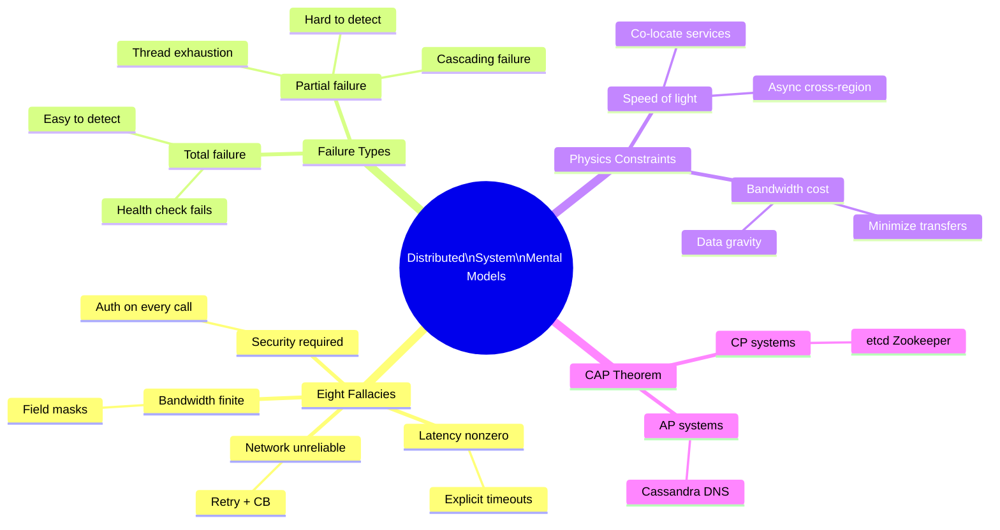
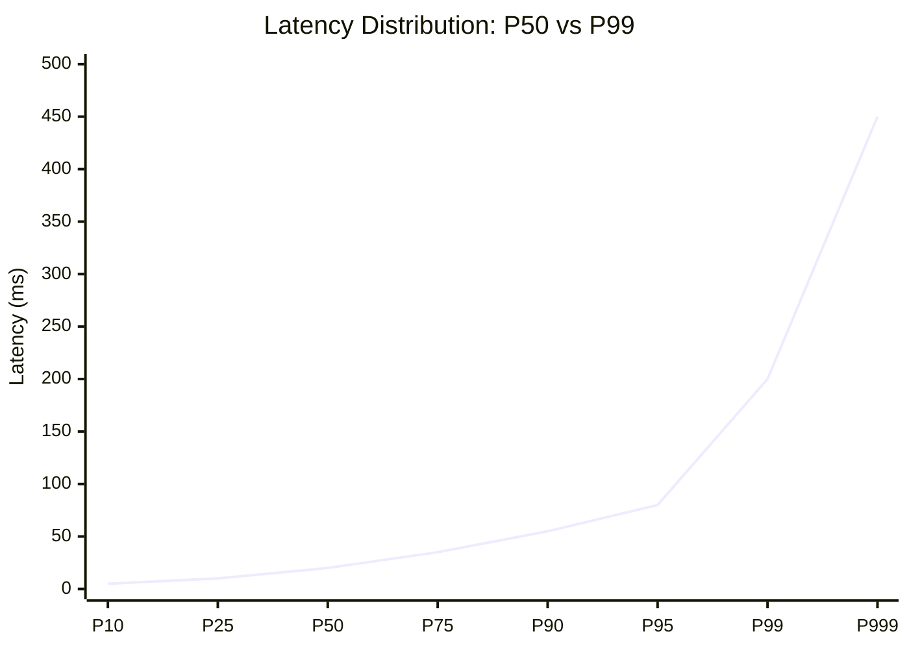
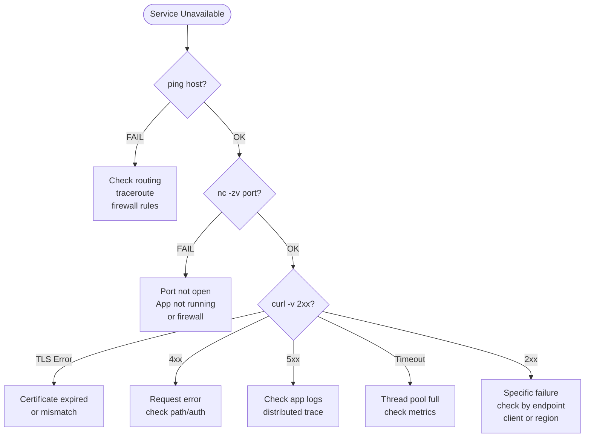

## Keywords in This File
{: .no_toc }

| # | Keyword | Weight |
|---|---|---|
| 28 | [Network Mental Models for Distributed System Design](#network-mental-models-for-distributed-system-design) | critical |
| 29 | [Latency vs Throughput Reasoning Framework](#latency-vs-throughput-reasoning-framework) | high |
| 30 | [Failure Diagnosis Patterns in Networked Systems](#failure-diagnosis-patterns-in-networked-systems) | critical |

---

# Network Mental Models for Distributed System Design

---
id: CN-028
title: "Network Mental Models for Distributed System Design"
category: Computer Networks
difficulty: ★☆☆
interview_weight: critical
seniority: mid-senior
tags: #mental-models #distributed-systems #network-reasoning #fallacies #design-thinking
---

## Quick Reference

**Difficulty:** ★☆☆ | **Asked at:** Mid-Senior | **Seniority:** Mid through Senior

---

### 🎯 Model Answer

**30 seconds:**
The most dangerous assumption in distributed system design is that the network is reliable. The Eight Fallacies of Distributed Computing (Peter Deutsch, Sun Microsystems) enumerate the wrong assumptions engineers make: the network is reliable, latency is zero, bandwidth is infinite, the network is secure, topology doesn't change, there is one administrator, transport cost is zero, the network is homogeneous. Every robust distributed system design explicitly handles the violations of these fallacies. Beyond the fallacies, the key mental models are: everything fails eventually (design for failure, not against it), the speed of light imposes minimum latency (distance bounds performance), and partial failure is harder than total failure (partial failure is invisible and corrupting).

**3 minutes:**
**The Eight Fallacies in practice:**
1. Network is reliable: every RPC must handle network errors; retry with backoff, circuit breakers
2. Latency is zero: every remote call has latency; batching, async, caching, co-location
3. Bandwidth is infinite: large payloads degrade performance; compression, pagination, streaming
4. Network is secure: every endpoint is a potential attacker; authenticate, authorize, encrypt
5. Topology doesn't change: services move, IPs change; service discovery, not hardcoded IPs
6. One administrator: routing and policy changes without your knowledge; network SLOs, alerts
7. Transport cost is zero: network calls cost money in cloud; minimize cross-AZ/region calls
8. Homogeneous network: different links have different MTU, bandwidth, loss; assume heterogeneity

**Partial failure mental model:** In a distributed system, partial failure is the hardest failure mode. A total failure (server is down) is easy to detect (connection refused, timeout). A partial failure (server accepts connections but hangs on some requests) is invisible to health checks and causes cascading issues as threads/connections pile up. Design for partial failure: timeouts on EVERY call (not just retries), circuit breakers (stop sending to failing dependencies), bulkheads (isolate failures to one part of the system).

**Speed of light model:** The minimum round-trip time between two points is 2 * (distance / 2/3 speed-of-light). New York to London = 5,570 km. Minimum RTT = 2 * (5570 / 200,000 km/s) = 55ms. Measured RTT is usually 70-80ms (routing overhead). No amount of software optimization can beat physics. Co-locate services that must communicate frequently. Accept latency for cross-continental synchronization.

**Blank Mind Recovery:** Eight Fallacies = wrong assumptions about networks. Partial failure = hardest case (invisible). Speed of light = sets minimum latency. Everything fails = design for it. CAP theorem = choose consistency or availability, not both.

---

### 📘 Concept Explanation

**Core concept:** Mental models are shortcuts that allow engineers to quickly reason about complex systems without re-deriving first principles. Correct mental models lead to correct design decisions; incorrect mental models (the fallacies) lead to fragile systems.

**The Eight Fallacies with failure examples:**

```
Fallacy 1: Network is Reliable
  Real failure: a partial network partition drops
  20% of packets between two services.
  Symptom: some RPCs succeed, some fail randomly.
  Detection: impossible without metrics.
  Design: retry (with idempotency), circuit breaker,
  timeout on every RPC.

Fallacy 2: Latency is Zero
  Real failure: service works in local dev
  (0.1ms loopback), fails at 200ms in prod
  (cross-AZ) because timeout set to 100ms.
  Symptom: 100% timeout errors in prod.
  Design: measure actual latency; set timeout
  at P99 + buffer; never use default timeouts.

Fallacy 3: Bandwidth is Infinite
  Real failure: microservice passes full user
  object (200KB) in every RPC.
  At 1000 RPS: 200 MB/s cross-AZ network traffic.
  Cost: $0.02/GB cross-AZ = $3456/day.
  Design: pass IDs, not full objects;
  fetch what you need; use field masks.

Fallacy 7: Transport Cost is Zero
  Real failure: architecture places compute
  in us-east-1 and storage in us-west-2
  (cheaper storage pricing).
  Data transfer: 50ms cross-region + $0.09/GB.
  At 10TB/day: $900/day transport cost.
  Design: co-locate compute and data;
  cloud pricing punishes cross-region traffic.
```

> **Code walkthrough:** WHAT IT SHOWS: four of the Eight Fallacies mapped to concrete production failures with symptoms, detection challenges, and design responses. KEY MECHANISM: each fallacy describes a hidden assumption that engineers make when designing locally but that breaks in production; the failures are typically invisible in development (loopback is reliable, fast, free) and only surface at production scale. WHY IT MATTERS: the Eight Fallacies are the foundation of production-grade distributed system design; engineers who haven't internalized these fallacies repeatedly make the same mistakes; teams that know the fallacies design systems that handle failure gracefully. WHAT BREAKS: assuming any of the eight things (e.g., Fallacy 2 by using the default timeout) creates systems that work 99% of the time but catastrophically fail the remaining 1%; the 1% failures are often the most damaging (slow requests pile up, threads exhaust, cascading failure). TAKEAWAY: for every distributed system component you design, go through the Eight Fallacies checklist; explicitly address each one in the design; the time spent on this prevents weeks of production debugging.

**The Partial Failure mental model:**

```
Failure Spectrum:
  
  Total Failure (easy)         Partial Failure (hard)
  |                            |
  Server unreachable           Server accepts connections
  TCP connection refused       But 20% of requests hang
  Health check: FAIL           Health check: PASS (wrong!)
  Detection: immediate         Detection: requires metrics
  
  Partial failure pattern:
  
  [Client] --RPC--> [ServiceA]
    ^                    |
    |                    v
    |              [ServiceB] <- partial failure
    |             (50% requests hang 30s)
    |
    |  ServiceA's thread pool:
    |  Thread 1: waiting for ServiceB... (30s)
    |  Thread 2: waiting for ServiceB... (30s)
    |  Thread 3: waiting for ServiceB... (30s)
    |  ...all threads exhausted...
    |  ServiceA: new requests queued, then failed
    |
    Result: ServiceB's partial failure cascades
    to ServiceA (thread exhaustion),
    then to Client (ServiceA timeout),
    then to entire system.

  Defense: Timeout + Circuit Breaker

  Timeout: ServiceA waits max 500ms for ServiceB
  Circuit breaker: if 50% fail in 10 seconds,
    OPEN circuit (fail fast), try again in 30s
  Bulkhead: ServiceB calls use dedicated thread
    pool; ServiceA's core functions use separate pool
```

> **Code walkthrough:** WHAT IT SHOWS: how a partial failure in ServiceB cascades through ServiceA to the entire system via thread exhaustion, and the three defenses (timeout, circuit breaker, bulkhead). KEY MECHANISM: partial failure is dangerous because it's invisible - the failing service is reachable, health checks pass, but a percentage of requests are slow; threads accumulate waiting for the slow responses; eventually the thread pool is exhausted; new requests to ServiceA start queuing, then failing. WHY IT MATTERS: this cascading pattern is the most common cause of production outages in microservice architectures; removing one component causes the whole system to fail; circuit breakers break the cascade by fast-failing requests to known-bad dependencies. WHAT BREAKS: circuit breakers require configuration (threshold, reset time); set too sensitive = frequent false trips disrupting healthy traffic; set too permissive = not protecting against real cascades; tuning requires measuring actual failure rates. TAKEAWAY: every service call must have a timeout; every dependency should have a circuit breaker; bulkheads should isolate critical paths from non-critical ones; these three patterns together prevent partial failures from cascading.

**Speed of light constraint:**

```
Distance -> Minimum RTT mapping:

Same rack:           0.1ms
Same datacenter:     0.5-2ms
Same city (metro):   1-5ms
Same continent:      10-50ms
Transatlantic:       70-100ms
US to Asia:          130-180ms
US to Australia:     170-200ms

Rule of thumb:
  1ms per 200km (rough fiber estimate)
  (light in fiber travels at ~2/3 speed of light)

Implication for design:
  Synchronous call chain:
    5 services x 50ms each = 250ms minimum
    (even if each service is instant)
    -> use async, fan-out, or co-locate

  Consensus (Raft, Paxos): needs quorum
    2-datacenter quorum, 100ms apart:
    Leader sends proposal: 100ms
    Follower responds: 100ms
    Total: 200ms minimum per write
    -> place replicas close to each other
    -> accept: 3 replicas same region is faster
       than 2 continents apart
```

> **Code walkthrough:** WHAT IT SHOWS: a distance-to-latency mapping showing the minimum RTT (speed-of-light bound) for various geographic distances, with design implications. KEY MECHANISM: fiber-optic light travels at approximately 2/3 of the speed of light in vacuum; the round-trip distance (2x one-way) divided by this speed gives the theoretical minimum latency; actual latency is 20-40% higher due to routing overhead and packet processing. WHY IT MATTERS: teams that build globally distributed systems often underestimate cross-region latency; a 200ms round-trip is unavoidable between US and Asia; any synchronous operation in that critical path will have at least 200ms baseline latency. WHAT BREAKS: call chains that add synchronous RPCs across regions accumulate latency; a 5-service chain with each service calling the next adds up to 5x the per-hop latency; async patterns or event-driven design break the synchronous chain and allow services to respond without waiting for downstream services. TAKEAWAY: draw a latency map early in system design; identify which services communicate frequently; co-locate them; accept the speed-of-light tax for cross-region and design asynchronously around it.

---

### 💻 Code Example

**BAD: Violating multiple fallacies simultaneously**

```python
# BAD: Multiple fallacy violations in one function

import requests

def process_order(order_id, user_id):
    # Fallacy 2 + default timeout = no timeout:
    user = requests.get(
        f"http://user-service/users/{user_id}"
    )  # No timeout! Hangs if service is slow.

    # Fallacy 3: fetches entire user object
    # (may be 200KB) when only email needed
    email = user.json()["email"]

    # Fallacy 5: hardcoded IP, no service discovery
    inventory = requests.get(
        "http://10.0.1.15/inventory/check",
        json={"order_id": order_id}
    )  # IP changes on redeploy -> breaks

    # Fallacy 1: no retry, assumes network is reliable
    # Fallacy 4: no authentication to inventory service
    return {"email": email,
            "in_stock": inventory.json()["available"]}
```

> **Code walkthrough:** WHAT IT SHOWS: a single function that violates five of the Eight Fallacies simultaneously - a common pattern in early microservice implementations. KEY MECHANISM: missing timeout (Fallacy 2) means this function can hang indefinitely; full user fetch (Fallacy 3) wastes bandwidth; hardcoded IP (Fallacy 5) breaks on redeploy; no retry (Fallacy 1) means a single packet drop fails the operation; no auth (Fallacy 4) means any service can call inventory directly. WHY IT MATTERS: this pattern is copied throughout a codebase; one "template" function with all these violations becomes the standard; fixing it later requires changing every downstream call. WHAT BREAKS: the missing timeout is the most critical issue; under partial failure in user-service, all threads in this service hang waiting; the service becomes completely unresponsive even though user-service is only partially failing. TAKEAWAY: add a code review checklist derived from the Eight Fallacies; every outbound HTTP call must have: explicit timeout, retry with backoff, service discovery (not hardcoded IP), authentication, and minimal payload.

**GOOD: Explicitly addressing the fallacies**

```python
# GOOD: Design explicitly addresses fallacies

import httpx
import tenacity
from circuitbreaker import circuit

USER_SERVICE = "http://user-service"  # DNS-based (Fallacy 5)
INVENTORY_SERVICE = "http://inventory-service"

# Fallacy 2: explicit timeout per call type
USER_TIMEOUT = httpx.Timeout(0.5)      # 500ms max
INVENTORY_TIMEOUT = httpx.Timeout(1.0) # 1s max

@tenacity.retry(
    stop=tenacity.stop_after_attempt(3),
    wait=tenacity.wait_exponential(multiplier=0.1),
    retry=tenacity.retry_if_exception_type(
        httpx.TransportError  # Fallacy 1: retry
    )
)
@circuit(failure_threshold=5,
         recovery_timeout=30)  # Circuit breaker
def get_user_email(user_id: str) -> str:
    with httpx.Client(timeout=USER_TIMEOUT) as c:
        # Fallacy 3: fetch only email field
        resp = c.get(
            f"{USER_SERVICE}/users/{user_id}/email",
            headers={"Authorization": f"Bearer {get_token()}"}
            # Fallacy 4: authenticate every call
        )
        resp.raise_for_status()
        return resp.json()["email"]

def process_order(order_id: str, user_id: str):
    try:
        email = get_user_email(user_id)
    except Exception as e:
        # Fallacy 1: handle network failure gracefully
        log_error("user_service_failure", e)
        return {"error": "order_processing_delayed"}

    # Continue with other calls...
    return {"email": email, "status": "processing"}
```

> **Code walkthrough:** WHAT IT SHOWS: the same function rewritten to explicitly address five fallacies - explicit timeouts, retry with exponential backoff, circuit breaker, field-specific API endpoint, and authentication on every call. KEY MECHANISM: tenacity provides retry with exponential backoff (waits 100ms, 200ms, 400ms between retries) for transient network errors only; the @circuit decorator opens the circuit after 5 failures, fast-failing all subsequent calls for 30 seconds (preventing thread accumulation); the field-specific endpoint (/email vs /users/{id}) fetches only the required data. WHY IT MATTERS: this pattern is resilient to the most common production failure modes; a partial user-service failure triggers circuit breaker after 5 failures, protecting this service's thread pool; the 500ms timeout prevents hanging indefinitely. WHAT BREAKS: the circuit breaker and retry settings are application-specific; a 500ms timeout may be too low during high load; use P99 latency plus 2x buffer as the timeout value, measured from actual production data. TAKEAWAY: treat the Eight Fallacies as a design checklist; add explicit code for each fallacy: timeout (Fallacy 2), retry (Fallacy 1), circuit breaker (Fallacy 1), field masks (Fallacy 3), service discovery (Fallacy 5), authentication (Fallacy 4).

---

### 🎓 Answers by Seniority

**Junior / Mid-level answer:**
The most important mental model is that networks fail in ways you don't expect. The Eight Fallacies of Distributed Computing (by Peter Deutsch) list common wrong assumptions: the network is reliable, latency is zero, bandwidth is infinite, and the network is secure are the most important ones. Every RPC call should have a timeout and retry logic. Services should use service discovery instead of hardcoded IPs. Partial failures (where a service accepts connections but hangs) are the hardest to debug.

**Senior / Staff answer:**
The Eight Fallacies are a useful checklist, but the deeper mental model is about failure modes. Total failures are easy: the service is down, the health check fails, traffic routes elsewhere. Partial failures are dangerous: the service accepts connections but hangs 20% of requests; health checks pass; threads accumulate; cascading failure. The defense is timeouts + circuit breakers + bulkheads - these three patterns together ensure that one failing dependency can't take down the entire system. The speed-of-light model informs architecture: any synchronous call chain that crosses regions accumulates irreducible latency; the only way to reduce it is to co-locate services or move to async. Cloud transport costs (Fallacy 7) are a real operational cost that I've seen kill profitability - placing compute in us-east-1 and storage in eu-west-1 because each is cheapest independently ignores the $0.09/GB cross-region transfer cost that adds up to thousands per day at scale. The meta-lesson: the network has physics constraints (latency), economic constraints (bandwidth cost), and reliability constraints (failures) that must all be accounted for in design.

---

### ⚠️ Common Misconceptions

**Misconception 1: "Kubernetes/cloud handles network reliability"**
Cloud providers provide infrastructure reliability (physical redundancy, SLA on network uptime), but they cannot prevent packet drops, network congestion, or partial failures at the application layer. Application-level timeout and retry handling is still required even in cloud environments. Cloud SLAs cover availability ("service is reachable") not request-level reliability ("every request succeeds within 100ms").

**Misconception 2: "More replicas = more resilience"**
More replicas of a stateless service increase resilience against server failures. But if all replicas share a failing dependency (database, message queue), all replicas fail together. Resilience requires identifying and protecting the critical path, not just adding more instances of services.

**Misconception 3: "Health checks guarantee service correctness"**
Health checks verify that the service is reachable and can respond to a simple request. They don't verify that the service correctly processes all requests, that dependencies are healthy, or that resources (threads, DB connections) aren't exhausted. A service with an exhausted thread pool may still pass health checks (the health check endpoint uses a separate lightweight handler) while failing real requests.

---

### 🚨 Failure Modes and Diagnosis

**Failure: Cascading failure from unconfigured timeouts**

```bash
# Symptom: entire system slow, not just one service
# Cascade: ServiceA -> ServiceB -> DatabaseC
# DatabaseC is slow (disk issue)

# Diagnose: check thread/connection pool exhaustion
# ServiceB metrics (Prometheus):
# Check: http_requests_in_flight

# Typical symptom pattern in logs:
# ServiceB: "waiting for DB connection..." x 1000
# ServiceA: "timeout waiting for ServiceB" x 5000
# Frontend: "504 Gateway Timeout" x 50000

# Identify the source:
# Find the service with INCREASING in-flight requests:
curl http://service-b:8080/metrics | grep in_flight
# http_requests_in_flight 847
# (should be < 50 for this service)

# Check database pool:
curl http://service-b:8080/metrics | grep pool
# db_pool_active_connections 50
# db_pool_pending_connections 800
# db_pool_max_connections 50
# -> Pool exhausted! New requests queue and wait

# Fix: timeout at each layer
# ServiceA timeout to ServiceB: 500ms
# ServiceB timeout to DB: 200ms
# DB query timeout: 100ms
# -> Total: 800ms max wait; no indefinite hangs

# Immediate mitigation: restart ServiceB
# to clear accumulated threads
# Long-term: add timeouts + circuit breaker
```

> **Code walkthrough:** WHAT IT SHOWS: diagnosing a cascading failure caused by database slowness propagating through a service chain due to missing timeouts. KEY MECHANISM: DatabaseC becomes slow; ServiceB's connections to DatabaseC back up; ServiceB's DB connection pool exhausts (50 connections max, 800 requests waiting); ServiceB's HTTP handlers block waiting for a DB connection; ServiceA's calls to ServiceB hang; ServiceA's thread pool exhausts; frontend gets 504 errors. WHY IT MATTERS: this exact cascading failure pattern has caused major outages at virtually every company with microservices; the fix (timeouts at every layer) is simple but requires discipline to implement consistently. WHAT BREAKS: restarting ServiceB immediately clears the accumulated threads and appears to fix the problem; without adding timeouts, the same cascade happens again the next time DatabaseC is slow. TAKEAWAY: configure timeouts at every layer: application timeout to downstream service, connection pool checkout timeout, database query timeout; the sum of these timeouts is the maximum request latency for the worst case; design these timeouts deliberately, not with defaults.

---

### 🎯 Interview Deep-Dive

| Format | Questions | Est. Time |
|---|---|---|
| Junior/Mid | 7 questions | 20-30 min |
| Senior/Staff | 7 questions + deep-dives | 30-40 min |

**[JUNIOR] Q1 - [CONCEPTUAL] What are the Eight Fallacies of Distributed Computing?**

The Eight Fallacies were articulated by Peter Deutsch at Sun Microsystems in the 1990s. They describe common wrong assumptions engineers make when building distributed systems:

1. The network is reliable (it drops packets and connections)
2. Latency is zero (there is always some latency)
3. Bandwidth is infinite (you can run out of bandwidth)
4. The network is secure (packets can be intercepted or forged)
5. Topology doesn't change (servers move, IPs change, pods restart)
6. There is one administrator (multiple teams control the network)
7. Transport cost is zero (cloud providers charge for data transfer)
8. The network is homogeneous (different links have different characteristics)

Each fallacy represents an assumption that leads to a class of production failures when violated. The most common violations in production: missing timeouts (Fallacy 2), missing retry logic (Fallacy 1), hardcoded IPs (Fallacy 5), and missing authentication (Fallacy 4).

*What separates good from great:* Knowing the source (Peter Deutsch, Sun Microsystems) and being able to give a production failure example for at least 4 of the 8 - not just reciting the list but knowing how each manifests in real systems.

---

**[MID] Q2 - [MECHANISM] Why is partial failure harder to handle than total failure?**

Total failure is detectable: the service is unreachable, connections are refused, health checks fail, load balancers route away from it. Recovery is automatic. Engineers design for total failure instinctively.

Partial failure is deceptive: the service accepts connections, health checks pass, but 20% of requests take 30 seconds instead of 50ms. The system appears operational but is slowly degrading:
- Threads waiting for the slow responses accumulate
- New requests queue behind waiting threads
- Queue fills up; new requests fail immediately
- Cascading failure as other services timeout waiting

Why it's harder:
1. Detection requires metrics, not just health checks
2. The failing service looks healthy from outside
3. The symptom (slow clients) appears upstream from the cause (slow dependency)
4. Timeouts are not set, so failures take 30+ seconds to surface

Defense requires explicit patterns: timeout on every call (limits hang duration), circuit breaker (stops sending to failing dependencies), metrics-based alerting (detects slowness, not just downtime).

*What separates good from great:* The thread accumulation mechanism specifically - threads waiting for slow responses fill the thread pool; new requests can't be served; this is why a 20% partial failure causes 100% service degradation; the math is: 100 threads / 30s average hang = 3.3 requests per second before thread pool exhausts; if traffic is > 3.3 RPS, threads fill faster than they drain.

---

**[SENIOR] Q3 - [TRADE-OFF] How do you decide where to place services geographically?**

Geographic placement decisions involve three constraints:

1. Latency to users: services should be close to users. CDN edge servers should be global; API servers should be in regions with high user concentration.

2. Latency between services: services that call each other synchronously should be co-located. Moving dependent services to different regions adds irreducible latency (speed of light). Rule: if two services have > 10 calls/user-request between them, they should be in the same region.

3. Data gravity: compute should follow data. Moving data across regions is expensive ($0.09/GB on AWS) and slow. Data should be where the computation happens.

Decision framework:
- User-facing services: place in user's region (latency to users)
- Internal services called frequently: co-locate with callers (latency between services)
- Data processing: co-locate with data (data gravity)
- Global services (auth, configuration): one region with read replicas everywhere

Anti-pattern: separate compute from storage by region for cost. A team that places compute in us-east-1 (cheapest compute) and storage in eu-west-1 (cheapest storage) optimizes for unit cost but pays $0.09/GB cross-region transfer, which at scale exceeds the unit cost savings.

*What separates good from great:* The 10-calls rule - I use it as a threshold because at 10ms RTT per call (same region), 10 calls = 100ms overhead; at 100ms RTT per call (cross-region), 10 calls = 1 second overhead; that difference is the architectural forcing function to co-locate.

---

**[SENIOR] Q4 - [DEBUGGING] A distributed system is slow but no individual component appears slow. Diagnose.**

This is the "distributed latency mystery" - classic symptom of a hidden partial failure or misconfigured timeout. Diagnostic approach:

Step 1: Get a distributed trace. Use Jaeger/Zipkin to trace one slow request end-to-end. The trace shows latency per span. The span with unexpectedly high latency is the starting point.

Step 2: Check the "missing time" - gaps in the trace where time passes but no span is recorded. Missing time is usually: network transit time (expected), queuing time (unexpected), or lock contention (CPU-side).

Step 3: If a specific service has high latency: check its metrics (thread pool utilization, DB connection pool, GC pause time, CPU utilization). High thread pool utilization -> queuing behind a slow dependency.

Step 4: Check for retry storms - one slow dependency causes many clients to retry; retries make the dependency even slower; the feedback loop looks like "everything is slow" because it IS: retries multiplied the load.

Step 5: P99 vs average - if average latency is fine but P99 is high, look for: garbage collection pauses (periodic), lock contention (bursty), or queue depth (builds up then flushes).

*What separates good from great:* The distributed trace as the first tool - many engineers grep logs and look at dashboards one service at a time; a distributed trace shows the entire request path with exact latency per hop; 5 minutes with a trace saves hours of log grepping.

---

**[MID] Q5 - [CONCEPTUAL] What is the CAP theorem and how does it affect distributed system design?**

CAP theorem (Brewer 2000): A distributed system that experiences a network partition (P) can guarantee either Consistency (C) or Availability (A), but not both simultaneously.

Definitions:
- Consistency: every read sees the most recent write (all nodes agree on current state)
- Availability: every request gets a response (no timeouts/errors)
- Partition tolerance: the system continues operating during network partition

In practice, network partitions happen (a switch fails, a link is saturated), so P is not optional. The real choice is: during a partition, do you serve stale data (A) or refuse requests (C)?

Design implications:
- CP systems (consistency + partition): during partition, some requests fail rather than return stale data. Examples: etcd, ZooKeeper, traditional RDBMS. Use for: distributed locks, configuration, financial transactions.
- AP systems (availability + partition): during partition, serve potentially stale data rather than refusing. Examples: Cassandra, DynamoDB (default), DNS. Use for: user profiles, product catalogs, anything tolerating eventual consistency.

The nuance: "consistency" has many levels (linearizability, sequential, causal, eventual). Modern systems often pick a point on the spectrum - not all-or-nothing.

*What separates good from great:* Recognizing that CAP is a simplification - PACELC extends CAP with: during normal operation (no partition), there is a trade-off between latency and consistency; systems like DynamoDB are tunable (quorum reads for consistency, single-node reads for latency); the real design space is a spectrum, not a binary choice.

---

**[SENIOR] Q6 - [TRADE-OFF] How does the "fallacies" framework apply to microservices specifically?**

Microservices amplify the impact of every fallacy because they turn in-process function calls into network calls:

Before microservices: `userService.getUser(id)` - in-process call, 0.01ms, never fails.
After microservices: `GET /users/{id}` - network call, 50ms, can fail.

This transformation makes all 8 fallacies instantly relevant:
- Fallacy 1: the HTTP call can fail (network error, service crash)
- Fallacy 2: 50ms is not zero; at 20 calls/request = 1 second of latency minimum
- Fallacy 3: serializing a large object over HTTP is much slower than in-memory access
- Fallacy 5: the user service's IP/URL changes when it redeploys; need service discovery

The "distributed monolith" anti-pattern: teams decompose into microservices but maintain tight synchronous coupling (service A calls B calls C calls D synchronously); this inherits all the fallacies of distribution while losing the performance benefits of in-process calls.

The correct approach: identify which services truly need to be separate (different deployment, team, scaling requirements) and keep tightly coupled services together; use async messaging between loosely coupled services to avoid synchronous call chains.

*What separates good from great:* The "distributed monolith" pattern as the most common microservice failure - teams decompose into microservices for organizational reasons but implement synchronous coupling everywhere; they get the worst of both worlds: distributed system complexity + monolith coupling; the fix is either consolidate (less microservices) or decouple with async messaging.

---

**[SENIOR] Q7 - [BEHAVIORAL] Describe a time when violating one of the Eight Fallacies caused a production incident.**

Situation: A payment processing service was deployed with a synchronous call to a fraud detection service on every transaction. The fraud detection service was third-party, hosted externally.

Fallacy violated: Fallacy 2 (latency is zero) + Fallacy 1 (network is reliable)

The failure: the third-party fraud service experienced an internal slowdown (P99 latency increased from 50ms to 8 seconds). Our payment service had no timeout configured (assuming Fallacy 2 - latency would be similar to local). Payment processing threads began accumulating waiting for fraud service responses. After 3 minutes, the thread pool exhausted. Payment service stopped accepting new requests. Customers experienced complete inability to checkout during peak shopping period.

Root cause: no timeout on the external API call; no circuit breaker; no fallback behavior (allow payment with async fraud check on failure).

Resolution: added 500ms timeout to fraud service call; added circuit breaker (5 failures -> 30 second open); added fallback: if fraud service unavailable, allow payment and flag for async review; alerted ops on circuit breaker open events.

Result: subsequent fraud service slowdown events triggered circuit breaker within 5 seconds; payment processing continued with async fraud review; no customer-visible impact.

*What separates good from great:* The fallback design - when the fraud service is unavailable, the business decision is "allow payment, flag for review" rather than "block payment"; this is a business + engineering conversation, not just a technical decision; understanding that the correct fallback requires business context is what makes senior engineers different from junior engineers who would just add a retry.

---

### ⚖️ Comparison Table

*(Omit: META keyword - focuses on reasoning patterns rather than alternatives to compare)*

---

### 🏛️ System Design

*(Omit: META mental-model keyword - the thinking patterns described here apply to system designs but this keyword is itself not a design topic)*

---

### 📊 Diagram

```
Eight Fallacies: Production Failure Map

Fallacy -> Primary Failure -> Defense
-------    ---------------    -------
F1 Reliable -> Partial failure -> Retry + CB
F2 Zero lat -> Cascading hang  -> Timeout
F3 Bandwidth -> Cost/perf hit  -> Field masks
F4 Secure   -> Data breach     -> Auth + TLS
F5 Topology -> Hardcode fail   -> Service disco
F6 One admin -> Policy change  -> Network alerts
F7 No cost  -> Budget overrun  -> Co-locate data
F8 Homogen  -> MTU mismatch    -> Test all paths
```

> **Diagram walkthrough:** WHAT IT DEPICTS: a concise mapping from each of the Eight Fallacies to the primary production failure it causes and the standard defensive pattern. HOW TO READ IT: each row is a fallacy (F1-F8), its most common production failure, and the design defense; the defenses are implementation patterns you add to code or architecture. KEY RELATIONSHIP: the fallacies F1 and F2 (reliability and latency) are the most operationally costly because their violations cause cascading failures; F4 (security) is the most business-critical because its violation causes data breaches. EDGE CASE: F8 (homogeneous network) is the least-known fallacy but causes subtle bugs; a service that works on 1500 MTU LAN may fail silently on a VPN path with 1427 MTU because TCP silently fragments and ICMP PMTUD may be filtered. INSIGHT: the defenses (retry, timeout, circuit breaker, service discovery, authentication) are not optional polish; they are the baseline requirements for any production distributed system; treating them as optional leads to the production incidents described in the failure column.



> **Diagram walkthrough:** WHAT IT DEPICTS: a mindmap organizing the key mental models for distributed system design into four categories: Eight Fallacies, Failure Types, Physics Constraints, and CAP Theorem. HOW TO READ IT: the root node is the umbrella topic; each branch represents a mental model category; leaf nodes are specific concepts or defenses; the structure shows how the categories relate to each other. KEY RELATIONSHIP: the Eight Fallacies define what can go wrong; Failure Types explain the mechanics; Physics Constraints explain what cannot be improved by software; CAP Theorem frames the fundamental trade-off; together they provide a complete reasoning framework. EDGE CASE: the Physics Constraints branch (speed of light, bandwidth cost) is often underweighted in system design interviews; candidates discuss software architecture without acknowledging physical limits; a strong answer addresses both. INSIGHT: the mindmap format is itself a mental model technique - organizing related concepts visually helps recall in an interview; when asked about distributed systems, mentally navigate this map to ensure complete coverage of the answer.

---

---

# Latency vs Throughput Reasoning Framework

---
id: CN-029
title: "Latency vs Throughput Reasoning Framework"
category: Computer Networks
difficulty: ★☆☆
interview_weight: high
seniority: junior-senior
tags: #latency #throughput #bandwidth-delay-product #queuing-theory #performance-reasoning
---

## Quick Reference

**Difficulty:** ★☆☆ | **Asked at:** Junior-Senior | **Seniority:** Junior through Senior

---

### 🎯 Model Answer

**30 seconds:**
Latency is the time for one unit of data to travel from source to destination. Throughput is how much data the system processes per unit of time. They are orthogonal: you can have low latency + low throughput (one packet, fast), low latency + high throughput (many parallel connections), high latency + low throughput (slow single connection), or high latency + high throughput (large bulk transfers). The key relationship: Bandwidth-Delay Product = bandwidth x RTT. This is the amount of in-flight data needed to fully utilize a high-bandwidth, high-latency link. Optimizing for latency often sacrifices throughput (smaller buffers) and vice versa.

**3 minutes:**
**Latency components:** total latency = propagation delay + transmission delay + processing delay + queuing delay. Propagation delay is distance / speed (irreducible). Transmission delay is size / bandwidth (reducible by bandwidth upgrades). Processing delay is computation time (reducible by optimization). Queuing delay is time waiting for the resource (reducible by adding capacity or reducing load).

**Throughput factors:** throughput is limited by the narrowest resource: the bottleneck. Common bottlenecks: network bandwidth, CPU processing rate, disk I/O rate, database query rate, lock contention. Throughput = 1 / (max time per item). To increase throughput: parallelize, pipeline, batch, or remove the bottleneck.

**The tension:** Batching increases throughput (amortizes per-batch overhead) but increases latency (items wait in the batch). Caching increases throughput (serves from cache) and decreases latency (no computation needed) but has consistency costs. TCP nagling (batching small packets) increases throughput on slow links but adds latency for interactive applications (games, SSH). Disabling nagling (TCP_NODELAY) reduces latency at the cost of more small packets.

**Bandwidth-Delay Product:** A 1 Gbps link with 100ms RTT has BDP = 100 Mbps. To fully utilize this link, there must be 12.5 MB of in-flight data (data sent but not yet acknowledged). TCP's receive window limits in-flight data. Default Linux window = 128KB, which only utilizes 1 Gbps to 10 Mbps effectively. Tuning tcp_rmem and tcp_wmem to 16MB allows 1 Gbps utilization on high-latency links.

**Blank Mind Recovery:** Latency = time for one unit. Throughput = units per second. BDP = bandwidth x RTT = in-flight data needed to saturate a link. Batch = more throughput, more latency. TCP_NODELAY = less latency, less throughput.

---

### 📘 Concept Explanation

**Latency components:**

```
Total Latency Breakdown:

Request path:
  Client -> Network -> Server
  
  Propagation delay: d/v
    d = distance (cannot be reduced)
    v = ~200,000 km/s in fiber
    NYC to London: 5,570 km / 200k km/s = 28ms
    (one-way; RTT = 2x = 56ms)
    IRREDUCIBLE by software

  Transmission delay: size/bandwidth
    10KB packet at 1 Gbps: 10KB/1Gbps = 0.08ms
    10KB packet at 1 Mbps: 10KB/1Mbps = 80ms
    REDUCIBLE: upgrade bandwidth or reduce size

  Processing delay: CPU time
    TLS handshake: 1ms (fast server)
    DB query (index): 0.5ms
    DB query (full scan): 100ms
    REDUCIBLE: optimize code, add index, cache

  Queuing delay: wait for resource
    Under load: 0 -> 500ms+ (variable)
    Thread pool queue: wait for handler
    Network queue: wait for bandwidth
    REDUCIBLE: add capacity, reduce load
    
  Example: P99 latency = 200ms breakdown:
    Propagation: 50ms (fixed)
    Transmission: 2ms (fast link)
    Processing: 10ms (normal)
    Queuing: 138ms (!)
    -> 69% of latency is queuing
    -> fix: reduce load or add capacity
```

> **Code walkthrough:** WHAT IT SHOWS: a latency breakdown showing the four components of total latency with their reducibility, including an example where queuing is the dominant factor. KEY MECHANISM: latency profiling breaks total latency into its components; propagation is irreducible; transmission, processing, and queuing are reducible; the highest-impact optimization targets the largest reducible component. WHY IT MATTERS: teams often optimize the wrong component; adding more powerful CPUs (reduces processing delay from 10ms to 5ms) has zero effect if queuing delay is 138ms; identifying the bottleneck component is essential before investing in optimization. WHAT BREAKS: queuing delay is bursty - it's near-zero under low load but dominates at high percentile (P99, P999); average latency looks fine; P99 looks bad; the difference is queuing delay that only appears at high concurrency. TAKEAWAY: measure latency by component (propagation, processing, queuing) using distributed tracing; always target the largest component first; queuing delay is the most impactful for web services at scale because it's proportional to load.

**Bandwidth-Delay Product:**

```
BDP = Bandwidth x RTT

Example: Long-haul data transfer

  Link: 10 Gbps, RTT: 100ms (cross-continental)
  BDP = 10 Gbps x 100ms = 1 Gbit = 125 MB

  To saturate this link, sender must have
  125 MB of unacknowledged (in-flight) data.

  TCP receive window limits in-flight data:
  Default Linux: 4 MB
  -> Actual throughput: 4MB / 100ms = 320 Mbps
  -> Only 3.2% of 10 Gbps utilized!

  After tuning (16MB window):
  -> Actual throughput: 16MB / 100ms = 1.28 Gbps
  -> Still only 12.8% of 10 Gbps

  After auto-tuning (up to 16MB, BDP-aware):
  -> Linux TCP auto-tuning targets BDP
  -> net.core.rmem_max = 134217728 (128MB max)
  -> tcp_rmem = "4096 87380 134217728"
  -> Throughput: up to 10 Gbps on good path

  Practical implication:
  AWS c5.18xlarge: 25 Gbps NIC
  S3 cross-region: 100ms RTT
  BDP: 312 MB
  Need: 312 MB in-flight to saturate
  -> Use S3 multipart upload (many parallel parts)
  -> Each part has its own TCP window
  -> 32 parallel 10MB parts = 320 MB in-flight
  -> Saturates 25 Gbps NIC
```

> **Code walkthrough:** WHAT IT SHOWS: how the Bandwidth-Delay Product limits TCP throughput on high-latency links and how to calculate the required in-flight data to saturate the link. KEY MECHANISM: TCP only sends data until the receive window is full; on a 100ms RTT link, the sender must have 125MB of unacknowledged data to keep 10 Gbps utilized; a 4MB receive window allows only 320 Mbps regardless of link bandwidth; large receive windows (or parallel TCP connections) are required to utilize high-bandwidth, high-latency links. WHY IT MATTERS: "why is my file transfer slow despite having a fast link?" is answered by BDP; the link is fast but the TCP window doesn't match the link's BDP; this is the most common networking performance issue for cross-continental or cloud storage transfers. WHAT BREAKS: increasing TCP receive window increases memory usage per connection; a server with 10,000 connections and 128MB receive window = 1.28 TB of memory reserved; set receive windows appropriately for workload type (high-latency bulk transfers vs low-latency interactive). TAKEAWAY: when data transfer is slower than expected despite ample bandwidth, check BDP; calculate bandwidth x RTT = required in-flight data; check if TCP receive window is less than this value; increase with `sysctl net.core.rmem_max` and `tcp_rmem` settings.

---

### 💻 Code Example

**Measuring latency components:**

```python
# Measure latency breakdown for an HTTP call

import time
import socket
import ssl
import httpx

def measure_latency_breakdown(url: str):
    # DNS resolution time:
    dns_start = time.perf_counter()
    host = url.split("//")[1].split("/")[0]
    socket.getaddrinfo(host, 443)
    dns_time = (time.perf_counter() - dns_start) * 1000

    # TCP connect time:
    tcp_start = time.perf_counter()
    with httpx.Client() as client:
        response = client.get(
            url,
            extensions={"trace": True},
        )
    # httpx provides timing breakdown:
    elapsed = response.elapsed.total_seconds() * 1000

    print(f"DNS resolution:    {dns_time:.1f}ms")
    print(f"Total request:     {elapsed:.1f}ms")
    # Note: httpx elapsed = after headers received
    # Not including body transfer time
    return {
        "dns_ms": dns_time,
        "total_ms": elapsed,
    }

# Better: use curl -w for full breakdown:
# curl -w "
#  dns_lookup:      %{time_namelookup}s
#  tcp_connect:     %{time_connect}s
#  tls_handshake:   %{time_appconnect}s
#  server_process:  %{time_starttransfer}s
#  total:           %{time_total}s
# " -o /dev/null -s https://example.com
```

> **Code walkthrough:** WHAT IT SHOWS: Python code and a curl command for measuring the four latency components of an HTTPS request: DNS resolution, TCP connect, TLS handshake, and server processing time. KEY MECHANISM: curl's `-w` format string provides per-component timing; time_namelookup = DNS; time_connect = TCP; time_appconnect = TLS; time_starttransfer = server processing; each component's contribution to total latency is visible; the highest component is the optimization target. WHY IT MATTERS: "my API is slow" is incomplete; "my API's server processing time is 500ms but DNS + TCP + TLS is only 10ms" identifies that optimization effort belongs in the application code, not the network. WHAT BREAKS: curl timing doesn't account for body transfer time; for large response bodies, add time_total - time_starttransfer = body transfer time; this matters for large file downloads. TAKEAWAY: add latency component measurement to your standard debugging toolkit; always break down "total latency" into its components before deciding what to optimize.

---

### 🎓 Answers by Seniority

**Junior / Mid-level answer:**
Latency is how long it takes for a single request to complete. Throughput is how many requests the system can handle per second. They're different: a fast race car (low latency) is not the same as a cargo ship (high throughput). The Bandwidth-Delay Product explains why file transfers can be slow on fast links: BDP = bandwidth x RTT. If the TCP receive window is smaller than BDP, the link is underutilized. Batching increases throughput but adds latency because items wait in the batch.

**Senior / Staff answer:**
Latency and throughput are orthogonal axes of performance, and optimization for one often trades against the other. Batching is the classic example: nagling in TCP batches small writes for higher throughput but adds 200ms latency for interactive traffic (why you disable TCP_NODELAY for SSH and Redis). The BDP is the most important formula for bulk data transfer: if your receive window < bandwidth x RTT, you're leaving performance on the table. At 10 Gbps with 100ms RTT (cross-regional), you need 125 MB in-flight to saturate the link; the default Linux TCP window (128KB) allows only 10 Mbps. For microservices, the latency-throughput trade-off appears in database connection pools: a small pool (low throughput) adds queuing latency under load; a large pool stresses the database; the correct size is max expected concurrency plus a modest buffer, measured from actual load patterns. Queuing delay is the dominant latency component at P99 for well-optimized services; the latency profile looks like: P50 = 20ms (no queue), P99 = 200ms (queue), P999 = 2s (long queue); the right fix is capacity (reduce queue depth) or load shedding (reject excess requests), not code optimization.

---

### ⚠️ Common Misconceptions

**Misconception 1: "Faster CPU always reduces latency"**
CPU speed reduces processing delay, which is one of four latency components. For services where queuing delay dominates (P99 latency much higher than P50 latency), faster CPU has minimal effect. The bottleneck must be identified first - adding CPU when the bottleneck is I/O (disk, network) or lock contention doesn't help.

**Misconception 2: "Throughput and latency always trade off"**
They often trade off (batching, buffering) but not always. A cache hit serves a request from memory in < 1ms instead of querying a database in 50ms - this both reduces latency and increases throughput. Removing a bottleneck (adding a database index) can reduce latency and increase throughput simultaneously. The trade-off is not fundamental; it's implementation-specific.

**Misconception 3: "Low latency requires expensive hardware"**
Propagation delay requires co-location (you can't beat physics), but processing and queuing delay are reducible through software design. Co-locating services (same host or same rack), reducing serialization overhead (use binary protocols), and tuning connection pools (reduce queuing) can dramatically reduce latency without hardware changes.

---

### 🚨 Failure Modes and Diagnosis

**Failure: High P99 latency with normal P50**

```bash
# Symptom: P50 latency 20ms, P99 latency 500ms
# System appears to perform well on average
# but some requests are very slow

# Diagnose: identify latency distribution shape

# Step 1: Get percentile breakdown
# Prometheus histogram query:
# histogram_quantile(0.99, rate(http_req_duration_bucket[5m]))
# histogram_quantile(0.50, rate(http_req_duration_bucket[5m]))
# If P99/P50 > 10: highly skewed = queuing

# Step 2: Check thread pool metrics
curl http://app:8080/metrics | grep -E "pool|queue|thread"
# thread_pool_queue_size 847  <- queue depth
# thread_pool_active 100      <- all threads busy

# Fix 1: increase thread pool size
# (if CPU is not already saturated):
# server.tomcat.max-threads=400 (Spring Boot)
# or uvicorn --workers=8

# Fix 2: reduce request processing time
# Use async I/O: don't block threads on I/O wait
# asyncio (Python), reactive (Java), async/await

# Fix 3: load shedding
# Reject excess requests immediately rather
# than queuing them:
# Return 429 when queue > threshold
# -> clients get fast failure, can retry elsewhere
# -> prevents queue depth from growing indefinitely

# Measure if fix worked:
# histogram_quantile(0.99, ...) should drop
# thread_pool_queue_size should stay near 0
```

> **Code walkthrough:** WHAT IT SHOWS: diagnosing the classic queuing-caused high-P99 latency and three approaches to fix it: increase capacity, reduce per-request time, and shed load. KEY MECHANISM: when all threads are busy, new requests queue; queue depth grows proportionally to excess demand; P99 latency includes queue wait time; the ratio P99/P50 indicates the queue depth severity; P99/P50 > 10 strongly suggests queuing. WHY IT MATTERS: serving the 99th percentile user well is critical; if 1% of users get 500ms responses while 99% get 20ms, the 1% loudly complain and are likely to churn; SLA commitments typically cover P99. WHAT BREAKS: increasing thread pool size beyond CPU capacity (over-provisioning) causes context-switch overhead; the server becomes slower for all requests; always measure CPU utilization before increasing thread pool size. TAKEAWAY: P99/P50 ratio is a quick queuing indicator; keep it below 5 for latency-sensitive services; above 10 indicates significant queuing that must be addressed through capacity or load shedding.

---

### 🎯 Interview Deep-Dive

| Format | Questions | Est. Time |
|---|---|---|
| Junior/Mid | 7 questions | 20-30 min |
| Senior/Staff | 7 questions + deep-dives | 35-40 min |

**[JUNIOR] Q1 - [CONCEPTUAL] What is the difference between latency and throughput?**

Latency is the time for a single operation to complete from start to finish. Examples: the time for a query to return results (50ms), the time for an HTTP request to complete (200ms).

Throughput is the rate of operations per unit time. Examples: requests per second (1000 RPS), bytes per second (10 Gbps), transactions per second (TPS).

They are different dimensions of performance:
- A single-lane road: low throughput (few cars) but fast (low latency for each car)
- A packed highway: high throughput (many cars) but slow for each car (high latency due to congestion)

In computing:
- A serial (single-threaded) system: low throughput but low latency for each request (no queuing)
- A highly concurrent system with many threads: high throughput but variable latency (P99 high due to queuing when threads exhaust)

You can have: low latency + low throughput, low latency + high throughput (ideal), high latency + high throughput (bulk processing), high latency + low throughput (bad).

*What separates good from great:* The concurrency connection - throughput = parallelism x (1 / per-request latency); increasing parallelism increases throughput; but if requests compete for a shared resource (lock, connection), latency increases; the trade-off is inherent in shared-resource contention.

---

**[MID] Q2 - [MECHANISM] What is the Bandwidth-Delay Product and why does it matter?**

BDP = Bandwidth x Round-Trip Time

It represents the amount of data "in flight" - data that has been sent but not yet acknowledged.

Example: 1 Gbps link, 100ms RTT
BDP = 1 Gbps x 0.1s = 100 Mbits = 12.5 MB

To fully utilize this link, the sender must have 12.5 MB of unacknowledged data. TCP limits in-flight data by the receive window size. If the receive window is smaller than the BDP, the sender pauses waiting for acknowledgments, and the link is underutilized.

Why it matters:
- Default TCP window (Linux): 128KB
- On a 1 Gbps / 100ms link: 128KB window -> max throughput = 128KB / 100ms = 10 Mbps (only 1% of link capacity)
- With 16MB window: max throughput = 16MB / 100ms = 1.28 Gbps

Tuning for high-BDP links:
- Increase kernel TCP buffer: `sysctl -w net.core.rmem_max=134217728`
- Enable TCP auto-tuning (default on Linux): `net.ipv4.tcp_window_scaling = 1`
- Use parallel connections (S3 multipart, concurrent HTTP/2 streams)

*What separates good from great:* Calculating the BDP for your specific link and comparing to your TCP window size - this is the diagnostic that instantly tells you whether TCP buffer tuning will help; if window_size > BDP, tuning won't help (the bottleneck is elsewhere); if window_size < BDP, tuning will directly improve throughput.

---

**[SENIOR] Q3 - [TRADE-OFF] How does TCP Nagle's algorithm affect the latency-throughput trade-off?**

Nagle's algorithm (RFC 896) batches small TCP segments into larger ones: if there is unacknowledged data in flight, hold new small data until: (1) ACK is received, or (2) enough data to fill an MSS accumulates. This reduces the number of small packets on the network (reduces overhead, improves throughput on slow links).

Impact:
- Throughput: improved (fewer packets, less header overhead)
- Latency: increased by up to 200ms (wait for ACK before sending next small segment)

When Nagle's hurts (disable with TCP_NODELAY):
- Interactive applications: SSH, telnet (each keypress must arrive instantly)
- Redis: requests are small; waiting for Nagle's batching adds 200ms round trips
- Databases: query responses must arrive immediately; Nagle's adds latency

When Nagle's helps (keep enabled):
- Bulk data transfers: large files benefit from maximum segment size
- Streaming data to slow links: reduces packet overhead

Configuration:
```python
import socket
sock = socket.socket()
sock.setsockopt(socket.IPPROTO_TCP, socket.TCP_NODELAY, 1)
# TCP_NODELAY = 1 -> disable Nagle's = low latency
```

> **Code walkthrough:** WHAT IT SHOWS: setting TCP_NODELAY to disable Nagle's algorithm on a socket, trading throughput for lower latency. KEY MECHANISM: TCP_NODELAY = 1 disables Nagle's algorithm; every write to the socket creates a TCP segment immediately without buffering; this eliminates the 200ms wait for ACK before sending the next small segment. WHY IT MATTERS: Redis clients, database drivers, and SSH clients all set TCP_NODELAY; without it, interactive queries can be delayed by 200ms per round trip due to Nagle's buffering. WHAT BREAKS: disabling Nagle's on high-volume streaming connections increases the number of small packets; on slow or congested links, this can cause packet fragmentation and increased overhead. TAKEAWAY: always set TCP_NODELAY for latency-sensitive connections (Redis, databases, SSH, WebSocket); leave Nagle's enabled for bulk data transfers.

*What separates good from great:* Knowing that Redis's default client behavior is to pipeline (batch) multiple commands in one TCP write, which makes TCP_NODELAY essential - if you pipeline 10 Redis commands but Nagle's buffers the data, you wait 200ms before the first byte is sent; TCP_NODELAY ensures pipelines are sent immediately.

---

**[MID] Q4 - [CONCEPTUAL] How does batching affect latency and throughput?**

Batching collects multiple items and processes them together as a group. It trades latency for throughput:

Throughput gain: fixed overhead (lock acquisition, network round trip, DB insert) is paid once per batch instead of once per item. For a database insert with 10ms overhead, inserting 1 item/s = 10ms overhead/s. Batching 100 items = 10ms overhead / 100 items = 0.1ms overhead/item. 100x efficiency.

Latency cost: the first item in a batch must wait for the batch to fill before being processed. If batch size is 100 and arrival rate is 10/s, the first item waits up to 10 seconds in the batch. Batching directly increases latency proportionally to batch fill time.

Optimal batching: use time-based batching with a maximum delay: "collect items for up to 50ms OR until batch size reaches 100, whichever comes first." This bounds latency at 50ms while still amortizing overhead for high-rate bursts.

Examples:
- Kafka producer: `batch.size=16384` (bytes) and `linger.ms=5` (max wait) - both bounds
- Database write-ahead log: fsync every 100ms or every 1MB (bounds both)
- HTTP/2 HEADERS frame: send immediately, DATA frames can batch

*What separates good from great:* The dual bound (time + size) as the correct batching strategy - size-only batching causes unbounded latency under low load (batch never fills); time-only batching wastes throughput opportunities under high load; dual-bound batching provides both latency bound (time trigger) and throughput optimization (size trigger).

---

**[JUNIOR] Q5 - [CONCEPTUAL] What is Little's Law and how does it relate to queuing?**

Little's Law: L = lambda x W

Where:
- L = average number of items in the system (queue + in-service)
- lambda = arrival rate (requests per second)
- W = average time in system (latency)

Rearranged: Throughput = L / W (or lambda = L / W)

Implication for web services:
If your service handles 100 concurrent requests (L) and average latency is 50ms (W):
Throughput = 100 / 0.05s = 2000 RPS

To increase throughput: increase concurrency (L) or decrease latency (W)

Service design: if target is 5000 RPS at 50ms: need L = 5000 x 0.05 = 250 concurrent requests -> size thread pool for 250+ threads (or use async I/O to handle 250 concurrent without 250 threads)

For queuing: if arrivals exceed processing (lambda > service rate): L grows indefinitely, W grows indefinitely. Load shedding (rejecting excess) is the only sustainable defense.

*What separates good from great:* Using Little's Law to size thread pools - instead of guessing at thread pool size, calculate: target throughput x expected latency = required concurrency; this is the minimum thread pool size; add 20% buffer; this is the engineering-based approach to capacity planning.

---

**[SENIOR] Q6 - [TRADE-OFF] When should you optimize for latency vs throughput?**

Optimize for latency when:
- User-facing interactive applications: humans perceive > 100ms as "slow"
- Real-time systems: game servers, financial trading, live video
- Synchronous API calls in request paths: each call adds to total response time
- SLA requires P99 below a threshold

Optimize for throughput when:
- Batch processing: analytics, ETL, machine learning training
- Background jobs: email sending, report generation, index building
- Cost optimization: maximizing work per dollar of infrastructure
- Bandwidth-limited transfers: file backup, data lake ingestion

Optimize both simultaneously when:
- You can remove a bottleneck without trading (e.g., add a database index)
- You can add caching (reduces latency AND increases throughput)
- You can remove unnecessary work (e.g., reduce payload size)

Common mistake: optimizing throughput for a latency-critical service. Adding more parallelism (threads, processes) increases throughput but adds scheduling overhead; under high concurrency, context switches dominate and P99 latency increases even as average throughput improves.

*What separates good from great:* The context-switch cliff - beyond a certain number of threads (typically 2-4x CPU cores), additional threads increase context-switch overhead; average throughput may still improve but P99 latency worsens; this is why async I/O (handles many concurrent requests with few threads) is better for P99 than blocking I/O with many threads.

---

**[SENIOR] Q7 - [DEBUGGING] Your service's throughput is lower than expected. Diagnose systematically.**

Step 1: Identify the actual bottleneck with metrics:
```bash
# CPU-bound? 
top  # CPU > 80% on all cores -> need more CPU or less computation

# I/O-bound?
iostat -x 1  # %util > 90% on disk -> disk bottleneck

# Network-bound?
sar -n DEV 1  # TX/RX close to NIC capacity -> network bottleneck

# Memory-bound?
vmstat 1  # si/so (swap in/out) > 0 -> memory bottleneck
```

> **Code walkthrough:** WHAT IT SHOWS: the four fundamental bottleneck categories (CPU, I/O, network, memory) and the command-line tools to identify which is limiting throughput. KEY MECHANISM: every performance bottleneck falls into one of these four categories; monitoring each independently narrows down the actual limiting resource; a CPU-bound service won't improve by adding more network bandwidth; identifying the wrong bottleneck wastes optimization effort. WHY IT MATTERS: "throughput is low" is too vague to act on; "CPU utilization is 95% on all cores and throughput is 3000 RPS" immediately suggests the path: reduce per-request CPU cost (algorithmic optimization, caching) or add more CPU (horizontal scaling). WHAT BREAKS: iostat %util can be misleading for SSDs (SSDs can handle parallel I/O; 90% of a single queue doesn't mean 90% saturated for an NVMe drive with 32 queues). TAKEAWAY: before any throughput optimization, run all four resource checks; identify the one at or near 100%; that is the bottleneck; all other optimization is a distraction until the true bottleneck is addressed.

Step 2: If not resource-limited, check for lock contention and serialization:
- Thread pool too small? All threads busy, requests queuing
- Database connection pool exhausted?
- Lock contention in application code (GIL in Python, synchronized in Java)?
- Serialization bottleneck (slow JSON parsing at high RPS)?

Step 3: Profile with production-safe profilers:
- async-profiler (Java): low-overhead, shows CPU hotspots
- py-spy (Python): non-invasive, shows where time is spent
- pprof (Go): built-in profiling

*What separates good from great:* Profiling in production (not just dev) because production workloads have different data and access patterns; dev profiling shows incorrect hotspots; async-profiler and py-spy have < 1% overhead and can be run safely in production during an incident.

---

### ⚖️ Comparison Table

*(Omit: ★☆☆ tier - conceptual framework rather than alternatives to compare)*

---

### 🏛️ System Design

*(Omit: foundational reasoning framework rather than a system design topic)*

---

### 📊 Diagram

```
Latency vs Throughput Trade-offs:

           Low Latency    High Latency
           -----------    ------------
High       Ideal          Bulk transfer
Throughput async IO       (S3, pipeline,
           HTTP/2 QUIC    not interactive)

Low        Single         Worst case
Throughput fast request   (serial, slow,
           (simple API)   no batching)

Optimization tools:
  Latency:    co-locate | cache | async | TCP_NODELAY
  Throughput: batch | pipeline | parallel | big windows
  Both:       remove bottleneck | add index | cache
```

> **Diagram walkthrough:** WHAT IT DEPICTS: a 2x2 matrix of latency/throughput combinations with example systems in each quadrant and optimization tools. HOW TO READ IT: the X-axis is latency (low to high), Y-axis is throughput (low to high); the top-left (ideal) is the target; specific tools for improving each dimension are listed below the matrix. KEY RELATIONSHIP: some tools improve only one dimension (TCP_NODELAY reduces latency but may reduce throughput; batching increases throughput but increases latency); some tools improve both (caching, removing bottlenecks). EDGE CASE: the "ideal" quadrant (high throughput + low latency) requires careful workload design; heavy batch computation (high throughput) on the same service as interactive queries (low latency) degrades P99 for the interactive queries; separate workloads to different services. INSIGHT: most services should target the high-throughput + low-latency quadrant by using async I/O (handles many requests with few threads), connection pooling (reuses expensive connections), and caching (eliminates redundant computation).



> **Diagram walkthrough:** WHAT IT DEPICTS: a latency percentile distribution chart showing how latency increases from P10 (5ms) to P999 (450ms), with a pronounced jump at P99. HOW TO READ IT: the X-axis shows percentile markers (P10 = fastest 10% of requests); the Y-axis shows latency in milliseconds; the curve rises slowly until P95 then accelerates sharply at P99-P999. KEY RELATIONSHIP: the steep rise at P99-P999 indicates a queuing-dominated tail; most requests complete at 20ms (P50) but a small fraction encounter queuing and take 200ms+ (P99); fixing this requires reducing the queue depth (capacity) or load shedding. EDGE CASE: the P999 (450ms) represents 0.1% of requests; at 10,000 RPS, that's 10 requests per second experiencing 450ms latency; customers who happen to hit these requests report "slow" service even when average performance is fine. INSIGHT: always publish P99 and P999 latency alongside P50; averages are misleading for user experience because they hide the tail that actual users encounter most during peak traffic; design SLAs around P99, not averages.

---

---

# Failure Diagnosis Patterns in Networked Systems

---
id: CN-030
title: "Failure Diagnosis Patterns in Networked Systems"
category: Computer Networks
difficulty: ★☆☆
interview_weight: critical
seniority: mid-senior
tags: #failure-diagnosis #debugging #network-troubleshooting #methodology #production
---

## Quick Reference

**Difficulty:** ★☆☆ | **Asked at:** Mid-Senior | **Seniority:** Mid through Staff

---

### 🎯 Model Answer

**30 seconds:**
Failure diagnosis in networked systems follows a systematic methodology: divide and conquer, layer-by-layer isolation, and correlation across multiple data sources. The key tools are: traceroute/ping for connectivity, tcpdump/Wireshark for packet-level debugging, curl -v for HTTP debugging, and distributed traces for multi-service failures. The most effective diagnostic pattern: narrow the failing scope first (which layer, which service, which geographic region), then drill down within that scope. Most production failures are caused by five root causes: mis-configured timeouts, resource exhaustion (threads, connections, memory), cascading failures from a single dependency, traffic spikes, and DNS/routing changes.

**3 minutes:**
**The five most common production failure root causes:**
1. Mis-configured timeouts: service hangs because downstream service is slow; threads accumulate; cascade. Fix: explicit timeout at each call.
2. Resource exhaustion: thread pool, connection pool, file descriptors, memory all have limits; when exceeded, new requests fail or queue indefinitely. Fix: monitor and alert on utilization; set pool sizes explicitly.
3. Cascading failure: one slow dependency causes thread accumulation in upstream services, which causes their dependencies to slow, etc. Fix: circuit breaker + bulkhead.
4. Traffic spikes: sudden 10x traffic without proportional capacity; queues build; latency explodes. Fix: auto-scaling, rate limiting, load shedding.
5. DNS/routing changes: new deployment changes service IP; old clients still use cached IP; connection to wrong host. Fix: DNS TTL awareness, health checks, blue-green deployment with DNS update.

**Layer-by-layer diagnosis framework:**
1. L1/L2: ping - is host reachable?
2. L3: traceroute - where does routing fail?
3. L4: nc/nmap - is the TCP port open?
4. L7: curl -v - is the application responding correctly?
5. Application: distributed trace - where in the call chain is the failure?

**Blank Mind Recovery:** Five causes: timeout, exhaustion, cascade, spike, DNS. Five tools: ping, traceroute, nc, curl -v, distributed trace. Top-down: ping -> traceroute -> nc -> curl -> trace.

---

### 📘 Concept Explanation

**Layer-by-layer diagnosis:**

```
Failure Isolation Framework:

Layer 1/2: Physical/Link
  Tool: ping (ICMP echo)
  Success: host is reachable at IP level
  Failure: host unreachable -> routing issue,
           firewall, or host down

Layer 3: Network/Routing
  Tool: traceroute (ICMP TTL decrement)
  Success: shows path to destination
  Failure: asterisks after hop N ->
           router doesn't respond or drops ICMP
  Note: asymmetric routes are normal

Layer 4: Transport
  Tool: nc -zv host port
  Success: "Connection to host port open"
  Failure: "Connection refused" = port not listening
           "Timed out" = firewall drops SYN

Layer 7: Application
  Tool: curl -v https://host/path
  Success: 2xx HTTP response
  Failure: 
    - TLS error -> certificate mismatch
    - 4xx -> client error (wrong path, auth)
    - 5xx -> server error
    - Timeout after connect -> app hanging

Distributed trace: multi-service
  Tool: Jaeger, Zipkin, AWS X-Ray
  Shows: per-service latency, errors, causality
  Success: identifies failing service in chain
  Failure indicator: span with high latency
                     or error status
```

> **Code walkthrough:** WHAT IT SHOWS: a structured layered diagnostic framework mapping each network layer to its diagnostic tool and the interpretation of success vs failure results. KEY MECHANISM: each tool tests a specific layer in isolation; ping tests L3 connectivity (routing + host reachable); nc tests L4 (port open + service listening); curl tests L7 (application responds correctly); distributed trace tests application-layer multi-service causality. WHY IT MATTERS: following the layers top-down (ping first) prevents spending hours debugging application code when the actual problem is a firewall rule; always start with the lowest layer and work up. WHAT BREAKS: all tools have limitations; ping success doesn't mean all applications work (ICMP allowed, but TCP 443 may be blocked); nc success doesn't mean the application is healthy (port open, but app crashed and not accepting new connections). TAKEAWAY: use each tool to confirm a specific layer is working before moving to the next layer; document findings at each layer; this methodical approach consistently finds the failure layer faster than guessing.

**The five-pattern root cause framework:**

```
Pattern 1: Timeout Cascade

Symptom: service A returns 504, service B returns 503
Indicator: error rate rises gradually, not suddenly
Tools: distributed trace + thread pool metrics
Root cause: downstream service C is slow
Signature: trace shows C has long spans
Fix: add timeout + circuit breaker at B->C call

Pattern 2: Resource Exhaustion

Symptom: service accepts connections, returns 503
Indicator: sudden error onset, all requests fail
Tools: thread pool metrics + connection pool
Root cause: pool exhausted (all threads busy)
Signature: pool_active == pool_max
Immediate fix: restart service (clears threads)
Real fix: identify what holds threads (slow dep)

Pattern 3: DNS Failure

Symptom: specific clients can't reach service
Indicator: some clients work, some don't
Tools: nslookup / dig from failing client
Root cause: stale DNS cache, NXDOMAIN, wrong IP
Signature: nslookup returns wrong IP or no answer
Fix: flush DNS cache, check TTL, check record

Pattern 4: Certificate Expiry

Symptom: TLS handshake failure, 495 or 526
Indicator: sudden onset at midnight
Tools: curl -v (shows TLS error), openssl s_client
Root cause: certificate expired (usually at midnight)
Signature: "certificate has expired" in curl output
Fix: renew certificate, add expiry monitoring

Pattern 5: Traffic Spike / Thundering Herd

Symptom: latency explodes at specific time
Indicator: requests/sec spike in metrics
Tools: RPS dashboard, queue depth metrics
Root cause: scheduled job, cache invalidation,
            or viral event floods the service
Fix: rate limiting, load shedding, autoscaling
```

> **Code walkthrough:** WHAT IT SHOWS: five production failure patterns with their symptoms, diagnostic indicators, tools, root causes, and signatures that distinguish them from each other. KEY MECHANISM: each pattern has a distinctive signature that appears in metrics; timeout cascade shows gradually rising errors with long traces; resource exhaustion shows sudden 100% error rate with pool_active == pool_max; DNS failure shows inconsistent behavior correlated with DNS resolver location. WHY IT MATTERS: recognizing the pattern immediately narrows the diagnostic space; a timeout cascade requires different tools and fixes than a DNS failure; experienced engineers learn to pattern-match failure symptoms to root causes and go directly to the confirming diagnostic. WHAT BREAKS: patterns can overlap; a traffic spike can cause resource exhaustion which causes a cascade; start with the most upstream cause (what started first) and work forward. TAKEAWAY: memorize the five patterns and their signatures; when an alert fires, match the symptom to the pattern before starting broad investigation; this focused approach reduces mean time to resolution.

---

### 💻 Code Example

**Production debugging command sequence:**

```bash
# Systematic failure diagnosis: external HTTP service

TARGET="https://api.example.com/v1/health"

# Step 1: DNS resolution
echo "=== DNS Check ==="
dig api.example.com +short
# Expected: one or more IPs
# Problem: no output = DNS failure
# Problem: wrong IP = stale cache or poisoning

# Step 2: Network connectivity
echo "=== Connectivity ==="
ping -c 3 api.example.com
# Expected: 0% packet loss
# Problem: 100% loss = routing/firewall
# Problem: >5% loss = intermittent network issue

# Step 3: TCP port
echo "=== Port Check ==="
nc -zv api.example.com 443 2>&1
# Expected: "Connected"
# Problem: "Connection refused" = service down
# Problem: "Timed out" = firewall blocking TCP

# Step 4: TLS + HTTP
echo "=== HTTP Check ==="
curl -v --max-time 10 "$TARGET" 2>&1 \
  | head -50
# Expected: "HTTP/2 200"
# Problem: "SSL: certificate" = cert issue
# Problem: "Empty reply" = app not responding
# Problem: "timed out" = app hanging

# Step 5: Latency breakdown
echo "=== Latency ==="
curl -w "
dns:       %{time_namelookup}s
tcp:       %{time_connect}s
tls:       %{time_appconnect}s
server:    %{time_starttransfer}s
total:     %{time_total}s
" -o /dev/null -s "$TARGET"
# Identifies which layer is slow
```

> **Code walkthrough:** WHAT IT SHOWS: a complete diagnostic script for HTTP service failures, testing each layer from DNS through application, with interpretation notes for each check. KEY MECHANISM: the steps build on each other; DNS must resolve before connectivity can be tested; connectivity must work before TCP port check is meaningful; TCP must be open before TLS/HTTP can be tested; this ordering prevents false diagnoses (concluding "TLS is broken" when actually DNS is failing). WHY IT MATTERS: running this script takes 30 seconds; it identifies the failure layer immediately; without this structured approach, engineers jump directly to "restart the application" and miss the real cause (which is often network/DNS). WHAT BREAKS: nc for TCP port checking is not available on all systems; use `curl -v --max-time 3 telnet://host:443` as an alternative for TCP-only test. TAKEAWAY: save this script as a runbook and run it at the start of every external service debugging session; the structured output creates a diagnostic record that can be shared with the service owner when filing an incident report.

---

### 🎓 Answers by Seniority

**Junior / Mid-level answer:**
When debugging a network failure, I start with ping to check if the host is reachable, then traceroute to see where routing breaks, then nc to check if the port is open, then curl -v to see the HTTP response. This top-down approach (physical -> network -> transport -> application) ensures I find the actual failure layer rather than debugging the wrong thing. The five most common causes are: misconfigured timeouts (service hangs), resource exhaustion (thread pool full), cascading failures (one slow dependency), traffic spikes, and DNS issues.

**Senior / Staff answer:**
Failure diagnosis at scale requires correlating multiple data sources simultaneously. A single request timeout means nothing; a 5% error rate on service B correlated with a latency spike on service C visible in distributed traces and thread pool exhaustion in service B's metrics - that's a diagnosis. The five patterns (timeout cascade, resource exhaustion, DNS, certificate, traffic spike) each have distinct signatures in metrics that allow rapid pattern-matching. The most underused debugging tool in practice is distributed tracing - engineers spend hours grepping logs when a 5-minute Jaeger trace would show exactly which service in a 10-service chain has the slow span. For DNS failures specifically: always test from the failing client's perspective (not from the engineer's laptop) because DNS resolution can differ by geographic location, by which resolver the client uses, and by TTL expiry state; a failure that appears intermittent often has consistent DNS-based explanation when tested from the affected client.

---

### ⚠️ Common Misconceptions

**Misconception 1: "Restarting the service fixes the problem"**
Restarting clears symptoms (accumulated threads, full connection pool) but doesn't fix the cause. A service that exhausts its thread pool due to a slow dependency will re-exhaust immediately after restart if the dependency is still slow. Always identify and fix the root cause before restart; otherwise the incident repeats.

**Misconception 2: "The error message tells you what's broken"**
Error messages are reported by the component that fails to complete the operation, which is usually upstream from the component that is actually broken. A "504 Gateway Timeout" from the load balancer means a downstream service timed out - the gateway is fine. A "503 Service Unavailable" from service A means service A's thread pool is exhausted - but WHY it's exhausted is in the dependent service. Follow the error upstream to its origin.

**Misconception 3: "Intermittent failures are random"**
Intermittent failures are almost never random. Common patterns: DNS TTL expiry (failure repeats every 5 minutes = TTL is 5 minutes), load balancer distribution (failure on every 3rd request = 1 of 3 backends is broken), GC pause (failure spikes every 30 minutes = GC full collection interval). Correlate failure times with system events to find the pattern.

---

### 🚨 Failure Modes and Diagnosis

**Failure: Service fails for some clients but not others**

```bash
# Symptom: 30% of users get errors, 70% work fine
# Appears random; not correlated with user type

# Hypothesis 1: Multiple backends, one broken
# Check: curl multiple times to different backends

for i in {1..10}; do
  curl -s -w " backend: %{remote_ip}\n" \
    -o /tmp/resp.html https://api.example.com/health
done
# If one IP always returns error -> broken backend
# Fix: remove from load balancer

# Hypothesis 2: DNS returning old IP for some clients
# Check DNS from multiple resolvers:
for resolver in 8.8.8.8 1.1.1.1 208.67.222.222; do
  echo -n "$resolver: "
  dig @$resolver api.example.com +short
done
# If different resolvers return different IPs:
# -> DNS propagation in progress after change
# -> wait for TTL expiry or flush DNS globally

# Hypothesis 3: Geographic routing (CDN) issue
# Some PoPs serving stale/broken cache
# Check: Pingdom or similar from multiple locations
# Or: curl from cloud VMs in different regions
for region in us-east-1 eu-west-1 ap-southeast-1; do
  echo "$region:"
  # SSH to EC2 instance and test from there
done
# If specific region fails -> CDN PoP issue
# Fix: purge CDN cache for affected PoP

# Hypothesis 4: Client-side issue (specific browser,
# mobile OS, corporate proxy)
# Check: access logs by user-agent
grep "User-Agent" /var/log/nginx/access.log \
  | grep " 500 " \
  | awk -F'"' '{print $6}' \
  | sort | uniq -c | sort -rn | head -10
# If specific user-agent dominates errors:
# -> Application bug affecting specific client type
```

> **Code walkthrough:** WHAT IT SHOWS: a systematic investigation of "fails for some clients but not others" pattern by testing four hypotheses: broken backend, DNS propagation issue, geographic CDN issue, and client-specific application bug. KEY MECHANISM: each hypothesis is tested with a specific tool; hypothesis 1 (broken backend) uses curl with IP tracking; hypothesis 2 (DNS) tests multiple resolvers; hypothesis 3 (geographic) tests from multiple cloud regions; hypothesis 4 (client-specific) analyzes access logs by user-agent. WHY IT MATTERS: "intermittent failures" that affect 30% of users are usually not intermittent at all - they follow a pattern; the pattern becomes visible when you analyze the failing requests by backend IP, resolver, geographic region, or user-agent. WHAT BREAKS: the DNS resolver test requires testing from the failing client's DNS resolver, not the engineer's; an ISP resolver may have different cached records than 8.8.8.8; always test from the client's perspective when DNS is suspected. TAKEAWAY: for "affects some clients not others" failures, build a hypothesis list (backend, DNS, CDN, client-specific) and test each in order; the correct hypothesis is usually found within the first two tests.

---

### 🎯 Interview Deep-Dive

| Format | Questions | Est. Time |
|---|---|---|
| Junior/Mid | 7 questions | 20-25 min |
| Senior/Staff | 7 questions + deep-dives | 30-45 min |

**[JUNIOR] Q1 - [CONCEPTUAL] What tools do you use to diagnose a network connectivity problem?**

Layer-by-layer tools:

1. ping: Tests ICMP reachability. If ping succeeds, routing works and the host is up. If ping fails, the host might be down, the firewall blocks ICMP, or routing is broken.

2. traceroute: Shows the hop-by-hop path to the destination. Asterisks (*) at a hop mean that router doesn't respond to ICMP (common) or is unreachable (problem). Latency at each hop shows where delay increases.

3. nslookup / dig: Tests DNS resolution. Verifies the hostname resolves to the expected IP address. Identifies DNS failures or stale cache.

4. nc (netcat): Tests TCP port connectivity. `nc -zv hostname port` tells you if the port is open and listening. More specific than ping (which is ICMP only).

5. curl -v: Tests HTTP/HTTPS application layer. Shows TLS certificate info, HTTP headers, status codes. Most complete single-tool diagnostic for web services.

6. tcpdump: Captures raw packets for detailed analysis. Use when higher-level tools don't reveal enough; captures exact packets sent and received.

Typical sequence: ping -> traceroute -> nc -> curl -v

*What separates good from great:* Knowing when each tool is insufficient - ping success but nc failure means ICMP is allowed but TCP is blocked; nc success but curl failure means TCP is open but the application is broken; each tool answers a specific question, and knowing what question each answers prevents false conclusions.

---

**[MID] Q2 - [MECHANISM] How do you use tcpdump to diagnose a network issue?**

tcpdump captures packets at the network interface level. Basic usage:

```bash
# Capture HTTP traffic on interface eth0:
tcpdump -i eth0 -w /tmp/capture.pcap \
    'host 10.0.0.1 and port 80'

# View capture:
tcpdump -r /tmp/capture.pcap -n

# Common filters:
# host: filter by IP
# port: filter by port
# tcp: only TCP
# 'tcp[tcpflags] & tcp-syn != 0': only SYN packets
# 'tcp[tcpflags] & tcp-rst != 0': only RST packets
```

> **Code walkthrough:** WHAT IT SHOWS: basic tcpdump usage for capturing and filtering network traffic to diagnose connectivity issues. KEY MECHANISM: tcpdump writes raw packets to a file or displays them in real time; filters use BPF (Berkeley Packet Filter) syntax; writing to a .pcap file allows Wireshark analysis; common patterns: SYN without SYN-ACK = port blocked; RST after SYN = port refused; data packets without ACK = packet loss. WHY IT MATTERS: tcpdump is the ground truth for network debugging - it shows exactly what packets are being sent and received, no interpretation; when higher-level tools give ambiguous results, tcpdump gives definitive answers. WHAT BREAKS: tcpdump requires root/sudo on Linux; on high-traffic servers, writing all packets to disk can impact performance; apply specific filters (host, port) to capture only relevant traffic. TAKEAWAY: learn to write BPF filter expressions for common scenarios: SYN packets, RST packets, TLS ClientHello, specific IP+port combinations; these filters are used in production debugging and are often the fastest path to diagnosis.

Key diagnostic patterns in tcpdump output:
- SYN sent, no SYN-ACK: firewall blocking or server unreachable
- SYN + SYN-ACK + RST: server received SYN but port refused
- TCP session established + RST after data: NAT timeout, firewall session limit
- Retransmits: high packet loss on the path

*What separates good from great:* The RST pattern interpretation - a RST from the server means the server actively rejected the connection; a RST from an intermediate device (firewall, NAT) looks the same in tcpdump but has different causes; checking if the RST source IP is the server or an intermediate hop is the differentiating diagnostic step.

---

**[SENIOR] Q3 - [DEBUGGING] A microservice is returning 500 errors for 10% of requests. Diagnose step by step.**

Step 1: Check if the 500s are concentrated (specific endpoint, specific backend, time-correlated):
```bash
# Check error rate by endpoint:
cat /var/log/nginx/access.log | awk '{print $7, $9}' \
  | grep " 500$" | sort | uniq -c | sort -rn | head
# Specific endpoint? -> app bug in that route
# Random endpoints? -> infrastructure problem
```

> **Code walkthrough:** WHAT IT SHOWS: using nginx access logs to identify if 500 errors are concentrated on a specific endpoint (suggesting a code bug) or distributed across all endpoints (suggesting infrastructure). KEY MECHANISM: awk extracts the URL ($7) and HTTP status ($9) from nginx log format; filtering for 500s and counting by URL reveals the distribution; an endpoint with 100% 500s points to a route-specific bug; uniform 10% across all endpoints points to infrastructure. WHY IT MATTERS: this 30-second log analysis determines whether the debugging effort belongs in application code or infrastructure; following the wrong path wastes hours. WHAT BREAKS: nginx log format must match the awk field numbers; custom log formats require adjusting the field numbers. TAKEAWAY: always check if errors are endpoint-specific vs distributed before investigating further; this is the highest-yield first diagnostic step.

Step 2: Check application logs around error time:
```bash
# Get errors with stack traces:
journalctl -u myservice --since "10 min ago" \
  | grep -A 10 "ERROR\|Exception"
# Identify: which exception type, which code path
```

> **Code walkthrough:** WHAT IT SHOWS: using journalctl to retrieve application logs with stack traces for the last 10 minutes to identify the specific exception type and code path causing 500 errors. KEY MECHANISM: -A 10 includes 10 lines after each match, capturing the full stack trace; identifying the exception type (NullPointerException vs ConnectionTimeoutException) determines whether the fix is in application code or configuration. WHY IT MATTERS: 500 errors come from many causes; the exception type immediately narrows the cause: ConnectionTimeoutException = downstream dependency; NullPointerException = application bug; OutOfMemoryError = memory exhaustion; each requires a different fix. WHAT BREAKS: some applications don't log stack traces to journald; check application-specific log files if journald is empty. TAKEAWAY: configure all services to log exceptions with full stack traces at ERROR level; without this, debugging 500 errors requires reading source code to reverse-engineer what could have gone wrong.

Step 3: Check downstream dependency health:
```bash
# Check all downstream service health endpoints
for svc in user-service order-service payment-service; do
  echo -n "$svc: "
  curl -s --max-time 2 "http://$svc/health" \
    | python3 -m json.tool 2>/dev/null | head -3
done
# Any timeout or error -> possible root cause
```

> **Code walkthrough:** WHAT IT SHOWS: systematically checking all downstream service health endpoints to identify if a dependency is failing and causing 500 errors in the calling service. KEY MECHANISM: a 2-second timeout on each health check prevents this diagnostic itself from hanging; if any service returns an error or times out, it's a candidate for root cause; health checks showing "healthy" don't rule out the service (health checks may not test the specific failing operation). WHY IT MATTERS: 60-70% of microservice 500 errors are caused by downstream dependency failures, not the service's own code; checking downstream health immediately is more efficient than reading the caller's code. WHAT BREAKS: health checks that only test "is the service running" miss cases where the service is running but its database connection is broken; require health checks to test critical dependencies (health check = "can I reach my database and message queue"). TAKEAWAY: build a runbook that lists all dependencies for each service; at the start of any 500 error investigation, health-check all dependencies; this redirects 60% of investigations immediately.

*What separates good from great:* The endpoint concentration check as the first step - before reading any logs or checking any dependency, this 30-second analysis determines the scope; endpoint-specific 500s mean the investigation stays in application code; distributed 500s mean infrastructure investigation; this bifurcation saves 30-60 minutes of investigation.

---

**[SENIOR] Q4 - [DEBUGGING] How do you diagnose a "works locally but fails in production" issue?**

This is the most common class of debugging problem. The key insight: local and production differ in network, scale, data, and configuration.

Systematic differences to check:

1. Network: local = loopback (fast, no loss); production = network hops (latency, packet loss, MTU differences). Test: does the service work when deployed to a staging environment with similar network topology?

2. Environment variables / config: local may have different database URLs, API keys, feature flags. Check: compare local and production environment configurations side by side.

3. Scale: local test has 1 user; production has 1000. Race conditions, connection pool exhaustion, and memory leaks only appear under load. Test: run a load test against a staging environment.

4. Data: local test data is simple and clean; production data has edge cases (null values, special characters, large records). Check: reproduce the failure with production-like data in staging.

5. Dependencies: local may use stubs or mocks; production uses real services with real latency. Check: does the service work with real dependencies in staging?

6. TLS / certificates: local may use HTTP; production uses HTTPS with real certificates. Check: test with HTTPS locally if that's the production path.

*What separates good from great:* The data dimension - most "works locally, fails in production" bugs are caused by production data that the developer didn't anticipate (a null in a required field, a Unicode character that breaks regex, a record with 10 million rows instead of 10); testing with production-like data in staging finds these before they cause production incidents.

---

**[MID] Q5 - [CONCEPTUAL] What is a "thundering herd" and how do you prevent it?**

Thundering herd: a large number of processes/requests are waiting for a single event; when the event occurs, all of them wake up and try to respond simultaneously, overwhelming the resource.

Classic examples:
1. Cache expiry: a popular cache entry expires; thousands of requests miss the cache simultaneously and all go to the database.
2. Server restart: a server comes back online after maintenance; all queued requests from many clients are sent simultaneously.
3. Scheduled job: 10,000 batch jobs start at exactly midnight (cron pattern `0 0 * * *`).

Prevention:

1. Cache stampede prevention (probabilistic expiry):
   - Instead of expiring at T, expire randomly between T and T+delta
   - Only one request (the first cache miss) rebuilds the cache
   - Others wait or serve slightly stale data

2. Exponential jitter for retries:
   - After a server restart, clients retry with exponential backoff + random jitter
   - Wait = exponential_base_delay * 2^attempt + random(0, max_jitter)
   - Jitter spreads retry load over time

3. Job schedule jitter:
   - Instead of `0 0 * * *`, use `0 0 * * * sleep $((RANDOM % 300)) &&`
   - Adds 0-5 minutes of random sleep before the job
   - Spreads 10,000 simultaneous jobs into 10,000 / 300s = ~33 jobs/second

*What separates good from great:* The specific implementation of probabilistic cache expiry - check if remaining TTL < threshold AND random number < probability threshold; only the request that passes both conditions rebuilds the cache; all others serve the existing cache entry (even if slightly expired); this eliminates the thundering herd at the cost of occasional stale data.

---

**[SENIOR] Q6 - [TRADE-OFF] How do you decide when to retry vs fail fast?**

The retry vs fail-fast decision depends on error type and system state.

Retry when:
- Transient error: network timeout, 503 Service Unavailable (temporary)
- Idempotent operation: GET requests, writes with idempotency keys
- Low retry frequency: circuit breaker is open or closed, not half-open
- Not already retried: first retry is often successful; beyond 3 retries is usually futile

Fail fast when:
- Client error: 400, 401, 403, 404 - retrying a 404 won't fix a missing resource
- Circuit open: downstream service is failing; retrying adds load and delays fallback
- Non-idempotent operation: POST without idempotency key - retry may duplicate the action
- Rate limited: 429 - retrying immediately makes rate limiting worse; back off

Retry strategy (when retrying):
- Exponential backoff: 100ms, 200ms, 400ms, 800ms (doubles each attempt)
- Jitter: add randomness to prevent synchronized retries (thundering herd)
- Max attempts: 3 retries maximum; more than 3 usually indicates a non-transient issue
- Circuit breaker integration: stop retrying when circuit opens

*What separates good from great:* The 429 handling - a rate-limited response includes a Retry-After header specifying when to retry; respecting Retry-After prevents retry storms that make rate limiting worse; a retry storm on a rate-limited API is the retry anti-pattern that turns a temporary overload into a prolonged outage.

---

**[SENIOR] Q7 - [BEHAVIORAL] Describe the most complex network/service failure you diagnosed and how you found the root cause.**

Situation: A payment service started returning 504 Gateway Timeout for 15% of requests during peak hours. Initial investigation: payment service was healthy, database was healthy, downstream fraud service was healthy. No obvious cause.

Diagnostic approach:
1. Distributed trace: showed that 15% of payment requests had a 45-second span for the fraud service call. The fraud service's own health endpoint returned 200ms. Why the discrepancy?

2. Checked fraud service internal metrics: thread pool utilization was 98% during peak. 15% of requests queued for an available thread.

3. Checked fraud service dependencies: external credit bureau API was returning responses in 40-42 seconds (normally < 2 seconds). The credit bureau API was throttling requests above a quota.

4. Root cause: the credit bureau had a per-minute API quota. During peak hours, the fraud service exceeded the quota; requests were queued by the credit bureau for 40 seconds. The fraud service thread pool queued requests waiting for credit bureau responses. The 15% that queued in the payment service's 45-second timeout window hit the timeout; the other 85% were lucky enough to be processed before quota exhaustion.

5. Fix: added a circuit breaker between fraud service and credit bureau (> 5s average response time = open circuit, fall back to async fraud check). Payment service resumed immediate processing; fraud review happened asynchronously for affected transactions. Also increased credit bureau quota and added monitoring on quota utilization.

*What separates good from great:* The quota-based throttling insight - the root cause was invisible to normal monitoring because the credit bureau returned 200 OK but with 40-second processing time (not a failure, just slow); standard health checks and error rate monitors didn't detect it; only distributed tracing with latency per span revealed the 40-second span in the credit bureau call; knowing to look at span latency (not just error status) was the key diagnostic insight.

---

### ⚖️ Comparison Table

*(Omit: ★☆☆ tier - diagnostic methodology rather than alternatives to compare)*

---

### 🏛️ System Design

*(Omit: failure diagnosis methodology rather than a system design topic)*

---

### 📊 Diagram

```
Network Failure Diagnosis Decision Tree:

Start: Service Unavailable
  |
  v
ping host OK?
  No -> Network/routing failure
        Tools: traceroute, check firewall
  Yes -> Next: TCP port
  |
  v
nc -zv host:port OK?
  No -> Port not open
        Application not listening or firewall
  Yes -> Next: HTTP
  |
  v
curl -v https://host/ returns 2xx?
  No -> What error?
    TLS error  -> Check certificate expiry
    4xx error  -> Client/request issue
    5xx error  -> Application error
    Timeout    -> App hanging (check traces)
  Yes -> Application works from outside
        Check: specific endpoints, load, clients
```

> **Diagram walkthrough:** WHAT IT DEPICTS: a decision tree for network failure diagnosis showing the top-down diagnostic path from connectivity to application correctness. HOW TO READ IT: start at the top with "Service Unavailable"; each decision point (diamond) tests a specific layer; "No" branches terminate with a diagnosis; "Yes" branches continue to the next layer; following the tree always reaches a specific diagnosis. KEY RELATIONSHIP: each layer test builds on the previous; skip layers at the risk of false diagnosis; a "curl -v" failure is meaningless without knowing that TCP connectivity works. EDGE CASE: the tree assumes standard network topology; in Kubernetes, "ping host" is often blocked by network policy while TCP ports work; adapt the tree to the infrastructure (replace ping with `kubectl exec -- curl` for in-cluster testing). INSIGHT: this decision tree is a runbook - saving it and following it consistently produces faster, more reliable diagnoses than ad-hoc investigation; teams that have runbooks for common failure patterns resolve incidents significantly faster than teams without them.



> **Diagram walkthrough:** WHAT IT DEPICTS: a Mermaid flowchart version of the network failure diagnosis decision tree with explicit terminal states for each failure type. HOW TO READ IT: rectangular boxes are actions; diamond shapes (flowchart uses condition nodes) are tests; arrows are labeled with test outcomes (OK/FAIL/specific error); terminal boxes are diagnosis categories. KEY RELATIONSHIP: the flowchart enforces bottom-up testing discipline; it's impossible to reach "check app logs" without first confirming TCP is open; this prevents the common mistake of debugging application code before confirming the network works. EDGE CASE: the "2xx but still failing" terminal (specific failure) represents cases where the service appears healthy from the outside but fails for specific clients, endpoints, or geographic regions; this is the hardest case and requires the five-hypothesis investigation described in the failure modes section. INSIGHT: printing this diagram and posting it near the on-call engineer's desk converts a 60-minute debugging session into a 5-minute structured investigation; the diagram acts as cognitive scaffolding that prevents investigation rabbit holes.
