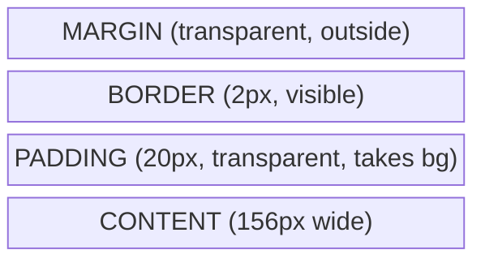
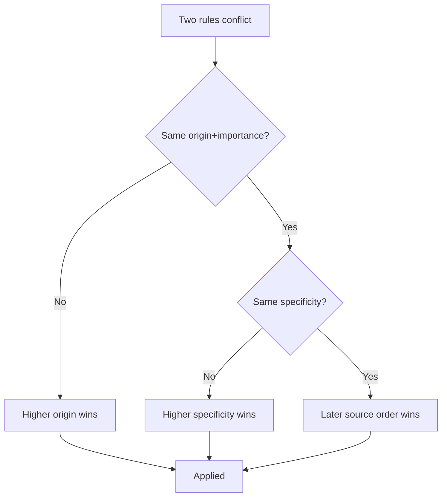

# Why CSS Exists

🎯 **Interview Weight:** medium - every frontend interview starts
here; establishes whether the candidate understands separation of
concerns or just "knows how to style things"

---

### 🎯 Model Answer

**30 seconds:**

> CSS (Cascading Style Sheets) separates visual presentation from
> HTML structure. Before CSS, styling lived inside HTML tags - font
> colors, sizes, and table-based layouts baked into every page.
> CSS solves this by defining reusable style rules applied via
> selectors, with a cascade algorithm that resolves conflicts
> predictably when multiple rules target the same element.

**3 minutes (Senior):**

> Let me walk through the problem CSS was created to solve. In the
> early web, all styling was embedded in HTML - you'd see
> `<font color="red">` and nested tables everywhere. This created
> three serious problems: every style change required editing
> every HTML file; HTML became semantically meaningless because
> structure and presentation were tangled; and browsers couldn't
> cache shared styles across pages.
>
> CSS, standardized as CSS1 in 1996 and CSS2 in 1998, solves this
> with three core ideas. First, separation of concerns: HTML
> describes what content IS, CSS describes how it LOOKS. Second,
> the cascade: rules from multiple sources combine and override
> in a defined priority order based on specificity, source order,
> and origin. Third, inheritance: many properties flow from parent
> to child automatically, so you set font-family once on body and
> every element inherits it unless overridden.
>
> The cascade is the key architectural insight. Without it, you
> couldn't layer styles from a design system, component library,
> and per-component overrides without conflicts. The cascade defines
> who wins: !important declarations first, then inline styles, then
> ID selectors, then class/attribute selectors, then element
> selectors, then inherited values, then browser defaults.
>
> In production I've seen teams fight CSS specificity wars when
> they don't understand the cascade - reaching for !important
> everywhere. That's the signal they're working against CSS
> instead of with it.

*Adapting up:* Add discussion of CSS custom properties as a
design token system, and CSS-in-JS as a modern alternative
to global cascades.

*Adapting down:* WHAT (separate style from HTML) + WHY (reuse,
maintainability) + one example of a style rule.

**Blank Mind Recovery:**

**(1) Restate:** "You are asking about why CSS exists - let me
walk through the problem it was designed to solve."

**(2) First principles:** "From first principles, a webpage has
two separate concerns: what content IS and how it LOOKS. HTML was
designed for structure, not visual presentation. We need a
separate language for visual rules."

**(3) Bridge:** "Think of a newspaper layout. The article text
exists independently of whether it's set in two columns with blue
headings or one column with red headings. CSS is the layout rules
applied to the content."

---

### 📘 Concept Explanation

**What it is:**

CSS is a stylesheet language that controls the visual presentation
of HTML documents. It works by associating style declarations
(property-value pairs) with HTML elements via selectors.

**The problem it solves:**

Before CSS, HTML mixed content with presentation. A heading was
bold because of `<b>` tags, red because of `<font color="red">`,
positioned using `<table>` layouts. Changing the site's visual
design meant editing every HTML file. There was no way to express
"every heading should look like this" in one place.

**How it works:**

```
Browser renders a page:
  1. Parse HTML -> DOM tree
  2. Parse CSS -> CSSOM (CSS Object Model)
  3. Combine -> Render Tree (only visible nodes)
  4. Layout: calculate position/size of each box
  5. Paint: draw pixels to screen
  6. Composite: layer management (GPU)
```

The CSSOM maps every DOM node to its computed style. CSS rules
are matched via selectors, conflicts resolved by the cascade
algorithm, and the winning value becomes the computed style.

**The key insight:**

The "Cascading" in CSS is not a bug - it's the feature. It enables
layered style systems: browser defaults at the bottom, design
system in the middle, component overrides at the top. Every CSS
architecture problem is really a cascade management problem.

**When to use it:**

Always - CSS is the only way to style web content without
JavaScript. Even CSS-in-JS compiles to CSS at runtime.

**When NOT to use it:**

Avoid inline styles (`style=""` attributes) except for dynamic
values that change at runtime (position, transform). Inline styles
have the highest specificity and break the cascade.

**Alternatives:**

- Inline styles -> highest specificity, no reuse, use only for
  dynamic runtime values
- CSS-in-JS (styled-components, Emotion) -> scoped by default,
  trades cascade for component isolation
- Utility-first (Tailwind) -> no cascade conflicts, but
  composition happens in HTML not CSS

**First-principles derivation:**

Given constraint: browsers must render arbitrary HTML from
arbitrary authors with predictable, overridable styles. The
only solution is: (1) a selector system to target elements,
(2) a conflict resolution algorithm (cascade) when multiple
rules match the same element, (3) an inheritance mechanism so
every property doesn't need to be explicitly set. CSS is the
minimal solution to these three constraints.

---

### 💻 Code Example

**BAD: styling mixed into HTML (pre-CSS pattern)**

```html
<!-- BAD: presentation baked into structure -->
<font color="red" size="5">
  <b>Welcome</b>
</font>
<table cellpadding="10" bgcolor="#eee">
  <tr><td>Content here</td></tr>
</table>
```

> **Code walkthrough:** This is the pattern CSS was invented to
> replace. Every visual change requires touching every HTML file.
> The `font` tag carries no semantic meaning. Table layouts break
> screen readers. This approach scales to zero.

**GOOD: separation of concerns with CSS**

```html
<!-- HTML: structure only -->
<h1 class="page-title">Welcome</h1>
<section class="content-card">
  <p>Content here</p>
</section>
```

```css
/* CSS: presentation only */
.page-title {
  color: #cc0000;
  font-size: 2rem;
  font-weight: bold;
}

.content-card {
  padding: 10px;
  background-color: #eeeeee;
}
```

> **Code walkthrough:** HTML carries semantic meaning (`h1`,
> `section`, `p`). All visual decisions live in CSS. Changing
> the entire site's heading color means editing one CSS rule,
> not every HTML file. Classes decouple the visual identity
> from the document structure.

---

### 🎓 Answers by Seniority

**Junior / Mid (0-5 years):**

> CSS separates the visual presentation of a webpage from its
> HTML structure. You write rules like "all elements with class
> card should have a white background and rounded corners", and
> the browser applies them. This means your HTML stays clean and
> semantic, and you can change the entire site's look by editing
> one stylesheet instead of every HTML file.

*Push deeper:* Mention the cascade - when two rules target the
same element, CSS has a defined algorithm for which one wins
based on specificity and source order.

---

**Senior / Staff (5+ years):**

> CSS solves the separation of concerns problem for the web.
> HTML describes document structure and semantics; CSS describes
> visual presentation. The architecture insight is the cascade:
> styles from multiple sources (browser defaults, design system,
> component library, inline overrides) compose predictably via
> a specificity-based priority algorithm.
>
> In practice, CSS architecture is really cascade management.
> Teams that fight the cascade - using !important everywhere,
> highly specific selectors, inline styles for everything - end
> up with unmaintainable codebases. Teams that work with the
> cascade use low-specificity classes, CSS custom properties for
> design tokens, and predictable override patterns. At scale,
> CSS-in-JS tools like styled-components trade the global
> cascade for component-scoped styles, which is a valid
> architectural choice when cascade management becomes a team
> coordination problem.

*Push deeper:* Discuss the CSSOM, how CSS relates to the
critical rendering path, and the performance implications of
selector complexity.

---

### ⚠️ Common Misconceptions

**"CSS is just decoration, not real programming"**

CSS is a declarative language with a complex specificity
algorithm, a cascade, inheritance, a box model, layout systems
(Flexbox, Grid), and a growing set of functions and custom
properties. Mastering it requires the same systematic thinking
as any other language.

**"!important fixes specificity problems"**

`!important` escalates the specificity war - it doesn't end it.
When two rules both use !important, specificity applies again.
The right fix is to reduce specificity in the original rules,
not to out-escalate the conflict.

**"Inline styles are most performant"**

Inline styles are the highest specificity but not the most
performant. The browser still processes them as part of the
cascade. External stylesheets benefit from caching across pages.

**"CSS selects top-to-bottom - later rules always win"**

Source order is only the last tiebreaker. Specificity always
takes precedence. A class selector defined first will beat an
element selector defined later.

---

### 🚨 Failure Modes and Diagnosis

**Symptom: styles applied in browser but not in production**

Cause: CSS file not being served, wrong path, or cached old
version.

Diagnosis:
```
# Check Network tab in DevTools
# Look for 404 on CSS file
# Check cache headers with:
curl -I https://your-site.com/styles.css
```

Fix: Verify the `<link>` href, add cache-busting content hash
to filename (Webpack/Vite does this automatically).

---

**Symptom: styles work in isolation, break when combined**

Cause: specificity conflict - a higher-specificity rule
elsewhere is overriding your rule.

Diagnosis:
```
# In Chrome DevTools:
# Elements panel > select element > Computed tab
# Look for strikethrough properties
# Click the source link to find the winning rule
```

Fix: Increase specificity of your rule by adding a class, or
reduce specificity of the conflicting rule.

---

**Symptom: new CSS not taking effect after deploy**

Cause: browser has cached the old stylesheet.

Diagnosis: Hard reload (Ctrl+Shift+R), check Network tab for
304 responses on CSS files.

Fix: Use content-hash filenames in production builds so the
URL changes when content changes.

---

### 🎯 Interview Deep-Dive

| Scenario | Recommended Time | Key Signal |
|---|---|---|
| Definition question | 30-60 sec | Precise + WHY |
| "How does cascade work?" | 2-3 min | Specificity order |
| Debugging scenario | 3-4 min | Systematic diagnosis |
| Architecture discussion | 4-5 min | Trade-off awareness |
| TRADE-OFF question | 2-3 min | CSS vs CSS-in-JS |

---

**Q1: What is CSS and why does it exist?** `[JUNIOR]` CONCEPTUAL

*Why they ask:* Establishes whether the candidate understands
separation of concerns or just "knows how to write styles."

*Likely follow-up:* "What would web development look like
without CSS?"

> **Answer:**
>
> CSS stands for Cascading Style Sheets. It's a stylesheet
> language that controls the visual presentation of HTML
> documents - things like colors, fonts, spacing, and layout.
> The "why it exists" part is what separates a thoughtful
> answer from a dictionary definition.
>
> Before CSS, all styling was embedded in HTML. You'd see
> `<font>` tags, `bgcolor` attributes on table cells, and
> complex nested tables used for page layout. This created a
> maintenance disaster: changing the color scheme meant editing
> every single HTML file. There was no concept of "apply this
> style consistently everywhere."
>
> CSS solves this with three things: (1) a selector syntax
> to target elements without touching their HTML, (2) a
> cascade algorithm that resolves conflicts when multiple rules
> target the same element, and (3) inheritance so child
> elements automatically pick up properties like font-family
> from their parents.
>
> The architectural principle is separation of concerns. HTML
> answers "what is this content?" CSS answers "how should it
> look?" This separation means a designer can restyle the
> entire site without touching any HTML, and a developer can
> restructure HTML without breaking the visual design.
>
> *What separates good from great:* Great candidates mention
> the cascade specifically - not just "you can reuse styles"
> but that the cascade enables layered style systems where
> multiple sources compose predictably.

---

**Q2: Explain the CSS cascade - what does "cascading" mean?**
`[MID]` MECHANISM

*Why they ask:* The cascade is the most misunderstood CSS
feature and the source of most CSS bugs. Understanding it
reveals real depth.

*Likely follow-up:* "What's the difference between specificity
and source order?"

> **Answer:**
>
> "Cascading" refers to how CSS resolves conflicts when multiple
> rules target the same element and set the same property. The
> cascade has a defined priority order with three layers.
>
> First: origin and importance. Browser default styles lose to
> author styles (your CSS). Author styles lose to !important
> author styles. !important user styles beat everything.
>
> Second: specificity. If origin is the same, specificity
> determines the winner. Specificity is calculated as a
> three-digit score: [ID count, class/attribute/pseudo-class
> count, element/pseudo-element count]. So `#nav .item a`
> has specificity (1,1,1). `#nav a` has (1,0,1). The first
> wins on IDs. `div.container p` has (0,1,2). `.paragraph`
> has (0,1,0). The first wins on element count.
>
> Third: source order. If two rules have equal specificity,
> the later rule wins.
>
> The cascade enables layered style systems. A design system
> can define low-specificity class rules. A component can
> override with slightly higher specificity. An edge case can
> override further. Without the cascade, composing styles from
> multiple sources would require explicit priority numbers or
> runtime conflict resolution - both more complex.
>
> *What separates good from great:* Mentioning that cascade
> layers (the `@layer` rule, new in 2022) give explicit control
> over cascade priority without fighting specificity.

---

**Q3: Why should I avoid inline styles?** `[JUNIOR]`
TRADE-OFF

*Why they ask:* Tests understanding of specificity and the
cascade, not just "that's bad practice."

*Likely follow-up:* "When ARE inline styles appropriate?"

> **Answer:**
>
> Inline styles have two specific problems that make them
> harmful for general use. First, they have the highest
> specificity of any CSS rule - you cannot override an inline
> style with a class or ID selector without using !important.
> This means they break the cascade's layering system: anything
> that tries to override them from a stylesheet simply loses.
>
> Second, they don't benefit from reuse or caching. A class
> applied to 100 elements means one declaration in your CSS
> file that the browser caches. 100 elements with the same
> inline style means 100 copies of that style declaration in
> HTML, downloaded fresh each page load.
>
> That said, inline styles ARE appropriate in one scenario:
> dynamic values that JavaScript sets at runtime. When you're
> animating an element's position, setting a custom property
> value from JS, or computing a layout dimension dynamically,
> inline styles are the right tool because CSS classes can't
> express arbitrary computed values like
> `style="--progress: 73%"`.
>
> The rule: inline styles for dynamic runtime values computed
> by JavaScript; classes for everything static.
>
> *What separates good from great:* Mentioning that CSS custom
> properties (variables) let you bridge the gap - set a
> variable inline (`--offset: 42px`) and reference it in a
> class (`.box { left: var(--offset); }`), giving you dynamic
> values without breaking the cascade for other properties.

---

**Q4: Styles I write aren't taking effect. How do you debug?**
`[MID]` DEBUGGING

*Why they ask:* Real-world CSS debugging is a core skill.
Tests systematic thinking, not guessing.

*Likely follow-up:* "What causes a property to appear
strikethrough in DevTools?"

> **Answer:**
>
> I follow a systematic approach with DevTools.
>
> Step 1: Open Elements panel, select the element, go to the
> Computed tab. Find the property that's wrong. This shows the
> final computed value regardless of how it got there.
>
> Step 2: Switch to the Styles tab. This shows all CSS rules
> that match the element, in cascade order from highest to
> lowest specificity. Properties with strikethrough are being
> overridden by a higher-priority rule shown above.
>
> Step 3: Find the winning rule. The rule without strikethrough
> is winning. Click its source link to jump to the source file
> and line number.
>
> Common causes of styles not applying:
> - Wrong selector: typo in class name, the selector isn't
>   matching the element you think it is
> - Specificity: a more-specific rule elsewhere is overriding
>   yours - check for inline styles or ID selectors in the
>   winning rule
> - Inheritance: the property doesn't inherit by default (e.g.,
>   border doesn't inherit from parent)
> - CSS file not loaded: check Network tab for 404 on the
>   stylesheet
> - Caching: old stylesheet cached - hard reload or check
>   cache-busting headers
>
> The Styles panel is the fastest path to diagnosis. I always
> check it before touching the CSS file.
>
> *What separates good from great:* Mentioning the Force
> Element State feature in DevTools to inspect :hover, :focus,
> :active pseudo-states without having to keep hovering.

---

**Q5: What is CSS inheritance and which properties inherit?**
`[JUNIOR]` CONCEPTUAL

*Why they ask:* Inheritance is often confused with the cascade.
Understanding the difference shows CSS depth.

*Likely follow-up:* "Why don't all properties inherit?"

> **Answer:**
>
> CSS inheritance means that certain property values applied
> to a parent element are automatically applied to its
> descendants without explicitly setting them.
>
> The properties that inherit are generally text-related:
> `color`, `font-family`, `font-size`, `font-weight`,
> `line-height`, `letter-spacing`, `text-align`, `cursor`,
> `visibility`. The reasoning is that these are properties
> where "same as parent" is almost always what you want for
> text content.
>
> Properties that do NOT inherit are box-related: `margin`,
> `padding`, `border`, `width`, `height`, `background`,
> `display`, `position`. The reasoning is opposite - you
> almost never want a child element to inherit its parent's
> margin or border.
>
> You can always force inheritance explicitly:
> `border: inherit` makes border inherit even though it
> normally doesn't. Or you can reset an inherited value:
> `color: initial` resets to the browser default.
>
> The `inherit`, `initial`, `unset`, and `revert` keywords
> give you explicit control over whether inheritance applies.
>
> *What separates good from great:* Noting that `unset` is
> particularly useful - it behaves as `inherit` if the
> property naturally inherits, and as `initial` if it
> doesn't. This makes it the safest "reset to natural
> behavior" keyword.

---

**Q6: What came before CSS? Why was it better than the
old approach?** `[JUNIOR]` COMPARISON

*Why they ask:* Historical context reveals whether the
candidate understands WHY CSS is designed the way it is.

*Likely follow-up:* "Are there any ways the old approach was
better?"

> **Answer:**
>
> Before CSS, HTML used presentational elements and attributes
> directly: `<font>`, `<center>`, `<b>`, `<i>`, and
> attributes like `bgcolor`, `cellpadding`, `align`, `valign`.
> Page layout was done entirely with nested `<table>` elements.
>
> CSS is strictly better in three ways. Maintainability: change
> one CSS rule instead of editing every HTML file. Semantics:
> HTML elements carry meaning (`h1` means "most important
> heading", `nav` means "navigation") rather than just visual
> appearance. Accessibility: screen readers can interpret
> semantic HTML; they can't interpret visual appearance.
>
> The one area where the old approach had an advantage: it was
> simpler to understand. `<font color="red">text</font>` is
> immediately obvious. The CSS cascade, specificity, and
> inheritance are more complex to learn. That complexity is
> the cost of the flexibility CSS provides.
>
> This trade-off shows up in CSS-in-JS solutions like
> styled-components - they trade the global cascade (complex)
> for component-scoped styles (simpler to reason about for
> large teams). The complexity CSS introduced was worth it
> compared to HTML-baked styling, but it still has costs.
>
> *What separates good from great:* Connecting CSS history to
> modern trends - noting that CSS custom properties, Houdini,
> and CSS Modules are all attempts to add the "predictability"
> of old HTML styling back while keeping CSS's power.

---

**Q7: When should you use a class vs an ID in CSS?**
`[MID]` TRADE-OFF

*Why they ask:* Specificity management is foundational CSS
architecture. Choosing class vs ID is a daily decision with
cascade implications.

*Likely follow-up:* "Why do most CSS methodologies say
never use ID selectors?"

> **Answer:**
>
> IDs have three times the specificity of classes (1,0,0 vs
> 0,1,0), meaning an ID-targeted rule is extremely hard to
> override. This creates a specificity problem: once you use
> an ID selector for styling, any future override needs either
> another ID, an inline style, or !important.
>
> The practical rule I follow: IDs in CSS only for JavaScript
> anchors and form label associations - never for styling.
> Use classes for all styling. When you need to style
> something unique on a page (like a site header), give it
> a class like `.site-header` rather than targeting `#header`.
>
> Classes also better express intent: `.btn-primary` documents
> what the style is for; `#submit-button` creates an implicit
> contract that there's only one such element. If the design
> requires a second primary button, a class scales; the ID
> does not.
>
> Methodologies like BEM, SMACSS, and ITCSS formalize this:
> they use classes exclusively for styling and recommend
> specificity scores no higher than (0,1,0) for most rules.
> Low, consistent specificity means the cascade behaves
> predictably across a large codebase.
>
> *What separates good from great:* Mentioning `:is()` and
> `:where()` pseudo-classes - `:where()` always has zero
> specificity regardless of its arguments, making it useful
> for resetting or utility styles that should never win
> a specificity conflict.

---

| Interviewer Type | Emphasis |
|---|---|
| Technical Panel | Explain specificity algorithm with numbers |
| Hiring Manager | Lead with maintainability and team velocity |
| Bar Raiser | Discuss CSS-in-JS trade-off vs global cascade |
| Peer Engineer | Share a real debugging story from the Styles panel |

---

### ⚖️ Comparison Table

*(Omit: ★☆☆ foundational keyword - comparisons are covered
within Concept Explanation and Q6 in Interview Deep-Dive)*

---

### 🏛️ System Design

*(Omit: ★☆☆ orientation keyword - not an architecture-level
concept requiring system design treatment)*

---

### 📊 Diagram

*(Omit: prose and the code walkthrough are sufficient to explain
this concept without a visual diagram)*

---
---

# CSS Box Model

🎯 **Interview Weight:** critical - appears in almost every
frontend interview; foundational for all layout work and the
source of the most common layout bugs

---

### 🎯 Model Answer

**30 seconds:**

> Every HTML element is rendered as a rectangular box with four
> layers: content area, padding, border, and margin. The critical
> detail is `box-sizing`: by default (`content-box`), `width`
> only sets the content area and padding/border add on top. With
> `border-box`, `width` includes padding and border. Modern CSS
> uses `border-box` universally because it's far more intuitive.

**3 minutes (Senior):**

> The CSS box model defines how every element occupies space on
> the page. There are four concentric rectangles. The innermost
> is the content area - text, images, or child elements. Wrapping
> it is padding - transparent space between the content and the
> border. Then the border itself. Then margin - transparent space
> outside the border that separates this element from neighbors.
>
> The non-obvious part is `box-sizing`. By default
> (`content-box`), `width: 200px` means the content area is
> 200px. If you add `padding: 20px` and `border: 2px solid`,
> the total rendered width becomes 200 + 40 + 4 = 244px. This
> surprises every developer at least once.
>
> Modern projects fix this with a universal reset:
> `*, *::before, *::after { box-sizing: border-box; }`. With
> `border-box`, `width: 200px` means the total box (content +
> padding + border) is 200px. Padding and border carve INTO
> the content area instead of adding onto it. This is much
> more predictable for layout work.
>
> Margins have an additional behavior called collapsing. Adjacent
> vertical margins between block elements collapse to the larger
> value. Two paragraphs with `margin-bottom: 20px` and
> `margin-top: 16px` don't produce 36px of space - they produce
> 20px. This is intentional for text typography but surprises
> people constantly. Margins do NOT collapse horizontally, inside
> flex or grid containers, or for absolutely positioned elements.

*Adapting up:* Discuss margin collapsing edge cases, the
difference between `inline-size`/`block-size` in logical
properties, and how the box model interacts with overflow.

*Adapting down:* content is the text/image, padding is space
inside, border is the line, margin is space outside.

**Blank Mind Recovery:**

**(1) Restate:** "You are asking about the CSS box model -
let me walk through how every element occupies space."

**(2) First principles:** "From first principles, every element
needs to know four things: how big is my content, what spacing
wraps it inside my border, what's my visible edge, and how far
am I from neighbors. Those four questions map to content,
padding, border, margin."

**(3) Bridge:** "Think of a framed photograph: the photo is
content, the mat board is padding, the frame is border, and the
gap between frames on the wall is margin."

---

### 📘 Concept Explanation

**What it is:**

The CSS box model is the algorithm the browser uses to determine
the size and position of every rendered element. Each element
generates a rectangular box with four regions: content, padding,
border, and margin.

**The problem it solves:**

Designers need to control not just content size but spacing around
content. A button needs internal padding between text and edge,
a visible border, and separation from adjacent buttons. Without a
model for all four regions, layout requires workarounds.

**How it works:**

```
+---------------------------+  <- margin edge
|         MARGIN            |
|  +---------------------+  |  <- border edge
|  |       BORDER        |  |
|  |  +--------------+   |  |  <- padding edge
|  |  |   PADDING    |   |  |
|  |  |  +--------+  |   |  |  <- content edge
|  |  |  |CONTENT |  |   |  |
|  |  |  +--------+  |   |  |
|  |  +--------------+   |  |
|  +---------------------+  |
+---------------------------+
```

The `width` and `height` properties target the content area
by default (`box-sizing: content-box`). With `border-box`,
they target the border edge instead, which includes padding.

Margin collapsing rules:
- Adjacent vertical margins of block siblings collapse
- Parent's top margin collapses with first child's top margin
  unless parent has border, padding, overflow, or BFC
- Flex and grid containers do NOT collapse margins

**The key insight:**

`box-sizing: border-box` is not a fix for a CSS bug - it is an
alternative model. `content-box` models the content precisely;
`border-box` models the container precisely. Grid systems and
responsive layouts are far simpler with `border-box`.

**When to use it:**

Always set `box-sizing: border-box` globally in modern CSS.
This is the universal default in every modern CSS framework
(Tailwind, Bootstrap 5, Material UI).

**When NOT to use it:**

Avoid mixing `content-box` and `border-box` within the same
layout. If a third-party component uses `content-box` and you've
set `border-box` globally, sizes won't match your mental model.

**Alternatives:**

No alternatives to the box model - it is the foundational layout
algorithm. However, Grid and Flexbox abstract over many box model
calculation details.

**First-principles derivation:**

Given constraint: a browser must render elements with visible
boundaries, internal spacing, and external separation from
neighbors, all independently configurable. The minimum model
needs four configurable regions. Adding more would increase
complexity without new expressive power.

---

### 💻 Code Example

**BAD: content-box surprises (default behavior)**

```css
/* BAD: unexpected total width */
.card {
  width: 300px;
  padding: 20px;
  border: 2px solid #ccc;
  /* Actual rendered width: 300+40+4 = 344px */
  /* Layout breaks when placed in 300px container */
}
```

> **Code walkthrough:** With default `content-box`, the 300px
> `width` is ONLY the content area. Padding (40px total) and
> border (4px total) are added on top, making the element
> 344px wide. This is the most common CSS layout bug for new
> developers.

**GOOD: border-box universal reset**

```css
/* GOOD: set once, predictable everywhere */
*,
*::before,
*::after {
  box-sizing: border-box;
}

.card {
  width: 300px;      /* total width: EXACTLY 300px */
  padding: 20px;     /* carves INTO content: 260px content */
  border: 2px solid #ccc; /* carves further: 256px content */
}
```

> **Code walkthrough:** With `border-box`, `width` sets the
> total box size including padding and border. The content area
> shrinks to accommodate them. A `.card` inside a 300px
> container will fit exactly. The `*::before` and `*::after`
> selectors ensure pseudo-elements also use `border-box`.

**PRODUCTION: margin collapse diagnosis**

```css
/* Both paragraphs have 24px vertical margin */
p {
  margin-top: 24px;
  margin-bottom: 24px;
}

/*
 * Space between adjacent paragraphs: 24px (NOT 48px)
 * Larger margin wins; smaller collapses.
 *
 * To PREVENT collapse: add overflow:hidden to parent,
 * or use padding instead of margin on parent,
 * or use flexbox/grid (no collapse inside containers)
 */
.no-collapse-container {
  display: flex;        /* margins don't collapse in flex */
  flex-direction: column;
}
```

> **Code walkthrough:** Margin collapsing is intentional CSS
> behavior for text typography. To diagnose: inspect the gap
> in DevTools - if it's the max of two margins not the sum,
> you have collapsing. Fix by using a flex or grid container,
> or by adding `padding-top: 1px` to the parent (creates a
> formatting context that prevents collapse).

---

### 🎓 Answers by Seniority

**Junior / Mid (0-5 years):**

> Every element in CSS is a box with four parts: the content
> area (text/images), padding (space inside the border),
> border (the visible edge), and margin (space outside the
> border between elements). The important thing to know is
> `box-sizing: border-box` - most modern projects set this
> globally because it makes width mean the total size of the
> box, not just the content. Without it, adding padding and
> border makes elements wider than you set, which breaks
> layouts.

*Push deeper:* Mention margin collapsing - adjacent vertical
margins between block elements collapse to the larger value,
not the sum.

---

**Senior / Staff (5+ years):**

> The box model is the foundation of all CSS layout. The key
> production decision is `box-sizing`. Default `content-box`
> is precise about content dimensions but counterintuitive for
> layout work. `border-box` is the universal modern standard -
> every CSS framework uses it - because it makes element sizing
> predictable: what you set is what you get.
>
> Margin collapsing is the subtle gotcha. Vertical margins
> between block siblings collapse to the maximum, not the sum.
> Parent-child margin collapse is less well-known: a parent's
> top margin collapses with its first child's top margin unless
> the parent establishes a block formatting context (overflow
> not visible, display: flow-root, flex/grid container).
> I've debugged "mysterious spacing" issues dozens of times
> that turned out to be unexpected margin collapse.
>
> At scale, the box model feeds into Grid and Flexbox sizing
> algorithms. Grid's `fr` units and Flexbox's `flex-basis`
> both operate on the `border-box` size when `border-box` is
> set. Inconsistency between `content-box` and `border-box`
> in a design system causes sizing mismatches that are
> extremely difficult to track down.

---

### ⚠️ Common Misconceptions

**"Setting width: 100% gives you full-width"**

With `content-box`, `width: 100% + padding` overflows the
parent. With `border-box`, `width: 100%` is exact. Always
verify which `box-sizing` applies before using percentage
widths.

**"Margins add together between elements"**

Vertical margins between adjacent block elements collapse -
only the larger margin applies. This is intentional for text
but surprises everyone working on UI components.

**"Padding and margin are the same thing"**

Padding is inside the border and takes the background color.
Margin is outside the border and is always transparent. An
element's clickable/hover area extends through padding but
not through margin.

**"box-sizing: border-box makes border NOT count toward width"**

`border-box` means border IS counted in width - the content
area shrinks to compensate. `content-box` means border is
NOT counted (it adds extra). The naming is confusing but
accurate: `border-box` dimensions include the border edge.

---

### 🚨 Failure Modes and Diagnosis

**Symptom: layout overflows container by exactly
padding+border amount**

Cause: `box-sizing: content-box` with explicit padding or
border.

Diagnosis:
```
# DevTools Elements panel > select element
# Layout tab shows box model diagram with exact values
# Computed width vs set width will differ by padding+border
```

Fix: Add global `box-sizing: border-box` reset or add it
to the specific component.

---

**Symptom: unexpected gap between parent and first child**

Cause: margin collapse between parent and first child.

Diagnosis:
```
# Inspect parent element in DevTools
# If parent has no border/padding/overflow: the first child's
# top-margin "bleeds" through the parent
# Check: does parent have a top margin OR does first child?
# They may be the same margin collapsed together
```

Fix: Add `padding-top: 1px` or `overflow: hidden` to parent,
or use `display: flow-root` to establish BFC.

---

**Symptom: elements in flex/grid have different spacing than
expected based on margins**

Cause: Flex and grid containers create a new BFC - margins
don't collapse inside them. This is usually the desired behavior
but surprises those expecting collapse.

Fix: Use `gap` property in flex/grid for spacing between items
instead of margins. `gap` is more predictable and explicit.

---

### 🎯 Interview Deep-Dive

| Scenario | Recommended Time | Key Signal |
|---|---|---|
| Define box model | 1-2 min | Four layers, box-sizing |
| Explain box-sizing | 2-3 min | content-box vs border-box |
| Debug layout overflow | 3-4 min | box-sizing + DevTools |
| Explain margin collapse | 3-4 min | BFC knowledge |
| Design system context | 4-5 min | Universal border-box reset |

---

**Q1: Explain the CSS box model.** `[JUNIOR]` CONCEPTUAL

*Why they ask:* Direct test of a fundamental concept; reveals
whether the candidate knows details (box-sizing) or just the
surface.

*Likely follow-up:* "What's box-sizing and why does it matter?"

> **Answer:**
>
> The CSS box model defines how every HTML element is rendered
> as a rectangular box. It has four distinct regions working
> from inside out.
>
> First, the content area - this is where text, images, and
> child elements live. This is what `width` and `height` set
> by default.
>
> Second, padding - transparent space between the content and
> the border. Padding takes the element's background color.
> You can set it individually: `padding-top`, `padding-right`,
> etc., or shorthand: `padding: 10px 20px` (top/bottom,
> left/right).
>
> Third, border - the visible edge of the element. It has
> width, style (solid, dashed, dotted), and color.
>
> Fourth, margin - transparent space outside the border that
> separates this element from others. Unlike padding, margin
> is always transparent and can be negative.
>
> The critical thing to know: by default (`box-sizing:
> content-box`), `width` only controls the content area.
> Padding and border get added on top. So `width: 200px;
> padding: 20px; border: 2px solid` makes an element that
> is actually 244px wide. Modern projects add a global
> reset: `*, *::before, *::after { box-sizing: border-box }`
> which makes `width` mean the total rendered size including
> padding and border.
>
> *What separates good from great:* Mentioning margin
> collapsing - adjacent vertical margins between block
> siblings collapse to the maximum, not the sum.

---

**Q2: What's the difference between content-box and
border-box?** `[MID]` COMPARISON

*Why they ask:* box-sizing is the most impactful CSS
understanding test - gets at whether they truly get the
model or just memorized terms.

*Likely follow-up:* "Which should you use and why?"

> **Answer:**
>
> `content-box` is the CSS default. With it, `width` and
> `height` define ONLY the content area. Padding and border
> are added on TOP of that size. So `width: 200px; padding:
> 20px; border: 2px` gives a total rendered width of 244px.
>
> `border-box` includes padding and border within the declared
> width. The same properties give exactly 200px total. The
> content area shrinks to 200 - 40 - 4 = 156px.
>
> Which to use: `border-box`, universally, always in modern
> CSS. The reasons are practical. First, `border-box` matches
> designer intent - when a designer says "this box is 200px
> wide" they mean the whole box, including its border and
> internal spacing. Second, percentage widths work
> predictably: `width: 50%; padding: 20px` with `border-box`
> fits in half the parent. With `content-box` it overflows.
> Third, every major CSS framework (Tailwind, Bootstrap,
> Material UI) uses `border-box`.
>
> The one case for `content-box` is when you need pixel-precise
> control over the content area size (e.g., a canvas element
> that must render at exactly a given resolution).
>
> *What separates good from great:* Knowing that `border-box`
> was introduced to address this exact confusion, that IE had
> it as the default for years before CSS2 standardized
> `content-box`, and that the industry eventually agreed
> IE was right by adopting `border-box` universally.

---

**Q3: My element is wider than I expected. How do you debug?**
`[MID]` DEBUGGING

*Why they ask:* Box model debugging is a daily CSS skill.
Tests systematic thinking.

*Likely follow-up:* "What if the size looks correct in
the element panel but overflows anyway?"

> **Answer:**
>
> I start with DevTools. In the Elements panel, select the
> element and look at the Layout tab - Chrome shows an
> interactive box model diagram with exact pixel values for
> content, padding, border, and margin.
>
> Most common cause: the element has `box-sizing: content-box`
> (or inherits it) and has padding/border that I didn't
> account for. The rendered width equals content-width +
> left-padding + right-padding + left-border + right-border.
>
> Checklist:
> 1. Is `box-sizing: border-box` set globally? If not, add
>    `*, *::before, *::after { box-sizing: border-box }`.
> 2. Does the parent have `overflow: hidden`? If not, overflow
>    is just not visible until content fills it.
> 3. Is there an ancestor with a fixed width that I'm
>    overflowing? Use the Layout tab to walk up the tree.
> 4. Are there negative margins or translate transforms
>    shifting the element beyond its box?
>
> If it looks correct in the panel but overflows the page:
> check for `min-width` on the element or an ancestor that's
> preventing shrink, or a `white-space: nowrap` on text that
> forces a minimum content width.
>
> *What separates good from great:* Knowing that DevTools'
> Computed tab shows `width` as the final computed value but
> the box model diagram shows the breakdown with padding and
> border separately - and that the total width = content +
> padding + border, NOT margin (margin affects positioning,
> not the element's own rendered size).

---

**Q4: Explain margin collapsing.** `[SENIOR]` MECHANISM

*Why they ask:* Margin collapsing is a frequent source of
mysterious layout bugs. Tests deep understanding vs surface
knowledge.

*Likely follow-up:* "When does margin collapsing NOT happen?"

> **Answer:**
>
> Margin collapsing is a CSS rule where adjacent vertical margins
> of block-level elements combine into a single margin whose
> size is the maximum of the two values - not the sum.
>
> There are three scenarios where it occurs. First, adjacent
> siblings: two paragraphs with `margin-bottom: 24px` and
> `margin-top: 16px` produce 24px of space between them, not
> 40px. Second, parent and first/last child: if a parent has
> no border, padding, overflow:hidden, or BFC established, its
> top margin collapses with its first child's top margin.
> Third, empty blocks: if an element has no border, padding,
> or content, its top and bottom margins collapse with each
> other.
>
> Margin collapsing does NOT occur:
> - For horizontal margins (only vertical)
> - Inside flex containers or grid containers
> - When the parent has `overflow` set to anything other
>   than `visible`
> - When there's a border, padding, or clearing between
>   the margins
> - For absolutely or fixed positioned elements
>
> In production, I most often encounter parent-child collapse
> causing unexpected top-space on sections. The fix is usually
> `display: flow-root` on the parent (creates a BFC) or
> `padding-top: 1px` as a quick fix.
>
> *What separates good from great:* Knowing that collapse is
> intentional - it prevents double-spacing between paragraphs
> in text documents. The CSS spec designed it for document
> layout. The confusion arises when it's applied to UI
> components that weren't designed around text document
> conventions.

---

**Q5: Why use gap instead of margin in Flexbox/Grid?**
`[SENIOR]` TRADE-OFF

*Why they ask:* Modern layout knowledge; tests awareness of
why gap was introduced.

*Likely follow-up:* "Are there cases where margin is still
better than gap?"

> **Answer:**
>
> The `gap` property (formerly `grid-gap`) sets spacing between
> flex items or grid cells. Using margin for the same purpose
> has three problems. First, margins on the first/last item
> also add space at the container edge - you'd need a negative
> margin on the container to compensate, or the `:first-child`/
> `:last-child` hack. Second, if items wrap, bottom margins
> accumulate below the last row even when unwanted. Third, you
> need to track which sides get margin to avoid double-spacing.
>
> `gap` solves all three. It only applies to the space BETWEEN
> items, never at the outer edges. It works consistently with
> wrapping. And it has a clean mental model: one value for
> all gaps.
>
> `gap: 16px` for uniform spacing; `gap: 16px 24px` for
> row-gap and column-gap independently.
>
> Cases where margin is still appropriate: when you need
> different spacing on specific items (not uniform), or when
> you need to push one item to the edge (`margin-left: auto`
> in flexbox to push an item to the end). Those are spacing
> relationships that gap can't express.
>
> *What separates good from great:* Knowing that `gap` on
> flex containers was added in 2019 and has excellent browser
> support now, whereas the `margin`-based workaround was
> the only option before, so some production codebases still
> use it for legacy reasons.

---

**Q6: How does the box model affect click/hover areas?**
`[MID]` PRODUCTION

*Why they ask:* Click area confusion is a common production
bug. Tests whether candidates understand the box model
beyond layout.

*Likely follow-up:* "How would you make a button easier
to click without changing its visual size?"

> **Answer:**
>
> The clickable (hit) area of an element extends through its
> content and padding, up to but not including the margin.
> This has two important implications.
>
> First, adding padding to a button increases both its visual
> size AND its clickable area simultaneously. This is why
> buttons should use padding, not just large font, to create
> an appropriately-sized click target.
>
> Second, margin does NOT contribute to the click area. Two
> buttons with `margin: 10px` between them have a 10px gap
> that is not part of either button's click target.
>
> For touch targets, WCAG 2.5.5 recommends at least 44x44 CSS
> pixels. A link that's visually 20x20 should have at least
> 12px padding on all sides to meet this. Alternatively, you
> can use `padding` with `background: transparent` - the
> visual appearance stays the same but the click area grows.
>
> A gotcha: `overflow: hidden` on a parent clips both the
> visual appearance AND the click area. Elements visually
> hidden by overflow are also not clickable.
>
> *What separates good from great:* Knowing that `pointer-
> events: none` removes click area entirely regardless of box
> size, and `pointer-events: all` restores it even on elements
> inside a `pointer-events: none` parent - useful for
> overlapping UI layers.

---

**Q7: How do you size elements to fit their container
responsively?** `[MID]` HANDS-ON

*Why they ask:* Responsive sizing is a daily CSS task. Tests
practical application of box model knowledge.

*Likely follow-up:* "What's the difference between width: 100%
and width: 100vw?"

> **Answer:**
>
> For elements that should fill their container: use `width:
> 100%` with `box-sizing: border-box`. This makes the element
> exactly as wide as its parent's content area. With
> `border-box`, any padding or border on the element shrinks
> its content area rather than overflowing.
>
> For elements that should never exceed their container but
> can be smaller: use `max-width: 100%`. This is especially
> useful for images: `img { max-width: 100%; height: auto; }`
> makes images responsive without stretching.
>
> `width: 100vw` vs `width: 100%`: `vw` is relative to the
> viewport, not the parent. In a centered content layout
> with margins, `width: 100%` fills the parent container
> while `width: 100vw` fills the entire viewport including
> the margins - causing horizontal scroll if the parent
> doesn't fill the viewport.
>
> For flexible children in flex/grid: use `flex: 1 1 0` or
> `grid-column: 1 / -1` instead of explicit widths. Let the
> layout algorithm distribute space rather than calculating
> percentages manually.
>
> *What separates good from great:* Knowing `min-width: 0` is
> often needed on flex items. By default, flex items have
> `min-width: auto` which prevents them from shrinking below
> their content size. Setting `min-width: 0` allows overflow
> handling (ellipsis, wrapping) to work correctly.

---

| Interviewer Type | Emphasis |
|---|---|
| Technical Panel | Show specificity: content-box vs border-box arithmetic |
| Hiring Manager | Frame as "the #1 source of layout bugs in the codebase" |
| Bar Raiser | Discuss margin collapse edge cases and BFC creation |
| Peer Engineer | Share a real "element wider than expected" debugging story |

---

### ⚖️ Comparison Table

*(Omit: ★☆☆ foundational keyword - the content-box vs border-box
comparison is covered in Q2 of Interview Deep-Dive)*

---

### 🏛️ System Design

*(Omit: ★☆☆ orientation keyword - not an architecture-level
concept)*

---

### 📊 Diagram

```
BOX MODEL (border-box, width:200px, padding:20px, border:2px)

+-----------------------------+  <- margin edge
|         MARGIN              |
|  +----------------------+   |  <- border edge (200px total)
|  |  BORDER (2px)        |   |
|  |  +-----------------+ |   |  <- padding edge
|  |  |  PADDING (20px) | |   |
|  |  |  +-----------+  | |   |  <- content edge
|  |  |  |  CONTENT  |  | |   |
|  |  |  |  (156px)  |  | |   |
|  |  |  +-----------+  | |   |
|  |  +-----------------+ |   |
|  +----------------------+   |
+-----------------------------+

content-box: width=156+40+4=200 (confusing)
border-box:  width=200 exactly  (intuitive)
```



> **Diagram walkthrough:** The box model is four nested
> rectangles. The content area holds actual content; padding
> adds breathing room inside the border; the border is the
> visible edge; margin is external separation. With
> `border-box` (shown), a declared `width: 200px` equals the
> border edge - content shrinks to 156px to accommodate 20px
> padding on each side plus 2px border on each side. With
> `content-box`, content would be 200px and total width 244px.

---
---

# CSS Cascade and Inheritance

🎯 **Interview Weight:** critical - the most misunderstood
CSS concept; directly causes the majority of CSS bugs;
asked in almost every senior frontend interview

---

### 🎯 Model Answer

**30 seconds:**

> The CSS cascade is the algorithm that resolves conflicts when
> multiple rules target the same element and property. It checks
> in order: origin and importance (is this !important? who wrote
> it?), then specificity (how specific is the selector?), then
> source order (which rule comes last?). The first tiebreaker
> to differ wins. Inheritance is separate - it's the mechanism
> by which some properties (mostly text-related) flow from parent
> to children automatically.

**3 minutes (Senior):**

> The cascade resolves style conflicts through a defined priority
> order. Most developers know the specificity layer but miss the
> others.
>
> First: origin and importance. Browser defaults are lowest
> priority. Author styles (your CSS) override them. Author
> !important overrides normal author styles. User !important
> (accessibility preferences) overrides everything. CSS Layers
> (@layer) let you explicitly control cascade order without
> fighting specificity.
>
> Second: specificity. A three-number score calculated as
> [ID count, class+attribute+pseudo-class count, element+
> pseudo-element count]. `#nav .item a` scores (1,1,1).
> `.item a` scores (0,1,1). The first wins. Inline styles
> have an implicit (1,0,0,0) - above all selector specificity.
>
> Third: source order. Equal specificity -> later rule wins.
>
> Inheritance is a separate mechanism. It's how `color: red`
> set on `body` makes all text red without targeting every
> element. Properties that inherit: `color`, `font-family`,
> `font-size`, `line-height`, `cursor`, `visibility`, and
> others. Properties that don't: `margin`, `padding`, `border`,
> `background`, `width`, `height`. The split is intentional:
> text properties should flow down; box properties should not.
>
> The non-obvious cascade insight: specificity is a magnitude,
> not a decimal. (0,1,0) beats (0,0,100) - 100 element
> selectors never outweigh a single class selector.

*Adapting up:* Add CSS cascade layers (@layer), :where()
for zero-specificity rules, and the CSS specificity
calculator mental model.

*Adapting down:* "The more specific your selector, the
higher its priority. Later rules beat earlier rules when
equally specific."

**Blank Mind Recovery:**

**(1) Restate:** "You are asking about the CSS cascade -
let me walk through how CSS resolves conflicts between rules."

**(2) First principles:** "From first principles, when two
CSS rules want to set the same property on the same element,
someone has to win. The cascade is the deterministic algorithm
that picks the winner."

**(3) Bridge:** "Think of a corporate org chart: the CEO
(!important) overrides a manager (class), who overrides an
individual contributor (element selector). The most senior
voice always wins."

---

### 📘 Concept Explanation

**What it is:**

The cascade is the priority algorithm CSS uses when multiple
rules conflict. It runs through three ordered checks: origin
and importance, then specificity, then source order. The first
check where the rules differ determines the winner.

**The problem it solves:**

Styles come from multiple sources: browser defaults, your
reset stylesheet, a design system, a component stylesheet, and
inline overrides. Without a deterministic conflict resolution
algorithm, the result would be unpredictable.

**How it works:**

```
CASCADE ALGORITHM (runs per property per element):

Step 1 - Origin + Importance:
  user !important    (highest)
  author !important
  author normal
  user normal
  browser default    (lowest)

Step 2 - Specificity (if same origin+importance):
  [A, B, C] where:
  A = number of ID selectors
  B = class, attribute, pseudo-class selectors
  C = element, pseudo-element selectors

  inline style = (1,0,0,0) - beats all selectors
  :is()/:not() takes highest specificity of its args
  :where() always (0,0,0) - zero specificity

Step 3 - Source Order (if equal specificity):
  Later rule wins

INHERITANCE (separate from cascade):
  Some properties inherit from parent automatically.
  Use: inherit | initial | unset | revert keywords
  to control explicitly.
```

**The key insight:**

Specificity is a magnitude, not arithmetic. Each level is a
separate digit that can never be rolled over. 100 element
selectors (0,0,100) never beat one class (0,1,0). This is
deliberate - it prevents unmaintainable style inflation.

**When to use it:**

Understanding the cascade is required for all CSS, not a
feature you choose. Use lower specificity in general rules
and higher specificity only for exceptions that need to win.

**When NOT to use it:**

Avoid escalating specificity wars. If you need !important to
override another rule, the architecture is wrong. Use CSS
cascade layers (@layer) to establish explicit priority instead.

**Alternatives:**

- CSS Modules: scopes styles to the component via unique
  class names - no global cascade conflicts
- CSS-in-JS: same scoping benefit via runtime injection
- BEM naming: maintains low specificity by using single
  classes; avoids specificity wars by convention

**First-principles derivation:**

Given constraint: multiple style sources must compose without
conflicts, from the most general (browser defaults) to the
most specific (inline overrides). A linear priority queue
with origin, specificity, and position satisfies this. It
allows override without global coordination.

---

### 💻 Code Example

**BAD: specificity war (common in real codebases)**

```css
/* In base.css - tries to be specific */
#app .nav ul li a.link {
  color: blue;  /* specificity: (1,2,3) */
}

/* In component.css - can never win */
.nav-link {
  color: red;   /* specificity: (0,1,0) - LOSES */
}

/* Developer "fixes" with !important */
.nav-link {
  color: red !important; /* Starts arms race */
}
```

> **Code walkthrough:** The first rule uses an ID + multiple
> elements, achieving high specificity (1,2,3). The component
> rule using a single class (0,1,0) can never override it
> without !important. This is a specificity war - each override
> requires escalation. The fix is to reduce the base rule's
> specificity.

**GOOD: low specificity with cascade layers**

```css
/* Layer 1: lowest priority - base styles */
@layer base {
  a { color: blue; }      /* (0,0,1) */
}

/* Layer 2: component styles - higher priority */
@layer components {
  .nav-link { color: red; } /* (0,1,0) - wins */
}

/* Layer 3: utilities - highest priority */
@layer utilities {
  .text-blue { color: blue; }
}
/* Layers: base < components < utilities */
/* Order declared = priority order */
```

> **Code walkthrough:** CSS cascade layers (`@layer`) provide
> explicit priority without fighting specificity. A rule in a
> higher layer wins over a rule in a lower layer REGARDLESS of
> specificity. This eliminates the need for !important in most
> cases and makes cascade conflicts visible and intentional.

**PRODUCTION: inheritance control**

```css
/* Set text defaults once on root */
body {
  font-family: system-ui, sans-serif;
  font-size: 1rem;
  line-height: 1.5;
  color: #1a1a1a;
  /* Inherited by all text elements automatically */
}

/* Reset inherited values on specific elements */
.code-block {
  font-family: monospace; /* overrides inherited */
  font-size: 0.875rem;
  color: inherit;  /* explicit inherit - clarity */
}

/* Prevent inheritance where not wanted */
.icon {
  color: initial; /* reset to browser default black */
}
```

> **Code walkthrough:** Setting text properties on `body`
> uses inheritance as a feature - every text element inherits
> them without explicit rules. `inherit` is useful for
> explicit documentation: it says "this is intentionally
> inherited." `initial` resets to the CSS specification
> default (not browser default). `unset` uses `inherit` for
> inheritable properties and `initial` for non-inheritable.

---

### 🎓 Answers by Seniority

**Junior / Mid (0-5 years):**

> The CSS cascade is how CSS decides which rule wins when two
> rules set the same property on the same element. It checks
> three things in order: first, is one of them marked
> !important? Second, which has a more specific selector
> (IDs beat classes beat elements)? Third, which comes later
> in the source? The first difference wins. Inheritance is
> separate - some properties like color and font-size flow
> from parent to children automatically, so you don't have
> to set them on every element.

*Push deeper:* Explain that specificity is a three-number
score, not a single number, and that 100 element selectors
never beat one class selector.

---

**Senior / Staff (5+ years):**

> The cascade is a three-stage conflict resolution algorithm.
> Stage 1 checks origin and importance - browser defaults
> lose to author styles, author !important beats normal
> author. Stage 2 checks specificity as a three-component
> score [IDs, classes+attributes, elements] - (0,1,0) always
> beats (0,0,100). Stage 3 uses source order as the final
> tiebreaker.
>
> CSS cascade layers (@layer), added in 2022 and now widely
> supported, let you declare explicit layer priority order
> independently of specificity. A class in a higher layer
> beats an ID selector in a lower layer. This is the
> architectural solution to specificity wars - design systems
> can define a `base` layer, components use a `components`
> layer, utilities use a `utilities` layer, and overrides
> work predictably without any !important.
>
> Inheritance is a feature, not an accident. Setting
> `font-family` on `body` propagates to every text element
> via inheritance. This reduces CSS file size and makes
> global changes trivial. The `:where()` pseudo-class with
> zero specificity is a newer tool for writing overridable
> default styles that any consumer can easily override.

---

### ⚠️ Common Misconceptions

**"Specificity is a number - more selectors = higher number"**

Specificity is three separate digits in separate columns.
(0,1,0) > (0,0,999) because the middle column is compared
first and is higher. You cannot overflow from one column to
the next.

**"!important is the highest possible specificity"**

!important is an origin escalation, not a specificity
escalation. Two rules both with !important are resolved by
specificity again. User !important (browser accessibility
override) beats author !important.

**"Later rules always win"**

Source order is only the LAST tiebreaker. Specificity is
checked first. A high-specificity rule defined first beats
a low-specificity rule defined later.

**"Inheritance and cascade are the same thing"**

Cascade resolves conflicts between explicit rules. Inheritance
provides a default value when no explicit rule matches. They
operate in sequence: cascade first (for explicit matches),
inheritance as fallback.

---

### 🚨 Failure Modes and Diagnosis

**Symptom: a CSS class I added has no effect**

Cause: a higher-specificity rule elsewhere is overriding it.

Diagnosis:
```
# DevTools Elements > select element > Styles tab
# Find the property showing strikethrough
# The rule shown ABOVE it (without strikethrough) is winning
# Click source link to find it
# Compare specificity: winning rule score vs your rule score
```

Fix: Increase specificity of your rule, or reduce specificity
of the competing rule. Use @layer if the rules are in
different layers.

---

**Symptom: removing a class still doesn't fix the style**

Cause: the same style is being set by inheritance, a
more-specific rule, or !important.

Diagnosis:
```
# DevTools > Computed tab > find the property
# Scroll down to see "Inherited from [ancestor element]"
# Check for !important with ctrl+F "!important" in Styles
# Check if any ancestor has inline style attribute
```

Fix: Use `property: unset` or `property: initial` to break
the cascade at the component level.

---

**Symptom: CSS works in development, breaks in production**

Cause: Likely CSS class order changed due to bundler output
order change, affecting source-order tiebreakers.

Diagnosis:
```
# Compare: devtools Styles tab in dev vs prod
# Look for identical specificity rules in different order
# Check if a CSS module or CSS-in-JS class name changed
```

Fix: Don't rely on source order for meaningful style
conflicts. Use specificity differences or @layer to make
the intended override explicit.

---

### 🎯 Interview Deep-Dive

| Scenario | Recommended Time | Key Signal |
|---|---|---|
| "Explain the cascade" | 2-3 min | Three-stage algorithm |
| Specificity question | 2-3 min | The three-column scoring |
| "Why won't my style work?" | 3-4 min | Systematic DevTools |
| "Avoid !important" | 3-4 min | @layer architecture |
| Inheritance vs cascade | 3 min | Distinguish the two |

---

**Q1: What is CSS specificity and how is it calculated?**
`[JUNIOR]` CONCEPTUAL

*Why they ask:* Most common CSS interview question;
distinguishes memorization from understanding.

*Likely follow-up:* "Which is more specific: one ID or
100 classes?"

> **Answer:**
>
> Specificity is how CSS determines which rule wins when two
> rules target the same element and property. It's calculated
> as a three-column score: [ID selectors, Class/Attribute/
> Pseudo-class selectors, Element/Pseudo-element selectors].
>
> Examples:
> - `h1` -> (0, 0, 1) - one element
> - `.header` -> (0, 1, 0) - one class
> - `#nav` -> (1, 0, 0) - one ID
> - `.nav .item a` -> (0, 2, 1) - two classes, one element
> - `#nav .item a` -> (1, 1, 1) - one ID, one class, one element
>
> The critical rule: specificity is compared column by column,
> highest column first. (1,0,0) always beats (0,99,99)
> because the ID column is compared first. You cannot overflow
> from one column to the next - 100 classes do not beat
> one ID. This is deliberate: it prevents specificity
> escalation from making low-level rules unoverridable.
>
> Inline styles (the `style=""` attribute) have an implicit
> (1,0,0,0) - a fourth column that beats all selector-based
> specificity.
>
> *What separates good from great:* Mentioning `:where()` -
> it has zero specificity (0,0,0) regardless of its arguments,
> so `:where(h1, h2, h3)` targets headings without adding
> any specificity. This lets you write default styles that
> any consumer can easily override with just an element
> selector.

---

**Q2: What's the difference between inheritance and the
cascade?** `[MID]` COMPARISON

*Why they ask:* These two concepts are frequently confused.
Distinguishing them reveals deep CSS understanding.

*Likely follow-up:* "How would you force a non-inherited
property to inherit?"

> **Answer:**
>
> They're related but distinct mechanisms.
>
> The cascade resolves conflicts between explicit CSS rules.
> When two rules both set `color` on the same element, the
> cascade algorithm picks one (via origin, specificity,
> source order). The cascade only applies where there are
> competing explicit declarations.
>
> Inheritance is a fallback. When NO explicit CSS rule sets
> a property on an element, the browser checks: does this
> property inherit? If yes, take the computed value from
> the parent. If no, use the initial value.
>
> So the sequence is: (1) cascade runs on explicit rules,
> winner gets applied. (2) For properties with no explicit
> rule: if property inherits, take parent's value; if not,
> use initial.
>
> Properties that inherit: color, font-*, line-height,
> text-align, cursor, visibility - text/typography properties.
> Properties that don't: margin, padding, border, background,
> width, height - box/layout properties.
>
> You can force inheritance: `border: inherit` makes border
> inherit even though it normally doesn't. You can break
> inheritance: `color: initial` resets to browser default
> (ignores parent).
>
> *What separates good from great:* The `unset` keyword
> behaves as `inherit` for inheritable properties and as
> `initial` for non-inheritable ones. It's the safest
> "reset to natural behavior" without knowing whether
> the property inherits.

---

**Q3: How do you avoid specificity wars?** `[SENIOR]`
TRADE-OFF

*Why they ask:* Specificity management is a real CSS
architecture challenge at scale. Tests production experience.

*Likely follow-up:* "How does BEM solve this? What about
CSS cascade layers?"

> **Answer:**
>
> Specificity wars happen when high-specificity rules make
> normal overrides impossible, forcing escalation to yet
> higher specificity or !important, creating an
> unbreakable cycle.
>
> Three strategies that actually work at scale:
>
> 1. Architectural rule: never use ID selectors for styling.
>    IDs score (1,0,0) and are impossible to override with
>    classes. Use IDs only for JavaScript anchors.
>
> 2. Methodologies like BEM: single-class selectors only
>    (.block__element--modifier). Every rule has specificity
>    (0,1,0). Equal specificity means source order determines
>    winner, which is predictable.
>
> 3. CSS cascade layers (@layer, 2022+): explicit priority
>    tiers. Rules in higher layers win regardless of
>    specificity. Design system in `@layer base`, components
>    in `@layer components`, utilities in `@layer utilities`.
>    A utility class (0,1,0) in the utilities layer beats
>    an ID selector (1,0,0) in the base layer.
>
> The deeper solution is to write low-specificity rules by
> default and raise specificity only when you intentionally
> want to override. Low specificity = easily overridable.
> High specificity = hard to override without escalation.
>
> *What separates good from great:* Knowing that :where()
> gives zero specificity (0,0,0) and is ideal for writing
> default styles in design systems - they can always be
> overridden by any consumer selector without specificity
> games.

---

**Q4: Why does my style break when I move the CSS import
order?** `[SENIOR]` DEBUGGING

*Why they ask:* Source order dependency is a real production
bug pattern, especially with CSS bundlers.

*Likely follow-up:* "How do you make CSS order-independent?"

> **Answer:**
>
> CSS source order is the final tiebreaker in the cascade.
> When two rules have identical specificity, the rule that
> appears later in the document wins. Moving import order
> changes which rule appears "later," changing the winner.
>
> This surfaces in bundled CSS because the bundler determines
> the final output order - and it may change between builds.
> In development you might import `base.css` before
> `component.css`, making component win. In production the
> bundler outputs them in alphabetical order, reversing the
> winner.
>
> Diagnosis: in DevTools Styles tab, look for two rules with
> the same specificity targeting the same property. The lower
> one in the panel is winning. Check if they'd flip positions
> in a different build.
>
> Fixes ranked from best to worst:
>
> 1. Make the specificity difference explicit: add one class
>    to the rule that should always win. (0,2,0) beats
>    (0,1,0) regardless of order.
>
> 2. Use @layer to declare explicit priority: `@layer base,
>    components` - components always wins over base regardless
>    of source order.
>
> 3. Use CSS Modules or CSS-in-JS to eliminate global
>    cascade entirely - each component's styles are
>    scoped to that component.
>
> *What separates good from great:* The root cause is an
> architectural smell: two rules with the same specificity
> competing for the same property is implicit priority. Making
> it explicit (via specificity, @layer, or scoping) is the
> correct fix.

---

**Q5: What is !important and when should you use it?**
`[MID]` TRADE-OFF

*Why they ask:* !important misuse is the most common CSS
anti-pattern. Tests whether the candidate has mature opinions.

*Likely follow-up:* "Does !important always win?"

> **Answer:**
>
> !important marks a CSS declaration as an "important"
> annotation, which elevates it in the cascade origin check
> above all non-important author styles. The key: it escalates
> the ORIGIN check, not the specificity check.
>
> When two rules are both !important, specificity determines
> the winner again. And user-agent !important (browser
> accessibility overrides like forced colors mode) beats
> author !important.
>
> When it's genuinely appropriate to use !important:
> - Utility classes that must always apply regardless of
>   component context: `.hidden { display: none !important }`
>   should reliably hide elements even if a specific component
>   sets display: flex
> - Third-party library styles you cannot modify that have
>   high specificity you cannot reasonably override otherwise
> - Accessibility overrides that must not be defeated
>
> When NOT to use it (99% of cases): whenever you're fighting
> your own CSS specificity. That's a sign the architecture
> needs refactoring, not that !important is the answer.
>
> Every !important you add that isn't one of the above cases
> is technical debt. It makes the affected property
> unoverridable without another !important, guaranteeing
> a future escalation.
>
> *What separates good from great:* Knowing that CSS cascade
> layers provide a better solution for most !important use
> cases - a rule in a higher layer wins over !important in
> a lower layer's author styles.

---

**Q6: A third-party widget has very high specificity styles.
How do you override without touching their CSS?** `[SENIOR]`
PRODUCTION

*Why they ask:* Real-world CSS integration problem. Tests
practical specificity management skills.

*Likely follow-up:* "What if the widget uses inline styles?"

> **Answer:**
>
> First, identify the specificity of the third-party rule
> using DevTools. Say it's `#widget-container .header span`
> - specificity (1,1,1).
>
> Option 1: Match and exceed their specificity:
> Create a selector that scores higher:
> `#widget-container .header span.my-override` -> (1,2,1)
>
> Option 2: Use @layer to put your styles in a higher layer:
> If you can wrap your page styles in `@layer page { }`,
> they'll win over unlayered styles (third-party styles
> without @layer are treated as highest-priority unlayered,
> but you can use `@layer defaults, page` to control this).
> Note: this depends on the specific @layer ordering rules.
>
> Option 3: Use !important - last resort:
> `.my-override { color: red !important }` wins over
> any non-!important rule regardless of specificity.
>
> Option 4: Apply styles closer to the element:
> An inline style or a style attribute injected via JS
> always beats selector-based rules.
>
> If they use inline styles, only !important overrides them.
> Or inject your own inline style attribute via JS - later
> inline style wins.
>
> *What separates good from great:* Recommending the real
> long-term fix: use Shadow DOM (either yours or theirs).
> Styles don't pierce shadow boundaries - if you control
> the widget, encapsulating it in a web component's shadow
> root prevents ALL external style conflicts.

---

**Q7: What is the difference between initial, inherit,
unset, and revert?** `[SENIOR]` MECHANISM

*Why they ask:* These CSS-wide keywords are frequently misused.
Knowing them reveals deep CSS fluency.

*Likely follow-up:* "When would you use revert vs unset?"

> **Answer:**
>
> These four keywords control the cascade explicitly.
>
> `initial` sets the property to its CSS specification
> default - what the spec says the property's initial value
> is before any styles apply. For `color`, initial is
> `CanvasText` (browser-dependent text color). For `display`,
> it's `inline`. This is NOT the browser's rendered default
> (that's `revert`).
>
> `inherit` forces the property to take the parent's
> computed value, regardless of whether it normally inherits.
> `margin: inherit` makes margin inherit from the parent -
> unusual but valid.
>
> `unset` behaves as `inherit` for properties that naturally
> inherit (like `color`, `font-family`) and as `initial`
> for properties that don't (like `margin`, `padding`). It
> "unsets" the explicit declaration, falling back to the
> property's natural behavior.
>
> `revert` is similar to `unset` but falls back to the
> browser's user-agent stylesheet default rather than the
> CSS specification initial value. For `h1 { font-size:
> revert }` you get the browser's default h1 font size
> (typically 2em), not the spec initial (medium/1em).
>
> In practice: use `unset` to remove explicit styles while
> respecting natural inheritance. Use `revert` when you want
> browser defaults back (useful for CSS resets that go too
> far). Use `initial` for truly wiping to spec defaults.
>
> *What separates good from great:* Knowing `all: unset`
> or `all: revert` resets ALL CSS properties at once -
> extremely useful for creating isolated components like
> dialog or tooltip content that shouldn't inherit the
> page's styles.

---

| Interviewer Type | Emphasis |
|---|---|
| Technical Panel | Walk through the three-stage cascade algorithm |
| Hiring Manager | Frame as "the root cause of most CSS maintenance debt" |
| Bar Raiser | Discuss @layer and how it changes CSS architecture |
| Peer Engineer | Discuss a real specificity war you diagnosed and resolved |

---

### ⚖️ Comparison Table

*(Omit: ★☆☆ foundational keyword - alternatives to the cascade
are covered within Concept Explanation and Q3 in Deep-Dive)*

---

### 🏛️ System Design

*(Omit: ★☆☆ orientation keyword - not an architecture-level
concept requiring system design treatment)*

---

### 📊 Diagram

```
CASCADE PRIORITY (higher = wins):

  user !important          [highest]
  author !important
  @layer utilities
  @layer components
  @layer base         (unlayered author = above all layers)
  user normal
  browser defaults         [lowest]

  WITHIN SAME LAYER:
  (1,0,0) ID > (0,1,0) class > (0,0,1) element
  Ties broken by source order: later wins
```



> **Diagram walkthrough:** The cascade is a sequential filter.
> Origin and importance is checked first - !important author
> styles beat normal author styles. Only when origin is equal
> does specificity matter. Only when specificity is equal does
> source order matter. This guarantees a deterministic winner
> for every conflicting property. Understanding this sequence
> explains why "later rule wins" is only sometimes true.

